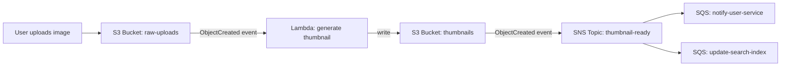
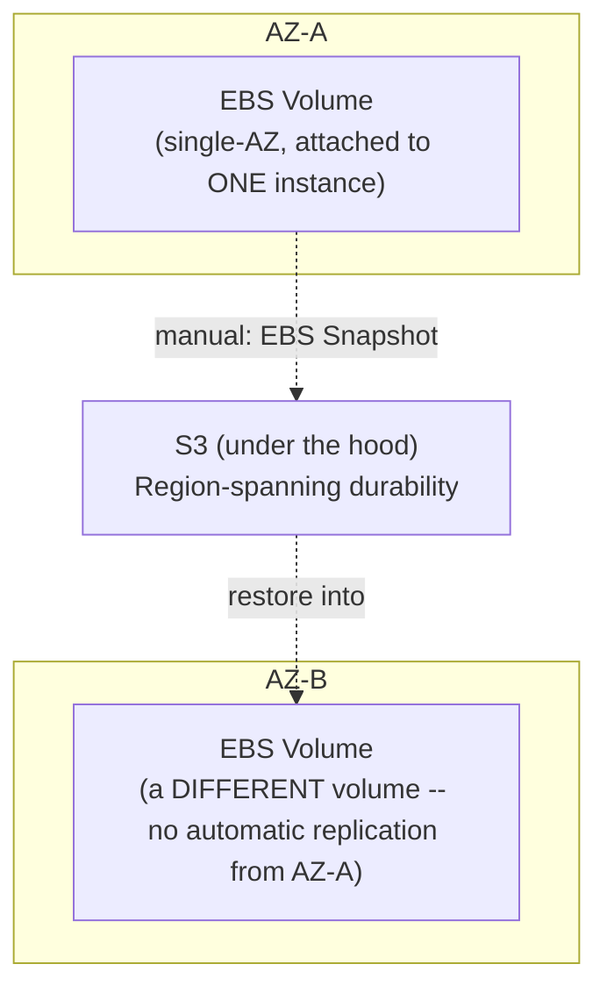
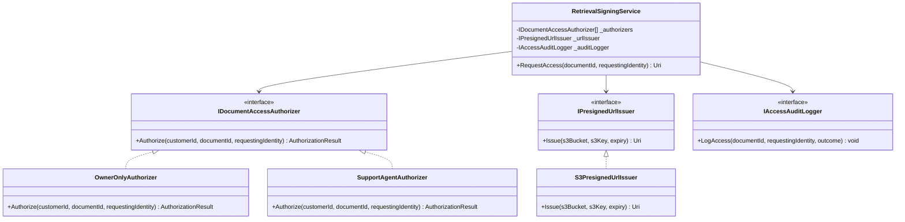
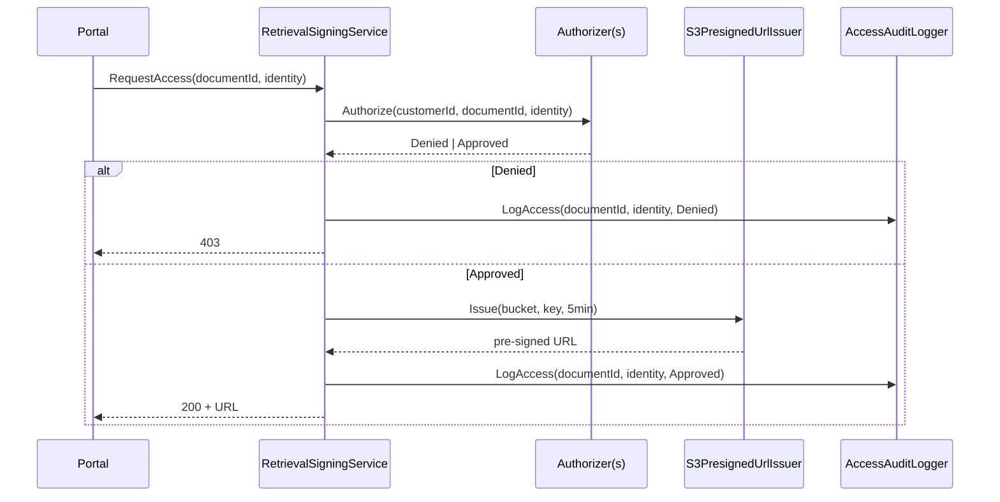

# Module 59 — AWS: Storage — S3 Storage Classes & Consistency, EBS, EFS & Durability Trade-offs

> Domain: AWS | Level: Beginner → Expert | Prerequisite: [[02-IAM-Security-KMS-SecretsManager]], (KMS encryption and resource-based bucket policies apply directly to S3), [[../18-Event-Driven-Architecture/01-EDA-Fundamentals-Choreography-vs-Orchestration]] (S3 event notifications are a concrete pub/sub mechanism)

---

## 1. Fundamentals

### Why does a Principal Engineer need storage depth beyond "S3 is a bucket, EBS is a disk"?
Storage is where durability and availability guarantees are actually made or broken — every other layer this course has covered (compute, networking, IAM) can be flawlessly designed while the underlying storage choice silently fails to meet the workload's actual durability requirement (an EBS volume pinned to a single AZ backing a "highly available" service, or object storage used for a workload that actually needs POSIX file-locking semantics) — a Principal Engineer must be able to map a workload's actual access pattern and durability/availability requirement to the correct storage service and configuration, not default to "S3 for everything" or "attach an EBS volume" without justification.

### Why does this matter?
Because storage decisions are often the hardest to reverse of any infrastructure choice this course has covered (the "hard to reverse" category applies acutely here) — migrating from the wrong storage service after a workload is live and has accumulated data is a substantially riskier and more expensive undertaking than choosing correctly at design time, and a Principal Engineer is expected to have internalized the specific trade-offs (durability numbers, consistency model, access pattern fit) well enough to make that choice correctly the first time.

### When does this matter?
Any time an application needs to persist data beyond a single process's memory or a single request's lifetime — which, for anything beyond the most trivial stateless service, is effectively every production workload; and specifically whenever choosing between object storage (S3), block storage (EBS), and file storage (EFS) for a given component.

### How does it work (30,000-ft view)?
```
S3: object storage -- durable, effectively infinitely scalable, accessed via HTTP API (not a
 filesystem), strongly consistent since Dec 2020, ideal for unstructured data/blobs/backups
EBS: block storage -- a virtual disk attached to EXACTLY ONE EC2 instance at a time (per AZ),
 ideal for a database's data files or anything needing low-latency, POSIX block-device access
EFS: file storage -- a shared, POSIX-compliant filesystem mountable by MANY EC2 instances
 simultaneously across multiple AZs, ideal for shared file access across a fleet
```

---

## 2. Deep Dive

### 2.1 S3 — Object Storage, Durability, and the Consistency Model
S3 stores objects (arbitrary binary blobs, from a few bytes to terabytes) within buckets, addressed by key, with **11 nines (99.999999999%) of annual durability** for a given object — achieved by redundantly storing every object across multiple devices spanning multiple Availability Zones within a Region automatically, meaning S3's durability guarantee is structurally an inherent property of the service, not something the workload needs to separately engineer (a sharp contrast to the EBS, where multi-AZ durability requires deliberate, explicit replication design). Since December 2020, S3 provides **strong read-after-write consistency** for all operations (a write is immediately visible to any subsequent read, including overwrites and deletes) — this closed a historically significant gap (S3 was previously only *eventually* consistent for overwrite/delete operations), and a Principal Engineer with older AWS experience should explicitly update any mental model or documentation still describing S3 as eventually consistent, since designing unnecessary application-level workarounds for a consistency gap that no longer exists is itself a real, observed anti-pattern in older codebases.

### 2.2 EBS — Block Storage, AZ-Pinning, and Snapshot-Based Durability
An EBS volume is a virtual block device attached to exactly one EC2 instance at a time, and — critically, unlike S3 — an EBS volume exists **within a single specific Availability Zone** and cannot be directly attached to an instance in a different AZ; its durability comes from within-AZ replication (protecting against a single underlying disk failure) but **does not** protect against an entire AZ becoming unavailable, meaning EBS's durability characteristics are AZ-scoped, not Region-scoped like S3's. Cross-AZ (and cross-Region) durability for EBS-backed data requires deliberately taking **EBS Snapshots** (incremental, stored in S3 under the hood, and therefore inheriting S3's Region-spanning durability) — a workload relying solely on a single EBS volume's own replication, with no snapshot strategy, has implicitly accepted single-AZ data-durability risk, directly echoing the single-AZ compute risk but now at the data-persistence layer, which is a substantially higher-stakes place for that same risk to go unnoticed.

### 2.3 EFS — Shared, Elastic File Storage Across a Fleet
EFS provides a POSIX-compliant, NFS-accessible filesystem that can be mounted concurrently by many EC2 instances (or Lambda functions, or containers) across multiple AZs simultaneously — the key differentiator from both S3 (which has no filesystem semantics — no directory locking, no POSIX file permissions in the traditional sense, no partial-file in-place writes) and EBS (which is fundamentally single-instance-attached) is that EFS is the correct choice specifically when multiple compute instances genuinely need **concurrent, shared, filesystem-semantic access to the same data** (a shared configuration directory, a content-management system's shared media library actively written to by multiple app servers) — using EFS when S3 would suffice introduces unnecessary cost and complexity, but using S3 for a workload that genuinely needs POSIX file-locking or in-place partial-file writes is a functional mismatch, not just a suboptimal choice.

### 2.4 S3 Storage Classes — Matching Cost to Actual Access Pattern
S3 offers multiple storage classes with identical underlying 11-nines durability but different availability SLAs, retrieval latency, and cost structures: **S3 Standard** (frequent access, millisecond retrieval), **S3 Infrequent Access (IA)** (lower per-GB storage cost, higher per-retrieval cost, millisecond retrieval — for data accessed less than monthly), **S3 Glacier** tiers (substantially lower storage cost, but retrieval takes minutes to hours depending on the specific Glacier tier chosen, for genuine archival data) — **S3 Intelligent-Tiering** automatically moves objects between access tiers based on observed access patterns, removing the need to manually predict and configure the correct tier upfront. The core discipline is matching the storage class to the *actual*, *honest* access pattern — a common, costly mistake is defaulting everything to S3 Standard indefinitely regardless of how infrequently it's actually accessed, silently overpaying at scale for storage that could be correctly reclassified with zero functional impact.

### 2.5 S3 Event Notifications — Object Storage as an Event Source
S3 can emit an event notification (to SQS, SNS, EventBridge, or directly invoke a Lambda function) whenever an object is created, deleted, or restored — this is a direct, concrete implementation of the event-driven architecture principles at the storage layer: rather than a separate service needing to poll S3 to detect new objects, S3 itself becomes an event **producer** in a choreography-style pipeline — for example, an image-upload-to-S3 triggering a Lambda function that generates thumbnails, which in turn emits its own completion event. This pattern directly extends this course's EDA material (Modules 52-56) into a genuinely AWS-native mechanism, and is frequently the correct default over building custom polling logic to detect new files.

### 2.6 EBS Volume Types and Provisioned IOPS — Matching Performance to Workload
EBS offers multiple volume types trading cost against IOPS/throughput characteristics: **gp3** (general-purpose SSD, baseline performance with independently-configurable IOPS/throughput, the correct default for most workloads), **io2/io2 Block Express** (provisioned IOPS SSD, for latency-sensitive, high-IOPS workloads like a transactional database under heavy load), and **st1/sc1** (throughput-optimized/cold HDD, for large, sequential-access, infrequently-accessed workloads like log processing or backups) — choosing the wrong volume type for a workload's actual I/O pattern (e.g., a cold-HDD-tier volume backing a latency-sensitive OLTP database) manifests as a real, measurable performance ceiling, not a subtle theoretical gap, and is a recurring, concrete Principal-Engineer-level diagnostic question: "is the observed latency problem actually a compute/query problem, or is it an EBS volume-type mismatch?"

---

## 3. Visual Architecture

### S3 as an Event-Driven Pipeline Trigger

```mermaid
graph LR
 Upload[User uploads image] --> S3[S3 Bucket: raw-uploads]
 S3 -->|"ObjectCreated event"| Lambda[Lambda: generate thumbnail]
 Lambda -->|write| S3Thumb[S3 Bucket: thumbnails]
 S3Thumb -->|"ObjectCreated event"| SNS[SNS Topic: thumbnail-ready]
 SNS --> SQS1[SQS: notify-user-service]
 SNS --> SQS2[SQS: update-search-index]
```

### EBS AZ-Pinning vs. S3 Region-Spanning Durability

```mermaid
graph TB
 subgraph "AZ-A"
 EBS["EBS Volume<br/>(single-AZ, attached to ONE instance)"]
 end
 subgraph "AZ-B"
 EBS2["EBS Volume<br/>(a DIFFERENT volume -- no automatic replication from AZ-A)"]
 end
 EBS -.->|"manual: EBS Snapshot"| S3Snap["S3 (under the hood)<br/>Region-spanning durability"]
 S3Snap -.->|"restore into"| EBS2
```

## 4. Production Example
**Scenario**: A media-processing platform stored user-uploaded video files directly on an EBS volume attached to a single "processing" EC2 instance (chosen originally because the processing pipeline needed fast, low-latency local file access during transcoding), with the assumption — never explicitly validated — that the nightly EBS Snapshot schedule provided adequate durability, and no separate copy of the raw uploaded files existed anywhere else. During a routine AZ maintenance event that AWS scheduled with advance notice, the team performed an instance restart as part of standard patching, and — due to an unrelated EBS subsystem issue affecting that specific AZ during the maintenance window — a volume experienced a rare failure and had to be restored from its most recent snapshot, which was **19 hours old** at the time of failure. **Investigation**: video files uploaded within that 19-hour window (a meaningful volume, given the platform's usage pattern) were permanently lost — the EBS volume was in fact appropriately durable in the *typical* case (11-nines-equivalent within-AZ durability), but the team's actual durability posture was bounded not by EBS's own reliability, but by the nightly snapshot cadence, a detail no one had explicitly reasoned through when the original architecture was designed under time pressure to "get transcoding working fast." **Root cause**: conflating "EBS is durable" (true, within its AZ-scoped design) with "our data is durable regardless of snapshot frequency" (false) — directly the pattern of independently-configured settings creating a false sense of a guarantee neither setting alone actually provides: EBS's own durability and the snapshot schedule's recency are two genuinely separate parameters, and the team's actual data-loss exposure window was determined by the *weaker* of the two, not the stronger. **Fix**: redesigned the upload pipeline so the original, authoritative copy of every uploaded file lands directly in S3 first (inheriting S3's Region-spanning, snapshot-independent 11-nines durability immediately upon upload), with the EBS-backed processing instance treated as a disposable, replaceable **working copy** downloaded from S3 for transcoding — the EBS volume's own durability/snapshot cadence becomes irrelevant to data-loss risk, since S3 is now the system of record. **Lesson**: this is the general principle of choosing which storage tier holds the **authoritative** copy of data versus which tier holds a disposable **working** copy — a decision that should be made deliberately and explicitly during initial design, not an implicit byproduct of "wherever it was easiest to get the pipeline initially working."
## 10. Interview Questions

### Basic (10)
1. **Q: What is the fundamental difference between S3, EBS, and EFS?** **A:** S3 is object storage accessed via HTTP API with no filesystem semantics; EBS is block storage attached to exactly one EC2 instance at a time within a single AZ; EFS is a shared, POSIX-compliant filesystem mountable by many instances across multiple AZs simultaneously.
2. **Q: What is S3's durability guarantee?** **A:** 11 nines (99.999999999%) annual durability per object, achieved via automatic redundant storage across multiple AZs within a Region.
3. **Q: Is S3 eventually consistent or strongly consistent?** **A:** Strongly consistent for all operations (including overwrites and deletes) since December 2020.
4. **Q: Why is an EBS volume's durability considered AZ-scoped rather than Region-scoped?** **A:** An EBS volume exists within a single specific Availability Zone and its replication protects against a single disk failure, not an entire AZ becoming unavailable.
5. **Q: How does an EBS volume achieve Region-spanning durability?** **A:** Via EBS Snapshots, which are stored in S3 under the hood and therefore inherit S3's Region-spanning durability.
6. **Q: When is EFS the correct storage choice over S3?** **A:** When multiple compute instances need concurrent, POSIX-semantic (filesystem-level) shared access to the same data — file locking, in-place partial writes, directory structures.
7. **Q: What does S3 Intelligent-Tiering do?** **A:** Automatically moves objects between access tiers based on observed access patterns, removing the need to manually predict and configure the correct storage class upfront.
8. **Q: What is an S3 event notification?** **A:** An event S3 can emit (to SQS, SNS, EventBridge, or Lambda) whenever an object is created, deleted, or restored, making S3 itself an event producer.
9. **Q: What is the difference between gp3 and io2 EBS volume types?** **A:** gp3 is general-purpose SSD with independently-configurable baseline IOPS/throughput; io2 is provisioned IOPS SSD for latency-sensitive, high-IOPS workloads.
10. **Q: What does S3 Block Public Access do?** **A:** A blanket account/bucket-level override that prevents public access regardless of any individual bucket policy or ACL misconfiguration.

### Intermediate (10)
1. **Q: Why can "our data is on EBS, which is highly durable" still leave a workload with a meaningful data-loss exposure window?** **A:** EBS's own high durability is scoped to protecting against a single-disk failure within its AZ; the actual Region-spanning, AZ-failure-resilient durability comes only from snapshots, so the real exposure window is bounded by snapshot recency, not EBS's own reliability.
2. **Q: Why is treating S3 as the authoritative data store and EBS as a disposable working copy (the fix) a generally sound default architecture?** **A:** It offloads the durability/replication burden onto a service (S3) engineered for Region-spanning 11-nines durability automatically, while using EBS only for its genuine strength (low-latency local block access) without depending on it for long-term data safety.
3. **Q: Why might an organization still be building unnecessary eventual-consistency workarounds for S3 today, and why is this a real anti-pattern?** **A:** Older AWS documentation, tutorials, or team institutional knowledge predating December 2020 described S3 as eventually consistent for overwrites/deletes; carrying that outdated model forward into new designs adds unnecessary application-level complexity (retry-and-reconcile logic) for a consistency gap that no longer exists.
4. **Q: Why does defaulting all S3 objects to S3 Standard indefinitely represent a real, quantifiable cost mistake rather than just a minor inefficiency?** **A:** S3 IA and Glacier tiers offer substantially lower per-GB storage cost for infrequently-accessed data with identical underlying durability; at meaningful data volumes, failing to reclassify rarely-accessed objects compounds into materially higher storage spend with zero functional benefit.
5. **Q: Why is EBS volume-type selection a legitimate first diagnostic hypothesis for an unexplained database latency problem?** **A:** A volume type mismatched to the workload's actual I/O pattern (e.g., cold-HDD-tier backing a random-I/O OLTP workload) imposes a real, measurable throughput/IOPS ceiling independent of query design or compute sizing — ruling this out (or in) early avoids misdirected investigation into application-level causes.
6. **Q: Why must both a workload's provisioned EBS IOPS/throughput and its EC2 instance type's own EBS bandwidth limit be checked together when diagnosing a storage performance ceiling?** **A:** They are independently-configured capacity dimensions — a well-provisioned volume attached to an instance type with an inadequate EBS-optimized bandwidth ceiling (or vice versa) will still hit a real performance ceiling, since satisfying one limit doesn't guarantee the other is also sufficient.
7. **Q: Why is S3's event-notification capability a meaningfully different architecture than a separate service polling S3 for new objects?** **A:** S3 becomes a genuine event producer in a choreography-style pipeline, eliminating polling latency/overhead and the operational burden of building and maintaining custom polling logic, directly leveraging the EDA principles from Modules 52-56 at the storage layer.
8. **Q: Why should EBS volume encryption be enabled at creation time rather than as a later remediation?** **A:** Encrypting an existing unencrypted volume isn't an in-place operation — it requires creating a new encrypted volume and migrating data onto it, making "enable by default at creation" substantially cheaper and lower-risk than remediating an already-provisioned unencrypted fleet later.
9. **Q: Why does EFS's default "Bursting" throughput mode create a scalability risk that S3 generally does not present?** **A:** Bursting throughput is tied to the filesystem's total stored size, meaning a smaller but genuinely high-throughput workload can hit a real throughput ceiling that has nothing to do with request volume or data importance, unlike S3's essentially limitless, account-level-ceiling-free scaling.
10. **Q: Why is S3 Block Public Access described as analogous to the Service Control Policy pattern?** **A:** Both provide a genuinely non-bypassable override that prevents a specific class of misconfiguration (public S3 exposure; overly-permissive IAM policy) regardless of what any individual, more-permissive policy at a lower level might otherwise allow.

### Advanced (10)
1. **Q: Diagnose the incident from first principles, and design the specific pre-production architecture review question that would have caught the durability gap before the AZ maintenance event exposed it.**
 **A:** Root cause: the team implicitly treated "EBS is durable" and "our data is durable" as equivalent, without explicitly identifying which specific mechanism (EBS's own within-AZ replication, versus the nightly snapshot) actually bounded their real data-loss exposure window, and never explicitly computed that window's size. Safeguard: a standing architecture-review question — "for this data, what is our actual maximum data-loss window if the primary storage tier fails right now, and does that number match our actual business tolerance?" — forces an explicit computation (here, up to 24 hours given nightly snapshots) rather than an implicit assumption of "EBS is durable, so we're fine," directly surfacing the gap during design rather than during an actual failure.
2. **Q: A team argues that since S3 achieved strong read-after-write consistency in 2020, they no longer need to think carefully about consistency at all when using S3 in a multi-writer, multi-reader pipeline. Evaluate this claim as a Principal Engineer.**
 **A:** Push back — strong consistency for *individual object reads/writes* (a `GetObject` immediately reflecting the latest `PutObject`) is a real and valuable guarantee, but it does not provide cross-object or cross-operation atomicity: a pipeline reading multiple related objects (e.g., a manifest file plus the objects it references) can still observe a manifest updated to reference a new object before that object's own write has been initiated by a separate writer, if the writes aren't sequenced/coordinated at the application level — S3's consistency guarantee is per-object, not a substitute for application-level coordination across logically related writes, directly the distributed-consistency-model discussion (know precisely what guarantee you actually have, not the guarantee's name).
3. **Q: Design the specific migration strategy for moving an existing production workload's authoritative data from a single-AZ EBS volume (as in the original architecture) to an S3-authoritative model, without downtime and without a data-loss window during the migration itself.**
 **A:** Directly apply the Strangler Fig philosophy at the storage layer: (1) modify the write path to dual-write every new object to both the existing EBS volume and S3 simultaneously, verifying successful S3 writes before considering a write complete; (2) run a backfill job copying all existing historical EBS-resident data into S3, verified via checksum comparison; (3) once backfill is confirmed complete and dual-writes have been running successfully for a validated period, switch the read path to source from S3 as authoritative; (4) only then decommission the EBS volume's role as authoritative storage (retaining it, if still useful, purely as a disposable local working-copy cache) — each step is independently verifiable and reversible, avoiding a risky, irreversible all-at-once cutover.
4. **Q: Explain why "S3 storage class is just a cost-optimization knob with no functional impact" is an incomplete characterization, and identify the functional dimension it omits.**
 **A:** Storage class also affects **retrieval latency and availability SLA**, not just cost — Glacier-tier objects require an explicit, minutes-to-hours restore operation before they're readable at all (unlike S3 Standard/IA's millisecond retrieval), meaning a workload that might need ad hoc, low-latency access to archived data (not just scheduled batch access) choosing Glacier purely for cost savings has introduced a genuine functional constraint, not merely a cost trade-off — the storage-class decision must weigh actual required retrieval latency alongside cost, not cost alone.
5. **Q: A workload's EFS filesystem is experiencing throughput-related performance degradation despite low total stored data size. Diagnose the likely cause and the remediation options.**
 **A:** Likely cause: default Bursting throughput mode ties available throughput to total filesystem size — a small filesystem has a correspondingly small baseline throughput allocation regardless of how much *read/write activity* the workload actually generates, meaning "the data is small" doesn't imply "the throughput need is small." Remediation: switch to Provisioned Throughput mode (explicitly paying for a specific throughput level independent of stored size) or Elastic Throughput mode (automatically scales with actual instantaneous demand) — the correct choice depends on whether the workload's throughput need is predictable/steady (favoring Provisioned, for cost predictability) or genuinely variable (favoring Elastic).
6. **Q: Critique the following claim: "Since we enabled S3 Block Public Access at the account level, we no longer need to review individual bucket policies for overly permissive access."**
 **A:** Incomplete — S3 Block Public Access specifically prevents *public* (unauthenticated, internet-wide) access; it does not prevent an overly-broad bucket policy or IAM policy that grants access to, say, every authenticated AWS principal in the account, or to an unintended cross-account principal, or an overly-broad IAM role (the exact pattern) that happens to include S3 permissions — Block Public Access closes one specific, severe exposure category, but doesn't substitute for the broader least-privilege policy review discipline established.
7. **Q: Design an approach for validating that an organization's EBS Snapshot schedule actually satisfies each workload's real business-driven Recovery Point Objective (RPO), rather than relying on a uniform, default snapshot cadence applied without differentiation.**
 **A:** Classify workloads by their actual, documented RPO requirement (a workload where losing up to 24 hours of data is genuinely acceptable versus one requiring near-zero data loss), and explicitly configure snapshot frequency (or, for near-zero-RPO workloads, augment or replace snapshot-based durability with continuous replication to a different AZ/Region, or with the-style S3-authoritative pattern) per workload's actual requirement rather than a single default schedule applied uniformly — directly extending Advanced Q1's "explicitly compute and compare against actual tolerance" discipline into a standing, per-workload classification and review practice.
8. **Q: A team proposes storing session state for a horizontally-scaled web application on EFS, reasoning that "it's shared storage accessible from every instance, so it solves our session-affinity problem." Evaluate this design as a Principal Engineer.**
 **A:** Functionally workable but likely a poor fit relative to alternatives — EFS introduces real network-filesystem latency per read/write (materially higher than an in-memory or purpose-built session store like Redis/DynamoDB, both already covered in this course's data-layer modules) for a workload (session state) that's typically small, high-frequency, and latency-sensitive; EFS's genuine strength is POSIX filesystem semantics for larger, less latency-sensitive shared data — a Principal Engineer should redirect this design toward Redis or DynamoDB, both purpose-built for exactly this access pattern, reserving EFS for workloads that actually need filesystem semantics.
9. **Q: Explain why the choice of which storage tier holds the "authoritative" copy of data versus a "working" copy (the core lesson) generalizes beyond the specific S3-vs-EBS scenario, and give one other concrete example from elsewhere in this course where the same distinction applies.**
 **A:** The general principle: any system with multiple storage/cache layers must have an explicit, deliberate answer to "which layer is the source of truth if all others are lost or become inconsistent," since an implicit answer (whichever layer was easiest to write to first) tends to default to the layer with the weakest actual durability guarantee. A concrete parallel:/26's Redis caching-pattern discussion — a cache-aside pattern explicitly treats Redis as a disposable, reconstructable working copy with the backing database as authoritative, the same distinction establishes between EBS (working copy) and S3 (authoritative).
10. **Q: As a Principal Engineer establishing storage standards for an organization, design the specific set of standing architectural reviews and automated checks (synthesizing this entire module) you would require for every new workload's storage design.**
 **A:** (1) Mandatory explicit RPO computation and snapshot-cadence validation for any EBS-authoritative data (Advanced Q7) — necessary because the actual data-loss exposure window is otherwise an implicit, unverified assumption. (2) Mandatory S3 Block Public Access enabled by default on every bucket, with an explicit, reviewed exception process for genuinely public buckets — necessary as a non-bypassable baseline regardless of individual bucket-policy correctness. (3) Mandatory storage-class review (or Intelligent-Tiering enablement) for any S3 workload with non-trivial data volume — necessary because storage-class drift toward unnecessary Standard-tier cost is easy to overlook and compounds at scale. (4) Mandatory justification review for any new EFS adoption, confirming a genuine POSIX-shared-access requirement rather than a default "shared storage" choice (Advanced Q8) — necessary because EFS is frequently reached for by default when a purpose-built alternative (S3, Redis, DynamoDB) fits the actual access pattern better and cheaper. Each standard targets a distinct, concrete failure or cost-inefficiency mode this module identified, directly extending the governance-gate pattern established in Modules 57-58 into the storage layer specifically.

### Expert (10)
1. **Q: A settlement-processing platform's EOD batch job writes several thousand files to S3 under a strictly sequential key prefix (`settlements/{date}/{sequence}`) within a two-minute burst window, and intermittently sees `503 SlowDown` responses only during that window. Diagnose and fix.**
 **A:** S3's automatic key-space partitioning reacts to *sustained* request-rate growth over minutes; a sudden, sharp burst against a monotonically sequential prefix can outrun that reactive scaling before the prefix has been split, producing throttling even though the bucket would sustain the same steady-state rate comfortably. Fix: add high-cardinality entropy early in the key (a hash prefix or reversed timestamp) so the burst is distributed across partitions from the first request, or pre-ramp synthetic traffic against the prefix minutes ahead of the real burst so partitioning has already reacted by the time real traffic arrives — the entropy-prefix fix is more robust since it removes the dependency on reactive scaling entirely.
2. **Q: A transactional database on RDS backed by a gp3 EBS volume provisioned at 12,000 IOPS is still hitting a measurable I/O ceiling under load. `VolumeQueueLength` is climbing but `VolumeWriteOps` plateaus well below 12,000. What is the likely cause, and how do you confirm it?**
 **A:** The likely cause is the EC2/RDS instance's own EBS-optimized bandwidth ceiling — a separate, per-instance-type limit independent of the volume's own provisioned IOPS — throttling the effective I/O rate below what the volume itself could sustain. Confirm by comparing the instance type's published EBS-optimized IOPS/throughput limit against the observed plateau; if the plateau matches the instance ceiling rather than the volume's provisioned ceiling, the fix is a larger instance type (more EBS bandwidth), not more provisioned volume IOPS, which would be spending money on a ceiling that isn't the actual constraint.
3. **Q: Design the S3 key and encryption strategy for a bucket storing customer trade confirmations, given regulatory requirements for both auditable key control and enforceable encryption-in-transit.**
 **A:** SSE-KMS with a customer-managed key (not SSE-S3's AWS-managed key) for auditable rotation and CloudTrail-visible key usage; a bucket policy denying any `PutObject` lacking the expected `x-amz-server-side-encryption` header (closing the gap where default bucket encryption alone doesn't stop an explicit no-encryption request); a separate bucket policy statement denying any request where `aws:SecureTransport` is false, enforcing TLS; and key naming scoped by customer/account ID as a prefix, paired with IAM `s3:prefix`-scoped policies, so per-customer access can be enforced and audited without relying purely on application-layer authorization.
4. **Q: A multi-region custody platform uses S3 Cross-Region Replication so that a EU-resident and US-resident copy of every trade confirmation exist. A customer service rep in the EU, immediately after a US-region write completes, reads from the EU replica and doesn't find the new confirmation. Explain and propose a fix that doesn't abandon CRR.**
 **A:** CRR is asynchronous — the EU replica lags the US primary by a real, non-zero window, and the rep's read raced ahead of replication, the identical read-your-own-writes gap already established for RDS Read Replicas, now recurring at the storage-replication layer. Fix: for any read path with a genuine immediacy requirement (a rep pulling up a document moments after it was filed), route that specific read to the Region where the write actually occurred (or to the primary Region unconditionally) rather than to the nearest-replica Multi-Region Access Point default, reserving CRR's replica for reads with no such immediacy requirement — the same per-read-path consistency categorization discipline established for RDS applies verbatim here.
5. **Q: Critique the following design: "We use EBS Multi-Attach so our three reconciliation-worker instances can all read and write the same shared scratch volume without needing EFS."**
 **A:** Push back hard — EBS Multi-Attach provides no filesystem-level coordination whatsoever; it is a shared block device, and three instances writing to it without a cluster-aware filesystem or explicit application-level coordination will produce silent, uncoordinated overwrites and corruption, not merely suboptimal performance. Multi-Attach is a narrow tool for specialist clustered-database engines explicitly designed for shared-disk access, not a general "shared storage for a fleet" mechanism — EFS (genuine POSIX file-locking semantics) is almost always the correct fit for this exact stated requirement, and recommending Multi-Attach here is a functional-mismatch anti-pattern with a considerably sharper failure mode than the EFS-vs-S3 mismatch already established.
6. **Q: Design the specific access-isolation architecture for an EFS filesystem shared by five downstream reconciliation-reporting jobs across two different business units, where a security review has flagged that any job currently has filesystem-root access.**
 **A:** Provision one EFS Access Point per business unit (or per job, if isolation must be finer-grained), each with its own POSIX UID/GID and a root directory scoped to that unit's own path (`/reconciliation/unit-a/`), and update each job's IAM policy to permit `elasticfilesystem:ClientMount`/`ClientWrite` only via its specific access point ARN, not the filesystem root — this bounds each job's blast radius to its own directory tree even if the job's own credentials or container are compromised, and is a direct, storage-layer application of least-privilege scoping already established for IAM policy design generally.
7. **Q: Explain, with a concrete before/after cost estimate structure, why S3 Intelligent-Tiering is often preferable to a manually-authored lifecycle rule for a workload with genuinely unpredictable access patterns.**
 **A:** A manual lifecycle rule (e.g., transition to IA after 30 days) makes a static, upfront bet about future access patterns — correct for genuinely archival, monotonically-cooling data, but wrong (and costly, via IA's per-retrieval fee) for data whose access pattern is unpredictable or bursty (a document that goes cold for months, then is retrieved repeatedly during an audit). Intelligent-Tiering monitors actual per-object access and moves objects between tiers automatically based on observed behavior rather than a static prediction, at a small per-object monitoring fee — for unpredictable-access workloads, that monitoring fee is typically far cheaper than either overpaying Standard-tier storage indefinitely or incurring repeated IA retrieval fees on data that turned out to still be hot.
8. **Q: A team's EFS filesystem, provisioned in Bursting throughput mode and holding only a few GB of frequently-read reconciliation output, is intermittently throttled during peak batch-reporting hours despite CPU and network on the consuming EC2 instances being nowhere near saturated. Diagnose and fix.**
 **A:** Bursting mode's baseline throughput allowance is proportional to total filesystem *size*, not access frequency — a small filesystem has a small baseline allowance and a correspondingly small burst-credit balance, which is exhausted quickly under sustained multi-consumer read load regardless of how "important" or how frequently-needed that data actually is; CloudWatch's `PermittedThroughput` dropping to baseline while `DataReadIOBytes` stays elevated confirms this. Fix: switch to Provisioned Throughput (fixed cost, decoupled from size, if the load is predictable) or Elastic Throughput (auto-scaling, billed per GB transferred, if the load is genuinely variable) — sizing the filesystem larger purely to buy more baseline throughput headroom would work but wastes money paying for unneeded capacity just to unlock a throughput allowance.
9. **Q: As a Principal Engineer reviewing a proposed architecture where a new trading-desk platform's authoritative trade-blotter data will be stored directly on a single EBS volume with hourly snapshots as the sole durability mechanism, walk through your review and stated concerns.**
 **A:** Apply the module's central RPO-computation discipline explicitly: hourly snapshots mean the actual computed data-loss exposure window is up to one hour, and the review question is whether that number matches the business's actual tolerance for losing up to an hour of trade-blotter entries in a worst-case AZ event — for most trading contexts, an hour of lost trade records is not an acceptable RPO, regardless of EBS's own high within-AZ durability. Recommend the S3-authoritative pattern (write the authoritative trade-blotter event stream to S3 or a durable, Region-spanning event log first, treating any EBS-backed database as a derived, rebuildable read-optimized copy) or, if the workload's actual requirement is a genuine relational database rather than an event log, recommend RDS/Aurora Multi-AZ with continuous transaction-log-based point-in-time recovery instead of periodic EBS snapshots, since continuous replication closes the RPO gap that periodic snapshotting cannot.
10. **Q: Synthesize this module's storage-tier-selection, durability, and access-isolation material into a single standing pre-production checklist you would require for any new FinTech workload's storage design, and justify each item.**
 **A:** (1) Explicit RPO computation for any EBS-authoritative data, comparing actual snapshot/replication cadence against business tolerance — closes the exposure-window blind spot from the Production Example. (2) S3 Block Public Access enabled account-wide by default, with a reviewed exception process — the non-bypassable backstop against the single highest-severity S3 misconfiguration (§8.1). (3) Default bucket encryption plus a policy denying unencrypted `PutObject` and non-TLS requests for any bucket holding regulated data (§8.2) — closes the gap where default encryption alone doesn't stop an explicit bypass. (4) EFS Access Points required for any multi-tenant or multi-team shared filesystem, never filesystem-root access (§8.3) — bounds blast radius to least privilege. (5) Storage-class/Intelligent-Tiering review for any S3 workload with non-trivial volume, and volume-type/IOPS-vs-instance-bandwidth review for any EBS-backed transactional workload — closes the cost- and performance-ceiling blind spots from §§7.1-7.2. Each item targets a distinct, concrete failure or cost mode this module identified, extending the standing governance-gate pattern from Advanced Q10 into a single actionable checklist.

---

## 11. Coding Exercises

### Easy — S3 upload with explicit storage class
```csharp
var putRequest = new PutObjectRequest
{
    BucketName = "user-uploads",
        Key = $"uploads/{userId}/{fileName}",
        FilePath = localFilePath,
        StorageClass = S3StorageClass.Standard, // hot path: recently uploaded, frequently accessed
        ServerSideEncryptionMethod = ServerSideEncryptionMethod.AWSKMS,
        ServerSideEncryptionKeyManagementServiceKeyId = kmsKeyId // -- encryption at rest
};
await s3Client.PutObjectAsync(putRequest);
```

### Medium — Lifecycle rule transitioning storage class automatically
```json
{
  "Rules": [
    {
      "ID": "transition-old-uploads-to-ia-then-glacier",
        "Status": "Enabled",
        "Filter": { "Prefix": "uploads/" },
        "Transitions": [
        { "Days": 30, "StorageClass": "STANDARD_IA" },
        { "Days": 90, "StorageClass": "GLACIER" }
      ]
    }
  ]
}
```

### Hard — S3-authoritative upload with EBS as disposable working copy (the fix)
```csharp
public class VideoUploadPipeline
{
    public async Task<string> HandleUploadAsync(Stream videoStream, string fileName)
    {
        // 1. Authoritative copy lands in S3 FIRST -- inherits 11-nines, Region-spanning durability immediately.
        var s3Key = $"raw-uploads/{Guid.NewGuid}/{fileName}";
        await _s3Client.PutObjectAsync(new PutObjectRequest
            {
                BucketName = "raw-uploads-authoritative",
                    Key = s3Key,
                    InputStream = videoStream
        });

        // 2. Only AFTER the authoritative copy is durably stored, download a DISPOSABLE
        // working copy to local/EBS storage for low-latency transcoding.
        var localWorkingPath = Path.Combine("/mnt/ebs-scratch", fileName);
        await DownloadToLocalAsync(s3Key, localWorkingPath);

        // 3. If the transcoding instance or its EBS volume is lost mid-processing
        // the authoritative S3 copy is untouched -- simply re-run from step 2 on a new instance.
        return s3Key;
    }
}
```

### Expert — S3 event-driven pipeline with EventBridge fan-out (§Visual Architecture)
```json
{
  "source": ["aws.s3"],
    "detail-type": ["Object Created"],
    "detail": {
    "bucket": { "name": ["raw-uploads-authoritative"] }
  }
}
```
```csharp
[LambdaFunction]
public async Task HandleS3Event(EventBridgeEvent<S3ObjectCreatedDetail> evt)
{
    var bucket = evt.Detail.Bucket.Name;
    var key = evt.Detail.Object.Key;

    // Generate thumbnail -- writes to a SEPARATE bucket, which itself emits its own event (§Visual Architecture)
    var thumbnail = await GenerateThumbnailAsync(bucket, key);
    await _s3Client.PutObjectAsync(new PutObjectRequest
        {
            BucketName = "thumbnails",
                Key = key,
                InputStream = thumbnail
    });
    // No polling anywhere in this pipeline -- every stage is triggered purely by the
    // preceding stage's S3 write, directly the choreography pattern.
}
```
**Discussion**: chaining S3 buckets via event notifications (upload → thumbnail bucket → downstream notify/search-index consumers) builds a fully event-driven pipeline with no custom polling infrastructure anywhere — each stage's only responsibility is to correctly process its own input and write its own output, with S3 itself handling the "notify the next stage" responsibility natively, directly reusing the choreography-vs-orchestration trade-offs already established (this remains choreography — no central orchestrator — so the same debuggability trade-offs identified apply here too).

---

## 12. System Design

### Scenario: designing the document-retention platform for a regulated statements/confirmations pipeline

**Requirements.**
*Functional*: ingest customer-facing documents (trade confirmations, monthly statements, tax forms) generated by multiple internal producers; store them durably; serve low-latency retrieval to a customer-facing portal and to internal customer-service tooling; support a 7-year regulatory retention requirement with legal-hold override; support bulk regenerate/reprocess workflows.
*Non-functional*: 11-nines durability for the authoritative copy; sub-200ms P99 retrieval for portal reads; encryption at rest and in transit; full audit trail of every read and write; multi-region readability for a globally distributed customer base; cost-efficient at a growth trajectory of tens of millions of documents/year.

**Architecture.** Documents land in an S3 "raw" bucket (`docs-raw-{region}`) written by internal producers via a dedicated ingestion API (never direct producer-to-S3 writes, so every write passes through a single validation/audit chokepoint). An S3 event notification on `ObjectCreated` triggers a Lambda that (a) computes a checksum and writes a metadata row (document ID, customer ID, type, checksum, S3 key, retention-until date) into an Aurora PostgreSQL metadata store — deliberately relational, since retention/legal-hold queries need joins and transactional updates, not a key-value lookup — and (b) applies an S3 Object Lock (compliance mode) retention date derived from the regulatory requirement, making the object provably immutable and undeletable until that date even by an account administrator. The portal and customer-service tooling never query S3 directly; they query the Aurora metadata store for the S3 key, then fetch via a short-lived pre-signed URL, keeping S3 bucket policy narrow (deny-by-default, only the ingestion Lambda and a retrieval-signing service have direct S3 access) and every retrieval individually auditable at the signing-service layer rather than diffused across every possible S3 caller.

**Components glossary.** *Ingestion API*: the only authorized writer of new documents; validates producer identity and document schema before writing to S3. *docs-raw bucket*: S3 Standard, Object Lock enabled, SSE-KMS with a customer-managed key, versioning enabled (protects against accidental overwrite even before Object Lock's retention window is relevant). *Metadata store (Aurora PostgreSQL)*: the queryable system of record for "what documents exist, for which customer, until when must they be retained" — deliberately not derivable from S3 listing alone, since S3 has no native query-by-customer-ID capability at this data volume. *Retrieval-signing service*: the sole issuer of pre-signed URLs; logs every issuance (customer ID, document ID, requesting identity, timestamp) to a separate audit-log table, independent of S3's own access logs, so "who read this document" is answerable from one place without cross-referencing S3 access logs. *Lifecycle Lambda*: nightly job transitioning documents past their "infrequent access" threshold (§7's storage-class discipline) to IA, and — separately, and much more cautiously, requiring an explicit legal/compliance sign-off workflow, never an automatic transition — eventually to Glacier once retrieval-latency tolerance permits it.

**Data model (Aurora metadata table, abbreviated).**

| Column | Type | Description |
|---|---|---|
| document_id | UUID PK | Unique document identifier |
| customer_id | UUID, indexed | Owning customer |
| document_type | ENUM | trade_confirmation / statement / tax_form |
| s3_bucket | TEXT | Bucket holding the object |
| s3_key | TEXT | Object key |
| checksum_sha256 | TEXT | Integrity verification value |
| retention_until | DATE | Regulatory retention expiry; drives Object Lock retention date |
| legal_hold | BOOLEAN | Overrides retention_until when true — prevents deletion regardless of date |
| status | ENUM | `PENDING_LOCK` → `LOCKED` → `ELIGIBLE_FOR_TIER_DOWN` |
| created_at | TIMESTAMPTZ | Ingestion time |

**End-to-end walkthrough.**
1. Internal statement-generation service calls the Ingestion API with the rendered PDF and customer/document metadata.
2. Ingestion API validates the caller's identity (IAM role) and the document schema, then writes the object to `docs-raw-{region}` under a customer-ID-prefixed key.
3. The S3 write triggers an `ObjectCreated` event to EventBridge.
4. A Lambda consumes the event, computes and verifies the checksum, and writes the metadata row with `status = PENDING_LOCK`.
5. A second Lambda (decoupled, so a slow Object Lock API call never blocks metadata visibility) applies the S3 Object Lock retention date and flips `status = LOCKED`.
6. A customer opens the portal; the portal backend queries Aurora for the customer's document list (fast, indexed, relational).
7. On document open, the portal backend calls the retrieval-signing service, which checks authorization, logs the access, and returns a pre-signed URL with a 5-minute expiry.
8. The browser fetches the object directly from S3 using the pre-signed URL — full document bytes never transit the application tier, keeping latency low and application-tier bandwidth cost near zero.
9. Nightly, the Lifecycle Lambda scans for documents past the IA threshold and updates their storage class, updating `status` accordingly.

**Failure handling.** If the checksum Lambda fails, the metadata row stays `PENDING_LOCK` indefinitely and a CloudWatch alarm on stuck-`PENDING_LOCK` age pages on-call — an unlocked-but-present document is a compliance gap, not merely an operational one. If the retrieval-signing service is unavailable, the portal fails closed (no direct S3 fallback path exists by design, since that would bypass the audit chokepoint). Cross-region durability is provided by S3 CRR to a second region's `docs-raw` bucket, with the Aurora metadata store using Aurora Global Database for read-scaling in the secondary region — with the explicit caveat (§9.1) that cross-region reads accept CRR's replication lag and are never used for the "did this write succeed" confirmation path, which always reads the primary region.

**Monitoring.** `PENDING_LOCK` age (compliance-critical), pre-signed URL issuance rate and failure rate (retrieval-signing service health), S3 `4xxErrors`/`5xxErrors` on the raw bucket (should be near-zero given only two authorized callers), Object Lock application failure rate, CRR replication lag.

**Trade-offs.** Routing all reads through pre-signed URLs issued by a dedicated signing service (rather than allowing direct, long-lived IAM-authenticated S3 access from the portal) adds one hop and one more component to operate, in exchange for a single, complete, independently-auditable access log — for a regulated-document workload, that audit completeness is worth the added component; for a lower-stakes internal tool, direct IAM-authenticated access would be a reasonable simplification.

## 13. Low-Level Design

### Class design for the retrieval-signing service


```mermaid
classDiagram
    class IDocumentAccessAuthorizer {
        <<interface>>
        +Authorize(customerId, documentId, requestingIdentity) AuthorizationResult
    }
    class OwnerOnlyAuthorizer {
        +Authorize(customerId, documentId, requestingIdentity) AuthorizationResult
    }
    class SupportAgentAuthorizer {
        +Authorize(customerId, documentId, requestingIdentity) AuthorizationResult
    }
    class IPresignedUrlIssuer {
        <<interface>>
        +Issue(s3Bucket, s3Key, expiry) Uri
    }
    class S3PresignedUrlIssuer {
        +Issue(s3Bucket, s3Key, expiry) Uri
    }
    class IAccessAuditLogger {
        <<interface>>
        +LogAccess(documentId, requestingIdentity, outcome) void
    }
    class RetrievalSigningService {
        -IDocumentAccessAuthorizer[] _authorizers
        -IPresignedUrlIssuer _urlIssuer
        -IAccessAuditLogger _auditLogger
        +RequestAccess(documentId, requestingIdentity) Uri
    }
    IDocumentAccessAuthorizer <|.. OwnerOnlyAuthorizer
    IDocumentAccessAuthorizer <|.. SupportAgentAuthorizer
    IPresignedUrlIssuer <|.. S3PresignedUrlIssuer
    RetrievalSigningService --> IDocumentAccessAuthorizer
    RetrievalSigningService --> IPresignedUrlIssuer
    RetrievalSigningService --> IAccessAuditLogger
```

### Sequence diagram — access request


```mermaid
sequenceDiagram
    participant Portal
    participant Service as RetrievalSigningService
    participant Auth as Authorizer(s)
    participant S3 as S3PresignedUrlIssuer
    participant Audit as AccessAuditLogger
    Portal->>Service: RequestAccess(documentId, identity)
    Service->>Auth: Authorize(customerId, documentId, identity)
    Auth-->>Service: Denied | Approved
    alt Denied
        Service->>Audit: LogAccess(documentId, identity, Denied)
        Service-->>Portal: 403
    else Approved
        Service->>S3: Issue(bucket, key, 5min)
        S3-->>Service: pre-signed URL
        Service->>Audit: LogAccess(documentId, identity, Approved)
        Service-->>Portal: 200 + URL
    end
```

**Design patterns used.** *Strategy* — `IDocumentAccessAuthorizer` allows plugging in distinct authorization rules (customer-owner access, support-agent access with elevated logging, a future auditor-read-only rule) without modifying `RetrievalSigningService`. *Chain of Responsibility* (implicit in `_authorizers` being evaluated in order, first-approval-wins with a default-deny fallthrough) — keeps each authorizer focused on one access-grant scenario. *Adapter* — `S3PresignedUrlIssuer` isolates the AWS SDK surface behind `IPresignedUrlIssuer`, so the URL-issuance mechanism could be swapped (e.g., to CloudFront signed URLs) without touching the authorization or audit logic.

**SOLID mapping.** *SRP*: authorization, URL issuance, and audit logging are three separate interfaces/classes, each with one reason to change. *OCP*: a new authorizer (e.g., a regulator's read-only access rule) is added as a new `IDocumentAccessAuthorizer` implementation, not a modification to `RetrievalSigningService`. *LSP*: any `IDocumentAccessAuthorizer` implementation is substitutable — the service never inspects concrete authorizer types. *ISP*: the three interfaces are each narrow and single-purpose rather than one bloated `IDocumentAccessGateway`. *DIP*: `RetrievalSigningService` depends only on the three abstractions, with concrete AWS/DB implementations injected — critical for unit-testing authorization logic without a live S3/Aurora dependency.

**Extensibility.** Adding a new document type or a new caller class (e.g., a regulator's bulk-export tool) requires only a new authorizer implementation and, if needed, a distinct audit-log outcome category — no change to the core request-handling flow.

**Concurrency/thread safety.** The service itself is stateless per request (no shared mutable state across concurrent `RequestAccess` calls), so horizontal scaling is trivial. The one genuine concurrency concern is the audit-log write: it must be durable and ordered per document (so "who accessed this, in what sequence" is reconstructable), which argues for an append-only audit table with a database-generated sequence/timestamp column rather than an application-generated timestamp that could race under high concurrency across multiple service instances.

## 14. Production Debugging

**Incident: intermittent `AccessDenied` errors on trade-confirmation retrieval, customer-facing, appearing only for a specific subset of documents.**

**Investigation.** Customer-service escalations reported that a small, seemingly random subset of trade confirmations returned `AccessDenied` when customers clicked "view" in the portal, while the vast majority of documents for the same customers loaded fine. Pre-signed URL issuance in the signing-service logs showed successful issuance (200) for every one of the affected requests — the failure was happening on the actual S3 fetch, after a valid pre-signed URL had already been handed to the browser. Comparing S3 access logs for a failing key against a succeeding key from the same customer showed the failing objects all carried an `SSE-KMS` header referencing a **customer-managed KMS key from a specific key rotation batch**, while succeeding objects referenced either the current key or an older, still-permissioned key.

**Root cause.** A key-rotation runbook, executed the previous week, had created new KMS key versions and updated the bucket's default-encryption configuration to the new key — correct for all *new* writes — but the runbook's IAM cleanup step had also revoked the retrieval-signing service's `kms:Decrypt` grant on the **previous** key version, on the (incorrect) assumption that S3-managed key rotation meant old objects would be transparently re-encrypted under the new key. In reality, S3 does not retroactively re-encrypt existing objects on a KMS key rotation — an object written under key version N stays encrypted under key version N indefinitely unless explicitly rewritten — so every document written before the rotation, whose pre-signed URL request now required decrypting with the *old* key version, failed the moment the old key's decrypt grant was revoked, while newly-written documents (encrypted under the new key) worked fine.

**Tools.** S3 server access logs (isolated the failure to specific keys), CloudTrail (surfaced the `kms:Decrypt` `AccessDenied` events with the specific key ARN and version), the retrieval-signing service's own audit log (confirmed the 200-then-fail split between issuance and fetch), and a scripted correlation of failing keys against their `x-amz-server-side-encryption-aws-kms-key-id` metadata to confirm the pattern was 100% correlated with the specific rotated key version.

**Fix.** Restored the `kms:Decrypt` grant on the previous key version for the retrieval-signing service's IAM role immediately (stopping the customer-facing errors within minutes), then ran a background re-encryption job (S3 batch `CopyObject` in place, specifying the current KMS key) to migrate all pre-rotation objects onto the current key version over the following week, after which the old key's grant could be safely retired.

**Prevention.** The key-rotation runbook was updated to explicitly state, and require sign-off on, the fact that KMS key rotation does **not** retroactively re-encrypt existing S3 objects, and that any IAM grant revocation for a rotated-out key version must be preceded by a completed re-encryption pass, not assumed safe based on the rotation having occurred. A synthetic canary was added that periodically requests a pre-signed URL for a deliberately old, pre-rotation test object and fetches it end-to-end, specifically to catch this exact class of "new writes work, old objects silently break" gap before a customer does.

## 15. Architecture Decision

**Decision: how should the document-retention platform serve retrieval traffic to the customer portal — direct S3 pre-signed URLs (as designed above), CloudFront in front of S3, or proxying document bytes through the application tier?**

**Option A — Direct S3 pre-signed URLs (chosen).** *Advantages*: simplest infrastructure, no additional caching layer to invalidate or reason about for documents that must never be served stale post-legal-hold, application tier never touches document bytes (low bandwidth cost, no memory pressure from large PDF streaming). *Disadvantages*: every retrieval is a full round-trip to S3 with no edge caching, so a customer far from the bucket's Region sees full inter-Region-adjacent latency; no built-in WAF-style edge inspection of the retrieval path itself (though the signing service's authorization step substitutes for this). *Cost*: lowest — no additional service tier. *Complexity*: lowest. *Scalability*: effectively unbounded, since S3 itself absorbs the read load.

**Option B — CloudFront in front of S3, with signed CloudFront URLs.** *Advantages*: edge caching improves latency for repeat views of the same document from the same or nearby customers, WAF attaches natively at the edge, origin failover groups possible. *Disadvantages*: caching a regulated, legal-hold-sensitive document at the edge introduces a real invalidation-correctness risk — a document placed under legal hold or corrected/reissued after initial publication must have its cached edge copies invalidated everywhere before the old version is fully inaccessible, an operational step easy to get wrong under time pressure; adds a component whose own configuration (cache behaviors, signed-URL key groups) must be audited alongside S3's own controls. *Cost*: CloudFront request and data-transfer charges on top of S3. *Complexity*: higher — cache-invalidation correctness becomes a load-bearing part of the compliance story.

**Option C — Proxy document bytes through the application tier.** *Advantages*: maximal control point — every byte served can be inspected, watermarked, or rate-limited by application code; no pre-signed URL to potentially be forwarded or leaked by a browser extension or proxy. *Disadvantages*: the application tier now bears the full bandwidth and memory cost of streaming every document, a real, avoidable scaling cost; adds latency (an extra hop) to every retrieval; the application tier becomes a single point of failure for retrieval, whereas Option A's actual byte-serving is entirely delegated to S3's own highly available infrastructure. *Cost*: highest, in compute/bandwidth. *Complexity*: moderate, but concentrates operational risk in a component the team must scale and harden itself.

**Recommendation: Option A**, with CloudFront (Option B) reserved as a targeted future addition only for a specific, justified latency requirement (e.g., an expansion into a Region with materially poorer S3 latency and no local bucket), and only once the legal-hold cache-invalidation workflow has been explicitly designed and tested — not adopted proactively "for performance" without that specific need, since it introduces a real compliance-correctness risk (stale cached documents) that Option A structurally cannot have. Option C is rejected outright for this workload: the compliance win (byte-level inspection) is achievable more cheaply via the signing service's audit log without paying Option C's bandwidth and availability costs.

## 17. Principal Engineer Perspective

**Business impact.** Storage architecture decisions in a regulated document-retention platform are not a backend implementation detail — they are the mechanism by which the business satisfies a legal retention obligation and defends itself in an audit or litigation-hold scenario. A durability gap (§4's Production Example) or an access-isolation gap (§8.3) translates directly into regulatory exposure and customer-trust damage that dwarfs the underlying engineering cost of getting it right the first time; a Principal Engineer frames every storage-tier decision in this domain explicitly in those terms to the business, not purely in terms of latency or cost.

**Engineering trade-offs.** The recurring trade-off across this module is between operational simplicity (fewer moving parts, e.g., direct S3 access) and auditability/control (a dedicated signing service, access points, explicit encryption enforcement) — in a regulated context, the correct default leans toward the auditable option even at some added operational cost, a deliberate inversion of the "simplest thing that works" default appropriate for lower-stakes internal tooling.

**Technical leadership.** A Principal Engineer establishes the standing rule — before any new bucket or filesystem is provisioned for regulated data — that encryption, Block Public Access, retention/Object Lock configuration, and access-isolation (access points, prefix-scoped IAM) are reviewed as a single pre-provisioning checklist (§10 Expert Q10), not left to individual teams' discretion at the point of creation, since post-hoc remediation of an unencrypted or publicly-reachable bucket holding regulated data is both operationally expensive and a genuine incident in its own right.

**Cross-team communication.** The KMS key-rotation incident (§14) illustrates a recurring cross-team failure mode: a runbook change made correctly by one team (security/platform, rotating keys) had an unstated dependency on another team's component (the retrieval-signing service's IAM grants) that neither team had documented. A Principal Engineer's standing practice is to require any credential- or key-lifecycle change affecting shared infrastructure to carry an explicit "what downstream consumers depend on the old state, and have they been notified/migrated" checklist item, not merely a "rotation completed successfully" sign-off.

**Architecture governance.** The system-design pattern established here — a narrow, audited signing service as the sole retrieval path, rather than broad direct-access grants — is the kind of pattern that should be codified as a reusable, governed module (a Terraform module or internal platform capability) rather than re-derived per team, so that every new regulated-document workload inherits the audit-completeness property by default rather than depending on each team independently reaching the same design.

**Cost optimization.** Storage-class discipline (§7.1, §9.3) and encryption/access-control discipline are not in tension — Intelligent-Tiering and lifecycle policies reduce cost with zero compliance downside, since durability and access control are unaffected by storage class; a Principal Engineer explicitly separates "cost levers that are compliance-neutral" (storage class) from "levers that would trade compliance posture for cost" (e.g., disabling Object Lock to simplify lifecycle management) and only pulls the former without a dedicated, explicit risk-acceptance conversation for the latter.

**Risk analysis and long-term maintainability.** The single largest long-term risk in this domain is silent drift — a bucket policy loosened "temporarily" for a migration and never tightened back, an access point scoped too broadly under initial time pressure and never revisited, a retention configuration that was correct for the regulation in effect at provisioning time but not updated when the regulation changed. A Principal Engineer builds periodic, automated configuration-drift detection (comparing live bucket/volume/filesystem configuration against the intended, version-controlled baseline) into the platform's standing operational practice, treating storage configuration as a continuously-verified invariant rather than a one-time setup task.

## 18. Revision
**Key takeaways**: S3, EBS, and EFS solve genuinely distinct problems (object storage with Region-spanning durability; single-instance block storage; multi-instance shared filesystem) and should be chosen based on actual access-pattern fit, not habit or convenience. S3 has been strongly consistent since December 2020 — outdated eventual-consistency workarounds are themselves an anti-pattern to actively remove. EBS's durability is AZ-scoped; genuine Region-spanning durability requires an explicit snapshot (or S3-authoritative) strategy, and the real data-loss exposure window is bounded by the *weaker* of EBS's own reliability and the snapshot cadence, not EBS's reliability alone. Every workload's storage design should make an explicit, deliberate choice about which tier holds the authoritative copy versus a disposable working copy — this distinction generalizes well beyond storage into caching architecture broadly (Advanced Q9). S3 event notifications extend this course's event-driven-architecture material (Modules 52-56) directly into the storage layer, and should be the default over custom polling logic. As with Modules 57-58, several independently-configured capacity/performance dimensions (EBS volume IOPS vs. instance EBS bandwidth; EFS throughput mode vs. filesystem size) must be reconciled together rather than assumed to compose automatically.

---

**Next**: Continuing to Module 60 — AWS: Databases (RDS Multi-AZ/read replicas, Aurora internals, DynamoDB integration, when to pick which), continuing the `21-AWS` domain.
