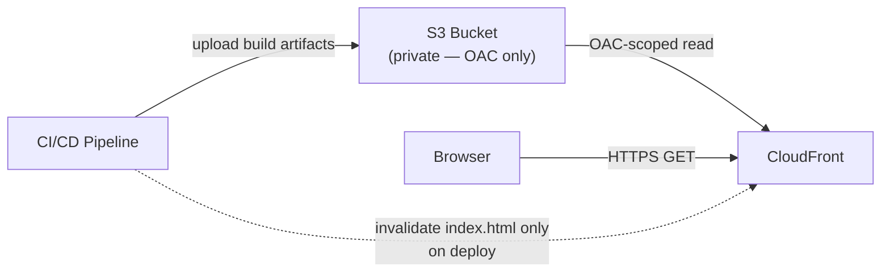
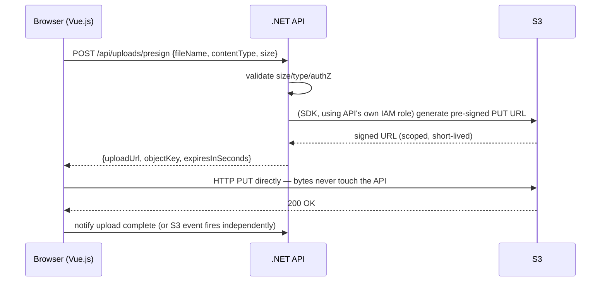
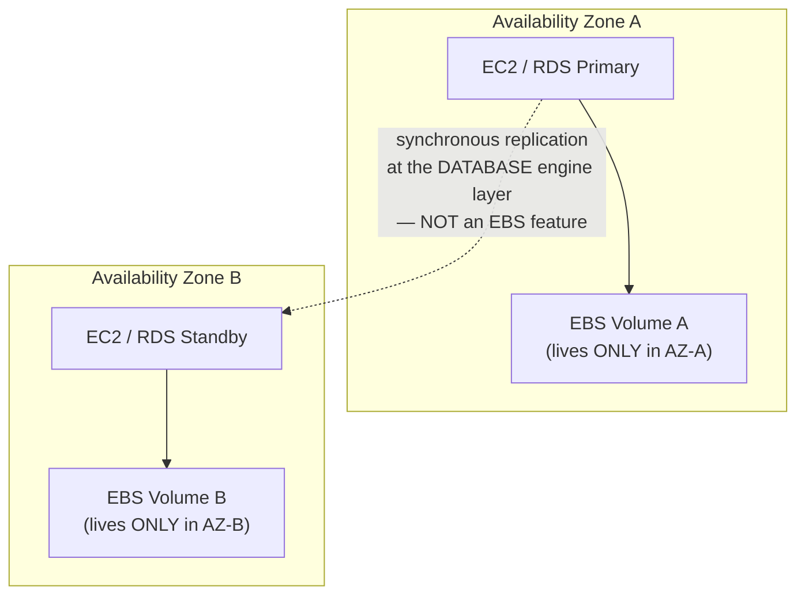
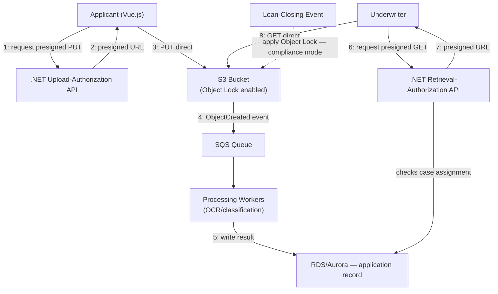
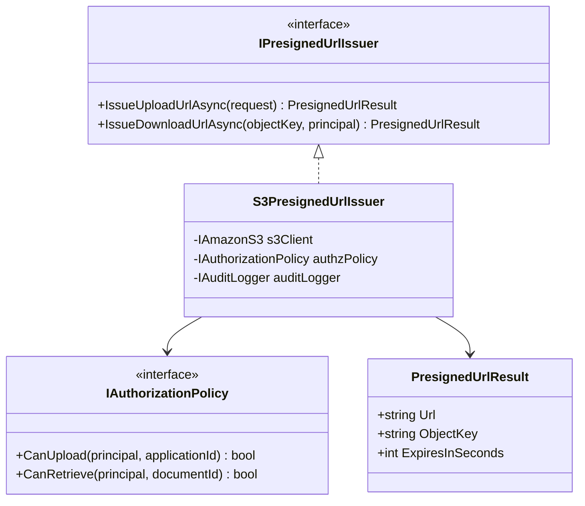

# Module 59 — AWS: Storage — S3 Storage Classes & Consistency, EBS, EFS & Durability Trade-offs

> Domain: AWS | Level: Beginner → Expert | Prerequisite: [[02-IAM-Security-KMS-SecretsManager]], (KMS encryption and resource-based bucket policies apply directly to S3), [[../18-Event-Driven-Architecture/01-EDA-Fundamentals-Choreography-vs-Orchestration]] (S3 event notifications are a concrete pub/sub mechanism)

---

## 1. Fundamentals

### What problem does S3 solve?
Every application needs somewhere to put data that isn't a row in a database — a user's uploaded PDF, a generated report, a container image layer, a Vue.js SPA's compiled bundle, a nightly export. S3 is AWS's answer: an object store with no capacity to provision, no server to patch, 11-nines-advertised durability, and a flat, HTTP-addressable namespace that scales from one object to trillions without the caller doing anything differently. The problem it solves is specifically **unstructured or semi-structured data at arbitrary scale without operational ownership of storage infrastructure** — the moment your data has a schema and needs transactional queries, you're back in Module 60's territory (RDS/Aurora/DynamoDB), not S3's.

### When should you use it?
Any binary or semi-structured payload that's read/written as a whole object (or in byte-range chunks) rather than queried by field: file uploads, static website assets, data lake raw/processed zones, backups, build artifacts, ML training data, generated reports and exports, and — critically for this course's .NET focus — as the landing zone for anything a browser needs to upload or download that's too large to sensibly proxy through an application server (§2.4).

### When should you NOT use it?
- As a database substitute for anything needing transactional consistency across multiple objects, secondary indexes, or sub-object field queries — S3 has no query language; "find every object where field X equals Y" means either maintaining your own index elsewhere or scanning, neither of which is what S3 is for.
- As a low-latency, high-IOPS block device for a running operating system or database engine — that's EBS's job (§2.6), and S3's request-response latency (tens of milliseconds) is wrong for anything expecting disk-like access patterns.
- As a shared, POSIX-semantics file system multiple compute instances mount and write to concurrently expecting immediate cross-instance file-level consistency with directory semantics — that's EFS's narrower niche (§2.7), and even there, be honest about how rarely it's the right answer (§2.7).

### How does it work — 30,000-ft view
```
Bucket (globally-unique name, region-scoped) → Objects (identified by Key, a string — "folders" are
 a UI/API convenience over what is actually a flat namespace of keys, not real directories)
Every object: Key + Value (bytes, up to 5TB) + Version ID (if versioning enabled) + Metadata
 + Storage Class (which durability/availability/cost tier)
Access via: REST API (HTTPS), IAM (identity-based) + Bucket Policy (resource-based) + ACLs (legacy,
 avoid), or a Pre-Signed URL (temporary, scoped access without the caller needing AWS credentials)
```

---

## 2. Deep Dive

### 2.1 The Flat Namespace, and Why "Folders" Are a UI Fiction With Real Performance Consequences
An S3 bucket has no actual directory tree — every object is addressed by a single string **key** (e.g., `invoices/2026/09/inv-88213.pdf`), and the console's "folder" view is purely a client-side convention of splitting keys on `/` for display. This matters beyond pedantry: S3 automatically partitions a bucket's request load across its internal infrastructure based on **key prefixes**, and while S3 has scaled this partitioning to be far more automatic and forgiving than in its early years (modern S3 auto-scales partition points based on observed request patterns), a bucket receiving an extreme, sudden burst of requests concentrated on a narrow, sequentially-increasing key prefix (e.g., every new object keyed by an ever-increasing timestamp, all funneling into the same date-based prefix within a short window) can still produce request throttling (`503 SlowDown`) until S3's partitioning catches up with the new hot spot — this is precisely the failure mode worked in §14's incident. The practical design implication for anyone choosing key names: if you expect a genuinely extreme, bursty write pattern into a narrow prefix (a financial data feed writing millions of small objects per minute, all timestamp-prefixed), consider adding entropy earlier in the key (a hash prefix) so writes spread across partitions from the start rather than depending on S3's reactive scaling to catch up mid-burst.

### 2.2 Consistency Model
S3 provides **strong read-after-write consistency** for all operations (as of the model AWS has guaranteed since December 2020) — a `PUT` followed immediately by a `GET` of the same key always returns the new data; there is no eventual-consistency window to design around for the common case, which is a genuine simplification relative to S3's earlier (pre-2020) eventually-consistent-for-overwrites model that older architecture diagrams and some engineers' outdated mental models still assume. The one consistency nuance that remains relevant operationally: a `LIST` operation (enumerating keys under a prefix) reflects the state at the time the list request began, so an object written concurrently with an in-flight list may or may not appear in that specific listing — irrelevant for single-object read/write correctness, relevant if your application logic depends on a list operation seeing every object written moments earlier (a pattern to avoid relying on; use an explicit index — DynamoDB, EventBridge on the object-created event — rather than a `LIST` call as your source of truth for "what exists").

### 2.3 Versioning, Lifecycle Policies, and the Cost/Recovery Trade-off
**Versioning**, once enabled on a bucket, keeps every prior version of an object rather than overwriting it on a new `PUT` — a `DELETE` becomes a new "delete marker" version rather than actual erasure, meaning accidental deletion is recoverable (restore by removing the delete marker) at the cost of storing every historical version indefinitely unless a lifecycle policy prunes them. **Lifecycle policies** are the mechanism that keeps that cost bounded and automatically moves data through cost/access tiers as it ages: a rule might transition objects to S3 Standard-IA after 30 days (cheaper per-GB, small retrieval fee, appropriate for infrequently-accessed-but-still-needed data), to S3 Glacier Instant Retrieval after 90 days, and expire non-current versions entirely after 365 days — the concrete design discipline is matching each transition point to the *actual* observed access pattern for that data class (S3 Storage Class Analysis reports real access frequency per prefix, rather than guessing), because a lifecycle policy that moves data to a colder tier before its real access pattern has settled produces surprise retrieval charges that dwarf the storage savings.

### 2.4 Encryption — SSE-S3 vs. SSE-KMS vs. Client-Side
- **SSE-S3**: S3 manages the encryption key entirely; zero configuration, zero additional cost, encrypts at rest by default on every bucket today. The right default for data with no specific "customer must control the key" compliance requirement.
- **SSE-KMS**: uses the envelope-encryption mechanism from Module 58 §2.5 under the hood — every object's data key is itself encrypted under a KMS key you (or AWS) manage, giving you a key policy, an audit trail of every decrypt call scoped to that key, and the ability to instantly revoke access to everything encrypted under it by disabling the key. The trade-off, made concrete: every `GetObject`/`PutObject` on an SSE-KMS object incurs a KMS API call (subject to the request-per-second quota discussed in Module 58 §2.5) — a very-high-throughput object store workload against a single SSE-KMS-encrypted bucket can genuinely hit that quota under burst load, whereas SSE-S3 has no such ceiling because it never calls the separate KMS service at all.
- **Client-side encryption**: the application encrypts before the object ever leaves the process, using its own key material (often itself protected via KMS envelope encryption) — the right answer only when the compliance requirement is "AWS must never see the plaintext, even transiently in transit to S3," a materially stronger and rarer requirement than "AWS must not hold an unmanaged key," which SSE-KMS already satisfies.

### 2.5 Bucket Policies, IAM Policies, and Pre-Signed URLs — Three Distinct Access Mechanisms
A **bucket policy** is the resource-based policy (Module 58 §2.1) attached to the bucket itself, evaluated in addition to any IAM identity policy the caller holds — and it's the only mechanism of the three that can grant access to a principal in a different AWS account, or, if deliberately configured, to the public. A **pre-signed URL** is neither an IAM policy nor a bucket policy — it's a URL whose query string carries a cryptographic signature computed from a specific IAM principal's credentials, a specific action, a specific object key, and an expiration timestamp; anyone possessing that URL can perform exactly that one action on exactly that one object until it expires, **without needing any AWS credentials or IAM identity of their own**. This is the mechanism that makes browser-to-S3 direct upload/download possible (§2.8) — the browser is never an AWS principal at all; it's just holding a bearer-token-shaped URL that happens to have been minted by a real AWS principal (the .NET API, using its own IAM role) on the browser's behalf, scoped narrowly and expiring quickly.

**CloudFront + Origin Access Control (OAC).** When S3 sits behind CloudFront as a CDN origin (§2.8's first flow), the bucket itself should **not** be public — instead, a bucket policy grants read access only to CloudFront's OAC service principal, scoped further to a condition matching your specific CloudFront distribution's ARN. This is the concrete mechanism that lets you serve a bucket's contents globally through a CDN while the bucket itself remains fully private to direct S3 access — a genuinely common production misconfiguration is a public bucket "because CloudFront needs to read it," when the actually-correct configuration never makes the bucket public at all.

### 2.6 EBS — Block Storage, AZ-Scoped, and Why That Scoping Drives Multi-AZ Database Design
Amazon EBS provides network-attached block storage volumes for EC2 instances — the disk an operating system or a database engine actually sees as a block device. The detail that matters most architecturally: **an EBS volume lives in exactly one Availability Zone** and can only attach to an EC2 instance in that same AZ. This single fact is the concrete, mechanical reason RDS Multi-AZ (Module 60) isn't "the same EBS volume made redundant" — it's a genuinely **separate EC2 instance in a second AZ, with its own separate EBS volume, kept in sync via synchronous replication at the database-engine level** — because there's no way to make a single EBS volume itself span AZs. Snapshots (point-in-time, incremental, stored durably in S3 under the hood) are the mechanism for both backup and for materializing a volume's data into a new AZ (a new volume created from a snapshot can be created in any AZ within the same region) — this is worth stating explicitly in an interview: "how do you get an EBS-backed volume's data into a second AZ" is answered by "snapshot and restore, or replicate at a layer above EBS," never "EBS handles that for you," because it structurally cannot.

Volume types worth knowing by name and use case: **gp3** (general-purpose SSD, the default for most workloads, with IOPS/throughput now provisionable independently of volume size — a deliberate improvement over the older gp2's size-linked IOPS) and **io2**/**io2 Block Express** (provisioned IOPS, for the highest-throughput database workloads, with io2's added multi-attach and higher durability guarantees) — the decision is almost always gp3 unless a specific, measured IOPS requirement exceeds what gp3 can provision.

### 2.7 EFS — Shared POSIX File Semantics, and an Honest Answer on When It's Actually Needed
Amazon EFS is a managed NFS file system, mountable concurrently by many EC2 instances (or Fargate tasks, or Lambda functions) with real POSIX file semantics (file locking, directory hierarchies, shared read/write) and automatic scaling with no capacity to provision. The honest architectural answer, stated directly rather than sold: **a genuinely stateless, horizontally-scaled .NET microservice fleet rarely needs this at all** — S3 (for object data) plus a database (for anything queryable) covers the overwhelming majority of what a well-decomposed service actually needs, and reaching for EFS is often a sign that a workload has an implicit assumption of shared local-disk state that would be better re-architected away (session state → ElastiCache, Module 60; file outputs → S3) than accommodated with a shared file system. The legitimate cases where EFS earns its place: a legacy application being lifted-and-shifted onto AWS compute that genuinely depends on shared-filesystem semantics it wasn't written to abandon (a content-management system with a plugin ecosystem assuming local file writes visible to every web server node), or specific HPC/rendering/ML-training workloads whose tooling expects a real POSIX file system across a cluster of workers. If asked "when would you choose EFS over S3" in an interview, the strongest answer names this honestly rather than inventing a justification for a default choice that usually isn't the right one.

### 2.8 Two Full Flows — Vue.js, S3, and Where the .NET API Belongs

**Flow A: `Vue.js → S3 → CloudFront` (static SPA hosting).** The Vue.js build pipeline (`npm run build`) produces a static bundle (HTML/JS/CSS/assets) uploaded to an S3 bucket via the CI/CD pipeline (Module 64/DevOps) — this bucket is **not** public; it grants read access only to CloudFront via OAC (§2.5). CloudFront serves the bundle globally from edge locations, caching aggressively (long TTLs on hashed/versioned asset filenames — the standard "cache-bust via filename, not via cache invalidation" pattern) with an explicit CloudFront invalidation issued by the deploy pipeline **only** for the small set of non-hashed entry points (`index.html`) that must reflect the newest deploy immediately. There is no .NET application anywhere in this flow — this is the entire point: static asset serving should never touch application compute at all.

**Flow B: `Vue.js → .NET API → Pre-Signed URL → S3` (user upload).**
```
1. User selects a file to upload in the Vue.js app
2. Vue.js calls POST /api/uploads/presign {fileName, contentType, sizeBytes}
3. .NET API validates the request (size limit, allowed content types, current user's authorization
   to upload at all), generates a scoped pre-signed URL via the AWS SDK for .NET (using its OWN
   IAM role's credentials — the API never hands the browser any AWS credential, only the signed
   URL itself), and returns {uploadUrl, objectKey, expiresInSeconds}
4. Vue.js performs an HTTP PUT DIRECTLY to uploadUrl — this request goes straight to S3, never
   through the .NET API
5. On successful upload, Vue.js notifies the .NET API (or an S3 event notification triggers
   downstream processing, §2.5) that the object exists and processing can proceed
```
**Why large files should generally not pass through the .NET API — the concrete mechanical reasons, not a vague efficiency claim:**
- **Memory and connection-pool pressure.** Every in-flight upload proxied through the API holds an open request (and, for anything not carefully streamed, a buffered request body) for the entire upload duration — a fleet handling many concurrent large uploads this way multiplies memory pressure and consumes connection-pool/thread-pool capacity that should be serving normal, fast API requests instead.
- **Doubled bandwidth and doubled latency.** Bytes traveling `browser → API → S3` cross the network twice and incur two hops of latency, compared to `browser → S3` directly — for a multi-hundred-MB file, this is a materially worse user experience and a materially higher data-transfer cost (egress from the API's subnet, ingress again to S3) than a single direct hop.
- **Horizontal-scaling implications.** An API designed around brief, stateless request/response cycles scales cleanly by adding more identical instances behind a load balancer; an API that also holds long-lived, large-bodied upload streams open needs to size its compute and connection limits around the *worst-case concurrent upload volume*, not around its normal API traffic pattern — conflating the two workloads makes capacity planning for the *normal* traffic pattern harder, not just the upload path itself.
The pre-signed URL pattern removes the API from the data path entirely for the actual bytes, while keeping it fully in control of **authorization** (nothing is uploadable without first passing the API's validation to obtain the URL) and **scoping** (the signed URL is good for one object key, one content type, a size-limited policy, and a short expiry — not a blank check to write anywhere in the bucket).

---

## 3. Visual Architecture

### Flow A — Static SPA Hosting

```mermaid
flowchart LR
    Dev["CI/CD Pipeline"] -->|"upload build artifacts"| S3A["S3 Bucket<br/>(private — OAC only)"]
    S3A -->|"OAC-scoped read"| CF["CloudFront"]
    User[Browser] -->|"HTTPS GET"| CF
    Dev -.->|"invalidate index.html only<br/>on deploy"| CF
```

### Flow B — Direct Browser Upload via Pre-Signed URL

```mermaid
sequenceDiagram
    participant B as Browser (Vue.js)
    participant API as .NET API
    participant S3 as S3

    B->>API: POST /api/uploads/presign {fileName, contentType, size}
    API->>API: validate size/type/authZ
    API->>S3: (SDK, using API's own IAM role) generate pre-signed PUT URL
    S3-->>API: signed URL (scoped, short-lived)
    API-->>B: {uploadUrl, objectKey, expiresInSeconds}
    B->>S3: HTTP PUT directly — bytes never touch the API
    S3-->>B: 200 OK
    B->>API: notify upload complete (or S3 event fires independently)
```

### EBS AZ-Scoping — Why It Forces a Real Second Instance for Multi-AZ

```mermaid
graph TB
    subgraph AZa["Availability Zone A"]
        EC2a["EC2 / RDS Primary"] --> EBSa["EBS Volume A<br/>(lives ONLY in AZ-A)"]
    end
    subgraph AZb["Availability Zone B"]
        EC2b["EC2 / RDS Standby"] --> EBSb["EBS Volume B<br/>(lives ONLY in AZ-B)"]
    end
    EC2a -.->|"synchronous replication<br/>at the DATABASE engine layer<br/>— NOT an EBS feature"| EC2b
```

---

## 4. Production Example

**Problem.** A document-processing service accepted user-uploaded PDFs (loan applications, in a lending-adjacent fintech context) by streaming the multipart upload directly through an ASP.NET Core controller action into an in-memory `MemoryStream` before calling `PutObjectAsync`. Under normal load this worked; during a monthly application-deadline traffic spike (10x normal upload volume, files averaging 15MB, some up to 200MB scanned document packets), the API tier began experiencing OutOfMemoryExceptions and connection-pool exhaustion, causing unrelated, fast API endpoints (login, application-status lookup) to start timing out on the same instances.

**Architecture (before).** `Vue.js → .NET API (buffers entire file in memory) → S3`, with no size cap enforced before the buffer allocation and no separation between the upload-handling instances and the instances serving the rest of the API.

**Implementation (the fix).** Migrated to the pre-signed URL pattern (§2.8, Flow B) — the .NET API's role in the upload path shrank to validating the request and minting a scoped, short-lived pre-signed URL (with an explicit `Content-Length-Range` condition baked into the presigned POST policy, enforcing the size cap at S3 itself rather than trusting client-side validation alone); the actual bytes moved `browser → S3` directly. An S3 event notification (§2.5) on `ObjectCreated` triggered an SQS-queued downstream virus-scan-then-process pipeline (Module 62) rather than synchronous processing in the request path.

**Trade-offs.** The upload flow gained one extra round-trip (obtain the pre-signed URL, then upload) versus the single-request "just POST the file" model — a genuine, small UX cost, mitigated by the Vue.js client showing upload progress against the direct S3 PUT (which, unlike the old proxied flow, could report real byte-level progress rather than an indeterminate spinner, since the browser now has a direct connection to observe).

**Lessons learned.** The underlying failure was conflating two workloads with very different resource profiles — brief, latency-sensitive API calls and long-lived, memory-heavy file transfers — onto the same compute fleet and the same request-handling path; separating them (by removing the file bytes from the API's path entirely, not just by adding more API instances) fixed the capacity problem at its root rather than merely buying headroom that the next 10x spike would consume again.

---

## 11. Coding Exercises

### Easy
**Problem.** Generate a pre-signed URL for uploading an object to S3 using the AWS SDK for .NET, scoped to a specific content type and a 5-minute expiry.

**Solution.**
```csharp
var request = new GetPreSignedUrlRequest
{
    BucketName = "loan-documents-prod",
    Key = $"applications/{applicationId}/{fileName}",
    Verb = HttpVerb.PUT,
    Expires = DateTime.UtcNow.AddMinutes(5),
    ContentType = contentType
};
string uploadUrl = await s3Client.GetPreSignedURLAsync(request);
```
**Time complexity:** O(1) — a local signature computation, no network call to S3 at all (this is worth stating explicitly: minting a pre-signed URL never touches S3's network path; it's pure cryptography against the caller's own credentials). **Space complexity:** O(1).

### Medium
**Problem.** Implement an idempotent S3-event-driven Lambda that processes an uploaded file exactly once at the application-outcome level, despite S3 event notifications being at-least-once delivery.

**Solution.**
```csharp
public async Task Handler(S3Event s3Event, ILambdaContext context)
{
    foreach (var record in s3Event.Records)
    {
        var objectKey = record.S3.Object.Key;
        var eventId = $"{record.S3.Bucket.Name}:{objectKey}:{record.S3.Object.ETag}";

        // idempotency check against a DynamoDB table keyed by eventId, conditional write
        var alreadyProcessed = await TryMarkProcessedAsync(eventId); // ConditionExpression: attribute_not_exists(EventId)
        if (alreadyProcessed) continue; // already handled — a duplicate delivery, not an error

        await ProcessDocumentAsync(objectKey);
    }
}
```
**Time complexity:** O(n) records per invocation, O(1) idempotency check per record (a single conditional DynamoDB write). **Space complexity:** O(1) beyond the processed record. **Optimized solution:** batch the idempotency-check writes via `TransactWriteItems` when multiple records arrive in one invocation, reducing round-trips versus one call per record.

### Hard
**Problem.** Design and implement a lifecycle-policy-driven storage-tiering strategy for a bucket with three distinct access patterns (hot: last 30 days, warm: 30–180 days, cold: 180+ days), and show the actual lifecycle configuration.

**Solution.**
```json
{
  "Rules": [
    {
      "ID": "tier-by-age",
      "Status": "Enabled",
      "Filter": { "Prefix": "documents/" },
      "Transitions": [
        { "Days": 30, "StorageClass": "STANDARD_IA" },
        { "Days": 180, "StorageClass": "GLACIER_IR" }
      ],
      "NoncurrentVersionExpiration": { "NoncurrentDays": 365 }
    }
  ]
}
```
**Time/space reframed as cost complexity:** the strategy trades a small per-GB retrieval fee on the warm/cold tiers against a materially lower per-GB storage cost for the ~95% of stored bytes past their hot-access window in a typical document-retention workload — the actual numbers must come from S3 Storage Class Analysis on real access logs, not assumed a priori (§2.3). **Optimized solution:** for a workload whose "hot" definition varies genuinely unpredictably per object (not cleanly by age), S3 Intelligent-Tiering removes the need to hand-tune transition days at all, moving objects automatically based on observed access and charging a small per-object monitoring fee instead — the §15 Architecture Decision below works this trade-off in full.

### Expert
**Problem.** A bucket receiving a high-volume, bursty stream of small objects all keyed by strictly increasing timestamp (`events/2026-09-12T14:30:00.123Z.json`) begins returning `503 SlowDown` during traffic spikes. Redesign the key scheme to avoid the hot-partition behavior, and explain the trade-off introduced.

**Solution.** Prefix the key with a hash of the original key (or a reversed/sharded timestamp component) so writes distribute across the keyspace from the start: `events/{hash(eventId) % 16}/2026-09-12T14:30:00.123Z.json` — spreading the same burst across 16 effective prefixes rather than one ever-growing one. **Trade-off:** a naive `LIST` operation to enumerate "all events between two timestamps" no longer maps to a single contiguous key range — it now requires either querying all 16 shard prefixes and merging, or maintaining a separate time-ordered index (DynamoDB with a timestamp sort key, or an S3 Inventory report) rather than relying on lexicographic key ordering for range queries. This is the honest cost of the fix: solving the write-hot-spot problem moves the "list by time range" problem to a layer that has to be built, not one you get for free from S3's own key ordering.

---

## 12. System Design — Document Upload, Storage & Retention Platform for a Regulated Lending Product

### Step 1: Understand the Problem and Establish Design Scope

**Q&A dialogue:**
> **Candidate:** What kinds of documents, what's the expected file-size distribution, and is there a regulatory retention requirement?
> **Interviewer:** Loan application documents — ID scans, pay stubs, signed agreements — 100KB to 200MB per file, and yes: seven-year minimum retention for anything tied to an originated loan, immutable once the loan closes.
> **Candidate:** Who consumes these documents after upload — synchronous review by a human underwriter, or an automated document-classification pipeline, or both?
> **Interviewer:** Both — an automated OCR/classification pass first, then a human underwriter reviews flagged documents.
> **Candidate:** Is this single-region, and does any document ever need to be publicly reachable without authentication?
> **Interviewer:** Single-region for now; nothing is ever public — every access is authenticated and authorized per-application.

**Functional requirements:** browser-direct upload without proxying bytes through application compute; automated post-upload processing (OCR/classification); authorized retrieval by underwriters and by the applicant themselves; immutable retention once a loan closes, for at least seven years.

**Non-functional requirements:** no uploaded document ever transits through app-server memory (§2.8); retrieval authorized per-application, never bucket-public; tamper-evidence for closed-loan documents; durability matching S3's 11-nines baseline is sufficient — no additional replication needed given single-region scope, but noted as a follow-up (Step 4).

**Back-of-the-envelope estimation:** 50,000 loan applications/month × ~6 documents/application average = 300,000 uploads/month ≈ 10,000/day ≈ 0.12 uploads/sec average, with a realistic 20x business-hours peak-to-average ratio (loan applications cluster in business hours, not uniformly across 24h) ≈ ~2.4 uploads/sec at peak — trivially low request volume for S3 itself. Storage: 300,000 documents/month × ~8MB average ≈ 2.4TB/month ≈ ~29TB/year, ~200TB accumulated over the 7-year retention floor — a meaningful but unremarkable S3 storage footprint, meaning **the design driver here is not upload throughput or storage capacity — it's the retention/immutability guarantee and correct authorization scoping per application**, exactly the same shape of finding as Module 58 §12's secrets-platform design: the interesting engineering problem is governance and correctness under regulatory constraint, not raw scale.

### Step 2: Propose High-Level Design and Get Buy-In

**Core flows, treated separately:** (a) upload (browser-direct, pre-signed), (b) automated processing (OCR/classification, triggered by S3 event), (c) authorized retrieval (underwriter and applicant, distinct authorization rules), (d) retention lock (on loan closing).

**Component glossary:**
- **Upload-authorization API** (.NET) — validates the requesting user's authorization to upload against a specific application ID, mints the pre-signed URL, records the pending-upload intent.
- **Processing pipeline** — S3 event → SQS → a worker fleet performing OCR/classification (Module 62 owns the queueing mechanics in depth); writes results to the application's record in RDS/Aurora (Module 60).
- **Retrieval-authorization API** (.NET) — checks the requesting principal (underwriter with an active case assignment, or the applicant themselves) against the specific document's owning application before minting a pre-signed **GET** URL.
- **Retention-lock mechanism** — S3 Object Lock in **compliance mode**, applied at the moment a loan closes, making the object provably immutable (undeletable, unmodifiable, including by the account root user) for the required retention period — the actual mechanism satisfying "immutable once closed," not a policy convention that a sufficiently-privileged operator could still override.

**Architecture diagram:**

```mermaid
graph TB
    App["Applicant (Vue.js)"] -->|"1: request presigned PUT"| UpAPI[".NET Upload-Authorization API"]
    UpAPI -->|"2: presigned URL"| App
    App -->|"3: PUT direct"| S3["S3 Bucket<br/>(Object Lock enabled)"]
    S3 -->|"4: ObjectCreated event"| SQS["SQS Queue"]
    SQS --> Worker["Processing Workers<br/>(OCR/classification)"]
    Worker -->|"5: write result"| DB["RDS/Aurora — application record"]
    UW["Underwriter"] -->|"6: request presigned GET"| RetAPI[".NET Retrieval-Authorization API"]
    RetAPI -->|"checks case assignment"| DB
    RetAPI -->|"7: presigned URL"| UW
    UW -->|"8: GET direct"| S3
    Close["Loan-Closing Event"] -.->|"apply Object Lock — compliance mode"| S3
```

**End-to-end walkthrough:** ① applicant requests upload authorization for a specific document type against their application ID → ② API validates the application is in a state accepting uploads and the user owns it, mints a scoped pre-signed PUT (object key includes the application ID as a prefix, e.g. `applications/{applicationId}/paystub-1.pdf`, enabling prefix-scoped IAM conditions per §2.5's tenant-isolation pattern from Module 58 §2.9) → ③ browser uploads directly → ④ S3 event fires → ⑤ worker OCRs/classifies and writes structured results back to the application's database record, **not** back into S3 (S3 holds the source document; the database holds the queryable outcome — the right store for each, per Module 60's data-model reasoning) → ⑥–⑧ an underwriter's retrieval request is checked against their actual case assignment (not just "is an underwriter," but "is *this* underwriter assigned to *this* application") before a GET URL is minted.

**REST API design:**
| Endpoint | Method | Request fields | Response fields |
|---|---|---|---|
| `/applications/{id}/documents/upload-authorization` | POST | `documentType` (enum), `fileName`, `contentType`, `sizeBytes` | `uploadUrl`, `objectKey`, `expiresInSeconds` |
| `/applications/{id}/documents/{docId}/retrieval-authorization` | POST | — | `downloadUrl`, `expiresInSeconds` |
| `/applications/{id}/documents` | GET | — | list of `{docId, documentType, uploadedAt, classificationStatus}` |

**Data model:**
| Table: `ApplicationDocuments` | Type | Description |
|---|---|---|
| `DocumentId` (PK) | string | Internal ID, decoupled from the S3 key |
| `ApplicationId` | string | Owning application — the authorization boundary |
| `ObjectKey` | string | The S3 key, prefixed by `ApplicationId` |
| `DocumentType` | enum | Drives which OCR/classification pipeline runs |
| `ClassificationStatus` | enum | `PENDING → PROCESSING → CLASSIFIED \| FLAGGED_FOR_REVIEW` |
| `RetentionLockedAt` | timestamp, nullable | Set when the owning loan closes; null means still mutable |

Rationale: storing the S3 key **prefixed by application ID** rather than a flat UUID is a deliberate choice enabling exactly the IAM `s3:prefix`-condition-scoped access pattern from Module 58 §2.9 as an additional defense-in-depth layer beneath the application-level authorization check, not a replacement for it.

### Step 3: Design Deep Dive

**Failure handling — upload without a corresponding record.** A browser can obtain a pre-signed URL and then abandon the upload (network failure, user closes the tab) — this must not be treated as an error requiring cleanup logic in the hot path; the design accepts that some minted URLs are never used, and a scheduled housekeeping job (not the request path) reconciles `ApplicationDocuments` records with actual S3 object existence, marking stale pending-upload records as expired after the pre-signed URL's own expiry window has passed.

**Processing delays.** OCR/classification is asynchronous by design (§2 component glossary) — the applicant/underwriter-facing UI shows `ClassificationStatus` as `PROCESSING` rather than blocking on it, and the retrieval API's own authorization check does not depend on classification having completed (an underwriter may legitimately want to view a raw, not-yet-classified document).

**Retention and immutability — the regulatory-driven deep dive.** S3 Object Lock in **compliance mode** (as opposed to governance mode, which even a privileged user can override with special permissions) is applied to an object only once its owning loan closes — **before** closing, documents remain fully mutable (a user re-uploading a corrected pay stub is a normal, expected flow) precisely because locking too early would make ordinary application-processing friction into a regulatory-immutability problem. The closing event (from the loan-servicing system, out of this module's scope) triggers a Lambda that applies a retain-until-date (closing date + 7 years) to every document under that application's prefix — and because compliance-mode Object Lock cannot be shortened or removed by anyone, including the AWS account root, this is the concrete mechanism that actually satisfies "immutable once closed" as a provable guarantee an auditor can verify, not merely a bucket policy convention a sufficiently-motivated insider could quietly change.

**Consistency.** S3's strong read-after-write consistency (§2.2) means an underwriter requesting retrieval immediately after a processing worker's classification update sees the current state without a stale-read risk at the S3 layer; the `ClassificationStatus` field itself lives in Aurora (Module 60), whose own consistency guarantees are covered there — this module's boundary is explicitly the object-storage half of the system, cross-referencing rather than re-deriving the database half.

**Security.** Every document key is scoped by application ID; the retrieval-authorization API is the sole path to a working URL (no bucket policy grants any principal, human or service, broad bucket-wide read); Object Lock provides tamper-evidence independent of IAM entirely, satisfying an auditor's question "could an insider with AWS admin access have altered this document after the loan closed" with a genuine "no," which a bucket-policy-only design could never honestly answer.

### Step 4: Wrap-Up

**Not covered here, natural follow-ups:** cross-region replication for disaster recovery if the regulator's requirements evolve beyond single-region (S3 Cross-Region Replication, with the added complexity of Object-Lock-compatible replication configuration); monitoring metrics (upload failure rate, processing-queue age, percentage of documents still `PENDING` past an SLA threshold — Module 64); a virus/malware scanning step ahead of OCR processing (a genuine production requirement for any user-uploaded-file pipeline, omitted here for focus but a natural next stage in the SQS-fed worker pipeline); a closing summary diagram would show the same upload→process→retain lifecycle as a single state machine per document, mirroring Module 58 §12's per-secret state-machine framing.

**References:**
1. Amazon S3 User Guide — Strong Consistency.
2. Amazon S3 User Guide — Using S3 Object Lock.
3. Amazon S3 User Guide — Managing your storage lifecycle.
4. Amazon S3 Developer Guide — Presigned URLs.
5. Amazon CloudFront Developer Guide — Restricting access with Origin Access Control.
6. Amazon EBS User Guide — Volume types (gp3, io2 Block Express).
7. Amazon EFS User Guide — Use cases.

---

## 13. Low-Level Design — Pre-Signed URL Issuance Service

**Requirements:** given an authenticated request for a specific object and action, return a scoped, short-lived pre-signed URL, enforcing size/content-type constraints server-side (not trusting client-declared values alone) and logging every issuance for audit.

**Class diagram:**

```mermaid
classDiagram
    class IPresignedUrlIssuer {
        <<interface>>
        +IssueUploadUrlAsync(request) PresignedUrlResult
        +IssueDownloadUrlAsync(objectKey, principal) PresignedUrlResult
    }
    class S3PresignedUrlIssuer {
        -IAmazonS3 s3Client
        -IAuthorizationPolicy authzPolicy
        -IAuditLogger auditLogger
    }
    class IAuthorizationPolicy {
        <<interface>>
        +CanUpload(principal, applicationId) bool
        +CanRetrieve(principal, documentId) bool
    }
    class PresignedUrlResult {
        +string Url
        +string ObjectKey
        +int ExpiresInSeconds
    }

    IPresignedUrlIssuer <|.. S3PresignedUrlIssuer
    S3PresignedUrlIssuer --> IAuthorizationPolicy
    S3PresignedUrlIssuer --> PresignedUrlResult
```

**Sequence diagram:** matches §3's Flow B sequence diagram above — the issuer sits inside the `.NET Upload-Authorization API` box.

**Design patterns used:** Strategy (`IAuthorizationPolicy` implementations differing between upload and retrieval, and potentially per document sensitivity tier); Facade (`S3PresignedUrlIssuer` hides the SDK's request-construction detail behind two simple methods).

**SOLID mapping:** Single Responsibility — URL issuance, authorization decision, and audit logging are three separate collaborators, not one god-class; Open/Closed — a new document sensitivity tier's authorization rule is a new `IAuthorizationPolicy` implementation; Dependency Inversion — the issuer depends on `IAuthorizationPolicy`/`IAuditLogger` abstractions, not concrete implementations, enabling the exact same class to be unit-tested without a real S3 call.

**Extensibility:** adding a new document type with a different retention rule is a data-driven change (a new `DocumentType` enum value and a lookup entry), not a code change to the issuer itself.

**Concurrency/thread safety:** the issuer is stateless per call — pre-signed URL generation is a pure, local cryptographic computation (§2.5) with no shared mutable state, so it's trivially safe under concurrent use without locks, unlike Module 58's cached-credential examples which explicitly needed synchronization.

---

## 14. Production Debugging

**Incident.** A financial-reporting export job began failing intermittently with `503 SlowDown` responses from S3 during month-end processing, when the job wrote several million small per-account reconciliation snapshot files within a short window, each keyed as `reconciliation/{accountId}/{timestamp}.json`.

**Investigation.** CloudWatch request metrics on the bucket showed a sharp spike in `5xx` errors correlated exactly with the job's start time; S3 server access logs, filtered to the affected time window, showed the vast majority of throttled requests sharing a **very narrow range of key prefixes** — because `accountId` values in this batch happened to be processed in ascending numeric order by the job's own iteration logic, producing exactly the sequential-hot-prefix pattern from §2.1 and the Expert coding exercise, even though the key scheme superficially looked well-distributed (account IDs, not timestamps).

**Tools.** S3 server access logs (or CloudTrail data events, for a more structured query path) filtered and aggregated by key prefix; CloudWatch's `5xxErrors` and `TotalRequestLatency` metrics on the bucket to confirm the timing correlation before diving into logs.

**Fix.** Changed the job's iteration order to process accounts in a randomized/hashed order rather than ascending numeric order — a small code change with no key-scheme redesign needed, because the underlying problem was the *temporal clustering* of writes into a narrow prefix range, not the key scheme's structure in isolation. As a defense-in-depth follow-up, the key scheme itself was also updated to include a hash-prefix shard (matching the Expert exercise's fix) so future batch jobs with different iteration orders couldn't reintroduce the same failure mode.

**Prevention.** Added a CloudWatch alarm on the bucket's `5xxErrors` metric, and a pre-deployment checklist item for any new bulk-write job: "does this job's write order concentrate keys into a narrow, time-correlated prefix range" — turning a reactive, incident-driven finding into a proactive review question for the next batch job design.

---

## 15. Architecture Decision — S3 Standard vs. Intelligent-Tiering vs. a Manual Lifecycle Policy

| Criterion | S3 Standard (no tiering) | Manual Lifecycle Policy | S3 Intelligent-Tiering |
|---|---|---|---|
| Advantages | Simplest; no retrieval fees ever; predictable cost per GB | Cheapest steady-state cost for well-understood, age-correlated access patterns | Automatically adapts to unpredictable/changing access patterns; no risk of a badly-tuned transition schedule |
| Disadvantages | Highest steady-state storage cost for rarely-accessed data | Requires accurate a priori knowledge of the access pattern; wrong assumptions cause surprise retrieval fees or premature/late transitions | Small per-object monthly monitoring fee; less cost-predictable than a hand-tuned policy for a genuinely well-understood pattern |
| Cost | Highest storage, zero retrieval risk | Lowest storage IF assumptions hold | Slightly higher than a correctly-tuned manual policy, lower than a wrongly-tuned one |
| Complexity | None | Requires periodic review against Storage Class Analysis (§2.3) | None — fully automatic |
| Maintainability | Trivial | Needs ongoing tuning as access patterns evolve | Self-maintaining |
| Performance | No retrieval latency difference for hot data | Retrieval latency/fee penalty if a "warm" object is actually accessed hot | Adapts without a latency penalty for genuinely-hot objects (Intelligent-Tiering's frequent-access tier has Standard-equivalent latency) |
| Scalability | Scales trivially | Scales, but tuning burden grows with the number of distinct access-pattern classes | Scales without added tuning burden |
| Operational overhead | None | Ongoing (Storage Class Analysis review cadence) | Minimal |

**Recommendation:** for the document-retention platform in §12, where the access pattern is genuinely well-understood and regulatory-driven (hot during active underwriting, cold and effectively-never-accessed once a loan closes and the immutability lock applies) — **a manual lifecycle policy** is the right choice, because the transition points are dictated by the loan lifecycle itself (a known, discrete event — closing — not a statistically-observed decay curve), and Intelligent-Tiering's value proposition (adapting to *unpredictable* access) doesn't apply when the access pattern is actually deterministic. For a genuinely unpredictable workload (a general-purpose file-sharing product where any file could become hot again at any time for reasons outside the system's own event model), Intelligent-Tiering becomes the better default specifically because the manual policy's core assumption — "we know when access will drop off" — doesn't hold.

---

## 17. Principal Engineer Perspective

**Business impact.** Storage architecture decisions in a regulated lending context are not primarily cost decisions — they're regulatory-compliance decisions with cost as a secondary axis. Choosing S3 Object Lock compliance mode over a bucket-policy convention is the difference between "we have a process we believe prevents tampering" and "we have a cryptographically-enforced guarantee an auditor and a regulator can independently verify," and a Principal Engineer sizes the (small) additional engineering cost of doing it correctly against the (large) tail risk of a compliance finding during an audit.

**Engineering trade-offs.** The pre-signed URL pattern (§2.8) trades a small amount of client-side complexity (two round-trips instead of one, client-side upload-progress handling) for a materially better resource-isolation story at the API tier — the Production Example's incident is the concrete case for why this trade is almost always worth making for anything beyond trivially small payloads, and a Principal Engineer should be able to name the specific threshold (file size, expected concurrency) at which "just proxy it through the API for simplicity" stops being a reasonable simplification.

**Technical leadership and cross-team communication.** A bucket's key-naming scheme (§2.1, §14) is a decision that outlives any single team's tenure on a service and is expensive to change retroactively (millions of existing objects under the old scheme) — this is exactly the kind of "hard to reverse" foundational decision (per this course's general risk framing) that deserves deliberate design review before the first object is ever written, not organic growth from whatever the first engineer happened to type.

**Architecture governance.** Object Lock's compliance-mode guarantee is only as strong as the process that decides *when* to apply it — a governance gap where the "apply lock on loan closing" Lambda itself has a bug (or is bypassed by a manual process during an incident) undermines the entire guarantee; the Principal Engineer's responsibility extends to ensuring the lock-application path is itself tested, monitored (an alert on any closed loan whose documents show no retention lock after a defined SLA), and cannot be silently skipped.

**Cost optimization.** Storage-class tiering (§2.3, §15) at the scale worked in §12 (200TB accumulated over seven years) represents a genuinely material cost difference between "everything stays in S3 Standard forever" and a correctly-tiered policy — often a larger percentage cost saving than compute optimization efforts receive equivalent engineering attention, precisely because storage cost is a slow, compounding tax that's easy to under-prioritize against more visible compute/scaling work.

**Risk analysis and long-term maintainability.** The single largest long-term risk in this module's material is a key-naming or bucket-structure decision made without anticipating scale (§2.1's hot-prefix failure mode) — because renaming millions of existing object keys is not a routine migration, decisions here deserve the same up-front rigor as a database's primary-key/partition-key design (a deliberate echo of Module 60's DynamoDB partition-key material), not the comparatively lower bar often applied to "it's just file storage."
