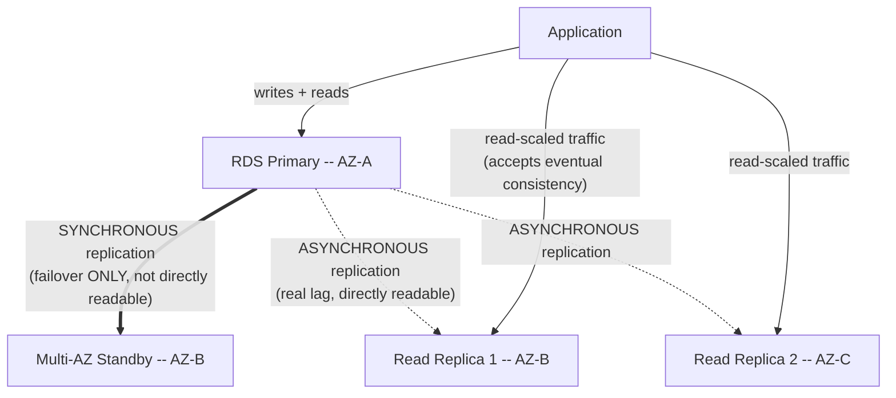
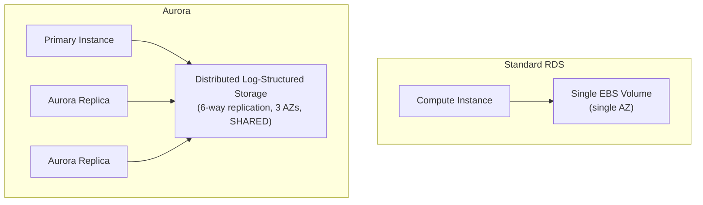

# Module 60 — AWS: Databases — RDS Multi-AZ & Read Replicas, Aurora Internals & DynamoDB Integration

> Domain: AWS | Level: Beginner → Expert | Prerequisite: [[../04-SQL-Server/02-Transactions-Isolation-Locking]], [[../08-DynamoDB/02-Consistency-Models-Capacity-Planning]] (this module maps those database-internals fundamentals onto specific AWS managed-service implementations), [[03-Storage-S3-EBS-EFS]] §2.2 (RDS is built on EBS under the hood, inheriting its AZ-scoped durability characteristics unless Multi-AZ is explicitly configured)

---

## 1. Fundamentals

### Why does a Principal Engineer need AWS database-service depth beyond "RDS runs my database for me"?
RDS, Aurora, and DynamoDB are managed services, not magic — every failure mode this course already established for the underlying database engines (SQL Server/PostgreSQL isolation levels and locking, DynamoDB partition-key hot-spotting) still applies, but is now expressed through AWS-specific configuration knobs (Multi-AZ, read replica lag, Aurora's storage architecture, DynamoDB's on-demand vs. provisioned capacity) — a Principal Engineer must translate database-internals knowledge into correct configuration of the specific managed service, not assume "managed" means "the trade-offs disappear."

### Why does this matter?
Because RDS/Aurora/DynamoDB configuration mistakes (a Multi-AZ setting believed-but-not-actually enabled, a read replica silently serving stale data to a workload that needed strong consistency, a DynamoDB partition key design that recreates the exact hot-partition problem Module 27 already covered) are among the most consequential, hard-to-reverse decisions in a cloud architecture, directly compounding Module 59's storage-durability discipline at the database layer specifically.

### When does this matter?
Any time a workload's data-layer choice must be made or reviewed on AWS — which, given this course's data-layer modules (18-28) already established SQL Server/PostgreSQL/MongoDB/Redis/DynamoDB fundamentals, is the natural point where that knowledge gets applied concretely to AWS's specific managed offerings.

### How does it work (30,000-ft view)?
```
RDS: managed relational database (SQL Server, PostgreSQL, MySQL, etc.) -- AWS handles patching,
     backups, failover; built on EBS storage
Multi-AZ: a SYNCHRONOUS standby replica in a different AZ, used ONLY for automatic failover
     -- not directly readable
Read Replica: an ASYNCHRONOUS copy for offloading read traffic -- directly readable, but with
     replication lag
Aurora: AWS's own MySQL/PostgreSQL-compatible engine with a distributed, log-structured storage
     layer decoupled from compute -- different internals from standard RDS
DynamoDB: fully managed NoSQL, already covered in Module 27-28 -- this module focuses on
     integration patterns (streams, global tables) alongside RDS/Aurora
```

---

## 2. Deep Dive

### 2.1 RDS Multi-AZ — Synchronous Standby for Failover, Not for Read Scaling
RDS Multi-AZ provisions a **synchronous** standby replica in a different Availability Zone — every write is synchronously replicated to the standby before being acknowledged as committed, meaning the standby is always current, but this standby is **not directly readable** (with the historical exception noted in §2.1's Aurora contrast, §2.3) and exists solely to be automatically promoted to primary during a failover (AWS detects the primary's failure and redirects the database's endpoint DNS to the now-promoted standby, typically within 60-120 seconds) — a common, costly misunderstanding is treating Multi-AZ as a read-scaling mechanism (it structurally is not) or assuming the synchronous replication itself provides zero-data-loss failover without confirming this in the specific engine's actual behavior, since the synchronous commit does guarantee the standby has every committed transaction, but application-level in-flight (uncommitted, or committed-but-not-yet-acknowledged-to-client) transactions during the failover window can still be affected.

### 2.2 Read Replicas — Asynchronous, for Read Scaling, With Real Replication Lag
A Read Replica is a separate, **asynchronously** replicated, independently readable copy — used specifically to offload read traffic from the primary (directly Module 18/19's read-scaling discussion, now expressed as an RDS-specific mechanism) — but because replication is asynchronous, a read replica can lag behind the primary by anywhere from milliseconds to, under sustained heavy write load or replica under-provisioning, meaningfully longer, meaning any workload reading from a replica has implicitly accepted **eventual consistency** for those reads, directly the same read-your-own-writes risk Module 24's MongoDB replica-set discussion already established, now recurring at the RDS layer — a workload that writes data and then immediately reads it back from a read replica (rather than from the primary) can observe stale data, a subtle, easy-to-miss correctness bug that only manifests under real production write load, not in low-traffic testing where replication lag is negligible.

### 2.3 Aurora — Distributed, Log-Structured Storage Decoupled From Compute
Aurora's storage architecture is fundamentally different from standard RDS: rather than a single EBS volume attached to a single compute instance, Aurora's storage layer is a distributed, log-structured system that automatically replicates data six ways across three AZs, with storage and compute scaled independently — this yields materially faster failover (typically under 30 seconds, since Aurora Replicas share the same underlying distributed storage rather than requiring their own full data copy) and allows Aurora Replicas (unlike standard RDS read replicas discussed in §2.2) to be added or removed without a separate full data-copy operation, since they attach to the same shared storage layer. Aurora's replication to its own Replicas is still asynchronous with real (though typically sub-100ms, materially lower than standard RDS) lag, meaning §2.2's read-your-own-writes caution still applies, just with a smaller — not zero — lag window that must still be explicitly reasoned about, not assumed away.

### 2.4 DynamoDB Integration Patterns — Streams and Global Tables
Beyond DynamoDB's own core data-modeling and consistency fundamentals (already covered in Modules 27-28), two integration-focused capabilities matter for a broader AWS architecture: **DynamoDB Streams** captures an ordered, time-sequenced log of item-level changes (inserts, updates, deletes), consumable by Lambda or other consumers — directly the AWS-native implementation of the Change Data Capture / event-carried state transfer pattern from Module 52, letting DynamoDB itself become an event producer (the same architectural role S3 played in Module 59 §2.5); **Global Tables** provide multi-Region, multi-active replication with automatic conflict resolution (last-writer-wins, based on timestamp), directly relevant to Module 47's distributed-consistency-model discussion — a workload adopting Global Tables must explicitly accept last-writer-wins semantics as its actual conflict-resolution model, not assume some stronger guarantee, since concurrent writes to the same item from different Regions can silently overwrite one another according to that rule.

### 2.5 Choosing Between RDS, Aurora, and DynamoDB — Matching the Actual Workload
This is a direct, concrete application of Modules 4-8/18-28's relational-vs-NoSQL trade-off discussion to AWS's specific offerings: RDS/Aurora fit workloads genuinely requiring relational modeling, multi-row/multi-table transactions, and complex joins/aggregations; DynamoDB fits workloads with access patterns fully known upfront, requiring single-digit-millisecond latency at very high, elastically variable scale, and where the single-table-design discipline (Module 27) is a worthwhile trade-off for that performance profile. Aurora specifically should be preferred over standard RDS by default for any new relational workload on AWS unless a specific, concrete reason favors standard RDS (a database engine Aurora doesn't support, e.g., SQL Server, or a genuine need for standard RDS's specific operational model) — Aurora's faster failover and independent storage/compute scaling are a strict improvement for MySQL/PostgreSQL-compatible workloads with no equivalent downside, making "just use standard RDS" without considering Aurora a missed-default anti-pattern for supported engines.

### 2.6 RDS Proxy — Connection Pooling as a Managed Layer
RDS Proxy sits between an application (particularly a Lambda-based or otherwise highly-concurrent, connection-churning workload — directly foreshadowing §Module 61's Lambda connection-exhaustion discussion) and the database, managing a pooled set of actual database connections and multiplexing many application-level logical connections onto them — this directly addresses a specific, real failure mode: a serverless or highly-elastic compute layer that opens a new database connection per invocation can exhaust the database's own maximum-connection limit under load, an entirely different failure mode from query performance or replication lag, and one that's easy to overlook until a scaling event (the exact same "invisible until a specific triggering event" pattern from Module 57 §4's ASG-warm-up incident) causes a connection-limit-related outage.

---

## 3. Visual Architecture

### RDS Multi-AZ Failover vs. Read Replica Scaling


### Aurora's Decoupled Storage vs. Standard RDS


## 4. Production Example
**Scenario**: An order-management service handled checkout writes against an RDS PostgreSQL primary and, to reduce load on the primary, was modified to serve the immediate "order confirmation" page's data by reading from a read replica rather than the primary — a change that passed all testing (run against a lightly-loaded staging environment where replication lag was consistently under 10ms and therefore invisible). In production, during a high-traffic sales event, sustained heavy write volume caused replication lag to grow to several seconds during peak load. **Investigation**: a meaningful fraction of customers, immediately after completing checkout, saw an order-confirmation page reporting "order not found" — the checkout write had genuinely succeeded against the primary, but the confirmation page's read (against the lagging replica) executed before that specific write had propagated, a direct instance of the read-your-own-writes gap §2.2 describes, invisible in testing precisely because testing never generated write load heavy enough to produce meaningful lag. **Root cause**: the read-scaling change was made without an explicit categorization of which specific reads could tolerate eventual consistency (browsing an order-history list, acceptable) versus which reads required strong, read-your-own-writes consistency (the immediate post-checkout confirmation page, not acceptable) — every read was routed to the replica uniformly, rather than routing based on this distinction. **Fix**: introduced explicit read-routing logic — reads immediately following a write by the same request/session (the order-confirmation page, and any similar "show me what I just did" pattern) are routed to the primary; reads with no such immediacy requirement (historical order browsing, reporting) remain routed to read replicas — and added a lag-monitoring alarm (CloudWatch's `ReplicaLag` metric) with a threshold tied to the specific business tolerance for the more lag-sensitive read paths, so future degradation is caught proactively rather than discovered via customer-visible failures. **Lesson**: read-scaling via replicas is not a uniform, workload-wide switch — it requires an explicit, per-read-path categorization of consistency requirements, precisely because the failure mode (stale reads) is invisible under the low-write-volume conditions typical of testing and only manifests under genuine production write load, the same "invisible until a specific real-world triggering condition" pattern recurring throughout this AWS domain (Module 57 §4, Module 58 §4).

## 5. Best Practices
- Never treat RDS Multi-AZ as a read-scaling mechanism — it exists solely for failover; use Read Replicas (or Aurora Replicas) for read scaling, with explicit acceptance of asynchronous replication lag.
- Explicitly categorize read paths by their actual consistency requirement (read-your-own-writes needed vs. eventual consistency acceptable) before routing any reads to a replica (§4).
- Default to Aurora over standard RDS for any new MySQL/PostgreSQL-compatible workload, given its faster failover and independently-scaling storage, absent a specific reason favoring standard RDS.
- Use RDS Proxy for any highly-concurrent or serverless/Lambda-based workload to avoid database connection-limit exhaustion under scaling events.
- Monitor `ReplicaLag` (or Aurora's equivalent) with an alarm threshold tied to each read path's actual business-tolerance for staleness, not a generic default.

## 6. Anti-patterns
- Assuming Multi-AZ's synchronous standby can be used for read scaling, when it is structurally not directly readable and exists only for failover.
- Routing all reads uniformly to a read replica without categorizing which specific reads require read-your-own-writes consistency (§4).
- Defaulting to standard RDS for a new MySQL/PostgreSQL-compatible workload without considering Aurora, missing its meaningfully faster failover and more flexible replica scaling at no equivalent downside.
- Allowing a highly-elastic, connection-churning compute layer (Lambda, an aggressively-autoscaling ASG) to connect directly to a database without RDS Proxy or equivalent pooling, risking connection-limit exhaustion under a scaling event.
- Adopting DynamoDB Global Tables without explicitly confirming the workload can tolerate last-writer-wins conflict resolution for concurrent cross-Region writes to the same item.

## 7. Performance Engineering
Read replica / Aurora Replica lag is directly driven by the primary's write volume and the replica's own compute capacity to apply replicated changes — a replica that's under-provisioned relative to the primary's write throughput will develop growing, potentially unbounded lag under sustained load, meaning replica instance sizing should be planned against the *primary's* peak write throughput, not just the replica's own expected read query load (an easy-to-overlook, non-obvious capacity-planning dimension). RDS Proxy (§2.6) itself introduces a small additional latency hop for connection multiplexing — a worthwhile, near-always-justified trade-off against the far more severe cost of connection-limit exhaustion under a genuine scaling event, but one a Principal Engineer should be aware of for a workload with genuinely extreme, single-digit-millisecond latency requirements where every hop counts.

## 8. Security
RDS/Aurora encryption at rest (via KMS, per Module 58 §2.5) must be enabled at instance creation — like Module 59 §8's EBS-encryption discussion, converting an existing unencrypted RDS instance to encrypted is not an in-place operation and requires creating a new encrypted instance from a snapshot and migrating, making "enable by default at creation" the only low-cost path. DynamoDB's fine-grained IAM policies can scope access down to the individual-item or even individual-attribute level using policy condition keys (e.g., restricting a user's access to only items where a partition key matches their own user ID) — a materially more granular access-control capability than typical relational-database row-level security, worth explicitly leveraging for any multi-tenant DynamoDB table rather than relying solely on application-level tenant-isolation logic.

## 9. Scalability
Aurora's storage layer scales automatically up to a very large per-cluster ceiling (in increments, transparently, without a manual resizing operation) — a genuine operational advantage over standard RDS, where storage scaling, while now also largely automatable via Storage Auto Scaling, is more tightly coupled to the single EBS volume's own resize characteristics. DynamoDB, per Module 28, scales via provisioned or on-demand capacity — but a Principal Engineer must still explicitly reconcile partition-key design (Module 27) with actual scale, since even DynamoDB's elastic capacity model cannot compensate for a poorly-chosen partition key concentrating traffic onto a single logical partition (the same "the platform's elasticity doesn't substitute for correct upstream design" pattern recurring from Module 57 §9's ASG/subnet-capacity discussion).

---

## 10. Interview Questions

### Basic (10)
1. **Q: What is the difference between RDS Multi-AZ and a Read Replica?** **A:** Multi-AZ is a synchronous standby used only for automatic failover and is not directly readable; a Read Replica is an asynchronous, independently readable copy used for read scaling.
2. **Q: Why can't you read from an RDS Multi-AZ standby?** **A:** It exists structurally only to be promoted to primary during failover, not as a general-purpose readable endpoint.
3. **Q: What determines whether a read from a Read Replica might return stale data?** **A:** Asynchronous replication lag — the time between a write committing on the primary and that change propagating to the replica.
4. **Q: What is architecturally different about Aurora's storage compared to standard RDS?** **A:** Aurora uses a distributed, log-structured storage layer shared across replicas and replicated six ways across three AZs, decoupled from compute, versus standard RDS's single EBS volume per instance.
5. **Q: Why does Aurora typically fail over faster than standard RDS Multi-AZ?** **A:** Aurora Replicas share the same underlying distributed storage as the primary, so promotion doesn't require a separate full data copy.
6. **Q: What is DynamoDB Streams?** **A:** An ordered, time-sequenced log of item-level changes (inserts, updates, deletes) in a DynamoDB table, consumable by Lambda or other consumers.
7. **Q: What conflict-resolution model do DynamoDB Global Tables use?** **A:** Last-writer-wins, based on timestamp, for concurrent writes to the same item across Regions.
8. **Q: What problem does RDS Proxy solve?** **A:** Database connection-limit exhaustion caused by highly-concurrent or serverless compute layers opening many individual connections.
9. **Q: When should Aurora be preferred over standard RDS?** **A:** By default for any new MySQL/PostgreSQL-compatible workload, given its faster failover and independent storage/compute scaling, absent a specific reason favoring standard RDS.
10. **Q: What AWS-specific capability provides fine-grained, per-item access control in DynamoDB?** **A:** IAM policy condition keys, scoping access down to items matching a specific attribute value (e.g., a user's own ID).

### Intermediate (10)
1. **Q: Why is it a meaningful misunderstanding to treat RDS Multi-AZ as improving read throughput?** **A:** Multi-AZ's standby is not directly readable at all — it provides zero read-scaling benefit; only Read Replicas (a structurally separate feature) provide read scaling, and conflating the two leads to a workload that's neither actually failover-protected in the way assumed nor actually read-scaled.
2. **Q: Why did the §4 incident's read-your-own-writes bug pass testing but fail in production?** **A:** Replication lag is driven by write volume; low-traffic testing generated negligible lag (sub-10ms, invisible), while production's heavy write load during a sales event produced multi-second lag, only then exposing the gap between when a write committed and when the replica reflected it.
3. **Q: Why must read replica sizing be planned against the primary's peak write throughput, not just the replica's own read query load?** **A:** Replication lag grows when a replica can't apply changes as fast as the primary generates them — an under-provisioned replica (sized only for its own read traffic) can develop unbounded lag under heavy primary write load, independent of how well it serves its own read queries.
4. **Q: Why is "just use standard RDS" considered a missed-default anti-pattern for a new PostgreSQL workload?** **A:** For supported engines, Aurora offers meaningfully faster failover and more flexible, storage-decoupled replica scaling with no equivalent downside — defaulting to standard RDS without considering Aurora forfeits a strict improvement without a compensating reason.
5. **Q: Why does a Lambda-based workload connecting directly to RDS without RDS Proxy risk an outage distinct from query performance or replication lag?** **A:** Each concurrent Lambda invocation can open its own database connection; at high concurrency (especially during a scaling event) this can exceed the database's maximum-connection limit, causing connection failures entirely independent of query correctness or replica staleness.
6. **Q: Why should DynamoDB Global Tables' last-writer-wins semantics be explicitly confirmed as acceptable before adoption, rather than assumed to be a stronger guarantee?** **A:** Concurrent writes to the same item from different Regions can silently overwrite one another based purely on timestamp ordering, with no merge or conflict-detection mechanism — a workload assuming some form of conflict detection or merging would silently lose data with no error surfaced.
7. **Q: Why is Aurora's storage auto-scaling described as more operationally transparent than standard RDS's storage scaling?** **A:** Aurora's distributed storage layer scales in increments automatically without a manual resize operation tightly coupled to a single EBS volume's own resize characteristics, whereas standard RDS storage scaling is more directly tied to the underlying EBS volume.
8. **Q: Why can DynamoDB's elastic capacity model still fail to prevent a scaling problem caused by partition-key design?** **A:** Elastic capacity scales the table's overall provisioned/on-demand throughput, but a poorly-chosen partition key that concentrates traffic onto a single logical partition creates a hot-partition bottleneck that overall table capacity doesn't fix, since the constraint is per-partition, not table-wide (Module 27's core lesson recurring here).
9. **Q: Why is fine-grained, per-item IAM-based access control in DynamoDB a meaningfully different capability than typical relational row-level security?** **A:** It's enforced at the AWS IAM layer itself (using policy condition keys tied to request context, like a user's Cognito identity), independent of and prior to any application-level query logic, providing a defense-in-depth layer that doesn't rely on the application code correctly implementing tenant-isolation filtering on every query.
10. **Q: Why must RDS/Aurora encryption be enabled at instance creation rather than added later?** **A:** Like EBS encryption (Module 59 §8), converting an existing unencrypted instance to encrypted isn't an in-place operation — it requires creating a new encrypted instance from a snapshot and migrating, making "enable by default at creation" the only low-cost path.

### Advanced (10)
1. **Q: Diagnose the §4 incident from first principles, and design the specific architectural pattern (not just a monitoring fix) that eliminates this entire class of read-your-own-writes bug going forward.**
   **A:** Root cause: reads were routed to a replica uniformly, without distinguishing "reads that must reflect a write from the same causal chain/session" from "reads that can tolerate eventual consistency." Architectural fix: implement **session-consistency-aware read routing** — track, per request/session, whether a write occurred within a defined recent window (or explicitly, whether this specific read is causally dependent on this specific request's own preceding write), and route only such causally-dependent reads to the primary, while all other reads default to replicas — this generalizes beyond the single order-confirmation-page fix into a reusable routing policy applicable to any future read path, rather than requiring each new feature to individually rediscover the same consistency requirement.
2. **Q: A team argues that because Aurora Replicas typically have sub-100ms replication lag (versus standard RDS read replicas' potentially much higher lag), they no longer need to categorize reads by consistency requirement (§4) when using Aurora. Evaluate this claim.**
   **A:** Push back — sub-100ms is a *typical*, not *guaranteed*, lag figure; under sufficiently heavy write load (exactly the scenario that caused §4's incident), Aurora Replica lag can still grow beyond typical levels, and even a consistently low lag is not zero — any read path with a genuine read-your-own-writes requirement (a user immediately viewing their own just-submitted data) can still observe staleness during exactly the highest-load, highest-stakes moments (a flash sale, a viral event) when it matters most; "usually fast enough" is not the same guarantee as "structurally consistent," and the categorization discipline from §4 remains necessary regardless of the specific replication technology's typical lag characteristics.
3. **Q: Design the specific pre-production load-testing practice that would have caught the §4 replication-lag gap before a live sales event exposed it, generalizing Module 57 §Advanced Q1's scaling-event load-testing principle to the database-replication domain.**
   **A:** A load test must generate **realistic peak write volume** against the primary (not just realistic read volume against the replica in isolation) while simultaneously measuring actual replica lag and exercising the specific read-after-write user flow (checkout → immediate confirmation-page read) under that load — steady-state, read-only load testing (or low-write-volume testing) never exercises the specific condition (high write volume driving up replication lag) that only manifests under genuine peak write conditions, directly the same principle as Module 57 §Advanced Q1's scaling-event-specific test design, now applied to database replication lag specifically.
4. **Q: A workload needs strict, transactional consistency across writes spanning both a relational (Aurora) table and a DynamoDB table (e.g., debiting an account balance in Aurora while writing an audit-log entry to DynamoDB, both must succeed or both must fail). Design an approach given that AWS provides no native cross-service ACID transaction.**
   **A:** Apply the Outbox pattern (Module 48 §2's already-established pattern): write the DynamoDB audit-log entry (or, more robustly, an event representing "write this audit entry") into an outbox table within the *same* Aurora transaction as the balance debit, then use a separate, asynchronous process (DynamoDB Streams reacting to the outbox table's own change stream, or a polling worker) to reliably deliver that outbox entry into DynamoDB — this achieves effectively-exactly-once, atomic-with-respect-to-the-Aurora-write delivery into DynamoDB without requiring a native cross-service transaction, directly reusing Module 48's outbox reasoning rather than inventing a new mechanism for what is fundamentally the same cross-system-consistency problem.
5. **Q: Critique the following claim: "Since we enabled RDS Multi-AZ, our database is now resilient to any single point of failure."**
   **A:** Overstated — Multi-AZ protects specifically against AZ-level or instance-level infrastructure failure (the same category Module 57 §Advanced Q9 flagged for ASGs), not against an application-level bug affecting data correctness identically on both primary and (synchronously replicated) standby, a bad schema migration applied uniformly, a Region-level failure (both AZs in the Multi-AZ pair reside in the same Region), or a downstream dependency failure unrelated to database infrastructure — the claim conflates "resilient to this specific addressed failure category" with "resilient to any single point of failure whatsoever," the same overgeneralization pattern flagged in Module 57.
6. **Q: Design a partition-key strategy for a DynamoDB table backing a multi-tenant SaaS application's audit log, avoiding both the hot-partition risk (Module 27) and an overly fragmented design that makes cross-tenant reporting queries impractical.**
   **A:** Use a composite partition key combining tenant ID with a coarse time-bucket (e.g., `tenantId#yyyy-MM`) rather than tenant ID alone (which risks a hot partition for a single very-high-volume tenant) or an unbucketed, purely random key (which would make even per-tenant queries impractical) — this bounds any single partition's write volume to one tenant's one-month window while keeping per-tenant, per-month queries a simple, efficient partition-key query; cross-tenant/cross-time reporting queries are then explicitly handled via a separate mechanism (a DynamoDB Streams-fed analytics pipeline, or export to a query-optimized store) rather than forcing the primary table's partition-key design to serve an access pattern it isn't suited for (directly Module 27's single-table-design discipline: design partition keys for the actual primary access pattern, not every conceivable query).
7. **Q: A Principal Engineer discovers that a workload uses DynamoDB Global Tables for a shopping-cart feature, and a customer occasionally reports items silently disappearing from their cart when switching between Regions (e.g., traveling). Diagnose and propose a fix.**
   **A:** Likely cause: concurrent writes to the same cart item from different Regions (e.g., a stale client request from the previous Region arriving after the customer has already moved and made changes visible in the new Region) resolve via last-writer-wins (§2.4) purely on timestamp, meaning an older write can silently overwrite a newer one if it happens to arrive and be applied later chronologically at the storage layer, not necessarily in true real-world completion order across the client's actual usage. Fix: redesign the cart's data model to be **additive/mergeable** rather than overwrite-based (e.g., each cart action recorded as an independent, append-only event, with the "current cart" computed as a merge/reduction over recent events rather than a single overwritten item) — sidestepping last-writer-wins data loss entirely by never relying on whole-item overwrite semantics for concurrently-modifiable data, a direct application of Module 47's CRDT-adjacent, merge-friendly-design principle for genuinely multi-writer data.
8. **Q: Explain why "our database is managed by AWS" does not reduce the Principal-Engineer-level responsibility to reason about consistency models, failure modes, and capacity, using at least two specific examples from this module.**
   **A:** AWS managing patching/backups/infrastructure operations removes *operational* burden, but the fundamental distributed-systems trade-offs remain entirely the application architect's responsibility to reason about correctly: (1) Multi-AZ vs. Read Replica's synchronous-vs-asynchronous distinction (§2.1, §2.2) is a consistency-model choice no amount of "AWS manages it" abstracts away — routing the wrong read to the wrong replica type is an application-level design error regardless of how well AWS operates the underlying infrastructure; (2) DynamoDB partition-key hot-spotting (§9) persists as a real constraint regardless of DynamoDB's elastic capacity management, because the constraint is a property of the access pattern's interaction with the partitioning scheme, not something more provisioned capacity alone resolves.
9. **Q: Design the specific standing capacity-planning review needed to prevent RDS Proxy-fronted connection pools from silently masking a genuine, growing database load problem behind an apparently-healthy connection count.**
   **A:** Monitor not just RDS Proxy's own connection-pool utilization (which can remain healthy simply because pooling is absorbing high application-level connection churn) but the *underlying database's* actual query latency, CPU/IOPS utilization, and lock-wait metrics directly — RDS Proxy solves the connection-count problem specifically, but doesn't reduce or mask genuine query-load growth on the database itself; a review relying solely on "connection pool looks fine" without independently tracking underlying database load risks missing a real capacity problem that RDS Proxy's pooling layer has no visibility into resolving.
10. **Q: As a Principal Engineer establishing database standards for an organization's AWS workloads, design the specific set of standing architectural reviews and automated checks (synthesizing this entire module) you would require for every new relational or DynamoDB workload.**
    **A:** (1) Mandatory explicit read-path consistency categorization (session-consistency-aware routing, Advanced Q1) for any workload adopting read replicas — necessary because uniform read routing silently reintroduces the §4 failure mode. (2) Mandatory Aurora-by-default policy for new MySQL/PostgreSQL-compatible workloads, with an explicit, reviewed justification required to choose standard RDS instead (§2.5) — necessary to avoid forfeiting a strict improvement by default. (3) Mandatory RDS Proxy (or equivalent pooling) for any Lambda-based or highly-elastic compute layer connecting to RDS/Aurora (§2.6) — necessary to prevent connection-exhaustion outages during scaling events. (4) Mandatory partition-key design review for any new DynamoDB table, explicitly validating against the workload's actual peak-traffic-concentration risk (Advanced Q6) — necessary because hot-partition risk is invisible until real skewed traffic exposes it. (5) Mandatory conflict-resolution-model review (last-writer-wins acceptability, or redesign toward mergeable data, Advanced Q7) before adopting DynamoDB Global Tables for any multi-writer-capable data. Each standard targets a distinct, concrete failure mode this module identified, extending the governance-gate pattern from Modules 57-59 into the database layer specifically.

---

## 11. Coding Exercises

### Easy — Read/write connection-string separation for replica routing (§2.2, §4)
```csharp
public class OrderRepository
{
    private readonly NpgsqlConnection _primaryConnection;   // writes + read-your-own-writes reads
    private readonly NpgsqlConnection _replicaConnection;   // eventual-consistency-tolerant reads

    public async Task<Order> GetOrderConfirmationAsync(Guid orderId)
        // §4's fix: post-checkout confirmation MUST read from primary
        => await QueryOrderAsync(_primaryConnection, orderId);

    public async Task<List<Order>> GetOrderHistoryAsync(Guid customerId)
        // Historical browsing tolerates eventual consistency -- safe to read-scale via replica
        => await QueryOrderHistoryAsync(_replicaConnection, customerId);
}
```

### Medium — RDS Proxy connection string for a Lambda function (§2.6)
```csharp
// Lambda connects to the RDS PROXY endpoint, never directly to the database endpoint --
// the proxy pools/multiplexes connections, avoiding per-invocation connection exhaustion (§2.6, §4 lesson pattern).
var connectionString =
    "Host=order-db-proxy.proxy-abc123.us-east-1.rds.amazonaws.com;" +
    "Database=orders;Username=app_role;" +
    "SSL Mode=Require";  // RDS Proxy requires TLS
```

### Hard — DynamoDB Streams triggering a downstream event (§2.4)
```csharp
[LambdaFunction]
public async Task HandleDynamoDbStreamEvent(DynamoDBEvent evt)
{
    foreach (var record in evt.Records)
    {
        if (record.EventName == "INSERT")
        {
            var newImage = record.Dynamodb.NewImage;
            // DynamoDB itself is the event PRODUCER here -- same architectural role
            // S3 event notifications played in Module 59 §2.5.
            await _snsClient.PublishAsync(new PublishRequest
            {
                TopicArn = "arn:aws:sns:us-east-1:222222222222:order-created",
                Message = JsonSerializer.Serialize(newImage)
            });
        }
    }
}
```

### Expert — Outbox pattern reconciling an Aurora transaction with a downstream DynamoDB write (§Advanced Q4)
```csharp
public async Task DebitAccountWithAuditAsync(Guid accountId, decimal amount)
{
    await using var transaction = await _auroraConnection.BeginTransactionAsync();
    try
    {
        // 1. The actual business write, and the outbox entry, in the SAME Aurora transaction --
        //    atomicity is guaranteed by Aurora itself, not by any cross-service mechanism.
        await _auroraConnection.ExecuteAsync(
            "UPDATE accounts SET balance = balance - @amount WHERE id = @accountId",
            new { amount, accountId }, transaction);

        await _auroraConnection.ExecuteAsync(
            "INSERT INTO outbox (event_type, payload, created_at) VALUES ('AccountDebited', @payload, NOW())",
            new { payload = JsonSerializer.Serialize(new { accountId, amount }) }, transaction);

        await transaction.CommitAsync();
    }
    catch { await transaction.RollbackAsync(); throw; }

    // 2. A SEPARATE worker (not shown) polls the outbox table and reliably delivers
    //    each entry into DynamoDB's audit-log table, with at-least-once delivery + idempotent writes.
}
```

---

## 12–17. System Design / LLD / Debugging / Decision / Case Study / Principal

*(§4's incident, the four §11 exercises, and the Advanced-tier Q&A — especially Advanced Q1's session-consistency-aware routing pattern, Advanced Q4's cross-service outbox design, and Advanced Q10's synthesized governance checklist — collectively constitute this module's system-design, debugging, and Principal-Engineer-level content.)*

## 18. Revision
**Key takeaways**: RDS Multi-AZ (synchronous, failover-only, not readable) and Read Replicas (asynchronous, readable, real lag) solve entirely different problems and must never be conflated. Any read-scaling design must explicitly categorize read paths by their actual consistency requirement — uniform replica routing silently reintroduces read-your-own-writes bugs that are invisible under low-write-volume testing and only manifest under genuine production write load (§4). Aurora's decoupled, distributed storage architecture is a strict improvement over standard RDS for supported engines and should be the default choice. RDS Proxy addresses a distinct failure mode (connection exhaustion) unrelated to query performance or replication lag, particularly critical for Lambda-based architectures (foreshadowing Module 61). DynamoDB Streams and Global Tables extend this course's event-driven and distributed-consistency material directly into AWS's managed NoSQL layer — Global Tables' last-writer-wins semantics must be explicitly validated as acceptable, or the data model redesigned to be mergeable, before adoption for multi-writer data. Managed services remove operational burden, not the architect's responsibility to reason correctly about the underlying distributed-systems trade-offs.

---

**Next**: Continuing to Module 61 — AWS: Serverless (Lambda cold starts/concurrency, API Gateway, Step Functions), continuing the `21-AWS` domain.
