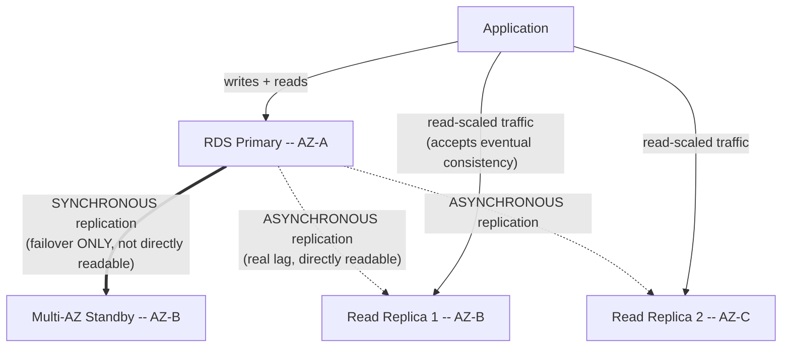
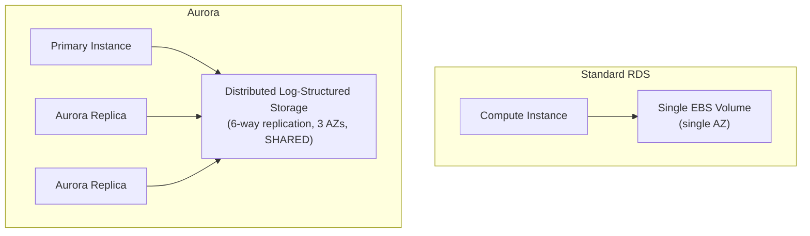
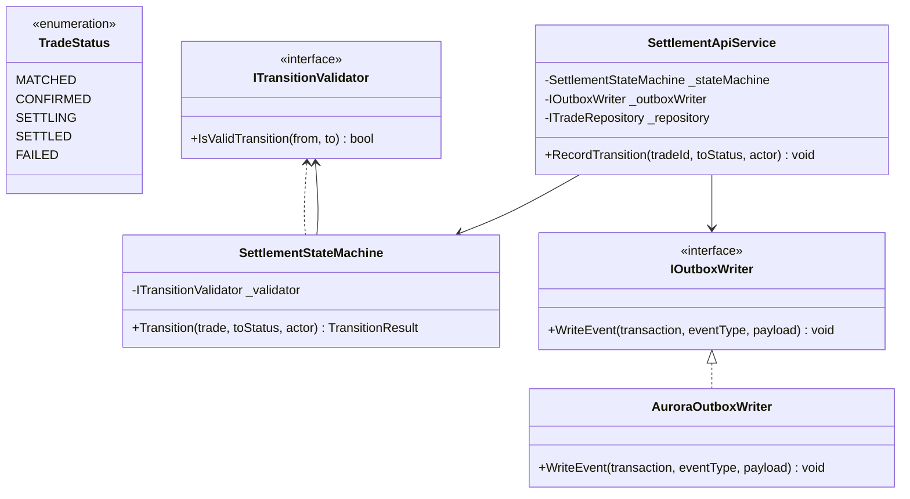
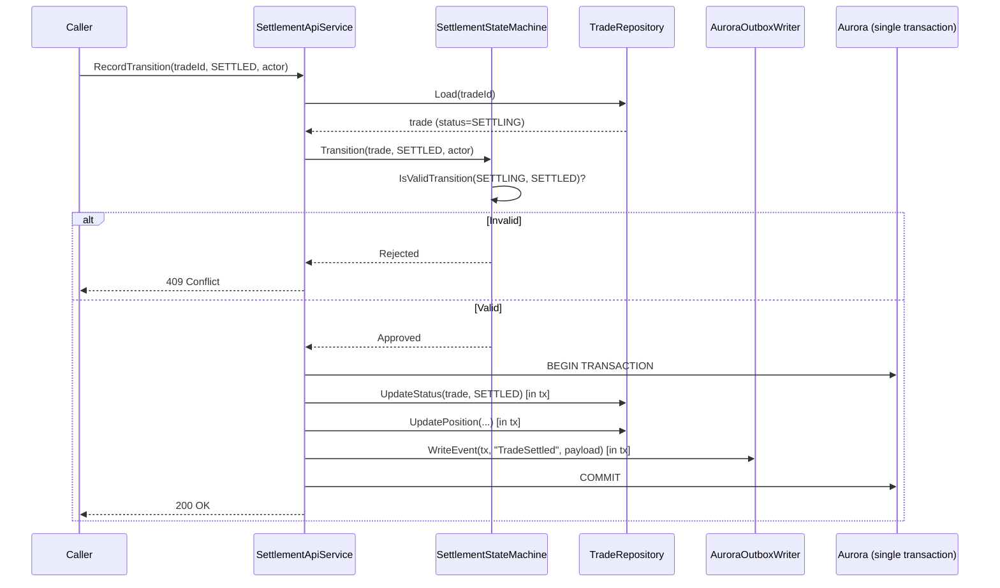

# Module 60 — AWS: Databases — RDS Multi-AZ & Read Replicas, Aurora Internals & DynamoDB Integration

> Domain: AWS | Level: Beginner → Expert | Prerequisite: [[../04-SQL-Server/02-Transactions-Isolation-Locking]], [[../08-DynamoDB/02-Consistency-Models-Capacity-Planning]] (this module maps those database-internals fundamentals onto specific AWS managed-service implementations), [[03-Storage-S3-EBS-EFS]] (RDS is built on EBS under the hood, inheriting its AZ-scoped durability characteristics unless Multi-AZ is explicitly configured)

---

## 1. Fundamentals

### Why does a Principal Engineer need AWS database-service depth beyond "RDS runs my database for me"?
RDS, Aurora, and DynamoDB are managed services, not magic — every failure mode this course already established for the underlying database engines (SQL Server/PostgreSQL isolation levels and locking, DynamoDB partition-key hot-spotting) still applies, but is now expressed through AWS-specific configuration knobs (Multi-AZ, read replica lag, Aurora's storage architecture, DynamoDB's on-demand vs. provisioned capacity) — a Principal Engineer must translate database-internals knowledge into correct configuration of the specific managed service, not assume "managed" means "the trade-offs disappear."

### Why does this matter?
Because RDS/Aurora/DynamoDB configuration mistakes (a Multi-AZ setting believed-but-not-actually enabled, a read replica silently serving stale data to a workload that needed strong consistency, a DynamoDB partition key design that recreates the exact hot-partition problem already covered) are among the most consequential, hard-to-reverse decisions in a cloud architecture, directly compounding the storage-durability discipline at the database layer specifically.

### When does this matter?
Any time a workload's data-layer choice must be made or reviewed on AWS — which, given this course's data-layer modules (18-28) already established SQL Server/PostgreSQL/MongoDB/Redis/DynamoDB fundamentals, is the natural point where that knowledge gets applied concretely to AWS's specific managed offerings.

### How does it work (30,000-ft view)?
```
RDS: managed relational database (SQL Server, PostgreSQL, MySQL, etc.) -- AWS handles patching,
 backups, failover; built on EBS storage
Multi-AZ: a SYNCHRONOUS standby replica in a different AZ, used ONLY for automatic failover
 -- not directly readable
Read Replica: an ASYNCHRONOUS copy for offloading read traffic -- directly readable, but with
 replication lag
Aurora: AWS's own MySQL/PostgreSQL-compatible engine with a distributed, log-structured storage
 layer decoupled from compute -- different internals from standard RDS
DynamoDB: fully managed NoSQL, already covered -28 -- this module focuses on
 integration patterns (streams, global tables) alongside RDS/Aurora
```

---

## 2. Deep Dive

### 2.1 RDS Multi-AZ — Synchronous Standby for Failover, Not for Read Scaling
RDS Multi-AZ provisions a **synchronous** standby replica in a different Availability Zone — every write is synchronously replicated to the standby before being acknowledged as committed, meaning the standby is always current, but this standby is **not directly readable** (with the historical exception noted in the Aurora contrast) and exists solely to be automatically promoted to primary during a failover (AWS detects the primary's failure and redirects the database's endpoint DNS to the now-promoted standby, typically within 60-120 seconds) — a common, costly misunderstanding is treating Multi-AZ as a read-scaling mechanism (it structurally is not) or assuming the synchronous replication itself provides zero-data-loss failover without confirming this in the specific engine's actual behavior, since the synchronous commit does guarantee the standby has every committed transaction, but application-level in-flight (uncommitted, or committed-but-not-yet-acknowledged-to-client) transactions during the failover window can still be affected.

### 2.2 Read Replicas — Asynchronous, for Read Scaling, With Real Replication Lag
A Read Replica is a separate, **asynchronously** replicated, independently readable copy — used specifically to offload read traffic from the primary (directly/19's read-scaling discussion, now expressed as an RDS-specific mechanism) — but because replication is asynchronous, a read replica can lag behind the primary by anywhere from milliseconds to, under sustained heavy write load or replica under-provisioning, meaningfully longer, meaning any workload reading from a replica has implicitly accepted **eventual consistency** for those reads, directly the same read-your-own-writes risk the MongoDB replica-set discussion already established, now recurring at the RDS layer — a workload that writes data and then immediately reads it back from a read replica (rather than from the primary) can observe stale data, a subtle, easy-to-miss correctness bug that only manifests under real production write load, not in low-traffic testing where replication lag is negligible.

### 2.3 Aurora — Distributed, Log-Structured Storage Decoupled From Compute
Aurora's storage architecture is fundamentally different from standard RDS: rather than a single EBS volume attached to a single compute instance, Aurora's storage layer is a distributed, log-structured system that automatically replicates data six ways across three AZs, with storage and compute scaled independently — this yields materially faster failover (typically under 30 seconds, since Aurora Replicas share the same underlying distributed storage rather than requiring their own full data copy) and allows Aurora Replicas (unlike standard RDS read replicas discussed) to be added or removed without a separate full data-copy operation, since they attach to the same shared storage layer. Aurora's replication to its own Replicas is still asynchronous with real (though typically sub-100ms, materially lower than standard RDS) lag, meaning the read-your-own-writes caution still applies, just with a smaller — not zero — lag window that must still be explicitly reasoned about, not assumed away.

### 2.4 DynamoDB Integration Patterns — Streams and Global Tables
Beyond DynamoDB's own core data-modeling and consistency fundamentals (already covered in Modules 27-28), two integration-focused capabilities matter for a broader AWS architecture: **DynamoDB Streams** captures an ordered, time-sequenced log of item-level changes (inserts, updates, deletes), consumable by Lambda or other consumers — directly the AWS-native implementation of the Change Data Capture / event-carried state transfer pattern, letting DynamoDB itself become an event producer (the same architectural role S3 played); **Global Tables** provide multi-Region, multi-active replication with automatic conflict resolution (last-writer-wins, based on timestamp), directly relevant to the distributed-consistency-model discussion — a workload adopting Global Tables must explicitly accept last-writer-wins semantics as its actual conflict-resolution model, not assume some stronger guarantee, since concurrent writes to the same item from different Regions can silently overwrite one another according to that rule.

### 2.5 Choosing Between RDS, Aurora, and DynamoDB — Matching the Actual Workload
This is a direct, concrete application of Modules 4-8/18-28's relational-vs-NoSQL trade-off discussion to AWS's specific offerings: RDS/Aurora fit workloads genuinely requiring relational modeling, multi-row/multi-table transactions, and complex joins/aggregations; DynamoDB fits workloads with access patterns fully known upfront, requiring single-digit-millisecond latency at very high, elastically variable scale, and where the single-table-design discipline is a worthwhile trade-off for that performance profile. Aurora specifically should be preferred over standard RDS by default for any new relational workload on AWS unless a specific, concrete reason favors standard RDS (a database engine Aurora doesn't support, e.g., SQL Server, or a genuine need for standard RDS's specific operational model) — Aurora's faster failover and independent storage/compute scaling are a strict improvement for MySQL/PostgreSQL-compatible workloads with no equivalent downside, making "just use standard RDS" without considering Aurora a missed-default anti-pattern for supported engines.

### 2.6 RDS Proxy — Connection Pooling as a Managed Layer
RDS Proxy sits between an application (particularly a Lambda-based or otherwise highly-concurrent, connection-churning workload — directly foreshadowing §the Lambda connection-exhaustion discussion) and the database, managing a pooled set of actual database connections and multiplexing many application-level logical connections onto them — this directly addresses a specific, real failure mode: a serverless or highly-elastic compute layer that opens a new database connection per invocation can exhaust the database's own maximum-connection limit under load, an entirely different failure mode from query performance or replication lag, and one that's easy to overlook until a scaling event (the exact same "invisible until a specific triggering event" pattern from the ASG-warm-up incident) causes a connection-limit-related outage.

---

## 3. Visual Architecture

### RDS Multi-AZ Failover vs. Read Replica Scaling

```mermaid
graph TB
 App[Application] -->|writes + reads| Primary[RDS Primary -- AZ-A]
 Primary ==>|"SYNCHRONOUS replication<br/>(failover ONLY, not directly readable)"| Standby[Multi-AZ Standby -- AZ-B]
 Primary -.->|"ASYNCHRONOUS replication<br/>(real lag, directly readable)"| Replica1[Read Replica 1 -- AZ-B]
 Primary -.->|"ASYNCHRONOUS replication"| Replica2[Read Replica 2 -- AZ-C]
 App -->|"read-scaled traffic<br/>(accepts eventual consistency)"| Replica1
 App -->|"read-scaled traffic"| Replica2
```

### Aurora's Decoupled Storage vs. Standard RDS

```mermaid
graph TB
 subgraph "Standard RDS"
 RDSCompute[Compute Instance] --> RDSStorage["Single EBS Volume<br/>(single AZ)"]
 end
 subgraph "Aurora"
 AurCompute1[Primary Instance] --> AurStorage["Distributed Log-Structured Storage<br/>(6-way replication, 3 AZs, SHARED)"]
 AurCompute2[Aurora Replica] --> AurStorage
 AurCompute3[Aurora Replica] --> AurStorage
 end
```

## 4. Production Example
**Scenario**: An order-management service handled checkout writes against an RDS PostgreSQL primary and, to reduce load on the primary, was modified to serve the immediate "order confirmation" page's data by reading from a read replica rather than the primary — a change that passed all testing (run against a lightly-loaded staging environment where replication lag was consistently under 10ms and therefore invisible). In production, during a high-traffic sales event, sustained heavy write volume caused replication lag to grow to several seconds during peak load. **Investigation**: a meaningful fraction of customers, immediately after completing checkout, saw an order-confirmation page reporting "order not found" — the checkout write had genuinely succeeded against the primary, but the confirmation page's read (against the lagging replica) executed before that specific write had propagated, a direct instance of the read-your-own-writes gap describes, invisible in testing precisely because testing never generated write load heavy enough to produce meaningful lag. **Root cause**: the read-scaling change was made without an explicit categorization of which specific reads could tolerate eventual consistency (browsing an order-history list, acceptable) versus which reads required strong, read-your-own-writes consistency (the immediate post-checkout confirmation page, not acceptable) — every read was routed to the replica uniformly, rather than routing based on this distinction. **Fix**: introduced explicit read-routing logic — reads immediately following a write by the same request/session (the order-confirmation page, and any similar "show me what I just did" pattern) are routed to the primary; reads with no such immediacy requirement (historical order browsing, reporting) remain routed to read replicas — and added a lag-monitoring alarm (CloudWatch's `ReplicaLag` metric) with a threshold tied to the specific business tolerance for the more lag-sensitive read paths, so future degradation is caught proactively rather than discovered via customer-visible failures. **Lesson**: read-scaling via replicas is not a uniform, workload-wide switch — it requires an explicit, per-read-path categorization of consistency requirements, precisely because the failure mode (stale reads) is invisible under the low-write-volume conditions typical of testing and only manifests under genuine production write load, the same "invisible until a specific real-world triggering condition" pattern recurring throughout this AWS domain.

## 5. Best Practices
- Never treat RDS Multi-AZ as a read-scaling mechanism — it exists solely for failover; use Read Replicas (or Aurora Replicas) for read scaling, with explicit acceptance of asynchronous replication lag.
- Explicitly categorize read paths by their actual consistency requirement (read-your-own-writes needed vs. eventual consistency acceptable) before routing any reads to a replica.
- Default to Aurora over standard RDS for any new MySQL/PostgreSQL-compatible workload, given its faster failover and independently-scaling storage, absent a specific reason favoring standard RDS.
- Use RDS Proxy for any highly-concurrent or serverless/Lambda-based workload to avoid database connection-limit exhaustion under scaling events.
- Monitor `ReplicaLag` (or Aurora's equivalent) with an alarm threshold tied to each read path's actual business-tolerance for staleness, not a generic default.

## 6. Anti-patterns
- Assuming Multi-AZ's synchronous standby can be used for read scaling, when it is structurally not directly readable and exists only for failover.
- Routing all reads uniformly to a read replica without categorizing which specific reads require read-your-own-writes consistency.
- Defaulting to standard RDS for a new MySQL/PostgreSQL-compatible workload without considering Aurora, missing its meaningfully faster failover and more flexible replica scaling at no equivalent downside.
- Allowing a highly-elastic, connection-churning compute layer (Lambda, an aggressively-autoscaling ASG) to connect directly to a database without RDS Proxy or equivalent pooling, risking connection-limit exhaustion under a scaling event.
- Adopting DynamoDB Global Tables without explicitly confirming the workload can tolerate last-writer-wins conflict resolution for concurrent cross-Region writes to the same item.

---

## 7. Performance Engineering

### 7.1 Connection-pool exhaustion — the failure mode that has nothing to do with query performance
RDS and Aurora instances have a hard maximum-connections ceiling derived from instance class (memory-based, roughly proportional to instance RAM — e.g., a `db.r6g.large`'s default `max_connections` is in the low hundreds, while a `db.r6g.4xlarge` supports several thousand), and exceeding it produces immediate, hard connection refusals (`FATAL: too many connections` on PostgreSQL/Aurora PostgreSQL) entirely independent of whether any individual query is fast or slow. The recurring production pattern: a fleet of application instances or Lambda functions, each opening its own connection pool sized for its *own* expected concurrency without any coordination with how many other instances/functions are doing the same simultaneously — under a genuine traffic spike (a scale-out event, a batch job kicking off at the same moment as normal traffic), the *sum* of all pools' maximum sizes exceeds the database's ceiling even though no individual pool is misconfigured in isolation. This is structurally the same "independently correct components colliding at a shared, un-owned boundary" pattern established for the LB↔target keep-alive mismatch — no single team's pool configuration is wrong, but the aggregate is. **RDS Proxy** (§2.6) is the concrete fix: it multiplexes many application-level logical connections onto a smaller, managed pool of actual database connections, and — critically — it survives a database failover by holding the client-facing connection open while transparently re-establishing the backend connection, removing the "every connected client must reconnect" thundering-herd that a bare failover otherwise produces against the now-restored instance.

### 7.2 Read-replica lag as a capacity, not just a consistency, problem
Beyond the consistency implications already established in §2.2/§4, replication lag is fundamentally a **capacity signal**: a replica falls behind specifically when it cannot apply the primary's write stream fast enough, which happens either because the replica instance is under-provisioned relative to the primary's write volume, or because a long-running query on the replica (a reporting query holding a lock or consuming significant I/O) is competing with replication apply threads for the same resources. CloudWatch's `ReplicaLag` (or Aurora's `AuroraReplicaLag`, typically sub-100ms but not immune) climbing under sustained write load — rather than under any particular query pattern — is the signal that the replica needs to be resized to match the primary's actual sustained write throughput, not merely sized for its own read query load; sizing a replica by "how many read queries does it need to serve" while ignoring "how fast must it apply the primary's write stream to stay current" is a common under-provisioning mistake with a direct correctness consequence (staler reads), not merely a performance one.

### 7.3 Aurora's buffer-cache warm-up and failover performance
Aurora's storage/compute decoupling (§2.3) means a newly promoted Aurora Replica has an empty (or partially warm, depending on prior replica traffic) local buffer cache immediately after promotion, even though the underlying distributed storage layer itself required no data copy — a query pattern that was fast against the old primary's warm cache can show a real, temporary latency spike against the newly promoted instance until its cache warms from genuine query traffic. For a latency-SLA-sensitive workload, keeping Aurora Replicas serving a small, continuous trickle of real read traffic *before* they're needed for failover (rather than provisioning them purely as cold standby) keeps their buffer cache warm and meaningfully reduces this post-failover latency spike — a direct, concrete argument for "use Aurora Replicas for read scaling in normal operation," beyond the pure throughput benefit already established.

---

## 8. Security

### 8.1 Encryption at rest, IAM database authentication, and the credential-rotation problem
RDS/Aurora encryption at rest (KMS-backed) must, as with EBS and S3, be enabled at instance creation — converting an unencrypted instance requires a snapshot-and-restore-into-a-new-encrypted-instance migration, not an in-place change. Beyond storage encryption, **IAM database authentication** lets an application authenticate to RDS/Aurora using short-lived IAM-signed tokens rather than a long-lived static database password, closing the recurring, high-severity risk of a static credential leaking into source control, a log line, or a long-forgotten configuration file and remaining valid indefinitely — an IAM auth token is valid for 15 minutes and generated on demand from the calling role's own IAM credentials, meaning a leaked token has a bounded, short blast-radius window compared to a leaked static password, which must be actively rotated (and every consumer updated) before its exposure window closes. IAM auth's trade-off: connection establishment carries a small added latency cost for token generation/validation, and — a real operational gotcha — the *maximum* connection rate supported over IAM auth is lower than over standard password auth for very-high-connection-churn workloads, which is precisely why pairing IAM auth with RDS Proxy (which pools and reuses backend connections) is the standard production combination rather than IAM auth against direct, high-churn connections.

### 8.2 Parameter groups and security-relevant engine settings
RDS/Aurora **parameter groups** control engine-level settings, and several carry direct security weight beyond pure performance tuning: enforcing SSL/TLS for all connections (`rds.force_ssl` on PostgreSQL-compatible engines), enabling audit logging extensions (`pgaudit` for PostgreSQL/Aurora PostgreSQL, capturing DDL/DML/role changes to a queryable log — directly the audit-trail requirement a regulator will ask for after any data-access incident), and disabling legacy authentication mechanisms. A custom parameter group with these settings explicitly configured — rather than relying on engine defaults, which typically prioritize broad compatibility over a hardened-by-default posture — should be the standing default for any parameter group backing regulated financial data, applied at instance creation via infrastructure-as-code so the setting is enforced and auditable rather than a manually-applied, driftable console change.

### 8.3 Least-privilege database roles and the blast radius of a single shared application credential
A recurring, high-severity anti-pattern independent of any AWS-specific mechanism: a single database user/role, granted broad read/write across every table, shared by every service or feature that touches the database — meaning a SQL-injection vulnerability or a compromised credential in *any one* consuming service grants an attacker the same broad access as the most-privileged legitimate consumer. Scoping database roles per service (a payments-service role with write access only to payment-related tables; a reporting-service role with read-only access, and only to the specific views it needs) directly bounds blast radius, mirroring the EFS-access-point and S3-prefix-scoping isolation principles already established at the storage layer, now applied at the database-role layer — and is a standing, non-AWS-specific but frequently-skipped-under-deadline-pressure discipline that a Principal Engineer should treat as non-negotiable for any workload touching regulated financial data.

### 8.4 DynamoDB fine-grained access control and encryption
DynamoDB tables are encrypted at rest by default (AWS-owned key, or optionally a customer-managed KMS key for auditable rotation, mirroring the S3/RDS pattern). IAM policy condition keys (`dynamodb:LeadingKeys`) enable per-item, tenant-scoped access control enforced at the IAM layer itself — independent of, and prior to, any application-level query filtering — providing the same defense-in-depth property already established for S3 prefix-scoping: an application bug that forgets to filter a query by tenant ID is still blocked by the IAM condition, rather than silently returning cross-tenant data.

---

## 9. Scalability

### 9.1 Aurora read-scaling — up to 15 replicas on shared storage
Because Aurora Replicas attach to the same shared, distributed storage layer as the primary (§2.3) rather than requiring their own independent full data copy, Aurora supports up to **15 Aurora Replicas** per cluster (versus standard RDS's much smaller practical replica-count ceiling, since each standard RDS read replica requires its own independently replicated storage), each addable or removable within minutes rather than the far longer provisioning time a full-data-copy replica requires. The **Aurora Reader endpoint** automatically load-balances read traffic across all current Aurora Replicas without the application needing to track individual replica endpoints — a direct scaling convenience, though it does not change the underlying eventual-consistency caution (§2.2/§4): more replicas means more aggregate read capacity, not a smaller replication-lag window for any individual replica.

### 9.2 RDS Proxy as a scaling, not just a pooling, mechanism
Beyond the connection-exhaustion fix already established (§7.1), RDS Proxy also enables a specific scaling pattern: **read/write splitting at the proxy layer** (routing read-only transactions to replicas and write transactions to the primary automatically, based on the proxy's transaction analysis) — reducing the amount of explicit read/replica-routing logic the application itself must implement, though the fundamental consistency categorization discipline (§4) still must inform which specific read paths are eligible for this automatic splitting versus which require pinning to the primary.

### 9.3 DynamoDB elastic capacity, partition-level ceilings, and Aurora Serverless as the relational analog
DynamoDB's on-demand capacity mode scales throughput automatically with traffic, but — as already established (§Advanced Q8/Q6 in §10 below) — this scales *table-level* aggregate throughput, not any single partition's ceiling (a hot partition remains a hot partition regardless of table-wide provisioned capacity). **Aurora Serverless v2** is the closest relational analog: it scales compute capacity (measured in Aurora Capacity Units) up and down automatically within a configured range in response to actual load, removing the need to manually provision for peak and pay for that peak capacity around the clock — but, like DynamoDB's table-vs-partition distinction, Aurora Serverless v2's scaling is compute-capacity scaling, not a substitute for connection-pool management (§7.1) or replica-lag-aware read routing (§4), both of which remain the application's responsibility regardless of how elastically the underlying compute scales.

### 9.4 Multi-Region — Aurora Global Database and DynamoDB Global Tables compared
Aurora Global Database replicates a primary Region's data to up to five secondary Regions with typical replication lag under one second, using dedicated storage-level replication infrastructure (not the standard MySQL/PostgreSQL binlog-based replication), and supports a managed, RPO-near-zero planned failover as well as a faster, more conservative unplanned failover — but writes are still only accepted in the primary Region during normal operation (Aurora Global Database is not multi-writer), meaning a Global Database deployment must funnel all writes through the primary Region regardless of where the request originated, an explicit architectural constraint that must be designed around, not discovered under load. DynamoDB Global Tables, by contrast, are genuinely multi-active/multi-writer (any Region can accept writes), at the cost of the last-writer-wins conflict-resolution semantics already established (§2.4/§Advanced Q7) — the choice between the two is fundamentally a choice between "single-writer-Region relational consistency with fast regional failover" and "multi-writer availability with an explicit, application-managed conflict model," and should be made deliberately per workload rather than defaulted based on which database engine was already in use for unrelated reasons.

---

## 10. Interview Questions

### Basic (10)
1. **Q: What is the difference between RDS Multi-AZ and a Read Replica?** **A:** Multi-AZ is a synchronous standby used only for automatic failover and is not directly readable; a Read Replica is an asynchronous, independently readable copy used for read scaling.
2. **Q: Why can't you read from an RDS Multi-AZ standby?** **A:** It exists structurally only to be promoted to primary during failover, not as a general-purpose readable endpoint.
3. **Q: What determines whether a read from a Read Replica might return stale data?** **A:** Asynchronous replication lag — the time between a write committing on the primary and that change propagating to the replica.
4. **Q: What is architecturally different about Aurora's storage compared to standard RDS?** **A:** Aurora uses a distributed, log-structured storage layer shared across replicas and replicated six ways across three AZs, decoupled from compute, versus standard RDS's single EBS volume per instance.
5. **Q: Why does Aurora typically fail over faster than standard RDS Multi-AZ?** **A:** Aurora Replicas share the same underlying distributed storage as the primary, so promotion doesn't require a separate full data copy.
6. **Q: What is DynamoDB Streams?** **A:** An ordered, time-sequenced log of item-level changes (inserts, updates, deletes) in a DynamoDB table, consumable by Lambda or other consumers.
7. **Q: What conflict-resolution model do DynamoDB Global Tables use?** **A:** Last-writer-wins, based on timestamp, for concurrent writes to the same item across Regions.
8. **Q: What problem does RDS Proxy solve?** **A:** Database connection-limit exhaustion caused by highly-concurrent or serverless compute layers opening many individual connections.
9. **Q: When should Aurora be preferred over standard RDS?** **A:** By default for any new MySQL/PostgreSQL-compatible workload, given its faster failover and independent storage/compute scaling, absent a specific reason favoring standard RDS.
10. **Q: What AWS-specific capability provides fine-grained, per-item access control in DynamoDB?** **A:** IAM policy condition keys, scoping access down to items matching a specific attribute value (e.g., a user's own ID).

### Intermediate (10)
1. **Q: Why is it a meaningful misunderstanding to treat RDS Multi-AZ as improving read throughput?** **A:** Multi-AZ's standby is not directly readable at all — it provides zero read-scaling benefit; only Read Replicas (a structurally separate feature) provide read scaling, and conflating the two leads to a workload that's neither actually failover-protected in the way assumed nor actually read-scaled.
2. **Q: Why did the incident's read-your-own-writes bug pass testing but fail in production?** **A:** Replication lag is driven by write volume; low-traffic testing generated negligible lag (sub-10ms, invisible), while production's heavy write load during a sales event produced multi-second lag, only then exposing the gap between when a write committed and when the replica reflected it.
3. **Q: Why must read replica sizing be planned against the primary's peak write throughput, not just the replica's own read query load?** **A:** Replication lag grows when a replica can't apply changes as fast as the primary generates them — an under-provisioned replica (sized only for its own read traffic) can develop unbounded lag under heavy primary write load, independent of how well it serves its own read queries.
4. **Q: Why is "just use standard RDS" considered a missed-default anti-pattern for a new PostgreSQL workload?** **A:** For supported engines, Aurora offers meaningfully faster failover and more flexible, storage-decoupled replica scaling with no equivalent downside — defaulting to standard RDS without considering Aurora forfeits a strict improvement without a compensating reason.
5. **Q: Why does a Lambda-based workload connecting directly to RDS without RDS Proxy risk an outage distinct from query performance or replication lag?** **A:** Each concurrent Lambda invocation can open its own database connection; at high concurrency (especially during a scaling event) this can exceed the database's maximum-connection limit, causing connection failures entirely independent of query correctness or replica staleness.
6. **Q: Why should DynamoDB Global Tables' last-writer-wins semantics be explicitly confirmed as acceptable before adoption, rather than assumed to be a stronger guarantee?** **A:** Concurrent writes to the same item from different Regions can silently overwrite one another based purely on timestamp ordering, with no merge or conflict-detection mechanism — a workload assuming some form of conflict detection or merging would silently lose data with no error surfaced.
7. **Q: Why is Aurora's storage auto-scaling described as more operationally transparent than standard RDS's storage scaling?** **A:** Aurora's distributed storage layer scales in increments automatically without a manual resize operation tightly coupled to a single EBS volume's own resize characteristics, whereas standard RDS storage scaling is more directly tied to the underlying EBS volume.
8. **Q: Why can DynamoDB's elastic capacity model still fail to prevent a scaling problem caused by partition-key design?** **A:** Elastic capacity scales the table's overall provisioned/on-demand throughput, but a poorly-chosen partition key that concentrates traffic onto a single logical partition creates a hot-partition bottleneck that overall table capacity doesn't fix, since the constraint is per-partition, not table-wide (the core lesson recurring here).
9. **Q: Why is fine-grained, per-item IAM-based access control in DynamoDB a meaningfully different capability than typical relational row-level security?** **A:** It's enforced at the AWS IAM layer itself (using policy condition keys tied to request context, like a user's Cognito identity), independent of and prior to any application-level query logic, providing a defense-in-depth layer that doesn't rely on the application code correctly implementing tenant-isolation filtering on every query.
10. **Q: Why must RDS/Aurora encryption be enabled at instance creation rather than added later?** **A:** Like EBS encryption, converting an existing unencrypted instance to encrypted isn't an in-place operation — it requires creating a new encrypted instance from a snapshot and migrating, making "enable by default at creation" the only low-cost path.

### Advanced (10)
1. **Q: Diagnose the incident from first principles, and design the specific architectural pattern (not just a monitoring fix) that eliminates this entire class of read-your-own-writes bug going forward.**
 **A:** Root cause: reads were routed to a replica uniformly, without distinguishing "reads that must reflect a write from the same causal chain/session" from "reads that can tolerate eventual consistency." Architectural fix: implement **session-consistency-aware read routing** — track, per request/session, whether a write occurred within a defined recent window (or explicitly, whether this specific read is causally dependent on this specific request's own preceding write), and route only such causally-dependent reads to the primary, while all other reads default to replicas — this generalizes beyond the single order-confirmation-page fix into a reusable routing policy applicable to any future read path, rather than requiring each new feature to individually rediscover the same consistency requirement.
2. **Q: A team argues that because Aurora Replicas typically have sub-100ms replication lag (versus standard RDS read replicas' potentially much higher lag), they no longer need to categorize reads by consistency requirement when using Aurora. Evaluate this claim.**
 **A:** Push back — sub-100ms is a *typical*, not *guaranteed*, lag figure; under sufficiently heavy write load (exactly the scenario that caused the incident), Aurora Replica lag can still grow beyond typical levels, and even a consistently low lag is not zero — any read path with a genuine read-your-own-writes requirement (a user immediately viewing their own just-submitted data) can still observe staleness during exactly the highest-load, highest-stakes moments (a flash sale, a viral event) when it matters most; "usually fast enough" is not the same guarantee as "structurally consistent," and the categorization discipline remains necessary regardless of the specific replication technology's typical lag characteristics.
3. **Q: Design the specific pre-production load-testing practice that would have caught the replication-lag gap before a live sales event exposed it, generalizing §Advanced Q1's scaling-event load-testing principle to the database-replication domain.**
 **A:** A load test must generate **realistic peak write volume** against the primary (not just realistic read volume against the replica in isolation) while simultaneously measuring actual replica lag and exercising the specific read-after-write user flow (checkout → immediate confirmation-page read) under that load — steady-state, read-only load testing (or low-write-volume testing) never exercises the specific condition (high write volume driving up replication lag) that only manifests under genuine peak write conditions, directly the same principle as §Advanced Q1's scaling-event-specific test design, now applied to database replication lag specifically.
4. **Q: A workload needs strict, transactional consistency across writes spanning both a relational (Aurora) table and a DynamoDB table (e.g., debiting an account balance in Aurora while writing an audit-log entry to DynamoDB, both must succeed or both must fail). Design an approach given that AWS provides no native cross-service ACID transaction.**
 **A:** Apply the Outbox pattern (the already-established pattern): write the DynamoDB audit-log entry (or, more robustly, an event representing "write this audit entry") into an outbox table within the *same* Aurora transaction as the balance debit, then use a separate, asynchronous process (DynamoDB Streams reacting to the outbox table's own change stream, or a polling worker) to reliably deliver that outbox entry into DynamoDB — this achieves effectively-exactly-once, atomic-with-respect-to-the-Aurora-write delivery into DynamoDB without requiring a native cross-service transaction, directly reusing the outbox reasoning rather than inventing a new mechanism for what is fundamentally the same cross-system-consistency problem.
5. **Q: Critique the following claim: "Since we enabled RDS Multi-AZ, our database is now resilient to any single point of failure."**
 **A:** Overstated — Multi-AZ protects specifically against AZ-level or instance-level infrastructure failure (the same category §Advanced Q9 flagged for ASGs), not against an application-level bug affecting data correctness identically on both primary and (synchronously replicated) standby, a bad schema migration applied uniformly, a Region-level failure (both AZs in the Multi-AZ pair reside in the same Region), or a downstream dependency failure unrelated to database infrastructure — the claim conflates "resilient to this specific addressed failure category" with "resilient to any single point of failure whatsoever," the same overgeneralization pattern flagged.
6. **Q: Design a partition-key strategy for a DynamoDB table backing a multi-tenant SaaS application's audit log, avoiding both the hot-partition risk and an overly fragmented design that makes cross-tenant reporting queries impractical.**
 **A:** Use a composite partition key combining tenant ID with a coarse time-bucket (e.g., `tenantId#yyyy-MM`) rather than tenant ID alone (which risks a hot partition for a single very-high-volume tenant) or an unbucketed, purely random key (which would make even per-tenant queries impractical) — this bounds any single partition's write volume to one tenant's one-month window while keeping per-tenant, per-month queries a simple, efficient partition-key query; cross-tenant/cross-time reporting queries are then explicitly handled via a separate mechanism (a DynamoDB Streams-fed analytics pipeline, or export to a query-optimized store) rather than forcing the primary table's partition-key design to serve an access pattern it isn't suited for (directly the single-table-design discipline: design partition keys for the actual primary access pattern, not every conceivable query).
7. **Q: A Principal Engineer discovers that a workload uses DynamoDB Global Tables for a shopping-cart feature, and a customer occasionally reports items silently disappearing from their cart when switching between Regions (e.g., traveling). Diagnose and propose a fix.**
 **A:** Likely cause: concurrent writes to the same cart item from different Regions (e.g., a stale client request from the previous Region arriving after the customer has already moved and made changes visible in the new Region) resolve via last-writer-wins purely on timestamp, meaning an older write can silently overwrite a newer one if it happens to arrive and be applied later chronologically at the storage layer, not necessarily in true real-world completion order across the client's actual usage. Fix: redesign the cart's data model to be **additive/mergeable** rather than overwrite-based (e.g., each cart action recorded as an independent, append-only event, with the "current cart" computed as a merge/reduction over recent events rather than a single overwritten item) — sidestepping last-writer-wins data loss entirely by never relying on whole-item overwrite semantics for concurrently-modifiable data, a direct application of the CRDT-adjacent, merge-friendly-design principle for genuinely multi-writer data.
8. **Q: Explain why "our database is managed by AWS" does not reduce the Principal-Engineer-level responsibility to reason about consistency models, failure modes, and capacity, using at least two specific examples from this module.**
 **A:** AWS managing patching/backups/infrastructure operations removes *operational* burden, but the fundamental distributed-systems trade-offs remain entirely the application architect's responsibility to reason about correctly: (1) Multi-AZ vs. Read Replica's synchronous-vs-asynchronous distinction is a consistency-model choice no amount of "AWS manages it" abstracts away — routing the wrong read to the wrong replica type is an application-level design error regardless of how well AWS operates the underlying infrastructure; (2) DynamoDB partition-key hot-spotting persists as a real constraint regardless of DynamoDB's elastic capacity management, because the constraint is a property of the access pattern's interaction with the partitioning scheme, not something more provisioned capacity alone resolves.
9. **Q: Design the specific standing capacity-planning review needed to prevent RDS Proxy-fronted connection pools from silently masking a genuine, growing database load problem behind an apparently-healthy connection count.**
 **A:** Monitor not just RDS Proxy's own connection-pool utilization (which can remain healthy simply because pooling is absorbing high application-level connection churn) but the *underlying database's* actual query latency, CPU/IOPS utilization, and lock-wait metrics directly — RDS Proxy solves the connection-count problem specifically, but doesn't reduce or mask genuine query-load growth on the database itself; a review relying solely on "connection pool looks fine" without independently tracking underlying database load risks missing a real capacity problem that RDS Proxy's pooling layer has no visibility into resolving.
10. **Q: As a Principal Engineer establishing database standards for an organization's AWS workloads, design the specific set of standing architectural reviews and automated checks (synthesizing this entire module) you would require for every new relational or DynamoDB workload.**
 **A:** (1) Mandatory explicit read-path consistency categorization (session-consistency-aware routing, Advanced Q1) for any workload adopting read replicas — necessary because uniform read routing silently reintroduces the failure mode. (2) Mandatory Aurora-by-default policy for new MySQL/PostgreSQL-compatible workloads, with an explicit, reviewed justification required to choose standard RDS instead — necessary to avoid forfeiting a strict improvement by default. (3) Mandatory RDS Proxy (or equivalent pooling) for any Lambda-based or highly-elastic compute layer connecting to RDS/Aurora — necessary to prevent connection-exhaustion outages during scaling events. (4) Mandatory partition-key design review for any new DynamoDB table, explicitly validating against the workload's actual peak-traffic-concentration risk (Advanced Q6) — necessary because hot-partition risk is invisible until real skewed traffic exposes it. (5) Mandatory conflict-resolution-model review (last-writer-wins acceptability, or redesign toward mergeable data, Advanced Q7) before adopting DynamoDB Global Tables for any multi-writer-capable data. Each standard targets a distinct, concrete failure mode this module identified, extending the governance-gate pattern from Modules 57-59 into the database layer specifically.

### Expert (10)
1. **Q: A fleet of 40 microservice instances, each with its own connection pool sized for 20 connections against a shared Aurora PostgreSQL cluster whose `max_connections` is 800, begins throwing `too many connections` errors only during a coordinated deploy where old and new instance generations briefly coexist. Diagnose and design the fix.**
 **A:** During a rolling deploy, old and new instance generations run simultaneously for the deploy's duration, each maintaining its own full-sized pool — 40 instances × 2 generations briefly present × 20 connections can exceed 800 even though steady-state (40 × 20 = 800) is exactly at the ceiling with zero headroom. Root cause: pool sizing assumed a static instance count with no margin for the transient doubling every rolling deploy inherently causes. Fix: front the cluster with RDS Proxy, sized to a bounded backend-connection pool regardless of how many application-level logical connections request one, removing the direct coupling between "number of application instances" and "number of actual database connections" — a structural fix rather than a per-deploy pool-size tuning exercise that would need re-tuning every time fleet size changes.
2. **Q: A read replica's `ReplicaLag` climbs steadily every day at 2 AM and recovers by 3 AM, correlating with a scheduled reporting job that queries the replica. The replica instance class matches the primary's. Diagnose.**
 **A:** The reporting job's queries are competing with replication-apply threads for the same instance resources (I/O, CPU, lock contention on tables the replication stream is also touching) — matching instance class addresses raw capacity but not necessarily resource contention between concurrent workloads sharing that capacity. Diagnose by checking whether the reporting query holds long-running locks or triggers heavy sequential scans during that window, correlated against the lag spike's exact timing. Fix: move the reporting workload to a dedicated Aurora Replica (Aurora's up-to-15-replica ceiling makes this cheap, §9.1) isolated from replicas serving latency-sensitive application read traffic, so heavy analytical queries never compete with replication-apply threads that keep the application-facing replica's lag low.
3. **Q: Design the specific IAM database authentication rollout plan for migrating a fleet of Lambda functions off static database passwords, addressing the connection-rate limitation called out in §8.1.**
 **A:** Because IAM auth has a lower maximum connection-establishment rate than password auth, and Lambda's per-invocation connection pattern is exactly the high-churn case that stresses that limit, the rollout must pair IAM auth with RDS Proxy from day one rather than pointing Lambda directly at the database endpoint with IAM auth — RDS Proxy absorbs the connection churn (its own pool reuses backend connections regardless of how the client authenticated) while each Lambda invocation still authenticates to the proxy using its own short-lived IAM token, achieving both the credential-rotation security benefit (§8.1) and avoiding the connection-rate ceiling that would otherwise make direct IAM auth against high-churn Lambda traffic a self-inflicted new bottleneck.
4. **Q: A team argues that since Aurora Serverless v2 scales automatically, they no longer need to size or monitor their connection pool. Evaluate this claim.**
 **A:** Push back — Aurora Serverless v2 scales *compute capacity* (ACUs) in response to CPU/memory pressure, not the database engine's `max_connections` ceiling, which is still derived from the currently allocated capacity and can still be exceeded by an unbounded or poorly pooled connection pattern well before compute capacity itself becomes the binding constraint; a connection-storm can still produce `too many connections` errors even while ACU utilization looks moderate. Elastic compute scaling and connection-pool management are two independent problems (directly the DynamoDB table-vs-partition-ceiling distinction, §9.3, recurring in relational form) — Serverless v2 answers "do I have enough compute," not "am I opening more connections than the engine allows."
5. **Q: Design a cross-Region failover architecture for a payments-ledger workload using Aurora Global Database, given the constraint that writes are only accepted in the primary Region during normal operation. How do you handle write traffic originating in the secondary Region during normal (non-failover) operation?**
 **A:** All write traffic, regardless of where the request originates, must be routed to the primary Region's Aurora endpoint — the application layer in the secondary Region acts as a read-local, write-remote client, accepting the added latency of a cross-Region write round-trip as the deliberate cost of maintaining single-writer relational consistency; this must be an explicit architectural decision stated to stakeholders (e.g., "writes from our EU customers incur an extra ~80ms cross-Region hop to the US primary") rather than discovered as an unexplained latency regression after the multi-Region deployment ships. For a workload that cannot tolerate that write latency, the correct conclusion is that Aurora Global Database's single-writer model is the wrong fit, and either a genuinely multi-writer store (DynamoDB Global Tables, with its own last-writer-wins trade-off) or a regional-sharding strategy (each Region's users write to that Region's own primary, with no cross-Region single-ledger requirement) should be considered instead.
6. **Q: A DynamoDB table using Global Tables backs a real-time trading position ledger. Explain, with a concrete example, why last-writer-wins conflict resolution makes this specific use case unsuitable for Global Tables as designed, and propose the fix.**
 **A:** Concurrent writes updating the same position item from two Regions (e.g., a trade execution recorded in the US Region and a risk-limit adjustment recorded in the EU Region, both touching the same item within the same replication-lag window) resolve purely by timestamp — the chronologically later write wins outright, silently discarding the earlier write's changes rather than merging both updates, which for a financial position ledger means a real, silent loss of a recorded trade or adjustment with no error surfaced anywhere. Fix: redesign the ledger as an append-only event stream (each trade/adjustment written as a new, immutable item rather than an in-place update to a shared "current position" item), with the current position computed as a reduction over the event stream — sidestepping last-writer-wins entirely by never relying on overwrite semantics for concurrently-writable data, the same CRDT-adjacent, merge-friendly redesign principle already established for the shopping-cart scenario, now applied to a genuinely higher-stakes financial data model.
7. **Q: Critique the following claim: "Enabling `pgaudit` and IAM database authentication satisfies our audit and access-control requirements for a regulated database."**
 **A:** Incomplete on two fronts: `pgaudit` logs *what happened at the database engine level*, but is only useful if those logs are shipped somewhere durable, queryable, and tamper-evident (S3 with Object Lock, or a dedicated log-aggregation pipeline) — logs sitting only on the instance's own storage don't survive an instance replacement and aren't independently auditable. IAM database authentication solves credential *lifecycle* (short-lived tokens vs. static passwords) but says nothing about *authorization scope* — an IAM-authenticated connection using an overly broad database role (§8.3) still has all the blast-radius risk of a shared, over-privileged credential, just with better rotation hygiene. Both controls are necessary but neither is sufficient alone; a complete answer requires least-privilege role scoping plus durable, tamper-evident audit-log shipping alongside the credential-lifecycle improvements.
8. **Q: As a Principal Engineer, design the specific load test that would validate whether a proposed RDS Proxy configuration actually prevents connection exhaustion during a realistic scale-out event, rather than merely confirming it works at steady state.**
 **A:** Directly extend the module's recurring "test the actual triggering condition, not steady state" principle (established for replication-lag testing and LB scaling testing elsewhere in this course): the load test must simulate a genuine scale-out event — a sudden increase in application instance count (or Lambda concurrency) hitting the proxy simultaneously, not a gradual ramp — while measuring the proxy's own connection-pool saturation, the underlying database's actual connection count and query latency, and end-to-end application error rate throughout the transient spike, not just after it settles. A steady-state-only load test would validate the proxy's steady-state pooling ratio but never exercise the specific transient-doubling condition (Expert Q1) that actually causes connection-exhaustion incidents in production.
9. **Q: A workload needs to guarantee that a specific report, immediately after a batch job completes writing to Aurora, reflects 100% of that batch's writes when read from an Aurora Replica moments later. Design an approach that doesn't require routing that report's read to the primary.**
 **A:** Use Aurora's read-after-write consistency mechanism where supported (session-level read consistency directed at a specific replica, confirming that replica has applied a specific commit LSN/sequence position before serving the read), or, more portably across engines, have the batch job explicitly poll `AuroraReplicaLag` (or query the target replica for its current applied-WAL position) after completing its writes and only signal "report is ready" once the target replica's applied position has caught up past the batch's final commit — making the read-after-write guarantee an explicit, observable handshake between writer and reader rather than an assumption about typical lag being "probably fast enough," directly extending the Production Example's core lesson into a concrete, verifiable mechanism rather than routing everything to the primary by default (which would forfeit the replica's read-scaling benefit unnecessarily for a a report that could otherwise be replica-served with a short, bounded wait).
10. **Q: Synthesize this module's connection-management, replication-lag, encryption, and multi-Region material into a single standing pre-production database-architecture checklist for any new FinTech relational or DynamoDB workload.**
 **A:** (1) RDS Proxy (or equivalent pooling) mandatory for any Lambda-based or highly-elastic compute layer, sized against realistic scale-out transient behavior, not just steady state (§7.1, Expert Q1/Q8) — prevents connection-exhaustion outages. (2) Explicit per-read-path consistency categorization before adopting any read replica, with a documented mechanism (session-consistency routing or an explicit lag-confirmation handshake, Expert Q9) for any path requiring read-your-own-writes. (3) IAM database authentication paired with RDS Proxy, plus least-privilege, per-service database roles (§8.1, §8.3) — bounds both credential-lifecycle and blast-radius risk. (4) Durable, tamper-evident audit-log shipping (`pgaudit` or equivalent, shipped off-instance) mandatory for any regulated-data database (Expert Q7). (5) Explicit multi-Region write-routing design (single-writer-with-remote-write-cost vs. multi-writer-with-conflict-model, §9.4, Expert Q5/Q6) documented and stress-tested before any Global Database or Global Tables adoption for multi-writer-capable data. Each item closes a distinct, concrete failure mode this module identified, extending the governance-gate pattern established for the storage-layer checklist into the database layer specifically.

---

## 11. Coding Exercises

### Easy — Read/write connection-string separation for replica routing
```csharp
public class OrderRepository
{
    private readonly NpgsqlConnection _primaryConnection; // writes + read-your-own-writes reads
    private readonly NpgsqlConnection _replicaConnection; // eventual-consistency-tolerant reads

    public async Task<Order> GetOrderConfirmationAsync(Guid orderId)
    // the fix: post-checkout confirmation MUST read from primary
    => await QueryOrderAsync(_primaryConnection, orderId);

    public async Task<List<Order>> GetOrderHistoryAsync(Guid customerId)
    // Historical browsing tolerates eventual consistency -- safe to read-scale via replica
    => await QueryOrderHistoryAsync(_replicaConnection, customerId);
}
```

### Medium — RDS Proxy connection string for a Lambda function
```csharp
// Lambda connects to the RDS PROXY endpoint, never directly to the database endpoint --
// the proxy pools/multiplexes connections, avoiding per-invocation connection exhaustion.
var connectionString =
"Host=order-db-proxy.proxy-abc123.us-east-1.rds.amazonaws.com;" +
    "Database=orders;Username=app_role;" +
    "SSL Mode=Require"; // RDS Proxy requires TLS
```

### Hard — DynamoDB Streams triggering a downstream event
```csharp
[LambdaFunction]
public async Task HandleDynamoDbStreamEvent(DynamoDBEvent evt)
{
    foreach (var record in evt.Records)
    {
        if (record.EventName == "INSERT")
        {
            var newImage = record.Dynamodb.NewImage;
            // DynamoDB itself is the event PRODUCER here -- same architectural role
            // S3 event notifications played.
            await _snsClient.PublishAsync(new PublishRequest
                {
                    TopicArn = "arn:aws:sns:us-east-1:222222222222:order-created",
                        Message = JsonSerializer.Serialize(newImage)
            });
        }
    }
}
```

### Expert — Outbox pattern reconciling an Aurora transaction with a downstream DynamoDB write (§Advanced Q4)
```csharp
public async Task DebitAccountWithAuditAsync(Guid accountId, decimal amount)
{
    await using var transaction = await _auroraConnection.BeginTransactionAsync;
    try
    {
        // 1. The actual business write, and the outbox entry, in the SAME Aurora transaction --
        // atomicity is guaranteed by Aurora itself, not by any cross-service mechanism.
        await _auroraConnection.ExecuteAsync(
            "UPDATE accounts SET balance = balance - @amount WHERE id = @accountId",
                new { amount, accountId }, transaction);

        await _auroraConnection.ExecuteAsync(
            "INSERT INTO outbox (event_type, payload, created_at) VALUES ('AccountDebited', @payload, NOW)",
                new { payload = JsonSerializer.Serialize(new { accountId, amount }) }, transaction);

        await transaction.CommitAsync;
    }
    catch { await transaction.RollbackAsync; throw; }

    // 2. A SEPARATE worker (not shown) polls the outbox table and reliably delivers
    // each entry into DynamoDB's audit-log table, with at-least-once delivery + idempotent writes.
}
```

---

## 12. System Design

### Scenario: designing the data layer for a real-time trade-settlement platform

**Requirements.**
*Functional*: record trade instructions and their settlement lifecycle (matched → confirmed → settled → failed); support strict transactional consistency for balance/position updates; support high-volume audit-log/event capture for every state transition; support both operational reads (a trader viewing their own recent trades, requiring read-your-own-writes) and analytical reads (end-of-day reconciliation reporting across millions of trades).
*Non-functional*: zero tolerance for lost or duplicated settlement instructions; sub-second P99 for operational reads; RPO near-zero for the settlement ledger; horizontal read scalability for reporting without impacting operational latency; auditable, tamper-evident history of every state transition for regulatory examination.

**Architecture.** The settlement ledger itself — the authoritative record of trade state — lives in **Aurora PostgreSQL**, chosen deliberately over DynamoDB despite DynamoDB's superior raw throughput ceiling, because the ledger's actual requirements (multi-row transactional updates spanning a trade record and its associated position/balance rows, ad hoc joins for exception investigation, mature tooling for a DBA/ops team to operate under audit) are relational-modeling requirements, directly applying §2.5's workload-fit discipline rather than defaulting to DynamoDB for its scalability reputation alone. Every state transition is written within a single Aurora transaction alongside an **outbox row** (the pattern already established in §11's coding exercise), which a Debezium-style CDC process (or DynamoDB Streams-fed relay, if the outbox table itself were DynamoDB — here, Aurora's own logical replication) reliably publishes to a downstream event stream (Kafka/Kinesis) for two purposes: feeding the audit/analytics pipeline, and feeding read-optimized materialized views. Operational reads (a trader's own recent trades) route to the Aurora primary or a warm, continuously-read Aurora Replica (§7.3) with explicit session-consistency-aware routing (§4's fix, reused directly). Analytical/reporting reads never touch Aurora at all in the hot path — they're served from a separate, denormalized read store (could be Redshift, or a reporting-optimized Aurora Replica isolated per §Expert Q2) fed by the same event stream, so a heavy EOD reconciliation query can never contend with operational replication or operational query latency.

**Component glossary.** *Settlement API*: the only writer of trade-state transitions; every write is one Aurora transaction touching the trade row, position/balance rows, and the outbox row together. *Aurora primary + Multi-AZ standby*: the authoritative, transactionally consistent ledger; Multi-AZ for failover, not read scaling (§2.1, applied directly). *Aurora Replica (operational)*: kept warm with continuous read traffic (§7.3), serves read-your-own-writes-sensitive operational reads with explicit primary-routing for the specific sub-second-after-write window. *Outbox relay*: publishes committed state transitions to the event stream exactly once per committed transaction (at-least-once delivery with idempotent downstream consumers, since true exactly-once delivery across a network boundary is not achievable without idempotency doing the real work). *Event stream (Kafka/Kinesis)*: the durable, replayable backbone feeding both the audit trail and the reporting read-store — replayability is itself a design requirement, since a reporting bug discovered weeks later must be fixable by reprocessing history, not just by fixing the bug going forward. *Reporting read-store*: denormalized, isolated from operational query load entirely, rebuildable from the event stream if ever corrupted (the same authoritative-vs-disposable-working-copy distinction established in the sibling storage module, now applied to a derived read model rather than a file).

**Data model (Aurora, abbreviated).**

| Table | Key columns | Description |
|---|---|---|
| trades | trade_id (PK), instrument, counterparty_id, amount, status | Core trade record; status is the lifecycle enum below |
| positions | account_id (PK), instrument, quantity, updated_at | Current position, updated transactionally alongside trade state changes |
| outbox | event_id (PK), aggregate_id, event_type, payload, created_at, published | Transactional outbox; relay marks `published = true` after successful delivery |
| settlement_audit | audit_id (PK), trade_id, from_status, to_status, actor, occurred_at | Immutable, append-only transition log — never updated, only inserted |

**Status lifecycle.** `MATCHED → CONFIRMED → SETTLING → SETTLED`, with `FAILED` reachable from `CONFIRMED` or `SETTLING` (a failed settlement is a terminal state requiring manual investigation, never silently retried into `SETTLED`). Every transition is validated against this state machine at the application layer before the transactional write, rejecting any attempted transition not present in the allowed-edges set (e.g., `SETTLED → CONFIRMED` is rejected outright) — directly preventing a class of data-corruption bug where a retried or out-of-order request could otherwise regress a trade's state.

**End-to-end walkthrough.**
1. A trade is matched upstream and the Settlement API receives a `RecordMatch` instruction.
2. The API validates the transition (`(none) → MATCHED` is a valid initial state) and, in one Aurora transaction, inserts the trade row, an audit row, and an outbox row.
3. The transaction commits; the outbox relay picks up the new outbox row (via logical replication, sub-second lag typically) and publishes a `TradeMatched` event to the event stream.
4. A downstream confirmation process eventually calls `RecordConfirmation`, repeating the same transactional pattern for the `MATCHED → CONFIRMED` transition, updating the position row in the same transaction.
5. A trader opens their blotter; the operational-read path checks whether this trader has a transition within the last few seconds (session-consistency routing) and, if so, reads from the primary; otherwise reads from the warm Aurora Replica.
6. The settlement engine calls `RecordSettlement`, transitioning `CONFIRMED/SETTLING → SETTLED`, again transactionally with the position update and outbox/audit rows.
7. The reporting read-store's consumer processes the `TradeSettled` event and updates its denormalized EOD reconciliation view, entirely decoupled from the operational path's latency.
8. Nightly, the reconciliation job reads exclusively from the reporting read-store, never touching Aurora, so a multi-hour reconciliation query has zero blast radius on operational latency.
9. If the reporting read-store is ever found to be inconsistent (a bug in the consumer logic), it is rebuilt by replaying the event stream from a checkpoint — the read-store is explicitly a disposable, reconstructable derived artifact, never the system of record.

**Failure handling.** A failed outbox-relay delivery is retried with backoff; the outbox row's `published` flag ensures at-least-once, and downstream consumers key on `event_id` for idempotent processing, closing the "duplicate delivery" gap without requiring a distributed transaction. A Multi-AZ failover promotes the standby within the standard failover window; the Settlement API's connection layer (via RDS Proxy, §7.1/§9.2) transparently re-establishes against the new primary without every application instance needing to reconnect independently.

**Monitoring.** `ReplicaLag` on the operational replica with an alarm threshold tied to the read-your-own-writes routing window's own assumptions; outbox-relay publish lag (time between commit and successful downstream publish); `FATAL: too many connections` rate (§7.1); reporting read-store consumer lag against the event stream; a standing reconciliation check comparing Aurora's own trade-count/sum-of-amounts against the reporting read-store's, alerting on any drift beyond a small, explicitly-tolerated window.

**Trade-offs.** Isolating reporting reads into a separate, event-stream-fed store adds real infrastructure (the stream, the consumer, the read-store) and a genuine eventual-consistency gap between "settled in Aurora" and "visible in the reporting view" — accepted deliberately because the alternative (reporting queries running directly against Aurora) risks exactly the kind of operational-latency-impacting resource contention already diagnosed in §Expert Q2, and because reconciliation reporting has no read-your-own-writes requirement in the first place.

## 13. Low-Level Design

### Class design for the settlement state-machine and outbox writer


```mermaid
classDiagram
    class TradeStatus {
        <<enumeration>>
        MATCHED
        CONFIRMED
        SETTLING
        SETTLED
        FAILED
    }
    class ITransitionValidator {
        <<interface>>
        +IsValidTransition(from, to) bool
    }
    class SettlementStateMachine {
        -ITransitionValidator _validator
        +Transition(trade, toStatus, actor) TransitionResult
    }
    class IOutboxWriter {
        <<interface>>
        +WriteEvent(transaction, eventType, payload) void
    }
    class AuroraOutboxWriter {
        +WriteEvent(transaction, eventType, payload) void
    }
    class SettlementApiService {
        -SettlementStateMachine _stateMachine
        -IOutboxWriter _outboxWriter
        -ITradeRepository _repository
        +RecordTransition(tradeId, toStatus, actor) void
    }
    ITransitionValidator <.. SettlementStateMachine
    SettlementStateMachine --> ITransitionValidator
    IOutboxWriter <|.. AuroraOutboxWriter
    SettlementApiService --> SettlementStateMachine
    SettlementApiService --> IOutboxWriter
```

### Sequence diagram — recording a settlement transition


```mermaid
sequenceDiagram
    participant Caller
    participant Svc as SettlementApiService
    participant SM as SettlementStateMachine
    participant Repo as TradeRepository
    participant Outbox as AuroraOutboxWriter
    participant DB as Aurora (single transaction)
    Caller->>Svc: RecordTransition(tradeId, SETTLED, actor)
    Svc->>Repo: Load(tradeId)
    Repo-->>Svc: trade (status=SETTLING)
    Svc->>SM: Transition(trade, SETTLED, actor)
    SM->>SM: IsValidTransition(SETTLING, SETTLED)?
    alt Invalid
        SM-->>Svc: Rejected
        Svc-->>Caller: 409 Conflict
    else Valid
        SM-->>Svc: Approved
        Svc->>DB: BEGIN TRANSACTION
        Svc->>Repo: UpdateStatus(trade, SETTLED) [in tx]
        Svc->>Repo: UpdatePosition(...) [in tx]
        Svc->>Outbox: WriteEvent(tx, "TradeSettled", payload) [in tx]
        Svc->>DB: COMMIT
        Svc-->>Caller: 200 OK
    end
```

**Design patterns used.** *State* — `SettlementStateMachine` plus `TradeStatus` encapsulates the allowed-transition logic in one place rather than scattering `if (status == ...)` checks across every write path, directly preventing the state-regression bug class named in §12. *Transactional Outbox* (the module's recurring pattern) — `AuroraOutboxWriter` guarantees the event write is atomic with the business-data write, since both occur inside the same database transaction, avoiding a dual-write race between "update the trade" and "publish the event" as two independent operations. *Repository* — `ITradeRepository` isolates persistence details from the state-machine/service logic, enabling the service layer to be unit-tested against an in-memory fake repository.

**SOLID mapping.** *SRP*: `SettlementStateMachine` owns only transition-validity logic; `AuroraOutboxWriter` owns only outbox-row persistence; `SettlementApiService` orchestrates but delegates both. *OCP*: adding a new terminal state (e.g., `CANCELLED`) means extending `ITransitionValidator`'s allowed-edges table, not modifying `SettlementApiService`. *LSP*: any `IOutboxWriter` implementation (Aurora-backed today, potentially a different store later) is substitutable without changing the service's transaction-orchestration logic. *ISP*: `ITransitionValidator` and `IOutboxWriter` are each narrowly scoped rather than one large `IPersistenceGateway`. *DIP*: `SettlementApiService` depends on the three interfaces, not concrete Aurora types, enabling the entire transition/outbox flow to be tested without a live database.

**Extensibility.** A new event consumer (e.g., a fraud-scoring service subscribing to `TradeSettled`) requires zero changes to the settlement write path — it simply subscribes to the existing event stream, directly the benefit of the outbox/event-stream pattern over point-to-point integration.

**Concurrency/thread safety.** Concurrent transition attempts on the *same* trade are serialized by Aurora's own row-level locking within the transaction (`SELECT ... FOR UPDATE` on the trade row before validating the transition), preventing a race where two concurrent requests both read `status = CONFIRMED` and both attempt to transition to `SETTLED`, double-processing the settlement — the state-machine validation alone is insufficient without this row-level lock, since the validation logic itself has no visibility into a concurrent, in-flight transaction until that transaction commits or rolls back.

## 14. Production Debugging

**Incident: duplicate settlement events observed downstream, causing a fraud-scoring service to double-count trade volume for a subset of accounts.**

**Investigation.** The fraud-scoring team reported that a small number of accounts showed roughly double their actual daily trade volume. Cross-referencing the fraud service's ingested event log against Aurora's `settlement_audit` table showed, for the affected accounts, that the *same* `event_id` had been delivered to the event stream **twice**, several minutes apart — ruling out an application-level double-write (Aurora's `settlement_audit` showed exactly one row per transition, confirming the state-machine and transactional-outbox write path itself was behaving correctly). The duplication was happening downstream of the commit, in the outbox relay.

**Root cause.** The outbox relay process, on a transient network blip while publishing to the event stream, received an ambiguous response (a timeout, not an explicit failure or success acknowledgment) after having, in fact, successfully published the event — its retry logic, seeing no confirmed success, retried the publish from the same un-advanced checkpoint, delivering the same event a second time. The relay's delivery guarantee was genuinely, correctly *at-least-once* (as documented and as the outbox pattern is designed to provide) — but the downstream fraud-scoring consumer had been implemented assuming *exactly-once* delivery, incrementing a running volume counter directly from each received event without checking whether that specific `event_id` had already been processed.

**Tools.** Comparing `settlement_audit` row counts against event-stream message counts per account (isolated the issue to the relay-to-stream leg, not the Aurora write path); the event stream's own consumer-offset and delivery-attempt metrics (showed the relay's retry against an already-successful publish); code review of the fraud-scoring consumer confirmed it had no idempotency check.

**Fix.** Immediate: the fraud-scoring consumer was updated to track processed `event_id`s (a deduplication window keyed on event ID, since every outbox event already carries a unique ID by construction) and skip any event ID already applied — converting the consumer from naively-exactly-once-assuming to correctly-idempotent, matching the delivery guarantee the platform actually provides rather than the one the consumer had assumed. The affected accounts' volume figures were recomputed from the deduplicated event log.

**Prevention.** Documented, prominently, in the event-stream's own onboarding guide for new consumers: **delivery is at-least-once, not exactly-once — every consumer must be idempotent, keyed on `event_id`**, directly the module's standing identity `exactly-once = at-least-once AND at-most-once`, with idempotency supplying the missing half; this was not previously stated as an explicit, load-bearing requirement in the platform's consumer onboarding documentation, and the incident was the first time a downstream team's implicit assumption diverged from the platform's actual guarantee. A shared idempotency-check library was published for consumers to adopt directly, rather than leaving each new consumer to independently rediscover and re-implement the same deduplication logic.

## 15. Architecture Decision

**Decision: how should the reporting/reconciliation read path be served — a dedicated Aurora Replica isolated for reporting queries, a separate event-stream-fed denormalized read-store (as designed in §12), or direct queries against the operational Aurora primary with query-priority throttling?**

**Option A — Dedicated, isolated Aurora Replica for reporting.** *Advantages*: same relational engine and schema as the operational database, so existing SQL reporting tooling and analyst familiarity carry over directly; no additional data-pipeline infrastructure to build or operate; still benefits from Aurora's shared-storage architecture (adding this replica doesn't require a full independent data copy). *Disadvantages*: still bound by the operational schema's normalization, meaning complex reconciliation joins can be genuinely slow at scale even in isolation; still subject to Aurora's overall replication-lag characteristics, and a very heavy reporting query can still, in principle, create resource pressure that indirectly affects the shared underlying storage layer's I/O, even though compute is isolated. *Cost*: moderate — one additional Aurora Replica instance. *Complexity*: low — no new technology introduced.

**Option B — Event-stream-fed denormalized read-store (chosen in §12).** *Advantages*: fully decoupled compute and storage from the operational database — the heaviest possible reconciliation query has zero path back to affecting operational latency; the read-store's schema can be purpose-built for reporting access patterns (denormalized, pre-aggregated) rather than inheriting the operational schema's transactional-integrity-optimized shape; naturally rebuildable/replayable from the event stream if ever found inconsistent, directly the authoritative-vs-disposable-copy discipline. *Disadvantages*: real additional infrastructure (stream, consumer, read-store) to build, operate, and monitor for consumer lag; introduces an explicit, non-zero eventual-consistency gap between "settled" and "reportable" that must be communicated to and accepted by the reconciliation team; requires the outbox/event pattern to already be in place upstream (a prerequisite this platform already has, but not every platform does). *Cost*: highest — new pipeline infrastructure and its own operational ownership. *Complexity*: highest.

**Option C — Direct queries against the operational primary/replica with query-priority throttling.** *Advantages*: zero additional infrastructure; reporting always reflects the absolute latest committed state with no consistency gap at all. *Disadvantages*: even with query-priority throttling (e.g., PostgreSQL's `statement_timeout` and workload-management extensions), a genuinely heavy analytical query pattern competing for the same buffer cache and I/O as latency-sensitive operational traffic is a real, recurring risk (directly the pattern diagnosed in §Expert Q2) that throttling mitigates but does not eliminate; couples the reporting team's query patterns operationally to the availability of the production ledger, which is precisely the opposite of the blast-radius isolation a regulated settlement platform should want. *Cost*: lowest, until the first incident. *Complexity*: lowest, until the first incident.

**Recommendation: Option B**, on the grounds that a regulated settlement platform's operational availability must never be put at risk by a reporting workload's query complexity or volume, and that the eventual-consistency gap Option B introduces is fully acceptable for reconciliation reporting (which has no read-your-own-writes requirement) — Option A is a reasonable, lower-complexity fallback for an organization not yet ready to build event-stream infrastructure, and should be treated as an explicit stepping-stone toward Option B rather than a permanent architecture, since it does not fully close the shared-storage resource-contention risk. Option C is rejected outright for this specific workload given the regulated, availability-critical nature of the operational ledger.

## 17. Principal Engineer Perspective

**Business impact.** A settlement platform's data-layer correctness is not an engineering nicety — a lost or duplicated settlement instruction, or a state-machine regression bug, is a direct financial-reporting and regulatory-reconciliation failure with real monetary and compliance consequences; a Principal Engineer frames every consistency/durability decision in this domain in terms of "what specific financial-reporting or regulatory outcome does this design choice protect or put at risk," not purely in terms of latency or throughput numbers.

**Engineering trade-offs.** The recurring trade-off across this module — isolating reporting/analytical workloads from operational workloads at real infrastructure cost (Option B, §15) versus accepting shared-resource contention risk for lower short-term complexity (Option A/C) — should be resolved in favor of isolation by default for any workload where operational availability has regulatory or customer-facing stakes, with the added infrastructure cost treated as a justified, ongoing operational investment rather than a one-time build to minimize.

**Technical leadership.** The duplicate-event incident (§14) illustrates a standing technical-leadership responsibility: a platform team providing shared infrastructure (the event stream, in this case) must explicitly document and evangelize the actual delivery guarantee it provides, and should not assume downstream teams will correctly infer it — "at-least-once, so consume idempotently" needs to be a first-class, prominent onboarding requirement (with a shared library making the correct implementation the path of least resistance) rather than an implicit detail a new consuming team might reasonably, and incorrectly, assume away.

**Cross-team communication.** The reconciliation read-store's eventual-consistency gap (§12, §15) must be explicitly communicated to and accepted by the reconciliation/compliance team as a stated, bounded design property — not discovered by that team when a report doesn't yet reflect a very recent settlement — a Principal Engineer treats "which teams need to explicitly sign off on this consistency trade-off" as part of the design-review process itself, not an afterthought communicated post-launch.

**Architecture governance.** The transactional-outbox-plus-event-stream pattern established here should be codified as the organization's standard mechanism for any workload needing to reliably propagate state changes out of a transactional store, rather than left for each new team to rediscover (and potentially get wrong, e.g., via a naive dual-write) independently — directly extending the reusable-pattern governance principle already established for the storage-layer sibling module.

**Cost optimization.** Aurora Serverless v2 (§9.3) and read-replica right-sizing based on actual sustained write-apply throughput (§7.2) rather than habit-based provisioning are compliance-neutral cost levers that should be pursued aggressively; RDS Proxy and connection-pool discipline (§7.1) are simultaneously a reliability *and* a cost lever, since connection-exhaustion incidents themselves carry real operational and reputational cost that dwarfs the proxy's modest running cost.

**Risk analysis and long-term maintainability.** The single largest long-term risk in this domain is a downstream consumer's implicit assumption about a delivery/consistency guarantee silently diverging from the platform's actual, documented guarantee (§14) — a Principal Engineer builds this into standing practice by requiring every new event-stream consumer's onboarding to include an explicit idempotency review, and by periodically auditing existing consumers against the platform's current, authoritative guarantee statement, since a guarantee correctly understood at a consumer's initial build time can still silently drift out of sync with reality if the platform's own delivery semantics evolve and existing consumers are never re-reviewed.

## 18. Revision
**Key takeaways**: RDS Multi-AZ (synchronous, failover-only, not readable) and Read Replicas (asynchronous, readable, real lag) solve entirely different problems and must never be conflated. Any read-scaling design must explicitly categorize read paths by their actual consistency requirement — uniform replica routing silently reintroduces read-your-own-writes bugs that are invisible under low-write-volume testing and only manifest under genuine production write load. Aurora's decoupled, distributed storage architecture is a strict improvement over standard RDS for supported engines and should be the default choice. RDS Proxy addresses a distinct failure mode (connection exhaustion) unrelated to query performance or replication lag, particularly critical for Lambda-based architectures (foreshadowing). DynamoDB Streams and Global Tables extend this course's event-driven and distributed-consistency material directly into AWS's managed NoSQL layer — Global Tables' last-writer-wins semantics must be explicitly validated as acceptable, or the data model redesigned to be mergeable, before adoption for multi-writer data. Managed services remove operational burden, not the architect's responsibility to reason correctly about the underlying distributed-systems trade-offs.

---

**Next**: Continuing to Module 61 — AWS: Serverless (Lambda cold starts/concurrency, API Gateway, Step Functions), continuing the `21-AWS` domain.
