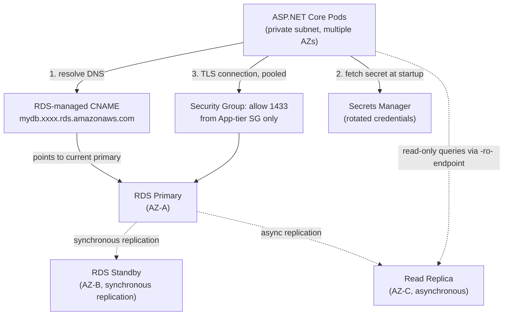
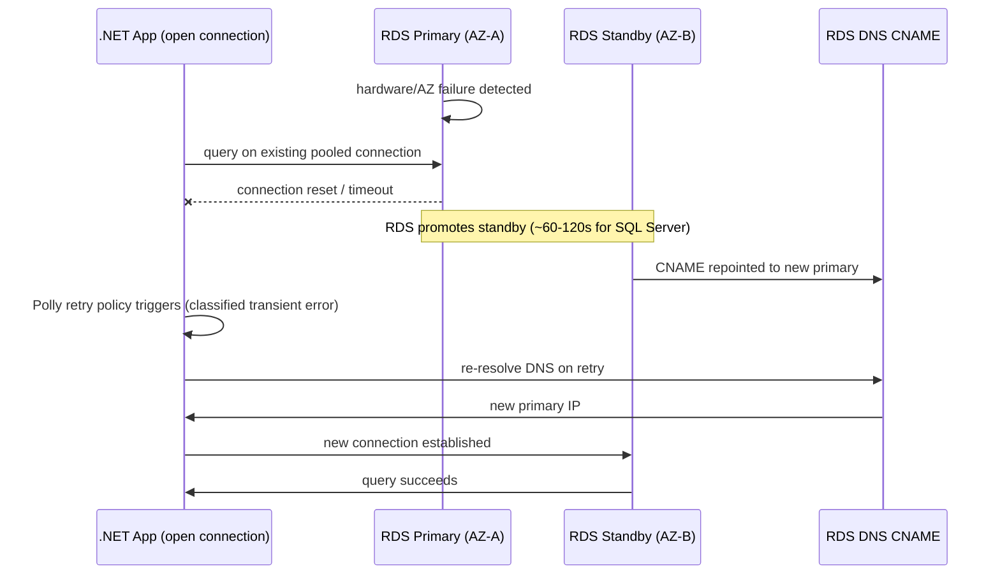
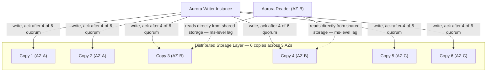
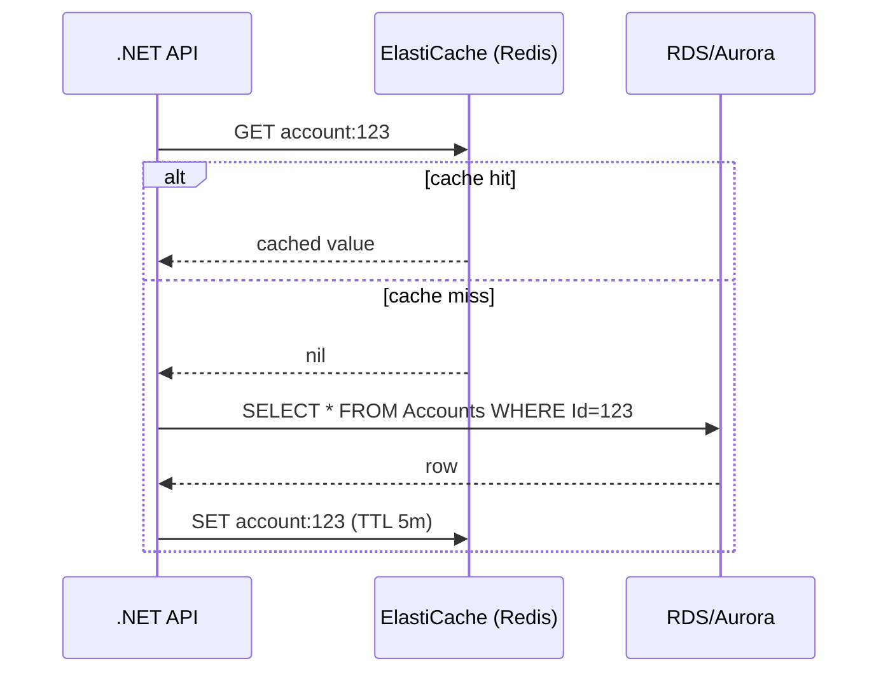

# Module 60 — AWS: Databases — RDS Multi-AZ & Read Replicas, Aurora Internals & DynamoDB Integration

> Domain: AWS | Level: Beginner → Expert | Prerequisite: [[../04-SQL-Server/02-Transactions-Isolation-Locking]], [[../08-DynamoDB/02-Consistency-Models-Capacity-Planning]] (this module maps those database-internals fundamentals onto specific AWS managed-service implementations), [[03-Storage-S3-EBS-EFS]] (RDS is built on EBS under the hood, inheriting its AZ-scoped durability characteristics unless Multi-AZ is explicitly configured)

---

## 1. Fundamentals

### What problem does this module solve?
Every other AWS module in this domain teaches you how a request *reaches* your application. This module teaches what happens the instant your ASP.NET Core code calls `await _dbContext.SaveChangesAsync()` or `await _dynamoDbClient.PutItemAsync(...)` — the single most consequential line in most production incidents, because it is the line where your carefully-designed, horizontally-scaled, stateless application tier touches the one thing in the architecture that is *not* stateless and *cannot* simply be replaced by launching another instance.

### Why does a Principal Engineer need this depth, specifically?
Because "we use RDS" or "we use DynamoDB" is not an architectural decision — it's a category. The actual decision is a bundle of specific, defensible choices: Multi-AZ or not, how many read replicas and what staleness they tolerate, IAM auth token or Secrets-Manager-rotated password, RDS Proxy or app-managed pooling, which SQL Server error codes are transient, what a circuit breaker protects that a retry policy doesn't, and — for a regulated financial workload — whether a stale read replica is even a correctness bug or a compliance finding. An interviewer at the Elite FinTech Panel bar does not accept "RDS with Multi-AZ" as a complete answer; they expect you to say what "Multi-AZ" *mechanically is* (synchronous block-level replication to a standby that only becomes reachable after a DNS CNAME flip), and what that implies for your connection pool during the ~60–120 second failover window.

### When does this matter, concretely?
Any system with a stateful backing store — which is nearly every production system this course has designed. It matters most acutely in the failure path: the database is the one component whose failure the application *cannot* route around by simply calling a different, healthy instance of itself, so every resilience pattern this course has taught (retry, circuit breaker, bulkhead, timeout) exists in its most consequential form right here, at the data-access layer.

### How does it work — 30,000-ft view
```
RDS / Aurora (relational): a managed EC2 instance (RDS) or a managed distributed storage
 engine (Aurora) running SQL Server/PostgreSQL/MySQL — Multi-AZ gives synchronous HA,
 read replicas give async read scaling, RDS Proxy gives connection pooling at the
 infrastructure layer instead of (or in addition to) the app layer.

DynamoDB (key-value/wide-column): a fully managed, partition-key-hashed distributed
 store — no instances to manage, capacity is either provisioned (you size it) or
 on-demand (AWS sizes it), and its scaling ceiling is "design your key well," not
 "add more hardware."

ElastiCache (in-memory): a managed Redis or Memcached cluster sitting IN FRONT of a
 slower backing store (usually RDS/Aurora/DynamoDB) — it does not replace the
 database, it absorbs read load the database would otherwise take directly.
```

---

## 2. Deep Dive

### 2.1 The Shape of Every ".NET → Database" Connection, Before the Service-Specific Detail
Every one of the four services below is reached through the same generic path, and the path itself is worth naming once: `.NET Application → DNS resolution → Network routing (VPC route table) → Security Group evaluation → Authentication → Connection establishment → Database engine`. What varies per service is what happens at "Authentication" (a SQL Server login vs an IAM-signed token vs a Redis AUTH password) and at "Connection establishment" (a pooled TCP connection with TLS vs an HTTPS API call, in DynamoDB's case — there is no persistent "connection" to a database that doesn't have connections in the traditional sense). Holding this shape fixed while the specifics change is what lets a Principal Engineer reason about a database technology they haven't personally operated before: the questions to ask are always "what authenticates," "what's in the network path," and "what does the client do when step 2 or step 5 fails."

### 2.2 SQL Server on RDS — the Full Connectivity Trace
**DNS.** The application never hardcodes an IP. It connects to `mydb.abc123xyz.us-east-1.rds.amazonaws.com`, an RDS-managed DNS CNAME that Route 53 (internally, AWS's own DNS infrastructure, not necessarily your public Route 53 zone) resolves to the *current* primary instance's IP. This indirection is exactly what makes Multi-AZ failover work without an application-visible IP change: AWS updates what the CNAME points to, not what the application is configured with.

**Network.** The .NET application (running in a private subnet — see [[01-Compute-Networking-VPC-LoadBalancing-AutoScaling]] §2.1) resolves that DNS name to an IP inside RDS's own subnet group, which must itself live in private subnets never exposed to the internet. The route table entry for the app's subnet has no path to this RDS subnet other than the VPC's own local route — meaning no Internet Gateway, no NAT Gateway is involved in reaching the database; this is intra-VPC traffic only, which is both a performance property (no internet hop) and a security property (the database is architecturally unreachable from outside the VPC regardless of any application-layer control).

**Security Group.** RDS's Security Group is configured with exactly one meaningful inbound rule: allow TCP 1433 from the *application tier's Security Group* (referenced by SG ID, not by CIDR block — this is the detail that separates a mid-level answer from a Principal one: referencing a peer Security Group means the rule stays correct as the app tier's Auto Scaling Group launches and terminates instances with different IPs, whereas a CIDR-block rule would need updating or would over/under-scope access). There is no rule allowing 1433 from `0.0.0.0/0` — a database security group with that rule present is one of the most common production security review findings.

**Authentication — two real options, and a Principal Engineer must be able to argue for either.**
*Option A: username/password via Secrets Manager.* The connection string's password is never in `appsettings.json` or an environment variable in cleartext; it is resolved at startup (and re-resolved on Secrets Manager's rotation schedule) via the AWS Secrets Manager .NET SDK, cached in memory for the process lifetime (or until rotation invalidates it — RDS's native rotation Lambda updates the secret and the *database* atomically enough that a well-written client that retries an auth failure by re-fetching the secret self-heals within seconds).
*Option B: IAM database authentication.* Instead of a password, the .NET app calls `RDSAuthTokenGenerator.GenerateAuthToken(...)`, which returns a signed token valid for exactly 15 minutes, using the *caller's IAM identity* (the EKS pod's IRSA role, or the ECS task role) rather than a shared secret at all. This is the materially stronger security posture — there is no long-lived credential to leak, rotate, or store — but it has a real operational cost a Principal Engineer must state plainly: every new physical connection needs a token less than 15 minutes old, which means connection-pool churn interacts with token expiry in a way password auth never has to think about, and IAM auth caps you at a lower max-connections-per-second ceiling than password auth on some engines — genuinely not the right choice for a workload opening thousands of new connections per second even though it's the right choice for most workloads on security grounds alone.

**Connection string shape (ASP.NET Core, Option A — Secrets-Manager-backed password):**
```csharp
// Program.cs
var secretsClient = new AmazonSecretsManagerClient();
var secretValue = await secretsClient.GetSecretValueAsync(new GetSecretValueRequest
{
    SecretId = builder.Configuration["Database:SecretArn"]
});
var dbSecret = JsonSerializer.Deserialize<RdsSecret>(secretValue.SecretString);

var connectionString = new SqlConnectionStringBuilder
{
    DataSource = builder.Configuration["Database:Endpoint"], // mydb.abc123.rds.amazonaws.com,1433
    InitialCatalog = "LedgerDb",
    UserID = dbSecret.username,
    Password = dbSecret.password,
    Encrypt = true,
    TrustServerCertificate = false,          // validate the real cert — see the §2.2 warning below
    ConnectTimeout = 5,                      // seconds — fail fast, let Polly/the circuit breaker own retry
    MaxPoolSize = 100,
    MinPoolSize = 5,
    ConnectRetryCount = 2,                   // ADO.NET's own built-in reconnect for idle/broken connections
    ConnectRetryInterval = 5
}.ConnectionString;

builder.Services.AddDbContext<LedgerDbContext>(options =>
    options.UseSqlServer(connectionString, sql =>
    {
        sql.EnableRetryOnFailure(maxRetryCount: 3, maxRetryDelay: TimeSpan.FromSeconds(10), errorNumbersToAdd: null);
        sql.CommandTimeout(30);
    }));
```
`TrustServerCertificate = true` is a common production mistake precisely because it makes local development friction disappear — the app "just connects" — while silently disabling certificate validation, meaning the TLS channel no longer proves you're actually talking to the RDS endpoint you think you are (a real MITM exposure if the network path is ever compromised, and an actual PCI-DSS/SOX finding in a regulated audit). The correct fix for the development friction is importing the RDS CA bundle, not disabling validation.

**Connection pooling.** `SqlClient`'s pool is per-connection-string, in-process, and is the *first* layer of pooling — it reuses TCP connections within one app instance. This is necessary but not sufficient at scale: if you run 50 Kubernetes pods each with a pool of 100, RDS sees up to 5,000 potential concurrent connections, and RDS SQL Server instances have a hard `max_connections` ceiling driven by instance class (a db.r6i.xlarge caps meaningfully lower than that). This is exactly the problem **RDS Proxy** exists to solve: it sits between the app fleet and the database, multiplexing many app-side logical connections onto a smaller, stable pool of physical connections to RDS — critical for AWS Lambda specifically, where each concurrent invocation is a fresh execution environment that would otherwise open its own new connection, exhausting `max_connections` almost immediately under real concurrency. A Principal Engineer's rule of thumb: RDS Proxy is close to mandatory for Lambda-to-RDS; it's a scaling insurance policy (not free — priced per vCPU-hour) for a fixed-size container fleet, worth it once connection count, not query load, is the bottleneck.

**Retry policy — which SQL Server errors are actually transient.** A correct Polly policy does not retry blindly; it retries only error numbers that represent genuinely transient conditions: `-2` (timeout), `4060`/`40613` (database unavailable/being restarted, notably during Aurora/Azure-style scaling events), `40197`/`40501`/`40540` (throttling-style transient errors), and connection-level `SqlException` states indicating a broken/reset connection. It must NOT retry a primary-key violation, a constraint violation, or a deadlock victim it hasn't itself decided is safe to retry idempotently — retrying a non-idempotent write blindly is how a "resilience" pattern produces a duplicate payment.
```csharp
var retryPolicy = Policy<SqlException>
    .Handle<SqlException>(IsTransient)
    .WaitAndRetryAsync(3, attempt => TimeSpan.FromMilliseconds(200 * Math.Pow(2, attempt))
        + TimeSpan.FromMilliseconds(Random.Shared.Next(0, 100))); // exponential backoff + jitter

static bool IsTransient(SqlException ex) =>
    ex.Number is -2 or 4060 or 40613 or 40197 or 40501 or 40540 or 10928 or 10929 or 10060 or 10061;
```

**Circuit breaker — a genuinely different job from retry.** Retry answers "is this one call's failure likely to succeed if I try again in a moment?" A circuit breaker answers a population-level question: "have enough recent calls to this dependency failed that I should stop calling it at all for a while, to protect *my own* thread pool and *the database's* recovery?" Composed correctly, the circuit breaker wraps the retry policy (not the other way around) — Polly's own guidance and this course's [[../17-Microservices/02-Resilience-Observability-Sidecar-Patterns]] both establish this ordering: a retry policy alone, hammering a genuinely down database with exponential-backoff retries from hundreds of pod instances simultaneously, is itself a self-inflicted denial-of-service against the database exactly when it's trying to recover. The circuit breaker trips open after a failure-rate threshold, short-circuits new attempts immediately (no thread blocked waiting on a doomed connection attempt), and probes half-open after a cooldown.

**Database failover — what actually happens, second by second.** RDS Multi-AZ maintains a synchronous standby replica in a second AZ (not a read replica — it takes no read traffic and exists purely for failover). On a failure of the primary (detected by RDS's own health-check layer, or triggered by a maintenance event), RDS promotes the standby and flips the DNS CNAME to its IP. The failover itself — detection plus promotion plus DNS propagation — typically completes in 60–120 seconds for SQL Server (materially longer than for Aurora — see §2.3). During that window, every connection the app already holds open to the old primary's IP is now talking to nothing; ADO.NET surfaces this as a broken-connection exception on the next command, not proactively. The application's connection pool does not "know" a failover happened — this is precisely why the retry policy in the code sample above matters operationally, not just theoretically: without it, the very first query issued after the standby takes over throws, and only a caller that retries (and, on retry, re-resolves DNS to pick up the new CNAME target) recovers automatically. A pool that aggressively caches DNS resolution at the OS or driver level (rare, but worth checking) can defeat this — it's a real "why did failover not actually fail over cleanly" postmortem finding.

**Read replicas — asynchronous, and what that obligates the application to do.** An RDS read replica (as opposed to the Multi-AZ standby) replicates asynchronously and can lag the primary by anywhere from milliseconds to, under sustained write load or replica under-provisioning, seconds. A Principal Engineer must be able to state exactly which reads are safe to route to a replica and which are not: a report or dashboard query tolerating "as of a few seconds ago" data is safe; a read that immediately follows a write *by the same user, in the same request flow* (read-your-own-writes) is not safe on a replica unless the application explicitly handles it — either by routing that specific read back to the primary, or by tracking a replication-lag watermark and waiting/falling back. This is a decision this course has already made in the abstract under CQRS/eventual consistency; here it has a concrete AWS shape: replica endpoints are a *separate* DNS name (`mydb.abc123.us-east-1.rds.amazonaws.com` for primary vs a `-ro-` replica endpoint), and routing which query goes where is an explicit application-level choice (a "read/write splitting" `DbContext` factory, or two named `HttpClient`-style registered contexts), never automatic.

**Backup, PITR, and DR.** RDS takes continuous transaction-log backups (in addition to daily automated snapshots), enabling point-in-time restore to any second within the retention window (up to 35 days) — but restore always creates a **new** RDS instance with a new endpoint; there is no "restore in place," which has a real operational consequence: a PITR-based recovery is a data-recovery action requiring an application reconfiguration/redeploy to point at the new endpoint, not a transparent self-heal. For disaster recovery beyond a single region, the two real options are a cross-region read replica (kept warm, promotable to a standalone primary in minutes, at the cost of running — and paying for — a permanently-on replica) or cross-region automated snapshot copy (cheaper, but recovery time is "restore a snapshot," materially slower — an RPO/RTO trade-off to state explicitly, not something to wave at with "we have backups").

### 2.3 Aurora — Why It Isn't Just "Managed MySQL/PostgreSQL, But Faster"
Aurora's defining architectural difference from RDS is that it separates compute from storage at the engine level. A standard RDS instance's storage is EBS — a single-AZ-attached block volume, replicated by EBS itself within that AZ, with Multi-AZ achieved by running an entirely separate standby instance with its own EBS volume and replicating between them at the database-engine layer (synchronous statement/log shipping). Aurora instead has its compute nodes write log records directly to a purpose-built, distributed storage layer that itself replicates **six ways across three Availability Zones**, and a write is acknowledged back to the client once a **quorum of 4 out of 6** copies confirm it — meaning Aurora can lose an entire AZ (2 of 6 copies) and still serve reads and writes without interruption, and can lose a second copy elsewhere and still preserve data (it degrades write availability only after losing enough copies to break quorum). This is *why* Aurora failover is materially faster than RDS Multi-AZ failover (typically 15–30 seconds versus RDS's 60–120): promoting an Aurora Replica to writer doesn't require replaying/catching up a separate database process from its own lagging copy of the data — the storage layer is already shared and already durable, so promotion is closer to "start accepting writes as the new primary" than "stand up a second full database and catch it up."

**Aurora Replicas vs RDS read replicas.** Because Aurora Replicas share the exact same underlying distributed storage as the writer (not a separate copy kept in sync via log shipping), their replication lag is typically single-digit milliseconds, an order of magnitude tighter than a standard RDS async read replica — genuinely changing the read-your-own-writes risk calculus, though it does not eliminate it; "typically tens of milliseconds" is not "zero," and a system with a hard read-after-write correctness requirement (a payment status check immediately after a payment write) still should not silently rely on an SLA-free lag number.

**Aurora Serverless v2** scales compute capacity (measured in Aurora Capacity Units) up and down automatically in fine-grained increments in response to load, without a connection-dropping failover-style event — the mechanism a Principal Engineer should contrast against RDS's "resize the instance class" (which *does* require a restart/brief outage, or a Multi-AZ-assisted near-zero-downtime resize via failover to a resized standby). Serverless v2 is the right default for workloads with genuinely spiky, hard-to-predict load (a dev/test fleet, a workload with an unpredictable batch-processing tail); it is not automatically cheaper than a correctly-sized provisioned instance for a stable, well-understood steady-state production workload — the ACU-hour pricing crosses over against a reserved-instance-priced fixed instance at a specific, calculable utilization threshold, which a Principal Engineer should be able to reason about rather than assume.

**Aurora Global Database** extends the same idea across regions: a primary region's cluster replicates to up to five secondary regions via a dedicated, purpose-built replication path (not standard cross-region read-replica log shipping), typically achieving sub-second replication lag and a documented ~1-minute RTO for a managed regional failover — the concrete mechanism behind "design for regional failure" for a database, and the natural answer whenever a scenario asks for active-passive multi-region with an aggressive RTO/RPO.

### 2.4 DynamoDB — Partitioning, Keys, and Why "Just Add Capacity" Doesn't Fix a Bad Key
DynamoDB's core mechanism: every item's **partition key** is hashed, and that hash deterministically maps the item to one of the table's underlying physical partitions — each partition has its own fixed slice of the table's total provisioned (or on-demand-allocated) read/write capacity. This single fact explains almost every DynamoDB production incident. A **sort key**, when present, orders items *within* a partition, enabling range queries ("all orders for this customer between two dates") without needing a secondary index.

**Global Secondary Index (GSI) vs Local Secondary Index (LSI) — the real distinction.** An LSI shares the base table's partition key but defines an alternate sort key, letting you query the same partition a different way — critically, an LSI **must be declared at table-creation time** and cannot be added later, and it consumes the base table's own read/write capacity (no separate throughput). A GSI defines an entirely independent partition key (and optional sort key), can be added or removed at any time after table creation, has its **own** provisioned/on-demand capacity, and is **eventually consistent only** (there is no strongly-consistent-read option on a GSI, unlike the base table or an LSI) — a genuine correctness constraint, not just a performance nuance, that a design must account for if it reads from a GSI expecting to see a write that just happened.

**Hot partitions — the mechanical cause, and the actual fix.** A table's total provisioned capacity is divided roughly evenly across its physical partitions; if a partition key design concentrates a disproportionate share of traffic onto a small number of key values (a `TenantId` partition key where one enterprise tenant generates 80% of all traffic; a `Date` partition key where "today" gets nearly all writes), the physical partition(s) serving those hot keys can be throttled even though the table's *aggregate* provisioned capacity is nowhere near exhausted — CloudWatch's `ConsumedWriteCapacityUnits` can look healthy in aggregate while `ThrottledRequests` climbs, precisely because the metric that matters is per-partition, not table-wide. Provisioning more table-wide capacity does not fix this — the fix is a better key design: composite/sharded keys (append a calculated suffix — e.g. a hash of the item ID, or a bounded random shard number — to spread a hot logical key across several physical partition-key values, then fan the read back in application code), or, for the "today" pattern specifically, a write-sharding scheme keyed by a coarser time bucket plus a random suffix.

**Capacity modes.** Provisioned capacity requires you to size read/write capacity units ahead of time (with optional auto-scaling adjusting within bounds you set) — predictable cost, but you own the sizing exercise and pay for headroom. On-demand capacity has DynamoDB scale automatically to the workload with no capacity planning, at a materially higher per-request price — the right default for unpredictable or spiky workloads and for teams without the operational maturity to tune provisioned auto-scaling, and the wrong choice for a large, steady-state, cost-sensitive workload where provisioned capacity (especially with reserved capacity pricing) is markedly cheaper at scale.

**TTL.** Item-level time-to-live deletes expired items automatically (via a background process, not instantaneously — deletion typically happens within 48 hours of the TTL timestamp, which matters if an application logically depends on expired items being *immediately* absent from queries — they aren't removed from GSIs/query results instantly, only marked and eventually purged) — the natural mechanism for session data, idempotency-key records, and short-lived tokens, letting the table self-clean without a scheduled batch job.

**DynamoDB Streams.** An ordered, per-partition change log of item-level modifications (insert/update/delete), consumable by a Lambda trigger or the Kinesis Client Library — the standard mechanism for change-data-capture: fanning a write in DynamoDB out to update a search index, invalidate a cache, or emit a domain event onto SNS/EventBridge without the write path itself needing to know about any downstream consumer (this is the AWS-native shape of the Outbox pattern discussed in §2.6 and in [[../18-Event-Driven-Architecture]]).

**Transactions — `TransactWriteItems`, and what it actually guarantees.** DynamoDB transactions provide ACID guarantees across up to 100 items/4MB, spanning multiple tables, with all-or-nothing atomicity and a conditional-check capability per item (e.g., "only commit this transfer if the source account's balance condition still holds"). What it is *not*: a long-running, multi-round-trip SQL-style transaction with a session and arbitrary intermediate reads — it's a single, up-front-declared batch of writes (optionally with read-conditions) committed atomically in one call, closer in shape to a stored-procedure-style batch than to a `BEGIN TRAN ... COMMIT` block spanning application logic. This distinction is exactly what an interviewer probes for: candidates who say "DynamoDB has transactions, so it's just like SQL Server" are missing that the *entire transaction must be known and expressed upfront*, which materially constrains which application patterns translate directly and which need redesign (a multi-step wizard-style transaction with user think-time between steps cannot be expressed this way at all).

**Consistency — eventually vs strongly consistent reads.** Every DynamoDB read can request either eventual consistency (default, cheaper — half the read capacity cost — and might not reflect a write from the last few hundred milliseconds) or strong consistency (guaranteed to reflect all prior successful writes, at double the RCU cost, and unavailable at all on a GSI or during certain rare network-partition scenarios where DynamoDB explicitly favors availability). The choice is a genuine trade-off to name per-access-pattern, not a single table-wide setting: a balance-check read before authorizing a debit should be strongly consistent; a "recent activity feed" read tolerates eventual consistency happily and should default to it for the cost saving.

**When DynamoDB genuinely beats SQL Server/RDS, and when it doesn't.** Choose DynamoDB when the access pattern is genuinely key-based (fetch-by-ID or query-by-partition-plus-range) at extreme, elastic scale, where sub-10ms p99 latency must hold regardless of table size, and where the schema is either naturally flexible or can be modeled up front around a small, fixed set of access patterns (DynamoDB modeling is access-pattern-first — you design the table around the queries you'll run, the opposite of normalized relational modeling). Stay on SQL Server/RDS (or Aurora) when the workload needs ad-hoc queries and joins across entities that weren't anticipated at design time (regulatory/compliance reporting is the canonical case — an auditor's new question next quarter should not require a DynamoDB schema migration), when multi-row/multi-table ACID transactions across a genuinely relational domain model are the norm rather than the rare exception, or when the team's existing SQL expertise and tooling (EF Core, SSMS, existing stored procedures) represents real, non-trivial switching cost against a benefit that hasn't been shown to be necessary yet. A Principal Engineer being asked "why not just use DynamoDB for everything, it scales infinitely" should be able to name this trade-off precisely rather than retreat to "it depends."

### 2.5 ElastiCache — the Cache Is Not a Database, and Treating It Like One Is the Recurring Failure
**Cache-aside (lazy loading)** is the dominant, correct-by-default pattern: application code, on a cache miss, reads from the database, populates the cache with a TTL, and returns the value; on a cache hit, the database is never touched. This logic lives in the application/repository layer, not in the cache or the database — ElastiCache has no knowledge of what's "supposed" to be in it, which is exactly why cache-aside degrades gracefully (§2.5's Redis-outage scenario below) where read-through/write-through architectures (where the *cache* itself owns fetching from or writing to the backing store, common in some managed caching products but not native to ElastiCache without an additional layer) do not automatically.
```csharp
public async Task<Account> GetAccountAsync(string accountId)
{
    var cacheKey = $"account:{accountId}";
    var cached = await _redis.StringGetAsync(cacheKey);
    if (cached.HasValue) return JsonSerializer.Deserialize<Account>(cached!);

    var account = await _dbContext.Accounts.FindAsync(accountId); // cache miss -> hit the DB
    if (account is not null)
        await _redis.StringSetAsync(cacheKey, JsonSerializer.Serialize(account), TimeSpan.FromMinutes(5));
    return account;
}
```

**Invalidation.** TTL-based expiry is simple and self-healing but tolerates staleness up to the TTL window; event-based invalidation (explicitly deleting or updating the cache key at write time, in the same code path that writes the database) gives tighter consistency at the cost of every write path needing to remember to do it — a real source of bugs when a second write path (a batch job, an admin tool, a different microservice) writes the same entity and forgets to invalidate the cache, producing a stale read with no TTL-driven self-correction until the TTL eventually expires anyway. The Principal-level answer is rarely "pick one" — it's TTL as the safety net, event-based invalidation as the freshness optimization, deliberately layered.

**Session storage.** A horizontally-scaled ASP.NET Core app behind a load balancer cannot rely on in-process (`IMemoryCache`-backed) session state — a user's second request can land on a different pod/instance with no memory of the first. ElastiCache Redis backing `IDistributedCache` (via `Microsoft.Extensions.Caching.StackExchangeRedis`) gives every instance a shared view of session state, making the app tier's statelessness (a precondition for Auto Scaling and rolling deployment) actually work in practice, not just in architecture diagrams.

**Rate limiting and distributed locks.** Redis's atomic `INCR` (with an expiring key) is the standard building block for a distributed rate limiter (fixed-window or sliding-window, counted centrally rather than per-instance, which per-instance in-memory counting cannot do correctly behind a load balancer). A `SET key value NX PX ttl` command implements a basic distributed lock (Redlock-style algorithms extend this across a Redis cluster for stronger guarantees) — genuinely useful for "only one instance should run this scheduled job right now," but a Principal Engineer must state its real limitation honestly: a lock held past its TTL because the lock-holder stalled (a GC pause, a slow network) can expire and be acquired by a second instance while the first is still working, a classic distributed-locking correctness gap this course's [[../16-Distributed-Systems]] material already covers in the abstract — ElastiCache-backed locks are a pragmatic, not a bulletproof, implementation of it, and should never be the sole guard around a truly non-idempotent, high-value operation (a funds transfer) without an additional idempotency-key check at the database layer.

**"What happens when Redis goes down?" — the honest, mechanical answer, not "it fails over."** In a cache-aside architecture, every read that would have hit the cache now falls through to the database — which was sized assuming the cache was absorbing the majority of read traffic, so this is a genuine capacity cliff, not a graceful degradation in practice unless the database was deliberately over-provisioned to survive it (a real cost trade-off to state explicitly when arguing for a cache in the first place: the cache is a load-shedding device the database has come to depend on). For session storage specifically, an ElastiCache outage without any fallback (no sticky-session safety net, nothing in a database) means every active user session is lost mid-request — a genuine outage from the user's point of view, not merely "slower." For rate limiting, a Redis outage removes the rate limit entirely (fail-open) unless the code explicitly fails closed (rejecting requests when the limiter is unreachable) — and fail-open vs fail-closed for a rate limiter is itself a decision with a security dimension (an abuse-prevention control silently disappearing) that deserves an explicit, stated choice rather than an accidental default.

### 2.6 The Database Decision Framework — Forcing the Trade-off, Not Reciting a Table
| Need | Default choice | The genuine exception |
|---|---|---|
| Multi-row ACID transactions over a relational domain model | RDS/Aurora | DynamoDB `TransactWriteItems` only if the whole transaction is knowable upfront and ≤100 items |
| Extreme, elastic key-based read/write scale | DynamoDB | RDS/Aurora if the access pattern is genuinely relational despite the scale (rare, but real — Aurora scales further than most engineers assume) |
| Ad-hoc/reporting queries, unknown-at-design-time joins | RDS/Aurora | Never DynamoDB — this is DynamoDB's clearest weak spot |
| Sub-10ms p99 at any table size | DynamoDB | Aurora with a well-tuned cache (ElastiCache) in front can approach this for read-heavy workloads |
| Caching, session state, rate limiting, distributed locks | ElastiCache | None of the above three substitute for a true in-memory cache |
| Cross-region active-passive DR with ~1-minute RTO | Aurora Global Database | DynamoDB Global Tables for key-value workloads needing active-active multi-region |

**The discriminating question — the one that separates a Staff answer from a Senior one here:** *"Your team already runs RDS SQL Server. A new feature needs to record a high-volume stream of individual click events at 50,000 writes/second. Do you scale the existing RDS instance, add a read replica, or reach for DynamoDB — and why?"* The Senior answer optimizes the existing tool ("scale up the instance, add indexes"). The Staff/Principal answer recognizes that 50,000 writes/second of simple, key-based, no-join click events is a different *workload shape* than the transactional ledger data already living in RDS — and that forcing it into the same relational engine trades a cheap, purpose-built solution (DynamoDB, at its actual access pattern) for an expensive attempt to make the wrong tool scale, and separately recognizes that co-locating an unrelated high-volume workload on the same instance as transactional data risks contending for the same I/O and connection budget the ledger workload depends on for correctness-critical latency — the right answer is a second, purpose-fit store, not a bigger single one.

**What this section cannot do, honestly.** No decision table substitutes for measuring your actual access patterns; DynamoDB's key design and RDS's index design both punish a design done from a table like the one above rather than from real query patterns. And there is no detector that catches a hot-partition problem before it happens in production traffic — CloudWatch's per-partition throttling metrics are a *diagnosis* tool, not a *prevention* tool; the only real prevention is designing the key with the eventual traffic shape in mind, which requires knowing (or estimating) that shape before launch.

---

## 3. Visual Architecture

### 3.1 SQL Server on RDS — Multi-AZ Topology and the Connectivity Path

```mermaid
graph TB
    App["ASP.NET Core Pods<br/>(private subnet, multiple AZs)"]
    SG["Security Group: allow 1433<br/>from App-tier SG only"]
    Primary["RDS Primary<br/>(AZ-A)"]
    Standby["RDS Standby<br/>(AZ-B, synchronous replication)"]
    Replica["Read Replica<br/>(AZ-C, asynchronous)"]
    DNS["RDS-managed CNAME<br/>mydb.xxxx.rds.amazonaws.com"]
    SM["Secrets Manager<br/>(rotated credentials)"]

    App -->|"1. resolve DNS"| DNS
    DNS -->|"points to current primary"| Primary
    App -->|"2. fetch secret at startup"| SM
    App -->|"3. TLS connection, pooled"| SG
    SG --> Primary
    Primary -.->|"synchronous replication"| Standby
    Primary -.->|"async replication"| Replica
    App -.->|"read-only queries via -ro- endpoint"| Replica
```

### 3.2 Failover Sequence — What the Application Actually Observes

```mermaid
sequenceDiagram
    participant App as .NET App (open connection)
    participant Primary as RDS Primary (AZ-A)
    participant Standby as RDS Standby (AZ-B)
    participant DNS as RDS DNS CNAME

    Primary->>Primary: hardware/AZ failure detected
    App->>Primary: query on existing pooled connection
    Primary--xApp: connection reset / timeout
    Note over Primary,Standby: RDS promotes standby (~60-120s for SQL Server)
    Standby->>DNS: CNAME repointed to new primary
    App->>App: Polly retry policy triggers (classified transient error)
    App->>DNS: re-resolve DNS on retry
    DNS->>App: new primary IP
    App->>Standby: new connection established
    Standby->>App: query succeeds
```

### 3.3 Aurora Storage-Layer Replication (Why Failover Is Faster)

```mermaid
graph TB
    Writer["Aurora Writer Instance"]
    R1["Aurora Reader (AZ-B)"]
    subgraph "Distributed Storage Layer — 6 copies across 3 AZs"
        S1["Copy 1 (AZ-A)"]
        S2["Copy 2 (AZ-A)"]
        S3["Copy 3 (AZ-B)"]
        S4["Copy 4 (AZ-B)"]
        S5["Copy 5 (AZ-C)"]
        S6["Copy 6 (AZ-C)"]
    end
    Writer -->|"write, ack after 4-of-6 quorum"| S1 & S2 & S3 & S4 & S5 & S6
    R1 -.->|"reads directly from shared storage — ms-level lag"| S3 & S4
```

### 3.4 ElastiCache Cache-Aside Flow

```mermaid
sequenceDiagram
    participant App as .NET API
    participant Cache as ElastiCache (Redis)
    participant DB as RDS/Aurora

    App->>Cache: GET account:123
    alt cache hit
        Cache-->>App: cached value
    else cache miss
        Cache-->>App: nil
        App->>DB: SELECT * FROM Accounts WHERE Id=123
        DB-->>App: row
        App->>Cache: SET account:123 (TTL 5m)
    end
```

---

## 4. Production Example

**Problem.** A tier-1 payment-processing platform (modeled on the kind of core-ledger workload a Visa/Stripe-caliber panel would probe) ran its ledger on a single RDS SQL Server instance, Multi-AZ enabled, no read replica, and a fixed 100-connection ADO.NET pool per pod across a 30-pod deployment.

**Architecture as built.** 30 pods × 100-connection pool ceiling = a theoretical 3,000 concurrent connections against an instance class whose `max_connections` ceiling was roughly 1,600. In steady state this was invisible — actual concurrent usage sat around 400.

**Incident.** A month-end batch reconciliation job, run from a separate service, opened its own 200-connection pool against the same instance at the same moment a marketing promotion tripled normal traffic. Aggregate demand briefly exceeded `max_connections`; new connection attempts from the live payment-processing pods began failing with SQL Server's "a connection was successfully established... then an error occurred" pattern, which the existing retry policy (present, but configured to retry only timeout errors, not connection-refusal errors) did not classify as transient — so it did not retry, and those payment requests failed outright and surfaced to users as generic 500s.

**Root cause, precisely.** Two independent, uncoordinated consumers of the same finite resource (`max_connections`), no RDS Proxy multiplexing the actual physical connection count, and a retry policy whose transient-error classification was incomplete.

**Fix.** RDS Proxy introduced in front of the instance, capping physical connections regardless of how many logical pools the app fleet or the batch job opened; retry policy's transient-error list expanded to include the specific connection-refusal error numbers; the batch job's pool size moved to a configuration value reviewed against the shared `max_connections` budget rather than chosen independently.

**Lesson.** `max_connections` is a *shared, cluster-wide* resource that no single team's pool-sizing decision can reason about safely in isolation — RDS Proxy converts an implicit, easy-to-violate shared constraint into an explicitly managed one, and this is exactly why introducing it is standard practice the moment more than one service or job touches the same RDS instance, not just for Lambda's connection-per-invocation problem.

---

## 11. Coding Exercises

**Easy.** Implement a Polly retry policy for SQL Server that correctly classifies transient vs non-transient `SqlException` error numbers (list at least 6 real transient codes) and applies exponential backoff with jitter. *Solution shape:* a predicate over `SqlException.Number` plus `WaitAndRetryAsync`, as in §2.2. *Complexity:* O(1) per retry decision; bounded retry count keeps worst-case latency bounded and predictable — state the max added latency explicitly (e.g., 3 retries at 200ms/400ms/800ms base ≈ 1.4s worst case before jitter).

**Medium.** Implement a cache-aside repository method for `GetAccountAsync` that (a) never lets two concurrent cache misses for the same key both hit the database (a "cache stampede"), using a per-key async lock, and (b) sets a short jittered TTL to avoid synchronized mass-expiry. *Solution shape:* a `SemaphoreSlim` keyed per cache key (or a distributed lock via `SET NX`) guarding the miss path. *Complexity:* one extra Redis round-trip on the stampede-guard path; correctly bounds database load to one query per key per miss window regardless of concurrent callers.

**Hard.** Implement a DynamoDB write-sharding scheme for a `Date`-partitioned "daily leaderboard" table that currently hot-partitions on the current day, spreading writes across N logical shards and correctly fanning in reads. *Solution shape:* partition key `"{date}#{shardId}"` where `shardId = hash(userId) % N` on write, and N parallel `Query` calls (or a single `Scan` with `ExpressionAttributeValues` per shard) fanned in and merged on read. *Complexity:* O(N) read amplification traded for eliminating a single hot partition — quantify N against expected write throughput per partition's real per-second limit.

**Expert.** Design and implement a connection-resilience wrapper composing timeout → retry → circuit breaker (in that order, outermost to innermost, and justify the order) around both a `SqlConnection`-based repository and an `IAmazonDynamoDB` client behind a single interface, such that a caller-visible `ServiceUnavailableException` is thrown once the circuit is open, without ever retrying a non-idempotent write blindly. *Solution shape:* Polly `AsyncPolicyWrap` composing `TimeoutPolicy`, `RetryPolicy` (idempotent operations only, gated by an `[Idempotent]` marker or an explicit idempotency key), and `CircuitBreakerPolicy`, injected via `IHttpClientFactory`-style typed clients / a custom `IDbResiliencePolicy`. *Complexity:* the design's real cost is organizational, not computational — every write call site must be explicitly classified idempotent/non-idempotent, which is the actual hard part of this exercise.

---

## 12. System Design — Data Layer for a High-Integrity Ledger/Settlement System

### Step 1: Understand the Problem and Establish Design Scope

**Q (interviewer):** "Design the data layer for a trade-settlement ledger. What clarifying questions do you have?"
**A (candidate):** "What's the write volume, and is it bursty around specific settlement windows? Is this single-region or must it survive a regional failure with a bounded RTO/RPO? Do downstream systems need real-time balance reads, or is eventual-consistency reporting acceptable for anything other than the authoritative balance check at transaction time? Is there a regulatory retention/immutability requirement on the ledger itself?"
**Q:** "10 million trades settle per day, concentrated in a 4-hour settlement window. Balance reads must be strongly consistent at authorization time. RTO of 15 minutes, RPO of near-zero, is required for the primary region. 7-year immutable retention is a regulatory requirement."

**Functional requirements:** record each settlement as an atomic, immutable ledger entry; support a strongly-consistent "current balance" read; support ad-hoc reconciliation/reporting queries across arbitrary date ranges and counterparties; retain all entries immutably for 7 years.

**Non-functional requirements:** 99.99% availability during the settlement window; RPO ≈ 0 / RTO ≤ 15 minutes; auditable (every write attributable and tamper-evident); strongly consistent balance reads; horizontally scalable reporting without contending with the write-hot settlement path.

**Back-of-the-envelope estimation.** 10,000,000 trades / 4 hours = 10,000,000 / 14,400s ≈ **694 writes/sec average**, but "concentrated in a window" implies a peak multiplier — assuming a realistic 3x peak-to-average burst factor inside the window, **≈ 2,100 writes/sec peak**. At roughly 1KB per ledger entry, 7 years of retention at 10M/day ≈ 25.6 billion rows, ≈ 25.6TB of raw ledger data before index overhead.

**What the numbers imply.** 2,100 writes/sec is comfortably within a single well-provisioned Aurora cluster's write capacity — this is *not* a throughput problem requiring DynamoDB's elastic scale. The actual hard problem is **correctness and immutability under regulatory scrutiny with a strict RTO**, which reframes the driving requirement from "pick the store that scales" to "pick the store, replication topology, and write pattern that make a settlement entry provably atomic, provably immutable, and recoverable within 15 minutes region-wide" — exactly the kind of framing shift that separates a Staff-level answer from a Senior one.

### Step 2: Propose High-Level Design and Get Buy-In

**Component glossary.** *Aurora PostgreSQL cluster (primary region):* the authoritative, ACID-transactional ledger store, chosen over RDS SQL Server for this specific design because Aurora Global Database's replication topology and faster failover directly serve the RTO/RPO requirement (this is a genuine, statable reason, not a reflexive Aurora-over-RDS default). *Aurora Global Database secondary region:* a warm, promotable replica satisfying the 15-minute RTO. *Append-only `LedgerEntries` table:* no `UPDATE`/`DELETE` grants at the database-role level — corrections are new, linked, reversing entries, never mutations, which is what makes "immutable" an enforced database property rather than an application convention. *DynamoDB `IdempotencyKeys` table:* guards against a retried settlement instruction creating a duplicate ledger entry (TTL-expired after the operational window it needs to matter in). *S3 + Glacier:* the 7-year archival tier for entries past an active-query age threshold, cheaper than keeping the full 7 years hot in Aurora. *ElastiCache:* absorbs the balance-read-for-authorization hot path so it doesn't contend with the settlement write path for the same instance's I/O budget — populated cache-aside, invalidated synchronously on every ledger write to that account (event-based invalidation is mandatory here, not merely an optimization, given the read is safety-critical).

**End-to-end walkthrough.** (1) Settlement instruction arrives with a client-supplied idempotency key. (2) App checks/reserves the key in DynamoDB via a conditional `PutItem` (fails fast on a genuine duplicate). (3) App opens an Aurora transaction, inserts the immutable ledger entry and updates the account's running-balance summary row atomically. (4) On commit, app invalidates (does not merely TTL-expire) the account's ElastiCache balance entry. (5) A DynamoDB-Streams-style change feed (here, an Aurora-triggered event via a transactional outbox table polled by a small worker, per [[../37-Outbox]]) publishes a settlement-completed event to SNS for downstream notification/reporting consumers, decoupled from the synchronous write path.

**Data model (abbreviated).**
| Column | Type | Description |
|---|---|---|
| `LedgerEntryId` | `UNIQUEIDENTIFIER` | Primary key, client-generatable for idempotent retry-safety at the row level |
| `AccountId` | `BIGINT` | Foreign key, indexed |
| `AmountMinorUnits` | `BIGINT` | Stored as an integer count of minor currency units, never a float — eliminates floating-point rounding as a source of ledger discrepancy |
| `EntryType` | `VARCHAR(20)` | `SETTLEMENT`, `REVERSAL`, `ADJUSTMENT` |
| `ReversesEntryId` | `UNIQUEIDENTIFIER NULL` | Links a reversal to the entry it corrects — the mechanism that makes corrections additive, not destructive |
| `CreatedAtUtc` | `DATETIME2` | Immutable, never updated post-insert |
| `IdempotencyKey` | `VARCHAR(64)` | Cross-referenced against the DynamoDB guard table |

**Why amounts are integers, not decimals or floats, stated inline:** a ledger that must reconcile to the exact minor unit cannot tolerate binary floating-point representation error accumulating across billions of entries — this is the same rationale this course states elsewhere for "store amount as a string/integer, not a double."

### Step 3: Design Deep Dive

**Immutability enforcement.** The application's database role has `INSERT` and `SELECT` grants only on `LedgerEntries` — no `UPDATE`, no `DELETE`, enforced at the database-permission layer, not merely by application convention, because a convention is exactly what an auditor (or a future engineer under production-incident pressure) will eventually violate. Corrections are new rows referencing `ReversesEntryId`.

**Read/write separation under load.** The settlement write path never touches the ElastiCache-fronted balance-read path's Aurora reader endpoint — writes go to the writer instance, and the safety-critical "current balance" read is served from cache-aside-in-front-of-a-reader-replica, explicitly to keep the write-hot settlement window from contending with read traffic for the same I/O budget. Reporting/reconciliation queries are routed to a *separate* Aurora reader replica (a third endpoint), isolating ad-hoc analytical query load from both the write path and the safety-critical cached-read path — three distinct traffic classes, three distinct endpoints, a deliberate segmentation.

**Idempotency, worked through two concrete scenarios.** *Scenario 1 — double submit:* a client retries a settlement instruction after a network timeout, believing it failed, when it had actually succeeded. The DynamoDB conditional `PutItem` on the idempotency key fails on the retry (the key already exists), and the app returns the *original* result rather than creating a second ledger entry — the key mechanism that makes "at-least-once delivery from the client" safe. *Scenario 2 — response lost after the external side succeeded:* the ledger write commits, but the response to the caller is lost to a network failure before it's delivered. The caller retries; the idempotency check again short-circuits the duplicate insert and the app can safely re-return the already-committed result, because the idempotency key was written *inside the same Aurora transaction* as the ledger entry (not as an independent, racy side effect) — this is the detail that makes the guarantee actually hold rather than merely appear to.

**Consistency during regional failover.** Aurora Global Database's secondary region lags by design (typically sub-second, but not zero) — a failover promoting the secondary accepts a small, bounded, quantifiable risk of losing the last sub-second of committed-but-not-yet-replicated writes, which is precisely why the RPO requirement was stated as "near-zero," not "zero": a Principal Engineer must be willing to say this trade-off out loud rather than claim an unqualified zero-data-loss guarantee that the chosen topology cannot actually provide, and should be able to name the alternative (a synchronous cross-region write, which Aurora Global Database explicitly does not do, because synchronous cross-region replication would add tens of milliseconds of latency to every write in the settlement-critical path — an explicit, deliberate trade-off of RPO against write latency, not an oversight).

### Step 4: Wrap-Up

**Not covered, and the natural next questions:** the specific CloudWatch alarms and dashboards for replication lag and connection-pool saturation (Module 64's job); the archival-to-Glacier lifecycle policy's exact age threshold and retrieval-time trade-off for a 7-year-old entry an auditor requests; multi-currency ledger design (a materially different `AmountMinorUnits` + `CurrencyCode` + FX-rate-at-settlement-time model); and the reconciliation-break-classification workflow against an external settlement-network file, which belongs to the System Design domain's dedicated payment-system treatment rather than being re-derived here.

**References.**
1. AWS Aurora documentation — storage-layer replication and quorum writes.
2. AWS Aurora Global Database — cross-region replication and failover RTO/RPO.
3. AWS RDS Proxy — connection multiplexing for Lambda and high-connection-count fleets.
4. AWS DynamoDB Developer Guide — partitioning, `TransactWriteItems`, Streams.
5. Polly (.NET resilience library) documentation — policy composition and ordering.
6. Fowler, M. — "Patterns of Enterprise Application Architecture" (Money as a value object; ledger/double-entry patterns).

---

## 13. Low-Level Design — A Composed Connection-Resilience Wrapper

**Requirements.** One interface usable by both a SQL-Server-backed repository and a DynamoDB-backed repository; timeout, retry, and circuit-breaker composed in a fixed, correct order; idempotent operations retried, non-idempotent operations never silently retried.

**Class diagram (described).** `IResilientDataClient<TResult>` — the caller-facing interface — is implemented by `ResilientDataClient`, which wraps an injected `IDataOperation<TResult>` delegate and holds three composed Polly policies (`_timeoutPolicy`, `_retryPolicy`, `_circuitBreakerPolicy`), combined via `Policy.WrapAsync(circuitBreaker, retry, timeout)` — circuit breaker outermost so an open circuit short-circuits before any retry/timeout logic runs at all, retry in the middle so it only ever wraps a single timed attempt, timeout innermost so it bounds each individual attempt. Each call site supplies an `OperationIdempotency` enum (`Idempotent`/`NonIdempotent`); the retry policy consults it and never wraps a `NonIdempotent` operation in more than the single, non-retried attempt.

**Sequence (described).** Caller → `ResilientDataClient.ExecuteAsync` → circuit breaker checks state (open → throw `BrokenCircuitException` immediately) → retry policy (if idempotent) wraps N timed attempts → timeout policy bounds each attempt → underlying `SqlConnection`/`IAmazonDynamoDB` call → success updates circuit breaker's healthy-count; failure updates its failure-count, tripping open past threshold.

**Design patterns used.** Decorator (each policy wraps the next), Strategy (the underlying `IDataOperation<TResult>` delegate is swappable between SQL Server and DynamoDB implementations behind the same resilience wrapper), Template Method (the fixed policy-composition order is not caller-configurable, deliberately, to prevent a call site from accidentally composing them in an unsafe order).

**SOLID mapping.** Single Responsibility — each policy class owns exactly one resilience concern. Open/Closed — new data backends implement `IDataOperation<TResult>` without changing `ResilientDataClient`. Liskov — any `IDataOperation<TResult>` implementation must genuinely honor cancellation-token cooperative cancellation, or the timeout policy's guarantee is violated silently. Interface Segregation — `IResilientDataClient` exposes only `ExecuteAsync`, not the underlying connection primitives. Dependency Inversion — call sites depend on the interface, never on `SqlConnection`/`IAmazonDynamoDB` directly.

**Extensibility.** Adding ElastiCache as a fourth backend behind the same wrapper is a new `IDataOperation<TResult>` implementation, no changes to the resilience composition.

**Concurrency/thread safety.** The Polly `CircuitBreakerPolicy` instance must be a singleton *per logical dependency* (one shared circuit-breaker state per downstream database, not one per request) — a common, subtle bug is constructing a new circuit breaker per request, which makes the trip-threshold meaningless since state never accumulates across calls.

---

## 14. Production Debugging — Connection-Pool Exhaustion Cascading into Thread-Pool Starvation

**Incident.** During a flash-sale traffic spike, API p99 latency climbed from 80ms to over 12 seconds, then requests began timing out entirely across the whole fleet, not just the endpoints touching the database.

**Investigation.** CloudWatch showed RDS `DatabaseConnections` flat-lined at the instance's `max_connections` ceiling — the database itself was healthy (CPU, IOPS nominal), but every pod's ADO.NET pool was fully checked out and new requests were queuing on `SqlConnection.OpenAsync()`, which — because the calling code awaited it *synchronously* on request threads without a bounded wait timeout — began accumulating blocked threads. .NET's thread pool responds to sustained blocking by growing slowly (roughly one new thread every ~500ms once starvation is detected), far slower than the traffic spike's actual rate of new incoming requests, so *unrelated* endpoints sharing the same thread pool (health checks, unrelated API routes with no database dependency at all) started timing out too, because there were no free threads left to run them.

**Root cause.** No RDS Proxy in front of a database whose `max_connections` was sized for steady-state, not spike, traffic; no `Pooling` wait-timeout configured (defaulting to a long wait that let threads pile up rather than fail fast); no bulkhead isolating database-bound work from the rest of the app's thread-pool budget.

**Tools used.** CloudWatch `DatabaseConnections` and `CPUUtilization` metrics; `dotnet-trace`/`dotnet-counters` against a live pod showing thread-pool queue length and thread count climbing; RDS Performance Insights confirming the database side was not itself the bottleneck.

**Fix.** RDS Proxy introduced to cap and multiplex physical connections independent of pod count; connection-string `Connect Timeout` and an explicit Polly timeout policy added so `OpenAsync()` fails fast rather than blocking indefinitely; database-bound work moved onto a dedicated, bounded `TaskScheduler`/semaphore-based bulkhead so database contention could no longer starve unrelated request handling.

**Prevention.** Load testing against a connection-count ceiling deliberately set below production capacity, specifically to surface this failure mode before a real spike does; a standing alert on `DatabaseConnections` as a percentage of `max_connections`, not merely on CPU/IOPS, which is exactly the metric this incident's dashboards were missing.

---

## 15. Architecture Decision — RDS SQL Server vs Aurora PostgreSQL vs DynamoDB for the Settlement Ledger

| Criterion | RDS SQL Server | Aurora PostgreSQL | DynamoDB |
|---|---|---|---|
| ACID multi-row transactions | Full support | Full support | Limited (`TransactWriteItems`, upfront-declared only) |
| Failover time | ~60–120s (Multi-AZ) | ~15–30s | N/A (no failover concept — always available) |
| Cross-region DR | Cross-region read replica (async, minutes-scale RTO) | Global Database (~1 min RTO) | Global Tables (active-active, seconds-scale) |
| Ad-hoc reporting/joins | Native, mature tooling | Native, mature tooling | Requires denormalization/GSI design per query |
| Team's existing skill (this org) | Deep — years of SQL Server ops experience | Moderate — PostgreSQL dialect shift | Low — new access-pattern-first modeling discipline |
| Cost at this write volume (~2,100/s peak) | Comfortable on a mid-large instance class | Comfortable, better failover for the same class of spend | Cheaper at this scale only if provisioned capacity is tightly tuned; on-demand would be costlier than either relational option here |

**Recommendation.** Aurora PostgreSQL — the write volume does not require DynamoDB's elastic scale, the regulatory/audit requirement for ad-hoc reporting genuinely needs relational query flexibility, and Aurora Global Database's faster failover and replication topology directly beat standard RDS Multi-AZ against the stated 15-minute RTO. The team's deep SQL Server operational experience is a real, non-trivial cost against choosing PostgreSQL and should be weighed honestly — the justification for absorbing that migration cost is specifically Aurora's DR posture, not a generic "Aurora is better" preference; a team without this RTO requirement should not treat this as a blanket recommendation to migrate off SQL Server.

---

## 17. Principal Engineer Perspective

**Cost at scale.** Aurora I/O-Optimized pricing removes per-I/O-request charges in exchange for a higher instance-hour rate — the crossover point (roughly, when I/O charges under standard pricing would exceed about 25% of the equivalent compute spend) is a calculation worth doing explicitly rather than defaulting to either option; DynamoDB's on-demand-vs-provisioned crossover is similarly calculable from actual sustained request-per-second numbers, not guessed.

**Organizational cost of a wrong early database choice.** Migrating a live, transactionally-critical ledger from one storage engine to another (SQL Server to DynamoDB, say, discovered too late to be the wrong shape for reporting needs) is not a weekend's work — it's a dual-write/backfill/cutover project measured in months, carrying real risk of data divergence during the transition. This is the concrete cost behind this course's general principle that data-layer decisions are the "hard to reverse" category: a Principal Engineer should weight the decision-making time spent here disproportionately relative to how reversible the choice actually is later.

**Regulatory data-residency implications.** A cross-region read replica or Global Database secondary physically stores a full copy of the ledger in a second region — for a workload subject to data-residency law (GDPR-style regimes, or jurisdiction-specific financial-data-residency rules), this is not merely an infrastructure decision but a compliance one, requiring explicit legal sign-off on which regions may legitimately hold a copy of the data before the DR topology is built, not after.

**Cross-team communication.** The decision to introduce RDS Proxy, or to shard a DynamoDB key, or to accept a non-zero RPO on cross-region failover, is exactly the kind of decision that needs to be written down and socialized (an ADR, in this course's own vocabulary) before an incident forces the trade-off to be relearned under pressure — and re-litigated with whichever team owns the regulatory relationship, since "near-zero RPO" is a sentence a compliance officer will want translated into an actual number before they sign off on it.
