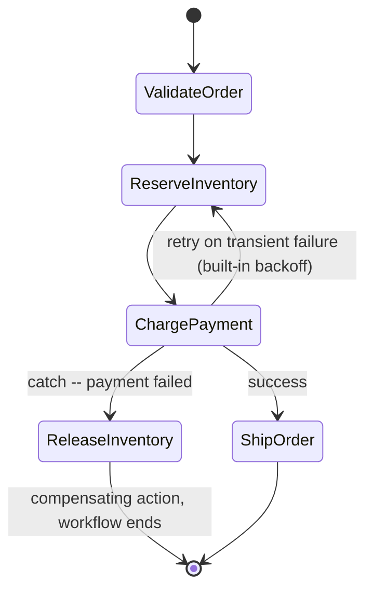

# Module 61 — AWS: Serverless — Lambda Cold Starts & Concurrency, API Gateway & Step Functions

> Domain: AWS | Level: Beginner → Expert | Prerequisite: [[04-Databases-RDS-Aurora-DynamoDB]] §2.6 (RDS Proxy's connection-exhaustion problem is specifically acute for Lambda), [[../17-Microservices/01-Decomposition-Communication-Strangler-Fig]] (serverless functions are a granular unit of service decomposition), [[../18-Event-Driven-Architecture/01-EDA-Fundamentals-Choreography-vs-Orchestration]] (Step Functions is AWS's native orchestration mechanism)

---

## 1. Fundamentals

### Why does a Principal Engineer need serverless depth beyond "Lambda runs code without servers"?
Serverless doesn't eliminate the operational reasoning this course has built up — it relocates it: instead of reasoning about EC2 instance warm-up (Module 57 §4), a Principal Engineer must reason about Lambda cold starts; instead of reasoning about ASG scaling limits, about Lambda concurrency limits; instead of reasoning about a fleet's aggregate database connections, about the amplified connection-exhaustion risk of many short-lived, independently-scaling function invocations (Module 60 §2.6) — serverless changes *which* operational concerns dominate, not whether operational reasoning is needed at all.

### Why does this matter?
Because Lambda's execution model (stateless, ephemeral, massively and independently concurrent) introduces failure modes with no direct equivalent in a traditional always-on server fleet (a "thundering herd" of simultaneous cold starts, a downstream dependency overwhelmed by concurrency scaling faster than that dependency itself can absorb) — a Principal Engineer must be able to design for these specific serverless failure modes, not assume "serverless" implies inherently simpler operational characteristics than a traditional fleet.

### When does this matter?
Any event-driven, bursty, or unpredictably-scaling workload where Lambda's pay-per-invocation, automatically-scaling model is a strong fit (processing S3/DynamoDB Stream events per Modules 59-60, handling API requests via API Gateway, orchestrating multi-step workflows via Step Functions) — and specifically whenever evaluating whether a given workload's actual characteristics (invocation frequency, latency sensitivity, execution duration) genuinely fit Lambda's model versus a container/EC2-based alternative.

### How does it work (30,000-ft view)?
```
Lambda: runs a function in response to an event, automatically scaling the number of concurrent
     executions -- billed per invocation/duration, no idle-server cost, but a NEW execution
     environment (cold start) is provisioned when concurrency needs to scale up
API Gateway: managed HTTP/REST/WebSocket front door, routing requests to Lambda (or other
     backends), handling auth, throttling, request validation
Step Functions: managed state-machine orchestrator, coordinating multi-step workflows (calling
     Lambda functions, other AWS services) with built-in retry/error-handling/parallel-execution
```

---

## 2. Deep Dive

### 2.1 Cold Starts — the Direct Serverless Analog to Module 57's Instance Warm-up
A Lambda **cold start** occurs when a new execution environment must be provisioned for an invocation (no existing idle "warm" environment available to reuse) — involving downloading the function's code/dependencies, initializing the runtime, and running any function-level initialization code (establishing a database connection, loading configuration) before the actual handler logic runs, adding latency (from tens of milliseconds for a lightweight runtime to several seconds for a large, dependency-heavy function, particularly in VPC-attached configurations historically, though AWS has substantially improved VPC cold-start latency in recent years) — this is structurally the *exact same class of problem* as Module 57 §4's EC2 instance warm-up-window incident (a new compute unit being asked to serve traffic before it's genuinely ready), just at a per-invocation granularity rather than a per-ASG-scaling-event granularity, meaning the same discipline (don't assume "provisioned" equals "ready") applies.

### 2.2 Concurrency — Scaling Behavior and Its Limits
Lambda scales concurrency automatically per invocation, up to an account-level (and optionally, function-level **reserved concurrency**) ceiling — critically, this scaling can happen **far faster** than a traditional ASG's instance-launch-based scaling (new concurrent executions can spin up within moments of a burst arriving), which is a genuine strength for absorbing sudden traffic spikes, but is also the direct mechanism behind the connection-exhaustion risk Module 60 §2.6 introduced: a downstream dependency (a database, a third-party API) that itself scales far more slowly (or not at all) than Lambda can be overwhelmed by Lambda's own rapid concurrency scaling, a distinctly serverless-specific version of Module 57 §9's "one component's elasticity outpacing another's capacity" pattern. **Reserved concurrency** caps a specific function's maximum concurrent executions (protecting a fragile downstream dependency, or a noisy-neighbor function from starving others of the account-level concurrency pool), while **provisioned concurrency** pre-initializes a specified number of execution environments to eliminate cold starts for latency-sensitive functions, at the cost of paying for that provisioned capacity continuously (a direct latency-vs-cost trade-off, not a free win).

### 2.3 Statelessness and Execution-Environment Reuse — What Actually Persists Between Invocations
A Lambda execution environment, once provisioned (warm), **may** be reused for a subsequent invocation (avoiding a repeat cold start) — but this reuse is opportunistic and never guaranteed, meaning any state a function relies on (an in-memory cache, a database connection established during initialization) must be treated as a *possible* optimization when the environment happens to be reused, never a *guarantee* the function's correctness depends on — a function that assumes a previously-established database connection will always be available (rather than checking/re-establishing it) will intermittently fail whenever a genuinely fresh cold start occurs, a subtle bug that "works in testing" (where cold starts might be rare due to consistent invocation frequency) and fails unpredictably in production's more variable invocation pattern.

### 2.4 API Gateway — the Managed HTTP Front Door
API Gateway provides request routing, authentication/authorization integration (with Cognito, IAM, or custom Lambda authorizers), request/response transformation, throttling, and caching in front of Lambda (or other backends) — critically, API Gateway's own throttling limits (account-level and per-API/per-route configurable) act as a genuine, independent capacity dimension from the backing Lambda function's own concurrency limits (§2.2), meaning — directly the same "independently-configured capacity dimensions must be reconciled together" pattern recurring throughout this AWS domain (Modules 57 §9, 58 §9, 59 §7) — a correctly-configured Lambda concurrency limit doesn't protect against a mismatched, more-permissive API Gateway throttle limit allowing more concurrent requests to arrive than the Lambda-side limit or a downstream dependency can actually absorb, and vice versa.

### 2.5 Step Functions — Managed Orchestration, Directly Extending Module 52's EDA Material
Step Functions defines a workflow as a state machine (a JSON-based Amazon States Language definition) coordinating a sequence of steps — each step typically invoking a Lambda function or another AWS service — with built-in, declarative support for retries (with configurable backoff), error handling/catch blocks, parallel execution branches, and wait states, without requiring the application to hand-roll this coordination logic itself. This is directly AWS's native implementation of the **orchestration** approach from Module 52 §2.2's choreography-vs-orchestration trade-off — Step Functions makes the overall workflow's state and control flow explicit and centrally visible (directly addressing the debuggability weakness Module 52 identified in pure choreography), at the cost of introducing a central coordinator whose own availability and correct configuration the workflow now depends on — the same fundamental trade-off Module 52 already established, now expressed as a concrete AWS service choice rather than an abstract architectural pattern.

### 2.6 Lambda's Idempotency and At-Least-Once Delivery — Module 48's Outbox/Idempotency Discussion, Now at the Compute Layer
Many Lambda invocation sources (SQS, S3 event notifications, DynamoDB Streams — all covered in Modules 59-60) provide only **at-least-once** delivery, meaning a given event can, under specific failure/retry conditions, invoke a Lambda function **more than once** for the same logical event — directly Module 48's idempotency discussion, now a first-class Lambda-development concern: any Lambda function processing events from an at-least-once source must be written to be **idempotent** (processing the same event twice produces the same result as processing it once, e.g., via a deduplication check keyed on the event's own unique ID, directly the pattern Module 48 §2.3 already established for message-queue consumers generally) — a Lambda function that assumes "invoked once per logical event" without this idempotency discipline will produce duplicate side effects (a duplicate charge, a duplicate email) under real, not-uncommon retry conditions.

---

## 3. Visual Architecture

### Cold Start vs. Warm Invocation Timeline

```mermaid
gantt
    dateFormat X
    axisFormat %Lms
    section Cold Start
    Download code/deps       :0, 200
    Init runtime              :200, 350
    Function init code (DB connect, config load) :350, 600
    Handler execution         :600, 750
    section Warm Invocation (reused environment)
    Handler execution only    :0, 150
```


### Step Functions Orchestrating a Multi-Step Checkout Workflow (§2.5)


## 4. Production Example
**Scenario**: A notification service used a Lambda function, triggered by an SQS queue, to send transactional emails — the function's implementation directly called the email-sending API and marked the SQS message as successfully processed only after receiving the email provider's success response, with no explicit deduplication logic, on the (unstated, never explicitly reviewed) assumption that "SQS delivers each message once." During a period of elevated latency from the email provider's API, several Lambda invocations approached (and, for a subset, exceeded) the function's configured timeout — SQS's visibility-timeout mechanism (already covered conceptually in Module 48/56's queue-semantics material) made those messages visible again for redelivery after the visibility timeout expired, even though, for some of them, the original invocation's email-send call had actually succeeded just before the timeout was hit — the function had no way to distinguish "this message is genuinely new" from "this message was already processed but the success acknowledgment didn't complete in time." **Investigation**: a measurable number of customers received the same transactional email (an order confirmation, a password-reset link) two or more times — support tickets confirmed the pattern correlated precisely with the period of elevated email-provider latency, confirming the retry/redelivery mechanism as the cause rather than an application logic bug in the email content itself. **Root cause**: the function was written assuming exactly-once invocation semantics from SQS, when SQS (like the vast majority of real-world message queues, per Module 48/56's already-established delivery-semantics discussion) provides only at-least-once delivery — this is precisely §2.6's idempotency requirement, unaddressed. **Fix**: introduced a deduplication check using each message's unique identifier (already present in the SQS message's `MessageId`, or a domain-specific idempotency key extracted from the message body) against a DynamoDB table with a short TTL, checked-and-set atomically before sending the email — a duplicate delivery of the same message now short-circuits before triggering a second email-send call, converting the function into a genuinely idempotent consumer regardless of how many times SQS redelivers the same underlying message. **Lesson**: "the queue probably delivers each message once" is an assumption that holds under normal, low-latency conditions and fails silently under exactly the abnormal, elevated-latency conditions where the visibility-timeout/redelivery mechanism actually activates — precisely the same "invisible until a specific real-world triggering condition" pattern this entire AWS domain keeps surfacing, here recurring at the serverless-compute-and-queue-integration layer.

## 5. Best Practices
- Write every Lambda function that consumes from an at-least-once source (SQS, S3 events, DynamoDB Streams) to be idempotent via explicit deduplication, never assuming exactly-once delivery (§4).
- Never rely on Lambda execution-environment reuse for correctness — treat any reused warm state (connections, caches) as an opportunistic optimization, always verified/re-established if stale or absent (§2.3).
- Explicitly reconcile API Gateway throttling limits, Lambda concurrency limits (reserved/provisioned), and downstream dependency capacity together — configuring any one in isolation doesn't guarantee the combined path is protected (§2.4).
- Use provisioned concurrency deliberately, only for genuinely latency-sensitive functions where the continuous cost is justified, not as a default applied to every function.
- Use Step Functions (orchestration) over hand-rolled choreography for any workflow where centralized visibility, built-in retry/error-handling, and debuggability matter more than the flexibility of fully decoupled event producers/consumers (§2.5, revisiting Module 52's trade-off).

## 6. Anti-patterns
- Assuming a message-queue-triggered Lambda function is invoked exactly once per logical event, omitting idempotency/deduplication logic (§4).
- Relying on Lambda execution-environment reuse (a warm database connection, an in-memory cache) as a correctness assumption rather than a best-effort optimization.
- Configuring Lambda reserved concurrency, API Gateway throttling, and downstream dependency capacity independently without reconciling them, risking either an artificially constrained system or an overwhelmed downstream dependency.
- Applying provisioned concurrency universally "to be safe" without evaluating whether each specific function's latency sensitivity actually justifies its continuous cost.
- Building a complex, multi-step workflow entirely via ad hoc Lambda-to-Lambda invocations or hand-rolled SQS-chaining rather than using Step Functions, forfeiting built-in retry/error-handling/visibility for a harder-to-debug, custom-built equivalent.

---

## 10. Interview Questions

### Basic (10)
1. **Q: What is a Lambda cold start?** **A:** The latency incurred when a new execution environment must be provisioned for an invocation — downloading code, initializing the runtime, and running function-level init code — versus reusing an already-warm environment.
2. **Q: Why can't a Lambda function rely on a database connection established during a previous invocation always being available?** **A:** Execution-environment reuse is opportunistic, never guaranteed — a fresh cold start provides no prior state, so any prior-invocation state must be treated as an optional optimization, not a correctness guarantee.
3. **Q: What is the difference between reserved concurrency and provisioned concurrency?** **A:** Reserved concurrency caps a function's maximum concurrent executions; provisioned concurrency pre-initializes execution environments to eliminate cold starts, at continuous cost.
4. **Q: What does API Gateway provide beyond simple request routing to Lambda?** **A:** Authentication/authorization integration, request/response transformation, throttling, and caching.
5. **Q: What is Step Functions?** **A:** A managed state-machine orchestrator coordinating multi-step workflows with built-in retry, error handling, and parallel execution.
6. **Q: Which AWS pattern (from Module 52) does Step Functions directly implement?** **A:** Orchestration — a central coordinator explicitly managing workflow state and control flow, as opposed to choreography's fully decoupled event producers/consumers.
7. **Q: What delivery guarantee does SQS provide to a Lambda consumer?** **A:** At-least-once — a message can be delivered and processed more than once under certain failure/retry conditions.
8. **Q: Why must a Lambda function consuming from SQS be idempotent?** **A:** Because at-least-once delivery means the same logical event can invoke the function multiple times; without deduplication, this causes duplicate side effects.
9. **Q: What is a concrete factor that increases Lambda cold-start latency?** **A:** A larger deployment package size or a runtime with inherently slower initialization characteristics.
10. **Q: Why should Lambda execution roles be scoped per-function rather than shared broadly?** **A:** A shared, overly broad role recreates the risk of one function's vulnerability inheriting the entire shared role's permission set as its blast radius.

### Intermediate (10)
1. **Q: Why is Lambda's cold-start problem described as structurally the same class of issue as Module 57's EC2 instance warm-up incident?** **A:** Both involve a newly-provisioned compute unit being asked to serve traffic before it's genuinely ready to do so correctly — the difference is granularity (per-invocation for Lambda versus per-scaling-event for an ASG), not the underlying failure category.
2. **Q: Why can Lambda's rapid concurrency scaling actually be a liability rather than a pure strength?** **A:** It can scale far faster than a downstream dependency (a database, a rate-limited API) can absorb, overwhelming that dependency in a way a more gradually-scaling traditional fleet might not — the same elasticity that's a strength for absorbing traffic spikes becomes a risk when unbounded by the downstream system's actual capacity.
3. **Q: Why did the §4 incident's duplicate-email bug specifically correlate with a period of elevated email-provider latency rather than occurring at a constant background rate?** **A:** The visibility-timeout/redelivery mechanism only activates when a Lambda invocation's processing time approaches or exceeds the configured timeout — elevated downstream (email-provider) latency directly increased the frequency of invocations hitting that threshold, which is precisely when SQS's at-least-once redelivery behavior actually manifests.
4. **Q: Why must API Gateway throttling limits, Lambda concurrency limits, and downstream dependency capacity be reconciled together rather than configured independently?** **A:** Each is an independently-configured capacity ceiling; correctly configuring any one in isolation doesn't guarantee the combined request path is protected, since a more-permissive setting anywhere in the chain allows more load through than a more-restrictive setting elsewhere can actually handle, echoing Module 57 §9's recurring capacity-reconciliation pattern.
5. **Q: Why is provisioned concurrency described as a genuine cost trade-off rather than a "free" cold-start fix?** **A:** It requires continuously paying for pre-initialized execution environments regardless of whether they're actively invoked, meaning it should be applied deliberately to genuinely latency-sensitive functions, not universally, or the cost savings of Lambda's pay-per-invocation model are substantially eroded.
6. **Q: Why does Step Functions' orchestration approach directly address the debuggability weakness Module 52 identified in choreography?** **A:** Because the workflow's state and control flow are explicit and centrally visible in the state machine definition and execution history, rather than implicitly distributed across many independently-reacting event consumers with no single place to observe overall workflow progress.
7. **Q: Why is "SQS delivers each message once" an assumption that fails specifically under abnormal conditions rather than being uniformly wrong?** **A:** Under normal, low-latency processing, a message is typically acknowledged well within its visibility timeout and genuinely processed once in practice; the at-least-once redelivery behavior specifically activates when processing approaches or exceeds the visibility timeout, meaning the assumption "usually holds" right up until the exact abnormal conditions (elevated downstream latency, timeouts) where it matters most.
8. **Q: Why should a Lambda function not treat "API Gateway already authenticated this request" as sufficient without its own independent validation?** **A:** A misconfigured authorizer, a bypassed API Gateway path, or an internal invocation route not going through API Gateway at all would leave the function with zero protection if it relies solely on the upstream layer — defense-in-depth requires each layer to independently enforce its own security-relevant assumptions, not delegate entirely to a preceding layer.
9. **Q: Why does minimizing Lambda deployment package size have a measurable performance impact rather than being purely a code-hygiene concern?** **A:** A larger package takes longer to download and initialize during a cold start, directly adding to cold-start latency — this is a concrete, measurable performance lever, not just an aesthetic or maintainability improvement.
10. **Q: Why can Step Functions itself become a scalability bottleneck independent of the Lambda functions it orchestrates?** **A:** Step Functions has its own account-level execution-history limits and per-state-transition rate limits; a very-high-volume, per-request workflow can hit these orchestration-layer limits well before the underlying Lambda functions being orchestrated hit any limit of their own.

### Advanced (10)
1. **Q: Diagnose the §4 incident from first principles, and design the specific idempotency-key strategy (beyond "use the SQS MessageId") that correctly handles a scenario where the *same logical business event* might legitimately be re-published as a genuinely new SQS message (not a queue-level redelivery) by an upstream producer retrying its own failed publish.**
   **A:** SQS's own `MessageId` only deduplicates *queue-level* redelivery of the *same* message — it does not protect against an upstream producer publishing a logically-duplicate *new* message (a distinct `MessageId`) after, say, a network timeout made it believe its first publish failed when it had actually succeeded. The correct idempotency key must be **domain-derived** — extracted from the message's business content (e.g., a client-generated request ID, or a deterministic hash of the logical event's defining fields) rather than the transport-level `MessageId` — so that both queue-level redelivery *and* upstream-producer-level republication of the same logical event are correctly deduplicated against the same DynamoDB idempotency-check table, a more robust generalization of §4's fix.
2. **Q: A team argues that since Lambda functions are stateless and independently invoked, they don't need to worry about the "noisy neighbor" problem that a shared EC2 fleet has. Evaluate this claim.**
   **A:** Push back — Lambda's noisy-neighbor risk manifests differently, not absently: without function-level reserved concurrency (§2.2), one function experiencing a traffic spike can consume the shared account-level concurrency pool, starving other functions in the same account of their own ability to scale, a direct, real analog to a shared EC2 fleet's resource contention, just expressed through the concurrency-limit mechanism rather than CPU/memory contention on a shared host — reserved concurrency is the direct mitigation, and omitting it under the "stateless means isolated" assumption leaves this risk unaddressed.
3. **Q: Design the specific pre-production test that would have caught the §4 idempotency gap before a live email-provider latency spike exposed it, generalizing this module's recurring "steady-state testing doesn't exercise the failure-triggering condition" pattern.**
   **A:** A test that deliberately introduces artificial latency into the downstream (email-provider) call — pushing simulated invocation duration close to or past the configured Lambda/SQS visibility timeout — combined with SQS's actual redelivery behavior (or a direct simulation of redelivering the same message), verifying the function produces exactly one email send regardless of how many times the same message is delivered; steady-state, low-latency testing never exercises the specific timing window where redelivery actually occurs, the same lesson as Module 60 §Advanced Q3's replication-lag load test, now applied to message-redelivery timing specifically.
4. **Q: A workload is deciding between a Lambda-based architecture and a long-running container (ECS/EKS, previewing Module 63) for a given service. Design a decision framework.**
   **A:** Favor Lambda when: invocation frequency is bursty/unpredictable (making pay-per-invocation genuinely cost-effective versus paying for idle always-on compute), individual execution duration is short (well within Lambda's maximum execution-time limit) and cold-start latency is tolerable for the use case, and the workload naturally decomposes into discrete, event-triggered units of work. Favor containers when: the workload requires consistently low, cold-start-free latency at sustained volume (where provisioned concurrency's continuous cost approaches or exceeds a comparably-sized always-on container fleet anyway), needs long-running or stateful in-process behavior (a persistent WebSocket connection, an in-memory cache serving many requests), or has specialized runtime/dependency requirements poorly suited to Lambda's packaging model — the decision should be grounded in the workload's actual traffic pattern and latency/duration requirements, not a default preference for either model.
5. **Q: Critique the following claim: "Since our Lambda function has reserved concurrency configured, our downstream RDS database is protected from being overwhelmed by a traffic spike."**
   **A:** Incomplete — reserved concurrency caps *that specific function's* maximum concurrency, but if the reserved value itself was set without reconciling it against the database's actual connection/query-throughput capacity (Module 60 §2.6's RDS Proxy discussion), the reserved concurrency ceiling could still exceed what the database can absorb — "reserved concurrency exists" is not equivalent to "reserved concurrency is correctly sized against the actual downstream capacity constraint," the same independently-configured-settings trap recurring throughout this domain (§2.4, Module 57 §9).
6. **Q: Design a Step Functions workflow's error-handling strategy for the checkout example (§Visual Architecture) such that a payment charge that succeeds but whose subsequent "reserve shipping" step fails does not result in a charged customer with no fulfilled order.**
   **A:** Use Step Functions' built-in `Catch` mechanism on the "reserve shipping" step to trigger a compensating-transaction branch (directly Module 47/48's saga-pattern reasoning, now expressed via Step Functions' native constructs) that explicitly issues a refund for the already-completed payment charge before terminating the workflow in a "failed, compensated" end state — critically, the compensating refund action must itself be idempotent and retried-with-backoff (Step Functions' built-in retry configuration) in case the refund call itself transiently fails, since a saga's compensating actions carry the same at-least-once-delivery/idempotency requirements (§2.6) as any other step.
7. **Q: A Principal Engineer is reviewing a Lambda function whose deployment package is 180MB (near Lambda's size limits) due to bundling an entire ML inference library it uses on roughly 2% of invocations. Evaluate the design and propose an alternative.**
   **A:** The bundled dependency imposes its full cold-start cost (§7) on 100% of invocations to serve a code path used by only 2% of them — the correct redesign is to **split** the function: route the 2% of ML-inference-requiring invocations to a separate, dedicated Lambda function (or container-based service, per Advanced Q4's decision framework, if the ML library's cold-start cost is severe enough that even a dedicated Lambda function's cold start is unacceptable) that bundles the heavy dependency, while the remaining 98% of invocations run against a lean, fast-cold-starting function with no ML dependency at all — directly the same single-responsibility decomposition principle from Module 49, now applied specifically to isolate a disproportionately expensive dependency from a function's common-case cold-start cost.
8. **Q: Explain why "our system uses Lambda, so it automatically scales infinitely" is a claim requiring the same scrutiny as Module 57 §Advanced Q9's "multi-AZ ASG is resilient to any failure" overgeneralization.**
   **A:** Lambda's own concurrency scaling has real account-level and configurable function-level ceilings (§2.2, §9), and — even where Lambda's own scaling is genuinely near-limitless — every downstream dependency it calls (a database, a third-party API, another internal service) has its own, typically far lower, capacity ceiling; "Lambda scales" addresses only the compute layer's own elasticity, not the elasticity (or lack thereof) of everything Lambda's code actually depends on, the same "resilient/scalable to this specific addressed dimension, not to every possible constraint" overgeneralization pattern recurring throughout this AWS domain.
9. **Q: Design a strategy for safely rolling out a change to a high-traffic Lambda function's code, minimizing the blast radius of a bad deployment, analogous to Module 51's canary-deployment discipline for traditional services.**
   **A:** Use Lambda's built-in **versioning and aliases** combined with API Gateway's (or Lambda's native) traffic-shifting capability to route a small percentage of invocations to the new version while the majority continue on the previous, known-good version, monitoring error rates/latency on the canary slice before progressively increasing its traffic share — directly Module 51's canary-deployment pattern, now expressed via Lambda-native mechanisms rather than requiring a separate load-balancer-based canary setup as a traditional EC2/container deployment would.
10. **Q: As a Principal Engineer establishing serverless standards for an organization, design the specific set of standing architectural reviews and automated checks (synthesizing this entire module) you would require for every new Lambda-based workload.**
    **A:** (1) Mandatory idempotency review for any Lambda function consuming from an at-least-once source, using a domain-derived (not transport-level) deduplication key (Advanced Q1) — necessary because queue-level `MessageId` deduplication alone doesn't cover upstream-producer-level duplication. (2) Mandatory reserved-concurrency sizing explicitly reconciled against each downstream dependency's actual measured capacity (Advanced Q5), not configured in isolation. (3) Mandatory cold-start-triggering load test (Advanced Q3) for any latency-sensitive function before production rollout, specifically simulating near-timeout downstream latency conditions. (4) Mandatory dependency-size review flagging any function whose deployment package disproportionately serves a small fraction of its invocations (Advanced Q7), with a decomposition requirement above a defined threshold. (5) Mandatory canary/versioned rollout (Advanced Q9) for any high-traffic Lambda function's code changes, never a direct, unstaged full-traffic deployment. Each standard targets a distinct, concrete failure mode this module identified, extending the governance-gate pattern from Modules 57-60 into the serverless-compute layer specifically.

---

## 11. Coding Exercises

### Easy — Idempotent SQS-triggered Lambda handler (§2.6, §4's fix)
```csharp
public class NotificationHandler
{
    private readonly IAmazonDynamoDB _dedupeTable;
    private readonly IEmailClient _emailClient;

    public async Task HandleAsync(SQSEvent evt)
    {
        foreach (var record in evt.Records)
        {
            var idempotencyKey = ExtractDomainIdempotencyKey(record.Body);  // NOT record.MessageId alone (§Advanced Q1)

            var alreadyProcessed = await TryClaimIdempotencyKeyAsync(idempotencyKey);
            if (alreadyProcessed) continue;   // duplicate delivery -- short-circuit, no second email

            var notification = JsonSerializer.Deserialize<NotificationRequest>(record.Body);
            await _emailClient.SendAsync(notification);
        }
    }

    private async Task<bool> TryClaimIdempotencyKeyAsync(string key)
    {
        try
        {
            // Conditional PutItem -- atomically claims the key ONLY if it doesn't already exist.
            await _dedupeTable.PutItemAsync(new PutItemRequest
            {
                TableName = "processed-notifications",
                Item = new() { ["id"] = new AttributeValue(key), ["ttl"] = new AttributeValue { N = Ttl24hFromNow() } },
                ConditionExpression = "attribute_not_exists(id)"
            });
            return false;  // successfully claimed -- this is a NEW event
        }
        catch (ConditionalCheckFailedException) { return true; }  // already claimed -- DUPLICATE
    }
}
```

### Medium — Lambda function initialization done correctly (§2.3)
```csharp
public class OrderHandler
{
    // Initialized ONCE per execution environment, opportunistically reused -- NEVER assumed present.
    private static NpgsqlConnection? _connection;

    public async Task<APIGatewayProxyResponse> HandleAsync(APIGatewayProxyRequest request)
    {
        // Re-establish if this is a cold start OR if a reused connection has gone stale --
        // never assume a prior invocation's connection is still valid (§2.3's lesson).
        if (_connection is null || _connection.State != ConnectionState.Open)
        {
            _connection = new NpgsqlConnection(await GetConnectionStringAsync());
            await _connection.OpenAsync();
        }

        var order = await ProcessOrderAsync(_connection, request);
        return new APIGatewayProxyResponse { StatusCode = 200, Body = JsonSerializer.Serialize(order) };
    }
}
```

### Hard — Reserved concurrency + provisioned concurrency configuration (§2.2, §Advanced Q5)
```hcl
resource "aws_lambda_function" "checkout_processor" {
  function_name = "checkout-processor"
  # ...
}

resource "aws_lambda_provisioned_concurrency_config" "checkout_warm" {
  function_name                     = aws_lambda_function.checkout_processor.function_name
  qualifier                         = aws_lambda_function.checkout_processor.version
  provisioned_concurrent_executions = 20   # sized to observed BASELINE traffic, not peak (§7)
}

resource "aws_lambda_function_event_invoke_config" "checkout_reserved" {
  function_name                = aws_lambda_function.checkout_processor.function_name
  maximum_retry_attempts       = 2
}

# Reserved concurrency explicitly capped to match what RDS Proxy + the underlying
# Aurora cluster can actually absorb (Module 60 §2.6) -- NOT set in isolation (§Advanced Q5).
resource "aws_lambda_function" "checkout_processor_concurrency" {
  reserved_concurrent_executions = 50   # reconciled against RDS Proxy's own max connections
}
```

### Expert — Step Functions saga with compensating action (§Advanced Q6)
```json
{
  "StartAt": "ChargePayment",
  "States": {
    "ChargePayment": {
      "Type": "Task",
      "Resource": "arn:aws:lambda:us-east-1:222222222222:function:charge-payment",
      "Retry": [{ "ErrorEquals": ["TransientError"], "IntervalSeconds": 2, "MaxAttempts": 3, "BackoffRate": 2.0 }],
      "Catch": [{ "ErrorEquals": ["States.ALL"], "Next": "OrderFailed" }],
      "Next": "ReserveShipping"
    },
    "ReserveShipping": {
      "Type": "Task",
      "Resource": "arn:aws:lambda:us-east-1:222222222222:function:reserve-shipping",
      "Catch": [{ "ErrorEquals": ["States.ALL"], "Next": "RefundPayment" }],
      "Next": "OrderConfirmed"
    },
    "RefundPayment": {
      "Type": "Task",
      "Resource": "arn:aws:lambda:us-east-1:222222222222:function:refund-payment",
      "Retry": [{ "ErrorEquals": ["States.ALL"], "IntervalSeconds": 5, "MaxAttempts": 5 }],
      "Next": "OrderFailed"
    },
    "OrderFailed": { "Type": "Fail" },
    "OrderConfirmed": { "Type": "Succeed" }
  }
}
```
**Discussion**: the `RefundPayment` compensating step itself has aggressive retry configuration (§Advanced Q6's lesson that compensating actions carry the same idempotency/at-least-once requirements as any other step) — `refund-payment`'s own Lambda implementation must be idempotent (safe to invoke multiple times for the same charge ID) exactly per §2.6's discipline, since Step Functions' own retry mechanism is itself an at-least-once invoker.

---

## 12–17. System Design / LLD / Debugging / Decision / Case Study / Principal

*(§4's incident, the four §11 exercises, and the Advanced-tier Q&A — especially Advanced Q1's domain-derived idempotency key, Advanced Q4's Lambda-vs-container decision framework, and Advanced Q10's synthesized governance checklist — collectively constitute this module's system-design, debugging, and Principal-Engineer-level content.)*

## 18. Revision
**Key takeaways**: Lambda cold starts are structurally the same class of "newly-provisioned compute isn't immediately ready" problem as Module 57's ASG warm-up incident, just at per-invocation granularity. Execution-environment reuse is an opportunistic optimization, never a correctness guarantee — function-level state must always be verified or re-established. Lambda's rapid concurrency scaling can overwhelm slower-scaling downstream dependencies faster than a traditional fleet would, making reserved concurrency an essential, deliberately-sized capacity-planning tool, reconciled against actual downstream capacity, not configured in isolation. Any Lambda function consuming from an at-least-once source (SQS, S3, DynamoDB Streams) must be idempotent via a domain-derived deduplication key — this failure mode is invisible under low-latency steady-state conditions and manifests specifically when downstream latency pushes invocations toward their timeout (§4). Step Functions is AWS's native orchestration mechanism, directly implementing Module 52's orchestration-vs-choreography trade-off, and is the correct default for multi-step workflows needing centralized visibility, retries, and saga-style compensating actions. The recurring "independently-configured capacity dimensions must be reconciled together" theme from Modules 57-60 applies directly to API Gateway throttling, Lambda concurrency, and downstream capacity.

---

**Next**: Continuing to Module 62 — AWS: Messaging & Event-Driven Architecture (SQS, SNS, EventBridge, Kinesis), continuing the `21-AWS` domain and explicitly connecting back to Modules 52-56.
