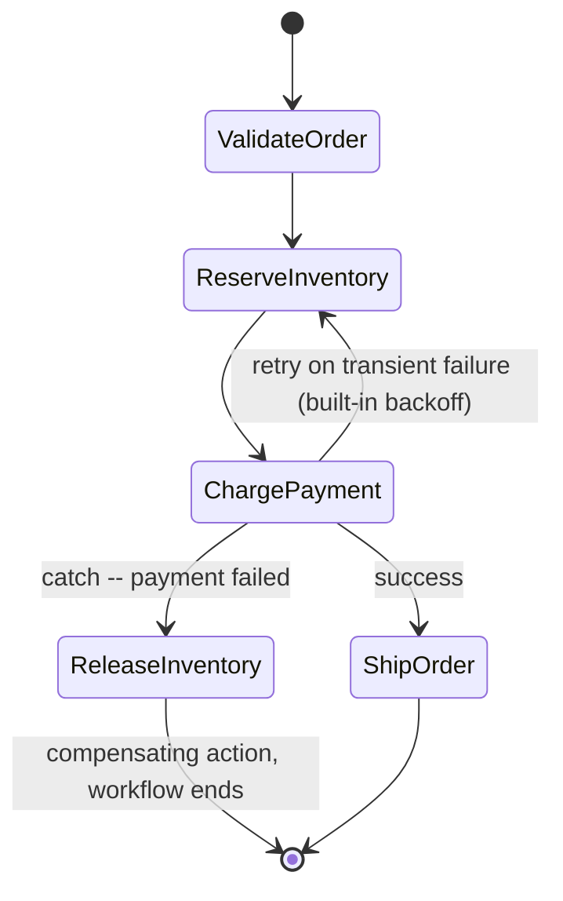
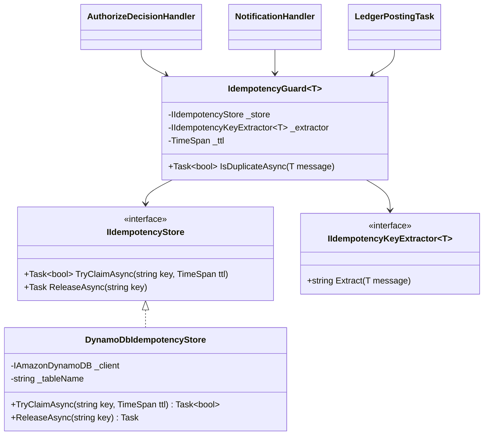
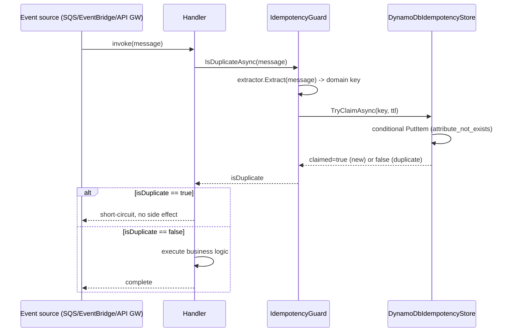

# Module 61 — AWS: Serverless — Lambda Cold Starts & Concurrency, API Gateway & Step Functions

> Domain: AWS | Level: Beginner → Expert | Prerequisite: [[04-Databases-RDS-Aurora-DynamoDB]] (RDS Proxy's connection-exhaustion problem is specifically acute for Lambda), [[../17-Microservices/01-Decomposition-Communication-Strangler-Fig]] (serverless functions are a granular unit of service decomposition), [[../18-Event-Driven-Architecture/01-EDA-Fundamentals-Choreography-vs-Orchestration]] (Step Functions is AWS's native orchestration mechanism)

---

## 1. Fundamentals

### Why does a Principal Engineer need serverless depth beyond "Lambda runs code without servers"?
Serverless doesn't eliminate the operational reasoning this course has built up — it relocates it: instead of reasoning about EC2 instance warm-up, a Principal Engineer must reason about Lambda cold starts; instead of reasoning about ASG scaling limits, about Lambda concurrency limits; instead of reasoning about a fleet's aggregate database connections, about the amplified connection-exhaustion risk of many short-lived, independently-scaling function invocations — serverless changes *which* operational concerns dominate, not whether operational reasoning is needed at all.

### Why does this matter?
Because Lambda's execution model (stateless, ephemeral, massively and independently concurrent) introduces failure modes with no direct equivalent in a traditional always-on server fleet (a "thundering herd" of simultaneous cold starts, a downstream dependency overwhelmed by concurrency scaling faster than that dependency itself can absorb) — a Principal Engineer must be able to design for these specific serverless failure modes, not assume "serverless" implies inherently simpler operational characteristics than a traditional fleet.

### When does this matter?
Any event-driven, bursty, or unpredictably-scaling workload where Lambda's pay-per-invocation, automatically-scaling model is a strong fit (processing S3/DynamoDB Stream events per Modules 59-60, handling API requests via API Gateway, orchestrating multi-step workflows via Step Functions) — and specifically whenever evaluating whether a given workload's actual characteristics (invocation frequency, latency sensitivity, execution duration) genuinely fit Lambda's model versus a container/EC2-based alternative.

### How does it work (30,000-ft view)?
```
Lambda: runs a function in response to an event, automatically scaling the number of concurrent
 executions -- billed per invocation/duration, no idle-server cost, but a NEW execution
 environment (cold start) is provisioned when concurrency needs to scale up
API Gateway: managed HTTP/REST/WebSocket front door, routing requests to Lambda (or other
 backends), handling auth, throttling, request validation
Step Functions: managed state-machine orchestrator, coordinating multi-step workflows (calling
 Lambda functions, other AWS services) with built-in retry/error-handling/parallel-execution
```

---

## 2. Deep Dive

### 2.1 Cold Starts — the Direct Serverless Analog to the Instance Warm-up
A Lambda **cold start** occurs when a new execution environment must be provisioned for an invocation (no existing idle "warm" environment available to reuse) — involving downloading the function's code/dependencies, initializing the runtime, and running any function-level initialization code (establishing a database connection, loading configuration) before the actual handler logic runs, adding latency (from tens of milliseconds for a lightweight runtime to several seconds for a large, dependency-heavy function, particularly in VPC-attached configurations historically, though AWS has substantially improved VPC cold-start latency in recent years) — this is structurally the *exact same class of problem* as the EC2 instance warm-up-window incident (a new compute unit being asked to serve traffic before it's genuinely ready), just at a per-invocation granularity rather than a per-ASG-scaling-event granularity, meaning the same discipline (don't assume "provisioned" equals "ready") applies.

### 2.2 Concurrency — Scaling Behavior and Its Limits
Lambda scales concurrency automatically per invocation, up to an account-level (and optionally, function-level **reserved concurrency**) ceiling — critically, this scaling can happen **far faster** than a traditional ASG's instance-launch-based scaling (new concurrent executions can spin up within moments of a burst arriving), which is a genuine strength for absorbing sudden traffic spikes, but is also the direct mechanism behind the connection-exhaustion risk introduced: a downstream dependency (a database, a third-party API) that itself scales far more slowly (or not at all) than Lambda can be overwhelmed by Lambda's own rapid concurrency scaling, a distinctly serverless-specific version of the "one component's elasticity outpacing another's capacity" pattern. **Reserved concurrency** caps a specific function's maximum concurrent executions (protecting a fragile downstream dependency, or a noisy-neighbor function from starving others of the account-level concurrency pool), while **provisioned concurrency** pre-initializes a specified number of execution environments to eliminate cold starts for latency-sensitive functions, at the cost of paying for that provisioned capacity continuously (a direct latency-vs-cost trade-off, not a free win).

### 2.3 Statelessness and Execution-Environment Reuse — What Actually Persists Between Invocations
A Lambda execution environment, once provisioned (warm), **may** be reused for a subsequent invocation (avoiding a repeat cold start) — but this reuse is opportunistic and never guaranteed, meaning any state a function relies on (an in-memory cache, a database connection established during initialization) must be treated as a *possible* optimization when the environment happens to be reused, never a *guarantee* the function's correctness depends on — a function that assumes a previously-established database connection will always be available (rather than checking/re-establishing it) will intermittently fail whenever a genuinely fresh cold start occurs, a subtle bug that "works in testing" (where cold starts might be rare due to consistent invocation frequency) and fails unpredictably in production's more variable invocation pattern.

### 2.4 API Gateway — the Managed HTTP Front Door
API Gateway provides request routing, authentication/authorization integration (with Cognito, IAM, or custom Lambda authorizers), request/response transformation, throttling, and caching in front of Lambda (or other backends) — critically, API Gateway's own throttling limits (account-level and per-API/per-route configurable) act as a genuine, independent capacity dimension from the backing Lambda function's own concurrency limits, meaning — directly the same "independently-configured capacity dimensions must be reconciled together" pattern recurring throughout this AWS domain (Modules 57, 58, 59) — a correctly-configured Lambda concurrency limit doesn't protect against a mismatched, more-permissive API Gateway throttle limit allowing more concurrent requests to arrive than the Lambda-side limit or a downstream dependency can actually absorb, and vice versa.

### 2.5 Step Functions — Managed Orchestration, Directly Extending the EDA Material
Step Functions defines a workflow as a state machine (a JSON-based Amazon States Language definition) coordinating a sequence of steps — each step typically invoking a Lambda function or another AWS service — with built-in, declarative support for retries (with configurable backoff), error handling/catch blocks, parallel execution branches, and wait states, without requiring the application to hand-roll this coordination logic itself. This is directly AWS's native implementation of the **orchestration** approach from the choreography-vs-orchestration trade-off — Step Functions makes the overall workflow's state and control flow explicit and centrally visible (directly addressing the debuggability weakness identified in pure choreography), at the cost of introducing a central coordinator whose own availability and correct configuration the workflow now depends on — the same fundamental trade-off already established, now expressed as a concrete AWS service choice rather than an abstract architectural pattern.

### 2.6 Lambda's Idempotency and At-Least-Once Delivery — the Outbox/Idempotency Discussion, Now at the Compute Layer
Many Lambda invocation sources (SQS, S3 event notifications, DynamoDB Streams — all covered in Modules 59-60) provide only **at-least-once** delivery, meaning a given event can, under specific failure/retry conditions, invoke a Lambda function **more than once** for the same logical event — directly the idempotency discussion, now a first-class Lambda-development concern: any Lambda function processing events from an at-least-once source must be written to be **idempotent** (processing the same event twice produces the same result as processing it once, e.g., via a deduplication check keyed on the event's own unique ID, directly the pattern already established for message-queue consumers generally) — a Lambda function that assumes "invoked once per logical event" without this idempotency discipline will produce duplicate side effects (a duplicate charge, a duplicate email) under real, not-uncommon retry conditions.

---

## 3. Visual Architecture

### Cold Start vs. Warm Invocation Timeline

```mermaid
gantt
 dateFormat X
 axisFormat %Lms
 section Cold Start
 Download code/deps:0, 200
 Init runtime:200, 350
 Function init code (DB connect, config load):350, 600
 Handler execution:600, 750
 section Warm Invocation (reused environment)
 Handler execution only:0, 150
```

### Step Functions Orchestrating a Multi-Step Checkout Workflow

```mermaid
stateDiagram-v2
 [*] --> ValidateOrder
 ValidateOrder --> ReserveInventory
 ReserveInventory --> ChargePayment
 ChargePayment --> ReserveInventory: retry on transient failure (built-in backoff)
 ChargePayment --> ReleaseInventory: catch -- payment failed
 ChargePayment --> ShipOrder: success
 ReleaseInventory --> [*]: compensating action, workflow ends
 ShipOrder --> [*]
```

## 4. Production Example
**Scenario**: A notification service used a Lambda function, triggered by an SQS queue, to send transactional emails — the function's implementation directly called the email-sending API and marked the SQS message as successfully processed only after receiving the email provider's success response, with no explicit deduplication logic, on the (unstated, never explicitly reviewed) assumption that "SQS delivers each message once." During a period of elevated latency from the email provider's API, several Lambda invocations approached (and, for a subset, exceeded) the function's configured timeout — SQS's visibility-timeout mechanism (already covered conceptually /56's queue-semantics material) made those messages visible again for redelivery after the visibility timeout expired, even though, for some of them, the original invocation's email-send call had actually succeeded just before the timeout was hit — the function had no way to distinguish "this message is genuinely new" from "this message was already processed but the success acknowledgment didn't complete in time." **Investigation**: a measurable number of customers received the same transactional email (an order confirmation, a password-reset link) two or more times — support tickets confirmed the pattern correlated precisely with the period of elevated email-provider latency, confirming the retry/redelivery mechanism as the cause rather than an application logic bug in the email content itself. **Root cause**: the function was written assuming exactly-once invocation semantics from SQS, when SQS (like the vast majority of real-world message queues/56's already-established delivery-semantics discussion) provides only at-least-once delivery — this is precisely the idempotency requirement, unaddressed. **Fix**: introduced a deduplication check using each message's unique identifier (already present in the SQS message's `MessageId`, or a domain-specific idempotency key extracted from the message body) against a DynamoDB table with a short TTL, checked-and-set atomically before sending the email — a duplicate delivery of the same message now short-circuits before triggering a second email-send call, converting the function into a genuinely idempotent consumer regardless of how many times SQS redelivers the same underlying message. **Lesson**: "the queue probably delivers each message once" is an assumption that holds under normal, low-latency conditions and fails silently under exactly the abnormal, elevated-latency conditions where the visibility-timeout/redelivery mechanism actually activates — precisely the same "invisible until a specific real-world triggering condition" pattern this entire AWS domain keeps surfacing, here recurring at the serverless-compute-and-queue-integration layer.

## 5. Best Practices
- Write every Lambda function that consumes from an at-least-once source (SQS, S3 events, DynamoDB Streams) to be idempotent via explicit deduplication, never assuming exactly-once delivery.
- Never rely on Lambda execution-environment reuse for correctness — treat any reused warm state (connections, caches) as an opportunistic optimization, always verified/re-established if stale or absent.
- Explicitly reconcile API Gateway throttling limits, Lambda concurrency limits (reserved/provisioned), and downstream dependency capacity together — configuring any one in isolation doesn't guarantee the combined path is protected.
- Use provisioned concurrency deliberately, only for genuinely latency-sensitive functions where the continuous cost is justified, not as a default applied to every function.
- Use Step Functions (orchestration) over hand-rolled choreography for any workflow where centralized visibility, built-in retry/error-handling, and debuggability matter more than the flexibility of fully decoupled event producers/consumers (revisiting the trade-off).

## 6. Anti-patterns
- Assuming a message-queue-triggered Lambda function is invoked exactly once per logical event, omitting idempotency/deduplication logic.
- Relying on Lambda execution-environment reuse (a warm database connection, an in-memory cache) as a correctness assumption rather than a best-effort optimization.
- Configuring Lambda reserved concurrency, API Gateway throttling, and downstream dependency capacity independently without reconciling them, risking either an artificially constrained system or an overwhelmed downstream dependency.
- Applying provisioned concurrency universally "to be safe" without evaluating whether each specific function's latency sensitivity actually justifies its continuous cost.
- Building a complex, multi-step workflow entirely via ad hoc Lambda-to-Lambda invocations or hand-rolled SQS-chaining rather than using Step Functions, forfeiting built-in retry/error-handling/visibility for a harder-to-debug, custom-built equivalent.

---

## 7. Performance Engineering

**Cold-start cost, quantified.** A cold start is not a fixed tax — it's the sum of three independently-tunable phases from §2.1: package download/extraction (scales with deployment-package size — a 5MB Node.js zip vs. a 250MB Java fat-jar can differ by 1-2 seconds on this phase alone), runtime/interpreter init (near-zero for a compiled `dotnet8`/`provided.al2023` custom runtime vs. hundreds of milliseconds for the JVM's class-loading), and function-level init code (a database connection handshake, a JSON schema load, a dependency-injection container wiring itself up — often the single largest, most controllable phase). For a .NET 8 Lambda using the AOT-compiled custom runtime, cold starts commonly land in the 100-300ms range; for a JVM-based function with a large Spring context, multi-second cold starts are still common absent `SnapStart` (checkpoint-and-restore, which snapshots an initialized execution environment so subsequent cold starts resume from that snapshot rather than re-running init from scratch — a direct, AWS-native mitigation for exactly this phase, currently available for Java and increasingly other runtimes).

**Concurrency-limit cost is a design constraint, not just an operational ceiling.** The account-level concurrent-execution limit (a soft limit, raisable via support request, but not instantaneous — a Principal Engineer plans for the *current* limit, not an assumed future one) is shared across every function in the account unless reserved concurrency partitions it. The performance-engineering consequence: a burst that would otherwise scale cleanly can instead produce `Rate Exceeded`/throttling errors the instant the account-level ceiling is hit, and this failure mode is invisible in any single function's own metrics — it only shows up in the aggregate `ConcurrentExecutions` account-level CloudWatch metric, which is why account-level concurrency headroom must be actively monitored, not inferred from any one function looking healthy.

**Provisioned concurrency's true cost curve.** Provisioned concurrency is billed continuously (per GB-second, regardless of invocation) for every provisioned environment, whether invoked or not — meaning its cost-effectiveness depends entirely on the ratio of actual sustained invocation rate to provisioned capacity. Sizing it to peak traffic "to be safe" for a workload with a 10:1 peak-to-trough ratio means paying for 10x the environments actually used outside peak windows; **Application Auto Scaling for Lambda provisioned concurrency** (target-tracking or scheduled scaling, ramping provisioned capacity ahead of a known traffic pattern such as a market-open spike) is the correct mechanism, not a static, permanently-peak-sized value.

**Step Functions: Standard vs. Express is a latency-and-cost decision, not a feature toggle.** **Standard** workflows are priced per state transition (a fixed per-transition charge) and are optimized for long-running (up to one year), auditable, exactly-once workflow execution with full execution-history visibility — the per-transition pricing means a workflow with thousands of fine-grained states processing high-volume events becomes expensive fast. **Express** workflows are priced per invocation-duration-and-memory (like Lambda itself) rather than per-transition, execute at much higher throughput (designed for event-processing-rate workloads), complete within 5 minutes, and provide at-least-once (not exactly-once) semantics with execution history only in CloudWatch Logs rather than the Step Functions console's built-in history — for a high-volume, short-lived orchestration (processing each incoming payment event through 4-5 steps at thousands of TPS), Express's per-duration pricing is typically an order of magnitude cheaper than Standard's per-transition pricing would be at that volume, while Standard remains correct for the checkout saga (§3) specifically because its longer-running, human-auditable, exactly-once nature matters more than raw throughput cost.

**State-transition latency.** Each Standard Step Functions state transition adds tens of milliseconds of orchestration overhead (the state machine evaluating the next state, invoking the target service) — for a latency-sensitive synchronous request path (an API Gateway-fronted, user-facing checkout confirmation), stacking many sequential states directly adds to end-to-end user-perceived latency; Express workflows reduce this per-transition overhead materially, another reason high-throughput, latency-sensitive event processing favors Express over Standard.

**Benchmarking discipline.** Load-test through API Gateway, not directly against the Lambda function — API Gateway's own request/response transformation and throttling add real latency and can themselves become the bottleneck, invisible if the Lambda function is benchmarked in isolation. Deliberately include a cold-start-triggering component in any load test (a burst after an idle period, or explicitly invoking a fresh, unwarmed function version) since steady-state warm-invocation benchmarks systematically hide the exact latency spikes production traffic will actually experience during scale-out.

---

## 8. Security

**Lambda execution-role least-privilege is the single highest-leverage control in this topic.** Every Lambda function assumes an IAM execution role, and the single most common serverless security anti-pattern is a broad, shared execution role (`dynamodb:*` on `Resource: "*"`, or a role copy-pasted across dozens of functions) — the direct consequence, per this course's recurring blast-radius principle, is that a single function's vulnerability (an injection flaw, a dependency CVE, a leaked credential) inherits that role's *entire* permission set as its blast radius, not just the permissions that specific function's actual logic requires. The correct discipline is a dedicated, minimally-scoped execution role **per function** (or per tightly-related function group), granting only the specific actions on the specific resource ARNs that function's code actually calls — AWS SAM/CDK's per-function IAM policy grants (`grantReadData`, `grantInvoke`, etc.) make this the path of least resistance rather than an extra manual step, which matters because security controls that require extra manual effort are the ones that erode under delivery pressure.

**API Gateway authentication/authorization options, and their genuinely different trust boundaries.** **Cognito User Pool authorizers** validate a JWT issued by Cognito directly at the API Gateway layer before the request ever reaches Lambda — appropriate for customer-facing APIs where Cognito is the identity provider. **IAM authorization** (SigV4-signed requests) is appropriate for service-to-service calls within an AWS account/organization boundary, leveraging existing IAM roles rather than a separate token system. **Lambda authorizers** (custom code evaluating a bearer token or request attributes to produce an IAM policy document) provide maximum flexibility (validating a third-party OIDC token, checking a custom claim) at the cost of that authorizer function itself becoming a critical-path security component requiring the same rigor as any other security-sensitive code, including its own least-privilege execution role and its own testing for authorization-bypass edge cases. A function assuming "API Gateway already authenticated this" without any function-level re-validation (§Intermediate Q8 in §10) is a defense-in-depth gap — a misconfigured authorizer, a direct Lambda invocation bypassing API Gateway entirely (a common internal-service pattern), or a resource-policy misconfiguration would leave the function with zero protection.

**API Gateway resource-policy risk.** A resource policy attached to an API Gateway API can restrict access by source VPC, source IP CIDR, or AWS account/principal — but a resource policy that is *absent* (the default, wide-open state for a newly-created API) or misconfigured (an overly permissive `Principal: "*"` combined with a missing `Condition` block) leaves the API's authentication entirely dependent on whatever authorizer is configured at the method level, with no additional network- or account-level restriction as a second control layer — for a genuinely internal-only API (one that should never be reachable from the public internet at all), relying solely on method-level auth without a resource policy or a private API Gateway endpoint (VPC-endpoint-restricted, not internet-routable at all) is a real, frequently-missed gap, since a private API Gateway endpoint changes the actual network reachability, not just the authentication requirement layered on top of public reachability.

**Secrets and configuration.** Never embed credentials/API keys directly in Lambda environment variables in plaintext for anything beyond the most trivial, non-sensitive configuration — environment variables are visible to anyone with `lambda:GetFunctionConfiguration` permission on that function, a materially broader audience than a properly-scoped Secrets Manager or Parameter Store (SecureString) access policy would allow; retrieve secrets at function-init time (cached across warm invocations per §2.3's opportunistic-reuse discipline, re-fetched on a TTL or on a cold start) rather than baking them into the deployment artifact or environment configuration.

**Step Functions state-machine execution role and input/output data exposure.** A Step Functions state machine has its own IAM execution role (governing which downstream services/Lambda functions it may invoke) — this role must be scoped as tightly as any Lambda execution role, and equally important, Step Functions' execution history (visible in the console, and exported to CloudWatch Logs if configured) by default logs the full input/output payload of every state transition, meaning any PII or sensitive financial data (a card number, an account balance) passed as workflow state is retained in that execution history — for a regulated, PCI-DSS-scoped workflow, this requires either explicitly excluding sensitive fields from the state payload (passing a reference/token instead) or configuring Step Functions' logging to redact/exclude payload data, a frequently-overlooked compliance gap since the execution-history feature is enabled by default for its debugging value.

---

## 9. Scalability

**Lambda concurrent-execution scaling — the mechanism and its real ceiling.** Lambda's concurrency scales per invocation up to the account-level concurrent-execution limit (§7), and within that ceiling, scaling is close to instantaneous relative to a traditional fleet — but "the account can theoretically scale to N" is a different claim from "this specific function should be allowed to consume up to N," which is exactly what reserved concurrency (§2.2) partitions and caps. At true organizational scale (many teams, many functions sharing one account's concurrency pool), the scalability question shifts from "can Lambda scale" to "is the account's aggregate concurrency budget correctly partitioned across functions by criticality" — a low-priority batch-processing function with no reserved-concurrency cap can, during its own traffic spike, consume enough of the shared pool to throttle a high-priority, customer-facing function with no reservation of its own, a direct multi-tenant resource-contention risk requiring deliberate reserved-concurrency budgeting across the account, not per-function tuning in isolation.

**Step Functions Express vs. Standard, revisited for scale specifically.** Express workflows are purpose-built for high-throughput, high-volume event processing (per §7's cost framing) and scale to substantially higher execution rates than Standard, whose per-transition-priced, exactly-once, long-execution-history model is architecturally optimized for auditability and long-running durability rather than raw throughput — at true production scale, a common, correct pattern is **Standard for the outer, long-running, human-auditable saga** (the checkout workflow, spanning a payment authorization that might involve manual fraud review) **and Express for high-volume, short-lived sub-workflows** it invokes (a fraud-scoring pipeline processing thousands of transactions per second, each completing in seconds) — treating the choice as a single account-wide default rather than a per-workflow decision leaves throughput on the table (all-Standard) or exactly-once/audit guarantees unmet (all-Express) somewhere in the estate.

**API Gateway throughput scaling and regional throttling.** API Gateway itself has account-level and per-API steady-state and burst request-rate quotas (a token-bucket model) — these are independent of, and must be explicitly reconciled with (per §2.4's recurring theme), both the Lambda function's own reserved concurrency and any downstream dependency's actual capacity; a well-intentioned increase to an API Gateway throttle limit (raised because legitimate traffic was being throttled) without a corresponding review of the Lambda concurrency and downstream capacity it now permits through is precisely the same independently-configured-capacity-dimension trap this domain keeps surfacing.

**Horizontal scaling of Lambda is not free of a "warm fleet" analog.** Even though Lambda has no persistent fleet to size, a sudden, large-scale burst (a step-function traffic increase, not a gradual ramp) still produces a burst of simultaneous cold starts (§2.1) as concurrency scales up from near-zero — Lambda's own **burst concurrency quota** (an initial burst allowance, after which concurrency scaling continues at a steadier per-minute rate for functions not using provisioned concurrency) means an instantaneous, very large traffic step can still be throttled or experience elevated cold-start-driven latency even within the account's overall concurrency ceiling — for a genuinely instantaneous, predictable step (a scheduled batch trigger, a market-open event), provisioned concurrency scheduled ahead of the event (§7) is the correct mitigation, the serverless-native analog to pre-warming a traditional fleet.

**High availability and multi-region for serverless.** Lambda, API Gateway, and Step Functions are all regional services — a genuine multi-region active-active or active-passive serverless architecture requires explicit replication of function code/configuration (via CI/CD deploying to multiple regions, or infrastructure-as-code applied per-region) and a routing layer (Route 53 health-check-based failover, or a global entry point) directing traffic to a healthy region, exactly the same multi-region reasoning already established for container/EC2-based workloads — "it's serverless" does not itself provide cross-region resilience; that must be explicitly designed, and DynamoDB Global Tables or Aurora Global Database (rather than a single-region-only data store) is required underneath for genuine multi-region correctness, not just the compute layer being deployed in two places.

---

## 10. Interview Questions

### Basic (10)
1. **Q: What is a Lambda cold start?** **A:** The latency incurred when a new execution environment must be provisioned for an invocation — downloading code, initializing the runtime, and running function-level init code — versus reusing an already-warm environment.
2. **Q: Why can't a Lambda function rely on a database connection established during a previous invocation always being available?** **A:** Execution-environment reuse is opportunistic, never guaranteed — a fresh cold start provides no prior state, so any prior-invocation state must be treated as an optional optimization, not a correctness guarantee.
3. **Q: What is the difference between reserved concurrency and provisioned concurrency?** **A:** Reserved concurrency caps a function's maximum concurrent executions; provisioned concurrency pre-initializes execution environments to eliminate cold starts, at continuous cost.
4. **Q: What does API Gateway provide beyond simple request routing to Lambda?** **A:** Authentication/authorization integration, request/response transformation, throttling, and caching.
5. **Q: What is Step Functions?** **A:** A managed state-machine orchestrator coordinating multi-step workflows with built-in retry, error handling, and parallel execution.
6. **Q: Which AWS pattern does Step Functions directly implement?** **A:** Orchestration — a central coordinator explicitly managing workflow state and control flow, as opposed to choreography's fully decoupled event producers/consumers.
7. **Q: What delivery guarantee does SQS provide to a Lambda consumer?** **A:** At-least-once — a message can be delivered and processed more than once under certain failure/retry conditions.
8. **Q: Why must a Lambda function consuming from SQS be idempotent?** **A:** Because at-least-once delivery means the same logical event can invoke the function multiple times; without deduplication, this causes duplicate side effects.
9. **Q: What is a concrete factor that increases Lambda cold-start latency?** **A:** A larger deployment package size or a runtime with inherently slower initialization characteristics.
10. **Q: Why should Lambda execution roles be scoped per-function rather than shared broadly?** **A:** A shared, overly broad role recreates the risk of one function's vulnerability inheriting the entire shared role's permission set as its blast radius.

### Intermediate (10)
1. **Q: Why is Lambda's cold-start problem described as structurally the same class of issue as the EC2 instance warm-up incident?** **A:** Both involve a newly-provisioned compute unit being asked to serve traffic before it's genuinely ready to do so correctly — the difference is granularity (per-invocation for Lambda versus per-scaling-event for an ASG), not the underlying failure category.
2. **Q: Why can Lambda's rapid concurrency scaling actually be a liability rather than a pure strength?** **A:** It can scale far faster than a downstream dependency (a database, a rate-limited API) can absorb, overwhelming that dependency in a way a more gradually-scaling traditional fleet might not — the same elasticity that's a strength for absorbing traffic spikes becomes a risk when unbounded by the downstream system's actual capacity.
3. **Q: Why did the incident's duplicate-email bug specifically correlate with a period of elevated email-provider latency rather than occurring at a constant background rate?** **A:** The visibility-timeout/redelivery mechanism only activates when a Lambda invocation's processing time approaches or exceeds the configured timeout — elevated downstream (email-provider) latency directly increased the frequency of invocations hitting that threshold, which is precisely when SQS's at-least-once redelivery behavior actually manifests.
4. **Q: Why must API Gateway throttling limits, Lambda concurrency limits, and downstream dependency capacity be reconciled together rather than configured independently?** **A:** Each is an independently-configured capacity ceiling; correctly configuring any one in isolation doesn't guarantee the combined request path is protected, since a more-permissive setting anywhere in the chain allows more load through than a more-restrictive setting elsewhere can actually handle, echoing the recurring capacity-reconciliation pattern.
5. **Q: Why is provisioned concurrency described as a genuine cost trade-off rather than a "free" cold-start fix?** **A:** It requires continuously paying for pre-initialized execution environments regardless of whether they're actively invoked, meaning it should be applied deliberately to genuinely latency-sensitive functions, not universally, or the cost savings of Lambda's pay-per-invocation model are substantially eroded.
6. **Q: Why does Step Functions' orchestration approach directly address the debuggability weakness identified in choreography?** **A:** Because the workflow's state and control flow are explicit and centrally visible in the state machine definition and execution history, rather than implicitly distributed across many independently-reacting event consumers with no single place to observe overall workflow progress.
7. **Q: Why is "SQS delivers each message once" an assumption that fails specifically under abnormal conditions rather than being uniformly wrong?** **A:** Under normal, low-latency processing, a message is typically acknowledged well within its visibility timeout and genuinely processed once in practice; the at-least-once redelivery behavior specifically activates when processing approaches or exceeds the visibility timeout, meaning the assumption "usually holds" right up until the exact abnormal conditions (elevated downstream latency, timeouts) where it matters most.
8. **Q: Why should a Lambda function not treat "API Gateway already authenticated this request" as sufficient without its own independent validation?** **A:** A misconfigured authorizer, a bypassed API Gateway path, or an internal invocation route not going through API Gateway at all would leave the function with zero protection if it relies solely on the upstream layer — defense-in-depth requires each layer to independently enforce its own security-relevant assumptions, not delegate entirely to a preceding layer.
9. **Q: Why does minimizing Lambda deployment package size have a measurable performance impact rather than being purely a code-hygiene concern?** **A:** A larger package takes longer to download and initialize during a cold start, directly adding to cold-start latency — this is a concrete, measurable performance lever, not just an aesthetic or maintainability improvement.
10. **Q: Why can Step Functions itself become a scalability bottleneck independent of the Lambda functions it orchestrates?** **A:** Step Functions has its own account-level execution-history limits and per-state-transition rate limits; a very-high-volume, per-request workflow can hit these orchestration-layer limits well before the underlying Lambda functions being orchestrated hit any limit of their own.

### Advanced (10)
1. **Q: Diagnose the incident from first principles, and design the specific idempotency-key strategy (beyond "use the SQS MessageId") that correctly handles a scenario where the *same logical business event* might legitimately be re-published as a genuinely new SQS message (not a queue-level redelivery) by an upstream producer retrying its own failed publish.**
 **A:** SQS's own `MessageId` only deduplicates *queue-level* redelivery of the *same* message — it does not protect against an upstream producer publishing a logically-duplicate *new* message (a distinct `MessageId`) after, say, a network timeout made it believe its first publish failed when it had actually succeeded. The correct idempotency key must be **domain-derived** — extracted from the message's business content (e.g., a client-generated request ID, or a deterministic hash of the logical event's defining fields) rather than the transport-level `MessageId` — so that both queue-level redelivery *and* upstream-producer-level republication of the same logical event are correctly deduplicated against the same DynamoDB idempotency-check table, a more robust generalization of the fix.
2. **Q: A team argues that since Lambda functions are stateless and independently invoked, they don't need to worry about the "noisy neighbor" problem that a shared EC2 fleet has. Evaluate this claim.**
 **A:** Push back — Lambda's noisy-neighbor risk manifests differently, not absently: without function-level reserved concurrency, one function experiencing a traffic spike can consume the shared account-level concurrency pool, starving other functions in the same account of their own ability to scale, a direct, real analog to a shared EC2 fleet's resource contention, just expressed through the concurrency-limit mechanism rather than CPU/memory contention on a shared host — reserved concurrency is the direct mitigation, and omitting it under the "stateless means isolated" assumption leaves this risk unaddressed.
3. **Q: Design the specific pre-production test that would have caught the idempotency gap before a live email-provider latency spike exposed it, generalizing this module's recurring "steady-state testing doesn't exercise the failure-triggering condition" pattern.**
 **A:** A test that deliberately introduces artificial latency into the downstream (email-provider) call — pushing simulated invocation duration close to or past the configured Lambda/SQS visibility timeout — combined with SQS's actual redelivery behavior (or a direct simulation of redelivering the same message), verifying the function produces exactly one email send regardless of how many times the same message is delivered; steady-state, low-latency testing never exercises the specific timing window where redelivery actually occurs, the same lesson as §Advanced Q3's replication-lag load test, now applied to message-redelivery timing specifically.
4. **Q: A workload is deciding between a Lambda-based architecture and a long-running container (ECS/EKS, previewing) for a given service. Design a decision framework.**
 **A:** Favor Lambda when: invocation frequency is bursty/unpredictable (making pay-per-invocation genuinely cost-effective versus paying for idle always-on compute), individual execution duration is short (well within Lambda's maximum execution-time limit) and cold-start latency is tolerable for the use case, and the workload naturally decomposes into discrete, event-triggered units of work. Favor containers when: the workload requires consistently low, cold-start-free latency at sustained volume (where provisioned concurrency's continuous cost approaches or exceeds a comparably-sized always-on container fleet anyway), needs long-running or stateful in-process behavior (a persistent WebSocket connection, an in-memory cache serving many requests), or has specialized runtime/dependency requirements poorly suited to Lambda's packaging model — the decision should be grounded in the workload's actual traffic pattern and latency/duration requirements, not a default preference for either model.
5. **Q: Critique the following claim: "Since our Lambda function has reserved concurrency configured, our downstream RDS database is protected from being overwhelmed by a traffic spike."**
 **A:** Incomplete — reserved concurrency caps *that specific function's* maximum concurrency, but if the reserved value itself was set without reconciling it against the database's actual connection/query-throughput capacity (the RDS Proxy discussion), the reserved concurrency ceiling could still exceed what the database can absorb — "reserved concurrency exists" is not equivalent to "reserved concurrency is correctly sized against the actual downstream capacity constraint," the same independently-configured-settings trap recurring throughout this domain.
6. **Q: Design a Step Functions workflow's error-handling strategy for the checkout example (§Visual Architecture) such that a payment charge that succeeds but whose subsequent "reserve shipping" step fails does not result in a charged customer with no fulfilled order.**
 **A:** Use Step Functions' built-in `Catch` mechanism on the "reserve shipping" step to trigger a compensating-transaction branch (directly/48's saga-pattern reasoning, now expressed via Step Functions' native constructs) that explicitly issues a refund for the already-completed payment charge before terminating the workflow in a "failed, compensated" end state — critically, the compensating refund action must itself be idempotent and retried-with-backoff (Step Functions' built-in retry configuration) in case the refund call itself transiently fails, since a saga's compensating actions carry the same at-least-once-delivery/idempotency requirements as any other step.
7. **Q: A Principal Engineer is reviewing a Lambda function whose deployment package is 180MB (near Lambda's size limits) due to bundling an entire ML inference library it uses on roughly 2% of invocations. Evaluate the design and propose an alternative.**
 **A:** The bundled dependency imposes its full cold-start cost on 100% of invocations to serve a code path used by only 2% of them — the correct redesign is to **split** the function: route the 2% of ML-inference-requiring invocations to a separate, dedicated Lambda function (or container-based service, per Advanced Q4's decision framework, if the ML library's cold-start cost is severe enough that even a dedicated Lambda function's cold start is unacceptable) that bundles the heavy dependency, while the remaining 98% of invocations run against a lean, fast-cold-starting function with no ML dependency at all — directly the same single-responsibility decomposition principle, now applied specifically to isolate a disproportionately expensive dependency from a function's common-case cold-start cost.
8. **Q: Explain why "our system uses Lambda, so it automatically scales infinitely" is a claim requiring the same scrutiny as §Advanced Q9's "multi-AZ ASG is resilient to any failure" overgeneralization.**
 **A:** Lambda's own concurrency scaling has real account-level and configurable function-level ceilings, and — even where Lambda's own scaling is genuinely near-limitless — every downstream dependency it calls (a database, a third-party API, another internal service) has its own, typically far lower, capacity ceiling; "Lambda scales" addresses only the compute layer's own elasticity, not the elasticity (or lack thereof) of everything Lambda's code actually depends on, the same "resilient/scalable to this specific addressed dimension, not to every possible constraint" overgeneralization pattern recurring throughout this AWS domain.
9. **Q: Design a strategy for safely rolling out a change to a high-traffic Lambda function's code, minimizing the blast radius of a bad deployment, analogous to the canary-deployment discipline for traditional services.**
 **A:** Use Lambda's built-in **versioning and aliases** combined with API Gateway's (or Lambda's native) traffic-shifting capability to route a small percentage of invocations to the new version while the majority continue on the previous, known-good version, monitoring error rates/latency on the canary slice before progressively increasing its traffic share — directly the canary-deployment pattern, now expressed via Lambda-native mechanisms rather than requiring a separate load-balancer-based canary setup as a traditional EC2/container deployment would.
10. **Q: As a Principal Engineer establishing serverless standards for an organization, design the specific set of standing architectural reviews and automated checks (synthesizing this entire module) you would require for every new Lambda-based workload.**
 **A:** (1) Mandatory idempotency review for any Lambda function consuming from an at-least-once source, using a domain-derived (not transport-level) deduplication key (Advanced Q1) — necessary because queue-level `MessageId` deduplication alone doesn't cover upstream-producer-level duplication. (2) Mandatory reserved-concurrency sizing explicitly reconciled against each downstream dependency's actual measured capacity (Advanced Q5), not configured in isolation. (3) Mandatory cold-start-triggering load test (Advanced Q3) for any latency-sensitive function before production rollout, specifically simulating near-timeout downstream latency conditions. (4) Mandatory dependency-size review flagging any function whose deployment package disproportionately serves a small fraction of its invocations (Advanced Q7), with a decomposition requirement above a defined threshold. (5) Mandatory canary/versioned rollout (Advanced Q9) for any high-traffic Lambda function's code changes, never a direct, unstaged full-traffic deployment. Each standard targets a distinct, concrete failure mode this module identified, extending the governance-gate pattern from Modules 57-60 into the serverless-compute layer specifically.

### Expert (10)
1. **Q: A payments platform's Lambda-based authorization function has SnapStart enabled for its Java runtime. Explain the specific correctness hazard SnapStart introduces that a stateless cold-start assumption doesn't, and how to mitigate it.**
 **A:** SnapStart restores execution environments from a cached snapshot taken *after* a single initial init run — meaning any state captured in that snapshot (a random seed, a cryptographic nonce, a UUID generated during init, a database connection/credential cached at that moment) is **reused identically across every restored environment**, not regenerated fresh per environment as a genuine cold start would produce. This breaks any code that assumes init-time-generated values are unique per environment (a security token, an idempotency-key seed) or that a cached credential/connection is still valid (it may have since expired or rotated). AWS's mitigation is the `SnapStart`-aware runtime hook (`beforeCheckpoint`/`afterRestore` in the Java runtime API) — any genuinely-must-be-unique-per-environment value or freshness-sensitive resource must be (re)generated in the `afterRestore` hook, not in ordinary init code, converting the correctness assumption from "runs once at cold start" to "runs once per snapshot restore," a materially different guarantee a team adopting SnapStart purely for its latency win can easily miss.
 **Why correct:** Identifies the specific mechanism (snapshot reuse) rather than a vague "SnapStart has edge cases," and names the concrete AWS-provided mitigation.
 **Common mistakes:** Treating SnapStart as a pure performance feature with no correctness surface area; not knowing the hook mechanism exists.
 **Follow-up:** What category of Lambda function should avoid SnapStart entirely regardless of the hook mitigation? (One where init-time randomness/uniqueness is deeply embedded in a third-party library not exposing its own restore hook.)

2. **Q: Design an approach for a Lambda function that must call a downstream service enforcing strict per-second rate limits (e.g., a card-network API capped at 200 TPS), given that Lambda's own concurrency can scale far faster than 200 concurrent in-flight calls.**
 **A:** Reserved concurrency alone is a blunt, execution-count-based cap, not a true rate limiter — it caps *concurrent* executions, not *calls per second*, and a function with fast individual execution times could still exceed 200 TPS well within a low reserved-concurrency number. The correct design decouples the rate-limited call from Lambda's own concurrency scaling entirely: route requests through an SQS queue, with a downstream Lambda consumer whose **reserved concurrency is explicitly calculated from the downstream API's rate limit divided by the function's own measured average execution duration** (e.g., 200 TPS ÷ 0.5 calls/sec/execution ≈ 100 reserved concurrent executions, empirically validated, not assumed), converting an implicit "hope concurrency happens to align with the rate limit" into an explicit, derived capacity calculation — with SQS's natural backpressure (messages simply queue during a burst rather than the burst being force-fed to the downstream API) as the buffering mechanism.
 **Why correct:** Correctly distinguishes concurrency-capping from true rate-limiting and gives the actual derivation formula, not just "add reserved concurrency."
 **Common mistakes:** Conflating reserved concurrency with a rate limiter; assuming API Gateway's own throttle settings are sufficient without checking they're calibrated to the same derived number.
 **Follow-up:** How would you handle the downstream API returning a 429 despite this design? (Exponential backoff with jitter in the consumer, redriving to the same queue or a delay queue, never a tight retry loop that itself becomes a self-inflicted burst.)

3. **Q: A Step Functions Standard workflow orchestrating a multi-day trade-settlement process needs to pause for up to 3 business days awaiting a counterparty confirmation, without holding any compute resource idle. Design this using Step Functions' native capabilities, and explain why a Lambda function with a long `Thread.Sleep`-style wait would be architecturally wrong.**
 **A:** Use Step Functions' native `.waitForTaskToken` integration pattern: the state machine invokes a Lambda function that dispatches the counterparty request and returns immediately *without completing the state* — Step Functions then holds the workflow in a paused state (at effectively zero cost beyond the paused execution itself, since no compute is running) until an external system calls back with `SendTaskSuccess`/`SendTaskFailure` using the task token, up to Step Functions' maximum execution duration (up to a year for Standard). A Lambda function attempting to `Sleep` for 3 days would violate Lambda's maximum execution timeout entirely (functions cannot run anywhere near that long) and would burn concurrency/billed duration the entire time even if it somehow could, the exact "idle-but-billed" waste this design explicitly avoids — this is the same "don't hand-roll orchestration state Step Functions natively provides" discipline as the choreography-vs-orchestration material, now specifically applied to long-duration external-callback waits.
 **Why correct:** Names the specific integration pattern (`waitForTaskToken`) and correctly explains why Lambda cannot and should not attempt this.
 **Common mistakes:** Proposing a Lambda polling loop on a schedule (works, but far less clean and still consumes periodic compute/cost versus a true zero-cost wait); not knowing the task-token pattern exists at all.
 **Follow-up:** How do you handle the counterparty never responding at all? (Configure a `Timeout` on the waiting state with a `Catch` transitioning to an escalation/manual-review branch — Step Functions natively supports state-level timeouts independent of the task-token callback itself arriving.)

4. **Q: Critique the following design: "Our Lambda function's execution role has `AmazonDynamoDBFullAccess` attached because it's simpler than writing out specific table ARNs, and we trust our own code."**
 **A:** This is precisely the broad-shared-role anti-pattern (§8) — "trusting our own code" is the wrong frame entirely; least-privilege exists specifically to bound the blast radius of a *vulnerability in that code* (an injection flaw, a compromised dependency in the supply chain, a leaked credential extracted via a logging misconfiguration), not a statement of distrust in the developers who wrote it. `AmazonDynamoDBFullAccess` grants read/write/delete/table-management across **every** DynamoDB table in the account, meaning a single exploited vulnerability in this one function inherits an attack surface covering every other team's DynamoDB data, not just the tables this function's actual business logic touches — the "simpler" framing also doesn't hold up in practice, since AWS SAM/CDK's per-resource grant helpers (`table.grantReadWriteData(function)`) make scoped-ARN policies *no harder* to write than the broad managed policy, removing the supposed convenience trade-off entirely.
 **Why correct:** Correctly reframes least-privilege as a blast-radius control rather than a trust statement, and rebuts the "simpler" justification with a concrete counter-mechanism.
 **Common mistakes:** Accepting "simpler" as a legitimate trade-off without noting IaC tooling removes that trade-off; not connecting the risk explicitly to blast radius/supply-chain compromise.
 **Follow-up:** What automated control would catch this before it reaches production? (IAM Access Analyzer's unused-permissions findings, or a policy-as-code check like cfn-guard/Conftest rejecting any managed `*FullAccess` policy attachment in the IaC pipeline.)

5. **Q: A team observes that their API Gateway + Lambda-backed API has excellent P50 latency but a P99 that is 15x the P50, despite provisioned concurrency being enabled at what they believe is sufficient capacity. Diagnose the likely cause and the specific metric that would confirm it.**
 **A:** Provisioned concurrency eliminates cold starts only up to the *provisioned* number of concurrent executions — any invocation beyond that provisioned ceiling still falls back to on-demand (cold-start-eligible) scaling, invisibly, since the function still succeeds, just with cold-start latency. The specific confirming metric is CloudWatch's `ProvisionedConcurrencySpilloverInvocations` (the count of invocations that exceeded provisioned capacity and fell back to standard concurrency scaling) — a non-zero, bursty value on this metric correlating with the P99 spikes confirms the provisioned-concurrency sizing (likely set to a rough average or a single fixed value) doesn't cover the actual peak concurrent-invocation count, meaning the fix is either raising the static provisioned value to genuinely cover peak, or moving to Application Auto Scaling for provisioned concurrency (§7) so it tracks the real traffic pattern rather than a single static guess.
 **Why correct:** Names the specific, non-obvious CloudWatch metric that directly confirms the hypothesis, not just "add more provisioned concurrency."
 **Common mistakes:** Assuming provisioned concurrency, once enabled at all, eliminates cold starts unconditionally regardless of sizing; not knowing the spillover metric exists.
 **Follow-up:** Why might P50 still look fine even while this is happening? (P50 is dominated by the majority of invocations landing within provisioned capacity; spillover-driven cold starts are a minority of invocations, which is exactly why they show up in P99 and are invisible in P50/average-based dashboards.)

6. **Q: Design a Step Functions-orchestrated Saga for a cross-border payment that involves three independent services (FX conversion, sanctions screening, ledger posting), each with different idempotency and compensation requirements, and explain how you would prevent a "double compensation" bug.**
 **A:** Each step's Lambda implementation must be idempotent on its own domain key (a transaction ID passed through the workflow's state, per §Advanced Q1's domain-derived-key discipline), and the compensating actions (reversing an FX conversion, no compensation possible for sanctions screening since it's a read-only check, reversing a ledger posting) must themselves be idempotent and safely retryable via Step Functions' `Retry` blocks. The double-compensation risk specifically arises if the workflow's `Catch` logic can be triggered more than once for the same failed step (e.g., a transient Step Functions redrive after a state's own retry budget is exhausted, or a manual execution restart) — the correct guard is to make each compensating action itself check current state before acting (the ledger-reversal Lambda queries the ledger's current status for that transaction ID and no-ops if already reversed, rather than blindly issuing a second reversal), converting "compensation runs exactly once" (fragile, hard to guarantee in a distributed retry-capable orchestrator) into "compensation is idempotent regardless of how many times it's invoked" (robust, the same idempotent-consumer discipline applied to saga compensating actions specifically, per §Advanced Q6's original observation generalized further here).
 **Why correct:** Correctly identifies that "exactly-once compensation" is the wrong design target and idempotent compensation is the robust one, with a concrete mechanism.
 **Common mistakes:** Assuming Step Functions' own exactly-once execution guarantee (Standard workflows) extends to guaranteeing each *state* runs exactly once under all failure/restart conditions — it doesn't, to the same degree a saga's compensating logic needs.
 **Follow-up:** Does sanctions screening need a compensating action at all? (No — it's a read-only decision gate, not a state-mutating action; the workflow branches on its result rather than needing to "undo" a screening check, an important distinction from the FX-conversion and ledger-posting steps which do mutate external state.)

7. **Q: A Principal Engineer is asked whether a specific internal reporting Lambda function, invoked only via a scheduled EventBridge rule once nightly and taking 8 minutes to complete, is well-suited to Lambda. Evaluate, considering Lambda's execution-time limits and cost model.**
 **A:** An 8-minute execution is within Lambda's maximum execution timeout (15 minutes), so it's technically viable, but the *cost model fit* deserves scrutiny separately from mere feasibility: Lambda's pay-per-invocation-duration pricing is most cost-effective for workloads with a low, predictable invocation count and genuinely variable/bursty demand — a single nightly invocation is about as predictable and low-frequency as workloads get, meaning Lambda's premium-per-compute-second pricing (relative to, say, a scheduled Fargate task or even a small EC2 instance running only during that window) may not actually be the cheapest option, though it likely still wins on **operational simplicity** (no container/task infrastructure to maintain for a single daily job) — Lambda's own recommendation threshold worth naming explicitly is that functions regularly running close to the 15-minute ceiling, or with substantial memory requirements driving up the GB-second cost, are a signal to re-evaluate against Fargate/Step Functions-orchestrated batch processing, not an automatic disqualifier on their own.
 **Why correct:** Separates "is it technically possible" from "is it the right cost/architecture fit," and gives the actual decision signal (proximity to the timeout ceiling, GB-second cost) rather than a blanket rule.
 **Common mistakes:** Treating "under 15 minutes" as sufficient justification without considering cost-model fit; recommending migration to Fargate without acknowledging Lambda's real operational-simplicity advantage for a single-invocation daily job.
 **Follow-up:** What would tip this decision firmly toward Fargate/ECS? (If the reporting job's runtime grows toward or past 15 minutes, or if it needs to run multiple times a day with materially longer duration each time, making the GB-second cost delta from a right-sized always-scheduled container start to dominate.)

8. **Q: Explain the mechanism by which a misconfigured Lambda function's VPC networking configuration can cause it to silently exhaust ENI (Elastic Network Interface) capacity in a subnet, and why this specific failure mode is described as a serverless-specific instance of the "elasticity outpacing capacity" pattern.**
 **A:** A VPC-attached Lambda function requires an ENI to route traffic into the VPC, and — while AWS's Hyperplane networking model now shares ENIs across concurrent executions of the same function far more efficiently than the older per-execution-ENI model — a subnet with an undersized CIDR block (too few available IP addresses) combined with a function whose concurrency scales into the hundreds or thousands during a burst can still exhaust the subnet's available IP addresses, causing new concurrent executions to fail to launch at all (a distinct failure mode from throttling — the function simply cannot scale further in that subnet, regardless of the account-level concurrency ceiling being nowhere near reached). This is a serverless-specific instance of the recurring elasticity-outpacing-capacity theme (§2.2) because the subnet's IP-address capacity is a traditional, static, slowly-provisioned resource, while Lambda's own concurrency scaling is designed to be near-instantaneous — the mismatch between a slowly-provisioned network resource and Lambda's fast-scaling compute model is architecturally identical to the downstream-database-overwhelmed pattern, just manifesting at the networking layer instead of the application-dependency layer.
 **Why correct:** Correctly identifies the specific mechanism (subnet IP exhaustion, distinct from throttling) and explicitly generalizes the recurring pattern rather than treating it as an isolated fact.
 **Common mistakes:** Confusing this with Lambda's own concurrency throttling; not knowing subnets need to be sized generously (or that multiple subnets across AZs should be configured) specifically for VPC-attached Lambda functions expected to scale.
 **Follow-up:** What's the mitigation? (Provision subnets dedicated to Lambda with a generously-sized CIDR block, spread across multiple AZs so no single subnet's IP exhaustion becomes a hard ceiling, and monitor `IpAddressAvailability` per subnet as a leading indicator before it becomes a scaling failure.)

9. **Q: A Lambda function processing trade orders from an EventBridge rule occasionally processes the same order twice, roughly correlating with periods when the function's own error rate briefly spikes due to a transient downstream dependency failure. Explain the exact mechanism, distinguishing it from the SQS-visibility-timeout incident in §4.**
 **A:** EventBridge's invocation model for Lambda targets differs from SQS's pull-based, visibility-timeout-governed model: EventBridge pushes events to Lambda and, on a Lambda-reported error (an unhandled exception, a timeout), EventBridge's own configured retry policy (a maximum retry count and maximum event age, both configurable per rule) re-invokes the function with the *same* event — meaning a transient downstream failure that causes the function to throw *after* it has already made a partially-effective side effect (e.g., it successfully wrote to the order ledger but then threw while calling a secondary notification service) results in EventBridge's retry re-running the **entire** function logic, including the already-successful ledger write, from scratch. This differs from the SQS case mechanically (push-with-retry-on-error vs. pull-with-visibility-timeout-expiry) but requires the *identical* fix: the function must be idempotent on a domain-derived key, checked before performing the ledger write, so the retried invocation short-circuits the already-completed portion of its work rather than repeating it.
 **Why correct:** Correctly distinguishes the EventBridge retry mechanism from SQS's visibility-timeout mechanism while identifying that both converge on the same at-least-once/idempotency requirement.
 **Common mistakes:** Assuming EventBridge provides exactly-once delivery by default (it doesn't — only SQS FIFO's specific dedup window does, per the messaging module); conflating EventBridge's retry mechanism with SQS's redelivery mechanism as if they were the same underlying cause.
 **Follow-up:** How would you configure EventBridge to route repeatedly-failing events out of the retry loop entirely? (Configure a DLQ on the EventBridge rule/target itself — after the configured maximum retry attempts or maximum event age is exceeded, the event is sent to the DLQ rather than retried indefinitely, requiring explicit configuration since it is not automatic.)

10. **Q: As a Principal Engineer, you're asked to set a standing policy for when a workflow must use Step Functions Express versus Standard versus a hand-rolled Lambda-to-Lambda chain (via direct invocation or SQS). Design the decision policy and justify each threshold.**
 **A:** (1) **Hand-rolled Lambda chaining** is acceptable only for a genuinely simple, two-step, non-branching sequence with no need for retry/error-handling visibility beyond what the invoking function's own try/catch provides — anything requiring a third step, a conditional branch, or auditable execution history should not remain hand-rolled, since that's precisely the debuggability/maintainability cost the orchestration-vs-choreography trade-off (§2.5) warns against paying unnecessarily. (2) **Step Functions Express** is the default for any multi-step workflow with high invocation volume (thousands of TPS-range) and short total duration (under 5 minutes) where per-transition Standard pricing would be materially more expensive and exactly-once semantics aren't a hard requirement — most internal, high-volume event-processing pipelines land here. (3) **Step Functions Standard** is required whenever any of: execution duration can exceed 5 minutes, exactly-once execution semantics are a genuine correctness requirement (not just "would be nice"), long-duration external callbacks are needed (`waitForTaskToken`, §Expert Q3), or full execution-history auditability is a compliance requirement (a regulated financial workflow needing a demonstrable execution trail) — the checkout saga and the cross-border payment saga (§Expert Q6) both land here specifically because of the auditability and callback requirements, not because of throughput. Each threshold maps to a concrete, checkable property of the workflow (duration, volume, exactly-once need, audit requirement) rather than a subjective "how complex does this feel" judgment, making the policy enforceable in architecture review rather than a matter of individual taste.
 **Why correct:** Gives concrete, checkable thresholds per option rather than vague guidance, and explicitly ties each threshold to a mechanism established earlier in the module.
 **Common mistakes:** Treating Express vs. Standard as a pure cost decision without weighing the exactly-once/audit/long-duration-callback requirements that structurally require Standard regardless of cost; permitting hand-rolled chaining for workflows that have grown branches/retries without revisiting the original simple-two-step justification.
 **Follow-up:** How would you retroactively audit an existing estate for workflows that should be reclassified under this policy? (A scripted review of existing Step Functions definitions' state counts/invocation volume via CloudWatch, and a grep across Lambda-to-Lambda direct-invocation call graphs for chains exceeding two steps, both feeding a backlog of workflows to re-evaluate against the policy.)

---

## 11. Coding Exercises

### Easy — Idempotent SQS-triggered Lambda handler
```csharp
public class NotificationHandler
{
    private readonly IAmazonDynamoDB _dedupeTable;
    private readonly IEmailClient _emailClient;

    public async Task HandleAsync(SQSEvent evt)
    {
        foreach (var record in evt.Records)
        {
            var idempotencyKey = ExtractDomainIdempotencyKey(record.Body); // NOT record.MessageId alone (§Advanced Q1)

            var alreadyProcessed = await TryClaimIdempotencyKeyAsync(idempotencyKey);
            if (alreadyProcessed) continue; // duplicate delivery -- short-circuit, no second email

            var notification = JsonSerializer.Deserialize<NotificationRequest>(record.Body);
            await _emailClient.SendAsync(notification);
        }
    }

    private async Task<bool> TryClaimIdempotencyKeyAsync(string key)
    {
        try
        {
            // Conditional PutItem -- atomically claims the key ONLY if it doesn't already exist.
            await _dedupeTable.PutItemAsync(new PutItemRequest
                {
                    TableName = "processed-notifications",
                        Item = new { ["id"] = new AttributeValue(key), ["ttl"] = new AttributeValue { N = Ttl24hFromNow } },
                        ConditionExpression = "attribute_not_exists(id)"
            });
            return false; // successfully claimed -- this is a NEW event
        }
        catch (ConditionalCheckFailedException) { return true; } // already claimed -- DUPLICATE
    }
}
```

### Medium — Lambda function initialization done correctly
```csharp
public class OrderHandler
{
    // Initialized ONCE per execution environment, opportunistically reused -- NEVER assumed present.
    private static NpgsqlConnection? _connection;

    public async Task<APIGatewayProxyResponse> HandleAsync(APIGatewayProxyRequest request)
    {
        // Re-establish if this is a cold start OR if a reused connection has gone stale --
        // never assume a prior invocation's connection is still valid (the lesson).
        if (_connection is null || _connection.State!= ConnectionState.Open)
        {
            _connection = new NpgsqlConnection(await GetConnectionStringAsync);
            await _connection.OpenAsync;
        }

        var order = await ProcessOrderAsync(_connection, request);
        return new APIGatewayProxyResponse { StatusCode = 200, Body = JsonSerializer.Serialize(order) };
    }
}
```

### Hard — Reserved concurrency + provisioned concurrency configuration (§Advanced Q5)
```hcl
resource "aws_lambda_function" "checkout_processor" {
  function_name = "checkout-processor"
  #...
  }

resource "aws_lambda_provisioned_concurrency_config" "checkout_warm" {
  function_name = aws_lambda_function.checkout_processor.function_name
  qualifier = aws_lambda_function.checkout_processor.version
  provisioned_concurrent_executions = 20 # sized to observed BASELINE traffic, not peak
}

resource "aws_lambda_function_event_invoke_config" "checkout_reserved" {
  function_name = aws_lambda_function.checkout_processor.function_name
  maximum_retry_attempts = 2
}

# Reserved concurrency explicitly capped to match what RDS Proxy + the underlying
# Aurora cluster can actually absorb -- NOT set in isolation (§Advanced Q5).
  resource "aws_lambda_function" "checkout_processor_concurrency" {
  reserved_concurrent_executions = 50 # reconciled against RDS Proxy's own max connections
}
```

### Expert — Step Functions saga with compensating action (§Advanced Q6)
```json
{
  "StartAt": "ChargePayment",
    "States": {
    "ChargePayment": {
      "Type": "Task",
        "Resource": "arn:aws:lambda:us-east-1:222222222222:function:charge-payment",
        "Retry": [{ "ErrorEquals": ["TransientError"], "IntervalSeconds": 2, "MaxAttempts": 3, "BackoffRate": 2.0 }],
        "Catch": [{ "ErrorEquals": ["States.ALL"], "Next": "OrderFailed" }],
        "Next": "ReserveShipping"
    },
    "ReserveShipping": {
      "Type": "Task",
        "Resource": "arn:aws:lambda:us-east-1:222222222222:function:reserve-shipping",
        "Catch": [{ "ErrorEquals": ["States.ALL"], "Next": "RefundPayment" }],
        "Next": "OrderConfirmed"
    },
    "RefundPayment": {
      "Type": "Task",
        "Resource": "arn:aws:lambda:us-east-1:222222222222:function:refund-payment",
        "Retry": [{ "ErrorEquals": ["States.ALL"], "IntervalSeconds": 5, "MaxAttempts": 5 }],
        "Next": "OrderFailed"
    },
    "OrderFailed": { "Type": "Fail" },
      "OrderConfirmed": { "Type": "Succeed" }
  }
}
```
**Discussion**: the `RefundPayment` compensating step itself has aggressive retry configuration (§Advanced Q6's lesson that compensating actions carry the same idempotency/at-least-once requirements as any other step) — `refund-payment`'s own Lambda implementation must be idempotent (safe to invoke multiple times for the same charge ID) exactly per the discipline, since Step Functions' own retry mechanism is itself an at-least-once invoker.

---

## 12. System Design

**Brief.** Design a serverless real-time payment-authorization API for a card-issuing platform: synchronous authorization decisions (approve/decline) within a 250ms SLA, an asynchronous downstream saga (ledger posting, fraud scoring, notification) that does not block the synchronous response, and a nightly batch reconciliation workflow.

### Requirements

**Functional**
- Accept an authorization request (card token, merchant ID, amount, currency) via a REST API and return approve/decline synchronously.
- After a synchronous decision, asynchronously post to the ledger, run a (non-blocking) fraud-scoring pass, and notify the cardholder on decline.
- Run a nightly batch job reconciling the day's authorizations against the ledger, flagging discrepancies for manual review.
- Support a controlled canary rollout of new authorization logic (5% → 25% → 100% of traffic).

**Non-functional**
- P99 synchronous authorization latency ≤ 250ms, including network/API Gateway overhead.
- 99.99% availability for the synchronous authorization path.
- Every authorization decision auditable end-to-end (full execution trail, immutable).
- No duplicate ledger postings or duplicate fraud-decline notifications under any retry/failure condition.
- Nightly batch must complete within a 2-hour operational window.

### Architecture

```
Merchant/Acquirer          Card network settlement file (nightly)
      |                              |
API Gateway (REGIONAL, IAM auth,     |
  request validation, 250ms          |
  integration timeout budget)        |
      |                              |
Lambda: AuthorizeDecision            |
  (provisioned concurrency,          |
   sized to peak TPS)                |
  - reads card/account state          |
    from DynamoDB (single-digit-ms)  |
  - synchronous decision only --     |
    NO downstream saga inline        |
      |                              |
      +--> EventBridge: "AuthorizationDecided" (async, fire-and-forget from the sync path)
      |                              |
Step Functions STANDARD (saga)   Step Functions STANDARD (nightly)
  - PostLedger (idempotent,        - LoadSettlementFile (S3 trigger)
    domain key = auth ID)          - CompareAgainstLedger
  - ScoreFraud                     - ClassifyBreaks (auto/manual/investigate)
  - Catch: NotifyOnDecline         - EmitReconciliationReport
  - Catch: CompensateLedger
```

**Component glossary.** **API Gateway (REGIONAL, IAM-authenticated)** is the synchronous entry point — regional (not edge-optimized) because the acquirer network is a known, fixed set of source IPs, not a globally-distributed public client base, and IAM auth (SigV4) fits a known-counterparty B2B integration better than a customer-facing token scheme. **AuthorizeDecision Lambda** performs only the latency-critical decision path (a DynamoDB read of card/account state, a synchronous rules evaluation) and explicitly does **not** call the ledger or fraud-scoring services inline — those are asynchronous concerns that must never sit in the 250ms critical path. **EventBridge** decouples the synchronous decision from the asynchronous saga entirely — the Lambda publishes an event and returns immediately, never awaiting the saga's completion. **Step Functions Standard (saga)** provides the exactly-once, fully-audited orchestration §7 established as the correct choice given the auditability requirement, even though its per-transition cost is higher than Express, because this workflow's volume (matching the synchronous authorization TPS, not a higher fan-out multiple) doesn't hit Express's cost-justification threshold, and the compliance-mandated audit trail is a hard requirement here. **Step Functions Standard (nightly batch)** orchestrates the reconciliation, using its native support for long-running, multi-hour executions with full history.

### End-to-end walkthrough
1. Acquirer sends `POST /authorizations` to API Gateway with a SigV4-signed request.
2. API Gateway validates the request schema (reject malformed requests before invoking Lambda — a Lambda invocation is not free, and request validation is a genuine cost/latency lever).
3. API Gateway invokes `AuthorizeDecision` (provisioned concurrency — zero cold-start risk on this path, §7).
4. The Lambda reads card/account state from DynamoDB (single-digit-millisecond read), evaluates authorization rules, and returns approve/decline — total function duration budgeted at well under 100ms, leaving headroom for API Gateway and network overhead within the 250ms SLA.
5. Before returning, the Lambda publishes an `AuthorizationDecided` event to EventBridge — **fire-and-forget**, not awaited beyond the publish call's own completion, and the publish itself is wrapped with a short timeout and a local retry-then-DLQ fallback so a transient EventBridge unavailability never blocks the synchronous response.
6. API Gateway returns the approve/decline response to the acquirer — SLA met at this point, independent of everything below.
7. EventBridge triggers the Step Functions Standard saga: `PostLedger` (idempotent on the authorization ID, §Advanced Q1's domain-derived-key discipline), then `ScoreFraud`, with a `Catch` branch on fraud-score failure triggering `NotifyOnDecline` and `CompensateLedger` (a saga compensating action, §Advanced Q6).
8. Nightly, an S3-triggered EventBridge rule starts the reconciliation Step Functions Standard workflow, comparing the day's `AuthorizationDecided` events (queried from a data warehouse sink, not re-read from EventBridge itself) against the settlement file, classifying breaks per the reconciliation discipline (auto-resolvable / needs manual review / needs investigation).
9. Reconciliation breaks needing manual review are written to a dashboard/ticketing integration; the report is retained as the audit artifact for the day's authorization activity.

### API design

`POST /authorizations`

| Field | Type | Description |
|---|---|---|
| `cardToken` | string | Tokenized card reference (never raw PAN — tokenization happens upstream of this API, PCI-DSS scope reduction) |
| `merchantId` | string | Merchant identifier |
| `amountMinorUnits` | string | Amount in minor currency units, **as a string** (never a float — the amount-as-string discipline from the payment-system reference standard, avoiding floating-point representation error in monetary values) |
| `currency` | string | ISO 4217 currency code |
| `idempotencyKey` | string | Client-supplied key (header `Idempotency-Key`), deduplicated server-side against a short-TTL DynamoDB table before any decision logic runs |

Response:

| Field | Type | Description |
|---|---|---|
| `authorizationId` | string | Server-generated unique ID, used as the domain idempotency key for every downstream saga step |
| `decision` | string | `APPROVED` \| `DECLINED` |
| `declineReason` | string \| null | Present only when declined |

### Data model

**`authorizations` table (DynamoDB)**

| Column | Type | Description |
|---|---|---|
| `authorizationId` (PK) | string | Server-generated |
| `idempotencyKey` (GSI) | string | Client-supplied, deduplicated on write |
| `status` | string | `NOT_STARTED` → `DECISION_MADE` → `LEDGER_POSTED` → `SAGA_COMPLETE` (or `SAGA_COMPENSATED`) |
| `decision` | string | `APPROVED` \| `DECLINED` |
| `amountMinorUnits` | string | Stored as string, matching the API contract — no floating-point drift between the API layer and the persisted record |
| `createdAt` | string (ISO-8601) | |

**Why DynamoDB, not RDS, for this table specifically:** the access pattern is single-item point reads/writes keyed by a known ID at very high TPS with strict single-digit-millisecond latency requirements — precisely DynamoDB's strength — whereas the *reconciliation* workflow's complex, ad hoc join-and-compare queries against the day's authorizations are better served by exporting to a queryable store (a data warehouse or RDS read replica populated via DynamoDB Streams), not by forcing the synchronous hot path onto a relational engine it doesn't need.

### Failure handling and monitoring
Reserved concurrency on `AuthorizeDecision` explicitly sized against DynamoDB's provisioned/on-demand capacity (never configured in isolation, §2.4). API Gateway throttle limits reconciled against that same reserved concurrency. CloudWatch alarms on `AuthorizeDecision`'s P99 duration (SLA burn), `ProvisionedConcurrencySpilloverInvocations` (§Expert Q5), Step Functions `ExecutionsFailed` and `ExecutionsTimedOut` for the saga, and EventBridge's DLQ depth (§Expert Q9) as the leading indicator of saga-trigger failures.

### Trade-offs
Decoupling the synchronous decision from the async saga via EventBridge (rather than the Lambda directly invoking the ledger/fraud services) adds eventual-consistency risk (a brief window where an approved authorization hasn't yet posted to the ledger) in exchange for a hard latency-SLA guarantee that a synchronous multi-service call chain could never reliably provide — accepted because the business's 250ms decision SLA is the harder, non-negotiable constraint, and eventual ledger consistency within seconds is acceptable given the saga's compensating-action safety net.

---

## 13. Low-Level Design

**Requirements.** A reusable idempotency-guard component for Lambda functions in this module's payment domain, enforcing the domain-derived-key discipline (§Advanced Q1) uniformly across the synchronous authorization Lambda, the SQS-triggered notification handler, and the Step Functions saga's Lambda tasks — with pluggable storage, a bounded claim TTL, and safe concurrent-invocation behavior.

### Class diagram

```mermaid
classDiagram
    class IIdempotencyStore {
        <<interface>>
        +Task~bool~ TryClaimAsync(string key, TimeSpan ttl)
        +Task ReleaseAsync(string key)
    }
    class DynamoDbIdempotencyStore {
        -IAmazonDynamoDB _client
        -string _tableName
        +TryClaimAsync(string key, TimeSpan ttl) Task~bool~
        +ReleaseAsync(string key) Task
    }
    class IIdempotencyKeyExtractor~T~ {
        <<interface>>
        +string Extract(T message)
    }
    class IdempotencyGuard~T~ {
        -IIdempotencyStore _store
        -IIdempotencyKeyExtractor~T~ _extractor
        -TimeSpan _ttl
        +Task~bool~ IsDuplicateAsync(T message)
    }
    class AuthorizeDecisionHandler
    class NotificationHandler
    class LedgerPostingTask

    IIdempotencyStore <|.. DynamoDbIdempotencyStore
    IdempotencyGuard --> IIdempotencyStore
    IdempotencyGuard --> IIdempotencyKeyExtractor~T~
    AuthorizeDecisionHandler --> IdempotencyGuard~T~
    NotificationHandler --> IdempotencyGuard~T~
    LedgerPostingTask --> IdempotencyGuard~T~
```

### Sequence diagram

```mermaid
sequenceDiagram
    participant Ev as Event source (SQS/EventBridge/API GW)
    participant H as Handler
    participant G as IdempotencyGuard
    participant S as DynamoDbIdempotencyStore
    Ev->>H: invoke(message)
    H->>G: IsDuplicateAsync(message)
    G->>G: extractor.Extract(message) -> domain key
    G->>S: TryClaimAsync(key, ttl)
    S->>S: conditional PutItem (attribute_not_exists)
    S-->>G: claimed=true (new) or false (duplicate)
    G-->>H: isDuplicate
    alt isDuplicate == true
        H-->>Ev: short-circuit, no side effect
    else isDuplicate == false
        H->>H: execute business logic
        H-->>Ev: complete
    end
```

### Implementation
```csharp
public interface IIdempotencyStore
{
    Task<bool> TryClaimAsync(string key, TimeSpan ttl);
}

public sealed class DynamoDbIdempotencyStore(IAmazonDynamoDB client, string tableName) : IIdempotencyStore
{
    public async Task<bool> TryClaimAsync(string key, TimeSpan ttl)
    {
        try
        {
            await client.PutItemAsync(new PutItemRequest
            {
                TableName = tableName,
                Item = new Dictionary<string, AttributeValue>
                {
                    ["id"] = new AttributeValue(key),
                    ["ttl"] = new AttributeValue { N = DateTimeOffset.UtcNow.Add(ttl).ToUnixTimeSeconds().ToString() }
                },
                ConditionExpression = "attribute_not_exists(id)"
            });
            return true; // claimed -- genuinely new
        }
        catch (ConditionalCheckFailedException)
        {
            return false; // already claimed -- duplicate
        }
    }
}

public interface IIdempotencyKeyExtractor<T>
{
    string Extract(T message);
}

public sealed class IdempotencyGuard<T>(
    IIdempotencyStore store,
    IIdempotencyKeyExtractor<T> extractor,
    TimeSpan ttl)
{
    // Returns true if this message was ALREADY processed (caller should short-circuit).
    public async Task<bool> IsDuplicateAsync(T message)
    {
        var key = extractor.Extract(message); // domain-derived, NOT transport MessageId alone
        var claimed = await store.TryClaimAsync(key, ttl);
        return !claimed;
    }
}
```

**Design patterns used.** *Strategy* — `IIdempotencyKeyExtractor<T>` lets each handler (authorization API, SQS notification, saga task) supply its own domain-specific key derivation without the guard knowing message shapes. *Template Method (implicit via composition)* — every handler follows the same claim-then-execute shape. *Adapter* — `DynamoDbIdempotencyStore` adapts DynamoDB's conditional-write semantics to the storage-agnostic `IIdempotencyStore` interface, allowing a future swap to Redis (`SETNX`) without touching handler code.

**SOLID mapping.** *SRP* — key extraction, storage, and guard-orchestration are three separate classes. *OCP* — a new message type is supported by implementing a new extractor, not modifying the guard. *LSP* — any `IIdempotencyStore` implementation is substitutable, including an in-memory test double. *ISP* — `IIdempotencyStore` exposes only claim, not query/list/delete operations no caller needs. *DIP* — handlers depend on `IdempotencyGuard<T>` and its abstractions, never directly on DynamoDB.

**Extensibility.** A `CompositeIdempotencyKeyExtractor` could combine a transport ID with a domain key for defense-in-depth. A `ReleaseAsync` method (deliberately omitted from the minimal interface above) could support explicit compensating-action rollback scenarios where a claim must be released rather than left to expire via TTL.

**Concurrency and thread safety.** The correctness of this entire component rests on DynamoDB's `ConditionExpression: attribute_not_exists(id)` being evaluated atomically server-side — this is what makes `TryClaimAsync` safe under truly concurrent invocations (two Lambda execution environments racing to process the same redelivered message), since only one `PutItemAsync` call can win the conditional write; the pattern deliberately avoids a read-then-write check-and-set in application code, which would be a classic TOCTOU race under Lambda's inherently concurrent, multi-execution-environment model.

---

## 14. Production Debugging

**Incident.** A trade-settlement platform's Step Functions Standard saga (post-trade confirmation → ledger update → counterparty notification) began showing a rising count of `ExecutionsTimedOut` over several days, with no corresponding change to trade volume, no recent deployment, and every individual Lambda task in the workflow reporting healthy P99 durations well within their own configured timeouts.

**Investigation.**
1. The Step Functions execution history for a sample of the timed-out executions showed each one stalled at the same state: `AwaitCounterpartyConfirmation`, a `waitForTaskToken` state (§Expert Q3) expected to resume when an external counterparty system called back via `SendTaskSuccess`.
2. The state-level timeout on `AwaitCounterpartyConfirmation` was configured at 4 hours — comfortably longer than the counterparty's typical sub-hour response time, so the state timing out at all was itself unexpected.
3. Cross-referencing the counterparty's own callback logs (obtained from their integration team) showed their `SendTaskSuccess` calls **were** arriving, on time — but a fraction of them were failing with an IAM `AccessDenied` error, invisible from the Step Functions side (which simply never received a successful callback and eventually timed out the state as designed).
4. The counterparty integration used a shared IAM role, and CloudTrail showed the `AccessDenied` failures correlated exactly with a security team's routine IAM policy tightening applied two days before the timeouts began — a new SCP (Service Control Policy) restricting `states:SendTaskSuccess` to a narrower set of resource ARNs than the counterparty's actual task-token-bearing state machine ARNs matched, due to an ARN wildcard pattern that didn't account for a recent, unrelated workflow-naming change.

**Root cause.** An IAM policy tightening (independently reasonable, reviewed, and approved as a security hardening measure) inadvertently revoked the specific permission an external counterparty's automation needed to call `SendTaskSuccess` back into the waiting Step Functions execution — the failure was completely invisible from inside Step Functions (which has no way to distinguish "counterparty hasn't responded yet" from "counterparty's callback was rejected before it ever reached the state machine") and was only surfaced by cross-referencing an external party's own logs, exactly the multi-team-coordination class of failure this course's cross-service-boundary material repeatedly surfaces.

**Tools.** Step Functions execution history (per-execution state timeline, confirming which state stalled); CloudWatch `ExecutionsTimedOut` metric (the aggregate signal); the counterparty's own integration logs (the only source of the actual `AccessDenied` failure, since Step Functions itself never logged a failed callback attempt — it only ever saw silence); CloudTrail (correlating the IAM policy change's timestamp against the onset of timeouts).

**Fix.**
1. Immediate: widened the SCP's resource ARN pattern to correctly match the current state-machine naming convention, restoring the counterparty's `SendTaskSuccess` permission; in-flight timed-out executions were manually resumed where the underlying trade confirmation had, in fact, already occurred (confirmed against the counterparty's own records) — a manual reconciliation step, not an automated recovery, precisely because the workflow had already declared these executions failed.
2. Structural: added an integration test in the security team's IAM-policy CI pipeline that specifically exercises every external-party callback path (task-token `SendTaskSuccess`/`SendTaskFailure` calls) against any new SCP before it merges, closing the gap where policy changes were reviewed for internal-service impact but not for external-counterparty-callback impact.
3. Detection: added a CloudWatch alarm on `ExecutionsTimedOut` specifically scoped to callback-waiting states (tagged distinctly in the state machine definition), alerting well before the 4-hour state timeout is reached rather than only after — since 4 hours of unnoticed silent failure is itself an unacceptable detection latency for a settlement workflow.

**Prevention.** The general lesson: any `waitForTaskToken` integration crossing an organizational or company boundary has an IAM permission surface that is *invisible from the waiting workflow's own perspective* — the workflow cannot tell the difference between "nobody has called back yet" and "the callback was rejected before reaching me." Any security-policy change affecting IAM actions used by cross-boundary callbacks needs an explicit test against those external callback paths, not just internal-service impact analysis, since standard internal test coverage structurally cannot see an external party's failed call.

---

## 15. Architecture Decision

**Decision.** How should the trade-settlement saga's cross-boundary counterparty confirmation (§14) be re-architected to reduce dependence on a single, IAM-policy-fragile task-token callback path?

### Option A — Keep `waitForTaskToken`, harden the IAM/testing boundary only
- **Advantages:** minimal change; preserves Step Functions' native long-wait, zero-idle-cost mechanism (§Expert Q3); the §14 fix (CI-tested IAM policy, scoped alarm) directly addresses the actual root cause without architectural churn.
- **Disadvantages:** the fundamental invisibility (the workflow cannot distinguish silence from rejection) remains structurally true — this specific incident is prevented, but the same *class* of invisible-failure risk exists for any future policy or network change on the callback path.
- **Cost:** low — a CI test and an alarm. **Complexity:** low. **Maintainability:** good. **Performance:** unchanged. **Scalability:** unchanged. **Ops overhead:** low, concentrated in the new CI check's upkeep.

### Option B — Add an active polling fallback alongside the passive callback
- **Advantages:** the workflow no longer depends purely on the counterparty successfully calling back — a scheduled Lambda (via EventBridge Scheduler) periodically polls the counterparty's own status API as a fallback, catching a silently-rejected callback well before the state timeout.
- **Disadvantages:** doubles the integration surface with the counterparty (must maintain both a callback contract and a polling API contract); polling has its own cost and rate-limit considerations against the counterparty's API; doesn't eliminate the underlying IAM-fragility risk, just adds a second, independent detection path.
- **Cost:** moderate — additional Lambda/EventBridge Scheduler cost, counterparty API call volume. **Complexity:** moderate. **Maintainability:** moderate — two integration paths to keep working. **Performance:** faster failure detection. **Scalability:** fine at this workflow's volume. **Ops overhead:** moderate.

### Option C — Replace the direct task-token callback with an intermediary SQS queue the counterparty publishes to
- **Advantages:** decouples the counterparty's IAM permissions from Step Functions' own `SendTaskSuccess` action entirely — the counterparty only needs `sqs:SendMessage` permission on a dedicated queue, a narrower, easier-to-reason-about permission than direct Step Functions API access; an internal Lambda consumes the queue and calls `SendTaskSuccess` on the counterparty's behalf, meaning any *internal* IAM tightening no longer directly touches the counterparty's own required permission at all.
- **Disadvantages:** an added hop (counterparty → SQS → Lambda → Step Functions) with its own new failure mode (the internal Lambda itself failing, or SQS misconfiguration) to monitor; requires the counterparty to change their integration from a direct Step Functions API call to an SQS publish, a coordination cost with an external party.
- **Cost:** low — SQS and Lambda are cheap at this volume. **Complexity:** moderate, offset by removing the external party's coupling to internal IAM changes. **Maintainability:** good — the counterparty-facing contract (an SQS message schema) is simpler and more stable than an IAM-policy-dependent API surface. **Performance:** an added hop's latency is irrelevant given the multi-hour timeout budget. **Scalability:** ample headroom. **Ops overhead:** low-moderate.

### Recommendation

**Option A immediately (it directly fixes the incident and is nearly free), followed by Option C as the durable structural fix**, with Option B rejected as adding integration surface without removing the underlying coupling it exists to guard against. The reasoning: Option A alone leaves the counterparty's callback permanently coupled to internal IAM policy changes it has no visibility into — every future security-hardening pass carries the same latent risk §14 exposed, just now caught by one specific CI test rather than structurally eliminated. Option C removes that coupling at its root: internal IAM policy can evolve freely without ever touching what the counterparty is permitted to do, because the counterparty's permission surface (`sqs:SendMessage` on one queue) is deliberately narrow and stable, and the *translation* to a `SendTaskSuccess` call happens entirely inside the organization's own IAM boundary where security reviews already have full visibility. The migration cost (coordinating an integration change with an external counterparty) is real but one-time, versus Option A's ongoing exposure to the same risk class on every future policy change.

---

## 17. Principal Engineer Perspective

**Business impact.** A serverless authorization/settlement platform's failures rarely present as "the API returned an error" — §14 shows a security-hardening change, reviewed and approved for entirely legitimate reasons, silently stalling trade settlements for days before an external party's own logs revealed it. The business cost of that class of incident (delayed settlement, manual reconciliation, counterparty-relationship strain) is disproportionate to the size of the underlying technical change, which is exactly why a Principal Engineer's framing of these incidents in postmortems matters: "an IAM policy ARN pattern didn't match" undersells the impact; "trade settlements silently stalled for days, invisible to every internal dashboard, discovered only via an external counterparty's own logs" gets it the review attention and structural fix it needs.

**Engineering trade-offs.** Every design choice in this module trades a form of operational simplicity for a form of coupling: Lambda's serverless model trades infrastructure management for cold-start/concurrency reasoning; Step Functions' orchestration trades a central dependency for debuggability; provisioned concurrency trades continuous cost for latency predictability; the `waitForTaskToken` pattern trades a clean, zero-idle-cost long wait for an externally-invisible failure surface (§14/§15). None of these trades is free, and a Principal Engineer's job is making each one an explicit, documented decision with a named owner, not an accidental default inherited from whichever pattern a tutorial happened to demonstrate.

**Technical leadership and cross-team communication.** §14's incident is fundamentally a cross-team visibility gap: the security team correctly reasoned about internal-service IAM impact and had no mechanism to reason about external-counterparty impact, because that impact was invisible from inside any system either team owned. The durable fix isn't "review IAM changes more carefully" (a process appeal that erodes under delivery pressure) — it's encoding the external-callback-path test into the IAM CI pipeline itself, so the check runs regardless of who's reviewing or how busy they are, directly the "structurally impossible over reviewed" governance-maturity ordering this course establishes repeatedly.

**Architecture governance and cost optimization.** Governance for this domain means standing decision policies (§Expert Q10's Express-vs-Standard-vs-hand-rolled framework, the reserved-concurrency-must-be-reconciled-against-downstream-capacity rule) enforced as automated checks wherever feasible (IaC policy-as-code, CI-pipeline tests) rather than review-time judgment calls repeated from scratch each time. Cost optimization here is genuinely secondary to correctness — a payments/settlement platform's LCU/GB-second bill is rarely the dominant cost line, and chasing marginal serverless cost savings at the expense of the idempotency/audit/least-privilege disciplines this module establishes is a real, observed anti-pattern worth actively pushing back on in review.

**Risk analysis and long-term maintainability.** The single most consequential risk theme across this module is **invisibility at seams** — a duplicate email invisible until downstream latency spikes (§4), a callback failure invisible from inside the waiting workflow (§14), a subnet exhaustion invisible until burst concurrency hits it (§Expert Q8). None of these are solved by more code review of any single component; they require explicit, standing invariant checks that span component boundaries (idempotency-key discipline, cross-boundary IAM testing, capacity reconciliation) built into the platform's paved path, not left to individual engineers' vigilance on any given day. Long-term maintainability in a serverless estate is less about any single Lambda function's code quality and almost entirely about whether these cross-cutting, seam-spanning disciplines are enforced mechanically or merely documented and hoped for.

## 18. Revision
**Key takeaways**: Lambda cold starts are structurally the same class of "newly-provisioned compute isn't immediately ready" problem as the ASG warm-up incident, just at per-invocation granularity. Execution-environment reuse is an opportunistic optimization, never a correctness guarantee — function-level state must always be verified or re-established. Lambda's rapid concurrency scaling can overwhelm slower-scaling downstream dependencies faster than a traditional fleet would, making reserved concurrency an essential, deliberately-sized capacity-planning tool, reconciled against actual downstream capacity, not configured in isolation. Any Lambda function consuming from an at-least-once source (SQS, S3, DynamoDB Streams) must be idempotent via a domain-derived deduplication key — this failure mode is invisible under low-latency steady-state conditions and manifests specifically when downstream latency pushes invocations toward their timeout. Step Functions is AWS's native orchestration mechanism, directly implementing the orchestration-vs-choreography trade-off, and is the correct default for multi-step workflows needing centralized visibility, retries, and saga-style compensating actions. The recurring "independently-configured capacity dimensions must be reconciled together" theme from Modules 57-60 applies directly to API Gateway throttling, Lambda concurrency, and downstream capacity.

---

**Next**: Continuing to Module 62 — AWS: Messaging & Event-Driven Architecture (SQS, SNS, EventBridge, Kinesis), continuing the `21-AWS` domain and explicitly connecting back to Modules 52-56.
