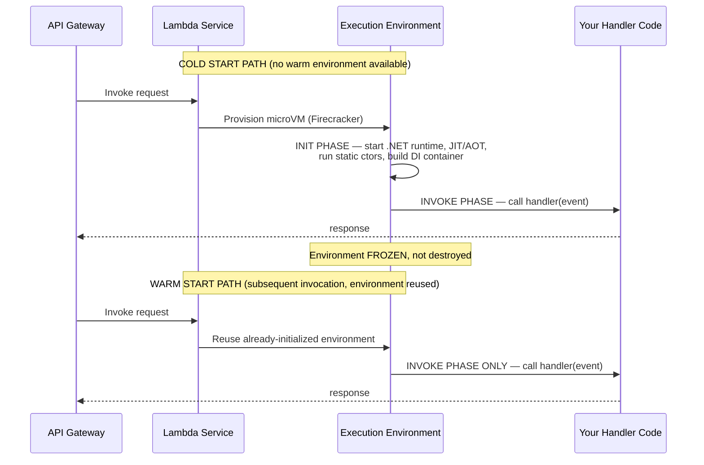
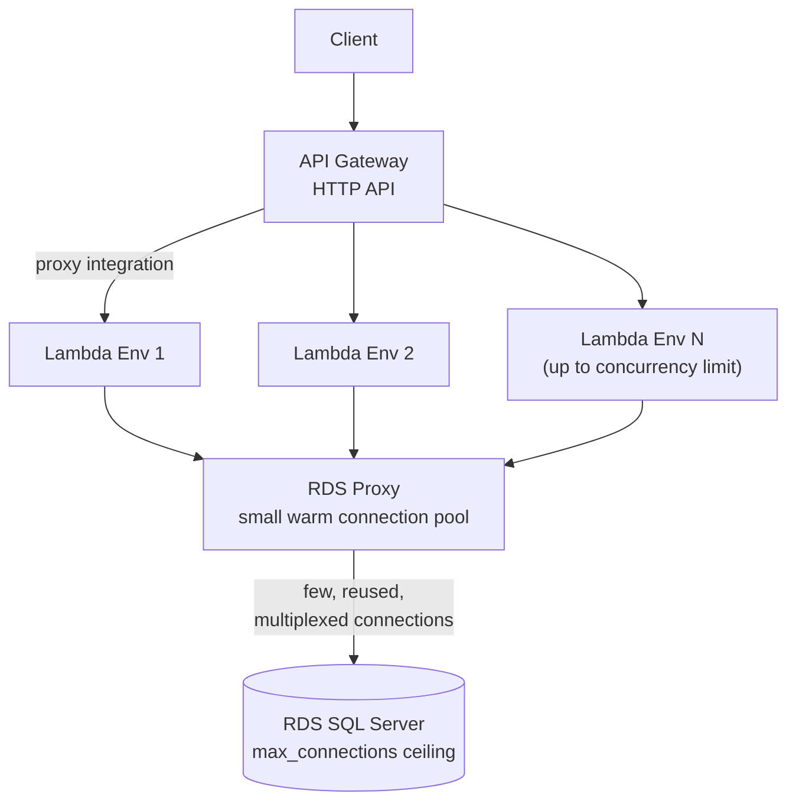
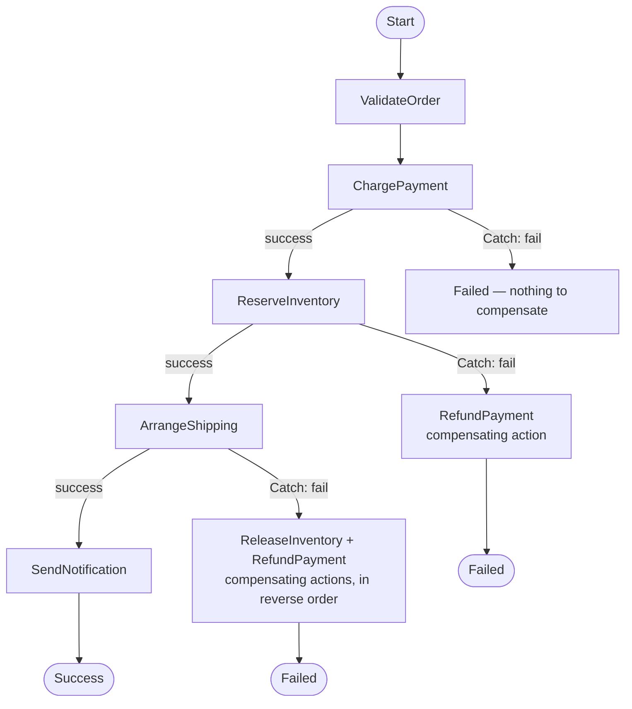
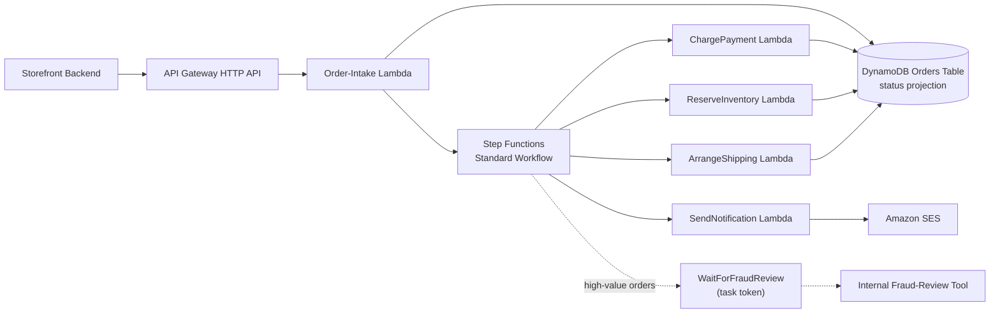

# Module 61 — AWS: Serverless — Lambda Cold Starts & Concurrency, API Gateway & Step Functions

> Domain: AWS | Level: Beginner → Expert | Prerequisite: [[04-Databases-RDS-Aurora-DynamoDB]] (RDS Proxy's connection-exhaustion problem is specifically acute for Lambda), [[../17-Microservices/01-Decomposition-Communication-Strangler-Fig]] (serverless functions are a granular unit of service decomposition), [[../18-Event-Driven-Architecture/01-EDA-Fundamentals-Choreography-vs-Orchestration]] (Step Functions is AWS's native orchestration mechanism)

---

## 1. Fundamentals

### What problem does serverless compute solve?
Every compute option this domain has covered so far — EC2, ECS, EKS (see [[01-Compute-Networking-VPC-LoadBalancing-AutoScaling]] §2.9's decision framework and [[07-Containers-Microservices-ECS-EKS-Fargate]]) — requires you to provision *something* that exists continuously, whether that's a VM, a task, or a pod: it costs money while idle, it needs patching, it needs capacity planning, and its scaling reaction time is bounded by how fast a new instance/task/pod can boot. AWS Lambda inverts this: you supply a function (a `Handler` method plus a deployment package), AWS supplies the execution environment on demand, per invocation, and you pay only for the milliseconds your code actually ran, billed in 1ms increments against configured memory. There is no server to patch, no idle capacity sitting around, and the "scaling policy" is implicit — up to your concurrency limit, AWS spins up as many parallel execution environments as there are concurrent invocations, automatically.

### When should you use Lambda?
Event-driven, short-lived, bursty, or infrequent workloads: request/response APIs with unpredictable or spiky traffic, processing a stream of S3 uploads, reacting to a message on an SQS queue, running a scheduled job, gluing together other AWS services (an S3 event triggering a thumbnail-generation function). Lambda's economics genuinely win when a workload's utilization is *not* constant and *not* near 100% of a provisioned unit continuously — because you stop paying between invocations, which no EC2/ECS/EKS unit can ever do.

### When should you NOT use Lambda?
Long-running processes (Lambda has a hard 15-minute maximum execution time — anything longer must be an ECS/EKS/EC2 task, or decomposed into a Step Functions workflow that chains shorter Lambda invocations, covered in §2.13 below), workloads with sustained, high, predictable utilization (a service handling 500 RPS continuously, 24/7, is cheaper on ECS/EKS the moment utilization crosses roughly 15–20% sustained — the exact crossover is a real calculation, worked in §17), workloads that are highly latency-sensitive on every single request including the first one after a period of idleness (cold starts, §2.2, are a real, measurable tax that Provisioned Concurrency mitigates but does not eliminate for free), and workloads needing exotic runtime dependencies, GPUs, or specialized network appliances that don't fit Lambda's execution model.

### How does it work, 30,000-ft view?
```
Lambda: your code (the Handler), packaged as a .zip or a container image, invoked by AWS on an
 event — AWS provisions an isolated execution environment (a microVM, under Firecracker),
 runs your handler, returns the result, and may FREEZE (not destroy) that environment for reuse
 by a subsequent invocation ("warm start") — or destroy it after a period of inactivity
API Gateway: the HTTP front door — receives a REST/HTTP request, invokes a Lambda (or routes to
 another backend), returns the Lambda's response as an HTTP response — the synchronous
 request/response event source for Lambda
Step Functions: a state machine that orchestrates a MULTI-STEP workflow across multiple Lambda
 invocations (or other AWS service calls) — with built-in retry, timeout, parallel/choice
 branching, and durable state persisted between steps
```

---

## 2. Deep Dive

### 2.1 Lambda's Execution Model — Init Phase vs. Invoke Phase (the mechanism the rest of this module is built on)
Every Lambda invocation happens inside an **execution environment**: a Firecracker microVM (a lightweight VM, not a container in the Docker sense, though your deployment package's contents run inside it as if in a container) that AWS provisions specifically to run your function. Provisioning that environment happens in two distinct phases, and understanding the boundary between them is the single most important mental model in this entire module:

- **Init phase**: AWS downloads your deployment package, starts the language runtime (the .NET runtime, for a C# Lambda), and runs everything in your code that executes *outside* the handler method — static field initializers, a static constructor, and critically, in ASP.NET-style Lambda functions using `Amazon.Lambda.AspNetCoreServer`, building the entire `IServiceProvider` (your DI container) with every registered service, `HttpClient`, EF Core `DbContext` factory, and configuration binder. This phase runs **once per execution environment**, not once per invocation.
- **Invoke phase**: AWS calls your handler method with the event payload. This runs on **every single invocation** against that already-initialized environment.

A **cold start** is what happens when AWS has to run the init phase because no warm (already-initialized) execution environment is available to reuse — either because this is the very first invocation, because traffic has scaled beyond the number of currently-warm environments (each concurrent invocation needs its own environment; environments are never shared between concurrent invocations), or because an idle environment was recycled (typically after roughly 5–15 minutes of inactivity, though this interval is an AWS implementation detail, not a documented SLA). A **warm start** reuses an already-initialized environment and skips the init phase entirely, running only the invoke phase.

### 2.2 Cold Starts — What Actually Causes the Latency, and the Real Mitigations for .NET
The interview-level insight is not "cold starts are slow" — it's *why*, mechanically, and which part of that latency budget your own code choices control versus which part is a fixed AWS-imposed floor.

The cold-start latency budget has three components:
1. **MicroVM provisioning** (tens of milliseconds) — Firecracker's whole design goal is starting a microVM in low single-digit milliseconds; this component is small and not something you can optimize.
2. **Runtime + your init-phase code** (this is where .NET-specific latency lives, and where you have real control) — the .NET runtime itself must start, your assembly must be JIT-compiled (unless using Ahead-of-Time/ReadyToRun compilation, or `Native AOT`, which a Principal-level answer should know is directly available for .NET Lambda functions and materially reduces this component by shipping pre-compiled machine code instead of IL that must be JIT'd at cold-start time), and then your own static initializers and DI container run — building an `IServiceProvider` with dozens of registered services, opening a `DbContext`'s model (EF Core's model-building is genuinely expensive the first time; see [[04-Databases-RDS-Aurora-DynamoDB]] §2 on `DbContext` lifetime), constructing `HttpClient`s, is entirely your code's cost, and is the single biggest lever a .NET team actually controls. A bloated DI graph, unnecessary EF Core model complexity, or eagerly initializing connections you don't need on every cold start are the concrete, fixable causes of a "why is our Lambda's cold start 1.2 seconds" incident.
3. **VPC networking setup**, historically the worst offender — see §2.5.

**The real mitigations, and what each one actually buys you:**
- **Provisioned Concurrency**: AWS keeps N execution environments permanently initialized (init phase pre-run) and ready to receive invocations — this converts a workload from "pay only when invoked" back toward "pay for standing capacity," which is an honest trade-off to say out loud in an interview: you are buying back the EC2/ECS trade-off you adopted Lambda to avoid, for the specific slice of traffic that cannot tolerate cold-start latency. It does not eliminate cold starts for traffic *above* the provisioned level — burst traffic beyond N concurrent still cold-starts.
- **SnapStart** (available for .NET on Lambda): instead of re-running the init phase on every cold start, AWS runs it *once*, takes an encrypted, cached snapshot of the initialized microVM's memory and disk state (including your fully-built DI container), and *resumes* subsequent cold starts from that snapshot rather than re-executing the init phase — the interview-level subtlety is that this means any unique state (a random seed, a UUID generated at startup, a connection object holding a specific TCP socket) generated during init and *cached* in that snapshot will be **identical across every resumed invocation** unless you explicitly use a post-snapshot "runtime hooks" callback to re-randomize/re-establish it — a real, non-obvious correctness trap.
- **Minimizing init-phase cost directly**: lazy-initialize expensive dependencies (build the `HttpClient` for a rarely-called downstream on first use, not eagerly at startup), trim the DI container to what's actually needed for this specific function (a single-purpose Lambda should not carry a monolith's entire service registration), and consider Native AOT compilation to remove JIT cost from the critical path entirely.

### 2.3 Concurrency Model — Reserved, Provisioned, Unreserved, and the Account-Level Ceiling
Every AWS account has a **regional concurrent-execution limit** (a soft limit, raisable via support request, but real and a genuine production gotcha the first time a traffic spike hits it uninitiated). Within that account ceiling:
- **Unreserved concurrency** is the shared pool every function without explicit reservation draws from — if one noisy function bursts to consume most of the account's unreserved pool, it can throttle every *other* function sharing that pool, a real multi-tenant-within-one-AWS-account blast-radius concern.
- **Reserved concurrency** carves out (and caps) a guaranteed slice of the account ceiling for one function — guaranteeing it capacity (protecting it from being starved by noisy neighbors) while simultaneously capping it (once that function's own concurrent invocations hit its reserved number, *further* invocations are throttled, i.e., reserved concurrency is a ceiling as much as a floor).
- **Provisioned concurrency** (§2.2) is orthogonal — it's about pre-warming, not about the invocation ceiling.

**The production mistake this produces**: a team sets no reserved concurrency anywhere, one function's bug causes a retry storm, it silently starves every other function's shared unreserved pool, and the incident presents as "unrelated" functions throttling simultaneously — the correct mental model, and a strong interview answer, is that reserved concurrency is doing for Lambda functions exactly what a **bulkhead** does for thread pools in a monolith (see [[../17-Microservices/02-Resilience-Observability-Sidecar-Patterns]]): isolating one consumer's failure from starving another's capacity.

### 2.4 Execution Role — IAM at the Function Level
Every Lambda function assumes an **execution role** (an IAM role, see [[02-IAM-Security-KMS-SecretsManager]] for the full IAM mechanism) that grants it permission to call other AWS APIs (write to a DynamoDB table, publish to an SNS topic, read a Secrets Manager secret) *and* a baseline policy allowing it to write its own logs to CloudWatch Logs — least privilege here means one execution role per function (or per closely-related function group), scoped to exactly the resources it touches, never a single broad "Lambda-role" shared account-wide, for the same blast-radius reason a shared, over-permissioned IAM role is a production mistake anywhere else.

### 2.5 VPC-Attached Lambda — the ENI Tax, and Why It (Mostly) Stopped Mattering
A Lambda function needs to be **attached to a VPC** (given an ENI — Elastic Network Interface — in your private subnets, see [[01-Compute-Networking-VPC-LoadBalancing-AutoScaling]] §2.1) whenever it must reach a resource that has no public endpoint and no VPC endpoint — most commonly, an RDS/Aurora instance sitting in a private subnet. Historically (pre-2019), this was a severe cold-start tax: AWS provisioned a *dedicated* ENI per unique security-group/subnet combination, and ENI creation itself took seconds, making VPC-attached Lambda cold starts dramatically worse than non-VPC ones. AWS's **Hyperplane** networking rearchitecture changed this: ENIs are now provisioned and shared at the account/VPC level ahead of time rather than per-function, reducing this specific tax to a much smaller, largely amortized cost. The Principal-level nuance worth stating explicitly in an interview: this is a genuinely *fixed historical fact* interviewers sometimes still probe defensively ("doesn't VPC attachment make Lambda cold starts terrible?") — the accurate, current answer is "that was true before Hyperplane; it is a minor factor today," which is a stronger answer than either extreme.

### 2.6 Event Source Mapping — Synchronous, Asynchronous, and Poll-Based Sources, and Why Error Handling Differs by Type
Lambda's invocation model changes based on *what* invokes it, and this materially changes how you must design for failure:
- **Synchronous** (API Gateway, ALB, another Lambda calling this one directly): the caller waits for the response; an unhandled exception propagates back to the caller as an error response immediately — there is no automatic retry by AWS on this path (any retry must be the caller's own logic, e.g., a client-side Polly retry, see [[../30-Architecture-Patterns]] resilience material).
- **Asynchronous** (S3 event notifications, SNS): AWS queues the event internally and invokes your function without the original caller waiting; if your function throws, **AWS automatically retries** (by default twice more, with a delay), and after exhausting retries routes the event to a configured **Dead-Letter Queue (DLQ)** or **on-failure destination** if one is configured — omitting a DLQ here is a real production mistake, because a failed async invocation with no DLQ is a silently dropped event with no trace.
- **Poll-based** (SQS, Kinesis, DynamoDB Streams): Lambda's own internal poller reads a batch from the source and invokes your function with that batch; for SQS specifically, a batch-level failure (unless you use **partial batch response**, returning which specific message IDs failed) causes the *entire batch* to become visible again for redelivery — meaning a single poison message in a batch of 10 can cause 9 already-successfully-processed messages to be reprocessed unless partial batch response is explicitly enabled, a genuinely common, non-obvious production bug. For Kinesis/DynamoDB Streams, a failing batch blocks that shard's checkpoint from advancing entirely (ordered, per-shard processing — see [[06-Messaging-SQS-SNS-EventBridge-Kinesis]] §2 on Kinesis shards) until the failure is resolved or a configured maximum-retry-age/bisect-on-error setting gives up on it.

### 2.7 Memory, CPU, and Timeout Tuning — the Non-Obvious Lever
Lambda's configured **memory** setting is not just a memory ceiling: AWS allocates **CPU proportionally to memory** (at the high end, multiple full vCPUs), meaning a CPU-bound function (JSON serialization, cryptographic work, compression) can genuinely get **faster and cheaper** by increasing its memory setting, because the reduced execution duration can outweigh the higher per-ms cost at the higher memory tier — this is a real, measurable optimization exercise ("right-size Lambda memory") and a good discriminator between candidates who've only read Lambda's marketing page ("Lambda charges by memory, so use the minimum") versus those who understand the actual cost/duration curve and have profiled it. **Timeout** is a hard ceiling on total invocation duration (up to 15 minutes) — set deliberately below any downstream timeout you don't control, so your function fails fast and cleanly rather than being killed mid-operation by Lambda's own timeout in a way that leaves partial, uncommitted side effects.

### 2.8 Lambda → RDS Proxy — the Connection-Exhaustion Mechanism, Precisely
This is the concrete reason [[04-Databases-RDS-Aurora-DynamoDB]] is this module's prerequisite. A traditional application server (an ECS task, an EC2-hosted app) holds a small, bounded **connection pool** (e.g., 100 connections) for its entire lifetime, reused across every request it serves. Lambda inverts this: **N concurrent invocations means up to N separate execution environments**, and if each one naively opens its own database connection (e.g., a `SqlConnection` opened per invocation, or worse, a `DbContext` whose connection isn't pooled across warm invocations), a traffic spike to 500 concurrent Lambda invocations can attempt to open 500 simultaneous connections against a SQL Server RDS instance whose `max_connections` might be a small fraction of that — an immediate, sharp production outage ("too many connections" errors cascading). **RDS Proxy** sits between Lambda and RDS specifically to solve this: it maintains its own small, warm pool of *actual* database connections, and multiplexes many Lambda-side logical connections onto that much smaller pool of real ones, decoupling Lambda's concurrency (which can spike to hundreds) from the database's actual connection ceiling (which cannot). The correct .NET-level complement to RDS Proxy is *still* reusing the connection/`DbContext` across warm invocations where possible (constructing it in the init phase, not the invoke phase — see §2.1) rather than relying on RDS Proxy alone to absorb careless per-invocation connection churn.

### 2.9 API Gateway — REST API vs. HTTP API
AWS offers two API Gateway product generations, and the choice is a real, current architecture decision, not a legacy-vs-new default:
- **REST API** (the original): richer feature set — request/response transformation (mapping templates), API keys and usage plans, WAF integration, private (VPC-endpoint-only) APIs, resource policies — at higher per-request cost and slightly higher latency.
- **HTTP API** (the newer, leaner generation): materially cheaper (roughly 70% lower per-request cost at the time of writing) and lower-latency, with native JWT authorizer support and simpler Lambda proxy integration, but a narrower feature set (no request/response mapping templates, more limited usage-plan/API-key support).

**The Principal-level framing**: default to HTTP API for a straightforward Lambda-backed public or internal REST API (the common case), and reach for REST API specifically when you need one of its unique features (WAF, private API via VPC endpoint, API-key-based usage plans for external partner billing) — not "REST API because it's the mature/default option," which is the weak, outdated answer.

### 2.10 Lambda Proxy Integration — the Event and Response Shape for a .NET Handler
In **Lambda proxy integration** (the standard, recommended mode — as opposed to non-proxy integration, where API Gateway itself maps request/response fields via mapping templates, adding configuration surface for little benefit in the common case), API Gateway passes the *entire* HTTP request — method, path, headers, query string, body — as a single structured event object, and expects your Lambda to return a structured object containing `statusCode`, `headers`, and `body`. For .NET, the `Amazon.Lambda.APIGatewayEvents` NuGet package provides `APIGatewayProxyRequest`/`APIGatewayProxyResponse` (or `APIGatewayHttpApiV2ProxyRequest` for HTTP API's slightly different v2 payload format) typed models:

```csharp
public class OrderLookupFunction
{
    // Constructed ONCE per execution environment (init phase) — see §2.1/§2.2.
    private static readonly IAmazonDynamoDB DynamoDbClient = new AmazonDynamoDBClient();
    private static readonly IServiceProvider ServiceProvider = BuildServiceProvider();

    public async Task<APIGatewayHttpApiV2ProxyResponse> FunctionHandler(
        APIGatewayHttpApiV2ProxyRequest request, ILambdaContext context)
    {
        var orderId = request.PathParameters["orderId"];
        var repository = ServiceProvider.GetRequiredService<IOrderRepository>();

        var order = await repository.GetByIdAsync(orderId);
        if (order is null)
        {
            return new APIGatewayHttpApiV2ProxyResponse
            {
                StatusCode = 404,
                Body = JsonSerializer.Serialize(new { error = "Order not found" }),
                Headers = new Dictionary<string, string> { ["Content-Type"] = "application/json" }
            };
        }

        return new APIGatewayHttpApiV2ProxyResponse
        {
            StatusCode = 200,
            Body = JsonSerializer.Serialize(order),
            Headers = new Dictionary<string, string> { ["Content-Type"] = "application/json" }
        };
    }
}
```
A team can alternatively run a *full* ASP.NET Core application (controllers, middleware, DI, everything) inside Lambda via the `Amazon.Lambda.AspNetCoreServer` package, which adapts API Gateway's proxy event into a synthetic `HttpContext` — the practical trade-off being a heavier init-phase cost (the entire ASP.NET Core pipeline plus your DI graph builds on every cold start, see §2.2) in exchange for reusing an existing ASP.NET Core codebase largely unchanged, versus writing lean, purpose-built handler functions with a smaller DI surface and a faster cold start. A Principal Engineer should be able to state this trade-off explicitly rather than defaulting to "just run ASP.NET Core in Lambda" without acknowledging the cold-start cost that choice re-introduces.

### 2.11 Authorizers — Lambda Authorizer vs. Cognito vs. JWT Authorizer
API Gateway can enforce authentication/authorization before your backend Lambda ever runs, via three mechanisms: a **Lambda authorizer** (your own function, given the request's token/headers, returns an IAM policy document deciding allow/deny — maximally flexible, e.g., for validating a custom token format or checking a tenant-specific entitlement, at the cost of an extra Lambda invocation's latency and cold-start exposure on the auth path itself), a **Cognito User Pool authorizer** (built-in validation against AWS's own managed user-directory/JWT issuer — no custom code, but couples you to Cognito as your identity provider), or a **JWT authorizer** (HTTP API only — validates a JWT's signature against a configured issuer/JWKS endpoint natively, no Lambda invocation at all, the lowest-latency option, and the right choice when your identity provider is a standard OIDC issuer — see [[../41-OAuth2-OIDC-JWT-PKCE/01-OAuth2-OIDC-JWT-Fundamentals-Flows-PKCE]] — rather than Cognito specifically).

### 2.12 Throttling, Usage Plans, and API Keys
API Gateway enforces a **account/region-level and per-API throttle** (requests-per-second and burst) independent of Lambda's own concurrency limit (§2.3) — both ceilings exist simultaneously, and a production incident can be caused by hitting *either* one, which is a genuinely common source of confused "why are we getting 429s, our Lambda isn't throttled" incidents; the correct diagnostic step is checking API Gateway's own `4xxError`/throttle CloudWatch metrics separately from Lambda's `Throttles` metric. **Usage plans** (REST API only) associate an **API key** with a specific rate/quota (e.g., "Partner X gets 100 req/s and 1M requests/month") — the standard mechanism for metering and rate-limiting external partner access to a public API, distinct from end-user authentication (an API key identifies *which client application/partner*, not *which end user*).

### 2.13 Step Functions — When to Reach for Orchestration Instead of SQS, Lambda Chaining, or Application Code
A workflow spanning multiple steps with dependencies between them (Payment must succeed before Inventory is reserved; if Shipping fails, Payment must be refunded) can theoretically be built three ways, and distinguishing when each is the right choice is a genuine Principal-level discriminator:
1. **Chaining Lambdas directly in application code** (Lambda A calls Lambda B synchronously, which calls Lambda C): the state of "where are we in the workflow" lives only in the currently-running Lambda's call stack — if Lambda B crashes mid-way, the entire in-flight state is lost with no record of what completed and what didn't, and there is no built-in retry/timeout/branching without hand-writing it, repeatedly, in every workflow.
2. **SQS-based choreography** (each step publishes an event that triggers the next step's queue): decouples the steps (see [[06-Messaging-SQS-SNS-EventBridge-Kinesis]]) but scatters the *workflow's overall state and logic* across N independently-deployed consumers — answering "what's the current status of order #4471's workflow" requires correlating events across N systems, and a mid-workflow failure's compensation logic (if Shipping fails, who is responsible for triggering the Payment refund?) has no natural home.
3. **Step Functions**: makes the workflow itself a first-class, explicit, versioned artifact (a state machine definition) with **durable, AWS-managed state** between steps — at any moment, you can query the exact current state of a specific execution, see its full history, and rely on built-in per-state retry (with backoff), timeout, parallel/choice branching, and `Catch` blocks for compensation — at the cost of coupling the workflow's shape to AWS's state-machine DSL (Amazon States Language) and Step Functions' own pricing/quota model.

**The honest trade-off, stated explicitly**: Step Functions is the right choice specifically when the workflow's *shape* (branching, retries, human-in-the-loop waits, multi-step compensation) is complex enough that hand-rolling that logic repeatedly across services would itself become a maintenance burden and a source of "where exactly did this order get stuck" incidents — for a simple two-step, always-sequential, no-branching flow, SQS-based choreography is simpler and avoids Step Functions' own cost/quota surface entirely.

### 2.14 Designing the Order-Processing Workflow — `Order → Payment → Inventory → Shipping → Notification`
As a real state machine (Amazon States Language, conceptually):

```
StartAt: ValidateOrder
States:
  ValidateOrder   → (Task, invokes ValidateOrderFn)         → next: ChargePayment
  ChargePayment   → (Task, invokes ChargePaymentFn,
                     Retry: [transient errors, 3x exp backoff],
                     Catch: → CompensateNone [nothing to undo yet]) → next: ReserveInventory
  ReserveInventory→ (Task, invokes ReserveInventoryFn,
                     Retry: [...],
                     Catch: → RefundPayment [compensate ChargePayment]) → next: ArrangeShipping
  ArrangeShipping → (Task, invokes ArrangeShippingFn,
                     Retry: [...],
                     Catch: → ReleaseInventoryAndRefund
                             [compensate ReserveInventory + ChargePayment]) → next: SendNotification
  SendNotification→ (Task, invokes SendNotificationFn) → next: Success
  RefundPayment / ReleaseInventoryAndRefund → (Task states executing compensating actions) → next: Failed
  Success / Failed → (terminal states)
```

Point-by-point mechanics:
- **Retry**: each `Task` state's `Retry` field specifies which error types are retryable, the backoff rate, max attempts, and interval — this is Step Functions' own, declarative implementation of the retry-with-exponential-backoff pattern (see [[../30-Architecture-Patterns]] resilience catalogue), meaning you do *not* hand-write retry loops inside each Lambda.
- **Timeout**: each state has its own `TimeoutSeconds` — a hung downstream call (e.g., a slow payment-provider API) is bounded per-step, not just at the overall execution level.
- **Compensation (the saga pattern, concretely implemented)**: each `Catch` block routes a specific failure to a compensating state — this *is* the saga pattern's "compensating transaction" concept, made explicit and inspectable as actual states in the machine rather than scattered exception-handling logic; the order of compensations must be the *reverse* of the order operations were applied (undo Inventory-reservation before undo Payment, mirroring how the forward path applied them), a detail worth stating explicitly since getting compensation order wrong is a real correctness bug.
- **State persistence**: Step Functions durably persists the current state and the full history of an execution in AWS's own managed store — a workflow can be paused (see human approval below) for hours or days with zero cost for the idle time, and "what happened to order #4471" is answerable by querying that execution's history directly, no custom audit-logging required.
- **Human approval (task tokens)**: for a step requiring manual sign-off (e.g., a high-value order flagged for fraud review), a Task state can be configured with `.waitForTaskToken` — the state machine pauses indefinitely (up to a configured heari, potentially the workflow's full timeout) holding a unique task token, which some external system (a reviewer's approval in an internal tool, calling `SendTaskSuccess`/`SendTaskFailure` with that token) later uses to resume or fail that specific paused execution — this is the concrete mechanism behind "wait for a human," not a polling loop.

### 2.15 Standard vs. Express Workflows
**Standard** workflows: exactly-once execution semantics, can run up to one year, priced per state transition, full execution history retained and queryable — the right choice for the order-processing workflow above, where auditability and long-running human-approval waits matter. **Express** workflows: at-least-once semantics (meaning a state could, in rare failure scenarios, execute more than once — your Task Lambdas must be idempotent, exactly as with any at-least-once messaging source, see [[06-Messaging-SQS-SNS-EventBridge-Kinesis]] §2), short-lived (five-minute maximum), priced per execution + duration + memory (closer to Lambda's own model) — the right choice for high-volume, short, non-auditable workflows (e.g., real-time data transformation triggered per-event at thousands of events/second, where Standard's per-state-transition pricing and lower throughput ceiling would be prohibitively expensive).

### 2.16 "Choose between Lambda and Step Functions" — Working the Scenario
A weak answer treats this as binary ("Lambda is code, Step Functions is a workflow tool, use Step Functions for multi-step things") without engaging the actual trade-off. A strong, Principal-level answer works through: *how many distinct steps, and do they need independent retry/timeout/compensation policies?* (a single Lambda handling everything in one invocation is simpler when the "workflow" is really just sequential function calls inside one process with a single, uniform failure mode); *does the workflow need to survive across minutes/hours/days, including a human-approval pause?* (Lambda's own 15-minute ceiling makes a single Lambda structurally incapable of this — Step Functions' durable state is not optional at that point, it's the only mechanism available); *is per-execution auditability/observability of "where exactly did this specific business transaction get to" a real operational requirement* (Standard Step Functions gives this for free; a chain of Lambdas gives you only whatever custom logging you wrote). The honest edge case: a two-step, always-synchronous, no-compensation-needed flow (validate then charge) is legitimately simpler and cheaper as a single Lambda — reaching for Step Functions here is over-engineering, and a Principal Engineer should say so rather than defaulting to "always orchestrate."

### 2.17 The Module's Discriminating Question, and What This Design Cannot Do
**The question that separates a Staff answer from a Senior one here**: *"Your order-processing Step Functions workflow's `ReserveInventory` state succeeds, but the `Catch` block routing to `RefundPayment` itself fails halfway through — what actually happens to the customer's money?"* A Senior answer stops at "the Catch block handles the failure." A Staff/Principal answer recognizes that **a compensating action can itself fail**, and that Step Functions' own retry/catch mechanism applies recursively to compensating states too — meaning the *compensating* state needs its own idempotent, retryable design (a `RefundPayment` state that safely no-ops if the refund was already partially processed), and that if compensation is *exhausted* (retries on the compensating state itself fail), the workflow must land in a terminal `Failed` state that is **itself an alert**, not a silent dead end — because at that point, real money is in an inconsistent state that requires human/operational intervention, and the honest answer is that no purely automated saga can guarantee compensation always succeeds; it can only guarantee the *attempt* is retried and that exhaustion is *visible* rather than silent. **What this design genuinely cannot do**: guarantee atomicity across the whole workflow (a saga is inherently NOT an ACID transaction — see [[../36-Saga]] for the general pattern this instantiates) — there will always be a window where Payment has been charged but Inventory has not yet been reserved, and any failure detector watching for "stuck" executions (a CloudWatch alarm on executions exceeding an expected duration) is watching for symptoms, not preventing the underlying window from existing.

---

## 3. Visual Architecture

### Lambda Cold Start vs. Warm Start — the Init/Invoke Boundary

```mermaid
sequenceDiagram
    participant APIGW as API Gateway
    participant Lambda as Lambda Service
    participant Env as Execution Environment
    participant Handler as Your Handler Code

    Note over Lambda,Env: COLD START PATH (no warm environment available)
    APIGW->>Lambda: Invoke request
    Lambda->>Env: Provision microVM (Firecracker)
    Env->>Env: INIT PHASE — start .NET runtime, JIT/AOT,<br/>run static ctors, build DI container
    Env->>Handler: INVOKE PHASE — call handler(event)
    Handler-->>APIGW: response
    Note over Env: Environment FROZEN, not destroyed

    Note over Lambda,Env: WARM START PATH (subsequent invocation, environment reused)
    APIGW->>Lambda: Invoke request
    Lambda->>Env: Reuse already-initialized environment
    Env->>Handler: INVOKE PHASE ONLY — call handler(event)
    Handler-->>APIGW: response
```

### API Gateway → Lambda → RDS Proxy → RDS — Connection Fan-In

```mermaid
graph TB
    Client[Client] --> APIGW[API Gateway<br/>HTTP API]
    APIGW -->|"proxy integration"| L1[Lambda Env 1]
    APIGW --> L2[Lambda Env 2]
    APIGW --> L3["Lambda Env N<br/>(up to concurrency limit)"]
    L1 --> Proxy[RDS Proxy<br/>small warm connection pool]
    L2 --> Proxy
    L3 --> Proxy
    Proxy -->|"few, reused,<br/>multiplexed connections"| RDS[(RDS SQL Server<br/>max_connections ceiling)]
```

### Step Functions Order-Processing Saga (Happy Path + Compensation)

```mermaid
graph TB
    Start([Start]) --> Validate[ValidateOrder]
    Validate --> Charge[ChargePayment]
    Charge -->|success| Reserve[ReserveInventory]
    Charge -->|Catch: fail| Failed1[Failed — nothing to compensate]
    Reserve -->|success| Ship[ArrangeShipping]
    Reserve -->|Catch: fail| RefundP[RefundPayment<br/>compensating action]
    Ship -->|success| Notify[SendNotification]
    Ship -->|Catch: fail| ReleaseAndRefund[ReleaseInventory + RefundPayment<br/>compensating actions, in reverse order]
    Notify --> Success([Success])
    RefundP --> Failed2([Failed])
    ReleaseAndRefund --> Failed3([Failed])
```

---

## 4. Production Example

**Problem**: A mid-size payments platform ran its order-confirmation email as a synchronous call inside the same Lambda that processed the payment charge — the email provider's API had an occasional 8–12 second latency spike, which pushed the whole Lambda invocation close to its configured 10-second timeout, causing the *payment charge itself* (which had already succeeded) to be reported as a failure to the client when the Lambda was killed by timeout mid-way through the email call, with the client's retry logic then re-submitting the same order.

**Architecture**: The fix decomposed the single Lambda into the Step Functions workflow shown above — `ChargePayment` as its own state with its own tight, appropriate timeout, and `SendNotification` as a separate, later state whose failure could be retried or even silently degraded (a failed confirmation email is not a reason to unwind a successful payment) without affecting the payment's own success/failure reporting to the client.

**Implementation**: Each state's Lambda was kept single-purpose and small (reducing cold-start init-phase cost per §2.2), the `ChargePayment` state used an **idempotency key** (the order ID) passed to the payment provider so that a client-side retry of the same order could never double-charge — the exact idempotency mechanism [[06-Messaging-SQS-SNS-EventBridge-Kinesis]] §2 covers for at-least-once messaging generally.

**Trade-offs**: The workflow's overall latency to "fully complete" increased slightly (Step Functions' own state-transition overhead, and Standard workflow's per-transition cost), in exchange for eliminating an entire class of "timeout killed a Lambda mid-way through an unrelated side effect" incident.

**Lessons learned**: A single Lambda handling multiple, independently-failable side effects with different latency/criticality profiles is a design smell — the moment failure semantics genuinely differ per step (payment failure is a real, must-not-lose failure; email failure is not), that's the concrete signal to decompose into a Step Functions workflow rather than one large handler with an ever-growing internal try/catch tree.

---

## 11. Coding Exercises

### Easy
**Problem**: Write a .NET Lambda handler for an S3-triggered thumbnail generator that correctly avoids re-creating its `AmazonS3Client` on every invocation.
**Solution**: Declare the client as a `private static readonly` field, initialized outside the handler method, so it is constructed once in the init phase (§2.1) and reused across every warm invocation on that execution environment.
```csharp
public class ThumbnailFunction
{
    private static readonly IAmazonS3 S3Client = new AmazonS3Client();

    public async Task FunctionHandler(S3Event evt, ILambdaContext context)
    {
        foreach (var record in evt.Records)
        {
            var bucket = record.S3.Bucket.Name;
            var key = record.S3.Object.Key;
            using var response = await S3Client.GetObjectAsync(bucket, key);
            // ... generate thumbnail, PutObject to a destination bucket ...
        }
    }
}
```
**Time complexity**: O(n) in number of records in the batch. **Space complexity**: O(1) beyond the image buffer itself. **Optimized solution**: for high-volume image processing, offload the actual resize work to a purpose-built library invoked once per object, and consider whether this workload's sustained volume has crossed the point where an always-on ECS worker consuming from an SQS queue (§2.16's crossover reasoning) would be cheaper than per-object Lambda invocations.

### Medium
**Problem**: Implement partial batch response for an SQS-triggered Lambda so a single poison message doesn't cause the whole batch to be reprocessed (§2.6).
**Solution**:
```csharp
public async Task<SQSBatchResponse> FunctionHandler(SQSEvent evt, ILambdaContext context)
{
    var batchItemFailures = new List<SQSBatchResponse.BatchItemFailure>();

    foreach (var message in evt.Records)
    {
        try
        {
            await ProcessMessageAsync(message.Body);
        }
        catch (Exception ex)
        {
            context.Logger.LogError($"Failed to process {message.MessageId}: {ex}");
            batchItemFailures.Add(new SQSBatchResponse.BatchItemFailure
            {
                ItemIdentifier = message.MessageId
            });
        }
    }

    return new SQSBatchResponse { BatchItemFailures = batchItemFailures };
}
```
Requires enabling `FunctionResponseTypes: [ReportBatchItemFailures]` on the event source mapping. **Time complexity**: O(n) in batch size. **Space complexity**: O(f) where f is the number of failures. **Optimized solution**: for a batch with a consistently-failing single message, track per-message-ID failure counts in a lightweight store to short-circuit straight to DLQ before exhausting the full `maxReceiveCount` retry budget on a message already known to be poison.

### Hard
**Problem**: Implement idempotent processing for a Lambda invoked (at-least-once) from an SQS queue carrying payment-charge events, given that the same message could be redelivered.
**Solution**: Use a DynamoDB table keyed by the message's idempotency key (e.g., order ID) with a **conditional write** (`PutItem` with `attribute_not_exists(pk)`) as an atomic claim-check before performing the actual charge:
```csharp
public async Task ProcessPaymentEvent(PaymentEvent evt)
{
    var claimRequest = new PutItemRequest
    {
        TableName = "IdempotencyClaims",
        Item = new Dictionary<string, AttributeValue>
        {
            ["PK"] = new AttributeValue { S = $"ORDER#{evt.OrderId}" },
            ["ClaimedAt"] = new AttributeValue { S = DateTime.UtcNow.ToString("O") },
            ["ExpiresAt"] = new AttributeValue { N = DateTimeOffset.UtcNow.AddHours(24).ToUnixTimeSeconds().ToString() }
        },
        ConditionExpression = "attribute_not_exists(PK)"
    };

    try
    {
        await _dynamoDb.PutItemAsync(claimRequest);
    }
    catch (ConditionalCheckFailedException)
    {
        // Already claimed — this is a redelivery of a message we already processed (or are processing).
        return;
    }

    await _paymentProvider.ChargeAsync(evt.OrderId, evt.Amount);
}
```
**Time complexity**: O(1) per message (single conditional write plus the downstream charge call). **Space complexity**: O(1) per in-flight claim, with TTL-based expiry keeping the table bounded. **Optimized solution**: use DynamoDB's native **TTL** attribute (see [[04-Databases-RDS-Aurora-DynamoDB]] §2) on `ExpiresAt` so expired claims are automatically reclaimed by DynamoDB rather than requiring a manual cleanup job.

### Expert
**Problem**: Design (pseudocode/state-machine definition, not full ASL) a Step Functions workflow implementing the order-processing saga from §2.14, including the human-approval gate for orders above a fraud-review threshold, and reason about what happens if the reviewer never responds.
**Solution**: Insert a `Choice` state after `ValidateOrder` routing high-value orders to a `WaitForFraudReview` state configured with `.waitForTaskToken`, holding a task token persisted alongside the order in your own order-tracking store; a reviewer's action in an internal tool calls `SendTaskSuccess`/`SendTaskFailure` against that token. Critically, configure the state's `HeartbeatSeconds`/overall workflow timeout so an execution that never receives a response **times out** into a `Failed`/`Escalate` state rather than waiting indefinitely and silently consuming a Standard workflow's up-to-one-year ceiling — an unbounded wait is itself an availability bug (an order stuck "pending review" forever with no alert is functionally the same as a dropped order to the customer). **Time/space complexity framing**: the real "complexity" here is state-space complexity (number of distinct terminal/compensating states) rather than algorithmic — a Principal answer should be able to enumerate every terminal state (`Success`, `Failed-PaymentDeclined`, `Failed-InventoryUnavailable-Refunded`, `Failed-ReviewTimedOut-Escalated`) and confirm every path reaches exactly one of them. **Optimized solution**: add a scheduled reminder (an EventBridge scheduled rule invoking a Lambda that checks for reviews older than N hours) to page a human before the hard timeout is reached, converting a silent SLA breach into a proactive escalation.

---

## 12. System Design

### Step 1: Understand the Problem and Establish Design Scope

> **Interviewer**: "Design a serverless order-processing workflow for an e-commerce platform. Payment must complete before inventory is reserved; shipping must be arranged before the customer is notified; any failure partway through must be cleanly undone."
> **Candidate**: "Before I design this — a few clarifying questions. First, what's the expected order volume, and is it steady or spiky? Second, does 'cleanly undone' mean the customer never sees a partial charge, or is a temporary charge-then-refund acceptable operationally? Third, is manual fraud review in scope for any subset of orders? And fourth — single region, or does this need multi-region resilience from day one?"
> **Interviewer**: "50,000 orders/day, heavily skewed toward a 4-hour evening peak. A temporary charge-then-refund is acceptable if it's rare and automatic. Yes — orders above $2,000 need human fraud review. Single region for now; design so multi-region isn't precluded later."

**Functional requirements**: validate order → charge payment (idempotent) → reserve inventory → arrange shipping → send confirmation; high-value orders pause for human fraud approval; any step's failure triggers automatic compensation of already-completed steps; full execution history is queryable per order for support/audit.
**Non-functional requirements**: no double-charging under retry/redelivery; no order silently stuck (bounded wait even for human review); cost roughly proportional to actual order volume (this rules out a permanently-provisioned cluster sized for peak, favoring serverless); auditability of exactly what happened to a specific order, on demand.

**Back-of-the-envelope estimation**:
- 50,000 orders/day, 4-hour evening peak carrying a disproportionate share — assume 60% of daily volume (30,000 orders) lands in that 4-hour window: 30,000 / (4 × 3,600s) ≈ **2.1 orders/second sustained during peak**, with realistic burstiness pushing instantaneous peaks to perhaps **10–15 orders/second**.
- Each order triggers a 5-state Standard Step Functions execution ⇒ roughly 5–7 state transitions per order (including one Choice state) ⇒ 50,000 × 6 ≈ **300,000 state transitions/day** — comfortably within Step Functions' throughput ceiling for a single account/region, with no special scaling design needed.
- **What this implies**: at ~2 orders/second sustained, this is nowhere near a throughput problem — the *actual* hard problem is correctness under partial failure (compensation ordering, idempotency under redelivery) and bounded-wait behavior for the human-review path, not raw scale. A design that spends its effort on horizontal scaling here is solving the wrong problem; a Staff-level framing states this explicitly before proceeding.

### Step 2: Propose High-Level Design and Get Buy-In

**Component glossary**: *API Gateway (HTTP API)* — accepts the order-submission HTTP request from the storefront backend. *Order-Intake Lambda* — validates the request, writes an initial order record, starts the Step Functions execution. *Step Functions (Standard)* — owns the workflow's state and orchestration. *Per-step Lambdas* (`ChargePayment`, `ReserveInventory`, `ArrangeShipping`, `SendNotification`, and their compensating counterparts) — each a small, single-purpose function. *DynamoDB `Orders` table* — the queryable order-status projection (see [[04-Databases-RDS-Aurora-DynamoDB]] for DynamoDB's own mechanics), updated by each state as it completes, so a customer-facing "order status" API never needs to query Step Functions directly. *Internal fraud-review tool* — calls `SendTaskSuccess`/`SendTaskFailure` against a held task token.

**Architecture diagram**:

```mermaid
graph LR
    Storefront[Storefront Backend] --> APIGW[API Gateway HTTP API]
    APIGW --> Intake[Order-Intake Lambda]
    Intake --> SFN[Step Functions<br/>Standard Workflow]
    Intake --> OrdersTable[(DynamoDB Orders Table<br/>status projection)]
    SFN --> ChargeFn[ChargePayment Lambda]
    SFN --> ReserveFn[ReserveInventory Lambda]
    SFN --> ShipFn[ArrangeShipping Lambda]
    SFN --> NotifyFn[SendNotification Lambda]
    SFN -.->|"high-value orders"| ReviewWait["WaitForFraudReview<br/>(task token)"]
    ReviewWait -.-> FraudTool[Internal Fraud-Review Tool]
    ChargeFn --> OrdersTable
    ReserveFn --> OrdersTable
    ShipFn --> OrdersTable
    NotifyFn --> SES[Amazon SES]
```

**End-to-end walkthrough**: (1) storefront POSTs to `/orders`; (2) API Gateway invokes Order-Intake Lambda; (3) Intake writes an `Orders` row with status `SUBMITTED` and starts a Step Functions execution, passing the order ID as input; (4) `ValidateOrder` checks basic invariants; (5) a `Choice` state routes orders ≥ $2,000 to `WaitForFraudReview` (paused, holding a task token) and all others directly onward; (6) `ChargePayment` calls the payment provider with the order ID as an idempotency key (§2.14) and updates `Orders.status = PAID`; (7) `ReserveInventory` decrements stock and updates status; (8) `ArrangeShipping` books a carrier and updates status; (9) `SendNotification` publishes to SES; (10) any failure at any step routes through the relevant `Catch` to a compensating state, which itself updates `Orders.status` to a specific failed/refunded value.

**REST API design** (Order-Intake endpoint):
| Method | Path | Request body | Response |
|---|---|---|---|
| POST | `/orders` | `{customerId, items[], totalAmount}` | `201 {orderId, status: "SUBMITTED"}` |
| GET | `/orders/{orderId}` | — | `200 {orderId, status, history[]}` |

**Data model** (`Orders` table, DynamoDB):
| Column | Type | Description |
|---|---|---|
| `PK` (`orderId`) | String | Partition key |
| `status` | String | `SUBMITTED → AWAITING_REVIEW → PAID → INVENTORY_RESERVED → SHIPPED → NOTIFIED` \| `FAILED_DECLINED` \| `FAILED_REFUNDED` |
| `totalAmount` | String (not double — see [[04-Databases-RDS-Aurora-DynamoDB]] §2 on money representation) | Order total |
| `stepFunctionsExecutionArn` | String | For cross-referencing full history |
| `updatedAt` | String (ISO-8601) | Last transition timestamp |

**Why DynamoDB, not RDS, for this projection**: this table is a simple key-value status lookup (get by order ID) with no relational joins or ad-hoc reporting queries needed at the hot path — RDS's full relational feature set would be unused overhead here, and DynamoDB's single-digit-millisecond, effectively-unbounded read/write scaling matches this specific access pattern; the *authoritative* financial ledger (if this system also needs full accounting/reconciliation) would still belong in RDS/Aurora, with this table purely as a fast status cache — the decision framework in [[04-Databases-RDS-Aurora-DynamoDB]] §2 covers this choice generally.

### Step 3: Design Deep Dive

**Idempotency under redelivery**: covered mechanically in §2.14/§2.17 and the Hard coding exercise above — the `ChargePayment` Lambda must treat the order ID as an idempotency key both against the *payment provider* (most providers, like Stripe, accept a client-supplied idempotency key natively) and internally, since Step Functions Express (not used here) or a retried Task invocation could otherwise double-charge.

**Failure handling and compensation ordering**: exactly as diagrammed in §3 — compensations unwind in strict reverse order of the forward path, and each compensating state is itself retryable/idempotent, per §2.17's discriminating question.

**The human-review wait, bounded**: `WaitForFraudReview` carries both a `HeartbeatSeconds` (if the review tool must periodically confirm it's still actively working the case) and an overall state timeout (e.g., 48 hours) routing to an `Escalate` state on expiry — this is the concrete answer to "what happens if the reviewer never responds," worked through explicitly in the Expert coding exercise above.

**Consistency**: the `Orders` DynamoDB projection is updated by each Lambda as a side effect of a successful state transition — there is a small window (the state has completed but the DynamoDB write hasn't yet landed, or vice versa) where Step Functions' own execution history and the `Orders` table could disagree; a support tool querying "what's the status of order X" should treat the `Orders` table as the fast, eventually-consistent read path, and Step Functions' `DescribeExecution` API as the authoritative source of truth for a support escalation needing certainty.

### Step 4: Wrap-Up

**Not covered, natural next questions**: what metrics/alarms matter here (Step Functions' `ExecutionsFailed`/`ExecutionsTimedOut`, each Lambda's `Throttles`/`Errors`, API Gateway's `4xxError` — see [[08-Observability-Cost-WellArchitectedFramework]] for the full observability treatment); multi-region — this design is explicitly single-region per the interviewer's scoping, and extending it would require deciding whether Step Functions executions themselves need cross-region failover (they don't natively replicate) versus accepting a region-level RTO/RPO target and re-driving from a durable event log; additional payment-provider integrations and how idempotency keys interact with a multi-provider routing layer; a closing summary diagram is the architecture diagram in Step 2, unchanged, since this system's steady-state shape *is* its disaster-recovery shape at this stated scale.

**References**:
1. AWS Step Functions Developer Guide — Amazon States Language specification.
2. AWS Lambda Developer Guide — execution environment lifecycle, SnapStart.
3. AWS re:Invent — "I Didn't Know Step Functions Could Do That" (orchestration patterns).
4. Amazon RDS Proxy documentation — connection multiplexing mechanics.
5. Martin Fowler — "Saga" pattern description (fowler.com).

---

## 13. Low-Level Design

**Requirements**: model the order-processing saga as explicit, testable C# state handlers rather than opaque ASL, for local unit-testing of the compensation logic before deploying to Step Functions.

**Class diagram** (conceptual):
```
IOrderWorkflowStep (interface)
  ExecuteAsync(OrderContext) : Task<StepResult>
  CompensateAsync(OrderContext) : Task

ChargePaymentStep : IOrderWorkflowStep
ReserveInventoryStep : IOrderWorkflowStep
ArrangeShippingStep : IOrderWorkflowStep
SendNotificationStep : IOrderWorkflowStep

OrderWorkflowOrchestrator
  - steps: IReadOnlyList<IOrderWorkflowStep>
  + RunAsync(OrderContext) : Task<WorkflowResult>
      // executes steps in order; on failure, compensates completed
      // steps in REVERSE order (§2.14/§2.17)
```

**Sequence diagram**: matches the mermaid diagram in §3 exactly — this class model is the *local, testable* mirror of what Step Functions executes in production, letting the compensation-ordering logic be unit-tested without deploying an actual state machine.

**Design patterns used**: **Strategy** (`IOrderWorkflowStep` implementations are interchangeable strategies the orchestrator sequences), **Command** (each step, with its paired `ExecuteAsync`/`CompensateAsync`, is a command object that knows how to undo itself — directly the saga pattern's structure), **Template Method** (the orchestrator's fixed "execute forward, compensate backward on failure" algorithm is invariant across any step list).

**SOLID mapping**: **Single Responsibility** — each step class owns exactly one business action and its own compensation, nothing else; **Open/Closed** — adding a new workflow step (e.g., a fraud-scoring step) means adding a new `IOrderWorkflowStep` implementation, not modifying the orchestrator; **Liskov Substitution** — every step is fully interchangeable through the interface, including in tests (a `FakeChargePaymentStep` for testing compensation ordering without a real payment call); **Interface Segregation** — the interface carries only the two methods every step genuinely needs; **Dependency Inversion** — the orchestrator depends on `IOrderWorkflowStep`, never on concrete step types.

**Extensibility**: a new step (e.g., a loyalty-points-award step after `SendNotification`) is added purely by appending to the step list and implementing the interface — no orchestrator change.

**Concurrency/thread safety**: each `OrderContext` is scoped to a single order's single execution — no shared mutable state between concurrently-running orders; if steps within a single order could run in parallel (Step Functions' native `Parallel` state, not used in this sequential saga), each parallel branch's compensation would need its own isolated context to avoid one branch's rollback corrupting another's in-flight state.

---

## 14. Production Debugging

**Incident**: During a flash-sale event, order-submission traffic spiked to roughly 8x normal peak within two minutes. Within the incident window, a large fraction of `ChargePayment` Lambda invocations began failing with `TooManyRequestsException`, and several *unrelated* Lambda functions elsewhere in the account (a completely separate reporting pipeline) began throttling simultaneously.

**Root cause**: `ChargePayment` had no reserved concurrency configured — it drew from the account's shared unreserved pool (§2.3). The flash-sale spike pushed `ChargePayment`'s own concurrent invocations high enough to consume the majority of the account's remaining unreserved concurrency headroom, starving the unrelated reporting pipeline's Lambdas of capacity even though they had nothing to do with the sale.

**Investigation**: CloudWatch's `ConcurrentExecutions` account-level metric showed the account-wide ceiling being approached; per-function `Throttles` metrics showed both `ChargePayment` and the unrelated reporting functions spiking together — the *simultaneity* across unrelated functions was the key diagnostic signal pointing at a shared-pool exhaustion rather than a per-function issue.

**Tools**: CloudWatch Lambda Insights (per-function concurrency/duration/cold-start breakdown), the account-level `ConcurrentExecutions` metric specifically (not just per-function metrics, which don't show the shared-pool contention on their own), X-Ray traces to confirm `ChargePayment`'s own downstream (the payment provider) was not itself the bottleneck.

**Fix**: configured **reserved concurrency** on `ChargePayment` (capping its own ceiling so it could never fully consume the shared pool) and, separately, **reserved concurrency on the reporting pipeline's functions** (guaranteeing them a protected floor regardless of what else was happening in the account) — the bulkhead pattern (§2.3), applied concretely.

**Prevention**: a standing policy requiring every production Lambda handling customer-facing or business-critical traffic to have explicit reserved concurrency sized from expected peak load, plus a CloudWatch alarm on the account-level `ConcurrentExecutions` metric approaching the account ceiling, well before any individual function's own throttle metric would fire.

---

## 15. Architecture Decision

**Decision**: For a workload profile of "handles 2,000 requests/second sustained, 24/7, with under 10% traffic variance" — should this be Lambda, or a long-running ECS/EKS service?

| Criterion | Lambda | ECS/EKS (long-running service) |
|---|---|---|
| Cost at this utilization | Pay-per-invocation adds up to *more* than a fixed, well-utilized container at sustained high, flat load | Fixed cost, fully amortized across continuous high utilization — cheaper here |
| Cold starts | A real concern only if concurrency ever drops to zero between bursts — largely irrelevant at genuinely flat, sustained load, since environments stay warm | None — the process is always running |
| Operational complexity | Lower — no capacity planning, no cluster to manage | Higher — capacity planning, cluster/node management (or Fargate to offset this — see [[07-Containers-Microservices-ECS-EKS-Fargate]]) |
| Scaling reaction time | Near-instant, per-invocation | Bounded by task/pod startup time and Auto Scaling/HPA reaction lag |
| Max execution duration | 15-minute hard ceiling | Unbounded |

**Recommendation**: ECS (Fargate, to avoid EC2 node management) for this specific profile — the traffic is flat and predictable enough that Lambda's per-invocation pricing model, which is optimized for *variable* utilization, loses its main economic advantage, while a well-utilized, continuously-running container is both cheaper and avoids any cold-start exposure entirely. **Justification for the general rule this instantiates**: Lambda's value proposition is strongest at low-to-moderate, *variable* utilization; the crossover point where a provisioned container becomes cheaper is a real calculation (§17) worth doing explicitly rather than defaulting to either option on ideology.

---

## 17. Principal Engineer Perspective

**The cost crossover, calculated**: Lambda's pricing (illustrative figures) is roughly \$0.20 per million requests plus \$0.0000166667 per GB-second of execution. A function configured at 512MB running for 200ms, invoked at 2,000 req/s continuously: 2,000 × 86,400 = 172.8M invocations/day; at 0.5GB × 0.2s = 0.1 GB-seconds per invocation, that's 17.28M GB-seconds/day ≈ \$288/day in compute alone, before the per-request charge — versus a small fleet of Fargate tasks sized to handle the same 2,000 req/s sustained, priced by continuously-reserved vCPU/memory regardless of exact request timing, which at typical Fargate rates lands meaningfully lower at this specific utilization level. The Principal-level point is not the exact number (which changes with pricing updates and region) but the **method**: computing your own workload's actual request rate, duration, and memory against both pricing models before defaulting to either, and revisiting the calculation if traffic patterns shift.

**Organizational implications of a serverless-first strategy**: observability tooling must shift (traditional host-level metrics/APM agents don't apply the same way to ephemeral execution environments — CloudWatch Lambda Insights and X-Ray become the primary lenses, see [[08-Observability-Cost-WellArchitectedFramework]]), and team skill requirements shift toward event-driven design and away from traditional server capacity planning — a genuine organizational cost/benefit, not purely technical.

**Vendor lock-in, stated honestly**: Step Functions' Amazon States Language and Lambda's event-source-specific payload shapes are AWS-proprietary — a migration off AWS would require re-implementing workflow orchestration and event handling on whatever the target platform offers, unlike a containerized ECS/EKS workload, which is comparatively portable (the same container image runs on any container orchestrator). This is a real, legitimate input into a build-vs-buy/platform decision at the organizational level, not a reason to avoid serverless outright — the operational simplicity Step Functions/Lambda buy is frequently worth the coupling, but a Principal Engineer states the trade-off rather than ignoring it.

**Cross-team communication**: a Step Functions workflow spanning steps owned by different teams (Payment owned by the Payments team, Inventory by the Fulfillment team) makes the *workflow itself* — not any single team's code — the natural artifact for cross-team architecture review, since a change to one team's step's retry/timeout behavior can alter the whole saga's failure characteristics; this is a concrete instance of why architecture governance (see [[../51-Engineering-Leadership/04-PrincipalEngineering-OrgWideStrategy-GovernanceAtScale-BuildVsBuy-RiskOwnership]]) treats cross-team workflow definitions as requiring joint sign-off, not unilateral changes by whichever team touches it first.
