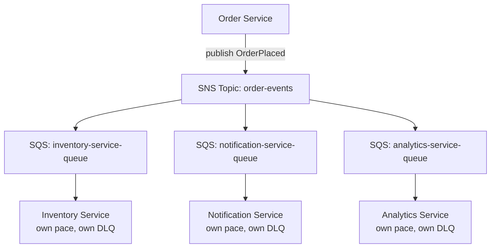
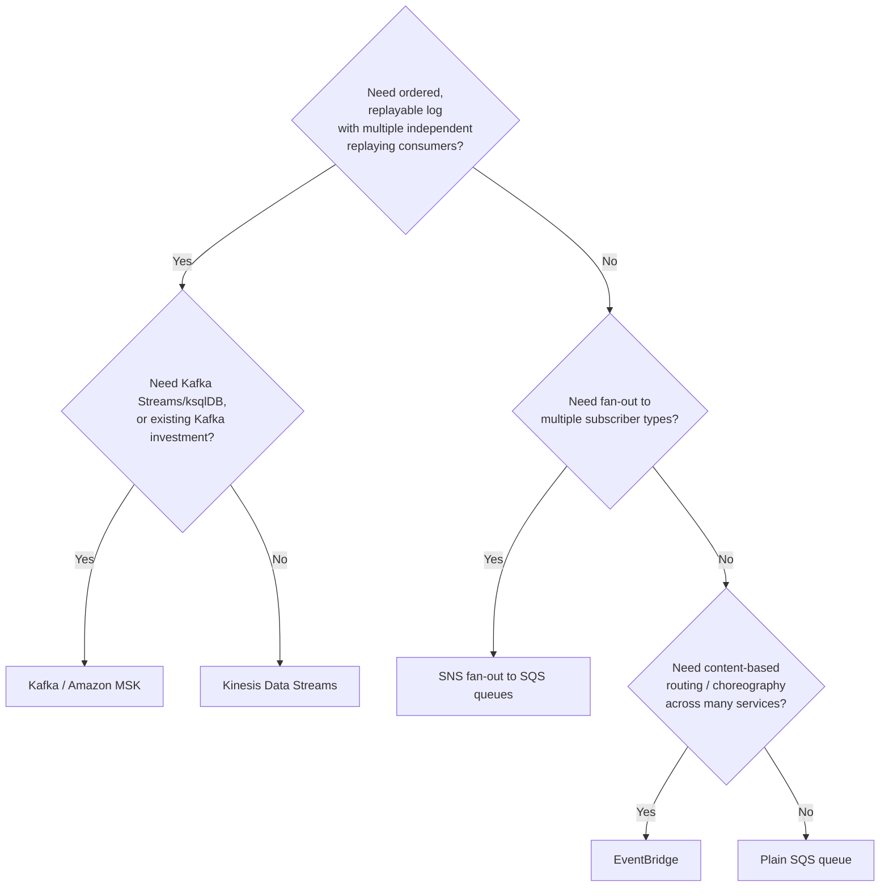

# Module 62 — AWS: Messaging & Event-Driven Architecture — SQS, SNS, EventBridge & Kinesis

> Domain: AWS | Level: Beginner → Expert | Prerequisite: [[../18-Event-Driven-Architecture/02-Schema-Evolution-Ordering-DeliverySemantics-DLQ]], [[../19-Kafka/01-Architecture-Partitioning-Replication-ConsumerGroups]], [[../20-RabbitMQ/01-Exchanges-Queues-Routing-Acknowledgment]] (this module maps those already-established EDA/broker fundamentals onto AWS's specific native services and the AWS-native-vs-self-managed-Kafka decision), [[05-Serverless-Lambda-APIGateway-StepFunctions]] §2.6 (Lambda idempotency requirements apply directly to every AWS messaging service covered here)

---

## 1. Fundamentals

### Why does a Principal Engineer need AWS-messaging depth on top of already knowing Kafka/RabbitMQ/EDA fundamentals?
Modules 52-56 established the *conceptual* vocabulary (ordering, partitioning, delivery semantics, DLQs, choreography vs. orchestration) and two specific *self-managed* broker implementations (Kafka, RabbitMQ) — this module answers a distinctly different, AWS-specific question a Principal Engineer is regularly asked in practice: **given this same conceptual toolkit, which AWS-native managed service (SQS, SNS, EventBridge, Kinesis) actually fits this specific requirement, and when does self-managed/MSK-hosted Kafka remain the right choice instead?** Getting this mapping wrong (choosing SQS where Kinesis's ordered-replay semantics were actually needed, or standing up a full Kafka cluster where SNS/SQS would have been sufic) is a common, costly real-world architecture mistake.

### Why does this matter?
Because AWS's messaging services are **not interchangeable** despite superficially overlapping use cases — each implements a genuinely different point in the ordering/fan-out/replay/delivery-semantics design space this course already mapped conceptually, and a Principal Engineer is expected to justify a specific service choice against a workload's actual requirements on each of those dimensions, not choose based on familiarity or default habit.

### When does this matter?
Any time an AWS-based architecture needs asynchronous communication between components — which, given Modules 49-56 already established event-driven microservices as the dominant modern architecture style, is effectively every non-trivial AWS system this course's audience will design or review.

### How does it work (30,000-ft view)?
```
SQS: managed QUEUE -- point-to-point, one consumer group processes each message once,
     at-least-once delivery, no fan-out on its own
SNS: managed PUB/SUB TOPIC -- fans out one message to MANY subscribers (SQS queues, Lambda,
     HTTP endpoints, email) -- the classic "SNS fans out, SQS buffers per-consumer" pairing
EventBridge: managed EVENT BUS -- schema-aware, content-based routing rules, SaaS/AWS-service
     integrations, the natural home for CHOREOGRAPHY-style architectures (Module 52 §2.2)
Kinesis: managed, PARTITIONED, ORDERED, REPLAYABLE log -- the closest AWS-native analog to
     Kafka's core model (Module 54)
```

---

## 2. Deep Dive

### 2.1 SQS — Point-to-Point Queueing, and Standard vs. FIFO
SQS is a managed message queue: a producer sends a message, and it is delivered to (and removed from the queue by) **one** consumer within a given processing context — SQS **Standard** queues provide at-least-once delivery with no ordering guarantee (messages may be delivered out of order, and rarely, more than once even absent failures) and effectively unlimited throughput; SQS **FIFO** queues provide strict ordering *within a message group* and exactly-once processing (deduplicated over a 5-minute window using a message deduplication ID), at a materially lower throughput ceiling than Standard — this is the exact same throughput-vs-ordering trade-off Module 54 §2.2 already established for Kafka partitioning (global ordering requires funneling related messages through a single ordered channel, which caps that channel's throughput), now expressed as a binary SQS queue-type choice rather than a tunable partition count.

### 2.2 SNS — Fan-out, and the SNS+SQS Fan-out Pattern
SNS is a publish/subscribe topic: a single published message is delivered to **every** current subscriber (SQS queues, Lambda functions, HTTP/S endpoints, email/SMS) — critically, SNS itself does **not** buffer or retain messages for a subscriber that's temporarily unavailable (an HTTP endpoint subscriber that's down when a message publishes simply misses it, subject to SNS's own limited retry policy), which is precisely why the canonical, production-grade pattern is **SNS fanning out to multiple SQS queues** (one queue per independent consumer service) rather than subscribing consumers directly — each SQS queue then provides durable buffering, at-least-once delivery, and independent per-consumer processing rate, decoupling each subscriber's availability/processing speed from every other subscriber's, directly Module 56 §2's exchange-to-queue fan-out pattern (a RabbitMQ fanout exchange routing to multiple bound queues) now expressed via AWS's specific SNS+SQS pairing.

### 2.3 EventBridge — Schema-Aware Routing and the Natural Home for Choreography
EventBridge is a managed event bus supporting content-based routing rules (matching on an event's actual field values, not just topic/queue name) and native integrations with dozens of AWS services and SaaS partners as event sources — its **schema registry** capability (discovering and versioning event schemas automatically) directly operationalizes Module 53's schema-evolution discipline as a first-class platform feature rather than a convention teams must separately enforce. EventBridge is the natural AWS-native home for **choreography-style** architectures (Module 52 §2.2): many independent services can each publish domain events to a shared bus and independently subscribe to exactly the event types/content patterns they care about via rules, with no central orchestrator and no producer needing to know its consumers — inheriting both choreography's decoupling strength and its debuggability weakness (Module 52's trade-off), which EventBridge's built-in **schema discovery and event archive/replay** features partially mitigate but don't eliminate.

### 2.4 Kinesis — the AWS-Native Analog to Kafka's Ordered, Replayable Log
Kinesis Data Streams is structurally the closest AWS-native service to Kafka's core model: a stream is divided into **shards** (directly analogous to Kafka partitions, Module 54 §2.2), each shard providing strict ordering for records sharing a partition key, with configurable retention (up to 365 days) allowing **replay** — multiple independent consumers can read the same stream at their own pace and position, exactly Kafka's consumer-group-offset model (Module 54 §2.4) — Kinesis is the correct choice specifically when a workload needs genuine ordered-stream processing with replay (event sourcing, real-time analytics pipelines, multi-consumer replay of the same event history), a fundamentally different use case from SQS/SNS's message-delivery model, where once a message is consumed and deleted, it's gone.

### 2.5 AWS-Native Messaging vs. Self-Managed/MSK Kafka — the Concrete Decision Framework
Directly answering §1's central question: choose **SQS/SNS/EventBridge** when the workload's need is message delivery/fan-out/routing without a hard requirement for a genuinely replayable, long-retention, strictly-partition-ordered log — these AWS-native services require zero cluster operational overhead (no broker capacity planning, no partition rebalancing operations, fully managed scaling) and are the correct default given this course's recurring "prefer the simpler mechanism unless a specific requirement demands more" discipline (Module 49's blast-radius/complexity-matching principle, applied to messaging-infrastructure choice specifically). Choose **Kinesis** when ordered replay across multiple independent consumer applications is genuinely required but Kafka's specific ecosystem (Kafka Streams, ksqlDB, Module 55) isn't needed. Choose **Kafka** (self-managed or via Amazon MSK, a managed-Kafka offering that still requires more operational awareness — cluster sizing, partition planning — than SQS/SNS/EventBridge/Kinesis, though less than fully self-hosted) specifically when the workload genuinely needs Kafka's specific ecosystem (Kafka Streams/ksqlDB for stream processing, Module 55's exactly-once-semantics transactional guarantees, or existing organizational Kafka expertise/tooling investment) — defaulting to standing up a Kafka cluster "because that's the standard messaging technology" without this explicit requirement-matching is a real, observed over-engineering anti-pattern this course's Module 49 blast-radius discipline directly warns against.

### 2.6 Delivery Semantics and DLQs — AWS-Specific Implementation of Module 56's Universal Concepts
Every AWS messaging service covered here provides at-least-once delivery by default (SQS Standard, SNS, EventBridge, Kinesis) — exactly-once is available only in SQS FIFO's specific scope (deduplication within a 5-minute window, within a message group) — meaning Module 48/56's idempotent-consumer discipline and Module 61 §2.6's Lambda-specific idempotency requirement apply universally across every one of these services, not just SQS. Each service supports a **Dead Letter Queue** pattern (SQS's native DLQ redrive policy; SNS's DLQ for failed deliveries to a subscriber; Lambda's own DLQ/on-failure-destination for a function's own unhandled errors) — directly Module 56 §2's DLQ discipline, now requiring a Principal Engineer to configure it correctly at **each** stage of a multi-service AWS pipeline (an SNS-to-SQS-to-Lambda chain has three distinct points where a message can fail and needs its own explicit DLQ/redrive strategy, not a single DLQ assumed to catch every failure mode across the whole pipeline).

---

## 3. Visual Architecture

### SNS Fan-out to Multiple SQS Queues (§2.2)


### AWS-Native Messaging Decision Tree (§2.5)


## 4. Production Example
**Scenario**: A platform's clickstream-analytics pipeline was originally built on SQS (chosen because "it was the messaging service the team already used for order processing") — a Lambda function consumed click events from an SQS queue and wrote aggregated metrics to a data warehouse. As the product grew, two new requirements emerged nearly simultaneously: a real-time fraud-detection service needed to consume the *same* click-event stream independently, and the analytics team wanted the ability to reprocess historical click events after fixing a bug in their aggregation logic. **Investigation**: SQS's fundamental model — a message is delivered to one consumer and then removed from the queue — made both new requirements structurally difficult: adding the fraud-detection service as a second consumer of the same queue would have caused it to compete with the analytics consumer for the same messages (each message going to only one or the other, not both), and reprocessing historical events was impossible since SQS provides no retention/replay of already-consumed messages — the team's initial attempted fix (fanning the SQS queue out via SNS, per §2.2) solved the multi-consumer problem but still didn't solve replay, since SNS/SQS still don't retain a durable, replayable history. **Root cause**: the original service choice (SQS) was made based on team familiarity with an unrelated use case (order processing, a genuine point-to-point delivery problem well-suited to SQS) rather than an explicit analysis of the clickstream workload's actual requirements — which, from the start, included the latent (not yet explicit, but foreseeable given the product's trajectory) need for multi-consumer replay, a requirement that maps directly to Kinesis's (or Kafka's) model, not SQS's. **Fix**: migrated the clickstream pipeline to Kinesis Data Streams, with both the existing analytics consumer and the new fraud-detection consumer reading the same stream independently at their own pace (via separate consumer applications tracking their own shard iterators), and with the stream's retention window sized to support the analytics team's actual reprocessing/replay requirements. **Lesson**: this is a direct, concrete instance of §2.5's decision framework applied retroactively — the original mistake wasn't using SQS (a reasonable, even correct choice for order processing), it was reusing that same choice for a structurally different workload (multi-consumer, replay-requiring) without re-evaluating the requirement against the AWS messaging decision tree, the same "don't default to a familiar tool without re-validating fit for a new use case" discipline this course applies recurrently.

## 5. Best Practices
- Explicitly map each new messaging requirement against the ordering/fan-out/replay/delivery-semantics decision framework (§2.5) before defaulting to whichever service the team already uses elsewhere (§4).
- Use SNS fanning out to per-consumer SQS queues (§2.2) rather than subscribing consumers directly to SNS, to gain durable buffering and independent per-consumer processing rates.
- Use Kinesis (or Kafka/MSK) specifically when multiple independent consumers need to replay the same event history at their own pace — never force this requirement onto SQS/SNS's delivery-and-remove model.
- Configure an explicit DLQ/redrive strategy at every distinct failure point in a multi-service AWS messaging pipeline, not a single DLQ assumed to cover the whole chain (§2.6).
- Prefer AWS-native managed services (SQS/SNS/EventBridge) over standing up Kafka/MSK by default, reserving Kafka specifically for workloads with a genuine, articulated need for its specific ecosystem or transactional guarantees.

## 6. Anti-patterns
- Choosing a messaging service based on team familiarity or "what we already use" rather than an explicit analysis of the specific workload's ordering/fan-out/replay requirements (§4).
- Subscribing consumers directly to an SNS topic without an intermediate SQS queue, losing durable buffering and making each subscriber's availability a direct dependency of message delivery.
- Attempting to retrofit replay/multi-consumer-independent-pace requirements onto SQS, which structurally cannot provide them, rather than migrating to Kinesis/Kafka once that requirement becomes real.
- Standing up a full Kafka/MSK cluster "because it's the standard enterprise messaging technology" without an explicit requirement that SQS/SNS/EventBridge cannot satisfy, incurring unnecessary operational overhead (Module 49's over-engineering anti-pattern).
- Assuming a single DLQ configured somewhere in a multi-stage pipeline catches every possible failure mode across every stage, rather than configuring DLQs explicitly at each stage.

## 7. Performance Engineering
SQS FIFO's per-message-group ordering guarantee directly caps that group's own throughput (a single message group cannot exceed FIFO's per-group throughput ceiling, though multiple message groups within the same queue scale independently) — a workload needing both strict ordering and high aggregate throughput should partition its data across multiple message groups (analogous to Kafka partition-key design, Module 54 §2.2) rather than funneling everything through a single message group and hitting an avoidable throughput ceiling. Kinesis shard count directly determines both throughput ceiling and the maximum number of GetRecords calls consumers can issue against the stream — under-provisioned shard count is a common, concrete root cause of Kinesis consumer lag, requiring the same explicit shard-count-vs-throughput capacity planning this course has applied to Kafka partition count (Module 54 §9) and RDS/Aurora replica sizing (Module 60 §7).

## 8. Security
Every messaging service covered here integrates with IAM (Module 58) for both producer/consumer access control and, for SQS/SNS, resource-based policies (a queue/topic policy explicitly naming which principals can send/receive) — the same least-privilege discipline from Module 58 §2.3 applies: a Lambda function's execution role should be scoped to exactly the specific queue/topic ARNs it needs, never a broad `sqs:*`/`sns:*` grant across every queue/topic in the account. Message-body encryption (SQS/SNS support KMS-based encryption at rest, Module 58 §2.5) should be enabled for any message payload containing sensitive data, with the same two-factor access-control reasoning (IAM permission on the queue/topic **and** KMS key-usage permission) as Module 58 §2.5 established for S3.

## 9. Scalability
SNS fan-out to a large number of SQS queue subscribers scales essentially without a practical publisher-side ceiling a Principal Engineer needs to actively plan around, but each individual downstream SQS-consuming service must independently be capacity-planned for its own actual processing rate — a single slow consumer service's queue backing up doesn't affect other consumers' queues (the isolation benefit §2.2 already established), but does still require monitoring that specific queue's depth/age-of-oldest-message metrics to detect an individual consumer falling behind, the same per-component capacity-planning discipline recurring throughout this AWS domain. EventBridge's rule-matching and target-invocation both have account-level throughput quotas that a very high-event-volume choreography architecture should proactively verify against, requesting quota increases ahead of anticipated need exactly as Module 57 §9 already established for ASG/VPC quotas generally.

---

## 10. Interview Questions

### Basic (10)
1. **Q: What is the fundamental difference between SQS and SNS?** **A:** SQS is a point-to-point queue where each message is processed by one consumer; SNS is a pub/sub topic that fans a message out to every current subscriber.
2. **Q: Why is subscribing consumers directly to SNS generally discouraged in favor of SNS-to-SQS fan-out?** **A:** SNS doesn't durably buffer messages for temporarily unavailable subscribers; an intermediate SQS queue per consumer provides durable buffering and independent processing rates.
3. **Q: What is the throughput-vs-ordering trade-off between SQS Standard and SQS FIFO?** **A:** Standard offers effectively unlimited throughput with no ordering guarantee; FIFO offers strict per-message-group ordering and exactly-once processing at a materially lower throughput ceiling.
4. **Q: What is a Kinesis shard analogous to in Kafka?** **A:** A Kafka partition — the unit of ordering and parallelism within a stream.
5. **Q: What capability does Kinesis provide that SQS structurally cannot?** **A:** Replay — multiple independent consumers can read the same retained stream history at their own pace and position.
6. **Q: What is EventBridge's schema registry?** **A:** A capability that automatically discovers and versions event schemas, operationalizing schema-evolution discipline as a platform feature.
7. **Q: Which AWS messaging service is the natural home for choreography-style architectures?** **A:** EventBridge, via its content-based routing rules and lack of a central orchestrator.
8. **Q: What delivery semantics do SQS Standard, SNS, EventBridge, and Kinesis provide by default?** **A:** At-least-once.
9. **Q: When is Kinesis or Kafka the correct choice over SQS/SNS/EventBridge?** **A:** When a workload genuinely needs ordered, replayable stream history readable independently by multiple consumer applications.
10. **Q: What determines Kinesis's throughput ceiling?** **A:** The number of provisioned shards.

### Intermediate (10)
1. **Q: Why couldn't the §4 clickstream pipeline simply add a second consumer directly to the existing SQS queue to support fraud detection?** **A:** SQS delivers each message to one consumer within a processing context — a second consumer competing for the same queue would split messages between the two consumers rather than delivering the full stream to both, since SQS has no notion of multiple independent, full-stream subscribers.
2. **Q: Why is "the team already uses SQS for order processing" an insufficient justification for using SQS for a clickstream-analytics pipeline?** **A:** Order processing is a genuine point-to-point delivery problem well-suited to SQS's model, but clickstream analytics (as it evolved) required multi-consumer replay — a structurally different requirement that SQS's delivery-and-remove model cannot satisfy regardless of prior familiarity (§4).
3. **Q: Why does SQS FIFO's per-message-group throughput ceiling not necessarily limit a queue's aggregate throughput?** **A:** Multiple distinct message groups within the same FIFO queue scale independently — the ordering guarantee applies within a group, so partitioning data across multiple groups (analogous to Kafka partition-key design) allows aggregate throughput to scale even though any single group's ordering-preserving throughput is capped.
4. **Q: Why is Amazon MSK described as requiring more operational awareness than SQS/SNS/EventBridge/Kinesis, despite being a "managed" Kafka offering?** **A:** MSK still requires cluster/broker capacity planning and partition-count decisions (Module 54's concerns) that are the operator's responsibility, whereas SQS/SNS/EventBridge/Kinesis abstract away broker/cluster-level capacity planning entirely as part of the fully-managed service.
5. **Q: Why must a multi-stage AWS messaging pipeline (SNS → SQS → Lambda) configure a DLQ at each stage rather than relying on a single DLQ somewhere in the chain?** **A:** Each stage has a distinct, independent failure mode (SNS failing to deliver to a subscriber; SQS messages exceeding max-receive-count; Lambda's own unhandled invocation errors) — a DLQ configured at only one stage doesn't capture failures occurring at a different stage of the same pipeline.
6. **Q: Why does EventBridge's schema registry only partially mitigate choreography's debuggability weakness rather than eliminating it (Module 52's original trade-off)?** **A:** Schema discovery/versioning helps producers and consumers agree on event structure, but doesn't provide the centralized, end-to-end visibility into an entire multi-service workflow's actual execution state that an orchestrator (Step Functions, Module 61 §2.5) provides — the fundamental decoupling-vs-visibility trade-off from Module 52 still applies.
7. **Q: Why should a Lambda function consuming from EventBridge or Kinesis be written with the same idempotency discipline as one consuming from SQS (Module 61 §2.6)?** **A:** All of these services provide at-least-once delivery by default, meaning the same redelivery/retry conditions that can cause duplicate SQS invocations apply equally to EventBridge- and Kinesis-triggered Lambda invocations.
8. **Q: Why does under-provisioned Kinesis shard count manifest as consumer lag rather than an outright rejected write?** **A:** Producers can still write within the stream's overall provisioned throughput, but an insufficient shard count limits the number of concurrent GetRecords calls and per-shard read throughput available to consumers, causing consumers to fall progressively behind the actual write rate rather than producers being blocked outright.
9. **Q: Why is IAM policy scoping for SQS/SNS access described as following the same discipline as Module 58's S3/general IAM least-privilege principle?** **A:** Because the identical risk pattern applies — a broad `sqs:*`/`sns:*` grant across every queue/topic in an account recreates Module 58 §4's exact blast-radius-expansion risk if the holding principal is ever compromised, regardless of which specific AWS service the overly-broad policy targets.
10. **Q: Why is standing up a Kafka/MSK cluster without an explicit unmet requirement considered an over-engineering anti-pattern rather than simply a "more capable" default choice?** **A:** It incurs real, ongoing operational overhead (cluster sizing, partition planning, even with MSK's managed layer) that Module 49's complexity-matching discipline specifically warns against taking on without a concrete requirement (replay, Kafka Streams/ksqlDB, exactly-once transactional semantics) that simpler AWS-native services cannot satisfy.

### Advanced (10)
1. **Q: Diagnose the §4 incident from first principles, and design the specific requirements-elicitation practice that would have surfaced the latent multi-consumer-replay need before the pipeline was originally built on SQS.**
   **A:** Root cause: the original design decision considered only the *immediately known* requirement (a single analytics consumer aggregating clicks) without probing the product's foreseeable trajectory (a data-hungry product commonly grows additional independent consumers of the same event stream, and reprocessing/backfilling is a near-universal eventual analytics need). Safeguard: a standing architecture-review question for any new event-producing pipeline — "is it plausible that a second, independent consumer of this exact event stream will exist within this system's realistic lifetime, and do we need to reprocess historical data ever?" — forces this consideration explicitly at design time, converting a foreseeable-but-unstated future requirement into an upfront decision-framework input (§2.5), rather than a costly mid-flight migration once the need becomes concrete and urgent.
2. **Q: A team argues that since EventBridge supports an event archive with replay capability, it functionally provides the same replay guarantee as Kinesis, so EventBridge should be the universal default for every messaging need including the §4 clickstream scenario. Evaluate this claim.**
   **A:** Push back — EventBridge's archive/replay is designed for occasional, operational replay (re-running a specific historical time window through the bus again, typically for recovery/debugging), not for **multiple concurrent, independent consumer applications continuously reading the same stream at their own current position and pace**, which is Kinesis/Kafka's core structural model (per-consumer shard iterators/offsets) — EventBridge's replay mechanism re-publishes archived events through the bus as a discrete operation, not an ongoing per-consumer read-position abstraction, meaning it does not substitute for Kinesis in the specific always-on, multi-consumer-replay use case §4 required.
3. **Q: Design the specific migration strategy for moving the §4 clickstream pipeline from SQS to Kinesis without losing events or introducing a processing gap during the cutover.**
   **A:** Directly apply Module 49's Strangler Fig / Module 60 §Advanced Q3's dual-write philosophy: (1) modify the producer to dual-write each click event to both the existing SQS queue and the new Kinesis stream; (2) let the existing analytics consumer continue reading from SQS unchanged while the new fraud-detection consumer and a new analytics-v2 consumer are built and validated against Kinesis; (3) once Kinesis-based consumers are confirmed correctly processing events at parity with the SQS-based consumer over a validated period, cut the original analytics consumer over to Kinesis as well; (4) only then stop dual-writing to SQS and decommission the old queue — each step independently verifiable and reversible, avoiding a risky all-at-once cutover that could silently drop events during the transition.
4. **Q: Explain why SNS's lack of built-in message retention for unavailable subscribers (§2.2) is not simply a limitation to work around, but reflects a deliberate architectural design choice — and identify what that choice optimizes for.**
   **A:** SNS is optimized to be a lightweight, low-latency, stateless fan-out mechanism — adding durable per-subscriber retention directly within SNS itself would mean SNS taking on SQS's own responsibility (durable buffering) redundantly; the SNS+SQS pairing (§2.2) deliberately separates these two concerns (fan-out vs. durable buffering) into two purpose-built services rather than one service attempting both, directly the same single-responsibility principle Module 49 applies to service decomposition, now applied to AWS's own internal messaging-service design.
5. **Q: A workload requires exactly-once, strictly-ordered processing of financial transactions across multiple independent downstream systems (a ledger update, a fraud check, a notification), each of which must see every transaction in the same order. Design the messaging architecture, and identify a scenario where SQS FIFO would be insufficient.**
   **A:** This requires each downstream system to independently consume the *same*, ordered transaction history — which is exactly Kinesis's (or Kafka's) multi-consumer model, not SQS FIFO's, since SQS FIFO delivers each message to one consumer (or, via SNS fan-out to multiple FIFO SQS queues, technically supports fan-out, but each fanned-out FIFO queue would need to be provisioned and monitored as its own ordered channel, and SNS-to-SQS-FIFO fan-out has its own specific, more limited throughput/configuration constraints) — Kinesis (or Kafka, if the exactly-once transactional guarantees of Module 55 are specifically required, e.g., idempotent producers writing to multiple downstream topics atomically) is the more natural fit for genuinely-ordered, genuinely-multi-consumer financial event processing at scale.
6. **Q: Critique the following claim: "Since our EventBridge rules use content-based routing, we've eliminated tight coupling between our services."**
   **A:** Partially true but incomplete — content-based routing eliminates coupling on *topic/queue naming and physical routing infrastructure*, but every consumer's routing rule still implicitly depends on the **event schema's actual field names and structure**, meaning a producer changing an event's schema (even while keeping the same event type name) can silently break every consumer's routing rule or payload-parsing logic that depends on the old structure — genuine decoupling requires the schema-evolution discipline from Module 53 (backward-compatible changes, explicit versioning) applied on top of EventBridge's routing flexibility, not routing flexibility alone.
7. **Q: Design an approach for detecting a Kinesis consumer falling behind (accumulating lag) before it becomes a customer-visible problem, generalizing this module's recurring "invisible until a specific triggering condition" pattern to stream-processing lag specifically.**
   **A:** Monitor the `GetRecords.IteratorAgeMilliseconds` CloudWatch metric per consumer (the age of the oldest unprocessed record a consumer is reading) with an alarm threshold tied to the specific downstream business tolerance for staleness (directly analogous to Module 60 §4's `ReplicaLag` monitoring recommendation) — a consumer that's technically "running" but steadily falling behind produces no immediate error, making iterator-age monitoring the only reliable early-warning signal, the same "explicit lag/staleness monitoring, not just liveness" discipline recurring from Module 57's readiness-check lesson through Module 60's replica-lag lesson.
8. **Q: A Principal Engineer is asked to justify choosing Amazon MSK over fully self-hosted Kafka-on-EC2 for a workload that has already determined it genuinely needs Kafka's specific ecosystem (per §2.5). Make the case.**
   **A:** MSK removes the operational burden of broker provisioning, patching, and much of the cluster-management toil (per-broker EBS volume management, ZooKeeper/KRaft controller management) while preserving full compatibility with the Kafka protocol and ecosystem (Kafka Streams, ksqlDB, existing client libraries) — the remaining operational responsibility (partition-count/topic design, consumer-group management, the actual application-level exactly-once-semantics correctness from Module 55) is unavoidable regardless of hosting choice, since it's inherent to Kafka's model, not an artifact of self-hosting; self-hosted Kafka-on-EC2 is justified specifically when an organization needs configuration control MSK doesn't expose (a specific broker-level setting, a specific version not yet supported by MSK) — absent such a specific requirement, MSK's reduced operational burden for equivalent Kafka-ecosystem capability makes it the stronger default.
9. **Q: Explain why choosing between SQS/SNS/EventBridge/Kinesis/Kafka should be treated as a decision with the same "hard to reverse" weight as Module 57's VPC topology decision, rather than an easily-revisited implementation detail.**
   **A:** Once a messaging service is embedded as the integration point between multiple independently-deployed services (each built assuming that service's specific delivery/ordering/replay semantics), changing it later — as §4's incident demonstrates — requires a carefully-sequenced, multi-step migration across every producer and consumer simultaneously, not a localized code change; the semantic mismatch (SQS's delivery-and-remove model versus Kinesis's replayable-log model) is architectural, not merely an implementation swap, making the initial choice genuinely consequential and worth the same upfront rigor Module 57 §1 demands for network topology.
10. **Q: As a Principal Engineer establishing AWS messaging standards for an organization, design the specific set of standing architectural reviews and automated checks (synthesizing this entire module) you would require for every new event-driven integration.**
    **A:** (1) Mandatory explicit requirements-elicitation against the ordering/fan-out/replay decision framework (§2.5, Advanced Q1) before any messaging service is chosen, including an explicit question about foreseeable future multi-consumer/replay needs. (2) Mandatory SNS-to-SQS fan-out (never direct subscriber attachment) for any topic with more than one consumer type (§2.2) — necessary to preserve durable, independent per-consumer buffering. (3) Mandatory per-stage DLQ configuration for every distinct hop in a multi-service messaging pipeline (§2.6) — necessary because failures at each stage are independent and a single DLQ doesn't generalize across stages. (4) Mandatory idempotent-consumer review for any Lambda or service consuming from any of these AWS messaging services (§Intermediate Q7), extending Module 61 §2.6's requirement universally. (5) Mandatory justification review requiring an explicit, articulated unmet-requirement before provisioning Kafka/MSK over AWS-native alternatives (§2.5, Advanced Q8) — necessary to prevent unnecessary operational-overhead over-engineering. Each standard targets a distinct, concrete failure or over-engineering mode this module identified, extending the governance-gate pattern from Modules 57-61 into the messaging layer specifically.

---

## 11. Coding Exercises

### Easy — SNS-to-SQS fan-out subscription (§2.2)
```hcl
resource "aws_sns_topic" "order_events" {
  name = "order-events"
}

resource "aws_sqs_queue" "inventory_queue" {
  name                       = "inventory-service-queue"
  visibility_timeout_seconds = 60
  redrive_policy = jsonencode({
    deadLetterTargetArn = aws_sqs_queue.inventory_dlq.arn
    maxReceiveCount      = 5   # per-stage DLQ (§2.6, §Advanced Q10)
  })
}

resource "aws_sns_topic_subscription" "inventory_sub" {
  topic_arn = aws_sns_topic.order_events.arn
  protocol  = "sqs"
  endpoint  = aws_sqs_queue.inventory_queue.arn   # SQS buffers -- NOT a direct HTTP/Lambda subscriber
}
```

### Medium — SQS FIFO with per-entity message groups for partitioned ordering (§2.1, §7)
```csharp
await _sqsClient.SendMessageAsync(new SendMessageRequest
{
    QueueUrl = fifoQueueUrl,
    MessageBody = JsonSerializer.Serialize(orderEvent),
    MessageGroupId = orderEvent.CustomerId.ToString(),   // ordering scoped per-customer, NOT globally --
                                                            // different customers' groups scale independently (§7)
    MessageDeduplicationId = orderEvent.EventId.ToString()
});
```

### Hard — Kinesis multi-consumer replay (§2.4, §4's fix)
```csharp
public class KinesisReplayConsumer
{
    public async Task ConsumeFromTrimHorizonAsync(string streamName, string shardId)
    {
        // Each consumer application tracks its OWN shard iterator position --
        // completely independent of any other consumer reading the same stream (§4's fix).
        var iteratorResponse = await _kinesisClient.GetShardIteratorAsync(new GetShardIteratorRequest
        {
            StreamName = streamName,
            ShardId = shardId,
            ShardIteratorType = ShardIteratorType.TRIM_HORIZON   // replay from the OLDEST retained record
        });

        var shardIterator = iteratorResponse.ShardIterator;
        while (shardIterator is not null)
        {
            var recordsResponse = await _kinesisClient.GetRecordsAsync(
                new GetRecordsRequest { ShardIterator = shardIterator });

            foreach (var record in recordsResponse.Records)
                await ProcessClickEventIdempotentlyAsync(record);   // still at-least-once (§2.6) -- idempotency required

            // Monitor iterator age to detect lag BEFORE it's customer-visible (§Advanced Q7)
            EmitMetric("IteratorAgeMs", recordsResponse.MillisBehindLatest);

            shardIterator = recordsResponse.NextShardIterator;
        }
    }
}
```

### Expert — EventBridge content-based routing rule with schema-aware target (§2.3)
```json
{
  "Source": ["com.platform.orders"],
  "DetailType": ["OrderPlaced"],
  "Detail": {
    "orderTotal": [{ "numeric": [">", 1000] }],
    "customerTier": ["premium"]
  }
}
```
```csharp
// Rule targets ONLY high-value premium-customer orders to a dedicated fraud-review Lambda --
// content-based routing (§2.3), NOT a separate topic/queue per condition combination.
var ruleTarget = new PutTargetsRequest
{
    Rule = "high-value-premium-order-fraud-review",
    EventBusName = "order-events-bus",
    Targets = new List<Target>
    {
        new Target { Id = "fraud-review-lambda", Arn = fraudReviewLambdaArn }
    }
};
```
**Discussion**: content-based routing means the fraud-review Lambda receives *only* the specific subset of events matching both conditions, without the producer needing any awareness of this consumer's existence or its specific filtering logic — directly EventBridge's choreography strength (§2.3): a new consumer with a new filtering rule can be added later with zero change to the order-placing producer, though (per Advanced Q6) this decoupling still depends on the `OrderPlaced` event's schema remaining stable per Module 53's evolution discipline.

---

## 12–17. System Design / LLD / Debugging / Decision / Case Study / Principal

*(§4's incident, the four §11 exercises, and the Advanced-tier Q&A — especially Advanced Q1's requirements-elicitation safeguard, Advanced Q3's zero-downtime SQS-to-Kinesis migration, and Advanced Q10's synthesized governance checklist — collectively constitute this module's system-design, debugging, and Principal-Engineer-level content.)*

## 18. Revision
**Key takeaways**: SQS, SNS, EventBridge, and Kinesis each implement a genuinely distinct point in the ordering/fan-out/replay design space this course established conceptually in Modules 52-56 — service choice must be driven by an explicit match against a workload's actual requirements, not team familiarity or default habit (§4). SNS should fan out to per-consumer SQS queues rather than subscribing consumers directly, to gain durable buffering and processing-rate independence. Kinesis (or Kafka/MSK) is required specifically when multiple independent consumers need ordered replay of the same event history — a structurally different capability than SQS/SNS can provide, and retrofitting this requirement onto SQS after the fact requires a real migration, not a configuration change. EventBridge is the natural AWS-native home for choreography, directly inheriting Module 52's decoupling-vs-debuggability trade-off. Every service here defaults to at-least-once delivery, meaning Module 48/56/61's idempotent-consumer discipline applies universally. AWS-native managed services should be the default over self-managed/MSK Kafka absent a specific, articulated requirement Kafka's ecosystem uniquely satisfies — directly extending Module 49's complexity-matching discipline into messaging-infrastructure choice.

---

**Next**: Continuing to Module 63 — AWS: Containers & Microservices (ECS, EKS, Fargate, App Mesh, service discovery), continuing the `21-AWS` domain and explicitly connecting back to Modules 49-51.
