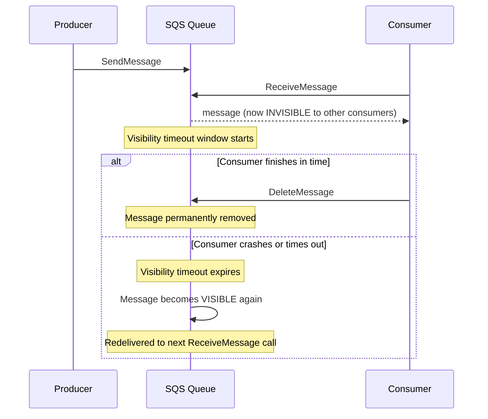
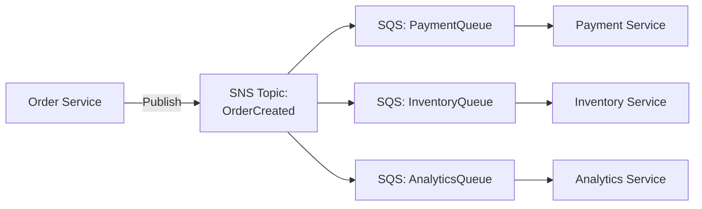
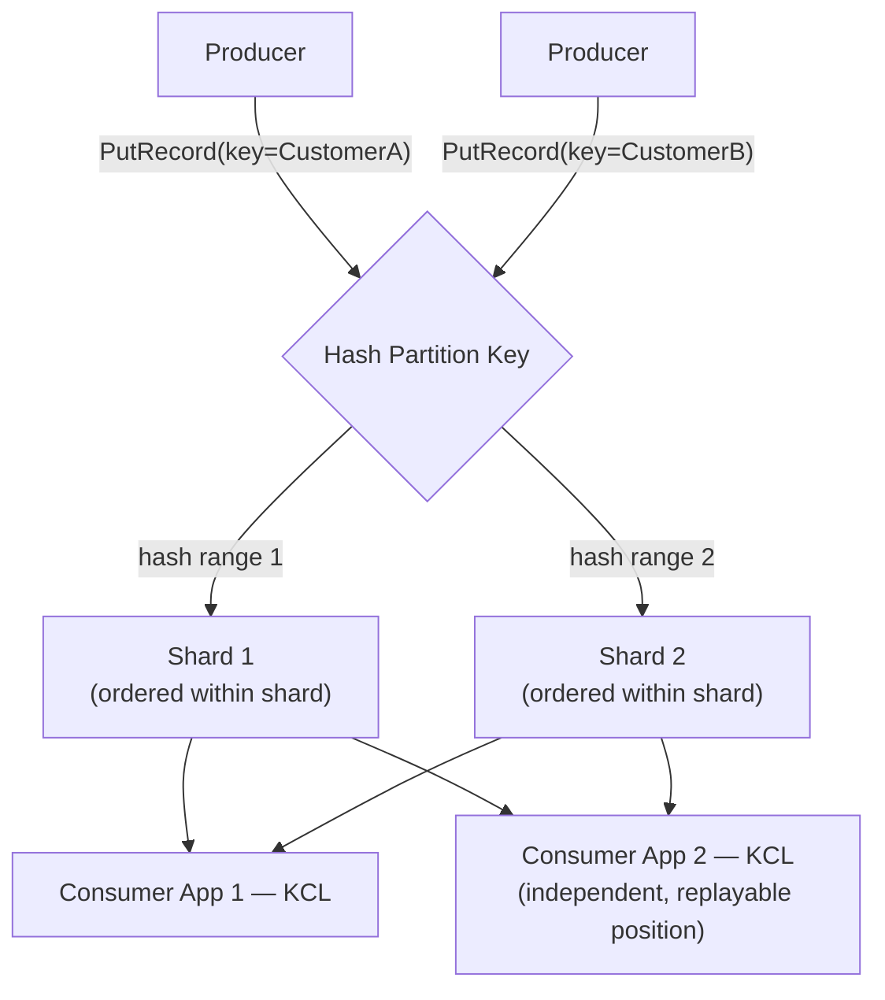
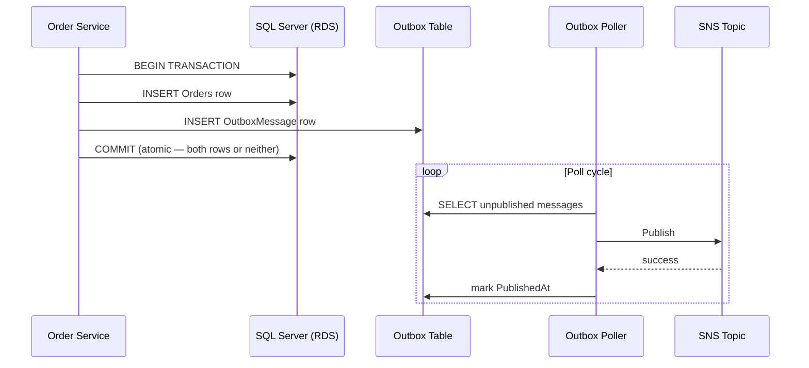
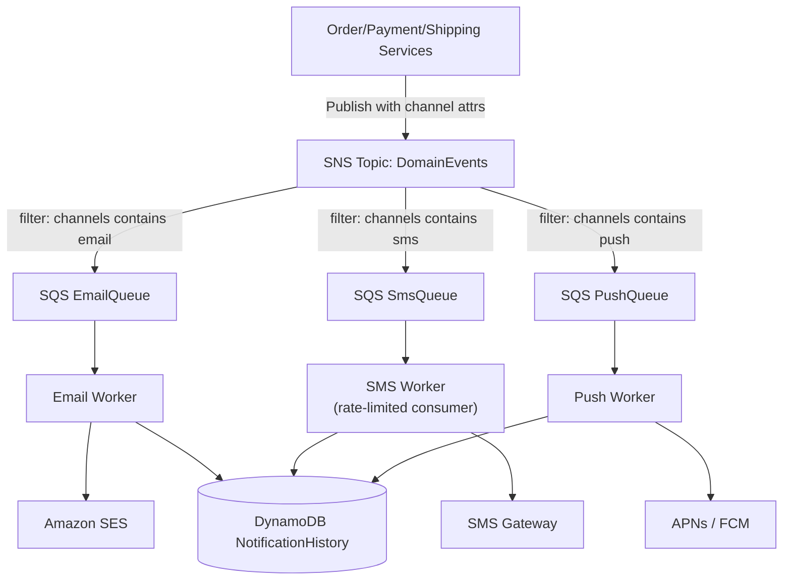

# Module 62 — AWS: Messaging & Event-Driven Architecture — SQS, SNS, EventBridge & Kinesis

> Domain: AWS | Level: Beginner → Expert | Prerequisite: [[../18-Event-Driven-Architecture/02-Schema-Evolution-Ordering-DeliverySemantics-DLQ]], [[../19-Kafka/01-Architecture-Partitioning-Replication-ConsumerGroups]], [[../20-RabbitMQ/01-Exchanges-Queues-Routing-Acknowledgment]] (this module maps those already-established EDA/broker fundamentals onto AWS's specific native services and the AWS-native-vs-self-managed-Kafka decision), [[05-Serverless-Lambda-APIGateway-StepFunctions]] (Lambda idempotency requirements apply directly to every AWS messaging service covered here)

---

## 1. Fundamentals

### What problem does AWS-native messaging solve?
[[../18-Event-Driven-Architecture/01-EDA-Fundamentals-Choreography-vs-Orchestration]] already established why decoupling producers from consumers via an intermediary (rather than direct synchronous calls) is foundational to resilient distributed systems: a producer that can hand off work and move on, rather than blocking on a consumer's availability/speed, survives the consumer being slow, temporarily down, or scaling independently. SQS, SNS, EventBridge, and Kinesis are AWS's fully-managed implementations of that intermediary role, each shaped for a different point/fan-out/replay topology, so that a team building on AWS does not need to run and operate Kafka or RabbitMQ (see [[../19-Kafka/01-Architecture-Partitioning-Replication-ConsumerGroups]] and [[../20-RabbitMQ/01-Exchanges-Queues-Routing-Acknowledgment]]) themselves purely to get asynchronous decoupling.

### When should you use which?
SQS: point-to-point work distribution among competing consumers. SNS: fan-out, one message to many independent subscribers. EventBridge: content-based routing across many event *types* and third-party SaaS sources, with a schema registry. Kinesis: ordered, replayable streams where multiple independent consumers each need to read the *same* data at their own pace, potentially re-reading history.

### When should you NOT use these AWS-native services?
When you already operate Kafka at scale for other reasons (a shared platform team, cross-cloud portability requirements, or a need for Kafka-specific semantics like log compaction) — re-deriving that investment onto AWS-native equivalents purely for "AWS-nativeness" is not automatically the right call; see the decision framework in §2.6.

### 30,000-ft view
```
SQS:  Producer → Queue → Consumer(s)          (point-to-point, competing consumers)
SNS:  Publisher → Topic → Subscriber(s)       (fan-out, every subscriber gets a copy)
EventBridge: Event Source → Event Bus → Rule → Target(s)  (content-based routing)
Kinesis: Producer(s) → Stream (Shards) → Consumer(s)      (ordered, replayable log)
```

---

## 2. Deep Dive

### 2.1 SQS — Standard Queues: the Core Mechanism
An SQS **Standard** queue is a durable, distributed buffer: a producer calls `SendMessage`, the message is stored redundantly across multiple AZs, and a consumer calls `ReceiveMessage` to pull (not push) a batch of up to 10 messages. Critically, `ReceiveMessage` does **not** delete the message — it makes it **invisible** to other consumers for a configured **visibility timeout** window, and only an explicit, subsequent `DeleteMessage` call (issued by the consumer after it has *successfully finished processing*) permanently removes it. If the consumer crashes, hangs, or simply takes longer than the visibility timeout to finish, the message becomes visible again and **will be redelivered** — this is the exact mechanism by which SQS gives **at-least-once delivery**, not a documented promise layered on top: it falls directly out of "invisible-then-reappear-if-not-deleted." The practical consequence: **every SQS consumer must be idempotent** (§2.4), because redelivery is not a rare edge case — it is the queue's designed behavior under any consumer slowness, crash, or scaling event.

**Standard queues also do not guarantee order or exactly-once**: message groups can arrive out of send order, and in rare internal-retry scenarios (not application-level redelivery, but SQS's own internal replication) a message can be delivered more than the "at-least-once" contract would suggest, in quick succession — reinforcing that idempotency is not optional.

### 2.2 SQS — FIFO Queues, and Their Real Cost
A **FIFO** queue guarantees strict ordering *within a message group* (a `MessageGroupId` you assign — messages sharing a group ID are delivered in the exact order sent; different groups are processed independently, effectively giving you parallelism across groups while preserving order within each) and provides **exactly-once processing** via **content-based or explicit deduplication**: SQS tracks a `MessageDeduplicationId` (or a hash of the body, if content-based dedup is enabled) for a **5-minute deduplication window** — a message with the same dedup ID sent again within that window is silently dropped rather than enqueued twice. The real cost: FIFO queues have a materially lower throughput ceiling than Standard (historically 300 messages/second without batching, higher with batching APIs) and higher latency per operation — the decision to use FIFO must be justified by an actual ordering requirement (e.g., a sequence of state-change events for a single order that *must* be applied in order), not adopted by default "to be safe," since most systems can achieve correctness through idempotency alone without paying FIFO's throughput tax.

### 2.3 Dead-Letter Queues — Redrive Policy and `maxReceiveCount`
A **DLQ** is an ordinary SQS queue configured as the destination for messages that have failed processing (been received, made invisible, and become visible again) **more than `maxReceiveCount` times** — the **redrive policy** on the *source* queue names the DLQ ARN and this threshold. This is the concrete mechanism that stops a single poison message (one that will *never* process successfully — a malformed payload, a permanently-broken downstream dependency for that specific message) from looping through visibility-timeout-then-redelivery indefinitely, consuming consumer capacity and cluttering CloudWatch metrics with the same failure repeatedly. A DLQ with **no monitoring** is a common production mistake — messages silently accumulate there with no alert, meaning real, permanently-failed business events (an order that never got processed) sit unnoticed until a customer complains; a CloudWatch alarm on `ApproximateNumberOfMessagesVisible` for every DLQ is a non-negotiable production baseline.

### 2.4 Idempotency — the Mandatory Consumer-Side Discipline
Because §2.1 establishes that SQS (and SNS, and most poll-based Lambda event sources per [[05-Serverless-Lambda-APIGateway-StepFunctions]] §2.6) delivers **at-least-once**, every consumer must treat "I might receive this exact message again" as a certainty, not a rare failure mode. The standard, concrete .NET pattern is a **conditional-write claim check** against a fast key-value store (DynamoDB, with a TTL to bound the claim table's size):

```csharp
public async Task<bool> TryClaimAsync(string idempotencyKey, TimeSpan ttl)
{
    var request = new PutItemRequest
    {
        TableName = "IdempotencyClaims",
        Item = new Dictionary<string, AttributeValue>
        {
            ["PK"] = new AttributeValue { S = idempotencyKey },
            ["ExpiresAt"] = new AttributeValue
            {
                N = DateTimeOffset.UtcNow.Add(ttl).ToUnixTimeSeconds().ToString()
            }
        },
        ConditionExpression = "attribute_not_exists(PK)"
    };

    try
    {
        await _dynamoDb.PutItemAsync(request);
        return true;   // first time seeing this key — proceed with processing
    }
    catch (ConditionalCheckFailedException)
    {
        return false;  // already claimed — this is a redelivery, skip
    }
}
```
The conditional write's atomicity (DynamoDB evaluates the condition and performs the write as a single atomic operation server-side) is what makes this safe under concurrent redelivery — two near-simultaneous receives of the same redelivered message race on the same conditional write, and exactly one wins.

### 2.5 SNS — Fan-Out, and Why You Fan Out *to SQS*, Not Directly to Consumers
An SNS **topic** delivers a copy of every published message to **every current subscriber** — HTTP/S endpoints, Lambda, SQS queues, mobile push, email/SMS. The standard, production-grade fan-out pattern is **SNS → multiple SQS queues** (one queue per downstream consumer team/service), rather than subscribing consumers (or their Lambdas) to the topic directly, for a specific, important reason: an SQS queue in between gives each downstream consumer its **own independent buffer** — if the Inventory team's consumer is temporarily down or slow, messages queue up safely in *their* SQS queue without being lost and without any back-pressure on the Shipping team's independent queue/consumer, whereas a Lambda subscribed directly to SNS has no such buffer (a failed async Lambda invocation relies on Lambda's own limited automatic retry plus an on-failure destination, per [[05-Serverless-Lambda-APIGateway-StepFunctions]] §2.6, rather than an indefinitely-persisting queue). This SNS-to-SQS fan-out is the AWS-native concrete implementation of the **pub/sub** pattern combined with **per-consumer buffering**.

### 2.6 EventBridge — Content-Based Routing, and How It Differs from SNS
**EventBridge** centers on an **event bus** (the default bus, a custom application bus, or a partner bus for third-party SaaS integrations like Datadog or Zendesk) onto which structured JSON events are published, and **rules** that match on the event's *content* (not just "which topic was it sent to," as with SNS) — a rule can match `{"source": ["orders"], "detail-type": ["OrderShipped"], "detail": {"carrier": ["UPS"]}}` and route only UPS-carrier shipment events to a specific target, without the publisher needing to know or care about that routing logic at publish time. EventBridge also maintains a **schema registry**, which can infer and version the JSON schema of events flowing through a bus — directly useful for the same schema-evolution discipline [[../18-Event-Driven-Architecture/02-Schema-Evolution-Ordering-DeliverySemantics-DLQ]] covers generally. The practical distinction from SNS: SNS's routing granularity is "which topic," EventBridge's is "match on arbitrary event content," and EventBridge natively ingests events from over 200 AWS services and numerous third-party SaaS partners without custom integration code — making it the natural choice when the routing logic itself needs to be content-aware, or when third-party SaaS event ingestion is part of the architecture.

### 2.7 Architectures for Named Scenarios

**Email** (via SES, the natural home for it in this messaging-focused module): Amazon SES sends transactional/marketing email directly via API/SMTP; **bounce and complaint notifications** are delivered back to your system via an **SNS topic** SES is configured to publish to — meaning even "just sending email" involves the fan-out mechanism (§2.5) for the *return* path, and a production system must subscribe an SQS queue to that SNS topic to process bounces/complaints (e.g., suppressing further sends to a hard-bounced address) rather than losing that signal.

**Order processing**: order-service publishes an `OrderCreated` event to SNS; fans out to per-team SQS queues (`PaymentQueue`, `InventoryQueue`, `AnalyticsQueue`) — each team's consumer processes independently, at its own pace, per §2.5.

**Payment**: a payment-completion event is a strong candidate for a **FIFO** queue/topic if downstream consumers need strict per-order event ordering (e.g., `PaymentAuthorized` must never be processed after `PaymentCaptured` out of order) — see §2.2's cost trade-off before defaulting to FIFO here.

**Notifications** (multi-channel — email/SMS/push): SNS fan-out to per-channel SQS queues, each consumed by a channel-specific worker — directly the [[05-Serverless-Lambda-APIGateway-StepFunctions]] LLD example architecture.

**Microservice events** (many event *types*, many consuming teams, some third-party): EventBridge's content-based routing is the better fit than SNS's topic-level routing once the number of distinct event types and consumer-specific filtering needs grows past what topic-per-event-type SNS can cleanly express.

### 2.8 Kinesis — Streams, Shards, and the Actual Unit of Throughput
A Kinesis **Data Stream** is divided into **shards**, and the shard is the concrete, billable unit of throughput: each shard supports **1MB/s or 1,000 records/second on write**, and **2MB/s on read** (shared across consumers unless using enhanced fan-out, below). A stream's total capacity is the sum of its shards' capacity — needing more throughput means adding shards (**resharding**: splitting a hot shard into two, or merging two under-utilized shards into one), which is an online, non-trivial operation (existing shards are closed to new writes and child shards take over a specific hash-key range, with consumers needing to track shard lineage to avoid losing or duplicating records during the transition).

### 2.9 Producers and Consumers
**Producers** call `PutRecord` (single record) or `PutRecords` (batched, more throughput-efficient) directly via the AWS SDK, or use the **Kinesis Producer Library (KPL)**, which adds client-side batching/aggregation and retry logic for higher-throughput producers. **Consumers** use the **Kinesis Client Library (KCL)**, which handles shard discovery, checkpointing (tracking how far into each shard a consumer has read, so it can resume correctly after a restart), and load-balancing shards across multiple consumer instances — or use **enhanced fan-out**, which gives each registered consumer a **dedicated** 2MB/s pipe per shard (via HTTP/2 push) rather than sharing the base 2MB/s read throughput across all consumers of that shard, at additional cost, and is the right choice once more than roughly two consumers need to independently read the same stream at full speed.

### 2.10 Partition Key — Determines Shard Placement, and the Hot-Shard Problem
Every record's **partition key** is hashed to determine which shard it lands on — this is mechanically identical to DynamoDB's partition-key hashing (see [[04-Databases-RDS-Aurora-DynamoDB]] §2 on hot partitions) and produces the same failure mode: a partition key with low cardinality or skewed distribution (e.g., using a fixed `"orders"` string as the key for every record, or a customer ID where one enterprise customer generates 40% of all traffic) concentrates records onto a small number of shards, which then throttle (`ProvisionedThroughputExceededException`-equivalent for Kinesis) while other shards sit idle — the fix is the same as DynamoDB's: choose a high-cardinality, evenly-distributed key (or add a random/hashed suffix to spread a naturally-skewed key across shards), and monitor `IncomingBytes`/`IncomingRecords` **per shard**, not just at the stream aggregate level, since an aggregate view can look healthy while one shard is saturated.

### 2.11 Ordering, Scaling, and the Real-Time-Analytics Use Case
Kinesis guarantees ordering **only within a single shard** (records with the same partition key always land on the same shard and are delivered to that shard's consumer in write order) — there is no ordering guarantee **across shards**. This makes Kinesis a strong fit for real-time analytics/clickstream/IoT-telemetry pipelines where a downstream consumer (often Kinesis Data Analytics, or a Lambda/KCL consumer feeding a data warehouse) needs to process a high-volume, continuous stream with per-key ordering, and where **multiple independent consumer applications** may each need to read the entire stream from their own position (a fraud-detection consumer and a business-analytics consumer both reading every event, independently, from potentially different points in the stream's retention window — up to 365 days configurable).

### 2.12 Kinesis vs. SQS vs. SNS — the Decisive Difference Is Replay
The comparison interviewers most often probe: **SQS deletes a message once acknowledged** — there is exactly one logical "consumption" of each message (even with multiple consumers pulling from one queue, each message is processed by exactly one of them, competing-consumers style); **SNS delivers a copy to each subscriber at publish time**, but a subscriber that wasn't yet subscribed, or whose queue wasn't yet created, never sees messages published before it existed; **Kinesis retains the full stream for its configured retention period**, and **any number of independent consumer applications can read the same records, at their own pace, and re-read (replay) from an earlier position** if needed (reprocessing after a bug fix, or onboarding a brand-new downstream consumer that needs the last 7 days of history). **Worked scenario**: "10 different downstream teams each need their own independent processing of every order event, and if a bug is found in one team's consumer, that team needs to replay the last several days of events after fixing it" — this is a Kinesis-shaped requirement specifically because of the replay need; the same fan-out *without* the replay requirement is comfortably served by SNS-to-per-team-SQS (§2.5), which is simpler, cheaper, and requires no shard-capacity planning — the interview-winning move is naming *replay* as the specific, decisive factor rather than reaching for Kinesis merely because "streaming sounds more scalable."

### 2.13 The Outbox Pattern — Atomically Writing a DB Row and Publishing an Event
A common, subtle correctness bug: an order-service writes an order row to its database, then separately calls SNS/SQS to publish an `OrderCreated` event — if the process crashes *between* the DB commit and the publish call, the order exists but no downstream service ever learns about it (a silent, un-detectable data-loss bug, since the database transaction itself succeeded). The **outbox pattern** solves this by writing the event **into the same database transaction** as the business row, into an `Outbox` table, so the DB commit is atomic across both — a separate, independent process (a poller, or [[../37-Outbox]]'s CDC-based variant reading the database's transaction log) then reads unpublished outbox rows and publishes them to SNS/SQS, marking them published only after a successful send. A concrete EF Core-shaped .NET implementation:

```csharp
public async Task CreateOrderAsync(Order order)
{
    await using var transaction = await _dbContext.Database.BeginTransactionAsync();

    _dbContext.Orders.Add(order);
    _dbContext.OutboxMessages.Add(new OutboxMessage
    {
        Id = Guid.NewGuid(),
        EventType = "OrderCreated",
        Payload = JsonSerializer.Serialize(new { order.OrderId, order.CustomerId, order.TotalAmount }),
        CreatedAt = DateTime.UtcNow,
        PublishedAt = null
    });

    await _dbContext.SaveChangesAsync();   // order row + outbox row commit ATOMICALLY together
    await transaction.CommitAsync();
}

// A separate background worker (a hosted service, or a scheduled Lambda) polls:
public async Task PublishPendingOutboxMessagesAsync()
{
    var pending = await _dbContext.OutboxMessages
        .Where(m => m.PublishedAt == null)
        .OrderBy(m => m.CreatedAt)
        .Take(100)
        .ToListAsync();

    foreach (var message in pending)
    {
        await _snsClient.PublishAsync(new PublishRequest
        {
            TopicArn = _orderEventsTopicArn,
            Message = message.Payload,
            MessageAttributes = new Dictionary<string, MessageAttributeValue>
            {
                ["EventType"] = new MessageAttributeValue { DataType = "String", StringValue = message.EventType }
            }
        });
        message.PublishedAt = DateTime.UtcNow;
    }

    await _dbContext.SaveChangesAsync();
}
```
**When NOT to use it**: for a system that can tolerate an at-least-once, best-effort publish without the atomicity guarantee (e.g., a non-critical analytics event, where an occasional missed event is acceptable), the outbox pattern's additional table/poller machinery is unjustified overhead — the honest test is whether a silently-dropped event is a real business-correctness problem or merely a minor gap.

### 2.14 Remaining Distributed Patterns, Placed Precisely
**DLQ** (§2.3), **idempotency** (§2.4), **fan-out** (§2.5) are covered above with their AWS-native mechanics. **Fan-in** (many producers, one consumer aggregating — e.g., many microservices publishing metrics events consumed by one aggregation Lambda) is the structural mirror of fan-out and uses the same SNS/SQS or Kinesis mechanics in reverse. **Backpressure**: SQS's queue depth is itself a natural backpressure buffer — a slow consumer simply causes messages to accumulate (visible in `ApproximateNumberOfMessagesVisible`) rather than the producer being blocked or the system falling over, **provided** the queue's retention period (default 4 days, up to 14) is long enough to outlast the slow period; a producer publishing faster than any consumer can ever drain, indefinitely, is a capacity-planning problem no queue depth alone fixes, and should trigger Auto Scaling on the consumer side (scaling ECS tasks or Lambda concurrency, per [[01-Compute-Networking-VPC-LoadBalancing-AutoScaling]] §2.5, off the queue's `ApproximateNumberOfMessagesVisible` metric) rather than being treated as purely a queue-depth monitoring exercise. **Pub/sub** is SNS's fundamental model (§2.5), directly. The full twenty-one-pattern catalogue — including the ones this module does not own (retry/circuit breaker, saga, cache-aside, bulkhead) and the three no module in this domain uses directly (event sourcing, CQRS, leader election) — is consolidated in [[08-Observability-Cost-WellArchitectedFramework]] §2.13, which indexes each pattern back to wherever it is worked in depth.

### 2.15 The Module's Discriminating Question, and What This Design Cannot Do
**The question that separates a Staff answer from a Senior one here**: *"Your outbox poller publishes an event to SNS, the publish succeeds, but the poller crashes before it can mark the outbox row as published — what happens on the next poll cycle?"* A Senior answer says "it gets published again." A Staff/Principal answer recognizes this is **an inherent, structural property of the outbox pattern, not a bug**: the outbox pattern guarantees **at-least-once** publish (the same guarantee SQS itself makes, one layer up), never exactly-once — so **every downstream consumer of an outbox-published event must itself be idempotent** (§2.4), and this requirement composes: an outbox publishing to SNS fanning out to SQS consumed by an idempotent handler has *three* layers where duplication can be introduced (the outbox's at-least-once semantics, SNS/SQS's own at-least-once semantics, and Lambda's at-least-once redelivery on poll-based sources) and exactly *one* place where it must be absorbed — the final consumer's idempotency check — which is the correct, minimal place to put it, rather than trying to prevent duplication at every layer redundantly. **What this design genuinely cannot do**: guarantee message ordering across independently-scaled competing consumers on a Standard queue (only FIFO offers that, at real throughput cost, §2.2), and cannot detect a downstream consumer that is silently *wrong* rather than failing loudly — a consumer that processes a message "successfully" but with a logic bug leaves no DLQ trace and no retry signal at all; that failure mode has no detector at the messaging layer and requires business-level reconciliation/audit (see [[08-Observability-Cost-WellArchitectedFramework]] and the reconciliation discipline in [[../14-System-Design]]'s payment-system treatment) to ever surface.

### 2.16 AWS-Native vs. Self-Managed Kafka — the Decision Framework
Per this module's prerequisite line: **choose AWS-native (SQS/SNS/EventBridge/Kinesis)** when the team's operational goal is minimizing infrastructure ownership, workloads fit cleanly into point-to-point/fan-out/content-routing/ordered-stream shapes, and there's no existing cross-cloud or Kafka-specific-feature requirement. **Choose Kafka** (self-managed or via Amazon MSK — a managed Kafka offering, worth naming explicitly as the middle ground between "run it yourself" and "AWS-native") when log compaction, extremely high sustained throughput with a mature consumer-group rebalancing model, cross-cloud portability, or an existing organizational Kafka investment (shared platform team, existing tooling/expertise) are real, present requirements — not hypothetical future ones. A Principal-level answer states which of these actually applies to the system at hand rather than treating the choice as ideological.

---

## 3. Visual Architecture

### SQS Standard Queue — Visibility Timeout Mechanics

```mermaid
sequenceDiagram
    participant P as Producer
    participant Q as SQS Queue
    participant C as Consumer

    P->>Q: SendMessage
    C->>Q: ReceiveMessage
    Q-->>C: message (now INVISIBLE to other consumers)
    Note over Q: Visibility timeout window starts

    alt Consumer finishes in time
        C->>Q: DeleteMessage
        Note over Q: Message permanently removed
    else Consumer crashes or times out
        Note over Q: Visibility timeout expires
        Q->>Q: Message becomes VISIBLE again
        Note over Q: Redelivered to next ReceiveMessage call
    end
```

### SNS Fan-Out to Per-Team SQS Queues

```mermaid
graph LR
    Producer[Order Service] -->|Publish| Topic[SNS Topic:<br/>OrderCreated]
    Topic --> PayQ[SQS: PaymentQueue]
    Topic --> InvQ[SQS: InventoryQueue]
    Topic --> AnalyticsQ[SQS: AnalyticsQueue]
    PayQ --> PayConsumer[Payment Service]
    InvQ --> InvConsumer[Inventory Service]
    AnalyticsQ --> AnalyticsConsumer[Analytics Service]
```

### Kinesis Shards, Partition Keys, and Ordering

```mermaid
graph TB
    P1[Producer] -->|"PutRecord(key=CustomerA)"| Hash{Hash Partition Key}
    P2[Producer] -->|"PutRecord(key=CustomerB)"| Hash
    Hash -->|hash range 1| S1["Shard 1<br/>(ordered within shard)"]
    Hash -->|hash range 2| S2["Shard 2<br/>(ordered within shard)"]
    S1 --> KCL1[Consumer App 1 — KCL]
    S2 --> KCL1
    S1 --> KCL2["Consumer App 2 — KCL<br/>(independent, replayable position)"]
    S2 --> KCL2
```

### Outbox Pattern — Atomic DB Write + Reliable Publish

```mermaid
sequenceDiagram
    participant App as Order Service
    participant DB as SQL Server (RDS)
    participant Outbox as Outbox Table
    participant Poller as Outbox Poller
    participant SNS as SNS Topic

    App->>DB: BEGIN TRANSACTION
    App->>DB: INSERT Orders row
    App->>Outbox: INSERT OutboxMessage row
    App->>DB: COMMIT (atomic — both rows or neither)

    loop Poll cycle
        Poller->>Outbox: SELECT unpublished messages
        Poller->>SNS: Publish
        SNS-->>Poller: success
        Poller->>Outbox: mark PublishedAt
    end
```

---

## 4. Production Example

**Problem**: A notification service subscribed a Lambda function **directly** to an SNS topic (skipping the SQS buffering layer described in §2.5) for simplicity. During a provider-side SMS-gateway outage lasting 40 minutes, the Lambda's downstream calls failed continuously; SNS's own retry policy to the Lambda destination was exhausted well before the outage ended, and — because there was no SQS queue holding the undelivered notifications — every notification published during that 40-minute window was permanently lost with no record and no way to replay it.

**Architecture**: The fix inserted an SQS queue between the SNS topic and the Lambda (SNS → SQS → Lambda via event source mapping), giving the notifications a durable buffer with a 14-day retention window — during any future provider outage, notifications simply accumulate in the queue (visible via `ApproximateNumberOfMessagesVisible`, triggering an alert) and drain automatically once the Lambda's downstream calls start succeeding again, with zero code change to the Lambda's own business logic.

**Implementation**: The SQS queue was configured with a redrive policy to a DLQ (§2.3) for the residual case of a specific notification that fails even after the provider recovers (a malformed phone number, say), and a CloudWatch alarm was added on both the main queue's age-of-oldest-message metric (an early warning that consumers are falling behind) and the DLQ's message count (§2.3).

**Trade-offs**: added a small amount of latency (the extra SQS hop) and a second AWS resource to provision/monitor, in exchange for eliminating an entire class of "provider outage = permanently lost notifications" incident.

**Lessons learned**: subscribing compute directly to SNS without an intermediate durable queue is a specific, recurring anti-pattern in AWS-native architectures — it looks simpler on a diagram, but silently removes the exact buffering guarantee that makes asynchronous messaging resilient to a downstream outage in the first place; the SNS-to-SQS pattern should be the default, with direct SNS-to-Lambda reserved for genuinely fire-and-forget, loss-tolerant notifications only.

---

## 11. Coding Exercises

### Easy
**Problem**: Publish an order-created event to an SNS topic from an ASP.NET Core service using the AWS SDK for .NET.
**Solution**:
```csharp
public class OrderEventPublisher
{
    private readonly IAmazonSimpleNotificationService _sns;
    private readonly string _topicArn;

    public async Task PublishOrderCreatedAsync(Order order)
    {
        await _sns.PublishAsync(new PublishRequest
        {
            TopicArn = _topicArn,
            Message = JsonSerializer.Serialize(order),
            MessageAttributes = new Dictionary<string, MessageAttributeValue>
            {
                ["EventType"] = new MessageAttributeValue { DataType = "String", StringValue = "OrderCreated" }
            }
        });
    }
}
```
**Time complexity**: O(1) per publish. **Space complexity**: O(1). **Optimized solution**: batch multiple events with `PublishBatch` when publishing several related events together, reducing per-call overhead.

### Medium
**Problem**: Implement the outbox pattern's poller as a .NET `BackgroundService`, ensuring it doesn't re-publish a message it already successfully sent if it crashes mid-batch.
**Solution**: process and mark each message as published **individually** within the loop (as shown in §2.13), rather than publishing the whole batch and marking the whole batch published afterward — so a crash mid-batch leaves only the *not-yet-marked* messages eligible for republish, and republish is safe precisely because the downstream consumer is idempotent (§2.4). **Time complexity**: O(n) per poll cycle for n pending messages. **Space complexity**: O(batch size). **Optimized solution**: use a `FOR UPDATE SKIP LOCKED`-equivalent (SQL Server's `WITH (UPDLOCK, READPAST)` hint) when selecting pending outbox rows if multiple poller instances run concurrently, so two pollers never pick up and double-publish the same row.

### Hard
**Problem**: Detect and handle a Kinesis hot shard caused by a skewed partition key.
**Solution**: monitor `IncomingBytes`/`IncomingRecords` **per shard** (via `GetShardIterator`/CloudWatch shard-level metrics), identify a shard receiving disproportionate volume, and fix at the producer by adding a random suffix to the skewed key for high-volume keys specifically (a "salting" strategy — e.g., `$"{customerId}-{recordCount % 10}"` for the single enterprise customer generating 40% of traffic), spreading that customer's records across multiple shards while accepting that per-customer ordering is now only guaranteed within each salted sub-key, not globally for that customer. **Time complexity**: O(1) per record for the salting logic itself. **Space complexity**: O(1). **Optimized solution**: if strict per-customer ordering is a hard requirement even for the high-volume customer, resharding to increase overall capacity is preferable to salting, accepting the operational cost of a resharding operation (§2.8) over sacrificing ordering guarantees.

### Expert
**Problem**: Design an idempotent, ordered-processing consumer for a FIFO SQS queue carrying payment state-transition events (`AUTHORIZED → CAPTURED → SETTLED`), where processing an event out of order (e.g., `SETTLED` arriving before `CAPTURED` is recorded) must not corrupt the payment's recorded state.
**Solution**: beyond FIFO's own in-order delivery guarantee (§2.2), add an application-level **state-transition guard**: each event carries the *expected prior state*, and the consumer performs a conditional update (`UPDATE Payments SET status = @new WHERE PaymentId = @id AND status = @expectedPrior`) that only succeeds if the payment's current recorded state matches what this event expects — an event arriving when the prior state doesn't match (a genuine ordering violation slipping through, or a redelivered/duplicate event) is rejected by the conditional update rather than silently overwriting a later state with an earlier one. **Time/space complexity**: O(1) per event for the conditional update; this is a correctness-complexity problem, not an algorithmic one — the right measure is enumerating every possible event-arrival ordering (including duplicates) and confirming the guard handles each correctly. **Optimized solution**: log rejected (guard-failed) transitions to a monitored dead-letter path for manual reconciliation rather than silently dropping them, since a guard rejection on a *supposedly* ordered FIFO queue is itself a signal worth investigating (a bug in the producer's own state machine, most likely).

---

## 12. System Design

### Step 1: Understand the Problem and Establish Design Scope

> **Interviewer**: "Design the messaging backbone for a multi-channel notification platform — order updates need to reach customers via email, SMS, and push notification."
> **Candidate**: "A few clarifying questions first. Do all three channels need to fire for every event, or does the event type determine which channels apply? What's the expected event volume, and is any channel rate-limited by a third-party provider? Does a customer need to see a unified notification history, and do we need to guarantee eventual delivery if a channel provider is temporarily down, or is best-effort acceptable per channel?"
> **Interviewer**: "Event type determines channels — a shipping update might be push+email, a payment failure might be SMS+email+push. 500,000 notifications/day, spread through the day with a moderate evening peak. SMS providers rate-limit us to 50 req/s. Yes to unified history; yes, must not silently drop even if a provider is briefly down."

**Functional requirements**: accept a notification-trigger event (order shipped, payment failed, etc.); fan out to the channel(s) that event type requires; respect per-channel rate limits; record delivery history per customer; retry/hold (not drop) on transient provider failure.
**Non-functional requirements**: no notification permanently lost on a transient provider outage; channel-specific rate limits enforced without blocking unrelated channels; delivery history queryable per customer within a few seconds of send.

**Back-of-the-envelope estimation**: 500,000 notifications/day ÷ 86,400s ≈ **5.8/second average**, with an evening peak plausibly 3–4x average ⇒ **~20/second peak** across all channels combined. Assuming roughly a third of events are payment-related (SMS+email+push) and the rest single/dual-channel, SMS volume alone might be ~150,000/day ≈ 1.7/second average, 5–7/second at peak — **comfortably under** the 50 req/s provider rate limit even at peak, meaning the *actual* hard problem is not raw throughput but **smoothing bursts against the provider's rate limit** and **guaranteeing no loss during a provider's own downtime**, not scaling the AWS-side infrastructure, which is trivially within SNS/SQS's native capacity at this volume.

### Step 2: Propose High-Level Design and Get Buy-In

**Component glossary**: *Event source* — any internal service publishing a domain event (order-service, payment-service). *SNS topic (`DomainEvents`)* — the single fan-out point every domain event is published to. *Per-channel SQS queues* (`EmailQueue`, `SmsQueue`, `PushQueue`) — subscribed to the topic with a **filter policy** so each queue receives only the event types relevant to its channel (SNS filter policies match on message attributes — e.g., `EmailQueue`'s filter policy matches `{"channels": ["email"]}` — avoiding the need for each channel worker to inspect and discard irrelevant events itself). *Channel workers* (Lambda or ECS, one per channel) — consume their queue at a rate matched to their provider's limit. *`NotificationHistory` table (DynamoDB)* — one row per (customer, notification) for fast unified-history lookups.

**Architecture diagram**:

```mermaid
graph TB
    Sources[Order/Payment/Shipping Services] -->|Publish with channel attrs| Topic[SNS Topic: DomainEvents]
    Topic -->|filter: channels contains email| EmailQ[SQS EmailQueue]
    Topic -->|filter: channels contains sms| SmsQ[SQS SmsQueue]
    Topic -->|filter: channels contains push| PushQ[SQS PushQueue]
    EmailQ --> EmailWorker[Email Worker] --> SES[Amazon SES]
    SmsQ --> SmsWorker["SMS Worker<br/>(rate-limited consumer)"] --> SmsProvider[SMS Gateway]
    PushQ --> PushWorker[Push Worker] --> APNs/FCM[APNs / FCM]
    EmailWorker --> History[(DynamoDB NotificationHistory)]
    SmsWorker --> History
    PushWorker --> History
```

**End-to-end walkthrough**: (1) order-service publishes `{eventType: "PaymentFailed", channels: ["sms","email","push"], customerId, ...}` to the `DomainEvents` topic; (2) SNS evaluates each subscription's filter policy and delivers a copy to `SmsQueue`, `EmailQueue`, and `PushQueue`; (3) each channel worker pulls from its own queue independently; (4) the SMS worker specifically throttles its own `ReceiveMessage` polling rate (or uses a token-bucket rate limiter in-process) to stay under the 50 req/s provider ceiling, letting excess messages simply queue in `SmsQueue` rather than being dropped or overwhelming the provider; (5) each worker writes a `NotificationHistory` row recording channel/status/timestamp after attempting delivery; (6) a provider failure (transient 5xx from the SMS gateway) is retried by the worker with backoff, and if retries are exhausted, the message's SQS redelivery (§2.1) gives it further attempts up to `maxReceiveCount` before landing in a monitored DLQ (§2.3) — never silently dropped.

**REST API** (for other services to trigger notifications, and for querying history):
| Method | Path | Description |
|---|---|---|
| POST | `/notifications/trigger` (internal only) | Publishes to `DomainEvents` — `{eventType, channels[], customerId, payload}` |
| GET | `/customers/{id}/notifications` | Returns `NotificationHistory` rows for unified history |

**Data model** (`NotificationHistory`, DynamoDB):
| Column | Type | Description |
|---|---|---|
| `PK` (`customerId`) | String | Partition key |
| `SK` (`timestamp#channel`) | String | Sort key — enables a single query for "all of this customer's notifications, in time order" |
| `channel` | String | `email` \| `sms` \| `push` |
| `status` | String | `PENDING → SENT → FAILED → DEAD_LETTERED` |
| `providerMessageId` | String | For provider-side delivery-receipt correlation |

**Why a filter policy on the subscription, not per-worker filtering in code**: pushing the routing decision into SNS's own filter-policy evaluation means a channel worker never receives (and never has to discard) irrelevant events at all — reducing both wasted SQS traffic/cost and eliminating an entire class of "the email worker's filtering logic has a bug and processes SMS-only events" mistake, since the filtering is declarative infrastructure configuration rather than application code every worker must get right independently.

### Step 3: Design Deep Dive

**Rate-limiting against the SMS provider**: the SMS worker does not rely on SQS alone to enforce the 50 req/s ceiling — SQS has no native per-consumer rate limit — so the worker itself implements a token-bucket limiter (or, more simply, processes messages in small batches with an explicit `Task.Delay` paced to the provider's limit) before calling the SMS gateway; excess demand simply accumulates safely in `SmsQueue` (§2.14's backpressure discussion) rather than overwhelming the provider or being dropped.

**Guaranteeing no loss during a provider outage**: exactly the Production Example above — the SQS buffering layer between SNS and each worker is what makes "provider down for 40 minutes" survivable rather than catastrophic; messages simply wait in queue (monitored via age-of-oldest-message) until the provider recovers.

**Idempotency**: a customer must never receive the *same* payment-failed SMS twice due to a worker crash mid-processing-then-redelivery — the SMS worker checks/writes its `NotificationHistory` row with a conditional write (§2.4's pattern) keyed on `(customerId, eventId, channel)` before actually calling the provider, so a redelivered SQS message that already succeeded is recognized and skipped.

**Consistency**: `NotificationHistory` is written *after* the provider call, meaning there's a small window where a message could be in-flight to the provider with no history row yet — a customer-support query for "was this SMS sent" during that exact window would show nothing; this is an accepted, honest limitation at this scale (sub-second window, non-critical data) rather than a case warranting the outbox pattern's additional complexity (§2.13) — this is exactly the kind of case-by-case judgment call §2.13 flags: outbox is for cases where losing the event silently is a real correctness problem, and a several-hundred-millisecond history-visibility lag is not that.

### Step 4: Wrap-Up

**Not covered, natural next questions**: monitoring/alerting specifics (per-queue age-of-oldest-message and DLQ-depth alarms, per §2.3/§2.14 — full treatment in [[08-Observability-Cost-WellArchitectedFramework]]); multi-region notification delivery if the platform expands internationally (SMS providers are often region-specific, requiring a provider-routing layer this design doesn't yet need); a customer-preference/opt-out system (suppressing channels a customer has disabled) which would sit as a filtering step before publish, not covered here since it's a product requirement, not a messaging-architecture one; the closing summary diagram is the Step 2 architecture diagram, which — given the traffic estimation in Step 1 — needs no additional scaling machinery beyond what's already shown at this specific volume.

**References**:
1. AWS SNS Developer Guide — message filtering with filter policies.
2. AWS SQS Developer Guide — visibility timeout, DLQ redrive policy.
3. AWS Kinesis Data Streams Developer Guide — shards, resharding, KCL.
4. Chris Richardson, *Microservices Patterns* — the Transactional Outbox pattern.
5. AWS re:Invent — "Messaging design patterns for the enterprise."

---

## 13. Low-Level Design

**Requirements**: a fan-out notification service where a new channel (e.g., WhatsApp) can be added without modifying the publishing side or existing channel workers.

**Class diagram** (conceptual):
```
INotificationChannel (interface)
  ChannelName: string
  SendAsync(NotificationPayload) : Task<DeliveryResult>

EmailChannel : INotificationChannel
SmsChannel : INotificationChannel      (wraps a rate limiter internally)
PushChannel : INotificationChannel

ChannelWorker
  - channel: INotificationChannel
  - queueUrl: string
  + RunAsync() : Task    // poll loop: receive, invoke channel.SendAsync, record history, delete/allow-redelivery

NotificationHistoryRepository
  + RecordAttemptAsync(customerId, eventId, channel, status) : Task
  + HasAlreadySucceededAsync(customerId, eventId, channel) : Task<bool>
```

**Sequence diagram**: mirrors §3's architecture diagram — a `ChannelWorker` instance per channel, each independently polling its own SQS queue, calling its own `INotificationChannel` implementation, and recording to the shared `NotificationHistoryRepository`.

**Design patterns used**: **Strategy** (`INotificationChannel` implementations are interchangeable per-channel strategies), **Adapter** (each channel implementation adapts a third-party provider's specific API — SES, an SMS gateway, APNs/FCM — to the common `INotificationChannel` interface), **Decorator** (a rate-limiting wrapper around `SmsChannel` composes rate-limiting behavior without the core channel logic needing to know about it).

**SOLID mapping**: **Single Responsibility** — each channel class knows only how to send via its own provider; **Open/Closed** — adding WhatsApp means implementing `INotificationChannel` and adding one new `ChannelWorker`/queue/subscription-filter, with zero changes to existing channels or the publishing side; **Liskov Substitution** — any `INotificationChannel` is fully substitutable, enabling a fake channel in tests; **Interface Segregation** — the interface exposes only `SendAsync`, nothing channel-specific leaks into the abstraction; **Dependency Inversion** — `ChannelWorker` depends on the `INotificationChannel` abstraction, never a concrete provider SDK directly.

**Extensibility**: new channels are additive, per above. **Concurrency/thread safety**: each `ChannelWorker` instance is independent and stateless between messages (all durable state lives in SQS and `NotificationHistory`), so running multiple worker instances per channel for horizontal scaling requires no shared in-process state or locking — SQS's own competing-consumers model (§2.1) handles safe distribution of messages across worker instances natively.

---

## 14. Production Debugging

**Incident**: A customer-notification system's `EmailQueue` began showing a steadily growing `ApproximateAgeOfOldestMessage`, eventually exceeding an hour, while `SmsQueue` and `PushQueue` remained healthy. No CloudWatch alarm had been configured on this specific metric, and the issue was only discovered when customer support began receiving complaints about missing order-confirmation emails.

**Root cause**: the Email worker's downstream SES call had begun silently failing for a specific subset of malformed recipient addresses (a data-quality issue upstream), and — because the worker's error handling caught the exception but forgot to *not* delete the message on failure (a bug: the `DeleteMessage` call was outside the try/catch's failure branch, so even failed messages were being deleted) — messages were being silently dropped rather than retried or dead-lettered, while simultaneously, a completely separate and correctly-functioning subset of messages queued up behind them because the worker's single-threaded polling loop was blocking on the failing calls' retry/timeout behavior before moving to the next message.

**Investigation**: CloudWatch's per-queue `ApproximateAgeOfOldestMessage` (once added, retroactively) and `NumberOfMessagesDeleted` vs. actual downstream SES `SendRawEmail` success counts (from SES's own sending statistics) showed a mismatch — messages were being deleted from SQS at a higher rate than SES was reporting successful sends, the key signal pointing at "deleted without being genuinely delivered" rather than a simple backlog.

**Tools**: CloudWatch queue-depth and age-of-oldest-message metrics (the specific gap this incident exposed: they hadn't been alarmed), SES sending statistics/bounce dashboards, application-level structured logs correlating SQS `MessageId` to the eventual SES call outcome.

**Fix**: corrected the worker's error handling so a failed send leaves the message **not deleted** (allowing SQS's natural visibility-timeout-based redelivery, §2.1, and eventual DLQ routing for genuinely undeliverable addresses, §2.3, rather than silent loss), and added the missing alarms on every queue's age-of-oldest-message and every DLQ's message count.

**Prevention**: a standing checklist for any new SQS consumer requiring: (1) `DeleteMessage` only ever called on the confirmed-success path, never in a `finally` block or unconditionally; (2) a DLQ with a monitored alarm configured from day one, not retrofitted after an incident; (3) age-of-oldest-message alarmed on every consumer-facing queue as a leading indicator of consumer health, since a healthy-looking consumer (no errors logged) can still be silently failing exactly as this incident showed.

---

## 15. Architecture Decision

**Decision**: for the multi-channel notification platform's event backbone — SNS fan-out to per-channel SQS, versus EventBridge with per-channel rules, versus direct per-channel Lambda triggers from the publishing service?

| Criterion | SNS → SQS | EventBridge | Direct Lambda triggers |
|---|---|---|---|
| Buffering on provider outage | Yes — SQS holds messages durably | Yes, if targets are SQS; EventBridge itself doesn't buffer beyond a short retry | No — no durable buffer without adding one |
| Routing granularity | Topic-level, or attribute-based filter policies | Full content-based rule matching, including nested JSON fields | None — the publisher must know every target directly |
| Operational complexity | Low — well-understood, minimal moving parts | Slightly higher — rule management, schema registry | Lowest to build initially, highest to maintain as channels grow |
| Third-party SaaS ingestion | Not native | Native, large partner catalogue | Not applicable |
| Cost at this volume (~20/s peak) | Negligible | Negligible | Negligible |

**Recommendation**: SNS → per-channel SQS, as designed in §12 — the routing need here (three known channels, determined by explicit `channels` attributes on publish) doesn't require EventBridge's richer content-matching or third-party ingestion capability, and SNS-to-SQS's buffering is essential (per the Production Example's incident) in a way direct Lambda triggers structurally cannot provide without bolting on an equivalent queue anyway. **Justification for the general rule**: reach for EventBridge specifically when routing rules need to inspect nested event *content* beyond simple attributes, or when ingesting third-party SaaS events is a real, present requirement — not by default, since it adds rule-management surface SNS's simpler model doesn't need for a well-known, small set of channels.

---

## 17. Principal Engineer Perspective

**Cost model at scale**: SNS/SQS pricing is dominated by request count (per-million-requests pricing) plus, for SNS, per-notification-delivery cost that varies by protocol (SMS/mobile-push delivery costs meaningfully more per unit than SQS/Lambda delivery) — at the 500,000/day volume in §12, this remains a minor line item, but a Principal-level cost review at 10x that volume would specifically scrutinize whether SMS delivery cost (the most expensive per-unit channel) is being sent only when genuinely necessary, versus defaulting every notification to all three channels regardless of urgency.

**The organizational discipline idempotency and DLQ monitoring require**: unlike a synchronous API, where a caller directly observes a failure, an asynchronous messaging architecture's failures are **invisible by default** — a message silently dropped, stuck, or dead-lettered produces no error to anyone unless someone is actively watching queue depth/DLQ metrics; this means adopting AWS-native messaging is not merely a technical decision but an operational commitment requiring the team to build (and staff the on-call rotation around) monitoring discipline that a synchronous, request/response architecture gets closer to "for free" via HTTP status codes and immediate client-visible errors.

**Why "just retry" is not a complete resilience strategy**: SQS's visibility-timeout-driven redelivery and Lambda's automatic async retry (per [[05-Serverless-Lambda-APIGateway-StepFunctions]] §2.6) both handle *transient* failure well, but neither distinguishes a transient failure from a permanent one (a malformed message that will never succeed) without a **DLQ and `maxReceiveCount`** (§2.3) acting as the circuit breaker that stops an unwinnable retry loop from consuming consumer capacity and metric-noise indefinitely — a mature messaging architecture pairs retry with an explicit, monitored "give up and escalate" boundary, and a Principal Engineer reviewing a new consumer's design should treat the absence of a configured, monitored DLQ as a genuine architecture-review blocker, not a minor gap to fix later.
