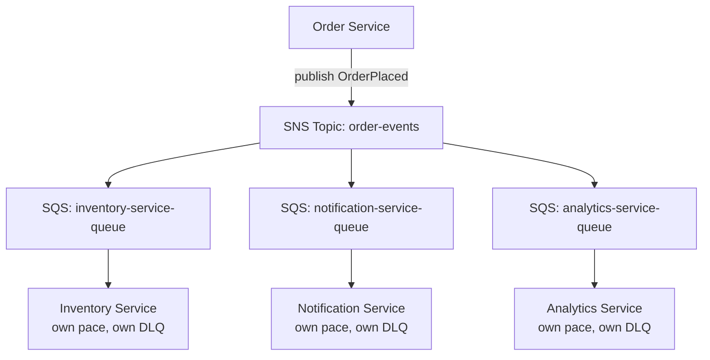
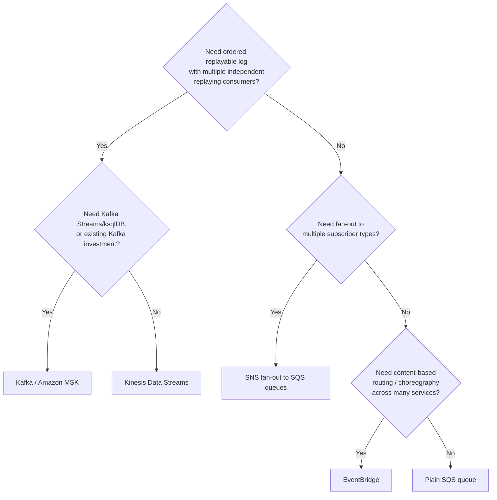
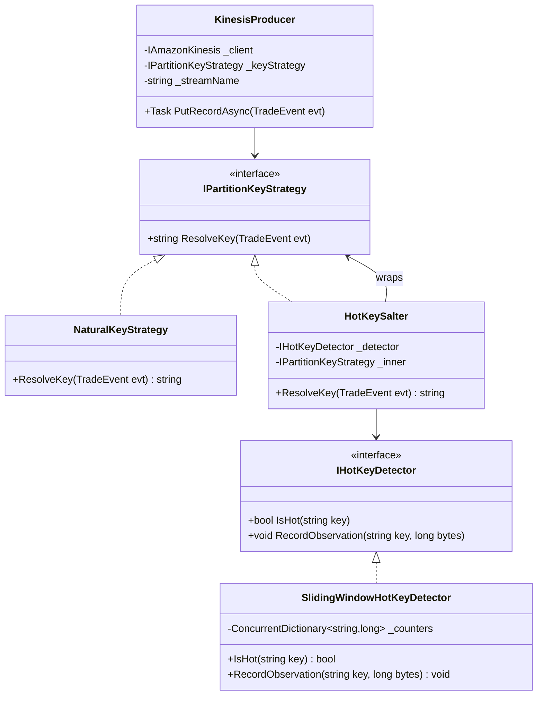
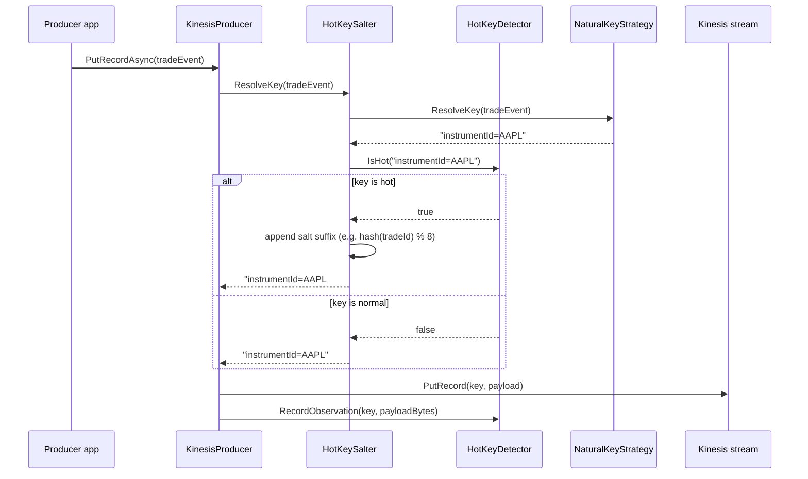

# Module 62 — AWS: Messaging & Event-Driven Architecture — SQS, SNS, EventBridge & Kinesis

> Domain: AWS | Level: Beginner → Expert | Prerequisite: [[../18-Event-Driven-Architecture/02-Schema-Evolution-Ordering-DeliverySemantics-DLQ]], [[../19-Kafka/01-Architecture-Partitioning-Replication-ConsumerGroups]], [[../20-RabbitMQ/01-Exchanges-Queues-Routing-Acknowledgment]] (this module maps those already-established EDA/broker fundamentals onto AWS's specific native services and the AWS-native-vs-self-managed-Kafka decision), [[05-Serverless-Lambda-APIGateway-StepFunctions]] (Lambda idempotency requirements apply directly to every AWS messaging service covered here)

---

## 1. Fundamentals

### Why does a Principal Engineer need AWS-messaging depth on top of already knowing Kafka/RabbitMQ/EDA fundamentals?
Modules 52-56 established the *conceptual* vocabulary (ordering, partitioning, delivery semantics, DLQs, choreography vs. orchestration) and two specific *self-managed* broker implementations (Kafka, RabbitMQ) — this module answers a distinctly different, AWS-specific question a Principal Engineer is regularly asked in practice: **given this same conceptual toolkit, which AWS-native managed service (SQS, SNS, EventBridge, Kinesis) actually fits this specific requirement, and when does self-managed/MSK-hosted Kafka remain the right choice instead?** Getting this mapping wrong (choosing SQS where Kinesis's ordered-replay semantics were actually needed, or standing up a full Kafka cluster where SNS/SQS would have been sufic) is a common, costly real-world architecture mistake.

### Why does this matter?
Because AWS's messaging services are **not interchangeable** despite superficially overlapping use cases — each implements a genuinely different point in the ordering/fan-out/replay/delivery-semantics design space this course already mapped conceptually, and a Principal Engineer is expected to justify a specific service choice against a workload's actual requirements on each of those dimensions, not choose based on familiarity or default habit.

### When does this matter?
Any time an AWS-based architecture needs asynchronous communication between components — which, given Modules 49-56 already established event-driven microservices as the dominant modern architecture style, is effectively every non-trivial AWS system this course's audience will design or review.

### How does it work (30,000-ft view)?
```
SQS: managed QUEUE -- point-to-point, one consumer group processes each message once,
 at-least-once delivery, no fan-out on its own
SNS: managed PUB/SUB TOPIC -- fans out one message to MANY subscribers (SQS queues, Lambda,
 HTTP endpoints, email) -- the classic "SNS fans out, SQS buffers per-consumer" pairing
EventBridge: managed EVENT BUS -- schema-aware, content-based routing rules, SaaS/AWS-service
 integrations, the natural home for CHOREOGRAPHY-style architectures
Kinesis: managed, PARTITIONED, ORDERED, REPLAYABLE log -- the closest AWS-native analog to
 Kafka's core model
```

---

## 2. Deep Dive

### 2.1 SQS — Point-to-Point Queueing, and Standard vs. FIFO
SQS is a managed message queue: a producer sends a message, and it is delivered to (and removed from the queue by) **one** consumer within a given processing context — SQS **Standard** queues provide at-least-once delivery with no ordering guarantee (messages may be delivered out of order, and rarely, more than once even absent failures) and effectively unlimited throughput; SQS **FIFO** queues provide strict ordering *within a message group* and exactly-once processing (deduplicated over a 5-minute window using a message deduplication ID), at a materially lower throughput ceiling than Standard — this is the exact same throughput-vs-ordering trade-off already established for Kafka partitioning (global ordering requires funneling related messages through a single ordered channel, which caps that channel's throughput), now expressed as a binary SQS queue-type choice rather than a tunable partition count.

### 2.2 SNS — Fan-out, and the SNS+SQS Fan-out Pattern
SNS is a publish/subscribe topic: a single published message is delivered to **every** current subscriber (SQS queues, Lambda functions, HTTP/S endpoints, email/SMS) — critically, SNS itself does **not** buffer or retain messages for a subscriber that's temporarily unavailable (an HTTP endpoint subscriber that's down when a message publishes simply misses it, subject to SNS's own limited retry policy), which is precisely why the canonical, production-grade pattern is **SNS fanning out to multiple SQS queues** (one queue per independent consumer service) rather than subscribing consumers directly — each SQS queue then provides durable buffering, at-least-once delivery, and independent per-consumer processing rate, decoupling each subscriber's availability/processing speed from every other subscriber's, directly the exchange-to-queue fan-out pattern (a RabbitMQ fanout exchange routing to multiple bound queues) now expressed via AWS's specific SNS+SQS pairing.

### 2.3 EventBridge — Schema-Aware Routing and the Natural Home for Choreography
EventBridge is a managed event bus supporting content-based routing rules (matching on an event's actual field values, not just topic/queue name) and native integrations with dozens of AWS services and SaaS partners as event sources — its **schema registry** capability (discovering and versioning event schemas automatically) directly operationalizes the schema-evolution discipline as a first-class platform feature rather than a convention teams must separately enforce. EventBridge is the natural AWS-native home for **choreography-style** architectures: many independent services can each publish domain events to a shared bus and independently subscribe to exactly the event types/content patterns they care about via rules, with no central orchestrator and no producer needing to know its consumers — inheriting both choreography's decoupling strength and its debuggability weakness (the trade-off), which EventBridge's built-in **schema discovery and event archive/replay** features partially mitigate but don't eliminate.

### 2.4 Kinesis — the AWS-Native Analog to Kafka's Ordered, Replayable Log
Kinesis Data Streams is structurally the closest AWS-native service to Kafka's core model: a stream is divided into **shards** (directly analogous to Kafka partitions), each shard providing strict ordering for records sharing a partition key, with configurable retention (up to 365 days) allowing **replay** — multiple independent consumers can read the same stream at their own pace and position, exactly Kafka's consumer-group-offset model — Kinesis is the correct choice specifically when a workload needs genuine ordered-stream processing with replay (event sourcing, real-time analytics pipelines, multi-consumer replay of the same event history), a fundamentally different use case from SQS/SNS's message-delivery model, where once a message is consumed and deleted, it's gone.

### 2.5 AWS-Native Messaging vs. Self-Managed/MSK Kafka — the Concrete Decision Framework
Directly answering the central question: choose **SQS/SNS/EventBridge** when the workload's need is message delivery/fan-out/routing without a hard requirement for a genuinely replayable, long-retention, strictly-partition-ordered log — these AWS-native services require zero cluster operational overhead (no broker capacity planning, no partition rebalancing operations, fully managed scaling) and are the correct default given this course's recurring "prefer the simpler mechanism unless a specific requirement demands more" discipline (the blast-radius/complexity-matching principle, applied to messaging-infrastructure choice specifically). Choose **Kinesis** when ordered replay across multiple independent consumer applications is genuinely required but Kafka's specific ecosystem (Kafka Streams, ksqlDB) isn't needed. Choose **Kafka** (self-managed or via Amazon MSK, a managed-Kafka offering that still requires more operational awareness — cluster sizing, partition planning — than SQS/SNS/EventBridge/Kinesis, though less than fully self-hosted) specifically when the workload genuinely needs Kafka's specific ecosystem (Kafka Streams/ksqlDB for stream processing, the exactly-once-semantics transactional guarantees, or existing organizational Kafka expertise/tooling investment) — defaulting to standing up a Kafka cluster "because that's the standard messaging technology" without this explicit requirement-matching is a real, observed over-engineering anti-pattern this course's blast-radius discipline directly warns against.

### 2.6 Delivery Semantics and DLQs — AWS-Specific Implementation of the Universal Concepts
Every AWS messaging service covered here provides at-least-once delivery by default (SQS Standard, SNS, EventBridge, Kinesis) — exactly-once is available only in SQS FIFO's specific scope (deduplication within a 5-minute window, within a message group) — meaning/56's idempotent-consumer discipline and the Lambda-specific idempotency requirement apply universally across every one of these services, not just SQS. Each service supports a **Dead Letter Queue** pattern (SQS's native DLQ redrive policy; SNS's DLQ for failed deliveries to a subscriber; Lambda's own DLQ/on-failure-destination for a function's own unhandled errors) — directly the DLQ discipline, now requiring a Principal Engineer to configure it correctly at **each** stage of a multi-service AWS pipeline (an SNS-to-SQS-to-Lambda chain has three distinct points where a message can fail and needs its own explicit DLQ/redrive strategy, not a single DLQ assumed to catch every failure mode across the whole pipeline).

---

## 3. Visual Architecture

### SNS Fan-out to Multiple SQS Queues

```mermaid
graph TB
 Producer[Order Service] -->|publish OrderPlaced| SNS[SNS Topic: order-events]
 SNS --> SQS1[SQS: inventory-service-queue]
 SNS --> SQS2[SQS: notification-service-queue]
 SNS --> SQS3[SQS: analytics-service-queue]
 SQS1 --> Inv[Inventory Service<br/>own pace, own DLQ]
 SQS2 --> Notif[Notification Service<br/>own pace, own DLQ]
 SQS3 --> Analytics[Analytics Service<br/>own pace, own DLQ]
```

### AWS-Native Messaging Decision Tree

```mermaid
graph TD
 Start{Need ordered,<br/>replayable log<br/>with multiple independent<br/>replaying consumers?}
 Start -->|Yes| KafkaNeed{Need Kafka Streams/ksqlDB,<br/>or existing Kafka investment?}
 Start -->|No| FanoutNeed{Need fan-out to<br/>multiple subscriber types?}
 KafkaNeed -->|Yes| Kafka[Kafka / Amazon MSK]
 KafkaNeed -->|No| Kinesis[Kinesis Data Streams]
 FanoutNeed -->|Yes| SNSSQS[SNS fan-out to SQS queues]
 FanoutNeed -->|No| ContentRouting{Need content-based<br/>routing / choreography<br/>across many services?}
 ContentRouting -->|Yes| EventBridge[EventBridge]
 ContentRouting -->|No| SQS[Plain SQS queue]
```

## 4. Production Example
**Scenario**: A platform's clickstream-analytics pipeline was originally built on SQS (chosen because "it was the messaging service the team already used for order processing") — a Lambda function consumed click events from an SQS queue and wrote aggregated metrics to a data warehouse. As the product grew, two new requirements emerged nearly simultaneously: a real-time fraud-detection service needed to consume the *same* click-event stream independently, and the analytics team wanted the ability to reprocess historical click events after fixing a bug in their aggregation logic. **Investigation**: SQS's fundamental model — a message is delivered to one consumer and then removed from the queue — made both new requirements structurally difficult: adding the fraud-detection service as a second consumer of the same queue would have caused it to compete with the analytics consumer for the same messages (each message going to only one or the other, not both), and reprocessing historical events was impossible since SQS provides no retention/replay of already-consumed messages — the team's initial attempted fix (fanning the SQS queue out via SNS) solved the multi-consumer problem but still didn't solve replay, since SNS/SQS still don't retain a durable, replayable history. **Root cause**: the original service choice (SQS) was made based on team familiarity with an unrelated use case (order processing, a genuine point-to-point delivery problem well-suited to SQS) rather than an explicit analysis of the clickstream workload's actual requirements — which, from the start, included the latent (not yet explicit, but foreseeable given the product's trajectory) need for multi-consumer replay, a requirement that maps directly to Kinesis's (or Kafka's) model, not SQS's. **Fix**: migrated the clickstream pipeline to Kinesis Data Streams, with both the existing analytics consumer and the new fraud-detection consumer reading the same stream independently at their own pace (via separate consumer applications tracking their own shard iterators), and with the stream's retention window sized to support the analytics team's actual reprocessing/replay requirements. **Lesson**: this is a direct, concrete instance of the decision framework applied retroactively — the original mistake wasn't using SQS (a reasonable, even correct choice for order processing), it was reusing that same choice for a structurally different workload (multi-consumer, replay-requiring) without re-evaluating the requirement against the AWS messaging decision tree, the same "don't default to a familiar tool without re-validating fit for a new use case" discipline this course applies recurrently.

## 5. Best Practices
- Explicitly map each new messaging requirement against the ordering/fan-out/replay/delivery-semantics decision framework before defaulting to whichever service the team already uses elsewhere.
- Use SNS fanning out to per-consumer SQS queues rather than subscribing consumers directly to SNS, to gain durable buffering and independent per-consumer processing rates.
- Use Kinesis (or Kafka/MSK) specifically when multiple independent consumers need to replay the same event history at their own pace — never force this requirement onto SQS/SNS's delivery-and-remove model.
- Configure an explicit DLQ/redrive strategy at every distinct failure point in a multi-service AWS messaging pipeline, not a single DLQ assumed to cover the whole chain.
- Prefer AWS-native managed services (SQS/SNS/EventBridge) over standing up Kafka/MSK by default, reserving Kafka specifically for workloads with a genuine, articulated need for its specific ecosystem or transactional guarantees.

## 6. Anti-patterns
- Choosing a messaging service based on team familiarity or "what we already use" rather than an explicit analysis of the specific workload's ordering/fan-out/replay requirements.
- Subscribing consumers directly to an SNS topic without an intermediate SQS queue, losing durable buffering and making each subscriber's availability a direct dependency of message delivery.
- Attempting to retrofit replay/multi-consumer-independent-pace requirements onto SQS, which structurally cannot provide them, rather than migrating to Kinesis/Kafka once that requirement becomes real.
- Standing up a full Kafka/MSK cluster "because it's the standard enterprise messaging technology" without an explicit requirement that SQS/SNS/EventBridge cannot satisfy, incurring unnecessary operational overhead (the over-engineering anti-pattern).
- Assuming a single DLQ configured somewhere in a multi-stage pipeline catches every possible failure mode across every stage, rather than configuring DLQs explicitly at each stage.

---

## 7. Performance Engineering

**SQS visibility-timeout tuning is the primary performance/correctness lever, and it's a genuine trade-off, not a "set it high to be safe" default.** The visibility timeout must exceed a consumer's actual maximum processing time (including retries of its own downstream calls) or messages will be redelivered while still legitimately being processed (§61's incident, cross-referenced from Module 61/§4 in this domain) — but setting it far higher than needed delays legitimate redelivery of messages whose consumer genuinely crashed or hung, extending the time before a truly-stuck message reaches its DLQ. The correct value is derived from measured P99.9 consumer processing time plus margin, not a round number — and for variable-duration processing (a function whose duration depends on payload size or downstream latency), `ChangeMessageVisibility` should be called to **extend** the timeout dynamically mid-processing for a specific message taking unusually long, rather than statically setting every message's timeout to the worst-case duration up front (which needlessly slows redelivery for the common-case fast messages).

**SQS long polling vs. short polling is a direct, measurable cost and latency lever.** Short polling (`WaitTimeSeconds: 0`) returns immediately even when no messages are available, meaning a consumer polling on a tight loop against an empty queue generates a high volume of billed, empty `ReceiveMessage` API calls — long polling (`WaitTimeSeconds` up to 20) holds the connection open until a message arrives or the wait expires, collapsing what would be dozens of empty polls into one, materially reducing both API call cost and the empty-poll CPU/network overhead on the consumer side, with no correctness trade-off. There is essentially no legitimate reason to run a production SQS consumer on short polling.

**Kinesis shard throughput limits are hard, per-shard ceilings, not a soft guideline.** Each shard supports 1MB/s or 1,000 records/second ingest (whichever is hit first) and 2MB/s standard read throughput (shared across all consumers reading that shard, unless using Enhanced Fan-Out) — a hot partition key (one customer ID, one symbol, one high-volume merchant driving a disproportionate share of records into the same shard via a deterministic hash) hits these per-shard ceilings long before the stream's aggregate provisioned capacity is exhausted, producing `ProvisionedThroughputExceededException` on writes to that specific shard while the stream's other shards sit comfortably underutilized — fleet-average Kinesis metrics hide this exactly the way fleet-average CPU hides an AZ skew elsewhere in this course; per-shard `IncomingBytes`/`IncomingRecords`/`WriteProvisionedThroughputExceeded` metrics are required to actually see it.

**Kinesis Enhanced Fan-Out (EFO) is the fix for the shared-2MB/s-read-throughput ceiling with multiple consumers.** Without EFO, every consumer application reading a shard shares that shard's single 2MB/s read allocation via the (polling-based) `GetRecords` API — three consumer applications each attempting to read the full stream divide that 2MB/s three ways in practice, even though each believes it's entitled to the full throughput. EFO gives each registered consumer (up to 20 per stream) its own dedicated 2MB/s throughput via a push-based HTTP/2 model, eliminating the shared-throughput contention at a materially higher per-consumer-hour cost — the correct choice specifically when multiple independent consumer applications genuinely need full-throughput access to the same stream simultaneously (§4's clickstream/fraud-detection scenario is exactly this case), not a default applied to every Kinesis consumer regardless of consumer count.

**SNS/EventBridge throughput is generally not the bottleneck — the fan-out target's own capacity is.** SNS and EventBridge both scale to very high publish/delivery rates without the shard-provisioning concerns Kinesis has, but a fan-out to many subscribers only moves the throughput ceiling downstream — the slowest subscriber (an HTTP endpoint with its own rate limit, an SQS queue whose consumer under-provisions concurrency) becomes the effective bottleneck for that specific delivery path while every other subscriber proceeds unaffected, precisely because SNS delivers to each subscriber independently rather than at a synchronized, lowest-common-denominator rate.

**Benchmarking discipline.** Load-test Kinesis producers against realistic partition-key cardinality and distribution, not synthetic uniform random keys — a benchmark using perfectly uniform keys will never surface the hot-shard behavior a real skewed production key distribution (customer ID, where a small number of customers generate disproportionate volume) will produce. For SQS, benchmark under genuinely variable consumer processing time (including simulated downstream slowness), not a fixed, artificially uniform processing duration, since visibility-timeout-driven redelivery specifically activates under duration variance, not average-case load.

---

## 8. Security

**SQS/SNS access-policy misconfiguration is the dominant, most consequential risk in this topic.** Every SQS queue and SNS topic has a resource-based access policy (distinct from IAM identity-based policies) governing which principals may send/receive/subscribe — the single most common, damaging misconfiguration is an access policy with `Principal: "*"` and no restrictive `Condition` block, which makes the queue/topic **publicly writable or readable from any AWS account**, not just within the owning account. This is a materially different and more severe risk than an overly broad IAM role (which at least confines the blast radius to principals within the account) — a public SQS queue accepting `sendMessage` from any AWS principal can be used to inject arbitrary, attacker-controlled messages directly into a production processing pipeline, and a public SNS topic can be subscribed to by an external account, silently exfiltrating every message published to it. The correct default is a `Condition` block scoping the policy to specific source ARNs (a specific SNS topic, a specific Lambda/service) or `aws:SourceAccount`/`aws:SourceArn` conditions, never a bare wildcard principal without a matching condition.

**EventBridge cross-account event-bus risk is a distinct, EventBridge-specific version of the same class of mistake.** EventBridge supports cross-account event buses by design (a legitimate, common pattern for a hub-and-spoke multi-account organization publishing shared domain events) — but this requires an explicit resource-based policy on the event bus granting `events:PutEvents` to specific external account IDs, and the risk is symmetric to the SQS/SNS case: an overly permissive event-bus policy (matching too broad an account/organization pattern, or lacking a condition restricting to specific event sources) allows an unintended account to publish events that downstream rules and targets will process as if they were legitimate, potentially triggering real business logic (a Lambda function, a Step Functions workflow) from an untrusted source. Additionally, EventBridge rules that route events out to a target Lambda/SQS/Step Functions execution require their **own** execution role scoped narrowly to only the specific targets that rule should invoke — a rule with an overly broad target-invocation role compounds the cross-account risk if the source-account restriction is also misconfigured.

**Kinesis-specific security surface.** Kinesis stream access is governed by IAM policy (no separate resource-based policy layer analogous to SQS/SNS, since Kinesis doesn't natively support the same cross-account resource-policy model without going through a different sharing mechanism), meaning least-privilege IAM scoping (per-stream ARN grants, not `kinesis:*` on `Resource: "*"`) is the primary control, directly the Module 61 execution-role discipline applied to Kinesis producer/consumer IAM roles specifically. Server-side encryption (SSE-KMS) should be enabled by default for any Kinesis stream carrying sensitive financial data, with the specific customer-managed KMS key's own key policy providing an additional, independently-auditable access-control layer beyond the stream's own IAM policy — a defense-in-depth pairing directly analogous to the mTLS-plus-security-group layering established elsewhere in this course.

**DLQ access must be equally scoped, not left as an afterthought.** A DLQ frequently accumulates the *most sensitive* subset of a pipeline's traffic (the messages that failed processing, sometimes precisely because they contained malformed or unusual data worth investigating) — an access policy that was carefully scoped on the primary queue but left broad or default on its DLQ (a common oversight, since DLQs are often provisioned as an afterthought alongside the primary queue) creates an inconsistent security posture where the most operationally-sensitive data sits behind the weakest access control.

**Encryption and PII in event payloads.** SQS, SNS, EventBridge, and Kinesis all support encryption at rest (SSE-SQS/SSE-KMS, SNS server-side encryption, Kinesis SSE-KMS) and in transit (TLS) — but encryption at the transport/storage layer does not address the application-level concern of PII or sensitive financial data being embedded directly in a message/event payload that then propagates to every subscriber/consumer, some of which may not have a legitimate need to see that specific field (the same over-broad-payload-exposure concern raised for Step Functions execution history in Module 61 §8) — the correct discipline for genuinely sensitive fields is tokenization or a reference/pointer pattern (publish a reference ID, let authorized consumers separately fetch the sensitive detail from a tightly-access-controlled store) rather than broadcasting the raw sensitive value to every fan-out target by default.

---

## 9. Scalability

**SQS scaling is close to unbounded for Standard queues, and consumer-side concurrency is the actual scaling lever.** SQS Standard imposes no meaningful queue-level throughput ceiling in practice — the real scaling constraint is almost always on the **consumer** side: how many concurrent Lambda executions (reserved concurrency, per Module 61 §9) or how many consumer processes/threads are pulling from the queue. Scaling an SQS-backed pipeline is therefore primarily a matter of scaling consumer concurrency to match the required processing rate, with SQS itself absorbing whatever backlog accumulates during a burst as durable buffering — the queue depth (`ApproximateNumberOfMessagesVisible`) is the direct, correct signal for whether consumer concurrency needs to scale up, and Lambda's SQS-triggered concurrency scaling (which itself has its own ramp-up characteristics, not instantaneous) should be understood and tested against realistic burst shapes, not assumed to scale in lockstep with queue depth instantaneously.

**Kinesis shard scaling — resharding is a deliberate, non-instantaneous operation, unlike SQS's implicit elasticity.** Increasing a Kinesis stream's throughput capacity requires explicitly resharding (splitting a hot shard into two, or merging underutilized shards) — either manually or via **on-demand mode** (Kinesis's auto-scaling capacity mode, trading some cost premium for AWS-managed shard scaling based on observed throughput). Resharding is not instantaneous and old/new shards briefly coexist during the operation, meaning a sudden, unplanned traffic spike on a **provisioned-mode** stream can hit `ProvisionedThroughputExceededException` well before manual resharding (or even on-demand mode's own reactive scaling) catches up — for workloads with genuinely unpredictable burst patterns, on-demand mode's higher baseline cost is frequently justified purely by removing this manual-resharding-lag risk, while workloads with well-understood, predictable throughput growth can use provisioned mode with proactive resharding ahead of anticipated growth, cheaper but requiring genuine capacity planning discipline.

**Partition-key design is the single highest-leverage Kinesis scalability decision, made once and hard to change cheaply later.** A partition key with too little cardinality (all records for a given day funneled to a single key) makes horizontal shard scaling structurally ineffective — adding shards doesn't help if the hash of a low-cardinality key set still concentrates records onto a small subset of them (directly the "adding shards doesn't fix a hot key" restatement of the Kafka partitioning lesson from the EDA/Kafka modules) — the key must be chosen for even distribution across the *realistic* production key-value distribution, not a theoretical uniform distribution that benchmark data might imply but production traffic won't match.

**EventBridge fan-out at scale — rule-evaluation cost and target-invocation throughput both need explicit capacity planning.** EventBridge scales its own ingestion and rule-matching to very high event rates, but each **target** invoked by a matching rule has its own independent throughput ceiling (a Lambda function's reserved concurrency, an SQS queue's consumer concurrency, a Step Functions execution-start rate limit) — at genuine fan-out scale (one high-volume event type matched by dozens of rules, each invoking a different target), the aggregate downstream invocation rate across all matched targets can exceed what any single target's own capacity planning anticipated, even though EventBridge itself never showed any sign of being the bottleneck — this is the messaging-layer's version of the "AWS-native service scales, but everything downstream of it might not" pattern established for Lambda in Module 61 §9's overgeneralization warning, now applied to EventBridge's fan-out specifically.

**SNS fan-out scaling — subscriber count and delivery-retry policy interact.** SNS's own publish throughput scales well, but a topic with a very large number of subscribers (particularly HTTP/S endpoint subscribers, which have their own independent availability/latency characteristics per §2.2) means a single slow or failing subscriber's retry policy (SNS's configurable retry backoff for failed deliveries) can accumulate a meaningful redelivery volume against that one subscriber without affecting delivery to any other subscriber — at scale, per-subscriber delivery-success monitoring (not just aggregate publish-success) is required to catch a single degrading subscriber before its accumulating retry volume itself becomes a capacity concern.

**High availability and multi-region.** SQS, SNS, and EventBridge are regional services (with EventBridge additionally supporting explicit cross-region event routing via bus-to-bus targets for multi-region architectures) and Kinesis streams are also regional — genuine multi-region messaging resilience requires explicit application-level design (dual-region publishing, cross-region EventBridge routing rules, or a consumer capable of failing over to a secondary-region queue/stream) rather than any of these services providing automatic cross-region failover on their own, the same "the managed service being regional doesn't imply the application is multi-region-resilient by default" lesson established for Lambda/API Gateway/Step Functions in Module 61 §9.

---

## 10. Interview Questions

### Basic (10)
1. **Q: What is the fundamental difference between SQS and SNS?** **A:** SQS is a point-to-point queue where each message is processed by one consumer; SNS is a pub/sub topic that fans a message out to every current subscriber.
2. **Q: Why is subscribing consumers directly to SNS generally discouraged in favor of SNS-to-SQS fan-out?** **A:** SNS doesn't durably buffer messages for temporarily unavailable subscribers; an intermediate SQS queue per consumer provides durable buffering and independent processing rates.
3. **Q: What is the throughput-vs-ordering trade-off between SQS Standard and SQS FIFO?** **A:** Standard offers effectively unlimited throughput with no ordering guarantee; FIFO offers strict per-message-group ordering and exactly-once processing at a materially lower throughput ceiling.
4. **Q: What is a Kinesis shard analogous to in Kafka?** **A:** A Kafka partition — the unit of ordering and parallelism within a stream.
5. **Q: What capability does Kinesis provide that SQS structurally cannot?** **A:** Replay — multiple independent consumers can read the same retained stream history at their own pace and position.
6. **Q: What is EventBridge's schema registry?** **A:** A capability that automatically discovers and versions event schemas, operationalizing schema-evolution discipline as a platform feature.
7. **Q: Which AWS messaging service is the natural home for choreography-style architectures?** **A:** EventBridge, via its content-based routing rules and lack of a central orchestrator.
8. **Q: What delivery semantics do SQS Standard, SNS, EventBridge, and Kinesis provide by default?** **A:** At-least-once — duplicates are possible under retries, redelivery after visibility-timeout expiry, and failover, so every consumer must be idempotent (dedupe by message/event ID or use naturally idempotent operations); only SQS FIFO adds broker-side deduplication, within its 5-minute window.
9. **Q: When is Kinesis or Kafka the correct choice over SQS/SNS/EventBridge?** **A:** When a workload genuinely needs ordered, replayable stream history readable independently by multiple consumer applications.
10. **Q: What determines Kinesis's throughput ceiling?** **A:** The number of provisioned shards — each shard supports about 1MB/s (or 1,000 records/s) ingest and 2MB/s standard read; total stream capacity is shards × those per-shard limits, so a hot partition key that concentrates traffic onto one shard hits the ceiling long before the stream's aggregate capacity does.

### Intermediate (10)
1. **Q: Why couldn't the clickstream pipeline simply add a second consumer directly to the existing SQS queue to support fraud detection?** **A:** SQS delivers each message to one consumer within a processing context — a second consumer competing for the same queue would split messages between the two consumers rather than delivering the full stream to both, since SQS has no notion of multiple independent, full-stream subscribers.
2. **Q: Why is "the team already uses SQS for order processing" an insufficient justification for using SQS for a clickstream-analytics pipeline?** **A:** Order processing is a genuine point-to-point delivery problem well-suited to SQS's model, but clickstream analytics (as it evolved) required multi-consumer replay — a structurally different requirement that SQS's delivery-and-remove model cannot satisfy regardless of prior familiarity.
3. **Q: Why does SQS FIFO's per-message-group throughput ceiling not necessarily limit a queue's aggregate throughput?** **A:** Multiple distinct message groups within the same FIFO queue scale independently — the ordering guarantee applies within a group, so partitioning data across multiple groups (analogous to Kafka partition-key design) allows aggregate throughput to scale even though any single group's ordering-preserving throughput is capped.
4. **Q: Why is Amazon MSK described as requiring more operational awareness than SQS/SNS/EventBridge/Kinesis, despite being a "managed" Kafka offering?** **A:** MSK still requires cluster/broker capacity planning and partition-count decisions (the concerns) that are the operator's responsibility, whereas SQS/SNS/EventBridge/Kinesis abstract away broker/cluster-level capacity planning entirely as part of the fully-managed service.
5. **Q: Why must a multi-stage AWS messaging pipeline (SNS → SQS → Lambda) configure a DLQ at each stage rather than relying on a single DLQ somewhere in the chain?** **A:** Each stage has a distinct, independent failure mode (SNS failing to deliver to a subscriber; SQS messages exceeding max-receive-count; Lambda's own unhandled invocation errors) — a DLQ configured at only one stage doesn't capture failures occurring at a different stage of the same pipeline.
6. **Q: Why does EventBridge's schema registry only partially mitigate choreography's debuggability weakness rather than eliminating it (the original trade-off)?** **A:** Schema discovery/versioning helps producers and consumers agree on event structure, but doesn't provide the centralized, end-to-end visibility into an entire multi-service workflow's actual execution state that an orchestrator (Step Functions) provides — the fundamental decoupling-vs-visibility trade-off still applies.
7. **Q: Why should a Lambda function consuming from EventBridge or Kinesis be written with the same idempotency discipline as one consuming from SQS?** **A:** All of these services provide at-least-once delivery by default, meaning the same redelivery/retry conditions that can cause duplicate SQS invocations apply equally to EventBridge- and Kinesis-triggered Lambda invocations.
8. **Q: Why does under-provisioned Kinesis shard count manifest as consumer lag rather than an outright rejected write?** **A:** Producers can still write within the stream's overall provisioned throughput, but an insufficient shard count limits the number of concurrent GetRecords calls and per-shard read throughput available to consumers, causing consumers to fall progressively behind the actual write rate rather than producers being blocked outright.
9. **Q: Why is IAM policy scoping for SQS/SNS access described as following the same discipline as the S3/general IAM least-privilege principle?** **A:** Because the identical risk pattern applies — a broad `sqs:*`/`sns:*` grant across every queue/topic in an account recreates the exact blast-radius-expansion risk if the holding principal is ever compromised, regardless of which specific AWS service the overly-broad policy targets.
10. **Q: Why is standing up a Kafka/MSK cluster without an explicit unmet requirement considered an over-engineering anti-pattern rather than simply a "more capable" default choice?** **A:** It incurs real, ongoing operational overhead (cluster sizing, partition planning, even with MSK's managed layer) that the complexity-matching discipline specifically warns against taking on without a concrete requirement (replay, Kafka Streams/ksqlDB, exactly-once transactional semantics) that simpler AWS-native services cannot satisfy.

### Advanced (10)
1. **Q: Diagnose the incident from first principles, and design the specific requirements-elicitation practice that would have surfaced the latent multi-consumer-replay need before the pipeline was originally built on SQS.**
 **A:** Root cause: the original design decision considered only the *immediately known* requirement (a single analytics consumer aggregating clicks) without probing the product's foreseeable trajectory (a data-hungry product commonly grows additional independent consumers of the same event stream, and reprocessing/backfilling is a near-universal eventual analytics need). Safeguard: a standing architecture-review question for any new event-producing pipeline — "is it plausible that a second, independent consumer of this exact event stream will exist within this system's realistic lifetime, and do we need to reprocess historical data ever?" — forces this consideration explicitly at design time, converting a foreseeable-but-unstated future requirement into an upfront decision-framework input, rather than a costly mid-flight migration once the need becomes concrete and urgent.
2. **Q: A team argues that since EventBridge supports an event archive with replay capability, it functionally provides the same replay guarantee as Kinesis, so EventBridge should be the universal default for every messaging need including the clickstream scenario. Evaluate this claim.**
 **A:** Push back — EventBridge's archive/replay is designed for occasional, operational replay (re-running a specific historical time window through the bus again, typically for recovery/debugging), not for **multiple concurrent, independent consumer applications continuously reading the same stream at their own current position and pace**, which is Kinesis/Kafka's core structural model (per-consumer shard iterators/offsets) — EventBridge's replay mechanism re-publishes archived events through the bus as a discrete operation, not an ongoing per-consumer read-position abstraction, meaning it does not substitute for Kinesis in the specific always-on, multi-consumer-replay use case required.
3. **Q: Design the specific migration strategy for moving the clickstream pipeline from SQS to Kinesis without losing events or introducing a processing gap during the cutover.**
 **A:** Directly apply the Strangler Fig / §Advanced Q3's dual-write philosophy: (1) modify the producer to dual-write each click event to both the existing SQS queue and the new Kinesis stream; (2) let the existing analytics consumer continue reading from SQS unchanged while the new fraud-detection consumer and a new analytics-v2 consumer are built and validated against Kinesis; (3) once Kinesis-based consumers are confirmed correctly processing events at parity with the SQS-based consumer over a validated period, cut the original analytics consumer over to Kinesis as well; (4) only then stop dual-writing to SQS and decommission the old queue — each step independently verifiable and reversible, avoiding a risky all-at-once cutover that could silently drop events during the transition.
4. **Q: Explain why SNS's lack of built-in message retention for unavailable subscribers is not simply a limitation to work around, but reflects a deliberate architectural design choice — and identify what that choice optimizes for.**
 **A:** SNS is optimized to be a lightweight, low-latency, stateless fan-out mechanism — adding durable per-subscriber retention directly within SNS itself would mean SNS taking on SQS's own responsibility (durable buffering) redundantly; the SNS+SQS pairing deliberately separates these two concerns (fan-out vs. durable buffering) into two purpose-built services rather than one service attempting both, directly the same single-responsibility principle applies to service decomposition, now applied to AWS's own internal messaging-service design.
5. **Q: A workload requires exactly-once, strictly-ordered processing of financial transactions across multiple independent downstream systems (a ledger update, a fraud check, a notification), each of which must see every transaction in the same order. Design the messaging architecture, and identify a scenario where SQS FIFO would be insufficient.**
 **A:** This requires each downstream system to independently consume the *same*, ordered transaction history — which is exactly Kinesis's (or Kafka's) multi-consumer model, not SQS FIFO's, since SQS FIFO delivers each message to one consumer (or, via SNS fan-out to multiple FIFO SQS queues, technically supports fan-out, but each fanned-out FIFO queue would need to be provisioned and monitored as its own ordered channel, and SNS-to-SQS-FIFO fan-out has its own specific, more limited throughput/configuration constraints) — Kinesis (or Kafka, if the exactly-once transactional guarantees are specifically required, e.g., idempotent producers writing to multiple downstream topics atomically) is the more natural fit for genuinely-ordered, genuinely-multi-consumer financial event processing at scale.
6. **Q: Critique the following claim: "Since our EventBridge rules use content-based routing, we've eliminated tight coupling between our services."**
 **A:** Partially true but incomplete — content-based routing eliminates coupling on *topic/queue naming and physical routing infrastructure*, but every consumer's routing rule still implicitly depends on the **event schema's actual field names and structure**, meaning a producer changing an event's schema (even while keeping the same event type name) can silently break every consumer's routing rule or payload-parsing logic that depends on the old structure — genuine decoupling requires the schema-evolution discipline (backward-compatible changes, explicit versioning) applied on top of EventBridge's routing flexibility, not routing flexibility alone.
7. **Q: Design an approach for detecting a Kinesis consumer falling behind (accumulating lag) before it becomes a customer-visible problem, generalizing this module's recurring "invisible until a specific triggering condition" pattern to stream-processing lag specifically.**
 **A:** Monitor the `GetRecords.IteratorAgeMilliseconds` CloudWatch metric per consumer (the age of the oldest unprocessed record a consumer is reading) with an alarm threshold tied to the specific downstream business tolerance for staleness (directly analogous to the `ReplicaLag` monitoring recommendation) — a consumer that's technically "running" but steadily falling behind produces no immediate error, making iterator-age monitoring the only reliable early-warning signal, the same "explicit lag/staleness monitoring, not just liveness" discipline recurring from the readiness-check lesson through the replica-lag lesson.
8. **Q: A Principal Engineer is asked to justify choosing Amazon MSK over fully self-hosted Kafka-on-EC2 for a workload that has already determined it genuinely needs Kafka's specific ecosystem. Make the case.**
 **A:** MSK removes the operational burden of broker provisioning, patching, and much of the cluster-management toil (per-broker EBS volume management, ZooKeeper/KRaft controller management) while preserving full compatibility with the Kafka protocol and ecosystem (Kafka Streams, ksqlDB, existing client libraries) — the remaining operational responsibility (partition-count/topic design, consumer-group management, the actual application-level exactly-once-semantics correctness) is unavoidable regardless of hosting choice, since it's inherent to Kafka's model, not an artifact of self-hosting; self-hosted Kafka-on-EC2 is justified specifically when an organization needs configuration control MSK doesn't expose (a specific broker-level setting, a specific version not yet supported by MSK) — absent such a specific requirement, MSK's reduced operational burden for equivalent Kafka-ecosystem capability makes it the stronger default.
9. **Q: Explain why choosing between SQS/SNS/EventBridge/Kinesis/Kafka should be treated as a decision with the same "hard to reverse" weight as the VPC topology decision, rather than an easily-revisited implementation detail.**
 **A:** Once a messaging service is embedded as the integration point between multiple independently-deployed services (each built assuming that service's specific delivery/ordering/replay semantics), changing it later — as the incident demonstrates — requires a carefully-sequenced, multi-step migration across every producer and consumer simultaneously, not a localized code change; the semantic mismatch (SQS's delivery-and-remove model versus Kinesis's replayable-log model) is architectural, not merely an implementation swap, making the initial choice genuinely consequential and worth the same upfront rigor demands for network topology.
10. **Q: As a Principal Engineer establishing AWS messaging standards for an organization, design the specific set of standing architectural reviews and automated checks (synthesizing this entire module) you would require for every new event-driven integration.**
 **A:** (1) Mandatory explicit requirements-elicitation against the ordering/fan-out/replay decision framework (Advanced Q1) before any messaging service is chosen, including an explicit question about foreseeable future multi-consumer/replay needs. (2) Mandatory SNS-to-SQS fan-out (never direct subscriber attachment) for any topic with more than one consumer type — necessary to preserve durable, independent per-consumer buffering. (3) Mandatory per-stage DLQ configuration for every distinct hop in a multi-service messaging pipeline — necessary because failures at each stage are independent and a single DLQ doesn't generalize across stages. (4) Mandatory idempotent-consumer review for any Lambda or service consuming from any of these AWS messaging services (§Intermediate Q7), extending the requirement universally. (5) Mandatory justification review requiring an explicit, articulated unmet-requirement before provisioning Kafka/MSK over AWS-native alternatives (Advanced Q8) — necessary to prevent unnecessary operational-overhead over-engineering. Each standard targets a distinct, concrete failure or over-engineering mode this module identified, extending the governance-gate pattern from Modules 57-61 into the messaging layer specifically.

### Expert (10)
1. **Q: A fraud-detection pipeline reads from a Kinesis stream with 20 shards using Enhanced Fan-Out and is still seeing an unexpected, sustained `ReadProvisionedThroughputExceeded`-equivalent throttling signal despite aggregate stream utilization sitting at only 40%. Diagnose the likely cause.**
 **A:** With Enhanced Fan-Out, each *registered consumer* gets its own dedicated 2MB/s-per-shard allocation — but that allocation is still **per shard**, not a pooled aggregate across the stream, meaning a partition-key skew concentrating a disproportionate share of records onto a small subset of the 20 shards (§7) can push those specific shards' *individual* read throughput against their dedicated ceiling even while the stream-wide aggregate utilization (averaged across all 20 shards) looks comfortably low. EFO removes the shared-consumer contention problem but does nothing to fix an underlying hot-shard partition-key problem — the fix is diagnosing and correcting the partition-key distribution (§9), not adding more EFO consumers or more shards without addressing the key-distribution root cause, since more shards alone won't help if the key hash still concentrates onto a minority of them.
 **Why correct:** Correctly distinguishes what EFO fixes (shared-consumer throughput contention) from what it doesn't (a hot-shard root cause from key skew), avoiding the common conflation of the two.
 **Common mistakes:** Assuming EFO's per-consumer dedicated throughput means shard-level ceilings no longer apply; recommending "add more shards" without first checking per-shard `IncomingRecords` metrics for skew.
 **Follow-up:** What partition-key redesign would you propose if the natural business key (e.g., merchant ID) is inherently skewed toward a few high-volume merchants? (Append a random or hash-based suffix to the natural key for the highest-volume merchants specifically — a form of key salting — while preserving per-merchant ordering only where genuinely required, since spreading a single hot merchant's records across multiple shards sacrifices per-merchant strict ordering for throughput, a trade-off that must be explicitly evaluated against whether that merchant's records genuinely need cross-record ordering.)

2. **Q: A team migrates from SQS Standard to SQS FIFO for a payment-processing queue to gain exactly-once processing, but afterward observes a new class of intermittent processing delays under load that didn't exist with Standard. Explain the likely mechanism.**
 **A:** SQS FIFO's ordering guarantee is scoped **per message group** — messages within the same `MessageGroupId` are strictly processed in order, one at a time, which means if the migration used a single, coarse message-group ID (e.g., one group for "all payments," rather than a per-account or per-transaction-type group), every message in that group is now serialized through a **single logical consumer stream** regardless of how much consumer concurrency is actually provisioned, since FIFO enforces in-order, non-concurrent processing within a group specifically to preserve ordering. This directly recreates the SQS-FIFO throughput ceiling discussed in §2.1 — the fix is redesigning the message-group-ID scheme to the finest granularity that still satisfies the actual ordering requirement (e.g., per-account, if only per-account ordering is genuinely needed, not global ordering across all accounts), restoring the ability for multiple groups to process concurrently while still guaranteeing the ordering that's actually required.
 **Why correct:** Correctly identifies that a coarse message-group ID is the root cause of the observed serialization, not "FIFO is inherently slower," and gives the actionable fix.
 **Common mistakes:** Treating FIFO's lower throughput as an unavoidable fixed cost of exactly-once semantics rather than recognizing it's frequently a message-group-granularity design mistake; not knowing message groups scale independently.
 **Follow-up:** How would you verify the message-group design change actually fixed the bottleneck rather than just moved it? (Monitor per-message-group processing latency/backlog via custom application-level metrics — SQS itself doesn't expose per-group depth natively — confirming multiple groups are now processing concurrently rather than serialized through one.)

3. **Q: Design an EventBridge-based architecture for a multi-account trading platform where a "TradeExecuted" event published in a trading-execution account must reach a compliance-monitoring account, a settlement account, and a client-reporting account — each owned by a different team — without any producer awareness of the three consumers, and with an explicit audit requirement that every cross-account event delivery is provably authorized.**
 **A:** Use a hub-and-spoke EventBridge topology: the trading-execution account publishes `TradeExecuted` to its own **local** event bus (never directly to another account's bus), and each of the three consuming accounts has its own event bus with a resource-based policy explicitly granting `events:PutEvents` **only** to the trading-execution account's specific account ID (never a wildcard or organization-wide grant, per §8) as the source. A **central rule** in the trading-execution account's bus, rather than three separate ad hoc integrations, forwards matching events to each of the three target buses — this centralizes the audit-relevant question "which accounts receive TradeExecuted events" into one reviewable rule definition rather than three independently-configured integrations a compliance reviewer would have to discover and reconcile separately. Each receiving account then defines its own local rules routing the event to its own targets (a Step Functions workflow, an SQS queue) with zero coupling to or awareness of the other two receiving accounts, preserving the choreography model's decoupling while making the cross-account authorization surface centrally auditable via the source account's own bus policy and forwarding-rule configuration, both queryable via CloudTrail and the EventBridge console/API as a compliance artifact.
 **Why correct:** Correctly applies least-privilege per-account resource policies (not a broad grant) while centralizing the audit-relevant fan-out decision in one place rather than three independently-discoverable integrations.
 **Common mistakes:** Granting a broad organization-wide `PutEvents` permission "for simplicity" (directly the §8 anti-pattern); having each of the three consuming accounts independently subscribe/pull rather than a centrally-defined push, losing the single-place-to-audit property.
 **Follow-up:** How would you handle one of the three consuming accounts needing a filtered subset of TradeExecuted events (only trades above a threshold) without the trading-execution account needing to know about that filter? (The filtering happens in the *consuming* account's own local rule content-based pattern matching against the forwarded event — the trading-execution account's central forwarding rule still just forwards every TradeExecuted event to that account's bus, preserving decoupling; the consuming account owns its own filtering logic entirely.)

4. **Q: A Lambda function consuming from Kinesis via the standard event-source mapping starts falling behind (rising `IteratorAgeMilliseconds`) specifically after a downstream dependency it calls becomes slow, and — unlike the SQS case — you observe the Lambda is retrying the *entire batch* repeatedly rather than just the failed record. Explain why, and how to fix it.**
 **A:** Lambda's Kinesis event-source mapping delivers records in **batches**, and by default, a batch that produces an unhandled error is retried **as a whole** — including any records in that batch that were already successfully processed before the error occurred on a later record in the same batch — because Kinesis's checkpoint/iterator model advances per-batch, not per-record, unless the function explicitly reports partial batch failure. The fix is enabling **`ReportBatchItemFailures`** on the event-source mapping and having the function return the specific sequence numbers/item identifiers of only the records that genuinely failed — Lambda then only retries from the first failed item onward, not the entire batch, both reducing wasted reprocessing of already-successful records and (critically) avoiding redundant side effects on those already-processed records, which is itself an idempotency concern (the same duplicate-processing risk as the rest of this module, now specifically arising from batch-level rather than record-level retry semantics).
 **Why correct:** Identifies the specific mechanism (batch-level vs. record-level retry) and the specific, named remediation feature, not a generic "add retries with backoff" answer.
 **Common mistakes:** Assuming Kinesis/Lambda retries are always per-record like SQS's redelivery; not knowing `ReportBatchItemFailures` needs explicit opt-in configuration on the event-source mapping, not automatic behavior.
 **Follow-up:** Does enabling `ReportBatchItemFailures` eliminate the need for idempotent processing? (No — even with partial-batch-failure reporting, a batch can still be retried more than once under various failure/retry conditions, and the records within it may still be reprocessed; idempotency remains required regardless, this feature only reduces unnecessary reprocessing, it doesn't provide exactly-once guarantees.)

5. **Q: Critique the following claim from a design review: "Since we've configured a DLQ on every SQS queue in our pipeline, we have full visibility into every failure mode in our system."**
 **A:** Incomplete on at least two axes. First, per §2.6/§Intermediate Q5, a DLQ only catches failures that occur *after* a message successfully entered that specific queue and exhausted its `maxReceiveCount` — it says nothing about SNS-to-subscriber delivery failures (which have their own, separately-configured DLQ), EventBridge target-invocation failures (also a separate DLQ configuration on the rule/target itself), or a Lambda function's own unhandled synchronous invocation errors when invoked directly (its own DLQ or on-failure destination) — "a DLQ exists somewhere in the pipeline" doesn't generalize to "every distinct failure point in a multi-service pipeline has been captured," each of which requires its own explicit configuration (§Intermediate Q5's original point). Second, and more subtly, a DLQ captures messages that *failed processing* but provides zero visibility into messages that were **silently dropped before ever reaching a queue** at all — a publish call that failed and wasn't itself wrapped in retry-then-alerting logic (e.g., §Expert Q9's EventBridge-publish-from-a-synchronous-Lambda-path scenario in Module 61) never generates a DLQ entry anywhere, because it never became a message in the first place.
 **Why correct:** Identifies two distinct, non-overlapping gaps (per-stage DLQ coverage, and pre-ingestion publish failures) rather than accepting the claim at face value or naming only one gap.
 **Common mistakes:** Accepting "we have DLQs" as sufficient without probing whether every stage specifically has one; not considering the pre-ingestion publish-failure gap at all, since it's the least visible of the two.
 **Follow-up:** How would you close the pre-ingestion gap specifically? (Wrap every publish call — to SNS, SQS, EventBridge, Kinesis — with an explicit local retry-then-alert/local-fallback-queue pattern in the publishing code itself, since no downstream DLQ mechanism can catch a message that never successfully left the producer.)

6. **Q: A settlement-reconciliation system needs to process a Kinesis stream's records in strict chronological order across the entire stream (not just per-shard), for regulatory audit purposes. Explain why this requirement is fundamentally in tension with Kinesis's scalability model, and design an approach.**
 **A:** Kinesis (like Kafka) only guarantees ordering **within a shard**, never across the full stream — a stream with N shards processing concurrently offers no cross-shard ordering guarantee whatsoever, and this is not a configuration gap to be fixed but an inherent structural property of horizontal partitioning: genuine global ordering requires funneling all order-sensitive records through a single ordered channel, which is exactly the throughput-vs-ordering trade-off already established for SQS FIFO (§2.1) and Kafka partitioning. Two honest options: (a) accept a **single-shard** stream for the specific subset of data requiring true global ordering (capping that subset's throughput at one shard's ceiling, ~1MB/s, likely acceptable if the regulatory-ordering-sensitive subset is genuinely low-volume relative to the full pipeline), or (b) process the multi-shard stream normally for throughput, but have the reconciliation consumer buffer and **re-sort records by their embedded event timestamp** (not arrival order) within a bounded, tunable time window before emitting them for audit purposes — trading a deliberate, bounded processing-latency delay for the ability to reconstruct global chronological order after the fact, without sacrificing the ingestion-side throughput of the full multi-shard stream. Which option is correct depends entirely on whether the "chronological order" requirement is genuinely about **audit reconstruction** (option b, latency-tolerant) or a hard real-time processing-order guarantee (option a, throughput-constrained) — conflating the two is the actual design mistake to watch for in this question.
 **Why correct:** Correctly frames global ordering as structurally incompatible with horizontal partitioning rather than a solvable configuration problem, and offers two honestly-scoped options rather than a false "just use X" answer.
 **Common mistakes:** Proposing a single global sequence number as if that alone provides consumer-side ordering without addressing that concurrent shard consumers still process independently; not distinguishing audit-reconstruction (latency-tolerant) from real-time ordering (throughput-constrained) as genuinely different requirements.
 **Follow-up:** How would you size the re-sort buffering window in option (b)? (Based on the measured maximum clock skew and inter-shard consumer lag variance observed in production — a window too short risks emitting records still out of order because a slower shard's consumer hadn't yet delivered an earlier-timestamped record; empirically derived, not guessed.)

7. **Q: A team wants to replace their existing SNS-to-multiple-SQS-queues fan-out architecture with a single EventBridge bus with per-consumer rules, arguing it's "strictly more capable, so it should be the default everywhere." Evaluate this claim using the decision framework established in this module.**
 **A:** Push back on "strictly more capable, so default everywhere" — EventBridge and SNS-to-SQS solve genuinely overlapping but not identical problems, and the decision should still be requirement-driven (§4's central lesson), not capability-maximizing by default. EventBridge's content-based routing is a genuine advantage when different consumers need different **filtered subsets** of a broader event stream (the exact use case SNS+SQS fan-out can't cleanly express, since SNS delivers every message to every subscriber unless message-filtering policies are layered on — SNS does support subscription filter policies, closing some of this gap, but EventBridge's schema-aware, content-based routing is the more natural, purpose-built fit). But for a simple, stable "every subscriber wants every message" fan-out (the canonical use case SNS+SQS was built for), EventBridge adds no genuine capability while adding a layer of indirection (rules, targets) that's unnecessary complexity for that specific case — the same over-engineering-by-default risk this module's decision framework (§2.5) warns against for Kafka/MSK, now correctly generalized to "any more-capable-but-more-complex tool defaulted to universally rather than matched to the actual requirement."
 **Why correct:** Correctly resists the "more capable = better default" framing and re-applies the module's own requirement-matching discipline rather than treating EventBridge as an unconditional upgrade.
 **Common mistakes:** Accepting "more capable" as sufficient justification for a universal migration without asking whether the specific use case's requirements actually need that additional capability; not knowing SNS itself supports filter policies, which narrows the actual capability gap in the simple-fan-out case.
 **Follow-up:** Under what specific condition would the migration be clearly justified? (When a genuine majority of the topic's consumers need meaningfully different filtered subsets of the event stream, not full copies — at that point EventBridge's content-based routing removes real complexity SNS's filter-policy model would otherwise accumulate as an increasingly complex set of per-subscription filter expressions.)

8. **Q: Explain the specific failure mode where an SQS queue's redrive policy (`maxReceiveCount`) is set correctly, a DLQ is correctly configured, but messages are still being silently lost rather than reaching the DLQ — and how you'd diagnose it.**
 **A:** The most common cause is an IAM/resource-policy gap on the DLQ itself rather than the primary queue's redrive configuration — the primary queue's `RedrivePolicy` references the DLQ's ARN, but if the consumer's (or the SQS service's own) permission to actually deliver to that DLQ ARN is missing or scoped incorrectly (a common oversight per §8's DLQ-left-as-an-afterthought observation), the redrive attempt itself fails, and depending on the specific failure mode, the message can be silently dropped rather than raising an obviously visible error, since the redrive mechanism doesn't have its own independent alerting by default. Diagnosis: compare `ApproximateNumberOfMessagesVisible` trends on the primary queue (is the backlog shrinking in a way that implies successful processing, or messages disappearing without a corresponding DLQ arrival) against the DLQ's own `NumberOfMessagesSent` metric — a primary queue showing messages disappearing with no matching increase in DLQ arrivals, combined with no corresponding successful-processing signal from the consumer's own application logs, points directly at a redrive-permission gap rather than a processing-logic bug.
 **Why correct:** Names the specific, non-obvious root cause (DLQ permission gap, not redrive-policy misconfiguration) and the specific metric comparison that distinguishes it from other causes.
 **Common mistakes:** Assuming a correctly-configured `RedrivePolicy` is sufficient on its own without verifying the underlying permission to actually write to the DLQ ARN; not knowing to cross-reference DLQ arrival metrics against primary-queue depletion metrics as the diagnostic technique.
 **Follow-up:** What proactive check would catch this before it causes silent message loss in production? (An automated, periodic synthetic-message test — deliberately publish a message designed to fail processing and verify it actually arrives in the DLQ within the expected timeframe — treating DLQ delivery as a tested code path, not an assumed-working configuration.)

9. **Q: A Principal Engineer is evaluating whether to introduce Kafka/MSK specifically to gain exactly-once semantics (EOS) for a financial event-processing pipeline currently built on Kinesis. Explain what Kinesis genuinely cannot provide here, and what the idempotent-consumer pattern already established in this module can and cannot substitute for.**
 **A:** Kafka's transactional EOS (idempotent producers plus transactional writes spanning multiple partitions/topics atomically) provides a genuinely stronger guarantee than "consumer applies its own idempotency check" — specifically, Kafka's EOS can atomically commit a write to multiple output topics **and** the consumer's own offset commit as a single transaction, meaning a producer or consumer crash mid-operation cannot leave the system in a state where one downstream topic received a write and another didn't, or where a message was processed but the offset commit was lost (a genuine, rare but real gap even with an application-level idempotency check, since the idempotency check and the actual side effect aren't necessarily atomic with each other unless carefully designed as such). Kinesis (and SQS/SNS/EventBridge) provide no equivalent atomic, multi-target transactional guarantee — the module's idempotent-consumer discipline (dedupe by domain key before acting) substitutes for EOS in the **overwhelmingly common case** where a single side effect (one ledger write, one notification) needs to not be duplicated, which is sufficient for the vast majority of financial event-processing requirements, but does **not** substitute for the specific case of needing multiple, genuinely atomic writes across independent downstream systems as a single unit — if that specific multi-target-atomicity requirement is real (not just "would be nice to have stronger guarantees"), it is one of the few genuinely defensible reasons to introduce Kafka's EOS specifically, per §2.5's decision framework, rather than continuing to layer application-level idempotency checks that can't fully close this particular gap.
 **Why correct:** Correctly scopes exactly what Kafka EOS adds beyond application-level idempotency (multi-target atomicity) rather than treating EOS as a vague "stronger guarantee" or dismissing it as unnecessary in all cases.
 **Common mistakes:** Claiming idempotent consumers fully substitute for EOS in all cases (they don't, for genuine multi-target atomicity); or conversely over-justifying a Kafka migration for a single-side-effect use case where application-level idempotency is already fully sufficient.
 **Follow-up:** Can DynamoDB transactions (`TransactWriteItems`) close this gap without introducing Kafka at all? (Partially — if all the atomically-required writes are within DynamoDB itself, `TransactWriteItems` provides genuine cross-item atomicity; it doesn't help if the atomicity requirement spans genuinely different systems, e.g., a DynamoDB write and a separate downstream Kinesis publish, which is the actual case EOS is uniquely suited for.)

10. **Q: As a Principal Engineer, design the specific set of standing capacity-planning derivations (not just governance checklists) you'd require to be computed, not guessed, before any new Kinesis stream or high-volume SQS queue goes to production in a financial-services estate.**
 **A:** (1) **Shard count** derived from `ceil(max(peakIngestBytesPerSecond / 1MB, peakIngestRecordsPerSecond / 1000))`, computed from actual measured or realistically-modeled peak traffic, not a round guessed number — and explicitly re-derived whenever traffic patterns materially change, since a shard count correct at launch silently becomes wrong as volume grows (§9). (2) **Partition-key cardinality validation** — before launch, a check that the proposed partition key's realistic production value distribution (not a synthetic uniform benchmark) doesn't concentrate more than an agreed threshold (e.g., no single key value exceeding 20% of total volume) onto any single shard's hash range, catching §7/§Expert Q1's hot-shard risk before it reaches production rather than after. (3) **SQS consumer concurrency** derived from `requiredThroughput × averageProcessingDurationSeconds`, reconciled against the downstream dependency's own actual capacity (Module 61 §2.4's recurring reconciliation requirement, applied here to SQS-triggered consumers specifically). (4) **Visibility timeout** derived from measured P99.9 consumer processing duration plus explicit margin, never a default or round-number guess (§7). (5) **DLQ permission and delivery verified via an automated synthetic test** (§Expert Q8), not assumed correct from configuration review alone. Each derivation converts a number someone would otherwise guess, copy from another team's unrelated workload, or leave at a service default into a number computed from that specific workload's actual, measured characteristics — the same "derive, don't default" discipline established for load-balancer timeout ordering elsewhere in this course, applied here to the AWS messaging layer's own capacity-planning surface.
 **Why correct:** Gives concrete, computable formulas tied to measured inputs for each derivation, not vague "capacity plan appropriately" guidance, directly extending the module's own recurring theme that defaults are decisions nobody explicitly made.
 **Common mistakes:** Proposing a governance checklist of things to "review" without specifying the actual derivation formula each item requires; omitting the requirement that these be *re-derived* periodically as traffic evolves, treating capacity planning as a one-time launch gate rather than an ongoing discipline.
 **Follow-up:** How would you enforce these derivations are actually performed, rather than trusted to be done? (Require the derivation's inputs and computed output as a mandatory, reviewed field in the infrastructure-as-code pull request template for any new stream/queue — e.g., a comment block showing the peak-traffic input and the resulting shard-count calculation — making the derivation an artifact reviewers can check, not a claim taken on faith.)

---

## 11. Coding Exercises

### Easy — SNS-to-SQS fan-out subscription
```hcl
resource "aws_sns_topic" "order_events" {
  name = "order-events"
}

resource "aws_sqs_queue" "inventory_queue" {
  name = "inventory-service-queue"
  visibility_timeout_seconds = 60
  redrive_policy = jsonencode({
      deadLetterTargetArn = aws_sqs_queue.inventory_dlq.arn
      maxReceiveCount = 5 # per-stage DLQ (§Advanced Q10)
  })
}

resource "aws_sns_topic_subscription" "inventory_sub" {
  topic_arn = aws_sns_topic.order_events.arn
  protocol = "sqs"
  endpoint = aws_sqs_queue.inventory_queue.arn # SQS buffers -- NOT a direct HTTP/Lambda subscriber
}
```

### Medium — SQS FIFO with per-entity message groups for partitioned ordering
```csharp
await _sqsClient.SendMessageAsync(new SendMessageRequest
    {
        QueueUrl = fifoQueueUrl,
            MessageBody = JsonSerializer.Serialize(orderEvent),
            MessageGroupId = orderEvent.CustomerId.ToString, // ordering scoped per-customer, NOT globally --
            // different customers' groups scale independently
        MessageDeduplicationId = orderEvent.EventId.ToString
});
```

### Hard — Kinesis multi-consumer replay
```csharp
public class KinesisReplayConsumer
{
    public async Task ConsumeFromTrimHorizonAsync(string streamName, string shardId)
    {
        // Each consumer application tracks its OWN shard iterator position --
        // completely independent of any other consumer reading the same stream (the fix).
        var iteratorResponse = await _kinesisClient.GetShardIteratorAsync(new GetShardIteratorRequest
            {
                StreamName = streamName,
                    ShardId = shardId,
                    ShardIteratorType = ShardIteratorType.TRIM_HORIZON // replay from the OLDEST retained record
        });

        var shardIterator = iteratorResponse.ShardIterator;
        while (shardIterator is not null)
        {
            var recordsResponse = await _kinesisClient.GetRecordsAsync(
                new GetRecordsRequest { ShardIterator = shardIterator });

            foreach (var record in recordsResponse.Records)
                await ProcessClickEventIdempotentlyAsync(record); // still at-least-once -- idempotency required

            // Monitor iterator age to detect lag BEFORE it's customer-visible (§Advanced Q7)
            EmitMetric("IteratorAgeMs", recordsResponse.MillisBehindLatest);

            shardIterator = recordsResponse.NextShardIterator;
        }
    }
}
```

### Expert — EventBridge content-based routing rule with schema-aware target
```json
{
  "Source": ["com.platform.orders"],
    "DetailType": ["OrderPlaced"],
    "Detail": {
    "orderTotal": [{ "numeric": [">", 1000] }],
      "customerTier": ["premium"]
  }
}
```
```csharp
// Rule targets ONLY high-value premium-customer orders to a dedicated fraud-review Lambda --
// content-based routing, NOT a separate topic/queue per condition combination.
var ruleTarget = new PutTargetsRequest
{
    Rule = "high-value-premium-order-fraud-review",
        EventBusName = "order-events-bus",
        Targets = new List<Target>
    {
        new Target { Id = "fraud-review-lambda", Arn = fraudReviewLambdaArn }
    }
};
```
**Discussion**: content-based routing means the fraud-review Lambda receives *only* the specific subset of events matching both conditions, without the producer needing any awareness of this consumer's existence or its specific filtering logic — directly EventBridge's choreography strength: a new consumer with a new filtering rule can be added later with zero change to the order-placing producer, though (per Advanced Q6) this decoupling still depends on the `OrderPlaced` event's schema remaining stable per the evolution discipline.

---

## 12. System Design

**Brief.** Design the event-driven backbone for a multi-asset trading platform's post-trade pipeline: trade execution events must reach a real-time risk-monitoring service (sub-second), a settlement saga (Module 61-style Step Functions orchestration), an analytics data lake (high-volume, replayable), and a compliance-archival system (immutable, long-retention) — with strict ordering required only within a single instrument's trade sequence.

### Requirements

**Functional**
- Publish a `TradeExecuted` event on every trade, fanning out to four independent consumer categories with different latency/ordering/replay needs.
- Risk monitoring must react within 500ms of trade execution.
- Settlement must be exactly-once, auditable, and support multi-hour holds for manual review.
- Analytics must support replay of historical trade data for backtesting and bug-driven reprocessing.
- Compliance archival must retain every event immutably for the regulatory retention period.

**Non-functional**
- Peak throughput: 50,000 trades/second across all instruments combined.
- No consumer's failure or slowness may affect any other consumer's delivery.
- Per-instrument ordering must be preserved for any consumer that requires it (risk, settlement); cross-instrument ordering is not required.
- Zero data loss — every trade event must reach every required consumer, with provable delivery for compliance.

### Architecture

```
Trade Execution Service
        |
        v
Kinesis Data Stream: "trade-events"     <-- partition key = instrumentId (per-instrument ordering)
  (provisioned mode, shard count derived from 50k TPS / 1000 records/shard = 50 shards min,
   sized up for headroom and hot-instrument skew per §7/§Expert Q1)
        |
        +--> EFO Consumer: Risk Monitoring Lambda (dedicated 2MB/s/shard, sub-second reaction)
        |
        +--> EFO Consumer: Settlement Trigger Lambda --> EventBridge "TradeReadyForSettlement"
        |                                                        |
        |                                                 Step Functions STANDARD (settlement saga,
        |                                                 idempotent on tradeId, per Module 61 §13)
        |
        +--> Standard Consumer: Firehose --> S3 data lake (analytics, replayable via re-read from
        |                                     TRIM_HORIZON or via Firehose's own S3 objects)
        |
        +--> Standard Consumer: Compliance Archival Lambda --> S3 (Object Lock, immutable,
                                  long retention) + a separate DynamoDB delivery-receipt table
```

**Component glossary.** **Kinesis Data Stream** is the single ingestion point and system of record for trade events — chosen over SQS/SNS specifically because *multiple independent consumers need to replay and re-read the same event history at their own pace* (risk monitoring reads near-real-time; analytics reads in large batches; compliance reads for archival verification), the exact requirement SQS/SNS structurally cannot satisfy (§4's decision framework). **Partition key = instrumentId** guarantees per-instrument ordering (the only ordering requirement stated) while allowing different instruments to scale across shards independently. **Enhanced Fan-Out** is used specifically for the two latency-sensitive consumers (risk monitoring, settlement trigger) so their read throughput is never contended by the two high-volume, latency-tolerant consumers (analytics, compliance) sharing the same stream — directly the §7 EFO rationale. **Kinesis Data Firehose** (rather than a hand-rolled consumer) delivers to the S3 data lake with built-in batching/compression/format-conversion, appropriate because analytics has no sub-second latency requirement and Firehose removes the operational burden of a custom batching consumer. **EventBridge** decouples the settlement trigger from the actual Step Functions saga, preserving the choreography-style decoupling within the settlement domain specifically (a team boundary: the "trade events" team owns the Kinesis stream; the "settlement" team owns everything past the `TradeReadyForSettlement` event, with no awareness of Kinesis internals required).

### End-to-end walkthrough
1. Trade Execution Service publishes a `TradeExecuted` record to the Kinesis stream, `PartitionKey = instrumentId`, payload including a server-generated `tradeId` (the domain idempotency key every downstream consumer will use).
2. The record lands on the shard determined by hashing `instrumentId`, guaranteeing all records for that instrument are strictly ordered relative to each other.
3. The Risk Monitoring Lambda (EFO consumer) receives the record via its dedicated push-based channel within tens of milliseconds of publish, evaluates real-time exposure limits, and raises an alert if breached — well within the 500ms SLA, unaffected by any load on the analytics/compliance consumers reading the same stream.
4. The Settlement Trigger Lambda (separate EFO consumer) receives the same record independently, performs an idempotency check (has this `tradeId` already been forwarded to settlement — a domain-derived key check against a short-TTL DynamoDB table, per Module 61 §13's `IdempotencyGuard` pattern reused here), and publishes `TradeReadyForSettlement` to EventBridge.
5. EventBridge triggers the Step Functions Standard settlement saga (exactly-once, fully audited, supporting multi-hour manual-review holds — the same Module 61 §12 reasoning for choosing Standard over Express applies identically here).
6. Independently, Kinesis Data Firehose batches records from the stream (reading via a standard, non-EFO consumer registration, since the analytics use case tolerates seconds-to-minutes of latency) and delivers compressed, partitioned Parquet files to S3, queryable via Athena for backtesting.
7. The Compliance Archival Lambda (also a standard consumer) writes each record immutably to an S3 bucket with Object Lock enabled (write-once, retention-locked per regulatory requirement) and records a delivery receipt (tradeId + S3 object key + timestamp) in a DynamoDB table — this receipt table is itself the provable-delivery audit artifact required by the non-functional requirement.
8. If any single consumer (say, the compliance archival path) falls behind or fails temporarily, its EFO/standard registration's own shard-iterator position is independent of every other consumer's — a slow compliance consumer never throttles or delays risk monitoring, settlement, or analytics, directly satisfying the "no consumer's failure affects any other" requirement structurally, not just by convention.

### Data model

**`settlement_sagas` table** (as Module 61 §12's `authorizations` table pattern, reused): `tradeId` (PK), `status` (`NOT_STARTED` → `LEDGER_POSTED` → `SETTLEMENT_COMPLETE` or `SETTLEMENT_COMPENSATED`), `instrumentId`, `amountMinorUnits` (string, never float).

**`compliance_delivery_receipts` table**: `tradeId` (PK), `s3ObjectKey`, `archivedAt` (ISO-8601), `checksumSha256` (for provable-integrity verification, not just provable-delivery).

### Failure handling and monitoring
Per-shard `IncomingRecords`/`WriteProvisionedThroughputExceeded` (hot-instrument detection, §7), `GetRecords.IteratorAgeMilliseconds` per consumer registration (each of the four consumers monitored independently — a rising iterator age on the compliance consumer alone is a distinct, isolated alert from a rising iterator age on risk monitoring), and the compliance delivery-receipt table's own count reconciled nightly against the Kinesis stream's total record count for that day (an explicit, automated proof that zero trades were lost, satisfying the non-functional zero-data-loss requirement with evidence, not just architecture).

### Trade-offs
Provisioned-mode Kinesis with proactively-derived shard count (§7/§Expert Q10) was chosen over on-demand mode despite on-demand's operational simplicity, because trading volume has a well-understood, plannable daily/seasonal pattern (market open/close spikes, quarterly options-expiry volume) that provisioned mode's cheaper steady-state cost can be sized against with genuine confidence — on-demand mode remains the documented fallback if volume patterns become genuinely unpredictable. EFO's higher per-consumer-hour cost is accepted for exactly the two consumers whose latency SLA justifies it, not applied to all four consumers by default, directly the §7 "not a default, a deliberate choice per consumer" discipline.

---

## 13. Low-Level Design

**Requirements.** A reusable, per-shard-skew-aware Kinesis producer wrapper that (a) validates partition-key distribution health at runtime via a lightweight sampling mechanism, (b) exposes a pluggable key-salting strategy for hot keys without the caller needing to know which keys are currently hot, and (c) preserves per-instrument ordering for all non-salted keys.

### Class diagram

```mermaid
classDiagram
    class IPartitionKeyStrategy {
        <<interface>>
        +string ResolveKey(TradeEvent evt)
    }
    class NaturalKeyStrategy {
        +ResolveKey(TradeEvent evt) string
    }
    class HotKeySalter {
        -IHotKeyDetector _detector
        -IPartitionKeyStrategy _inner
        +ResolveKey(TradeEvent evt) string
    }
    class IHotKeyDetector {
        <<interface>>
        +bool IsHot(string key)
        +void RecordObservation(string key, long bytes)
    }
    class SlidingWindowHotKeyDetector {
        -ConcurrentDictionary~string,long~ _counters
        +IsHot(string key) bool
        +RecordObservation(string key, long bytes) void
    }
    class KinesisProducer {
        -IAmazonKinesis _client
        -IPartitionKeyStrategy _keyStrategy
        -string _streamName
        +Task PutRecordAsync(TradeEvent evt)
    }

    IPartitionKeyStrategy <|.. NaturalKeyStrategy
    IPartitionKeyStrategy <|.. HotKeySalter
    HotKeySalter --> IPartitionKeyStrategy : wraps
    HotKeySalter --> IHotKeyDetector
    IHotKeyDetector <|.. SlidingWindowHotKeyDetector
    KinesisProducer --> IPartitionKeyStrategy
```

### Sequence diagram

```mermaid
sequenceDiagram
    participant P as Producer app
    participant KP as KinesisProducer
    participant S as HotKeySalter
    participant D as HotKeyDetector
    participant N as NaturalKeyStrategy
    participant K as Kinesis stream
    P->>KP: PutRecordAsync(tradeEvent)
    KP->>S: ResolveKey(tradeEvent)
    S->>N: ResolveKey(tradeEvent)
    N-->>S: "instrumentId=AAPL"
    S->>D: IsHot("instrumentId=AAPL")
    alt key is hot
        D-->>S: true
        S->>S: append salt suffix (e.g. hash(tradeId) % 8)
        S-->>KP: "instrumentId=AAPL#3"
    else key is normal
        D-->>S: false
        S-->>KP: "instrumentId=AAPL"
    end
    KP->>K: PutRecord(key, payload)
    KP->>D: RecordObservation(key, payloadBytes)
```

### Implementation
```csharp
public interface IPartitionKeyStrategy
{
    string ResolveKey(TradeEvent evt);
}

public sealed class NaturalKeyStrategy : IPartitionKeyStrategy
{
    public string ResolveKey(TradeEvent evt) => evt.InstrumentId;
}

public interface IHotKeyDetector
{
    bool IsHot(string key);
    void RecordObservation(string key, long bytes);
}

// Deliberately approximate -- exact per-shard accounting isn't the point;
// catching sustained skew before it becomes ProvisionedThroughputExceededException is.
public sealed class SlidingWindowHotKeyDetector(long hotThresholdBytesPerWindow) : IHotKeyDetector
{
    private readonly ConcurrentDictionary<string, long> _counters = new();

    public void RecordObservation(string key, long bytes) =>
        _counters.AddOrUpdate(key, bytes, (_, existing) => existing + bytes);

    public bool IsHot(string key) =>
        _counters.TryGetValue(key, out var total) && total > hotThresholdBytesPerWindow;

    // Called on a timer by the host -- resets the window. Not shown: a real implementation
    // would use a proper sliding window (e.g. per-minute buckets), not a naive full reset.
    public void ResetWindow() => _counters.Clear();
}

public sealed class HotKeySalter(IPartitionKeyStrategy inner, IHotKeyDetector detector, int saltBuckets = 8)
    : IPartitionKeyStrategy
{
    public string ResolveKey(TradeEvent evt)
    {
        var naturalKey = inner.ResolveKey(evt);

        // Salting sacrifices strict per-instrument ordering for that specific hot instrument --
        // an explicit, evaluated trade-off (§Expert Q1), never applied silently to every key.
        if (detector.IsHot(naturalKey))
        {
            var bucket = Math.Abs(evt.TradeId.GetHashCode()) % saltBuckets;
            return $"{naturalKey}#{bucket}";
        }

        return naturalKey;
    }
}

public sealed class KinesisProducer(IAmazonKinesis client, IPartitionKeyStrategy keyStrategy, IHotKeyDetector detector, string streamName)
{
    public async Task PutRecordAsync(TradeEvent evt)
    {
        var key = keyStrategy.ResolveKey(evt);
        var payload = JsonSerializer.SerializeToUtf8Bytes(evt);

        await client.PutRecordAsync(new PutRecordRequest
        {
            StreamName = streamName,
            PartitionKey = key,
            Data = new MemoryStream(payload)
        });

        detector.RecordObservation(key, payload.Length);
    }
}
```

**Design patterns used.** *Decorator* — `HotKeySalter` wraps `NaturalKeyStrategy`, adding salting behavior without the base strategy or the producer knowing salting exists. *Strategy* — `IPartitionKeyStrategy` allows the key-derivation policy to vary independently of the producer. *Observer (implicit)* — `RecordObservation` feeds the detector without the producer needing to know how hotness is computed.

**SOLID mapping.** *SRP* — key resolution, hotness detection, and record publishing are three separate concerns in three classes. *OCP* — a new detection algorithm (e.g., an exponentially-weighted moving average instead of a naive sliding window) implements `IHotKeyDetector` without touching `HotKeySalter` or `KinesisProducer`. *LSP* — `HotKeySalter` is itself an `IPartitionKeyStrategy`, freely substitutable anywhere `NaturalKeyStrategy` was used, including nesting further decorators. *DIP* — `KinesisProducer` depends only on the abstractions, enabling a test double `IHotKeyDetector` that deterministically reports specific keys as hot for testing the salting path.

**Extensibility.** A `CompositePartitionKeyStrategy` could apply different salting bucket counts per instrument class (equities vs. less-liquid instruments). The detector's sliding-window implementation is swappable for a CloudWatch-metric-backed implementation querying actual per-shard `IncomingRecords` server-side, closing the gap between the producer's local, approximate view and the stream's true per-shard reality.

**Concurrency and thread safety.** `ConcurrentDictionary.AddOrUpdate` provides thread-safe increment semantics under concurrent `RecordObservation` calls from multiple producer threads without external locking. The salting decision itself is a pure function of the current detector state at call time — a benign race where two concurrent calls briefly disagree on whether a key just crossed the hot threshold results, at worst, in one extra record going to the natural (unsalted) key before the next call salts correctly, an acceptable imprecision given the mechanism's purpose is trend detection, not an exact real-time cutover.

---

## 14. Production Debugging

**Incident.** A market-data distribution platform's EventBridge-based fan-out (a `PriceUpdated` event type, matched by 40+ rules across 12 downstream consuming teams) began exhibiting a slow, creeping increase in end-to-end delivery latency to a subset of consumers — not all of them — over roughly three weeks, with no single team reporting a change on their end.

**Investigation.**
1. `PutEvents` latency and success rate on the publishing side were both nominal — the publish path was healthy throughout.
2. Per-rule target-invocation metrics showed the delay concentrated specifically in rules targeting **Lambda functions without reserved concurrency**, while rules targeting SQS queues (which simply buffer) showed no equivalent delay.
3. Cross-referencing account-level `ConcurrentExecutions` (Module 61 §7's account-wide metric) against a timeline showed steady organic growth — three new, unrelated Lambda-based services had been launched in the same account over the same three-week window, each with its own burst traffic pattern, none configured with reserved concurrency.
4. The affected EventBridge-target Lambda functions were being intermittently throttled at the account-concurrency level (`Throttles` metric rising in step with the other three services' own growth) — invisible from EventBridge's own perspective, which retries a throttled invocation per its configured retry policy, converting what should have been an immediate delivery into a delayed one after one or more retry backoff intervals.

**Root cause.** Twelve independently-configured EventBridge-to-Lambda targets shared the same AWS account's concurrency pool with three newly-launched, unrelated services — none of the fifteen functions involved had reserved concurrency, meaning the account-level ceiling was a genuinely shared, unpartitioned resource, and organic growth in three unrelated services silently degraded delivery latency for twelve others with zero configuration change on the affected side — the multi-tenant resource-contention risk named abstractly in Module 61 §9, now observed as a real, slow-onset incident rather than a hypothetical.

**Tools.** EventBridge per-rule invocation/target metrics; Lambda's account-level `ConcurrentExecutions` and per-function `Throttles` metrics; CloudTrail/deployment history across all fifteen functions (confirming the three new services' launch dates aligned with the onset); EventBridge's DLQ configuration (fortunately present per §8's discipline, confirming no events were outright lost — only delayed).

**Fix.**
1. Immediate: applied reserved concurrency to the twelve latency-sensitive EventBridge-target functions, explicitly carving out their share of the account's concurrency pool so the three newer services' growth could no longer contend with them.
2. Structural: instituted an account-wide reserved-concurrency budget spreadsheet (soon after, a Service Quotas-based automated check) requiring any new Lambda function's expected peak concurrency to be declared and reconciled against remaining unreserved account headroom before launch — closing the gap where three services launched independently, each individually reasonable, collectively exhausted shared headroom nobody was tracking in aggregate.
3. Detection: added an account-level alarm on aggregate `ConcurrentExecutions` as a percentage of the account limit, with a warning threshold well below 100% specifically so headroom exhaustion is caught while there's still time to request a limit increase or reserve capacity, rather than after functions are already being throttled.

**Prevention.** The transferable lesson: Lambda's account-level concurrency pool is a **shared, unpartitioned resource across every team deploying to that account**, and — exactly like the LB-scoped-attribute incident pattern elsewhere in this course — an individually reasonable, individually reviewed change (launching a new service) can silently degrade an unrelated service's behavior purely by consuming a shared ceiling nobody was tracking in aggregate. Any organization running many Lambda functions in a shared account needs an explicit, continuously-tracked concurrency budget, not per-function tuning considered in isolation.

---

## 15. Architecture Decision

**Decision.** Given the §14 incident, how should the organization structurally prevent Lambda account-concurrency contention across many independently-deployed teams sharing one AWS account?

### Option A — Mandatory reserved concurrency on every Lambda function, enforced via policy-as-code
- **Advantages:** directly closes the gap — every function explicitly carves out its share, making the account's remaining unreserved headroom always visible and computable; low implementation cost (a CI/CD policy check); no new infrastructure.
- **Disadvantages:** reserved concurrency is a *cap*, not a *guarantee* — reserving concurrency for every function requires the sum of all reservations to stay under the account limit, meaning this doesn't scale indefinitely as team count grows; requires every team to actually know and declare their expected peak concurrency, which is often genuinely uncertain for a new service.
- **Cost:** near-zero — no new spend, only process/tooling. **Complexity:** low. **Maintainability:** requires ongoing budget-spreadsheet/quota discipline as teams grow. **Scalability:** eventually hits the account concurrency ceiling itself as the organization grows, requiring a limit-increase request cycle. **Ops overhead:** low, concentrated in the periodic budget reconciliation.

### Option B — Multi-account strategy: one AWS account per team/service domain, each with its own concurrency ceiling
- **Advantages:** structurally eliminates cross-team concurrency contention entirely — each account's concurrency pool is genuinely isolated, no shared-resource reasoning required at all; aligns with AWS's own multi-account best-practice guidance for blast-radius isolation generally (not just concurrency).
- **Disadvantages:** a substantial organizational and tooling investment (account vending, cross-account networking, centralized logging/monitoring aggregation, cross-account IAM for any genuinely-needed shared resources) — this is a much larger structural change than a Lambda-specific fix, and for the EventBridge cross-account fan-out pattern shown in §12/§Expert Q3, it directly requires and builds on multi-account patterns already needed elsewhere.
- **Cost:** higher — per-account baseline AWS costs, plus the tooling investment for account management at scale. **Complexity:** high. **Maintainability:** excellent once mature — the isolation is structural, not procedural. **Scalability:** excellent, avoids ever hitting one account's shared ceiling. **Ops overhead:** high upfront, low ongoing once account-vending is automated.

### Option C — Do nothing beyond the immediate §14 fix; rely on the new alarm and budget spreadsheet
- **Advantages:** zero additional cost or complexity beyond what §14 already did.
- **Disadvantages:** a spreadsheet-based budget is exactly the kind of procedural (not structural) governance this course repeatedly shows decaying under delivery pressure — a team launching a new service under a deadline can simply not check the spreadsheet, recreating the exact incident with a different set of services.
- **Cost:** zero. **Complexity:** none. **Maintainability:** poor — depends entirely on continued diligence with no enforcement. **Scalability:** will recur as the organization grows. **Ops overhead:** low until it isn't.

### Recommendation

**Option A now, as a mandatory, automatically-enforced (not merely spreadsheet-tracked) policy, with Option B as the medium-term target for the organization's highest-concurrency-sensitivity domains** (the trading-platform account specifically, given §12's stringent latency requirements), and Option C rejected outright as procedural governance this course has repeatedly shown to be insufficient on its own. The reasoning: Option A is achievable immediately and, if the "reserved concurrency" declaration is enforced as a CI/CD gate (a Lambda deployment is rejected if it doesn't declare and reserve concurrency, or explicitly opts into the unreserved shared pool with a justification comment) rather than a voluntary spreadsheet entry, it converts the incident's root cause (an untracked shared resource) into a mechanically-enforced, always-current one — directly the "structurally impossible over reviewed" governance-maturity ordering established for IAM policy elsewhere in this domain. Option B is the right eventual architecture for the trading platform specifically, given its 50,000 TPS and sub-second SLA requirements make it worth the multi-account investment, but is not justified as a universal, immediate response to this specific incident for every team in the organization — that would be over-engineering the fix relative to the problem it's solving for teams without comparable scale or latency sensitivity.

---

## 17. Principal Engineer Perspective

**Business impact.** The two incidents in this module (§4's requirements-mismatch migration, §14's slow-onset multi-tenant contention) both cost the business in ways invisible to any single team's own dashboards — a growing reconciliation backlog nobody could initially explain, and a slow latency creep affecting twelve teams' consumers with no team able to individually diagnose it from their own metrics. A Principal Engineer's distinct contribution in this messaging-and-streaming domain is recognizing that **the AWS messaging layer is inherently a shared, cross-team resource** (a shared account's concurrency pool, a shared Kinesis stream's shard capacity, a shared SNS topic's subscriber base) even when no individual team's architecture diagram shows any coupling to another team at all — the coupling is real and consequential regardless of whether it's drawn.

**Engineering trade-offs.** Every service choice in this module trades a specific capability for a specific operational cost: Kinesis's replay/multi-consumer capability for shard-management and partition-key-design discipline; SQS FIFO's exactly-once guarantee for message-group-granularity throughput ceilings; EventBridge's content-based decoupling for schema-stability dependence across every consumer; Enhanced Fan-Out's per-consumer throughput isolation for meaningfully higher per-consumer-hour cost. None of these is a strictly dominant choice — a Principal Engineer's job is matching the specific trade to the specific workload's actual requirements (§4's central lesson) and making that match, and its cost, explicit and defensible in review, not defaulting to the most-familiar or most-capable-sounding option.

**Technical leadership and cross-team communication.** Both incidents share a structure: an individually reasonable, individually reviewed decision (raising an idle timeout for one legitimate use case in Module 61 §4's sibling incident; launching three new services independently in §14) produced harm entirely outside the deciding team's visibility. The recurring leadership lesson is that **reviewing a change for its impact on the system the change lives in is not the same as reviewing it for impact on every system that shares a resource with it** — and the fix is never "review harder," it's making the shared-resource dependency visible and mechanically checked (a CI gate, a derived-capacity calculation, a cross-account audit rule) so the check doesn't depend on any individual reviewer knowing about eleven other teams' concurrency needs.

**Architecture governance and cost optimization.** Governance in this domain is most effective as **derivation, not review** — a shard count computed from measured peak traffic (§Expert Q10), a reserved-concurrency value computed from a declared expected peak (§15), a message-group granularity chosen to satisfy exactly the ordering requirement and no more — each converting what would otherwise be a guessed or copied default into a number with a traceable, auditable basis. Cost optimization is real but secondary here: EFO's cost premium, FIFO's throughput ceiling, and Standard-vs-Express Step Functions pricing are all genuine costs worth evaluating, but none should be traded against the correctness disciplines (idempotency, per-stage DLQs, least-privilege access policies) this module establishes — a messaging architecture that's cheaper but silently loses or duplicates financial events is a false economy no cost dashboard captures until an auditor or a customer does.

**Risk analysis and long-term maintainability.** The most consequential, recurring risk across both this module and Module 61 is **invisibility of shared-resource contention across independently-owned components** — a downstream dependency overwhelmed by Lambda's own fast concurrency scaling, a shard silently hot from key skew, an account's concurrency pool silently exhausted by unrelated services, an IAM policy change silently breaking an external counterparty's callback. In every case, the failure was invisible from inside any single, individually-healthy component, and became visible only by explicitly enumerating and instrumenting the seams between components — the account-wide concurrency metric, the per-shard throughput metric, the DLQ delivery-receipt reconciliation. Long-term maintainability in this domain is substantially a matter of whether an organization has built standing, automated visibility into these specific seams, or is relying on each incident to reveal the next one.

## 18. Revision
**Key takeaways**: SQS, SNS, EventBridge, and Kinesis each implement a genuinely distinct point in the ordering/fan-out/replay design space this course established conceptually in Modules 52-56 — service choice must be driven by an explicit match against a workload's actual requirements, not team familiarity or default habit. SNS should fan out to per-consumer SQS queues rather than subscribing consumers directly, to gain durable buffering and processing-rate independence. Kinesis (or Kafka/MSK) is required specifically when multiple independent consumers need ordered replay of the same event history — a structurally different capability than SQS/SNS can provide, and retrofitting this requirement onto SQS after the fact requires a real migration, not a configuration change. EventBridge is the natural AWS-native home for choreography, directly inheriting the decoupling-vs-debuggability trade-off. Every service here defaults to at-least-once delivery, meaning/56/61's idempotent-consumer discipline applies universally. AWS-native managed services should be the default over self-managed/MSK Kafka absent a specific, articulated requirement Kafka's ecosystem uniquely satisfies — directly extending the complexity-matching discipline into messaging-infrastructure choice.

---

**Next**: Continuing to Module 63 — AWS: Containers & Microservices (ECS, EKS, Fargate, App Mesh, service discovery), continuing the `21-AWS` domain and explicitly connecting back to Modules 49-51.
