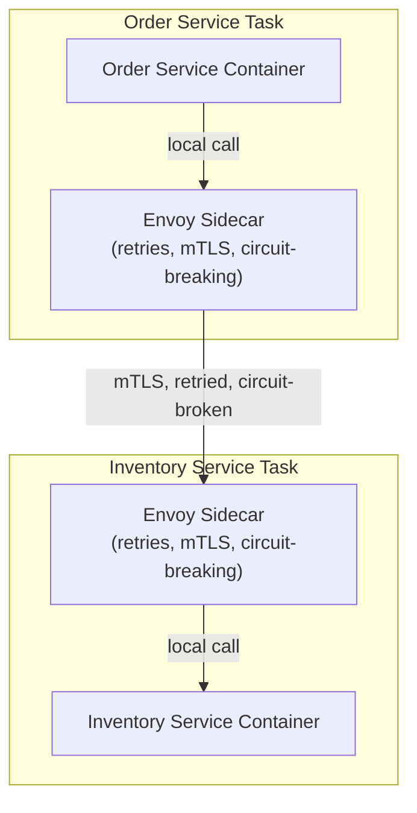
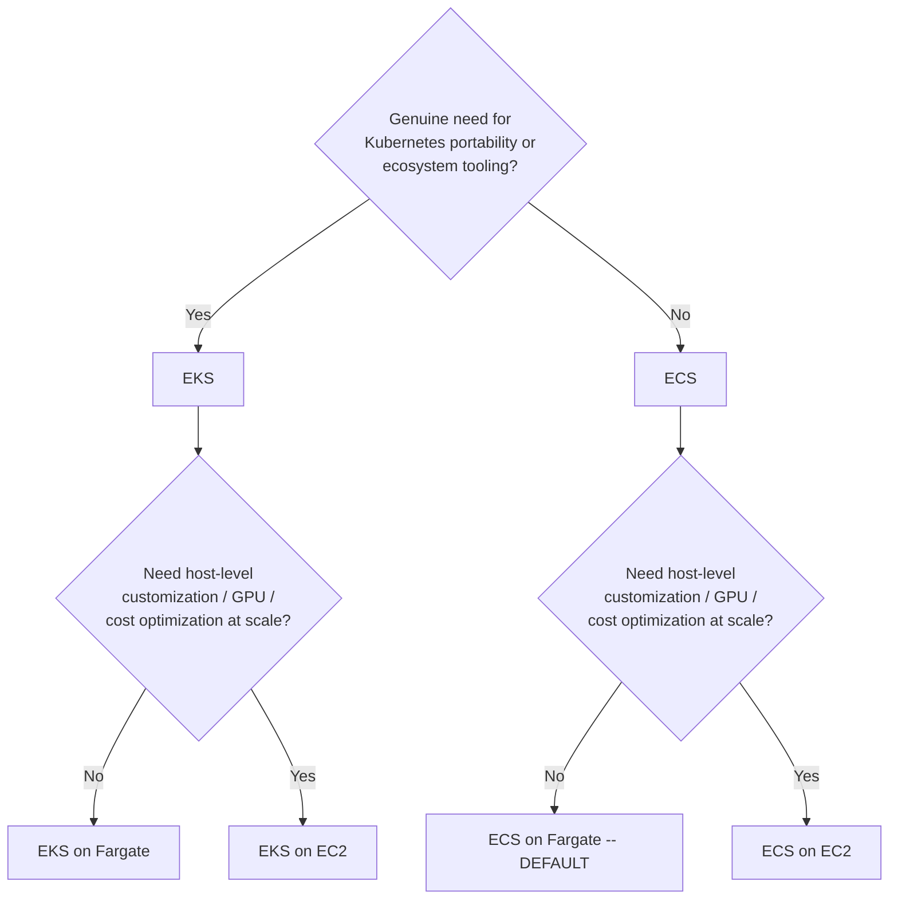

# Module 63 — AWS: Containers & Microservices — ECS, EKS, Fargate, App Mesh & Service Discovery

> Domain: AWS | Level: Beginner → Expert | Prerequisite: [[../17-Microservices/02-Resilience-Observability-Sidecar-Patterns]] (App Mesh is a concrete implementation of the sidecar/service-mesh pattern), [[../17-Microservices/01-Decomposition-Communication-Strangler-Fig]] (service decomposition principles now applied to container/cluster boundaries), [[06-Messaging-SQS-SNS-EventBridge-Kinesis]] §2.5 (the AWS-native-vs-self-managed decision framework recurs here for ECS-vs-EKS)

---

## 1. Fundamentals

### Why does a Principal Engineer need AWS container-orchestration depth beyond "we run our services in containers"?
Modules 49-51 established microservices decomposition, resilience patterns, and the sidecar model as *architectural* concepts — this module is where those concepts meet their concrete AWS runtime: a well-decomposed service boundary (Module 49) still needs an actual container-orchestration platform to schedule, network, scale, and observe it, and the specific platform choice (ECS vs. EKS) and configuration (task networking, service discovery, mesh sidecar injection) directly determines whether the architectural intent from Modules 49-51 is actually realized in production or silently undermined by a mismatched runtime configuration.

### Why does this matter?
Because container-orchestration misconfiguration is where many theoretically-sound microservices architectures fail in practice — a correctly-decomposed set of services deployed without proper health-check-driven deployment gating, without correct service-to-service networking, or onto a platform mismatched to the team's actual operational capacity, reproduces exactly the resilience and deployment-safety failures Module 51 already catalogued, now at the infrastructure layer rather than the application-design layer.

### When does this matter?
Any AWS-based microservices architecture that has moved past individual EC2 instances or pure-Lambda serverless (Module 61) toward container-based deployment — the dominant deployment model for most non-trivial microservices estates in current industry practice.

### How does it work (30,000-ft view)?
```
ECS: AWS's own, simpler container orchestrator -- tasks (one or more containers) run on
     either EC2 instances you manage, or Fargate (see below)
EKS: AWS's MANAGED Kubernetes -- full Kubernetes API/ecosystem compatibility, more powerful
     and more complex, for teams needing Kubernetes specifically
Fargate: SERVERLESS compute for containers -- no EC2 instances to manage at all, works with
     BOTH ECS and EKS as the underlying compute layer
App Mesh: AWS's service-mesh implementation -- sidecar proxies (Envoy) handling service-to-
     service traffic, observability, retries/circuit-breaking (Module 50's sidecar pattern)
```

---

## 2. Deep Dive

### 2.1 ECS vs. EKS — the AWS-Native-vs-Kubernetes Decision, Directly Analogous to Module 62's Messaging Framework
ECS is AWS's own container orchestrator: simpler operational model, tightly and natively integrated with other AWS services (IAM task roles, ALB target groups, CloudWatch), with no separate control-plane concept to learn beyond ECS's own task/service/cluster abstractions. EKS is managed Kubernetes: the full Kubernetes API, meaning genuine portability (the same manifests could, in principle, run on any Kubernetes distribution/cloud) and access to Kubernetes's much larger ecosystem (Helm charts, operators, the broader Kubernetes tooling world), at the cost of materially higher operational complexity (Kubernetes's own RBAC model, CRDs, networking model, and upgrade cadence, layered on top of AWS's own concepts) — this is structurally the exact same decision framework as Module 62 §2.5's AWS-native-vs-Kafka choice: **default to ECS** (the simpler, more tightly-integrated option) unless a specific, articulated requirement exists (genuine multi-cloud portability need, existing organizational Kubernetes investment/expertise, a specific Kubernetes-ecosystem tool the workload genuinely needs) that ECS cannot satisfy — choosing EKS "because Kubernetes is the industry standard" without this explicit requirement is the exact same over-engineering anti-pattern Module 62 §6 flagged for defaulting to Kafka.

### 2.2 Fargate — Serverless Containers, and Its Trade-offs
Fargate removes EC2 instance management entirely (no patching, no capacity planning, no bin-packing tasks onto instances yourself) — AWS provisions right-sized compute per task automatically — directly extending Module 61's serverless-compute philosophy (Lambda) to the container-orchestration layer: the same fundamental trade-off applies (pay-per-task rather than pay-for-idle-instance-capacity, at a typically higher per-unit compute cost than self-managed EC2-backed ECS/EKS, and with less control over the underlying host, e.g., no direct SSH access, no custom AMI/host-level agent installation). Fargate is the correct default for most workloads (removing an entire category of operational burden — the exact instance-fleet-management concerns Module 57 covered), reserved-EC2-backed ECS/EKS being the deliberate choice specifically when a workload needs host-level customization, has cost-optimization opportunities from savings plans/spot capacity at a scale where the operational overhead is worthwhile, or has specific compute requirements (GPU instances, particular instance-family characteristics) Fargate doesn't support.

### 2.3 Service Discovery — How Containers Find Each Other, Directly Implementing Module 49's Communication Patterns
Module 49 established that decomposed services need a reliable way to discover and communicate with each other's current, possibly-scaling, possibly-relocating instances — ECS Service Discovery (via AWS Cloud Map, integrating with Route 53 for DNS-based discovery) and Kubernetes's own built-in DNS-based service discovery (for EKS) both solve this concretely: as tasks/pods scale up, down, or are replaced (a deployment, a health-check failure triggering replacement), the service-discovery layer automatically updates so that dependent services always resolve the current, healthy set of endpoints — this is the AWS/Kubernetes-native implementation of what Module 49 discussed abstractly as "service communication shouldn't depend on hardcoded, static endpoint addresses," and a common, concrete failure mode is a service configured with a hardcoded IP or a stale, cached DNS resolution that doesn't correctly react to the underlying task churn.

### 2.4 App Mesh — the Concrete Sidecar/Service-Mesh Implementation
App Mesh deploys an Envoy proxy as a sidecar container alongside each task, intercepting all inbound/outbound traffic — directly Module 50 §8's sidecar-pattern discussion made concrete: retries, timeouts, circuit-breaking, and mutual TLS (mTLS) between services are configured centrally at the mesh layer and enforced by the sidecar proxy, **without requiring each individual service's own application code to implement this resilience/security logic itself** — this is the specific mechanism that makes Module 50's "resilience patterns shouldn't be reimplemented independently and inconsistently by every service" principle actually achievable in practice: a team can update a circuit-breaker threshold or enable mTLS mesh-wide via mesh configuration, without redeploying or modifying any individual service's code, a genuine, concrete operational advantage over each service independently implementing (and potentially inconsistently implementing) the same resilience logic in its own codebase.

### 2.5 Task/Pod Networking and IAM — Module 58's Least-Privilege Discipline at Container Granularity
ECS Task Roles (and EKS's IRSA — IAM Roles for Service Accounts) allow **each individual task/pod** to have its own distinct IAM role/permission set, rather than every container on a shared host inheriting the same broad EC2-instance-level IAM role — this is the direct, container-native resolution of exactly Module 58 §4's incident pattern (a shared, overly-broad role's blast radius spanning far more than any single compromised component actually needed): without task-level IAM roles, every container co-located on the same EC2 instance would share that instance's single IAM role, meaning a compromise of any one container inherits the full permission set of every other co-located container's needs combined — task/pod-level IAM roles are therefore not merely a convenience but a structural least-privilege requirement for any multi-tenant container platform running services with genuinely different permission needs on shared infrastructure.

### 2.6 Health Checks and Deployment Safety — Module 51's Canary/Rolling-Deployment Discipline at the Orchestrator Layer
ECS and Kubernetes both support rolling deployments gated by health checks (a new task/pod must pass its configured health check — directly Module 14/57 §4's readiness-check discipline — before traffic is shifted to it and before the old version is scaled down), and both support more sophisticated deployment strategies (ECS via CodeDeploy's blue/green and canary integration; Kubernetes via native rolling-update configuration or third-party tools like Argo Rollouts/Flagger for canary/progressive delivery) — this is the orchestrator-layer implementation of exactly Module 51's deployment-pattern discussion, and a Principal Engineer must verify the *specific* health check being used for deployment gating is a genuine readiness check (validating actual downstream dependency connectivity, not just process liveness), directly recurring Module 57 §4's liveness-vs-readiness lesson at the container-orchestration layer specifically.

---

## 3. Visual Architecture

### App Mesh Sidecar Intercepting Service-to-Service Traffic (§2.4)


### ECS-vs-EKS-vs-Fargate Decision Tree (§2.1, §2.2)


## 4. Production Example
**Scenario**: A platform migrated a fleet of microservices from individually-managed EC2 instances to ECS on Fargate, and — reusing the existing EC2-based deployment's single, shared IAM instance-profile role across all migrated services (the path of least resistance during migration, with an internal note to "split roles out properly later") — every ECS task in the cluster ran with the same broad task role, granting access to every downstream resource any of the services collectively needed. Several months later, a dependency-confusion vulnerability in one specific, low-privilege internal reporting service (which itself only ever needed read access to a single reporting database) was exploited. **Investigation**: because every task shared the same broad role, the compromised reporting service's credentials granted the attacker access not just to the reporting database, but to the payment-processing service's database credentials retrieval permission, several S3 buckets used by entirely unrelated services, and SQS queues used by the order-processing pipeline — an exact structural recurrence of Module 58 §4's original incident, this time at the container-task level rather than the EC2-instance level. **Root cause**: the migration prioritized "get everything running on the new platform quickly" over correctly adopting ECS's per-task IAM role capability (§2.5) — the team had the *correct* underlying mechanism available (task roles are a first-class ECS feature) but didn't use it, defaulting instead to the old EC2-instance-role mental model out of migration expediency, with the same "we'll fix it properly later" deferred-remediation pattern that Module 58 §4 already identified as unreliable. **Fix**: defined a distinct, narrowly-scoped task role per service (mirroring Module 58's per-service role discipline, now expressed via ECS's task-role mechanism specifically), and — recognizing that manual migration of every service's role was itself error-prone — added an automated check in the deployment pipeline that fails any task-definition deployment referencing the old shared role, forcing every service to have an explicitly-defined, reviewed, narrowly-scoped role before it can deploy. **Lesson**: migrating to a container platform that *supports* fine-grained, per-task least privilege doesn't automatically deliver that benefit — the platform capability must be deliberately adopted, and "we'll properly separate this during a follow-up" is, once again (recurring from Module 58 §4), an unreliable plan without a structural, pipeline-level enforcement mechanism forcing the correct configuration.

## 5. Best Practices
- Default to ECS over EKS absent a specific, articulated requirement (genuine multi-cloud portability, existing Kubernetes investment, a specific ecosystem tool) that ECS cannot satisfy (§2.1).
- Default to Fargate over EC2-backed ECS/EKS for most workloads, reserving EC2-backed compute for workloads with a specific host-customization, GPU, or cost-optimization-at-scale requirement (§2.2).
- Assign each service its own distinct, narrowly-scoped task role (ECS Task Roles / EKS IRSA) — never reuse a shared, broad role across multiple services on the same cluster, even during a migration "temporarily" (§4).
- Use App Mesh (or an equivalent service mesh) to centrally configure and enforce resilience patterns (retries, circuit-breaking, mTLS) rather than requiring every service to reimplement this logic independently in application code (§2.4).
- Verify that deployment-gating health checks used by the orchestrator are genuine readiness checks, not liveness-only checks, directly recurring Module 57 §4's lesson at the container-deployment layer.

## 6. Anti-patterns
- Reusing a shared, broad IAM role across multiple containerized services on a migrated platform "to move quickly," with only an informal intent to properly separate roles later (§4).
- Choosing EKS by default "because Kubernetes is the industry standard" without an explicit, articulated requirement ECS cannot satisfy, incurring unnecessary operational complexity (Module 62 §2.5's over-engineering pattern, recurring here).
- Hardcoding a service's dependency endpoint (an IP address, a static hostname) rather than relying on service discovery, causing silent staleness as the underlying tasks/pods scale or are replaced.
- Reimplementing retry/circuit-breaking/mTLS logic independently and inconsistently within each service's own application code rather than centralizing it at the mesh/sidecar layer.
- Using a liveness-only health check for orchestrator-driven deployment gating, allowing traffic to shift to a new task/pod before it's genuinely ready to serve correct responses (Module 57 §4's lesson, recurring at the container layer).

---

## 10. Interview Questions

### Basic (10)
1. **Q: What is the core difference between ECS and EKS?** **A:** ECS is AWS's own, simpler container orchestrator tightly integrated with AWS services; EKS is managed Kubernetes, offering the full Kubernetes API/ecosystem at higher operational complexity.
2. **Q: What does Fargate provide?** **A:** Serverless compute for containers — no EC2 instances to manage — usable as the compute layer under either ECS or EKS.
3. **Q: What is App Mesh?** **A:** AWS's service-mesh implementation, deploying Envoy sidecar proxies alongside each task to handle service-to-service traffic, retries, circuit-breaking, and mTLS.
4. **Q: What is an ECS Task Role?** **A:** An IAM role assignable to an individual ECS task, distinct from the underlying EC2 instance's own role, enabling per-service least privilege.
5. **Q: What AWS service commonly backs ECS Service Discovery?** **A:** AWS Cloud Map, integrating with Route 53 for DNS-based service discovery.
6. **Q: Why should a Principal Engineer default to ECS over EKS absent a specific requirement?** **A:** ECS is simpler and more tightly integrated with AWS natively, avoiding Kubernetes's materially higher operational complexity when that complexity isn't specifically justified.
7. **Q: What does a service mesh's sidecar proxy allow teams to avoid reimplementing in each service's own code?** **A:** Resilience and security logic — retries, timeouts, circuit-breaking, mutual TLS.
8. **Q: What is the EKS equivalent of ECS Task Roles?** **A:** IRSA (IAM Roles for Service Accounts).
9. **Q: What should be verified about a health check used for orchestrator-driven deployment gating?** **A:** That it is a genuine readiness check (validating actual dependency connectivity/warm-up), not just a liveness check.
10. **Q: What is a concrete performance lever for reducing Fargate task startup latency?** **A:** Minimizing container image size.

### Intermediate (10)
1. **Q: Why is choosing EKS "because Kubernetes is the industry standard" without a specific requirement described as the same anti-pattern as Module 62's default-to-Kafka mistake?** **A:** Both incur real, ongoing operational complexity (Kubernetes's RBAC/CRDs/networking model; Kafka's cluster/partition management) that Module 49's complexity-matching discipline warns against adopting without an explicit, unmet requirement simpler alternatives (ECS; SQS/SNS/EventBridge) cannot satisfy.
2. **Q: Why did the §4 incident recur despite ECS having task-level IAM roles available as a first-class feature?** **A:** Having the correct mechanism available doesn't guarantee its adoption — the migration defaulted to the old EC2-instance-role mental model out of expediency, and "properly separate roles later" proved to be the same unreliable, unenforced follow-up pattern already identified in Module 58 §4.
3. **Q: Why is service discovery described as the AWS/Kubernetes-native implementation of Module 49's abstract "don't hardcode dependency endpoints" principle?** **A:** As tasks/pods scale, fail, or are replaced, static IP/hostname configuration becomes stale; DNS-based service discovery automatically reflects the current, healthy endpoint set, directly realizing the architectural intent Module 49 described conceptually without a specific implementation mechanism.
4. **Q: Why does centrally configuring circuit-breaking at the App Mesh layer produce more consistent behavior than each service implementing its own circuit breaker?** **A:** Individual services implementing resilience logic independently risk inconsistent thresholds, inconsistent bug fixes, and drift over time as each codebase evolves separately; a mesh-level configuration is defined once and uniformly enforced by the sidecar across every participating service, eliminating this drift.
5. **Q: Why is task-level IAM role assignment described as a structural least-privilege requirement rather than merely a convenience, for a multi-tenant container platform?** **A:** Without it, every container co-located on the same host/instance would share that instance's single IAM role, meaning any one compromised container inherits the combined permission needs of every co-located service — exactly Module 58 §4's blast-radius risk, now unavoidable without task-level roles on shared infrastructure.
6. **Q: Why should a genuinely latency-critical service explicitly capacity-plan for App Mesh's sidecar overhead rather than assuming mesh adoption is free?** **A:** The sidecar introduces both an additional network hop's latency and consumes CPU/memory within the same task allocation as the application container itself, meaning both latency budget and resource sizing must account for it explicitly, not as an afterthought.
7. **Q: Why might a workload migrating from EC2-backed ECS/EKS to Fargate need to re-verify its scaling capacity assumptions?** **A:** Fargate has its own per-Region concurrent-task-count considerations distinct from EC2-backed instance/ASG capacity limits — assuming quota parity between the two compute models without re-verification risks hitting an unanticipated Fargate-specific ceiling.
8. **Q: Why is minimizing container image size described as directly analogous to Module 61's Lambda-package-size performance lesson?** **A:** Both directly affect the time a newly-provisioned compute unit (a Fargate task, a Lambda execution environment) takes to become ready to serve traffic — a larger image/package means longer download/initialization time before the unit can pass its readiness check and begin serving requests.
9. **Q: Why does App Mesh's mTLS capability reduce the risk of per-service TLS misconfiguration compared to each service implementing TLS independently?** **A:** Certificate management and TLS enforcement are handled centrally by the sidecar proxy according to mesh-wide configuration, removing the need (and the opportunity for inconsistent or incorrect implementation) for each individual service's own codebase to correctly implement certificate handling and TLS negotiation itself.
10. **Q: Why is network-level segmentation (security groups, Kubernetes NetworkPolicies) still necessary alongside task-level IAM roles rather than redundant with them?** **A:** IAM controls what actions an authenticated identity can take against AWS APIs; network segmentation controls which network paths/connections are even reachable in the first place — these are independent control axes (Module 57 §8's principle), and a compromised task with an overly-permissive network path could still reach unintended internal services even with a correctly-scoped IAM role.

### Advanced (10)
1. **Q: Diagnose the §4 incident from first principles, and design the specific automated migration-safety check that would have prevented the shared-role anti-pattern from persisting past the initial migration, independent of any team's follow-up diligence.**
   **A:** Root cause: migration expediency defaulted to a shared role, with only an informal intent to properly separate roles later — the exact unenforced-follow-up pattern from Module 58 §4. Structural fix: a deployment-pipeline gate that inspects every ECS task definition being deployed and fails the deployment if its task role ARN matches a designated "legacy/shared" role or lacks an explicitly-reviewed, service-specific role — converting reliance on individual follow-through into a non-bypassable check, directly the same automated-governance pattern Module 58 §Advanced Q1 established for IAM policy linting, now applied to container task-role assignment specifically.
2. **Q: A team argues that since Fargate removes all EC2 instance management, they no longer need any capacity-planning discipline for their container workloads. Evaluate this claim.**
   **A:** Push back — Fargate removes *instance-level* capacity planning (patching, bin-packing, instance-type selection) specifically, but per-task CPU/memory allocation still requires deliberate sizing against actual workload needs (an under-provisioned task's CPU/memory allocation still causes real performance problems, Fargate or not), and account-level Fargate concurrent-task quotas (§9) still require the same proactive-quota-verification discipline Module 57 §9 established generally — "serverless" relocates operational concerns (as Module 61 §1 established for Lambda) rather than eliminating them entirely; task-level resource sizing and quota awareness remain the architect's responsibility.
3. **Q: Design the specific pre-production validation practice that would catch a service relying on a hardcoded dependency endpoint (rather than service discovery) before it causes a production incident during a routine deployment/scaling event.**
   **A:** A pre-production test that deliberately forces a dependency service's task/pod to be replaced (a rolling deployment, or a manually-triggered task replacement) while the dependent service is under active load, verifying the dependent service continues functioning correctly throughout — a service relying on a hardcoded or stale-cached endpoint would fail specifically during this window (when the underlying IP genuinely changes), a failure invisible under steady-state testing where the dependency's endpoint happens to remain constant throughout the test's duration, the same "steady-state testing doesn't exercise the failure-triggering condition" pattern recurring throughout this AWS domain (Module 57 §Advanced Q1, Module 60 §Advanced Q3).
4. **Q: A workload currently on ECS is evaluating a migration to EKS because a new internal platform team has decided to standardize on Kubernetes across the organization for portability reasons, even though the specific workload has no near-term multi-cloud requirement. Evaluate this organizational decision as a Principal Engineer, distinguishing the individual-workload-level and organizational-level considerations.**
   **A:** At the individual-workload level, per §2.1's framework, this specific workload's migration is not independently justified (no articulated requirement ECS can't satisfy) and would add operational complexity without workload-specific benefit — but at the *organizational* level, a genuine, broad standardization decision (consistent tooling, shared platform-team expertise, consistent CI/CD across all workloads, an actual current or near-term multi-cloud strategy) can be a legitimate reason even for an individual workload that wouldn't independently justify EKS, since the amortized organizational benefit (one platform to operate and staff for expertise, rather than two) can outweigh that single workload's added complexity — the Principal Engineer's role is to make sure this organizational trade-off is explicit and deliberately reasoned through (with a real, articulated organizational benefit, not "Kubernetes is the standard" as an unexamined assumption), not to block it reflexively, nor to accept it uncritically.
5. **Q: Critique the following claim: "Since our App Mesh configuration enforces mTLS between all our services, we no longer need to worry about IAM permission scoping for those services."**
   **A:** These are entirely independent control layers addressing different threats — mTLS ensures the *transport* between two services is authenticated and encrypted (preventing eavesdropping or impersonation of one service by another on the network), but says nothing about what actions a *compromised, legitimately-authenticated* service is permitted to take against AWS APIs (S3, DynamoDB, other services) — that's exactly what task-level IAM roles (§2.5) govern, and the §4 incident's blast radius was entirely an IAM-scoping failure, not a transport-security failure — mTLS and IAM least privilege are complementary, not substitutable, defense-in-depth layers.
6. **Q: Design a canary deployment strategy for an ECS service using health-check-gated traffic shifting, explicitly avoiding Module 57 §4's liveness-vs-readiness health-check trap at the container-orchestration layer.**
   **A:** Configure the ECS service's deployment (via CodeDeploy blue/green) to gate traffic shifting on a target-group health check hitting a genuine readiness endpoint (verifying downstream dependency connectivity and any in-process warm-up completion, exactly Module 57 §4's `/ready` fix, now at the container layer) rather than a liveness-only endpoint, with a canary traffic percentage (e.g., 10%) held for an observation period with automated rollback triggered by CloudWatch alarms on the canary's error rate/latency before progressively shifting the remaining traffic — directly Module 51's canary-deployment discipline, now expressed via ECS/CodeDeploy's native mechanisms.
7. **Q: A Principal Engineer discovers that a security-sensitive service's App Mesh sidecar was silently misconfigured (an outdated mesh configuration disabled mTLS enforcement for that specific service several weeks ago) without any deployment or alert flagging the change. Design the standing safeguard that would have caught this.**
   **A:** Implement continuous, automated compliance scanning of the mesh's actual live configuration (not just its intended/deployed configuration) against a required-baseline policy (e.g., "every service in this mesh must have mTLS enforcement enabled"), alerting on any drift — the same "convert an easy-to-accumulate, invisible-until-exploited risk into a standing, automated governance check" pattern Module 56 §Advanced Q6 and Module 58 §Advanced Q1 already established, now applied to service-mesh security-policy drift specifically, since a silent configuration regression is otherwise indistinguishable from correctly-functioning mTLS until an actual security review or incident surfaces it.
8. **Q: Explain why "our services run in containers on ECS" does not, by itself, address the resilience patterns Module 50 established (circuit breaking, bulkheading, graceful degradation), and identify what additional deliberate step is required.**
   **A:** Containerization and orchestration solve deployment, scaling, and scheduling concerns — they say nothing about whether a service correctly handles a downstream dependency's failure gracefully; Module 50's resilience patterns must still be deliberately implemented, either in each service's own application code or (per §2.4's stronger recommendation) centralized at the App Mesh sidecar layer — "containerized" and "resilient" are orthogonal properties, and assuming the former implies the latter is a category error a Principal Engineer must explicitly correct in any architecture review.
9. **Q: Design the specific approach for right-sizing Fargate task CPU/memory allocation for a service with genuinely variable load, avoiding both under-provisioning (performance degradation) and over-provisioning (unnecessary cost) without manually re-tuning allocation for every workload change.**
   **A:** Combine Fargate's per-task allocation with ECS Service Auto Scaling (scaling the *number* of tasks based on aggregate CPU/memory/custom-metric utilization, directly Module 57 §2.5's ASG-equivalent concept at the task level) rather than attempting to size a single task's allocation for peak load — right-size the *individual task's* CPU/memory allocation based on the workload's steady-state, per-request resource consumption (measured via load testing, not guessed), and let task-count auto-scaling absorb demand variability, the same separation-of-concerns between "per-unit sizing" and "unit-count elasticity" this course has applied consistently since Module 57.
10. **Q: As a Principal Engineer establishing container-platform standards for an organization, design the specific set of standing architectural reviews and automated checks (synthesizing this entire module) you would require for every new containerized service.**
    **A:** (1) Mandatory automated task-role/IRSA review blocking any deployment referencing a shared or legacy role without an explicitly-reviewed, service-specific role (Advanced Q1) — necessary because migration expediency reliably reintroduces the shared-role anti-pattern without a structural gate. (2) Mandatory readiness-based (not liveness-only) health-check verification for every orchestrator-gated deployment (Advanced Q6) — necessary because this specific gap is invisible until an actual deployment/scaling event exposes it. (3) Mandatory service-discovery-only dependency resolution, with an automated check flagging any hardcoded endpoint configuration (Advanced Q3) — necessary because this failure mode is invisible under steady-state testing. (4) Mandatory continuous mesh-configuration compliance scanning against a required security baseline (mTLS enforcement, Advanced Q7) — necessary because configuration drift is otherwise silent until exploited or audited. (5) Mandatory, explicit justification review before choosing EKS over ECS for any individual workload absent an organization-wide standardization decision (Advanced Q4) — necessary to prevent unexamined complexity adoption. Each standard targets a distinct, concrete failure mode this module identified, extending the governance-gate pattern from Modules 57-62 into the container-orchestration layer specifically.

---

## 11. Coding Exercises

### Easy — ECS task definition with a dedicated, narrowly-scoped task role (§2.5, §4's fix)
```json
{
  "family": "reporting-service",
  "taskRoleArn": "arn:aws:iam::222222222222:role/reporting-service-task-role",
  "executionRoleArn": "arn:aws:iam::222222222222:role/ecs-task-execution-role",
  "containerDefinitions": [
    {
      "name": "reporting-service",
      "image": "222222222222.dkr.ecr.us-east-1.amazonaws.com/reporting-service:latest",
      "healthCheck": {
        "command": ["CMD-SHELL", "curl -f http://localhost:8080/ready || exit 1"],
        "interval": 10, "timeout": 5, "retries": 3
      }
    }
  ],
  "requiresCompatibilities": ["FARGATE"],
  "cpu": "512", "memory": "1024"
}
```
```json
// reporting-service-task-role's policy -- SCOPED to exactly what reporting needs (§4's fix),
// NOT the broad shared role every migrated service originally used.
{
  "Version": "2012-10-17",
  "Statement": [
    { "Effect": "Allow", "Action": ["rds-db:connect"], "Resource": "arn:aws:rds-db:*:*:dbuser:reporting-db/*" }
  ]
}
```

### Medium — ECS Service Discovery configuration (§2.3)
```hcl
resource "aws_service_discovery_service" "inventory" {
  name = "inventory-service"
  dns_config {
    namespace_id = aws_service_discovery_private_dns_namespace.internal.id
    dns_records { type = "A"; ttl = 10 }   # short TTL -- reflects task churn promptly (§2.3, §Advanced Q3)
  }
  health_check_custom_config { failure_threshold = 1 }
}

resource "aws_ecs_service" "inventory" {
  name    = "inventory-service"
  cluster = aws_ecs_cluster.main.id
  service_registries {
    registry_arn = aws_service_discovery_service.inventory.arn
  }
  # Dependent services resolve "inventory-service.internal" -- NEVER a hardcoded task IP.
}
```

### Hard — App Mesh virtual node with retry policy (§2.4)
```yaml
apiVersion: appmesh.k8s.aws/v1beta2
kind: VirtualNode
metadata:
  name: inventory-service
spec:
  listeners:
    - portMapping: { port: 8080, protocol: http }
      timeout: { perRequest: { unit: ms, value: 2000 } }
  serviceDiscovery:
    dns: { hostname: inventory-service.internal }
  backends:
    - virtualService:
        virtualServiceRef: { name: payment-service }
  # Retry policy defined ONCE, at the mesh layer -- every consumer of inventory-service
  # inherits it automatically, no per-consumer application code needed (§2.4).
  connectionPool:
    http: { maxConnections: 100, maxPendingRequests: 50 }
```

### Expert — Fargate task with App Mesh sidecar and per-task IAM role, combined (§2.4, §2.5, §Advanced Q8)
```hcl
resource "aws_ecs_task_definition" "checkout" {
  family                   = "checkout-service"
  requires_compatibilities = ["FARGATE"]
  network_mode             = "awsvpc"
  task_role_arn            = aws_iam_role.checkout_task_role.arn   # NARROWLY scoped (§2.5)

  proxy_configuration {
    type           = "APPMESH"
    container_name = "envoy"   # sidecar intercepts ALL traffic (§2.4) -- resilience is
                                 # MESH-configured, not reimplemented in checkout's own code
  }

  container_definitions = jsonencode([
    { name = "checkout-service", image = "...checkout:latest", essential = true },
    {
      name  = "envoy"
      image = "public.ecr.aws/appmesh/aws-appmesh-envoy:latest"
      user  = "1337"
      environment = [{ name = "APPMESH_RESOURCE_ARN", value = aws_appmesh_virtual_node.checkout.arn }]
    }
  ])
}
```
**Discussion**: combining a narrowly-scoped task role with mesh-enforced mTLS/retries in a single task definition directly demonstrates Advanced Q5's point that these are complementary, not substitutable layers — the task role governs what `checkout-service` can do against AWS APIs if compromised; the mesh sidecar governs how it communicates with other services on the network — both configured explicitly, neither assumed to cover the other's concern.

---

## 12–17. System Design / LLD / Debugging / Decision / Case Study / Principal

*(§4's incident, the four §11 exercises, and the Advanced-tier Q&A — especially Advanced Q1's automated task-role migration-safety gate, Advanced Q4's organizational-vs-workload EKS decision framework, and Advanced Q10's synthesized governance checklist — collectively constitute this module's system-design, debugging, and Principal-Engineer-level content.)*

## 18. Revision
**Key takeaways**: ECS vs. EKS is the container-platform expression of the same AWS-native-vs-more-capable-but-complex decision framework Module 62 established for messaging — default to the simpler option (ECS) absent an articulated requirement. Fargate extends Module 61's serverless philosophy to containers, relocating operational concerns (task sizing, quota awareness) rather than eliminating them. Task-level IAM roles are a structural least-privilege requirement, not a convenience, for any multi-tenant container platform — and, as §4 demonstrates, having the capability available doesn't guarantee its adoption without a structural, pipeline-level enforcement gate, the same unreliable-manual-follow-up lesson recurring from Module 58 §4. Service discovery is the concrete implementation of Module 49's "don't hardcode dependency endpoints" principle. App Mesh centralizes Module 50's resilience patterns and mTLS at the sidecar layer, avoiding inconsistent per-service reimplementation — but mesh-layer transport security and IAM-layer permission scoping remain independent, both-necessary defense-in-depth axes. Orchestrator-driven deployment gating must use genuine readiness checks, directly recurring Module 57 §4's liveness-vs-readiness lesson at the container-deployment layer.

---

**Next**: Continuing to Module 64 — AWS: Observability, Cost & the Well-Architected Framework (CloudWatch, X-Ray, cost optimization, multi-region/DR), completing the `21-AWS` domain (Modules 57–64).
