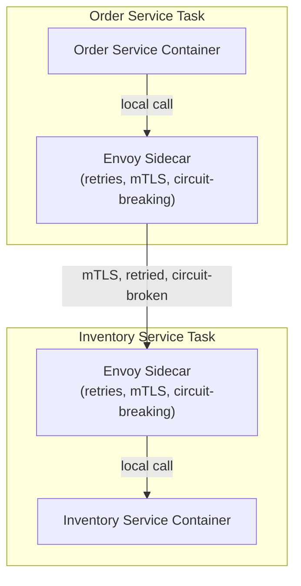
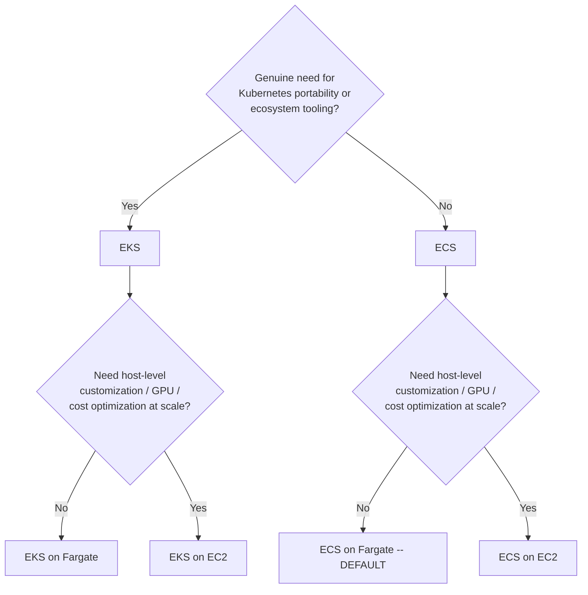
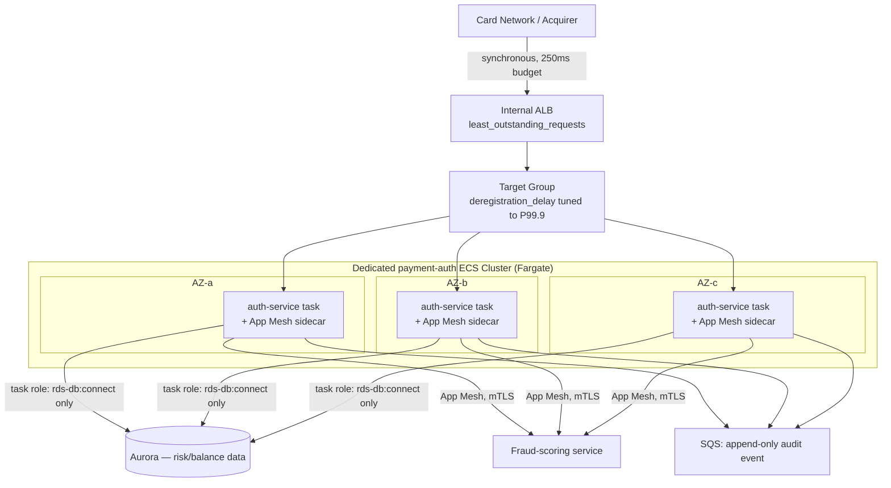
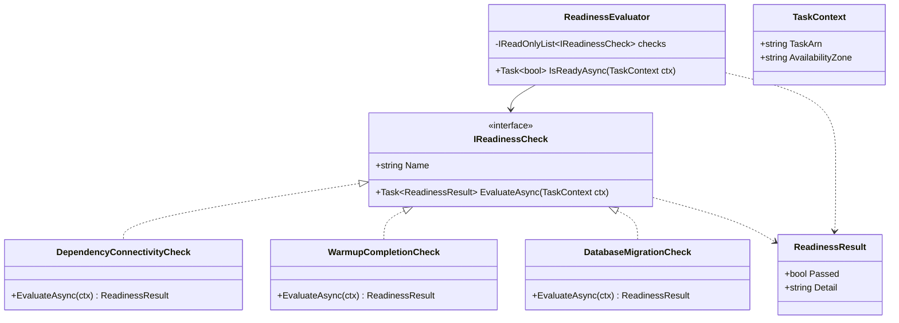
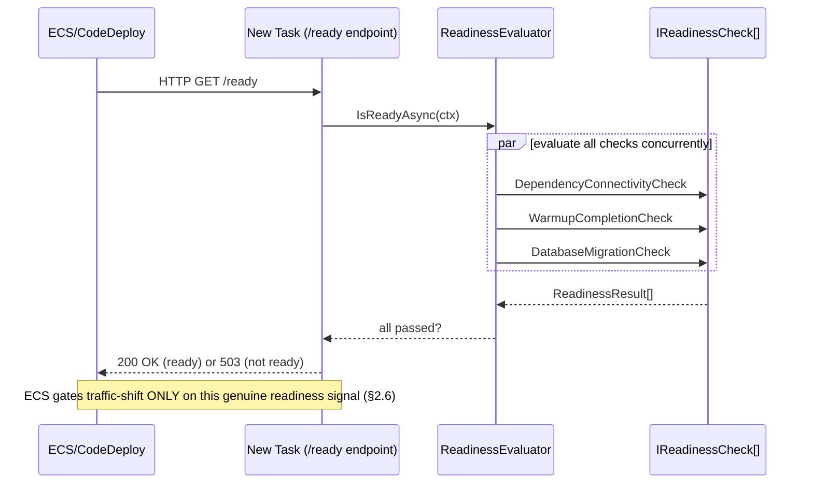

# Module 63 — AWS: Containers & Microservices — ECS, EKS, Fargate, App Mesh & Service Discovery

> Domain: AWS | Level: Beginner → Expert | Prerequisite: [[../17-Microservices/02-Resilience-Observability-Sidecar-Patterns]] (App Mesh is a concrete implementation of the sidecar/service-mesh pattern), [[../17-Microservices/01-Decomposition-Communication-Strangler-Fig]] (service decomposition principles now applied to container/cluster boundaries), [[06-Messaging-SQS-SNS-EventBridge-Kinesis]] (the AWS-native-vs-self-managed decision framework recurs here for ECS-vs-EKS)

---

## 1. Fundamentals

### Why does a Principal Engineer need AWS container-orchestration depth beyond "we run our services in containers"?
Modules 49-51 established microservices decomposition, resilience patterns, and the sidecar model as *architectural* concepts — this module is where those concepts meet their concrete AWS runtime: a well-decomposed service boundary still needs an actual container-orchestration platform to schedule, network, scale, and observe it, and the specific platform choice (ECS vs. EKS) and configuration (task networking, service discovery, mesh sidecar injection) directly determines whether the architectural intent from Modules 49-51 is actually realized in production or silently undermined by a mismatched runtime configuration.

### Why does this matter?
Because container-orchestration misconfiguration is where many theoretically-sound microservices architectures fail in practice — a correctly-decomposed set of services deployed without proper health-check-driven deployment gating, without correct service-to-service networking, or onto a platform mismatched to the team's actual operational capacity, reproduces exactly the resilience and deployment-safety failures already catalogued, now at the infrastructure layer rather than the application-design layer.

### When does this matter?
Any AWS-based microservices architecture that has moved past individual EC2 instances or pure-Lambda serverless toward container-based deployment — the dominant deployment model for most non-trivial microservices estates in current industry practice.

### How does it work (30,000-ft view)?
```
ECS: AWS's own, simpler container orchestrator -- tasks (one or more containers) run on
 either EC2 instances you manage, or Fargate (see below)
EKS: AWS's MANAGED Kubernetes -- full Kubernetes API/ecosystem compatibility, more powerful
 and more complex, for teams needing Kubernetes specifically
Fargate: SERVERLESS compute for containers -- no EC2 instances to manage at all, works with
 BOTH ECS and EKS as the underlying compute layer
App Mesh: AWS's service-mesh implementation -- sidecar proxies (Envoy) handling service-to-
 service traffic, observability, retries/circuit-breaking (the sidecar pattern)
```

---

## 2. Deep Dive

### 2.1 ECS vs. EKS — the AWS-Native-vs-Kubernetes Decision, Directly Analogous to the Messaging Framework
ECS is AWS's own container orchestrator: simpler operational model, tightly and natively integrated with other AWS services (IAM task roles, ALB target groups, CloudWatch), with no separate control-plane concept to learn beyond ECS's own task/service/cluster abstractions. EKS is managed Kubernetes: the full Kubernetes API, meaning genuine portability (the same manifests could, in principle, run on any Kubernetes distribution/cloud) and access to Kubernetes's much larger ecosystem (Helm charts, operators, the broader Kubernetes tooling world), at the cost of materially higher operational complexity (Kubernetes's own RBAC model, CRDs, networking model, and upgrade cadence, layered on top of AWS's own concepts) — this is structurally the exact same decision framework as the AWS-native-vs-Kafka choice: **default to ECS** (the simpler, more tightly-integrated option) unless a specific, articulated requirement exists (genuine multi-cloud portability need, existing organizational Kubernetes investment/expertise, a specific Kubernetes-ecosystem tool the workload genuinely needs) that ECS cannot satisfy — choosing EKS "because Kubernetes is the industry standard" without this explicit requirement is the exact same over-engineering anti-pattern flagged for defaulting to Kafka.

### 2.2 Fargate — Serverless Containers, and Its Trade-offs
Fargate removes EC2 instance management entirely (no patching, no capacity planning, no bin-packing tasks onto instances yourself) — AWS provisions right-sized compute per task automatically — directly extending the serverless-compute philosophy (Lambda) to the container-orchestration layer: the same fundamental trade-off applies (pay-per-task rather than pay-for-idle-instance-capacity, at a typically higher per-unit compute cost than self-managed EC2-backed ECS/EKS, and with less control over the underlying host, e.g., no direct SSH access, no custom AMI/host-level agent installation). Fargate is the correct default for most workloads (removing an entire category of operational burden — the exact instance-fleet-management concerns covered), reserved-EC2-backed ECS/EKS being the deliberate choice specifically when a workload needs host-level customization, has cost-optimization opportunities from savings plans/spot capacity at a scale where the operational overhead is worthwhile, or has specific compute requirements (GPU instances, particular instance-family characteristics) Fargate doesn't support.

### 2.3 Service Discovery — How Containers Find Each Other, Directly Implementing the Communication Patterns
Earlier analysis established that decomposed services need a reliable way to discover and communicate with each other's current, possibly-scaling, possibly-relocating instances — ECS Service Discovery (via AWS Cloud Map, integrating with Route 53 for DNS-based discovery) and Kubernetes's own built-in DNS-based service discovery (for EKS) both solve this concretely: as tasks/pods scale up, down, or are replaced (a deployment, a health-check failure triggering replacement), the service-discovery layer automatically updates so that dependent services always resolve the current, healthy set of endpoints — this is the AWS/Kubernetes-native implementation of what discussed abstractly as "service communication shouldn't depend on hardcoded, static endpoint addresses," and a common, concrete failure mode is a service configured with a hardcoded IP or a stale, cached DNS resolution that doesn't correctly react to the underlying task churn.

### 2.4 App Mesh — the Concrete Sidecar/Service-Mesh Implementation
App Mesh deploys an Envoy proxy as a sidecar container alongside each task, intercepting all inbound/outbound traffic — directly the sidecar-pattern discussion made concrete: retries, timeouts, circuit-breaking, and mutual TLS (mTLS) between services are configured centrally at the mesh layer and enforced by the sidecar proxy, **without requiring each individual service's own application code to implement this resilience/security logic itself** — this is the specific mechanism that makes the "resilience patterns shouldn't be reimplemented independently and inconsistently by every service" principle actually achievable in practice: a team can update a circuit-breaker threshold or enable mTLS mesh-wide via mesh configuration, without redeploying or modifying any individual service's code, a genuine, concrete operational advantage over each service independently implementing (and potentially inconsistently implementing) the same resilience logic in its own codebase.

### 2.5 Task/Pod Networking and IAM — the Least-Privilege Discipline at Container Granularity
ECS Task Roles (and EKS's IRSA — IAM Roles for Service Accounts) allow **each individual task/pod** to have its own distinct IAM role/permission set, rather than every container on a shared host inheriting the same broad EC2-instance-level IAM role — this is the direct, container-native resolution of exactly the incident pattern (a shared, overly-broad role's blast radius spanning far more than any single compromised component actually needed): without task-level IAM roles, every container co-located on the same EC2 instance would share that instance's single IAM role, meaning a compromise of any one container inherits the full permission set of every other co-located container's needs combined — task/pod-level IAM roles are therefore not merely a convenience but a structural least-privilege requirement for any multi-tenant container platform running services with genuinely different permission needs on shared infrastructure.

### 2.6 Health Checks and Deployment Safety — the Canary/Rolling-Deployment Discipline at the Orchestrator Layer
ECS and Kubernetes both support rolling deployments gated by health checks (a new task/pod must pass its configured health check — directly/57 the readiness-check discipline — before traffic is shifted to it and before the old version is scaled down), and both support more sophisticated deployment strategies (ECS via CodeDeploy's blue/green and canary integration; Kubernetes via native rolling-update configuration or third-party tools like Argo Rollouts/Flagger for canary/progressive delivery) — this is the orchestrator-layer implementation of exactly the deployment-pattern discussion, and a Principal Engineer must verify the *specific* health check being used for deployment gating is a genuine readiness check (validating actual downstream dependency connectivity, not just process liveness), directly recurring the liveness-vs-readiness lesson at the container-orchestration layer specifically.

---

## 3. Visual Architecture

### App Mesh Sidecar Intercepting Service-to-Service Traffic

```mermaid
graph TB
 subgraph "Order Service Task"
 OrderApp[Order Service Container]
 OrderSidecar["Envoy Sidecar<br/>(retries, mTLS, circuit-breaking)"]
 end
 subgraph "Inventory Service Task"
 InvSidecar["Envoy Sidecar<br/>(retries, mTLS, circuit-breaking)"]
 InvApp[Inventory Service Container]
 end
 OrderApp -->|"local call"| OrderSidecar
 OrderSidecar -->|"mTLS, retried, circuit-broken"| InvSidecar
 InvSidecar -->|"local call"| InvApp
```

### ECS-vs-EKS-vs-Fargate Decision Tree

```mermaid
graph TD
 Start{Genuine need for<br/>Kubernetes portability or<br/>ecosystem tooling?}
 Start -->|Yes| EKS[EKS]
 Start -->|No| ECS[ECS]
 EKS --> FargateQ1{Need host-level<br/>customization / GPU /<br/>cost optimization at scale?}
 ECS --> FargateQ2{Need host-level<br/>customization / GPU /<br/>cost optimization at scale?}
 FargateQ1 -->|No| FargateEKS[EKS on Fargate]
 FargateQ1 -->|Yes| EC2EKS[EKS on EC2]
 FargateQ2 -->|No| FargateECS[ECS on Fargate -- DEFAULT]
 FargateQ2 -->|Yes| EC2ECS[ECS on EC2]
```

## 4. Production Example
**Scenario**: A platform migrated a fleet of microservices from individually-managed EC2 instances to ECS on Fargate, and — reusing the existing EC2-based deployment's single, shared IAM instance-profile role across all migrated services (the path of least resistance during migration, with an internal note to "split roles out properly later") — every ECS task in the cluster ran with the same broad task role, granting access to every downstream resource any of the services collectively needed. Several months later, a dependency-confusion vulnerability in one specific, low-privilege internal reporting service (which itself only ever needed read access to a single reporting database) was exploited. **Investigation**: because every task shared the same broad role, the compromised reporting service's credentials granted the attacker access not just to the reporting database, but to the payment-processing service's database credentials retrieval permission, several S3 buckets used by entirely unrelated services, and SQS queues used by the order-processing pipeline — an exact structural recurrence of the original incident, this time at the container-task level rather than the EC2-instance level. **Root cause**: the migration prioritized "get everything running on the new platform quickly" over correctly adopting ECS's per-task IAM role capability — the team had the *correct* underlying mechanism available (task roles are a first-class ECS feature) but didn't use it, defaulting instead to the old EC2-instance-role mental model out of migration expediency, with the same "we'll fix it properly later" deferred-remediation pattern that already identified as unreliable. **Fix**: defined a distinct, narrowly-scoped task role per service (mirroring the per-service role discipline, now expressed via ECS's task-role mechanism specifically), and — recognizing that manual migration of every service's role was itself error-prone — added an automated check in the deployment pipeline that fails any task-definition deployment referencing the old shared role, forcing every service to have an explicitly-defined, reviewed, narrowly-scoped role before it can deploy. **Lesson**: migrating to a container platform that *supports* fine-grained, per-task least privilege doesn't automatically deliver that benefit — the platform capability must be deliberately adopted, and "we'll properly separate this during a follow-up" is, once again (recurring), an unreliable plan without a structural, pipeline-level enforcement mechanism forcing the correct configuration.

## 5. Best Practices
- Default to ECS over EKS absent a specific, articulated requirement (genuine multi-cloud portability, existing Kubernetes investment, a specific ecosystem tool) that ECS cannot satisfy.
- Default to Fargate over EC2-backed ECS/EKS for most workloads, reserving EC2-backed compute for workloads with a specific host-customization, GPU, or cost-optimization-at-scale requirement.
- Assign each service its own distinct, narrowly-scoped task role (ECS Task Roles / EKS IRSA) — never reuse a shared, broad role across multiple services on the same cluster, even during a migration "temporarily".
- Use App Mesh (or an equivalent service mesh) to centrally configure and enforce resilience patterns (retries, circuit-breaking, mTLS) rather than requiring every service to reimplement this logic independently in application code.
- Verify that deployment-gating health checks used by the orchestrator are genuine readiness checks, not liveness-only checks, directly recurring the lesson at the container-deployment layer.

## 6. Anti-patterns
- Reusing a shared, broad IAM role across multiple containerized services on a migrated platform "to move quickly," with only an informal intent to properly separate roles later.
- Choosing EKS by default "because Kubernetes is the industry standard" without an explicit, articulated requirement ECS cannot satisfy, incurring unnecessary operational complexity (the over-engineering pattern, recurring here).
- Hardcoding a service's dependency endpoint (an IP address, a static hostname) rather than relying on service discovery, causing silent staleness as the underlying tasks/pods scale or are replaced.
- Reimplementing retry/circuit-breaking/mTLS logic independently and inconsistently within each service's own application code rather than centralizing it at the mesh/sidecar layer.
- Using a liveness-only health check for orchestrator-driven deployment gating, allowing traffic to shift to a new task/pod before it's genuinely ready to serve correct responses (the lesson, recurring at the container layer).

---

## 7. Performance Engineering

### 7.1 Task placement and the cold-start cost the orchestrator hides from you
On EC2-backed ECS/EKS, the scheduler bin-packs tasks/pods onto existing warm instances when capacity allows — placement is typically sub-second because no new compute is being provisioned. On Fargate, every task is a **fresh microVM**: AWS provisions Firecracker-backed compute per task with no warm pool a given account can rely on, so a scale-out event pays a real, measurable cold-start tax — typically **20-40 seconds** from `RunTask` to the container's `ENTRYPOINT` executing, dominated by (in order of typical contribution) image pull, network attachment (ENI provisioning for `awsvpc` mode), and the container runtime's own startup. A payments platform that scales a checkout service reactively off an ALB `RequestCountPerTarget` alarm during a flash-sale traffic spike will see that 20-40 second gap materialize as elevated P99 latency and a burst of `503`s from the ALB (no healthy targets yet) for the full duration — the fix is never "make Fargate start faster" (you don't control that), it's shifting the response earlier: scaling on a **leading indicator** (SQS queue depth, a scheduled pre-scale ahead of a known market-open/settlement-window event, or step/target-tracking scaling with an aggressive `scaleOutCooldown` of near-zero) rather than a lagging one.

### 7.2 Image size is the single largest lever on that cold-start number
Because Fargate has no per-account warm image cache, the *entire* image is pulled from ECR on every single task launch — this is the direct, container-layer expression of the Lambda-package-size lesson (§Intermediate Q8), just paid on every task rather than only on a cold Lambda invocation. Concretely: a naive `mcr.microsoft.com/dotnet/sdk`-based image carrying build tooling into production can run 800MB-1.2GB; a multi-stage build finishing `FROM mcr.microsoft.com/dotnet/aspnet:8.0-alpine` with only published output typically lands 90-150MB — a 5-8x reduction in pull time, which at typical ECR-pull throughput within the same Region directly removes several seconds to tens of seconds from the cold-start budget in §7.1. **Seekable OCI (SOCI) indexing** (lazy-loads only the image layers actually needed to start the container, streaming the rest in the background) is the complementary mitigation for images that genuinely can't be shrunk further, and is a standing recommendation for any Fargate-backed service with a tight scale-out latency SLO.

### 7.3 Fargate vCPU/memory-ratio tuning — the allocation is a discrete menu, not a continuous dial
Fargate task sizing is not "pick any CPU/memory combination" — it's a fixed menu of valid `(cpu, memory)` pairs (e.g., 0.25 vCPU pairs only with 512MB-2GB; 1 vCPU pairs with 2-8GB in 1GB increments; 4 vCPU pairs with 8-30GB in 1GB increments), and picking a pair mismatched to the workload's actual CPU:memory consumption ratio wastes money on whichever dimension is over-provisioned relative to the other. A JSON-heavy reconciliation service that's genuinely CPU-bound (parsing/transforming large settlement files) but sized at the 1 vCPU / 8GB ceiling to get "more memory headroom" is paying for 6GB of consistently-idle memory; conversely, an in-memory risk-calculation service genuinely memory-bound but capped at a low vCPU/memory pairing will see CPU throttling well before it needs more compute. The correct sizing discipline: load-test the actual per-request CPU and memory consumption at the target throughput (never guess), pick the smallest valid `(cpu, memory)` pair that clears both dimensions with headroom, and let **ECS Service Auto Scaling vary the number of tasks**, not the per-task size, to absorb demand variability — directly the same per-unit-sizing-vs-unit-count-elasticity separation already established (§Advanced Q9).

### 7.4 EKS-specific placement levers ECS doesn't expose
EKS inherits Kubernetes's full scheduling surface — `nodeAffinity`/`podAntiAffinity` (spreading replicas of a critical service like `payment-authorization` across nodes/AZs so a single node or AZ failure doesn't take out the whole service, directly the resilience discipline expressed at pod-placement granularity), `topologySpreadConstraints` (a more precise, skew-bounded version of the same idea), and `PriorityClass`/preemption (ensuring a latency-critical trading-order-entry pod can preempt a lower-priority batch-reporting pod under node pressure rather than both being scheduled best-effort). ECS has a materially thinner equivalent (`placementConstraints`/`placementStrategies` with `spread`/`binpack`/`random`) — this asymmetry is itself a legitimate, articulated reason (per §2.1's decision framework) to choose EKS for a workload with genuinely fine-grained placement/priority requirements a trading or risk platform might actually have, rather than choosing it by default.

---

## 8. Security

### 8.1 Task role vs. execution role — a distinction candidates routinely collapse, and shouldn't
ECS task definitions carry **two** separate IAM roles that are frequently confused: the **execution role** is assumed by the *ECS agent itself* before the task's containers even start — it needs permission to pull the image from ECR, fetch secrets from Secrets Manager/SSM Parameter Store referenced in the task definition, and write to CloudWatch Logs. The **task role** (§2.5) is assumed by *the application code running inside the container* and should be scoped to exactly what that service's business logic needs (`rds-db:connect` for its own database, `s3:GetObject` on its own bucket prefix). Granting the *execution* role broad application-level permissions (a genuine, recurring misconfiguration) means every task on the cluster — regardless of which service it belongs to — implicitly has those permissions available to the ECS agent's own operations, which, while not directly exploitable by application code the same way a compromised task role is, still violates least privilege at the platform layer and complicates any audit trying to reason about "what can act on this account's resources." The two roles must be reviewed and scoped independently, never treated as interchangeable.

### 8.2 ECR image scanning — catching the vulnerability before it's ever schedulable
ECR's **enhanced scanning** (backed by Amazon Inspector) continuously rescans images already pushed to a repository against newly-published CVEs, not just at push time — meaning an image that was clean when it shipped can later surface a critical finding without any new deployment activity, and a Principal Engineer must design the response to *that* event (a scheduled redeploy triggering a fresh, patched image build) as deliberately as the response to a failed scan at push time. The standing control that should gate deployment: a pipeline check that fails any deployment referencing an image with an open `CRITICAL`/`HIGH` finding above an explicitly-agreed severity threshold, mirroring exactly the automated-pipeline-gate pattern already established for the shared-task-role check in §4 — a scan capability that exists but isn't wired into a deployment-blocking gate provides audit visibility without actually preventing the vulnerable image from running, the same "capability available but not adopted" failure mode as §4's incident itself.

### 8.3 EKS RBAC and IRSA — Kubernetes's own authorization layer, additive to IAM, not a substitute for it
EKS adds a second, Kubernetes-native authorization layer (RBAC — `Role`/`ClusterRole` bound to a `ServiceAccount`/user/group via `RoleBinding`/`ClusterRoleBinding`) governing what a given identity can do against the **Kubernetes API** itself (create pods, read Secrets, exec into a container) — this is entirely independent of IAM/IRSA, which governs what a pod's *application code* can do against **AWS APIs** (§8.1's task-role equivalent, at pod granularity). A common, dangerous misconfiguration: binding `cluster-admin` to a CI/CD pipeline's service account "so deployments don't break," which — combined with even a correctly-scoped IRSA role for the *application* — means a compromised pipeline can modify or exfiltrate Secrets, RBAC bindings, or workloads cluster-wide, entirely bypassing the careful, narrow IRSA scoping done for the application's own AWS permissions. RBAC least-privilege and IRSA least-privilege are, like mTLS and task-role scoping (§Advanced Q5), independent, both-necessary control axes — a tightly-scoped IRSA role sitting behind an overly-broad RBAC binding still leaves the cluster's control plane itself as an unguarded blast-radius surface.

### 8.4 The container-supply-chain angle: base images and `--privileged`
Two further, frequently-missed controls: (1) pin base images to a specific digest (`FROM ...@sha256:...`), not a mutable tag like `:latest` or even `:8.0` — an upstream base-image update landing silently between builds is a supply-chain risk indistinguishable, from the deploying team's perspective, from an unreviewed dependency change; (2) never run a task/pod with `privileged: true` or with `NET_ADMIN`/`SYS_ADMIN` capabilities unless a specific, narrow, documented reason requires host-level access (a networking sidecar, a genuine kernel-module need) — a privileged container effectively has host-root-equivalent access, collapsing the entire task/pod isolation boundary this section otherwise carefully constructs, and should require the same explicit-exception review as a wildcard IAM policy.

---

## 9. Scalability

### 9.1 ECS Service Auto Scaling and EKS Cluster/Horizontal Pod Autoscaling — the same elasticity discipline, two APIs
ECS Service Auto Scaling (via Application Auto Scaling, target-tracking on a metric like `ECSServiceAverageCPUUtilization` or a custom CloudWatch metric) scales the **task count** of a single service; EKS's **Horizontal Pod Autoscaler (HPA)** does the pod-count equivalent, and **Cluster Autoscaler**/**Karpenter** additionally scale the underlying **node** count when EC2-backed (irrelevant on Fargate, where there's no node fleet to scale — capacity is provisioned per-task on demand). Karpenter specifically (the modern default over the older Cluster Autoscaler) provisions right-sized nodes just-in-time per pending pod's actual resource request rather than scaling a fixed-shape node group, directly the same "match provisioned capacity to actual, measured need rather than a static assumption" discipline recurring across this domain (§Advanced Q9). The critical, commonly-missed reconciliation: HPA scaling pods and Cluster Autoscaler/Karpenter scaling nodes are two *independently configured* elasticity loops (§2.4's "independently-configured settings must be reconciled together" pattern) — an HPA that scales pods out faster than the node layer can provision new capacity produces a window of `Pending` pods, which for a latency-sensitive service (order-entry, real-time fraud scoring) manifests as the exact cold-start-driven latency spike already discussed, now one layer further out.

### 9.2 Fargate's account-level concurrency ceiling — a real, distinct quota from EC2/ASG capacity
Fargate has its own **per-Region, per-account concurrent-task-count quota** (an Amazon-managed, raisable Service Quota, not an unlimited resource), structurally separate from any EC2 instance-count or ASG-capacity limit a team migrating from EC2-backed compute is used to reasoning about (§Intermediate Q7) — a workload with genuinely bursty, high-fan-out scaling behavior (a batch settlement job spinning up hundreds of short-lived Fargate tasks in parallel) can hit this ceiling well before any individual service's own configured max-task-count would suggest, and the failure mode (`RunTask` calls throttled/rejected) is invisible in load testing that doesn't specifically exercise the account's *aggregate* concurrent-task usage across every service sharing the account, not just the one under test — directly recurring the "steady-state/isolated testing doesn't exercise the actual failure-triggering condition" pattern (§Advanced Q3) at the account-quota layer. The standing mitigation: track aggregate Fargate concurrent-task usage against the quota via CloudWatch/Service Quotas, request a proactive quota increase ahead of a known scaling event (a market open, a known batch-processing peak), and treat quota headroom as a first-class capacity-planning input, not an assumed-infinite resource.

### 9.3 Multi-cluster and namespace-level scaling boundaries
A single EKS cluster has its own practical ceilings (etcd/control-plane scaling limits, per-cluster API server request-rate considerations at very high pod/node counts) that a genuinely large estate eventually needs to reason about via **multi-cluster** topology (per-environment, per-business-unit, or per-blast-radius cluster boundaries) rather than one ever-growing shared cluster — this is the same blast-radius-containment reasoning already applied to IAM roles and network segmentation, now applied at the cluster-boundary granularity: a single shared cluster hosting both a latency-critical payment-authorization service and a lower-priority internal reporting batch job means a control-plane degradation or a misbehaving `ResourceQuota`-less namespace consuming disproportionate cluster resources can degrade the critical service too — `ResourceQuota`/`LimitRange` per namespace is the first line of defense within a shared cluster; a dedicated cluster per genuinely distinct blast-radius/criticality tier is the structural fix once a single shared cluster's noisy-neighbor risk becomes unacceptable for the highest-criticality workload it hosts.

---

## 10. Interview Questions

### Basic (10)
1. **Q: What is the core difference between ECS and EKS?** **A:** ECS is AWS's own, simpler container orchestrator tightly integrated with AWS services; EKS is managed Kubernetes, offering the full Kubernetes API/ecosystem at higher operational complexity.
2. **Q: What does Fargate provide?** **A:** Serverless compute for containers — no EC2 instances to manage — usable as the compute layer under either ECS or EKS.
3. **Q: What is App Mesh?** **A:** AWS's service-mesh implementation, deploying Envoy sidecar proxies alongside each task to handle service-to-service traffic, retries, circuit-breaking, and mTLS.
4. **Q: What is an ECS Task Role?** **A:** An IAM role assignable to an individual ECS task, distinct from the underlying EC2 instance's own role, enabling per-service least privilege.
5. **Q: What AWS service commonly backs ECS Service Discovery?** **A:** AWS Cloud Map, integrating with Route 53 for DNS-based service discovery.
6. **Q: Why should a Principal Engineer default to ECS over EKS absent a specific requirement?** **A:** ECS is simpler and more tightly integrated with AWS natively, avoiding Kubernetes's materially higher operational complexity when that complexity isn't specifically justified.
7. **Q: What does a service mesh's sidecar proxy allow teams to avoid reimplementing in each service's own code?** **A:** Resilience and security logic — retries, timeouts, circuit-breaking, mutual TLS.
8. **Q: What is the EKS equivalent of ECS Task Roles?** **A:** IRSA (IAM Roles for Service Accounts) — a Kubernetes ServiceAccount is annotated with an IAM role, and the pod exchanges its projected OIDC service-account token for that role's credentials via STS, giving per-pod least-privilege IAM identity instead of sharing the node instance role (EKS Pod Identity being the newer, simpler alternative).
9. **Q: What should be verified about a health check used for orchestrator-driven deployment gating?** **A:** That it is a genuine readiness check (validating actual dependency connectivity/warm-up), not just a liveness check.
10. **Q: What is a concrete performance lever for reducing Fargate task startup latency?** **A:** Minimizing container image size — Fargate provisions fresh capacity per task with no warm local image cache, so the full image is pulled on every start; smaller images (multi-stage builds, slim/distroless bases) directly shrink the pull time that dominates cold-start latency (SOCI/lazy-loading being the complementary mitigation).

### Intermediate (10)
1. **Q: Why is choosing EKS "because Kubernetes is the industry standard" without a specific requirement described as the same anti-pattern as the default-to-Kafka mistake?** **A:** Both incur real, ongoing operational complexity (Kubernetes's RBAC/CRDs/networking model; Kafka's cluster/partition management) that the complexity-matching discipline warns against adopting without an explicit, unmet requirement simpler alternatives (ECS; SQS/SNS/EventBridge) cannot satisfy.
2. **Q: Why did the incident recur despite ECS having task-level IAM roles available as a first-class feature?** **A:** Having the correct mechanism available doesn't guarantee its adoption — the migration defaulted to the old EC2-instance-role mental model out of expediency, and "properly separate roles later" proved to be the same unreliable, unenforced follow-up pattern already identified.
3. **Q: Why is service discovery described as the AWS/Kubernetes-native implementation of the abstract "don't hardcode dependency endpoints" principle?** **A:** As tasks/pods scale, fail, or are replaced, static IP/hostname configuration becomes stale; DNS-based service discovery automatically reflects the current, healthy endpoint set, directly realizing the architectural intent described conceptually without a specific implementation mechanism.
4. **Q: Why does centrally configuring circuit-breaking at the App Mesh layer produce more consistent behavior than each service implementing its own circuit breaker?** **A:** Individual services implementing resilience logic independently risk inconsistent thresholds, inconsistent bug fixes, and drift over time as each codebase evolves separately; a mesh-level configuration is defined once and uniformly enforced by the sidecar across every participating service, eliminating this drift.
5. **Q: Why is task-level IAM role assignment described as a structural least-privilege requirement rather than merely a convenience, for a multi-tenant container platform?** **A:** Without it, every container co-located on the same host/instance would share that instance's single IAM role, meaning any one compromised container inherits the combined permission needs of every co-located service — exactly the blast-radius risk, now unavoidable without task-level roles on shared infrastructure.
6. **Q: Why should a genuinely latency-critical service explicitly capacity-plan for App Mesh's sidecar overhead rather than assuming mesh adoption is free?** **A:** The sidecar introduces both an additional network hop's latency and consumes CPU/memory within the same task allocation as the application container itself, meaning both latency budget and resource sizing must account for it explicitly, not as an afterthought.
7. **Q: Why might a workload migrating from EC2-backed ECS/EKS to Fargate need to re-verify its scaling capacity assumptions?** **A:** Fargate has its own per-Region concurrent-task-count considerations distinct from EC2-backed instance/ASG capacity limits — assuming quota parity between the two compute models without re-verification risks hitting an unanticipated Fargate-specific ceiling.
8. **Q: Why is minimizing container image size described as directly analogous to the Lambda-package-size performance lesson?** **A:** Both directly affect the time a newly-provisioned compute unit (a Fargate task, a Lambda execution environment) takes to become ready to serve traffic — a larger image/package means longer download/initialization time before the unit can pass its readiness check and begin serving requests.
9. **Q: Why does App Mesh's mTLS capability reduce the risk of per-service TLS misconfiguration compared to each service implementing TLS independently?** **A:** Certificate management and TLS enforcement are handled centrally by the sidecar proxy according to mesh-wide configuration, removing the need (and the opportunity for inconsistent or incorrect implementation) for each individual service's own codebase to correctly implement certificate handling and TLS negotiation itself.
10. **Q: Why is network-level segmentation (security groups, Kubernetes NetworkPolicies) still necessary alongside task-level IAM roles rather than redundant with them?** **A:** IAM controls what actions an authenticated identity can take against AWS APIs; network segmentation controls which network paths/connections are even reachable in the first place — these are independent control axes (the principle), and a compromised task with an overly-permissive network path could still reach unintended internal services even with a correctly-scoped IAM role.

### Advanced (10)
1. **Q: Diagnose the incident from first principles, and design the specific automated migration-safety check that would have prevented the shared-role anti-pattern from persisting past the initial migration, independent of any team's follow-up diligence.**
 **A:** Root cause: migration expediency defaulted to a shared role, with only an informal intent to properly separate roles later — the exact unenforced-follow-up pattern. Structural fix: a deployment-pipeline gate that inspects every ECS task definition being deployed and fails the deployment if its task role ARN matches a designated "legacy/shared" role or lacks an explicitly-reviewed, service-specific role — converting reliance on individual follow-through into a non-bypassable check, directly the same automated-governance pattern §Advanced Q1 established for IAM policy linting, now applied to container task-role assignment specifically.
2. **Q: A team argues that since Fargate removes all EC2 instance management, they no longer need any capacity-planning discipline for their container workloads. Evaluate this claim.**
 **A:** Push back — Fargate removes *instance-level* capacity planning (patching, bin-packing, instance-type selection) specifically, but per-task CPU/memory allocation still requires deliberate sizing against actual workload needs (an under-provisioned task's CPU/memory allocation still causes real performance problems, Fargate or not), and account-level Fargate concurrent-task quotas still require the same proactive-quota-verification discipline established generally — "serverless" relocates operational concerns (as established for Lambda) rather than eliminating them entirely; task-level resource sizing and quota awareness remain the architect's responsibility.
3. **Q: Design the specific pre-production validation practice that would catch a service relying on a hardcoded dependency endpoint (rather than service discovery) before it causes a production incident during a routine deployment/scaling event.**
 **A:** A pre-production test that deliberately forces a dependency service's task/pod to be replaced (a rolling deployment, or a manually-triggered task replacement) while the dependent service is under active load, verifying the dependent service continues functioning correctly throughout — a service relying on a hardcoded or stale-cached endpoint would fail specifically during this window (when the underlying IP genuinely changes), a failure invisible under steady-state testing where the dependency's endpoint happens to remain constant throughout the test's duration, the same "steady-state testing doesn't exercise the failure-triggering condition" pattern recurring throughout this AWS domain.
4. **Q: A workload currently on ECS is evaluating a migration to EKS because a new internal platform team has decided to standardize on Kubernetes across the organization for portability reasons, even though the specific workload has no near-term multi-cloud requirement. Evaluate this organizational decision as a Principal Engineer, distinguishing the individual-workload-level and organizational-level considerations.**
 **A:** At the individual-workload level, per the framework, this specific workload's migration is not independently justified (no articulated requirement ECS can't satisfy) and would add operational complexity without workload-specific benefit — but at the *organizational* level, a genuine, broad standardization decision (consistent tooling, shared platform-team expertise, consistent CI/CD across all workloads, an actual current or near-term multi-cloud strategy) can be a legitimate reason even for an individual workload that wouldn't independently justify EKS, since the amortized organizational benefit (one platform to operate and staff for expertise, rather than two) can outweigh that single workload's added complexity — the Principal Engineer's role is to make sure this organizational trade-off is explicit and deliberately reasoned through (with a real, articulated organizational benefit, not "Kubernetes is the standard" as an unexamined assumption), not to block it reflexively, nor to accept it uncritically.
5. **Q: Critique the following claim: "Since our App Mesh configuration enforces mTLS between all our services, we no longer need to worry about IAM permission scoping for those services."**
 **A:** These are entirely independent control layers addressing different threats — mTLS ensures the *transport* between two services is authenticated and encrypted (preventing eavesdropping or impersonation of one service by another on the network), but says nothing about what actions a *compromised, legitimately-authenticated* service is permitted to take against AWS APIs (S3, DynamoDB, other services) — that's exactly what task-level IAM roles govern, and the incident's blast radius was entirely an IAM-scoping failure, not a transport-security failure — mTLS and IAM least privilege are complementary, not substitutable, defense-in-depth layers.
6. **Q: Design a canary deployment strategy for an ECS service using health-check-gated traffic shifting, explicitly avoiding the liveness-vs-readiness health-check trap at the container-orchestration layer.**
 **A:** Configure the ECS service's deployment (via CodeDeploy blue/green) to gate traffic shifting on a target-group health check hitting a genuine readiness endpoint (verifying downstream dependency connectivity and any in-process warm-up completion, exactly the `/ready` fix, now at the container layer) rather than a liveness-only endpoint, with a canary traffic percentage (e.g., 10%) held for an observation period with automated rollback triggered by CloudWatch alarms on the canary's error rate/latency before progressively shifting the remaining traffic — directly the canary-deployment discipline, now expressed via ECS/CodeDeploy's native mechanisms.
7. **Q: A Principal Engineer discovers that a security-sensitive service's App Mesh sidecar was silently misconfigured (an outdated mesh configuration disabled mTLS enforcement for that specific service several weeks ago) without any deployment or alert flagging the change. Design the standing safeguard that would have caught this.**
 **A:** Implement continuous, automated compliance scanning of the mesh's actual live configuration (not just its intended/deployed configuration) against a required-baseline policy (e.g., "every service in this mesh must have mTLS enforcement enabled"), alerting on any drift — the same "convert an easy-to-accumulate, invisible-until-exploited risk into a standing, automated governance check" pattern §Advanced Q6 and §Advanced Q1 already established, now applied to service-mesh security-policy drift specifically, since a silent configuration regression is otherwise indistinguishable from correctly-functioning mTLS until an actual security review or incident surfaces it.
8. **Q: Explain why "our services run in containers on ECS" does not, by itself, address the resilience patterns established (circuit breaking, bulkheading, graceful degradation), and identify what additional deliberate step is required.**
 **A:** Containerization and orchestration solve deployment, scaling, and scheduling concerns — they say nothing about whether a service correctly handles a downstream dependency's failure gracefully; the resilience patterns must still be deliberately implemented, either in each service's own application code or (per the stronger recommendation) centralized at the App Mesh sidecar layer — "containerized" and "resilient" are orthogonal properties, and assuming the former implies the latter is a category error a Principal Engineer must explicitly correct in any architecture review.
9. **Q: Design the specific approach for right-sizing Fargate task CPU/memory allocation for a service with genuinely variable load, avoiding both under-provisioning (performance degradation) and over-provisioning (unnecessary cost) without manually re-tuning allocation for every workload change.**
 **A:** Combine Fargate's per-task allocation with ECS Service Auto Scaling (scaling the *number* of tasks based on aggregate CPU/memory/custom-metric utilization, directly the ASG-equivalent concept at the task level) rather than attempting to size a single task's allocation for peak load — right-size the *individual task's* CPU/memory allocation based on the workload's steady-state, per-request resource consumption (measured via load testing, not guessed), and let task-count auto-scaling absorb demand variability, the same separation-of-concerns between "per-unit sizing" and "unit-count elasticity" this course has applied consistently since.
10. **Q: As a Principal Engineer establishing container-platform standards for an organization, design the specific set of standing architectural reviews and automated checks (synthesizing this entire module) you would require for every new containerized service.**
 **A:** (1) Mandatory automated task-role/IRSA review blocking any deployment referencing a shared or legacy role without an explicitly-reviewed, service-specific role (Advanced Q1) — necessary because migration expediency reliably reintroduces the shared-role anti-pattern without a structural gate. (2) Mandatory readiness-based (not liveness-only) health-check verification for every orchestrator-gated deployment (Advanced Q6) — necessary because this specific gap is invisible until an actual deployment/scaling event exposes it. (3) Mandatory service-discovery-only dependency resolution, with an automated check flagging any hardcoded endpoint configuration (Advanced Q3) — necessary because this failure mode is invisible under steady-state testing. (4) Mandatory continuous mesh-configuration compliance scanning against a required security baseline (mTLS enforcement, Advanced Q7) — necessary because configuration drift is otherwise silent until exploited or audited. (5) Mandatory, explicit justification review before choosing EKS over ECS for any individual workload absent an organization-wide standardization decision (Advanced Q4) — necessary to prevent unexamined complexity adoption. Each standard targets a distinct, concrete failure mode this module identified, extending the governance-gate pattern from Modules 57-62 into the container-orchestration layer specifically.

### Expert (10)
1. **Q: A payments platform scales `checkout-service` reactively off ALB `RequestCountPerTarget`, and every flash-sale traffic spike produces ~30 seconds of elevated `503`s despite the ASG/ECS service scaling out "successfully" within its configured cooldown. Diagnose and design the fix.**
 **A:** The scaling *trigger* is a lagging indicator (RCPT only rises once existing capacity is already saturated), and Fargate's ~20-40s per-task cold start (§7.1: ENI attachment, image pull, runtime init) means the new capacity isn't ready to serve until well after the spike has already produced errors — the scaling mechanism worked exactly as configured; the configuration itself is structurally too late. Fix: switch the scaling signal to a leading indicator (a queue-depth metric if requests are buffered ahead of checkout, or a scheduled pre-scale immediately ahead of a known promotional-event start time) combined with SOCI-indexed, minimized images (§7.2) to shrink the cold-start window itself — the same "detect the triggering condition earlier, and shrink the response-time window" combination this domain applies to every reactive-scaling failure mode.
2. **Q: Critique: "Our EKS cluster uses Karpenter for node autoscaling and HPA for pod autoscaling, so our container platform is fully elastic and needs no further capacity review."**
 **A:** Push back on three independent fronts: (1) HPA and Karpenter are two independently-configured loops (§9.1) — an HPA target-tracking threshold miscalibrated relative to Karpenter's own node-provisioning latency still produces a `Pending`-pod window under a sharp step-load, regardless of both being "enabled"; (2) neither loop is aware of the account-level Fargate/EC2 quota ceiling (§9.2) — a sufficiently large simultaneous scale-out can still be throttled by Service Quotas even with correct HPA/Karpenter configuration; (3) neither addresses noisy-neighbor risk within a shared cluster (§9.3) absent `ResourceQuota`/`LimitRange` — "autoscaling is enabled" answers *whether* capacity can grow, not *whether it grows fast enough, within quota, and without starving co-located workloads*, three distinct questions a capacity review must still separately verify.
3. **Q: Design the specific set of automated checks that would have caught both the execution-role-over-scoping risk (§8.1) and the ECR-critical-CVE-without-a-deployment-gate risk (§8.2) before either reached production, synthesizing this module's governance-gate pattern.**
 **A:** Two independent pipeline gates, mirroring §4's task-role check: (1) a task-definition linter asserting the execution role's policy contains only ECR-pull/Secrets-fetch/CloudWatch-Logs-write actions — any broader action (an S3/DynamoDB/RDS permission) attached to the *execution* role fails the deployment, since that role has no legitimate reason to need application-level permissions; (2) a deployment gate querying ECR's enhanced-scan findings for the image digest being deployed and failing on any open `CRITICAL`/`HIGH` finding above the agreed threshold — both converting an easy-to-miss, invisible-until-audited misconfiguration into a non-bypassable, automated check, the same structural pattern (Advanced Q1, Advanced Q7) recurring a third and fourth time specifically at the container-security layer.
4. **Q: A trading platform's `order-entry` service runs on EKS with a correctly-scoped IRSA role, but a security review discovers the CI/CD pipeline's own ServiceAccount is bound to `cluster-admin`. Explain the actual, concrete blast radius this creates, even though `order-entry`'s own AWS permissions are tightly scoped.**
 **A:** RBAC and IRSA are independent control axes (§8.3) — `cluster-admin` on the pipeline's ServiceAccount grants unrestricted access to the Kubernetes API itself: reading every Secret in every namespace (including any IRSA-role-adjacent credentials or connection strings stored as Kubernetes Secrets), modifying RBAC bindings (including granting itself or another identity broader IAM-assumable roles via IRSA annotation changes), or directly `exec`-ing into `order-entry`'s own running pods — meaning a compromised pipeline can reach `order-entry`'s runtime environment and effectively assume its IRSA-derived AWS credentials directly from inside the pod, entirely bypassing the careful IRSA scoping; the tightly-scoped application-level IAM role provides no protection against a control-plane-level compromise one layer up.
5. **Q: A reconciliation service processing nightly settlement files is sized at Fargate's largest 4 vCPU / 30GB pairing "to be safe," but load testing shows it consistently uses 3.8 vCPU and only 6GB of memory at peak. Evaluate this sizing and design the correction, including how the fix should be validated before rollout.**
 **A:** This is over-provisioned on the memory dimension specifically (§7.3) — paying for 24GB of consistently-unused memory — and the workload profile (CPU-bound file processing) is a textbook case for re-sizing to a lower memory-per-vCPU pairing (e.g., 4 vCPU / 8GB, the smallest valid pairing clearing the measured CPU need with headroom) rather than scaling task *count* (§9.1's task-count-vs-per-task-size separation doesn't apply here — the workload isn't horizontally parallel across the file, it's a single CPU-bound task). Validation: re-run the same load test at the new sizing, watching specifically for CPU throttling (`CPUUtilization` sustained near 100% with request-latency degradation) rather than just confirming the job completes — completing successfully under test load doesn't rule out throttling under the actual nightly file's full production volume, so the validation must use production-representative file sizes, not a smaller test fixture.
6. **Q: Design a rollback-safe migration path for moving `payment-authorization` from a shared EKS cluster (currently co-located with a lower-priority internal-reporting batch workload) to a dedicated cluster, given the noisy-neighbor risk identified in §9.3, without a customer-visible availability gap during the migration.**
 **A:** (1) First, apply `ResourceQuota`/`LimitRange`/`PriorityClass` to the *existing* shared cluster as an immediate mitigation (contains the noisy-neighbor risk without requiring the full migration to be complete first — never leave the highest-criticality workload unprotected while a slower structural fix is in flight). (2) Provision the new dedicated cluster and deploy `payment-authorization` to it in parallel, gated by the same readiness-based deployment health checks (§2.6) already required generally. (3) Shift traffic gradually (weighted DNS/service-mesh traffic-splitting, not an atomic cutover) with automated rollback triggered by the same CloudWatch-alarm-gated canary discipline (§Advanced Q6) already established for ECS/CodeDeploy, now applied to a cluster-migration cutover specifically. (4) Only decommission the workload's presence on the shared cluster once the dedicated cluster has run at full production traffic through at least one full peak-load cycle (a market open, a settlement window) — validating under the actual triggering condition, not just steady-state, directly recurring §Advanced Q3's testing discipline at the cluster-migration scale.
7. **Q: Explain why pinning container base images to a specific digest rather than a mutable tag is a supply-chain control, not merely a reproducibility best practice, and design the specific incident this prevents.**
 **A:** A mutable tag (`:latest`, or even a seemingly-specific `:8.0`) can have its underlying image content silently replaced upstream between two otherwise-identical `docker build` invocations — meaning a rebuild triggered for an unrelated reason (a routine dependency bump in the application layer) can pull in an upstream base-image change that was never independently reviewed, tested, or even noticed by the team deploying it, structurally identical to an unpinned/unreviewed transitive-dependency-confusion risk (directly the attack vector the original incident's exploited vulnerability resembled) but at the base-image layer instead of the package layer — pinning to a digest makes the base image's content immutable and explicit, so any change requires a deliberate, visible update to the Dockerfile's digest reference, reviewable exactly like any other dependency bump.
8. **Q: A Principal Engineer is asked whether App Mesh's mTLS enforcement (§Advanced Q7's drift-detection fix) makes ECR image scanning (§8.2) a lower priority for a given service. Evaluate this reasoning.**
 **A:** No — these address entirely non-overlapping threat classes, the same independent-control-axes reasoning recurring a further time: mTLS secures the *network transport* between already-running, already-deployed services; ECR scanning addresses whether the *code and dependencies packaged into the image itself* contain a known exploitable vulnerability before that image is ever scheduled to run at all — a service with perfect mTLS enforcement mesh-wide is still fully exposed if it's running a container image with an unpatched, remotely-exploitable CVE in a dependency, since mTLS says nothing about what the correctly-authenticated, correctly-encrypted request does once it reaches the vulnerable application code. Prioritization between the two should be based on each control's own independent risk assessment, never on the presence of the other as a substitute.
9. **Q: Design the specific instrumentation that would let an on-call engineer distinguish, within the first two minutes of a container-platform incident, between "Fargate cold-start capacity lag" (§7.1/§9.1), "account-level Fargate quota exhaustion" (§9.2), and "cluster noisy-neighbor resource starvation" (§9.3) — three failure modes that can all present as the same symptom (new tasks not becoming healthy in time).**
 **A:** Three distinct, purpose-built signals, each targeting exactly one failure mode's unique fingerprint: (1) ECS/EKS **task/pod scheduling-to-running latency** metric — elevated but tasks *do* eventually launch points to cold-start capacity lag (§7.1); (2) `RunTask`/`CreatePod` **API-level throttling/rejection** count (a distinct CloudWatch/Service-Quotas signal) — non-zero specifically indicates quota exhaustion (§9.2), and is silent in the cold-start case since those tasks *do* successfully launch, just slowly; (3) per-namespace/per-workload **actual CPU/memory consumption vs. `ResourceQuota` ceiling**, correlated against the specific new task's `Pending` duration — a `Pending` pod correlated with another namespace's consumption sitting at its quota ceiling points to noisy-neighbor starvation (§9.3), distinct from both prior signals since the *cluster* has capacity, just not allocatable to this namespace. Building a single runbook dashboard surfacing all three side-by-side converts a slow, sequential elimination process into a single-glance diagnosis, the same diagnostic-fork discipline this domain applies throughout (directly mirroring the 5XX-vs-target-error diagnostic pattern established in sibling AWS modules).
10. **Q: As a Principal Engineer establishing a container-platform performance/security/scalability review standard synthesizing this entire module (§1-9), design the specific set of standing checks — beyond the governance gates already established in §4/§Advanced Q1 — you would require before any new latency-critical FinTech service (payment authorization, real-time fraud scoring, order entry) is approved to launch on ECS/EKS.**
 **A:** (1) Cold-start budget validation: measured, production-representative task-launch-to-ready latency against the service's own SLO, with SOCI/image-size remediation required if it doesn't clear (§7.1/§7.2). (2) Sizing validation: load-test-derived CPU/memory consumption matched to the smallest clearing Fargate `(cpu, memory)` pairing, re-validated at production-representative volume, not a synthetic fixture (§7.3/§Expert Q5). (3) Dual-role IAM review: execution role and task role independently scoped and linted (§8.1/§Expert Q3). (4) RBAC/IRSA joint review for EKS workloads — no CI/CD or platform-tooling ServiceAccount bound to a cluster-wide role capable of reaching the workload's own runtime or credentials (§8.3/§Expert Q4). (5) Placement-isolation review: `podAntiAffinity`/`topologySpreadConstraints` (or ECS `placementStrategies`) ensuring no single node/AZ failure removes majority capacity, plus `ResourceQuota`/`PriorityClass` or dedicated-cluster placement commensurate with the workload's actual criticality tier (§9.3/§Expert Q6). (6) Quota-headroom verification: current aggregate account-level Fargate concurrent-task usage checked against Service Quotas with explicit headroom for the service's worst-case burst, not just its steady-state (§9.2). Each check targets a distinct, concrete failure mode this module identified across performance, security, and scalability — the same multi-axis, non-negotiable pre-launch review discipline a Principal Engineer applies before any new critical-path service reaches production.

---

## 11. Coding Exercises

### Easy — ECS task definition with a dedicated, narrowly-scoped task role
```json
{
  "family": "reporting-service",
    "taskRoleArn": "arn:aws:iam::222222222222:role/reporting-service-task-role",
    "executionRoleArn": "arn:aws:iam::222222222222:role/ecs-task-execution-role",
    "containerDefinitions": [
    {
      "name": "reporting-service",
        "image": "222222222222.dkr.ecr.us-east-1.amazonaws.com/reporting-service:latest",
        "healthCheck": {
        "command": ["CMD-SHELL", "curl -f http://localhost:8080/ready || exit 1"]
        "interval": 10, "timeout": 5, "retries": 3
      }
    }
  ],
  "requiresCompatibilities": ["FARGATE"],
    "cpu": "512", "memory": "1024"
}
```
```json
// reporting-service-task-role's policy -- SCOPED to exactly what reporting needs (the fix)
// NOT the broad shared role every migrated service originally used.
{
  "Version": "2012-10-17",
    "Statement": [
    { "Effect": "Allow", "Action": ["rds-db:connect"], "Resource": "arn:aws:rds-db:*:*:dbuser:reporting-db/*" }
  ]
}
```

### Medium — ECS Service Discovery configuration
```hcl
resource "aws_service_discovery_service" "inventory" {
  name = "inventory-service"
  dns_config {
    namespace_id = aws_service_discovery_private_dns_namespace.internal.id
    dns_records { type = "A"; ttl = 10 } # short TTL -- reflects task churn promptly (§Advanced Q3)
  }
  health_check_custom_config { failure_threshold = 1 }
}

resource "aws_ecs_service" "inventory" {
  name = "inventory-service"
  cluster = aws_ecs_cluster.main.id
  service_registries {
    registry_arn = aws_service_discovery_service.inventory.arn
  }
  # Dependent services resolve "inventory-service.internal" -- NEVER a hardcoded task IP.
  }
```

### Hard — App Mesh virtual node with retry policy
```yaml
apiVersion: appmesh.k8s.aws/v1beta2
kind: VirtualNode
metadata:
 name: inventory-service
spec:
 listeners:
 - portMapping: { port: 8080, protocol: http }
 timeout: { perRequest: { unit: ms, value: 2000 } }
 serviceDiscovery:
 dns: { hostname: inventory-service.internal }
 backends:
 - virtualService:
 virtualServiceRef: { name: payment-service }
 # Retry policy defined ONCE, at the mesh layer -- every consumer of inventory-service
 # inherits it automatically, no per-consumer application code needed.
 connectionPool:
 http: { maxConnections: 100, maxPendingRequests: 50 }
```

### Expert — Fargate task with App Mesh sidecar and per-task IAM role, combined
```hcl
resource "aws_ecs_task_definition" "checkout" {
  family = "checkout-service"
  requires_compatibilities = ["FARGATE"]
  network_mode = "awsvpc"
  task_role_arn = aws_iam_role.checkout_task_role.arn # NARROWLY scoped

  proxy_configuration {
    type = "APPMESH"
    container_name = "envoy" # sidecar intercepts ALL traffic -- resilience is
    # MESH-configured, not reimplemented in checkout's own code
  }

  container_definitions = jsonencode([
      { name = "checkout-service", image = "...checkout:latest", essential = true },
      {
        name = "envoy"
        image = "public.ecr.aws/appmesh/aws-appmesh-envoy:latest"
        user = "1337"
        environment = [{ name = "APPMESH_RESOURCE_ARN", value = aws_appmesh_virtual_node.checkout.arn }]
      }
  ])
}
```
**Discussion**: combining a narrowly-scoped task role with mesh-enforced mTLS/retries in a single task definition directly demonstrates Advanced Q5's point that these are complementary, not substitutable layers — the task role governs what `checkout-service` can do against AWS APIs if compromised; the mesh sidecar governs how it communicates with other services on the network — both configured explicitly, neither assumed to cover the other's concern.

---

## 12. System Design

**Scenario**: design the container-orchestration layer for a FinTech platform's **real-time payment authorization service** — the service a card-network or acquirer calls synchronously to approve/decline a transaction, with a hard, contractually-obligated **250ms P99 response budget** including network round-trip.

**Requirements**
- *Functional*: accept an authorization request, apply fraud/risk rules and balance checks, return approve/decline; scale to absorb Black-Friday-scale traffic spikes (10x steady-state within minutes); zero-downtime deploys.
- *Non-functional*: P99 ≤ 250ms end-to-end; 99.99% availability (≈52 minutes/year downtime budget); every decision auditable; no shared blast radius with lower-criticality services; multi-AZ resilient.

**Architecture**: ECS on Fargate (not EKS — no articulated multi-cloud/ecosystem requirement per §2.1's decision framework; the operational simplicity is the correct default for a service this criticality-sensitive, where the platform team's operational familiarity itself reduces incident risk), deployed on its **own dedicated cluster** (§9.3 — never co-located with lower-priority batch/reporting workloads), fronted by an internal ALB with `least_outstanding_requests` routing (not round-robin — heterogeneous per-request latency from risk-rule evaluation makes round-robin a poor fit), with `podAntiAffinity`-equivalent ECS `placementStrategies: [spread(attribute:ecs.availability-zone)]` ensuring no single-AZ failure removes majority capacity.


```mermaid
graph TB
  Acquirer[Card Network / Acquirer] -->|synchronous, 250ms budget| ALB[Internal ALB<br/>least_outstanding_requests]
  ALB --> TG[Target Group<br/>deregistration_delay tuned to P99.9]
  subgraph "Dedicated payment-auth ECS Cluster (Fargate)"
    subgraph AZa[AZ-a]
      T1[auth-service task<br/>+ App Mesh sidecar]
    end
    subgraph AZb[AZ-b]
      T2[auth-service task<br/>+ App Mesh sidecar]
    end
    subgraph AZc[AZ-c]
      T3[auth-service task<br/>+ App Mesh sidecar]
    end
  end
  TG --> T1 & T2 & T3
  T1 & T2 & T3 -->|task role: rds-db:connect only| RiskDB[(Aurora — risk/balance data)]
  T1 & T2 & T3 -->|App Mesh, mTLS| FraudSvc[Fraud-scoring service]
  T1 & T2 & T3 --> AuditQ[SQS: append-only audit event]
```

**Components**: dedicated cluster (blast-radius isolation, §9.3); internal ALB with tuned health-check/deregistration timers (§2.4-2.6, §Expert Q6's rollback-safe migration discipline applies equally to any future re-platforming); App Mesh sidecar for mTLS + circuit-breaking to the fraud-scoring dependency (§2.4) — a fraud-service outage must trip a circuit breaker and fail toward a conservative default (decline, or fall back to a cached risk score), never hang the auth path past the 250ms budget; per-task IAM role scoped to exactly the risk database and the audit queue (§2.5/§8.1); SQS as an append-only audit sink (never mutate an authorization decision record after the fact — auditability requirement).

**Database selection**: Aurora (relational, strong consistency for balance checks — a payments authorization path cannot tolerate an eventually-consistent read producing a false approval) over a NoSQL option, directly the "boring ACID database over NoSQL for correctness-critical financial paths" principle established in this repo's system-design standard.

**Caching**: a tightly-scoped, short-TTL (single-digit-second) cache of frequently-re-evaluated risk parameters (not the balance itself) to keep the risk-rule evaluation inside the latency budget without introducing stale-balance risk.

**Scaling**: ECS Service Auto Scaling target-tracking on a **leading** indicator (ALB `RequestCountPerTarget` trending, plus a scheduled pre-scale ahead of any known high-volume event) rather than a purely reactive CPU-based trigger, directly addressing §7.1/§Expert Q1's cold-start-vs-reactive-scaling mismatch — for a 250ms-budget service, the ~20-40s Fargate cold start makes purely reactive scaling structurally unable to respond in time, so steady-state capacity must carry meaningful headroom (over-provisioning here is a deliberate, justified cost/latency trade-off, not waste) with auto-scaling absorbing only the portion of demand variability slower than the cold-start window.

**Failure handling**: circuit-breaker to the fraud-scoring dependency with a fail-toward-decline default; multi-AZ spread so a single AZ's failure removes at most 1/3 capacity, absorbed by the pre-provisioned headroom above; deployment gated on genuine readiness checks (§2.6) with CodeDeploy blue/green and automated CloudWatch-alarm rollback (§Advanced Q6).

**Monitoring**: the three-signal diagnostic dashboard from §Expert Q9 (cold-start latency, quota-throttling, noisy-neighbor starvation) plus P50/P95/P99 latency broken out by risk-rule-evaluation stage specifically (so a latency regression can be attributed to fraud-scoring vs. balance-check vs. network overhead, not just observed in aggregate).

**Trade-offs**: dedicated cluster + deliberate steady-state over-provisioning costs meaningfully more than a shared, reactively-scaled cluster would — justified specifically because the 250ms/99.99% requirements make both cold-start latency and noisy-neighbor contention unacceptable risks for this specific service, a trade-off that would *not* be justified for a lower-criticality internal service, directly the "match investment to genuine, validated business requirement" principle (§Advanced Q5) applied at the platform-design level.

## 13. Low-Level Design

**Requirements**: model the deployment-gating and health-check logic (§2.6) as a reusable, testable component — the mechanism deciding whether a newly-launched task is safe to receive production traffic — extensible to new readiness criteria without modifying existing checks, and safe under concurrent evaluation of many tasks simultaneously during a rolling deployment.


```mermaid
classDiagram
    class IReadinessCheck {
        <<interface>>
        +string Name
        +Task~ReadinessResult~ EvaluateAsync(TaskContext ctx)
    }
    class DependencyConnectivityCheck {
        +EvaluateAsync(ctx) ReadinessResult
    }
    class WarmupCompletionCheck {
        +EvaluateAsync(ctx) ReadinessResult
    }
    class DatabaseMigrationCheck {
        +EvaluateAsync(ctx) ReadinessResult
    }
    class ReadinessEvaluator {
        -IReadOnlyList~IReadinessCheck~ checks
        +Task~bool~ IsReadyAsync(TaskContext ctx)
    }
    class ReadinessResult {
        +bool Passed
        +string Detail
    }
    class TaskContext {
        +string TaskArn
        +string AvailabilityZone
    }
    IReadinessCheck <|.. DependencyConnectivityCheck
    IReadinessCheck <|.. WarmupCompletionCheck
    IReadinessCheck <|.. DatabaseMigrationCheck
    ReadinessEvaluator --> IReadinessCheck
    ReadinessEvaluator ..> ReadinessResult
    IReadinessCheck ..> ReadinessResult
```


```mermaid
sequenceDiagram
    participant ECS as ECS/CodeDeploy
    participant Task as New Task (/ready endpoint)
    participant Eval as ReadinessEvaluator
    participant Checks as IReadinessCheck[]
    ECS->>Task: HTTP GET /ready
    Task->>Eval: IsReadyAsync(ctx)
    par evaluate all checks concurrently
        Eval->>Checks: DependencyConnectivityCheck
        Eval->>Checks: WarmupCompletionCheck
        Eval->>Checks: DatabaseMigrationCheck
    end
    Checks-->>Eval: ReadinessResult[]
    Eval-->>Task: all passed?
    Task-->>ECS: 200 OK (ready) or 503 (not ready)
    Note over ECS,Task: ECS gates traffic-shift ONLY on this genuine readiness signal (§2.6)
```

**Design patterns used**: **Strategy** (`IReadinessCheck` implementations are interchangeable, independently testable strategies — adding a new check, e.g. a cache-warmup check, requires no change to `ReadinessEvaluator`); **Composite-like aggregation** (`ReadinessEvaluator` combines many independent results into one pass/fail verdict); **Null Object** avoided deliberately — a missing/misconfigured check should fail loudly (throw, surfaced as a failed readiness result), never silently pass, since a silently-skipped check reintroduces exactly the liveness-only-check risk this component exists to prevent.

**SOLID mapping**: **SRP** — each `IReadinessCheck` implementation owns exactly one readiness concern; **OCP** — new checks are added by implementing the interface, never by modifying `ReadinessEvaluator`; **LSP** — every check is safely substitutable behind `IReadinessCheck` since `EvaluateAsync` has no implementation-specific side effects a caller depends on; **ISP** — the interface exposes only `EvaluateAsync`, not check-specific configuration methods; **DIP** — `ReadinessEvaluator` depends on the `IReadinessCheck` abstraction, injected (DI-container-registered) rather than constructed internally, so the check set is configuration-driven per service.

**Extensibility**: a new service adds domain-specific readiness criteria (e.g., `checkout-service` adding a payment-gateway-reachability check) purely by registering an additional `IReadinessCheck` implementation in DI — no change to the shared evaluator or to ECS/CodeDeploy's own configuration.

**Concurrency/thread safety**: `ReadinessEvaluator.IsReadyAsync` evaluates all registered checks concurrently (`Task.WhenAll`) — each check must be independently side-effect-free and safe to run concurrently with the others (no shared mutable state between checks); the evaluator itself is stateless per call, so a single evaluator instance safely serves concurrent `/ready` polls from ECS/CodeDeploy without locking.

## 14. Production Debugging

**Incident**: a settlement-reconciliation platform's nightly batch service, running on ECS/Fargate, began intermittently failing with tasks stuck in `PROVISIONING` state for 8-10 minutes before eventually launching (well past the service's configured 5-minute health-check grace period), causing the ECS service to kill and endlessly relaunch tasks in a loop, and the nightly settlement file — which had a hard, regulator-facing SLA to complete before market open — missed its deadline twice in one week.

**Root cause**: the batch service's task definition used `awsvpc` networking with a dedicated, narrowly-sized subnet (a legacy choice from before the workload's Fargate task-count had grown) — the subnet's available IP address space had been gradually consumed as the service's peak concurrent-task count grew over several months (more parallel file-processing tasks added to keep pace with growing settlement volume), until the subnet was effectively exhausted during the nightly batch window's peak concurrency, and each new task's ENI provisioning (a prerequisite for `awsvpc`-mode networking, part of the cold-start path described in §7.1) stalled waiting for an IP address to free up as older tasks completed and released theirs — a slow, IP-starvation-driven trickle rather than an outright provisioning failure, which is why it manifested as *elevated* provisioning time rather than a clean, immediately-diagnosable error.

**Investigation**: CloudWatch Container Insights showed `RunTask` succeeding (no throttling — ruling out the account-level Fargate quota exhaustion pattern from §9.2) but `PROVISIONING`-to-`RUNNING` transition time trending sharply upward over the preceding weeks, correlated with the batch's own peak concurrent-task count — not a step-change, which is exactly why it hadn't triggered any existing alert (no single deploy or config change coincided with the first failure). VPC Flow Logs and the subnet's own `AvailableIpAddressCount` CloudWatch metric (frequently unmonitored, since subnet exhaustion is an infrastructure-layer concern easily assumed to be someone else's problem) confirmed the subnet had fewer than 10 free addresses remaining against a peak concurrent-task demand that had grown past 200.

**Tools**: CloudWatch Container Insights (task-state-transition timing), VPC Flow Logs, the subnet's `AvailableIpAddressCount` metric, ECS `DescribeTasks` API (surfacing the `PROVISIONING`-state stall directly per task).

**Fix**: immediately, moved the batch service to a larger, dedicated `/22` subnet with substantial headroom above the batch's peak concurrent-task count (a same-day mitigation); structurally, added a standing CloudWatch alarm on `AvailableIpAddressCount` for every subnet hosting Fargate/EKS workloads, alerting well before exhaustion (at a threshold reflecting each workload's own realistic peak growth trajectory, not a generic default — directly the workload-specific-threshold discipline established elsewhere in this domain), and added subnet capacity headroom review to the same pre-launch checklist established in §Expert Q10 for any service expected to scale its concurrent-task count meaningfully over time.

**Prevention**: subnet IP exhaustion is a slow-onset, gradually-worsening failure mode structurally identical to the cross-zone traffic-skew and gradual-quota-approach patterns recurring throughout this domain — it's invisible under any point-in-time load test taken before the exhaustion threshold, and only becomes visible once growth crosses it, which is precisely why it requires a standing, proactively-alerting metric rather than being caught by any one-time review — the same "gradual, growth-driven failure mode requires a continuously-monitored leading indicator, not a point-in-time check" lesson this module's Scalability section (§9.2) already established for Fargate's account-level quota, now recurring one layer down at the subnet-IP-space layer specifically.

## 15. Architecture Decision

**Context**: a Principal Engineer must recommend the container-orchestration platform for a new suite of trading-adjacent microservices (order-entry, position-keeping, risk-limit checks) with no existing organizational Kubernetes investment, moderate but genuine near-term multi-cloud ambition (a stated, board-level 18-month goal, not a vague aspiration), and a small platform team.

**Option A — ECS on Fargate.** *Advantages*: lowest operational overhead, tightest AWS-native integration (task roles, ALB target groups, Cloud Map — everything covered in §2), fastest time-to-production for a small platform team. *Disadvantages*: no meaningful portability if the multi-cloud goal materializes on schedule — a genuine, likely-needed future migration cost. *Cost*: lowest (Fargate pay-per-task, no separate control-plane charge). *Complexity*: lowest. *Maintainability*: highest for the current team's size/skill profile. *Scalability*: fully adequate per §9's mechanisms.

**Option B — EKS on Fargate.** *Advantages*: genuine Kubernetes-API portability (the stated multi-cloud goal is directly served — the same manifests are, in principle, portable to another cloud's managed Kubernetes offering), full Kubernetes ecosystem access (Helm, the richer placement/priority controls in §7.4, which the risk-limit-check service's genuine latency-criticality could benefit from) while still avoiding EC2/node-fleet management via Fargate. *Disadvantages*: materially higher day-one operational complexity (RBAC, IRSA, Kubernetes upgrade cadence) for a small platform team to absorb immediately, not just eventually. *Cost*: modestly higher (EKS control-plane hourly charge on top of Fargate task costs). *Complexity*: highest of the three options. *Maintainability*: requires either near-term Kubernetes upskilling investment or hiring, a real, non-trivial cost the recommendation must account for explicitly. *Scalability*: fully adequate, with §7.4's finer placement/priority controls a genuine plus for the risk-limit service specifically.

**Option C — ECS now, EKS migration deferred until the multi-cloud goal is concretely scoped.** *Advantages*: gets the near-term time-to-production benefit of Option A while explicitly not foreclosing Option B — a deliberate, time-boxed deferral rather than an implicit, unexamined "we'll never need it" assumption. *Disadvantages*: a future migration is still real work whenever it happens, and deferring doesn't eliminate that cost, only defers it; requires genuine organizational discipline to actually revisit the decision at the 18-month mark rather than the deferral becoming permanent by default (directly §Advanced Q4's "an explicit, articulated organizational decision, not an unexamined default" requirement). *Cost*: lowest near-term, with the migration cost paid later if/when it's genuinely warranted. *Complexity*: lowest near-term. *Maintainability*: matches the current team's actual capacity. *Scalability*: adequate, with headroom for the EKS-specific placement controls to be revisited once the multi-cloud goal concretely lands.

**Recommendation**: **Option C**, with an explicit, calendared decision checkpoint (not an informal intent) at a fixed date tied to the stated 18-month multi-cloud goal, and a written, reviewed criterion for what "concretely scoped" means (a second cloud's specific service/region actually committed to, not merely still-aspirational) — directly applying §Advanced Q4's organizational-vs-workload EKS framework: the stated multi-cloud goal is a genuine, articulated future requirement (not the unexamined "Kubernetes is the standard" anti-pattern flagged in §6), but a genuine future requirement still doesn't obligate paying its full operational cost today, before the small platform team has the capacity to absorb it well — the same "match investment timing to when the requirement is actually concrete, not merely anticipated" discipline recurring across this domain's cost/DR-strategy reasoning (§Advanced Q5 in the sibling Observability module). The explicit checkpoint is the structural safeguard against this deferral quietly becoming a permanent, unexamined default — directly recurring this module's central "capability/intent without a structural enforcement mechanism reliably decays" lesson (§4, §Advanced Q1) one final time, now applied to a strategic platform decision rather than a technical configuration.

## 17. Principal Engineer Perspective

**Business impact**: container-platform decisions in this module are rarely visible to the business until they fail — a correctly-chosen, correctly-configured ECS/Fargate/EKS estate is invisible infrastructure; the business impact surfaces almost entirely through *incidents* (§4's blast-radius breach, §14's missed regulator-facing settlement SLA) or through *cost* (§7.3's over-provisioning, §Architecture-Decision's EKS-vs-ECS trade-off) — a Principal Engineer's job is making these normally-invisible trade-offs explicit and quantified (a stated RTO/blast-radius tolerance, a stated cost ceiling) *before* an incident or an audit forces the conversation, not after.

**Engineering trade-offs**: nearly every decision in this module trades operational simplicity against either portability (ECS-vs-EKS), cost against latency-safety margin (§12's deliberate steady-state over-provisioning for a 250ms-budget service), or short-term velocity against long-term flexibility (§15's deferred-EKS-migration option) — a Principal Engineer's distinctive contribution is not knowing the individual trade-offs (this module documents all of them) but correctly *weighting* them against a specific workload's actual, articulated business requirement rather than applying a uniform default across an entire estate regardless of each workload's genuinely different criticality.

**Technical leadership**: the recurring pattern across §4, §8.2, and §Expert Q3 — a correct technical capability existing but not being structurally enforced — is fundamentally a leadership and process failure, not a knowledge gap; a Principal Engineer's highest-leverage intervention is rarely writing the fix themselves but designing the pipeline-level gate (task-role linting, ECR-scan gating, subnet-capacity headroom review) that makes the correct configuration the *only* deployable path, converting individual engineers' diligence from a single point of failure into a structurally-enforced organizational default.

**Cross-team communication**: the §Expert Q6 cluster-migration and §15 EKS-deferral scenarios both require explicit, calendared commitments involving teams beyond the immediate platform team (security, the business stakeholders behind a stated multi-cloud goal) — a Principal Engineer must translate a technical deferral or migration plan into terms those stakeholders can hold the team accountable to (a specific date, a specific concrete trigger condition), not an informal "we'll revisit this later" that, per this module's central lesson, reliably fails to happen without that structure.

**Architecture governance**: this module's cost/complexity/blast-radius reasoning (§9.3's dedicated-cluster decision, §15's EKS-vs-ECS trade-off) should be captured as a standing, reusable decision framework (a lightweight ADR template covering exactly the dimensions in §15's option comparison) applied consistently across every new service, rather than re-litigated from scratch for each one — governance's value is in making previously-relitigated decisions fast and consistent, not in adding process overhead to decisions that don't actually vary case to case.

**Cost optimization**: §7.2's image-size/SOCI optimization and §7.3's Fargate sizing discipline are both directly actionable, low-effort, high-leverage cost levers a Principal Engineer should expect any container-platform team to have already applied as a baseline — cost review at the Principal level should focus instead on the structural questions (is this workload on the right platform tier at all — dedicated vs. shared cluster, Fargate vs. EC2-backed compute for its actual usage pattern) rather than re-auditing per-task sizing that should already be routine.

**Risk analysis**: the highest-severity risks in this module (§4's IAM blast radius, §8.3's RBAC/IRSA gap, §14's slow-onset subnet exhaustion) share a common shape — each is invisible under normal operation and only crystallizes under a specific, infrequent triggering condition (a compromise, an audit, a sustained growth trajectory crossing a threshold) — a Principal Engineer's risk-analysis discipline must specifically hunt for this shape (ask "what triggering condition would make this currently-invisible configuration visible, and how would we know before that condition occurs") rather than relying on incident history alone, since by definition these risks haven't yet produced an incident to learn from.

**Long-term maintainability**: the ECS-vs-EKS decision (§15) has the longest maintainability tail of anything in this module — a wrong-for-the-organization choice compounds every subsequent service built on it, while §13's Strategy-pattern-based readiness-check design demonstrates the opposite: an extensibility-first design (new checks added without modifying shared infrastructure) keeps the *marginal* cost of each new service's onboarding low indefinitely, the specific, concrete engineering practice that keeps a growing container-platform estate's maintainability from degrading as it scales past its original design assumptions.

## 18. Revision
**Key takeaways**: ECS vs. EKS is the container-platform expression of the same AWS-native-vs-more-capable-but-complex decision framework established for messaging — default to the simpler option (ECS) absent an articulated requirement. Fargate extends the serverless philosophy to containers, relocating operational concerns (task sizing, quota awareness) rather than eliminating them. Task-level IAM roles are a structural least-privilege requirement, not a convenience, for any multi-tenant container platform — and, as demonstrates, having the capability available doesn't guarantee its adoption without a structural, pipeline-level enforcement gate, the same unreliable-manual-follow-up lesson recurring. Service discovery is the concrete implementation of the "don't hardcode dependency endpoints" principle. App Mesh centralizes the resilience patterns and mTLS at the sidecar layer, avoiding inconsistent per-service reimplementation — but mesh-layer transport security and IAM-layer permission scoping remain independent, both-necessary defense-in-depth axes. Orchestrator-driven deployment gating must use genuine readiness checks, directly recurring the liveness-vs-readiness lesson at the container-deployment layer.

---

**Next**: Continuing to Module 64 — AWS: Observability, Cost & the Well-Architected Framework (CloudWatch, X-Ray, cost optimization, multi-region/DR), completing the `21-AWS` domain (Modules 57–64).
