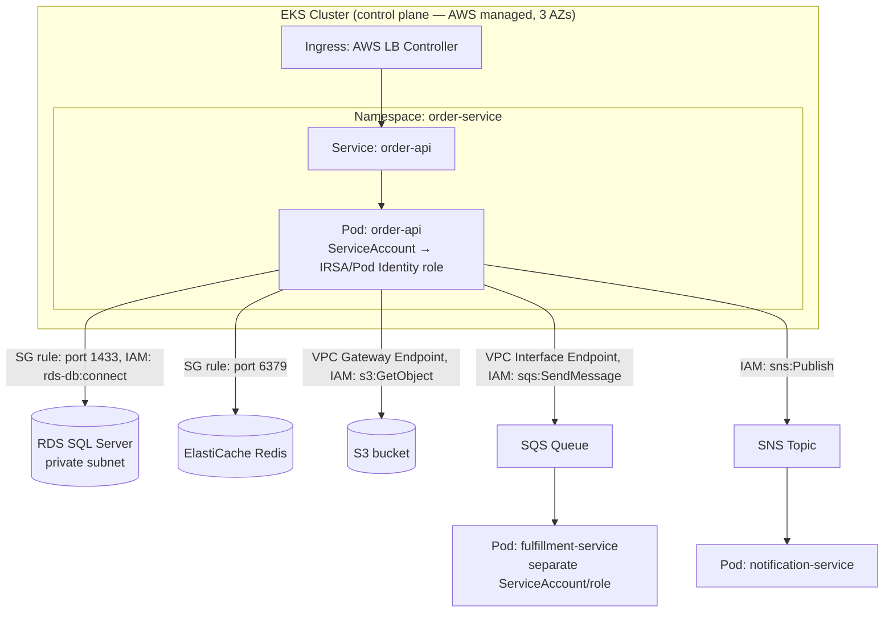
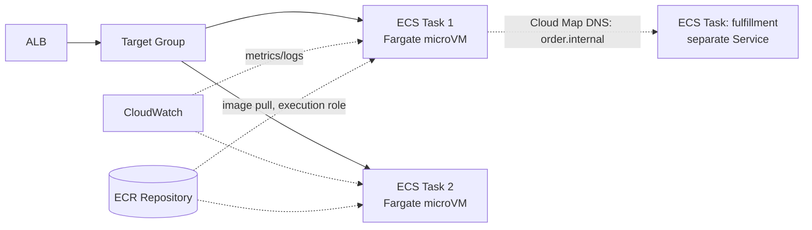
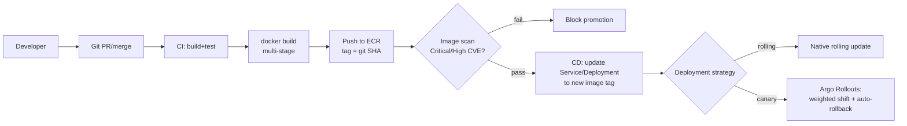
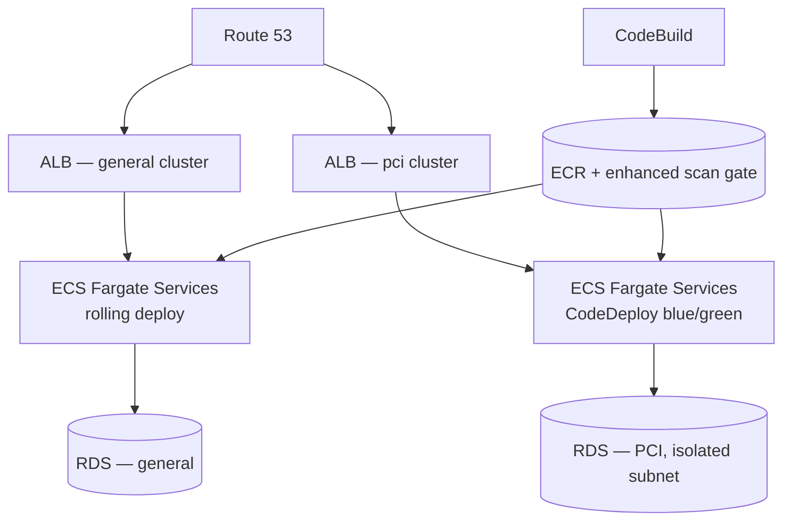
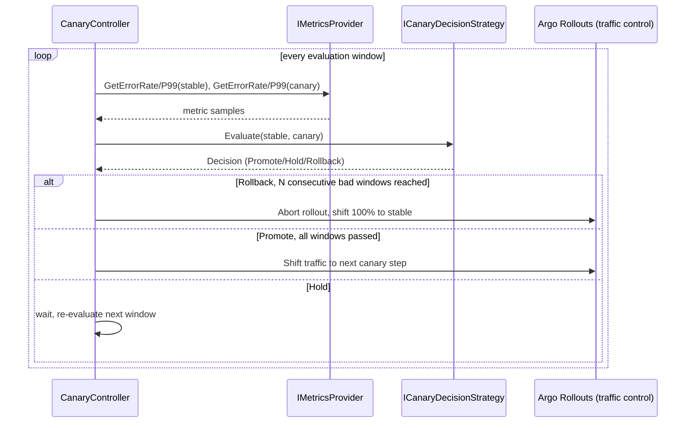

# Module 63 — AWS: Containers & Microservices — ECS, EKS, Fargate, App Mesh & Service Discovery

> Domain: AWS | Level: Beginner → Expert | Prerequisite: [[../17-Microservices/02-Resilience-Observability-Sidecar-Patterns]] (App Mesh is a concrete implementation of the sidecar/service-mesh pattern), [[../17-Microservices/01-Decomposition-Communication-Strangler-Fig]] (service decomposition principles now applied to container/cluster boundaries), [[06-Messaging-SQS-SNS-EventBridge-Kinesis]] (the AWS-native-vs-self-managed decision framework recurs here for ECS-vs-EKS)

---

## 1. Fundamentals

### What problem does container orchestration solve?
[[01-Compute-Networking-VPC-LoadBalancing-AutoScaling|Module 57]] established that a bare EC2 instance is a single point of failure and that Auto Scaling Groups match instance *count* to demand. Containers solve a narrower, sharper problem underneath that: an EC2 instance is usually oversized for one .NET service's actual CPU/memory footprint, and running one service per instance wastes capacity and makes deployment an instance-level operation (replace the whole VM to ship a code change). A container packages a .NET API plus its exact runtime dependencies into an immutable, portable unit that can be scheduled onto any host with spare capacity — and an **orchestrator** (ECS or EKS) is the control loop that continuously reconciles "what's running" against "what's declared," restarting failed containers, bin-packing many services onto few instances, and routing traffic to only the containers that are actually healthy. Kubernetes (EKS) additionally standardizes this reconciliation model as a portable API that runs identically on AWS, on-prem, or another cloud — which is the entire reason it is heavier to operate than ECS: portability is bought with a much larger surface area of concepts (CRDs, controllers, admission webhooks, CNI plugins) that a single-cloud team gets zero benefit from unless they actually need that portability.

### When should you use container orchestration at all?
Use it when you have **more than a handful of independently-deployable services** that need independent scaling, independent release cadence, and bin-packing efficiency — the point at which "one EC2 instance (or ASG) per service" becomes an operational and cost burden. Do NOT reach for it for a single monolith with one release cadence (an ASG behind an ALB, or even Elastic Beanstalk, is simpler and has fewer moving parts to secure and operate) or for genuinely spiky, small, event-driven workloads (Lambda has zero cluster to patch and bills per invocation, not per idle container). A Principal Engineer's default answer is never "containers because containers are modern" — it is "containers because we have N independently-scaled services and the bin-packing/rollout economics justify a scheduler," and that justification should be checked again at every order-of-magnitude change in team size.

### When should you NOT use ECS/EKS?
- A single deployable unit with no independent-scaling requirement → EC2 + ASG, or Elastic Beanstalk.
- Pure event-driven, bursty, short-lived compute → Lambda (Module 61, [[05-Serverless-Lambda-APIGateway-StepFunctions]]).
- A team with no Linux/networking/Kubernetes operational depth and no portability requirement → ECS Fargate, never EKS — this is argued in full in §2.15.
- Ultra-latency-sensitive, sustained, predictable workloads where reserved/dedicated EC2 capacity pricing beats container-scheduling overhead → EC2 directly.

### 30,000-ft view
```
ECS: AWS's own, AWS-only orchestrator. Task Definition (like a pod spec) + Service (desired count +
 ALB/NLB registration + deployment config) run on either EC2 instances you manage (EC2 launch type) or
 AWS-managed compute you never see (Fargate launch type). Simpler mental model, AWS-only API surface.

EKS: AWS-managed Kubernetes control plane (API server, etcd, scheduler — all run by AWS across 3 AZs,
 you never SSH into them) + worker capacity you attach (managed node groups, self-managed node groups,
 or Fargate profiles). Full portable Kubernetes API — Deployments, Services, Ingress, CRDs, Helm charts,
 the entire CNCF ecosystem — at the cost of far more moving parts to understand and secure.

Fargate: a serverless COMPUTE layer usable under BOTH ECS and EKS — you specify CPU/memory per task/pod,
 AWS runs it on infrastructure you never patch or scale yourself. Removes node-management entirely; does
 not remove Kubernetes-object complexity if paired with EKS.

App Mesh: AWS's own service-mesh control plane (Envoy sidecars), providing mTLS, retries, and traffic
 shifting between ECS/EKS services without changing application code — a concrete implementation of the
 sidecar pattern from Module 173/17-Microservices §02.
```

---

## 2. Deep Dive

### 2.1 The EKS Control Plane — What AWS Manages, What You Manage, and Why That Split Matters
An EKS cluster's control plane — the Kubernetes API server, etcd (the cluster's entire state store), the scheduler, and the controller manager — is provisioned and operated entirely by AWS, replicated across a minimum of three Availability Zones, with AWS responsible for its availability, patching, and etcd backup/restore. You interact with it only through the Kubernetes API (`kubectl`, the AWS SDK, Terraform/CloudFormation) and pay a flat per-cluster-hour control-plane fee (independent of how many worker nodes you attach) — this is the single most important cost/availability fact about EKS versus running your own Kubernetes on EC2 (`kops`/`kubeadm`): you are not responsible for etcd quorum loss, API-server certificate rotation, or control-plane version skew, which are the most common ways a self-managed Kubernetes cluster suffers a full outage. **What you still own**: every worker node (unless fully on Fargate), every add-on (VPC CNI, CoreDNS, kube-proxy — AWS ships them but you choose versions and must upgrade them in lockstep with the control-plane version), and the entire application layer. The recurring failure mode interview candidates miss: EKS control-plane version and node-group AMI version can drift out of the supported skew window (Kubernetes supports N-2 minor versions between control plane and kubelet) — an EKS upgrade is therefore a two-step operation (upgrade control plane, then upgrade every node group/Fargate profile) with a real compatibility window, not a single button.

### 2.2 Worker Capacity: Managed Node Groups vs. Self-Managed vs. Fargate Profiles
| | Managed Node Group | Self-Managed Node Group | Fargate Profile |
|---|---|---|---|
| Who patches the AMI/OS | AWS provides update workflow, you trigger it | You, entirely | AWS, entirely — no node concept |
| ASG underneath | Yes, AWS-managed | Yes, you own it | No — per-pod microVM |
| DaemonSets work | Yes | Yes | **No** — Fargate has no node to run a DaemonSet on, a genuine EKS-Fargate limitation that breaks the common "run Fluent Bit as a DaemonSet" logging pattern |
| Custom AMI / GPU / bare-metal instance types | Limited | Full control | Not supported |
| Bin-packing efficiency | You size instance types, K8s bin-packs pods onto them | Same | Perfect — one microVM per pod, no bin-packing waste, but no sharing of a large instance's spare capacity either |
| Cold-start for new capacity | Node launch (~1–2 min) + kubelet join | Same | Pod-level, no node bootstrap, but pull+init still costs tens of seconds |
| Typical fit | Default choice for most production EKS workloads | Rare — custom kernel modules, specific compliance imaging requirements | Batch/spiky namespaces, or teams that want zero node-patching surface for a subset of workloads |

The choice is rarely all-or-nothing: production EKS clusters commonly run steady-state services on managed node groups (better bin-packing economics at sustained load) and bursty/batch namespaces on Fargate profiles (pay exactly for what ran, zero idle-node waste) — a Principal Engineer should present this as the actual default, not a binary choice.

### 2.3 Core Kubernetes Objects, as They Actually Behave in Production
A **Pod** is the smallest deployable unit — one or more containers that share a network namespace (one IP, `localhost`-reachable to each other) and are always scheduled together; a .NET API container almost always runs as a single-container Pod, with a sidecar (log shipper, Envoy proxy for App Mesh) added only when cross-cutting infrastructure genuinely needs to share the Pod's network/lifecycle. A **Deployment** is a controller that manages a ReplicaSet of identical Pods and drives rolling updates by creating new-version Pods and terminating old-version Pods according to `maxSurge`/`maxUnavailable` — the object a .NET API's rollout config actually targets. A **Service** is a stable virtual IP (ClusterIP) that load-balances across the set of Pods matching a label selector — critically, the Service selector is **label-based, not identity-based**: a Pod becomes a traffic target the instant its labels match and it passes readiness, which is why a correct `readinessProbe` (§2.13, §11) is not optional — a Pod that starts accepting TCP connections before its ASP.NET Core DI container/EF Core connection pool has actually warmed up will receive live traffic and fail requests during exactly the rollout window it's meant to protect. **Ingress** is the object that provisions and configures an external entry point (in EKS, the AWS Load Balancer Controller turns an Ingress resource into a real ALB — §2.8) and is the only one of these four objects that touches AWS infrastructure directly; the other three are pure Kubernetes-internal state reconciled entirely inside the cluster.

### 2.4 EKS Networking — the VPC CNI's "Every Pod Is a Real VPC Citizen" Model
Unlike most Kubernetes networking implementations (which use an overlay network with a separate pod-CIDR), the default **Amazon VPC CNI** assigns every Pod a real, routable IP address from the VPC's own subnet CIDR, by attaching secondary ENIs (Elastic Network Interfaces) to each worker node and allocating IPs from their secondary IP pools directly to Pods. This has a genuinely important consequence a Principal Engineer must reason about explicitly: **Pod density per node is capped by ENI/IP capacity, not just CPU/memory** — an `m5.large` supports only 3 ENIs × 10 IPs, i.e. roughly 29 usable pod IPs, which can be exhausted well before CPU/memory limits are reached on IP-hungry, low-resource-footprint workloads, silently blocking new Pod scheduling with an `Insufficient pods` error that looks like a capacity problem but is actually an addressing problem. The mitigation is **prefix delegation** (allocating /28 IP prefixes instead of individual IPs per ENI, multiplying usable IPs per node roughly 16x) or moving IP-dense namespaces to Fargate (where this constraint doesn't apply the same way). The upside of this design is that a Pod's IP is directly subject to the VPC's own Security Groups (via "Security Groups for Pods") and NACLs, and is directly routable from RDS/ElastiCache's security group rules without any NAT translation — the same private-subnet reasoning from Module 57 applies unmodified at the Pod level, which is precisely why the two architecture flows in §2.6/§3 work exactly as they would for a plain EC2 instance in that subnet.

### 2.5 ConfigMaps and Secrets — and Why a Raw Kubernetes Secret Is Not Encryption
A **ConfigMap** is a plain key-value object mounted into a Pod as environment variables or a file — the direct .NET analogue is `appsettings.{Environment}.json` or environment-variable-driven `IConfiguration`, and it should hold exactly the non-sensitive configuration that would otherwise live in `appsettings.json`. A **Secret** looks identical in the API but is base64-**encoded**, not encrypted, by default — base64 is trivially reversible, so a raw Kubernetes Secret stored in etcd without KMS envelope encryption on etcd enabled, or readable by anyone with `get secrets` RBAC on the namespace, provides essentially no confidentiality. Two corrections a candidate must know cold: (1) enable **envelope encryption of etcd secrets with a KMS key** at cluster creation (EKS supports this natively) so the at-rest copy in etcd is genuinely encrypted; (2) for anything that must be rotated or audited (a database password, an API key) prefer **not** storing it as a native K8s Secret at all — mount it via the **Secrets Manager / Parameter Store CSI driver** (ASCP), which fetches the live value from Secrets Manager at Pod-mount time and never persists it in etcd, giving you Secrets Manager's rotation and CloudTrail audit trail (Module 58, [[02-IAM-Security-KMS-SecretsManager]]) for free. This is the concrete, EKS-specific instance of a pattern that recurs everywhere in this domain: **object presence is not enforced reality** — a Secret object existing and looking correct is not evidence it is actually protected; the enforcement is the encryption configuration and RBAC around it, which is easy to omit and produces no error until an audit or an incident finds it.

### 2.6 IAM Roles for Service Accounts (IRSA) vs. EKS Pod Identity — How a Pod Gets Real AWS Permissions
Neither ECS tasks nor EKS Pods can use an EC2 instance profile safely at scale — every Pod on a shared node would inherit the *node's* IAM role, meaning a compromised low-privilege Pod could call any AWS API the node's role allows, including RDS, S3, and Secrets Manager access meant for entirely different services. **IRSA** solves this by giving the EKS cluster an OIDC identity provider; a Kubernetes ServiceAccount is annotated with an IAM role ARN, and that role's trust policy restricts `AssumeRoleWithWebIdentity` to exactly that ServiceAccount (via an OIDC-federated condition on `sub`); the AWS SDK for .NET running in the Pod automatically discovers the projected service-account token and exchanges it for temporary STS credentials scoped to that IAM role — no long-lived AWS access keys ever touch the container. A concrete IRSA trust policy, scoped to exactly one namespace/ServiceAccount pair (the actual enforcement boundary — get this condition wrong and *any* ServiceAccount in the cluster can assume the role):
```json
{
  "Version": "2012-10-17",
  "Statement": [{
    "Effect": "Allow",
    "Principal": { "Federated": "arn:aws:iam::123456789012:oidc-provider/oidc.eks.us-east-1.amazonaws.com/id/EXAMPLE" },
    "Action": "sts:AssumeRoleWithWebIdentity",
    "Condition": {
      "StringEquals": {
        "oidc.eks.us-east-1.amazonaws.com/id/EXAMPLE:sub": "system:serviceaccount:order-service:order-api-sa",
        "oidc.eks.us-east-1.amazonaws.com/id/EXAMPLE:aud": "sts.amazonaws.com"
      }
    }
  }]
}
```
The common production mistake is matching on `StringLike` with a wildcard namespace (`system:serviceaccount:*:order-api-sa`) "to make it work across environments faster" — this silently reopens the role to any namespace that happens to create a ServiceAccount with the same name, defeating the entire point of scoping by namespace, and is exactly the kind of gap that produces no error and is only caught by an access review. **EKS Pod Identity** (the newer mechanism) removes the OIDC-provider bookkeeping and per-cluster trust-policy plumbing entirely: you associate a ServiceAccount with an IAM role directly through the EKS Pod Identity Agent (a cluster add-on), and role trust policies use a much simpler `pods.eks.amazonaws.com` principal — functionally equivalent least-privilege outcome, materially less Terraform/CloudFormation boilerplate, and the mechanism AWS now recommends by default for new clusters. Either way, this is the exact mechanism referenced in §2 of Module 58 ([[02-IAM-Security-KMS-SecretsManager]]) as "workload identity" — the Pod-level analogue of an EC2 instance profile, scoped down from node-wide to ServiceAccount-wide, which is the actual security improvement EKS should be sold on versus a naively-configured node role. **Interviewer follow-up:** "Your Pod's AWS SDK call is failing with `AccessDenied` even though the IAM policy clearly allows the action — what do you check first?" The Staff-level answer checks the trust-policy `sub`/`aud` condition and the ServiceAccount annotation *before* the permissions policy, because a scoping/trust mismatch produces the identical `AccessDenied` symptom as a genuinely missing permission, and confusing the two wastes an incident's first twenty minutes.

### 2.7 ECR Integration
Every worker node's kubelet (or, for Fargate, the underlying Firecracker microVM) pulls container images directly from Amazon ECR using the node's/task's IAM role (`ecr:GetAuthorizationToken`, `ecr:BatchGetImage`, `ecr:GetDownloadUrlForLayer`) — no Docker Hub credentials, no separate registry to operate. Cross-account image sharing uses ECR **repository policies** (resource-based, analogous to an S3 bucket policy); a **pull-through cache** repository lets EKS transparently cache public images (e.g. `public.ecr.aws` or Docker Hub) inside your own account's ECR, avoiding Docker Hub's anonymous-pull rate limits, which is a real production outage cause when a node group scales out fast and a burst of image pulls gets throttled by an external registry — pulling from your own regional ECR removes that external dependency entirely. Image **tagging strategy** and **vulnerability scanning** are covered in depth in §2.17 (they are identical in principle whether the target is ECS or EKS).

### 2.8 ALB/NLB Integration — the AWS Load Balancer Controller
The **AWS Load Balancer Controller** (an EKS add-on, itself a Kubernetes controller watching Ingress/Service objects) is what turns a Kubernetes `Ingress` resource into an actual, real Application Load Balancer with real target groups — this is the concrete mechanism behind the `EKS Ingress` box in the architecture flow the user asked for in §3. Two modes matter: **instance mode** registers worker node instance IDs as ALB targets (traffic then hits `kube-proxy`, which forwards to the right Pod via iptables/IPVS rules — one extra network hop inside the node); **IP mode** (the default and recommended mode when using the VPC CNI) registers **Pod IPs directly** as ALB targets, since VPC-CNI Pods are already real routable VPC IPs (§2.4) — this removes the kube-proxy hop entirely, meaning the ALB health-checks and sends traffic straight to the Pod's own IP:port, and a Pod that fails its Kubernetes readiness probe is removed from the ALB target group directly via the controller's reconciliation loop, not via a separate AWS-side health check lagging behind Kubernetes' own view of health. A `Service` of type `LoadBalancer` (rather than an Ingress) provisions an NLB the same way, for pure L4/TCP or extreme-throughput cases — same controller, same underlying registration mechanics, Layer 4 instead of Layer 7.

### 2.9 Persistent Storage — EBS CSI vs. EFS CSI
Most .NET APIs on EKS should be **stateless** (session/cache state belongs in ElastiCache, not local disk — Module 60, [[04-Databases-RDS-Aurora-DynamoDB]]), but background workers, file-processing Pods, or anything needing a local durable volume use the **EBS CSI driver** (dynamically provisions an EBS volume per PersistentVolumeClaim) — critically, an EBS volume is **AZ-scoped and ReadWriteOnce** (attachable to exactly one Pod, and only schedulable in the volume's own AZ, which the Kubernetes scheduler must respect via topology-aware scheduling), making it unsuitable for any workload requiring multiple Pods to share one volume or requiring cross-AZ Pod rescheduling without a volume-reattach delay. The **EFS CSI driver** provisions access to an EFS filesystem (Module 59, [[03-Storage-S3-EBS-EFS]]) and supports **ReadWriteMany** — many Pods, across AZs, sharing the same filesystem concurrently — at NFS latency and cost characteristics, the correct choice for a genuinely shared-file workload (e.g., multiple report-generation Pods writing to a common staging area) but the wrong choice for anything latency-sensitive, where object storage (S3, §2 of Module 59) or a proper database is the right answer instead.

### 2.10 Scaling: HPA, Cluster Autoscaler, and Karpenter — Two Independent Scaling Dimensions
The **Horizontal Pod Autoscaler (HPA)** scales the **Pod replica count** of a Deployment against a metric (CPU/memory by default, or a custom CloudWatch/Prometheus metric via an adapter — e.g., ASP.NET Core request queue depth or a custom business metric). The **Cluster Autoscaler** (or its modern, faster-scheduling replacement, **Karpenter**) scales the **node count**, reacting to Pods stuck in `Pending` because no node has enough free CPU/memory/IP capacity to schedule them. These are two independent control loops that must be tuned together: if HPA scales Pod count up faster than the node layer can provision new capacity, new Pods sit `Pending` for the node-launch duration (§2.2's ~1–2 minutes for a new EC2 node, near-instant for a Fargate profile) — a load spike that outruns this combined reaction time is exactly the "traffic increases 10x" failure scenario, and the correct mitigation is pre-provisioned headroom (a minimum node/Pod floor sized above steady-state) for latency-critical, bursty fintech workloads (e.g., market-open trading-adjacent traffic) rather than relying on reactive scaling alone. Karpenter specifically improves on Cluster Autoscaler by provisioning nodes directly against Pod resource requests (no pre-defined node group "shapes" to pick from) and can bin-pack more efficiently, which is why most new EKS deployments in 2025+ default to it over the classic Cluster Autoscaler.

### 2.11 Observability on EKS
**Container Insights** (a CloudWatch agent/Fluent Bit-based EKS add-on) collects Pod/node/cluster-level CPU, memory, network, and disk metrics into CloudWatch automatically, and ships container **logs** via **Fluent Bit** running as a DaemonSet (note the §2.2 gotcha: this specific pattern does not work on pure-Fargate node groups, which have no DaemonSet concept — Fargate logging instead uses a Fargate-specific log router configuration attached per-Pod). **Distributed tracing** follows the OpenTelemetry pattern established in Module 57/58's cross-references: an OpenTelemetry Collector sidecar or DaemonSet receives traces from the .NET API's `System.Diagnostics.Activity`/OTel SDK instrumentation and exports to AWS X-Ray or a third-party backend — covered in full in Module 64's capstone ([[08-Observability-Cost-WellArchitectedFramework]]), which is EKS's role in the domain-wide observability picture. The production-relevant point for interviews: `kubectl logs`/`kubectl top` are fine for live debugging but are **not** a durability or historical-query strategy — every log line and metric must reach CloudWatch (or an equivalent aggregator) before the Pod that emitted it is rescheduled, because a terminated Pod's local state, including anything not yet shipped, is gone permanently.

### 2.12 Security on EKS
Layered, in order of blast radius: (1) **cluster API endpoint access** — public, private, or both; a fintech production cluster should run with the API endpoint **private** (reachable only from within the VPC/via VPN/Direct Connect/a bastion), eliminating the entire internet-facing attack surface against the control plane itself; (2) **Pod Security Standards** (the modern replacement for the deprecated PodSecurityPolicy) enforce that Pods cannot run as root, cannot mount the host's Docker socket, cannot escalate privileges — enforced at the namespace level via admission control, and this is where the Dockerfile's `USER` directive (§2.17) becomes a hard requirement rather than a best practice, since a Pod Security Standard set to `restricted` will simply refuse to schedule a container that tries to run as root; (3) **Kubernetes RBAC** — who can `get`/`list`/`exec` into which namespaces, mapped from IAM principals via the `aws-auth` ConfigMap (or, in newer EKS, EKS access entries) — the correct multi-tenant boundary for "which team can touch which namespace"; (4) **network policies** (via the VPC CNI's network-policy support, or Calico/Cilium) — the Kubernetes-native equivalent of a Security Group, restricting which namespaces/Pods can talk to which other Pods over the cluster network, which is the concrete mechanism for preventing a compromised Pod in Tenant A's namespace from reaching Tenant B's Pods even though both share the same underlying VPC CIDR space. A cluster with no NetworkPolicy objects at all is "flat" — any Pod can reach any other Pod's IP by default — which is the single most common EKS multi-tenancy mistake found in architecture reviews.

### 2.13 Deployment Strategies — Rolling, Blue/Green, Canary
**Rolling deployment** is Kubernetes' native Deployment behavior: new-version Pods are created and pass readiness before old-version Pods are terminated, governed by `maxSurge` (how many extra Pods above desired count during rollout) and `maxUnavailable` (how many can be down at once) — this requires **zero extra tooling** but offers no automated rollback-on-error-rate and shifts traffic Pod-by-Pod rather than in controlled percentage steps. **Blue/green** runs the new version as an entirely separate, fully-scaled Deployment behind a second Service, then cuts traffic over at the Ingress/Service-selector level in one atomic step — instant rollback (flip the selector back) at the cost of running 2x capacity during the cutover window. **Canary** shifts a small, controlled percentage of traffic to the new version (via weighted ALB target groups, an Istio/App-Mesh traffic-split, or the **Argo Rollouts** controller, which is the de facto standard for automated canary on EKS) and automatically promotes or rolls back based on live error-rate/latency metrics queried from CloudWatch/Prometheus during the canary window — this is the only one of the three with a built-in automated safety net, and is the correct default for a payment-processing or trade-settlement service where an undetected regression has direct financial consequences. Native Kubernetes rolling updates provide **no** canary or blue/green semantics on their own — a candidate who says "we use rolling deployments for canary" is conflating two different things, and should be corrected: rolling deployments update Pods, canary and blue/green control **traffic**, and only Argo Rollouts (or a service mesh) gives you the latter.

### 2.14 ECS Deep Dive
A **Task Definition** is ECS's declarative unit (analogous to a Kubernetes Pod spec): container image, CPU/memory, port mappings, environment variables, IAM **task role** (the ECS equivalent of IRSA/Pod Identity — scoped per task, not per cluster instance, avoiding the same "every task inherits the instance's permissions" problem §2.6 solves for EKS) and **execution role** (a separate, narrower role used only to pull the image from ECR and fetch secrets at task-start time — a frequently-confused distinction: the execution role never touches application AWS calls, only bootstrap). A **Service** maintains a desired task count, integrates directly with an ALB/NLB target group (registering/deregistering tasks automatically as they start/stop — no separate "Ingress controller" concept; this wiring is built into the Service definition itself), and drives rolling or blue/green (via CodeDeploy) deployments natively. **Launch type EC2** runs tasks on ECS-optimized EC2 instances you register into a "cluster" (a much thinner concept than an EKS cluster — just a logical grouping, no control-plane fee, no etcd); **launch type Fargate** removes the instance layer entirely, identical value proposition to EKS Fargate profiles but without any Kubernetes object model on top. **Service discovery** is handled by **AWS Cloud Map**, which automatically registers each running task's IP into a private DNS namespace (`order-service.internal`) or an API-queryable service registry — the ECS-native equivalent of a Kubernetes Service's ClusterIP/DNS, but DNS-based rather than virtual-IP-based, which has a real consequence: DNS caching (in the .NET `HttpClient`/`SocketsHttpHandler` connection pool, and in the OS resolver) must be configured with a short TTL or `PooledConnectionLifetime`, or a client can keep talking to a terminated task's now-stale IP for longer than intended — the exact same "DNS caching outlives the record" failure mode covered under Route 53 in Module 57.

### 2.15 ECS vs. EKS — the Decision a Principal Engineer Actually Defends
"We chose EKS because Kubernetes is more powerful" is the wrong answer and should be challenged immediately in an interview — ECS is not less *capable* for the overwhelming majority of stateless microservice workloads; it is less **flexible at the ecosystem/portability layer** and asks for far less operational investment. The honest comparison:

| Dimension | ECS | EKS |
|---|---|---|
| Concepts to learn/operate | Task Definition, Service, Cluster (thin), Cloud Map | Pods, Deployments, Services, Ingress, ConfigMaps/Secrets, RBAC, CNI, CSI drivers, admission controllers, Helm, CRDs |
| Control-plane cost | $0 (no separate control-plane fee) | ~$0.10/hr/cluster flat fee, always-on |
| Who's on call for platform issues | App team + AWS support for AWS-managed layer | Usually a dedicated platform/SRE team, because Kubernetes upgrade/CNI/CSI issues are a distinct skill set from application on-call |
| Ecosystem (Helm charts, operators, service meshes, CNCF tooling) | AWS-native only | The entire CNCF ecosystem — genuinely the deciding factor when it matters |
| Portability to on-prem/another cloud | None — ECS is AWS-only | Full — the actual reason to choose it |
| Multi-tenancy primitives | IAM + Cloud Map namespaces (coarser) | Namespaces + RBAC + NetworkPolicy (finer-grained, but you must configure all three correctly — §2.12) |
| Time-to-first-production-deploy for a team new to containers | Days | Weeks (learning curve is real, not marketing) |

The Principal Engineer's actual decision framework: choose **EKS** only when at least one of (a) genuine multi-cloud/on-prem portability is a real, near-term requirement (not speculative future-proofing), (b) the org already has significant Kubernetes investment/tooling/talent elsewhere and standardizing reduces net operational surface area across the whole company, or (c) a specific CNCF-ecosystem tool (a particular service mesh, operator, or CRD-based platform) is a hard requirement with no ECS-native equivalent. Absent all three, **ECS Fargate** delivers equivalent day-to-day scheduling/scaling/deployment capability for a .NET microservices estate with meaningfully less to secure, upgrade, and staff — this is the answer that survives "why not EKS" follow-up pressure; "Kubernetes is industry standard" does not.

### 2.16 App Mesh and Service Mesh on AWS
**AWS App Mesh** injects an Envoy sidecar into each task/Pod, giving every service mTLS between sidecars, fine-grained retry/timeout policy, and weighted traffic-shifting (the mechanism canary deployments in §2.13 can build on) — all **without changing the .NET application's code**, since the sidecar transparently intercepts outbound/inbound traffic. This is the concrete AWS-native implementation of the sidecar pattern discussed at the pattern level in [[../17-Microservices/02-Resilience-Observability-Sidecar-Patterns]]; on EKS, most teams now reach for the CNCF-standard **Istio** or **Linkerd** instead of App Mesh specifically because the ecosystem/tooling/community argument from §2.15 applies at the mesh layer too — App Mesh remains most relevant for ECS-based estates, where there is no other native mesh option. Module 173 ([[../17-Microservices/09-LoadBalancing-AWS-ALB-NLB-TargetGroups-Route53-GlobalAccelerator]]) covers the load-balancing-specific angle of this; this module's concern is strictly the sidecar/mTLS/traffic-control angle.

### 2.17 The Containerization Pipeline — Dev → Git → CI/CD → Docker Build → ECR → ECS/EKS
```
Developer commits → Git (branch/PR) → CI/CD pipeline triggers:
  1. dotnet restore/build/test (unit tests must pass before an image is even built)
  2. docker build (multi-stage — see Dockerfile below)
  3. docker push to ECR, tagged with immutable identifier (git SHA or build number — NEVER just "latest")
  4. ECR triggers/CI waits for image scan result (block promotion on Critical/High CVEs)
  5. CD stage updates the ECS Service / EKS Deployment to reference the new image tag
  6. Deployment executes per the chosen strategy (rolling/blue-green/canary, §2.13)
```

A realistic multi-stage .NET 8 Dockerfile:
```dockerfile
# ---- build stage ----
FROM mcr.microsoft.com/dotnet/sdk:8.0 AS build
WORKDIR /src
COPY ["OrderService.csproj", "./"]
RUN dotnet restore "OrderService.csproj"          # cached layer — only re-runs if csproj changes
COPY . .
RUN dotnet publish "OrderService.csproj" -c Release -o /app/publish --no-restore

# ---- runtime stage ----
FROM mcr.microsoft.com/dotnet/aspnet:8.0 AS final
RUN addgroup --system appgroup && adduser --system --ingroup appgroup appuser
WORKDIR /app
COPY --from=build /app/publish .
USER appuser                                       # never run as root — required by Pod Security Standards §2.12
EXPOSE 8080
ENTRYPOINT ["dotnet", "OrderService.dll"]
```
The two-stage split keeps the final image to only the ASP.NET Core runtime + published output (tens of MB, not the full SDK), and ordering `COPY *.csproj` + `dotnet restore` before `COPY . .` means Docker's layer cache is invalidated only when dependencies change, not on every source-code edit — a real build-time cost difference at CI scale.

**Image tagging**: tag with the immutable git SHA (or a monotonic build number), never deploy by mutable tags like `latest` or `prod` — ECS/EKS resolve a tag to a digest at pull time, so a mutable tag means "what actually got deployed" is not reconstructable after the fact, which is precisely the auditability failure a regulated fintech environment cannot accept; pin deployments by **digest** for the strongest guarantee, by immutable tag as the practical default. **ECR scanning**: basic scanning (free, OS-package CVEs via Clair) runs on every push; **enhanced scanning** (via Amazon Inspector) adds continuous re-scanning as new CVEs are published against images already sitting in the registry and covers application-layer (NuGet package) vulnerabilities too — a Principal Engineer gates production promotion on enhanced-scan results, not just at push time, since a NuGet package can become vulnerable after the image was already built and deployed. **Rollback** is "redeploy the previous known-good immutable tag" — which is why immutable tagging isn't just an audit nicety, it's the entire rollback mechanism.

How the running container actually receives everything it needs, end to end:
- **Configuration**: environment variables injected by the Task Definition/Pod spec (or a mounted ConfigMap) read by ASP.NET Core's `IConfiguration`/Options pattern — no rebuild required to change a non-secret setting per environment.
- **Secrets**: never baked into the image or committed to Git — injected at runtime via the Secrets Manager/Parameter Store CSI driver (EKS, §2.5) or the ECS **execution role**'s `secrets` block in the Task Definition (which injects a Secrets Manager value as an environment variable at task start, without the application ever calling the Secrets Manager API itself).
- **IAM permissions**: IRSA/Pod Identity (EKS, §2.6) or the task role (ECS, §2.14) — scoped per-service, never the shared node/instance role.
- **Database connection info**: host/port from configuration (often just the RDS/Aurora cluster endpoint DNS name, §2.4's routable-IP model meaning no special container-network translation is needed), credentials from Secrets Manager as above — full mechanics in Module 60 ([[04-Databases-RDS-Aurora-DynamoDB]]).
- **Logging**: stdout/stderr captured by the container runtime, shipped by Fluent Bit (EKS DaemonSet or Fargate log router) or the `awslogs`/FireLens log driver (ECS) to CloudWatch Logs — the application should log structured JSON to stdout and never manage its own log files inside the container, since the container's local filesystem is ephemeral and destroyed on termination.
- **Environment-specific settings**: the Options pattern binding to environment-specific configuration sources (env vars per environment, potentially layered with AWS AppConfig for feature-flag-style dynamic config) — the same `appsettings.{Environment}.json` layering .NET developers already know, just populated by the platform instead of a file checked into source control.

### 2.18 The Discriminating Question, and What This Design Cannot Do
The question that separates a Staff answer from a Senior one on this topic is rarely "how do you deploy a container" — it's: **"Your EKS cluster just failed to schedule new Pods during a load spike, and `kubectl describe pod` shows `0/12 nodes available: insufficient pods`. CPU and memory on every node show 40% free. What's actually wrong, and what's the fix?"** A Senior answer reaches for "we need bigger instances" or "scale out the ASG" — both wrong, and both will fail to fix it. The Staff answer identifies the VPC CNI's per-node **IP address** ceiling (§2.4) as the actual constraint independent of CPU/memory headroom, and fixes it with prefix delegation or by moving the affected namespace to Fargate — because the error message names "pods," not "CPU" or "memory," and a Staff engineer has internalized that EKS scheduling has a *third* resource dimension beyond the two every Kubernetes tutorial teaches.

**What this design honestly cannot do, with no built-in detector**: neither ECS nor EKS detects a **logically** unhealthy Pod that still answers its liveness/readiness probe correctly — e.g., a .NET API whose EF Core connection pool is silently exhausted and returning 500s for the specific "place order" endpoint while `/healthz` (checking only "is the process up") still returns 200. The scheduler will happily keep routing live traffic to it forever. The only real detector is an application-level, business-metric-aware health signal (a readiness probe that actually exercises the DB dependency, or an external synthetic-transaction monitor) — this gap is a standing limitation of container orchestration generally, not a configuration mistake, and should be named as such rather than implied away.

---

## 3. Visual Architecture

### End-to-end request flow: User → Route 53 → CloudFront → ALB → EKS Ingress → Service → Pod → .NET API → RDS
```mermaid
sequenceDiagram
    participant U as User Browser
    participant R53 as Route 53
    participant CF as CloudFront
    participant ALB as ALB (via AWS LB Controller)
    participant SVC as K8s Service (ClusterIP)
    participant POD as Pod (.NET API, IP-mode target)
    participant RDS as RDS SQL Server (private subnet)

    U->>R53: DNS query api.example.com
    R53-->>U: CloudFront distribution domain (CNAME/ALIAS)
    U->>CF: HTTPS request (TLS terminated at edge, ACM cert)
    CF->>ALB: Forward to origin (re-encrypted TLS, ALB's own ACM cert)
    Note over ALB: Ingress object reconciled into this ALB<br/>by the AWS Load Balancer Controller
    ALB->>POD: IP-mode target — traffic sent DIRECTLY to Pod IP:port<br/>(no kube-proxy hop; readiness-probe-gated)
    Note over POD: ASP.NET Core middleware pipeline:<br/>AuthN (JWT) → AuthZ → Controller
    POD->>RDS: EF Core query over TLS, port 1433,<br/>via IRSA-scoped Secrets Manager credential
    RDS-->>POD: Result set
    POD-->>ALB: 200 OK + JSON
    ALB-->>CF: Response
    CF-->>U: Response (cached per Cache-Control if applicable)
```

### Component topology — namespace, node groups, and the two IAM-scoped fan-out paths

```mermaid
graph TB
    subgraph "EKS Cluster (control plane — AWS managed, 3 AZs)"
        ING[Ingress: AWS LB Controller]
        subgraph "Namespace: order-service"
            SVC1[Service: order-api]
            POD1[Pod: order-api<br/>ServiceAccount → IRSA/Pod Identity role]
        end
    end
    ING --> SVC1 --> POD1
    POD1 -->|"SG rule: port 1433, IAM: rds-db:connect"| RDS[(RDS SQL Server<br/>private subnet)]
    POD1 -->|"SG rule: port 6379"| REDIS[(ElastiCache Redis)]
    POD1 -->|"VPC Gateway Endpoint, IAM: s3:GetObject"| S3[(S3 bucket)]
    POD1 -->|"VPC Interface Endpoint, IAM: sqs:SendMessage"| SQS[SQS Queue]
    SQS --> POD2[Pod: fulfillment-service<br/>separate ServiceAccount/role]
    POD1 -->|"IAM: sns:Publish"| SNS[SNS Topic]
    SNS --> POD3[Pod: notification-service]
```
Every arrow out of `order-api`'s Pod is gated by **two independent controls**: a Security Group rule (network-layer — can this IP reach that IP/port) and an IAM policy attached via IRSA/Pod Identity (identity-layer — is this specific ServiceAccount allowed to call this specific API action). Both must be correctly scoped; either one being wrong either breaks the connection or, worse, over-grants access silently.

### ECS task/service topology (Fargate launch type)

```mermaid
graph LR
    ALB2[ALB] --> TG[Target Group]
    TG --> T1[ECS Task 1<br/>Fargate microVM]
    TG --> T2[ECS Task 2<br/>Fargate microVM]
    T1 -.->|"Cloud Map DNS: order.internal"| T3[ECS Task: fulfillment<br/>separate Service]
    CW[CloudWatch] -.->|metrics/logs| T1
    CW -.-> T2
    ECR[(ECR Repository)] -.->|"image pull, execution role"| T1
    ECR -.-> T2
```

### CI/CD containerization pipeline

```mermaid
graph LR
    DEV[Developer] --> GIT[Git PR/merge]
    GIT --> CI[CI: build+test]
    CI --> DOCKER[docker build<br/>multi-stage]
    DOCKER --> ECRPUSH[Push to ECR<br/>tag = git SHA]
    ECRPUSH --> SCAN{Image scan<br/>Critical/High CVE?}
    SCAN -->|fail| BLOCK[Block promotion]
    SCAN -->|pass| CD[CD: update Service/Deployment<br/>to new image tag]
    CD --> STRATEGY{Deployment strategy}
    STRATEGY -->|rolling| ROLL[Native rolling update]
    STRATEGY -->|canary| ARGO[Argo Rollouts:<br/>weighted shift + auto-rollback]
```

---

## 4. Production Example

**Problem.** A card-issuing fintech's `authorization-service` (a .NET 8 API deciding real-time transaction approval/decline) was running as a single oversized ECS EC2-launch-type service with one giant task definition handling authorization, limit-checking, and fraud-scoring logic together — every deploy of any one concern redeployed and briefly destabilized all three, and a fraud-model update once caused a 40-second authorization-latency spike industry-wide for that issuer during a deploy window, because the fraud-scoring code path shared a process (and therefore a GC pause) with the latency-critical authorization path.

**Architecture (after).** Decomposed into three EKS Deployments in separate namespaces (`authorization`, `limits`, `fraud-scoring`), each with its own HPA target tuned to its own latency SLO (authorization: p99 < 50ms, scaled aggressively on request-queue-depth; fraud-scoring: p99 < 200ms, scaled on CPU since it's compute-bound), independent IRSA roles (fraud-scoring's role can read a feature store in S3 and call a SageMaker endpoint; authorization's role can only reach RDS and ElastiCache — a genuine least-privilege split that also happens to be an availability boundary), and Argo Rollouts-driven canary deployment gated on a live p99-latency and decline-rate metric (an unexpected decline-rate shift is exactly the kind of regression a canary should catch before 100% rollout).

**Implementation.** The `authorization` namespace's Pods run on a dedicated managed node group with `taints`/`tolerations` reserving that capacity exclusively for latency-critical Pods (preventing a noisy-neighbor batch job from ever landing on the same node and causing CPU-steal-induced latency jitter) — a concrete answer to "how do you guarantee resource isolation between services on shared infrastructure" that goes beyond just "Kubernetes has resource requests/limits."

**Trade-offs.** Three namespaces/Deployments/CI pipelines instead of one means more YAML and more independent moving parts to operate — accepted deliberately because the availability/blast-radius benefit (a fraud-model bug can no longer take down authorization) outweighed the added operational surface for a system this latency- and compliance-sensitive.

**Lessons learned.** Decomposition boundaries should follow **failure-domain and SLO differences**, not just team-org-chart convenience — the trigger for splitting this service wasn't team size, it was the discovery that two genuinely different latency/availability requirements were sharing one blast radius.

---

## 11. Coding Exercises

**Easy — Liveness endpoint.** *Problem:* implement a `/healthz/live` endpoint in ASP.NET Core that returns 200 only if the process itself is responsive (no external dependency checks — liveness must never fail because of a downstream outage, or Kubernetes will kill and restart a perfectly healthy Pod during someone else's incident, amplifying it). *Solution:* use ASP.NET Core's built-in `HealthChecks` middleware with a trivial always-healthy check registered under a distinct `/healthz/live` route, separate from readiness. *Resource complexity:* O(1), must respond in single-digit milliseconds since Kubernetes calls it every few seconds by default. *Optimized version:* none needed — this endpoint's entire correctness requirement is "stay trivial."

**Medium — Readiness probe with dependency check.** *Problem:* implement `/healthz/ready` that returns 503 if the EF Core `DbContext` cannot open a connection to RDS within a short timeout, so the Service/ALB removes this Pod from rotation during a real DB outage rather than accepting and failing requests. *Solution:*
```csharp
public class SqlReadinessCheck : IHealthCheck
{
    private readonly OrderDbContext _db;
    public SqlReadinessCheck(OrderDbContext db) => _db = db;

    public async Task<HealthCheckResult> CheckHealthAsync(
        HealthCheckContext context, CancellationToken ct = default)
    {
        try
        {
            using var cts = CancellationTokenSource.CreateLinkedTokenSource(ct);
            cts.CancelAfter(TimeSpan.FromSeconds(2));               // bounded — never let a probe hang
            await _db.Database.ExecuteSqlRawAsync("SELECT 1", cts.Token);
            return HealthCheckResult.Healthy();
        }
        catch (Exception ex)
        {
            return HealthCheckResult.Unhealthy("RDS unreachable", ex);
        }
    }
}
// Program.cs
builder.Services.AddHealthChecks()
    .AddCheck<SqlReadinessCheck>("sql-ready", tags: new[] { "ready" });
app.MapHealthChecks("/healthz/ready", new HealthCheckOptions { Predicate = c => c.Tags.Contains("ready") });
app.MapHealthChecks("/healthz/live",  new HealthCheckOptions { Predicate = _ => false }); // always healthy
```
registered separately from liveness so a DB blip fails readiness (removes from load balancing) without ever triggering a Pod restart (which would not fix a DB-side problem and would just cause unnecessary Pod churn). *Resource complexity:* one lightweight query per probe interval — must be cheap enough not to itself contribute to DB load under the exact conditions (DB stress) it's meant to detect. *Optimized version:* cache the last result for a short TTL (e.g. 2 seconds) so probe frequency doesn't scale linearly with replica count hammering the DB.

**Hard — Graceful shutdown for rolling deployments.** *Problem:* a rolling update sends `SIGTERM` to the old Pod, then a grace period, then `SIGKILL` — without explicit handling, in-flight requests are dropped mid-response. *Solution:*
```csharp
public class ShutdownAwareReadiness : IHealthCheck
{
    public volatile bool ShuttingDown;
    public Task<HealthCheckResult> CheckHealthAsync(HealthCheckContext c, CancellationToken t = default)
        => Task.FromResult(ShuttingDown ? HealthCheckResult.Unhealthy() : HealthCheckResult.Healthy());
}
// Program.cs
var readiness = new ShutdownAwareReadiness();
builder.Services.AddSingleton(readiness);
builder.Services.AddHealthChecks().AddCheck("shutdown-aware", () =>
    readiness.ShuttingDown ? HealthCheckResult.Unhealthy() : HealthCheckResult.Healthy(), tags: new[] { "ready" });

var app = builder.Build();
app.Lifetime.ApplicationStopping.Register(() =>
{
    readiness.ShuttingDown = true;   // fail readiness FIRST — stop new traffic
});
app.Use(async (ctx, next) => { await next(); });   // in-flight requests still complete normally
```
paired with `HostOptions.ShutdownTimeout` set shorter than the Pod's `terminationGracePeriodSeconds` (e.g. 25s vs. Kubernetes' default-overridden 30s), so Kestrel has a bounded window to drain in-flight requests before the process is forcibly killed. *Complexity:* correctness-bounded, not algorithmic — the risk is a race between "stopped accepting new work" and "still finishing old work," which must be strictly ordered (readiness flips **before** the host stops accepting connections, never after). *Optimized version:* combine with a Kubernetes `preStop` lifecycle hook (`lifecycle: { preStop: { exec: { command: ["sleep", "5"] } } }`) to cover the small propagation delay between the Service/ALB removing the Pod from rotation and the Pod itself observing that removal via `ApplicationStopping` — otherwise a few requests can still arrive in that gap because SIGTERM and de-registration are not perfectly synchronized events.

**Expert — Automated canary promotion/rollback.** *Problem:* implement the decision logic (not the traffic-shifting mechanics, which Argo Rollouts provides) that queries CloudWatch for the canary Pods' error rate and p99 latency over a rolling window and decides promote/hold/rollback. *Solution:* a `AnalysisTemplate`-style evaluator comparing canary-cohort metrics against the stable-cohort baseline with a statistical margin (not an absolute threshold — absolute thresholds break the moment normal traffic patterns shift, e.g. month-end batch settlement volume), rolling back automatically if the canary's error rate exceeds the baseline's by more than N standard deviations sustained over M consecutive evaluation windows (avoiding a single noisy sample triggering an unnecessary rollback). *Complexity:* the real difficulty is choosing M and the margin to avoid both false-positive rollbacks (too sensitive) and missed regressions (too lax) — this is a statistics/SRE judgment call, not a data-structure problem, and should be presented as such in an interview rather than over-engineered into a false precision.

---

## 12. System Design

### Step 1 — Understand the Problem and Establish Design Scope

**Q (interviewer):** "Design the container platform a 40-engineer fintech org will run its .NET microservices estate on for the next three years."
**A (candidate):** "A few clarifying questions first. Is this greenfield, or are we migrating an existing EC2/monolith estate?"
**Q:** "Greenfield, but the org already has ~15 planned services, growing to perhaps 40 over three years."
**A:** "Single region, or multi-region from day one — and is any part of this in PCI-DSS scope, since card data touches segmentation requirements?"
**Q:** "Single region at launch with a documented DR plan to a second region within 12 months. Yes — the payment-authorization services are in PCI-DSS scope; the rest (customer portal, reporting) are not."
**A:** "Is portability to on-prem or another cloud a real near-term requirement, or is this AWS-committed?"
**Q:** "AWS-committed for the foreseeable future — no portability requirement."
**A:** "Then I'd scope out full multi-cloud Kubernetes portability as a design driver — that changes my compute-layer recommendation, which I'll come back to."

**Functional requirements:** independently deployable .NET services with independent scaling; a CI/CD pipeline from Git merge to production; environment promotion (dev/staging/prod); PCI-DSS network/compute segmentation for authorization services; canary or blue/green deployment for the payment path specifically.
**Non-functional requirements:** authorization-path p99 latency < 50ms; 99.95% platform availability; zero secrets in source control or images; auditable "what image ran when" trail (PCI-DSS/SOX-adjacent); the platform itself must not become the single team's full-time job for a 40-engineer org (bounded platform-team headcount, e.g. 2–3 people).

**Back-of-the-envelope estimation.** 15 services at launch, average 3 replicas each for HA (45 Pods/tasks), average request size implying roughly 0.25 vCPU / 512MB per replica for typical .NET APIs → ~11 vCPU / ~23GB steady-state, comfortably fitting on 3–4 `m5.xlarge`-class nodes (4 vCPU/16GB each) with headroom, or an equivalent Fargate-task footprint with no node-sizing decision at all. Growing to 40 services over 3 years at the same ratio implies roughly 120 replicas, ~30 vCPU/~60GB steady-state — still a small cluster by Kubernetes standards. **What this number implies**: this org's peak scale never approaches the regime where Kubernetes' bin-packing sophistication or Karpenter's rapid multi-hundred-node provisioning becomes the binding constraint — the actual hard problem at this scale is **operational headcount and segmentation correctness**, not raw scheduling throughput, which directly informs Step 2's recommendation.

### Step 2 — Propose High-Level Design and Get Buy-In

**Component glossary:**
- **ECS Fargate** (recommended platform, argued below) — runs every service's tasks with zero node management.
- **Two ECS clusters** — one for PCI-DSS-scoped services (`pci-cluster`, isolated VPC/subnets, stricter Security Groups, no shared networking with the other cluster), one for everything else (`general-cluster`) — segmentation enforced at the infrastructure boundary, not just a namespace label, which is what a QSA (PCI auditor) will actually want to see.
- **CodePipeline + CodeBuild** (or an equivalent CI/CD tool the org already runs) building the images described in §2.17.
- **ECR** with enhanced scanning gating promotion.
- **AWS CodeDeploy blue/green** for the PCI cluster's services specifically (instant, clean-cutover rollback for the highest-consequence path); rolling deployment for the general cluster (simpler, adequate for lower-stakes services).
- **Application Load Balancer** per cluster, **Route 53** for DNS, **ACM** for TLS certificates.

**Why ECS over EKS here** (the decision this scope actually calls for): per §2.15's framework, none of the three EKS-justifying conditions hold — no portability requirement, no existing Kubernetes investment, no specific CNCF tool that's a hard requirement — and the estimation above shows this org will never operate at a scale where Kubernetes' scheduling sophistication is the bottleneck. ECS Fargate gives the same segmentation, scaling, and deployment capability with a 2–3 person platform team instead of the dedicated Kubernetes-fluent SRE function EKS would realistically demand at this org size. This is stated explicitly to the interviewer, not left implicit — "I chose ECS, and here specifically is the EKS justification I checked and ruled out" is the Staff-level answer §2.15 described.

**End-to-end walkthrough (numbered):** (1) engineer merges to `main`; (2) CodePipeline triggers CodeBuild: restore/build/test/docker build/push to ECR tagged with commit SHA; (3) ECR enhanced scan runs; on Critical/High CVE, pipeline halts; (4) on pass, CodePipeline's deploy stage updates the target ECS Service's task definition to the new image tag; (5) for `pci-cluster` services, CodeDeploy provisions a parallel "green" task set, shifts an ALB listener rule to it after health checks pass, and terminates "blue" only after a bake period; (6) CloudWatch Container Insights and structured logs from every task confirm health; (7) Route 53/ALB continue serving from whichever task set is currently live, transparently to the end user.

**Data model note:** this system design's own "data" is the deployment/audit record — every deployment event (who, what commit SHA, what time, which cluster, pass/fail of the gate) is written to a `deployment_history` table (a small, boring RDS Postgres instance is sufficient — the earlier database-choice reasoning from Module 60 applies: this is low-volume, transactional, auditable data, not a candidate for DynamoDB) with columns `deployment_id, service_name, cluster, image_digest, commit_sha, initiated_by, started_at, completed_at, status ENUM(IN_PROGRESS, SUCCEEDED, FAILED, ROLLED_BACK)` — satisfying the PCI/SOX auditability requirement from the non-functional list directly.

### Step 3 — Design Deep Dive

**PCI-DSS network segmentation, concretely.** The `pci-cluster` sits in its own private subnets with Security Groups that explicitly deny any ingress from the `general-cluster`'s subnets/Security Groups by default (allow-list only the specific ALB→task and task→RDS paths actually required) — this is the network-layer enforcement of "cardholder-data-environment isolation" a QSA audits against, and it must be a real VPC/subnet/Security-Group boundary, not merely a Kubernetes namespace label, because a namespace label carries no enforcement on its own (the same "object presence ≠ enforced reality" theme from §2.5/§2.18).

**Blue/green cutover failure handling.** If the "green" task set's health checks never pass (a bad deploy), CodeDeploy never shifts traffic and the deployment simply times out and is marked failed — "blue" keeps serving the entire time, so a bad deploy in this design produces zero customer-facing impact, only a failed pipeline run someone must investigate. Contrast this explicitly with a naive rolling deployment of the same bad image: some fraction of live traffic would hit the broken new version before anyone notices, which is precisely why the PCI-scoped path uses blue/green and the lower-stakes general cluster accepts rolling's smaller blast-radius risk in exchange for its simplicity.

**Scaling and DR.** Both clusters' Services scale via ECS Service Auto Scaling on CPU/custom CloudWatch metrics (the Fargate-native equivalent of HPA, §2.10, with no node layer to separately scale — the entire reason estimation in Step 1 favored Fargate for this org's headcount constraint). The documented 12-month DR plan replicates both clusters' task definitions and ECR images (ECR supports cross-region replication) into a second region, with Route 53 health-check-based failover routing — a warm-standby posture, not active-active, sized appropriately for a system whose estimation showed it never needs multi-region for throughput reasons, only for regional-outage resilience.

**Handling a failed or partially-failed deployment (consistency of the "what's actually running" picture).** The deployment_history table from Step 2 is written to **before** the pipeline invokes CodeDeploy/the Service update (status `IN_PROGRESS`) and updated to `SUCCEEDED`/`FAILED`/`ROLLED_BACK` only after CloudWatch confirms the new task set's health — never the reverse order, because a crash between "deployment happened" and "record it" must fail closed (recorded as still `IN_PROGRESS`, prompting investigation) rather than fail open (silently un-recorded, which would break the audit trail exactly when it matters most, during an incident). If CodeDeploy's health check for the green task set times out, the deployment record is marked `FAILED` automatically by a CloudWatch Events rule watching CodeDeploy's own status events — this closes the loop without relying on a human to remember to update the record, which is the actual failure mode that breaks audit trails in practice (not malice, forgetfulness under incident pressure).

**Security, specifically for this design.** Beyond the network segmentation already covered: (1) the CI/CD pipeline's own IAM role (the one allowed to push to ECR and update ECS Services) is scoped separately per cluster — the pipeline identity that can deploy to `general-cluster` cannot deploy to `pci-cluster`, requiring a second, more tightly-audited pipeline/role for the PCI path, which is itself a segregation-of-duties control a QSA will ask about; (2) task-level IAM roles (§2.14) mean a compromised `general-cluster` task can never reach `pci-cluster` resources even if the network boundary were somehow bypassed — defense in depth, not reliance on the network boundary alone; (3) every ECS API call (deployments, task stops, manual overrides) is captured by CloudTrail, giving the same "who did what, when" audit trail at the control-plane level that the `deployment_history` table gives at the application-deployment level — Module 64's capstone covers this CloudTrail mechanism in full.

### Step 4 — Wrap-Up

**Not covered here, and the natural next questions:** the specific CloudWatch alarms and their thresholds (Module 64's capstone owns this in full); multi-region active-active for the general cluster if international expansion later demands regional data residency; how the fraud-scoring-style compute-heavy workload from §4's Production Example would be scheduled differently (GPU/Fargate limitations — Fargate does not support GPU instance types, a genuine constraint worth surfacing if that need ever arises); and the exact IAM policy documents for the task/execution role split in §2.14, which are an implementation detail once the role-split *pattern* here is understood.

**Closing summary diagram:**

```mermaid
graph TB
    R53[Route 53] --> ALBGEN[ALB — general cluster]
    R53 --> ALBPCI[ALB — pci cluster]
    ALBGEN --> GENSVC[ECS Fargate Services<br/>rolling deploy]
    ALBPCI --> PCISVC[ECS Fargate Services<br/>CodeDeploy blue/green]
    GENSVC --> GENRDS[(RDS — general)]
    PCISVC --> PCIRDS[(RDS — PCI, isolated subnet)]
    CB[CodeBuild] --> ECRR[(ECR + enhanced scan gate)]
    ECRR --> GENSVC
    ECRR --> PCISVC
```

**References:**
1. AWS — "Amazon ECS Task Definitions" (docs.aws.amazon.com/AmazonECS/latest/developerguide/task_definitions.html)
2. AWS — "Blue/Green Deployments with AWS CodeDeploy for ECS"
3. PCI Security Standards Council — "PCI DSS v4.0 Requirement 1: Network Segmentation"
4. AWS — "Amazon EKS Best Practices Guides — Networking" (VPC CNI, IP exhaustion, prefix delegation)
5. Argo Project — "Argo Rollouts: Canary Deployment Strategy"
6. Kubernetes documentation — "Pod Security Standards"

---

## 13. Low-Level Design — Canary Deployment Controller Decision Logic

**Requirements:** given a stable and canary cohort's live metrics, decide `Promote`, `Hold`, or `Rollback`; must be pluggable across metric sources (CloudWatch now, Prometheus later); must avoid single-sample false positives.

**Class diagram (conceptual):**
```
IMetricsProvider           <<interface>> GetErrorRate(cohort, window); GetP99Latency(cohort, window)
  CloudWatchMetricsProvider : IMetricsProvider
  PrometheusMetricsProvider : IMetricsProvider

ICanaryDecisionStrategy     <<interface>> Evaluate(stableMetrics, canaryMetrics) : Decision
  StdDevThresholdStrategy : ICanaryDecisionStrategy
  FixedThresholdStrategy  : ICanaryDecisionStrategy

CanaryController
  - IMetricsProvider _metrics
  - ICanaryDecisionStrategy _strategy
  - int _consecutiveBadWindowsRequired
  + Task<Decision> EvaluateNextWindowAsync()
```

**Sequence diagram (per evaluation tick):**

```mermaid
sequenceDiagram
    participant Ctrl as CanaryController
    participant Metrics as IMetricsProvider
    participant Strat as ICanaryDecisionStrategy
    participant Argo as Argo Rollouts (traffic control)

    loop every evaluation window
        Ctrl->>Metrics: GetErrorRate/P99(stable), GetErrorRate/P99(canary)
        Metrics-->>Ctrl: metric samples
        Ctrl->>Strat: Evaluate(stable, canary)
        Strat-->>Ctrl: Decision (Promote/Hold/Rollback)
        alt Rollback, N consecutive bad windows reached
            Ctrl->>Argo: Abort rollout, shift 100% to stable
        else Promote, all windows passed
            Ctrl->>Argo: Shift traffic to next canary step
        else Hold
            Ctrl->>Ctrl: wait, re-evaluate next window
        end
    end
```

**Design patterns used:** **Strategy** (`ICanaryDecisionStrategy` — swap statistical rules without touching the controller loop); **Adapter** (`CloudWatchMetricsProvider`/`PrometheusMetricsProvider` behind `IMetricsProvider` — the controller never depends on a specific metrics backend); **State** (the controller's own Promote/Hold/Rollback progression through canary steps is itself a state machine, avoiding a tangle of boolean flags).

**SOLID mapping:** SRP — metrics retrieval, decision logic, and traffic control are three separate responsibilities in three separate types, not one god-class; OCP — a new statistical rule (e.g. a Bayesian approach) is a new `ICanaryDecisionStrategy` implementation, zero changes to `CanaryController`; DIP — `CanaryController` depends only on the two interfaces, never on a concrete metrics SDK, which is also what makes it unit-testable without a live CloudWatch dependency.

**Concurrency/thread safety:** `EvaluateNextWindowAsync` must be **serialized per rollout** (never run two evaluations for the same rollout concurrently — a race could issue conflicting Promote and Rollback calls to Argo in the same window); a single-threaded evaluation loop per active rollout (or a distributed lock keyed by rollout ID if the controller itself runs as multiple replicas) is the correct model, not free-for-all parallel evaluation.

---

## 14. Production Debugging

**Incident:** During a scheduled node-group scale-out ahead of a marketing-driven traffic event, new Pods for the `order-api` Deployment sat in `Pending` for over eight minutes, well past the SLA for absorbing the traffic ramp, despite CloudWatch showing every existing node at only ~45% CPU and ~50% memory utilization.

**Investigation.** `kubectl get pods -n order-service` showed the new replicas `Pending`; `kubectl describe pod <pod-name>` surfaced the actual scheduler event: `0/6 nodes are available: 6 Insufficient pods`. This message was initially misread by the on-call engineer as a generic capacity problem and "answered" by manually adding two more nodes to the group — which did not help, because the new nodes hit the same per-node IP ceiling almost immediately.

**Root cause.** The cluster was running the default VPC CNI configuration without prefix delegation, on `m5.large` nodes capped at ~29 usable Pod IPs each (§2.4) — a recent increase in average Pods-per-service (from adding two sidecar containers for the observability rollout) pushed real Pod density per node well below the CPU/memory-implied capacity, so the cluster was structurally IP-constrained long before the traffic event, and the marketing-driven scale-out simply exposed a ceiling that had been silently approaching for weeks.

**Tools used:** `kubectl describe pod` (the scheduler event message itself, which named "pods" specifically, not CPU/memory); CloudWatch Container Insights' `pod_number_of_running_pods` per node compared against the VPC CNI's documented max-pods-per-instance-type table; `kubectl get nodes -o json` to confirm actual `allocatable.pods` per node.

**Fix.** Enabled prefix delegation on the VPC CNI (`ENABLE_PREFIX_DELEGATION=true`), which multiplies usable IPs per node roughly 16x without any node replacement, resolved the immediate ceiling; migrated the sidecar-heavy namespaces to a Fargate profile as a longer-term structural fix, decoupling their Pod-density growth from any single node's IP budget entirely.

**Prevention.** Added a CloudWatch alarm on `(pod_number_of_running_pods / max_pods_for_instance_type)` per node group crossing 80%, alerting well before the scheduler starts rejecting Pods — turning a previously invisible ceiling into a monitored, forecastable capacity metric, the same "measure the real constraint, not the assumed one" discipline as the CPU/memory dashboards that had (misleadingly) looked fine the whole time.

---

## 15. Architecture Decision — ECS Fargate vs. EKS Managed Node Groups vs. EKS Fargate Profiles

**Scenario:** a 12-engineer team with no prior Kubernetes experience is standing up 6 new microservices for an internal claims-processing platform, AWS-only, no portability requirement, moderate and fairly predictable traffic.

| Option | Advantages | Disadvantages | Cost | Complexity | Maintainability | Performance | Scalability | Operational overhead |
|---|---|---|---|---|---|---|---|---|
| **ECS Fargate** | No node/K8s concepts to learn; fastest time-to-first-deploy; task-level IAM roles out of the box | AWS-only; smaller ecosystem than K8s | Pay per task vCPU/memory-second, no idle-node waste | Lowest | Highest for a small, non-K8s-fluent team | Comparable to EKS for this workload profile | Scales via Service Auto Scaling, adequate at this org's size | Lowest — no control plane, no nodes, no CNI/CSI to patch |
| **EKS managed node groups** | Full K8s ecosystem/portability if ever needed later | Team must learn Kubernetes fully; node patching/upgrade cadence is real ongoing work | Node EC2 cost + $0.10/hr control-plane fee | Highest | Lowest for this team today | Best raw bin-packing efficiency at larger scale | Excellent at scale, over-provisioned capability here | Highest — needs platform-team-level ownership |
| **EKS Fargate profiles** | Removes node management from EKS while keeping the K8s API | Still requires learning the full K8s object model (Deployments, Services, Ingress, RBAC); no DaemonSets | Fargate per-Pod pricing + control-plane fee | High (K8s concepts) but no node ops | Middling — K8s learning curve remains | Comparable to ECS Fargate | Good | Middle — no node ops, but still K8s upgrade/API surface to track |

**Recommendation:** **ECS Fargate.** For this specific team (no Kubernetes experience, no portability requirement, moderate scale), it delivers the same task-level IAM isolation, the same "no node to patch" operational profile as EKS Fargate, and gets six services into production without spending the team's first quarter learning Kubernetes object semantics that provide zero business value for a workload that will never need CNCF-ecosystem tooling. **Justification against the "just use EKS, it's more employable/standard" objection**: that argument optimizes for individual resume value, not for this team's actual delivery timeline and operational risk — the correct Principal Engineer answer names that trade-off explicitly rather than defaulting to whatever is currently fashionable.

---

## 17. Principal Engineer Perspective

**Business impact.** The compute-platform choice made in §2.15/§15 is not a technical detail buried in an appendix — it directly determines how many engineers spend their time on platform operations versus product features, which is a real, recurring cost line the business feels every quarter regardless of which option is chosen; a Principal Engineer frames this choice to non-technical stakeholders in exactly those terms ("this saves us roughly one FTE of ongoing platform-operations work for the next two years, at the cost of needing to re-platform if we ever need multi-cloud"), not in terms of technology preference.

**Engineering trade-offs and technical leadership.** The single most common failure mode this module has named repeatedly (§2.5, §2.12, §2.18) is **object presence mistaken for enforced reality** — a Secret, a NetworkPolicy, a readiness probe existing is not evidence it does what its name implies; a Principal Engineer's architecture-review checklist for any container platform must explicitly verify enforcement, not just presence, because this class of gap produces zero errors and zero alerts until an incident or an audit finds it.

**Cross-team communication.** The PCI-DSS segmentation design in §12 is a case study in translating a compliance requirement (QSA-auditable cardholder-data-environment isolation) into a concrete infrastructure decision (a second, physically-isolated cluster and VPC boundary, not a namespace label) — a Principal Engineer is expected to make this translation explicitly and defensibly to auditors, security teams, and engineering peers simultaneously, in each audience's own vocabulary.

**Architecture governance.** Standardizing on ECS vs. EKS org-wide (rather than letting each team choose independently) has a governance dimension beyond any single team's local optimum: a mixed estate means the platform/security team must secure and audit *two* orchestration models' worth of IAM, networking, and logging patterns instead of one — a Principal Engineer weighs this org-wide governance cost against any individual team's local preference, and this is usually the actual reason a company standardizes on one orchestrator even when a specific team could make a reasonable case for the other.

**Cost optimization.** Fargate's per-task pricing is higher per vCPU-hour than equivalent EC2 On-Demand capacity, but for workloads with real idle periods (most business-hours-skewed enterprise APIs) it frequently wins on total cost because there is no idle-node waste to pay for; EC2/EKS-managed-node-group capacity wins at sustained, always-hot utilization, and Spot capacity (viable for stateless, interruption-tolerant Pods) can materially undercut both — the correct answer is workload-dependent and should be modeled with real utilization numbers, not assumed.

**Risk analysis and long-term maintainability.** The three-year view in §12's estimation deliberately avoided over-provisioning for a scale this org won't reach — a Principal Engineer's platform recommendation should be sized to the org's actual, evidenced growth trajectory, revisited at a defined trigger (e.g., "re-evaluate EKS if service count exceeds 100 or a genuine multi-cloud requirement emerges"), rather than solved once for an assumed future that may never arrive.

