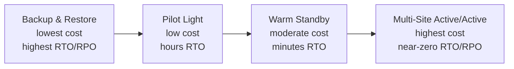

# Module 64 — AWS: Observability, Cost & the Well-Architected Framework — CloudWatch, X-Ray & Multi-Region DR

> Domain: AWS | Level: Beginner → Expert | Prerequisite: All prior AWS modules (57–63) — this module is the synthesizing capstone, applying the Well-Architected Framework's six pillars retrospectively across every AWS topic this domain has covered; [[../17-Microservices/02-Resilience-Observability-Sidecar-Patterns]] (distributed tracing fundamentals, now expressed via X-Ray)

---

## 1. Fundamentals

### Why does a Principal Engineer need an explicit observability/cost/Well-Architected capstone rather than treating these as implementation details of each individual service?
Every prior AWS module in this domain (57-63) surfaced the same recurring pattern independently — a specific setting or metric that's invisible until a specific triggering condition exposes it (Module 57's warm-up window, Module 58's over-permissioned role, Module 59's snapshot-lag gap, Module 60's replication lag, Module 61's idempotency gap, Module 62's messaging-service mismatch, Module 63's shared-role recurrence) — observability is the *general, cross-cutting mechanism* that converts each of these from "invisible until an incident" into "visible and alertable before an incident," and cost optimization and the Well-Architected Framework provide the structured, repeatable review process a Principal Engineer uses to systematically apply this domain's entire body of lessons to any new or existing workload, rather than relying on having personally experienced each specific failure mode before knowing to check for it.

### Why does this matter?
Because a Principal Engineer is regularly expected to conduct exactly this kind of structured review — a Well-Architected Framework review, an incident postmortem, a cost-optimization pass — across systems they didn't originally build, and the ability to systematically apply this domain's patterns (via the Framework's six pillars) rather than relying on ad hoc, incident-driven learning is what distinguishes reviewable, teachable Principal-level judgment from individually-accumulated tribal knowledge.

### When does this matter?
Continuously, for any live AWS workload (observability is not a one-time setup but an ongoing operational discipline) and periodically/structurally (a Well-Architected review at major milestones — pre-launch, post-incident, before a significant scaling event — and an ongoing cost-optimization cadence as a workload's actual usage patterns evolve).

### How does it work (30,000-ft view)?
```
CloudWatch: metrics, logs, alarms, dashboards -- the foundational observability layer across
     every AWS service covered in this domain
X-Ray: distributed TRACING -- follows a single request across multiple services/Lambda functions,
     the AWS-native implementation of Module 50's distributed-tracing discussion
Well-Architected Framework: AWS's structured review methodology across 6 pillars --
     Operational Excellence, Security, Reliability, Performance Efficiency, Cost Optimization,
     Sustainability
Cost Optimization: Savings Plans/Reserved Instances, right-sizing, Spot capacity, and the
     specific cost implications of nearly every decision covered in Modules 57-63
```

---

## 2. Deep Dive

### 2.1 CloudWatch — Metrics, Logs, and Alarms as the Foundational Layer Beneath Every Prior Module
CloudWatch is the substrate underlying nearly every specific monitoring recommendation already made throughout this domain — Module 57 §9's ASG capacity monitoring, Module 60 §4's `ReplicaLag` alarm, Module 62 §Advanced Q7's Kinesis `IteratorAgeMilliseconds` monitoring, Module 63's ECS deployment health metrics — all are CloudWatch metrics with alarm thresholds. The critical discipline this module makes explicit: an alarm threshold must be tied to the **specific workload's actual business tolerance** for the metric in question (a checkout service's acceptable replica lag might be seconds; an analytics pipeline's might be hours), not a generic, uniformly-applied default threshold — a recurring, specific instance of this domain's broader "explicitly compute your actual requirement, don't assume a default is adequate" theme (first established in Module 59 §Advanced Q1's RPO-computation discipline).

### 2.2 X-Ray — Distributed Tracing as the AWS-Native Implementation of Module 50's Observability Discussion
X-Ray traces a single logical request as it flows across multiple services (API Gateway → Lambda → DynamoDB, or across an ECS service mesh, Module 63 §2.4) — directly implementing Module 50's distributed-tracing discussion concretely: without distributed tracing, diagnosing which specific service in a multi-hop request chain introduced elevated latency or an error requires manually correlating logs across every service involved (slow, error-prone, and precisely the debuggability weakness Module 52 flagged for choreography-style architectures) — X-Ray's service map and trace timeline make this correlation automatic and visual, directly addressing that weakness at the tooling layer even when the underlying architecture remains genuinely decoupled (choreography's architectural benefits and X-Ray's observability benefits are not in tension; X-Ray specifically compensates for choreography's debugging cost without requiring a shift toward orchestration).

### 2.3 The Well-Architected Framework's Six Pillars — a Structured Lens for Everything This Domain Covered
**Operational Excellence** (can you operate this system safely, and learn from operational events — directly Module 63's deployment-safety and Module 57-58's automated-governance-gate discipline); **Security** (Module 58's IAM discipline, Module 57 §8/Module 59 §8's defense-in-depth); **Reliability** (Module 57's multi-AZ discipline, Module 59's durability-tier reasoning, Module 60's replication-consistency discipline); **Performance Efficiency** (Module 59 §7/Module 60 §7's capacity-dimension-reconciliation pattern); **Cost Optimization** (§2.4 below); **Sustainability** (the newest pillar — right-sizing and eliminating idle/unused capacity, which, notably, is almost always cost-optimization-aligned as well, meaning the two pillars frequently reinforce rather than trade off against each other) — a Principal Engineer conducting a Well-Architected review should recognize that nearly every specific lesson from Modules 57-63 maps cleanly onto one or more of these six pillars, making the Framework a genuinely comprehensive checklist rather than a separate body of new knowledge to learn from scratch.

### 2.4 Cost Optimization — the Financial Expression of Nearly Every Prior Architectural Decision
Cost is rarely a standalone concern independent of the architectural decisions already covered — an over-provisioned RDS instance (Module 60), a Lambda function with unnecessarily-broad provisioned concurrency (Module 61 §2.2), an S3 bucket never transitioned out of Standard storage class (Module 59 §2.4), an EKS cluster adopted without a genuine multi-cloud requirement (Module 63 §2.1) — are all simultaneously architecture-correctness issues *and* cost issues, meaning a disciplined cost-optimization review substantially overlaps with, rather than duplicates, this domain's other architectural-review disciplines. Compute purchasing options — **On-Demand** (pay per use, no commitment, for unpredictable/short-lived workloads), **Savings Plans/Reserved Instances** (committed-use discounts for steady-state, predictable baseline load), **Spot** (deeply discounted, interruptible capacity for fault-tolerant, flexible workloads) — should be matched to each specific workload's actual usage pattern, directly Module 57 §2.5's ASG-elastic-capacity-matching discipline now expressed as a cost-purchasing decision: a steady-state baseline load should be covered by Savings Plans, with elastic/bursty capacity above that baseline covered by On-Demand (and, for genuinely fault-tolerant batch/background workloads, Spot).

### 2.5 Multi-Region Disaster Recovery — the Capstone Expression of Module 57 §Advanced Q4's Region-vs-AZ Distinction
Module 57 §Advanced Q4 already established that multi-AZ resilience does not protect against a Region-level failure — this module makes the DR-strategy decision concrete: **Backup & Restore** (lowest cost, highest RTO/RPO — data backed up to another Region, infrastructure provisioned only during an actual disaster), **Pilot Light** (minimal, always-on core infrastructure in a secondary Region, scaled up during a disaster), **Warm Standby** (a scaled-down but fully functional secondary-Region deployment, scaled up during a disaster), **Multi-Site Active/Active** (both Regions fully serving live production traffic simultaneously, highest cost, lowest RTO/RPO) — the correct strategy is determined by the workload's actual, explicitly-computed RTO/RPO business requirement (directly Module 59 §Advanced Q1's explicit-RPO-computation discipline, now applied at the Region-failure scope rather than the single-storage-tier scope), not a default assumption that any one DR strategy is "good enough" without that computation.

### 2.6 Cost/Reliability/Performance as a Genuine Three-Way Trade-off, Not a Free Lunch
This entire domain's recurring "independently-configured settings must be reconciled together" pattern culminates here: a Principal Engineer must explicitly reason about the three-way trade-off between cost, reliability, and performance for every significant architectural decision (Multi-Site Active/Active DR gives the best RTO/RPO at the highest cost; Spot capacity gives the best cost at the cost of interruption risk; over-provisioned Reserved Instances give predictable performance at the cost of paying for unused capacity) — there is no single universally-correct point on this trade-off, and the Well-Architected review's actual value is forcing an explicit, documented, business-requirement-driven choice on each dimension for each specific workload, rather than an implicit, undifferentiated default applied uniformly across an entire estate regardless of each workload's actual criticality.

---

## 3. Visual Architecture

### X-Ray Distributed Trace Across a Multi-Service Request (§2.2)

```mermaid
gantt
    dateFormat X
    axisFormat %Lms
    section API Gateway
    Request routing        :0, 20
    section Lambda: checkout
    Cold start (if any)    :20, 180
    Handler logic           :180, 250
    section Lambda: charge-payment
    Invocation               :250, 420
    section Aurora
    Query: debit balance      :270, 310
    section DynamoDB
    Write: audit log          :420, 450
```


### DR Strategy Spectrum (§2.5)


## 4. Production Example
**Scenario**: A mid-sized SaaS platform had grown its AWS footprint organically across two years, with each individual service team independently making its own infrastructure decisions (RDS instance sizes, Lambda provisioned-concurrency settings, S3 storage-class configuration) with no centralized review process — a new VP of Engineering commissioned a full Well-Architected Framework review ahead of a major fundraising round's technical due-diligence process. **Investigation**: the review surfaced, across the six pillars, findings that individually echoed nearly every lesson this domain established: several RDS instances (Reliability/Cost pillars) were running Multi-AZ-disabled in production despite handling customer-facing transactional data (Module 57/60's exact single-AZ risk); one team's S3 buckets (Cost pillar) had never had lifecycle rules configured, with several terabytes of genuinely cold data still on S3 Standard (Module 59 §2.4's exact cost anti-pattern); a legacy service still used a single, broad shared IAM role across multiple Lambda functions (Security pillar, Module 58/61's exact blast-radius risk); and no workload had an explicitly-documented RTO/RPO or corresponding DR strategy at all (Reliability pillar, Module 64 §2.5's exact gap) — none of these had caused a customer-visible incident yet, but the due-diligence process's structured, comprehensive review surfaced all of them simultaneously, where the organization's prior team-by-team, ad hoc operational practice had missed each one independently. **Root cause**: the absence of any structured, periodic, cross-cutting review meant each team's locally-reasonable decisions (or deferred non-decisions) accumulated into a portfolio of latent, uncorrelated risks that no single team had visibility into or ownership of collectively — precisely the failure mode a Well-Architected review, by design, is structured to surface, since it forces an explicit pass across every pillar for every workload rather than relying on any individual team's own, necessarily partial, awareness. **Fix**: prioritized remediation by blast-radius/likelihood (the shared IAM role and disabled Multi-AZ addressed first, as the highest-severity findings per this domain's established severity-reasoning), established a recurring (quarterly) Well-Architected review cadence going forward rather than a one-time audit, and assigned explicit pillar-ownership (a named person/team responsible for tracking each pillar's findings to remediation, not a diffuse, everyone's-responsibility ownership model that tends to result in no one's actual responsibility). **Lesson**: this incident is the domain-level synthesis of this entire module's recurring theme — every individual finding was, in isolation, a lesson this course already covered; the actual, additional lesson here is structural: without a periodic, comprehensive, cross-cutting review mechanism, individually-known lessons don't automatically get applied consistently across a growing, multi-team estate, and the review process itself (not just the underlying technical knowledge) is a distinct, necessary Principal-Engineer-level practice.

## 5. Best Practices
- Tie every CloudWatch alarm threshold to the specific workload's actual, explicitly-considered business tolerance for that metric, never a generic default applied uniformly (§2.1).
- Adopt X-Ray (or equivalent distributed tracing) for any multi-service request path, specifically to compensate for choreography-style architectures' inherent debuggability weakness without abandoning their architectural benefits (§2.2).
- Conduct Well-Architected Framework reviews on a recurring cadence (not a one-time audit), with explicit, named pillar-ownership for tracking findings to remediation (§4).
- Explicitly compute RTO/RPO business requirements per workload before selecting a DR strategy — never default to "backup and restore is probably fine" without that computation (§2.5).
- Match compute purchasing options (On-Demand/Savings Plans/Spot) to each workload's actual usage pattern, treating cost optimization as substantially overlapping with, not separate from, correctness-focused architectural review (§2.4).

## 6. Anti-patterns
- Allowing each team to independently make infrastructure decisions with no periodic, cross-cutting review mechanism, letting individually-known lessons fail to propagate consistently across a growing estate (§4).
- Setting CloudWatch alarm thresholds to generic defaults without explicitly considering each specific workload's actual business tolerance for the metric.
- Treating cost optimization as a separate, purely-financial exercise disconnected from the architectural-correctness reviews this domain has otherwise established.
- Selecting a DR strategy (or, more commonly, having none at all) without first explicitly computing the workload's actual RTO/RPO requirement.
- Conducting a Well-Architected review as a one-time, pre-launch or pre-funding-round exercise rather than a recurring operational discipline, allowing new latent risk to accumulate unchecked between reviews.

## 7. Performance Engineering
X-Ray's own sampling rate (the percentage of requests actually traced, since tracing every single request at very high volume introduces both cost and overhead) must be tuned against the workload's actual diagnostic needs — a too-low sampling rate risks missing the specific trace that would have explained a rare, intermittent issue, while 100% sampling at very high request volume can itself become a meaningful cost and overhead factor, the same cost/completeness trade-off recurring from this domain's other capacity-planning discussions. Reserved Instance/Savings Plan commitment terms (1-year vs. 3-year, All Upfront vs. No Upfront) trade a larger discount for reduced future flexibility — a Principal Engineer should size commitments against the *stable, high-confidence baseline* portion of a workload's usage (directly Module 57 §2.5's steady-demand-vs-elastic-spike distinction) rather than the full observed peak, since over-committing to a discount tier sized for peak usage leaves the organization paying for committed capacity during normal, lower-usage periods.

## 8. Security
The Well-Architected Framework's Security pillar (§2.3) should be the review mechanism that periodically re-surfaces exactly the class of finding §4's incident describes (a shared IAM role, per Module 58/61/63 — three separate modules in this domain independently identifying the identical anti-pattern recurring at different layers) — this recurrence across compute (Module 61), containers (Module 63), and general IAM (Module 58) is itself evidence that a single point-in-time fix doesn't prevent the same anti-pattern reappearing in a new context, reinforcing why a *recurring* review cadence (§4's fix), not a one-time remediation, is the structurally correct response. CloudWatch Logs and X-Ray traces themselves can contain sensitive data (request payloads, potentially PII) — log/trace retention policies and access controls should be reviewed with the same least-privilege and encryption-at-rest discipline (Module 58) applied to any other sensitive data store, since observability tooling is not exempt from the data-security review the rest of this domain establishes for every other data-holding AWS service.

## 9. Scalability
CloudWatch itself has account-level API rate limits and per-metric/per-log-group ingestion limits that a very high-scale, high-cardinality metrics/logging strategy (excessive custom-metric dimensions, extremely verbose per-request logging at very high request volume) can hit — the same "the observability tooling itself is a capacity-planned resource, not a limitless utility" lesson applies here as it did for every other AWS service in this domain (Module 57 §9 through Module 63 §9). A multi-Region Active/Active DR strategy (§2.5) introduces its own, genuinely new scalability dimension: cross-Region data replication (for any stateful component) must itself be capacity-planned and monitored (replication lag, per Module 60 §2.2/§4's exact discipline, now applied at the cross-Region rather than cross-AZ scope) — Active/Active DR does not eliminate the need for the same replication-consistency reasoning this domain has applied throughout, it applies that reasoning at a larger geographic scope with correspondingly larger latency and consistency implications.

---

## 10. Interview Questions

### Basic (10)
1. **Q: What is the foundational observability layer underlying nearly every AWS service's monitoring in this domain?** **A:** CloudWatch (metrics, logs, alarms, dashboards).
2. **Q: What does X-Ray provide?** **A:** Distributed tracing — following a single logical request as it flows across multiple services.
3. **Q: What are the six pillars of the AWS Well-Architected Framework?** **A:** Operational Excellence, Security, Reliability, Performance Efficiency, Cost Optimization, and Sustainability.
4. **Q: What is the difference between Reserved Instances/Savings Plans and Spot capacity?** **A:** Reserved Instances/Savings Plans offer committed-use discounts for predictable, steady-state load; Spot offers deep discounts for interruptible, fault-tolerant workloads.
5. **Q: What are the four common DR strategies, ordered by increasing cost and decreasing RTO/RPO?** **A:** Backup & Restore, Pilot Light, Warm Standby, Multi-Site Active/Active.
6. **Q: What should determine which DR strategy a workload adopts?** **A:** The workload's explicitly-computed RTO/RPO business requirement, not a default assumption.
7. **Q: Why should CloudWatch alarm thresholds not use a generic default across every workload?** **A:** Because each workload has a different actual business tolerance for a given metric's degradation.
8. **Q: What specific architectural weakness does X-Ray directly compensate for?** **A:** Choreography-style architectures' inherent debuggability weakness (Module 52), without requiring a shift toward orchestration.
9. **Q: Why is cost optimization described as substantially overlapping with architectural-correctness review rather than a separate concern?** **A:** Because most cost-inefficiencies (over-provisioned instances, un-tiered S3 storage, unnecessary EKS adoption) are simultaneously architecture-correctness issues.
10. **Q: What did the §4 incident's Well-Architected review reveal about the organization's prior operational practice?** **A:** That team-by-team, ad hoc decision-making without a periodic cross-cutting review let multiple already-known anti-patterns (shared IAM roles, disabled Multi-AZ, un-tiered storage, no documented DR strategy) accumulate unnoticed.

### Intermediate (10)
1. **Q: Why is the Well-Architected Framework described as "a structured lens for everything this domain covered" rather than new knowledge?** **A:** Nearly every specific lesson from Modules 57-63 maps directly onto one or more of the six pillars — the Framework's value is providing a systematic checklist ensuring comprehensive application of already-established knowledge, not introducing separate new concepts.
2. **Q: Why does X-Ray's benefit not require abandoning a choreography-style architecture in favor of orchestration?** **A:** X-Ray addresses the debugging/visibility cost at the tooling layer (making cross-service request flow observable after the fact) without changing the underlying architecture's actual coupling/decoupling characteristics — choreography's decoupling benefits and X-Ray's visibility benefits are independent and complementary.
3. **Q: Why does the §4 incident's finding of the same shared-IAM-role anti-pattern recurring at Modules 58, 61, and 63 reinforce the case for a recurring review cadence rather than a one-time fix?** **A:** The anti-pattern reappearing independently in different contexts (general IAM, Lambda, containers) demonstrates that fixing one instance doesn't prevent the same underlying practice from recurring elsewhere — only a standing, periodic review mechanism catches new instances as they're introduced, rather than assuming a single remediation pass is sufficient permanently.
4. **Q: Why should Reserved Instance/Savings Plan commitments be sized against a workload's stable baseline rather than its observed peak?** **A:** Over-committing to a discount tier sized for peak usage means paying for that committed capacity continuously, including during normal, lower-usage periods when the workload doesn't actually need it — the commitment should cover only the portion of usage that's genuinely steady and predictable.
5. **Q: Why is "we have backups, so we have disaster recovery" an insufficient characterization without further specification?** **A:** Backup & Restore is only one of several DR strategies, with the highest RTO/RPO (slowest recovery, most potential data loss) among the options — whether it's actually *sufficient* depends entirely on the workload's explicit RTO/RPO requirement, which "we have backups" doesn't itself establish as adequate.
6. **Q: Why does assigning explicit, named pillar-ownership matter for a Well-Architected review's actual remediation outcome, beyond just conducting the review?** **A:** A review that surfaces findings without clear ownership tends toward diffuse, "everyone's responsibility" accountability, which in practice often means no one's actual responsibility — explicit ownership converts findings into tracked, accountable remediation work rather than a report that's read once and shelved.
7. **Q: Why must X-Ray's sampling rate be deliberately tuned rather than defaulting to either extreme (very low or 100%)?** **A:** Too-low sampling risks missing the specific trace needed to diagnose a rare, intermittent issue; 100% sampling at high request volume introduces meaningful cost and processing overhead — the correct rate balances diagnostic completeness against that cost, based on the workload's actual troubleshooting needs.
8. **Q: Why does a multi-Region Active/Active DR strategy not eliminate the replication-consistency reasoning established in Module 60?** **A:** Any stateful component replicated across Regions still has real replication lag and consistency-model implications, now at cross-Region rather than cross-AZ scope — Active/Active provides architecture for near-zero RTO/RPO, but the underlying data-consistency trade-offs from Module 60 §2.2 still apply and must still be explicitly reasoned about.
9. **Q: Why is CloudWatch itself described as a capacity-planned resource rather than a limitless utility?** **A:** It has account-level API rate limits and per-metric/log-group ingestion limits that a sufficiently high-scale, high-cardinality observability strategy can hit, requiring the same proactive capacity awareness this domain has applied to every other AWS service.
10. **Q: Why should CloudWatch Logs and X-Ray trace data be subject to the same data-security review discipline as any other sensitive data store?** **A:** Logs and traces frequently contain request payloads or other potentially sensitive/PII data, and are not automatically exempt from the least-privilege/encryption discipline (Module 58) that applies to every other AWS data-holding service — observability tooling is itself a data store requiring the same governance.

### Advanced (10)
1. **Q: Diagnose the §4 incident from first principles, and design the specific organizational structure (not just a technical checklist) that prevents this class of accumulated-latent-risk finding from recurring after the initial remediation.**
   **A:** Root cause: no periodic, cross-cutting review mechanism existed at all — each team's individually-reasonable decisions accumulated into an uncorrelated risk portfolio with no single point of visibility. Structural fix: establish a recurring (e.g., quarterly) Well-Architected review as a standing organizational process with explicit, rotating or permanently-assigned pillar ownership (§4's fix), **and** integrate automated checks for the specific, previously-identified anti-patterns (the shared-IAM-role linting from Module 58 §Advanced Q1, the Multi-AZ-verification check from Module 57 §Advanced Q10) directly into the deployment pipeline, so that the *majority* of findings are caught continuously and automatically between formal reviews, with the periodic Well-Architected review serving as a comprehensive backstop for findings automated checks don't yet cover, rather than the sole detection mechanism.
2. **Q: A team argues that since their workload has 100% X-Ray sampling enabled, they have complete observability and no longer need well-designed CloudWatch alarms, since they can always trace any issue after the fact. Evaluate this claim.**
   **A:** Push back — tracing (X-Ray) and alerting (CloudWatch alarms) serve fundamentally different purposes: tracing helps diagnose *why* a specific already-detected issue occurred, but doesn't itself detect that an issue is occurring — without properly-tuned alarms, a degradation (elevated latency, a rising error rate) could persist for a long time, genuinely affecting customers, before anyone notices to go looking at traces at all; 100% trace sampling with no alerting discipline means excellent diagnostic depth but poor incident-detection speed — both capabilities are necessary and address different, complementary needs (detection vs. diagnosis).
3. **Q: Design the specific process for computing an accurate RTO/RPO requirement for a given workload, avoiding both under-specification (leading to an inadequate DR strategy) and over-specification (leading to unjustified DR cost).**
   **A:** RTO/RPO should be derived from an explicit, quantified business-impact analysis — not a technical team's own assumption — asking stakeholders (product, business, legal/compliance as relevant) specific questions: "if this system were unavailable for X hours, what is the quantified business/customer/compliance impact?" and "if we lost the last Y minutes/hours of data, what is that impact?" — repeated at multiple candidate X/Y values to find the actual inflection point where impact becomes unacceptable, directly generalizing Module 59 §Advanced Q1's per-workload RPO-computation discipline into a repeatable, stakeholder-inclusive methodology rather than a purely technical estimate that risks either underestimating genuine business risk or over-engineering DR cost the business wouldn't have actually demanded if asked explicitly.
4. **Q: Critique the following claim: "Since we conducted a thorough Well-Architected review before our funding round and remediated every finding, our architecture is now sound and doesn't need further review."**
   **A:** This treats the review as a one-time event rather than the recurring operational discipline §4's fix establishes — new findings accumulate continuously as new services are built, new team members make new locally-reasonable-but-uncoordinated decisions, and AWS itself evolves its service offerings and best practices; a Well-Architected review's value is in its recurrence, catching the *next* round of accumulated findings before they, too, require a due-diligence-triggered crisis review to surface — "we did one review" provides a point-in-time snapshot, not an ongoing guarantee.
5. **Q: A workload's cost-optimization review recommends migrating from On-Demand to a 3-year All-Upfront Savings Plan for a 40% discount, based on the current baseline usage. The Principal Engineer is asked to evaluate this recommendation. What additional information is needed before approving it?**
   **A:** Whether the current baseline usage is genuinely stable and likely to persist for the full 3-year commitment period, or reflects a workload still evolving (a growing product likely to change its compute profile, a service planned for future re-architecture or potential decommissioning) — committing to a 3-year, All-Upfront (least-flexible) plan against a usage pattern that might materially change well before the commitment period ends risks paying for capacity the organization no longer actually needs, directly Module 57 §Advanced Q4's general "match resilience/commitment investment to genuine, validated business requirement, don't over-commit beyond actual need" principle, now applied to financial commitment terms specifically — a shorter-term or more-flexible commitment (1-year, No Upfront) may be the more defensible choice for a less-certain usage trajectory even at a smaller discount.
6. **Q: Design an approach for validating that a workload's chosen DR strategy (e.g., Warm Standby) actually achieves its target RTO/RPO in practice, rather than assuming the architectural design is sufficient without verification.**
   **A:** Conduct a scheduled, periodic **DR drill** — actually failing over to the secondary Region (or, at minimum, a realistic simulation) and measuring the actual time-to-recovery and actual data-loss window against the documented RTO/RPO targets — directly the same "steady-state assumption doesn't substitute for testing the actual failure-triggering condition" pattern this entire domain has established (Module 57 §Advanced Q1's scaling-event load test, Module 60 §Advanced Q3's replication-lag load test), now applied at the Region-failover scale — an untested DR strategy carries the same "looks correct on paper, unverified in practice" risk as any other untested resilience mechanism this course has covered.
7. **Q: Explain why the recurring appearance of the "shared, overly-broad IAM role" anti-pattern across Modules 58, 61, 63, and again in §4's incident should be treated as evidence about organizational practice, not merely a repeated technical mistake.**
   **A:** The same specific, previously-identified, well-understood anti-pattern recurring across multiple independent contexts (general IAM roles, Lambda execution roles, ECS task roles, and again in a from-scratch organizational review) indicates the underlying cause isn't a knowledge gap (the anti-pattern and its fix are well-documented within this domain) but a **process** gap — the absence of a structural mechanism (an automated linting check, a mandatory review gate) that would catch this specific, known anti-pattern regardless of which team or context introduces it next — this is the central, generalized lesson of this capstone module: known technical lessons require structural enforcement mechanisms to reliably propagate across a growing organization, not just documentation or training.
8. **Q: A Principal Engineer is evaluating whether Sustainability and Cost Optimization genuinely always reinforce each other (§2.3's claim) or whether a scenario exists where they diverge. Identify one such scenario.**
   **A:** They diverge when a cost-optimization choice trades increased resource consumption for a different kind of savings not reflected in idle-capacity elimination — for example, choosing a larger, more powerful instance type to reduce the *number* of instances needed (potentially reducing per-unit operational/licensing costs) could, depending on the specific instances' utilization efficiency, use more aggregate compute resources than several smaller, more tightly-utilized instances, even if the larger-instance approach is cheaper on a pure AWS-billing basis — Sustainability and Cost Optimization "almost always" align (as §2.3 states) precisely because idle/unused capacity is both wasted money and wasted resources, but a Principal Engineer should recognize this is a strong correlation, not an absolute guarantee, and evaluate genuinely resource-intensive-but-cost-efficient choices against both pillars independently rather than assuming alignment.
9. **Q: Design the specific set of X-Ray/CloudWatch instrumentation needed to make the checkout saga workflow from Module 61 §Advanced Q6 (Step Functions with compensating refund action) fully diagnosable end-to-end, including the compensating-action path.**
   **A:** Instrument every state in the Step Functions workflow (ChargePayment, ReserveShipping, RefundPayment) with X-Ray tracing propagated through each Lambda invocation, correlated by a single trace ID spanning the entire saga execution (including the compensating branch, not just the happy path) — combined with a CloudWatch alarm specifically on the rate of executions entering the `RefundPayment`/compensating-action branch (a rising compensation rate is itself a leading indicator of a growing problem in the `ReserveShipping` step, worth alerting on independently of any individual saga's own success/failure) — ensuring both the ability to trace any single problematic saga execution end-to-end and the ability to detect a systemic, aggregate increase in compensation-branch activity before it's noticed only via accumulated customer complaints.
10. **Q: As a Principal Engineer establishing a comprehensive operational-excellence program for an organization's entire AWS estate, design the specific standing structure (synthesizing this entire module, and implicitly this entire AWS domain) that ties together the individual governance gates each prior module (57-63) established.**
    **A:** (1) A recurring (quarterly) Well-Architected Framework review with named, accountable pillar ownership (§4, Advanced Q1) as the comprehensive backstop. (2) Every module-specific automated governance gate already established in this domain (Module 57's Multi-AZ verification, Module 58's IAM policy linting, Module 59's RPO validation, Module 60's read-routing/replica-lag checks, Module 61's idempotency/reserved-concurrency review, Module 62's messaging-service justification review, Module 63's task-role migration-safety gate) integrated into a single, centrally-tracked deployment-pipeline policy suite, so that the majority of known-anti-pattern instances are caught continuously rather than only at quarterly review cadence. (3) Business-stakeholder-inclusive RTO/RPO computation (Advanced Q3) as a mandatory input to any new workload's architecture, not a purely technical estimate. (4) Scheduled, periodic DR drills (Advanced Q6) validating that documented DR strategies actually achieve their targets in practice, not just on paper. (5) Cost-optimization review integrated into (not separate from) the same recurring cadence, given its substantial overlap with the other pillars' findings (§2.4). This structure directly synthesizes every governance mechanism established across Modules 57-64 into one coherent, continuously-operating program, rather than leaving each module's lesson as an isolated, easily-forgotten piece of technical knowledge.

---

## 11. Coding Exercises

### Easy — CloudWatch alarm tied to a specific business-tolerance threshold (§2.1)
```hcl
resource "aws_cloudwatch_metric_alarm" "replica_lag_checkout" {
  alarm_name          = "checkout-db-replica-lag-critical"
  metric_name         = "ReplicaLag"
  namespace           = "AWS/RDS"
  statistic           = "Maximum"
  period              = 60
  evaluation_periods  = 2
  # 2000ms threshold -- derived from checkout's OWN documented read-after-write tolerance (§2.1),
  # NOT a generic default reused across every RDS instance in the account.
  threshold           = 2000
  comparison_operator = "GreaterThanThreshold"
  alarm_actions       = [aws_sns_topic.pagerduty_critical.arn]
}
```

### Medium — X-Ray instrumentation across a Lambda-to-DynamoDB call (§2.2)
```csharp
[XRayTracing]
public async Task<APIGatewayProxyResponse> HandleAsync(APIGatewayProxyRequest request)
{
    using var subsegment = AWSXRayRecorder.Instance.BeginSubsegment("ProcessOrder");
    try
    {
        var order = await ProcessOrderAsync(request);   // downstream DynamoDB calls
                                                            // automatically traced via the AWS SDK's
                                                            // X-Ray instrumentation -- correlated to
                                                            // this SAME trace ID (§2.2)
        return Success(order);
    }
    catch (Exception ex)
    {
        subsegment.AddException(ex);   // exception visible directly on the trace timeline
        throw;
    }
    finally { AWSXRayRecorder.Instance.EndSubsegment(); }
}
```

### Hard — Automated Well-Architected-style governance check bundling prior modules' gates (§Advanced Q10)
```csharp
public class PipelineGovernanceCheck
{
    public async Task<GovernanceResult> ValidateAsync(DeploymentManifest manifest)
    {
        var findings = new List<string>();

        // Module 57: Multi-AZ verification
        if (manifest.Rds is { MultiAz: false, Environment: "production" })
            findings.Add("RDS instance missing Multi-AZ in production (Module 57 §2.2)");

        // Module 58: IAM policy linting
        if (manifest.IamPolicies.Any(p => p.HasWildcardAction || p.HasWildcardResource))
            findings.Add("Wildcard IAM policy detected -- requires explicit exception (Module 58 §Advanced Q1)");

        // Module 61/63: shared/legacy role detection
        if (manifest.TaskRoles.Any(r => r.RoleArn.Contains("legacy-shared-role")))
            findings.Add("Deployment references legacy shared task role (Module 58 §4 / Module 63 §4)");

        // Module 59: RPO validation
        if (manifest.S3Buckets.Any(b => b.LifecycleRules.Count == 0 && b.EstimatedSizeGb > 100))
            findings.Add("Large S3 bucket with no lifecycle rules (Module 59 §2.4)");

        return new GovernanceResult { Passed = findings.Count == 0, Findings = findings };
    }
}
```

### Expert — Multi-Region Warm Standby health-based failover (§2.5)
```hcl
resource "aws_route53_health_check" "primary_region" {
  fqdn              = "api.platform.com"
  port              = 443
  type              = "HTTPS"
  resource_path     = "/ready"   # genuine readiness check, NOT liveness-only (Module 57 §4's lesson, recurring here)
  failure_threshold = 3
  request_interval  = 10
}

resource "aws_route53_record" "primary" {
  name           = "api.platform.com"
  type           = "A"
  set_identifier = "primary"
  failover_routing_policy { type = "PRIMARY" }
  health_check_id = aws_route53_health_check.primary_region.id
  alias { name = aws_lb.primary_region_alb.dns_name; zone_id = aws_lb.primary_region_alb.zone_id; evaluate_target_health = true }
}

resource "aws_route53_record" "secondary" {
  name           = "api.platform.com"
  type           = "A"
  set_identifier = "secondary"
  failover_routing_policy { type = "SECONDARY" }   # Warm Standby -- scaled-down but functional (§2.5)
  alias { name = aws_lb.secondary_region_alb.dns_name; zone_id = aws_lb.secondary_region_alb.zone_id; evaluate_target_health = true }
}
```
**Discussion**: the health check specifically targets `/ready` (Module 57 §4's readiness-not-liveness lesson recurring one final time at the Region-failover scale) — a primary Region that's technically reachable but genuinely degraded (failing dependency connectivity) should trigger failover just as reliably as a fully unreachable primary Region, since a liveness-only check here would leave DNS failover blind to exactly the "alive but broken" failure mode this domain has repeatedly identified as the most dangerous, least obvious kind.

---

## 12–17. System Design / LLD / Debugging / Decision / Case Study / Principal

*(§4's incident, the four §11 exercises, and the Advanced-tier Q&A — especially Advanced Q1's organizational governance structure, Advanced Q3's stakeholder-inclusive RTO/RPO methodology, and Advanced Q10's fully-synthesized, domain-spanning governance program — collectively constitute this module's system-design, debugging, and Principal-Engineer-level content, and serve as the capstone synthesis of the entire `21-AWS` domain, Modules 57–64.)*

## 18. Revision
**Key takeaways**: This capstone module's central lesson is that observability, cost optimization, and the Well-Architected Framework are not new technical knowledge but a *systematic, recurring process* for applying every lesson Modules 57-63 already established — CloudWatch/X-Ray make the "invisible until a triggering condition" failure modes visible before they become incidents; the Well-Architected Framework's six pillars map directly onto this domain's existing body of knowledge; and cost optimization substantially overlaps with, rather than duplicates, architectural-correctness review. The §4 incident's central lesson — the same shared-IAM-role anti-pattern recurring independently across Modules 58, 61, and 63 despite being well-documented each time — demonstrates that known technical lessons require **structural, automated enforcement mechanisms**, not just documentation, to reliably propagate across a growing organization; a recurring review cadence with named pillar-ownership, combined with automated pipeline-level governance gates synthesizing every prior module's specific checks, is the correct organizational response. DR strategy selection and RTO/RPO computation must be explicit, business-stakeholder-driven, and periodically validated via actual drills — an untested DR strategy carries the same unverified risk as any other untested resilience mechanism this course has covered.

---

**AWS domain complete (Modules 57–64):** Compute & Networking, IAM & Security, Storage, Databases, Serverless, Messaging/EDA-on-AWS, Containers/Microservices-on-AWS, and this capstone Observability/Cost/Well-Architected module — 8 modules at Principal-Engineer depth, each explicitly connected back to this course's Microservices (49–51), Event-Driven Architecture (52–56), and data-layer (18–28) material per the original extra-depth/high-priority scope agreed at the start of this domain.

**Next**: Type "Next" to proceed to the next domain in the roadmap (`22-Azure`), or specify a different focus.
