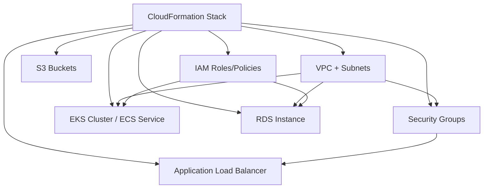
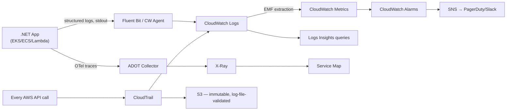
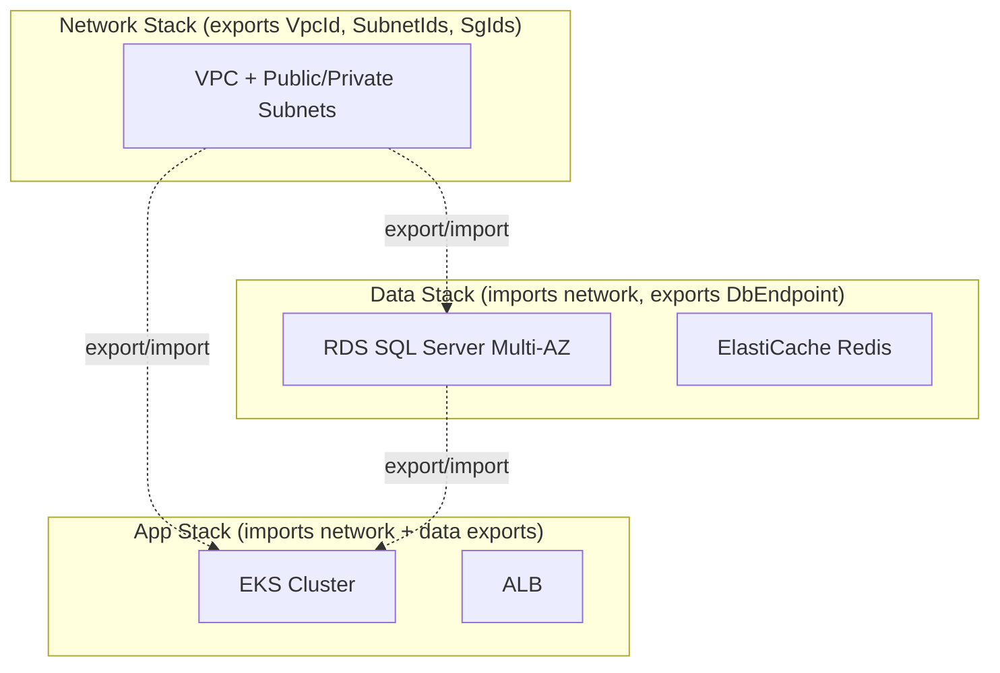
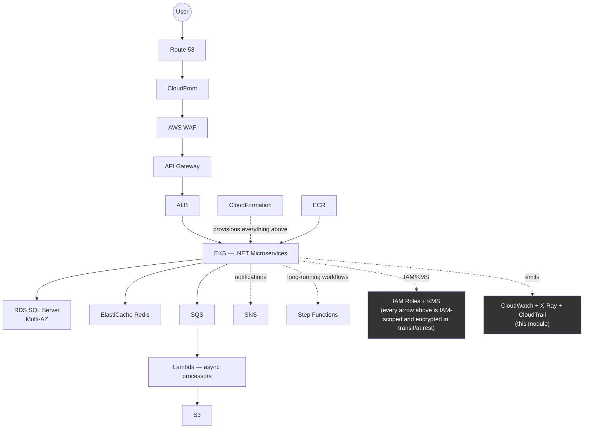
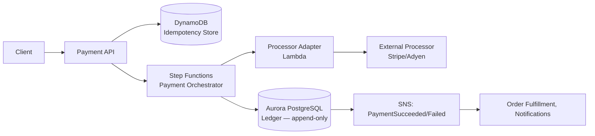

# Module 64 — AWS: Observability, Cost & the Well-Architected Framework — CloudWatch, X-Ray & Multi-Region DR

> Domain: AWS | Level: Beginner → Expert | Prerequisite: All prior AWS modules (57–63) — this module is the synthesizing capstone, applying the Well-Architected Framework's six pillars retrospectively across every AWS topic this domain has covered; [[../17-Microservices/02-Resilience-Observability-Sidecar-Patterns]] (distributed tracing fundamentals, now expressed via X-Ray)

---

## 1. Fundamentals

### What problem does this module solve?
Every prior AWS module (57–63) taught you how to build one piece of a production system — compute, identity, storage, data, functions, messaging, containers. None of them, alone, answer the question a Principal Engineer is actually paid to answer under pressure: **"the system is degraded right now — where, why, and what do we do?"** That question requires three things none of the individual-service modules provide on their own: a way to *see* the system as one correlated whole (CloudWatch/CloudTrail/X-Ray), a way to *build and evolve* the system's infrastructure repeatably and auditably (CloudFormation), and a way to *reason about trade-offs across the whole stack at once* rather than one service at a time (the Well-Architected Framework, the failure catalogue, the PE trade-off framework). This module is where the seven prior modules stop being seven separate services and become one system you can operate, defend in an interview, and defend in a post-incident review.

### Why does this matter?
Because the interview questions that actually separate a Staff Engineer from a Principal Engineer are almost never "what does DynamoDB's partition key do" (Module 60 territory) — they are "walk me through what happens right now, in production, when the RDS primary in us-east-1 stops responding" or "justify, end to end, why this system uses SQS here and Step Functions there, and what breaks if traffic goes up 10x tomorrow." Those are capstone questions. They require you to hold the whole architecture in your head simultaneously, know precisely which failure domain each component sits in, and reason about cost and operational burden as first-class design constraints, not afterthoughts.

### When does this matter?
From the day a system has more than one component (which is every real system) — observability, IaC, and cross-cutting trade-off reasoning are not "advanced" concerns bolted on later; they are what makes every other module's design decisions *operable*. A perfectly-designed DynamoDB table (Module 60) that nobody is alerting on is a production incident waiting to happen with no one watching.

### How does it work (30,000-ft view)?
```
CloudWatch:  the nervous system — Logs (what happened), Metrics (how much/how fast),
             Alarms (something crossed a threshold), Dashboards (the picture),
             Logs Insights (query the logs like a database)
X-Ray:       the connective tissue — one request's journey traced across every
             service boundary it crosses, so "slow" has a specific culprit
CloudTrail:  the immutable record — who (or what) called which AWS API, when,
             from where — the audit trail regulators and incident responders both need
CloudFormation: the blueprint — infrastructure expressed as versioned, reviewable,
             repeatable text instead of a human clicking through the console
Well-Architected Framework: the lens — six pillars (Operational Excellence,
             Security, Reliability, Performance Efficiency, Cost Optimization,
             Sustainability) applied against every architectural decision, retrospectively
             and prospectively
```

---

## 2. Deep Dive

### 2.1 CloudWatch — Logs, Metrics, Alarms, Dashboards, Logs Insights

**Logs.** Every AWS compute service (EC2 via the CloudWatch Agent, ECS/EKS via the awslogs/Fluent Bit log driver, Lambda automatically) can ship stdout/stderr and structured log files to a CloudWatch Logs **Log Group** (a named container, typically one per service/environment) subdivided into **Log Streams** (typically one per task/instance/invocation). The mistake engineers make immediately: treating CloudWatch Logs as a place logs merely *land*, rather than as a queryable store. **Logs Insights** runs a purpose-built query language directly against a log group — `fields @timestamp, @message | filter @message like /OrderId=12345/ | sort @timestamp desc` — without needing to export logs anywhere else first. For a .NET application, this means: use **Serilog** with a CloudWatch sink (or, more robustly in a containerized/EKS deployment, write structured JSON to stdout and let Fluent Bit ship it — decoupling the app from AWS-specific logging SDKs, which matters if you ever need to run the same container outside AWS), and *always* include a **correlation ID** (`TraceId` from `Activity.Current`, propagated via the `traceparent` W3C header) in every log line — without it, Logs Insights queries can find individual events but cannot reconstruct one request's path across services.

**Metrics.** CloudWatch Metrics are time-series data points, each identified by **Namespace** (e.g., `AWS/RDS`), **MetricName** (e.g., `CPUUtilization`), and **Dimensions** (key-value pairs identifying the specific resource, e.g., `DBInstanceIdentifier=prod-orders-db`). AWS services publish their own metrics automatically (free, at a default 5-minute resolution, or 1-minute if "detailed monitoring" is enabled — an explicit cost/granularity trade-off). Application-level metrics require you to publish them yourself. The naive way is the `PutMetricData` API call directly from application code — this is a synchronous network call on your hot path for every metric emission, which is both a latency risk and, at volume, a real cost (CloudWatch charges per metric, per API call). The correct production pattern for a .NET app is **Embedded Metric Format (EMF)**: write a specially-structured JSON blob to stdout/CloudWatch Logs, and CloudWatch automatically extracts it into first-class metrics — no extra API call, no extra network round trip, and it piggybacks on log shipping you're already doing. This is the detail that separates "I've used CloudWatch" from "I understand CloudWatch's actual cost and latency model."

**Alarms.** A CloudWatch Alarm watches one metric (or a math expression across several) against a threshold, over a configured number of evaluation periods, and transitions between OK / ALARM / INSUFFICIENT_DATA. The single most common production alarm-design mistake: alarming on a raw single-period breach (`CPUUtilization > 80% for 1 datapoint`), which fires on ordinary transient spikes and trains the on-call team to ignore pages — versus `> 80% for 3 out of 3 consecutive 5-minute periods`, which absorbs transient noise while still catching sustained degradation quickly. A second, more expensive mistake: alarming only on symptom metrics (CPU, memory) rather than **business-outcome metrics** (checkout success rate, payment-authorization latency p99) — the former can be green while users experience a broken product (e.g., CPU is fine but a downstream dependency is timing out, doubling response latency without touching local CPU at all).

**Composite Alarms** combine multiple alarms with AND/OR logic — critical for reducing alert fatigue during correlated, cascading incidents: if RDS CPU, connection count, and API error rate all fire simultaneously, a composite alarm can page once ("database subsystem degraded") instead of three separate, individually-confusing pages.

**Dashboards** are the human-facing view — but a Principal Engineer's real discipline here is designing dashboards *per audience* (an on-call engineer's dashboard is not an executive's dashboard is not a capacity-planning dashboard), not one universal dashboard nobody reads because it tries to serve everyone.

### 2.2 CloudTrail — the Immutable Audit Record

CloudTrail records every AWS API call made against your account: who (IAM principal), what (API action), when, from where (source IP), and against what resource — delivered as immutable log files to S3 (and optionally streamed to CloudWatch Logs for real-time alerting, e.g., "alert if `DeleteDBInstance` is ever called in production"). This is not optional infrastructure for a regulated financial-services environment — it is the literal audit trail an SOX or PCI-DSS auditor asks for, and the first thing a security incident responder pulls to answer "who did this, and what else did they touch."

The critical, easy-to-miss distinction: **Management events** (control-plane actions — creating a bucket, launching an instance, changing an IAM policy) are logged **by default, at no extra cost**. **Data events** (data-plane actions — a specific S3 `GetObject`/`PutObject` call, a specific DynamoDB `GetItem`/`PutItem` call) are **not logged by default** and must be explicitly enabled — and at high request volume, this can be a genuinely material cost line item, which is exactly why teams under-provision it and then discover, mid-incident, that they cannot answer "which principal read this specific object" because data-event logging was never turned on for that bucket. A Principal Engineer's standing answer: data-event logging is mandatory, not optional, for any bucket/table holding regulated or sensitive data (PII, cardholder data, trade records) — the cost argument does not survive contact with a real audit or breach investigation.

CloudTrail logs are themselves a security target — an attacker who compromises credentials will often try to disable or tamper with CloudTrail to cover their tracks. The defense: enable **log file validation** (CloudTrail signs each delivered log file, so tampering is detectable), deliver logs to a **separate, tightly-locked-down account** (a dedicated "log archive" account in an AWS Organizations multi-account setup) so that even an attacker with admin rights in the compromised account cannot delete the trail of their own actions, and alert on `StopLogging`/`DeleteTrail` calls themselves as a high-severity security event.

### 2.3 X-Ray and Distributed Tracing — Making "Slow" Specific

[[../17-Microservices/02-Resilience-Observability-Sidecar-Patterns]] already established *why* distributed tracing exists (a single user request fans out across many services, and "the API is slow" is meaningless without knowing which of the N hops is actually slow). AWS X-Ray is the concrete AWS-native implementation: each service in the request path emits **segments** (this service's own work) and **subsegments** (calls this service made outward — an HTTP call, a database query, an SDK call), all sharing a **trace ID** propagated across the HTTP boundary. X-Ray assembles these into a **service map** — a visual graph of every service the request touched, with per-edge latency and error rate — which is the single fastest way to answer "where, specifically, in a 12-microservice call graph, did this request spend 800ms."

For a .NET application, the modern, correct integration path is **not** the AWS X-Ray SDK for .NET directly — it is the **OpenTelemetry .NET SDK** (the vendor-neutral standard) configured with the **ADOT (AWS Distro for OpenTelemetry) Collector**, which receives OTLP-format traces from your app and forwards them to X-Ray. This matters for a genuinely important reason: coupling your application code to AWS's proprietary tracing SDK means every trace-instrumentation line becomes a migration cost if you ever move off AWS, whereas OpenTelemetry instrumentation is portable — you only change the *collector's* export target. `Activity` and `ActivitySource` (the .NET primitives OpenTelemetry builds on) are already built into the BCL since .NET 5+, and ASP.NET Core, `HttpClient`, and Entity Framework Core all auto-instrument via existing OpenTelemetry instrumentation packages — meaning a correctly-configured .NET app gets full distributed tracing with near-zero hand-written tracing code, only configuration.

The honest limit: X-Ray (like any sampling-based tracer) typically traces a **percentage** of requests, not all of them (100% tracing at high request volume is both expensive and can itself become a performance tax) — meaning a rare, low-frequency failure mode can genuinely fail to appear in any captured trace. Production tracing configurations should use **error-biased sampling** (always trace requests that error, or that exceed a latency threshold, sample everything else at a low rate) specifically to close this gap for the failures that matter most.

### 2.4 Realistic Production Alerts — Per Service, With the Number and the Reason

A list of "monitor CPU" is not an alerting strategy. The following is what an actual production alerting configuration looks like, service by service — note that in every case the choice of metric and threshold encodes a specific failure mode it is meant to catch, not a generic "something might be wrong":

| Service | Metric | Threshold (illustrative) | Why this specific signal |
|---|---|---|---|
| .NET app (via EMF/OTel) | p99 request latency | > 2× the 7-day rolling p99 baseline, sustained 3 periods | Absolute thresholds age badly as traffic/feature mix shifts; a *relative* baseline catches genuine regressions without constant manual re-tuning |
| .NET app | 5xx error rate | > 1% of requests over 5 min | Business-visible failure rate, not an infra symptom — this is what a customer actually experiences |
| .NET app (GC) | Gen2 GC pause time | > 200ms per pause, or Gen2 collections > 1/min under steady load | A rising Gen2 GC rate under flat traffic is the earliest reliable signal of a memory leak, well before OOM |
| EC2 | `StatusCheckFailed_System` | any occurrence | This is AWS's own hardware/hypervisor health check — it means the instance itself, not your app, is compromised; auto-recovery or replacement, not app-level debugging |
| ECS | Service `RunningCount` vs `DesiredCount` | sustained mismatch > 2 min | A task is crash-looping — if `RunningCount` never reaches `DesiredCount`, ECS is repeatedly failing to start healthy tasks |
| EKS | Pod `CrashLoopBackOff` count (via Container Insights) | any occurrence sustained > 5 min | Distinguishes a genuine application crash from a slow-starting pod still within its readiness grace period |
| Lambda | `Throttles` | any sustained non-zero rate | Concurrency limit reached — requests are being rejected, not just slow; this is capacity, not latency, and needs a different fix (raise reserved/account concurrency) |
| Lambda | `Duration` p99 vs configured timeout | p99 > 80% of timeout | Early warning before functions start hard-timing-out under slightly heavier load |
| API Gateway | 5xx rate | > 0.5% over 5 min | Distinguish from 4xx (client error — often noise) — a rising 5xx rate means the backend integration, not the caller, is failing |
| ALB | `UnHealthyHostCount` | > 0 sustained > 1 min | Targets failing health checks — the load balancer is one incident away from having no healthy target left |
| ALB | `HTTPCode_ELB_5xx` vs `HTTPCode_Target_5xx` | either > baseline | **Critical distinction**: `ELB_5xx` means the load balancer itself failed (e.g., no healthy targets, or it hit a connection limit) — a load-balancer-layer problem; `Target_5xx` means a healthy target *responded* with a 5xx — an application-layer problem. Alerting on only one of these misdiagnoses half of all 5xx incidents |
| RDS | `DatabaseConnections` vs `max_connections` | > 80% of max sustained | Early warning before the next connection attempt gets a hard "too many connections" failure — this is Module 60's connection-exhaustion failure mode, caught before it happens |
| RDS | `ReplicaLag` | > a few seconds sustained (workload-dependent) | Read replicas serving stale data beyond what the application's consistency tolerance allows |
| RDS | `FreeStorageSpace` | < 10% of allocated | Storage auto-scaling has a ceiling and a delay — this must be caught before the instance goes read-only on disk-full |
| DynamoDB | `ThrottledRequests` | any sustained non-zero rate | Under on-demand this signals a burst beyond DynamoDB's internal partition-level burst capacity; under provisioned mode it signals under-provisioning — different root causes, same symptom |
| DynamoDB | `ConsumedWriteCapacityUnits` / `ProvisionedWriteCapacityUnits` | > 70% sustained (provisioned mode only) | Capacity-planning lead time before throttling actually starts |
| SQS | `ApproximateAgeOfOldestMessage` | > your processing SLA | **This is the single most important queue-health metric, and `ApproximateNumberOfMessagesVisible` (queue depth) is a trap** — depth alone conflates "huge burst just arrived, draining normally" with "consumers have silently stopped processing." Age of the oldest message directly answers "is anything actually stuck," independent of current volume |
| Kinesis | `GetRecords.IteratorAgeMilliseconds` | > a few seconds, workload-dependent | The stream-processing equivalent of SQS's oldest-message age — how far behind the shard's consumer actually is, in wall-clock time |

### 2.5 CloudFormation — Infrastructure as Versioned, Reviewable Text

**The stack.** A CloudFormation template is a declarative YAML/JSON document describing a target end state — a `Resources` section defines every AWS resource (a VPC, subnets, security groups, an ALB, an EKS cluster, an RDS instance, an S3 bucket, IAM roles), and CloudFormation computes and executes the diff between the current state and the declared target state. This is the same declarative-reconciliation model [[../23-Kubernetes/01-Architecture-ControlPlane-Pods-Deployments]] established for Kubernetes objects, now applied one layer down, to the infrastructure the cluster itself runs on:


```mermaid
graph TB
    CFN[CloudFormation Stack] --> VPC[VPC + Subnets]
    CFN --> SG[Security Groups]
    CFN --> ALB[Application Load Balancer]
    CFN --> EKS[EKS Cluster / ECS Service]
    CFN --> RDS[RDS Instance]
    CFN --> S3B[S3 Buckets]
    CFN --> IAMR[IAM Roles/Policies]
    VPC --> SG
    SG --> ALB
    VPC --> EKS
    VPC --> RDS
    IAMR --> EKS
    IAMR --> RDS
```

**Parameters** let a single template be reused across environments (`Environment: dev|staging|prod`, `InstanceType`, `DBInstanceClass`) rather than forking the template per environment — but the trade-off is real: excessive parameterization turns a template into an unreadable configuration language of its own, and the pragmatic middle ground most mature teams land on is a small number of environment-scoped parameter *files* feeding one shared template, not dozens of inline conditionals.

**Outputs and cross-stack references.** A stack can `Export` a value (e.g., a VPC ID, a security group ID) that another stack imports with `Fn::ImportValue` — this is how a large system is decomposed into multiple, independently-deployable stacks (network stack, data stack, application stack) rather than one monolithic template. The trade-off: an exported value **cannot be changed or removed while any other stack still imports it** — a hard dependency lock that has burned teams who needed to re-architect a "foundational" stack and discovered they first had to unwind every downstream import.

**Nested stacks** address two real limits: reusability (a common "networking layer" template referenced by many top-level stacks) and CloudFormation's **500-resources-per-stack ceiling** — a genuinely large system (EKS cluster + node groups + RDS + ElastiCache + S3 + IAM + monitoring, all with the supporting resources CloudFormation itself generates) can approach this limit faster than expected, especially where a single logical resource (an EKS managed node group, an RDS instance with parameter groups and subnet groups) expands into several underlying CloudFormation resources.

**Drift detection** compares the stack's recorded state against the actual live state of its resources and flags divergence — critical because untracked manual console changes are one of the most common causes of "the template says X, production is actually running Y" incidents. Its honest limit: drift detection catches divergence in the *properties CloudFormation manages*, but it does **not** catch a change made by an entirely separate automation system that CloudFormation was never told about (a Lambda-based auto-remediation script, a security team's automated tag-enforcement job) unless that system also touches a CloudFormation-tracked property — meaning "no drift detected" is evidence of consistency with the template, not proof that nothing outside CloudFormation has touched the resource.

**Rollback behavior.** If any resource in a stack update fails to create/update, CloudFormation's default behavior is to **automatically roll the entire stack back** to its last known-good state — this is a meaningfully different safety model from a typical imperative deployment script, where a failure partway through can leave infrastructure in an inconsistent, half-migrated state with no automatic recovery. The trade-off is time: a large stack's rollback can itself take many minutes, during which the stack is locked (`UPDATE_ROLLBACK_IN_PROGRESS`) and no further changes can be applied — which is precisely why large stacks are decomposed (above) rather than left as one all-or-nothing unit whose failure blast radius is the entire system.

**CloudFormation vs. the CDK vs. Terraform.** The **AWS CDK** compiles real C#/TypeScript/Python code down to a CloudFormation template — giving you loops, conditionals, and reusable constructs in a real programming language instead of YAML, at the cost of an extra build/synth step and a further layer of abstraction between what you wrote and what actually gets provisioned. **Terraform** ([[../25-DevOps/01-InfrastructureAsCode-Terraform-State-Drift]] covers its state-file model and drift behavior in depth — not repeated here) is multi-cloud-portable and has a larger third-party provider ecosystem, at the cost of an externally-managed state file that can itself become a single point of failure/corruption if not carefully locked and backed up. CloudFormation's genuine, AWS-specific advantages: no separate state file to lose or corrupt (state is the stack itself, managed by AWS), automatic rollback semantics baked into the platform rather than bolted on by tooling, and the tightest possible IAM integration (a CloudFormation **service role** can be scoped to exactly the actions a given stack is allowed to perform, independent of the human/CI principal invoking the deployment) — the concrete reason a single-cloud, security-conscious financial-services shop often prefers it over Terraform despite Terraform's broader ecosystem.

### 2.6 The Well-Architected Framework — Six Pillars as a Standing Review Discipline

The six pillars — **Operational Excellence, Security, Reliability, Performance Efficiency, Cost Optimization, Sustainability** — are not a one-time checklist filled out at launch; the mature version of this practice is a **recurring Well-Architected Review**, run against a specific workload every 6–12 months or after any material architecture change, by someone other than the team that built it (an independent reviewer catches the assumptions the builders have stopped questioning). Each pillar maps directly onto material already covered: Reliability is Modules 57–63's Multi-AZ/failover/DLQ/retry material viewed as a single lens; Security is Module 58's IAM/KMS material plus Module 58's VPC boundary material; Performance Efficiency is the right-sizing and caching decisions throughout; Cost Optimization is §2.9 below; Operational Excellence is this module's CloudWatch/CloudFormation material; Sustainability (the newest, most commonly under-weighted pillar) is the honest acknowledgment that over-provisioned compute and unused Reserved Instances are not just a cost problem but a resource-efficiency problem with a real environmental cost — genuinely relevant to a Principal Engineer's governance responsibility, not a box-ticking add-on.

### 2.7 Multi-Region Disaster Recovery — the Honest Version

Four standard DR postures, in increasing cost and decreasing RTO/RPO: **Backup & Restore** (cheapest; RTO measured in hours; just periodic backups replicated to a second region), **Pilot Light** (a minimal, always-on skeleton of the critical path — e.g., a replicated-but-idle database — in the DR region, scaled up on failover; RTO in tens of minutes), **Warm Standby** (a scaled-down but fully functional copy running continuously in the DR region, scaled up on failover; RTO in minutes), **Multi-Site Active/Active** (both regions serving live production traffic simultaneously; RTO near-zero, at the highest cost and the highest engineering complexity — active/active correctness, specifically around write conflicts and cross-region consistency, is genuinely hard, not just "run it twice").

The honest limit a Principal Engineer states rather than glosses over: **a region-level failure is the one failure mode this entire domain's tooling handles worst**, because almost every AWS managed service (RDS Multi-AZ, an ALB, an ASG, an EKS cluster) is itself a **regional** construct — Multi-AZ protects against an AZ failure, not a region failure. True region-level resilience requires an explicit, separately-engineered cross-region replication and failover strategy (Aurora Global Database, DynamoDB Global Tables, S3 Cross-Region Replication, Route 53 health-check-based failover routing) layered on top of everything else in this domain — it is not a checkbox any single service provides for free, and for most workloads the honest, defensible answer is "Pilot Light or Backup & Restore, because Warm Standby's continuous cross-region cost is not justified by this workload's actual availability requirement" — not "we run active/active everywhere," which is frequently over-engineering dressed up as diligence.

### 2.8 Failure-Scenario Catalogue

| Failure | Blast radius | Correct resilience pattern |
|---|---|---|
| EC2 instance fails | One instance, behind an ASG/ALB | ASG replaces it automatically; ALB routes around it during the gap via health checks (Module 57) |
| ECS task fails | One task; service scheduler relaunches to meet `DesiredCount` | Task-level restart is automatic; alert if `RunningCount` stays below `DesiredCount` (§2.4) |
| EKS pod fails | One pod; Deployment controller reconciles replica count | Kubernetes' reconciliation loop (Module 63/[[../23-Kubernetes/01-Architecture-ControlPlane-Pods-Deployments]]) — correct readiness/liveness probes are what make this actually safe, not just automatic |
| EKS node fails | Every pod scheduled on that node | Cluster Autoscaler replaces the node; pods reschedule — but only if remaining node capacity + PodDisruptionBudgets allow it without violating availability |
| Availability Zone fails | Every resource pinned to that AZ alone | Multi-AZ design (ASG/RDS Multi-AZ/EKS node groups spanning ≥2 AZs) — this is why "at least 2 AZs" is a hard floor, not a nice-to-have, throughout Modules 57–63 |
| Region fails | Everything in that region | See §2.7 — the one failure mode most services don't solve by default |
| RDS primary fails | Write availability, until failover completes | Multi-AZ automatic failover to standby (Module 60), typically ~60–120s; application must retry with reconnection logic, not fail permanently |
| Redis (ElastiCache) fails | Cache layer only, if the app degrades correctly | Fail open to the database on cache-miss/cache-unavailable (Module 60 §2's cache-aside discipline) — the outage becomes a latency/cost problem, not an availability problem, *only if the app was built to tolerate a missing cache* |
| SQS consumer fails | Messages accumulate, visibility timeout expires, redelivered | This is what SQS is *for* — the queue absorbs the outage; alert on oldest-message age (§2.4), not on the consumer failure itself |
| Lambda fails (function error) | That invocation | Automatic retry (async invocations) per Module 61's retry semantics; DLQ/on-failure destination for exhausted retries |
| API Gateway fails (regional outage) | All traffic through that API | Regional API Gateway with Route 53 failover to a secondary region — rare, but the reason the reference architecture (§3) doesn't treat API Gateway as unconditionally infallible |
| ALB target fails | That target only, if health checks are correctly tuned | Health check removes it from rotation (Module 57 §2.4) — the failure mode to actually worry about is a *too-lenient* health check that leaves a degraded target serving traffic |
| External/carrier API fails (a payment processor, a third-party data feed) | Any flow depending on it | Circuit breaker + fallback/queued-retry (Module 61/Module 62's idempotency material) — this is an *external* dependency, so no AWS service alone fixes it; the application must be built defensively |
| Network becomes unavailable (NAT Gateway, VPC-level) | Private-subnet resources needing outbound access | NAT Gateway is AZ-scoped and has no automatic cross-AZ failover — one NAT Gateway per AZ is the standard mitigation (Module 57) |
| Traffic increases 10x | Every layer sized for current load | ASG/HPA/Lambda concurrency scale automatically *if* configured with headroom and *if* downstream dependencies (the database, most often) can also absorb 10x — the database is almost always the actual ceiling, not the compute layer |
| Database becomes slow (not down — degraded) | Every caller waiting on it, then every caller's own callers | This is worse than a clean failure: without a timeout + circuit breaker, slow responses exhaust connection pools and thread pools *upstream*, turning one slow dependency into a cascading, system-wide outage — the exact incident worked in §14 |
| Duplicate message arrives | Any at-least-once delivery path (SQS, SNS, Kinesis, Lambda retries) | Idempotency, not "try to prevent duplicates" — Module 62 §2 works this in full; every consumer of an at-least-once system must be idempotent by design, not by hope |

### 2.9 The Principal Engineer Trade-Off Challenge Framework

Any service selection anywhere in Modules 57–64 should survive being run through this fixed checklist — a Principal Engineer both applies it to their own designs and expects to be interrogated with it live in an interview:

1. **Why this service, specifically?** — the concrete requirement it satisfies that a generic alternative doesn't.
2. **Why not the obvious alternative?** — name it, and give the specific reason it loses here.
3. **What happens at 10x scale?** — does the choice still hold, or does a different failure mode appear?
4. **What is its failure-mode behavior?** — from §2.8, specifically.
5. **What does it cost, concretely?** — not "it's expensive/cheap," a real cost driver (per-request, per-GB, per-hour, data-transfer).
6. **What is the operational complexity?** — who has to operate this day to day, and what's the on-call burden?
7. **What are the consistency implications?** — strong vs. eventual, and whether the business logic actually tolerates the weaker one.
8. **What are the security implications?** — the IAM/network/encryption boundary this choice introduces.
9. **What happens across AZs? Across Regions?** — §2.7/§2.8, applied to this specific choice.
10. **What is the migration strategy, if this choice turns out wrong?** — how expensive is reversing it later?
11. **What is the rollback strategy for a *deployment* of it?** — not the architectural choice, the operational one.

**Worked example — "why DynamoDB over RDS for a session-state store," run through the full checklist:** (1) sub-10ms single-key reads/writes at unbounded horizontal scale, no schema migration needed as session shape evolves — RDS wasn't chosen for its own sake, it was rejected for this specific access pattern. (2) RDS/Aurora: relational joins and multi-row transactions aren't needed here — paying for that engine's overhead buys nothing for a pure key-value access pattern (Module 60 §2's decision framework). (3) At 10x traffic, DynamoDB's on-demand mode scales linearly with no re-provisioning step; an RDS instance would need a size upgrade with a connection-draining cutover. (4) DynamoDB failure mode is throttling under a burst beyond partition-level burst capacity (§2.4) — recoverable via retry with backoff; RDS's failure mode under equivalent load is connection exhaustion (§2.4/Module 60), a harder failure to recover from gracefully. (5) Cost is per-request-unit plus storage — cheap at this access pattern, but genuinely expensive if misused for large table scans, which this use case never does. (6) Zero patching/maintenance-window burden (fully managed) versus RDS's instance-class/patch/parameter-group operational surface. (7) Eventual consistency is acceptable for session data (a session being one read behind on a follower is a non-issue) — this would *not* survive the checklist for, say, an account balance. (8) IAM-scoped table-level and even item-level access control ([[02-IAM-Security-KMS-SecretsManager]]) versus network+credential-based RDS access. (9) Global Tables give multi-region active-active with no custom replication code, versus Aurora Global Database's read-replica-plus-promotion model. (10) Migrating away later means a full data-access-pattern redesign (DynamoDB's access patterns must be designed up front, Module 60 §2) — a real, non-trivial cost if the choice turns out wrong, and worth stating honestly rather than pretending it's free to reverse. (11) Deployment/rollback risk here is really a *schema-evolution* risk (adding a new attribute is safe; changing partition-key design is not) rather than a traditional migration rollback.

### 2.10 Migration — Legacy .NET Monolith to AWS

**The four postures.** *Rehost* ("lift and shift" — the monolith moves onto EC2 largely unchanged) is fastest to execute and lowest initial engineering risk, but inherits every existing architectural problem (including the ones that motivated the migration) and captures the least cloud-native benefit. *Replatform* (rehost plus targeted swaps — the on-prem SQL Server becomes RDS SQL Server, on-prem file storage becomes S3) captures meaningful operational benefit (managed patching, managed backups, managed Multi-AZ) with contained risk. *Refactor* (genuine decomposition into services, per [[../17-Microservices/01-Decomposition-Communication-Strangler-Fig]]) captures the most benefit — independent deployability, independent scaling, blast-radius containment — at the highest cost and risk. *Repurchase* (replace with a SaaS/COTS product) is out of scope for this module but real for genuinely commodity capabilities.

**Worked decision.** Given a realistic profile — a 12-year-old ASP.NET (Framework, not Core) monolith backing a trading/settlement desk, on-prem SQL Server, ~40 engineers, a hard regulatory requirement for continuous audit trail during the migration itself — the defensible recommendation is: **Replatform first (rehost the .NET Framework app on EC2 behind an ALB/ASG, move SQL Server to RDS SQL Server with Multi-AZ), then Refactor incrementally via the strangler fig pattern**, not a big-bang refactor. The reasoning, run through §2.9's checklist in miniature: a big-bang refactor's blast radius during a regulated cutover is unacceptable (any single defect can halt settlement processing, and root-causing a defect in an entirely-rewritten system under regulatory scrutiny is far harder than in a system that changed one seam at a time); Replatform captures Multi-AZ/managed-backup benefit almost immediately, buying operational headroom to fund the slower refactor; the strangler fig then peels off bounded contexts (e.g., trade confirmation, then settlement instructions, then reconciliation) one at a time behind a routing facade, each cutover independently reversible.

**Database migration mechanics.** **AWS DMS (Database Migration Service)** performs an initial full-load copy plus ongoing **Change Data Capture (CDC)**-based replication from the source SQL Server to the RDS target, keeping both in sync during a cutover window measured in days or weeks rather than requiring a single all-at-once copy during a maintenance window. **Dual-write** (the application writes to both databases simultaneously during transition) is the alternative — it gives more application-level control over the cutover but pushes correctness risk into application code (a write that succeeds on one side and fails on the other creates silent divergence) and is generally the worse choice unless CDC genuinely cannot express a required transformation.

**Zero-downtime cutover.** Blue/green at the infrastructure level: stand up the full target environment (RDS target fully caught up via CDC, application tier on the new infrastructure) fully in parallel with the still-live legacy environment, validate against production-shadowed traffic, then cut DNS/load-balancer routing over — with the legacy environment kept warm and immediately reachable as the rollback path for a defined window (typically 24–72 hours) before decommissioning it. **Rollback strategy**: because the legacy environment was never torn down, rollback is a routing change, not a data-restoration exercise — the one caveat that must be engineered explicitly is handling any writes that occurred against the *new* environment during the window before a rollback decision is made (replaying them back against the legacy database, or accepting a bounded data-loss window, is a decision that must be made explicit in the runbook, not discovered during an actual rollback).

### 2.11 The Discriminating Question

**"You've built a system that passes every load test and every failover drill. What's the one class of production failure this module's tooling still can't reliably catch, and what do you do about it?"**

The Senior-level answer stops at "we have alerts on everything, we're covered." The Staff/Principal answer names the actual gap: **correlated, slow-onset degradation that never crosses any single threshold** — a memory leak that grows 2% per day, a connection pool that leaks one connection per hour, a certificate that expires in 40 days, a cost trend that will breach budget in six weeks. None of these trip a CloudWatch alarm tuned for acute, sudden threshold breaches (§2.4's alarms are, by design, tuned to catch *sudden* degradation without false-positiving on normal noise) — they require **trend-based review as a standing practice** (the Well-Architected Review cadence in §2.6, capacity-planning dashboards reviewed weekly, not just alarms), not more alarms. The honest, further admission: **there is no automated detector for a subtly wrong business decision correctly executed** — a well-formed payment authorized against the wrong currency-conversion rate, a claim correctly processed against a policy version that was itself wrong — every piece of tooling in this module watches for *infrastructure* and *application* failure, and none of it watches for *correct execution of an incorrect decision*. That gap is closed by reconciliation and business-level invariant checks, not observability tooling — a distinction worth stating explicitly rather than implying CloudWatch dashboards constitute complete production assurance.

### 2.12 Bad-Architecture Review Exercise

**The flawed architecture.** A mid-size lending platform's order-processing tier, as actually found during a Principal Engineer architecture review: a single EC2 instance running RDS SQL Server in a single AZ, no read replica; a security group on that instance allowing inbound `1433` from `0.0.0.0/0` ("it was easier during setup, and nobody circled back"); the database connection string and a third-party credit-bureau API key both hardcoded in the EC2 instance's user-data script (visible in plaintext to anyone with `ec2:DescribeInstanceAttribute` on that instance, and permanently retained in the launch-template revision history); a single SQS queue handling loan-decision events with no DLQ configured, so a consumer bug that threw on a specific malformed payload simply redelivered that same message forever at the visibility-timeout interval, forever occupying a consumer slot; every service-to-service call (application service → underwriting service → credit-bureau adapter) made as a plain synchronous HTTP call with no timeout set (defaulting to the .NET `HttpClient`'s own long default) and no circuit breaker; and one single IAM role, attached to every EC2 instance and every Lambda function in the account, holding `AdministratorAccess` "so nothing would ever get blocked by a permissions error."

**What's wrong, by category.**
- **Single points of failure:** the single-AZ, no-replica RDS instance is a hard SPOF — an AZ failure (or a routine RDS maintenance event) takes the entire lending platform down, with no failover path and no read capacity to shed load onto during recovery.
- **Security:** the `0.0.0.0/0` ingress rule exposes the database's SQL port to the entire internet — a scan-and-brute-force attempt is a matter of when, not if; hardcoded credentials in user-data are retrievable by anyone with read access to that one EC2 API call, and rotating either credential requires a new instance launch rather than a config change; the single all-powerful IAM role means a single compromised Lambda or EC2 instance grants an attacker full account control — the blast radius of any one compromised component is the entire AWS account, not that component's own function.
- **Scalability bottlenecks:** a single EC2 instance has a hard vertical ceiling and cannot be scaled out at all (there is no ASG, no second instance to route to); the synchronous, unbounded HTTP calls mean the whole request chain's throughput is capped by its slowest link, with no backpressure mechanism.
- **Database bottlenecks:** no read replica means every read (reporting, dashboards, the underwriting service's own lookups) competes with transactional writes for the same single instance's capacity — precisely the connection-exhaustion failure mode worked in §14, except here with no Multi-AZ failover to even partially recover from it.
- **Network problems:** the open security group is itself a network-layer design failure, not just a "security" checkbox — correct security-group scoping (source restricted to the application tier's own security group, per Module 57 §2.6) is a network-topology decision, and its absence here means the network boundary is doing none of the work it exists to do.
- **Cost problems:** `AdministratorAccess` on every principal makes it impossible to attribute or constrain cost by function (any Lambda could, in principle, spin up arbitrary billable resources); a single non-scalable EC2 instance sized for peak load (since there's no ASG to scale down during quiet periods) is paid for at peak capacity around the clock.
- **Operational problems:** rotating the hardcoded credit-bureau API key requires a coordinated instance replacement, not a config change — meaning routine credential rotation is expensive enough that it gets deferred, which is itself a security problem compounding the first one; the stuck-forever poison message in the DLQ-less queue silently consumes consumer capacity indefinitely with no automatic signal that anything is wrong beyond a slowly rising `ApproximateAgeOfOldestMessage` (§2.4) that nobody is alerting on because this system has no alerting configured at all.
- **Data-consistency problems:** a synchronous call chain with no timeout means a slow credit-bureau response holds open a connection/thread at every layer above it simultaneously (identical mechanism to §14's incident, here with no bulkhead and no isolation at all); combined with no DLQ, a loan-decision event that fails partway through has no recorded, inspectable failure state — it simply retries in place forever, and there is no ledger-style record (contrast the Payment Platform flagship's `PENDING → EXECUTING → SUCCESS | FAILED` lifecycle in §12) of what was attempted, when, or why it never completed.

**The redesign, and what specifically changed.** RDS Multi-AZ (Module 60) replaces the single instance, with at least one read replica absorbing reporting/lookup traffic — this alone closes both the SPOF and the read/write contention findings. The security group is narrowed to allow `1433` only from the application tier's own security group ID (never a CIDR range, and never `0.0.0.0/0`) — a stateful, resource-to-resource rule (Module 57 §2.6) rather than a network-range rule. Both the database connection string and the credit-bureau API key move to Secrets Manager, referenced by ARN from task/instance configuration and retrieved via an IAM role at runtime — rotation becomes a Secrets Manager operation with zero instance replacement, and the secret is never present in any launch-template revision history again. A DLQ is attached to the SQS queue with a bounded `maxReceiveCount` (Module 62), so a poison message is moved out of the live queue after a small number of failed attempts instead of occupying a consumer slot forever, and the DLQ's depth becomes exactly the kind of alertable signal (§2.4) this system previously had none of. Every synchronous inter-service call gets an explicit timeout and a circuit breaker (Polly, [[../17-Microservices/02-Resilience-Observability-Sidecar-Patterns]]) so a slow credit-bureau dependency degrades that one call path, not every layer above it. And the single `AdministratorAccess` role is split into least-privilege, per-function roles (Module 58) — the application tier's role can reach only its own RDS instance and its own Secrets Manager secrets; the credit-bureau adapter's role can reach only that one secret and make only outbound calls; a compromise of any one component is now bounded to that component's own narrow permission set instead of the entire account.

### 2.13 The Distributed-Systems Pattern Catalogue

The patterns below are worked in depth across Modules 57–63 at the point where each one's AWS mechanism actually lives, rather than as an abstract list. This catalogue is the index — the "where is this worked, and when should I *not* reach for it" view — followed by full treatments of the three patterns this domain does not otherwise cover.

| Pattern | Problem it solves | AWS mechanism | .NET concept | When NOT to use | Worked in depth |
|---|---|---|---|---|---|
| Retry | A transient failure fails a request that would have succeeded moments later | SDK adaptive retry; SQS visibility-timeout redelivery | Polly `WaitAndRetryAsync` over a *classified* transient-error predicate | Non-idempotent writes, and any error you haven't proven transient — a blind retry on a payment is a duplicate payment | Module 60 §2.2 |
| Exponential backoff | Fixed-interval retries from a large fleet re-hammer a recovering dependency | Built into the AWS SDK's retry modes | `attempt => TimeSpan.FromMilliseconds(200 * Math.Pow(2, attempt))` | Latency-critical paths where the capped ceiling exceeds the caller's own timeout budget | Module 60 §2.2 |
| Jitter | Synchronized backoff from N instances produces a retry thundering herd | SDK adaptive retry adds it; otherwise application-side | Full jitter: `rng.NextDouble() * baseDelay`, not `base ± small` | Effectively never — jitter is close to free and omitting it is the defect | Module 57 §11, Module 60 §2.2 |
| Timeout | An unbounded wait converts a slow dependency into an exhausted thread pool | `Connect Timeout` / `CommandTimeout`; ALB idle timeout; Lambda function timeout | Polly `TimeoutPolicy` as the innermost policy, bounding each attempt | Genuinely long-running work that should be asynchronous instead — a timeout is not a fix for the wrong execution model | Module 60 §2.2, §14 |
| Circuit breaker | Continuing to call a dependency that is already down harms both caller and dependency | None native — application-layer | Polly `CircuitBreakerPolicy`, **wrapping** retry, singleton per logical dependency | A dependency with no meaningful fallback where failing fast just moves the error earlier without reducing load | Module 60 §2.2, §13 |
| Bulkhead | One saturating workload starves unrelated work sharing the same pool | Lambda reserved concurrency; separate ECS services/EKS node groups | Bounded `SemaphoreSlim`/dedicated connection pool per workload class | Single-workload services, where partitioning capacity just lowers peak throughput | Module 61 §2.3, Module 60 §14 |
| Rate limiting | Protecting a downstream (or a tenant quota) from more demand than it can serve | ElastiCache `INCR` with expiry; WAF rate-based rules | Token bucket over a shared Redis counter — never per-instance in-memory behind a load balancer | Internal trusted callers already bounded by their own concurrency | Module 60 §2.5, Module 62 §12 |
| Throttling | Enforcing a contractual ceiling per client rather than protecting a downstream | API Gateway usage plans, API keys, per-method throttles | Return `429` with `Retry-After`; surface the limit in the API contract | Internal east-west calls, where it adds a failure mode without a commercial reason | Module 61 §2.12 |
| Idempotency | At-least-once delivery means every consumer *will* see duplicates | DynamoDB conditional write (`attribute_not_exists`) as a claim check | `TryClaimAsync(key, ttl)` before side effects; TTL bounds the claim table | Naturally idempotent operations (a pure overwrite) — the guard is then pure cost | Module 62 §2.4 |
| Outbox | A DB write and an event publish cannot be made atomic across two systems | Outbox table + poller → SNS/SQS; or DynamoDB Streams | Write the outbox row **inside** the same EF Core transaction as the domain change | When losing an event is genuinely acceptable, or when the stream itself is the write (event sourcing) | Module 62 §2.13 |
| Saga | A business transaction spans services that cannot share one ACID transaction | Step Functions with per-state `Catch`/compensation branches | State machine with explicit compensating actions, not `try/catch` rollback | Operations that *can* be one local transaction — a saga there is complexity with no benefit | Module 61 §2.14 |
| Event-driven architecture | Synchronous coupling makes every caller's availability the product of its dependencies' | SNS/SQS/EventBridge/Kinesis | Publish domain events; consumers own their own projections | Request/response flows needing an immediate authoritative answer (an authorization decision) | Module 62 |
| CQRS | Read and write models have different shapes and scaling profiles | RDS `-ro-` reader endpoint → Streams/outbox → projection store | Separate `DbContext` registrations, or MediatR command/query split | Before read load or model divergence is real — see below | **§2.13.2 below** |
| Event sourcing | Current-state storage discards *why* state changed, which some domains require | DynamoDB `(AggregateId, SequenceNumber)` + Streams; Kinesis; S3/Glacier archives | `IEventStore.AppendAsync(id, expectedVersion, events)` on a conditional write | Almost always, unless audit/temporal-query requirements demand it — see below | **§2.13.1 below** |
| Cache-aside | Repeated reads of the same data burn database capacity | ElastiCache Redis in front of RDS/Aurora/DynamoDB | Miss → load → populate with jittered TTL, guarded against stampede | Write-heavy or low-reuse data, where cache churn costs more than it saves | Module 60 §2.5 |
| Pub/Sub | One event, many independent consumers that must not know about each other | SNS topics; EventBridge buses | Publish once; each subscriber owns its own queue and failure handling | A single known consumer — a queue is simpler than a topic plus a queue | Module 62 §2.5, §2.14 |
| Fan-out / fan-in | Parallelising independent work, then aggregating the results | SNS → N SQS queues (out); Step Functions `Map` state (in) | Per-consumer queues for fan-out; a correlation key + completion count for fan-in | Fan-in especially: it reintroduces a coordination point and a partial-completion state to manage | Module 62 §2.5, §2.14 |
| Dead-letter queue | A poison message otherwise redelivers forever, occupying a consumer slot | SQS redrive policy with `maxReceiveCount`; Lambda on-failure destination | Treat DLQ depth as an alert, not an archive | Never omit it on a critical queue — but a DLQ nobody alarms on is equivalent to not having one | Module 62 §2.3 |
| Backpressure | A producer outpacing its consumer must degrade, not collapse | SQS queue depth as the buffer; Kinesis retention window | Scale consumers off `ApproximateNumberOfMessagesVisible`, not off CPU | A sustained producer/consumer imbalance — that is a capacity problem no buffer fixes | Module 62 §2.14 |
| Leader election | N identical instances, exactly one of which may perform an action | DynamoDB conditional-write lease; Kubernetes `Lease` on EKS | `IHostedService` acquiring/renewing a lease, releasing on `ApplicationStopping` | Idempotent, cheap work — just run it everywhere — see below | **§2.13.3 below** |
| Distributed locking | Mutual exclusion across processes that share no memory | Redis `SET key val NX PX ttl`; DynamoDB conditional write | Lock acquisition with TTL, plus an idempotency guard behind it | As the *sole* correctness guard on a high-value non-idempotent operation | Module 60 §2.5 |

#### 2.13.1 Event Sourcing

**The problem.** Conventional storage persists *current state* and overwrites it — the `Accounts.Balance` column tells you what the balance is and destroys every trace of how it got there. For most systems that is correct and cheap. For a minority — regulated financial domains, anything where "what did we know, and when did we know it" is a recurring question from an auditor, and anything needing temporal queries ("what was this portfolio's composition as of the close on the 14th") — the sequence of changes *is* the valuable asset and current state is merely its most recent projection. Event sourcing inverts the default: the immutable, append-only sequence of domain events (`FundsDeposited`, `TradeSettled`, `PolicyEndorsed`) becomes the system of record, and current state is **derived** by replaying them.

**The architecture on AWS.** The event store is a DynamoDB table keyed on `(AggregateId` partition key`, SequenceNumber` sort key`)` — the composite key is what makes an aggregate's history a naturally ordered, single-partition range query. **DynamoDB Streams** carries every appended event onward to the projection builders that maintain queryable current-state views (§2.13.2), and to any downstream consumer. **Snapshots** are the replay-cost optimisation: periodically persist a materialised aggregate state at sequence N so that rehydration reads one snapshot plus the events after it, rather than ten years of history — without snapshots, an aggregate with a long event stream gets progressively slower to load, which is the failure mode that surprises teams eighteen months in, not on day one. Cold event archives tier to S3 and eventually Glacier ([[03-Storage-S3-EBS-EFS]] §2.3), since events are never mutated and therefore archive cleanly. Kinesis is the alternative event log where the stream itself, rather than per-aggregate history, is the primary access pattern (Module 62 §2.8) — but its retention window is bounded (up to 365 days), so it is a transport, not a system of record, unless paired with durable storage behind it.

**The .NET concept.** An `IEventStore` exposing `AppendAsync(aggregateId, expectedVersion, events)`, implemented as a DynamoDB conditional write with `attribute_not_exists(SequenceNumber)` at `expectedVersion + 1`. That condition is doing the load-bearing work: it is optimistic concurrency for the aggregate, and it is what prevents two concurrent writers — each having read the aggregate at version 7 — from both appending their own version 8 and silently corrupting the history into a state no replay can make sense of. A failed conditional write means "someone else advanced this aggregate while you were deciding"; the correct response is reload, re-evaluate the business rule against the new state, and retry — never force the write.

**When NOT to use it, stated honestly.** Event sourcing is an expensive default and should be argued *for*, not assumed. Three costs are permanent rather than one-time. First, **event schema versioning never ends** — you can never delete or repurpose an old event shape, because replay must still deserialise events written years ago, so every version of every event lives in your codebase indefinitely (upcasting old shapes to new ones on read is the standard mitigation, and it accumulates). Second, **you cannot query current state directly** — every question that would have been a `SELECT` now requires a projection you must build, maintain, monitor for lag, and rebuild when it drifts; the read side is not free, it is a second system. Third, **GDPR and right-to-erasure are structurally hostile to an append-only immutable log** — you cannot delete the event, which is the entire point of the design. The real mitigation is **crypto-shredding**: encrypt each data subject's personal fields with a per-subject data key (Module 58 §2.5's envelope encryption applies directly), store only ciphertext in the events, and satisfy an erasure request by destroying that subject's key — the events remain, structurally intact and replayable, but the personal data inside them is permanently unrecoverable. Design that in from the start; retrofitting it onto an existing event store means re-writing history, which is precisely what the design forbids.

**Distinguish it from the ledger pattern already in this domain.** Module 60 §12's settlement design uses an append-only `LedgerEntries` table with reversing entries and `INSERT`-only database grants — that is **ledger-style immutability**, a close cousin, not full event sourcing. The difference is where authority lives: in that ledger, current balance is a directly queryable, authoritative summary row maintained transactionally alongside the entries, and the entries are domain-meaningful financial records; in event sourcing, current state is *not* authoritative storage at all — it is a derived projection that could be deleted and rebuilt from the events without loss. A candidate who can articulate that distinction is demonstrating that they understand the pattern rather than having adopted its vocabulary.

**Interview follow-up:** *"Your event store has five years of history and rehydrating one aggregate now takes four seconds. What do you do, and what does your fix break?"* The answer is snapshots — and the thing it breaks is that a snapshot is a *cached projection of a specific code version's* replay logic, so any change to how an event mutates state silently invalidates every existing snapshot, requiring versioned snapshots and a rebuild path. Teams discover this the first time they fix a bug in an aggregate's `Apply` method.

#### 2.13.2 CQRS

**The problem.** A single model serving both writes and reads is being asked to satisfy two genuinely different requirements: the write model wants normalisation, invariant enforcement and transactional integrity, while the read model wants denormalised, pre-joined shapes matched to specific screens, and usually carries 10–100x the traffic. CQRS (Command Query Responsibility Segregation) separates them so each can be optimised — and, critically, scaled — independently.

**The architecture on AWS, as a spectrum rather than a binary.** At the cheap end, CQRS is nothing more than separate read and write *code paths* against the same database — distinct command and query handlers, no infrastructure change, and most of the design benefit (clear intent, no accidental writes in a query path) for none of the operational cost. One step out, queries route to an **RDS/Aurora `-ro-` reader endpoint** while commands go to the writer (Module 60 §2.2's read-replica treatment covers the replication-lag obligations this creates in full). At the expensive end, the read model becomes an **entirely separate, denormalised store** — DynamoDB Streams or the outbox pattern (Module 62 §2.13) feeding a Lambda that maintains a projection in DynamoDB or OpenSearch, shaped exactly for the queries the UI issues. Each step buys more read scalability and costs more consistency and more moving parts; a Principal Engineer names which step the system is actually on and why, rather than treating "we do CQRS" as a single binary claim.

**The .NET concept.** Separate `DbContext` registrations (a write context with change tracking, a read context configured `AsNoTracking` against the reader endpoint), or a MediatR-style split where `ICommandHandler<T>` and `IQueryHandler<T>` are distinct abstractions resolved through different infrastructure. The discipline that matters is that a query handler must not be *able* to write — enforced by the read context's connection or database role, not by convention.

**When NOT to use it.** The eventual consistency between the write and read model is not an implementation detail — it is **permanent, user-visible product behaviour**. A user who submits a form and is immediately redirected to a list that does not yet contain their change will file a bug, and the fix is not a bug fix, it is engineering read-your-own-writes back in explicitly: route that specific post-write read to the writer, or hold a replication-lag watermark and wait, or optimistically render the local change client-side. Every one of those is work you did not have before. So CQRS adopted before read load or model divergence is genuinely real costs more than the scaling it delivers. The honest trigger is one of: reads measurably contending with writes for the same capacity, or a read shape that normalised storage genuinely cannot serve efficiently.

**CQRS and event sourcing are independently adoptable** and are constantly conflated. You can run CQRS against a perfectly ordinary normalised SQL Server write model with no events anywhere. You can run event sourcing with a single synchronous projection and no separate read path. They compose well — event sourcing gives CQRS a natural, ordered feed for projection building, which is why they appear together in the literature — but a candidate who states that one requires the other is signalling that they have read about the patterns rather than operated them.

**Interview follow-up:** *"Your projection builder has been failing silently for six hours and the read model is stale. How would you know, and how do you recover?"* The answer requires naming a **projection lag metric** (event-store sequence number versus the projection's last-processed sequence, alarmed on the gap — nothing in AWS emits this for you) and a **rebuild path** (replay from the event store or re-sync from the writer), plus the honest admission that during the rebuild the read model is either stale or unavailable, which is a product decision, not an engineering one.

#### 2.13.3 Leader Election

**The problem.** A .NET service runs as N identical replicas for availability, and exactly one of them must perform some action: run a nightly reconciliation job, own a partition of work, poll an outbox table, or act as coordinator. Running it on all N produces N duplicate executions; deploying a single replica to avoid that forfeits the availability the replication existed to provide. Leader election resolves the conflict — the replicas agree that exactly one holds leadership at a time, and only the leader performs the singleton work.

**The mechanisms on AWS, in ascending order of robustness.** The practical default is a **lease in DynamoDB**: a single item (`LockName` as the key) holding the current holder's identity and an expiry timestamp, acquired by conditional write (`attribute_not_exists(Owner) OR ExpiresAt < :now`) and **renewed on a timer at well under the TTL** — the same mechanism family as Module 60 §2.5's distributed lock, applied to a long-lived role rather than a short critical section. On EKS, Kubernetes' native **`Lease` object** in `coordination.k8s.io` provides the same semantics through the cluster's own API server, which is what the standard client-side leader-election helpers use — preferable when the workload is already on Kubernetes, because it removes a DynamoDB dependency and the control plane is already a consistent store ([[07-Containers-Microservices-ECS-EKS-Fargate]] §2.1). Where correctness must survive arbitrary network partitions rather than merely being *usually* right, genuine consensus (etcd or ZooKeeper, or a Raft implementation) is the only honest answer — and that is a meaningfully heavier dependency to operate, which is why it should be reserved for cases that actually need it.

**The .NET concept.** An `IHostedService` whose `StartAsync` begins a background loop attempting lease acquisition; only while it holds the lease does it start the real work loop, and it renews on a timer at a fraction of the TTL (renew every 10s against a 30s TTL, so two consecutive renewal failures still leave time to notice). `ApplicationStopping` explicitly releases the lease rather than letting it expire — the difference between a new leader taking over in milliseconds during a rolling deployment ([[07-Containers-Microservices-ECS-EKS-Fargate]] §2.13) versus after a full TTL of no one doing the work.

**When NOT to use it.** If the singleton work is idempotent and cheap, running it on every replica is simpler, strictly more available, and has no coordination failure modes at all. Leader election is a coordination mechanism, and coordination is the thing distributed systems are worst at — reach for it only when duplicate execution is genuinely harmful and cannot be made harmless.

**The hard part, stated honestly.** **A leader that has lost its lease does not know it has lost it.** A GC pause, a network partition, or a stalled thread can carry a process past its lease expiry while it still believes itself leader; meanwhile another replica has legitimately acquired the lease and begun working. This is precisely the stall-past-TTL correctness gap Module 60 §2.5 names for distributed locks, and no amount of tuning eliminates it — it is inherent. The mitigation is **fencing**: the lease carries a monotonically increasing token, the leader passes that token with every side-effecting operation, and the downstream resource rejects any operation carrying a token lower than the highest it has already seen — so a stalled former leader that wakes up and tries to write is refused. Where the downstream cannot enforce fencing, the leader-only action must itself be idempotent (Module 62 §2.4). The Principal-level framing: **leader election reduces duplicate work; it must never be the only guard on correctness.**

**Interview follow-up:** *"Your leader holds a 30-second lease, renews every 10 seconds, and the process suffers a 45-second GC pause. Walk me through what happens."* The expected answer: the lease expires, a second replica acquires leadership and begins work, the original process resumes still believing it is leader, and for some window two leaders are active simultaneously — after which the answer must go to fencing tokens or downstream idempotency, because "we'll tune the TTL" is not a fix, it only changes how often the window opens.

#### Composition, and the cost of it

These patterns compose, and each one is a permanent tax on comprehensibility. A retry inside a circuit breaker inside a bulkhead, consuming from a queue with a DLQ, guarded by an idempotency check, coordinated by a leader lease, is a defensible design for a payment path and an indefensible one for an internal admin report — and the difference is not technical sophistication, it is whether each layer is paying for itself. Every pattern added is one more thing a new engineer must understand before they can safely change the code, one more failure mode during an incident, and one more thing that can be configured wrongly in a way that produces no error (§2.11's recurring theme). The skill an interviewer is actually testing is not whether a candidate can name all twenty-one — it is whether they can look at a specific system and say which three it genuinely needs and why the other eighteen would be cost without benefit.

### 2.14 The Answer-Evaluation Rubric

Twelve dimensions, with what each score actually sounds like. The gap between 4 and 7 is usually *mechanism*; the gap between 7 and 10 is almost always *the condition under which the answer would change*.

| Dimension | 4/10 — adequate Senior | 7/10 — strong Staff | 10/10 — Principal |
|---|---|---|---|
| **Architecture** | Draws the correct boxes and connects them plausibly | Draws them and justifies why each exists and what breaks without it | States what the capacity numbers imply the *real* problem is before drawing anything (Module 57 §12 Step 1), and says explicitly what is out of scope |
| **AWS** | Names the right service for the job | Names it plus its actual internal mechanism | Names the mechanism *and* the specific limit or failure mode it introduces — Aurora's 4-of-6 write quorum, the VPC CNI's per-node IP ceiling (Module 63 §2.4), IAM auth's 15-minute token life |
| **Scalability** | "Auto Scaling handles it" | Identifies the actual binding constraint — usually the database, not the compute tier | Identifies the constraint *and* the reaction-time gap (Module 57 §2.8's realistic 3–6 minutes from spike to serving capacity) and what covers the system during it: headroom, pre-scaling, or load shedding |
| **Security** | "TLS everywhere, IAM roles, private subnets" | Maps each threat to the specific layer that rejects it | Maps every threat to its exact hop (Module 57 §2.1) *and* names what has no upstream enforcement point at all — cross-tenant access is application logic only, because nothing above it knows whose account the ID belongs to |
| **Reliability** | "Multi-AZ for high availability" | Multi-AZ plus the failover duration and what the application observes | The failover sequence second by second, what the connection pool does during it (Module 60 §2.2), and the honest RPO — including saying "near-zero, not zero, and here is why" rather than claiming a guarantee the topology cannot provide |
| **Database** | Chooses relational vs. key-value correctly | Chooses it and names the access pattern driving the choice | Recognises when a new requirement is a different *workload shape* rather than more of the same load, and names the co-location risk of forcing it onto the existing store (Module 60 §2.6) |
| **Networking** | Public and private subnets, database not public | Adds security-group chaining by SG reference rather than CIDR, and correct AZ spread | Adds VPC endpoints with both the cost *and* the compliance argument (Module 57 §2.5), and flags CIDR sizing as the one genuinely irreversible decision in the design |
| **Distributed Systems** | "We'll retry on failure" | Retry plus idempotency at the consumer | States exactly-once as at-least-once **and** at-most-once, identifies the single correct place to absorb duplication rather than defending at every layer (Module 62 §2.15), and names which failure has no detector |
| **Cost Awareness** | "That's the expensive option" | Names the actual cost driver — per-request, per-GB, per-hour, control-plane fee | Names the driver, the crossover point where the decision flips (provisioned vs. on-demand, Aurora I/O-Optimized vs. standard), and a cost failure mode invisible in application metrics — NAT Gateway per-GB processing (§4 of Module 57) |
| **Trade-offs** | Names an alternative | Names the alternative and why it loses *here* | Names the alternative, why it loses, **the specific condition under which the decision would flip**, and what reversing it would cost later |
| **PE Thinking** | Technically correct answer | Correct, plus its business and organisational impact | Plus: classifies the decision as reversible or not, says who owns it, and how it stays owned — the golden-path/governance move rather than a one-time correct choice (§2.6) |
| **Communication** | Accurate but unstructured; the listener assembles the thread | Structured and signposted; states where they are in the design before each section | Frames before detailing, checks scope assumptions out loud, and says "I don't know — here is how I'd find out" cleanly, which reads as senior rather than as a gap |

**The two dimensions candidates lose silently.** **Cost Awareness** is forfeited by naming a service without its cost driver — "we'll use Kinesis" scores a 4 whether or not the rest of the answer is excellent, because nothing in it shows awareness that shards are billed per hour whether or not data flows through them. And **Communication** is forfeited by delivering entirely correct content in the wrong order: leading with subnets and security groups before establishing what the system is *for* and what the numbers say the hard part is. The Module 57 §12 Step 1 move — compute the load, then state what it implies the actual design driver is — is worth more points than any individual service choice in the rest of the answer, because it is the clearest available evidence that the candidate designs from requirements rather than from a memorised reference architecture.

---

## 3. Visual Architecture

### Observability Data Flow

```mermaid
graph LR
    App[".NET App<br/>(EKS/ECS/Lambda)"] -->|structured logs, stdout| FluentBit[Fluent Bit / CW Agent]
    App -->|OTel traces| ADOT[ADOT Collector]
    FluentBit --> CWL[CloudWatch Logs]
    ADOT --> XRay[X-Ray]
    CWL -->|EMF extraction| CWM[CloudWatch Metrics]
    CWM --> Alarms[CloudWatch Alarms]
    CWL --> Insights[Logs Insights queries]
    XRay --> ServiceMap[Service Map]
    Alarms --> SNS_Notify[SNS → PagerDuty/Slack]
    APICalls[Every AWS API call] --> CloudTrail
    CloudTrail --> S3Archive[S3 — immutable, log-file-validated]
    CloudTrail --> CWL
```

### CloudFormation Stack Composition

```mermaid
graph TB
    subgraph "Network Stack (exports VpcId, SubnetIds, SgIds)"
        VPC2[VPC + Public/Private Subnets]
    end
    subgraph "Data Stack (imports network, exports DbEndpoint)"
        RDS2[RDS SQL Server Multi-AZ]
        Cache2[ElastiCache Redis]
    end
    subgraph "App Stack (imports network + data exports)"
        EKS2[EKS Cluster]
        ALB2[ALB]
    end
    VPC2 -.export/import.-> RDS2
    VPC2 -.export/import.-> EKS2
    RDS2 -.export/import.-> EKS2
```

### The Complete Reference Architecture

```mermaid
graph TB
    User((User)) --> R53[Route 53]
    R53 --> CF[CloudFront]
    CF --> WAF[AWS WAF]
    WAF --> APIGW[API Gateway]
    APIGW --> ALB3[ALB]
    ALB3 --> EKS3["EKS — .NET Microservices"]
    EKS3 --> RDS3[RDS SQL Server<br/>Multi-AZ]
    EKS3 --> Cache3[ElastiCache Redis]
    EKS3 --> SQS3[SQS]
    SQS3 --> Lambda3[Lambda — async processors]
    Lambda3 --> S3_3[S3]
    EKS3 -.notifications.-> SNS3[SNS]
    EKS3 -.long-running workflows.-> SF3[Step Functions]
    EKS3 -.IAM/KMS.-> Sec3["IAM Roles + KMS<br/>(every arrow above is IAM-scoped and encrypted in transit/at rest)"]
    EKS3 -.emits.-> Obs3["CloudWatch + X-Ray + CloudTrail<br/>(this module)"]
    CFN3[CloudFormation] -.provisions everything above.-> EKS3
    ECR3[ECR] --> EKS3

    style Sec3 fill:#333,color:#fff
    style Obs3 fill:#333,color:#fff
```
**What's deliberately absent, and why:** Kinesis is not in this reference architecture — this system's event volume (order/notification events) fits comfortably within SQS/SNS's throughput envelope, and Kinesis's added operational complexity (shard management, consumer-side checkpointing) buys nothing here; it earns its place only for genuinely high-volume streaming (clickstream, market-data ticks, IoT telemetry) — see Module 62 §2 for the concrete throughput threshold where the trade-off flips. Elastic Beanstalk is absent because EKS is already the chosen orchestration layer for a multi-service system — Beanstalk earns its place for a single simple app team without the appetite to operate Kubernetes, not alongside a full EKS estate.

### Whiteboard Training — the Five-Level Progression

Mermaid renders well in a document and is useless on a whiteboard or in a shared text editor under interview pressure. What follows is the same single system — a .NET microservices platform — drawn five times in ASCII, each level adding one dimension to the previous drawing rather than starting over. The discipline this trains is **draw Level 1 first, always**; an interviewer watching a candidate open with subnet CIDRs and security-group rules is watching someone demonstrate detail-orientation in place of architectural framing.

**LEVEL 1 — high-level, 5–8 boxes.** The drawing for the first ninety seconds. Its only job is to establish shared vocabulary so that every later sentence has something to point at. No AWS service names yet — deliberately, because the shape should be defensible before the branding is.

```
        [ User ]
            |
        [  Edge  ]                 CDN + request filtering
            |
        [ Gateway ]                TLS termination, routing
            |
        [ Services ]               the .NET application tier
            |
     +------+-------+
     |              |
 [ Database ]   [ Cache ]
     |
 [ Queue ] ---> [ Async Worker ] ---> [ Object Store ]
```

**LEVEL 2 — detailed AWS architecture.** Same shape, now named. Nothing moved; the boxes acquired identities.

```
        [ User ]
            |
      [ Route 53 ]                 alias record, health-check aware
            |
     [ CloudFront ] --- [ WAF ]    edge TLS, caching, rate-based rules
            |
         [ ALB ]                   L7 path routing to target groups
            |
    [ EKS - .NET pods ]            Deployments behind a K8s Service
            |
     +------+---------+
     |                |
 [ RDS SQL Server ] [ ElastiCache ]
  Multi-AZ            Redis
     |
  [ SQS ] ---> [ Lambda worker ] ---> [ S3 ]
     |
  [ SNS ] ---> notifications (email via SES, push, webhooks)
```

**LEVEL 3 — network architecture.** The same components, placed. This is the drawing that answers "how does traffic actually reach your private subnet."

```
                            Internet
                               |
                           [  IGW  ]
 ============================= | =============================  VPC 10.0.0.0/16
         AZ-A                  |                  AZ-B
 +---------------------------+ | +---------------------------+
 | PUBLIC   10.0.0.0/24      |<+>| PUBLIC   10.0.1.0/24      |
 |   ALB node    NAT-GW-A    |   |   ALB node    NAT-GW-B    |
 +------------|--------------+   +--------------|------------+
 | PRIVATE  10.0.10.0/24     |   | PRIVATE  10.0.11.0/24     |
 |   EKS nodes -> .NET pods  |   |   EKS nodes -> .NET pods  |
 +------------|--------------+   +--------------|------------+
 | DATA     10.0.20.0/24     |   | DATA     10.0.21.0/24     |
 |   RDS primary             |~~~|   RDS standby (sync repl) |
 +---------------------------+   +---------------------------+
              |
   [ VPC Endpoints ]   gateway  : S3, DynamoDB      (free, route-table entry)
                       interface: KMS, Secrets Manager, ECR, SQS (PrivateLink)
```

Two things this drawing is *for*: nothing in a private or data subnet has a route to the IGW, and AWS-service traffic leaves via endpoints rather than the NAT Gateway — which is simultaneously the cost argument and the compliance argument (Module 57 §2.5).

**LEVEL 4 — security architecture.** The same vertical path, annotated with where each control is actually enforced.

```
 [ User ]
    |   TLS #1  (ACM cert, us-east-1 for CloudFront)
 [ CloudFront ] --+--> [ WAF Web ACL ]  managed rules, rate-based rule,
    |                                   geo restriction if residency-bound
    |   TLS #2  (re-encrypted origin hop, ALB's own ACM cert)
 [ ALB ]        sg: alb-sg   in: 443 from 0.0.0.0/0
    |
 [ .NET pod ]   sg: app-sg   in: 8080 from alb-sg  ONLY (SG ref, not CIDR)
    |           identity : IRSA / EKS Pod Identity -> per-service IAM role
    |           authN    : JWT validated here (AddJwtBearer, cached JWKS)
    |           authZ    : "does this principal own {accountId}?"
    |                      <-- ONLY enforceable here; nothing upstream knows
    +---> [ Secrets Manager ]  credential fetched at runtime, never in image
    +---> [ KMS ]              envelope encryption; data keys, not raw payloads
    |
 [ RDS ]        sg: db-sg    in: 1433 from app-sg ONLY
                encrypted at rest (KMS CMK), TLS in transit, cert validated
 ---------------------------------------------------------------------------
 [ CloudTrail ] every AWS API call    [ App logs ] every data access
   "who changed the infrastructure"     "who read whose customer record"
   -- two different audit questions, two different log sources --
```

**LEVEL 5 — failure and recovery architecture.** The same path again, annotated with what fails, what detects it, and what recovers it.

```
 [ Route 53 ]    health checks 10-30s -> failover routing
                 FLOOR: DNS TTL bounds recovery for already-resolved clients
    |
 [ CloudFront ]  origin group -> secondary origin on 5xx / connect failure
    |
 [ ALB ]         health check /healthz/ready ; N consecutive fails -> removed
                 deregistration delay drains in-flight requests first
                 ALL targets unhealthy -> routes anyway (fail open)
    |
 [ .NET pods ]   liveness  -> restart the pod
                 readiness -> stop routing to it (do NOT restart on a DB blip)
                 HPA scales replicas ; Karpenter/CA scales nodes
                 GAP: ~3-6 min spike-to-serving; covered by headroom + 429s
    |
 [ RDS M-AZ ]    primary fails -> standby promoted -> CNAME flips (60-120s)
                 app sees broken pooled connections, NOT a notification
                 recovery = Polly retry on classified transient errors,
                            which re-resolves DNS to the new primary
    |
 [ SQS ]         consumer down -> queue absorbs (backpressure buffer)
                 poison msg -> DLQ at maxReceiveCount -> ALARM on DLQ depth
                 alert on age-of-oldest-message, not depth alone
    |
 [ DR ]          cross-region warm standby; Aurora Global DB ~1 min RTO
                 RPO is near-zero, NOT zero -- say the number out loud
```

**Explain every arrow.** The drawing is not the answer; the narration is. For each arrow, name three things: the **protocol and who terminates it** (is this TLS end-to-end or two independent hops?), the **boundary being crossed** (public→private subnet, account→account, VPC→internet, trusted→untrusted), and the **failure mode if that arrow breaks** (does the caller hang, fail fast, retry, or silently degrade?). An arrow a candidate cannot narrate on all three axes is an arrow they drew from memory of a reference diagram rather than from understanding — and that is exactly the gap the follow-up questions in §2.9's challenge framework are designed to find.

---

## 4. Production Example

**Problem.** A mid-size payments company's platform team is asked, six months post-launch, to produce evidence for a SOX audit that the production environment matches what was reviewed and approved — and to explain a P1 incident from the prior quarter where a "temporary" manually-applied security group rule (opened during an urgent debugging session, never reverted) had left a database port reachable from a broader CIDR range than intended for eleven weeks.

**Architecture (as it existed).** All infrastructure was CloudFormation-managed, but three console-applied "quick fixes" during incidents over the prior year had never been reconciled back into the templates. CloudTrail was enabled for management events only — data-event logging on the two S3 buckets holding transaction exports had been left off "to control cost."

**Investigation.** Drift detection, when finally run against every stack, surfaced the security group divergence within minutes — it had been sitting there, detectable, the entire eleven weeks; nobody had run it. CloudTrail's management-event log confirmed exactly which IAM principal made the console change and when, satisfying the audit's "who and when" requirement for that specific change — but the data-event gap meant the team could not produce a definitive answer to the auditor's follow-up question, "can you confirm no unauthorized read access to the transaction export bucket occurred during the exposure window" — because that evidence had never been collected.

**Root cause.** Two independent failures compounding: (1) drift detection was correctly configured but never operated as a *recurring* practice — it existed as a capability, not a habit; (2) a cost-optimization decision (skip data-event logging) was made without weighing it against the audit/security cost of the resulting evidence gap — a Well-Architected Cost Optimization decision made without its Security-pillar counterpart in the room.

**Fix.** Drift detection scheduled as a weekly automated job (via a scheduled Lambda calling `DetectStackDrift`) with alerting on any detected drift, routed to the platform team's on-call — turning "capability" into "practice." Data-event logging enabled on every bucket/table classified as holding regulated data, with the incremental cost accepted as a compliance requirement, not a discretionary spend. The specific security group was brought back under template control and the manual-change path was closed off via a Service Control Policy in AWS Organizations restricting console-level security-group mutation in the production account to a small break-glass role, itself logged and alerted on every use.

**Lessons learned.** Drift detection's value is fully contingent on being *run*, not merely *available* — this is the same "capability exists, isn't enforced" failure pattern already named in Modules 74–76 of the Kubernetes domain ("object presence ≠ enforced reality"), recurring here at the infrastructure-audit layer. And a cost-optimization decision made in isolation from the Security pillar it silently weakens is not actually a Well-Architected decision at all — it's a single-pillar optimization mistaken for a holistic one.

---

## 11. Coding Exercises

**Easy — Custom EMF metric emission.** Write a .NET middleware component that emits a `RequestDuration` custom metric via Embedded Metric Format for every ASP.NET Core request, tagged with route template and status-code class (2xx/4xx/5xx) as dimensions.
*Solution sketch:* Write a JSON blob matching the EMF schema (`_aws.CloudWatchMetrics` block plus the metric key/value) directly to `Console.WriteLine` (or `ILogger`, configured to write raw stdout) inside a terminal middleware wrapping `next()`; CloudWatch Logs automatically extracts it — no `PutMetricData` call, no AWS SDK dependency in the hot path.
*Latency/resource complexity:* O(1) per request, no network call — this is precisely the point versus a synchronous `PutMetricData` call, which is a blocking network round trip per request.
*Optimized version:* Batch dimension cardinality carefully (route template, not raw path with embedded IDs) — unbounded dimension cardinality is the classic CloudWatch cost/performance trap, generating a new metric time series per unique dimension combination.

**Medium — Liveness vs. readiness health check.** Implement two ASP.NET Core health check endpoints, `/health/live` and `/health/ready`, where liveness checks only "is the process able to respond at all" (no external dependency checks) and readiness checks the database connection and cache reachability.
*Solution sketch:* Use `Microsoft.Extensions.Diagnostics.HealthChecks`, registering a trivial always-healthy check for `/health/live` and `AddSqlServer()`/`AddRedis()` checks tagged `"ready"` for `/health/ready`, mapped via `MapHealthChecks` with a tag predicate.
*Why this distinction matters (the complexity that isn't algorithmic):* an ALB/EKS readiness probe hitting a check that queries the database means a slow database makes *every* pod look unready simultaneously — potentially removing all targets from rotation at once during exactly the incident you most need capacity for. Liveness must never depend on anything that can fail independently of the process itself.
*Optimized version:* Cache the readiness check's dependency-probe result for a short TTL (a few seconds) so a health-check-polling storm doesn't itself add load to the database during a degraded period.

**Hard — Idempotent EMF-metric-driven auto-remediation Lambda.** Write a Lambda function triggered by a CloudWatch Alarm (via SNS) that, on `UnHealthyHostCount > 0` sustained, automatically triggers an ECS service force-new-deployment — but must not re-trigger a remediation that's already in flight if the alarm re-evaluates and re-fires before the prior remediation completes.
*Solution sketch:* Use a DynamoDB conditional write (Module 60) as a distributed lock keyed on the target group ARN, with a short TTL, before invoking the ECS API — the conditional-write-as-lock pattern from Module 60/Module 62.
*Complexity:* O(1) DynamoDB conditional write plus one ECS API call; the real complexity is correctness under concurrent alarm re-evaluation, not computational cost.
*Optimized version:* Add exponential backoff before allowing a second remediation attempt if the first one didn't resolve the alarm, to avoid a remediation-retry storm compounding an already-degraded system.

**Expert — Cross-service trace-correlated log query.** Given an X-Ray trace ID for a slow request that crossed API Gateway → EKS service A → EKS service B → RDS, write the Logs Insights queries (one per log group) needed to reconstruct the full timeline of that single request, and explain why a single trace ID alone is necessary but not sufficient without consistent structured-logging discipline across all three services.
*Solution sketch:* `fields @timestamp, @message | filter @message like /<trace-id>/ | sort @timestamp asc` against each service's log group, then manually (or via a small script pulling all three result sets) merge by timestamp.
*Why it's genuinely hard:* this only works if every service actually logs the trace ID in every log line touching that request — a single service that fails to propagate/log the trace ID (a common gap at a language/library boundary, or a fire-and-forget background job that drops the `Activity` context) creates a silent blind spot in the reconstructed timeline, indistinguishable from "that service did nothing" versus "that service did something but didn't log the trace ID."
*Optimized version:* A trace-correlated query across log groups is exactly what a proper distributed-tracing backend (X-Ray's own service map, or a full observability platform) automates — hand-reconstructing via Logs Insights is the fallback when trace context propagation has a gap, not the primary tool.

---

## 12. System Design

This section applies the four-step spine ([[../14-System-Design/01-System-Design-Fundamentals]] and the standard established from Module 180 onward) to three flagship scenarios at full depth, then gives compact framework sketches for twelve further scenarios the user's brief named — each of the twelve follows the identical required flow (Requirements → Capacity estimation → API → Data model → High-level architecture → AWS service selection → Networking → Security → Scalability → Availability → Consistency → Caching → Messaging → Failure handling → Observability → CI/CD → DR → Cost → Trade-offs); only the flagships are worked in full here to keep this module's scope bounded, with the framework itself reusable against any new prompt.

### Flagship 1 — Payment Platform

**Step 1 — Understand the Problem and Establish Design Scope.**

> **Candidate:** Is this authorizing card payments directly, or acting as an orchestrator over third-party processors like Stripe/Adyen?
> **Interviewer:** Orchestrator — you never touch raw card numbers; a hosted payment page or tokenized method is used upstream. Assume 1,000,000 payment attempts/day, single currency (USD) initially, single region, with ledger correctness as the top priority over raw throughput.
> **Candidate:** Is refund/chargeback handling in scope?
> **Interviewer:** Refunds yes; chargeback *disputes* (the multi-week external process) are out of scope — assume that's a separate downstream system fed by this one's ledger.

*Functional requirements:* initiate a payment; capture the result (success/failure) from the processor; record every state transition immutably; support refunds; expose payment status to calling services.
*Non-functional requirements:* correctness/no-double-charge above all else (an SLA-violating but *correct* delay is acceptable; an incorrect charge is not); PCI-DSS scope must be minimized (this system should never touch raw PANs); five-nines-adjacent availability for the *read* path (checking payment status), slightly more tolerance for processing latency itself.

*Back-of-the-envelope:* 1,000,000 payments/day ÷ 86,400s ≈ 11.6 average TPS; assume a 5x peak multiplier for a flash-sale/month-end pattern → ~58 peak TPS. **This number is the whole ballgame**: 58 TPS is trivial throughput for essentially any AWS database service — the actual hard problem this design must solve is **not** throughput, it's **exactly-once-effect correctness under network failure between this system and an external processor it doesn't control** (a payment that returns "timeout" — was it actually charged or not?) — a correctness and idempotency problem, not a scaling problem, and every subsequent design choice below is driven by that, not by TPS.

**Step 2 — Propose High-Level Design and Get Buy-In.**

*Core flows, treated separately:* **Pay-in** (charge the customer) and **Pay-out** (refund the customer) — deliberately asymmetric in urgency (pay-in failures need fast customer-facing feedback; pay-out failures can tolerate an async retry queue with a slower SLA).

*Component glossary:* **Payment API** (the .NET service callers hit — accepts a payment request, returns a payment ID immediately, does not block on the processor call); **Payment Orchestrator** (a Step Functions state machine — Module 61 — driving the actual processor interaction with retry/timeout/compensation logic, chosen over ad hoc application code specifically because the workflow has multiple long-running, fallible external steps with defined compensation); **Idempotency Store** (DynamoDB — Module 60 — keyed on a client-supplied idempotency key); **Ledger** (RDS/Aurora — Module 60 — the append-only, ACID system of record for every state transition); **Processor Adapter** (a Lambda or EKS service per third-party processor, isolating each processor's API quirks behind a common interface); **Event Bus** (SNS — Module 62 — publishing `PaymentSucceeded`/`PaymentFailed` for downstream consumers, e.g., order fulfillment).


```mermaid
graph LR
    Client --> API[Payment API]
    API --> IdemStore[(DynamoDB<br/>Idempotency Store)]
    API --> SF[Step Functions<br/>Payment Orchestrator]
    SF --> Adapter[Processor Adapter<br/>Lambda]
    Adapter --> External[External Processor<br/>Stripe/Adyen]
    SF --> Ledger[(Aurora PostgreSQL<br/>Ledger — append-only)]
    Ledger --> SNS4[SNS: PaymentSucceeded/Failed]
    SNS4 --> Downstream[Order Fulfillment, Notifications]
```

*End-to-end walkthrough:* (1) Client calls `POST /payments` with `Idempotency-Key` header. (2) API checks the Idempotency Store — if the key already has a recorded outcome, that outcome is returned immediately, no reprocessing. (3) If new, API writes a `PENDING` ledger row and starts the Step Functions execution, returning `202 Accepted` with a payment ID. (4) The state machine calls the Processor Adapter with the same idempotency key forwarded to the external processor (most modern processors, per Part 3 of the user's original brief, support idempotency keys natively — but reconciliation is still required, per Step 3 below, precisely because "the processor claims idempotency" is not the same as "this system has independently verified the outcome"). (5) On success, the ledger row transitions `PENDING → SUCCESS`, and an SNS event fires. (6) On failure, `PENDING → FAILED`, with the specific failure reason recorded. (7) Client polls `GET /payments/{id}` (or receives a webhook) for the outcome.

*REST API:*

| Endpoint | Method | Key request fields | Key response fields |
|---|---|---|---|
| `/payments` | POST | `amount` (string, not double — Module 60's "why a string" reasoning applies identically here: floating-point currency arithmetic is a defect class, not a style preference), `currency`, `paymentMethodToken`, `Idempotency-Key` header | `paymentId`, `status` |
| `/payments/{id}` | GET | — | `paymentId`, `status`, `createdAt`, `updatedAt` |
| `/payments/{id}/refund` | POST | `amount`, `Idempotency-Key` header | `refundId`, `status` |

*Data model (Ledger, Aurora PostgreSQL):*

| Column | Type | Description |
|---|---|---|
| `payment_id` | UUID, PK | |
| `idempotency_key` | VARCHAR, unique index | Enforces exactly-once *acceptance*, independent of the DynamoDB fast-path lookup — belt and suspenders, because the DynamoDB check and the ledger write are not in the same transaction |
| `amount` | VARCHAR | Stored as a fixed-format string (e.g., `"104.50"`), never float — eliminates an entire class of rounding-error defects |
| `currency` | CHAR(3) | ISO 4217 |
| `status` | ENUM | `PENDING → EXECUTING → SUCCESS \| FAILED` — the exact lifecycle format this program's System Design standard requires stating explicitly |
| `processor_reference` | VARCHAR, nullable | The external processor's own transaction ID — essential for reconciliation (Step 3) |
| `created_at` / `updated_at` | TIMESTAMP | |

*Why Aurora over DynamoDB here, explicitly:* a ledger needs multi-row ACID transactions (a refund must atomically create a new ledger row and update the original payment's refunded-amount running total) and ad hoc reporting/reconciliation queries a relational engine serves naturally — this is precisely the profile Module 60 §2's decision framework flags as RDS/Aurora territory, not DynamoDB's.

**Step 3 — Design Deep Dive.**

*External-provider integration.* Direct-API variant: the Processor Adapter calls the processor's REST API directly with server-side credentials — full control, full PCI scope responsibility if raw card data ever transits your system (it shouldn't). Delegated-hosting variant: the client is redirected to (or embeds) the processor's hosted payment page/element, which tokenizes the card client-side and returns only a token/nonce to this system — the PCI-scope-minimizing choice, and the one assumed in Step 1's scoping. Full flow: client → processor's hosted field → token returned to client → client sends token to Payment API → Payment API/Adapter exchanges token with processor for a charge → processor responds synchronously or via **webhook** (for methods with asynchronous settlement, e.g., ACH) — the webhook path requires an idempotent, signature-verified webhook receiver endpoint, itself a Lambda behind API Gateway.

*Reconciliation against externally-supplied truth.* Every night, the processor delivers a settlement file (a batch export of every transaction it actually processed). This system's ledger is reconciled line-by-line against it — **even though the processor's API itself supports idempotency keys** — because reconciliation catches a different failure class entirely: a webhook that was never delivered, a network partition during the synchronous call that left this system's ledger in `PENDING` while the processor's side actually succeeded, or a processor-side data error. Breaks are classified: **automatable** (amount matches, status was merely stuck in `PENDING` — auto-correct to `SUCCESS`), **manual** (a discrepancy in amount — routed to an ops queue), **investigate** (a transaction in the settlement file with no matching ledger row at all — potentially a duplicate charge or a serious integration defect, escalated immediately).

*Handling processing delays.* The `PENDING`/`EXECUTING` states exist specifically for processors with asynchronous settlement — the Step Functions execution either polls the processor's status endpoint on a backoff schedule or (preferably, lower cost, lower latency) waits on the webhook, with a timeout-driven fallback poll as a safety net in case the webhook is ever lost.

*Internal service communication.* Between the Payment API and the Step Functions orchestrator: effectively synchronous from the client's perspective for the initial accept (fast, non-blocking on the external call), asynchronous for the actual processing. Between the Ledger and downstream consumers: SNS fan-out (single publish, multiple independent subscribers — order fulfillment, notifications, analytics — versus a single-receiver SQS queue, chosen because multiple independent services need the same event, the canonical SNS-over-SQS decision from Module 62 §2).

*Handling failed operations.* Retryable failures (a transient network error calling the processor) are retried by Step Functions with backoff; non-retryable failures (the processor declines the card) transition directly to `FAILED` — retrying a decline is not just wasteful, it's a customer-experience and compliance problem (repeatedly re-attempting a declined card can itself trigger fraud-system flags on the processor's side). Retries exhausted on a genuinely retryable failure route to a DLQ for manual investigation, never silently dropped.

*Exactly-once delivery — worked through two scenarios.* Recall the identity: **exactly-once = at-least-once AND at-most-once.** *Scenario A — double submit:* a client's mobile app, on a slow network, retries the same `POST /payments` call after not receiving a response within its own client-side timeout, while the original request actually succeeded. The `Idempotency-Key` header (client-generated, stable across the client's own retry) is what makes this safe — the DynamoDB idempotency-key lookup (step 2 of the walkthrough) returns the *first* call's recorded outcome for the retry, guaranteeing at-most-once *effect* despite at-least-once *delivery* of the HTTP request. *Scenario B — response lost after the external side succeeded:* the Processor Adapter's call to the external processor succeeds, but the network fails before the adapter receives the processor's response — from this system's perspective, the outcome is unknown. The correct behavior is **not** to blindly retry (that risks a real double charge if the processor did *not* itself deduplicate on the idempotency key it was given) — it is to query the processor's own status endpoint for that idempotency key first, and only retry the charge itself if the processor confirms no charge exists. This is why the idempotency key is forwarded to the external processor too, not just used internally — at-most-once at the external boundary depends on it.

*Consistency.* The Ledger is the single source of internal truth (strong consistency, single-writer via Aurora's primary) — read replicas may lag (Module 60's `ReplicaLag` metric, §2.4) and must never be used for the payment-status check immediately following a write on the same request path; they're acceptable for downstream reporting/analytics reads where staleness is tolerable.

*Security.* PCI scope is minimized by never storing raw PANs (tokenization/hosted fields, above); the Ledger's `processor_reference` and any stored metadata are encrypted at rest via KMS (Module 58); IAM roles for the Processor Adapter are scoped to exactly the Secrets Manager secret holding that specific processor's API credentials — no shared "any processor credential" role.

**Step 4 — Wrap-Up.** Not covered here, natural follow-ups: multi-currency (FX-rate sourcing and rounding-rule complexity, deliberately deferred in Step 1's scoping); multi-region (this ledger's single-writer-primary design is the first thing that breaks — see §2.7's honest region-failure limits); monitoring specifics beyond §2.4's general catalogue (a payment-specific dashboard tracking success-rate-by-processor, to catch a *degrading* processor before it fully fails); additional processor integrations (each is a new Adapter behind the same interface, not a redesign). Closing diagram: see the flow diagram above — this system deliberately looks like a specialization of the reference architecture (§3) with Step Functions, not raw Lambda chaining, as its orchestration core, precisely because of the multi-step, long-running, compensatable nature of a payment's lifecycle.

**References:** (1) AWS Prescriptive Guidance — Payment processing on AWS reference architectures; (2) Stripe/Adyen API idempotency-key documentation; (3) PCI Security Standards Council — PCI-DSS scope reduction via tokenization; (4) *System Design Interview, Vol. 2* — "Designing a Payment System" (the structural template this section follows); (5) AWS Step Functions — service integration patterns and error handling.

### Flagship 2 — Insurance Quote Aggregation Platform

This scenario is the AWS-service-selection companion to [[../14-System-Design/22-Designing-Insurance-Policy-Underwriting-Claims]] (Module 192), which already works the domain model (bitemporal policy versioning, the "entitlement not a transaction" framing, the reserve-adequacy incident) in full — **not repeated here**. This section stays specifically on: given that domain model, which AWS services implement it, and why.

**Step 1 — Scope.** Aggregating real-time quotes from multiple external carrier APIs for a single applicant, returning a ranked comparison. Assume 50,000 quote requests/day, each fanning out to 5–8 carriers in parallel, with a hard 8-second response SLA (a carrier that hasn't responded by then is simply excluded from that quote's results — a partial result is far better than a slow complete one for this specific product).

*Capacity:* 50,000/day ÷ 86,400 ≈ 0.6 average TPS, but each request fans out to ~6 carrier calls — so ~3.5 outbound carrier-call TPS, trivial in absolute terms. **The hard problem here is explicitly NOT throughput** — it's **tail-latency management against carriers you don't control, several of whom will be slow or down on any given day**, which is a fan-out/timeout/partial-result problem, not a scaling problem.

**Step 2/3 — AWS service selection, mapped onto Module 192's domain model.** The quote-orchestration fan-out is a **Step Functions Map state** (Module 61) — not because the workflow is long-running (it isn't, it's seconds), but because Step Functions' native per-branch timeout and error handling is a better fit than hand-rolled `Task.WhenAll`-with-timeout logic for something this operationally important, and it gives free visibility (the Step Functions execution history *is* the audit trail of which carriers responded, which timed out, in what order — directly useful for the carrier-SLA-monitoring conversation with the business). Each carrier call is an isolated **Lambda** (one per carrier, isolating each carrier's specific API contract/auth scheme — a carrier's API change or outage cannot affect the Lambda calling a different carrier) behind **Secrets Manager**-held per-carrier credentials. Quotes are cached in **ElastiCache** for a short TTL (a few minutes) — the same applicant re-querying moments later (a very common real user pattern: comparing, going back, comparing again) shouldn't re-fan-out to every carrier again, both for cost and for the carriers' own rate limits. The policy/underwriting data itself (Module 192's bitemporal model) lives in **Aurora PostgreSQL**, chosen for the same reason Module 192 argues in its own domain terms — bitemporal queries and referential integrity across policy/endorsement/claim tables are a relational, transactional access pattern, not a key-value one.

**The one hardest trade-off:** partial-result correctness versus completeness — if 2 of 6 carriers time out, is a 4-carrier comparison shown to the user, or does the whole quote fail? The defensible answer (and the one that survives §2.9's checklist) is to show the partial result **with each excluded carrier explicitly labeled** ("Carrier X did not respond in time — quote not included"), because a false completeness claim (silently showing 4 carriers as if that were the whole market) is a worse user-trust and potentially regulatory-disclosure problem than a visibly partial result.

### Flagship 3 — Multi-Tenant SaaS Platform

**Step 1 — Scope.** A B2B SaaS platform (e.g., internal tooling sold to multiple asset-management client firms), pooled infrastructure (not one stack per tenant — cost-prohibitive at this scale), hard tenant-isolation requirement (a JPMorgan-tier client's data must be provably unreachable by a different tenant, including via a bug, not just via correct-path application logic).

**Step 2/3 — Design, with tenant isolation as the organizing principle, not an afterthought.** Every DynamoDB table (Module 60) uses `tenant_id` as (part of) the partition key — meaning cross-tenant access requires an attacker to guess/forge another tenant's ID *and* the request-scoped IAM policy must independently forbid it (defense in depth, not single-layer reliance on correct query construction). The IAM angle is the load-bearing one: **DynamoDB's fine-grained access control via `dynamodb:LeadingKeys` condition keys** lets an IAM policy attached to a tenant-scoped role restrict that role to items whose partition key *starts with* that tenant's ID — meaning even a defective query in application code cannot physically retrieve another tenant's row, because the IAM layer (Module 58), not just the query's `WHERE` clause, enforces the boundary. For the relational side (Aurora, where tenant data needs relational structure), **Row-Level Security (RLS)** policies enforce the same boundary at the database engine layer, keyed on a `tenant_id` set via the connection's session context — again, enforcement independent of the application query being correct.

**The one hardest trade-off:** pooled multi-tenancy's blast radius versus per-tenant isolation's cost. A noisy-neighbor tenant (one client running an unusually heavy reporting job) can degrade shared RDS/Aurora capacity for every other tenant on the same instance — the standard mitigation is a tiered model: most tenants pooled, with an explicit "dedicated instance" tier offered (and priced) for the largest/most sensitive clients who need provable resource isolation, not just logical isolation — an explicit cost/isolation trade-off surfaced to the business, not hidden inside an engineering decision.

### Framework Sketches — Remaining Twelve Scenarios

Each follows the identical required flow above; only the AWS service selection and the single hardest trade-off are given here.

- **E-commerce platform.** DynamoDB (product catalog — high read, flexible schema) + Aurora (orders/inventory — needs transactions) + ElastiCache (cart/session) + CloudFront/S3 (product images). *Hardest trade-off:* inventory-decrement consistency under flash-sale concurrency — optimistic locking (a version attribute) versus a reservation/TTL-hold pattern; the reservation pattern wins for anything with a real "checkout window."
- **Order management system.** Step Functions orchestrating order→payment→inventory→shipping (directly Part 14's example workflow) with SQS between each loosely-coupled stage. *Hardest trade-off:* orchestration (Step Functions, centralized visibility) versus choreography (SNS/EventBridge, looser coupling) — orchestration wins here because a human-visible order status ("processing," "shipped") needs one authoritative state machine, not inferred state reconstructed from scattered events.
- **Food delivery platform.** DynamoDB (order/driver-location — extremely high write volume, simple access pattern) + Kinesis (continuous driver GPS stream — genuinely high-volume streaming, unlike the reference architecture's default exclusion of it) + API Gateway WebSocket APIs (real-time customer-facing tracking). *Hardest trade-off:* driver-location freshness versus write cost — writing every GPS ping to DynamoDB at full frequency is expensive at scale; batching/throttling location writes client-side to a few-second interval is the standard mitigation.
- **Ride-sharing platform.** Same core shape as food delivery, plus a matching/dispatch service with tighter latency requirements (seconds, not the tens-of-seconds tolerable for food delivery) — likely EKS with in-memory geospatial indexing rather than a pure DynamoDB query for the matching hot path. *Hardest trade-off:* matching quality (waiting slightly longer for a better-matched driver) versus dispatch latency — almost always resolved in favor of latency, with quality handled by a fast heuristic rather than an optimal search.
- **Notification platform.** SNS fan-out to SES (email)/a push-notification Lambda/SMS, exactly [[../14-System-Design/20-Designing-Notification-Alerting-System]] (Module 180) already covers in full — this entry exists only to name the AWS mapping (SNS as the fan-out layer, SES as the email channel adapter). *Hardest trade-off:* per-channel delivery guarantees differ (SES bounce/complaint handling is a hard compliance requirement, not optional) — see Module 180 for the full treatment.
- **Document processing platform.** S3 (raw upload) → S3 event notification (Module 59) → Lambda (initial classification) → Step Functions (multi-stage OCR/extraction/validation pipeline) → Aurora (structured output). *Hardest trade-off:* synchronous-feeling UX (user expects a fast answer) versus a genuinely multi-minute processing pipeline — resolved via an async job-status pattern (`202 Accepted` + polling/webhook), not by trying to force the pipeline to be fast.
- **Video processing platform.** S3 (raw upload) → Lambda (triggers a transcoding job) → a container-based (ECS/Fargate, not Lambda — transcoding exceeds Lambda's practical time/memory envelope) transcoding fleet → S3 (output renditions) → CloudFront (delivery). *Hardest trade-off:* transcoding cost (CPU-intensive, genuinely expensive at scale) versus using a managed service (AWS Elemental MediaConvert) instead of self-managed containers — the managed service usually wins unless a highly custom codec/pipeline requirement forces self-management.
- **Audit logging platform.** This module's own CloudTrail material (§2.2), generalized: an audit log is itself a product when other systems need to query it — Kinesis Data Firehose delivering CloudTrail/application audit events into S3 in a queryable format (Parquet, partitioned by date), queried via Athena. *Hardest trade-off:* audit-log completeness/immutability versus query performance — solved by write-once storage (S3 with Object Lock) plus a separately-optimized queryable projection, never by making the immutable log itself the query target.
- **Real-time analytics platform.** Kinesis Data Streams (high-volume ingest) → Kinesis Data Analytics/a consumer application (windowed aggregation) → DynamoDB or a time-series-oriented store for the aggregated output, dashboarded. *Hardest trade-off:* exactly this domain's classic — windowing correctness under out-of-order/late-arriving events (a network delay can deliver an event after its window has "closed") — requires an explicit late-data policy (a grace period, or accepting some under-counting), not an assumption that streams arrive in order.
- **Banking transaction platform.** The most conservative point on this entire spectrum — Aurora (PostgreSQL or SQL Server-compatible territory via RDS) for the ledger, full ACID, no eventual consistency anywhere near the balance calculation, similar in shape to the Payment Platform flagship above but with an even lower tolerance for the async/eventual-consistency patterns acceptable elsewhere in this catalogue. *Hardest trade-off:* throughput versus correctness is not actually a trade-off here — correctness wins unconditionally, and the real trade-off is how much read-scaling (replicas) can be layered on top without ever letting a read replica's lag leak into a balance the customer might act on (e.g., attempt to spend against a stale balance).
- **Policy management platform.** This is Module 192's domain, restated at the AWS layer identically to Flagship 2 above.
- **High-volume REST API (generic).** API Gateway (throttling, auth, request validation at the edge) → Lambda or EKS depending on statefulness/cold-start tolerance (Module 61 §2's decision framework) → DynamoDB or RDS depending on access pattern (Module 60 §2). *Hardest trade-off:* this scenario is deliberately generic precisely to force the candidate back to the underlying decision frameworks (Modules 57–63) rather than pattern-matching a memorized architecture — the interviewer's expected follow-up is "what does 'high-volume' actually mean here, numerically," refusing to proceed until the candidate forces that clarification themselves.

**References:** (1) *System Design Interview, Vol. 2*, R. Xu — the four-step structural template applied throughout; (2) AWS Well-Architected Framework, all six pillar whitepapers; (3) AWS Prescriptive Guidance reference architectures (per-industry, including financial services); (4) Martin Kleppmann, *Designing Data-Intensive Applications* — the consistency/replication reasoning underlying §2.7 and the flagship scenarios' data-layer choices; (5) AWS CloudFormation and Step Functions official documentation.

---

## 13. Low-Level Design — Alerting Rule Engine

**Requirements.** Evaluate incoming metric data points against a configurable set of rules (metric name, threshold, comparison operator, evaluation-period count), and route a triggered rule to the correct notification channel based on severity, with escalation if unacknowledged within a configured window.

**Class diagram (conceptual):**
```
IMetricSource -----> MetricDataPoint { Name, Value, Timestamp, Dimensions }
IAlertRule { Evaluate(IReadOnlyList<MetricDataPoint>) : AlertState }
  - ThresholdRule : IAlertRule
  - CompositeRule : IAlertRule (AND/OR over child IAlertRule instances)
AlertState { OK, ALARM, INSUFFICIENT_DATA }
INotificationChannel { NotifyAsync(Alert) }
  - SnsChannel, PagerDutyChannel, SlackChannel : INotificationChannel
IEscalationPolicy { GetChannelsForSeverity(Severity, TimeSpan sinceTriggered) }
AlertEvaluationService
  - depends on: IEnumerable<IAlertRule>, IEscalationPolicy, INotificationChannel (via DI)
  - Evaluate() loop: pull data points -> run each rule -> on state transition to ALARM,
    resolve channels via IEscalationPolicy -> notify -> record acknowledgment deadline
```

**Sequence diagram (a rule firing):**
```
MetricSource -> AlertEvaluationService: new MetricDataPoint
AlertEvaluationService -> ThresholdRule: Evaluate(recentDataPoints)
ThresholdRule --> AlertEvaluationService: ALARM (state transitioned from OK)
AlertEvaluationService -> IEscalationPolicy: GetChannelsForSeverity(High, elapsed=0)
IEscalationPolicy --> AlertEvaluationService: [PagerDutyChannel]
AlertEvaluationService -> PagerDutyChannel: NotifyAsync(alert)
... (unacknowledged after 5 min) ...
AlertEvaluationService -> IEscalationPolicy: GetChannelsForSeverity(High, elapsed=5m)
IEscalationPolicy --> AlertEvaluationService: [PagerDutyChannel, SlackChannel(#incident-mgmt)]
```

**Design patterns used.** *Strategy* (`IAlertRule` implementations are interchangeable evaluation strategies); *Composite* (`CompositeRule` composing child rules — directly modeling CloudWatch's own Composite Alarms from §2.1); *Chain of Responsibility*-flavored escalation (`IEscalationPolicy` returning a widening channel set over time); *Dependency Inversion* throughout (the evaluation service depends only on interfaces, never concrete channel/rule types).

**SOLID mapping.** SRP: rule evaluation, channel notification, and escalation-policy resolution are three separate responsibilities, three separate types. OCP: adding a new rule type (e.g., an anomaly-detection rule) or a new channel (e.g., Microsoft Teams) requires no change to `AlertEvaluationService`. LSP: any `IAlertRule` is substitutable — `CompositeRule` honors the same contract as `ThresholdRule`. ISP: `INotificationChannel` exposes only `NotifyAsync`, not an unrelated channel-management surface. DIP: `AlertEvaluationService` depends on abstractions injected via the constructor, resolved at composition root.

**Extensibility.** New rule types and channels are additive, per OCP above. **Concurrency/thread safety.** Multiple metric streams are evaluated concurrently (one evaluation task per rule, or per metric namespace) — `AlertState` transitions must be handled with a lock or an atomic compare-and-swap per rule to avoid a race where two near-simultaneous data points both observe `OK` and both fire a duplicate transition-to-`ALARM` notification; a DynamoDB conditional write (the same primitive as §11's Expert exercise) is a natural production implementation of this guard when the evaluator itself is horizontally scaled across multiple instances.

---

## 14. Production Debugging

**Incident.** 2:14 AM. PagerDuty fires: API error-rate alarm (§2.4) breaches on the order-processing service. Within six minutes, four *other*, seemingly unrelated services also start alerting on elevated latency.

**Investigation.** The on-call engineer opens the X-Ray service map (§2.3) for the order-processing service's trace at the alert's timestamp: it shows a sharp latency spike specifically on the edge from the order service to RDS — not on any other edge. CloudWatch's `DatabaseConnections` metric for that RDS instance (§2.4) shows it pinned at `max_connections` starting four minutes before the first alert. `ReplicaLag` is normal — this rules out a replica-specific problem and points at the primary itself. Logs Insights, queried across the order service's log group for the incident window, surfaces a burst of `Timeout expired. The timeout period elapsed prior to obtaining a connection from the pool` exceptions from the .NET application's connection pool (Module 60's connection-exhaustion failure mode, materializing exactly as predicted) — but that's a *symptom*, not the root cause; the pool didn't exhaust itself for no reason.

Digging one layer further back via X-Ray's per-query timing (visible as subsegments on the order service's own segment): one specific query, a reporting query against the `orders` table added in a deploy nine hours earlier, is taking 4–6 seconds under current data volume, versus single-digit milliseconds for every other query on that table — a missing index on a newly-added filter column, invisible at the low data volume present during that deploy's testing, now biting under the current day's (much larger) production dataset.

**Root cause.** A single slow, unindexed query held its RDS connection for seconds at a time. Under the connection-pool's fixed size, enough concurrent requests hitting that endpoint were each holding a connection for far longer than normal — this exhausted the pool. Every *other* code path in the same service (which shares the same connection pool, per standard ASP.NET Core DI-scoped `DbContext` configuration) then also failed to obtain a connection, regardless of what those other code paths actually needed the database for. And because the order service is itself a synchronous dependency for the four other services that alerted six minutes later, their own thread pools began exhausting waiting on the order service's now-slow responses — a single missing index cascaded, in fifteen minutes, into a five-service incident, exactly matching the generic "database becomes slow" failure catalogued in §2.8.

**Tools.** X-Ray service map (isolated the failing edge instantly, versus manually guessing across five alerting services); CloudWatch `DatabaseConnections`/`ReplicaLag` (distinguished "connection exhaustion" from "replica-specific problem" in seconds); Logs Insights (surfaced the specific exception pattern); RDS Performance Insights (not previously mentioned in this module — the query-level "top SQL by wait time" view that pinpointed the exact offending query and its wait-event profile).

**Fix.** Immediate: add the missing index (an online, non-blocking index build to avoid compounding the incident with a lock-heavy DDL operation against an already-stressed primary). Also immediate: the connection pool's timeout was tuned down slightly and a `[Bulkhead]`-style separate, smaller connection pool was carved out specifically for reporting-style queries — so a slow reporting query can no longer starve the pool serving transactional order-processing requests, isolating blast radius by *workload*, not just by service.

**Prevention.** RDS Performance Insights' top-SQL view is now reviewed as a standing weekly practice (the same "trend review, not just alarms" discipline named in §2.11), specifically to catch a newly-introduced slow query *before* production data volume makes it acute. A pre-deploy query-plan review gate was added to the CI pipeline for any migration/query touching the `orders` table, given its size and centrality. And the connection-pool-per-workload-class pattern (bulkhead, [[../17-Microservices/02-Resilience-Observability-Sidecar-Patterns]]) was retrofitted onto the other four services that got dragged into this incident, so a future slow query in any of them can no longer cascade the same way.

---

## 15. Architecture Decision — IaC Strategy: CloudFormation vs. Terraform vs. CDK

| Dimension | CloudFormation | Terraform | CDK |
|---|---|---|---|
| State management | Native — the stack itself is the state, no separate file | External state file (S3 + DynamoDB lock, [[../25-DevOps/01-InfrastructureAsCode-Terraform-State-Drift]]) — a real operational surface to protect | Compiles to CloudFormation — inherits CloudFormation's state model |
| Rollback | Automatic, built into the platform | Not automatic — a failed `apply` can leave partial state, requiring manual intervention | Inherits CloudFormation's automatic rollback |
| Multi-cloud | AWS-only | Genuinely multi-cloud, one tool/workflow | AWS-only |
| Authoring ergonomics | YAML/JSON — verbose, limited native looping/conditionals | HCL — purpose-built, reasonably ergonomic | Real C#/TypeScript/Python — full language power, at the cost of a compile/synth step and a further abstraction layer between source and provisioned resources |
| IAM integration | Tightest — a CloudFormation service role scopes exactly what a given stack deployment may do, independent of the invoking principal | Requires the executing principal (or a CI role) to hold the full permission set directly | Same as CloudFormation (compiles to it) |
| Ecosystem/providers | AWS resources, plus a growing but bounded set of third-party "resource providers" | Very large, mature third-party provider ecosystem | Same footprint as CloudFormation |
| Cost | Free (you pay only for the resources provisioned) | Free (OSS) / Terraform Cloud has paid tiers for team features | Free |

**Recommendation, for a single-cloud (AWS-only), regulated financial-services organization:** **CloudFormation** (optionally authored via the CDK for teams who want real-language ergonomics), **not** Terraform. **Justification:** the deciding factors for this specific organizational profile are the ones CloudFormation wins outright — no externally-managed state file to lose or corrupt (a real operational risk Terraform teams must engineer around explicitly), automatic rollback reducing the blast radius of a bad deployment without relying on tooling discipline, and IAM-scoped service roles that let a security team constrain exactly what a given pipeline's deployments can touch, independent of broad human/CI credentials — a materially better story for an SOX/audit-conscious environment. Terraform would be the better choice **only if** genuine multi-cloud portability were a real, near-term requirement (it isn't, per this org's single-cloud posture) — a decision explicitly revisited if that assumption ever changes, not a permanent judgment.

---

## 17. Principal Engineer Perspective

**Cost governance at the org level.** Cost is not an afterthought reconciled at month-end — it is an architectural input from day one, enforced structurally: a **mandatory tagging strategy** (`Environment`, `Team`, `CostCenter`, `Service` on every resource, enforced via a Service Control Policy that denies resource creation without required tags) is what makes cost even *attributable* to a team, without which "our AWS bill is too high" cannot be decomposed into an actionable conversation with any specific team. **Budget alerts** (AWS Budgets, alerting at 80%/100%/120% of a forecast) catch runaway cost early rather than as a month-end surprise. **Reserved Instances/Savings Plans vs. on-demand** is a genuine trade-off, not a default: committing to 1–3-year Reserved capacity for steady-state baseline load (the always-on portion of an EKS node group, an RDS instance that's never scaled down) captures real savings (commonly 30–60% versus on-demand) specifically because that baseline load is *predictable*; on-demand/Spot remains correct for genuinely elastic, bursty capacity where a 1–3-year commitment would be a bet on a load pattern that may not hold.

**The Well-Architected Review as a governance ritual, not a framework to cite.** The six pillars (§2.6) are only load-bearing if reviewed on a real recurring cadence, by someone with the standing and independence to say "this workload is no longer well-architected" even when the team that built it disagrees — precisely the same discipline this module's Production Example (§4) shows failing when drift detection existed as capability but not practice. A Principal Engineer's actual governance responsibility is institutionalizing that cadence organization-wide, not merely applying the framework to their own team's systems.

**Cross-team communication and architecture governance.** This module's material — observability, IaC, cost, DR posture — is precisely the layer where a single team's local optimization can silently degrade another team's reliability or an auditor's evidence trail (§4's cost-vs-audit-evidence incident is the concrete case). A Principal Engineer's standing responsibility here is making these cross-cutting trade-offs *visible and owned at the right level* — a security-relevant cost-optimization decision should require security-team sign-off, not just be made unilaterally by whichever team happens to own the AWS bill for that resource — and building the lightweight governance process (a documented review gate, not a slow committee) that makes that visibility structural rather than dependent on any one engineer remembering to ask.

**Long-term maintainability.** Every decision this module's material touches — CloudFormation template structure, alerting thresholds, DR posture — has a multi-year shelf life and a real cost to reverse; the discipline that separates a Principal Engineer's architecture from a merely-functional one is treating §2.9's trade-off checklist as a standing practice applied *before* a decision is made, not a retrospective justification constructed after the fact when an interviewer (or an incident review) asks "why did we build it this way."