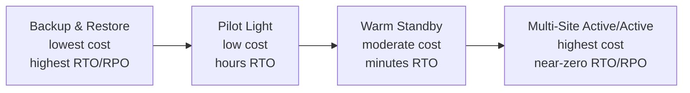
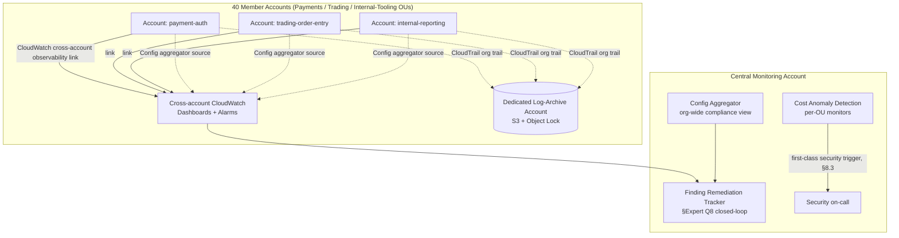
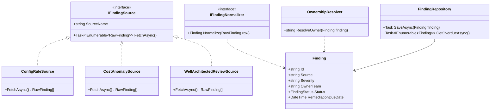
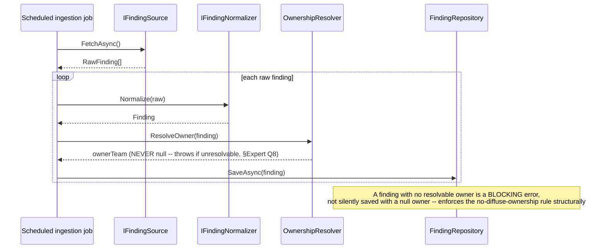

# Module 64 — AWS: Observability, Cost & the Well-Architected Framework — CloudWatch, X-Ray & Multi-Region DR

> Domain: AWS | Level: Beginner → Expert | Prerequisite: All prior AWS modules (57–63) — this module is the synthesizing capstone, applying the Well-Architected Framework's six pillars retrospectively across every AWS topic this domain has covered; [[../17-Microservices/02-Resilience-Observability-Sidecar-Patterns]] (distributed tracing fundamentals, now expressed via X-Ray)

---

## 1. Fundamentals

### Why does a Principal Engineer need an explicit observability/cost/Well-Architected capstone rather than treating these as implementation details of each individual service?
Every prior AWS module in this domain (57-63) surfaced the same recurring pattern independently — a specific setting or metric that's invisible until a specific triggering condition exposes it — observability is the *general, cross-cutting mechanism* that converts each of these from "invisible until an incident" into "visible and alertable before an incident," and cost optimization and the Well-Architected Framework provide the structured, repeatable review process a Principal Engineer uses to systematically apply this domain's entire body of lessons to any new or existing workload, rather than relying on having personally experienced each specific failure mode before knowing to check for it.

### Why does this matter?
Because a Principal Engineer is regularly expected to conduct exactly this kind of structured review — a Well-Architected Framework review, an incident postmortem, a cost-optimization pass — across systems they didn't originally build, and the ability to systematically apply this domain's patterns (via the Framework's six pillars) rather than relying on ad hoc, incident-driven learning is what distinguishes reviewable, teachable Principal-level judgment from individually-accumulated tribal knowledge.

### When does this matter?
Continuously, for any live AWS workload (observability is not a one-time setup but an ongoing operational discipline) and periodically/structurally (a Well-Architected review at major milestones — pre-launch, post-incident, before a significant scaling event — and an ongoing cost-optimization cadence as a workload's actual usage patterns evolve).

### How does it work (30,000-ft view)?
```
CloudWatch: metrics, logs, alarms, dashboards -- the foundational observability layer across
 every AWS service covered in this domain
X-Ray: distributed TRACING -- follows a single request across multiple services/Lambda functions,
 the AWS-native implementation of the distributed-tracing discussion
Well-Architected Framework: AWS's structured review methodology across 6 pillars --
 Operational Excellence, Security, Reliability, Performance Efficiency, Cost Optimization,
 Sustainability
Cost Optimization: Savings Plans/Reserved Instances, right-sizing, Spot capacity, and the
 specific cost implications of nearly every decision covered in Modules 57-63
```

---

## 2. Deep Dive

### 2.1 CloudWatch — Metrics, Logs, and Alarms as the Foundational Layer Beneath Every Prior Module
CloudWatch is the substrate underlying nearly every specific monitoring recommendation already made throughout this domain — the ASG capacity monitoring, the `ReplicaLag` alarm, §Advanced Q7's Kinesis `IteratorAgeMilliseconds` monitoring, the ECS deployment health metrics — all are CloudWatch metrics with alarm thresholds. The critical discipline this module makes explicit: an alarm threshold must be tied to the **specific workload's actual business tolerance** for the metric in question (a checkout service's acceptable replica lag might be seconds; an analytics pipeline's might be hours), not a generic, uniformly-applied default threshold — a recurring, specific instance of this domain's broader "explicitly compute your actual requirement, don't assume a default is adequate" theme (first established §Advanced Q1's RPO-computation discipline).

### 2.2 X-Ray — Distributed Tracing as the AWS-Native Implementation of the Observability Discussion
X-Ray traces a single logical request as it flows across multiple services (API Gateway → Lambda → DynamoDB, or across an ECS service mesh) — directly implementing the distributed-tracing discussion concretely: without distributed tracing, diagnosing which specific service in a multi-hop request chain introduced elevated latency or an error requires manually correlating logs across every service involved (slow, error-prone, and precisely the debuggability weakness flagged for choreography-style architectures) — X-Ray's service map and trace timeline make this correlation automatic and visual, directly addressing that weakness at the tooling layer even when the underlying architecture remains genuinely decoupled (choreography's architectural benefits and X-Ray's observability benefits are not in tension; X-Ray specifically compensates for choreography's debugging cost without requiring a shift toward orchestration).

### 2.3 The Well-Architected Framework's Six Pillars — a Structured Lens for Everything This Domain Covered
**Operational Excellence** (can you operate this system safely, and learn from operational events — directly the deployment-safety and-58's automated-governance-gate discipline); **Security**; **Reliability**; **Performance Efficiency** (/the capacity-dimension-reconciliation pattern); **Cost Optimization** (below); **Sustainability** (the newest pillar — right-sizing and eliminating idle/unused capacity, which, notably, is almost always cost-optimization-aligned as well, meaning the two pillars frequently reinforce rather than trade off against each other) — a Principal Engineer conducting a Well-Architected review should recognize that nearly every specific lesson from Modules 57-63 maps cleanly onto one or more of these six pillars, making the Framework a genuinely comprehensive checklist rather than a separate body of new knowledge to learn from scratch.

### 2.4 Cost Optimization — the Financial Expression of Nearly Every Prior Architectural Decision
Cost is rarely a standalone concern independent of the architectural decisions already covered — an over-provisioned RDS instance, a Lambda function with unnecessarily-broad provisioned concurrency, an S3 bucket never transitioned out of Standard storage class, an EKS cluster adopted without a genuine multi-cloud requirement — are all simultaneously architecture-correctness issues *and* cost issues, meaning a disciplined cost-optimization review substantially overlaps with, rather than duplicates, this domain's other architectural-review disciplines. Compute purchasing options — **On-Demand** (pay per use, no commitment, for unpredictable/short-lived workloads), **Savings Plans/Reserved Instances** (committed-use discounts for steady-state, predictable baseline load), **Spot** (deeply discounted, interruptible capacity for fault-tolerant, flexible workloads) — should be matched to each specific workload's actual usage pattern, directly the ASG-elastic-capacity-matching discipline now expressed as a cost-purchasing decision: a steady-state baseline load should be covered by Savings Plans, with elastic/bursty capacity above that baseline covered by On-Demand (and, for genuinely fault-tolerant batch/background workloads, Spot).

### 2.5 Multi-Region Disaster Recovery — the Capstone Expression §Advanced Q4's Region-vs-AZ Distinction
 §Advanced Q4 already established that multi-AZ resilience does not protect against a Region-level failure — this module makes the DR-strategy decision concrete: **Backup & Restore** (lowest cost, highest RTO/RPO — data backed up to another Region, infrastructure provisioned only during an actual disaster), **Pilot Light** (minimal, always-on core infrastructure in a secondary Region, scaled up during a disaster), **Warm Standby** (a scaled-down but fully functional secondary-Region deployment, scaled up during a disaster), **Multi-Site Active/Active** (both Regions fully serving live production traffic simultaneously, highest cost, lowest RTO/RPO) — the correct strategy is determined by the workload's actual, explicitly-computed RTO/RPO business requirement (directly §Advanced Q1's explicit-RPO-computation discipline, now applied at the Region-failure scope rather than the single-storage-tier scope), not a default assumption that any one DR strategy is "good enough" without that computation.

### 2.6 Cost/Reliability/Performance as a Genuine Three-Way Trade-off, Not a Free Lunch
This entire domain's recurring "independently-configured settings must be reconciled together" pattern culminates here: a Principal Engineer must explicitly reason about the three-way trade-off between cost, reliability, and performance for every significant architectural decision (Multi-Site Active/Active DR gives the best RTO/RPO at the highest cost; Spot capacity gives the best cost at the cost of interruption risk; over-provisioned Reserved Instances give predictable performance at the cost of paying for unused capacity) — there is no single universally-correct point on this trade-off, and the Well-Architected review's actual value is forcing an explicit, documented, business-requirement-driven choice on each dimension for each specific workload, rather than an implicit, undifferentiated default applied uniformly across an entire estate regardless of each workload's actual criticality.

---

## 3. Visual Architecture

### X-Ray Distributed Trace Across a Multi-Service Request

```mermaid
gantt
 dateFormat X
 axisFormat %Lms
 section API Gateway
 Request routing:0, 20
 section Lambda: checkout
 Cold start (if any):20, 180
 Handler logic:180, 250
 section Lambda: charge-payment
 Invocation:250, 420
 section Aurora
 Query: debit balance:270, 310
 section DynamoDB
 Write: audit log:420, 450
```

### DR Strategy Spectrum

```mermaid
graph LR
 A["Backup & Restore<br/>lowest cost<br/>highest RTO/RPO"] --> B["Pilot Light<br/>low cost<br/>hours RTO"]
 B --> C["Warm Standby<br/>moderate cost<br/>minutes RTO"]
 C --> D["Multi-Site Active/Active<br/>highest cost<br/>near-zero RTO/RPO"]
```

## 4. Production Example
**Scenario**: A mid-sized SaaS platform had grown its AWS footprint organically across two years, with each individual service team independently making its own infrastructure decisions (RDS instance sizes, Lambda provisioned-concurrency settings, S3 storage-class configuration) with no centralized review process — a new VP of Engineering commissioned a full Well-Architected Framework review ahead of a major fundraising round's technical due-diligence process. **Investigation**: the review surfaced, across the six pillars, findings that individually echoed nearly every lesson this domain established: several RDS instances (Reliability/Cost pillars) were running Multi-AZ-disabled in production despite handling customer-facing transactional data (/60's exact single-AZ risk); one team's S3 buckets (Cost pillar) had never had lifecycle rules configured, with several terabytes of genuinely cold data still on S3 Standard (the exact cost anti-pattern); a legacy service still used a single, broad shared IAM role across multiple Lambda functions (Security pillar,/61's exact blast-radius risk); and no workload had an explicitly-documented RTO/RPO or corresponding DR strategy at all (Reliability pillar, the exact gap) — none of these had caused a customer-visible incident yet, but the due-diligence process's structured, comprehensive review surfaced all of them simultaneously, where the organization's prior team-by-team, ad hoc operational practice had missed each one independently. **Root cause**: the absence of any structured, periodic, cross-cutting review meant each team's locally-reasonable decisions (or deferred non-decisions) accumulated into a portfolio of latent, uncorrelated risks that no single team had visibility into or ownership of collectively — precisely the failure mode a Well-Architected review, by design, is structured to surface, since it forces an explicit pass across every pillar for every workload rather than relying on any individual team's own, necessarily partial, awareness. **Fix**: prioritized remediation by blast-radius/likelihood (the shared IAM role and disabled Multi-AZ addressed first, as the highest-severity findings per this domain's established severity-reasoning), established a recurring (quarterly) Well-Architected review cadence going forward rather than a one-time audit, and assigned explicit pillar-ownership (a named person/team responsible for tracking each pillar's findings to remediation, not a diffuse, everyone's-responsibility ownership model that tends to result in no one's actual responsibility). **Lesson**: this incident is the domain-level synthesis of this entire module's recurring theme — every individual finding was, in isolation, a lesson this course already covered; the actual, additional lesson here is structural: without a periodic, comprehensive, cross-cutting review mechanism, individually-known lessons don't automatically get applied consistently across a growing, multi-team estate, and the review process itself (not just the underlying technical knowledge) is a distinct, necessary Principal-Engineer-level practice.
## 10. Interview Questions

### Basic (10)
1. **Q: What is the foundational observability layer underlying nearly every AWS service's monitoring in this domain?** **A:** CloudWatch (metrics, logs, alarms, dashboards).
2. **Q: What does X-Ray provide?** **A:** Distributed tracing — following a single logical request as it flows across multiple services.
3. **Q: What are the six pillars of the AWS Well-Architected Framework?** **A:** Operational Excellence, Security, Reliability, Performance Efficiency, Cost Optimization, and Sustainability.
4. **Q: What is the difference between Reserved Instances/Savings Plans and Spot capacity?** **A:** Reserved Instances/Savings Plans offer committed-use discounts for predictable, steady-state load; Spot offers deep discounts for interruptible, fault-tolerant workloads.
5. **Q: What are the four common DR strategies, ordered by increasing cost and decreasing RTO/RPO?** **A:** Backup & Restore, Pilot Light, Warm Standby, Multi-Site Active/Active.
6. **Q: What should determine which DR strategy a workload adopts?** **A:** The workload's explicitly-computed RTO/RPO business requirement, not a default assumption.
7. **Q: Why should CloudWatch alarm thresholds not use a generic default across every workload?** **A:** Because each workload has a different actual business tolerance for a given metric's degradation.
8. **Q: What specific architectural weakness does X-Ray directly compensate for?** **A:** Choreography-style architectures' inherent debuggability weakness, without requiring a shift toward orchestration.
9. **Q: Why is cost optimization described as substantially overlapping with architectural-correctness review rather than a separate concern?** **A:** Because most cost-inefficiencies (over-provisioned instances, un-tiered S3 storage, unnecessary EKS adoption) are simultaneously architecture-correctness issues.
10. **Q: What did the incident's Well-Architected review reveal about the organization's prior operational practice?** **A:** That team-by-team, ad hoc decision-making without a periodic cross-cutting review let multiple already-known anti-patterns (shared IAM roles, disabled Multi-AZ, un-tiered storage, no documented DR strategy) accumulate unnoticed.

### Intermediate (10)
1. **Q: Why is the Well-Architected Framework described as "a structured lens for everything this domain covered" rather than new knowledge?** **A:** Nearly every specific lesson from Modules 57-63 maps directly onto one or more of the six pillars — the Framework's value is providing a systematic checklist ensuring comprehensive application of already-established knowledge, not introducing separate new concepts.
2. **Q: Why does X-Ray's benefit not require abandoning a choreography-style architecture in favor of orchestration?** **A:** X-Ray addresses the debugging/visibility cost at the tooling layer (making cross-service request flow observable after the fact) without changing the underlying architecture's actual coupling/decoupling characteristics — choreography's decoupling benefits and X-Ray's visibility benefits are independent and complementary.
3. **Q: Why does the incident's finding of the same shared-IAM-role anti-pattern recurring at Modules 58, 61, and 63 reinforce the case for a recurring review cadence rather than a one-time fix?** **A:** The anti-pattern reappearing independently in different contexts (general IAM, Lambda, containers) demonstrates that fixing one instance doesn't prevent the same underlying practice from recurring elsewhere — only a standing, periodic review mechanism catches new instances as they're introduced, rather than assuming a single remediation pass is sufficient permanently.
4. **Q: Why should Reserved Instance/Savings Plan commitments be sized against a workload's stable baseline rather than its observed peak?** **A:** Over-committing to a discount tier sized for peak usage means paying for that committed capacity continuously, including during normal, lower-usage periods when the workload doesn't actually need it — the commitment should cover only the portion of usage that's genuinely steady and predictable.
5. **Q: Why is "we have backups, so we have disaster recovery" an insufficient characterization without further specification?** **A:** Backup & Restore is only one of several DR strategies, with the highest RTO/RPO (slowest recovery, most potential data loss) among the options — whether it's actually *sufficient* depends entirely on the workload's explicit RTO/RPO requirement, which "we have backups" doesn't itself establish as adequate.
6. **Q: Why does assigning explicit, named pillar-ownership matter for a Well-Architected review's actual remediation outcome, beyond just conducting the review?** **A:** A review that surfaces findings without clear ownership tends toward diffuse, "everyone's responsibility" accountability, which in practice often means no one's actual responsibility — explicit ownership converts findings into tracked, accountable remediation work rather than a report that's read once and shelved.
7. **Q: Why must X-Ray's sampling rate be deliberately tuned rather than defaulting to either extreme (very low or 100%)?** **A:** Too-low sampling risks missing the specific trace needed to diagnose a rare, intermittent issue; 100% sampling at high request volume introduces meaningful cost and processing overhead — the correct rate balances diagnostic completeness against that cost, based on the workload's actual troubleshooting needs.
8. **Q: Why does a multi-Region Active/Active DR strategy not eliminate the replication-consistency reasoning established?** **A:** Any stateful component replicated across Regions still has real replication lag and consistency-model implications, now at cross-Region rather than cross-AZ scope — Active/Active provides architecture for near-zero RTO/RPO, but the underlying data-consistency trade-offs still apply and must still be explicitly reasoned about.
9. **Q: Why is CloudWatch itself described as a capacity-planned resource rather than a limitless utility?** **A:** It has account-level API rate limits and per-metric/log-group ingestion limits that a sufficiently high-scale, high-cardinality observability strategy can hit, requiring the same proactive capacity awareness this domain has applied to every other AWS service.
10. **Q: Why should CloudWatch Logs and X-Ray trace data be subject to the same data-security review discipline as any other sensitive data store?** **A:** Logs and traces frequently contain request payloads or other potentially sensitive/PII data, and are not automatically exempt from the least-privilege/encryption discipline that applies to every other AWS data-holding service — observability tooling is itself a data store requiring the same governance.

### Advanced (10)
1. **Q: Diagnose the incident from first principles, and design the specific organizational structure (not just a technical checklist) that prevents this class of accumulated-latent-risk finding from recurring after the initial remediation.**
 **A:** Root cause: no periodic, cross-cutting review mechanism existed at all — each team's individually-reasonable decisions accumulated into an uncorrelated risk portfolio with no single point of visibility. Structural fix: establish a recurring (e.g., quarterly) Well-Architected review as a standing organizational process with explicit, rotating or permanently-assigned pillar ownership (the fix), **and** integrate automated checks for the specific, previously-identified anti-patterns (the shared-IAM-role linting §Advanced Q1, the Multi-AZ-verification check §Advanced Q10) directly into the deployment pipeline, so that the *majority* of findings are caught continuously and automatically between formal reviews, with the periodic Well-Architected review serving as a comprehensive backstop for findings automated checks don't yet cover, rather than the sole detection mechanism.
2. **Q: A team argues that since their workload has 100% X-Ray sampling enabled, they have complete observability and no longer need well-designed CloudWatch alarms, since they can always trace any issue after the fact. Evaluate this claim.**
 **A:** Push back — tracing (X-Ray) and alerting (CloudWatch alarms) serve fundamentally different purposes: tracing helps diagnose *why* a specific already-detected issue occurred, but doesn't itself detect that an issue is occurring — without properly-tuned alarms, a degradation (elevated latency, a rising error rate) could persist for a long time, genuinely affecting customers, before anyone notices to go looking at traces at all; 100% trace sampling with no alerting discipline means excellent diagnostic depth but poor incident-detection speed — both capabilities are necessary and address different, complementary needs (detection vs. diagnosis).
3. **Q: Design the specific process for computing an accurate RTO/RPO requirement for a given workload, avoiding both under-specification (leading to an inadequate DR strategy) and over-specification (leading to unjustified DR cost).**
 **A:** RTO/RPO should be derived from an explicit, quantified business-impact analysis — not a technical team's own assumption — asking stakeholders (product, business, legal/compliance as relevant) specific questions: "if this system were unavailable for X hours, what is the quantified business/customer/compliance impact?" and "if we lost the last Y minutes/hours of data, what is that impact?" — repeated at multiple candidate X/Y values to find the actual inflection point where impact becomes unacceptable, directly generalizing §Advanced Q1's per-workload RPO-computation discipline into a repeatable, stakeholder-inclusive methodology rather than a purely technical estimate that risks either underestimating genuine business risk or over-engineering DR cost the business wouldn't have actually demanded if asked explicitly.
4. **Q: Critique the following claim: "Since we conducted a thorough Well-Architected review before our funding round and remediated every finding, our architecture is now sound and doesn't need further review."**
 **A:** This treats the review as a one-time event rather than the recurring operational discipline the fix establishes — new findings accumulate continuously as new services are built, new team members make new locally-reasonable-but-uncoordinated decisions, and AWS itself evolves its service offerings and best practices; a Well-Architected review's value is in its recurrence, catching the *next* round of accumulated findings before they, too, require a due-diligence-triggered crisis review to surface — "we did one review" provides a point-in-time snapshot, not an ongoing guarantee.
5. **Q: A workload's cost-optimization review recommends migrating from On-Demand to a 3-year All-Upfront Savings Plan for a 40% discount, based on the current baseline usage. The Principal Engineer is asked to evaluate this recommendation. What additional information is needed before approving it?**
 **A:** Whether the current baseline usage is genuinely stable and likely to persist for the full 3-year commitment period, or reflects a workload still evolving (a growing product likely to change its compute profile, a service planned for future re-architecture or potential decommissioning) — committing to a 3-year, All-Upfront (least-flexible) plan against a usage pattern that might materially change well before the commitment period ends risks paying for capacity the organization no longer actually needs, directly §Advanced Q4's general "match resilience/commitment investment to genuine, validated business requirement, don't over-commit beyond actual need" principle, now applied to financial commitment terms specifically — a shorter-term or more-flexible commitment (1-year, No Upfront) may be the more defensible choice for a less-certain usage trajectory even at a smaller discount.
6. **Q: Design an approach for validating that a workload's chosen DR strategy (e.g., Warm Standby) actually achieves its target RTO/RPO in practice, rather than assuming the architectural design is sufficient without verification.**
 **A:** Conduct a scheduled, periodic **DR drill** — actually failing over to the secondary Region (or, at minimum, a realistic simulation) and measuring the actual time-to-recovery and actual data-loss window against the documented RTO/RPO targets — directly the same "steady-state assumption doesn't substitute for testing the actual failure-triggering condition" pattern this entire domain has established (§Advanced Q1's scaling-event load test, §Advanced Q3's replication-lag load test), now applied at the Region-failover scale — an untested DR strategy carries the same "looks correct on paper, unverified in practice" risk as any other untested resilience mechanism this course has covered.
7. **Q: Explain why the recurring appearance of the "shared, overly-broad IAM role" anti-pattern across Modules 58, 61, 63, and again in the incident should be treated as evidence about organizational practice, not merely a repeated technical mistake.**
 **A:** The same specific, previously-identified, well-understood anti-pattern recurring across multiple independent contexts (general IAM roles, Lambda execution roles, ECS task roles, and again in a from-scratch organizational review) indicates the underlying cause isn't a knowledge gap (the anti-pattern and its fix are well-documented within this domain) but a **process** gap — the absence of a structural mechanism (an automated linting check, a mandatory review gate) that would catch this specific, known anti-pattern regardless of which team or context introduces it next — this is the central, generalized lesson of this capstone module: known technical lessons require structural enforcement mechanisms to reliably propagate across a growing organization, not just documentation or training.
8. **Q: A Principal Engineer is evaluating whether Sustainability and Cost Optimization genuinely always reinforce each other (the claim) or whether a scenario exists where they diverge. Identify one such scenario.**
 **A:** They diverge when a cost-optimization choice trades increased resource consumption for a different kind of savings not reflected in idle-capacity elimination — for example, choosing a larger, more powerful instance type to reduce the *number* of instances needed (potentially reducing per-unit operational/licensing costs) could, depending on the specific instances' utilization efficiency, use more aggregate compute resources than several smaller, more tightly-utilized instances, even if the larger-instance approach is cheaper on a pure AWS-billing basis — Sustainability and Cost Optimization "almost always" align (as states) precisely because idle/unused capacity is both wasted money and wasted resources, but a Principal Engineer should recognize this is a strong correlation, not an absolute guarantee, and evaluate genuinely resource-intensive-but-cost-efficient choices against both pillars independently rather than assuming alignment.
9. **Q: Design the specific set of X-Ray/CloudWatch instrumentation needed to make the checkout saga workflow §Advanced Q6 (Step Functions with compensating refund action) fully diagnosable end-to-end, including the compensating-action path.**
 **A:** Instrument every state in the Step Functions workflow (ChargePayment, ReserveShipping, RefundPayment) with X-Ray tracing propagated through each Lambda invocation, correlated by a single trace ID spanning the entire saga execution (including the compensating branch, not just the happy path) — combined with a CloudWatch alarm specifically on the rate of executions entering the `RefundPayment`/compensating-action branch (a rising compensation rate is itself a leading indicator of a growing problem in the `ReserveShipping` step, worth alerting on independently of any individual saga's own success/failure) — ensuring both the ability to trace any single problematic saga execution end-to-end and the ability to detect a systemic, aggregate increase in compensation-branch activity before it's noticed only via accumulated customer complaints.
10. **Q: As a Principal Engineer establishing a comprehensive operational-excellence program for an organization's entire AWS estate, design the specific standing structure (synthesizing this entire module, and implicitly this entire AWS domain) that ties together the individual governance gates each prior module (57-63) established.**
 **A:** (1) A recurring (quarterly) Well-Architected Framework review with named, accountable pillar ownership (Advanced Q1) as the comprehensive backstop. (2) Every module-specific automated governance gate already established in this domain (the Multi-AZ verification, the IAM policy linting, the RPO validation, the read-routing/replica-lag checks, the idempotency/reserved-concurrency review, the messaging-service justification review, the task-role migration-safety gate) integrated into a single, centrally-tracked deployment-pipeline policy suite, so that the majority of known-anti-pattern instances are caught continuously rather than only at quarterly review cadence. (3) Business-stakeholder-inclusive RTO/RPO computation (Advanced Q3) as a mandatory input to any new workload's architecture, not a purely technical estimate. (4) Scheduled, periodic DR drills (Advanced Q6) validating that documented DR strategies actually achieve their targets in practice, not just on paper. (5) Cost-optimization review integrated into (not separate from) the same recurring cadence, given its substantial overlap with the other pillars' findings. This structure directly synthesizes every governance mechanism established across Modules 57-64 into one coherent, continuously-operating program, rather than leaving each module's lesson as an isolated, easily-forgotten piece of technical knowledge.

### Expert (10)
1. **Q: A security team argues that since CloudTrail is enabled account-wide, the organization has a complete audit trail and no further logging investment is needed. Evaluate this claim, using the incident's own findings as a test case.**
 **A:** Push back on two fronts: (1) CloudTrail's *data events* (S3 object-level access, Lambda-level invocation detail) are opt-in and separately billed — "CloudTrail is enabled" without confirming data-event coverage for the specific resources that actually matter (a bucket holding financial records, a Lambda handling payment data) leaves exactly the granularity gap an investigation into unauthorized data access would need; (2) CloudTrail records *what API calls were made*, not *what the compromised credential could have done* — reconstructing the incident's full IAM blast radius (sibling Containers module §4) requires correlating CloudTrail's access record with the IAM policy that was actually in effect at the time, which CloudTrail alone doesn't retain a history of unless AWS Config's configuration-history capability (§8.2) is also enabled — CloudTrail and Config are complementary, not substitutable: one shows *what happened*, the other shows *what was allowed to happen* at that point in time.
2. **Q: Design the specific instrumentation and alerting that would distinguish a genuine, business-driven cost increase (organic growth, a new product launch) from a security-incident-driven cost spike (cryptomining on compromised compute), within the first hour, before a human manually investigates.**
 **A:** Combine three signals rather than relying on Cost Anomaly Detection (§8.3) alone: (1) the anomaly's **resource-type signature** — a cost spike concentrated in EC2/Fargate compute hours with no corresponding increase in application-level request/transaction metrics (CloudWatch custom metrics tracking actual business throughput) is a strong divergence signal, since genuine organic growth should show *correlated* increases in both cost and business-metric volume, while compromised-compute cost spikes show cost rising with no matching business-metric increase; (2) the anomaly's **Region/AZ distribution** — resources spun up in a Region the workload has never operated in is a near-definitive security signal, rarely explainable by organic growth; (3) cross-reference against recent CloudTrail activity (§8.1) for the specific IAM identity whose resource creation drove the spike — an identity with no legitimate history of creating that resource type is the final, near-conclusive signal. Automating this three-signal correlation into a single alert (rather than requiring a human to manually pull all three data sources) is what makes "within the first hour" achievable.
3. **Q: A payment-authorization service (the sibling Containers module's §12 example, with a 250ms P99 budget) enables 100% X-Ray sampling for maximum diagnostic coverage, and a subsequent load test shows P99 has degraded from 220ms to 265ms — breaching the SLA. Diagnose and design the fix without simply disabling tracing.**
 **A:** This is §7.4's instrumentation-overhead risk materializing exactly as warned — the fix is not to disable tracing (losing the diagnostic capability this domain establishes as essential, §Advanced Q2) but to tune the sampling *rate* down to the minimum that still reliably captures the intermittent failure modes actually under investigation (X-Ray's default sampling rule — 1 request/second plus 5% of additional requests — is usually more than sufficient for diagnostic purposes at meaningful production volume) while additionally verifying the X-Ray SDK's own configuration isn't adding avoidable overhead (synchronous, blocking segment emission to the X-Ray daemon rather than the SDK's asynchronous/batched mode) — measure the P99 delta at each candidate sampling rate explicitly (§7.4's before/after discipline) rather than assuming a lower rate alone resolves the full 45ms regression, since some of that regression may be attributable to SDK configuration rather than sampling volume itself.
4. **Q: Critique the following claim from a platform team: "We've implemented Config Rules mirroring every pipeline-embedded governance gate from Modules 57-63 (Multi-AZ, IAM wildcard-policy, shared-task-role), so our pipeline-level checks are now redundant and can be removed to simplify the deployment process."**
 **A:** Push back — Config Rules and pipeline-embedded checks catch different *timing* and *path* dimensions of the same violation, not merely the same violation twice: a pipeline check blocks a violation from ever reaching production at deploy time (fast feedback, before any resource exists); a Config Rule detects a violation **after** it already exists (whether introduced via the pipeline or, per §8.2's central point, via a path that bypassed the pipeline entirely — a console change, an out-of-band script) — removing the pipeline check means every violation, including ones that previously would have been caught before deployment, now persists in production for the (non-zero) window between introduction and Config's next evaluation cycle, a strictly worse outcome even though Config would eventually flag it — the correct relationship is defense-in-depth (both layers active, pipeline as the fast-feedback preventive control, Config as the continuous, path-independent detective backstop), not substitution of one for the other.
5. **Q: Design the specific tiered-retention and access-control policy for a financial-services platform's log/trace data that simultaneously satisfies (a) a 7-year regulatory audit-trail retention requirement for transaction-related logs, (b) cost-efficient short retention for routine operational/debug logs, and (c) the least-privilege access discipline from §8.4 — without manual, per-log-group configuration as the estate grows.**
 **A:** Structured logging (§7.2) with an explicit, mandatory `logCategory` field (`transaction-audit` vs. `operational`) enforced by a Config Rule (§8.2, §9.2's tagging-enforcement pattern) at log-group creation; two distinct, automatically-applied CloudWatch Logs export/lifecycle pipelines keyed off that category — `transaction-audit`-tagged log groups export to a dedicated, access-restricted S3 bucket (separate IAM policy boundary, §8.4) with lifecycle rules transitioning to Glacier Deep Archive well before the 7-year mark and an object-lock/legal-hold configuration preventing early deletion even by an account administrator; `operational`-tagged log groups retain 30-90 days directly in CloudWatch Logs with no export, minimizing cost. Automating the categorization enforcement (rather than trusting each team to correctly tag their own log groups) is the structural fix directly recurring §9.2's "enforced attribution, not voluntary discipline" lesson, now applied to regulatory retention rather than cost allocation.
6. **Q: A Principal Engineer discovers that a CI/CD service account has `logs:GetLogEvents` and `xray:GetTraceSummaries` permissions scoped to `Resource: "*"` across the entire account, justified as "the pipeline sometimes needs to pull logs for automated deployment-verification checks." Evaluate this scoping and design the fix.**
 **A:** This is §8.4's exact risk, and the stated justification doesn't require account-wide scope — an automated deployment-verification check only ever needs to read the logs/traces of the *specific service it just deployed*, never every other service's data; the fix is scoping the policy's `Resource` to the specific log-group/trace naming pattern the pipeline actually operates on (e.g., a resource-tag-based condition matching the service being deployed, or a per-service IAM role assumed just-in-time for that service's own verification step) rather than a single, account-wide credential shared across every pipeline run regardless of which service triggered it — directly the same task-role-vs-shared-role distinction from the sibling Containers module's §4/§8.1, now applied to observability-data access specifically, and equally susceptible to the same blast-radius consequence if the pipeline identity is ever compromised.
7. **Q: As an organization moves from a single AWS account to a multi-account structure (driven by the blast-radius-isolation reasoning in the sibling Containers module's §9.3), design the specific observability architecture that prevents the incident's central failure (no one had visibility across the whole estate) from recurring at the new, multi-account scale.**
 **A:** A dedicated, centralized monitoring/security-tooling account (§9.1) receiving: CloudWatch cross-account observability links from every member account (unified dashboards/alarms without requiring cross-account console-hopping); CloudTrail organization trail aggregation (§8.1, already recommending this) with logs delivered to a *separate* archive account from the monitoring account itself (so a monitoring-account compromise doesn't also grant log-deletion capability); AWS Config aggregated via an **aggregator** resource collecting every member account's compliance state into one queryable view. Critically, this centralized view must have an explicitly-named, accountable owner (directly recurring §Intermediate Q6/§Advanced Q1's "diffuse ownership becomes no one's actual responsibility" lesson) — provisioning the cross-account aggregation infrastructure without assigning who actually reviews it regularly reproduces the incident's root cause in a technically-more-sophisticated but organizationally-identical form.
8. **Q: A team's CloudWatch alarm-to-actionable-incident ratio (§7.3) has been tracked at 8% (92% of pages turn out not to represent genuine, actionable degradation) for two consecutive quarterly Well-Architected reviews, with no remediation action taken either time despite the metric being visible in both reports. Diagnose the organizational failure and design the fix, distinct from the technical fix of simply re-tuning the thresholds.**
 **A:** The technical fix (re-tuning thresholds per each metric's actual business tolerance, §2.1) is necessary but insufficient on its own — the fact that a *visible, reported* metric went unaddressed across two full review cycles indicates the same missing-ownership failure mode recurring (§Intermediate Q6, §Advanced Q1): a Well-Architected finding without an assigned owner and a tracked remediation deadline is functionally just a report that gets read and shelved, exactly the failure this module's central incident identified generally. The structural fix: every Well-Architected finding (not just this one) must be logged as a tracked, owned work item with a committed remediation date at the moment it's identified, with the *next* review's first agenda item being "status of every open finding from the prior review," converting the review from a point-in-time report into a genuinely closed-loop remediation process — the alarm-tuning fix alone addresses this one symptom without addressing why a known, visible finding persisted unaddressed for six months in the first place.
9. **Q: Design the specific set of leading (not lagging) indicators a Principal Engineer would monitor to detect that an estate's cost-optimization posture is degrading — before the next scheduled Well-Architected review surfaces it as a large, accumulated finding, mirroring this module's central "structural, continuous check beats periodic review alone" lesson applied specifically to cost.**
 **A:** (1) A trending, not point-in-time, **cost-per-unit-of-business-value** metric (cost per transaction processed, cost per active customer) — a rising trend independent of proportional business-metric growth is the earliest, most general signal of degrading cost efficiency, catching the aggregate effect of many small, individually-unnoticed inefficiencies before any single one is large enough to be its own Well-Architected finding; (2) automated, continuous (not quarterly-review-cadence) Config Rule evaluation of the specific known cost anti-patterns already catalogued in this domain (untiered S3 storage, disabled Multi-AZ representing both a reliability and cost consideration, EKS adoption without an articulated requirement) — directly §8.2's continuous-compliance mechanism applied to cost-specific rules; (3) Cost Anomaly Detection (§8.3) tuned with sensitivity appropriate to the estate's size, treated as a standing, always-on signal rather than a report reviewed only quarterly. Together these convert cost governance from "discovered as a large finding every quarter" into "trending visibly and continuously, addressable incrementally before it accumulates," the same continuous-detection-over-periodic-audit principle this module's Security section establishes for compliance drift generally.
10. **Q: As a Principal Engineer designing the complete observability/security/cost governance program for a regulated FinTech platform's entire multi-account AWS estate, synthesizing this module's §1-9 in full, specify the program's standing components and explain how each addresses a distinct failure mode this module identified.**
 **A:** (1) Centralized, cross-account CloudWatch/CloudTrail/Config aggregation (§9.1/§Expert Q7) — addresses the incident's core "no one had estate-wide visibility" failure. (2) A continuously-evaluated Config Rule suite mirroring every pipeline-embedded governance gate across this domain, explicitly maintained as a defense-in-depth **addition** to (not replacement for) those pipeline checks (§8.2/§Expert Q4) — addresses the path-independent (console/script-bypass) blind spot no pipeline check can see. (3) Cost Anomaly Detection wired into the security-incident response process as a first-class trigger, not a FinOps-only concern (§8.3/§Expert Q2) — addresses the "cost spike as an early compromise indicator" blind spot. (4) Least-privilege, per-service-scoped access to logs/traces themselves, enforced with the same rigor as application-data access (§8.4/§Expert Q6) — addresses observability data's own, frequently-overlooked blast-radius risk. (5) Enforced (Config-Rule-backed), not voluntary, tagging/categorization for both cost allocation (§9.2) and regulatory log retention (§9.3/§Expert Q5) — addresses the "diffuse responsibility becomes no one's responsibility" pattern recurring across cost and compliance alike. (6) A closed-loop Well-Architected review process where every finding is a tracked, owned work item reviewed for remediation status at the *start* of the next review (§Expert Q8) — addresses the "known, visible finding persists unaddressed" failure. Each component targets a distinct, specifically-identified gap this module surfaced, together forming a continuous, structurally-enforced program rather than a periodic audit an organization can quietly let lapse.

---

## 11. Coding Exercises

### Easy — CloudWatch alarm tied to a specific business-tolerance threshold
```hcl
resource "aws_cloudwatch_metric_alarm" "replica_lag_checkout" {
  alarm_name = "checkout-db-replica-lag-critical"
  metric_name = "ReplicaLag"
  namespace = "AWS/RDS"
  statistic = "Maximum"
  period = 60
  evaluation_periods = 2
  # 2000ms threshold -- derived from checkout's OWN documented read-after-write tolerance,
    # NOT a generic default reused across every RDS instance in the account.
    threshold = 2000
  comparison_operator = "GreaterThanThreshold"
  alarm_actions = [aws_sns_topic.pagerduty_critical.arn]
}
```

### Medium — X-Ray instrumentation across a Lambda-to-DynamoDB call
```csharp
[XRayTracing]
public async Task<APIGatewayProxyResponse> HandleAsync(APIGatewayProxyRequest request)
{
    using var subsegment = AWSXRayRecorder.Instance.BeginSubsegment("ProcessOrder");
    try
    {
        var order = await ProcessOrderAsync(request); // downstream DynamoDB calls
        // automatically traced via the AWS SDK's
        // X-Ray instrumentation -- correlated to
        // this SAME trace ID
        return Success(order);
    }
    catch (Exception ex)
    {
        subsegment.AddException(ex); // exception visible directly on the trace timeline
        throw;
    }
    finally { AWSXRayRecorder.Instance.EndSubsegment; }
}
```

### Hard — Automated Well-Architected-style governance check bundling prior modules' gates (§Advanced Q10)
```csharp
public class PipelineGovernanceCheck
{
    public async Task<GovernanceResult> ValidateAsync(DeploymentManifest manifest)
    {
        var findings = new List<string>;

        //: Multi-AZ verification
        if (manifest.Rds is { MultiAz: false, Environment: "production" })
            findings.Add("RDS instance missing Multi-AZ in production");

        //: IAM policy linting
        if (manifest.IamPolicies.Any(p => p.HasWildcardAction || p.HasWildcardResource))
            findings.Add("Wildcard IAM policy detected -- requires explicit exception (§Advanced Q1)");

        ///63: shared/legacy role detection
        if (manifest.TaskRoles.Any(r => r.RoleArn.Contains("legacy-shared-role")))
            findings.Add("Deployment references legacy shared task role (/)");

        //: RPO validation
        if (manifest.S3Buckets.Any(b => b.LifecycleRules.Count == 0 && b.EstimatedSizeGb > 100))
            findings.Add("Large S3 bucket with no lifecycle rules");

        return new GovernanceResult { Passed = findings.Count == 0, Findings = findings };
    }
}
```

### Expert — Multi-Region Warm Standby health-based failover
```hcl
resource "aws_route53_health_check" "primary_region" {
  fqdn = "api.platform.com"
  port = 443
  type = "HTTPS"
  resource_path = "/ready" # genuine readiness check, NOT liveness-only (the lesson, recurring here)
  failure_threshold = 3
  request_interval = 10
}

resource "aws_route53_record" "primary" {
  name = "api.platform.com"
  type = "A"
  set_identifier = "primary"
  failover_routing_policy { type = "PRIMARY" }
  health_check_id = aws_route53_health_check.primary_region.id
  alias { name = aws_lb.primary_region_alb.dns_name; zone_id = aws_lb.primary_region_alb.zone_id; evaluate_target_health = true }
}

resource "aws_route53_record" "secondary" {
  name = "api.platform.com"
  type = "A"
  set_identifier = "secondary"
  failover_routing_policy { type = "SECONDARY" } # Warm Standby -- scaled-down but functional
  alias { name = aws_lb.secondary_region_alb.dns_name; zone_id = aws_lb.secondary_region_alb.zone_id; evaluate_target_health = true }
}
```
**Discussion**: the health check specifically targets `/ready` (the readiness-not-liveness lesson recurring one final time at the Region-failover scale) — a primary Region that's technically reachable but genuinely degraded (failing dependency connectivity) should trigger failover just as reliably as a fully unreachable primary Region, since a liveness-only check here would leave DNS failover blind to exactly the "alive but broken" failure mode this domain has repeatedly identified as the most dangerous, least obvious kind.

---

## 12. System Design

**Scenario**: design a centralized **observability and cost-governance platform** for a mid-sized FinTech's multi-account AWS estate (~40 accounts across payments, trading, and internal-tooling business units) — directly the structural fix the incident (§4) needed, built proactively this time rather than reactively after a due-diligence crisis.

**Requirements**
- *Functional*: unified cross-account metrics/logs/traces dashboarding; continuous compliance evaluation against a defined policy baseline; cost attribution per team/service; anomaly detection spanning both cost and security signals; a closed-loop finding-remediation tracker.
- *Non-functional*: must not require any account's own team to change their instrumentation approach to participate (adoption friction kills coverage); sub-5-minute lag from an anomaly occurring to it being visible in the central platform; retains audit-relevant data per each account's own regulatory retention requirement (§9.3), not a single uniform default.

**Back-of-the-envelope estimation**: 40 accounts × ~50 services/account average × ~10 custom metrics/service at standard 60s resolution ≈ 20,000 metrics — well within a single monitoring account's CloudWatch metric-namespace practical limits, but log volume is the real driver: assume ~5GB/day/account of structured application logs × 40 accounts ≈ 200GB/day ingested centrally. At CloudWatch Logs ingestion pricing this is a real, non-trivial monthly cost — the arithmetic tells us **log-volume management (tiered retention, §9.3, and structured-field discipline to keep Insights queries cheap, §7.2) is the actual hard cost-engineering problem here, not metrics or traces**, which is why §12's architecture below centers the log pipeline rather than treating it as an afterthought to the metrics dashboard.

**Architecture**:

```mermaid
graph TB
  subgraph "40 Member Accounts (Payments / Trading / Internal-Tooling OUs)"
    A1[Account: payment-auth] -->|CloudWatch cross-account observability link| Mon
    A2[Account: trading-order-entry] -->|link| Mon
    A3[Account: internal-reporting] -->|link| Mon
    A1 -.CloudTrail org trail.-> Archive[(Dedicated Log-Archive Account<br/>S3 + Object Lock)]
    A2 -.CloudTrail org trail.-> Archive
    A3 -.CloudTrail org trail.-> Archive
    A1 -.Config aggregator source.-> Mon
    A2 -.Config aggregator source.-> Mon
    A3 -.Config aggregator source.-> Mon
  end
  subgraph "Central Monitoring Account"
    Mon[Cross-account CloudWatch<br/>Dashboards + Alarms]
    ConfigAgg[Config Aggregator<br/>org-wide compliance view]
    CAD[Cost Anomaly Detection<br/>per-OU monitors]
    Tracker[Finding Remediation Tracker<br/>§Expert Q8 closed-loop]
    Mon --> Tracker
    ConfigAgg --> Tracker
    CAD -->|first-class security trigger, §8.3| SecOps[Security on-call]
  end
```

**Components glossary**: **cross-account CloudWatch observability link** — a member account opts a defined set of metrics/log-groups/traces into visibility from the monitoring account, without granting the monitoring account any write/modify access back (read-only, least-privilege by construction); **CloudTrail organization trail** — a single trail definition applied org-wide via AWS Organizations, logging to the dedicated archive account (§8.1) so no member account can independently disable its own logging; **Config Aggregator** — pulls every member account's Config Rule compliance state into one queryable view in the monitoring account (§8.2); **Cost Anomaly Detection monitors, one per OU** — scoped per business unit rather than one account-wide monitor, since payments/trading/internal-tooling have genuinely different normal spend patterns and a single, blended anomaly model would have poor sensitivity for all three (directly §2.1's per-workload-threshold discipline applied to anomaly-detection scoping); **Finding Remediation Tracker** — the closed-loop system from §Expert Q8, converting every Config/cost/Well-Architected finding into a tracked, owned work item.

**API design** (internal remediation-tracker API, for the platform's own tooling):

`POST /findings` — create a finding record.

| Field | Type | Description |
|---|---|---|
| `source` | string | `config-rule` \| `cost-anomaly` \| `well-architected-review` |
| `accountId` | string | Member account the finding originated in |
| `resourceArn` | string | The specific non-compliant/anomalous resource |
| `severity` | string | `critical` \| `high` \| `medium` \| `low` |
| `ownerTeam` | string | Assigned owning team (never null — enforced at creation, §Expert Q8/§9.2) |
| `remediationDueDate` | date | Committed remediation date |

`GET /findings?status=open&overdue=true` — response: array of finding objects, each with `daysOverdue` computed server-side, feeding the "status of every open finding" review-cadence agenda item directly.

**Data model** — `findings` table: `id` (PK), `source`, `account_id`, `resource_arn`, `severity`, `owner_team` (NOT NULL — the schema itself enforces §Expert Q8's no-diffuse-ownership rule), `status` (`NOT_STARTED → IN_PROGRESS → REMEDIATED → VERIFIED`), `remediation_due_date`, `created_at`, `remediated_at`. Choosing a boring relational store (Aurora) here, not a NoSQL option, for the same correctness-over-benchmark reason established for financial-transaction data — a remediation-tracking record with an inconsistent or lost update is itself a governance failure this platform exists to prevent.

**Caching**: dashboard queries against the Config Aggregator and cross-account CloudWatch links are cached at the dashboard layer with a short TTL (30-60s) — acceptable staleness for a human-facing dashboard, never applied to the alarm-evaluation path itself, which must always evaluate against live data.

**Messaging**: Cost Anomaly Detection and Config Rule non-compliance events both publish to an EventBridge bus in the monitoring account, with rule-based routing — a `critical`-severity security-relevant finding (e.g., a wildcard IAM policy, §8.2) routes to PagerDuty via SNS; a `low`-severity cost-optimization finding routes only to the Finding Tracker for the next scheduled review, avoiding the alert-fatigue anti-pattern (§7.3) a uniform, always-page routing policy would create.

**Scaling**: as the account count grows past 40, Config Aggregator and cross-account CloudWatch links scale natively (AWS-managed, no additional infrastructure to provision) — the actual scaling bottleneck is the **log-ingestion cost** identified in the estimation above, addressed by §9.3's tiered retention applied uniformly across every onboarded account from day one, not retrofitted later.

**Failure handling**: if the monitoring account itself becomes unavailable, member accounts' own local CloudWatch/CloudTrail/Config continue operating independently (the architecture is additive/aggregating, never a single point of failure for each account's own operational observability) — only the *cross-account, unified* view is degraded, a deliberately-accepted, explicitly-documented trade-off distinct from any individual account's own availability.

**Monitoring**: the platform monitors itself — a meta-alarm on cross-account link health (a member account silently losing its link is itself a Config-Rule-detectable compliance drift, §8.2, applied recursively to the governance platform's own configuration) and a tracked SLA on the sub-5-minute anomaly-to-visibility requirement, verified via periodic synthetic-anomaly injection (a scheduled, deliberate test event) rather than assumed to hold.

**Trade-offs**: centralizing observability/cost governance adds a genuine, ongoing operational cost (the monitoring account itself, plus cross-account data-transfer/replication charges) and a new, if smaller, blast-radius surface (the monitoring account's own access must be tightly scoped, §8.4) — justified specifically because the incident (§4) demonstrated the cost of the *absence* of this platform (an uncorrelated, invisible risk portfolio surfacing only at a due-diligence crisis) meaningfully exceeds the platform's own operating cost for an estate of this size and regulatory profile.

## 13. Low-Level Design

**Requirements**: model the **Finding Remediation Tracker** (§12) as a reusable component ingesting findings from heterogeneous sources (Config Rules, Cost Anomaly Detection, manual Well-Architected review entries) with a uniform lifecycle, enforced ownership, and extensibility to new finding sources without modifying existing ingestion logic.


```mermaid
classDiagram
    class IFindingSource {
        <<interface>>
        +string SourceName
        +Task~IEnumerable~RawFinding~~ FetchAsync()
    }
    class ConfigRuleSource {
        +FetchAsync() RawFinding[]
    }
    class CostAnomalySource {
        +FetchAsync() RawFinding[]
    }
    class WellArchitectedReviewSource {
        +FetchAsync() RawFinding[]
    }
    class IFindingNormalizer {
        <<interface>>
        +Finding Normalize(RawFinding raw)
    }
    class OwnershipResolver {
        +string ResolveOwner(Finding finding)
    }
    class FindingRepository {
        +Task SaveAsync(Finding finding)
        +Task~IEnumerable~Finding~~ GetOverdueAsync()
    }
    class Finding {
        +string Id
        +string Source
        +string Severity
        +string OwnerTeam
        +FindingStatus Status
        +DateTime RemediationDueDate
    }
    IFindingSource <|.. ConfigRuleSource
    IFindingSource <|.. CostAnomalySource
    IFindingSource <|.. WellArchitectedReviewSource
    IFindingNormalizer ..> Finding
    OwnershipResolver ..> Finding
    FindingRepository --> Finding
```


```mermaid
sequenceDiagram
    participant Sched as Scheduled ingestion job
    participant Src as IFindingSource
    participant Norm as IFindingNormalizer
    participant Own as OwnershipResolver
    participant Repo as FindingRepository
    Sched->>Src: FetchAsync()
    Src-->>Sched: RawFinding[]
    loop each raw finding
        Sched->>Norm: Normalize(raw)
        Norm-->>Sched: Finding
        Sched->>Own: ResolveOwner(finding)
        Own-->>Sched: ownerTeam (NEVER null -- throws if unresolvable, §Expert Q8)
        Sched->>Repo: SaveAsync(finding)
    end
    Note over Repo: A finding with no resolvable owner is a BLOCKING error,<br/>not silently saved with a null owner -- enforces the no-diffuse-ownership rule structurally
```

**Design patterns used**: **Strategy** (`IFindingSource` — each source is an interchangeable ingestion strategy; adding Trusted Advisor or Security Hub as a fifth source requires no change to the ingestion pipeline); **Adapter** (`IFindingNormalizer` translates each source's heterogeneous raw shape — a Config Rule's `ComplianceType` vs. Cost Anomaly Detection's `AnomalyScore` — into the single, uniform `Finding` model the rest of the system operates on); **Chain-of-responsibility-like resolution** in `OwnershipResolver` (tries resource-tag-based ownership first, falls back to a service-catalog lookup, and only as a last resort escalates to a default "unassigned-requires-triage" team — never silently null, directly enforcing §Expert Q8/§9.2's rule at the code level, not just the schema level).

**SOLID mapping**: **SRP** — ingestion (`IFindingSource`), normalization (`IFindingNormalizer`), ownership resolution, and persistence are four separately-testable, separately-changeable responsibilities; **OCP** — a new finding source or a new ownership-resolution rule is added without modifying the scheduled ingestion job's own logic; **DIP** — the ingestion job depends on the `IFindingSource`/`IFindingNormalizer` abstractions, registered via DI per source, mirroring the sibling Containers module's §13 `IReadinessCheck` pattern at a different layer of this same domain.

**Extensibility**: onboarding a new finding source (e.g., GuardDuty findings, extending §8.3's cost-anomaly-as-security-signal reasoning to a native security-detection source) requires implementing `IFindingSource` and `IFindingNormalizer` only — the ownership-resolution, persistence, and overdue-tracking logic are entirely unaffected, directly the same low-marginal-onboarding-cost design goal established in the sibling module's §17.

**Concurrency/thread safety**: the scheduled ingestion job runs sources concurrently (`Task.WhenAll` across `IFindingSource` implementations, mirroring the sibling module's readiness-check evaluator) but persists findings sequentially per-source-batch with an idempotent upsert keyed on `(source, resourceArn, ruleId)` — a Config Rule re-evaluating the same non-compliant resource on every scheduled cycle must **update** the existing open finding's `lastSeenAt`, never create a duplicate, or the tracker's overdue-count metric becomes meaningless noise, directly the deduplication discipline this domain applies to idempotent message processing generally.

## 14. Production Debugging

**Incident**: three weeks after the Finding Remediation Tracker (§12/§13) went live, a Principal Engineer doing a routine review noticed the tracker showed **zero open findings** for the trading business unit's accounts — a suspiciously perfect result for an OU that, per the original incident (§4), had previously had multiple long-standing findings — while the payments and internal-tooling OUs continued reporting a realistic, non-zero volume of findings each week.

**Root cause**: the trading OU's accounts had been onboarded to the platform using a cross-account CloudWatch observability link and Config Aggregator source registration that was configured **before** the trading OU completed its own internal migration to a new account structure a month prior — the *old* trading account IDs were still registered as Config Aggregator sources, but those accounts had since been decommissioned (their resources migrated to new account IDs as part of the OU's own reorganization), so the aggregator was successfully polling accounts that genuinely had no resources left in them — technically correct, zero findings, and completely uninformative, because it was auditing accounts that no longer represented the trading OU's actual, current footprint.

**Investigation**: cross-referencing the Config Aggregator's registered source-account list against AWS Organizations' current account list (a five-minute check that should have been the *first* diagnostic step, not a late one) immediately surfaced the mismatch — the new trading-OU account IDs were never registered as aggregator sources at all, meaning the entire, currently-live trading estate had been running with **zero** centralized compliance visibility for the full three weeks since the reorganization, invisible specifically because "zero findings" looks identical to "genuinely compliant" on every dashboard the platform surfaces, with no distinguishing signal between the two without this specific cross-reference check.

**Tools**: AWS Organizations `ListAccounts` API cross-referenced against the Config Aggregator's `DescribeConfigurationAggregators` source list; a subsequent CloudWatch cross-account-link inventory check confirming the same staleness existed for the metrics/logs links, not just Config.

**Fix**: immediate re-registration of the correct, current trading-OU account IDs as aggregator sources and cross-account observability links; structurally, added an automated, scheduled reconciliation job (directly mirroring §9.1's centralization *intent*, now made self-verifying) comparing AWS Organizations' live account list against every governance-platform component's registered source-account list on a daily cadence, alerting on any drift — converting "an account was onboarded/decommissioned/renumbered and someone forgot to update the platform's registration" from a silent, invisible gap into an actively-detected one.

**Prevention**: this is a new, specific instance of this domain's most consequential recurring lesson — **the absence of a signal is indistinguishable from a genuinely good signal unless the monitoring system itself is independently verified as actually covering what it claims to cover** — directly generalizing the DR-drill discipline (sibling module's §Advanced Q6, "an untested DR strategy carries the same unverified risk as any other untested resilience mechanism") to observability-platform coverage itself: a governance platform reporting "zero findings" for an OU must be treated with the same skepticism as an unexercised failover mechanism claiming readiness, and requires the equivalent of a periodic drill — here, the daily account-list reconciliation job — rather than trusting a clean dashboard at face value.

## 15. Architecture Decision

**Context**: a Principal Engineer must choose the mechanism for enforcing that every AWS resource in the estate carries correct cost-allocation and compliance tags (§9.2), given that the current voluntary, documentation-only tagging convention has degraded to roughly 60% actual compliance across the estate.

**Option A — AWS Config Rule (`required-tags`) as a detective control.** *Advantages*: fully AWS-managed, straightforward to implement, evaluates continuously across the whole estate including resources created outside the pipeline (§8.2's path-independence advantage); low implementation effort. *Disadvantages*: purely detective, not preventive — a non-compliant resource is created successfully and only flagged *afterward*, meaning cost-allocation gaps still exist for the (potentially lengthy, if remediation is slow) window between creation and someone acting on the finding. *Cost*: low (Config's own per-evaluation charge, no custom infrastructure). *Complexity*: low. *Maintainability*: high — a managed rule requires little ongoing engineering effort.

**Option B — Service Control Policy (SCP) or a pipeline-embedded admission check blocking resource creation without required tags.** *Advantages*: genuinely preventive — a non-compliant resource is never created at all, giving 100% enforcement by construction rather than eventual detection, directly the fast-feedback preventive-control advantage established generally in §Expert Q4. *Disadvantages*: SCPs are org-wide, blunt instruments — a poorly-scoped SCP can block a genuinely legitimate emergency operation (an incident-response action taken under time pressure that happens to lack a tag) at exactly the wrong moment, and pipeline-embedded checks share the path-independence blind spot (§8.2) — they do nothing for resources created via the console or an out-of-band script. *Cost*: low-to-moderate (engineering effort to build and test the SCP/pipeline check safely, avoiding the blocking-a-legitimate-operation risk). *Complexity*: moderate — SCP conditions need careful scoping and testing before enforcement, and a poorly-tested SCP is itself an incident risk. *Maintainability*: moderate — SCPs need periodic review as new legitimate exception cases are discovered.

**Option C — Both, layered (Config Rule detective control as the path-independent backstop, SCP/pipeline preventive control as the fast, primary enforcement mechanism for the pipeline-driven majority of resource creation).** *Advantages*: combines Option B's near-100% enforcement for the pipeline-driven majority of resource creation with Option A's path-independent coverage for the minority that bypasses the pipeline — directly the defense-in-depth relationship §Expert Q4 already established as correct for governance gates generally, now applied to tagging enforcement specifically. *Disadvantages*: the combined engineering and ongoing-maintenance cost of both mechanisms. *Cost*: moderate (both components' costs, though Config's marginal cost is small once the platform in §12 already exists). *Complexity*: moderate-to-high initially, low ongoing once both are correctly scoped and stable. *Maintainability*: high once established, since each layer's failure mode is independently well-understood and the platform in §12 already provides the operational surface both plug into.

**Recommendation**: **Option C**, for the same reason §Expert Q4 already established generally — a preventive control alone leaves the path-independence gap Config specifically exists to close, and a detective control alone accepts an avoidable window of non-compliance that a preventive check would have blocked for free at effectively zero marginal cost given the pipeline already exists. The SCP/pipeline check should be rolled out with a **staged enforcement mode** (log-only/`SCP` in `dry-run` semantics first, verifying no legitimate operation gets unexpectedly blocked, before flipping to hard-block) — directly the incident's own lesson (§14) that a change to a governance mechanism must itself be verified as correctly scoped before being trusted, not assumed correct on first deployment.

## 17. Principal Engineer Perspective

**Business impact**: this module's central artifact — the Finding Remediation Tracker and the governance platform around it (§12) — has a business impact that is almost entirely about **converting invisible, uncorrelated risk into visible, owned, trackable risk**; a Principal Engineer should frame this platform to non-technical stakeholders (a board, a due-diligence auditor) not as "we bought better monitoring tools" but as "we can now demonstrate, continuously and with evidence, that every known risk category has an accountable owner and a remediation timeline" — precisely the artifact a due-diligence process (§4's triggering event) or a regulatory examination actually wants to see, and precisely what the pre-incident organization couldn't produce.

**Engineering trade-offs**: §15's layered-enforcement decision and §12's centralized-platform-vs-per-account-cost trade-off both exemplify the same tension running throughout this module — every additional layer of governance/observability infrastructure has a real, ongoing operational and cost burden, and a Principal Engineer's job is ensuring that burden is proportionate to the actual risk it retires, not defaulting to "more monitoring is always better" any more than defaulting to "no monitoring, trust the teams" — §7's performance-engineering section exists specifically because over-instrumenting (100% X-Ray sampling degrading a latency-critical SLA, over-fine-grained CloudWatch resolution) is a real, symmetric failure mode to under-instrumenting.

**Technical leadership**: §14's incident demonstrates that even a well-designed governance platform (§12/§13) can silently fail to cover what it claims to cover, and the fix — a self-verifying reconciliation job — is the kind of leadership contribution a Principal Engineer should proactively design *into* any monitoring system from day one (per the DR-drill-equivalent framing), rather than reactively adding only after a coverage gap is discovered in production; the standing question a Principal Engineer should train every team to ask about any dashboard reporting "everything's fine" is "how would we actually know if this dashboard were wrong?"

**Cross-team communication**: the Finding Remediation Tracker's core design decision — enforced, non-null ownership (§13, §Expert Q8) — exists specifically to solve a cross-team communication failure (diffuse responsibility becoming no one's actual responsibility), and a Principal Engineer rolling this platform out organization-wide must pair the technical enforcement with an explicit, negotiated agreement with each team about what "your team is the owner of this finding category" actually means operationally (an SLA for triage, an escalation path) — the schema-level `NOT NULL` constraint on `ownerTeam` only works if there's a real, socially-agreed answer for every finding category before the system goes live, not an arbitrary default assignment that itself becomes a source of cross-team friction.

**Architecture governance**: §15's three-option comparison (detective-only, preventive-only, layered) is the template a Principal Engineer should apply to *every* future governance-control decision this domain surfaces, not just tagging — the recurring, reusable question is always "does this control need to be preventive (blocking a violation before it exists), detective (catching it after, including via paths that bypass any preventive control), or both," and defaulting to "both, for anything genuinely high-severity" while accepting detective-only for lower-severity findings (where the preventive control's added engineering cost isn't justified) is the calibrated, non-uniform governance posture this module's own findings-severity model already assumes.

**Cost optimization**: §12's back-of-envelope estimation deliberately surfaces log volume, not metrics or traces, as the actual cost driver for a platform like this — a Principal Engineer reviewing any observability-platform cost proposal should insist on this kind of explicit, computed breakdown before approving a budget, since the intuitive assumption (more accounts means proportionally more of everything) obscures which specific dimension actually dominates the bill, and therefore which specific optimization (tiered log retention, §9.3) delivers the most leverage per engineering-hour invested.

**Risk analysis**: the meta-lesson of this entire module's Production Debugging section (§14) is that a governance/observability platform is itself a system requiring the same failure-mode analysis this domain applies to every other production system — "what does this system look like when it's silently wrong, not just when it's obviously down" is the specific risk-analysis question a Principal Engineer must apply reflexively to any monitoring or governance tooling, since a silently-wrong monitoring system is, by construction, one that won't page anyone to tell you it's wrong.

**Long-term maintainability**: §13's Strategy/Adapter-pattern-based Finding Tracker design (new sources added without touching existing ingestion logic) and §9's tiered-retention/multi-account-aggregation architecture both share the same long-term-maintainability property this domain values throughout — a system whose marginal cost of onboarding a new account, a new finding source, or a new compliance rule stays low and predictable as the estate grows, rather than a system whose maintenance burden compounds with scale; a Principal Engineer evaluating any new governance/observability component should explicitly ask "what does onboarding the 100th account/service into this look like" before approving the design for the first.

## 18. Revision
**Key takeaways**: This capstone module's central lesson is that observability, cost optimization, and the Well-Architected Framework are not new technical knowledge but a *systematic, recurring process* for applying every lesson Modules 57-63 already established — CloudWatch/X-Ray make the "invisible until a triggering condition" failure modes visible before they become incidents; the Well-Architected Framework's six pillars map directly onto this domain's existing body of knowledge; and cost optimization substantially overlaps with, rather than duplicates, architectural-correctness review. The incident's central lesson — the same shared-IAM-role anti-pattern recurring independently across Modules 58, 61, and 63 despite being well-documented each time — demonstrates that known technical lessons require **structural, automated enforcement mechanisms**, not just documentation, to reliably propagate across a growing organization; a recurring review cadence with named pillar-ownership, combined with automated pipeline-level governance gates synthesizing every prior module's specific checks, is the correct organizational response. DR strategy selection and RTO/RPO computation must be explicit, business-stakeholder-driven, and periodically validated via actual drills — an untested DR strategy carries the same unverified risk as any other untested resilience mechanism this course has covered.

---

**AWS domain complete (Modules 57–64):** Compute & Networking, IAM & Security, Storage, Databases, Serverless, Messaging/EDA-on-AWS, Containers/Microservices-on-AWS, and this capstone Observability/Cost/Well-Architected module — 8 modules at Principal-Engineer depth, each explicitly connected back to this course's Microservices (49–51), Event-Driven Architecture (52–56), and data-layer (18–28) material per the original extra-depth/high-priority scope agreed at the start of this domain.

**Next**: Type "Next" to proceed to the next domain in the roadmap (`22-Azure`), or specify a different focus.
