# AWS Services Cheat Sheet for Microservices

| AWS Service | Purpose | Summary |
|-------------|---------|---------|
| **Amazon CloudFront** | Content Delivery Network (CDN) | Caches static and dynamic content closer to users, reducing latency and improving performance. |
| **AWS WAF** | Web Application Firewall | Protects applications from SQL Injection, XSS, bots, and other web attacks. |
| **Amazon Route 53** | DNS & Traffic Routing | Routes user requests to applications using domain names with health checks and routing policies. |
| **Amazon API Gateway** | API Management | Single entry point for REST, HTTP, and WebSocket APIs. Handles authentication, throttling, routing, and monitoring. |
| **Amazon Cognito** | Authentication & Authorization | Provides user sign-up, sign-in, JWT token generation, MFA, and social identity providers. |
| **Amazon ECS** | Container Orchestration | Fully managed container service for running Docker applications. Simpler than Kubernetes. |
| **Amazon EKS** | Managed Kubernetes | Runs Kubernetes workloads on AWS with automatic control plane management. |
| **AWS Lambda** | Serverless Compute | Executes code on demand without managing servers. Ideal for event-driven applications. |
| **AWS Fargate** | Serverless Containers | Runs containers without provisioning or managing EC2 instances. |
| **Amazon EC2** | Virtual Machines | Provides scalable virtual servers for hosting applications and services. |
| **Application Load Balancer (ALB)** | HTTP Load Balancer | Distributes HTTP/HTTPS traffic across multiple application instances. |
| **Network Load Balancer (NLB)** | TCP/UDP Load Balancer | Handles high-performance TCP, UDP, and TLS traffic with low latency. |
| **Amazon VPC** | Private Network | Creates isolated virtual networks for secure communication between AWS resources. |
| **Amazon Aurora** | Relational Database | High-performance, highly available MySQL/PostgreSQL-compatible database. |
| **Amazon RDS** | Managed Relational Database | Managed SQL databases such as MySQL, PostgreSQL, SQL Server, Oracle, and MariaDB. |
| **Amazon DynamoDB** | NoSQL Database | Serverless key-value and document database with single-digit millisecond latency. |
| **Amazon ElastiCache (Redis)** | Distributed Cache | Improves application performance by caching frequently accessed data. |
| **Amazon S3** | Object Storage | Stores files, images, videos, backups, logs, and static website content. |
| **Amazon EFS** | Shared File Storage | Managed NFS file system that can be mounted by multiple EC2 instances or containers. |
| **Amazon EBS** | Block Storage | Persistent block storage attached to EC2 instances. |
| **Amazon EventBridge** | Event Bus | Routes business events between producers and consumers using event rules. Enables Event-Driven Architecture. |
| **Amazon SNS** | Publish/Subscribe Messaging | Sends one message to multiple subscribers (fan-out) such as Lambda, SQS, email, SMS, or HTTP endpoints. |
| **Amazon SQS** | Message Queue | Reliable asynchronous message queue for decoupling microservices and background processing. |
| **Amazon MQ** | Managed Message Broker | Managed ActiveMQ and RabbitMQ service for legacy messaging systems. |
| **Amazon Kinesis** | Real-Time Data Streaming | Processes streaming data such as IoT telemetry, clickstreams, and application logs. |
| **AWS Step Functions** | Workflow Orchestration | Coordinates multiple services using visual workflows with retries, branching, and error handling. |
| **Amazon SES** | Email Service | Sends transactional, marketing, and notification emails at scale. |
| **Amazon CloudWatch** | Monitoring & Logging | Collects logs, metrics, dashboards, and alarms for AWS resources and applications. |
| **AWS X-Ray** | Distributed Tracing | Traces requests across microservices to identify latency and failures. |
| **AWS CloudTrail** | Audit Logging | Records AWS API activity for auditing, governance, and compliance. |
| **AWS Secrets Manager** | Secrets Management | Securely stores database passwords, API keys, and other application secrets. |
| **AWS Systems Manager (SSM)** | Operations Management | Automates server management, patching, remote access, and configuration. |
| **AWS IAM** | Identity & Access Management | Manages users, roles, groups, and permissions for AWS resources. |
| **AWS KMS** | Key Management Service | Creates and manages encryption keys for data protection. |
| **AWS Certificate Manager (ACM)** | SSL/TLS Certificates | Provisions and manages SSL certificates for secure HTTPS communication. |
| **Amazon ECR** | Container Registry | Stores and manages Docker container images used by ECS and EKS. |
| **Amazon Redshift** | Data Warehouse | Performs large-scale analytics and business intelligence queries. |
| **AWS Glue** | ETL Service | Extracts, transforms, and loads data for analytics and reporting. |
| **Amazon Athena** | Serverless SQL Query | Runs SQL queries directly on data stored in Amazon S3. |
| **Amazon OpenSearch Service** | Search & Analytics | Provides full-text search, log analytics, and dashboard capabilities. |
| **AWS App Mesh** | Service Mesh | Manages service-to-service communication, retries, traffic routing, and observability. |
| **AWS Bedrock** | Generative AI | Accesses foundation models to build AI-powered applications without managing infrastructure. |

---

# Most Common AWS Services Used in Microservices

- Amazon API Gateway
- Amazon Cognito
- Amazon ECS / Amazon EKS
- AWS Lambda
- Amazon Aurora
- Amazon DynamoDB
- Amazon ElastiCache (Redis)
- Amazon EventBridge
- Amazon SNS
- Amazon SQS
- Amazon CloudWatch
- AWS X-Ray
- Amazon S3
- AWS Secrets Manager
- AWS IAM
- Application Load Balancer (ALB)
- Amazon CloudFront
- AWS WAF
- Amazon ECR
- AWS Step Functions

# AWS Event-Driven Microservices Architecture

## Overview

This document describes a production-ready **AWS Event-Driven Microservices Architecture** using:

- Amazon CloudFront
- AWS WAF
- Amazon API Gateway
- Amazon Cognito
- Amazon ECS / Amazon EKS / AWS Lambda
- Amazon Aurora
- Amazon DynamoDB
- Amazon EventBridge
- Amazon SNS
- Amazon SQS
- Amazon SES
- Amazon ElastiCache
- Amazon CloudWatch
- AWS X-Ray

---

# High-Level Architecture

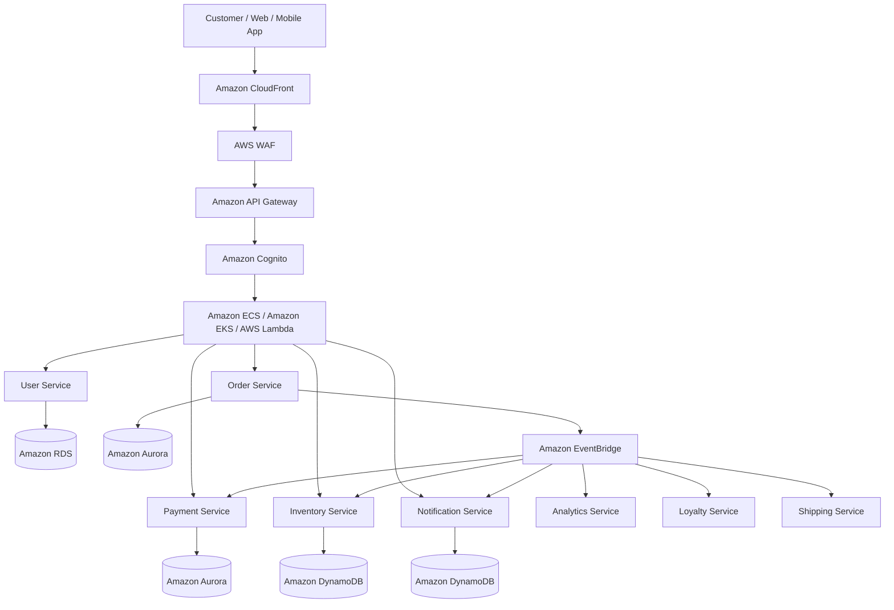

---

# Order Processing Flow

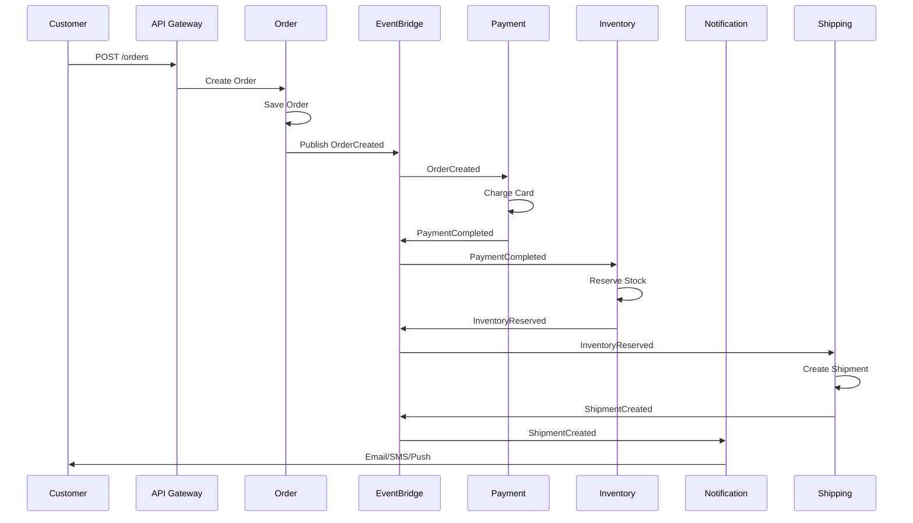

---

# EventBridge Routing

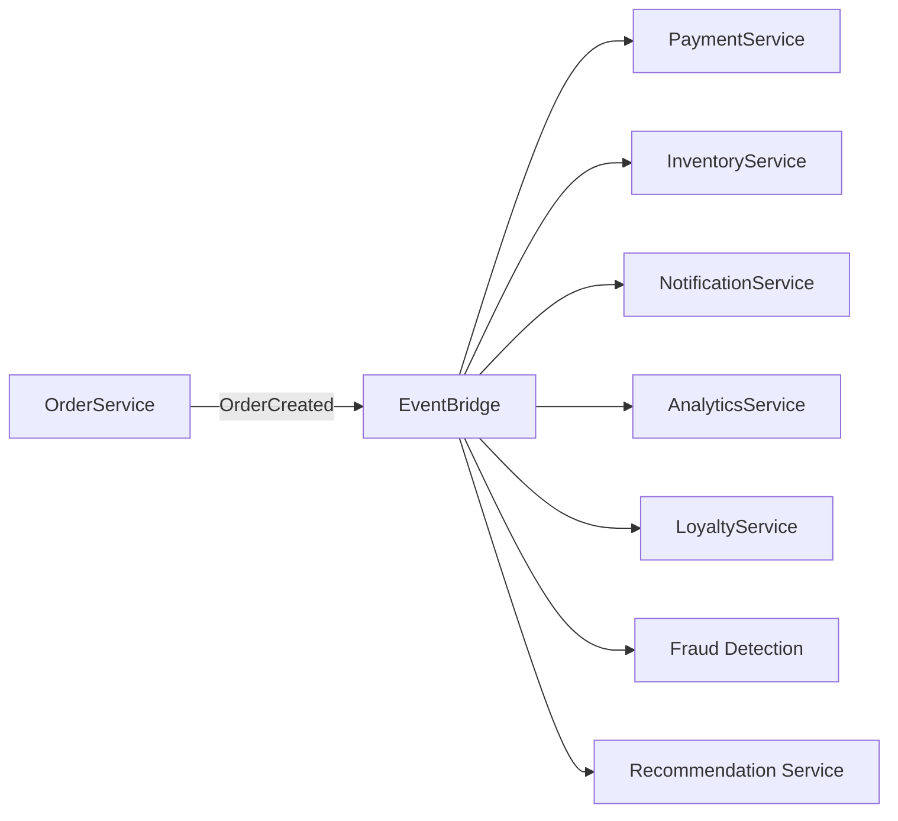

---

# SNS + SQS Fan-Out Pattern

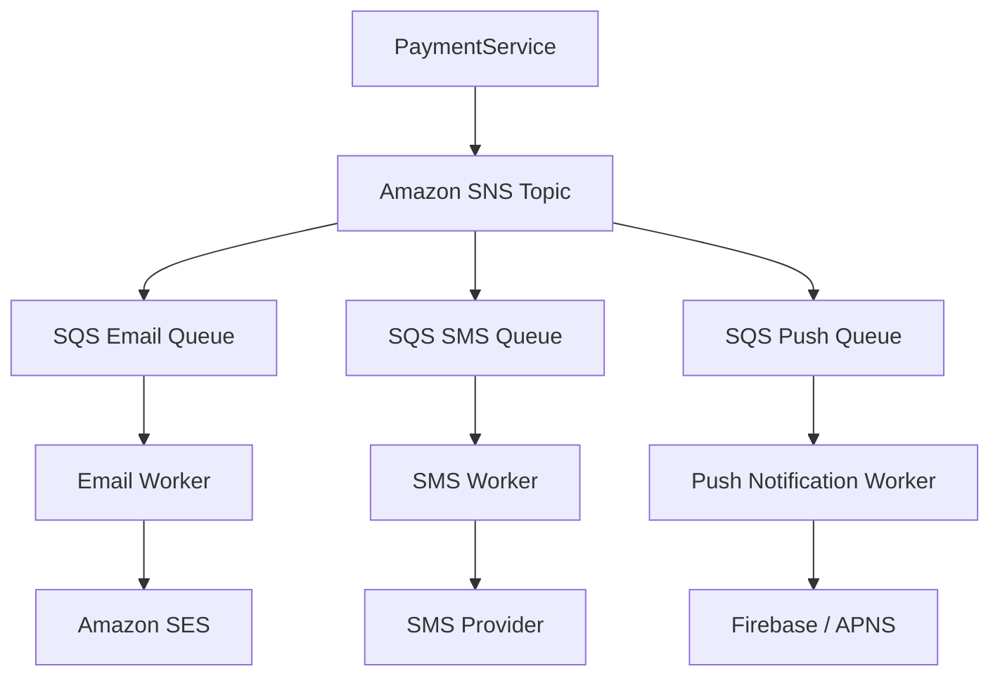

---

# Event-Driven Architecture

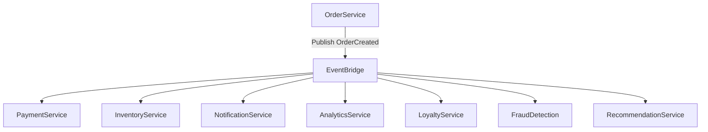

---

# Saga Pattern

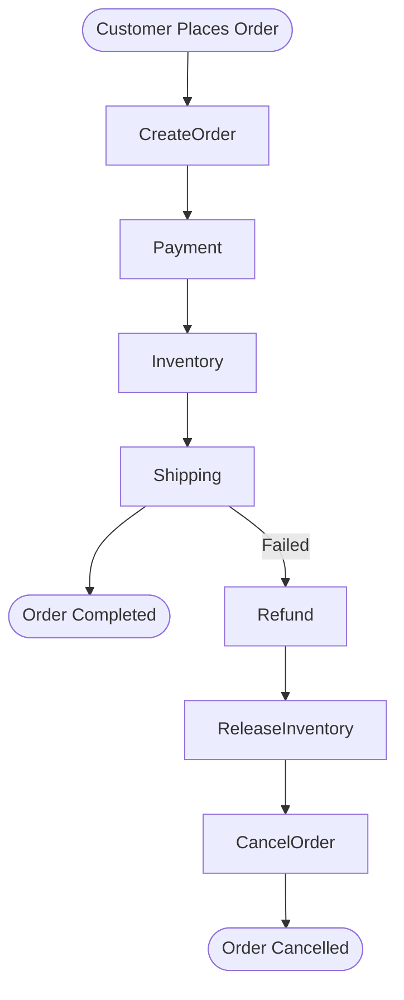

---

# API Gateway Pattern

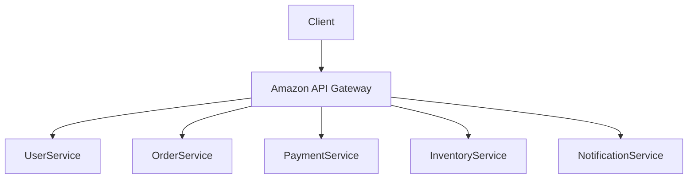

---

# Database Per Service Pattern

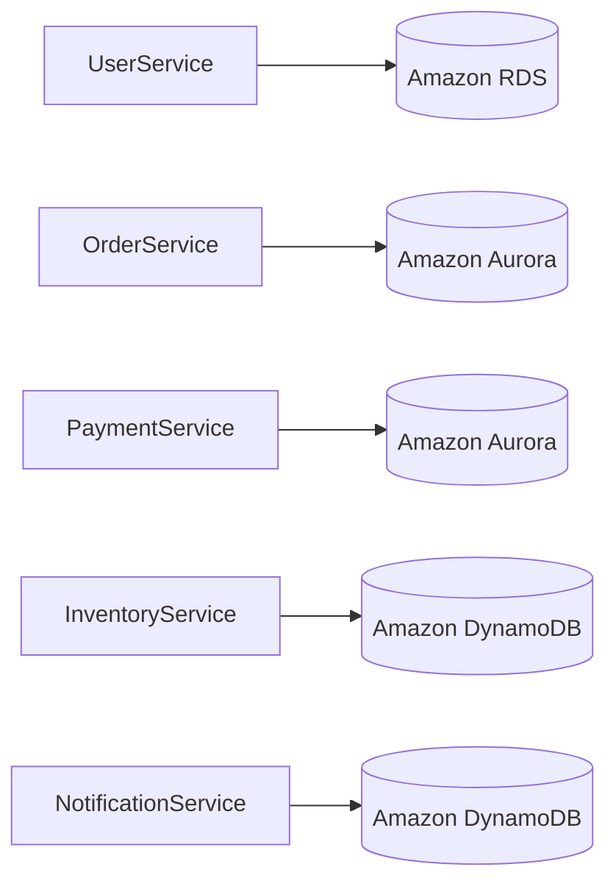

---

# Cache-Aside Pattern

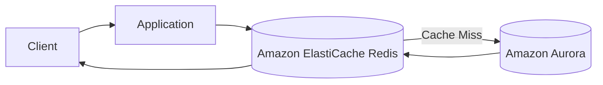

---

# Circuit Breaker Pattern

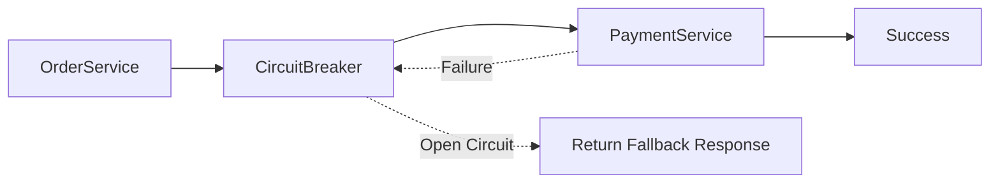

---

# Retry with Exponential Backoff

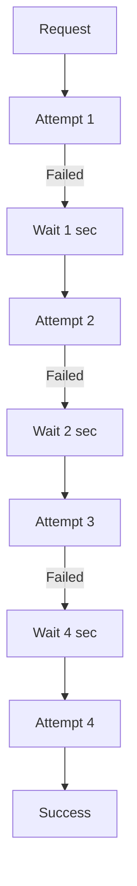

---

# Sidecar Pattern

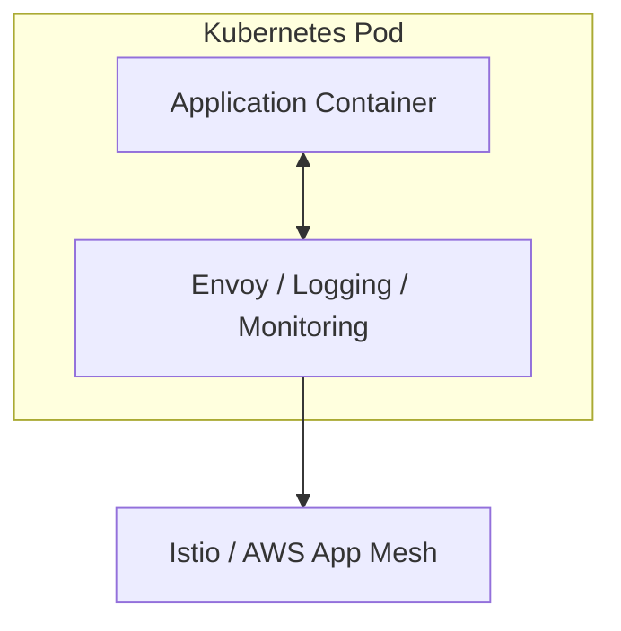

---

# AWS Services Used

| Layer | AWS Service |
|---------|-------------|
| CDN | Amazon CloudFront |
| Security | AWS WAF |
| Authentication | Amazon Cognito |
| API Management | Amazon API Gateway |
| Compute | Amazon ECS |
| Kubernetes | Amazon EKS |
| Serverless | AWS Lambda |
| SQL Database | Amazon Aurora |
| NoSQL Database | Amazon DynamoDB |
| Cache | Amazon ElastiCache (Redis) |
| Event Bus | Amazon EventBridge |
| Notification | Amazon SNS |
| Queue | Amazon SQS |
| Email | Amazon SES |
| Monitoring | Amazon CloudWatch |
| Tracing | AWS X-Ray |
| Secrets | AWS Secrets Manager |

---

# Architecture Patterns Demonstrated

- API Gateway Pattern
- Event-Driven Architecture
- Publish-Subscribe Pattern
- SNS Fan-Out Pattern
- SQS Queue Pattern
- Saga Pattern
- Database per Service
- Circuit Breaker Pattern
- Retry Pattern
- Cache-Aside Pattern
- Sidecar Pattern
- Loose Coupling
- Independent Deployment
- Independent Scaling
- Domain-Driven Design (DDD)
- Microservices Architecture