# Azure — Complete Interview Prep (All Topics, One File)

> Domain: Azure | Level: Beginner → Expert | Prerequisite: [[../21-AWS/01-AWS-Interview-Prep]] (AWS is the reference model; this file maps concepts and highlights **genuine divergences**), [[../14-System-Design/01-System-Design-Fundamentals]]
> **Quick-prep edition** (consolidated 2026-10-03). This one file replaces Modules 65–72. Originals: `git show ebb2d5c:22-Azure/<file>.md`
> Each topic has: **Key concepts → .NET/Bicep/CLI example → Most common interview questions with answers.** Verify current limits and pricing in Microsoft Learn.

| # | Topic | # | Topic |
|---|---|---|---|
| 1 | AWS ↔ Azure service map | 8 | Messaging: Service Bus, Event Grid, Event Hubs |
| 2 | Organization: tenants, management groups, subscriptions, resource groups | 9 | Containers: AKS, Container Apps, Dapr, KEDA |
| 3 | Networking: VNet, NSG, Private Link, Front Door, App Gateway | 10 | App hosting: App Service & deployment slots |
| 4 | Compute: VMs, Availability Zones/Sets, VM Scale Sets | 11 | Observability: Azure Monitor & Application Insights |
| 5 | Identity & security: Entra ID, RBAC, Managed Identity, Key Vault | 12 | IaC (Bicep/ARM/Terraform), governance (Policy) & Well-Architected |
| 6 | Storage: Blob, redundancy tiers, Disks, Files | 13 | DR, paired regions, cost & Hybrid Benefit |
| 7 | Databases: Azure SQL, Managed Instance, Cosmos DB | 14 | Top 30 rapid-fire + Principal · 15 Mistakes checklist |
| 7b | Serverless: Functions, Durable Functions, APIM, Logic Apps | | |

---

## 1. AWS ↔ Azure Service Map

| Capability | AWS | Azure |
|---|---|---|
| Account structure | Organizations / accounts / OUs | Entra tenant / management groups / **subscriptions** / **resource groups** |
| Network | VPC, subnets, SG, NACL | **VNet**, subnets, **NSG** (subnet or NIC), ASG (app security groups) |
| Private service access | VPC endpoints / PrivateLink | **Private Endpoints** / Private Link, Service Endpoints |
| L4 / L7 LB | NLB / ALB | **Azure Load Balancer** / **Application Gateway (+WAF)** |
| Global edge | CloudFront + Global Accelerator + Route 53 | **Front Door** (+WAF), Traffic Manager (DNS), Azure DNS |
| VMs / autoscale | EC2 / ASG | VMs / **VM Scale Sets** |
| PaaS web apps | Elastic Beanstalk / App Runner | **App Service** (slots) |
| Serverless | Lambda / Step Functions | **Azure Functions** / **Durable Functions**, Logic Apps |
| API management | API Gateway | **API Management (APIM)** |
| Containers | ECS / EKS / Fargate | **Container Apps** / **AKS** / Container Instances |
| Registry | ECR | ACR |
| Identity | IAM roles, Identity Center | **Entra ID**, **Azure RBAC**, **Managed Identity**, PIM |
| Keys & secrets | KMS + Secrets Manager | **Key Vault** (keys + secrets + certificates) |
| Object / block / file | S3 / EBS / EFS | **Blob Storage** / Managed Disks / **Azure Files** |
| Relational | RDS / Aurora | **Azure SQL Database**, **SQL Managed Instance**, Azure Database for PostgreSQL Flexible Server |
| NoSQL | DynamoDB | **Cosmos DB** |
| Cache | ElastiCache | Azure Cache for Redis / Azure Managed Redis |
| Queue / pub-sub / bus | SQS / SNS / EventBridge | **Service Bus** / **Event Grid** |
| Streaming | Kinesis / MSK | **Event Hubs** (Kafka-compatible) |
| Monitoring | CloudWatch / X-Ray / CloudTrail | **Azure Monitor**, **Application Insights**, Log Analytics, Activity Log |
| IaC | CloudFormation / CDK | **ARM / Bicep**, Terraform |
| Governance | SCPs, Config | **Azure Policy**, management groups, Defender for Cloud |
| DR | Elastic DR / Backup | **Azure Site Recovery**, Azure Backup, paired regions |

**Common interview question**

**Q. You know AWS well. What are the biggest conceptual differences in Azure?**
Hierarchical scopes with **RBAC inheritance** (management group → subscription → resource group → resource) instead of AWS's policy evaluation per account; **resource groups** as lifecycle containers; **Entra ID** as the single identity plane for users and workloads (managed identities); **Key Vault** combining keys and secrets; storage **redundancy as an account setting** (LRS/ZRS/GRS/GZRS); Cosmos DB's **five consistency levels** and multi-region writes; Service Bus combining queues and topics; and **Container Apps** as a serverless Kubernetes tier with no AWS equivalent.

---

## 2. Organization: Tenants, Management Groups, Subscriptions, Resource Groups

**Key concepts**
- **Entra ID tenant** = identity boundary. **Management groups** = hierarchy for policy and RBAC. **Subscriptions** = billing and scale/quota boundary (closest to an AWS account). **Resource groups** = lifecycle containers for related resources (deploy, secure and delete together); every resource belongs to exactly one RG.
- **Landing zones** (Cloud Adoption Framework): platform subscriptions (identity, management, connectivity hub) + application landing zones per workload/environment; Azure Policy at management-group level.
- Tags and naming conventions for cost allocation.

**Common interview question**

**Q. How do you structure subscriptions and resource groups for 50 product teams?**
Management groups for platform vs landing zones (and prod vs non-prod), a subscription per workload/environment (quota and billing isolation, blast radius), resource groups per application component lifecycle, Azure Policy and RBAC assigned at management-group scope, and subscription vending automated via IaC.

---

## 3. Networking: VNet, NSG, Private Link, Front Door, App Gateway

**Key concepts**
- **VNets** span all AZs in a region (subnets are regional, unlike AWS AZ-scoped subnets).
- **NSGs** attach to **subnets and/or NICs** (both evaluated — a common surprise); stateful; priority-ordered allow/deny rules; **Application Security Groups** group VMs logically in rules.
- **Hub-and-spoke** with VNet peering (non-transitive) or **Virtual WAN**; Azure Firewall in the hub; route tables (UDRs) force traffic through the firewall.
- **Private Endpoints:** a private IP in your VNet for a PaaS resource (SQL, Storage, Key Vault, Service Bus) + private DNS zones (`privatelink.database.windows.net`) — getting DNS right is the main pitfall. **Service Endpoints:** older, routes to the public endpoint over the Azure backbone.
- **Load balancing:** **Azure Load Balancer** (L4, regional), **Application Gateway** (L7 regional, WAF, path routing, AKS ingress via AGIC/Application Gateway for Containers), **Front Door** (global L7, anycast, CDN, WAF, fast failover), **Traffic Manager** (DNS-based global routing).
- **NAT Gateway** for outbound SNAT; Bastion for VM access without public IPs.

```bash
# Private endpoint for Azure SQL + private DNS zone link
az network private-endpoint create -g rg-pay -n pe-sql --vnet-name vnet-pay --subnet data \
  --private-connection-resource-id $(az sql server show -g rg-pay -n sql-pay --query id -o tsv) \
  --group-id sqlServer --connection-name sqlconn
az network private-dns zone create -g rg-pay -n privatelink.database.windows.net
az network private-dns link vnet create -g rg-pay -z privatelink.database.windows.net -n link-pay -v vnet-pay -e false
```

**Common interview questions**

**Q1. NSG on the subnet and the NIC — which applies?**
Both: inbound traffic is evaluated against the subnet NSG then the NIC NSG (outbound in reverse); traffic must be allowed by both. Teams often troubleshoot one and forget the other.

**Q2. Private Endpoint vs Service Endpoint?**
A Private Endpoint gives the service a private IP inside your VNet (traffic never uses the public endpoint; you can disable public access entirely; works from on-prem and peered VNets) but needs private DNS. A Service Endpoint keeps the public endpoint but restricts it to your subnet over the backbone. Prefer Private Endpoints for regulated workloads.

**Q3. Front Door vs Application Gateway vs Traffic Manager?**
Front Door: global HTTP(S) entry with anycast, WAF, caching and fast failover between regions. Application Gateway: regional L7 load balancer/WAF in your VNet (private backends, AKS). Traffic Manager: DNS-based routing (any protocol) with DNS-caching-limited failover speed. Common pattern: Front Door → (private link) → App Gateway/internal LB per region.

---

## 4. Compute: VMs, Availability Zones/Sets, VM Scale Sets

**Key concepts**
- **Availability Zones:** separate data centres → zonal/zone-redundant deployment (99.99% VM SLA across zones).
- **Availability Sets:** fault domains (rack/power) + update domains within one data centre — protects from hardware/maintenance failures, **not** a data-centre loss (legacy; prefer zones).
- **VM Scale Sets (Flexible orchestration):** autoscale (metrics, schedules, predictive), **zone-spanning must be explicitly configured**, rolling upgrades, health extension, Spot VMs.
- VM SKUs, Azure Hybrid Benefit (Windows/SQL licences), reserved instances/savings plans, Spot.

**Common interview question**

**Q. Availability Set or Availability Zones?**
Zones for protection against a data-centre failure and the higher SLA; Availability Sets only protect within one data centre (rack/maintenance), useful in regions without zones or for legacy constraints. Configure VMSS with zones explicitly — it's not automatic.

---

## 5. Identity & Security: Entra ID, RBAC, Managed Identity, Key Vault

**Key concepts**
- **Entra ID** (formerly Azure AD): users, groups, **app registrations** (OIDC/OAuth clients and APIs), **service principals**, Conditional Access, MFA, **PIM** (just-in-time privileged roles with approval).
- **Azure RBAC:** role assignment = principal + role definition + **scope**; **inherits downward** (assign at subscription → applies to all RGs/resources). Built-in roles (Owner, Contributor, Reader, data-plane roles like `Storage Blob Data Reader`, `Key Vault Secrets User`); custom roles; **deny assignments** are limited (mostly via Blueprints/managed apps). Separate **control plane** vs **data plane** roles.
- **Managed Identities:** system-assigned (lifecycle tied to the resource) or **user-assigned** (shareable, pre-provisioned); the app gets tokens from the platform — **no secrets**. **Workload Identity Federation** for AKS pods and GitHub Actions/external IdPs (OIDC trust, no client secrets).
- **Key Vault:** secrets + keys (HSM-backed, Premium/Managed HSM) + certificates; RBAC authorization model; soft delete + **purge protection**; private endpoint; Key Vault references in App Service/Functions config.
- **Defender for Cloud**, **Microsoft Sentinel** (SIEM), **Azure Policy** for security baselines.

```csharp
// DefaultAzureCredential: managed identity in Azure, developer login locally — no secrets anywhere
var credential = new DefaultAzureCredential();
builder.Configuration.AddAzureKeyVault(new Uri("https://kv-payments.vault.azure.net/"), credential);
builder.Services.AddAzureClients(c =>
{
    c.UseCredential(credential);
    c.AddBlobServiceClient(new Uri("https://stpayments.blob.core.windows.net"));
    c.AddServiceBusClientWithNamespace("sb-payments.servicebus.windows.net");
});

// Azure SQL with Entra authentication (no password in the connection string)
// "Server=tcp:sql-pay.database.windows.net;Database=Payments;Authentication=Active Directory Default;Encrypt=True;"
```

**Common interview questions**

**Q1. How does Azure RBAC differ from AWS IAM?**
Azure grants roles at a scope that inherits down the hierarchy (management group → subscription → RG → resource), and the evaluation is the union of role assignments (allow-based, with limited deny). AWS evaluates JSON policies with explicit deny precedence, SCPs and boundaries per request. In Azure, a broad assignment high in the hierarchy silently grants access to everything below — review high-scope assignments carefully.

**Q2. System-assigned vs user-assigned managed identity?**
System-assigned is created and deleted with the resource — simple, 1:1. User-assigned is a standalone resource you can pre-provision, grant access to before deployment, and share across instances or slots (useful for scale sets, blue/green and avoiding role-assignment propagation delays).

**Q3. How do you remove secrets from a .NET app on Azure?**
Managed identity + `DefaultAzureCredential` for Azure SQL (Entra auth), Storage, Service Bus, Key Vault and Cosmos DB; Key Vault references for any remaining third-party secrets; workload identity federation for AKS and CI/CD pipelines.

**Q4. What is PIM and why does it matter for audits?**
Privileged Identity Management gives just-in-time, time-bound activation of privileged roles with approval, MFA and justification — no standing admin access, plus an audit trail of every elevation (a typical SOX/ISO control).

---

## 6. Storage: Blob, Redundancy Tiers, Disks, Files

**Key concepts**
- **Redundancy (a storage-account setting — the key divergence from AWS):** **LRS** (3 copies, one DC), **ZRS** (3 zones), **GRS** (LRS + async copy to the paired region), **GZRS** (ZRS + paired region), **RA-GRS/RA-GZRS** (read access to the secondary). Failover of GRS is customer-initiated (async → possible data loss).
- **Blob access tiers:** Hot, Cool, Cold, Archive (rehydration hours) + **lifecycle management**; immutability policies (**WORM**, legal hold) for compliance; soft delete; versioning; strong consistency.
- **SAS tokens** (account/service/**user-delegation SAS** — preferred, signed with Entra credentials) ≈ S3 pre-signed URLs.
- **Managed Disks:** zonal; **ZRS disks** for zone-resilient shared scenarios. **Azure Files:** SMB/NFS shares (≈ EFS/FSx) with AD integration. **Blob events** via **Event Grid**.

```csharp
// User-delegation SAS: time-limited upload URL signed with Entra credentials (no account key)
var blobService = new BlobServiceClient(new Uri("https://stloans.blob.core.windows.net"), new DefaultAzureCredential());
var key = await blobService.GetUserDelegationKeyAsync(DateTimeOffset.UtcNow, DateTimeOffset.UtcNow.AddMinutes(15));
var blob = blobService.GetBlobContainerClient("docs").GetBlobClient($"{tenantId}/{Guid.NewGuid()}.pdf");
var sas = new BlobSasBuilder(BlobSasPermissions.Create | BlobSasPermissions.Write, DateTimeOffset.UtcNow.AddMinutes(10))
    { BlobContainerName = "docs", BlobName = blob.Name, Resource = "b" };
Uri uploadUri = new BlobUriBuilder(blob.Uri) { Sas = sas.ToSasQueryParameters(key, blobService.AccountName) }.ToUri();
```

**Common interview questions**

**Q1. Which redundancy for a regulated document store needing regional DR?**
GZRS (zone-redundant in the primary + async geo-replication) or RA-GZRS if you need read access to the secondary during an outage; plus immutability policies for retention, versioning/soft delete for accidental deletion, and documented customer-initiated failover with its RPO.

**Q2. Account key SAS vs user-delegation SAS?**
Account-key SAS is signed with the storage account key (powerful, hard to revoke — rotating the key invalidates everything). User-delegation SAS is signed with an Entra-issued key tied to an identity with RBAC, limited lifetime and auditable — preferred; disable shared-key access where possible.

---

## 7. Databases: Azure SQL, Managed Instance, Cosmos DB

**Key concepts — Azure SQL**
- **Azure SQL Database** (PaaS single DB/elastic pools): built-in HA (remote storage + compute failover in General Purpose; Always On–style replicas in **Business Critical** with a free readable secondary); **zone redundancy** option; **Hyperscale** (up to 100+ TB, fast scale, many replicas); **serverless** tier (auto-pause); **active geo-replication** and **failover groups** (listener endpoints that survive regional failover); automatic tuning; PITR and long-term retention.
- **SQL Managed Instance:** near-100% SQL Server compatibility (SQL Agent, cross-database queries, CLR, Service Broker, linked servers) in your VNet — for lift-and-shift of SQL Server estates.
- **Elastic pools:** share resources across many databases (multi-tenant SaaS, database-per-tenant).
- .NET: `Microsoft.Data.SqlClient`, Entra authentication, `EnableRetryOnFailure` (transient faults during reconfiguration are normal in PaaS).

**Key concepts — Cosmos DB**
- Multi-model (NoSQL API, MongoDB API, Cassandra, Gremlin, Table, PostgreSQL via Citus), global distribution, single-digit-ms latency, SLA-backed.
- **Five consistency levels:** **Strong** → **Bounded staleness** → **Session** (default: read-your-writes per session) → **Consistent prefix** → **Eventual**. Stronger = higher latency/RU cost; Strong limits multi-region write options.
- **Partition key** design is critical (like DynamoDB): high cardinality, even distribution, used in most queries; logical partition limit 20 GB; hierarchical partition keys help.
- **Request Units (RU/s):** normalized cost of operations (a 1 KB point read ≈ 1 RU); provisioned (manual/**autoscale**) or **serverless**; 429 throttling → SDK retries.
- **Multi-region writes** (multi-master) with conflict resolution (last-writer-wins by `_ts` or custom stored procedure).
- **Change feed** (≈ DynamoDB Streams) for projections and event-driven processing.

```csharp
// Cosmos DB .NET SDK v3: singleton client, session consistency, point reads by id + partition key
builder.Services.AddSingleton(_ => new CosmosClient("https://cosmos-pay.documents.azure.com:443/", new DefaultAzureCredential(),
    new CosmosClientOptions { ConsistencyLevel = ConsistencyLevel.Session, ApplicationRegion = Regions.WestEurope,
                              SerializerOptions = new() { PropertyNamingPolicy = CosmosPropertyNamingPolicy.CamelCase } }));

var container = cosmos.GetContainer("payments", "orders");
var order = await container.ReadItemAsync<Order>(id: "O-9", partitionKey: new PartitionKey("CUST-123"));   // ~1 RU per KB
Console.WriteLine(order.RequestCharge);

// Optimistic concurrency with ETag
await container.ReplaceItemAsync(updated, updated.Id, new PartitionKey(updated.CustomerId),
    new ItemRequestOptions { IfMatchEtag = order.ETag });
```

**Common interview questions**

**Q1. Azure SQL Database vs Managed Instance vs SQL Server on a VM?**
Azure SQL Database for new cloud-native apps (fully managed, scales, serverless/Hyperscale). Managed Instance to lift-and-shift SQL Server workloads needing instance-level features (Agent jobs, cross-DB queries, CLR) with PaaS management. SQL Server on VMs only for full OS/instance control or unsupported features — you manage HA, patching and backups.

**Q2. Explain Cosmos DB consistency levels and which you'd choose.**
Strong (linearizable), bounded staleness (lag bounded by time or versions), session (read-your-writes and monotonic reads within a session — the default and usually best for user-facing apps), consistent prefix (no out-of-order reads), eventual (cheapest, fastest). Choose session for most apps; bounded staleness or strong for financial reads that must be current across regions, accepting latency and RU cost.

**Q3. Cosmos DB costs are spiking. Why?**
Cross-partition queries (fan-out), a poor partition key causing hot partitions and throttling-then-overprovisioning, indexing everything (write RU cost), large documents, strong consistency doubling read cost, chatty point reads instead of batched queries. Fix the partition key and queries, tune the indexing policy, use autoscale or serverless appropriately, cache hot reads.

**Q4. Failover groups — what do they give you?**
Geo-replicated databases with read-write and read-only **listener endpoints** that keep the same DNS name across failover, plus automatic or manual failover policies — the app doesn't change connection strings during a regional failover (async replication → RPO > 0).

---

## 7b. Serverless: Functions, Durable Functions, API Management, Logic Apps

**Key concepts**
- **Hosting plans** (a choice Lambda doesn't have): **Flex Consumption** (scale to zero, VNet integration, fast scaling — the modern default), Consumption (legacy), **Premium** (pre-warmed instances, no cold start, VNet), **Dedicated (App Service plan)**, Container Apps hosting.
- **.NET isolated worker model** (out-of-process; in-process model is retiring) with full DI and middleware.
- **Triggers/bindings:** HTTP, timer, Service Bus, Event Grid, Event Hubs, Blob, Cosmos DB change feed, queue.
- **Durable Functions:** orchestrator functions written as code that are **replayed** from history → must be **deterministic** (use `context.CurrentUtcDateTime`, no direct I/O, no random); activities do the work (idempotent); patterns: function chaining, fan-out/fan-in, async HTTP APIs, monitors, human interaction (external events + timers), **sagas**. Durable Task Scheduler as a managed backend.
- **API Management:** full API lifecycle — gateway (policies: JWT validation, rate limiting, quotas, transformation, caching), developer portal, products/subscriptions, versions/revisions, self-hosted gateways.
- **Logic Apps:** low-code workflows with 1,000+ connectors (B2B/EDI, SaaS integrations) — for integration teams rather than core domain logic.

```csharp
// Durable Functions (isolated): payout saga with compensation
[Function(nameof(PayoutOrchestrator))]
public static async Task<string> PayoutOrchestrator([OrchestrationTrigger] TaskOrchestrationContext ctx)
{
    var req = ctx.GetInput<PayoutRequest>()!;
    var retry = TaskOptions.FromRetryPolicy(new RetryPolicy(5, TimeSpan.FromSeconds(2), backoffCoefficient: 2));
    await ctx.CallActivityAsync(nameof(ReserveFunds), req, retry);
    try
    {
        var reference = await ctx.CallActivityAsync<string>(nameof(SendToBank), req, retry);   // pivot
        await ctx.CallActivityAsync(nameof(PostLedger), (req, reference), retry);
        return reference;
    }
    catch (TaskFailedException)
    {
        await ctx.CallActivityAsync(nameof(ReleaseFunds), req);                                  // compensate
        throw;
    }
}
```

```xml
<!-- APIM policy: validate JWT, rate limit per subscription, forward correlation id -->
<inbound>
  <validate-jwt header-name="Authorization" failed-validation-httpcode="401">
    <openid-config url="https://login.microsoftonline.com/{tenant}/v2.0/.well-known/openid-configuration" />
    <audiences><audience>api://payments</audience></audiences>
  </validate-jwt>
  <rate-limit-by-key calls="100" renewal-period="60" counter-key="@(context.Subscription.Id)" />
  <set-header name="x-correlation-id" exists-action="skip"><value>@(context.RequestId.ToString())</value></set-header>
</inbound>
```

**Common interview questions**

**Q1. Durable Functions vs Step Functions?**
Both give durable orchestration. Durable Functions express workflows as **code** (C#) replayed from history — powerful and testable but requiring determinism discipline; Step Functions use declarative JSON state machines with visual tooling and service integrations. Choose by platform and team preference; both need idempotent activities.

**Q2. Why must orchestrator code be deterministic?**
The orchestrator is replayed from its event history after every await to rebuild state; non-deterministic calls (current time, GUIDs, random, direct I/O) would produce different decisions on replay and corrupt the workflow. Use the context's deterministic APIs and move side effects into activities.

**Q3. Which Functions hosting plan for a latency-sensitive payment API?**
Premium (always-ready instances, no cold start, VNet) or Flex Consumption with always-ready instances; or host as a container in Container Apps/App Service. Consumption-style scale-to-zero is fine for background/event processing where cold starts don't matter.

**Q4. API Management vs Application Gateway?**
APIM manages APIs as products (auth policies, quotas, transformations, versioning, developer portal, analytics). Application Gateway is an L7 load balancer/WAF. They're often combined: Front Door/App Gateway (WAF) → APIM → backends.

---

## 8. Messaging: Service Bus, Event Grid, Event Hubs

**Key concepts**
- **Service Bus** (enterprise broker): **queues and topics/subscriptions** in one service; **sessions** (FIFO per session ID ≈ SQS FIFO groups), **duplicate detection** window, scheduled messages, deferral, **dead-letter sub-queues**, peek-lock with lock renewal, transactions (send + complete atomically within a namespace), subscription filters (SQL/correlation), Premium tier for isolation and VNet.
- **Event Grid** (push-based event routing ≈ EventBridge): reacts to Azure resource events (blob created) and custom/CloudEvents; filters; push to webhooks/Functions/queues; **retries with backoff then drops unless a dead-letter destination is configured** (sharp edge). Event Grid namespaces add MQTT and pull delivery.
- **Event Hubs** (partitioned log ≈ Kinesis/Kafka): partitions, consumer groups, checkpointing (Blob Storage), Capture to storage, **Kafka-compatible endpoint**, Schema Registry.
- **Decision:** commands/work with ordering, transactions, DLQ → Service Bus; reactive notifications of state changes → Event Grid; high-volume telemetry/streams with replay → Event Hubs (or Kafka).

```csharp
// Service Bus processor with sessions (ordered per customer) and dead-lettering
var client = new ServiceBusClient("sb-payments.servicebus.windows.net", new DefaultAzureCredential());
var processor = client.CreateSessionProcessor("payments", new ServiceBusSessionProcessorOptions
    { MaxConcurrentSessions = 16, AutoCompleteMessages = false, MaxAutoLockRenewalDuration = TimeSpan.FromMinutes(5) });

processor.ProcessMessageAsync += async args =>
{
    try
    {
        await handler.HandleAsync(args.Message.Body.ToObjectFromJson<PaymentCommand>()!, args.CancellationToken); // idempotent
        await args.CompleteMessageAsync(args.Message);
    }
    catch (ValidationException ex)
    {
        await args.DeadLetterMessageAsync(args.Message, "ValidationFailed", ex.Message);   // poison → DLQ
    }
};
processor.ProcessErrorAsync += e => { logger.LogError(e.Exception, "SB error"); return Task.CompletedTask; };
await processor.StartProcessingAsync();

// Sending in order for one customer: SessionId = customerId; MessageId enables duplicate detection
await client.CreateSender("payments").SendMessageAsync(new ServiceBusMessage(BinaryData.FromObjectAsJson(cmd))
    { SessionId = cmd.CustomerId, MessageId = cmd.CommandId.ToString() });
```

**Common interview questions**

**Q1. Service Bus vs Event Grid vs Event Hubs?**
Service Bus for reliable business messaging (commands, ordered sessions, transactions, DLQ). Event Grid for lightweight reactive routing of discrete events to handlers (push, filtering) — not for high-volume streams. Event Hubs for big streams (telemetry, clickstreams, CDC) with partitions and replay; Kafka clients work against it.

**Q2. What's the Event Grid "sharp edge"?**
It retries delivery with backoff for a limited time/attempts (by default up to 24 hours) and then **drops** the event unless dead-lettering to a storage container is configured. Always configure dead-lettering and make handlers idempotent (at-least-once delivery).

**Q3. How do you guarantee ordering per customer in Service Bus?**
Use sessions with SessionId = customerId; a session processor locks a session so one consumer processes it sequentially while different sessions are processed in parallel.

---

## 9. Containers: AKS, Container Apps, Dapr, KEDA

**Key concepts**
- **Three tiers:** **Container Apps** (serverless containers on managed Kubernetes: revisions, traffic splitting, **scale to zero with KEDA**, built-in Dapr, ingress, jobs) → **AKS** (full Kubernetes: node pools, CNI choices (Azure CNI Overlay), Workload Identity, AGIC/Application Gateway for Containers, KEDA add-on, Azure Policy, upgrades) → App Service for containers / Container Instances for simple single containers.
- **Dapr** (portable microservices runtime via sidecar): service invocation (mTLS, retries), state stores, pub/sub, bindings, secrets, actors, workflows — swap backing services by configuration. Cost: an extra sidecar hop, abstraction lowest-common-denominator, another component to operate.
- **KEDA:** event-driven autoscaling on queue length/lag (Service Bus, Event Hubs, Kafka, Prometheus) — including to zero (mind cold starts).
- AKS identity: **Microsoft Entra Workload ID** (federated service account tokens) — no secrets in pods.

```yaml
# KEDA ScaledObject: scale a worker on Service Bus queue length
apiVersion: keda.sh/v1alpha1
kind: ScaledObject
metadata: { name: payments-worker }
spec:
  scaleTargetRef: { name: payments-worker }
  minReplicaCount: 1          # keep 1 warm for latency; 0 for batch
  maxReplicaCount: 30
  triggers:
  - type: azure-servicebus
    metadata: { queueName: payments, namespace: sb-payments, messageCount: "50" }
    authenticationRef: { name: keda-workload-identity }
```

**Common interview questions**

**Q1. Container Apps or AKS?**
Container Apps for teams that want containers with autoscaling, revisions, Dapr and minimal Kubernetes operations — most microservices and workers. AKS when you need full Kubernetes control (custom operators, service mesh, node-level tuning, GPU pools, multi-tenant platform) and have a platform team.

**Q2. When is Dapr worth it?**
When you need portability across clouds/brokers, a polyglot estate wanting consistent building blocks (pub/sub, state, secrets, workflows), or quick productivity in Container Apps. Not when the team needs broker-specific features or wants to avoid sidecar overhead and another abstraction layer.

**Q3. Scale-to-zero — what's the catch?**
Cold starts: the first request or message waits for a container to start (image pull, .NET startup, warm-up). Keep a minimum replica for latency-sensitive services, use ReadyToRun/NativeAOT and small images, and accept zero only for batch/async workloads.

---

## 10. App Hosting: App Service & Deployment Slots

**Key concepts**
- **App Service:** PaaS for web apps/APIs (Windows/Linux, containers), autoscale, VNet integration (outbound) + private endpoints (inbound), built-in auth (Easy Auth), managed certificates, **deployment slots** (staging slot → warm-up → **swap** with zero downtime; slot-sticky settings), health check, Always On.
- Good default for .NET web apps that don't need Kubernetes.

**Common interview question**

**Q. How do you do zero-downtime deployments on App Service?**
Deploy to a staging slot with production-like settings (sticky settings for slot-specific config), warm it up (application initialization/health checks), then swap — traffic moves to the pre-warmed instance; swap back to roll back. Combine with database expand–contract changes.

---

## 11. Observability: Azure Monitor & Application Insights

**Key concepts**
- **Azure Monitor:** metrics, **Log Analytics** workspaces (KQL), alerts (metric, log, activity log), workbooks, **Activity Log** (control-plane audit ≈ CloudTrail), diagnostic settings to route resource logs.
- **Application Insights:** APM for apps — requests, dependencies, exceptions, distributed tracing, live metrics, availability tests; **OpenTelemetry Azure Monitor distro** for .NET is the recommended path.
- KQL is a key interview skill.

```csharp
builder.Services.AddOpenTelemetry().UseAzureMonitor();   // Azure.Monitor.OpenTelemetry.AspNetCore — traces, metrics, logs
```

```kusto
// p95 latency and failure rate per operation, last hour
requests
| where timestamp > ago(1h) and cloud_RoleName == "payments-api"
| summarize p95 = percentile(duration, 95), failures = countif(success == false), total = count() by operation_Name
| extend failureRate = todouble(failures) / total
| order by p95 desc
```

**Common interview question**

**Q. How do you trace a request across App Service, Service Bus and Functions?**
OpenTelemetry instrumentation exporting to Application Insights; W3C trace context propagated over HTTP automatically and in Service Bus message properties (Diagnostic-Id/traceparent); consumers continue the trace; the transaction search/application map shows the end-to-end flow.

---

## 12. IaC (Bicep/ARM/Terraform), Governance (Policy) & Well-Architected

**Key concepts**
- **ARM** templates (JSON) → **Bicep** (concise DSL compiling to ARM, first-class Azure support, modules, `what-if`), **Terraform** (multi-cloud), Azure Developer CLI (`azd`) templates.
- **Azure Policy:** deny/audit/modify/deployIfNotExists effects (e.g., deny public IPs, require tags, enforce private endpoints, require TLS 1.2) at management-group scope; initiatives (policy sets); compliance dashboard.
- **Well-Architected (Azure):** five pillars — Reliability, Security, Cost Optimization, Operational Excellence, Performance Efficiency (AWS adds Sustainability as a sixth); **Azure Advisor** for continuous recommendations; Well-Architected Review assessments.

```bicep
// Bicep: storage account with GZRS, no public blob access, TLS 1.2
resource st 'Microsoft.Storage/storageAccounts@2023-05-01' = {
  name: 'stpayments${uniqueString(resourceGroup().id)}'
  location: location
  sku: { name: 'Standard_GZRS' }
  kind: 'StorageV2'
  properties: {
    minimumTlsVersion: 'TLS1_2'
    allowBlobPublicAccess: false
    allowSharedKeyAccess: false
    publicNetworkAccess: 'Disabled'
  }
}
```

**Common interview question**

**Q. How do you enforce security baselines across all subscriptions?**
Azure Policy initiatives at management-group scope (deny public endpoints, require private endpoints and encryption, allowed regions/SKUs, tag requirements) with deployIfNotExists for diagnostics, Defender for Cloud recommendations and secure score, RBAC least privilege with PIM, and IaC modules that are compliant by default.

---

## 13. DR, Paired Regions, Cost & Hybrid Benefit

**Key concepts**
- **Paired regions:** Microsoft pairs regions (e.g., North Europe ↔ West Europe) for sequential platform updates, prioritized recovery and GRS replication targets. Some newer regions are unpaired (use zones + your own cross-region design).
- **DR tools:** Azure Site Recovery (VM replication/orchestrated failover — mostly IaaS), Azure Backup, SQL failover groups, Cosmos DB multi-region, GZRS storage, Front Door for traffic failover.
- **Cost levers:** Reservations and Savings Plans, **Azure Hybrid Benefit** (reuse Windows Server/SQL Server licences with Software Assurance — big savings for .NET/SQL estates), Spot VMs, autoscale and auto-pause (serverless SQL), right-sizing via Advisor, storage tiering, Dev/Test pricing, budgets and Cost Management alerts.

**Common interview questions**

**Q1. Design regional DR for a .NET + Azure SQL + Service Bus app.**
Front Door for global routing with health probes; app deployed in both regions (warm standby); Azure SQL failover groups (listener endpoints, async geo-replication); Service Bus Premium geo-replication/geo-DR (metadata, and data replication where available) or dual namespaces with idempotent producers; GZRS storage; Key Vault in both regions; documented RTO/RPO; regular failover drills.

**Q2. How do you cut Azure costs for a SQL Server–heavy estate?**
Azure Hybrid Benefit for SQL and Windows licences, reservations for steady compute and SQL vCores, right-size tiers (General Purpose vs Business Critical), serverless or elastic pools for spiky/multi-tenant DBs, move .NET apps to Linux containers to drop Windows licences, auto-shutdown of non-prod, and storage lifecycle tiering.

---

## 14. Top 30 Rapid-Fire Questions + Principal Questions

1. **Account equivalent?** Subscription.
2. **Lifecycle container?** Resource group.
3. **Policy hierarchy?** Management groups.
4. **RBAC inheritance?** Downward from the assigned scope.
5. **Identity platform?** Entra ID.
6. **No-secret app identity?** Managed identity + `DefaultAzureCredential`.
7. **JIT admin?** PIM.
8. **KMS + Secrets Manager?** Key Vault.
9. **Security group?** NSG (subnet and/or NIC).
10. **Private PaaS access?** Private Endpoint + private DNS.
11. **Global L7 entry?** Front Door.
12. **Regional L7 + WAF?** Application Gateway.
13. **DNS-based routing?** Traffic Manager.
14. **ASG equivalent?** VM Scale Sets.
15. **AZ vs Availability Set?** DC failure vs rack/update domains.
16. **Storage redundancy?** LRS/ZRS/GRS/GZRS (+RA).
17. **Pre-signed URL?** SAS (prefer user-delegation SAS).
18. **WORM?** Blob immutability policies.
19. **SQL lift-and-shift?** SQL Managed Instance.
20. **Huge SQL DB?** Hyperscale.
21. **Regional SQL failover with same endpoint?** Failover groups.
22. **Cosmos default consistency?** Session.
23. **Cosmos cost unit?** Request Units.
24. **Cosmos CDC?** Change feed.
25. **Ordered messages?** Service Bus sessions.
26. **Event Grid risk?** Drops after retries without dead-lettering.
27. **Kinesis equivalent?** Event Hubs (Kafka-compatible).
28. **Serverless containers?** Container Apps (KEDA, Dapr).
29. **Durable orchestration in code?** Durable Functions (deterministic orchestrators).
30. **License savings?** Azure Hybrid Benefit.

**Principal-level questions**

**P1. Multi-cloud (AWS + Azure) — when is it justified?**
Rarely as "active-active everything". Justified for regulatory/concentration-risk requirements, acquisitions, or best-of-breed services (e.g., Entra ID + M365 integration with workloads on AWS). Costs: duplicated platforms, skills, lowest-common-denominator abstractions, networking and egress. Prefer one primary cloud with portable architecture (containers, Kubernetes, Terraform, OpenTelemetry, standard protocols) and a credible exit plan.

**P2. Design an Azure landing zone for a bank.**
CAF enterprise-scale: management group hierarchy, platform subscriptions (identity, management with Log Analytics/Sentinel, connectivity hub with Azure Firewall/Virtual WAN, Private DNS), application landing zones per workload/env, Azure Policy baselines (no public endpoints, private DNS, encryption with CMK where required, allowed regions), PIM and Conditional Access, Defender for Cloud, subscription vending via IaC, and evidence export for audits.

**P3. Translate your AWS payment architecture to Azure — what changes beyond names?**
Identity model (managed identities + RBAC scopes instead of IAM roles), networking (Private Endpoints + DNS zones, regional subnets), Cosmos DB consistency choices vs DynamoDB, Service Bus sessions/transactions vs SQS FIFO, Durable Functions instead of Step Functions (code vs JSON), Front Door instead of CloudFront + Global Accelerator, Hybrid Benefit economics for SQL Server, and paired-region DR semantics.

---

## 15. Mistakes Checklist (say why each is wrong)
- [ ] Broad Owner/Contributor assignments at subscription or management-group scope · no PIM
- [ ] Client secrets/connection strings in config instead of managed identity
- [ ] Private Endpoints without private DNS zones (still resolving public IPs)
- [ ] Forgetting NIC-level NSGs · public endpoints left enabled on PaaS services
- [ ] LRS for data needing zone/region resilience · relying on Availability Sets for DC failure
- [ ] Account-key SAS everywhere · shared key access enabled
- [ ] Cosmos DB with a low-cardinality partition key · strong consistency by default without need
- [ ] Event Grid without dead-lettering · Service Bus consumers that aren't idempotent
- [ ] Non-deterministic Durable Functions orchestrators
- [ ] Scale-to-zero for latency-critical APIs · Consumption plan for always-hot APIs
- [ ] Ignoring Hybrid Benefit and reservations for SQL Server estates

---

## Architecture Diagrams (preserved from the original modules)

> All 32 Mermaid/ASCII diagrams from the original `22-Azure/` files, kept verbatim and grouped by source module. Originals: `git show ebb2d5c:22-Azure/<file>.md`.

### Module 65 — Azure: Compute & Networking Fundamentals — VMs, VNet, Load Balancer/App Gateway & VM Scale Sets
*Source: `01-Compute-Networking-VNet-LoadBalancer-VMSS.md`*

**Azure Resource Hierarchy — No Direct AWS Equivalent**

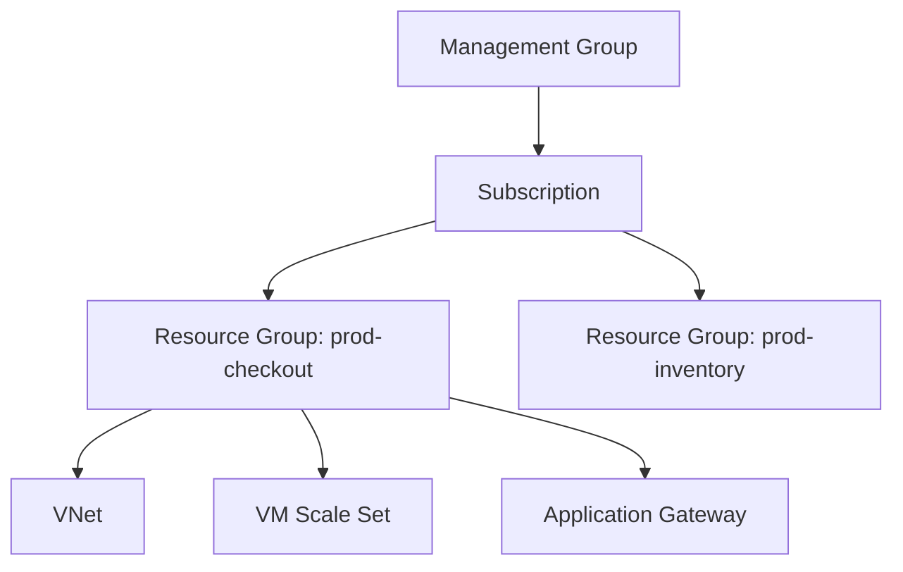
```mermaid
graph TB
 MG[Management Group] --> Sub[Subscription]
 Sub --> RG1["Resource Group: prod-checkout"]
 Sub --> RG2["Resource Group: prod-inventory"]
 RG1 --> VNet1[VNet]
 RG1 --> VMSS1[VM Scale Set]
 RG1 --> LB1[Application Gateway]
```

**NSG Dual Association — Subnet AND NIC Level**

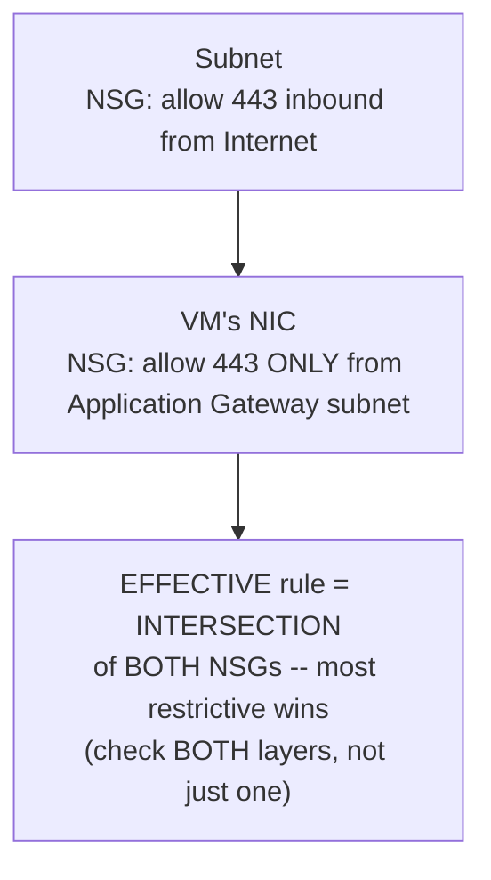
```mermaid
graph TB
 Subnet["Subnet<br/>NSG: allow 443 inbound from Internet"] --> VM["VM's NIC<br/>NSG: allow 443 ONLY from Application Gateway subnet"]
 VM --> Effective["EFFECTIVE rule = INTERSECTION<br/>of BOTH NSGs -- most restrictive wins<br/>(check BOTH layers, not just one)"]
```

**12. System Design**

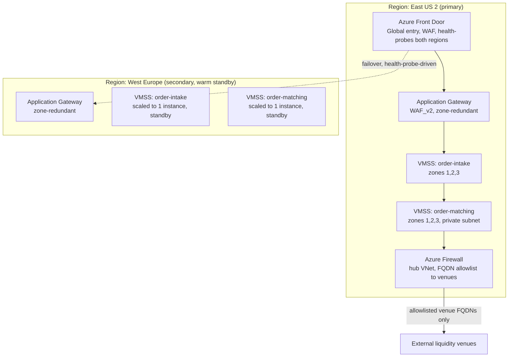
```mermaid
graph TB
 subgraph "Region: East US 2 (primary)"
  FD[Azure Front Door<br/>Global entry, WAF, health-probes both regions]
  AGW1[Application Gateway<br/>WAF_v2, zone-redundant]
  VMSS1[VMSS: order-intake<br/>zones 1,2,3]
  VMSS2[VMSS: order-matching<br/>zones 1,2,3, private subnet]
  FW1[Azure Firewall<br/>hub VNet, FQDN allowlist to venues]
  VMSS1 --> VMSS2
  AGW1 --> VMSS1
  VMSS2 --> FW1
 end
 subgraph "Region: West Europe (secondary, warm standby)"
  AGW2[Application Gateway<br/>zone-redundant]
  VMSS3[VMSS: order-intake<br/>scaled to 1 instance, standby]
  VMSS4[VMSS: order-matching<br/>scaled to 1 instance, standby]
 end
 FD --> AGW1
 FD -.->|failover, health-probe-driven| AGW2
 FW1 -->|allowlisted venue FQDNs only| Venues[External liquidity venues]
```

**13. Low-Level Design**

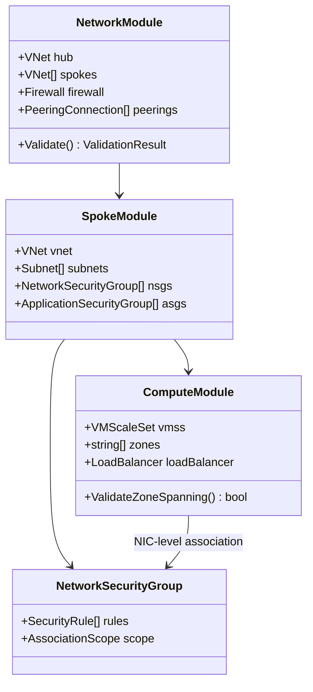
```mermaid
classDiagram
 class NetworkModule {
  +VNet hub
  +VNet[] spokes
  +Firewall firewall
  +PeeringConnection[] peerings
  +Validate() ValidationResult
 }
 class SpokeModule {
  +VNet vnet
  +Subnet[] subnets
  +NetworkSecurityGroup[] nsgs
  +ApplicationSecurityGroup[] asgs
 }
 class ComputeModule {
  +VMScaleSet vmss
  +string[] zones
  +LoadBalancer loadBalancer
  +ValidateZoneSpanning() bool
 }
 class NetworkSecurityGroup {
  +SecurityRule[] rules
  +AssociationScope scope
 }
 NetworkModule --> SpokeModule
 SpokeModule --> NetworkSecurityGroup
 SpokeModule --> ComputeModule
 ComputeModule --> NetworkSecurityGroup : NIC-level association
```

**13. Low-Level Design**

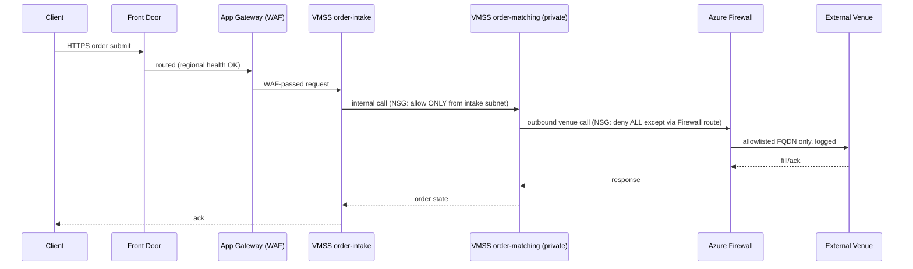
```mermaid
sequenceDiagram
 participant Client
 participant FD as Front Door
 participant AGW as App Gateway (WAF)
 participant Intake as VMSS order-intake
 participant Match as VMSS order-matching (private)
 participant FW as Azure Firewall
 participant Venue as External Venue

 Client->>FD: HTTPS order submit
 FD->>AGW: routed (regional health OK)
 AGW->>Intake: WAF-passed request
 Intake->>Match: internal call (NSG: allow ONLY from intake subnet)
 Match->>FW: outbound venue call (NSG: deny ALL except via Firewall route)
 FW->>Venue: allowlisted FQDN only, logged
 Venue-->>FW: fill/ack
 FW-->>Match: response
 Match-->>Intake: order state
 Intake-->>Client: ack
```

### Module 66 — Azure: IAM & Security — Entra ID, RBAC, Key Vault & Managed Identities
*Source: `02-IAM-Security-EntraID-RBAC-KeyVault.md`*

**RBAC Hierarchical Scope Inheritance**

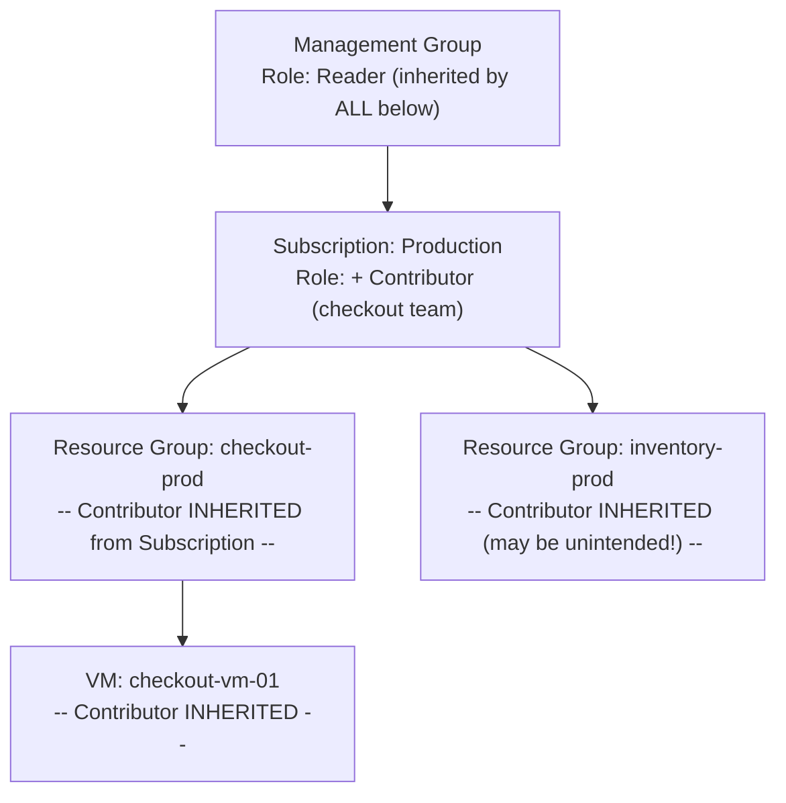
```mermaid
graph TB
 MG["Management Group<br/>Role: Reader (inherited by ALL below)"] --> Sub["Subscription: Production<br/>Role: + Contributor (checkout team)"]
 Sub --> RG1["Resource Group: checkout-prod<br/>-- Contributor INHERITED from Subscription --"]
 Sub --> RG2["Resource Group: inventory-prod<br/>-- Contributor INHERITED (may be unintended!) --"]
 RG1 --> Res1["VM: checkout-vm-01<br/>-- Contributor INHERITED --"]
```

**Key Vault's Combined Model vs. AWS's Split KMS/Secrets Manager**

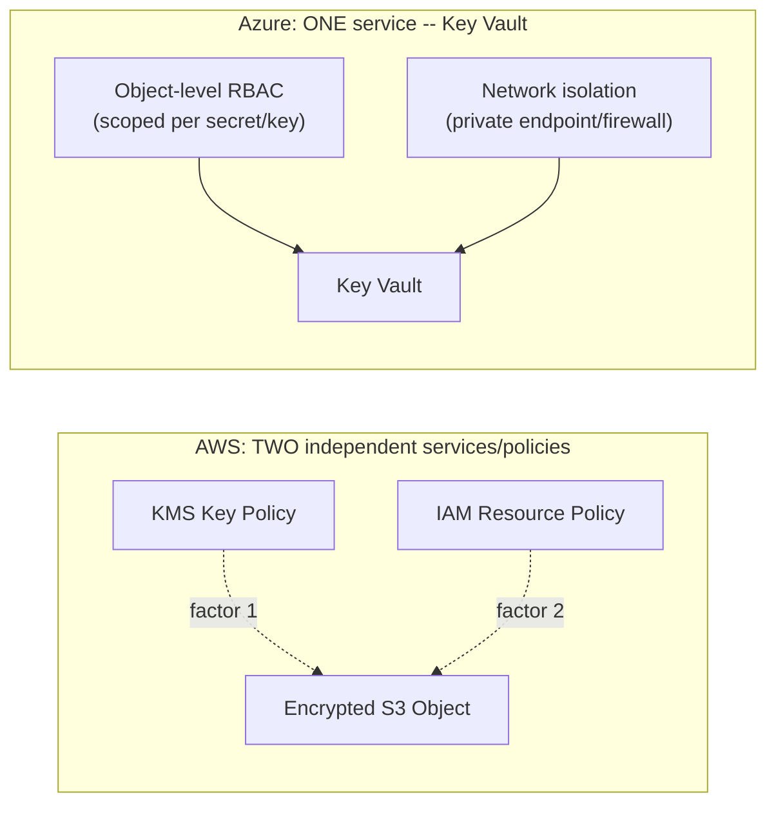
```mermaid
graph LR
 subgraph "AWS: TWO independent services/policies"
 KMS[KMS Key Policy] -.->|"factor 1"| S3Data[Encrypted S3 Object]
 IAM[IAM Resource Policy] -.->|"factor 2"| S3Data
 end
 subgraph "Azure: ONE service -- Key Vault"
 RBAC["Object-level RBAC<br/>(scoped per secret/key)"] --> KV[Key Vault]
 NetIso["Network isolation<br/>(private endpoint/firewall)"] --> KV
 end
```

**12. System Design**

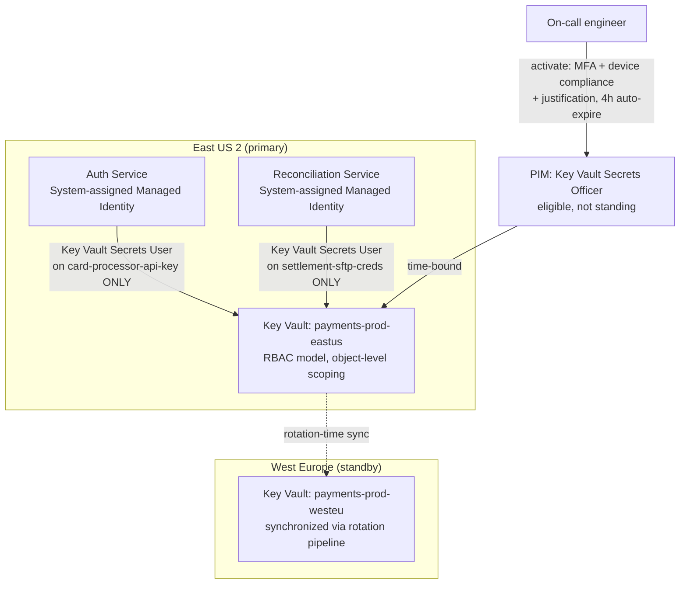
```mermaid
graph TB
 subgraph "East US 2 (primary)"
  Auth[Auth Service<br/>System-assigned Managed Identity]
  KV1[Key Vault: payments-prod-eastus<br/>RBAC model, object-level scoping]
  Recon[Reconciliation Service<br/>System-assigned Managed Identity]
  Auth -->|Key Vault Secrets User<br/>on card-processor-api-key ONLY| KV1
  Recon -->|Key Vault Secrets User<br/>on settlement-sftp-creds ONLY| KV1
 end
 subgraph "West Europe (standby)"
  KV2[Key Vault: payments-prod-westeu<br/>synchronized via rotation pipeline]
 end
 PIM[PIM: Key Vault Secrets Officer<br/>eligible, not standing]
 OnCall[On-call engineer] -->|activate: MFA + device compliance<br/>+ justification, 4h auto-expire| PIM
 PIM -->|time-bound| KV1
 KV1 -.->|rotation-time sync| KV2
```

**13. Low-Level Design**

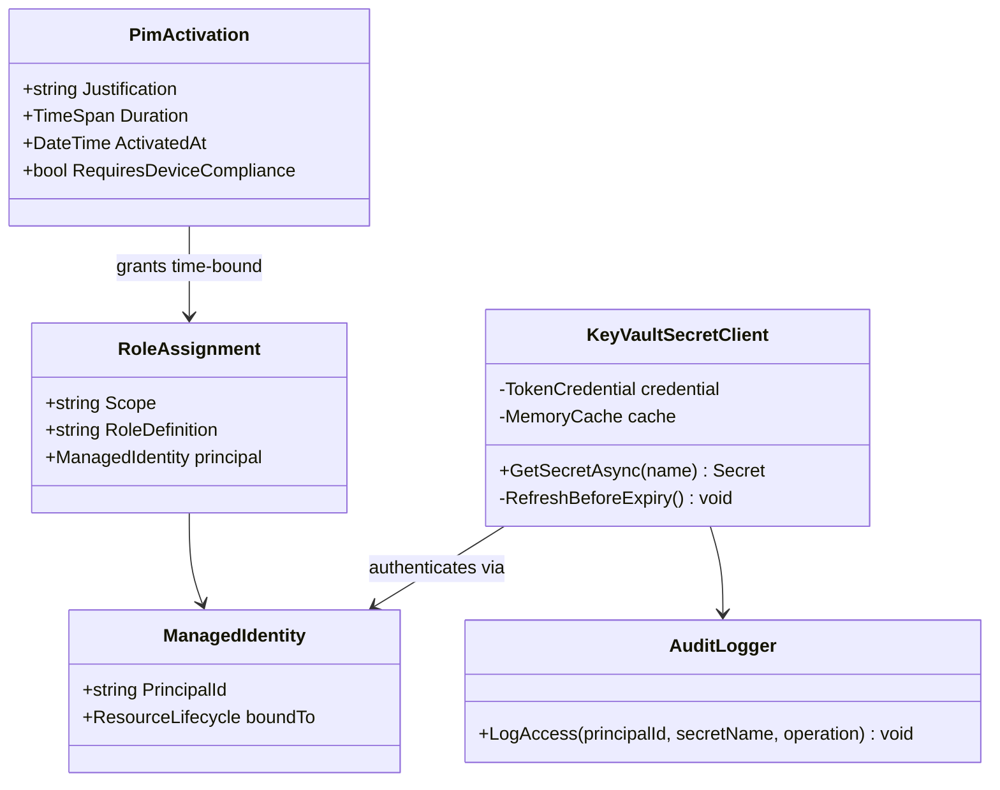
```mermaid
classDiagram
 class ManagedIdentity {
  +string PrincipalId
  +ResourceLifecycle boundTo
 }
 class RoleAssignment {
  +string Scope
  +string RoleDefinition
  +ManagedIdentity principal
 }
 class KeyVaultSecretClient {
  -TokenCredential credential
  -MemoryCache cache
  +GetSecretAsync(name) Secret
  -RefreshBeforeExpiry() void
 }
 class PimActivation {
  +string Justification
  +TimeSpan Duration
  +DateTime ActivatedAt
  +bool RequiresDeviceCompliance
 }
 class AuditLogger {
  +LogAccess(principalId, secretName, operation) void
 }
 KeyVaultSecretClient --> ManagedIdentity : authenticates via
 RoleAssignment --> ManagedIdentity
 PimActivation --> RoleAssignment : grants time-bound
 KeyVaultSecretClient --> AuditLogger
```

**13. Low-Level Design**

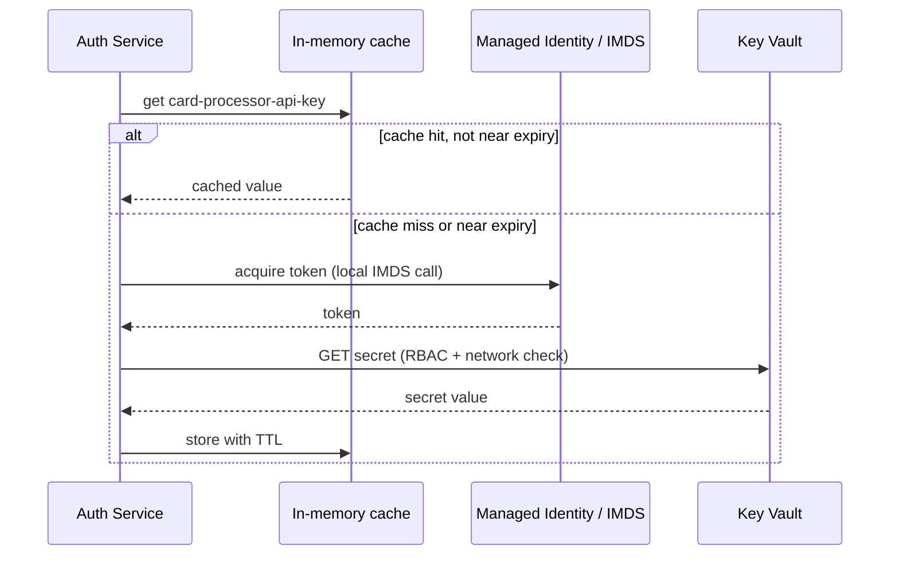
```mermaid
sequenceDiagram
 participant Svc as Auth Service
 participant Cache as In-memory cache
 participant MI as Managed Identity / IMDS
 participant KV as Key Vault

 Svc->>Cache: get card-processor-api-key
 alt cache hit, not near expiry
  Cache-->>Svc: cached value
 else cache miss or near expiry
  Svc->>MI: acquire token (local IMDS call)
  MI-->>Svc: token
  Svc->>KV: GET secret (RBAC + network check)
  KV-->>Svc: secret value
  Svc->>Cache: store with TTL
 end
```

### Module 67 — Azure: Storage — Blob Storage, Managed Disks, Azure Files & Redundancy Tiers (LRS/ZRS/GRS)
*Source: `03-Storage-Blob-ManagedDisks-Files-Redundancy.md`*

**Redundancy Tier Spectrum — the Explicit Choice Axis With No AWS Equivalent**

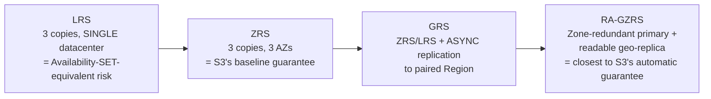
```mermaid
graph LR
 LRS["LRS<br/>3 copies, SINGLE datacenter<br/>= Availability-SET-equivalent risk"] --> ZRS["ZRS<br/>3 copies, 3 AZs<br/>= S3's baseline guarantee"]
 ZRS --> GRS["GRS<br/>ZRS/LRS + ASYNC replication<br/>to paired Region"]
 GRS --> RAGZRS["RA-GZRS<br/>Zone-redundant primary +<br/>readable geo-replica<br/>= closest to S3's automatic guarantee"]
```

**Managed Disk Zone-Redundant Storage — Stronger Than Standard AWS EBS**

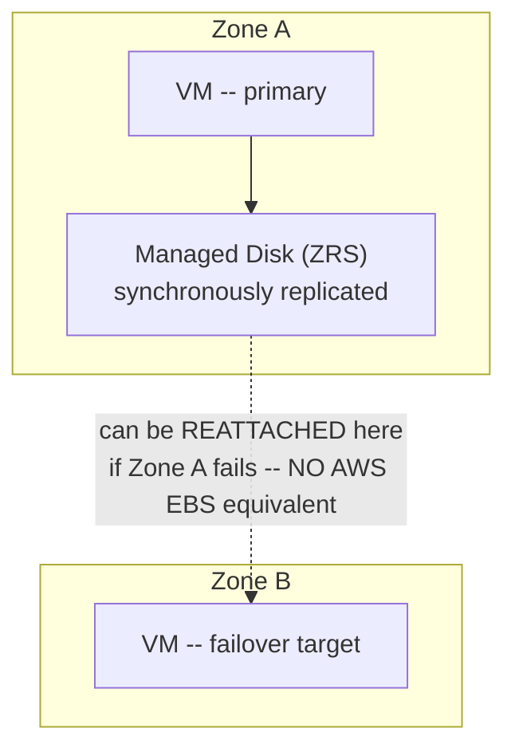
```mermaid
graph TB
 subgraph "Zone A"
 VM1[VM -- primary] --> Disk["Managed Disk (ZRS)<br/>synchronously replicated"]
 end
 subgraph "Zone B"
 Disk -.->|"can be REATTACHED here<br/>if Zone A fails -- NO AWS EBS equivalent"| VM2["VM -- failover target"]
 end
```

**13. Low-Level Design**

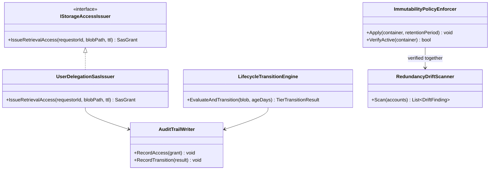
```mermaid
classDiagram
    class IStorageAccessIssuer {
        <<interface>>
        +IssueRetrievalAccess(requestorId, blobPath, ttl) SasGrant
    }
    class UserDelegationSasIssuer {
        +IssueRetrievalAccess(requestorId, blobPath, ttl) SasGrant
    }
    class ImmutabilityPolicyEnforcer {
        +Apply(container, retentionPeriod) void
        +VerifyActive(container) bool
    }
    class LifecycleTransitionEngine {
        +EvaluateAndTransition(blob, ageDays) TierTransitionResult
    }
    class RedundancyDriftScanner {
        +Scan(accounts) List~DriftFinding~
    }
    class AuditTrailWriter {
        +RecordAccess(grant) void
        +RecordTransition(result) void
    }

    IStorageAccessIssuer <|.. UserDelegationSasIssuer
    UserDelegationSasIssuer --> AuditTrailWriter
    LifecycleTransitionEngine --> AuditTrailWriter
    ImmutabilityPolicyEnforcer --> RedundancyDriftScanner : verified together
```

### Module 68 — Azure: Databases — Azure SQL Database, Managed Instance & Cosmos DB Integration
*Source: `04-Databases-AzureSQL-CosmosDB.md`*

**Cosmos DB's Five Consistency Levels — a Spectrum, Not a Binary**

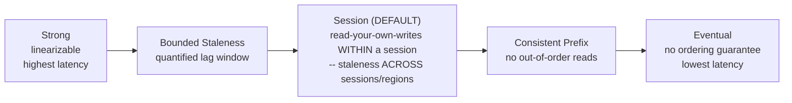
```mermaid
graph LR
 Strong["Strong<br/>linearizable<br/>highest latency"] --> BS["Bounded Staleness<br/>quantified lag window"]
 BS --> Session["Session (DEFAULT)<br/>read-your-own-writes WITHIN a session<br/>-- staleness ACROSS sessions/regions"]
 Session --> CP["Consistent Prefix<br/>no out-of-order reads"]
 CP --> Eventual["Eventual<br/>no ordering guarantee<br/>lowest latency"]
```

**Azure SQL Database Business Critical — Readable Synchronous Secondaries**

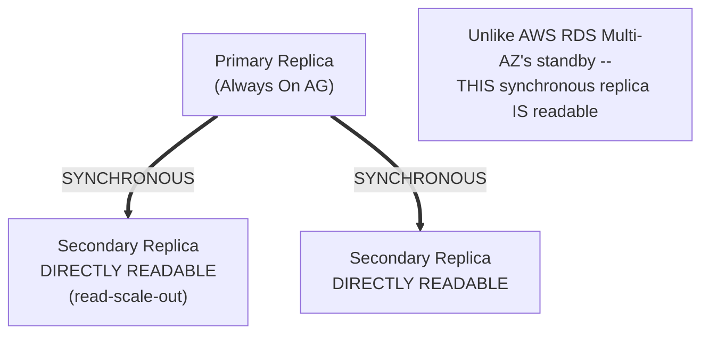
```mermaid
graph TB
 Primary["Primary Replica<br/>(Always On AG)"] ==>|"SYNCHRONOUS"| Sec1["Secondary Replica<br/>DIRECTLY READABLE<br/>(read-scale-out)"]
 Primary ==>|"SYNCHRONOUS"| Sec2["Secondary Replica<br/>DIRECTLY READABLE"]
 Note["Unlike AWS RDS Multi-AZ's standby --<br/>THIS synchronous replica IS readable"]
```

**13. Low-Level Design**

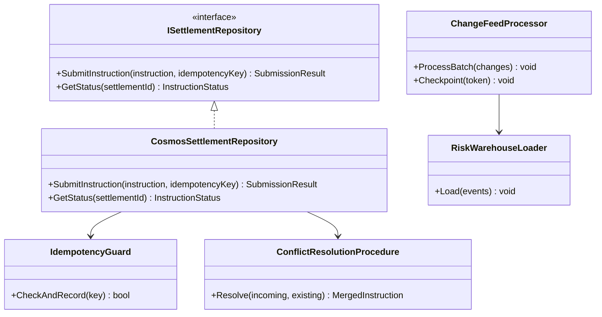
```mermaid
classDiagram
    class ISettlementRepository {
        <<interface>>
        +SubmitInstruction(instruction, idempotencyKey) SubmissionResult
        +GetStatus(settlementId) InstructionStatus
    }
    class CosmosSettlementRepository {
        +SubmitInstruction(instruction, idempotencyKey) SubmissionResult
        +GetStatus(settlementId) InstructionStatus
    }
    class IdempotencyGuard {
        +CheckAndRecord(key) bool
    }
    class ConflictResolutionProcedure {
        +Resolve(incoming, existing) MergedInstruction
    }
    class ChangeFeedProcessor {
        +ProcessBatch(changes) void
        +Checkpoint(token) void
    }
    class RiskWarehouseLoader {
        +Load(events) void
    }

    ISettlementRepository <|.. CosmosSettlementRepository
    CosmosSettlementRepository --> IdempotencyGuard
    CosmosSettlementRepository --> ConflictResolutionProcedure
    ChangeFeedProcessor --> RiskWarehouseLoader
```

### Module 69 — Azure: Serverless — Azure Functions, Durable Functions, API Management & Logic Apps
*Source: `05-Serverless-Functions-APIManagement-LogicApps.md`*

**Durable Functions Replay Model — Orchestrator Code Re-Executes, Activity Results Are Replayed**

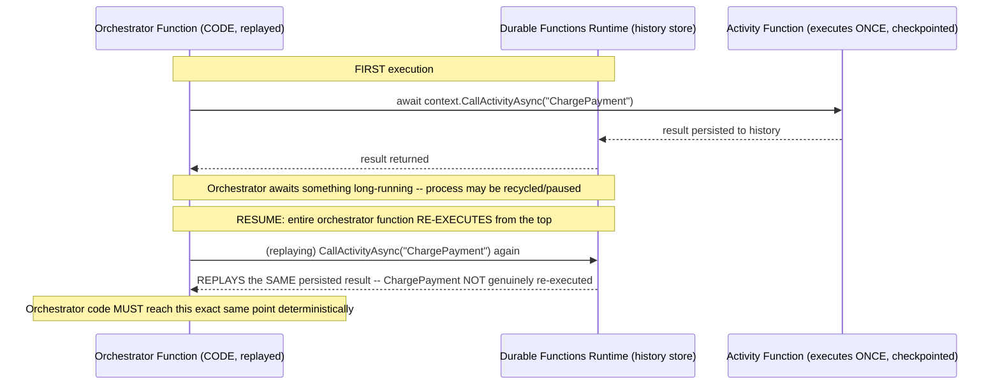
```mermaid
sequenceDiagram
 participant Orch as Orchestrator Function (CODE, replayed)
 participant DF as Durable Functions Runtime (history store)
 participant Act as Activity Function (executes ONCE, checkpointed)

 Note over Orch,DF: FIRST execution
 Orch->>Act: await context.CallActivityAsync("ChargePayment")
 Act-->>DF: result persisted to history
 DF-->>Orch: result returned

 Note over Orch,DF: Orchestrator awaits something long-running -- process may be recycled/paused
 Note over Orch,DF: RESUME: entire orchestrator function RE-EXECUTES from the top
 Orch->>DF: (replaying) CallActivityAsync("ChargePayment") again
 DF-->>Orch: REPLAYS the SAME persisted result -- ChargePayment NOT genuinely re-executed
 Note over Orch: Orchestrator code MUST reach this exact same point deterministically
```

**Hosting Plan Decision Tree**

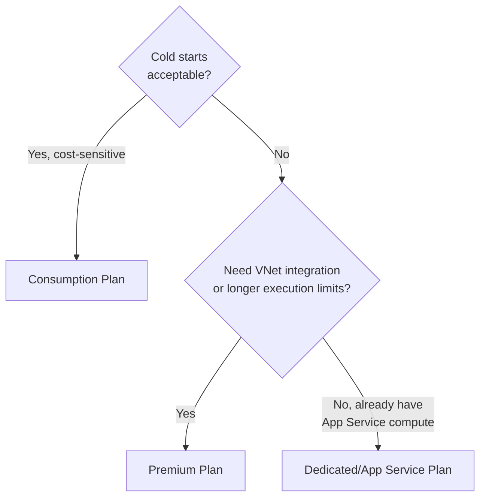
```mermaid
graph TD
 Start{Cold starts<br/>acceptable?}
 Start -->|Yes, cost-sensitive| Consumption[Consumption Plan]
 Start -->|No| VNetNeed{Need VNet integration<br/>or longer execution limits?}
 VNetNeed -->|Yes| Premium[Premium Plan]
 VNetNeed -->|No, already have<br/>App Service compute| Dedicated[Dedicated/App Service Plan]
```

**13. Low-Level Design**

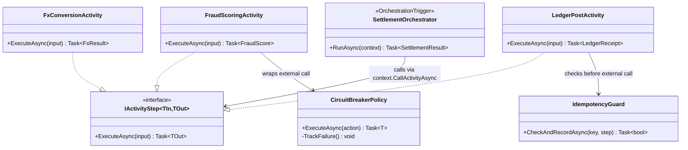
```mermaid
classDiagram
    class SettlementOrchestrator {
        <<OrchestrationTrigger>>
        +RunAsync(context) Task~SettlementResult~
    }
    class IActivityStep~TIn,TOut~ {
        <<interface>>
        +ExecuteAsync(input) Task~TOut~
    }
    class FraudScoringActivity {
        +ExecuteAsync(input) Task~FraudScore~
    }
    class FxConversionActivity {
        +ExecuteAsync(input) Task~FxResult~
    }
    class LedgerPostActivity {
        +ExecuteAsync(input) Task~LedgerReceipt~
    }
    class IdempotencyGuard {
        +CheckAndRecordAsync(key, step) Task~bool~
    }
    class CircuitBreakerPolicy {
        +ExecuteAsync(action) Task~T~
        -TrackFailure() void
    }

    FraudScoringActivity ..|> IActivityStep~TIn,TOut~
    FxConversionActivity ..|> IActivityStep~TIn,TOut~
    LedgerPostActivity ..|> IActivityStep~TIn,TOut~
    SettlementOrchestrator --> IActivityStep~TIn,TOut~ : calls via context.CallActivityAsync
    LedgerPostActivity --> IdempotencyGuard : checks before external call
    FraudScoringActivity --> CircuitBreakerPolicy : wraps external call
```

**13. Low-Level Design**

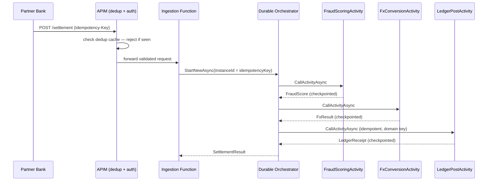
```mermaid
sequenceDiagram
    participant Client as Partner Bank
    participant APIM as APIM (dedup + auth)
    participant Ingest as Ingestion Function
    participant Orch as Durable Orchestrator
    participant Fraud as FraudScoringActivity
    participant Fx as FxConversionActivity
    participant Ledger as LedgerPostActivity

    Client->>APIM: POST /settlement (Idempotency-Key)
    APIM->>APIM: check dedup cache — reject if seen
    APIM->>Ingest: forward validated request
    Ingest->>Orch: StartNewAsync(instanceId = idempotencyKey)
    Orch->>Fraud: CallActivityAsync
    Fraud-->>Orch: FraudScore (checkpointed)
    Orch->>Fx: CallActivityAsync
    Fx-->>Orch: FxResult (checkpointed)
    Orch->>Ledger: CallActivityAsync (idempotent, domain key)
    Ledger-->>Orch: LedgerReceipt (checkpointed)
    Orch-->>Ingest: SettlementResult
```

### Module 70 — Azure: Messaging & Event-Driven Architecture — Service Bus, Event Grid & Event Hubs
*Source: `06-Messaging-ServiceBus-EventGrid-EventHubs.md`*

**Service Bus Topic + Filtered Subscriptions — One Service Replacing AWS's SNS+SQS Pair**

```mermaid
graph TB
 Producer[Order Service] -->|publish OrderPlaced| Topic[Service Bus Topic: order-events]
 Topic --> Sub1["Subscription: high-value-orders<br/>FILTER: orderTotal > 1000"]
 Topic --> Sub2["Subscription: all-orders-inventory<br/>NO filter"]
 Sub1 --> FraudReview[Fraud Review Service]
 Sub2 --> Inventory[Inventory Service]
 Note["ONE service provides durable, per-subscription<br/>buffering AND content filtering -- no separate<br/>queue-per-consumer wiring required"]
```

**Event Grid Push-Then-Loss vs. SQS Pull-Then-Wait**

```mermaid
graph TB
 subgraph "Event Grid: PUSH"
 EG[Event Grid] -->|"push attempt 1...N<br/>(bounded retries, exp backoff)"| Sub["Subscriber Endpoint<br/>(DOWN for 25+ hours)"]
 EG -->|"retries EXHAUSTED,<br/>no Dead Letter configured"| Lost["EVENT PERMANENTLY LOST"]
 end
 subgraph "SQS: PULL"
 Queue["SQS Queue<br/>(message just WAITS)"] -.->|"consumer polls WHENEVER ready"| Consumer["Consumer<br/>(recovers after 25+ hours)"]
 Consumer -->|"eventually processes --<br/>bounded only by retention period"| Done[Processed successfully]
 end
```

**13. Low-Level Design**

```mermaid
classDiagram
    class OrderExecutionPublisher {
        +PublishAsync(event) Task
    }
    class IEventSink {
        <<interface>>
        +DeliverAsync(event) Task
    }
    class EventGridRealtimeSink {
        +DeliverAsync(event) Task
    }
    class ServiceBusSettlementSink {
        +DeliverAsync(event) Task
    }
    class EventHubsAnalyticsSink {
        -PartitionKeyStrategy strategy
        +DeliverAsync(event) Task
    }
    class IdempotentConsumer {
        +ProcessAsync(message) Task
        -CheckAndRecordAsync(domainKey) Task~bool~
    }
    class DeadLetterMonitor {
        +OnDepthChanged(depth) void
    }

    OrderExecutionPublisher --> IEventSink : fans out to all
    EventGridRealtimeSink ..|> IEventSink
    ServiceBusSettlementSink ..|> IEventSink
    EventHubsAnalyticsSink ..|> IEventSink
    ServiceBusSettlementSink --> IdempotentConsumer : downstream
    EventGridRealtimeSink --> DeadLetterMonitor
    ServiceBusSettlementSink --> DeadLetterMonitor
```

**13. Low-Level Design**

```mermaid
sequenceDiagram
    participant Exec as Order Execution Service
    participant EG as Event Grid Topic
    participant RT as Realtime Notification (webhook)
    participant SB as Service Bus (settlement queue)
    participant Settle as Settlement Processor
    participant EH as Event Hubs (analytics)

    Exec->>EG: publish OrderExecuted
    EG->>RT: push (bounded retry)
    EG->>SB: route to settlement queue
    SB-->>Settle: pull, at own pace
    Settle->>Settle: CheckAndRecordAsync(domainKey) — idempotent write
    Exec->>EH: publish OrderExecuted (composite partition key)
    Note over EH: multiple consumer groups read independently
```

### Module 71 — Azure: Containers & Microservices — AKS, Container Apps, KEDA & Dapr
*Source: `07-Containers-Microservices-AKS-ContainerApps-Dapr.md`*

**The Three-Tier Azure Container Decision Framework**

```mermaid
graph TD
 Start{Need direct K8s API access,<br/>custom operators/CRDs, or<br/>org-wide K8s standardization?}
 Start -->|Yes| AKS[AKS]
 Start -->|No| ScaleNeed{Need orchestration/scaling<br/>at all, or just a single<br/>short-lived container run?}
 ScaleNeed -->|Single run, no scaling| ACI[Azure Container Instances]
 ScaleNeed -->|Yes, event-driven scaling| ContainerApps["Container Apps -- DEFAULT<br/>(KEDA scaling, scale-to-zero,<br/>Dapr integration, NO K8s ops burden)"]
```

**Dapr's Broader Scope vs. App Mesh's Network-Only Scope**

```mermaid
graph TB
 subgraph "App Mesh -- NETWORK LAYER ONLY, transparent"
 AppMeshScope["Retries, mTLS, circuit-breaking<br/>ZERO application code changes"]
 end
 subgraph "Dapr -- APPLICATION-LEVEL building blocks, explicit API calls"
 DaprState["State Management API<br/>(Cosmos DB / Redis / Postgres...)"]
 DaprPubSub["Pub/Sub API<br/>(Service Bus / Event Grid / Kafka...)"]
 DaprInvoke["Service Invocation API<br/>(retries + mTLS, like App Mesh, but EXPLICITLY called)"]
 DaprSecrets["Secrets API<br/>(Key Vault / other backends)"]
 end
```

**13. Low-Level Design**

```mermaid
classDiagram
 class IPaymentStep {
 <<interface>>
 +ExecuteAsync(context) StepResult
 +CompensateAsync(context) void
 }
 class OrderIntakeStep {
 +ExecuteAsync(context) StepResult
 }
 class RiskCheckStep {
 +ExecuteAsync(context) StepResult
 +CompensateAsync(context) void
 }
 class FundingStep {
 +ExecuteAsync(context) StepResult
 +CompensateAsync(context) void
 }
 class LedgerStep {
 +ExecuteAsync(context) StepResult
 }
 class SagaOrchestrator {
 -List~IPaymentStep~ steps
 +RunAsync(authorizationRequest) SagaResult
 }
 class DaprClient {
 +InvokeMethodAsync(appId, method, data) T
 +SaveStateAsync(store, key, value) void
 }

 SagaOrchestrator --> IPaymentStep
 OrderIntakeStep ..|> IPaymentStep
 RiskCheckStep ..|> IPaymentStep
 FundingStep ..|> IPaymentStep
 LedgerStep ..|> IPaymentStep
 SagaOrchestrator --> DaprClient
```

**13. Low-Level Design**

```mermaid
sequenceDiagram
 participant Client
 participant Orchestrator as order-intake (Orchestrator)
 participant Risk as risk-check
 participant Funding as funding
 participant Ledger as ledger
 participant Notify as notification (async)

 Client->>Orchestrator: POST /authorize (Idempotency-Key: xyz)
 Orchestrator->>Risk: InvokeMethodAsync("risk-check", "score")
 Risk-->>Orchestrator: risk score: LOW
 Orchestrator->>Funding: InvokeMethodAsync("funding", "charge")
 Funding-->>Orchestrator: charge: SUCCESS
 Orchestrator->>Ledger: InvokeMethodAsync("ledger", "post")
 Ledger-->>Orchestrator: posted: SUCCESS
 Orchestrator-->>Client: 200 APPROVED
 Orchestrator--)Notify: PublishEventAsync("payment-approved") — off critical path
```

### Module 72 — Azure: Observability, Cost & the Well-Architected Framework — Azure Monitor, Application Insights & Multi-Region DR
*Source: `08-Observability-Cost-WellArchitectedFramework.md`*

**Application Insights: Unified Metrics/Logs/Traces via One KQL Query**

```mermaid
gantt
 dateFormat X
 axisFormat %Lms
 section API Management
 Request routing:0, 15
 section Function: checkout
 Cold start (if any):15, 160
 Handler logic:160, 230
 section Function: charge-payment
 Invocation:230, 400
 section Azure SQL
 Query: debit balance:250, 290
 section Cosmos DB
 Write: audit log:400, 430
```

**Paired Regions: Platform-Level Maintenance Isolation & Recovery Priority**

```mermaid
graph LR
 subgraph "Geography: United States"
 EastUS["East US<br/>(primary)"] <-->|"paired -- sequential maintenance,<br/>data-residency-aligned,<br/>prioritized recovery order"| WestUS["West US<br/>(paired secondary)"]
 end
 EastUS -.->|"NO platform pairing --<br/>fully independent"| OtherRegion["Any non-paired region<br/>(self-designed DR only)"]
```

**13. Low-Level Design**

```mermaid
classDiagram
 class ICostAnomalyDetector {
 <<interface>>
 +DetectAsync(subscriptionId) AnomalyResult
 }
 class BaselinedAnomalyDetector {
 -Dictionary~string,CostBaseline~ baselines
 +DetectAsync(subscriptionId) AnomalyResult
 }
 class DiagnosticCoverageCanary {
 +CheckCoverageAsync() List~CoverageGap~
 }
 class CostAllocationEngine {
 -AllocationMethodology methodology
 +Allocate(rawCostData) Dictionary~string,decimal~
 }
 class AnomalyAlertRouter {
 +Route(result) void
 }

 BaselinedAnomalyDetector..|> ICostAnomalyDetector
 AnomalyAlertRouter --> ICostAnomalyDetector
 CostAllocationEngine --> AllocationMethodology
```

**13. Low-Level Design**

```mermaid
sequenceDiagram
 participant CM as Cost Management (40 subscriptions)
 participant Detector as BaselinedAnomalyDetector
 participant Router as AnomalyAlertRouter
 participant FinOps
 participant Security

 CM->>Detector: DetectAsync(subscriptionId) — nightly
 Detector->>Detector: compare against THIS subscription's own baseline
 alt Anomaly exceeds baseline threshold
 Detector-->>Router: AnomalyResult(severity, resourceIds)
 Router->>FinOps: notify (always)
 Router->>Security: notify (if resource category plausibly security-relevant)
 else Within baseline
 Detector-->>Router: no action
 end
```
