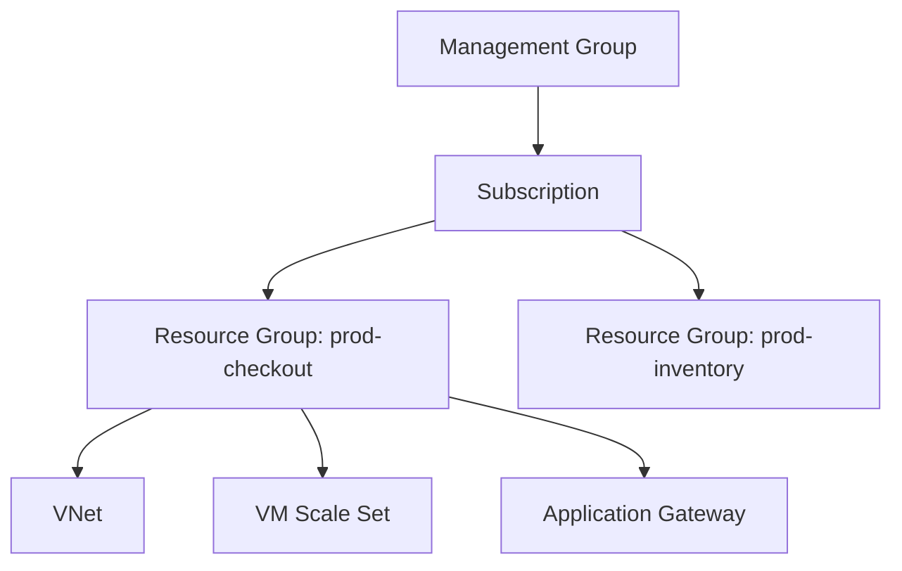
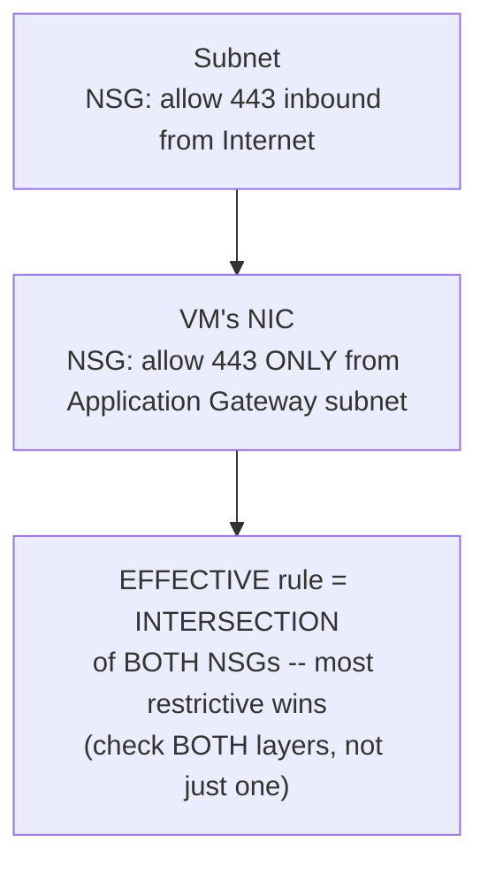

# Module 65 — Azure: Compute & Networking Fundamentals — VMs, VNet, Load Balancer/App Gateway & VM Scale Sets

> Domain: Azure | Level: Beginner → Expert | Prerequisite: [[../21-AWS/01-Compute-Networking-VPC-LoadBalancing-AutoScaling]] (this module deliberately mirrors that module's structure, using AWS as the reference model and calling out every point of genuine divergence rather than re-deriving cloud-networking fundamentals from scratch), [[../14-System-Design/01-System-Design-Fundamentals]] §2

---

## 1. Fundamentals

### Why does a Principal Engineer need Azure networking/compute depth given this course already covered the identical concepts on AWS?
The underlying distributed-systems and resilience principles (multi-zone redundancy, health-check-driven load balancing, elastic scaling) are cloud-agnostic and already fully established in Module 57 — what a Principal Engineer specifically needs from this module is the **precise mapping** between AWS's and Azure's concrete service names and the **specific points where Azure's actual behavior genuinely diverges** from the AWS model, since a Principal Engineer operating across both clouds (or migrating between them, or architecting a multi-cloud system) who assumes naive one-to-one equivalence will misconfigure the platform-specific details that don't actually match.

### Why does this matter?
Because Azure and AWS, despite solving the same underlying problems, differ in specific, consequential ways (Azure's resource-group/subscription hierarchy has no direct AWS analog; Azure VNets support a materially different subnet-delegation and NSG-association model than AWS Security Groups; Azure Availability Zones and Availability Sets are two distinct, non-interchangeable resilience mechanisms with no single AWS equivalent) — a Principal Engineer's credibility in an Azure-specific interview or architecture review depends on correctly using Azure's own vocabulary and specific mechanisms, not describing AWS concepts with Azure service names substituted in.

### When does this matter?
Any system deployed on Azure, and specifically any Principal Engineer working across a genuinely multi-cloud or Azure-primary organization (directly relevant given this course's stated baseline already includes professional AWS and Azure experience) — this module's comparative approach is designed to build precise, transferable judgment rather than requiring the AWS material to be unlearned and Azure material learned independently from scratch.

### How does it work (30,000-ft view)?
```
Resource Group: a logical container for related Azure resources -- NO DIRECT AWS EQUIVALENT
     (closest analog: tagging + IAM scoping combined, but Resource Groups are a first-class,
     structural organizing unit in Azure, not an optional convention)
VNet: Azure's VPC equivalent -- isolated virtual network, divided into Subnets
NSG (Network Security Group): Azure's Security Group equivalent -- BUT associates with BOTH
     subnets AND individual NICs (a genuine divergence from AWS's instance-only association)
VM: Azure's EC2 equivalent
Load Balancer (Layer 4) / Application Gateway (Layer 7): Azure's NLB/ALB equivalents --
     Application Gateway ALSO bundles a Web Application Firewall (WAF), unlike AWS's ALB
VMSS (Virtual Machine Scale Set): Azure's Auto Scaling Group equivalent
Availability Zones vs. Availability Sets: TWO DISTINCT resilience mechanisms -- AWS has only
     the single AZ concept; Azure additionally has Availability Sets for a WEAKER, same-datacenter
     fault-domain/update-domain guarantee
```

---

## 2. Deep Dive

### 2.1 Resource Groups and Subscriptions — a Structural Organizing Concept AWS Has No Direct Equivalent For
Every Azure resource must belong to exactly one **Resource Group** (a logical container, typically grouping resources that share a lifecycle — deployed, managed, and deleted together), and every Resource Group belongs to a **Subscription** (a billing and access-management boundary, roughly analogous to an AWS Account, though Azure additionally nests Subscriptions under **Management Groups** for organization-wide policy inheritance) — this is a genuine structural divergence from AWS, where "which resources belong together" is typically expressed via tagging conventions and IAM scoping rather than a first-class containment hierarchy: a Principal Engineer designing an Azure resource-organization strategy should treat Resource Group boundaries as a deliberate architectural decision (typically aligned with a specific application or environment's lifecycle) rather than an afterthought, since deleting a Resource Group deletes every resource within it — a powerful convenience for environment teardown, and a genuine risk if resource-group boundaries are drawn carelessly.

### 2.2 VNets, Subnets, and NSGs — Azure's Genuinely Different Security-Group Association Model
Azure VNets and Subnets map closely to Module 57 §2.1's VPC/subnet model (public/private subnet segmentation, an internet-facing NAT Gateway-equivalent for private-subnet outbound access) — but Azure's **Network Security Group (NSG)**, the Security-Group equivalent, has a genuinely different association model than AWS: an NSG can be associated with **either a subnet or an individual network interface (NIC)** — or both simultaneously, with **both** layers' rules applied — whereas AWS Security Groups associate only with the instance's network interface, never the subnet itself (subnet-level traffic control in AWS is a distinct mechanism, Network ACLs, which are stateless, unlike NSGs' stateful behavior). This means an Azure network-security review must explicitly check **both** the subnet-level and NIC-level NSG (if both exist) to understand a VM's actual effective access rules — a common, Azure-specific misconfiguration is assuming a permissive NIC-level NSG is the complete picture when a more restrictive subnet-level NSG is also silently in effect (or vice versa), a genuinely different reasoning process than AWS's single-layer Security Group model.

### 2.3 Availability Zones vs. Availability Sets — Two Distinct, Non-Interchangeable Resilience Mechanisms
This is the single most consequential Azure-specific divergence from the AWS model in this section: Azure **Availability Zones** are physically separate datacenters within a Region (directly analogous to AWS AZs, Module 57 §2.2) — but Azure additionally offers **Availability Sets**, a *weaker*, single-datacenter mechanism that spreads VMs across distinct **fault domains** (separate physical racks/power/network within the same datacenter) and **update domains** (groups of VMs Azure won't patch/reboot simultaneously), protecting against rack-level hardware failure and simultaneous-maintenance-induced downtime, but providing **no protection against a full datacenter/Availability-Zone-level failure** — a Principal Engineer must explicitly distinguish these: a workload using only an Availability Set (no Availability Zone spread) has a materially weaker resilience posture than Module 57's multi-AZ discipline would suggest is adequate, and this specific two-tier distinction (Zone vs. Set) has no single AWS equivalent to map onto, making it a genuine, not merely terminological, point of required new understanding.

### 2.4 Load Balancer vs. Application Gateway — Azure's Split, and Application Gateway's WAF Bundling
Azure Load Balancer (Layer 4, TCP/UDP) and Application Gateway (Layer 7, HTTP/HTTPS with path-based routing, cookie-based session affinity, and SSL termination) map respectively to AWS's NLB and ALB (Module 57 §2.4) — but Application Gateway additionally, natively bundles a **Web Application Firewall (WAF)** as an integrated capability (protecting against common web exploits — SQL injection, XSS — via managed rule sets), whereas AWS's equivalent (AWS WAF) is a separate service explicitly attached to an ALB or CloudFront distribution rather than a built-in Application Gateway capability — this is a genuine Azure-specific convenience (fewer separate resources to provision and wire together for a common web-security requirement) worth explicitly knowing about rather than assuming Application Gateway is a pure ALB-equivalent requiring a separately-bolted-on WAF the way AWS does.

### 2.5 VM Scale Sets — Azure's Auto Scaling Group Equivalent, With Explicit Zone-Spanning Configuration
VM Scale Sets (VMSS) directly implement Module 57 §2.5's Auto Scaling Group model — automatically launching/terminating VM instances based on a scaling policy's trigger conditions — but critically, VMSS's zone-spanning behavior must be **explicitly configured** (specifying which Availability Zones the scale set should span) rather than being an implicit, automatic property of using the service at all, meaning the exact same single-zone-risk failure mode Module 57 §4's incident described can occur in Azure specifically if a VMSS is provisioned without explicit zone configuration — a Principal Engineer reviewing an Azure architecture should treat "is this VMSS explicitly zone-spanning?" with the same scrutiny Module 57 established for "is this ASG multi-AZ?"

### 2.6 The Well-Architected Framework's Azure Equivalent, and Why This Module's Comparative Structure Continues Throughout the Domain
Microsoft publishes its own, structurally similar **Azure Well-Architected Framework** (five pillars: Reliability, Security, Cost Optimization, Operational Excellence, Performance Efficiency — a near-direct match to AWS's six, minus the separately-broken-out Sustainability pillar, which Azure folds into its general guidance rather than a standalone pillar) — this course's Module 64 capstone discipline (a recurring, structured review applying accumulated domain knowledge systematically) applies identically here, and this Azure domain's own capstone module (72) will apply it to the Azure-specific service set the same way Module 64 did for AWS, reinforcing that the *review methodology* itself, not just the underlying resilience/security knowledge, is a genuinely portable, cloud-agnostic Principal-Engineer skill.

---

## 3. Visual Architecture

### Azure Resource Hierarchy — No Direct AWS Equivalent (§2.1)


### NSG Dual Association — Subnet AND NIC Level (§2.2)


## 4. Production Example
**Scenario**: A team migrating a customer-facing API from AWS to Azure (as part of a broader multi-cloud strategy) replicated their existing AWS architecture — a multi-AZ ASG behind an ALB — by provisioning a VM Scale Set behind an Application Gateway, and, because the team's runbook described "distribute VMs for resilience" without specifying the exact Azure mechanism, an engineer configured an **Availability Set** (reasoning, based on AWS familiarity, that "distributing across the datacenter" was equivalent to AWS's multi-AZ spread) rather than explicitly configuring the VMSS to span **Availability Zones**. **Investigation**: during a genuine, if rare, Azure datacenter-level incident affecting a single Availability Zone in that Region, every VM in the Availability-Set-configured scale set went down simultaneously — because Availability Sets provide fault-domain/update-domain distribution *within a single datacenter*, not *across* datacenters/Availability Zones, the entire fleet resided within the affected zone's single physical facility, with zero VMs surviving in an unaffected zone. **Root cause**: the migrating team's mental model, built entirely on AWS's single-tier AZ-distribution concept, didn't have a place for Azure's two-tier Zone-vs-Set distinction (§2.3) — "distribute across the datacenter for resilience" sounded like it satisfied the same requirement AWS's multi-AZ ASG satisfies, but Availability Sets are a structurally weaker, same-datacenter-scoped mechanism, and the engineer had no specific reason (without Azure-specific training) to know these were two distinct concepts requiring two distinct configuration decisions. **Fix**: reconfigured the VM Scale Set with explicit `zones = ["1", "2", "3"]` configuration (spanning genuine Availability Zones, matching the actual resilience posture the original AWS multi-AZ ASG provided), and updated the team's internal migration runbook to explicitly flag every AWS-to-Azure concept mapping with a documented divergence note wherever the mapping isn't a clean one-to-one equivalence (directly this module's own approach, now applied as an internal team practice) — Availability Sets retained as a *secondary*, within-zone consideration (for very latency-sensitive same-zone clustering scenarios) rather than mistakenly treated as the primary resilience mechanism. **Lesson**: cross-cloud migration risk isn't primarily about unfamiliar new concepts — it's specifically about concepts that sound familiar and analogous but have a subtly different actual guarantee, which is more dangerous precisely because it doesn't trigger the "I should look this up carefully" instinct that a genuinely unfamiliar concept would.

## 5. Best Practices
- Explicitly configure VM Scale Sets to span genuine Availability Zones for any workload requiring datacenter-level resilience — never assume Availability Sets alone provide equivalent protection to AWS's multi-AZ model (§2.3, §4).
- Review both subnet-level and NIC-level NSGs together when auditing a VM's actual effective network access — never assume a single layer is the complete picture (§2.2).
- Treat Resource Group boundaries as a deliberate architectural decision aligned with a specific application/environment lifecycle, given that deleting a Resource Group deletes everything within it (§2.1).
- Maintain an explicit, documented AWS-to-Azure concept-mapping reference for any team working across both clouds, specifically flagging divergences (Availability Zones vs. Sets; NSG's dual association model; Application Gateway's bundled WAF) rather than assuming naive equivalence (§4).
- Leverage Application Gateway's native WAF bundling for web-facing services rather than assuming a separate WAF resource must always be provisioned and wired in, as AWS's model would suggest.

## 6. Anti-patterns
- Configuring an Availability Set when Availability Zone spanning is what the workload's actual resilience requirement demands, based on an AWS-derived assumption that "distributing within the datacenter" is equivalent to multi-AZ distribution (§4).
- Reviewing only one layer (subnet or NIC) of NSG rules during a security audit, missing a more-restrictive-or-more-permissive rule silently in effect at the other layer.
- Treating Resource Groups as an arbitrary, unplanned organizational convenience rather than a deliberate lifecycle-aligned boundary, risking accidental mass-deletion of unrelated resources.
- Assuming every AWS service has a clean one-to-one Azure equivalent and porting architecture diagrams by simple find-and-replace of service names, without validating each mapping's actual behavioral fidelity.
- Provisioning a VM Scale Set without any explicit zone configuration at all, silently defaulting to single-zone behavior with no resilience beyond fault/update-domain spreading.

---

## 10. Interview Questions

### Basic (10)
1. **Q: What is a Resource Group, and what AWS concept is it most similar to?** **A:** A logical container for related Azure resources sharing a lifecycle — it has no precise direct AWS equivalent, though it combines aspects of tagging and IAM scoping.
2. **Q: What is the Azure equivalent of an AWS VPC?** **A:** A VNet (Virtual Network).
3. **Q: What is the key structural difference between an Azure NSG and an AWS Security Group?** **A:** An NSG can associate with both a subnet and an individual NIC simultaneously; AWS Security Groups associate only with the instance's network interface.
4. **Q: What is the difference between Azure Availability Zones and Availability Sets?** **A:** Availability Zones are physically separate datacenters within a Region (protecting against datacenter-level failure); Availability Sets spread VMs across fault/update domains within a single datacenter only.
5. **Q: What is the Azure equivalent of an AWS ALB?** **A:** Application Gateway (Layer 7), which additionally bundles a Web Application Firewall natively.
6. **Q: What is the Azure equivalent of an AWS Auto Scaling Group?** **A:** VM Scale Sets (VMSS).
7. **Q: Must VMSS zone-spanning be explicitly configured, or is it automatic?** **A:** It must be explicitly configured — it is not an automatic, implicit property of using VMSS.
8. **Q: What does Azure Policy provide, and what AWS mechanism is it most analogous to?** **A:** Organization-wide, enforceable configuration constraints — analogous to AWS Service Control Policies.
9. **Q: How many pillars does the Azure Well-Architected Framework have, and how does this compare to AWS's?** **A:** Five (Reliability, Security, Cost Optimization, Operational Excellence, Performance Efficiency) versus AWS's six — Azure folds Sustainability into general guidance rather than a standalone pillar.
10. **Q: What roughly corresponds to an AWS Account in Azure's hierarchy?** **A:** A Subscription, which additionally nests under Management Groups for organization-wide policy inheritance.

### Intermediate (10)
1. **Q: Why is checking only the NIC-level NSG insufficient for a complete Azure network-security audit?** **A:** A subnet-level NSG can independently impose additional, more restrictive rules that apply regardless of what the NIC-level NSG allows — the effective access is the intersection of both layers, so reviewing only one risks missing a rule silently in effect at the other.
2. **Q: Why did the §4 incident's Availability-Set misconfiguration go undetected until an actual zone-level failure occurred?** **A:** Availability Sets do provide genuine, real resilience against fault-domain/update-domain-scoped failures (rack-level hardware issues, simultaneous patching), so the configuration "worked" and looked correct for any failure scope within that scope — the gap was invisible until a failure specifically at the datacenter/zone level (a scope Availability Sets don't protect against) actually occurred.
3. **Q: Why is Resource Group deletion described as "a powerful convenience and a genuine risk," rather than purely one or the other?** **A:** It provides a clean, single-operation way to tear down an entire environment's resources when boundaries are drawn deliberately along a genuine shared lifecycle, but the same mechanism becomes a risk if resources with independent lifecycles are carelessly placed in the same group, since deleting the group has no selective-exclusion mechanism.
4. **Q: Why does Application Gateway's native WAF bundling represent a genuine architectural difference from AWS, not just a naming difference?** **A:** In AWS, WAF is a separately-provisioned resource explicitly attached to an ALB or CloudFront; in Azure, WAF capability is an integrated, built-in option of Application Gateway itself — this changes the actual provisioning/architecture diagram (fewer distinct resources), not just terminology.
5. **Q: Why should an AWS-to-Azure migration runbook explicitly flag divergent concept mappings rather than simply listing equivalent service names?** **A:** A migrating engineer relying on a simple name-mapping (as in §4) has no signal to prompt closer scrutiny of concepts that sound equivalent but have subtly different actual guarantees (Availability Zones vs. Sets) — explicit divergence flags counteract exactly the false-familiarity risk that caused the incident.
6. **Q: Why is VNet peering's throughput characteristic a capacity-planning concern analogous to Module 57's NAT Gateway discussion?** **A:** Both are network paths with real, non-infinite throughput ceilings that a sufficiently high-volume workload can hit — assuming either is a limitless pass-through risks an unanticipated bottleneck at genuine scale.
7. **Q: Why does Azure's dual-layer NSG model represent both an additional security opportunity and an additional audit burden?** **A:** It enables a deliberate two-tier design (coarse subnet-level baseline plus fine-grained NIC-level refinement) unavailable in AWS's single-layer model, but correspondingly requires reviewing both layers together to correctly understand a VM's actual effective access, rather than a single-layer check being sufficient.
8. **Q: Why is Azure Policy described as the structurally correct fix for the §4 incident, rather than updated runbook documentation alone?** **A:** Runbook documentation depends on individual engineers reading and correctly applying it every time, the same unreliable-manual-diligence pattern this course has repeatedly flagged (Module 58 §4); Azure Policy can enforce a rule like "no VMSS without explicit zone configuration" structurally, at the platform level, regardless of whether any individual engineer remembered the documented guidance.
9. **Q: Why must Azure subscription-level quotas be tracked separately from any AWS account's quotas for an organization operating in both clouds?** **A:** They are entirely independent capacity-tracking systems specific to each cloud provider — verifying sufficient AWS quota provides no information about Azure's separate, differently-structured quota system, and vice versa.
10. **Q: Why does this module's comparative (AWS-referenced) structure make sense pedagogically, rather than presenting Azure concepts in isolation?** **A:** Because the underlying distributed-systems principles (multi-zone redundancy, health-check-gated load balancing, elastic scaling) are already fully established from the AWS module — presenting Azure independently would require re-deriving the same conceptual foundation; explicitly mapping onto and diverging from the already-learned AWS model is a more efficient and more precisely calibrated way to build accurate, non-naive Azure-specific judgment.

### Advanced (10)
1. **Q: Diagnose the §4 incident from first principles, and design the specific automated Azure Policy definition that would have prevented this exact misconfiguration from ever reaching production, independent of any individual engineer's cloud-specific knowledge.**
   **A:** Root cause: an AWS-derived mental model conflated Availability Sets with Availability Zones, a distinction with no AWS analog to prompt closer scrutiny. Structural fix: an Azure Policy definition using a `deny` effect on any Microsoft.Compute/virtualMachineScaleSets resource that lacks a non-empty `zones` property in a designated production Resource Group — this converts a reliance on individual cross-cloud expertise into a non-bypassable platform-level gate, directly the same automated-governance pattern Module 57 §Advanced Q10 and Module 58 §Advanced Q1 already established for AWS, now expressed via Azure's own native policy mechanism.
2. **Q: A team migrating from AWS to Azure argues that since both clouds provide "the same fundamental cloud primitives," a Principal Engineer with deep AWS expertise can architect an Azure system without dedicated Azure-specific training, learning details "as needed" during implementation. Evaluate this claim using the §4 incident as evidence.**
   **A:** Push back, using §4 directly — the danger isn't unfamiliar concepts (which naturally prompt research) but *falsely familiar* concepts (Availability Sets sounding like AWS's AZ model) that don't trigger the instinct to look something up carefully, precisely because they seem already understood; "learning as needed" systematically under-invests in exactly the class of risk that caused this incident, since the engineer never generates the "I should verify this" signal for a concept that feels already known — dedicated, structured Azure-specific training (or, as this module models, an explicit comparative-divergence review) is necessary specifically to surface these false-equivalence traps before they reach production, not simply "more cloud experience in general."
3. **Q: Design the specific pre-production validation practice that would catch a resilience-configuration gap like §4's before an actual zone-level failure exposes it, generalizing this domain's recurring "steady-state doesn't exercise the failure-triggering condition" pattern to Azure specifically.**
   **A:** A pre-production or staging-environment **simulated zone-failure drill** — using Azure's own zone-down simulation capabilities where available, or, more generally, deliberately stopping/deallocating every VM instance within a single specific Availability Zone (or, for an Availability-Set-only configuration, verifying this test would reveal that *all* instances are affected simultaneously since none are actually zone-isolated) — and confirming the workload continues serving traffic from surviving zones; this directly parallels Module 57 §Advanced Q1's scaling-event load test and Module 64 §Advanced Q6's DR drill discipline, now applied to zone-failure resilience specifically, converting an assumed guarantee into a verified one.
4. **Q: Explain why a genuinely multi-cloud (not just AWS-primary or Azure-primary) architecture faces a category of risk beyond what either cloud's own documentation individually addresses, using this module's Zone-vs-Set distinction as a concrete example.**
   **A:** Each cloud's own documentation correctly explains its own concepts in isolation, but neither AWS's nor Azure's documentation is positioned to warn a reader specifically about the *other* cloud's subtly different equivalent — the risk is inherently at the intersection/mapping between two systems, a space that requires deliberate, dedicated cross-cloud comparative material (exactly this module's approach) to address, since no single cloud provider's documentation has an incentive or a natural occasion to describe how its own concept differs from a competitor's similarly-named one.
5. **Q: Critique the following claim: "Since our Application Gateway has WAF enabled, our web-facing service is now equivalently protected to an AWS ALB with AWS WAF attached, so no further review of AWS-specific migration checklist items is needed for this component."**
   **A:** The specific claim about WAF-equivalence is reasonable (both provide comparable managed-rule-based web-exploit protection) — but generalizing "this one component is fine" into "no further Azure-specific migration review is needed" is the same overgeneralization pattern flagged elsewhere in this course (Module 57 §Advanced Q9): a correctly-verified equivalence for *this specific capability* says nothing about the *other* divergent concepts covered elsewhere in this module (NSG dual-layer association, Availability Zone/Set distinction) that remain independently unverified and require their own explicit checks.
6. **Q: Design a decision framework for when an organization should invest in genuinely Azure-idiomatic architecture (embracing Azure-specific capabilities like Application Gateway's bundled WAF or Azure Policy) versus deliberately maintaining AWS-parallel architecture patterns for consistency across a multi-cloud estate.**
   **A:** Favor Azure-idiomatic patterns when the Azure-specific capability provides a genuine simplification or capability AWS's equivalent lacks (Application Gateway's bundled WAF reducing resource count, §2.4) and when the workload/team operates predominantly or exclusively in Azure; favor AWS-parallel patterns specifically when an organization has active workloads genuinely spanning both clouds with shared tooling/runbooks/on-call expertise where consistency reduces operational cognitive load more than the Azure-specific optimization would save — this mirrors Module 63 §Advanced Q4's individual-workload-vs-organizational-standardization trade-off, now applied to cloud-idiomatic-vs-portable architecture choice specifically.
7. **Q: A Principal Engineer is asked to design the specific Resource Group boundary strategy for a multi-service application with distinct dev/staging/production environments and multiple independently-deployable microservices within each environment. Propose a structure and justify it.**
   **A:** Structure Resource Groups primarily along the environment axis first (e.g., `checkout-prod`, `checkout-staging`, `checkout-dev`), with each environment-specific Resource Group containing that environment's full set of related microservice resources — this ensures an entire environment can be safely and completely torn down or recreated via a single Resource Group deletion (a genuine operational convenience for staging/dev environments specifically) while production's boundary is deliberately scoped to prevent accidental co-mingling with lower environments; further sub-grouping by individual microservice is a reasonable secondary consideration only if services within an environment genuinely have independent lifecycles worth isolating, directly applying §2.1's "deliberate lifecycle-aligned boundary" principle to a concrete, multi-dimensional scenario.
8. **Q: Explain why Azure's NSG dual-association model (§2.2) could, if adopted without corresponding review-process rigor, produce a WORSE security posture than AWS's simpler single-layer model, despite offering strictly more configuration flexibility.**
   **A:** Additional flexibility without correspondingly rigorous review discipline creates more configuration surface area where an error can hide — a team accustomed to AWS's single-layer mental model, migrating to Azure without adjusting their audit practice (§6's anti-pattern), might review only one NSG layer out of habit, missing a genuinely dangerous rule at the other layer that a security review would have caught in AWS's simpler model precisely because there's only one place to look — more capability requires commensurately more rigorous process, or it can net-produce worse outcomes than a simpler, harder-to-misconfigure model.
9. **Q: Design the specific set of Azure Policy definitions (beyond the single zone-spanning check from Advanced Q1) that would comprehensively enforce this module's key resilience and security lessons across an entire subscription.**
   **A:** (1) Deny any VMSS without explicit non-empty `zones` configuration in production Resource Groups (Advanced Q1). (2) Deny any NSG rule permitting unrestricted inbound access (`0.0.0.0/0` equivalent, Azure's `Internet`/`Any` source) on ports beyond an explicitly-approved allowlist, checked at both subnet and NIC association layers. (3) Require Application Gateway WAF to be enabled (not merely available) for any Application Gateway in a production Resource Group. (4) Deny provisioning of any resource outside an approved, tagged Resource Group naming/organization convention, preventing ungoverned resource sprawl outside the deliberate lifecycle-aligned structure (§2.1, Advanced Q7). Each policy targets a distinct, concrete configuration risk this module identified, mirroring the automated-governance-gate pattern established throughout the AWS domain (Modules 57-64) but expressed via Azure's own native policy engine.
10. **Q: As a Principal Engineer establishing Azure standards for an organization already operating on AWS, design the specific onboarding/training practice (synthesizing this entire module) that ensures engineers with strong AWS backgrounds don't repeat the §4 incident's category of mistake.**
    **A:** Require every engineer transitioning to Azure work to complete an explicit, structured **divergence review** (not general Azure training, but specifically a curated list of "concepts that sound like an AWS equivalent but differ" — Availability Zones vs. Sets, NSG's dual-layer model, Resource Group's lack of AWS equivalent, Application Gateway's bundled WAF) before being granted production-deployment permissions in Azure, paired with the Advanced Q9 policy suite as a structural backstop for anything the training doesn't fully prevent — directly treating "false familiarity from cross-cloud experience" as a distinct, specifically-addressed risk category rather than assuming general cloud expertise transfers safely by default, the central lesson this entire module establishes.

---

## 11. Coding Exercises

### Easy — VNet with explicit public/private subnet split (§2.2, mirroring Module 57 §11)
```hcl
resource "azurerm_virtual_network" "main" {
  name                = "checkout-vnet"
  address_space       = ["10.1.0.0/16"]
  location            = azurerm_resource_group.checkout_prod.location
  resource_group_name = azurerm_resource_group.checkout_prod.name
}

resource "azurerm_subnet" "public" {
  name                 = "public-subnet"
  resource_group_name  = azurerm_resource_group.checkout_prod.name
  virtual_network_name = azurerm_virtual_network.main.name
  address_prefixes     = ["10.1.1.0/24"]
}

resource "azurerm_subnet" "private" {
  name                 = "private-subnet"
  resource_group_name  = azurerm_resource_group.checkout_prod.name
  virtual_network_name = azurerm_virtual_network.main.name
  address_prefixes     = ["10.1.2.0/24"]   # SEPARATE, non-overlapping range -- no direct internet route
}
```

### Medium — Dual-layer NSG association (§2.2)
```hcl
resource "azurerm_network_security_group" "subnet_baseline" {
  name = "private-subnet-baseline-nsg"
  security_rule {
    name = "AllowFromAppGatewayOnly"; priority = 100; direction = "Inbound"; access = "Allow"
    protocol = "Tcp"; source_port_range = "*"; destination_port_range = "8080"
    source_address_prefix = "10.1.1.0/24"; destination_address_prefix = "*"   # ONLY from public/AppGw subnet
  }
}

resource "azurerm_subnet_network_security_group_association" "private_subnet" {
  subnet_id                 = azurerm_subnet.private.id
  network_security_group_id = azurerm_network_security_group.subnet_baseline.id   # SUBNET-level layer (§2.2)
}

resource "azurerm_network_interface_security_group_association" "checkout_vm_nic" {
  network_interface_id     = azurerm_network_interface.checkout_vm.id
  network_security_group_id = azurerm_network_security_group.checkout_nic_specific.id  # NIC-level layer --
                                                                                           # BOTH apply (§2.2)
}
```

### Hard — VM Scale Set with EXPLICIT Availability Zone spanning (§2.3, §4's fix)
```hcl
resource "azurerm_linux_virtual_machine_scale_set" "checkout" {
  name                = "checkout-vmss"
  resource_group_name = azurerm_resource_group.checkout_prod.name
  sku                 = "Standard_D2s_v5"
  instances           = 4

  # EXPLICIT zone spanning -- §4's fix. Omitting this entirely (or using an
  # Availability Set instead) reproduces the incident's single-zone risk.
  zones = ["1", "2", "3"]
  zone_balance = true   # instances spread as evenly as possible ACROSS the specified zones

  # NOT this (the §4 anti-pattern):
  # availability_set_id = azurerm_availability_set.checkout.id   # same-DATACENTER only, NOT zone-resilient
}
```

### Expert — Azure Policy enforcing zone-spanning at the subscription level (§Advanced Q1, §Advanced Q9)
```json
{
  "properties": {
    "displayName": "Deny VMSS without explicit Availability Zone configuration in production",
    "policyType": "Custom",
    "mode": "Indexed",
    "parameters": {},
    "policyRule": {
      "if": {
        "allOf": [
          { "field": "type", "equals": "Microsoft.Compute/virtualMachineScaleSets" },
          { "field": "Microsoft.Compute/virtualMachineScaleSets/zones", "exists": "false" },
          { "field": "resourceGroup", "contains": "prod" }
        ]
      },
      "then": { "effect": "deny" }
    }
  }
}
```
**Discussion**: this policy structurally prevents the exact §4 misconfiguration from ever being deployed to a production Resource Group, regardless of any individual engineer's AWS-derived assumptions about Availability Sets versus Zones — directly Advanced Q1's answer, made concrete, and the same "structural enforcement over reliance on individual knowledge" principle this entire AWS-and-now-Azure domain has established repeatedly (Module 58 §Advanced Q1, Module 63 §Advanced Q1).

---

## 12–17. System Design / LLD / Debugging / Decision / Case Study / Principal

*(§4's incident, the four §11 exercises, and the Advanced-tier Q&A — especially Advanced Q1's Azure Policy safeguard, Advanced Q2's false-familiarity risk analysis, and Advanced Q10's cross-cloud onboarding practice — collectively constitute this module's system-design, debugging, and Principal-Engineer-level content.)*

## 18. Revision
**Key takeaways**: Azure's compute/networking fundamentals map closely to AWS's (Module 57) at the conceptual level, but several specific mechanisms genuinely diverge and require dedicated attention: Resource Groups have no direct AWS equivalent and represent a first-class organizational/lifecycle boundary; NSGs associate at both subnet and NIC layers, requiring both to be reviewed together; Availability Zones and Availability Sets are two distinct, non-interchangeable resilience mechanisms, and confusing them (as in §4) silently reproduces Module 57's single-zone risk in a form that AWS experience doesn't intuitively flag as dangerous; Application Gateway bundles WAF natively, unlike AWS's separately-attached WAF. The central, generalized lesson of this module: cross-cloud risk concentrates specifically in *falsely familiar* concepts that don't trigger the scrutiny a genuinely unfamiliar concept would — the correct mitigation is both a deliberate, structured divergence review for engineers transitioning between clouds, and platform-level automated enforcement (Azure Policy) that doesn't depend on any individual engineer correctly recalling the distinction under pressure.

---

**Next**: Continuing to Module 66 — Azure: IAM & Security (Entra ID, RBAC, Key Vault, Managed Identities), continuing the `22-Azure` domain and mirroring Module 58's AWS IAM structure.
