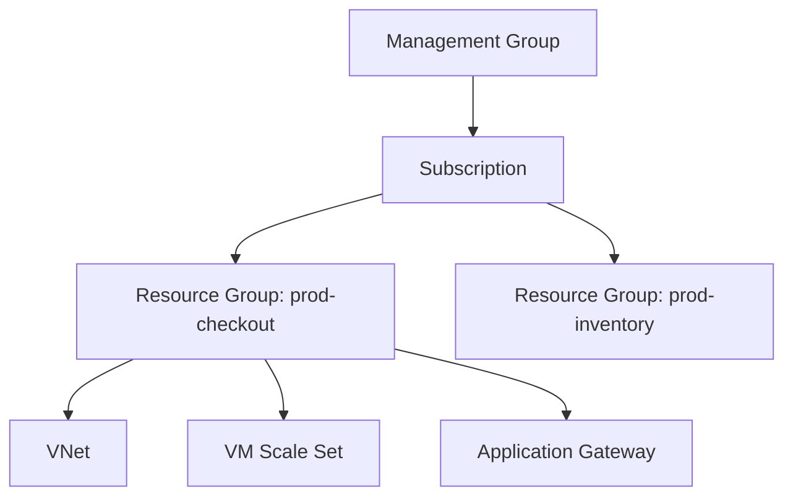
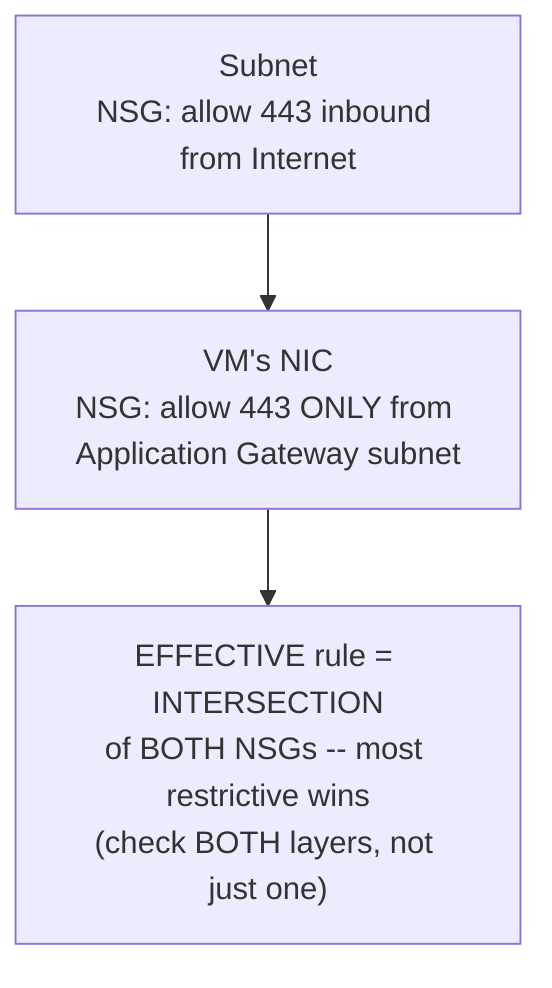
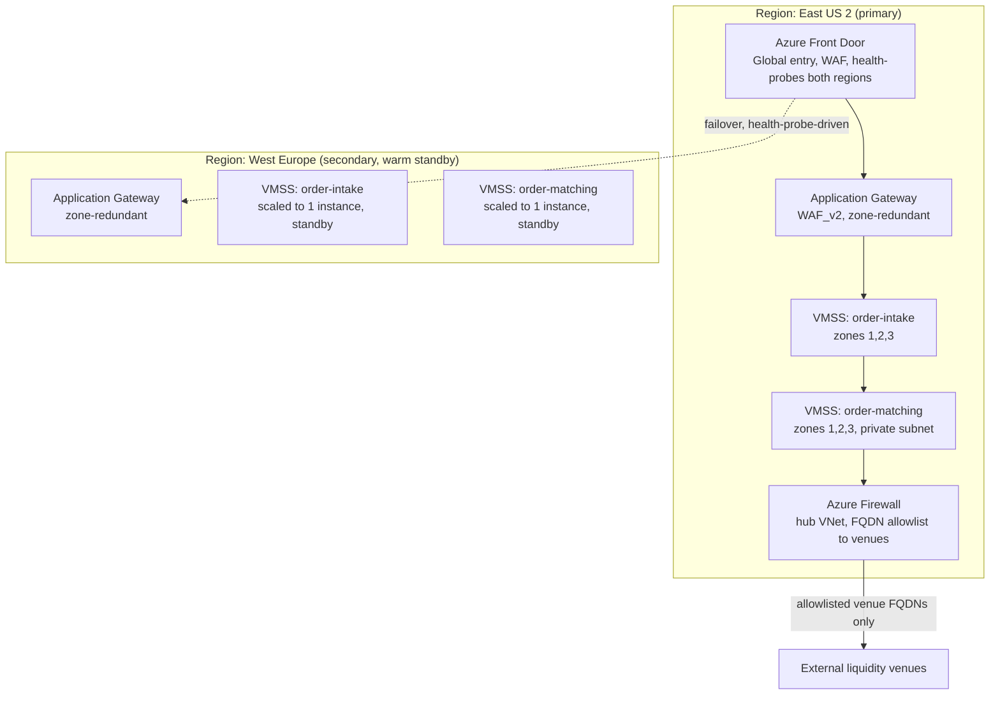
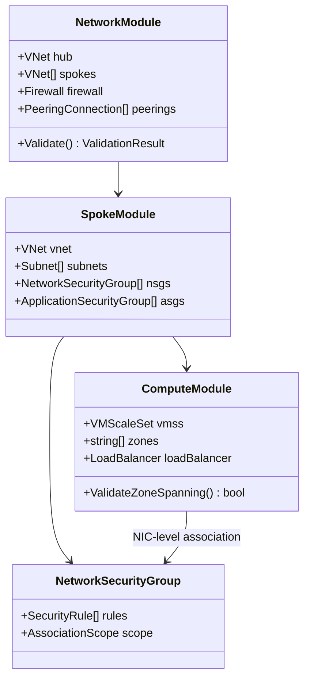
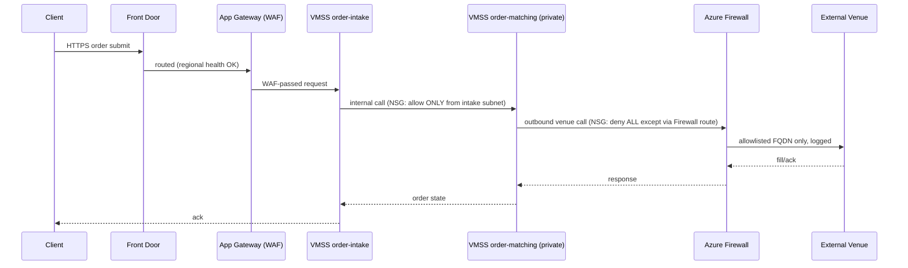

# Module 65 — Azure: Compute & Networking Fundamentals — VMs, VNet, Load Balancer/App Gateway & VM Scale Sets

> Domain: Azure | Level: Beginner → Expert | Prerequisite: [[../21-AWS/01-Compute-Networking-VPC-LoadBalancing-AutoScaling]] (this module deliberately mirrors that module's structure, using AWS as the reference model and calling out every point of genuine divergence rather than re-deriving cloud-networking fundamentals from scratch), [[../14-System-Design/01-System-Design-Fundamentals]]

---

## 1. Fundamentals

### Why does a Principal Engineer need Azure networking/compute depth given this course already covered the identical concepts on AWS?
The underlying distributed-systems and resilience principles (multi-zone redundancy, health-check-driven load balancing, elastic scaling) are cloud-agnostic and already fully established — what a Principal Engineer specifically needs from this module is the **precise mapping** between AWS's and Azure's concrete service names and the **specific points where Azure's actual behavior genuinely diverges** from the AWS model, since a Principal Engineer operating across both clouds (or migrating between them, or architecting a multi-cloud system) who assumes naive one-to-one equivalence will misconfigure the platform-specific details that don't actually match.

### Why does this matter?
Because Azure and AWS, despite solving the same underlying problems, differ in specific, consequential ways (Azure's resource-group/subscription hierarchy has no direct AWS analog; Azure VNets support a materially different subnet-delegation and NSG-association model than AWS Security Groups; Azure Availability Zones and Availability Sets are two distinct, non-interchangeable resilience mechanisms with no single AWS equivalent) — a Principal Engineer's credibility in an Azure-specific interview or architecture review depends on correctly using Azure's own vocabulary and specific mechanisms, not describing AWS concepts with Azure service names substituted in.

### When does this matter?
Any system deployed on Azure, and specifically any Principal Engineer working across a genuinely multi-cloud or Azure-primary organization (directly relevant given this course's stated baseline already includes professional AWS and Azure experience) — this module's comparative approach is designed to build precise, transferable judgment rather than requiring the AWS material to be unlearned and Azure material learned independently from scratch.

### How does it work (30,000-ft view)?
```
Resource Group: a logical container for related Azure resources -- NO DIRECT AWS EQUIVALENT
 (closest analog: tagging + IAM scoping combined, but Resource Groups are a first-class,
 structural organizing unit in Azure, not an optional convention)
VNet: Azure's VPC equivalent -- isolated virtual network, divided into Subnets
NSG (Network Security Group): Azure's Security Group equivalent -- BUT associates with BOTH
 subnets AND individual NICs (a genuine divergence from AWS's instance-only association)
VM: Azure's EC2 equivalent
Load Balancer (Layer 4) / Application Gateway (Layer 7): Azure's NLB/ALB equivalents --
 Application Gateway ALSO bundles a Web Application Firewall (WAF), unlike AWS's ALB
VMSS (Virtual Machine Scale Set): Azure's Auto Scaling Group equivalent
Availability Zones vs. Availability Sets: TWO DISTINCT resilience mechanisms -- AWS has only
 the single AZ concept; Azure additionally has Availability Sets for a WEAKER, same-datacenter
 fault-domain/update-domain guarantee
```

---

## 2. Deep Dive

### 2.1 Resource Groups and Subscriptions — a Structural Organizing Concept AWS Has No Direct Equivalent For
Every Azure resource must belong to exactly one **Resource Group** (a logical container, typically grouping resources that share a lifecycle — deployed, managed, and deleted together), and every Resource Group belongs to a **Subscription** (a billing and access-management boundary, roughly analogous to an AWS Account, though Azure additionally nests Subscriptions under **Management Groups** for organization-wide policy inheritance) — this is a genuine structural divergence from AWS, where "which resources belong together" is typically expressed via tagging conventions and IAM scoping rather than a first-class containment hierarchy: a Principal Engineer designing an Azure resource-organization strategy should treat Resource Group boundaries as a deliberate architectural decision (typically aligned with a specific application or environment's lifecycle) rather than an afterthought, since deleting a Resource Group deletes every resource within it — a powerful convenience for environment teardown, and a genuine risk if resource-group boundaries are drawn carelessly.

### 2.2 VNets, Subnets, and NSGs — Azure's Genuinely Different Security-Group Association Model
Azure VNets and Subnets map closely to the VPC/subnet model (public/private subnet segmentation, an internet-facing NAT Gateway-equivalent for private-subnet outbound access) — but Azure's **Network Security Group (NSG)**, the Security-Group equivalent, has a genuinely different association model than AWS: an NSG can be associated with **either a subnet or an individual network interface (NIC)** — or both simultaneously, with **both** layers' rules applied — whereas AWS Security Groups associate only with the instance's network interface, never the subnet itself (subnet-level traffic control in AWS is a distinct mechanism, Network ACLs, which are stateless, unlike NSGs' stateful behavior). This means an Azure network-security review must explicitly check **both** the subnet-level and NIC-level NSG (if both exist) to understand a VM's actual effective access rules — a common, Azure-specific misconfiguration is assuming a permissive NIC-level NSG is the complete picture when a more restrictive subnet-level NSG is also silently in effect (or vice versa), a genuinely different reasoning process than AWS's single-layer Security Group model.

### 2.3 Availability Zones vs. Availability Sets — Two Distinct, Non-Interchangeable Resilience Mechanisms
This is the single most consequential Azure-specific divergence from the AWS model in this section: Azure **Availability Zones** are physically separate datacenters within a Region (directly analogous to AWS AZs) — but Azure additionally offers **Availability Sets**, a *weaker*, single-datacenter mechanism that spreads VMs across distinct **fault domains** (separate physical racks/power/network within the same datacenter) and **update domains** (groups of VMs Azure won't patch/reboot simultaneously), protecting against rack-level hardware failure and simultaneous-maintenance-induced downtime, but providing **no protection against a full datacenter/Availability-Zone-level failure** — a Principal Engineer must explicitly distinguish these: a workload using only an Availability Set (no Availability Zone spread) has a materially weaker resilience posture than the multi-AZ discipline would suggest is adequate, and this specific two-tier distinction (Zone vs. Set) has no single AWS equivalent to map onto, making it a genuine, not merely terminological, point of required new understanding.

### 2.4 Load Balancer vs. Application Gateway — Azure's Split, and Application Gateway's WAF Bundling
Azure Load Balancer (Layer 4, TCP/UDP) and Application Gateway (Layer 7, HTTP/HTTPS with path-based routing, cookie-based session affinity, and SSL termination) map respectively to AWS's NLB and ALB — but Application Gateway additionally, natively bundles a **Web Application Firewall (WAF)** as an integrated capability (protecting against common web exploits — SQL injection, XSS — via managed rule sets), whereas AWS's equivalent (AWS WAF) is a separate service explicitly attached to an ALB or CloudFront distribution rather than a built-in Application Gateway capability — this is a genuine Azure-specific convenience (fewer separate resources to provision and wire together for a common web-security requirement) worth explicitly knowing about rather than assuming Application Gateway is a pure ALB-equivalent requiring a separately-bolted-on WAF the way AWS does.

### 2.5 VM Scale Sets — Azure's Auto Scaling Group Equivalent, With Explicit Zone-Spanning Configuration
VM Scale Sets (VMSS) directly implement the Auto Scaling Group model — automatically launching/terminating VM instances based on a scaling policy's trigger conditions — but critically, VMSS's zone-spanning behavior must be **explicitly configured** (specifying which Availability Zones the scale set should span) rather than being an implicit, automatic property of using the service at all, meaning the exact same single-zone-risk failure mode the incident described can occur in Azure specifically if a VMSS is provisioned without explicit zone configuration — a Principal Engineer reviewing an Azure architecture should treat "is this VMSS explicitly zone-spanning?" with the same scrutiny established for "is this ASG multi-AZ?"

### 2.6 The Well-Architected Framework's Azure Equivalent, and Why This Module's Comparative Structure Continues Throughout the Domain
Microsoft publishes its own, structurally similar **Azure Well-Architected Framework** (five pillars: Reliability, Security, Cost Optimization, Operational Excellence, Performance Efficiency — a near-direct match to AWS's six, minus the separately-broken-out Sustainability pillar, which Azure folds into its general guidance rather than a standalone pillar) — this course's capstone discipline (a recurring, structured review applying accumulated domain knowledge systematically) applies identically here, and this Azure domain's own capstone module (72) will apply it to the Azure-specific service set the same way did for AWS, reinforcing that the *review methodology* itself, not just the underlying resilience/security knowledge, is a genuinely portable, cloud-agnostic Principal-Engineer skill.

---

## 3. Visual Architecture

### Azure Resource Hierarchy — No Direct AWS Equivalent

```mermaid
graph TB
 MG[Management Group] --> Sub[Subscription]
 Sub --> RG1["Resource Group: prod-checkout"]
 Sub --> RG2["Resource Group: prod-inventory"]
 RG1 --> VNet1[VNet]
 RG1 --> VMSS1[VM Scale Set]
 RG1 --> LB1[Application Gateway]
```

### NSG Dual Association — Subnet AND NIC Level

```mermaid
graph TB
 Subnet["Subnet<br/>NSG: allow 443 inbound from Internet"] --> VM["VM's NIC<br/>NSG: allow 443 ONLY from Application Gateway subnet"]
 VM --> Effective["EFFECTIVE rule = INTERSECTION<br/>of BOTH NSGs -- most restrictive wins<br/>(check BOTH layers, not just one)"]
```

## 4. Production Example
**Scenario**: A team migrating a customer-facing API from AWS to Azure (as part of a broader multi-cloud strategy) replicated their existing AWS architecture — a multi-AZ ASG behind an ALB — by provisioning a VM Scale Set behind an Application Gateway, and, because the team's runbook described "distribute VMs for resilience" without specifying the exact Azure mechanism, an engineer configured an **Availability Set** (reasoning, based on AWS familiarity, that "distributing across the datacenter" was equivalent to AWS's multi-AZ spread) rather than explicitly configuring the VMSS to span **Availability Zones**. **Investigation**: during a genuine, if rare, Azure datacenter-level incident affecting a single Availability Zone in that Region, every VM in the Availability-Set-configured scale set went down simultaneously — because Availability Sets provide fault-domain/update-domain distribution *within a single datacenter*, not *across* datacenters/Availability Zones, the entire fleet resided within the affected zone's single physical facility, with zero VMs surviving in an unaffected zone. **Root cause**: the migrating team's mental model, built entirely on AWS's single-tier AZ-distribution concept, didn't have a place for Azure's two-tier Zone-vs-Set distinction — "distribute across the datacenter for resilience" sounded like it satisfied the same requirement AWS's multi-AZ ASG satisfies, but Availability Sets are a structurally weaker, same-datacenter-scoped mechanism, and the engineer had no specific reason (without Azure-specific training) to know these were two distinct concepts requiring two distinct configuration decisions. **Fix**: reconfigured the VM Scale Set with explicit `zones = ["1", "2", "3"]` configuration (spanning genuine Availability Zones, matching the actual resilience posture the original AWS multi-AZ ASG provided), and updated the team's internal migration runbook to explicitly flag every AWS-to-Azure concept mapping with a documented divergence note wherever the mapping isn't a clean one-to-one equivalence (directly this module's own approach, now applied as an internal team practice) — Availability Sets retained as a *secondary*, within-zone consideration (for very latency-sensitive same-zone clustering scenarios) rather than mistakenly treated as the primary resilience mechanism. **Lesson**: cross-cloud migration risk isn't primarily about unfamiliar new concepts — it's specifically about concepts that sound familiar and analogous but have a subtly different actual guarantee, which is more dangerous precisely because it doesn't trigger the "I should look this up carefully" instinct that a genuinely unfamiliar concept would.

## 5. Best Practices
- Explicitly configure VM Scale Sets to span genuine Availability Zones for any workload requiring datacenter-level resilience — never assume Availability Sets alone provide equivalent protection to AWS's multi-AZ model.
- Review both subnet-level and NIC-level NSGs together when auditing a VM's actual effective network access — never assume a single layer is the complete picture.
- Treat Resource Group boundaries as a deliberate architectural decision aligned with a specific application/environment lifecycle, given that deleting a Resource Group deletes everything within it.
- Maintain an explicit, documented AWS-to-Azure concept-mapping reference for any team working across both clouds, specifically flagging divergences (Availability Zones vs. Sets; NSG's dual association model; Application Gateway's bundled WAF) rather than assuming naive equivalence.
- Leverage Application Gateway's native WAF bundling for web-facing services rather than assuming a separate WAF resource must always be provisioned and wired in, as AWS's model would suggest.

## 6. Anti-patterns
- Configuring an Availability Set when Availability Zone spanning is what the workload's actual resilience requirement demands, based on an AWS-derived assumption that "distributing within the datacenter" is equivalent to multi-AZ distribution.
- Reviewing only one layer (subnet or NIC) of NSG rules during a security audit, missing a more-restrictive-or-more-permissive rule silently in effect at the other layer.
- Treating Resource Groups as an arbitrary, unplanned organizational convenience rather than a deliberate lifecycle-aligned boundary, risking accidental mass-deletion of unrelated resources.
- Assuming every AWS service has a clean one-to-one Azure equivalent and porting architecture diagrams by simple find-and-replace of service names, without validating each mapping's actual behavioral fidelity.
- Provisioning a VM Scale Set without any explicit zone configuration at all, silently defaulting to single-zone behavior with no resilience beyond fault/update-domain spreading.

---

## 7. Performance Engineering

**NSG rule evaluation cost:** Azure NSGs are **flow-based**, not packet-based — a rule is evaluated once, when a new TCP/UDP flow is first established, and the resulting allow/deny decision is cached in the dataplane's flow table for the connection's lifetime, so subsequent packets on the same flow incur no further rule-evaluation cost. This means evaluation cost is front-loaded to **connection establishment**: a workload with high connection churn (many short-lived connections — a common shape for synchronous, per-request outbound calls to a payment gateway) pays this cost far more than one with few, long-lived connections (a persistent Kafka or database connection pool). An NSG's rule list (default limit 1000 rules per NSG, raisable via quota) is evaluated in strict priority order until the first match — placing frequently-matched rules at lower (numerically smaller = higher priority) values reduces average evaluation depth, a real, measurable optimization at high connection-churn volumes, not merely a cosmetic ordering preference.

**VNet peering:** Peering itself adds no material latency beyond physical distance — traffic routes over Azure's backbone at line rate — but peering is **non-transitive**: VNet A peered to B, and B peered to C, does **not** give A reachability to C. Assuming transitivity (a common mistake carried over from flatter on-prem network topologies) silently breaks connectivity rather than degrading performance, and the fix at scale is a **hub-and-spoke** topology (a central hub VNet peered individually to every spoke) rather than attempting a fully-meshed peering graph, which grows peering-relationship count quadratically with application count.

**VMSS scale-out latency:** From a scale trigger firing to a new instance actually serving production traffic involves several sequential stages, each with real, non-negligible latency: VM provisioning (roughly 30-90 seconds, SKU- and regional-capacity-dependent), OS boot, extension execution (custom script extensions, monitoring-agent installation), and finally the Load Balancer or Application Gateway's health probe passing — typically requiring 2-3 consecutive successful probes at a configurable interval (e.g., 15s each, meaning 30-45s minimum before the instance is marked healthy and receives traffic). Realistic end-to-end scale-out latency is **2-5 minutes**, not instantaneous — VMSS autoscaling rules must therefore be tuned against a **leading** indicator (queue depth, CPU trending upward) rather than a **lagging** one (request latency already breaching SLA), the identical scale-out-lag discipline AWS's ASG requires.

**Application Gateway vs. Load Balancer overhead:** Application Gateway (Layer 7) terminates TLS and performs full HTTP parsing/routing, adding single-digit-millisecond per-request overhead; Load Balancer (Layer 4) is a true pass-through with near-zero added latency, since it never terminates the connection. A latency-sensitive internal service-to-service path (e.g., an order-matching engine's hot path) should default to Load Balancer, or bypass a load balancer entirely via VMSS-native backend integration, rather than routing through Application Gateway unless WAF or L7 routing is a genuine, specific requirement for that path.

**NIC bandwidth ceilings:** Each VM SKU caps NIC bandwidth (e.g., `Standard_D2s_v5` ≈ 12.5 Gbps) — **Accelerated Networking** (SR-IOV, bypassing the hypervisor's software-defined virtual switch) should be enabled by default on every SKU that supports it, since without it, traffic traverses the host's software networking stack with materially higher CPU overhead and latency variance, a real, measurable cost at sustained high-throughput volumes (e.g., a market-data fan-out service).

**Benchmarking:** Load-test VMSS scale-out against the actual production traffic-ramp shape (a realistic gradual or spike pattern), not a synthetic step function, and separately benchmark NSG cold-flow-table connection-burst throughput versus steady-state warm-flow throughput — these are genuinely different performance regimes, and a benchmark exercising only one silently under-represents the other.

---

## 8. Security

**NSG/ASG misconfiguration blast radius:** Application Security Groups (ASGs) let NSG rules reference a tag-based logical grouping (e.g., "allow from ASG:web-tier") rather than hard-coded IP ranges — but ASG **membership** is not visible from the NSG rule itself, meaning a security review that reads only the NSG rule set sees "allow from web-tier" with no indication of which specific NICs are actually in that group at any given moment. A VM accidentally tagged into the wrong ASG silently inherits that ASG's entire inbound/outbound rule set, invisible to anyone reviewing NSG rules alone — the identical "declared rule vs. actual membership" gap this domain's Module 66 documents for RBAC scope inheritance, now recurring at the network layer. A full network-security audit must independently verify ASG membership, not just NSG rule text.

**Azure Firewall as a centralized egress control:** NSGs are distributed (per-subnet/per-NIC) and operate on IP/port only — they cannot express FQDN-based rules (e.g., "allow outbound only to `api.stripe.com`") or provide a single, centralized, auditable egress-logging choke point. **Azure Firewall**, typically deployed in a hub VNet within a hub-and-spoke topology with all spoke VNets' internet-bound traffic force-tunneled through it, closes this gap — FQDN filtering, threat-intelligence-based blocking, and centralized flow logs from one place. For a FinTech production VNet, uncontrolled, unaudited outbound connectivity is a genuine data-exfiltration risk surface (a compromised process silently exfiltrating client PII to an attacker-controlled endpoint would be invisible to NSG-only egress controls, since NSGs have no notion of destination domain, only destination IP/port) — Azure Firewall or an equivalent centralized egress-filtering layer should be treated as a required control, not an optional hardening step, for any production Resource Group handling regulated financial data.

**DDoS protection tiers:** Every public IP receives DDoS Protection **Basic** automatically (always-on, network-layer mitigation, no attack analytics, no SLA). **DDoS Protection Standard** (a paid, VNet-scoped tier) adds adaptive tuning specific to the protected resources' actual traffic baseline, attack analytics/telemetry, and an SLA-backed cost-protection guarantee for scale-out costs incurred during a mitigated attack. A production, internet-facing FinTech workload (a public trading UI, a payment-callback webhook endpoint) should never rely on Basic alone — Basic's lack of attack-specific analytics means a sophisticated, lower-volume application-layer attack can degrade the service without Basic-tier mitigation ever meaningfully engaging.

**Eliminate management-port exposure:** Any NSG rule opening RDP (3389) or SSH (22) directly to a VM, even narrowly source-IP-scoped, is a standing attack surface that exists purely as a convenience. **Azure Bastion** (a managed, browser-based jump-host service provisioned once per VNet or hub) eliminates the need for that surface entirely — RDP/SSH sessions tunnel through Bastion over HTTPS (443) with no public IP or open management port ever required on the target VM. A Principal Engineer reviewing network security should treat any direct management-port NSG rule as a finding requiring justification, not a routine, expected configuration.

**PCI/data-residency note:** Azure Firewall, NSG flow logs, and Azure Bastion session logs together form the auditable network-access trail a PCI-DSS or SOX-driven change-management review expects — architecting for centralized, exportable network audit logging (via Azure Monitor/Log Analytics) from day one avoids a costly retrofit when a compliance audit first asks "show me every outbound connection this cardholder-data-environment VNet made in the last 90 days."

---

## 9. Scalability

**Multi-region VNet topology:** Global VNet Peering connects VNets across regions, but peering alone provides only network **reachability** — it does not provide latency-aware, health-based traffic routing. **Azure Traffic Manager** (DNS-based global load-balancing) or **Azure Front Door** (a global, Anycast Layer-7 entry point with built-in WAF and both routing) must sit above per-region VMSS/Application Gateway deployments to route users to their nearest *healthy* region. A genuinely multi-region-resilient architecture needs this additional global-routing layer explicitly designed in — VNet peering by itself is necessary but not sufficient for multi-region failover.

**Hub-and-spoke at scale:** A flat, one-VNet-per-application topology doesn't scale operationally past a handful of applications — peering relationships grow quadratically in a fully-meshed topology. **Hub-and-spoke** (a central hub VNet housing shared services — Azure Firewall, VPN/ExpressRoute gateways, shared DNS — peered individually to per-application spoke VNets) is the standard scaling pattern, directly analogous to AWS Transit Gateway's role, and should be the default topology for any organization beyond a small handful of applications.

**Availability Zone coverage is not uniform:** Not every Azure region offers three Availability Zones — some regions are **non-zonal**, offering only Availability Sets or single-datacenter resilience. A multi-region scaling and DR strategy must explicitly verify each target region's actual zone support (via the Azure Region/Product availability matrix) rather than assuming uniform zonal capability everywhere, a genuine, non-obvious capacity-planning constraint that only surfaces when a specific low-tier region is chosen for cost or data-residency reasons.

**VMSS scale ceilings:** A single VM Scale Set supports up to 1,000 instances in Uniform orchestration mode (600 when using a Marketplace image; higher ceilings under Flexible orchestration). A workload genuinely requiring a larger fleet must **shard across multiple VMSS** behind a shared Load Balancer/Application Gateway backend pool — a capacity ceiling worth knowing and capacity-planning against before an incident forces the discovery mid-scale-event.

**Load Balancer SKU choice:** **Basic** Load Balancer carries no SLA and is being deprecated (retirement announced by Microsoft); **Standard** Load Balancer is zone-redundant by default (when not pinned to a specific zone) and supports materially higher backend-pool scale (up to 1,000 instances vs. Basic's 300). Standard should be the unconditional default for any production FinTech workload, independent of current scale, both for its SLA and its zone-redundancy default — choosing Basic "because current scale doesn't need Standard's higher limits" ignores the SLA and resilience gap, which matters regardless of instance count.

**Active-active vs. active-passive across regions:** for a trading or payment-processing platform, active-active multi-region (both regions serving live traffic, Traffic Manager/Front Door splitting load) provides the lowest RTO but requires the data layer beneath it (typically SQL/Cosmos DB with cross-region replication) to have a consistency model the application can tolerate; active-passive (a warm-standby region, promoted only on failover) is materially simpler operationally and is the correct default unless a specific RTO requirement (sub-minute) justifies active-active's added consistency and cost complexity.

---

## 10. Interview Questions

### Basic (10)
1. **Q: What is a Resource Group, and what AWS concept is it most similar to?** **A:** A logical container for related Azure resources sharing a lifecycle — it has no precise direct AWS equivalent, though it combines aspects of tagging and IAM scoping.
2. **Q: What is the Azure equivalent of an AWS VPC?** **A:** A VNet (Virtual Network) — the same isolated, CIDR-addressed private network boundary; the notable divergence is that VNet subnets are Region-scoped (spanning Availability Zones) whereas AWS subnets are pinned to a single AZ.
3. **Q: What is the key structural difference between an Azure NSG and an AWS Security Group?** **A:** An NSG can associate with both a subnet and an individual NIC simultaneously; AWS Security Groups associate only with the instance's network interface.
4. **Q: What is the difference between Azure Availability Zones and Availability Sets?** **A:** Availability Zones are physically separate datacenters within a Region (protecting against datacenter-level failure); Availability Sets spread VMs across fault/update domains within a single datacenter only.
5. **Q: What is the Azure equivalent of an AWS ALB?** **A:** Application Gateway (Layer 7), which additionally bundles a Web Application Firewall natively.
6. **Q: What is the Azure equivalent of an AWS Auto Scaling Group?** **A:** VM Scale Sets (VMSS) — the same declarative "maintain N instances from a template with metric-driven scaling" role; Flexible orchestration mode is the closer ASG analog (mixed sizes, spot mix, fault-domain spreading) versus the older Uniform mode's identical-instance model.
7. **Q: Must VMSS zone-spanning be explicitly configured, or is it automatic?** **A:** It must be explicitly configured — it is not an automatic, implicit property of using VMSS.
8. **Q: What does Azure Policy provide, and what AWS mechanism is it most analogous to?** **A:** Organization-wide, enforceable configuration constraints — analogous to AWS Service Control Policies.
9. **Q: How many pillars does the Azure Well-Architected Framework have, and how does this compare to AWS's?** **A:** Five (Reliability, Security, Cost Optimization, Operational Excellence, Performance Efficiency) versus AWS's six — Azure folds Sustainability into general guidance rather than a standalone pillar.
10. **Q: What roughly corresponds to an AWS Account in Azure's hierarchy?** **A:** A Subscription, which additionally nests under Management Groups for organization-wide policy inheritance.

### Intermediate (10)
1. **Q: Why is checking only the NIC-level NSG insufficient for a complete Azure network-security audit?** **A:** A subnet-level NSG can independently impose additional, more restrictive rules that apply regardless of what the NIC-level NSG allows — the effective access is the intersection of both layers, so reviewing only one risks missing a rule silently in effect at the other.
2. **Q: Why did the incident's Availability-Set misconfiguration go undetected until an actual zone-level failure occurred?** **A:** Availability Sets do provide genuine, real resilience against fault-domain/update-domain-scoped failures (rack-level hardware issues, simultaneous patching), so the configuration "worked" and looked correct for any failure scope within that scope — the gap was invisible until a failure specifically at the datacenter/zone level (a scope Availability Sets don't protect against) actually occurred.
3. **Q: Why is Resource Group deletion described as "a powerful convenience and a genuine risk," rather than purely one or the other?** **A:** It provides a clean, single-operation way to tear down an entire environment's resources when boundaries are drawn deliberately along a genuine shared lifecycle, but the same mechanism becomes a risk if resources with independent lifecycles are carelessly placed in the same group, since deleting the group has no selective-exclusion mechanism.
4. **Q: Why does Application Gateway's native WAF bundling represent a genuine architectural difference from AWS, not just a naming difference?** **A:** In AWS, WAF is a separately-provisioned resource explicitly attached to an ALB or CloudFront; in Azure, WAF capability is an integrated, built-in option of Application Gateway itself — this changes the actual provisioning/architecture diagram (fewer distinct resources), not just terminology.
5. **Q: Why should an AWS-to-Azure migration runbook explicitly flag divergent concept mappings rather than simply listing equivalent service names?** **A:** A migrating engineer relying on a simple name-mapping (as) has no signal to prompt closer scrutiny of concepts that sound equivalent but have subtly different actual guarantees (Availability Zones vs. Sets) — explicit divergence flags counteract exactly the false-familiarity risk that caused the incident.
6. **Q: Why is VNet peering's throughput characteristic a capacity-planning concern analogous to the NAT Gateway discussion?** **A:** Both are network paths with real, non-infinite throughput ceilings that a sufficiently high-volume workload can hit — assuming either is a limitless pass-through risks an unanticipated bottleneck at genuine scale.
7. **Q: Why does Azure's dual-layer NSG model represent both an additional security opportunity and an additional audit burden?** **A:** It enables a deliberate two-tier design (coarse subnet-level baseline plus fine-grained NIC-level refinement) unavailable in AWS's single-layer model, but correspondingly requires reviewing both layers together to correctly understand a VM's actual effective access, rather than a single-layer check being sufficient.
8. **Q: Why is Azure Policy described as the structurally correct fix for the incident, rather than updated runbook documentation alone?** **A:** Runbook documentation depends on individual engineers reading and correctly applying it every time, the same unreliable-manual-diligence pattern this course has repeatedly flagged; Azure Policy can enforce a rule like "no VMSS without explicit zone configuration" structurally, at the platform level, regardless of whether any individual engineer remembered the documented guidance.
9. **Q: Why must Azure subscription-level quotas be tracked separately from any AWS account's quotas for an organization operating in both clouds?** **A:** They are entirely independent capacity-tracking systems specific to each cloud provider — verifying sufficient AWS quota provides no information about Azure's separate, differently-structured quota system, and vice versa.
10. **Q: Why does this module's comparative (AWS-referenced) structure make sense pedagogically, rather than presenting Azure concepts in isolation?** **A:** Because the underlying distributed-systems principles (multi-zone redundancy, health-check-gated load balancing, elastic scaling) are already fully established from the AWS module — presenting Azure independently would require re-deriving the same conceptual foundation; explicitly mapping onto and diverging from the already-learned AWS model is a more efficient and more precisely calibrated way to build accurate, non-naive Azure-specific judgment.

### Advanced (10)
1. **Q: Diagnose the incident from first principles, and design the specific automated Azure Policy definition that would have prevented this exact misconfiguration from ever reaching production, independent of any individual engineer's cloud-specific knowledge.**
 **A:** Root cause: an AWS-derived mental model conflated Availability Sets with Availability Zones, a distinction with no AWS analog to prompt closer scrutiny. Structural fix: an Azure Policy definition using a `deny` effect on any Microsoft.Compute/virtualMachineScaleSets resource that lacks a non-empty `zones` property in a designated production Resource Group — this converts a reliance on individual cross-cloud expertise into a non-bypassable platform-level gate, directly the same automated-governance pattern §Advanced Q10 and §Advanced Q1 already established for AWS, now expressed via Azure's own native policy mechanism.
2. **Q: A team migrating from AWS to Azure argues that since both clouds provide "the same fundamental cloud primitives," a Principal Engineer with deep AWS expertise can architect an Azure system without dedicated Azure-specific training, learning details "as needed" during implementation. Evaluate this claim using the incident as evidence.**
 **A:** Push back, using directly — the danger isn't unfamiliar concepts (which naturally prompt research) but *falsely familiar* concepts (Availability Sets sounding like AWS's AZ model) that don't trigger the instinct to look something up carefully, precisely because they seem already understood; "learning as needed" systematically under-invests in exactly the class of risk that caused this incident, since the engineer never generates the "I should verify this" signal for a concept that feels already known — dedicated, structured Azure-specific training (or, as this module models, an explicit comparative-divergence review) is necessary specifically to surface these false-equivalence traps before they reach production, not simply "more cloud experience in general."
3. **Q: Design the specific pre-production validation practice that would catch a resilience-configuration gap like the before an actual zone-level failure exposes it, generalizing this domain's recurring "steady-state doesn't exercise the failure-triggering condition" pattern to Azure specifically.**
 **A:** A pre-production or staging-environment **simulated zone-failure drill** — using Azure's own zone-down simulation capabilities where available, or, more generally, deliberately stopping/deallocating every VM instance within a single specific Availability Zone (or, for an Availability-Set-only configuration, verifying this test would reveal that *all* instances are affected simultaneously since none are actually zone-isolated) — and confirming the workload continues serving traffic from surviving zones; this directly parallels §Advanced Q1's scaling-event load test and §Advanced Q6's DR drill discipline, now applied to zone-failure resilience specifically, converting an assumed guarantee into a verified one.
4. **Q: Explain why a genuinely multi-cloud (not just AWS-primary or Azure-primary) architecture faces a category of risk beyond what either cloud's own documentation individually addresses, using this module's Zone-vs-Set distinction as a concrete example.**
 **A:** Each cloud's own documentation correctly explains its own concepts in isolation, but neither AWS's nor Azure's documentation is positioned to warn a reader specifically about the *other* cloud's subtly different equivalent — the risk is inherently at the intersection/mapping between two systems, a space that requires deliberate, dedicated cross-cloud comparative material (exactly this module's approach) to address, since no single cloud provider's documentation has an incentive or a natural occasion to describe how its own concept differs from a competitor's similarly-named one.
5. **Q: Critique the following claim: "Since our Application Gateway has WAF enabled, our web-facing service is now equivalently protected to an AWS ALB with AWS WAF attached, so no further review of AWS-specific migration checklist items is needed for this component."**
 **A:** The specific claim about WAF-equivalence is reasonable (both provide comparable managed-rule-based web-exploit protection) — but generalizing "this one component is fine" into "no further Azure-specific migration review is needed" is the same overgeneralization pattern flagged elsewhere in this course (§Advanced Q9): a correctly-verified equivalence for *this specific capability* says nothing about the *other* divergent concepts covered elsewhere in this module (NSG dual-layer association, Availability Zone/Set distinction) that remain independently unverified and require their own explicit checks.
6. **Q: Design a decision framework for when an organization should invest in genuinely Azure-idiomatic architecture (embracing Azure-specific capabilities like Application Gateway's bundled WAF or Azure Policy) versus deliberately maintaining AWS-parallel architecture patterns for consistency across a multi-cloud estate.**
 **A:** Favor Azure-idiomatic patterns when the Azure-specific capability provides a genuine simplification or capability AWS's equivalent lacks (Application Gateway's bundled WAF reducing resource count) and when the workload/team operates predominantly or exclusively in Azure; favor AWS-parallel patterns specifically when an organization has active workloads genuinely spanning both clouds with shared tooling/runbooks/on-call expertise where consistency reduces operational cognitive load more than the Azure-specific optimization would save — this mirrors §Advanced Q4's individual-workload-vs-organizational-standardization trade-off, now applied to cloud-idiomatic-vs-portable architecture choice specifically.
7. **Q: A Principal Engineer is asked to design the specific Resource Group boundary strategy for a multi-service application with distinct dev/staging/production environments and multiple independently-deployable microservices within each environment. Propose a structure and justify it.**
 **A:** Structure Resource Groups primarily along the environment axis first (e.g., `checkout-prod`, `checkout-staging`, `checkout-dev`), with each environment-specific Resource Group containing that environment's full set of related microservice resources — this ensures an entire environment can be safely and completely torn down or recreated via a single Resource Group deletion (a genuine operational convenience for staging/dev environments specifically) while production's boundary is deliberately scoped to prevent accidental co-mingling with lower environments; further sub-grouping by individual microservice is a reasonable secondary consideration only if services within an environment genuinely have independent lifecycles worth isolating, directly applying the "deliberate lifecycle-aligned boundary" principle to a concrete, multi-dimensional scenario.
8. **Q: Explain why Azure's NSG dual-association model could, if adopted without corresponding review-process rigor, produce a WORSE security posture than AWS's simpler single-layer model, despite offering strictly more configuration flexibility.**
 **A:** Additional flexibility without correspondingly rigorous review discipline creates more configuration surface area where an error can hide — a team accustomed to AWS's single-layer mental model, migrating to Azure without adjusting their audit practice (the anti-pattern), might review only one NSG layer out of habit, missing a genuinely dangerous rule at the other layer that a security review would have caught in AWS's simpler model precisely because there's only one place to look — more capability requires commensurately more rigorous process, or it can net-produce worse outcomes than a simpler, harder-to-misconfigure model.
9. **Q: Design the specific set of Azure Policy definitions (beyond the single zone-spanning check from Advanced Q1) that would comprehensively enforce this module's key resilience and security lessons across an entire subscription.**
 **A:** (1) Deny any VMSS without explicit non-empty `zones` configuration in production Resource Groups (Advanced Q1). (2) Deny any NSG rule permitting unrestricted inbound access (`0.0.0.0/0` equivalent, Azure's `Internet`/`Any` source) on ports beyond an explicitly-approved allowlist, checked at both subnet and NIC association layers. (3) Require Application Gateway WAF to be enabled (not merely available) for any Application Gateway in a production Resource Group. (4) Deny provisioning of any resource outside an approved, tagged Resource Group naming/organization convention, preventing ungoverned resource sprawl outside the deliberate lifecycle-aligned structure (Advanced Q7). Each policy targets a distinct, concrete configuration risk this module identified, mirroring the automated-governance-gate pattern established throughout the AWS domain (Modules 57-64) but expressed via Azure's own native policy engine.
10. **Q: As a Principal Engineer establishing Azure standards for an organization already operating on AWS, design the specific onboarding/training practice (synthesizing this entire module) that ensures engineers with strong AWS backgrounds don't repeat the incident's category of mistake.**
 **A:** Require every engineer transitioning to Azure work to complete an explicit, structured **divergence review** (not general Azure training, but specifically a curated list of "concepts that sound like an AWS equivalent but differ" — Availability Zones vs. Sets, NSG's dual-layer model, Resource Group's lack of AWS equivalent, Application Gateway's bundled WAF) before being granted production-deployment permissions in Azure, paired with the Advanced Q9 policy suite as a structural backstop for anything the training doesn't fully prevent — directly treating "false familiarity from cross-cloud experience" as a distinct, specifically-addressed risk category rather than assuming general cloud expertise transfers safely by default, the central lesson this entire module establishes.

### Expert (10)
1. **Q: Design the specific hub-and-spoke topology and Azure Firewall rule structure for a multi-region FX trading platform where the order-matching-engine spoke must never initiate unaudited outbound internet connectivity, while a separate market-data-ingestion spoke legitimately needs high-throughput outbound connectivity to multiple external venues.**
 **A:** A central hub VNet per region hosting Azure Firewall (Premium tier, for TLS inspection and IDPS) with forced tunneling of all spoke egress through it; the order-matching spoke gets an explicit deny-by-default egress NSG plus an Azure Firewall application rule allowlisting only the specific, named FQDNs required (settlement system, internal risk service) — no broad internet egress rule at all; the market-data spoke gets a separate, wider Azure Firewall network/application rule collection scoped to the specific known venue FQDNs/IP ranges, still centrally logged, but not identical to the order-matching spoke's tighter policy — the key design point being that both spokes share the same centralized, auditable choke point (Azure Firewall) while each has its own independently-scoped, purpose-specific rule set, rather than one shared, lowest-common-denominator egress policy that would either over-permit the matching engine or under-permit market-data ingestion.

2. **Q: A team argues that since Azure Standard Load Balancer is zone-redundant "by default," a VMSS behind it is automatically resilient to a zone failure even if the VMSS itself has no explicit `zones` configuration. Evaluate this claim.**
 **A:** False, and a dangerous half-truth — the Load Balancer's own frontend IP and dataplane being zone-redundant means the *load balancer* survives a zone failure and continues routing to whatever healthy backends remain, but it provides zero resilience to the *backend pool* itself; if every VMSS instance behind it resides in a single zone (no explicit `zones` configuration), a zone failure removes 100% of the backend pool, and the zone-redundant Load Balancer simply has nothing healthy left to route to — this is precisely the incident's failure mode, now reframed with a load-balancer-level distraction that makes the underlying compute-layer gap easier to overlook.

3. **Q: Design a pre-production validation practice that would have caught the incident's Availability-Set-instead-of-Zones misconfiguration before an actual zone-level failure exposed it, generalizing the "steady-state doesn't exercise the failure-triggering condition" pattern to Azure compute specifically.**
 **A:** A staged, pre-production **simulated zone-failure drill**: deliberately stop/deallocate every VM instance Azure Resource Graph reports as residing in a specific Availability Zone (or, for an Availability-Set-only configuration, confirming this query itself reveals zero zone-diversity, since Availability Sets carry no zone assignment to query at all) and verify the workload continues serving traffic from the remaining zones/instances — converting an assumed resilience property into a verified one, run as a mandatory pre-production gate for any workload claiming zone-redundant resilience, not merely a documentation checkbox.

4. **Q: Explain why an Azure Policy that merely checks "does this VMSS have a non-empty `zones` property" is an incomplete safeguard against the incident's failure class, and design a more complete check.**
 **A:** A non-empty `zones` array satisfies the letter of the check even if it specifies only a single zone (e.g., `zones: ["1"]`) — technically "zone-configured" but providing zero actual cross-zone resilience, the same "object presence ≠ enforced reality" pattern recurring from this course's Kubernetes modules. The more complete check verifies the `zones` array contains at least the number of zones the workload's stated resilience requirement demands (typically all three, for full-region-zone-count workloads) **and** separately verifies, via a runtime query against Azure Resource Graph, that instances are actually currently distributed across those zones (not merely configured to be, in case of a transient scale-in leaving all surviving instances in one zone) — static configuration-linting and runtime-distribution verification are two independent checks, and a policy performing only the former misses the latter.

5. **Q: A Principal Engineer is evaluating whether a payment-gateway-integration service (synchronous, latency-sensitive, calling out to Stripe/Adyen) should sit behind Application Gateway or Azure Load Balancer. Design the recommendation and justify it against the specific security and latency requirements of a PCI-scoped payment path.**
 **A:** Application Gateway, despite its higher per-request latency versus Load Balancer, is the correct choice here specifically because of the PCI-relevant requirements: its bundled WAF provides managed protection against injection/XSS attacks on the inbound path (a PCI-DSS-relevant control), and its Layer-7 visibility enables path-based routing and centralized TLS termination/certificate management at a single, auditable point — the single-digit-millisecond latency overhead is a justified, deliberate trade against these security and operability gains for a PCI-scoped, internet-facing path; a purely internal, backend-to-backend call with no external exposure and no WAF requirement would correctly default to Load Balancer instead, since that path has no PCI-relevant inbound-web-threat surface to protect against.

6. **Q: Design the Resource Group and RBAC boundary strategy specifically for a network topology spanning a shared hub VNet (owned by a central platform team) and multiple application-owning teams' spoke VNets, addressing the tension between centralized network governance and per-team deployment autonomy.**
 **A:** Place the hub VNet, Azure Firewall, and VPN/ExpressRoute gateways in a platform-team-owned Resource Group with RBAC restricted to the platform team (Contributor) and read-only Reader access for application teams (visibility without modification rights); place each application's spoke VNet in that application team's own Resource Group, with the application team granted Contributor scoped to their own spoke Resource Group only (not the hub) — VNet peering connections themselves require a role assignment on **both** sides (the hub and the spoke), so the platform team retains a structural veto over which spokes can peer into the hub, preventing an application team from unilaterally establishing unreviewed connectivity into the shared, centrally-governed network — directly applying Module 66's lowest-necessary-scope RBAC discipline to network-topology governance specifically.

7. **Q: Explain why a VMSS's Flexible orchestration mode is described as "the closer ASG analog" versus Uniform mode, and design a scenario where a FinTech workload specifically benefits from Flexible mode's capabilities.**
 **A:** Uniform mode requires every instance to be identical (same VM image/SKU); Flexible mode allows mixing instance sizes and Spot/on-demand pricing within a single scale set, individually addressable VMs (rather than an opaque, scale-set-managed pool), and per-instance fault-domain placement — directly matching AWS ASG's mixed-instance-policy capability. A concrete FinTech benefit: an end-of-day batch-reconciliation workload that can tolerate interruption benefits from mixing Spot instances (substantially lower cost) with a baseline of on-demand instances for guaranteed minimum capacity within the same Flexible-mode scale set, achieving cost savings Uniform mode's identical-instance constraint doesn't allow.

8. **Q: A security review finds that an NSG's rule set correctly denies all inbound traffic except from an Application Gateway subnet, but the review is unable to determine, from the NSG rules alone, which specific VMs are actually reachable via that path in production right now. Diagnose the gap and design the fix.**
 **A:** The NSG rule set describes the *permitted* topology, not the *actual, currently-deployed* topology — determining which VMs are actually reachable requires cross-referencing the NSG-permitted source (the Application Gateway subnet) against Azure Resource Graph's live inventory of which NICs/VMs currently exist in the target subnet and which NSGs are actually associated with each (both subnet- and NIC-level, Module 65 §2.2's dual-association model) — the fix is a standing, automated **effective-network-path** report (analogous to Module 66 Advanced Q3's effective-RBAC-permissions computation) that resolves declared NSG rules against live resource inventory, rather than relying on manual cross-referencing during each individual review.

9. **Q: Critique the following claim: "Since our production VNet uses Azure Firewall for centralized egress filtering, our NSGs no longer need careful per-subnet review, since the Firewall is our real security boundary."**
 **A:** Incomplete and risky — Azure Firewall and NSGs operate at different layers addressing different threats: Azure Firewall's forced-tunneling primarily governs *outbound, internet-bound* traffic leaving the VNet; NSGs govern *lateral, east-west* traffic between subnets/NICs within and across the VNet, a threat surface Azure Firewall's typical hub-egress deployment does not inspect at all (traffic between two spoke subnets, or between two VMs in the same subnet, generally never transits the hub Firewall). An attacker who compromises one internal VM and attempts lateral movement to a second, more sensitive VM in the same VNet is constrained entirely by NSG rules, not by Azure Firewall — treating Firewall as a substitute for NSG rigor leaves the lateral-movement threat surface effectively unreviewed.

10. **Q: As a Principal Engineer establishing Azure network/compute standards for a FinTech organization, design the specific set of standing architectural reviews and automated policy checks (synthesizing this entire module) required before any new production Azure workload goes live.**
 **A:** (1) Mandatory zone-redundancy verification for both compute (VMSS explicit `zones`) and load-balancing (Standard SKU, not Basic) tiers, backed by the Advanced Q1 Azure Policy and the Expert Q3 pre-production zone-failure drill. (2) Mandatory dual-layer (subnet + NIC/ASG) NSG review with an automated effective-network-path report (Expert Q8), not manual-only review. (3) Mandatory Azure Firewall centralized egress for any Resource Group handling regulated financial data, with FQDN-scoped allowlists rather than broad internet egress (§8). (4) Mandatory Azure Bastion for all management access, with a policy denying any NSG rule directly exposing RDP/SSH. (5) Mandatory DDoS Protection Standard (not Basic-only) for any internet-facing production endpoint. (6) A deliberate Application-Gateway-vs.-Load-Balancer decision recorded per service, justified against that service's actual PCI/WAF/latency requirements (Expert Q5), not defaulted uniformly. This set converts the module's individual lessons into a non-bypassable, structurally-enforced pre-production gate, rather than relying on any individual engineer independently recalling each one under delivery pressure.

---

## 11. Coding Exercises

### Easy — VNet with explicit public/private subnet split (mirroring)
```hcl
resource "azurerm_virtual_network" "main" {
  name = "checkout-vnet"
  address_space = ["10.1.0.0/16"]
  location = azurerm_resource_group.checkout_prod.location
  resource_group_name = azurerm_resource_group.checkout_prod.name
}

resource "azurerm_subnet" "public" {
  name = "public-subnet"
  resource_group_name = azurerm_resource_group.checkout_prod.name
  virtual_network_name = azurerm_virtual_network.main.name
  address_prefixes = ["10.1.1.0/24"]
}

resource "azurerm_subnet" "private" {
  name = "private-subnet"
  resource_group_name = azurerm_resource_group.checkout_prod.name
  virtual_network_name = azurerm_virtual_network.main.name
  address_prefixes = ["10.1.2.0/24"] # SEPARATE, non-overlapping range -- no direct internet route
}
```

### Medium — Dual-layer NSG association
```hcl
resource "azurerm_network_security_group" "subnet_baseline" {
  name = "private-subnet-baseline-nsg"
  security_rule {
    name = "AllowFromAppGatewayOnly"; priority = 100; direction = "Inbound"; access = "Allow"
    protocol = "Tcp"; source_port_range = "*"; destination_port_range = "8080"
    source_address_prefix = "10.1.1.0/24"; destination_address_prefix = "*" # ONLY from public/AppGw subnet
  }
}

resource "azurerm_subnet_network_security_group_association" "private_subnet" {
  subnet_id = azurerm_subnet.private.id
  network_security_group_id = azurerm_network_security_group.subnet_baseline.id # SUBNET-level layer
}

resource "azurerm_network_interface_security_group_association" "checkout_vm_nic" {
  network_interface_id = azurerm_network_interface.checkout_vm.id
  network_security_group_id = azurerm_network_security_group.checkout_nic_specific.id # NIC-level layer --
    # BOTH apply
}
```

### Hard — VM Scale Set with EXPLICIT Availability Zone spanning
```hcl
resource "azurerm_linux_virtual_machine_scale_set" "checkout" {
  name = "checkout-vmss"
  resource_group_name = azurerm_resource_group.checkout_prod.name
  sku = "Standard_D2s_v5"
  instances = 4

  # EXPLICIT zone spanning -- the fix. Omitting this entirely (or using an
    # Availability Set instead) reproduces the incident's single-zone risk.
  zones = ["1", "2", "3"]
  zone_balance = true # instances spread as evenly as possible ACROSS the specified zones

  # NOT this (the anti-pattern):
    # availability_set_id = azurerm_availability_set.checkout.id # same-DATACENTER only, NOT zone-resilient
}
```

### Expert — Azure Policy enforcing zone-spanning at the subscription level (§Advanced Q1, §Advanced Q9)
```json
{
  "properties": {
    "displayName": "Deny VMSS without explicit Availability Zone configuration in production",
      "policyType": "Custom",
      "mode": "Indexed",
      "parameters": {},
      "policyRule": {
      "if": {
        "allOf": [
          { "field": "type", "equals": "Microsoft.Compute/virtualMachineScaleSets" },
          { "field": "Microsoft.Compute/virtualMachineScaleSets/zones", "exists": "false" },
          { "field": "resourceGroup", "contains": "prod" }
        ]
      },
      "then": { "effect": "deny" }
    }
  }
}
```
**Discussion**: this policy structurally prevents the exact misconfiguration from ever being deployed to a production Resource Group, regardless of any individual engineer's AWS-derived assumptions about Availability Sets versus Zones — directly Advanced Q1's answer, made concrete, and the same "structural enforcement over reliance on individual knowledge" principle this entire AWS-and-now-Azure domain has established repeatedly.

---

## 12. System Design

**Scenario:** Design the network and compute foundation for a multi-region FX spot-trading order-routing platform: client order intake, an order-matching/routing tier, and outbound connectivity to multiple liquidity venues, deployed across two Azure regions (primary: East US 2; secondary: West Europe, chosen for genuine geographic/regulatory separation, not merely a second AZ) with an RTO target under 5 minutes.

**Functional requirements:** accept client orders over HTTPS; route orders to the correct venue-connectivity service; survive a single Availability Zone failure with zero manual intervention; survive a full-region failure with a bounded, tested RTO; centrally audit every outbound network connection for compliance.

**Non-functional requirements:** p99 order-intake-to-venue-dispatch latency under 15ms within a region (excluding venue round-trip); zero unaudited egress from the matching tier; Standard (not Basic) Load Balancer/zone-redundant components throughout; every network-security decision independently reviewable via Infrastructure-as-Code, not manual portal configuration.

**Architecture:**

```mermaid
graph TB
 subgraph "Region: East US 2 (primary)"
  FD[Azure Front Door<br/>Global entry, WAF, health-probes both regions]
  AGW1[Application Gateway<br/>WAF_v2, zone-redundant]
  VMSS1[VMSS: order-intake<br/>zones 1,2,3]
  VMSS2[VMSS: order-matching<br/>zones 1,2,3, private subnet]
  FW1[Azure Firewall<br/>hub VNet, FQDN allowlist to venues]
  VMSS1 --> VMSS2
  AGW1 --> VMSS1
  VMSS2 --> FW1
 end
 subgraph "Region: West Europe (secondary, warm standby)"
  AGW2[Application Gateway<br/>zone-redundant]
  VMSS3[VMSS: order-intake<br/>scaled to 1 instance, standby]
  VMSS4[VMSS: order-matching<br/>scaled to 1 instance, standby]
 end
 FD --> AGW1
 FD -.->|failover, health-probe-driven| AGW2
 FW1 -->|allowlisted venue FQDNs only| Venues[External liquidity venues]
```

**Component glossary:** Azure Front Door — global Anycast Layer-7 entry point, health-probes both regions and fails traffic over to West Europe if East US 2's probe fails; Application Gateway — regional Layer-7 ingress with WAF, zone-redundant; VMSS order-intake — public-facing, stateless, terminates client sessions, zone-spanning; VMSS order-matching — private-subnet-only, no public IP, reached only from order-intake's subnet via NSG rule; Azure Firewall — hub-VNet-deployed, the *only* path to external venues, enforcing an FQDN allowlist per venue.

**Database selection:** order state persisted to a regional SQL Managed Instance with active geo-replication to West Europe (asynchronous, accepting a small RPO in the failover path) — a boring, ACID relational store is deliberately chosen over a NoSQL alternative for the same reason the payment-system reference architecture prefers it: transactional integrity for order state, mature tooling, and DBA/on-call familiarity outweigh a NoSQL benchmark's raw throughput number for this specific, correctness-critical workload.

**Caching:** venue-connectivity credentials and routing-table lookups cached in a zone-redundant Azure Cache for Redis instance per region, with a short TTL (venue routing tables change infrequently, but a stale route must never persist longer than the venue's own maintenance-window notice period).

**Messaging:** order events published to a regional Event Hub for downstream reconciliation/audit consumption, decoupling the synchronous order-matching hot path from the asynchronous audit-trail write.

**Scaling:** VMSS order-intake and order-matching each scale independently on a leading indicator (request queue depth, not CPU alone, per §7's scale-out-latency discussion) with explicit `zones=["1","2","3"]` and Flexible orchestration for mixed on-demand/reserved-capacity cost optimization on the (interruption-intolerant) matching tier restricted to on-demand only.

**Failure handling:** a single-zone failure is absorbed silently by VMSS zone-spanning and Standard Load Balancer/App Gateway's own zone redundancy (§9); a full East US 2 region failure is detected by Front Door's health probes (configurable probe interval/failure threshold, typically probing every 30s with a 2-3 consecutive-failure threshold before failover, meaning realistic detection-to-failover time is 60-90 seconds) and traffic shifts to the West Europe standby, which must be scaled up from its warm-standby instance count — the RTO budget explicitly accounts for this scale-up latency (§7's 2-5 minute VMSS scale-out figure), not just DNS/routing failover time.

**Monitoring:** Azure Monitor + Log Analytics aggregating NSG flow logs, Azure Firewall logs, Application Gateway access logs, and VMSS instance health across both regions into one queryable workspace; alerting on sustained (not momentary) health-probe failure, sustained NSG-deny-rate anomalies (a leading indicator of either misconfiguration or an active scanning/attack attempt), and Front Door failover events.

**Trade-offs:** warm-standby (Option B in §15) accepted over full active-active, trading a materially simpler, lower-cost operational model for a 2-5-minute RTO rather than near-zero — justified because this specific platform's regulatory RTO requirement (5 minutes) does not demand active-active's added consistency and cost complexity; a genuinely sub-minute RTO requirement would flip this trade-off toward active-active with its attendant cross-region data-consistency engineering cost.

---

## 13. Low-Level Design

**Requirements:** the network/compute topology must enforce zone-redundancy for every production tier, deny-by-default egress with explicit FQDN allowlisting, and be fully expressible and auditable as Infrastructure-as-Code.

**Class diagram (Infrastructure-as-Code module structure):**

```mermaid
classDiagram
 class NetworkModule {
  +VNet hub
  +VNet[] spokes
  +Firewall firewall
  +PeeringConnection[] peerings
  +Validate() ValidationResult
 }
 class SpokeModule {
  +VNet vnet
  +Subnet[] subnets
  +NetworkSecurityGroup[] nsgs
  +ApplicationSecurityGroup[] asgs
 }
 class ComputeModule {
  +VMScaleSet vmss
  +string[] zones
  +LoadBalancer loadBalancer
  +ValidateZoneSpanning() bool
 }
 class NetworkSecurityGroup {
  +SecurityRule[] rules
  +AssociationScope scope
 }
 NetworkModule --> SpokeModule
 SpokeModule --> NetworkSecurityGroup
 SpokeModule --> ComputeModule
 ComputeModule --> NetworkSecurityGroup : NIC-level association
```

**Sequence diagram — order intake through matching to venue, with the NSG/Firewall checkpoints:**

```mermaid
sequenceDiagram
 participant Client
 participant FD as Front Door
 participant AGW as App Gateway (WAF)
 participant Intake as VMSS order-intake
 participant Match as VMSS order-matching (private)
 participant FW as Azure Firewall
 participant Venue as External Venue

 Client->>FD: HTTPS order submit
 FD->>AGW: routed (regional health OK)
 AGW->>Intake: WAF-passed request
 Intake->>Match: internal call (NSG: allow ONLY from intake subnet)
 Match->>FW: outbound venue call (NSG: deny ALL except via Firewall route)
 FW->>Venue: allowlisted FQDN only, logged
 Venue-->>FW: fill/ack
 FW-->>Match: response
 Match-->>Intake: order state
 Intake-->>Client: ack
```

**Design patterns used:** Facade (Application Gateway/Front Door presenting one entry point over a zone-spanning fleet); Strategy (per-tier scaling-trigger selection — queue depth for intake, CPU-plus-queue for matching); Chain of Responsibility (NSG rule evaluation, subnet layer then NIC layer, both must pass).

**SOLID mapping:** Single Responsibility (NetworkModule owns topology/peering; ComputeModule owns scaling/zone configuration — neither reaches into the other's concern); Open/Closed (a new spoke VNet/application onboards via a new SpokeModule instance without modifying the hub or Firewall module); Dependency Inversion (ComputeModule depends on an abstract LoadBalancer interface, not a concrete Basic-vs-Standard SKU, allowing the SKU decision to be swapped centrally).

**Extensibility:** a new liquidity venue is onboarded by adding one FQDN entry to Azure Firewall's application-rule collection and one routing-table entry in Redis — no NSG or VMSS change required, since the matching tier's own network posture doesn't vary per venue.

**Concurrency/thread safety:** VMSS scale-in must be **instance-protection-aware** for the order-matching tier — an instance currently processing an in-flight order must not be selected for scale-in termination; Azure VMSS supports instance-protection flags (`protectFromScaleIn`) precisely for this purpose, and the matching-tier application must set/clear this flag around each order's processing lifecycle to avoid a scale-in event silently dropping an in-flight order.

---

## 14. Production Debugging

**Incident:** p99 order-intake-to-matching latency spiked from a steady 4ms to over 200ms for roughly 40 minutes during a known, scheduled high-volume market-open window, with no corresponding CPU, memory, or VMSS instance-count anomaly visible in the standard dashboards.

**Root cause:** the order-intake-to-matching internal call path traversed the subnet's NSG, whose rule set had grown, over many incremental changes across several quarters, to over 400 rules — including a substantial number of now-obsolete, never-cleaned-up rules from decommissioned services, all evaluated in priority order for every *new* connection. Market-open specifically drove a burst of new, short-lived connections (a client-reconnection storm following a brief upstream client-side network blip), and because NSGs evaluate rules per-new-flow (§7), the connection-establishment-heavy burst was disproportionately, specifically slowed by the bloated rule list's evaluation depth — a cost invisible during steady-state traffic (few new flows, mostly warm, cached flow-table hits) and only exposed under a connection-churn burst.

**Investigation:** Azure Network Watcher's **NSG flow logs** combined with **connection troubleshoot** and **IP flow verify** tooling confirmed individual new-flow evaluation latency correlating with rule-list position — flows matching a rule near the end of the 400-rule list showed measurably higher establishment latency than flows matching an early rule; VMSS/App Gateway metrics showed no saturation, correctly directing investigation away from a compute/scaling explanation and toward the network dataplane.

**Tools:** Azure Network Watcher (NSG flow logs, IP flow verify, connection troubleshoot); Azure Monitor metrics correlated against the specific market-open timestamp window; a manual NSG rule-list audit cross-referenced against the service-decommissioning history to identify obsolete rules.

**Fix:** the NSG rule set was audited and pruned from 400+ rules down to roughly 30 active, justified rules (removing every rule tied to a decommissioned service, consolidating overlapping IP-range rules using Application Security Groups instead of individually-enumerated IPs); the remaining rules were reordered so the highest-frequency-matched rules (the intake-to-matching allow rule specifically) sit at the highest priority (lowest numeric value), minimizing average evaluation depth for the dominant traffic pattern.

**Prevention:** (1) a standing quarterly NSG-rule-hygiene review, explicitly cross-referenced against the service-decommissioning log, so obsolete rules are removed as part of decommissioning rather than accumulating indefinitely; (2) an automated Azure Policy/Resource Graph query alerting when any production NSG's rule count exceeds a defined threshold (e.g., 100), surfacing bloat proactively rather than waiting for a connection-churn event to expose its latency cost; (3) load-testing NSG connection-burst throughput explicitly as part of the pre-production performance gate (§7's benchmarking guidance), rather than only load-testing steady-state warm-flow throughput, which had never previously exercised this failure mode.

---

## 15. Architecture Decision

**Context:** choosing the multi-region resilience posture for the trading platform's order-routing tier.

**Option A — Active-active (both regions serving live traffic simultaneously):**
*Advantages:* near-zero RTO, no failover-triggered scale-up latency, continuous validation that the secondary region actually works (no "warm standby that's silently broken" risk).
*Disadvantages:* requires a data layer that can tolerate genuine multi-region concurrent writes (materially harder consistency engineering for order state specifically, where correctness is paramount); doubles steady-state compute cost; requires careful, tested conflict-resolution logic for any order that could theoretically be processed in either region.
*Cost:* high — full production-capacity compute running continuously in both regions.
*Operational overhead:* high — requires ongoing validation of true bidirectional data consistency, not just infrastructure health.

**Option B — Active-passive/warm standby (secondary region scaled down, promoted on failover):**
*Advantages:* materially simpler data-consistency model (single-region-authoritative order state, asynchronous geo-replication to the standby); substantially lower steady-state cost; the model recommended in §12.
*Disadvantages:* RTO bounded below by VMSS scale-out latency (2-5 minutes, §7) plus Front Door failover-detection latency (60-90 seconds) — not near-zero; risk of "the standby doesn't actually work" if not regularly drilled.
*Cost:* moderate — minimal standby compute footprint, full compute only provisioned on actual failover.
*Operational overhead:* moderate — requires disciplined, scheduled failover drills (Expert Q3's zone-failure-drill discipline, extended to full-region scope) to keep the "it works" claim genuinely verified rather than assumed.

**Option C — Single-region with only intra-region (multi-AZ) resilience:**
*Advantages:* lowest cost and complexity of the three.
*Disadvantages:* no protection against a genuine full-region event (a rare but real risk class, and specifically the class this module's own production incident narrowly avoided only because the failure was zone-scoped, not region-scoped); does not satisfy a regulatory RTO/DR requirement most FinTech production trading platforms carry.
*Cost:* lowest.
*Operational overhead:* lowest, but carries unaddressed regulatory/business risk.

**Recommendation: Option B (active-passive warm standby), with mandatory, scheduled full-region failover drills treated as a non-negotiable operational requirement, not a nice-to-have.** Justification: the platform's stated 5-minute RTO requirement is comfortably met by Option B's realistic failover timeline without requiring Option A's substantially harder cross-region write-consistency engineering for order state — a domain where correctness must never be traded for availability. Option A becomes the correct choice only if a future regulatory or business requirement tightens RTO to a sub-minute bound, at which point the added consistency-engineering cost becomes justified rather than premature.

---

## 17. Principal Engineer Perspective

**Business impact:** a mispriced or dropped trading order during a region-failure window carries direct, quantifiable financial and regulatory consequence — the network/compute resilience decisions in this module are not an abstract infrastructure concern but a direct input to the business's actual risk exposure during a real incident, which is why the RTO/RPO figures in §12/§15 are stated as concrete numbers with explicit justification, not vague "high availability" aspirations.

**Engineering trade-offs:** the recurring trade throughout this module — Availability Zones vs. Sets, Application Gateway vs. Load Balancer, active-active vs. active-passive — is always a trade between a stronger guarantee's genuine engineering/cost complexity and a weaker guarantee's genuine simplicity; a Principal Engineer's job is making that trade an explicit, justified decision tied to a stated business requirement (an RTO number, a PCI-scope boundary), never a default chosen for convenience or out of unexamined habit.

**Technical leadership:** the Production Debugging incident (§14) illustrates a durable leadership lesson: infrastructure that "just works" during steady-state monitoring can hide accumulating technical debt (400+ NSG rules) that only manifests under a specific, infrequent load pattern — a Principal Engineer champions proactive hygiene reviews and threshold-based drift alerting specifically because standard dashboards, tuned for steady-state anomaly detection, are structurally unlikely to surface this class of gradually-accumulated risk on their own.

**Cross-team communication:** the hub-and-spoke RBAC boundary (Expert Q6) is as much an organizational-communication mechanism as a technical one — it makes explicit, structurally, which team owns which decisions (the platform team owns the shared network/security posture; application teams own their own spoke's workload) rather than leaving that ownership ambiguous and dependent on informal, undocumented convention.

**Architecture governance:** every zone-redundancy claim, every NSG rule, and every Azure Firewall allowlist entry should be expressed as Infrastructure-as-Code and reviewed through the same change-management/PR process as application code — a manually-configured, portal-driven network change is both unauditable (no diff, no reviewer, no history) and precisely the kind of undocumented drift that both this module's incident and its production-debugging incident trace back to.

**Cost optimization:** Option B's warm-standby model (§15) is deliberately chosen partly for its lower steady-state cost — but its cost-effectiveness is contingent on the standby genuinely being drilled and validated regularly; an undrilled, silently-broken standby costs the same as a working one on the monthly bill while providing none of the actual risk-reduction value, making the drill discipline a cost-effectiveness concern, not merely a resilience one.

**Risk analysis:** the two incidents in this module (Availability Set misconfiguration; NSG rule-list bloat) share a structural pattern worth naming explicitly in any risk register entry for this system: both are cases where a component was individually, verifiably "working" (passing health checks, serving traffic) while carrying a latent, unexercised gap that only a specific, infrequent condition (a zone failure; a connection-churn burst) would expose — risk registers for network/compute infrastructure should explicitly track "conditions not yet exercised by current monitoring," not only "current monitored health."

**Long-term maintainability:** NSG rule sets and RBAC/network-scope boundaries both decay identically over time without active pruning discipline — each individually-reasonable incremental change (one more NSG rule, one more broad-scope role assignment) is locally justified at the time it's made, and only a standing, scheduled hygiene review (§14's quarterly audit) prevents the cumulative drift from eventually becoming a genuine production risk, rather than each individual engineer needing to independently recall and resist the temptation of every convenient shortcut under delivery pressure.

---

## 18. Revision
**Key takeaways**: Azure's compute/networking fundamentals map closely to AWS's at the conceptual level, but several specific mechanisms genuinely diverge and require dedicated attention: Resource Groups have no direct AWS equivalent and represent a first-class organizational/lifecycle boundary; NSGs associate at both subnet and NIC layers, requiring both to be reviewed together; Availability Zones and Availability Sets are two distinct, non-interchangeable resilience mechanisms, and confusing them (as) silently reproduces the single-zone risk in a form that AWS experience doesn't intuitively flag as dangerous; Application Gateway bundles WAF natively, unlike AWS's separately-attached WAF. The central, generalized lesson of this module: cross-cloud risk concentrates specifically in *falsely familiar* concepts that don't trigger the scrutiny a genuinely unfamiliar concept would — the correct mitigation is both a deliberate, structured divergence review for engineers transitioning between clouds, and platform-level automated enforcement (Azure Policy) that doesn't depend on any individual engineer correctly recalling the distinction under pressure.

---

**Next**: Continuing to Module 66 — Azure: IAM & Security (Entra ID, RBAC, Key Vault, Managed Identities), continuing the `22-Azure` domain and mirroring Module 58's AWS IAM structure.
