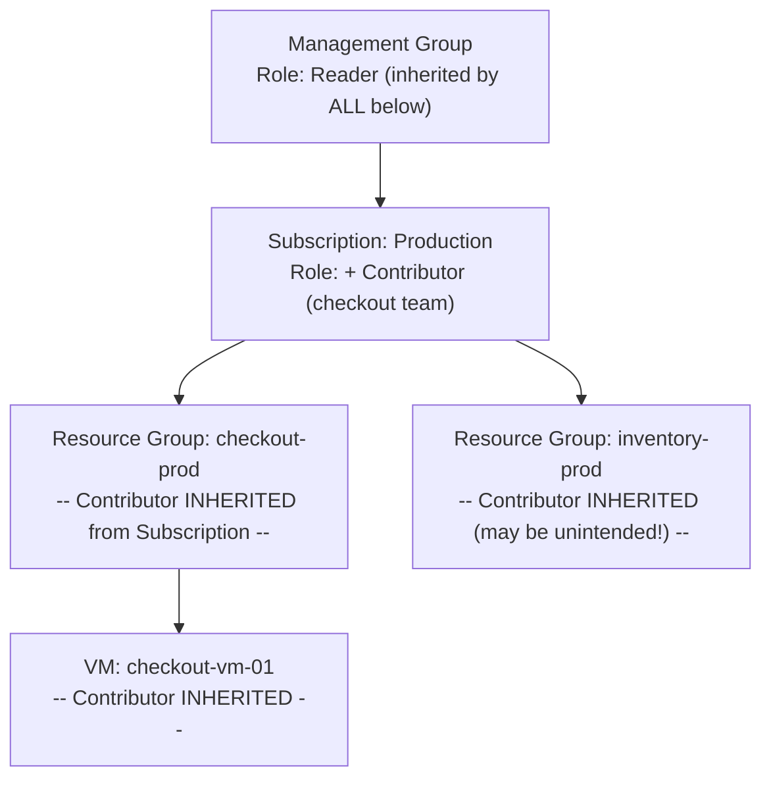
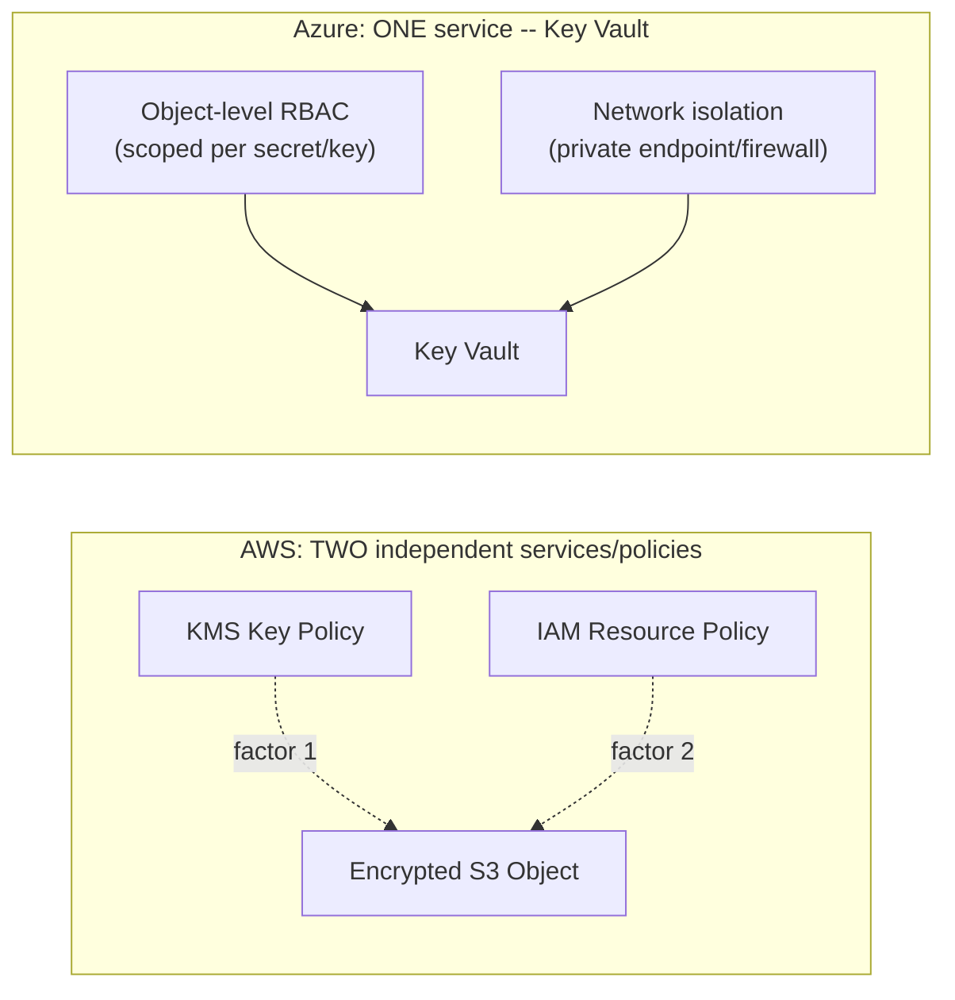

# Module 66 — Azure: IAM & Security — Entra ID, RBAC, Key Vault & Managed Identities

> Domain: Azure | Level: Beginner → Expert | Prerequisite: [[../21-AWS/02-IAM-Security-KMS-SecretsManager]] (this module mirrors that module's structure — Azure RBAC/Entra ID/Managed Identities/Key Vault against AWS IAM/STS/KMS/Secrets Manager — flagging genuine divergences rather than re-deriving IAM fundamentals), [[01-Compute-Networking-VNet-LoadBalancer-VMSS]] §2.2 (NSGs are the network-layer complement; this module covers the identity layer)

---

## 1. Fundamentals

### Why does a Principal Engineer need Azure IAM depth given Module 58 already established the identity-layer-vs-network-layer distinction generically?
The *principle* (identity-based access control is a distinct, necessary axis independent of network segmentation) is already established — what's genuinely new here is Azure's **structurally different implementation**: Azure RBAC is scope-hierarchical in a way AWS IAM is not (a single role assignment inherits down through Management Group → Subscription → Resource Group → Resource), Entra ID (formerly Azure AD) is simultaneously an identity provider *and* Azure's authorization backbone in a more unified way than AWS's separate IAM/Cognito split, and Managed Identities solve the exact problem AWS Roles-for-EC2/Lambda solve but with genuinely different mechanics (system-assigned vs. user-assigned, no equivalent to AWS's STS `AssumeRole` model at all) — a Principal Engineer must know precisely where these mechanics diverge, not just that "Azure has IAM too."

### Why does this matter?
Because Azure RBAC's hierarchical inheritance model (§2.1) is a genuinely different mental model from AWS's flatter, more explicit-attachment-per-resource approach — a Principal Engineer applying AWS-style "always attach permissions explicitly and narrowly to the specific resource" thinking without accounting for Azure's inheritance can either over-grant access accidentally (a broad role assignment at a high scope silently cascading down to every resource beneath it) or under-utilize a genuinely useful capability (deliberate, efficient scope-level permission management that AWS doesn't offer as directly).

### When does this matter?
Any Azure workload needing to control access between identities (human or workload) and resources — universally applicable, and specifically consequential for any organization operating across both AWS and Azure where IAM mental models transferring incorrectly (directly Module 65 §4's "false familiarity" risk pattern) is a genuine, recurring danger.

### How does it work (30,000-ft view)?
```
Entra ID (formerly Azure AD): Azure's identity provider AND the backbone Azure RBAC authorization
     is built on -- users, groups, service principals, all live here
RBAC Role Assignment: (Security Principal) + (Role Definition) + (Scope) -- scope INHERITS
     hierarchically (Mgmt Group -> Subscription -> Resource Group -> Resource) -- NO AWS
     equivalent to this cascading inheritance
Managed Identity: Azure's equivalent of an AWS instance/execution role -- a VM/Function/App
     Service can have an identity with NO credentials to manage at all (stronger than AWS's
     model in one specific way -- see §2.3)
Key Vault: Azure's KMS + Secrets Manager, COMBINED into one service (a genuine divergence --
     AWS splits these into two separate services)
```

---

## 2. Deep Dive

### 2.1 Azure RBAC's Hierarchical Scope Inheritance — the Single Most Consequential Divergence From AWS IAM
An Azure role assignment binds a **security principal** (a user, group, service principal, or managed identity) to a **role definition** (a set of permitted actions, analogous to an AWS IAM policy) at a **scope** — but unlike AWS, where a policy attached to a role applies only to that role and must be explicitly attached again for any broader or narrower reach, Azure scopes form a strict hierarchy (Management Group → Subscription → Resource Group → individual Resource) and a role assignment at any level **automatically inherits down** to everything beneath it — a Contributor role assigned at the Subscription level grants that access to every Resource Group and every resource within every Resource Group in that subscription, with no separate, explicit action required at each lower level. This is a genuine double-edged capability: it enables efficient, DRY permission management (grant once at the right scope, rather than repeating an identical role assignment across dozens of individual resources, an AWS-native anti-pattern this Azure model structurally avoids) — but it also means a role assignment made carelessly at too-high a scope silently and immediately grants access far beyond what might be visible when looking only at the specific resource in question, directly the Azure-specific version of Module 58 §4's over-permissioning incident, now caused by scope-level carelessness rather than wildcard-action carelessness.

### 2.2 Entra ID — Unified Identity Provider and Authorization Backbone
Entra ID (formerly Azure Active Directory) serves simultaneously as Azure's identity provider (authenticating users, supporting SSO/federation, MFA) and as the directory Azure RBAC's security principals are drawn from — this is architecturally more unified than AWS's model, where IAM (workload/resource authorization) and Cognito (customer-facing identity) are separate services with a narrower integration surface; Entra ID additionally underlies **Azure AD Conditional Access** (policies that can require MFA, block access from untrusted locations/devices, or require a compliant device — evaluated at authentication time, before RBAC's own resource-level authorization is even consulted), giving Azure a genuinely distinct, authentication-time policy layer with no precise single AWS equivalent (closest AWS analog: a combination of IAM policy conditions plus separate identity-provider-level MFA enforcement, not as unified a single control plane).

### 2.3 Managed Identities — System-Assigned vs. User-Assigned, and the Genuine Improvement Over AWS's Model in One Specific Way
A **System-Assigned Managed Identity** is created and tied to the lifecycle of a single specific resource (a VM, a Function App) — deleted automatically when that resource is deleted, with a 1:1 relationship; a **User-Assigned Managed Identity** is created as an independent Azure resource that can be assigned to multiple compute resources simultaneously, and persists independently of any single resource's lifecycle — this second option is a genuine capability with **no direct AWS equivalent**: AWS IAM roles for EC2/Lambda are conceptually similar to a user-assigned identity (an independent, reusable resource), but Azure's explicit system-vs-user-assigned distinction, with the system-assigned option's automatic lifecycle-binding, provides a cleaner default for the extremely common "this specific resource needs its own identity with no reuse or independent lifecycle management overhead" case, without requiring the operator to separately track and clean up an identity resource when its single associated compute resource is deleted (a real, if minor, operational-hygiene improvement AWS's flatter role model doesn't structurally provide).

### 2.4 Key Vault — KMS and Secrets Manager, Genuinely Combined Into One Service
This is a significant, consequential divergence: AWS splits encryption-key management (KMS) and credential/secret storage (Secrets Manager) into two separate services with two separate access-control models (Module 58 §2.5's two-factor KMS-plus-resource-IAM design) — Azure **Key Vault** combines both responsibilities into a single service, storing encryption keys, secrets (credentials, API keys), and certificates together, with a single, unified access-control model (Azure RBAC, or Key Vault's own legacy access-policy model) governing all three object types. This means the specific "two independent factors must both permit access" defense-in-depth reasoning Module 58 §2.5 established for AWS's KMS-plus-IAM split does **not** directly apply to Key Vault in the same two-service form — a Principal Engineer must instead achieve equivalent defense-in-depth within Key Vault's own model, primarily via granular, object-level (not vault-level) RBAC role assignments (scoping a specific identity's access to a specific secret/key/certificate, not blanket vault-wide access) and Key Vault's own network-isolation capabilities (private endpoints, firewall rules restricting which networks can reach the vault at all) as the additional, independent control layer, rather than relying on a second, structurally-separate service's independent policy the way AWS's model provides by default.

### 2.5 Service Principals and Workload Identity Federation — Azure's Cross-Boundary Access Equivalent
A **Service Principal** is the identity representation of an application/workload within Entra ID (roughly analogous to an AWS IAM Role intended for non-human/cross-account use) — critically, **Workload Identity Federation** (allowing an external identity provider, such as a GitHub Actions OIDC token or an AWS IAM role via cross-cloud federation, to obtain a Service Principal's Azure permissions without a long-lived, shared secret ever being exchanged) is Azure's direct structural equivalent to Module 58 §2.4's AWS cross-account `AssumeRole` pattern — both achieve the same underlying goal (temporary, federated trust without shared long-lived credentials crossing a boundary), but Azure's implementation is OIDC-federation-based rather than built on an AWS-STS-specific `AssumeRole` API, meaning the actual configuration mechanics (establishing federated credential trust between an external OIDC issuer and a specific Service Principal) are genuinely different in form even though the underlying security property achieved is the same.

### 2.6 Least Privilege in Azure — Custom Roles and Privileged Identity Management (PIM)
Azure's built-in roles (Owner, Contributor, Reader, and many service-specific roles) are frequently broader than a specific workload genuinely needs, making **custom role definitions** (scoped to exactly the specific actions required, directly Module 58 §2.3's least-privilege discipline) a common necessity rather than an edge case — additionally, Azure **Privileged Identity Management (PIM)** provides **just-in-time, time-bound role activation** (a user or service can be eligible for a privileged role but must explicitly activate it, for a limited duration, often with an approval workflow or MFA challenge, rather than holding the privileged permission continuously) — this is a materially different, and in some ways stronger, least-privilege mechanism than AWS's default model (where an assigned IAM permission is continuously active unless explicitly time-limited via a custom mechanism), directly reducing the standing-privilege attack surface for genuinely high-risk roles (a production database's Owner-equivalent access, for instance) without requiring a custom, hand-built time-limiting mechanism the way an equivalent AWS setup typically would.

---

## 3. Visual Architecture

### RBAC Hierarchical Scope Inheritance (§2.1)


### Key Vault's Combined Model vs. AWS's Split KMS/Secrets Manager (§2.4)


## 4. Production Example
**Scenario**: A platform team, migrating their AWS-based multi-service application to Azure, needed to grant their newly-formed "platform-ops" group broad operational access across all of their checkout-related infrastructure — reasoning by direct analogy to how they'd previously granted a shared IAM role scoped to a specific set of resource ARNs in AWS, an engineer assigned the group the **Contributor** role at the **Subscription** scope (reasoning, informally, "this covers everything checkout-related, and it's simpler than assigning it resource-by-resource") rather than at the specific Resource Group actually containing checkout's resources. **Investigation**: several weeks later, a routine access review (prompted by an unrelated compliance audit) discovered that the platform-ops group's Contributor access — assigned at the Subscription level — had silently cascaded down to **every** Resource Group in the subscription, including Resource Groups belonging to entirely unrelated teams (inventory, billing, a separate internal-tools project) that had been created *after* the original role assignment, inheriting the platform-ops group's broad access automatically and invisibly, with no additional action or notification at the time each new Resource Group was created. **Root cause**: the engineer's AWS-derived mental model (grant broadly once, resource-by-resource enumeration is tedious and best avoided) didn't account for Azure RBAC's automatic, silent, forward-inheriting nature (§2.1) — in AWS, an equivalently "broad" grant would have required an explicit, visible policy statement enumerating or wildcarding the intended resources, making the scope of the grant at least locally visible in the policy document itself; in Azure, the Subscription-scope assignment's downward reach wasn't visible anywhere in the checkout Resource Group's own configuration at all, since the grant lived entirely at a different, higher level in the hierarchy. **Fix**: reassigned the platform-ops group's Contributor role specifically at the `checkout-prod` Resource Group scope (matching the original intent precisely), removed the Subscription-level assignment entirely, and instituted a standing Azure Policy-driven and PIM-based practice: any role assignment at Subscription or Management Group scope now requires an explicit, documented justification and time-bound PIM activation (§2.6) rather than being permanently, silently active, specifically because high-scope assignments carry this much larger and less visible blast radius than an equivalent Resource-Group-or-lower assignment. **Lesson**: Azure RBAC's inheritance model is a genuine, structural capability difference from AWS IAM, not just a different UI for the same underlying concept — a security review process built entirely around AWS's flatter, per-resource-explicit-attachment mental model will systematically miss exactly this class of risk in Azure, because the risk literally doesn't exist in the same form in AWS's model to have built review habits around.

## 5. Best Practices
- Assign RBAC roles at the lowest scope that genuinely satisfies the requirement — never default to Subscription or Management Group scope for convenience without an explicit, deliberate reason (§4).
- Use custom role definitions scoped to exactly the actions a workload needs, rather than defaulting to broad built-in roles (Owner/Contributor) out of convenience (§2.6).
- Require PIM-based, time-bound, justified activation for any role assignment at Subscription-or-higher scope, given its substantially larger and less locally-visible blast radius (§4's fix).
- Use object-level (not vault-level) RBAC role assignments within Key Vault, and enable network isolation (private endpoints/firewall rules), to achieve defense-in-depth given Key Vault's combined KMS-plus-Secrets-Manager model (§2.4).
- Default to system-assigned Managed Identities for the common single-resource, no-reuse case, reserving user-assigned identities specifically for genuine multi-resource-sharing or independent-lifecycle requirements (§2.3).

## 6. Anti-patterns
- Assigning a broad role at Subscription or Management Group scope "for simplicity" without accounting for Azure RBAC's automatic, silent downward inheritance to every current and future resource beneath that scope (§4).
- Applying an AWS-derived "grant explicitly per-resource" security-review mental model to Azure without adjusting for the hierarchical-inheritance risk that has no AWS equivalent to have built review habits around.
- Relying on Key Vault's vault-wide access grant as if it provided the same two-independent-factor defense-in-depth as AWS's separate KMS-plus-IAM model, without additional object-level scoping or network isolation.
- Using built-in Owner/Contributor roles by default rather than defining custom, narrowly-scoped roles for workloads with clearly bounded, specific permission needs.
- Leaving high-privilege role assignments permanently, continuously active rather than using PIM's just-in-time activation for genuinely high-risk access.

---

## 10. Interview Questions

### Basic (10)
1. **Q: What is Entra ID?** **A:** Azure's identity provider and the directory backbone Azure RBAC's security principals are drawn from (formerly Azure Active Directory).
2. **Q: What are the three components of an Azure RBAC role assignment?** **A:** A security principal, a role definition, and a scope.
3. **Q: How does Azure RBAC scope inheritance work?** **A:** A role assignment at a given scope (Management Group, Subscription, Resource Group, or Resource) automatically inherits down to everything beneath it in that hierarchy.
4. **Q: What is the difference between a system-assigned and a user-assigned Managed Identity?** **A:** System-assigned is created and tied to a single resource's lifecycle (deleted automatically with it); user-assigned is an independent resource that can be shared across multiple compute resources.
5. **Q: What does Azure Key Vault combine that AWS splits into two separate services?** **A:** Encryption-key management (like KMS) and secret/credential storage (like Secrets Manager).
6. **Q: What is a Service Principal?** **A:** The identity representation of an application/workload within Entra ID, roughly analogous to an AWS IAM Role used for non-human access.
7. **Q: What is Workload Identity Federation?** **A:** A mechanism allowing an external identity provider to obtain a Service Principal's permissions via OIDC federation, without a long-lived shared secret.
8. **Q: What does Azure PIM provide?** **A:** Just-in-time, time-bound role activation, rather than continuously-active privileged permissions.
9. **Q: What does Conditional Access govern that RBAC does not?** **A:** The circumstances under which authentication itself succeeds (MFA, device compliance, trusted location) — evaluated before RBAC's resource-authorization layer.
10. **Q: What network-level control should be enabled by default on a Key Vault holding production secrets?** **A:** Private endpoints (or firewall rules) restricting which networks can reach the vault at all.

### Intermediate (10)
1. **Q: Why is Azure RBAC's scope inheritance described as "the single most consequential divergence" from AWS IAM?** **A:** It fundamentally changes how access grants must be reasoned about — a grant at a high scope has an automatic, forward-looking reach (including to resources created later) that AWS's flatter, explicit-per-resource-attachment model doesn't have an equivalent for, making naive AWS-derived review habits systematically miss this risk category.
2. **Q: Why did the §4 incident's over-broad access go undetected until a compliance-driven access review, rather than being caught earlier?** **A:** The Subscription-level assignment's downward reach wasn't visible anywhere in the checkout Resource Group's own configuration — it existed entirely at a different, higher level in the hierarchy, meaning anyone reviewing only the checkout Resource Group's own settings would see nothing amiss.
3. **Q: Why doesn't Key Vault's combined model automatically provide the same two-independent-factor defense-in-depth AWS's separate KMS/Secrets Manager split provides by default?** **A:** A single vault-wide RBAC grant in Key Vault can grant access to keys, secrets, and certificates together through one unified policy, whereas AWS structurally requires two separate policies (IAM plus KMS key policy) to both independently permit access — achieving equivalent depth in Key Vault requires deliberately using object-level scoping and network isolation as substitute independent layers.
4. **Q: Why is a system-assigned Managed Identity described as providing a "real, if minor, operational-hygiene improvement" over AWS's flatter role model?** **A:** Its lifecycle is automatically bound to its single associated resource — when that resource is deleted, the identity is automatically cleaned up too, removing the operational burden of separately tracking and deleting an orphaned identity resource, which AWS's model (where a role is always an independent resource requiring separate lifecycle management) doesn't provide by default.
5. **Q: Why does Conditional Access need to be treated as a necessary complement to RBAC rather than a redundant control?** **A:** RBAC governs what an already-authenticated identity is authorized to do; Conditional Access governs whether authentication itself succeeds under specific circumstances (MFA, device trust) — these are independent control points, and satisfying one doesn't address gaps addressable only by the other.
6. **Q: Why should PIM's approval workflow have a distinct "break-glass" emergency-access path rather than applying uniformly to every access request?** **A:** A uniform, friction-heavy approval workflow applied even to genuinely urgent, time-sensitive incident-response needs risks delaying critical access exactly when speed matters most — a separate, faster emergency path (with its own compensating audit controls) balances the security benefit of PIM against legitimate operational responsiveness needs.
7. **Q: Why is custom role definition described as "a common necessity rather than an edge case" in Azure specifically?** **A:** Azure's built-in roles (Owner, Contributor, Reader) are frequently broader than what a specific, narrowly-scoped workload actually needs, meaning relying on built-in roles by default for genuinely least-privilege-conscious access management routinely falls short, requiring custom definitions more often than an AWS-equivalent workflow might.
8. **Q: Why is Workload Identity Federation described as achieving "the same underlying security property" as AWS's AssumeRole despite genuinely different mechanics?** **A:** Both eliminate the need for a long-lived, shared secret to cross a trust boundary (an external system to an Azure Service Principal; one AWS account to another) by using short-lived, federated/assumed credentials instead — the specific configuration mechanism (OIDC federation vs. STS AssumeRole) differs, but the security goal and the resulting risk profile are equivalent.
9. **Q: Why must Key Vault throughput limits be capacity-planned similarly to Module 58's KMS rate-limit discussion?** **A:** Both are per-resource API call-rate ceilings that a high-throughput workload retrieving secrets/keys on every request (rather than caching) can exhaust, with the identical mitigation (in-memory caching for a bounded window) applying to both.
10. **Q: Why does the §4 incident's fix specifically require PIM-based justification for Subscription-or-higher-scope assignments, rather than simply "being more careful" going forward?** **A:** Relying on individual carefulness is the same unenforced-manual-diligence pattern this entire course has repeatedly identified as unreliable (Module 58 §4, Module 63 §4) — a structural requirement (mandatory justification plus time-bound PIM activation) converts the safeguard into something that doesn't depend on every future engineer independently remembering the risk.

### Advanced (10)
1. **Q: Diagnose the §4 incident from first principles, and design the specific automated Azure Policy or access-review mechanism that would have caught the over-broad Subscription-scope assignment before the unrelated compliance audit happened to surface it.**
   **A:** Root cause: an AWS-derived mental model didn't account for Azure RBAC's silent, forward-inheriting scope model, and no structural mechanism existed to flag high-scope assignments proactively. Fix: (1) an Azure Policy or Azure AD Access Reviews configuration that periodically (e.g., monthly) automatically flags every active role assignment at Subscription-or-higher scope for mandatory owner re-justification, converting an invisible, indefinitely-persisting grant into one requiring periodic active confirmation; (2) combined with PIM's mandatory time-bound activation (§4's actual fix) so such assignments aren't even continuously active by default — together, these ensure a high-scope grant is both time-bounded and periodically re-surfaced for review, rather than relying on an incidental, unrelated audit to ever notice it.
2. **Q: A team argues that since Azure RBAC's inheritance model requires fewer total role assignments to manage (grant once at a high scope, rather than repeating per-resource), it's a strictly more efficient and therefore better security model than AWS IAM's flatter, more explicit approach. Evaluate this claim.**
   **A:** Push back — efficiency of *administration* and clarity of *risk visibility* are different, sometimes-competing properties; AWS's more verbose, explicit-per-resource model is more tedious to administer at scale, but that same verbosity makes each individual grant's scope locally visible and auditable at the point where it's applied — Azure's efficiency gain comes specifically at the cost of the exact visibility gap that caused §4's incident (a grant's full reach isn't visible from the affected resource's own configuration) — "more efficient to administer" and "produces better security outcomes by default" are not the same claim, and Azure's model requires *additional* deliberate tooling (Access Reviews, PIM, Advanced Q1's periodic re-justification) to recover the visibility AWS's flatter model provides more inherently.
3. **Q: Design the specific pre-production or periodic validation practice that would verify an organization's actual, effective Azure RBAC permissions match its intended least-privilege design, given that inheritance makes "intended vs. actual" drift easy to introduce silently.**
   **A:** Implement an automated tool (Azure's own IAM/RBAC reporting APIs, or a third-party cloud security posture management tool) that computes each identity's **effective permissions** at each specific resource (accounting for all inherited assignments from every level above it in the hierarchy, not just directly-attached ones) and diffs this against a documented, intended-permissions baseline per resource/Resource Group — flagging any resource where effective permissions exceed the documented intent, directly generalizing Module 58 §Advanced Q1's automated-policy-linting pattern to account for Azure's specifically inheritance-driven drift risk, which a simple "list directly-attached role assignments" check would miss entirely.
4. **Q: Explain why the §4 incident's core lesson — "a security review process built around one cloud's mental model can systematically miss a risk category unique to another cloud" — generalizes beyond IAM specifically, and identify one other place in this course's AWS/Azure comparative material where the same generalized risk applies.**
   **A:** The generalized principle: any security or operational review checklist implicitly encodes assumptions about the specific platform's failure modes it was designed against, and porting that checklist to a structurally different platform without explicit adaptation leaves genuine gaps wherever the platforms diverge, precisely because the checklist has no prompt to consider a failure mode it was never designed to catch. A direct parallel: Module 65 §4's Availability Zones vs. Availability Sets incident — a resilience-review checklist built around AWS's single-tier AZ concept had no natural prompt to ask "which specific Azure mechanism achieves this," the identical structural risk (false familiarity, checklist-transfer blindness) now recurring in the IAM domain instead of the resilience domain.
5. **Q: A workload needs a Function App to access both a Key Vault secret and a specific Storage Account, with no other Azure resources reachable by that identity. Design the specific Managed Identity and RBAC configuration.**
   **A:** Provision a system-assigned Managed Identity on the Function App (§2.3's default choice, since there's no multi-resource-sharing requirement), then create two narrowly-scoped role assignments: a Key Vault-specific role (e.g., "Key Vault Secrets User," an object-level or vault-level built-in role, ideally further scoped to the specific secret if Key Vault's access-control granularity supports it) at the specific Key Vault's scope only, and "Storage Blob Data Reader/Contributor" (as needed) at the specific Storage Account's scope only — critically, neither assignment should be made at the Resource Group or Subscription level even though the Function App happens to reside in a Resource Group containing other resources, directly avoiding §4's exact over-broad-scope mistake for this new, narrower use case.
6. **Q: Critique the following claim: "Since we've enabled Conditional Access requiring MFA for all Azure sign-ins, we no longer need to worry about the RBAC over-permissioning risk described in §4, since an attacker would need to pass MFA first anyway."**
   **A:** Incomplete — Conditional Access and RBAC address different threat scenarios: MFA substantially raises the bar against *external credential-compromise* attacks (a phished password alone is insufficient), but does nothing to reduce the blast radius if a **legitimate, already-authenticated** member of the platform-ops group (who genuinely passes MFA every time, as intended) makes an unintended or malicious action within their own overly-broad, silently-inherited permissions — §4's actual incident was about the *scope* of a legitimate group's access being larger than intended, a problem MFA doesn't touch at all; both controls are necessary, addressing genuinely independent risk dimensions (Module 57 §8's recurring two-independent-axes principle).
7. **Q: Design an approach for migrating an organization's existing, sprawling set of built-in-role (Owner/Contributor) RBAC assignments toward custom, least-privilege roles without a risky, all-at-once cutover that could break legitimate access.**
   **A:** Apply the same incremental, Strangler-Fig-style migration this course has established repeatedly (Module 49, Module 60 §Advanced Q3): (1) for each broad existing assignment, use Azure's activity-log/access-analysis tooling to determine the *actual* set of actions that identity has genuinely exercised over a representative observation period; (2) define a custom role covering exactly that observed action set, with reasonable headroom; (3) assign the new custom role *alongside* the existing broad role (not replacing it yet) and monitor for any denied-action signal the custom role doesn't cover; (4) only after a validated observation period with no gaps, remove the original broad built-in-role assignment — each step independently verifiable and reversible, directly reusing this course's now-familiar zero-downtime migration pattern for the IAM-permission-tightening use case specifically.
8. **Q: A Principal Engineer discovers that a Key Vault's network firewall is correctly configured to restrict access to only the organization's VNets, but a specific secret within that vault is still readable by a broader set of identities than intended, because RBAC was granted at the vault level rather than the individual-secret level. Explain why the network control didn't prevent this over-exposure.**
   **A:** Network isolation (the firewall/private-endpoint restriction) and identity-based authorization (RBAC) are independent control axes (§8's recurring principle) — the network control correctly restricts *which network paths* can reach the vault at all, but says nothing about *which already-network-permitted identities* are authorized to read *which specific objects* within it; a vault-level (rather than object-level) RBAC grant means every identity permitted to reach the vault over the network, and holding that vault-level role, can read every secret in it — the network control and the object-level-scoping gap are two entirely separate, both-necessary fixes, and correctly implementing one doesn't compensate for a gap in the other.
9. **Q: Design the specific PIM policy configuration for a production database's highest-privilege role, balancing genuine emergency-access need against the standing-privilege risk PIM is designed to reduce.**
   **A:** Configure the privileged role as **PIM-eligible** (not permanently active) for the on-call engineering rotation, requiring: MFA re-challenge at activation time, a maximum activation duration matched to a typical incident-response window (e.g., 4 hours, auto-expiring rather than requiring manual deactivation), and an activation-justification note logged and automatically routed to a security/audit channel for post-hoc review (not a blocking pre-approval, which would defeat genuine emergency responsiveness) — this specifically balances Advanced Q9's/§9's emergency-responsiveness concern (no blocking approval delay) against PIM's core value (no standing, continuously-active high-privilege access, and a durable audit trail of every activation for after-the-fact review).
10. **Q: As a Principal Engineer establishing Azure IAM standards for an organization already operating on AWS, design the specific set of standing architectural reviews and automated checks (synthesizing this entire module) you would require, explicitly addressing where Azure-specific risks require genuinely new checks beyond what the AWS IAM standards (Module 58 §Advanced Q10) already cover.**
    **A:** (1) Mandatory effective-permissions computation and drift detection accounting for RBAC inheritance (Advanced Q3) — a genuinely new check with no AWS equivalent, since AWS's flatter model doesn't have this specific drift risk. (2) Mandatory periodic re-justification (Azure AD Access Reviews) for any Subscription-or-higher-scope role assignment (Advanced Q1) — again, addressing a risk unique to Azure's inheritance model. (3) Mandatory PIM time-bound activation for any high-privilege role, with a defined break-glass emergency path (Advanced Q9) — stronger than Module 58's AWS equivalent, since AWS has no native PIM-equivalent mechanism to require. (4) Mandatory object-level (not vault-level) Key Vault RBAC scoping, paired with mandatory private-endpoint network isolation (Advanced Q8) — the Azure-specific recovery of the two-factor defense-in-depth AWS's split KMS/Secrets Manager model provides more natively. (5) Mandatory custom-role migration review for any workload still using broad built-in roles (Advanced Q7). This standard set explicitly extends, rather than merely duplicates, Module 58's AWS IAM governance program — items (1) and (2) specifically exist *because* Azure RBAC's inheritance model introduces a risk category AWS's flatter model structurally doesn't have.

---

## 11. Coding Exercises

### Easy — Scoped RBAC assignment at Resource Group level, NOT Subscription (§2.1, §4's fix)
```hcl
resource "azurerm_role_assignment" "platform_ops_checkout" {
  scope                = azurerm_resource_group.checkout_prod.id   # Resource Group scope --
                                                                       # NOT azurerm_subscription (§4's exact fix)
  role_definition_name = "Contributor"
  principal_id          = data.azuread_group.platform_ops.object_id
}
```

### Medium — System-assigned Managed Identity with object-scoped Key Vault access (§2.3, §2.4, §Advanced Q5)
```hcl
resource "azurerm_linux_function_app" "checkout_processor" {
  name = "checkout-processor-func"
  identity { type = "SystemAssigned" }   # lifecycle automatically bound to THIS function app (§2.3)
}

resource "azurerm_role_assignment" "func_kv_secret_access" {
  scope                = azurerm_key_vault_secret.db_connection_string.resource_versionless_id  # OBJECT-level,
                                                                                                      # not vault-wide (§2.4)
  role_definition_name = "Key Vault Secrets User"
  principal_id          = azurerm_linux_function_app.checkout_processor.identity[0].principal_id
}
```

### Hard — Custom role definition scoped to exactly what a workload needs (§2.6)
```json
{
  "Name": "Checkout-ReadOnly-Diagnostics",
  "IsCustom": true,
  "Actions": [
    "Microsoft.Compute/virtualMachineScaleSets/read",
    "Microsoft.Insights/metrics/read",
    "Microsoft.Insights/logs/read"
  ],
  "NotActions": [],
  "AssignableScopes": [
    "/subscriptions/{sub-id}/resourceGroups/checkout-prod"
  ]
}
```
```hcl
resource "azurerm_role_definition" "checkout_diagnostics" {
  name  = "Checkout-ReadOnly-Diagnostics"
  scope = azurerm_resource_group.checkout_prod.id
  permissions {
    actions = [
      "Microsoft.Compute/virtualMachineScaleSets/read",
      "Microsoft.Insights/metrics/read",
      "Microsoft.Insights/logs/read"
    ]
  }
  # NOT "Contributor" or "Reader" -- narrowly scoped to EXACTLY the diagnostics-read
  # access an on-call engineer needs (§2.6, §Advanced Q10's custom-role-migration standard)
}
```

### Expert — PIM-eligible role activation with break-glass considerations (§Advanced Q9)
```json
{
  "roleDefinitionId": "/subscriptions/{sub-id}/providers/Microsoft.Authorization/roleDefinitions/{owner-role-id}",
  "principalId": "{oncall-rotation-group-id}",
  "requestType": "AdminAssign",
  "scheduleInfo": {
    "startDateTime": "2026-07-16T00:00:00Z",
    "expiration": { "type": "NoExpiration" }
  },
  "scope": "/subscriptions/{sub-id}/resourceGroups/checkout-prod"
}
```
```csharp
// Activation request (made BY the on-call engineer at time of need, not pre-approved) --
// auto-expires after 4 hours, MFA re-challenge required, justification LOGGED not BLOCKED (§Advanced Q9)
var activationRequest = new PimActivationRequest
{
    RoleAssignmentScheduleRequestType = "SelfActivate",
    Justification = "Incident INC-4471: production checkout latency spike, need DB diagnostic access",
    ScheduleInfo = new ScheduleInfo { Duration = TimeSpan.FromHours(4) },  // AUTO-EXPIRES -- no manual deactivation needed
    TicketInfo = new TicketInfo { TicketNumber = "INC-4471", TicketSystem = "PagerDuty" }
};
await _pimClient.ActivateRoleAsync(activationRequest);
// Justification + ticket reference auto-routed to security audit channel for POST-HOC review (§Advanced Q9)
```

---

## 12–17. System Design / LLD / Debugging / Decision / Case Study / Principal

*(§4's incident, the four §11 exercises, and the Advanced-tier Q&A — especially Advanced Q1's effective-permissions drift detection, Advanced Q7's zero-downtime custom-role migration, and Advanced Q10's Azure-specific governance additions beyond Module 58's AWS baseline — collectively constitute this module's system-design, debugging, and Principal-Engineer-level content.)*

## 18. Revision
**Key takeaways**: Azure RBAC's hierarchical scope inheritance is the single most consequential structural divergence from AWS IAM covered in this module — a role assignment at a high scope silently and automatically cascades to everything beneath it, including resources created later, with no local visibility at the affected resource itself, making an AWS-derived "check each resource's explicit attachments" review habit systematically insufficient (§4). Entra ID unifies identity provisioning and RBAC's authorization backbone more tightly than AWS's separate IAM/Cognito split, and Conditional Access provides a genuinely distinct authentication-time policy layer complementing (not duplicating) RBAC's resource-authorization-time layer. Key Vault's combined KMS-plus-Secrets-Manager model requires deliberately recreating AWS's two-factor defense-in-depth via object-level RBAC scoping and network isolation, rather than inheriting it automatically from a two-service split. Managed Identities and Workload Identity Federation solve the same problems as AWS instance/execution roles and cross-account AssumeRole, respectively, with genuinely different mechanics worth knowing precisely rather than assuming naive equivalence. PIM's just-in-time activation model has no direct AWS-native equivalent and represents a materially stronger default least-privilege posture for high-risk roles, at the cost of requiring an explicit break-glass path for genuine emergency responsiveness.

---

**Next**: Continuing to Module 67 — Azure: Storage (Blob Storage, Disk Storage, Files, redundancy tiers LRS/ZRS/GRS), continuing the `22-Azure` domain and mirroring Module 59's AWS storage structure.
