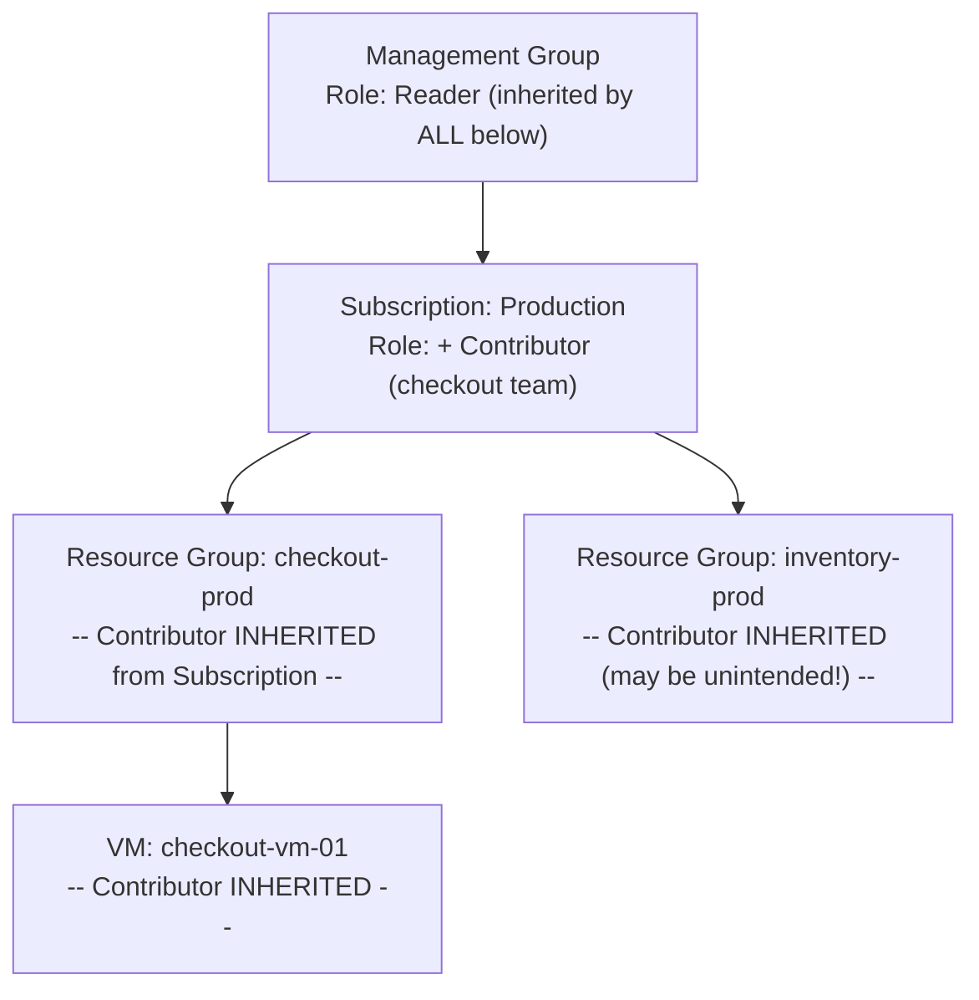
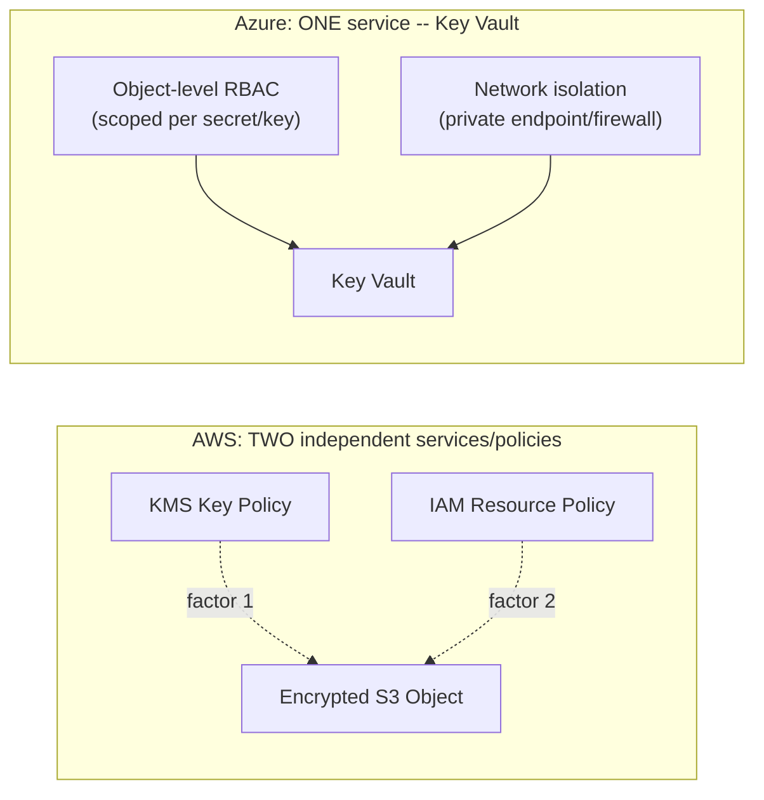
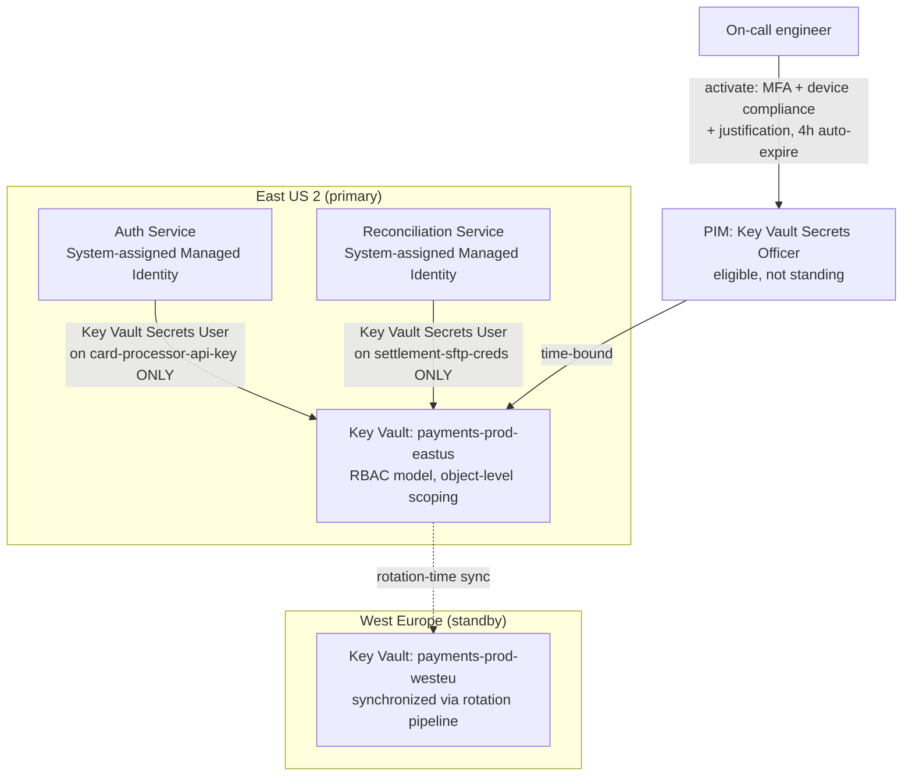
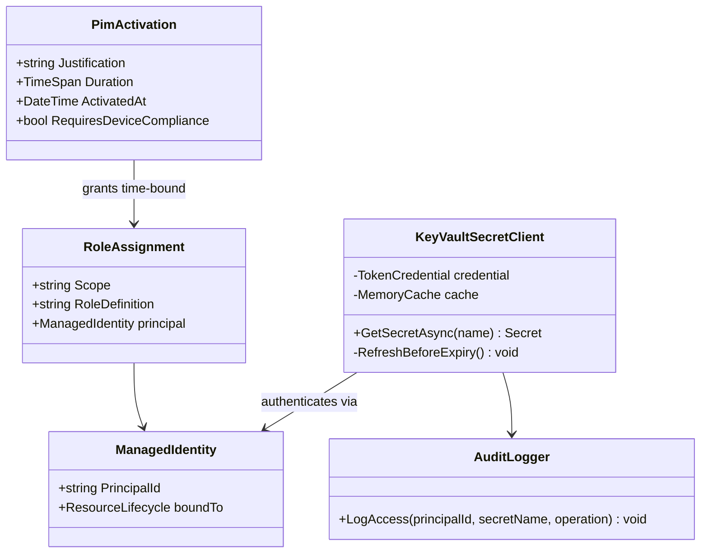
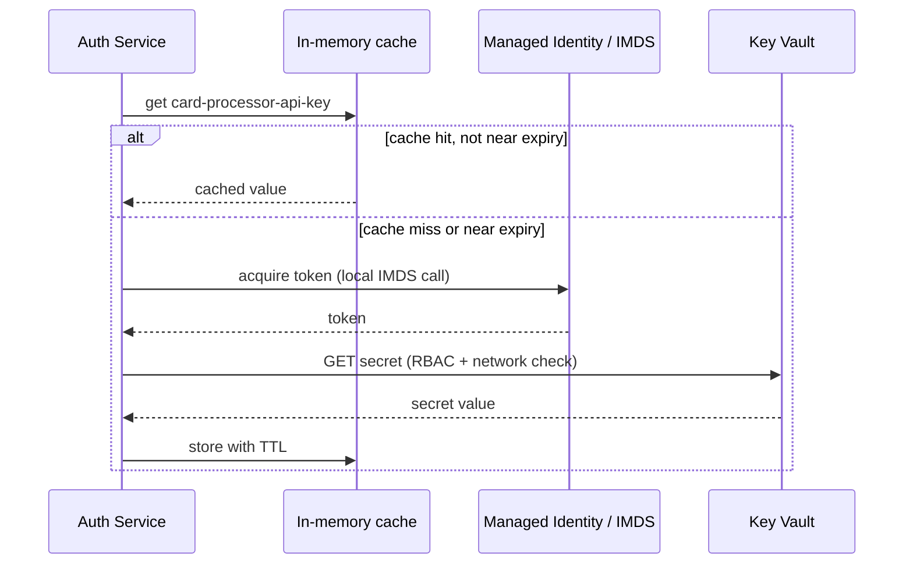

# Module 66 — Azure: IAM & Security — Entra ID, RBAC, Key Vault & Managed Identities

> Domain: Azure | Level: Beginner → Expert | Prerequisite: [[../21-AWS/02-IAM-Security-KMS-SecretsManager]] (this module mirrors that module's structure — Azure RBAC/Entra ID/Managed Identities/Key Vault against AWS IAM/STS/KMS/Secrets Manager — flagging genuine divergences rather than re-deriving IAM fundamentals), [[01-Compute-Networking-VNet-LoadBalancer-VMSS]] (NSGs are the network-layer complement; this module covers the identity layer)

---

## 1. Fundamentals

### Why does a Principal Engineer need Azure IAM depth given already established the identity-layer-vs-network-layer distinction generically?
The *principle* (identity-based access control is a distinct, necessary axis independent of network segmentation) is already established — what's genuinely new here is Azure's **structurally different implementation**: Azure RBAC is scope-hierarchical in a way AWS IAM is not (a single role assignment inherits down through Management Group → Subscription → Resource Group → Resource), Entra ID (formerly Azure AD) is simultaneously an identity provider *and* Azure's authorization backbone in a more unified way than AWS's separate IAM/Cognito split, and Managed Identities solve the exact problem AWS Roles-for-EC2/Lambda solve but with genuinely different mechanics (system-assigned vs. user-assigned, no equivalent to AWS's STS `AssumeRole` model at all) — a Principal Engineer must know precisely where these mechanics diverge, not just that "Azure has IAM too."

### Why does this matter?
Because Azure RBAC's hierarchical inheritance model is a genuinely different mental model from AWS's flatter, more explicit-attachment-per-resource approach — a Principal Engineer applying AWS-style "always attach permissions explicitly and narrowly to the specific resource" thinking without accounting for Azure's inheritance can either over-grant access accidentally (a broad role assignment at a high scope silently cascading down to every resource beneath it) or under-utilize a genuinely useful capability (deliberate, efficient scope-level permission management that AWS doesn't offer as directly).

### When does this matter?
Any Azure workload needing to control access between identities (human or workload) and resources — universally applicable, and specifically consequential for any organization operating across both AWS and Azure where IAM mental models transferring incorrectly (directly the "false familiarity" risk pattern) is a genuine, recurring danger.

### How does it work (30,000-ft view)?
```
Entra ID (formerly Azure AD): Azure's identity provider AND the backbone Azure RBAC authorization
 is built on -- users, groups, service principals, all live here
RBAC Role Assignment: (Security Principal) + (Role Definition) + (Scope) -- scope INHERITS
 hierarchically (Mgmt Group -> Subscription -> Resource Group -> Resource) -- NO AWS
 equivalent to this cascading inheritance
Managed Identity: Azure's equivalent of an AWS instance/execution role -- a VM/Function/App
 Service can have an identity with NO credentials to manage at all (stronger than AWS's
 model in one specific way --)
Key Vault: Azure's KMS + Secrets Manager, COMBINED into one service (a genuine divergence --
 AWS splits these into two separate services)
```

---

## 2. Deep Dive

### 2.1 Azure RBAC's Hierarchical Scope Inheritance — the Single Most Consequential Divergence From AWS IAM
An Azure role assignment binds a **security principal** (a user, group, service principal, or managed identity) to a **role definition** (a set of permitted actions, analogous to an AWS IAM policy) at a **scope** — but unlike AWS, where a policy attached to a role applies only to that role and must be explicitly attached again for any broader or narrower reach, Azure scopes form a strict hierarchy (Management Group → Subscription → Resource Group → individual Resource) and a role assignment at any level **automatically inherits down** to everything beneath it — a Contributor role assigned at the Subscription level grants that access to every Resource Group and every resource within every Resource Group in that subscription, with no separate, explicit action required at each lower level. This is a genuine double-edged capability: it enables efficient, DRY permission management (grant once at the right scope, rather than repeating an identical role assignment across dozens of individual resources, an AWS-native anti-pattern this Azure model structurally avoids) — but it also means a role assignment made carelessly at too-high a scope silently and immediately grants access far beyond what might be visible when looking only at the specific resource in question, directly the Azure-specific version of the over-permissioning incident, now caused by scope-level carelessness rather than wildcard-action carelessness.

### 2.2 Entra ID — Unified Identity Provider and Authorization Backbone
Entra ID (formerly Azure Active Directory) serves simultaneously as Azure's identity provider (authenticating users, supporting SSO/federation, MFA) and as the directory Azure RBAC's security principals are drawn from — this is architecturally more unified than AWS's model, where IAM (workload/resource authorization) and Cognito (customer-facing identity) are separate services with a narrower integration surface; Entra ID additionally underlies **Azure AD Conditional Access** (policies that can require MFA, block access from untrusted locations/devices, or require a compliant device — evaluated at authentication time, before RBAC's own resource-level authorization is even consulted), giving Azure a genuinely distinct, authentication-time policy layer with no precise single AWS equivalent (closest AWS analog: a combination of IAM policy conditions plus separate identity-provider-level MFA enforcement, not as unified a single control plane).

### 2.3 Managed Identities — System-Assigned vs. User-Assigned, and the Genuine Improvement Over AWS's Model in One Specific Way
A **System-Assigned Managed Identity** is created and tied to the lifecycle of a single specific resource (a VM, a Function App) — deleted automatically when that resource is deleted, with a 1:1 relationship; a **User-Assigned Managed Identity** is created as an independent Azure resource that can be assigned to multiple compute resources simultaneously, and persists independently of any single resource's lifecycle — this second option is a genuine capability with **no direct AWS equivalent**: AWS IAM roles for EC2/Lambda are conceptually similar to a user-assigned identity (an independent, reusable resource), but Azure's explicit system-vs-user-assigned distinction, with the system-assigned option's automatic lifecycle-binding, provides a cleaner default for the extremely common "this specific resource needs its own identity with no reuse or independent lifecycle management overhead" case, without requiring the operator to separately track and clean up an identity resource when its single associated compute resource is deleted (a real, if minor, operational-hygiene improvement AWS's flatter role model doesn't structurally provide).

### 2.4 Key Vault — KMS and Secrets Manager, Genuinely Combined Into One Service
This is a significant, consequential divergence: AWS splits encryption-key management (KMS) and credential/secret storage (Secrets Manager) into two separate services with two separate access-control models (the two-factor KMS-plus-resource-IAM design) — Azure **Key Vault** combines both responsibilities into a single service, storing encryption keys, secrets (credentials, API keys), and certificates together, with a single, unified access-control model (Azure RBAC, or Key Vault's own legacy access-policy model) governing all three object types. This means the specific "two independent factors must both permit access" defense-in-depth reasoning established for AWS's KMS-plus-IAM split does **not** directly apply to Key Vault in the same two-service form — a Principal Engineer must instead achieve equivalent defense-in-depth within Key Vault's own model, primarily via granular, object-level (not vault-level) RBAC role assignments (scoping a specific identity's access to a specific secret/key/certificate, not blanket vault-wide access) and Key Vault's own network-isolation capabilities (private endpoints, firewall rules restricting which networks can reach the vault at all) as the additional, independent control layer, rather than relying on a second, structurally-separate service's independent policy the way AWS's model provides by default.

### 2.5 Service Principals and Workload Identity Federation — Azure's Cross-Boundary Access Equivalent
A **Service Principal** is the identity representation of an application/workload within Entra ID (roughly analogous to an AWS IAM Role intended for non-human/cross-account use) — critically, **Workload Identity Federation** (allowing an external identity provider, such as a GitHub Actions OIDC token or an AWS IAM role via cross-cloud federation, to obtain a Service Principal's Azure permissions without a long-lived, shared secret ever being exchanged) is Azure's direct structural equivalent to the AWS cross-account `AssumeRole` pattern — both achieve the same underlying goal (temporary, federated trust without shared long-lived credentials crossing a boundary), but Azure's implementation is OIDC-federation-based rather than built on an AWS-STS-specific `AssumeRole` API, meaning the actual configuration mechanics (establishing federated credential trust between an external OIDC issuer and a specific Service Principal) are genuinely different in form even though the underlying security property achieved is the same.

### 2.6 Least Privilege in Azure — Custom Roles and Privileged Identity Management (PIM)
Azure's built-in roles (Owner, Contributor, Reader, and many service-specific roles) are frequently broader than a specific workload genuinely needs, making **custom role definitions** (scoped to exactly the specific actions required, directly the least-privilege discipline) a common necessity rather than an edge case — additionally, Azure **Privileged Identity Management (PIM)** provides **just-in-time, time-bound role activation** (a user or service can be eligible for a privileged role but must explicitly activate it, for a limited duration, often with an approval workflow or MFA challenge, rather than holding the privileged permission continuously) — this is a materially different, and in some ways stronger, least-privilege mechanism than AWS's default model (where an assigned IAM permission is continuously active unless explicitly time-limited via a custom mechanism), directly reducing the standing-privilege attack surface for genuinely high-risk roles (a production database's Owner-equivalent access, for instance) without requiring a custom, hand-built time-limiting mechanism the way an equivalent AWS setup typically would.

---

## 3. Visual Architecture

### RBAC Hierarchical Scope Inheritance

```mermaid
graph TB
 MG["Management Group<br/>Role: Reader (inherited by ALL below)"] --> Sub["Subscription: Production<br/>Role: + Contributor (checkout team)"]
 Sub --> RG1["Resource Group: checkout-prod<br/>-- Contributor INHERITED from Subscription --"]
 Sub --> RG2["Resource Group: inventory-prod<br/>-- Contributor INHERITED (may be unintended!) --"]
 RG1 --> Res1["VM: checkout-vm-01<br/>-- Contributor INHERITED --"]
```

### Key Vault's Combined Model vs. AWS's Split KMS/Secrets Manager

```mermaid
graph LR
 subgraph "AWS: TWO independent services/policies"
 KMS[KMS Key Policy] -.->|"factor 1"| S3Data[Encrypted S3 Object]
 IAM[IAM Resource Policy] -.->|"factor 2"| S3Data
 end
 subgraph "Azure: ONE service -- Key Vault"
 RBAC["Object-level RBAC<br/>(scoped per secret/key)"] --> KV[Key Vault]
 NetIso["Network isolation<br/>(private endpoint/firewall)"] --> KV
 end
```

## 4. Production Example
**Scenario**: A platform team, migrating their AWS-based multi-service application to Azure, needed to grant their newly-formed "platform-ops" group broad operational access across all of their checkout-related infrastructure — reasoning by direct analogy to how they'd previously granted a shared IAM role scoped to a specific set of resource ARNs in AWS, an engineer assigned the group the **Contributor** role at the **Subscription** scope (reasoning, informally, "this covers everything checkout-related, and it's simpler than assigning it resource-by-resource") rather than at the specific Resource Group actually containing checkout's resources. **Investigation**: several weeks later, a routine access review (prompted by an unrelated compliance audit) discovered that the platform-ops group's Contributor access — assigned at the Subscription level — had silently cascaded down to **every** Resource Group in the subscription, including Resource Groups belonging to entirely unrelated teams (inventory, billing, a separate internal-tools project) that had been created *after* the original role assignment, inheriting the platform-ops group's broad access automatically and invisibly, with no additional action or notification at the time each new Resource Group was created. **Root cause**: the engineer's AWS-derived mental model (grant broadly once, resource-by-resource enumeration is tedious and best avoided) didn't account for Azure RBAC's automatic, silent, forward-inheriting nature — in AWS, an equivalently "broad" grant would have required an explicit, visible policy statement enumerating or wildcarding the intended resources, making the scope of the grant at least locally visible in the policy document itself; in Azure, the Subscription-scope assignment's downward reach wasn't visible anywhere in the checkout Resource Group's own configuration at all, since the grant lived entirely at a different, higher level in the hierarchy. **Fix**: reassigned the platform-ops group's Contributor role specifically at the `checkout-prod` Resource Group scope (matching the original intent precisely), removed the Subscription-level assignment entirely, and instituted a standing Azure Policy-driven and PIM-based practice: any role assignment at Subscription or Management Group scope now requires an explicit, documented justification and time-bound PIM activation rather than being permanently, silently active, specifically because high-scope assignments carry this much larger and less visible blast radius than an equivalent Resource-Group-or-lower assignment. **Lesson**: Azure RBAC's inheritance model is a genuine, structural capability difference from AWS IAM, not just a different UI for the same underlying concept — a security review process built entirely around AWS's flatter, per-resource-explicit-attachment mental model will systematically miss exactly this class of risk in Azure, because the risk literally doesn't exist in the same form in AWS's model to have built review habits around.
## 10. Interview Questions

### Basic (10)
1. **Q: What is Entra ID?** **A:** Azure's identity provider and the directory backbone Azure RBAC's security principals are drawn from (formerly Azure Active Directory).
2. **Q: What are the three components of an Azure RBAC role assignment?** **A:** A security principal, a role definition, and a scope.
3. **Q: How does Azure RBAC scope inheritance work?** **A:** A role assignment at a given scope (Management Group, Subscription, Resource Group, or Resource) automatically inherits down to everything beneath it in that hierarchy.
4. **Q: What is the difference between a system-assigned and a user-assigned Managed Identity?** **A:** System-assigned is created and tied to a single resource's lifecycle (deleted automatically with it); user-assigned is an independent resource that can be shared across multiple compute resources.
5. **Q: What does Azure Key Vault combine that AWS splits into two separate services?** **A:** Encryption-key management (like KMS) and secret/credential storage (like Secrets Manager).
6. **Q: What is a Service Principal?** **A:** The identity representation of an application/workload within Entra ID, roughly analogous to an AWS IAM Role used for non-human access.
7. **Q: What is Workload Identity Federation?** **A:** A mechanism allowing an external identity provider to obtain a Service Principal's permissions via OIDC federation, without a long-lived shared secret.
8. **Q: What does Azure PIM provide?** **A:** Just-in-time, time-bound role activation, rather than continuously-active privileged permissions.
9. **Q: What does Conditional Access govern that RBAC does not?** **A:** The circumstances under which authentication itself succeeds (MFA, device compliance, trusted location) — evaluated before RBAC's resource-authorization layer.
10. **Q: What network-level control should be enabled by default on a Key Vault holding production secrets?** **A:** Private endpoints (or firewall rules) restricting which networks can reach the vault at all.

### Intermediate (10)
1. **Q: Why is Azure RBAC's scope inheritance described as "the single most consequential divergence" from AWS IAM?** **A:** It fundamentally changes how access grants must be reasoned about — a grant at a high scope has an automatic, forward-looking reach (including to resources created later) that AWS's flatter, explicit-per-resource-attachment model doesn't have an equivalent for, making naive AWS-derived review habits systematically miss this risk category.
2. **Q: Why did the incident's over-broad access go undetected until a compliance-driven access review, rather than being caught earlier?** **A:** The Subscription-level assignment's downward reach wasn't visible anywhere in the checkout Resource Group's own configuration — it existed entirely at a different, higher level in the hierarchy, meaning anyone reviewing only the checkout Resource Group's own settings would see nothing amiss.
3. **Q: Why doesn't Key Vault's combined model automatically provide the same two-independent-factor defense-in-depth AWS's separate KMS/Secrets Manager split provides by default?** **A:** A single vault-wide RBAC grant in Key Vault can grant access to keys, secrets, and certificates together through one unified policy, whereas AWS structurally requires two separate policies (IAM plus KMS key policy) to both independently permit access — achieving equivalent depth in Key Vault requires deliberately using object-level scoping and network isolation as substitute independent layers.
4. **Q: Why is a system-assigned Managed Identity described as providing a "real, if minor, operational-hygiene improvement" over AWS's flatter role model?** **A:** Its lifecycle is automatically bound to its single associated resource — when that resource is deleted, the identity is automatically cleaned up too, removing the operational burden of separately tracking and deleting an orphaned identity resource, which AWS's model (where a role is always an independent resource requiring separate lifecycle management) doesn't provide by default.
5. **Q: Why does Conditional Access need to be treated as a necessary complement to RBAC rather than a redundant control?** **A:** RBAC governs what an already-authenticated identity is authorized to do; Conditional Access governs whether authentication itself succeeds under specific circumstances (MFA, device trust) — these are independent control points, and satisfying one doesn't address gaps addressable only by the other.
6. **Q: Why should PIM's approval workflow have a distinct "break-glass" emergency-access path rather than applying uniformly to every access request?** **A:** A uniform, friction-heavy approval workflow applied even to genuinely urgent, time-sensitive incident-response needs risks delaying critical access exactly when speed matters most — a separate, faster emergency path (with its own compensating audit controls) balances the security benefit of PIM against legitimate operational responsiveness needs.
7. **Q: Why is custom role definition described as "a common necessity rather than an edge case" in Azure specifically?** **A:** Azure's built-in roles (Owner, Contributor, Reader) are frequently broader than what a specific, narrowly-scoped workload actually needs, meaning relying on built-in roles by default for genuinely least-privilege-conscious access management routinely falls short, requiring custom definitions more often than an AWS-equivalent workflow might.
8. **Q: Why is Workload Identity Federation described as achieving "the same underlying security property" as AWS's AssumeRole despite genuinely different mechanics?** **A:** Both eliminate the need for a long-lived, shared secret to cross a trust boundary (an external system to an Azure Service Principal; one AWS account to another) by using short-lived, federated/assumed credentials instead — the specific configuration mechanism (OIDC federation vs. STS AssumeRole) differs, but the security goal and the resulting risk profile are equivalent.
9. **Q: Why must Key Vault throughput limits be capacity-planned similarly to the KMS rate-limit discussion?** **A:** Both are per-resource API call-rate ceilings that a high-throughput workload retrieving secrets/keys on every request (rather than caching) can exhaust, with the identical mitigation (in-memory caching for a bounded window) applying to both.
10. **Q: Why does the incident's fix specifically require PIM-based justification for Subscription-or-higher-scope assignments, rather than simply "being more careful" going forward?** **A:** Relying on individual carefulness is the same unenforced-manual-diligence pattern this entire course has repeatedly identified as unreliable — a structural requirement (mandatory justification plus time-bound PIM activation) converts the safeguard into something that doesn't depend on every future engineer independently remembering the risk.

### Advanced (10)
1. **Q: Diagnose the incident from first principles, and design the specific automated Azure Policy or access-review mechanism that would have caught the over-broad Subscription-scope assignment before the unrelated compliance audit happened to surface it.**
 **A:** Root cause: an AWS-derived mental model didn't account for Azure RBAC's silent, forward-inheriting scope model, and no structural mechanism existed to flag high-scope assignments proactively. Fix: (1) an Azure Policy or Azure AD Access Reviews configuration that periodically (e.g., monthly) automatically flags every active role assignment at Subscription-or-higher scope for mandatory owner re-justification, converting an invisible, indefinitely-persisting grant into one requiring periodic active confirmation; (2) combined with PIM's mandatory time-bound activation (the actual fix) so such assignments aren't even continuously active by default — together, these ensure a high-scope grant is both time-bounded and periodically re-surfaced for review, rather than relying on an incidental, unrelated audit to ever notice it.
2. **Q: A team argues that since Azure RBAC's inheritance model requires fewer total role assignments to manage (grant once at a high scope, rather than repeating per-resource), it's a strictly more efficient and therefore better security model than AWS IAM's flatter, more explicit approach. Evaluate this claim.**
 **A:** Push back — efficiency of *administration* and clarity of *risk visibility* are different, sometimes-competing properties; AWS's more verbose, explicit-per-resource model is more tedious to administer at scale, but that same verbosity makes each individual grant's scope locally visible and auditable at the point where it's applied — Azure's efficiency gain comes specifically at the cost of the exact visibility gap that caused the incident (a grant's full reach isn't visible from the affected resource's own configuration) — "more efficient to administer" and "produces better security outcomes by default" are not the same claim, and Azure's model requires *additional* deliberate tooling (Access Reviews, PIM, Advanced Q1's periodic re-justification) to recover the visibility AWS's flatter model provides more inherently.
3. **Q: Design the specific pre-production or periodic validation practice that would verify an organization's actual, effective Azure RBAC permissions match its intended least-privilege design, given that inheritance makes "intended vs. actual" drift easy to introduce silently.**
 **A:** Implement an automated tool (Azure's own IAM/RBAC reporting APIs, or a third-party cloud security posture management tool) that computes each identity's **effective permissions** at each specific resource (accounting for all inherited assignments from every level above it in the hierarchy, not just directly-attached ones) and diffs this against a documented, intended-permissions baseline per resource/Resource Group — flagging any resource where effective permissions exceed the documented intent, directly generalizing §Advanced Q1's automated-policy-linting pattern to account for Azure's specifically inheritance-driven drift risk, which a simple "list directly-attached role assignments" check would miss entirely.
4. **Q: Explain why the incident's core lesson — "a security review process built around one cloud's mental model can systematically miss a risk category unique to another cloud" — generalizes beyond IAM specifically, and identify one other place in this course's AWS/Azure comparative material where the same generalized risk applies.**
 **A:** The generalized principle: any security or operational review checklist implicitly encodes assumptions about the specific platform's failure modes it was designed against, and porting that checklist to a structurally different platform without explicit adaptation leaves genuine gaps wherever the platforms diverge, precisely because the checklist has no prompt to consider a failure mode it was never designed to catch. A direct parallel: the Availability Zones vs. Availability Sets incident — a resilience-review checklist built around AWS's single-tier AZ concept had no natural prompt to ask "which specific Azure mechanism achieves this," the identical structural risk (false familiarity, checklist-transfer blindness) now recurring in the IAM domain instead of the resilience domain.
5. **Q: A workload needs a Function App to access both a Key Vault secret and a specific Storage Account, with no other Azure resources reachable by that identity. Design the specific Managed Identity and RBAC configuration.**
 **A:** Provision a system-assigned Managed Identity on the Function App (the default choice, since there's no multi-resource-sharing requirement), then create two narrowly-scoped role assignments: a Key Vault-specific role (e.g., "Key Vault Secrets User," an object-level or vault-level built-in role, ideally further scoped to the specific secret if Key Vault's access-control granularity supports it) at the specific Key Vault's scope only, and "Storage Blob Data Reader/Contributor" (as needed) at the specific Storage Account's scope only — critically, neither assignment should be made at the Resource Group or Subscription level even though the Function App happens to reside in a Resource Group containing other resources, directly avoiding the exact over-broad-scope mistake for this new, narrower use case.
6. **Q: Critique the following claim: "Since we've enabled Conditional Access requiring MFA for all Azure sign-ins, we no longer need to worry about the RBAC over-permissioning risk described, since an attacker would need to pass MFA first anyway."**
 **A:** Incomplete — Conditional Access and RBAC address different threat scenarios: MFA substantially raises the bar against *external credential-compromise* attacks (a phished password alone is insufficient), but does nothing to reduce the blast radius if a **legitimate, already-authenticated** member of the platform-ops group (who genuinely passes MFA every time, as intended) makes an unintended or malicious action within their own overly-broad, silently-inherited permissions — the actual incident was about the *scope* of a legitimate group's access being larger than intended, a problem MFA doesn't touch at all; both controls are necessary, addressing genuinely independent risk dimensions (the recurring two-independent-axes principle).
7. **Q: Design an approach for migrating an organization's existing, sprawling set of built-in-role (Owner/Contributor) RBAC assignments toward custom, least-privilege roles without a risky, all-at-once cutover that could break legitimate access.**
 **A:** Apply the same incremental, Strangler-Fig-style migration this course has established repeatedly: (1) for each broad existing assignment, use Azure's activity-log/access-analysis tooling to determine the *actual* set of actions that identity has genuinely exercised over a representative observation period; (2) define a custom role covering exactly that observed action set, with reasonable headroom; (3) assign the new custom role *alongside* the existing broad role (not replacing it yet) and monitor for any denied-action signal the custom role doesn't cover; (4) only after a validated observation period with no gaps, remove the original broad built-in-role assignment — each step independently verifiable and reversible, directly reusing this course's now-familiar zero-downtime migration pattern for the IAM-permission-tightening use case specifically.
8. **Q: A Principal Engineer discovers that a Key Vault's network firewall is correctly configured to restrict access to only the organization's VNets, but a specific secret within that vault is still readable by a broader set of identities than intended, because RBAC was granted at the vault level rather than the individual-secret level. Explain why the network control didn't prevent this over-exposure.**
 **A:** Network isolation (the firewall/private-endpoint restriction) and identity-based authorization (RBAC) are independent control axes (the recurring principle) — the network control correctly restricts *which network paths* can reach the vault at all, but says nothing about *which already-network-permitted identities* are authorized to read *which specific objects* within it; a vault-level (rather than object-level) RBAC grant means every identity permitted to reach the vault over the network, and holding that vault-level role, can read every secret in it — the network control and the object-level-scoping gap are two entirely separate, both-necessary fixes, and correctly implementing one doesn't compensate for a gap in the other.
9. **Q: Design the specific PIM policy configuration for a production database's highest-privilege role, balancing genuine emergency-access need against the standing-privilege risk PIM is designed to reduce.**
 **A:** Configure the privileged role as **PIM-eligible** (not permanently active) for the on-call engineering rotation, requiring: MFA re-challenge at activation time, a maximum activation duration matched to a typical incident-response window (e.g., 4 hours, auto-expiring rather than requiring manual deactivation), and an activation-justification note logged and automatically routed to a security/audit channel for post-hoc review (not a blocking pre-approval, which would defeat genuine emergency responsiveness) — this specifically balances Advanced Q9's/the emergency-responsiveness concern (no blocking approval delay) against PIM's core value (no standing, continuously-active high-privilege access, and a durable audit trail of every activation for after-the-fact review).
10. **Q: As a Principal Engineer establishing Azure IAM standards for an organization already operating on AWS, design the specific set of standing architectural reviews and automated checks (synthesizing this entire module) you would require, explicitly addressing where Azure-specific risks require genuinely new checks beyond what the AWS IAM standards (§Advanced Q10) already cover.**
 **A:** (1) Mandatory effective-permissions computation and drift detection accounting for RBAC inheritance (Advanced Q3) — a genuinely new check with no AWS equivalent, since AWS's flatter model doesn't have this specific drift risk. (2) Mandatory periodic re-justification (Azure AD Access Reviews) for any Subscription-or-higher-scope role assignment (Advanced Q1) — again, addressing a risk unique to Azure's inheritance model. (3) Mandatory PIM time-bound activation for any high-privilege role, with a defined break-glass emergency path (Advanced Q9) — stronger than the AWS equivalent, since AWS has no native PIM-equivalent mechanism to require. (4) Mandatory object-level (not vault-level) Key Vault RBAC scoping, paired with mandatory private-endpoint network isolation (Advanced Q8) — the Azure-specific recovery of the two-factor defense-in-depth AWS's split KMS/Secrets Manager model provides more natively. (5) Mandatory custom-role migration review for any workload still using broad built-in roles (Advanced Q7). This standard set explicitly extends, rather than merely duplicates, the AWS IAM governance program — items (1) and (2) specifically exist *because* Azure RBAC's inheritance model introduces a risk category AWS's flatter model structurally doesn't have.

### Expert (10)
1. **Q: Design the specific Key Vault authorization migration plan for an organization discovering that 40% of its production vaults still use the legacy access-policy model, preventing PIM-gated access to secrets in those vaults, without a risky, all-at-once cutover.**
 **A:** Apply the same incremental, dual-running migration pattern this course establishes for RBAC-permission tightening: (1) for each legacy-model vault, inventory its current access-policy grants and map each to an equivalent RBAC role assignment; (2) enable the RBAC authorization model on the vault (a one-time, reversible setting) and create the mapped RBAC assignments *alongside* the still-present legacy policies; (3) monitor access patterns for a validation window to confirm the RBAC assignments correctly cover all genuinely-used access paths; (4) only after validation, remove the legacy access policies and correctly enable PIM gating on the now-RBAC-only vault's high-privilege roles — each step independently verifiable and reversible, avoiding a big-bang cutover that could break a legitimate, currently-working access path mid-migration.

2. **Q: A team argues that since Managed Identities eliminate standing credentials entirely, a workload using Managed Identity for all its Azure resource access has eliminated its credential-leak risk surface completely. Evaluate this claim.**
 **A:** Overstated — Managed Identity eliminates the risk of a *long-lived, storable* credential being leaked, but the **token** a Managed Identity acquires via IMDS is itself a short-lived bearer credential that, if exfiltrated from a compromised process's memory during its (typically ~1 hour) validity window, grants the attacker the identity's full permitted access for that remaining window — Managed Identity narrows the credential-leak risk surface substantially (no long-lived secret to steal from configuration/source control) but does not eliminate the shorter-lived, in-memory token-theft risk surface entirely; defense-in-depth (least-privilege scoping, so even a stolen token's blast radius is small; monitoring for anomalous token-usage patterns) remains necessary regardless of Managed Identity adoption.

3. **Q: Design a comprehensive effective-permissions drift-detection system for an organization using both Azure RBAC (Module 66) and Key Vault's own object-level authorization, accounting for the fact that a principal's actual access to a specific secret depends on BOTH layers simultaneously.**
 **A:** A principal's true effective access to a specific Key Vault secret is the **intersection** of (a) its RBAC-computed effective permission on that Key Vault/object (accounting for full scope-hierarchy inheritance, Module 66 Advanced Q3) and (b) the vault's own network-access restrictions (private endpoint/firewall, §8) currently permitting that principal's network path to reach the vault at all — a drift-detection system must compute both independently and report the intersection, since a change narrowing either one (a network-firewall rule change, or an RBAC scope change) changes actual effective access even if the other layer is unchanged; reporting only the RBAC layer (as a naive drift detector might) would miss a network-layer change that silently altered actual accessibility.

4. **Q: A Principal Engineer is designing IAM for a workload that spans Azure and AWS (a genuinely multi-cloud service needing to read a secret stored in Azure Key Vault from a workload running in AWS). Design the authentication mechanism, avoiding a long-lived shared secret crossing the cloud boundary.**
 **A:** Use **Workload Identity Federation** (§2.5): configure Entra ID to trust AWS's own OIDC-compatible identity mechanism (or, more directly, configure federated credential trust between the AWS workload's own short-lived identity token — e.g., an AWS IAM Roles Anywhere-issued token or an AWS-side OIDC provider — and an Entra ID Service Principal scoped to exactly the required Key Vault secret), so the AWS workload exchanges its own short-lived AWS credential for a short-lived Entra ID token with no long-lived shared secret ever provisioned on either side — directly the cross-cloud extension of the same federated-trust pattern §2.5 establishes for GitHub Actions, applied here across a genuine cloud boundary rather than within Azure alone.

5. **Q: Critique the following claim: "Since Conditional Access requires MFA and a compliant device for all sign-ins, and our RBAC assignments are all correctly scoped to least privilege, our IAM posture is complete — no further review is needed."**
 **A:** Incomplete on at least two axes this module establishes independently: (1) it addresses neither Key Vault's own object-level-vs-vault-level scoping distinction (§4/§6) nor its network-isolation posture (§8) — a correctly-scoped RBAC role can still grant vault-wide, rather than object-level, access, and a correctly-configured Conditional Access policy says nothing about whether the vault's network firewall is appropriately restrictive; (2) it says nothing about role-assignment **sprawl** (§8) — individually well-scoped assignments accumulating unrevoked over time still grow the aggregate effective-access surface, a risk Conditional Access and point-in-time RBAC correctness don't address at all. A complete IAM posture requires all of: authentication-time controls (Conditional Access), authorization-time controls (RBAC, correctly scoped and periodically re-justified), and resource-level controls (Key Vault object scoping plus network isolation) — each independently necessary.

6. **Q: Design the specific incident-response procedure for a suspected Managed Identity token-theft event (a process compromise where an attacker may have exfiltrated a currently-valid IMDS-issued token), given that no credential-revocation mechanism exists for an already-issued Managed Identity token the way a service-principal secret can be rotated/revoked immediately.**
 **A:** Because a Managed Identity token cannot be individually revoked before its natural expiry (typically ~1 hour), the incident-response procedure must instead: (1) immediately remove or narrow the Managed Identity's RBAC role assignments (Module 66's structural-enforcement principle) — this takes effect for *new* authorization checks even against an already-issued, still-technically-valid token, since RBAC evaluation happens per-request, not only at token issuance; (2) if the compromised resource is a VM/Function App, disable or delete the compromised identity itself (removing its ability to issue further tokens) and redeploy with a fresh identity; (3) treat the token's remaining validity window as an active blast-radius period requiring monitoring (anomalous resource-access patterns from that specific principal) rather than assuming the threat ends the instant the identity is disabled, since a already-cached, already-issued token in the attacker's possession remains technically valid for its original lifetime unless the underlying RBAC permission is pulled.

7. **Q: Design the specific Entra ID Conditional Access and PIM configuration for an on-call rotation requiring emergency, time-bound access to a production Key Vault holding payment-processor credentials, balancing genuine incident-response speed against the standing-privilege risk this module's PIM discussion addresses.**
 **A:** Configure the relevant Key Vault Secrets Officer (or narrower, custom) role as **PIM-eligible** (never standing) for the on-call security group, scoped to the specific vault (object-level where the vault's authorization model supports it, §6/§8) rather than subscription-wide; require MFA re-challenge and a mandatory justification/ticket-number field at activation (logged, not blocking, per Module 66 Advanced Q9's balance); set Conditional Access to additionally require a managed/compliant device for this specific role's activation (an additional authentication-time control layered on top of PIM's authorization-time gate, directly applying the two-independent-axes principle from Module 66 Intermediate Q6); auto-expire the activation at a duration matched to a realistic incident window (e.g., 4 hours) rather than requiring manual deactivation, so a forgotten, un-deactivated emergency grant doesn't silently become a new standing-privilege risk.

8. **Q: Explain why a security review that verifies "this service uses Managed Identity, not a service-principal secret" as its sole IAM check for a given workload is insufficient, using this module's full scope to identify what else must be independently checked.**
 **A:** Managed Identity adoption addresses exactly one risk axis (standing-credential-leak risk, §8/Expert Q2) — it says nothing about whether the identity's RBAC role assignment is correctly scoped (could still be a Subscription-wide Contributor grant, Module 66's core incident, regardless of how the identity authenticates) nor about Key Vault's own object-level-vs-vault-level access granularity if the workload reads secrets, nor about whether Conditional Access/PIM gates the identity's most sensitive permissions appropriately. A complete review must independently verify: authentication mechanism (Managed Identity — good), authorization scope (RBAC role and scope level — separately verified), resource-level granularity (object-level Key Vault scoping — separately verified), and privilege-elevation discipline (PIM for anything high-risk — separately verified) — each is an independent finding, and passing one says nothing about the others.

9. **Q: A Principal Engineer discovers that Key Vault access logs show a service principal (not a Managed Identity) reading a payment-processor API key at a rate consistent with calling Key Vault on every single payment-processing request, rather than caching it. Diagnose every distinct issue this single observation reveals, beyond the immediate performance concern.**
 **A:** This single observation reveals at least three distinct, independently-actionable issues this module covers: (1) a **performance** issue (§7) — uncached, per-request Key Vault calls risk throttling under real production volume and add unnecessary latency to the payment hot path; (2) a **security** issue (§8/Expert Q2) — using a service-principal secret rather than Managed Identity for a workload that (being an Azure-hosted service, presumably) could very likely use Managed Identity instead, retaining unnecessary standing-credential risk; (3) an **audit-trail volume** issue — the resulting high-frequency access-log volume makes genuinely anomalous access patterns (an actual credential-theft attempt) harder to distinguish from routine legitimate traffic in the same log stream, degrading the audit trail's practical usefulness as a detective control (§8) even though every individual access is legitimate. Each of these three would be independently worth fixing even in the absence of the other two.

10. **Q: As a Principal Engineer establishing Azure IAM/Key Vault standards for a FinTech organization operating across multiple regions and, in some cases, multiple clouds, design the complete standing governance program synthesizing this entire module.**
 **A:** (1) Mandatory Managed Identity for any workload capable of using it, with documented, reviewed exceptions only for genuine cross-cloud/cross-tenant cases requiring Workload Identity Federation instead (Expert Q4) — never a bare service-principal secret as a default. (2) Mandatory RBAC-model (not legacy access-policy) authorization on every Key Vault, migrated via the incremental plan (Expert Q1), with object-level (not vault-level) scoping for production secrets and mandatory network isolation (private endpoint/firewall). (3) Mandatory PIM-gated, time-bound activation with device-compliant Conditional Access (Expert Q7) for any high-privilege role, tiered so lower-risk roles aren't subject to the same friction (§9). (4) Mandatory, scheduled Azure AD Access Reviews specifically targeting role-assignment sprawl (§8), independent of and in addition to point-in-time scope-correctness review. (5) Mandatory per-region Key Vault provisioning with a documented, tested secret-synchronization process for any multi-region production deployment (§9), verified via the same drill discipline established in Module 65 for zone/region failover. (6) A standing effective-access drift-detection system computing the intersection of RBAC and Key Vault network/object-level restrictions (Expert Q3), not either layer in isolation. This program treats IAM correctness as a continuously-verified, structurally-enforced property — never a one-time configuration assumed to remain correct as the organization, its role assignments, and its cross-cloud footprint all continue to evolve.

---

## 11. Coding Exercises

### Easy — Scoped RBAC assignment at Resource Group level, NOT Subscription
```hcl
resource "azurerm_role_assignment" "platform_ops_checkout" {
  scope = azurerm_resource_group.checkout_prod.id # Resource Group scope --
    # NOT azurerm_subscription (the exact fix)
  role_definition_name = "Contributor"
  principal_id = data.azuread_group.platform_ops.object_id
}
```

### Medium — System-assigned Managed Identity with object-scoped Key Vault access
```hcl
resource "azurerm_linux_function_app" "checkout_processor" {
  name = "checkout-processor-func"
  identity { type = "SystemAssigned" } # lifecycle automatically bound to THIS function app
}

resource "azurerm_role_assignment" "func_kv_secret_access" {
  scope = azurerm_key_vault_secret.db_connection_string.resource_versionless_id # OBJECT-level,
    # not vault-wide
  role_definition_name = "Key Vault Secrets User"
  principal_id = azurerm_linux_function_app.checkout_processor.identity[0].principal_id
}
```

### Hard — Custom role definition scoped to exactly what a workload needs
```json
{
  "Name": "Checkout-ReadOnly-Diagnostics",
    "IsCustom": true,
    "Actions": [
    "Microsoft.Compute/virtualMachineScaleSets/read",
      "Microsoft.Insights/metrics/read",
      "Microsoft.Insights/logs/read"
  ],
  "NotActions": [],
    "AssignableScopes": [
    "/subscriptions/{sub-id}/resourceGroups/checkout-prod"
  ]
}
```
```hcl
resource "azurerm_role_definition" "checkout_diagnostics" {
  name = "Checkout-ReadOnly-Diagnostics"
  scope = azurerm_resource_group.checkout_prod.id
  permissions {
    actions = [
      "Microsoft.Compute/virtualMachineScaleSets/read",
        "Microsoft.Insights/metrics/read",
        "Microsoft.Insights/logs/read"
    ]
  }
  # NOT "Contributor" or "Reader" -- narrowly scoped to EXACTLY the diagnostics-read
  # access an on-call engineer needs (§Advanced Q10's custom-role-migration standard)
}
```

### Expert — PIM-eligible role activation with break-glass considerations (§Advanced Q9)
```json
{
  "roleDefinitionId": "/subscriptions/{sub-id}/providers/Microsoft.Authorization/roleDefinitions/{owner-role-id}",
    "principalId": "{oncall-rotation-group-id}",
    "requestType": "AdminAssign",
    "scheduleInfo": {
    "startDateTime": "2026-07-16T00:00:00Z",
      "expiration": { "type": "NoExpiration" }
  },
  "scope": "/subscriptions/{sub-id}/resourceGroups/checkout-prod"
}
```
```csharp
// Activation request (made BY the on-call engineer at time of need, not pre-approved) --
// auto-expires after 4 hours, MFA re-challenge required, justification LOGGED not BLOCKED (§Advanced Q9)
var activationRequest = new PimActivationRequest
{
    RoleAssignmentScheduleRequestType = "SelfActivate",
        Justification = "Incident INC-4471: production checkout latency spike, need DB diagnostic access",
        ScheduleInfo = new ScheduleInfo { Duration = TimeSpan.FromHours(4) }, // AUTO-EXPIRES -- no manual deactivation needed
        TicketInfo = new TicketInfo { TicketNumber = "INC-4471", TicketSystem = "PagerDuty" }
};
await _pimClient.ActivateRoleAsync(activationRequest);
// Justification + ticket reference auto-routed to security audit channel for POST-HOC review (§Advanced Q9)
```

---

## 12. System Design

**Scenario:** design the identity and secrets-management architecture for a multi-region card-payment authorization platform: an authorization service calling out to card-network/issuer-processor APIs, a reconciliation service reading settlement files, and an on-call operations rotation needing emergency, time-bound diagnostic access — all within a PCI-DSS-scoped environment.

**Functional requirements:** every service authenticates to Azure resources with no long-lived credential in configuration; every payment-processor API key is stored and rotated centrally; emergency human access to production is time-bound and fully audited; access works correctly through a regional failover.

**Non-functional requirements:** zero standing high-privilege access; every credential-access event logged and exportable for PCI-DSS audit; secret-retrieval latency does not add materially to the payment-authorization hot path (§7); RBAC scope for every service is the lowest necessary, verified, not assumed.

**Architecture:**

```mermaid
graph TB
 subgraph "East US 2 (primary)"
  Auth[Auth Service<br/>System-assigned Managed Identity]
  KV1[Key Vault: payments-prod-eastus<br/>RBAC model, object-level scoping]
  Recon[Reconciliation Service<br/>System-assigned Managed Identity]
  Auth -->|Key Vault Secrets User<br/>on card-processor-api-key ONLY| KV1
  Recon -->|Key Vault Secrets User<br/>on settlement-sftp-creds ONLY| KV1
 end
 subgraph "West Europe (standby)"
  KV2[Key Vault: payments-prod-westeu<br/>synchronized via rotation pipeline]
 end
 PIM[PIM: Key Vault Secrets Officer<br/>eligible, not standing]
 OnCall[On-call engineer] -->|activate: MFA + device compliance<br/>+ justification, 4h auto-expire| PIM
 PIM -->|time-bound| KV1
 KV1 -.->|rotation-time sync| KV2
```

**Component glossary:** each service has its own system-assigned Managed Identity (§2.3) — no shared identity across services, so a compromise of one service's identity doesn't grant access to another's secrets; each Key Vault uses the RBAC authorization model (§8) with object-level role assignments scoped to exactly the one secret each service needs; PIM governs the only human, standing-privilege-capable path into the vault.

**REST API design (internal secret-resolution, illustrative):**

| Endpoint | Method | Description |
|---|---|---|
| `/internal/config/card-processor-key` | GET | Resolved by the config provider via Managed-Identity-authenticated Key Vault reference at startup — never a direct application-level HTTP call on the payment hot path |

**Data model — audit table (application-level supplement to Key Vault's own logs):**

| Column | Type | Description |
|---|---|---|
| `AccessId` | `uniqueidentifier` | Primary key |
| `PrincipalId` | `nvarchar(64)` | Managed Identity or user object ID from Key Vault's diagnostic log |
| `SecretName` | `nvarchar(128)` | Never the secret value itself |
| `Operation` | `nvarchar(16)` | GET / SET / DELETE |
| `TimestampUtc` | `datetime2` | |
| `PimActivationId` | `uniqueidentifier NULL` | Populated only for human access via PIM, correlating to the activation justification/ticket |

**Caching:** each service caches its resolved secret in memory for a bounded window (§7), refreshing proactively before expiry rather than reactively on a `403`/expired-credential failure, to avoid a thundering-herd re-fetch against Key Vault's rate limit at the moment of expiry.

**Messaging:** not directly applicable to the identity plane; rotation events publish to an internal Event Grid topic so dependent services can proactively invalidate their cache rather than waiting for a stale-credential failure.

**Scaling:** per §9, one Key Vault per region, with a scheduled rotation-time synchronization job (not real-time replication, which Key Vault doesn't natively provide) — the sync job itself authenticates via its own narrowly-scoped Managed Identity, with write access to both regional vaults' specific secrets only.

**Failure handling:** a regional failover routes the standby region's services to `payments-prod-westeu`, which must have received the current secret value via the last successful sync — the DR runbook explicitly verifies sync freshness as a pre-failover check, since a stale secret in the standby vault would cause authorization failures immediately upon cutover, a distinct and separate failure mode from the compute/network failover this domain's Module 65 addresses.

**Monitoring:** Key Vault diagnostic logs and PIM activation logs exported to the same Log Analytics workspace as the application audit table above, with a scheduled reconciliation query flagging any Key Vault access event with no corresponding PIM activation record for a human principal (a structural check for the Expert Q9 audit-trail-volume concern, applied specifically to detect unexpected out-of-band access).

**Trade-offs:** object-level (not vault-level) RBAC scoping is chosen despite its higher initial configuration effort, because a vault-level grant to any of the three services would violate the least-privilege requirement stated in the non-functional requirements — the added configuration cost is accepted as the direct, necessary price of the stated PCI-relevant requirement, not an optional hardening step.

---

## 13. Low-Level Design

**Requirements:** every service's identity is independently scoped; secret retrieval is cached and rate-limit-safe; human access is PIM-gated and fully auditable; the design is expressible as reviewable Infrastructure-as-Code.

**Class diagram:**

```mermaid
classDiagram
 class ManagedIdentity {
  +string PrincipalId
  +ResourceLifecycle boundTo
 }
 class RoleAssignment {
  +string Scope
  +string RoleDefinition
  +ManagedIdentity principal
 }
 class KeyVaultSecretClient {
  -TokenCredential credential
  -MemoryCache cache
  +GetSecretAsync(name) Secret
  -RefreshBeforeExpiry() void
 }
 class PimActivation {
  +string Justification
  +TimeSpan Duration
  +DateTime ActivatedAt
  +bool RequiresDeviceCompliance
 }
 class AuditLogger {
  +LogAccess(principalId, secretName, operation) void
 }
 KeyVaultSecretClient --> ManagedIdentity : authenticates via
 RoleAssignment --> ManagedIdentity
 PimActivation --> RoleAssignment : grants time-bound
 KeyVaultSecretClient --> AuditLogger
```

**Sequence diagram — cached secret retrieval, avoiding per-request Key Vault calls (§7, Expert Q9):**

```mermaid
sequenceDiagram
 participant Svc as Auth Service
 participant Cache as In-memory cache
 participant MI as Managed Identity / IMDS
 participant KV as Key Vault

 Svc->>Cache: get card-processor-api-key
 alt cache hit, not near expiry
  Cache-->>Svc: cached value
 else cache miss or near expiry
  Svc->>MI: acquire token (local IMDS call)
  MI-->>Svc: token
  Svc->>KV: GET secret (RBAC + network check)
  KV-->>Svc: secret value
  Svc->>Cache: store with TTL
 end
```

**Design patterns used:** Proxy (`KeyVaultSecretClient` wrapping the raw SDK call with caching, transparent to callers); Decorator (`AuditLogger` wrapping access without the core client needing awareness of audit requirements); Template Method (PIM activation lifecycle — request, MFA/device check, time-bound grant, auto-expire).

**SOLID mapping:** Single Responsibility (`KeyVaultSecretClient` handles retrieval/caching only; `AuditLogger` handles logging only — a change to audit-log format never touches retrieval logic); Open/Closed (a new secret consumer implements against the same `KeyVaultSecretClient` interface without modifying it); Liskov (any `TokenCredential` implementation — Managed Identity, or a federated-credential implementation for Expert Q4's cross-cloud case — must be substitutable without the `KeyVaultSecretClient` needing to know which); Dependency Inversion (services depend on the `KeyVaultSecretClient` abstraction, never on a raw HTTP call to Key Vault's REST API directly).

**Extensibility:** a new service onboards by requesting its own system-assigned Managed Identity and one narrowly-scoped `RoleAssignment` — no shared-identity refactor required, preserving each service's independent blast radius as the system grows.

**Concurrency/thread safety:** the in-memory cache's refresh-before-expiry logic must avoid a **cache stampede** — multiple concurrent requests discovering an expired entry simultaneously and all independently calling Key Vault — mitigated via a single-flight/lock-per-key pattern so only one caller actually issues the Key Vault call while concurrent callers await its result, directly protecting against the §7 throttling risk under concurrent load.

---

## 14. Production Debugging

**Incident:** the payment-authorization service began intermittently returning `503`s during a regional traffic spike (a marketing-driven volume surge), correlating with a burst of `429 Too Many Requests` responses from Key Vault visible in the service's own dependency-failure logs, though overall CPU/memory on the authorization service's compute tier showed no saturation.

**Root cause:** a recent deployment had introduced a code path (a new fraud-scoring feature) that read a second, separate Key Vault secret (a fraud-vendor API key) **on every authorization request**, without the same caching wrapper the original card-processor-key retrieval used — the new code called the Key Vault SDK directly, bypassing `KeyVaultSecretClient` entirely, because the engineer implementing the feature was unaware the caching wrapper existed as a required pattern rather than an optional convenience. Under normal traffic volume this uncached call rate stayed below Key Vault's per-vault throttling threshold; the marketing-driven spike pushed the aggregate uncached request rate (across all horizontally-scaled instances of the authorization service) past the threshold, and Key Vault began returning `429`s, which the new code path didn't retry with backoff, propagating as authorization failures.

**Investigation:** Key Vault's own diagnostic logs (exported to Log Analytics, §12's monitoring design) showed the `429` rate correlating precisely with the traffic spike and with requests for the new fraud-vendor secret specifically, not the existing card-processor secret (which remained within its cached, low-rate access pattern) — immediately isolating the new code path as the source rather than a vault-wide capacity issue.

**Tools:** Key Vault diagnostic logs/Azure Monitor metrics (request rate and throttling responses per secret); Application Insights dependency tracking on the authorization service, correlating `503`s to the specific upstream Key Vault dependency call; a code review of the new fraud-scoring feature's commit history confirming the missing caching wrapper.

**Fix:** the fraud-vendor secret retrieval was refactored to use the existing `KeyVaultSecretClient` caching wrapper (§13), immediately resolving the throttling; a retry-with-exponential-backoff policy was additionally added at the `KeyVaultSecretClient` layer itself (not per-call-site) so any future direct-SDK bypass would still inherit basic resilience even if the caching convention were again missed.

**Prevention:** (1) a static-analysis/lint rule flagging any direct `SecretClient`/Key Vault SDK usage outside the sanctioned `KeyVaultSecretClient` wrapper, converting "use the wrapper" from an unenforced convention into a build-time-enforced requirement (this course's recurring "structural enforcement over reliance on individual knowledge" principle); (2) load-testing new features that introduce a Key Vault dependency explicitly against a realistic traffic-spike scenario before production rollout, not only steady-state load (§7's benchmarking guidance); (3) an architecture-review checklist item requiring any new secret-consuming code path to explicitly state its caching strategy before merge.

---

## 15. Architecture Decision

**Context:** choosing the authentication mechanism for services needing to read production Key Vault secrets.

**Option A — Managed Identity (system-assigned):**
*Advantages:* no standing credential to leak (§8); no rotation burden; simplest configuration for the common single-resource case; faster token acquisition via local IMDS (§7).
*Disadvantages:* tied to a single Azure resource's lifecycle; not usable from outside Azure (a genuinely external or cross-cloud workload cannot use it directly, Expert Q4).
*Cost:* no direct cost; indirect operational savings from eliminated secret-rotation overhead.
*Complexity:* low.

**Option B — Service principal with client secret:**
*Advantages:* works from anywhere, including outside Azure, with no dependency on Azure-hosted compute.
*Disadvantages:* a genuine, standing, storable credential — the exact risk class Expert Q2 examines; requires an active rotation discipline or the credential becomes a long-lived, high-value target.
*Cost:* ongoing operational cost of secret rotation and secure storage of the secret itself (a bootstrapping problem — where does *this* credential live?).
*Complexity:* moderate, with meaningfully higher standing risk than Option A.

**Option C — Workload Identity Federation (service principal + external OIDC trust):**
*Advantages:* no long-lived shared secret, works from outside Azure (CI/CD pipelines, other clouds) — combines Option A's no-standing-credential property with Option B's outside-Azure reach.
*Disadvantages:* more complex initial trust-relationship configuration than either alternative; requires the external system to have its own OIDC-compatible short-lived-token issuance capability.
*Cost:* low ongoing cost once configured; moderate one-time setup cost.
*Complexity:* moderate-to-high initial configuration, low ongoing operational burden.

**Recommendation: Option A (Managed Identity) as the unconditional default for any Azure-hosted workload; Option C (Workload Identity Federation) for any workload genuinely running outside Azure or across a cloud boundary; Option B (service-principal secret) only where neither A nor C is technically viable, with mandatory, documented justification and an active rotation schedule.** This ordering directly reflects §8's structural framing — the choice isn't a matter of preference but a matter of technical necessity, and Option B's standing-credential risk should never be accepted as a convenience when Option A or C is genuinely available.

---

## 17. Principal Engineer Perspective

**Business impact:** a payment-processor credential leak or an over-broad RBAC grant reaching production credential material carries direct regulatory (PCI-DSS) and financial consequence — the object-level Key Vault scoping and Managed Identity defaults this module establishes are not abstract security hygiene but a direct control against a specific, quantifiable class of incident regulators and card networks explicitly audit for.

**Engineering trade-offs:** the recurring trade in this module — Option A's simplicity against Option C's broader applicability, PIM's activation friction against standing-privilege risk — always resolves the same way at this bar: accept the added configuration/process cost when it closes a genuine, named risk (credential leak, standing high-privilege access), and never accept a convenience shortcut (a shared identity, a vault-level grant, a standing secret-based service principal) purely to save initial setup time.

**Technical leadership:** the Production Debugging incident (§14) is a leadership lesson as much as a technical one — a well-designed caching wrapper (`KeyVaultSecretClient`) provided no protection the moment a new engineer, unaware it existed as a required pattern, bypassed it; the durable fix isn't just the retry-policy addition but the lint-rule enforcement (§14's prevention item 1), converting institutional knowledge that lived only in one team's heads into something the build system itself enforces for every future contributor.

**Cross-team communication:** onboarding a new service to this platform's IAM model requires the platform/security team and the application team to agree explicitly on scope (which specific secret, which specific role) before any code is written — the object-level RBAC design (§12/§13) makes this negotiation concrete and reviewable (a specific role-assignment PR) rather than an informal, undocumented "just grant access" request that tends to default toward over-broad convenience.

**Architecture governance:** every Managed Identity, role assignment, and Key Vault access-policy-to-RBAC migration should be expressed in Infrastructure-as-Code and reviewed through standard change management — a portal-driven, manually-configured Key Vault access policy is both unauditable and precisely the kind of undocumented, hard-to-review change a PCI-DSS audit will specifically flag as a finding.

**Cost optimization:** Managed Identity's elimination of secret-rotation operational overhead (§9's HA discussion) is a genuine, if easy-to-overlook, cost saving beyond the direct security benefit — the engineering time spent building and maintaining rotation automation for service-principal secrets is a real, recurring cost that Managed Identity adoption largely eliminates for any workload capable of using it.

**Risk analysis:** the two incidents in this module (RBAC scope-inheritance sprawl; Key Vault throttling from an uncached bypass) share the same underlying shape as this domain's networking module's incidents: a component that appeared correct under normal observation (a role assignment that "worked," a service that functioned fine under steady-state load) carried a latent gap that only a specific triggering condition (a compliance audit; a traffic spike) exposed — risk registers for IAM/secrets infrastructure should explicitly track "conditions not yet exercised," including untested regional-failover secret synchronization and undrilled PIM emergency-access paths.

**Long-term maintainability:** RBAC assignments, Key Vault scoping, and caching conventions all decay identically without active, scheduled hygiene review — the standing governance program (Expert Q10) exists precisely because each individual convenient shortcut (one broad grant, one bypassed cache wrapper) is locally reasonable in isolation, and only a structural, periodic re-audit prevents the cumulative drift from eventually becoming the next incident in this module's own pattern.

---

## 18. Revision
**Key takeaways**: Azure RBAC's hierarchical scope inheritance is the single most consequential structural divergence from AWS IAM covered in this module — a role assignment at a high scope silently and automatically cascades to everything beneath it, including resources created later, with no local visibility at the affected resource itself, making an AWS-derived "check each resource's explicit attachments" review habit systematically insufficient. Entra ID unifies identity provisioning and RBAC's authorization backbone more tightly than AWS's separate IAM/Cognito split, and Conditional Access provides a genuinely distinct authentication-time policy layer complementing (not duplicating) RBAC's resource-authorization-time layer. Key Vault's combined KMS-plus-Secrets-Manager model requires deliberately recreating AWS's two-factor defense-in-depth via object-level RBAC scoping and network isolation, rather than inheriting it automatically from a two-service split. Managed Identities and Workload Identity Federation solve the same problems as AWS instance/execution roles and cross-account AssumeRole, respectively, with genuinely different mechanics worth knowing precisely rather than assuming naive equivalence. PIM's just-in-time activation model has no direct AWS-native equivalent and represents a materially stronger default least-privilege posture for high-risk roles, at the cost of requiring an explicit break-glass path for genuine emergency responsiveness.

---

**Next**: Continuing to Module 67 — Azure: Storage (Blob Storage, Disk Storage, Files, redundancy tiers LRS/ZRS/GRS), continuing the `22-Azure` domain and mirroring Module 59's AWS storage structure.
