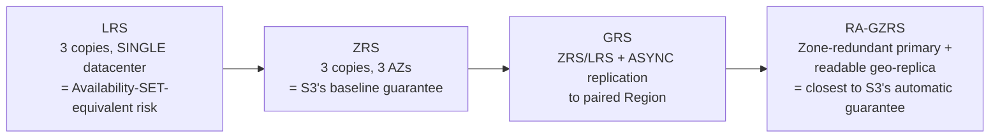
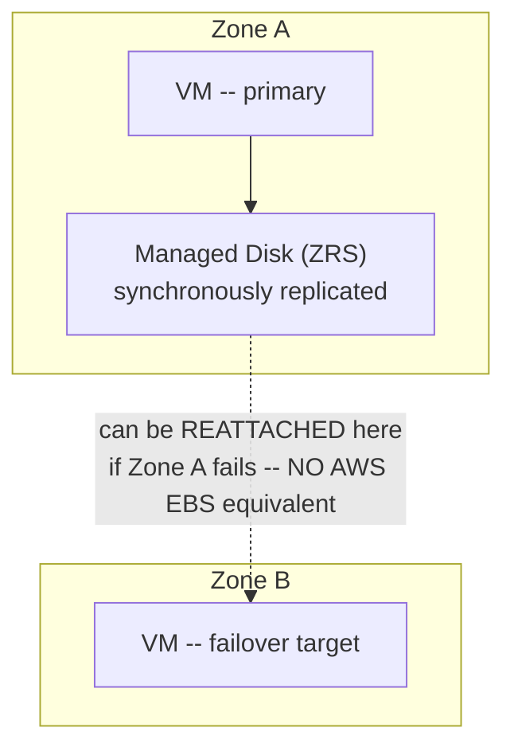

# Module 67 — Azure: Storage — Blob Storage, Managed Disks, Azure Files & Redundancy Tiers (LRS/ZRS/GRS)

> Domain: Azure | Level: Beginner → Expert | Prerequisite: [[../21-AWS/03-Storage-S3-EBS-EFS]] (this module mirrors that module's structure — Blob Storage/Managed Disks/Azure Files against S3/EBS/EFS — flagging the single most consequential divergence: Azure's storage redundancy is an EXPLICIT, chosen tier rather than an automatic property), [[02-IAM-Security-EntraID-RBAC-KeyVault]] §2.4 (Key Vault-managed encryption keys apply directly to Blob/Disk encryption)

---

## 1. Fundamentals

### Why does a Principal Engineer need Azure storage depth given Module 59 already established the durability/consistency/access-pattern framework generically?
The conceptual framework (object vs. block vs. file storage; matching storage class to access pattern; explicit reasoning about durability) transfers directly — what's genuinely new and specifically consequential here is that **Azure Blob Storage's redundancy is an explicit, chosen configuration tier**, not an automatic, always-Region-spanning property the way S3's 11-nines durability is — a Principal Engineer carrying an S3-derived assumption ("object storage is automatically, maximally durable by default") into Azure without checking the specific redundancy tier configured risks a materially weaker actual durability posture than intended, silently.

### Why does this matter?
Because Azure's storage-redundancy tiers span a genuinely wide range (from single-datacenter-only to multi-region with read access to the secondary), and — unlike S3, where the durability guarantee is fixed and automatic regardless of configuration — the *default* or most-commonly-selected-for-cost Azure tier (Locally Redundant Storage) provides materially weaker geographic resilience than what an S3-experienced engineer would assume "just using Blob Storage" provides.

### When does this matter?
Any Azure storage decision — and specifically, any team migrating from or operating alongside AWS, where this course has now repeatedly identified "false familiarity" (Module 65 §4, Module 66 §4) as the dominant cross-cloud risk category, recurring here a third time at the storage layer.

### How does it work (30,000-ft view)?
```
Blob Storage: Azure's S3 equivalent -- object storage, Hot/Cool/Archive access tiers (like S3
     storage classes) -- BUT redundancy is a SEPARATE, EXPLICIT choice (LRS/ZRS/GRS/RA-GRS/GZRS),
     unlike S3's automatic Region-spanning durability
Managed Disks: Azure's EBS equivalent -- block storage, single-VM-attached, ZONE-pinned by
     default unless Zone-Redundant Storage is explicitly chosen for the disk itself
Azure Files: Azure's EFS equivalent -- shared, SMB/NFS-accessible file storage, mountable by
     multiple VMs/containers concurrently
Redundancy tiers (LRS/ZRS/GRS/RA-GRS/GZRS/RA-GZRS): the EXPLICIT durability/availability
     configuration axis that has NO direct AWS equivalent, since AWS bakes an equivalent-to-GZRS
     guarantee into S3 automatically with no tier selection required
```

---

## 2. Deep Dive

### 2.1 Redundancy Tiers — the Single Most Consequential Azure Storage Divergence From AWS
Azure storage redundancy is chosen explicitly, independent of which storage service (Blob, Managed Disk, Files) is used: **LRS (Locally Redundant Storage)** replicates data three times **within a single datacenter** — providing protection against a single disk/node failure, but **zero protection against a datacenter/Availability-Zone-level failure**, structurally the storage-layer equivalent of Module 65 §2.3's Availability Set (same-datacenter-only) risk; **ZRS (Zone-Redundant Storage)** replicates synchronously across three Availability Zones within a Region — the actual behavioral equivalent of S3's baseline Region-spanning durability; **GRS (Geo-Redundant Storage)** replicates LRS-style within the primary Region, then **asynchronously** to a paired secondary Region (introducing genuine replication lag, directly Module 60 §2.2's read-replica-lag discipline now at the storage-redundancy layer); **RA-GRS** additionally permits **read access to the secondary Region's copy** (at the cost of that read reflecting the same asynchronous-replication staleness); **GZRS/RA-GZRS** combine zone-redundancy in the primary Region with geo-replication to the secondary. A Principal Engineer must explicitly select the tier matching the workload's actual durability/availability requirement — **there is no "just use Blob Storage and get S3-equivalent durability automatically" option**, unlike AWS, where S3's 11-nines Region-spanning guarantee requires zero configuration at all.

### 2.2 Blob Storage Access Tiers — Directly Analogous to S3 Storage Classes, With a Genuine Naming/Mechanics Match
Blob Storage's **Hot** (frequent access), **Cool** (infrequent access, lower storage cost/higher access cost, minimum 30-day retention consideration), and **Archive** (rarely accessed, lowest cost, retrieval requires an explicit, hours-long rehydration operation before the blob is readable again) tiers map closely, both conceptually and in relative cost/latency trade-off shape, to Module 59 §2.4's S3 Standard/IA/Glacier tiers — this is one of the *cleaner*, lower-divergence-risk mappings in this comparative Azure domain, and Blob Storage similarly supports lifecycle-management policies to automate tier transitions based on age/access pattern, directly mirroring Module 59 §2.4's S3 lifecycle-rule discipline with minimal conceptual adjustment required.

### 2.3 Managed Disks — Zone-Pinning, and the Explicit Zone-Redundant Storage Option
A Managed Disk (Azure's EBS equivalent) is, by default, pinned to a single Availability Zone (or no zone at all, if the underlying VM isn't zone-deployed) — directly Module 59 §2.2's EBS AZ-pinning discussion, with one additional Azure-specific nuance: Azure offers an explicit **Zone-Redundant Storage (ZRS) option for Managed Disks themselves** (synchronously replicating the disk's data across zones, allowing the disk to be reattached to a VM in a *different* zone if the original zone fails) — a capability with no precise AWS EBS equivalent (standard AWS EBS volumes have no native cross-AZ redundancy option at all; cross-AZ durability requires the snapshot-based approach Module 59 §2.2 already established) — meaning Azure Managed Disks offer a genuinely stronger *built-in* resilience option than standard AWS EBS, if explicitly selected, while defaulting to the same single-zone-pinned risk profile as AWS EBS if that explicit option isn't chosen.

### 2.4 Azure Files — SMB/NFS Shared Storage, Directly Analogous to EFS
Azure Files provides a fully-managed, SMB (and, more recently, NFS) file share mountable concurrently by multiple VMs/containers — directly Module 59 §2.3's EFS discussion, with the same "use it specifically when genuine POSIX/SMB-semantic concurrent shared access is required, not as a default shared-storage choice" discipline applying identically; Azure Files similarly offers its own redundancy-tier choice (LRS/ZRS/GRS, following §2.1's general framework), meaning the exact same explicit-redundancy-selection discipline this module establishes for Blob Storage and Managed Disks applies to Azure Files as a third, independent instance of the same pattern.

### 2.5 Blob Storage Consistency — Strongly Consistent, Matching S3's Post-2020 Model
Azure Blob Storage provides strong read-after-write consistency for standard operations, directly matching Module 59 §2.1's description of S3's (post-December-2020) consistency model — this is a case where a naive AWS-derived assumption transfers *safely*, and a Principal Engineer should specifically note this as one of the *few* areas in this comparative Azure domain where "assume it behaves like the AWS equivalent" is actually the correct instinct, precisely because generalized caution ("always assume divergence") is itself an overcorrection if applied uniformly without also recognizing where genuine equivalence holds.

### 2.6 Blob Storage Events — the AWS-S3-Event-Notifications Equivalent, via Event Grid
Blob Storage can emit events (blob created, deleted) to **Azure Event Grid** — directly Module 59 §2.5's S3-event-notification discussion, with Event Grid serving a broadly similar architectural role to a combination of AWS's S3-event-notification-to-SNS/EventBridge pattern (Event Grid, covered in depth in Module 70, is Azure's EventBridge-equivalent content-based-routing event bus) — this module notes the capability exists and behaves analogously (storage-as-event-producer, enabling choreography-style pipelines) without duplicating Module 70's fuller treatment of Event Grid's own mechanics.

---

## 3. Visual Architecture

### Redundancy Tier Spectrum — the Explicit Choice Axis With No AWS Equivalent (§2.1)


### Managed Disk Zone-Redundant Storage — Stronger Than Standard AWS EBS (§2.3)


## 4. Production Example
**Scenario**: A media platform migrated its user-generated content storage from S3 to Azure Blob Storage as part of a broader Azure migration, and — because the migration's cost-optimization pass specifically targeted "the cheapest tier that technically works" for storage (a reasonable general instinct) — the migrating engineer selected **LRS** for the primary content bucket-equivalent container, reasoning (directly by analogy to their S3 experience) that "object storage is object storage, and we never had to think about this on S3, so the default/cheapest option is presumably fine here too." **Investigation**: during a genuine Azure datacenter-level incident (the same physical-facility-level event category Module 65 §4's Availability-Set incident described, here affecting storage infrastructure specifically), the LRS-configured Blob container experienced a period of complete unavailability — and, critically, the team's internal incident-response documentation (written assuming S3-equivalent automatic Region-spanning durability, since that's what every team member's prior experience had trained them to expect from "object storage") had no playbook entry at all for "our object storage is down," since that scenario had never been considered possible for object storage specifically. **Root cause**: identical in shape to Module 65 §4's incident — an AWS-derived assumption ("this class of storage is automatically, maximally durable") didn't have a natural prompt to trigger closer scrutiny of Azure's actual, different default behavior, because S3's automatic Region-spanning guarantee had never required the team to develop the habit of checking a redundancy setting explicitly for object storage. **Fix**: reconfigured the container to **GZRS** (matching the durability/availability profile the team had always implicitly assumed object storage provided), and — recognizing the specific pattern now recurring for a third time across this Azure domain (false-familiarity risk in compute/resilience, Module 65; in IAM/RBAC, Module 66; now in storage) — established a single, explicit "Azure Divergence Checklist" as a mandatory pre-production review item covering every specific gap this domain has identified, rather than continuing to discover each one independently, incident by incident. **Lesson**: this incident is not really about storage-tier selection specifically — it's the third independent instance of this domain's central, generalized finding: cross-cloud false familiarity is a systemic risk category requiring a systemic, explicit-checklist response, not a series of individually-learned, incident-driven lessons that keep recurring in new forms across different AWS-to-Azure service mappings.

## 5. Best Practices
- Explicitly select a Blob Storage/Managed Disk/Azure Files redundancy tier matching the workload's actual durability/availability requirement — never assume a default or "cheapest working option" provides S3-equivalent automatic Region-spanning durability (§4).
- Use ZRS as the minimum baseline for any production data requiring genuine datacenter-failure resilience, reserving LRS specifically for genuinely disposable, easily-reconstructable, or non-critical data.
- Use GRS/RA-GZRS specifically when Region-level (not just zone-level) resilience is required, with explicit awareness of the asynchronous replication lag to the secondary Region.
- Leverage Managed Disks' Zone-Redundant Storage option for any disk-backed workload requiring cross-zone disk-level failover, a capability standard AWS EBS doesn't natively provide.
- Maintain and continuously update an explicit "AWS-to-Azure divergence checklist" as a mandatory pre-production review item, converting individually-learned incidents into a systemic, reusable safeguard (§4's fix).

## 6. Anti-patterns
- Assuming Azure Blob Storage's default or cheapest redundancy tier provides equivalent automatic durability to S3, without explicitly checking and deliberately selecting the tier (§4).
- Selecting LRS for genuinely critical production data purely on cost grounds without explicitly weighing the resulting datacenter-failure exposure against the data's actual criticality.
- Treating every Azure service as requiring the same depth of divergence scrutiny uniformly, rather than recognizing genuine equivalence where it exists (e.g., Blob Storage's consistency model, §2.5) and over-investing caution where it isn't needed.
- Discovering storage-redundancy gaps incident-by-incident rather than maintaining a systemic, proactively-applied divergence checklist across an entire migration effort.
- Using Azure Files as a default "shared storage" choice when Blob Storage would functionally suffice, the same anti-pattern Module 59 §6 already flagged for EFS.

---

## 10. Interview Questions

### Basic (10)
1. **Q: What is the single most consequential divergence between Azure Blob Storage and AWS S3?** **A:** Blob Storage's redundancy (durability/availability) is an explicit, chosen configuration tier (LRS/ZRS/GRS/etc.); S3's Region-spanning 11-nines durability is automatic and requires no configuration.
2. **Q: What does LRS provide, and what does it NOT provide?** **A:** Three replicated copies within a single datacenter; it provides no protection against a datacenter/Availability-Zone-level failure.
3. **Q: What does ZRS provide that's the closest behavioral match to S3's baseline guarantee?** **A:** Synchronous replication across three Availability Zones within a Region.
4. **Q: What is the difference between GRS and RA-GRS?** **A:** Both asynchronously replicate to a paired secondary Region; RA-GRS additionally permits read access to that secondary Region's copy.
5. **Q: What are Blob Storage's three access tiers, and what AWS concept do they map to?** **A:** Hot, Cool, and Archive — directly analogous to S3 Standard, IA, and Glacier.
6. **Q: What Azure-specific capability do Managed Disks offer that standard AWS EBS volumes don't natively provide?** **A:** A Zone-Redundant Storage (ZRS) option, allowing the disk to be reattached to a VM in a different zone if the original zone fails.
7. **Q: What is Azure Files' AWS equivalent?** **A:** EFS — both provide managed, shared, concurrently-mountable file storage.
8. **Q: Is Azure Blob Storage's consistency model a case of AWS-Azure equivalence or divergence?** **A:** Equivalence — both provide strong read-after-write consistency for standard operations.
9. **Q: What Azure service do Blob Storage events integrate with?** **A:** Event Grid, Azure's EventBridge-equivalent event bus.
10. **Q: How long can Archive-tier blob rehydration take before the blob is readable again?** **A:** Hours, not milliseconds — a real latency floor that must be accounted for in workload design.

### Intermediate (10)
1. **Q: Why is "our storage is on Blob Storage, so it's automatically durable" a risky assumption in a way it isn't for S3?** **A:** Because Azure's durability/availability guarantee depends entirely on which redundancy tier was explicitly selected — unlike S3, where the guarantee is fixed and automatic regardless of any configuration choice, meaning there's no Blob Storage equivalent of "just use it and get the strong guarantee by default."
2. **Q: Why did the §4 incident's team have no incident-response playbook entry for "our object storage is down"?** **A:** Their prior S3 experience never required considering that scenario, since S3's automatic Region-spanning durability made datacenter-level object-storage outages effectively a non-concern — the team's operational assumptions, and therefore their documentation, inherited that S3-specific (not universally true) property without re-examining it for Azure.
3. **Q: Why should LRS be reserved specifically for "genuinely disposable, easily-reconstructable, or non-critical data" rather than avoided universally?** **A:** LRS is a legitimate, cost-effective choice when the underlying data doesn't actually require datacenter-failure resilience (e.g., a regenerable cache or working copy, directly Module 59 §4's authoritative-vs-working-copy distinction) — the anti-pattern is using it for genuinely critical data without deliberately weighing that trade-off, not using it at all.
4. **Q: Why does RA-GRS's secondary-Region read access carry the same risk Module 60 established for RDS read replicas?** **A:** Both involve reading from an asynchronously-replicated copy that can lag behind the primary — a read immediately following a write, if routed to the secondary/replica, can observe stale data, requiring the same explicit read-path consistency categorization in both cases.
5. **Q: Why is Managed Disks' Zone-Redundant Storage option described as "genuinely stronger" than standard AWS EBS, rather than merely different?** **A:** Standard AWS EBS has no native, built-in cross-AZ disk-redundancy option at all — achieving cross-AZ durability for EBS-backed data requires the separate snapshot-based mechanism (Module 59 §2.2); Azure's Managed Disk ZRS option provides synchronous cross-zone replication as a first-class, built-in disk feature AWS doesn't offer an equivalent to.
6. **Q: Why is Blob Storage's consistency-model equivalence to S3 specifically called out as "one of the few areas where assuming AWS equivalence is correct"?** **A:** Because this comparative Azure domain has repeatedly emphasized divergence-checking as the default caution, and explicitly noting a genuine equivalence prevents overcorrection into assuming *every* Azure concept diverges from its AWS counterpart, which would itself be an inaccurate, unhelpfully broad generalization.
7. **Q: Why must a Principal Engineer explicitly verify a target Azure storage account's throughput ceiling when migrating a high-throughput S3-based workload, rather than assuming equivalent scaling behavior?** **A:** Azure storage accounts impose real, per-account ingress/egress and request-rate limits, unlike S3's near-limitless, automatically-partitioned scaling — a workload sized for S3's scaling characteristics can hit an Azure-specific ceiling that has no equivalent concern on the AWS side.
8. **Q: Why does Azure Storage's encryption-key access model not automatically provide the same two-factor defense-in-depth Module 58 established for AWS's KMS-plus-IAM split?** **A:** Because Azure Storage's encryption keys are typically managed through Key Vault, which (per Module 66 §2.4) combines what AWS splits into two independently-access-controlled services — achieving equivalent defense-in-depth requires the same deliberate object-level-scoping-plus-network-isolation approach Module 66 established for Key Vault generally.
9. **Q: Why is the §4 incident described as "the third independent instance" of the same underlying pattern in this Azure domain, and why does that recurrence matter?** **A:** Modules 65 (Availability Zones vs. Sets) and 66 (RBAC scope inheritance) already demonstrated the identical false-familiarity risk category in different service areas; the pattern recurring a third time in storage specifically demonstrates this isn't an isolated quirk of any one service but a systemic risk inherent to AWS-to-Azure knowledge transfer generally, justifying a systemic (checklist-based) rather than piecemeal (per-incident) response.
10. **Q: Why should Archive-tier rehydration latency be accounted for in workload design rather than treated as a minor implementation detail?** **A:** Because it represents a genuine, multi-hour functional constraint (not just a cost trade-off) — a workload that might need ad hoc, time-sensitive access to archived data choosing Archive tier purely for cost savings has introduced a real availability limitation, directly Module 59 §Advanced Q4's identical point about Glacier now recurring for Azure Archive tier.

### Advanced (10)
1. **Q: Diagnose the §4 incident from first principles, and design the specific automated Azure Policy that would prevent this exact class of misconfiguration from recurring, extending the governance pattern established in Modules 65-66 to storage redundancy specifically.**
   **A:** Root cause: an S3-derived assumption of automatic durability meant redundancy tier was never explicitly, deliberately reviewed during migration. Structural fix: an Azure Policy definition with a `deny` effect on any Storage Account resource in a production Resource Group configured with `LRS` (or any tier below a defined minimum, e.g., requiring at least `ZRS`) unless an explicit, tagged exception justifies it (for genuinely disposable/working-copy data, per §6) — directly extending the same automated-governance-gate pattern Module 65 §Advanced Q1 established for VMSS zone-spanning and Module 66 §Advanced Q1 established for RBAC scope, now applied to the storage-redundancy dimension specifically, completing a third instance of the same structural-enforcement response to this domain's recurring false-familiarity risk.
2. **Q: A team argues that since they're paying for GZRS (the strongest available redundancy tier) across their entire Azure storage estate uniformly, they've eliminated the storage-redundancy risk category this module describes and no further per-workload review is needed. Evaluate this claim.**
   **A:** Push back on the *uniform* application specifically — while it does eliminate the *under-provisioning* risk §4 describes, it introduces a distinct, if less severe, cost-optimization concern (Module 64 §2.4's cost-optimization discipline): applying the most expensive tier universally, including to genuinely disposable/working-copy data that doesn't need it (§6), represents real, avoidable overspending — the correct practice is not "avoid ever thinking about this by defaulting to the strongest tier everywhere" but rather explicit, deliberate per-workload tier selection matching actual requirements, which for most genuinely critical data will indeed land on GZRS/RA-GZRS, but shouldn't be applied as an unexamined blanket policy any more than LRS should be.
3. **Q: Design the specific pre-production validation practice that would verify a workload's actual configured redundancy tier matches its documented durability requirement, generalizing this domain's "steady-state doesn't exercise the failure-triggering condition" pattern to storage-tier verification specifically.**
   **A:** Since a datacenter-level failure is rare and can't be safely tested against genuine production infrastructure the way a scaling event (Module 57) can be load-tested, the correct validation is **configuration-based, not failure-simulation-based**: an automated pipeline check (directly Advanced Q1's policy) comparing each storage resource's actual configured tier against a required-minimum-tier tag/annotation documenting that resource's actual business-criticality classification, flagging any mismatch — since the failure mode here is a *configuration* gap rather than a *runtime behavior* gap, verification must happen via configuration audit rather than the load-testing-style drills this domain has used for compute/scaling risks.
4. **Q: Explain why the §4 incident's "no playbook entry for object storage being down" gap is itself a distinct, additional finding beyond the redundancy misconfiguration, and design the specific practice that addresses this second-order gap.**
   **A:** The redundancy misconfiguration is the *technical* root cause; the missing playbook entry is a distinct *organizational-preparedness* gap — even a team with a technically-correct redundancy configuration should still maintain incident-response playbooks that don't silently assume any specific failure category is impossible, since assumptions about what "can't happen" tend to atrophy an organization's response readiness for exactly that category if it ever does occur (regardless of how rare). Practice: incident-response playbook reviews should explicitly include a "what if this specific service/tier fails at the Region/Zone/datacenter level" walkthrough for every critical dependency, treated as a required tabletop exercise input rather than an assumption implicitly baked into what scenarios get playbook coverage at all.
5. **Q: A workload needs both extremely high-throughput blob ingestion (millions of small objects per hour) and long-term archival with occasional bulk-retrieval access for compliance purposes. Design the storage architecture, addressing both the account-level throughput ceiling (§9) and the appropriate tiering strategy.**
   **A:** Provision a dedicated, high-throughput-optimized Storage Account (potentially multiple accounts/partitioned by a sharding key if a single account's throughput ceiling is insufficient for the ingestion volume, directly Module 59 §7's S3-prefix-diversity discussion now applied to Azure's account-level, not prefix-level, throughput partitioning) for the ingestion path, with a lifecycle policy automatically transitioning objects from Hot to Cool to Archive as they age past the ingestion-critical window (§2.2) — critically, verify the ingestion Storage Account's specific throughput limits against the actual peak ingestion rate *before* production launch (§9's proactive-capacity-verification discipline), since Azure's per-account ceiling (unlike S3's near-limitless scaling) is a genuine, concrete constraint this specific high-volume use case could hit.
6. **Q: Critique the following claim: "Since Azure Blob Storage's consistency model matches S3's (§2.5), we can port our entire S3-based application's data-access logic to Blob Storage with zero consistency-related code changes."**
   **A:** The specific claim about the write/read consistency model transferring safely is accurate — but "zero consistency-related code changes" overgeneralizes beyond that one specific property: if the application's data-access logic involves reading from a geo-replicated secondary (RA-GRS/RA-GZRS, §2.1/§7), that introduces the exact same read-your-own-writes staleness risk Module 60 established for RDS replicas, which has no equivalent in a purely single-Region S3 setup unless that S3 setup also used cross-Region replication — the consistency-model equivalence is real but narrowly scoped to primary-storage read-after-write behavior, not a blanket guarantee covering every possible Azure Storage access pattern the application might adopt.
7. **Q: Design a decision framework for choosing between Managed Disks with Zone-Redundant Storage versus simply relying on Blob-Storage-backed data with a stateless, disposable-VM compute architecture, given Module 59 §4's original AWS lesson about treating EBS as a disposable working copy with S3 as authoritative.**
   **A:** Apply Module 59 §4's exact lesson, translated: for any workload where the authoritative data *can* reasonably live in Blob Storage (files, blobs, structured records not requiring low-level block-device access), prefer that architecture — Blob Storage's redundancy tiers (§2.1), once correctly configured, provide durability without depending on any specific VM/disk surviving; reserve Managed-Disk-with-ZRS specifically for workloads with a genuine requirement for low-latency, POSIX-block-device-level access where the data cannot reasonably be re-architected around Blob Storage (a database's own data files being the clearest example, where the database engine itself demands block-device semantics) — ZRS is the right tool for that narrower, genuine requirement, not a general-purpose substitute for the more fundamentally robust Blob-Storage-authoritative pattern where architecturally feasible.
8. **Q: A Principal Engineer discovers that an organization's Azure Files share (used for a legacy application requiring SMB access) is configured with LRS, while the equivalent AWS EFS-backed component of a parallel system uses EFS's automatic multi-AZ redundancy. Evaluate whether this represents an inconsistency requiring remediation, and under what conditions it would NOT.**
   **A:** This is a genuine inconsistency requiring explicit evaluation, not automatic remediation — the correct question is whether the Azure Files share's actual data-criticality matches the AWS EFS component's (if both serve equivalently critical production functions, the LRS configuration is very likely an under-provisioned gap requiring an upgrade to at least ZRS, per §4's lesson); it would **not** require remediation only if the Azure Files share's specific data is verifiably lower-criticality or more easily reconstructable than its AWS counterpart (e.g., it holds only regenerable temp/working files despite superficially "matching" the AWS component's architectural role) — the resolution requires an explicit criticality assessment of the *specific data*, not an assumption that matching architectural roles across clouds implies matching appropriate redundancy configuration.
9. **Q: Design the specific migration validation strategy for verifying that data moved from an S3 bucket to an Azure Blob Storage container during a migration retains equivalent effective durability, not just equivalent apparent functionality (i.e., "the files are there and readable").**
   **A:** Beyond functional verification (data integrity checksums, read/write correctness testing), explicitly document and compare the *source* S3 bucket's actual durability characteristics (11-nines, automatic Region-spanning) against the *target* Blob Storage container's configured redundancy tier, requiring an explicit sign-off that the target tier meets or exceeds the source's durability profile before considering the migration complete — treating "durability parity" as a distinct, required migration-acceptance criterion alongside functional correctness, specifically because (per §4) functional correctness testing alone would never surface a redundancy-tier gap, since the data reads and writes correctly regardless of which tier is configured, right up until an actual datacenter-level failure event.
10. **Q: As a Principal Engineer establishing Azure storage standards for an organization migrating from AWS, design the specific set of standing architectural reviews and automated checks (synthesizing this entire module) you would require for every new or migrated Azure storage resource.**
    **A:** (1) Mandatory automated policy blocking any production storage resource below a documented minimum redundancy tier, with an explicit, tagged exception process for genuinely disposable data (Advanced Q1, Advanced Q2). (2) Mandatory durability-parity sign-off as a distinct migration-acceptance criterion for any AWS-to-Azure data migration, independent of functional-correctness testing (Advanced Q9). (3) Mandatory incident-response playbook review explicitly covering "what if this storage tier/Region/Zone fails," rather than allowing untested assumptions about impossible failure categories to persist (Advanced Q4). (4) Mandatory account-level throughput capacity verification against actual peak workload demand before production launch for any high-throughput storage use case (§9, Advanced Q5). (5) Mandatory criticality-based tier selection review (neither defaulting to LRS for cost nor GZRS uniformly for safety) for every new storage resource, tied to an explicit data-criticality classification (Advanced Q2, Advanced Q8). Each standard directly extends the automated-governance-gate pattern established in Modules 65-66 into the storage-redundancy dimension, completing this Azure domain's third consecutive module to convert an initially incident-discovered false-familiarity risk into a standing, structural safeguard.

---

## 11. Coding Exercises

### Easy — Storage Account with explicit ZRS redundancy (§2.1, §4's fix)
```hcl
resource "azurerm_storage_account" "checkout_media" {
  name                     = "checkoutmediaprod"
  resource_group_name      = azurerm_resource_group.checkout_prod.name
  account_tier             = "Standard"
  account_replication_type = "ZRS"   # EXPLICIT choice -- §4's fix, NOT the cheaper LRS default many teams reach for
}
```

### Medium — Lifecycle management policy mirroring S3's tiering discipline (§2.2)
```json
{
  "rules": [
    {
      "name": "transition-old-uploads",
      "type": "Lifecycle",
      "definition": {
        "actions": {
          "baseBlob": {
            "tierToCool": { "daysAfterModificationGreaterThan": 30 },
            "tierToArchive": { "daysAfterModificationGreaterThan": 90 }
          }
        },
        "filters": { "blobTypes": ["blockBlob"], "prefixMatch": ["uploads/"] }
      }
    }
  ]
}
```

### Hard — Managed Disk with Zone-Redundant Storage, no AWS EBS equivalent (§2.3)
```hcl
resource "azurerm_managed_disk" "checkout_db_data" {
  name                 = "checkout-db-data-disk"
  storage_account_type = "PremiumV2_ZRS"   # ZONE-REDUNDANT -- reattachable to a VM in a
                                              # DIFFERENT zone if the original fails (§2.3) --
                                              # standard AWS EBS has no equivalent, single-call option
  create_option         = "Empty"
  disk_size_gb          = 512
  zone                  = "1"   # primary zone; ZRS replicates synchronously to the other zones regardless
}
```

### Expert — Automated governance check bundling this domain's three recurring divergence gates (§Advanced Q10)
```csharp
public class AzureDivergenceGovernanceCheck
{
    public GovernanceResult Validate(DeploymentManifest manifest)
    {
        var findings = new List<string>();

        // Module 65: Availability Zone spanning verification
        if (manifest.Vmss.Any(v => v.Environment == "production" && v.Zones.Count == 0))
            findings.Add("VMSS missing explicit zone configuration (Module 65 §2.3)");

        // Module 66: RBAC high-scope assignment verification
        if (manifest.RoleAssignments.Any(r => r.Scope is "Subscription" or "ManagementGroup" && !r.HasPimJustification))
            findings.Add("Subscription/MG-scope role assignment without PIM justification (Module 66 §2.1)");

        // Module 67: Storage redundancy tier verification
        if (manifest.StorageAccounts.Any(s => s.Environment == "production"
                                                 && s.ReplicationType == "LRS"
                                                 && !s.HasDisposableDataException))
            findings.Add("Production storage account on LRS without disposable-data exception (Module 67 §2.1)");

        return new GovernanceResult { Passed = findings.Count == 0, Findings = findings };
    }
}
```
**Discussion**: this single governance check deliberately bundles all three Azure-domain-specific divergence risks identified so far (zone-spanning, RBAC scope, storage redundancy) into one pipeline gate — directly demonstrating Advanced Q1/Q10's point that this is a *systemic* pattern across the Azure domain, not three unrelated findings, and that a mature governance program should track and extend this bundled check as each subsequent Azure module (68-72) identifies its own analogous divergence risk.

---

## 12–17. System Design / LLD / Debugging / Decision / Case Study / Principal

*(§4's incident, the four §11 exercises, and the Advanced-tier Q&A — especially Advanced Q1's automated redundancy-tier policy, Advanced Q4's incident-playbook-gap remediation, and Advanced Q10's synthesized governance checklist — collectively constitute this module's system-design, debugging, and Principal-Engineer-level content.)*

## 18. Revision
**Key takeaways**: Azure storage's conceptual framework (object/block/file storage; access-tier-to-cost matching; explicit durability reasoning) transfers directly from Module 59 — but the single most consequential divergence is that Azure's redundancy is an **explicit, chosen tier** (LRS/ZRS/GRS/RA-GRS/GZRS/RA-GZRS), not an automatic, always-maximal property the way S3's 11-nines guarantee is, making "just use Blob Storage" a materially riskier assumption than "just use S3" for a team unconsciously carrying AWS-derived durability expectations (§4). Blob Storage's access tiers and consistency model are genuine, low-risk equivalences to S3 — this domain's caution about divergence shouldn't be applied as blanket suspicion of every Azure concept. Managed Disks' Zone-Redundant Storage option is a genuine capability improvement over standard AWS EBS. This module's §4 incident is explicitly the third recurrence of this Azure domain's central finding (false familiarity as a systemic cross-cloud risk, following Module 65's Availability Zones/Sets and Module 66's RBAC inheritance), reinforcing that the correct response is a systemic, checklist/policy-based governance program (§11's bundled exercise) rather than incident-by-incident, service-by-service learning.

---

**Next**: Continuing to Module 68 — Azure: Databases (Azure SQL Database, Cosmos DB integration), continuing the `22-Azure` domain and mirroring Module 60's AWS database structure.
