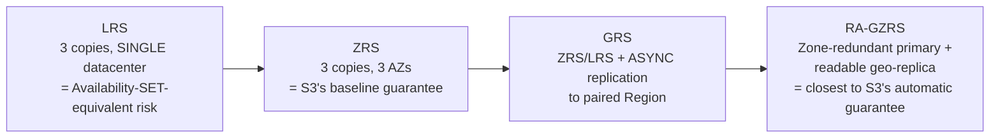
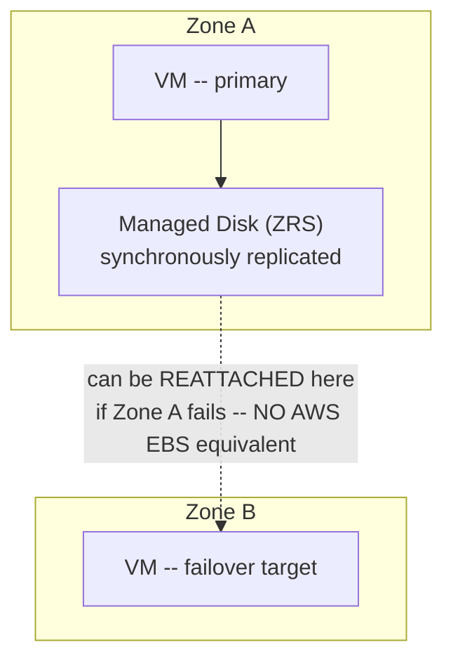
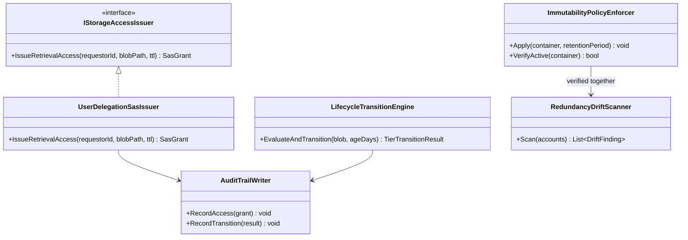

# Module 67 — Azure: Storage — Blob Storage, Managed Disks, Azure Files & Redundancy Tiers (LRS/ZRS/GRS)

> Domain: Azure | Level: Beginner → Expert | Prerequisite: [[../21-AWS/03-Storage-S3-EBS-EFS]] (this module mirrors that module's structure — Blob Storage/Managed Disks/Azure Files against S3/EBS/EFS — flagging the single most consequential divergence: Azure's storage redundancy is an EXPLICIT, chosen tier rather than an automatic property), [[02-IAM-Security-EntraID-RBAC-KeyVault]] (Key Vault-managed encryption keys apply directly to Blob/Disk encryption)

---

## 1. Fundamentals

### Why does a Principal Engineer need Azure storage depth given already established the durability/consistency/access-pattern framework generically?
The conceptual framework (object vs. block vs. file storage; matching storage class to access pattern; explicit reasoning about durability) transfers directly — what's genuinely new and specifically consequential here is that **Azure Blob Storage's redundancy is an explicit, chosen configuration tier**, not an automatic, always-Region-spanning property the way S3's 11-nines durability is — a Principal Engineer carrying an S3-derived assumption ("object storage is automatically, maximally durable by default") into Azure without checking the specific redundancy tier configured risks a materially weaker actual durability posture than intended, silently.

### Why does this matter?
Because Azure's storage-redundancy tiers span a genuinely wide range (from single-datacenter-only to multi-region with read access to the secondary), and — unlike S3, where the durability guarantee is fixed and automatic regardless of configuration — the *default* or most-commonly-selected-for-cost Azure tier (Locally Redundant Storage) provides materially weaker geographic resilience than what an S3-experienced engineer would assume "just using Blob Storage" provides.

### When does this matter?
Any Azure storage decision — and specifically, any team migrating from or operating alongside AWS, where this course has now repeatedly identified "false familiarity" as the dominant cross-cloud risk category, recurring here a third time at the storage layer.

### How does it work (30,000-ft view)?
```
Blob Storage: Azure's S3 equivalent -- object storage, Hot/Cool/Archive access tiers (like S3
 storage classes) -- BUT redundancy is a SEPARATE, EXPLICIT choice (LRS/ZRS/GRS/RA-GRS/GZRS),
 unlike S3's automatic Region-spanning durability
Managed Disks: Azure's EBS equivalent -- block storage, single-VM-attached, ZONE-pinned by
 default unless Zone-Redundant Storage is explicitly chosen for the disk itself
Azure Files: Azure's EFS equivalent -- shared, SMB/NFS-accessible file storage, mountable by
 multiple VMs/containers concurrently
Redundancy tiers (LRS/ZRS/GRS/RA-GRS/GZRS/RA-GZRS): the EXPLICIT durability/availability
 configuration axis that has NO direct AWS equivalent, since AWS bakes an equivalent-to-GZRS
 guarantee into S3 automatically with no tier selection required
```

---

## 2. Deep Dive

### 2.1 Redundancy Tiers — the Single Most Consequential Azure Storage Divergence From AWS
Azure storage redundancy is chosen explicitly, independent of which storage service (Blob, Managed Disk, Files) is used: **LRS (Locally Redundant Storage)** replicates data three times **within a single datacenter** — providing protection against a single disk/node failure, but **zero protection against a datacenter/Availability-Zone-level failure**, structurally the storage-layer equivalent of the Availability Set (same-datacenter-only) risk; **ZRS (Zone-Redundant Storage)** replicates synchronously across three Availability Zones within a Region — the actual behavioral equivalent of S3's baseline Region-spanning durability; **GRS (Geo-Redundant Storage)** replicates LRS-style within the primary Region, then **asynchronously** to a paired secondary Region (introducing genuine replication lag, directly the read-replica-lag discipline now at the storage-redundancy layer); **RA-GRS** additionally permits **read access to the secondary Region's copy** (at the cost of that read reflecting the same asynchronous-replication staleness); **GZRS/RA-GZRS** combine zone-redundancy in the primary Region with geo-replication to the secondary. A Principal Engineer must explicitly select the tier matching the workload's actual durability/availability requirement — **there is no "just use Blob Storage and get S3-equivalent durability automatically" option**, unlike AWS, where S3's 11-nines Region-spanning guarantee requires zero configuration at all.

### 2.2 Blob Storage Access Tiers — Directly Analogous to S3 Storage Classes, With a Genuine Naming/Mechanics Match
Blob Storage's **Hot** (frequent access), **Cool** (infrequent access, lower storage cost/higher access cost, minimum 30-day retention consideration), and **Archive** (rarely accessed, lowest cost, retrieval requires an explicit, hours-long rehydration operation before the blob is readable again) tiers map closely, both conceptually and in relative cost/latency trade-off shape, to the S3 Standard/IA/Glacier tiers — this is one of the *cleaner*, lower-divergence-risk mappings in this comparative Azure domain, and Blob Storage similarly supports lifecycle-management policies to automate tier transitions based on age/access pattern, directly mirroring the S3 lifecycle-rule discipline with minimal conceptual adjustment required.

### 2.3 Managed Disks — Zone-Pinning, and the Explicit Zone-Redundant Storage Option
A Managed Disk (Azure's EBS equivalent) is, by default, pinned to a single Availability Zone (or no zone at all, if the underlying VM isn't zone-deployed) — directly the EBS AZ-pinning discussion, with one additional Azure-specific nuance: Azure offers an explicit **Zone-Redundant Storage (ZRS) option for Managed Disks themselves** (synchronously replicating the disk's data across zones, allowing the disk to be reattached to a VM in a *different* zone if the original zone fails) — a capability with no precise AWS EBS equivalent (standard AWS EBS volumes have no native cross-AZ redundancy option at all; cross-AZ durability requires the snapshot-based approach already established) — meaning Azure Managed Disks offer a genuinely stronger *built-in* resilience option than standard AWS EBS, if explicitly selected, while defaulting to the same single-zone-pinned risk profile as AWS EBS if that explicit option isn't chosen.

### 2.4 Azure Files — SMB/NFS Shared Storage, Directly Analogous to EFS
Azure Files provides a fully-managed, SMB (and, more recently, NFS) file share mountable concurrently by multiple VMs/containers — directly the EFS discussion, with the same "use it specifically when genuine POSIX/SMB-semantic concurrent shared access is required, not as a default shared-storage choice" discipline applying identically; Azure Files similarly offers its own redundancy-tier choice (LRS/ZRS/GRS, following the general framework), meaning the exact same explicit-redundancy-selection discipline this module establishes for Blob Storage and Managed Disks applies to Azure Files as a third, independent instance of the same pattern.

### 2.5 Blob Storage Consistency — Strongly Consistent, Matching S3's Post-2020 Model
Azure Blob Storage provides strong read-after-write consistency for standard operations, directly matching the description of S3's (post-December-2020) consistency model — this is a case where a naive AWS-derived assumption transfers *safely*, and a Principal Engineer should specifically note this as one of the *few* areas in this comparative Azure domain where "assume it behaves like the AWS equivalent" is actually the correct instinct, precisely because generalized caution ("always assume divergence") is itself an overcorrection if applied uniformly without also recognizing where genuine equivalence holds.

### 2.6 Blob Storage Events — the AWS-S3-Event-Notifications Equivalent, via Event Grid
Blob Storage can emit events (blob created, deleted) to **Azure Event Grid** — directly the S3-event-notification discussion, with Event Grid serving a broadly similar architectural role to a combination of AWS's S3-event-notification-to-SNS/EventBridge pattern (Event Grid, covered in depth, is Azure's EventBridge-equivalent content-based-routing event bus) — this module notes the capability exists and behaves analogously (storage-as-event-producer, enabling choreography-style pipelines) without duplicating the fuller treatment of Event Grid's own mechanics.

---

## 3. Visual Architecture

### Redundancy Tier Spectrum — the Explicit Choice Axis With No AWS Equivalent

```mermaid
graph LR
 LRS["LRS<br/>3 copies, SINGLE datacenter<br/>= Availability-SET-equivalent risk"] --> ZRS["ZRS<br/>3 copies, 3 AZs<br/>= S3's baseline guarantee"]
 ZRS --> GRS["GRS<br/>ZRS/LRS + ASYNC replication<br/>to paired Region"]
 GRS --> RAGZRS["RA-GZRS<br/>Zone-redundant primary +<br/>readable geo-replica<br/>= closest to S3's automatic guarantee"]
```

### Managed Disk Zone-Redundant Storage — Stronger Than Standard AWS EBS

```mermaid
graph TB
 subgraph "Zone A"
 VM1[VM -- primary] --> Disk["Managed Disk (ZRS)<br/>synchronously replicated"]
 end
 subgraph "Zone B"
 Disk -.->|"can be REATTACHED here<br/>if Zone A fails -- NO AWS EBS equivalent"| VM2["VM -- failover target"]
 end
```

## 4. Production Example
**Scenario**: A media platform migrated its user-generated content storage from S3 to Azure Blob Storage as part of a broader Azure migration, and — because the migration's cost-optimization pass specifically targeted "the cheapest tier that technically works" for storage (a reasonable general instinct) — the migrating engineer selected **LRS** for the primary content bucket-equivalent container, reasoning (directly by analogy to their S3 experience) that "object storage is object storage, and we never had to think about this on S3, so the default/cheapest option is presumably fine here too." **Investigation**: during a genuine Azure datacenter-level incident (the same physical-facility-level event category the Availability-Set incident described, here affecting storage infrastructure specifically), the LRS-configured Blob container experienced a period of complete unavailability — and, critically, the team's internal incident-response documentation (written assuming S3-equivalent automatic Region-spanning durability, since that's what every team member's prior experience had trained them to expect from "object storage") had no playbook entry at all for "our object storage is down," since that scenario had never been considered possible for object storage specifically. **Root cause**: identical in shape to the incident — an AWS-derived assumption ("this class of storage is automatically, maximally durable") didn't have a natural prompt to trigger closer scrutiny of Azure's actual, different default behavior, because S3's automatic Region-spanning guarantee had never required the team to develop the habit of checking a redundancy setting explicitly for object storage. **Fix**: reconfigured the container to **GZRS** (matching the durability/availability profile the team had always implicitly assumed object storage provided), and — recognizing the specific pattern now recurring for a third time across this Azure domain (false-familiarity risk in compute/resilience,; in IAM/RBAC,; now in storage) — established a single, explicit "Azure Divergence Checklist" as a mandatory pre-production review item covering every specific gap this domain has identified, rather than continuing to discover each one independently, incident by incident. **Lesson**: this incident is not really about storage-tier selection specifically — it's the third independent instance of this domain's central, generalized finding: cross-cloud false familiarity is a systemic risk category requiring a systemic, explicit-checklist response, not a series of individually-learned, incident-driven lessons that keep recurring in new forms across different AWS-to-Azure service mappings.

## 5. Best Practices
- Explicitly select a Blob Storage/Managed Disk/Azure Files redundancy tier matching the workload's actual durability/availability requirement — never assume a default or "cheapest working option" provides S3-equivalent automatic Region-spanning durability.
- Use ZRS as the minimum baseline for any production data requiring genuine datacenter-failure resilience, reserving LRS specifically for genuinely disposable, easily-reconstructable, or non-critical data.
- Use GRS/RA-GZRS specifically when Region-level (not just zone-level) resilience is required, with explicit awareness of the asynchronous replication lag to the secondary Region.
- Leverage Managed Disks' Zone-Redundant Storage option for any disk-backed workload requiring cross-zone disk-level failover, a capability standard AWS EBS doesn't natively provide.
- Maintain and continuously update an explicit "AWS-to-Azure divergence checklist" as a mandatory pre-production review item, converting individually-learned incidents into a systemic, reusable safeguard (the fix).

## 6. Anti-patterns
- Assuming Azure Blob Storage's default or cheapest redundancy tier provides equivalent automatic durability to S3, without explicitly checking and deliberately selecting the tier.
- Selecting LRS for genuinely critical production data purely on cost grounds without explicitly weighing the resulting datacenter-failure exposure against the data's actual criticality.
- Treating every Azure service as requiring the same depth of divergence scrutiny uniformly, rather than recognizing genuine equivalence where it exists (e.g., Blob Storage's consistency model) and over-investing caution where it isn't needed.
- Discovering storage-redundancy gaps incident-by-incident rather than maintaining a systemic, proactively-applied divergence checklist across an entire migration effort.
- Using Azure Files as a default "shared storage" choice when Blob Storage would functionally suffice, the same anti-pattern already flagged for EFS.

---

## 7. Performance Engineering

**CPU/Memory:** Client-side cost is minimal for Blob/Files access (thin HTTP/REST clients); the real performance lever is I/O sizing and request shape, not compute.

**Latency:** Hot tier delivers single-digit-to-low-double-digit-ms first-byte latency for well-formed requests; Cool tier adds no *read* latency penalty (only a higher per-GB access cost) — the genuine latency cliff is **Archive tier**, where a blob is not readable at all until an explicit rehydration operation completes: **Standard priority** rehydration can take up to **15 hours**, **High priority** typically completes in **under 1 hour** at a materially higher per-GB rehydration cost. A reconciliation pipeline that archives trade-confirmation documents after 90 days and then needs same-day retrieval for a regulator request must budget for High-priority rehydration cost explicitly, or the SLA is silently unmeetable.

**Throughput:** Managed Disk performance is a function of the explicitly provisioned SKU, not just capacity: a P30 (1 TiB Premium SSD) caps at ~5,000 IOPS / 200 MB/s; Premium SSD v2 and Ultra Disk decouple IOPS/throughput provisioning from capacity entirely, letting a Principal Engineer size a small, high-IOPS disk for a write-ahead log without over-provisioning capacity just to buy IOPS — directly the AWS gp3-vs-gp2 decoupling discussion, now on the Azure side.

**Scalability:** a single Storage Account has a documented aggregate ingress/egress ceiling (per-account, not per-blob) — historically ~25 Gbps ingress / 50 Gbps egress for General Purpose v2 (higher via published, request-able limit increases) — a high-throughput ingestion pipeline (e.g., market-data tick capture or bulk settlement-file drops) sized against a single account's headroom without accounting for this ceiling will throttle (HTTP 503) under peak load; the standard mitigation is sharding ingestion across multiple Storage Accounts keyed by a partitioning dimension (date, source system), directly the S3-prefix-diversity discipline moved to the account level.

**Benchmarking:** benchmark against the *actual* object-size distribution and access-tier mix (many small objects vs. few large ones behave very differently against per-request overhead), not a synthetic uniform-large-object test — a settlement-file archive (millions of small XML confirmations) and a market-data blob store (few, large Parquet files) have inverted cost/throughput profiles under the identical redundancy tier.

**Caching:** front Hot-tier, read-heavy, publicly-served blobs (e.g., static regulatory disclosure documents) with Azure CDN or Front Door to absorb read volume away from the Storage Account's own request-rate ceiling; this has no bearing on write-path or Archive-tier latency.

---

## 8. Security

**Threats:** an over-broadly-scoped or long-lived **SAS (Shared Access Signature) token** is the single most common Blob Storage security incident vector — a SAS token grants time-boxed, permission-scoped access to a container or blob without an Azure AD identity check, meaning a leaked SAS URL (logged accidentally, pasted into a support ticket, committed to a repo) is a bearer credential usable by anyone who has it until it expires or is revoked.

**Mitigations:** prefer **User Delegation SAS** (backed by Azure AD credentials, revocable by revoking the underlying Azure AD token, and auditable via Entra ID sign-in logs) over **Account SAS** or **Service SAS** signed with the storage account key directly (which cannot be individually revoked short of rotating the account key itself, invalidating every other SAS signed with that key simultaneously); scope every SAS to the minimum permission set (read-only where write isn't needed), the shortest viable expiry window (minutes-to-hours for a one-off download link, never open-ended), and — where the client IP range is known — an explicit IP restriction on the SAS itself.

**OWASP mapping:** broken access control (an over-permissioned or non-expiring SAS token acting as a de facto backdoor); sensitive data exposure (an unencrypted or publicly-anonymous-access-enabled container holding confidential financial records — anonymous public blob access must be explicitly disabled at the Storage Account level for any account holding regulated data, not left at its historical default).

**AuthN/AuthZ:** prefer Azure AD (Entra ID) RBAC roles (`Storage Blob Data Reader`/`Contributor`) scoped via Managed Identity for service-to-service access over storage-account-key-based access entirely — a Managed-Identity-authenticated service call is individually attributable and revocable per-identity, unlike a shared account key.

**Secrets:** storage account access keys are long-lived, all-or-nothing bearer secrets (two keys exist specifically to support zero-downtime rotation — rotate key2 while key1-dependent clients keep working, then rotate key1); a key that has never been rotated since account creation is a standing, unaudited risk — Azure Policy can enforce a maximum key age and alert on stale keys, directly the credential-rotation discipline.

**Encryption:** Storage Service Encryption (SSE) is on by default (AES-256, Microsoft-managed keys); for regulated financial data, use **customer-managed keys (CMK) in Key Vault** so encryption-key access is itself independently audited and revocable — the same object-level-scoping-plus-network-isolation Key Vault discipline this module's prerequisite established, now applied to storage's own encryption keys specifically.

---

## 9. Scalability

**Horizontal scaling:** Blob Storage scales horizontally by partitioning internally across its infrastructure keyed by the blob's partition key (typically the account+container+blob name prefix) — a workload with a monotonically-increasing, low-cardinality prefix (e.g., always writing to `logs/2026-08-28/...` with a shared date prefix) can create a hot partition inside a single account, directly the same prefix-diversity discipline recurring from the Performance Engineering section, now framed as a scaling (not just throughput) concern.

**Vertical scaling:** Managed Disks scale "vertically" by SKU upgrade (Standard HDD → Standard SSD → Premium SSD → Premium SSD v2/Ultra Disk), each a discrete resize/SKU-change operation, not a continuous dial — capacity-planning for a growing OLTP disk workload should pre-select a SKU with headroom rather than assuming a live, zero-friction upgrade path under peak load.

**Replication/Partitioning:** the redundancy-tier spectrum (LRS/ZRS/GRS/RA-GRS/GZRS/RA-GZRS, §2.1) *is* Azure Storage's replication mechanism — deliberately exposed as an explicit configuration axis rather than an automatic property, the central theme of this entire module.

**Load balancing:** Azure Storage's front-end automatically load-balances requests across its internal partition servers; the operator-controlled lever is *avoiding self-inflicted hot spots* via partition-key (prefix) diversity, not manual load-balancer configuration.

**High Availability:** ZRS is the practical HA baseline for any workload requiring survival of a single-datacenter failure without data unavailability; LRS alone provides no such guarantee (§2.1, §4's incident).

**Disaster Recovery:** GRS/GZRS provide cross-Region DR via asynchronous replication to a paired secondary Region; RA-GRS/RA-GZRS additionally allow the DR copy to serve reads during a primary-Region outage (via the account's `-secondary` endpoint) — but a DR runbook must explicitly account for the asynchronous replication lag (Recovery Point Objective is *not* zero) and for **Storage Account Failover** (customer-initiated or, historically, Microsoft-initiated) being the actual cutover mechanism, not an automatic, transparent one.

**CAP theorem:** within a single Region, Blob Storage behaves as CP (strongly consistent, per §2.5) with availability bounded by that Region's own infrastructure; across Regions (GRS/RA-GRS), the system is effectively AP for the read-from-secondary path — the secondary read is available even during a primary-Region partition, at the cost of consistency (the asynchronous-lag staleness already established for RA-GRS).

---

## 10. Interview Questions

### Basic (10)
1. **Q: What is the single most consequential divergence between Azure Blob Storage and AWS S3?** **A:** Blob Storage's redundancy (durability/availability) is an explicit, chosen configuration tier (LRS/ZRS/GRS/etc.); S3's Region-spanning 11-nines durability is automatic and requires no configuration.
2. **Q: What does LRS provide, and what does it NOT provide?** **A:** Three replicated copies within a single datacenter; it provides no protection against a datacenter/Availability-Zone-level failure.
3. **Q: What does ZRS provide that's the closest behavioral match to S3's baseline guarantee?** **A:** Synchronous replication across three Availability Zones within a Region.
4. **Q: What is the difference between GRS and RA-GRS?** **A:** Both asynchronously replicate to a paired secondary Region; RA-GRS additionally permits read access to that secondary Region's copy.
5. **Q: What are Blob Storage's three access tiers, and what AWS concept do they map to?** **A:** Hot, Cool, and Archive — directly analogous to S3 Standard, IA, and Glacier.
6. **Q: What Azure-specific capability do Managed Disks offer that standard AWS EBS volumes don't natively provide?** **A:** A Zone-Redundant Storage (ZRS) option, allowing the disk to be reattached to a VM in a different zone if the original zone fails.
7. **Q: What is Azure Files' AWS equivalent?** **A:** EFS — both provide managed, shared, concurrently-mountable file storage.
8. **Q: Is Azure Blob Storage's consistency model a case of AWS-Azure equivalence or divergence?** **A:** Equivalence — both provide strong read-after-write consistency for standard operations.
9. **Q: What Azure service do Blob Storage events integrate with?** **A:** Event Grid, Azure's EventBridge-equivalent event bus.
10. **Q: How long can Archive-tier blob rehydration take before the blob is readable again?** **A:** Hours, not milliseconds — a real latency floor that must be accounted for in workload design.

### Intermediate (10)
1. **Q: Why is "our storage is on Blob Storage, so it's automatically durable" a risky assumption in a way it isn't for S3?** **A:** Because Azure's durability/availability guarantee depends entirely on which redundancy tier was explicitly selected — unlike S3, where the guarantee is fixed and automatic regardless of any configuration choice, meaning there's no Blob Storage equivalent of "just use it and get the strong guarantee by default."
2. **Q: Why did the incident's team have no incident-response playbook entry for "our object storage is down"?** **A:** Their prior S3 experience never required considering that scenario, since S3's automatic Region-spanning durability made datacenter-level object-storage outages effectively a non-concern — the team's operational assumptions, and therefore their documentation, inherited that S3-specific (not universally true) property without re-examining it for Azure.
3. **Q: Why should LRS be reserved specifically for "genuinely disposable, easily-reconstructable, or non-critical data" rather than avoided universally?** **A:** LRS is a legitimate, cost-effective choice when the underlying data doesn't actually require datacenter-failure resilience (e.g., a regenerable cache or working copy, directly the authoritative-vs-working-copy distinction) — the anti-pattern is using it for genuinely critical data without deliberately weighing that trade-off, not using it at all.
4. **Q: Why does RA-GRS's secondary-Region read access carry the same risk established for RDS read replicas?** **A:** Both involve reading from an asynchronously-replicated copy that can lag behind the primary — a read immediately following a write, if routed to the secondary/replica, can observe stale data, requiring the same explicit read-path consistency categorization in both cases.
5. **Q: Why is Managed Disks' Zone-Redundant Storage option described as "genuinely stronger" than standard AWS EBS, rather than merely different?** **A:** Standard AWS EBS has no native, built-in cross-AZ disk-redundancy option at all — achieving cross-AZ durability for EBS-backed data requires the separate snapshot-based mechanism; Azure's Managed Disk ZRS option provides synchronous cross-zone replication as a first-class, built-in disk feature AWS doesn't offer an equivalent to.
6. **Q: Why is Blob Storage's consistency-model equivalence to S3 specifically called out as "one of the few areas where assuming AWS equivalence is correct"?** **A:** Because this comparative Azure domain has repeatedly emphasized divergence-checking as the default caution, and explicitly noting a genuine equivalence prevents overcorrection into assuming *every* Azure concept diverges from its AWS counterpart, which would itself be an inaccurate, unhelpfully broad generalization.
7. **Q: Why must a Principal Engineer explicitly verify a target Azure storage account's throughput ceiling when migrating a high-throughput S3-based workload, rather than assuming equivalent scaling behavior?** **A:** Azure storage accounts impose real, per-account ingress/egress and request-rate limits, unlike S3's near-limitless, automatically-partitioned scaling — a workload sized for S3's scaling characteristics can hit an Azure-specific ceiling that has no equivalent concern on the AWS side.
8. **Q: Why does Azure Storage's encryption-key access model not automatically provide the same two-factor defense-in-depth established for AWS's KMS-plus-IAM split?** **A:** Because Azure Storage's encryption keys are typically managed through Key Vault, which combines what AWS splits into two independently-access-controlled services — achieving equivalent defense-in-depth requires the same deliberate object-level-scoping-plus-network-isolation approach established for Key Vault generally.
9. **Q: Why is the incident described as "the third independent instance" of the same underlying pattern in this Azure domain, and why does that recurrence matter?** **A:** Modules 65 (Availability Zones vs. Sets) and 66 (RBAC scope inheritance) already demonstrated the identical false-familiarity risk category in different service areas; the pattern recurring a third time in storage specifically demonstrates this isn't an isolated quirk of any one service but a systemic risk inherent to AWS-to-Azure knowledge transfer generally, justifying a systemic (checklist-based) rather than piecemeal (per-incident) response.
10. **Q: Why should Archive-tier rehydration latency be accounted for in workload design rather than treated as a minor implementation detail?** **A:** Because it represents a genuine, multi-hour functional constraint (not just a cost trade-off) — a workload that might need ad hoc, time-sensitive access to archived data choosing Archive tier purely for cost savings has introduced a real availability limitation, directly §Advanced Q4's identical point about Glacier now recurring for Azure Archive tier.

### Advanced (10)
1. **Q: Diagnose the incident from first principles, and design the specific automated Azure Policy that would prevent this exact class of misconfiguration from recurring, extending the governance pattern established in Modules 65-66 to storage redundancy specifically.**
 **A:** Root cause: an S3-derived assumption of automatic durability meant redundancy tier was never explicitly, deliberately reviewed during migration. Structural fix: an Azure Policy definition with a `deny` effect on any Storage Account resource in a production Resource Group configured with `LRS` (or any tier below a defined minimum, e.g., requiring at least `ZRS`) unless an explicit, tagged exception justifies it (for genuinely disposable/working-copy data) — directly extending the same automated-governance-gate pattern §Advanced Q1 established for VMSS zone-spanning and §Advanced Q1 established for RBAC scope, now applied to the storage-redundancy dimension specifically, completing a third instance of the same structural-enforcement response to this domain's recurring false-familiarity risk.
2. **Q: A team argues that since they're paying for GZRS (the strongest available redundancy tier) across their entire Azure storage estate uniformly, they've eliminated the storage-redundancy risk category this module describes and no further per-workload review is needed. Evaluate this claim.**
 **A:** Push back on the *uniform* application specifically — while it does eliminate the *under-provisioning* risk describes, it introduces a distinct, if less severe, cost-optimization concern (the cost-optimization discipline): applying the most expensive tier universally, including to genuinely disposable/working-copy data that doesn't need it, represents real, avoidable overspending — the correct practice is not "avoid ever thinking about this by defaulting to the strongest tier everywhere" but rather explicit, deliberate per-workload tier selection matching actual requirements, which for most genuinely critical data will indeed land on GZRS/RA-GZRS, but shouldn't be applied as an unexamined blanket policy any more than LRS should be.
3. **Q: Design the specific pre-production validation practice that would verify a workload's actual configured redundancy tier matches its documented durability requirement, generalizing this domain's "steady-state doesn't exercise the failure-triggering condition" pattern to storage-tier verification specifically.**
 **A:** Since a datacenter-level failure is rare and can't be safely tested against genuine production infrastructure the way a scaling event can be load-tested, the correct validation is **configuration-based, not failure-simulation-based**: an automated pipeline check (directly Advanced Q1's policy) comparing each storage resource's actual configured tier against a required-minimum-tier tag/annotation documenting that resource's actual business-criticality classification, flagging any mismatch — since the failure mode here is a *configuration* gap rather than a *runtime behavior* gap, verification must happen via configuration audit rather than the load-testing-style drills this domain has used for compute/scaling risks.
4. **Q: Explain why the incident's "no playbook entry for object storage being down" gap is itself a distinct, additional finding beyond the redundancy misconfiguration, and design the specific practice that addresses this second-order gap.**
 **A:** The redundancy misconfiguration is the *technical* root cause; the missing playbook entry is a distinct *organizational-preparedness* gap — even a team with a technically-correct redundancy configuration should still maintain incident-response playbooks that don't silently assume any specific failure category is impossible, since assumptions about what "can't happen" tend to atrophy an organization's response readiness for exactly that category if it ever does occur (regardless of how rare). Practice: incident-response playbook reviews should explicitly include a "what if this specific service/tier fails at the Region/Zone/datacenter level" walkthrough for every critical dependency, treated as a required tabletop exercise input rather than an assumption implicitly baked into what scenarios get playbook coverage at all.
5. **Q: A workload needs both extremely high-throughput blob ingestion (millions of small objects per hour) and long-term archival with occasional bulk-retrieval access for compliance purposes. Design the storage architecture, addressing both the account-level throughput ceiling and the appropriate tiering strategy.**
 **A:** Provision a dedicated, high-throughput-optimized Storage Account (potentially multiple accounts/partitioned by a sharding key if a single account's throughput ceiling is insufficient for the ingestion volume, directly the S3-prefix-diversity discussion now applied to Azure's account-level, not prefix-level, throughput partitioning) for the ingestion path, with a lifecycle policy automatically transitioning objects from Hot to Cool to Archive as they age past the ingestion-critical window — critically, verify the ingestion Storage Account's specific throughput limits against the actual peak ingestion rate *before* production launch (the proactive-capacity-verification discipline), since Azure's per-account ceiling (unlike S3's near-limitless scaling) is a genuine, concrete constraint this specific high-volume use case could hit.
6. **Q: Critique the following claim: "Since Azure Blob Storage's consistency model matches S3's, we can port our entire S3-based application's data-access logic to Blob Storage with zero consistency-related code changes."**
 **A:** The specific claim about the write/read consistency model transferring safely is accurate — but "zero consistency-related code changes" overgeneralizes beyond that one specific property: if the application's data-access logic involves reading from a geo-replicated secondary (RA-GRS/RA-GZRS,/), that introduces the exact same read-your-own-writes staleness risk established for RDS replicas, which has no equivalent in a purely single-Region S3 setup unless that S3 setup also used cross-Region replication — the consistency-model equivalence is real but narrowly scoped to primary-storage read-after-write behavior, not a blanket guarantee covering every possible Azure Storage access pattern the application might adopt.
7. **Q: Design a decision framework for choosing between Managed Disks with Zone-Redundant Storage versus simply relying on Blob-Storage-backed data with a stateless, disposable-VM compute architecture, given the original AWS lesson about treating EBS as a disposable working copy with S3 as authoritative.**
 **A:** Apply the exact lesson, translated: for any workload where the authoritative data *can* reasonably live in Blob Storage (files, blobs, structured records not requiring low-level block-device access), prefer that architecture — Blob Storage's redundancy tiers, once correctly configured, provide durability without depending on any specific VM/disk surviving; reserve Managed-Disk-with-ZRS specifically for workloads with a genuine requirement for low-latency, POSIX-block-device-level access where the data cannot reasonably be re-architected around Blob Storage (a database's own data files being the clearest example, where the database engine itself demands block-device semantics) — ZRS is the right tool for that narrower, genuine requirement, not a general-purpose substitute for the more fundamentally robust Blob-Storage-authoritative pattern where architecturally feasible.
8. **Q: A Principal Engineer discovers that an organization's Azure Files share (used for a legacy application requiring SMB access) is configured with LRS, while the equivalent AWS EFS-backed component of a parallel system uses EFS's automatic multi-AZ redundancy. Evaluate whether this represents an inconsistency requiring remediation, and under what conditions it would NOT.**
 **A:** This is a genuine inconsistency requiring explicit evaluation, not automatic remediation — the correct question is whether the Azure Files share's actual data-criticality matches the AWS EFS component's (if both serve equivalently critical production functions, the LRS configuration is very likely an under-provisioned gap requiring an upgrade to at least ZRS, per the lesson); it would **not** require remediation only if the Azure Files share's specific data is verifiably lower-criticality or more easily reconstructable than its AWS counterpart (e.g., it holds only regenerable temp/working files despite superficially "matching" the AWS component's architectural role) — the resolution requires an explicit criticality assessment of the *specific data*, not an assumption that matching architectural roles across clouds implies matching appropriate redundancy configuration.
9. **Q: Design the specific migration validation strategy for verifying that data moved from an S3 bucket to an Azure Blob Storage container during a migration retains equivalent effective durability, not just equivalent apparent functionality (i.e., "the files are there and readable").**
 **A:** Beyond functional verification (data integrity checksums, read/write correctness testing), explicitly document and compare the *source* S3 bucket's actual durability characteristics (11-nines, automatic Region-spanning) against the *target* Blob Storage container's configured redundancy tier, requiring an explicit sign-off that the target tier meets or exceeds the source's durability profile before considering the migration complete — treating "durability parity" as a distinct, required migration-acceptance criterion alongside functional correctness, specifically because functional correctness testing alone would never surface a redundancy-tier gap, since the data reads and writes correctly regardless of which tier is configured, right up until an actual datacenter-level failure event.
10. **Q: As a Principal Engineer establishing Azure storage standards for an organization migrating from AWS, design the specific set of standing architectural reviews and automated checks (synthesizing this entire module) you would require for every new or migrated Azure storage resource.**
 **A:** (1) Mandatory automated policy blocking any production storage resource below a documented minimum redundancy tier, with an explicit, tagged exception process for genuinely disposable data (Advanced Q1, Advanced Q2). (2) Mandatory durability-parity sign-off as a distinct migration-acceptance criterion for any AWS-to-Azure data migration, independent of functional-correctness testing (Advanced Q9). (3) Mandatory incident-response playbook review explicitly covering "what if this storage tier/Region/Zone fails," rather than allowing untested assumptions about impossible failure categories to persist (Advanced Q4). (4) Mandatory account-level throughput capacity verification against actual peak workload demand before production launch for any high-throughput storage use case (Advanced Q5). (5) Mandatory criticality-based tier selection review (neither defaulting to LRS for cost nor GZRS uniformly for safety) for every new storage resource, tied to an explicit data-criticality classification (Advanced Q2, Advanced Q8). Each standard directly extends the automated-governance-gate pattern established in Modules 65-66 into the storage-redundancy dimension, completing this Azure domain's third consecutive module to convert an initially incident-discovered false-familiarity risk into a standing, structural safeguard.

### Expert (10)
1. **Q: A regulated-data Storage Account holding trade-confirmation archives is configured with GZRS and customer-managed keys, and passes every access-control review — yet a post-incident audit reveals a contractor's Account SAS token (signed with the storage account key, granting container-level read/write, with a two-year expiry) was still valid eighteen months after the contractor's engagement ended. Diagnose the structural gap and design the fix.**
 **A:** The structural gap is that an Account-SAS token signed with the account key has **no independent revocation mechanism** short of rotating the account key itself — the access-control review evaluated RBAC role assignments and network rules but had no inventory of *already-issued* SAS tokens, because a key-signed SAS isn't a first-class, listable Azure resource the way a role assignment is; it's a self-contained bearer credential that exists purely in whoever holds the URL. Fix: (1) migrate all SAS issuance to **User Delegation SAS** (Azure-AD-token-backed, and specifically revocable by revoking the issuing principal's access, unlike a key-signed SAS), (2) cap maximum SAS expiry via an Azure Policy or issuance-service enforcement (e.g., 24 hours, never "two years"), (3) treat storage-account-key rotation itself as a standing quarterly control specifically *because* it's the only backstop against an already-issued key-signed SAS whose expiry can't otherwise be audited or revoked, and (4) add "enumerate and expire long-lived key-signed SAS issuance" as an explicit, mandatory step in every offboarding runbook, since this gap is invisible to any control that only inspects current RBAC state.

2. **Q: A trading-desk analytics platform stores intraday risk snapshots in Blob Storage configured GRS, and the platform's DR runbook states "RPO is zero because GRS replicates automatically." Evaluate this claim and correct it if wrong.**
 **A:** The claim is false. GRS replication to the secondary Region is **asynchronous** — Microsoft's documented, typically-sub-15-minute replication lag is a target, not a guaranteed-zero-lag contract, and during a genuine primary-Region outage, any write that hadn't yet propagated to the secondary at the moment of failure is lost from the secondary's perspective until (if ever) the primary recovers. The corrected RPO is "up to the observed replication lag at failure time" (commonly minutes, not zero), and any DR runbook citing "RPO zero" for a GRS-backed system is making an unverified, materially wrong claim that would only be discovered true during an actual Region-level failure — exactly the "steady-state testing never exercises the failure-triggering condition" pattern recurring in this domain. The fix is either explicit acceptance of the non-zero RPO (documented, and reconciled against business tolerance for a risk-snapshot use case, where minutes of staleness may be genuinely acceptable) or a redesign using synchronous replication (ZRS within-Region, or an application-level dual-write to two Regions with explicit acknowledgment from both) if a genuine zero-RPO requirement exists.

3. **Q: Design an automated control that would have caught both the §4 incident (LRS on critical data) and this Expert tier's SAS-token gap (Q1), synthesizing them as instances of the same underlying failure category.**
 **A:** Both incidents share the same shape: a *default or historically-issued configuration* silently diverges from the *currently-required* security/durability posture, and nothing actively re-validates that divergence over time — LRS was never revisited after initial (mis-)selection; the SAS token was never revisited after issuance. The unifying control is a **continuous configuration-drift scanner**, not a point-in-time review: a scheduled job that (a) flags any production Storage Account below the required minimum redundancy tier without a tagged exception (§Advanced Q1's policy, now run continuously, not just at deployment gate time), and (b) — via Azure Storage Analytics / diagnostic logs — samples recent SAS-authenticated requests, cross-references the signing key's last-rotation date and the SAS's embedded expiry, and flags any SAS with an expiry beyond a defined maximum (e.g., 24 hours) as a policy violation requiring investigation, even though no single "SAS inventory" API exists — approximating detection via observed usage logs when direct enumeration isn't possible.

4. **Q: A Principal Engineer is asked to justify, to a regulator's technology-risk auditor, why Managed Disk Zone-Redundant Storage (ZRS) is an acceptable substitute for a documented "cross-datacenter disk redundancy" control inherited from an on-prem SAN-mirroring standard. Construct the technical justification, including what it does NOT cover.**
 **A:** ZRS synchronously replicates a Managed Disk's data across three Availability Zones within a Region, meaning a single datacenter (zone) failure does not lose data and the disk can be reattached to a VM in a surviving zone — functionally analogous to synchronous SAN mirroring across two on-prem datacenters in the same metro area. What it does **not** cover: a Region-wide event (all zones in that Region affected simultaneously — rare, but not zero-probability) is out of ZRS's scope entirely, since ZRS has no cross-Region component; a genuine "Region-loss" control requires either Azure Site Recovery (async, cross-Region VM/disk replication) or an application-level cross-Region architecture, and the auditor's control mapping should explicitly note ZRS satisfies the datacenter-level clause of the inherited standard but not any Region-level clause, avoiding an overclaim that a broader inherited requirement has been fully satisfied by a narrower mechanism.

5. **Q: Critique the following cost-optimization proposal: "Our compliance-archive container currently on GZRS costs $X/month; since Archive tier is dramatically cheaper per GB and compliance data is rarely read, we should move the entire container to Archive tier on LRS to cut costs on both axes simultaneously."**
 **A:** This conflates two independent axes (access tier and redundancy tier) and optimizes both toward minimum cost without separately justifying each. The access-tier move (Hot/Cool → Archive) is likely sound *if* the retrieval-latency and rehydration-cost profile (§7) genuinely matches the data's access pattern (rarely read, tolerant of hours-long retrieval) — a reasonable, isolated optimization. The redundancy-tier move (GZRS → LRS) is a separate decision with a separate risk: compliance/regulatory archive data is frequently *exactly* the kind of data with a real durability requirement (retention obligations, legal discoverability) that argues for keeping at least ZRS, regardless of how infrequently it's accessed — access frequency and durability requirement are unrelated properties, and bundling both cost cuts into one proposal risks the durability cut riding along, unexamined, on the (potentially fully justified) access-tier cut's momentum. The correct approach evaluates each axis against its own requirement independently.

6. **Q: A globally-distributed order-matching engine ingests market-data snapshots into Blob Storage across four Storage Accounts sharded by exchange-source, each configured RA-GZRS. During a Region-wide incident, the team fails over reads to the secondary endpoint for all four accounts, but two of the four accounts' secondary endpoints return significantly staler data than the other two. Diagnose and explain why this divergence is expected, not anomalous.**
 **A:** GRS/GZRS's asynchronous replication lag is a per-account, workload-dependent metric, not a fleet-wide constant — an account receiving a higher write volume or larger average object size will typically show more replication lag under the same infrastructure conditions, and an incident affecting the primary Region's write path unevenly (e.g., partial degradation rather than full outage) can leave some accounts' replication further behind than others at the moment of failover. The correct operational response is not to treat the divergence as a bug, but to have pre-established, per-account **Last Sync Time** monitoring (available via the account's service-level API) feeding into the failover decision itself — a Principal Engineer should design the failover runbook to check each account's actual Last Sync Time before trusting its secondary read path, rather than assuming uniform staleness across a sharded fleet.

7. **Q: Design the specific set of automated tests that would validate a Managed Disk ZRS failover (VM reattachment to a surviving zone) actually works, given this domain's recurring finding that untested failure paths are the ones that fail in production.**
 **A:** Because deliberately failing an entire Availability Zone in production is both operationally risky and not something a team can typically trigger on-demand (Azure doesn't expose a "fail this zone" API), validation must instead target the *reattachment mechanics* directly: a scheduled game-day exercise that (a) deallocates the VM currently attached to a ZRS-configured Managed Disk, (b) explicitly attempts to create/reattach that same disk to a new VM instance provisioned in a *different* zone than the original, and (c) verifies the new VM boots and the disk's data is intact and current — this validates the actual mechanical capability (cross-zone reattachment works, the automation/runbook to trigger it exists and functions) without requiring an actual zone failure, directly the same "test the mechanism, not the trigger" pattern used for cross-region disk failover drills generally.

8. **Q: A multi-tenant SaaS platform stores each tenant's documents in a shared Blob Storage container, using a blob-name prefix per tenant (`tenants/{tenantId}/...`) for logical isolation, and relies on Azure RBAC scoped at the container level (not per-blob) for access control, with application-layer authorization enforcing tenant boundaries on top. A security review flags this as insufficient defense-in-depth. Evaluate and propose the specific architectural improvement.**
 **A:** The review is correct to flag it — container-level RBAC combined with prefix-based logical separation means any principal with container-level access (a compromised service identity, a misconfigured Managed Identity with broader-than-intended scope) can read/write *every* tenant's data, with only the application layer's own authorization logic standing between a bug/compromise and a full cross-tenant data breach; this is a single point of failure, not defense-in-depth. The improvement: for genuinely high-sensitivity multi-tenant data, move to **per-tenant Storage Accounts or containers** with distinct RBAC scoping (or, at minimum, per-tenant User-Delegation-SAS-issued, time-boxed access rather than a broadly-scoped service identity touching every tenant's prefix) — trading increased account/container management overhead for the property that a single compromised credential's blast radius is bounded to one tenant, not the entire platform, directly the same blast-radius-minimization discipline established for RBAC scope generally, now applied to storage's own access boundary.

9. **Q: Explain, from first principles, why Blob Storage's strong read-after-write consistency (§2.5) does NOT extend to the RA-GRS/RA-GZRS secondary-Region read path, and what an application must do differently to reason correctly about reads that might be served from either endpoint.**
 **A:** Strong consistency within Blob Storage applies to reads served from the **same, primary storage cluster** a write was committed to — the guarantee is a property of that single, synchronously-coordinated system. The RA-GRS/RA-GZRS secondary endpoint is a *separate*, asynchronously-updated replica; a read from it is architecturally a read from a different system with its own, independently-lagging state, which strong consistency's guarantee was never defined to cover. An application must explicitly treat reads via the `-secondary` endpoint as **eventually consistent, unbounded-staleness reads** — never silently mixing primary and secondary reads within a single logical operation that requires read-your-own-writes (e.g., writing a document then immediately verifying it via a secondary-endpoint read can observe the pre-write state) — and should route any read requiring the strong guarantee exclusively to the primary endpoint, reserving the secondary endpoint specifically for genuine primary-outage failover or explicitly staleness-tolerant read-scaling.

10. **Q: As a Principal Engineer synthesizing this Expert tier, design the complete storage-governance program for a firm operating regulated financial data across dozens of Azure Storage Accounts, addressing redundancy-tier drift, SAS-credential lifecycle, cross-tier cost/durability conflation, and cross-region failover readiness as one coherent system, not four separate checklists.**
 **A:** (1) **Continuous drift detection** (Expert Q3) — a scheduled scanner comparing every production Storage Account's actual redundancy tier and SAS-issuance patterns against policy, not a one-time deployment gate. (2) **User-Delegation-SAS-only issuance** (Expert Q1) with an enforced maximum expiry and mandatory offboarding-runbook step to audit/revoke access tied to departing identities. (3) **Independent per-axis cost/durability review** (Expert Q5) — access-tier and redundancy-tier decisions evaluated and signed off separately, never bundled under a single "reduce storage cost" initiative that risks silently weakening durability. (4) **Per-account failover readiness verification** (Expert Q6, Expert Q7) — Last-Sync-Time monitoring wired into every DR runbook, plus periodic game-day validation of actual cross-zone/cross-region reattachment mechanics, not assumed-working configuration. (5) **Explicit RPO honesty** (Expert Q2) — every DR runbook's stated RPO reconciled against the actual replication mechanism's real guarantee (asynchronous lag, not zero), signed off by the business owner who accepts that risk. Each of these five controls addresses a distinct failure mode this Expert tier surfaced, and — synthesizing the module's central theme one final time — every one of them exists because Azure Storage's durability, access-control, and failover posture are **explicit, configured properties that decay or drift silently if never re-verified**, not automatic guarantees a team can assume and move on from.

---

## 11. Coding Exercises

### Easy — Storage Account with explicit ZRS redundancy
```hcl
resource "azurerm_storage_account" "checkout_media" {
  name = "checkoutmediaprod"
  resource_group_name = azurerm_resource_group.checkout_prod.name
  account_tier = "Standard"
  account_replication_type = "ZRS" # EXPLICIT choice -- the fix, NOT the cheaper LRS default many teams reach for
}
```

### Medium — Lifecycle management policy mirroring S3's tiering discipline
```json
{
  "rules": [
    {
      "name": "transition-old-uploads",
        "type": "Lifecycle",
        "definition": {
        "actions": {
          "baseBlob": {
            "tierToCool": { "daysAfterModificationGreaterThan": 30 },
              "tierToArchive": { "daysAfterModificationGreaterThan": 90 }
          }
        },
        "filters": { "blobTypes": ["blockBlob"], "prefixMatch": ["uploads/"] }
      }
    }
  ]
}
```

### Hard — Managed Disk with Zone-Redundant Storage, no AWS EBS equivalent
```hcl
resource "azurerm_managed_disk" "checkout_db_data" {
  name = "checkout-db-data-disk"
  storage_account_type = "PremiumV2_ZRS" # ZONE-REDUNDANT -- reattachable to a VM in a
  # DIFFERENT zone if the original fails --
    # standard AWS EBS has no equivalent, single-call option
  create_option = "Empty"
  disk_size_gb = 512
  zone = "1" # primary zone; ZRS replicates synchronously to the other zones regardless
}
```

### Expert — Automated governance check bundling this domain's three recurring divergence gates (§Advanced Q10)
```csharp
public class AzureDivergenceGovernanceCheck
{
    public GovernanceResult Validate(DeploymentManifest manifest)
    {
        var findings = new List<string>;

        //: Availability Zone spanning verification
        if (manifest.Vmss.Any(v => v.Environment == "production" && v.Zones.Count == 0))
            findings.Add("VMSS missing explicit zone configuration");

        //: RBAC high-scope assignment verification
        if (manifest.RoleAssignments.Any(r => r.Scope is "Subscription" or "ManagementGroup" &&!r.HasPimJustification))
            findings.Add("Subscription/MG-scope role assignment without PIM justification");

        //: Storage redundancy tier verification
        if (manifest.StorageAccounts.Any(s => s.Environment == "production"
                && s.ReplicationType == "LRS"
                &&!s.HasDisposableDataException))
        findings.Add("Production storage account on LRS without disposable-data exception");

        return new GovernanceResult { Passed = findings.Count == 0, Findings = findings };
    }
}
```
**Discussion**: this single governance check deliberately bundles all three Azure-domain-specific divergence risks identified so far (zone-spanning, RBAC scope, storage redundancy) into one pipeline gate — directly demonstrating Advanced Q1/Q10's point that this is a *systemic* pattern across the Azure domain, not three unrelated findings, and that a mature governance program should track and extend this bundled check as each subsequent Azure module (68-72) identifies its own analogous divergence risk.

---

## 12. System Design

**Scenario:** design the storage tier for a regulated document-retention platform used by a bank's compliance function to store trade confirmations, client statements, and communications-surveillance recordings — data that must be durable for a regulatory retention period (commonly 7 years for trade records under SEC/FINRA-style rules), rarely accessed after the first 90 days, occasionally needing same-day retrieval for a regulator request, and never permitted to be publicly readable.

**Functional requirements:** ingest documents from multiple upstream systems (trade capture, e-statement generation, call-recording pipeline); support tiered lifecycle transition (Hot → Cool → Archive) by age; support time-boxed, audited retrieval access for compliance staff and, occasionally, external regulators; guarantee immutability for the retention window (WORM — Write Once, Read Many).

**Non-functional requirements:** durability sufficient to survive a datacenter and, for the highest-criticality record types, a Region-level failure without data loss; retrieval latency for a regulator request bounded to same-business-day (driving the Archive-tier rehydration-priority decision, §7); every access individually attributable and auditable (no shared bearer credentials); cost-efficient at multi-year, multi-petabyte retention scale.

**Architecture:** a dedicated Storage Account (or set of accounts sharded by record type/source system to stay under per-account throughput ceilings, §7) configured **GZRS** (zone-redundant primary, cross-Region async replica — Region-level DR for a regulator-facing system justifies the geo-redundant tier's extra cost over ZRS alone) with **customer-managed encryption keys in Key Vault**, **immutability policies** (Blob Storage's native time-based retention / legal-hold feature) enforcing WORM for the mandated retention window, and a **lifecycle-management policy** transitioning Hot → Cool at 90 days → Archive at 1 year.

**Components:** ingestion service (writes via Managed Identity, never a shared key); immutability-policy-enforced containers per record type; lifecycle-management engine; access-issuance service minting short-lived, User-Delegation SAS tokens per retrieval request, logged to an audit store; Event Grid subscription notifying a compliance-tracking system on every blob write (chain-of-custody record).

**Database selection:** the audit/access-log trail itself lives in Azure SQL Database (relational, queryable, joinable against case/request records) — not in Blob Storage — since audit querying needs relational filtering (by requester, date range, record type) that object storage doesn't natively provide.

**Caching:** none for the archive path itself (access is inherently infrequent and correctness-critical, not latency-critical); a small Hot-tier "recently ingested, likely to be re-referenced" cache layer for the first 90 days is the only caching consideration.

**Messaging:** Event Grid for write notifications driving the chain-of-custody audit trail (§2.6); no synchronous messaging needed on the archive path itself.

**Scaling:** sharding across multiple Storage Accounts by record-type/source keeps each account under its throughput ceiling (§7); Archive-tier storage cost scales sub-linearly with retained volume relative to Hot-tier, the primary cost lever at multi-year retention scale.

**Failure handling:** immutability policies prevent accidental or malicious deletion/overwrite for the retention window even by an account-key holder (a specific defense against the compromised-credential blast-radius risk, §8/Expert Q8); GZRS provides Region-level DR; rehydration-priority (High, §7) is pre-selected in the runbook for any regulator-request retrieval to bound latency.

**Monitoring:** replication Last-Sync-Time per account (Region-failover readiness, Expert Q6); SAS-issuance audit log completeness; immutability-policy coverage (an alert if any container in scope lacks an active immutability policy — a configuration-drift check, Expert Q3's pattern).

**Trade-offs:** GZRS's extra cost over ZRS is accepted specifically because this is a regulator-facing system where Region-level unavailability during a retrieval request has direct compliance consequence; a lower-criticality internal archive might justify ZRS alone — the decision is explicitly tied to the data's actual regulatory criticality, not applied uniformly (§Advanced Q2's anti-pattern, avoided here).

---

## 13. Low-Level Design

**Requirements:** every retrieval access individually attributable and time-boxed; immutability enforced for the retention window; lifecycle transitions automatic and auditable; redundancy-tier configuration drift detectable.

**Class diagram:**

```mermaid
classDiagram
    class IStorageAccessIssuer {
        <<interface>>
        +IssueRetrievalAccess(requestorId, blobPath, ttl) SasGrant
    }
    class UserDelegationSasIssuer {
        +IssueRetrievalAccess(requestorId, blobPath, ttl) SasGrant
    }
    class ImmutabilityPolicyEnforcer {
        +Apply(container, retentionPeriod) void
        +VerifyActive(container) bool
    }
    class LifecycleTransitionEngine {
        +EvaluateAndTransition(blob, ageDays) TierTransitionResult
    }
    class RedundancyDriftScanner {
        +Scan(accounts) List~DriftFinding~
    }
    class AuditTrailWriter {
        +RecordAccess(grant) void
        +RecordTransition(result) void
    }

    IStorageAccessIssuer <|.. UserDelegationSasIssuer
    UserDelegationSasIssuer --> AuditTrailWriter
    LifecycleTransitionEngine --> AuditTrailWriter
    ImmutabilityPolicyEnforcer --> RedundancyDriftScanner : verified together
```

**Sequence diagram:** a regulator retrieval request — (1) requestor authenticates via Entra ID, (2) `UserDelegationSasIssuer` verifies authorization and issues a scoped, short-TTL SAS, (3) `AuditTrailWriter` records requestor+blob+timestamp before the SAS is handed back, (4) if the blob is in Archive tier, a High-priority rehydration is triggered and the requestor is notified on completion, (5) the requestor reads the blob directly against the SAS-scoped URL, never through a shared credential.

**Design patterns used:** Strategy (`IStorageAccessIssuer` — swappable SAS-issuance strategy without touching consumers); Decorator (`AuditTrailWriter` wrapping every access-granting and transition operation); Chain of Responsibility (drift scanning composed of independent checks — redundancy tier, immutability coverage, SAS-expiry policy — each a link that can flag independently).

**SOLID mapping:** Single Responsibility (issuance, enforcement, lifecycle, drift-scanning, and auditing are five distinct classes); Open/Closed (a new drift check adds a new `IDriftCheck` implementation without modifying the scanner's orchestration); Liskov (any `IStorageAccessIssuer` implementation must genuinely enforce time-boxing and attribution — a violating implementation silently breaks every caller's compliance assumption); Interface Segregation (issuance, enforcement, and auditing are separate interfaces, not one god-interface); Dependency Inversion (`LifecycleTransitionEngine` depends on `AuditTrailWriter`'s abstraction, not a concrete logging implementation).

**Extensibility:** a new record type (e.g., a new upstream system) registers its own retention/lifecycle policy without modifying the shared enforcement/scanning components.

**Concurrency/thread safety:** SAS issuance is stateless per-request (no shared mutable state); the drift scanner runs as an idempotent, independently-schedulable job safe to run concurrently across accounts since each account's check is independent; lifecycle transitions are safe to retry (idempotent — re-evaluating an already-transitioned blob is a no-op).

---

## 14. Production Debugging

**Incident:** the compliance-archive platform (§12) began failing a subset of regulator-retrieval requests with HTTP 403 errors during a routine quarterly access-review cycle, roughly six hours after a scheduled storage-account-key rotation completed successfully according to the rotation runbook's own success criteria.

**Root cause:** the rotation runbook correctly rotated `key1` (the primary key) and verified that Managed-Identity-authenticated ingestion (which never used account keys at all) continued working — but a legacy retrieval-access-issuance path, added months earlier as a "quick fix" for a one-off bulk-export request and never removed, issued **Account SAS tokens signed with `key1` directly** rather than through the intended `UserDelegationSasIssuer`. Every SAS token issued via that legacy path *before* rotation, but with an expiry extending *past* the rotation, became invalid the instant `key1` rotated, since an Account-SAS's validity is cryptographically tied to the specific key version that signed it.

**Investigation:** the on-call engineer initially suspected an Entra ID authentication issue (matching the platform's primary, User-Delegation-SAS access pattern) and spent the first hour ruling out identity-provider problems before diagnostic storage-analytics logs showed the failing requests were authenticating via `sv=`/`sig=` SAS parameters characteristic of a key-signed SAS, not a user-delegation one — a signature the primary access path shouldn't have been producing at all, surfacing the undocumented legacy code path.

**Tools:** Azure Storage Analytics logging (request-level authentication-method breakdown); a `grep` across the ingestion/issuance codebase for any `GenerateSasUri` call not routed through `UserDelegationSasIssuer`, which located the legacy bulk-export endpoint; the key-rotation runbook's own change log, confirming the rotation event's timestamp aligned exactly with the failure onset.

**Fix:** the legacy bulk-export endpoint was rewritten to use `UserDelegationSasIssuer` like every other access path; all previously-issued, still-valid Account-SAS tokens from that path were treated as already-compromised-by-design (since they bypassed the audit trail entirely) and their underlying key was scheduled for full rotation (both `key1` and `key2`) rather than assumed safe.

**Prevention:** (1) a static-analysis / code-review gate specifically blocking any direct account-key-based SAS generation outside the sanctioned issuer, closing the specific gap. (2) The key-rotation runbook's success criteria were expanded to explicitly include "confirm zero recent requests authenticated via key-signed SAS in Storage Analytics logs" — not just "confirm the primary access path still works" — since the rotation *technically succeeded* and still caused an outage, precisely because the runbook's definition of success didn't account for undiscovered, non-primary access paths. (3) A recurring quarterly audit (feeding into the same drift-scanner pattern established in Expert Q3) specifically searches Storage Analytics logs for any key-signed-SAS authentication pattern across every production account, treating its mere presence as a policy violation requiring investigation regardless of whether it's currently causing visible failures.

---

## 15. Architecture Decision

**Context:** choosing the retrieval-access-issuance mechanism for the compliance-archive platform (§12).

**Option A — Account-key-signed SAS (Account SAS / Service SAS):**
*Advantages:* simplest to implement, no Entra ID dependency for the issuing service.
*Disadvantages:* not individually revocable or attributable (a shared secret backs every token); a key rotation silently invalidates every outstanding token signed with the rotated key version (§14's incident); no per-issuance audit trail without bolting on separate logging.
*Cost:* lowest implementation cost.
*Risk:* high — demonstrated directly by both Expert Q1 (unrevoked long-lived SAS) and §14 (rotation-triggered outage).

**Option B — User Delegation SAS (Entra-ID-token-backed):**
*Advantages:* individually attributable to the issuing Entra ID principal, revocable by revoking that principal's access, naturally auditable via Entra ID sign-in logs, immune to account-key-rotation side effects entirely (it isn't signed with the account key at all).
*Disadvantages:* requires an Entra ID token acquisition step before SAS issuance, marginally more implementation complexity; maximum validity is bounded by the delegation token's own lifetime (a genuine constraint, not a defect, that forces short-TTL issuance by construction).
*Cost:* modest additional implementation cost (token-acquisition flow); no ongoing cost difference.
*Risk:* low — the constraint (bounded validity) is itself a safety property, not a limitation to work around.

**Option C — Direct Azure AD RBAC on the retrieval client (no SAS at all):**
*Advantages:* strongest attribution (every read is a directly-authenticated, per-identity Azure AD call, no token intermediary); simplest audit story.
*Disadvantages:* requires the retrieval client (which may be an external regulator's own system) to be onboarded as an Entra ID principal — often impractical for genuinely external, one-off access; doesn't support the "hand a time-boxed link to an external party" use case the platform actually needs.
*Cost:* highest — external-party onboarding overhead per request.
*Risk:* low technically, but operationally impractical for the actual access pattern.

**Recommendation: Option B (User Delegation SAS) for all retrieval-access issuance, with Option C reserved specifically for internal compliance-staff access where full Entra ID onboarding is already in place.** Option A should be treated as forbidden for any new development and actively hunted down and eliminated where it exists as legacy debt (§14) — the justification is that Option B captures Option A's genuine advantage (a shareable, time-boxed link usable by an external party without full identity onboarding) while eliminating its two demonstrated failure modes (unrevocable long-lived exposure, rotation-triggered breakage), at a marginal, one-time implementation cost.

---

## 17. Principal Engineer Perspective

**Business impact:** for a regulated-data platform, a storage-configuration gap isn't merely an availability risk — an under-provisioned redundancy tier or an unrevoked long-lived SAS credential is a direct **regulatory and legal exposure** (an inability to produce a required record within a regulator's deadline, or an unaudited data-exposure event triggering mandatory breach disclosure), making storage-configuration governance a business-risk conversation, not purely an infrastructure-hygiene one.

**Engineering trade-offs:** the recurring trade across this entire module is convenience-now versus auditability/durability-later — a key-signed SAS is faster to implement than a User Delegation SAS; LRS is cheaper than GZRS; a broadly-scoped shared container is simpler than per-tenant isolation — and in every case, the "convenient" choice is the one this module's incidents trace back to. A Principal Engineer's job is making that trade-off explicit and deliberate per workload, not defaulting to convenience by omission.

**Technical leadership:** the §14 incident is a clean teaching example of "the runbook succeeded by its own stated criteria and still caused an outage" — a Principal Engineer should use incidents like this to teach the broader lesson that a runbook's success criteria must be derived from an audit of *actual* access paths, not from the *intended* (documented) architecture, since the two silently diverge over time as ad hoc changes (the "quick fix" bulk-export endpoint) accumulate.

**Cross-team communication:** the legacy bulk-export endpoint existed because a different team, under deadline pressure, needed a fast solution and reached for the simplest available primitive (a key-signed SAS) without engaging the platform team that owned the sanctioned issuance path — the durable fix isn't just the code change but establishing that any new access-issuance need routes through a known, discoverable, sanctioned mechanism, with that mechanism's existence actively communicated (not merely documented somewhere) to every team capable of independently reaching for a shortcut.

**Architecture governance:** every one of this module's controls (redundancy-tier minimums, SAS-issuance mechanism, immutability-policy coverage, key-rotation blast-radius verification) should be expressed as an automated, continuously-enforced policy (Expert Q3's drift scanner), not a one-time design-review checklist item — the entire module's central finding is that storage configuration silently drifts from its intended state over time, and only continuous verification catches that drift before an incident does.

**Cost optimization:** cost decisions on this platform (Archive-tier transition timing, redundancy-tier selection) must be evaluated per-axis and per-data-criticality (Expert Q5), never as a single blended "reduce storage spend" initiative — bundling a durability-weakening change into a cost-cutting initiative is how a regulator-facing platform ends up under-provisioned without any single decision-maker having explicitly accepted that risk.

**Risk analysis:** this module's incidents (§4's LRS gap, §14's rotation outage, Expert Q1's stale SAS) share a single risk category — **configuration that was correct at creation time silently becoming incorrect as circumstances changed** (a Region-failure event, a key rotation, a contractor's offboarding) — and the standing mitigation across all three is the same: continuous, automated re-verification rather than point-in-time approval.

**Long-term maintainability:** a storage architecture's documentation (which access paths exist, which redundancy tier each account uses, which credentials are still valid) decays the moment reality diverges from it via an undocumented "quick fix" — the sustainable defense is not better documentation discipline alone, but automated, log-derived verification (Storage Analytics-based drift detection) that doesn't depend on every engineer remembering to update a document when they add a shortcut under deadline pressure.

## 18. Revision
**Key takeaways**: Azure storage's conceptual framework (object/block/file storage; access-tier-to-cost matching; explicit durability reasoning) transfers directly — but the single most consequential divergence is that Azure's redundancy is an **explicit, chosen tier** (LRS/ZRS/GRS/RA-GRS/GZRS/RA-GZRS), not an automatic, always-maximal property the way S3's 11-nines guarantee is, making "just use Blob Storage" a materially riskier assumption than "just use S3" for a team unconsciously carrying AWS-derived durability expectations. Blob Storage's access tiers and consistency model are genuine, low-risk equivalences to S3 — this domain's caution about divergence shouldn't be applied as blanket suspicion of every Azure concept. Managed Disks' Zone-Redundant Storage option is a genuine capability improvement over standard AWS EBS. This module's incident is explicitly the third recurrence of this Azure domain's central finding (false familiarity as a systemic cross-cloud risk, following the Availability Zones/Sets and the RBAC inheritance), reinforcing that the correct response is a systemic, checklist/policy-based governance program (the bundled exercise) rather than incident-by-incident, service-by-service learning.

---

**Next**: Continuing to Module 68 — Azure: Databases (Azure SQL Database, Cosmos DB integration), continuing the `22-Azure` domain and mirroring Module 60's AWS database structure.
