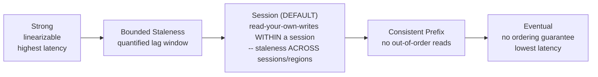
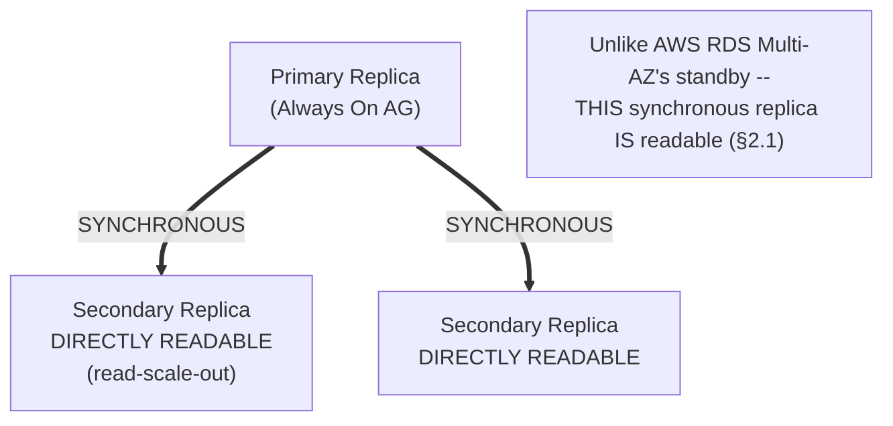

# Module 68 — Azure: Databases — Azure SQL Database, Managed Instance & Cosmos DB Integration

> Domain: Azure | Level: Beginner → Expert | Prerequisite: [[../21-AWS/04-Databases-RDS-Aurora-DynamoDB]] (this module mirrors that module's structure — Azure SQL Database/Managed Instance against RDS/Aurora, Cosmos DB against DynamoDB — flagging Cosmos DB's five-level tunable consistency spectrum as the single most consequential divergence), [[03-Storage-Blob-ManagedDisks-Files-Redundancy]] §2.1 (Azure SQL Database's zone-redundant configuration builds on the same redundancy-tier framework)

---

## 1. Fundamentals

### Why does a Principal Engineer need Azure database depth given Module 60 already established the RDS/Aurora/DynamoDB decision framework generically?
The framework (relational-vs-NoSQL trade-offs, read-scaling-vs-failover distinctions, replication-lag/consistency reasoning) transfers directly — what's genuinely new and highest-stakes here is that **Cosmos DB exposes consistency as an explicit, five-level tunable spectrum** rather than DynamoDB's simpler binary (eventually consistent vs. strongly consistent, per-request) choice, meaning a Principal Engineer must reason about a materially richer, more nuanced consistency-configuration space than this course's DynamoDB material alone prepared for — misapplying a DynamoDB-derived mental model to Cosmos DB's actual consistency semantics is a distinctly Azure-specific risk this module exists to address directly.

### Why does this matter?
Because Cosmos DB's default consistency level (**Session**) provides a *weaker* guarantee than what "consistent" intuitively suggests to an engineer whose only prior NoSQL consistency experience is DynamoDB's simpler model, and because Cosmos DB's native multi-region, multi-master write support (a genuine capability difference from DynamoDB's more constrained Global Tables model) introduces distributed-consistency trade-offs a Principal Engineer must reason through explicitly, not by analogy to a system that doesn't offer the same range of choices.

### When does this matter?
Any Azure-based relational or NoSQL data-layer decision — and specifically, any workload considering Cosmos DB's multi-region capabilities, where the specific consistency level chosen has direct, consequential correctness implications this module makes explicit.

### How does it work (30,000-ft view)?
```
Azure SQL Database: PaaS relational database (SQL Server-compatible) -- Azure's RDS/Aurora
     equivalent, with BUILT-IN high-availability architecture varying by service tier
Azure SQL Managed Instance: near-100%-compatible SQL Server instance, PaaS-managed -- for
     workloads needing SQL Server instance-level features Azure SQL Database (a narrower
     PaaS surface) doesn't expose
Cosmos DB: Azure's globally-distributed, multi-model NoSQL database -- DynamoDB's closest
     equivalent, but with FIVE tunable consistency levels and native multi-region MULTI-MASTER
     writes (DynamoDB Global Tables' last-writer-wins is a narrower model)
Elastic Pools: shared compute/storage resource pooling across MULTIPLE Azure SQL Databases --
     NO direct RDS/Aurora equivalent
```

---

## 2. Deep Dive

### 2.1 Azure SQL Database's Built-In High Availability — Genuinely Different Architecture From RDS Multi-AZ
Azure SQL Database's high-availability architecture is **built into the service tier itself**, not a separately-toggled feature the way RDS Multi-AZ is: the **General Purpose** tier uses a remote-storage architecture (compute and storage separated, with storage itself redundantly stored, conceptually closer to Aurora's storage-decoupling, Module 60 §2.3, than to standard RDS); the **Business Critical** tier uses a local-SSD, **Always On availability-group-based** architecture with (critically) **multiple synchronously-replicated secondary replicas that are directly readable** (via "read-scale-out") — this is a genuine, structural divergence from AWS's model: RDS Multi-AZ's standby is never directly readable (Module 60 §2.1), while Azure SQL Database Business Critical's secondaries **are** readable by default, meaning the AWS-derived instinct "the synchronous HA replica can't be read from" is specifically **wrong** for Azure SQL Database Business Critical and must be unlearned, not merely mapped across.

### 2.2 Azure SQL Managed Instance vs. Azure SQL Database — a Deployment-Model Choice With No Single RDS/Aurora Equivalent
Azure SQL Database (the PaaS, single/pooled-database model) trades some SQL Server instance-level surface area (certain cross-database queries, SQL Agent, instance-level configuration) for a fully-managed, serverless-adjacent operational model; **Azure SQL Managed Instance** provides near-100%-compatible SQL Server instance semantics (supporting cross-database transactions, SQL Agent jobs, CLR, linked servers) while remaining PaaS-managed — this specific two-tier split (narrower PaaS surface vs. broader instance-compatible PaaS) has no precise single AWS equivalent: RDS SQL Server is closer to Managed Instance's instance-compatibility model, but AWS has no intermediate "Azure SQL Database"-style narrower-PaaS-surface-with-simpler-operations option for SQL Server specifically — a Principal Engineer migrating a SQL Server workload with genuine instance-level feature dependencies (cross-database queries, SQL Agent) must choose Managed Instance, not Azure SQL Database, a decision point this course's RDS SQL Server material didn't need to make since AWS doesn't split this choice the same way.

### 2.3 Cosmos DB's Five Consistency Levels — the Single Most Consequential Divergence From DynamoDB
Cosmos DB exposes five explicit, selectable consistency levels along a single spectrum: **Strong** (linearizable — every read reflects the most recent committed write, globally, at the cost of higher write latency in multi-region configurations); **Bounded Staleness** (reads lag writes by at most a configurable time window or version-count, a middle ground with a quantified, bounded staleness guarantee); **Session** (the **default** — guarantees read-your-own-writes and monotonic-reads consistency **within a single client session**, but reads from a *different* session, or a different region, can observe staleness — this is the level most likely to be misunderstood by a DynamoDB-experienced engineer, since DynamoDB has no direct "session" concept at all); **Consistent Prefix** (reads never see out-of-order writes, but may lag behind the latest write); **Eventual** (weakest — no ordering guarantee at all). This is structurally richer than DynamoDB's simple binary choice (Module 27-28's "eventually consistent read" vs. "strongly consistent read," a per-request flag with no session-scoping concept, no bounded-staleness quantification, and no consistent-prefix option) — a Principal Engineer must explicitly reason about which of Cosmos DB's five levels a given access pattern actually requires, since defaulting to Session (Cosmos DB's default) without this explicit reasoning risks the exact same category of surprise Module 60 §4 described for RDS read replicas, now with a materially more nuanced failure mode (session-boundary-crossing staleness, not just simple replication lag).

### 2.4 Cosmos DB Multi-Region Writes — Native Multi-Master, a Genuine Capability Beyond DynamoDB Global Tables
Cosmos DB natively supports **multi-region writes** (multiple regions simultaneously accepting writes, not just one primary region with read-only secondaries) with **conflict resolution policies** a Principal Engineer must explicitly configure: **Last-Writer-Wins** (directly matching Module 60 §2.4's DynamoDB Global Tables default, with the identical concurrent-overwrite risk Module 60 §Advanced Q7 already established), or a **custom conflict-resolution procedure** (a user-defined function resolving conflicts with application-specific logic — a genuine capability beyond what DynamoDB Global Tables offers natively, which is fixed to last-writer-wins with no custom-resolution-procedure option) — a Principal Engineer designing a genuinely multi-writer, conflict-prone Cosmos DB workload should strongly consider the custom-conflict-resolution-procedure option specifically because it directly addresses Module 60 §Advanced Q7's shopping-cart-data-loss scenario at the platform level, rather than requiring the application-level mergeable-data-model redesign that scenario's actual AWS-side fix required.

### 2.5 Request Units (RUs) — Cosmos DB's Distinctly Different Capacity-and-Cost Model
Cosmos DB capacity and cost are expressed in **Request Units (RUs)**, an abstracted, normalized throughput unit representing the cost of a given operation (a point read of a 1KB item costs approximately 1 RU; a write, query, or larger item costs proportionally more) — this is a genuinely different capacity-planning mental model from DynamoDB's read/write capacity units (which, while conceptually similar in spirit, are not numerically equivalent nor calculated the same way) and requires explicit RU-cost estimation per operation type during design, since an inefficiently-designed query (e.g., a cross-partition query without proper indexing) can consume dramatically more RUs than an equivalent well-designed one — directly the same partition-key-and-access-pattern-design discipline Module 27 established for DynamoDB, but expressed through Cosmos DB's own RU-costing lens, where a poorly-designed access pattern manifests as a direct, quantifiable cost/throttling problem rather than DynamoDB's somewhat different hot-partition failure signature.

### 2.6 Elastic Pools — Shared Resource Pooling With No Direct RDS/Aurora Equivalent
Azure SQL Database **Elastic Pools** allow multiple databases (typically many small-to-medium databases, such as one database per tenant in a multi-tenant SaaS architecture) to share a pool of compute/storage resources, with Azure automatically managing resource allocation across the pool based on each database's actual, varying demand — this directly addresses a workload pattern (many independent databases, each with unpredictable, non-simultaneous peak usage) that would otherwise require either over-provisioning each database individually (wasteful) or complex custom resource-sharing logic; AWS's RDS/Aurora model has no direct equivalent (the closest AWS analog being Aurora Serverless's own per-database auto-scaling, which scales a single database's own capacity rather than pooling resources *across* multiple independent databases) — a Principal Engineer designing a multi-tenant, database-per-tenant Azure SQL architecture should specifically evaluate Elastic Pools as a genuinely Azure-native cost/operational optimization with no direct AWS parallel to reason from.

---

## 3. Visual Architecture

### Cosmos DB's Five Consistency Levels — a Spectrum, Not a Binary (§2.3)


### Azure SQL Database Business Critical — Readable Synchronous Secondaries (§2.1)


## 4. Production Example
**Scenario**: A team building a globally-distributed inventory-tracking system chose Cosmos DB specifically for its native multi-region, multi-master write capability, configuring **Session** consistency (the default, left unchanged since the team's prior DynamoDB experience led them to assume "the default consistency level is a reasonable, safe choice, the way DynamoDB's default eventually-consistent reads are reasonable for most access patterns") and multi-region writes across three regions to serve users with low latency globally. **Investigation**: warehouse staff in one region occasionally observed inventory counts that appeared to "revert" to a stale value shortly after a colleague in a different region had just updated the same item — investigation traced this to the fact that Session consistency's read-your-own-writes guarantee is scoped to a **single client session** (typically tied to a specific client's session token) — a warehouse worker's mobile app, after an app restart or a network reconnection event, would sometimes establish a **new** session (losing the continuity of the previous session's token), and if that new session's request was served by a **different region** than the one the most recent write had gone to, the read could reflect that other region's (still catching up via cross-region replication) state, appearing to "revert" the value the user had just seen moments earlier in their previous session. **Root cause**: the team's mental model, calibrated on DynamoDB's simpler consistency choice (where "eventually consistent, but usually fast enough" is a reasonably safe default assumption for many access patterns), didn't account for Session consistency's specific *session-scoping* mechanic — a concept DynamoDB has no equivalent of, meaning there was no natural prior experience to prompt the team to ask "what exactly does 'session' mean here, and what happens at a session boundary?" **Fix**: for the specific inventory-count read path where users needed to see genuinely up-to-date values regardless of session continuity (not just their own prior writes), upgraded that specific query path to **Bounded Staleness** with an explicitly-chosen, business-justified staleness window (directly Module 60 §4's per-read-path consistency categorization discipline, now applied to Cosmos DB's richer five-level spectrum) — while leaving other, genuinely session-scoped-tolerant access patterns (a user's own shopping-cart-style workflow within a single continuous session) on the cheaper, lower-latency Session default. **Lesson**: Cosmos DB's consistency spectrum is more powerful and more nuanced than DynamoDB's, and that additional power specifically requires additional, deliberate reasoning that a DynamoDB-experienced team won't automatically bring — "the default is probably fine, like it usually is on DynamoDB" is precisely the kind of false-familiarity assumption this Azure domain has now identified as its central risk pattern in every module so far, recurring here in its most technically subtle form yet.

## 5. Best Practices
- Explicitly select a Cosmos DB consistency level per access pattern based on that pattern's actual requirement — never leave every access pattern on the Session default without deliberate consideration of session-boundary-crossing staleness risk (§4).
- Choose Azure SQL Managed Instance (not Azure SQL Database) for any SQL Server workload with genuine instance-level feature dependencies (cross-database transactions, SQL Agent, linked servers) — verify this requirement explicitly rather than defaulting to the simpler PaaS option (§2.2).
- Use Azure SQL Database Business Critical tier's readable secondaries for genuine read-scaling needs, but verify this against the workload's actual consistency requirement the same way Module 60 §4 established for RDS read replicas.
- Explicitly estimate RU cost per operation type during Cosmos DB schema/query design, treating RU-inefficient access patterns as a first-class design concern, not an afterthought discovered via throttling in production (§2.5).
- Evaluate Elastic Pools for any multi-tenant, database-per-tenant Azure SQL architecture with non-simultaneous per-tenant peak usage, as a genuinely Azure-native cost-optimization opportunity (§2.6).

## 6. Anti-patterns
- Leaving Cosmos DB's consistency level at its Session default for every access pattern without considering session-boundary-crossing staleness risk, based on a DynamoDB-derived "the default is usually fine" assumption (§4).
- Choosing Azure SQL Database (rather than Managed Instance) for a workload with genuine SQL Server instance-level feature dependencies, discovering the gap only after migration is underway.
- Assuming Azure SQL Database Business Critical's synchronous secondary replicas are not directly readable, based on an AWS RDS Multi-AZ-derived assumption, and therefore missing a genuinely available read-scaling capability.
- Designing Cosmos DB queries/partition strategies without explicit RU-cost estimation, discovering inefficient, expensive access patterns only via production throttling.
- Defaulting to Last-Writer-Wins conflict resolution for a genuinely multi-writer, conflict-prone Cosmos DB workload without evaluating the custom-conflict-resolution-procedure option Module 60's DynamoDB Global Tables material had no equivalent for.

## 7. Performance Engineering
Cosmos DB's Strong consistency level, when combined with multi-region write configuration, imposes materially higher write latency (since a strongly-consistent, linearizable write must synchronously coordinate across regions) than Session or Eventual consistency — a Principal Engineer should treat this as a genuine, quantifiable latency-vs-consistency trade-off requiring explicit per-workload justification, not a default "use the strongest available option" choice, the same discipline Module 67 §Advanced Q2 already established against uniformly defaulting to the strongest storage-redundancy tier. Azure SQL Database's Business Critical tier's local-SSD architecture provides materially lower query latency than General Purpose's remote-storage architecture, at correspondingly higher cost — a genuinely latency-sensitive OLTP workload should explicitly benchmark this trade-off against General Purpose rather than assuming the more expensive tier is unconditionally justified.

## 8. Security
Cosmos DB supports both Azure RBAC-based data-plane access control (a more recent, more granular capability aligning with Module 66's RBAC discipline) and legacy primary/secondary-key-based access (a simpler, but structurally weaker, shared-secret model closer to a static API key than to Module 66's Managed-Identity-based, credential-free access pattern) — a Principal Engineer should prefer RBAC-based access via Managed Identities for any new Cosmos DB integration, treating the key-based model as a legacy compatibility option rather than the default, directly extending Module 66 §2.3's Managed-Identity-preference discipline into the database-access-layer specifically. Azure SQL Database's Transparent Data Encryption (TDE) with Key-Vault-managed keys (rather than Azure-managed keys) should follow the same object-level-scoping-plus-network-isolation defense-in-depth discipline Module 66 §2.4 established generally for Key-Vault-backed encryption.

## 9. Scalability
Cosmos DB's RU-based capacity model (§2.5) can be configured as either **provisioned throughput** (a fixed RU/s allocation, requiring the same steady-state-vs-peak capacity-planning discipline Module 57 §2.5 established for AWS elastic-capacity matching) or **autoscale** (automatically scaling RU/s within a configured range based on actual demand) — a Principal Engineer should match this choice to the workload's actual demand variability the same way Module 64 §2.4's compute-purchasing-option discussion matched On-Demand/Savings-Plans/Spot to usage patterns, since over-provisioned fixed RU/s wastes cost identically to an over-provisioned Reserved Instance, and under-provisioned fixed RU/s causes request throttling identical in effect to Module 60 §9's DynamoDB hot-partition-driven throttling. Elastic Pools' shared-resource model (§2.6) requires capacity-planning the *aggregate* pool demand across all member databases' combined peak usage patterns, not just each database's individual average — a pool sized for the sum of individual databases' averages can still be under-provisioned if member databases' peaks correlate (all tenants experiencing peak load simultaneously, e.g., during a shared business-hours window), a subtlety with no direct single-database RDS/Aurora capacity-planning equivalent to reason from.

---

## 10. Interview Questions

### Basic (10)
1. **Q: What is the Azure equivalent of AWS RDS?** **A:** Azure SQL Database (PaaS) and Azure SQL Managed Instance (near-full SQL Server instance compatibility, still PaaS-managed).
2. **Q: What is the key difference between Azure SQL Database and Azure SQL Managed Instance?** **A:** Managed Instance provides near-100% SQL Server instance-level compatibility (cross-database transactions, SQL Agent); Azure SQL Database trades some of that surface area for a simpler, fully-managed PaaS model.
3. **Q: Are Azure SQL Database Business Critical's synchronous secondary replicas directly readable?** **A:** Yes — unlike AWS RDS Multi-AZ's standby, which is never directly readable.
4. **Q: How many consistency levels does Cosmos DB offer, and what is the default?** **A:** Five (Strong, Bounded Staleness, Session, Consistent Prefix, Eventual); the default is Session.
5. **Q: What does Session consistency guarantee, and what is its key limitation?** **A:** Read-your-own-writes and monotonic reads within a single client session; reads from a different session (or region) can observe staleness.
6. **Q: What is a Request Unit (RU) in Cosmos DB?** **A:** An abstracted, normalized throughput unit representing the cost of a given database operation.
7. **Q: What genuine capability does Cosmos DB's multi-region write support offer beyond DynamoDB Global Tables?** **A:** A custom, user-defined conflict-resolution procedure, in addition to the last-writer-wins default DynamoDB Global Tables is limited to.
8. **Q: What are Azure SQL Database Elastic Pools?** **A:** Shared compute/storage resource pools across multiple databases, with Azure automatically managing allocation based on each database's varying demand.
9. **Q: What two Cosmos DB access-control models exist, and which should be preferred?** **A:** Azure RBAC-based (via Managed Identities, preferred) and legacy primary/secondary-key-based (a simpler, structurally weaker shared-secret model).
10. **Q: What are the two Cosmos DB throughput provisioning models?** **A:** Provisioned throughput (fixed RU/s) and autoscale (automatically scaling within a configured range).

### Intermediate (10)
1. **Q: Why is "the synchronous HA replica can't be read from" specifically wrong when applied to Azure SQL Database Business Critical, despite being correct for AWS RDS Multi-AZ?** **A:** Business Critical's Always-On-availability-group architecture provides directly readable secondary replicas (read-scale-out) as a built-in capability, a structural divergence from RDS Multi-AZ's non-readable standby — applying the AWS rule here causes an engineer to miss a genuinely available read-scaling option.
2. **Q: Why did the §4 incident's staleness issue specifically correlate with app restarts/network reconnections rather than occurring at a constant background rate?** **A:** Session consistency's guarantee is scoped to a specific session token; an app restart or reconnection can establish a new session, losing continuity with the previous session's guarantee — the staleness only becomes visible when a new session happens to be served by a region that hasn't yet caught up with a very recent write from the prior session.
3. **Q: Why is Cosmos DB's Session consistency described as "the level most likely to be misunderstood by a DynamoDB-experienced engineer"?** **A:** DynamoDB has no equivalent "session" concept at all — its consistency choice is a simple per-request flag, so a DynamoDB-experienced engineer has no prior conceptual framework prompting them to ask what session-scoping specifically means or where its boundaries lie.
4. **Q: Why should Azure SQL Managed Instance be chosen over Azure SQL Database when a workload has genuine cross-database transaction requirements, rather than treating this as a minor implementation detail?** **A:** Azure SQL Database's narrower PaaS surface doesn't support cross-database transactions the way Managed Instance's near-full SQL Server compatibility does — discovering this gap after migration requires a costly re-platforming, not a configuration change, making it a upfront, consequential architectural decision.
5. **Q: Why does Cosmos DB's custom-conflict-resolution-procedure capability directly address a gap Module 60 identified in DynamoDB Global Tables?** **A:** Module 60 §Advanced Q7's shopping-cart data-loss scenario required an application-level, mergeable-data-model redesign specifically because DynamoDB Global Tables offers only last-writer-wins with no alternative; Cosmos DB's custom conflict-resolution procedure allows equivalent merge-friendly logic to be implemented at the platform level instead, without necessarily requiring the same data-model redesign.
6. **Q: Why is RU-cost estimation described as a "first-class design concern" for Cosmos DB rather than an operational afterthought?** **A:** An inefficiently-designed query (e.g., a cross-partition query without proper indexing) can consume dramatically more RUs than a well-designed equivalent, directly and immediately translating into higher cost and throttling risk — treating this as discoverable only via production monitoring means costly design mistakes aren't caught until they're already impacting real traffic.
7. **Q: Why is Elastic Pools' aggregate-demand capacity planning described as having "no direct single-database RDS/Aurora equivalent to reason from"?** **A:** Because RDS/Aurora capacity planning is inherently single-database-scoped, while Elastic Pools require reasoning about correlated peak-usage risk *across* multiple independent databases sharing a pool — a capacity-planning dimension (cross-database demand correlation) that simply doesn't exist in a single-database context.
8. **Q: Why should Cosmos DB Strong consistency with multi-region writes not be treated as a default "use the strongest option" choice?** **A:** It imposes materially higher write latency due to the synchronous cross-region coordination linearizability requires, meaning the choice carries a genuine, quantifiable performance cost that must be explicitly justified per workload, not assumed to be a free upgrade over weaker consistency levels.
9. **Q: Why should Cosmos DB's legacy key-based access model be treated as a compatibility option rather than a default, per Module 66's discipline?** **A:** It's a simpler, static shared-secret model structurally weaker than Managed-Identity-based RBAC access (no automatic rotation, no fine-grained scoping tied to a specific workload identity's lifecycle) — Module 66 §2.3 already established Managed Identities as the preferred default for exactly this class of credential-management risk.
10. **Q: Why does the §4 incident's fix apply Bounded Staleness only to the specific inventory-count read path, rather than upgrading the entire system's consistency level uniformly?** **A:** Directly Module 60 §4's per-read-path categorization discipline — only the specific access pattern that genuinely required cross-session/cross-region freshness needed the stronger (and more expensive/higher-latency) guarantee; other genuinely session-scoped-tolerant patterns could remain on the cheaper, lower-latency Session default without incurring unnecessary cost for a guarantee they didn't need.

### Advanced (10)
1. **Q: Diagnose the §4 incident from first principles, and design the specific per-access-pattern consistency-level review practice that would have caught this gap before a live warehouse-operations issue exposed it.**
   **A:** Root cause: the team applied a DynamoDB-calibrated "default consistency is usually fine" heuristic to Cosmos DB's structurally different, session-scoped default, without an explicit review of what "session" means or where session boundaries could be crossed by genuine client behavior (app restarts, reconnections). Safeguard: a standing architecture-review requirement — for every Cosmos DB access pattern, explicitly document (a) whether reads must reflect writes made by a *different* client/session, and (b) whether reads must reflect writes made in a *different region* — any access pattern answering "yes" to either question requires at minimum Bounded Staleness, not Session, converting an implicit, undiscovered assumption into an explicit, reviewed design decision, directly generalizing Module 60 §4's per-read-path categorization discipline to Cosmos DB's richer consistency spectrum specifically.
2. **Q: A team argues that since Cosmos DB's Strong consistency eliminates all the session-boundary and cross-region staleness risks §4 describes, they should simply configure Strong consistency globally and avoid needing to reason about per-access-pattern consistency requirents at all. Evaluate this claim.**
   **A:** Push back — this trades away a genuine, often business-critical benefit (low-latency multi-region reads/writes, frequently the entire reason a globally-distributed system chose Cosmos DB's multi-region capability in the first place) for blanket safety, the same "avoid thinking about it by defaulting to the strongest option everywhere" anti-pattern Module 67 §Advanced Q2 already flagged for storage redundancy — the correct response to §4's incident is explicit, deliberate per-access-pattern reasoning (Advanced Q1), not eliminating the entire tunable-consistency capability that was presumably a deliberate, valuable reason for choosing Cosmos DB over a simpler alternative in the first place.
3. **Q: Design the specific pre-production test that would reproduce the §4 incident's exact failure condition (a client establishing a new session served by a region lagging behind a very recent write), generalizing this domain's recurring "steady-state testing doesn't exercise the failure-triggering condition" pattern to Cosmos DB session boundaries specifically.**
   **A:** A test that deliberately writes to Region A, immediately forces a new client session (simulating an app restart/reconnection) explicitly routed to Region B (or any region other than A) before Region B's replication has caught up, then reads via that new session and verifies whether the expected freshness guarantee actually holds for the specific consistency level under test — steady-state testing (where a client's session naturally persists across a request and replication has ample time to catch up between test steps) never exercises this specific timing/session-discontinuity window, the same lesson recurring from Module 57 §Advanced Q1 through Module 67 §Advanced Q3, now applied to Cosmos DB session-boundary timing specifically.
4. **Q: A workload needs to migrate from DynamoDB (using strongly-consistent reads for a specific access pattern) to Cosmos DB. Design the specific consistency-level mapping and validation approach, avoiding both under- and over-provisioning consistency guarantees.**
   **A:** DynamoDB's strongly-consistent read (a single-region, immediately-consistent read against the current leader) maps most directly to Cosmos DB's **Strong** consistency level *if* the Cosmos DB deployment is single-region, or requires explicit evaluation of whether the *actual* requirement is genuinely global strong consistency (justifying Cosmos DB Strong's multi-region latency cost) or whether the original DynamoDB access pattern's strong-consistency need was itself only ever exercised within an effectively single "session" of related requests (in which case Session consistency, materially cheaper and lower-latency, may be sufficient) — the migration should not assume a naive one-to-one mapping (DynamoDB-strong → Cosmos-Strong) without this explicit analysis, since Cosmos DB's spectrum offers intermediate options (Bounded Staleness) with no DynamoDB equivalent that might be the more cost-effective, correctly-calibrated actual match.
5. **Q: Critique the following claim: "Since we chose Last-Writer-Wins conflict resolution for our multi-region Cosmos DB deployment, matching DynamoDB Global Tables' only available option, we've made the safe, conservative choice."**
   **A:** This inverts the actual risk comparison — Module 60 §Advanced Q7 already established that Last-Writer-Wins carries genuine, silent data-loss risk for any concurrently-modifiable data (the shopping-cart scenario); choosing it on Cosmos DB specifically because "it's what DynamoDB offers" ignores that Cosmos DB offers a *strictly more capable* alternative (custom conflict-resolution procedures, §2.4) that DynamoDB doesn't have — "matching the more limited platform's only option" isn't inherently the conservative or safe choice when the current platform offers a superior alternative; the genuinely safe choice requires evaluating whether the specific data is concurrently-modifiable (per Module 60 §Advanced Q7's diagnostic) and using the custom-resolution capability if so.
6. **Q: Design a decision framework for choosing between Azure SQL Database Business Critical's readable secondaries (§2.1) versus Cosmos DB for a workload needing both strong relational-transaction guarantees and significant read-scaling.**
   **A:** If the workload's core transactional logic genuinely requires relational guarantees (multi-table joins, complex transactional consistency across normalized tables) that a document/NoSQL model would awkwardly force into denormalized structures, Azure SQL Database Business Critical's readable secondaries provide read-scaling *without* sacrificing the relational model — directly analogous to Module 60 §2.5's RDS/Aurora-vs-DynamoDB decision framework; only if the access patterns are genuinely known upfront, latency-critical at very high global scale, and don't require complex relational joins should Cosmos DB (with its own read-scaling via replica regions and tunable consistency) be preferred instead — the decision hinges on the same relational-vs-NoSQL data-modeling fit question Module 60 §2.5 already established, with Business Critical's readable secondaries specifically removing "we need read-scaling" as a reason to abandon a genuinely relational data model in favor of Cosmos DB.
7. **Q: A Principal Engineer discovers that a multi-tenant SaaS application's Elastic Pool is frequently hitting its aggregate DTU/vCore ceiling despite each individual tenant database's own average utilization appearing well within its allocated share. Diagnose and propose a fix.**
   **A:** Likely cause: correlated peak usage across tenants (§9's exact lesson) — if most tenants share overlapping business-hours peak windows, the pool's aggregate demand at that shared peak can exceed what was capacity-planned based on each database's *individual average*, even though no single database's average looks concerning in isolation. Fix: capacity-plan the pool against the aggregate **peak-coincidence** scenario specifically (modeling what happens if a meaningful fraction of tenants peak simultaneously, not just each tenant's own average), and consider either increasing the pool's provisioned ceiling or, for tenants with genuinely predictable, non-overlapping peak windows, evaluating whether pool membership should be segmented by peak-time cohort rather than pooled uniformly.
8. **Q: Explain why Cosmos DB's RU-based cost model (§2.5) makes a poorly-designed query pattern a more immediately visible problem than an equivalent DynamoDB partition-key design mistake, and what this implies for how the two platforms' respective design-review processes should differ.**
   **A:** Cosmos DB directly translates query inefficiency into a quantifiable RU cost visible per-operation (and, at scale, a direct cost-and-throttling signal), whereas DynamoDB's hot-partition problem (Module 27) manifests primarily as a *localized* throughput ceiling on a specific partition, potentially less immediately visible in aggregate account-level metrics until that specific partition's traffic grows large enough to matter — this implies Cosmos DB's design review can lean more heavily on RU-cost-estimation tooling as an early, quantitative signal, while DynamoDB's review must rely more on explicit partition-key-design reasoning and access-pattern modeling (Module 27's discipline) since the cost/throttling signal is less immediately quantifiable per-query in the same way.
9. **Q: Design the specific set of Azure-native governance checks (extending this domain's recurring pattern from Modules 65-67) that would structurally prevent both the §4 Cosmos DB consistency gap and an Azure SQL Managed-Instance-vs-Database mismatch from recurring across an organization.**
   **A:** (1) A mandatory architecture-review checklist item requiring explicit per-access-pattern consistency-level justification for any new Cosmos DB container (Advanced Q1), rather than accepting the Session default without documented reasoning. (2) A mandatory pre-migration assessment tool/checklist item that scans a SQL Server workload's actual feature usage (cross-database queries, SQL Agent dependencies, linked servers) and flags a Managed-Instance requirement automatically before an Azure SQL Database migration is approved (§2.2), converting a discoverable-only-after-migration gap into an upfront, tooling-assisted decision.
10. **As a Principal Engineer establishing Azure database standards for an organization migrating from AWS, design the specific set of standing architectural reviews and automated checks (synthesizing this entire module) you would require for every new Azure SQL Database/Managed Instance/Cosmos DB workload.**
    **A:** (1) Mandatory explicit per-access-pattern Cosmos DB consistency-level documentation and review (Advanced Q1, Advanced Q9) — necessary because the Session default's session-scoping risk is invisible without deliberate consideration. (2) Mandatory SQL-Server-feature-dependency scan before choosing Azure SQL Database over Managed Instance (Advanced Q9) — necessary to prevent costly post-migration re-platforming. (3) Mandatory conflict-resolution-strategy review (custom procedure vs. last-writer-wins) for any multi-region-write Cosmos DB deployment handling concurrently-modifiable data (Advanced Q5) — necessary given Cosmos DB's stronger-than-DynamoDB capability here is easy to under-utilize by defaulting to the more familiar, weaker option. (4) Mandatory aggregate peak-coincidence capacity modeling for any Elastic Pool spanning multiple tenants (Advanced Q7) — necessary because individual-database-average-based planning systematically under-provisions for correlated peaks. (5) Mandatory RU-cost estimation as a required design-review artifact for any new Cosmos DB container/query pattern (§2.5, Advanced Q8) — necessary to catch inefficient access patterns before production throttling surfaces them. Each standard directly extends this Azure domain's now-established governance pattern (Modules 65-67) into the database layer, treating Cosmos DB's richer consistency/conflict-resolution capability as requiring *more* deliberate design reasoning than its AWS counterpart, not less, precisely because it offers more configuration surface to potentially misconfigure.

---

## 11. Coding Exercises

### Easy — Cosmos DB container with explicitly-justified, per-access-pattern consistency override (§2.3, §4's fix)
```csharp
// Container-DEFAULT remains Session (cheap, low-latency) -- but THIS specific
// read path explicitly overrides to Bounded Staleness, matching §4's actual fix.
var requestOptions = new QueryRequestOptions
{
    ConsistencyLevel = ConsistencyLevel.BoundedStaleness  // explicit override, NOT the account-level default
};

var inventoryCount = await _container.GetItemQueryIterator<InventoryItem>(
    "SELECT * FROM c WHERE c.sku = @sku",
    requestOptions: requestOptions
).ReadNextAsync();
```

### Medium — Elastic Pool sized for aggregate peak-coincidence, not individual average (§2.6, §Advanced Q7)
```hcl
resource "azurerm_mssql_elasticpool" "tenant_pool" {
  name                = "tenant-shared-pool"
  resource_group_name = azurerm_resource_group.saas_prod.name
  server_name         = azurerm_mssql_server.saas.name

  sku {
    name     = "GP_Gen5"
    tier     = "GeneralPurpose"
    family   = "Gen5"
    capacity = 40   # sized against MODELED peak-coincidence scenario (Advanced Q7),
                     # NOT the sum of each tenant database's own individual average
  }

  per_database_settings {
    min_capacity = 0.25
    max_capacity = 10   # any single noisy-neighbor tenant capped well below pool total
  }
}
```

### Hard — Cosmos DB custom conflict-resolution procedure for concurrently-modifiable data (§2.4, §Advanced Q5)
```javascript
// Cosmos DB conflict-resolution stored procedure -- NOT last-writer-wins (§Advanced Q5's lesson,
// directly addressing Module 60 §Advanced Q7's shopping-cart data-loss scenario at the platform level).
function resolveCartConflict(incomingItem, existingItem, isTombstone, conflictingItems) {
    if (isTombstone) { getContext().getResponse().setBody(false); return; }

    // MERGE cart line-items from both conflicting versions, rather than whole-item overwrite --
    // avoids silently losing a concurrently-added item the way pure last-writer-wins would.
    var mergedItems = mergeLineItems(incomingItem.lineItems, existingItem.lineItems);
    var resolvedCart = Object.assign({}, existingItem, { lineItems: mergedItems, _ts: Math.max(incomingItem._ts, existingItem._ts) });

    var collection = getContext().getCollection();
    collection.replaceDocument(collection.getSelfLink() + resolvedCart._rid, resolvedCart,
        function (err) { if (err) throw err; getContext().getResponse().setBody(true); });
}
```

### Expert — RU-cost-aware query design with partition-key alignment (§2.5, §Advanced Q8)
```csharp
// GOOD: query scoped to a single logical partition (tenantId) -- LOW RU cost,
// directly analogous to Module 27's DynamoDB partition-key-design discipline.
var efficientQuery = _container.GetItemQueryIterator<Order>(
    new QueryDefinition("SELECT * FROM c WHERE c.tenantId = @tenantId AND c.status = @status")
        .WithParameter("@tenantId", tenantId)
        .WithParameter("@status", "pending"),
    requestOptions: new QueryRequestOptions { PartitionKey = new PartitionKey(tenantId) }  // single-partition -- cheap
);

// BAD: cross-partition fan-out query with no partition-key filter -- HIGH RU cost,
// the Cosmos DB-specific manifestation of Module 27's hot-partition/inefficient-access-pattern risk.
var expensiveQuery = _container.GetItemQueryIterator<Order>(
    "SELECT * FROM c WHERE c.status = @status"   // scans EVERY partition -- flagged in design review (§Advanced Q8)
);
```
**Discussion**: the efficient query's explicit `PartitionKey` scoping directly avoids the cross-partition fan-out that would otherwise consume dramatically more RUs — this is the concrete, Cosmos-DB-specific expression of Advanced Q8's point that RU cost makes this class of design mistake immediately quantifiable and therefore catchable in design review, unlike DynamoDB's comparatively less immediately visible hot-partition failure signature.

---

## 12–17. System Design / LLD / Debugging / Decision / Case Study / Principal

*(§4's incident, the four §11 exercises, and the Advanced-tier Q&A — especially Advanced Q1's per-access-pattern consistency review, Advanced Q5's conflict-resolution-strategy critique, and Advanced Q10's synthesized governance checklist — collectively constitute this module's system-design, debugging, and Principal-Engineer-level content.)*

## 18. Revision
**Key takeaways**: Azure SQL Database's high-availability architecture is built into the service tier itself, with Business Critical's synchronous secondaries being directly readable — a genuine structural divergence from AWS RDS Multi-AZ's non-readable standby that must be actively unlearned, not assumed. Azure SQL Managed Instance vs. Azure SQL Database is a deployment-model choice with no single RDS/Aurora equivalent, requiring an explicit SQL-Server-feature-dependency check before migration. Cosmos DB's five-level tunable consistency spectrum — especially the session-scoped nature of its Session default — is the single most consequential divergence from DynamoDB's simpler binary model, and requires explicit, per-access-pattern reasoning about session and region boundaries that a DynamoDB-experienced team won't automatically bring (§4). Cosmos DB's custom conflict-resolution procedures offer a genuine capability improvement over DynamoDB Global Tables' fixed last-writer-wins, directly addressing Module 60's concurrently-modifiable-data risk at the platform level. Request Units make query-design inefficiency immediately quantifiable, a genuinely different and more visible cost signal than DynamoDB's hot-partition failure mode. Elastic Pools introduce a cross-database, correlated-peak capacity-planning dimension with no single-database RDS/Aurora equivalent.

---

**Next**: Continuing to Module 69 — Azure: Serverless (Azure Functions, API Management, Logic Apps), continuing the `22-Azure` domain and mirroring Module 61's AWS serverless structure.
