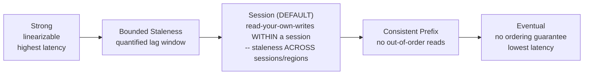
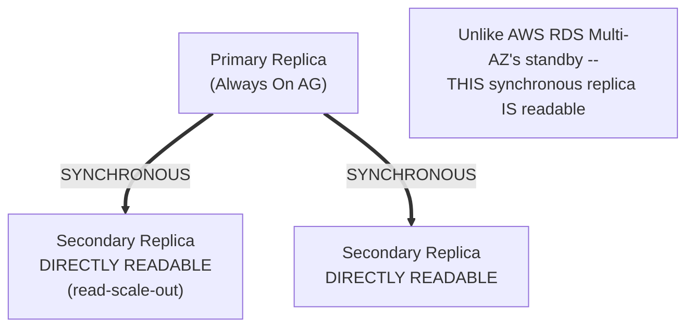
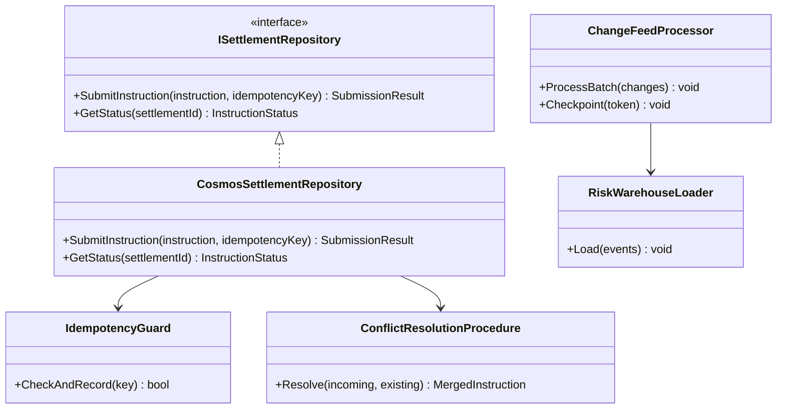

# Module 68 — Azure: Databases — Azure SQL Database, Managed Instance & Cosmos DB Integration

> Domain: Azure | Level: Beginner → Expert | Prerequisite: [[../21-AWS/04-Databases-RDS-Aurora-DynamoDB]] (this module mirrors that module's structure — Azure SQL Database/Managed Instance against RDS/Aurora, Cosmos DB against DynamoDB — flagging Cosmos DB's five-level tunable consistency spectrum as the single most consequential divergence), [[03-Storage-Blob-ManagedDisks-Files-Redundancy]] (Azure SQL Database's zone-redundant configuration builds on the same redundancy-tier framework)

---

## 1. Fundamentals

### Why does a Principal Engineer need Azure database depth given already established the RDS/Aurora/DynamoDB decision framework generically?
The framework (relational-vs-NoSQL trade-offs, read-scaling-vs-failover distinctions, replication-lag/consistency reasoning) transfers directly — what's genuinely new and highest-stakes here is that **Cosmos DB exposes consistency as an explicit, five-level tunable spectrum** rather than DynamoDB's simpler binary (eventually consistent vs. strongly consistent, per-request) choice, meaning a Principal Engineer must reason about a materially richer, more nuanced consistency-configuration space than this course's DynamoDB material alone prepared for — misapplying a DynamoDB-derived mental model to Cosmos DB's actual consistency semantics is a distinctly Azure-specific risk this module exists to address directly.

### Why does this matter?
Because Cosmos DB's default consistency level (**Session**) provides a *weaker* guarantee than what "consistent" intuitively suggests to an engineer whose only prior NoSQL consistency experience is DynamoDB's simpler model, and because Cosmos DB's native multi-region, multi-master write support (a genuine capability difference from DynamoDB's more constrained Global Tables model) introduces distributed-consistency trade-offs a Principal Engineer must reason through explicitly, not by analogy to a system that doesn't offer the same range of choices.

### When does this matter?
Any Azure-based relational or NoSQL data-layer decision — and specifically, any workload considering Cosmos DB's multi-region capabilities, where the specific consistency level chosen has direct, consequential correctness implications this module makes explicit.

### How does it work (30,000-ft view)?
```
Azure SQL Database: PaaS relational database (SQL Server-compatible) -- Azure's RDS/Aurora
 equivalent, with BUILT-IN high-availability architecture varying by service tier
Azure SQL Managed Instance: near-100%-compatible SQL Server instance, PaaS-managed -- for
 workloads needing SQL Server instance-level features Azure SQL Database (a narrower
 PaaS surface) doesn't expose
Cosmos DB: Azure's globally-distributed, multi-model NoSQL database -- DynamoDB's closest
 equivalent, but with FIVE tunable consistency levels and native multi-region MULTI-MASTER
 writes (DynamoDB Global Tables' last-writer-wins is a narrower model)
Elastic Pools: shared compute/storage resource pooling across MULTIPLE Azure SQL Databases --
 NO direct RDS/Aurora equivalent
```

---

## 2. Deep Dive

### 2.1 Azure SQL Database's Built-In High Availability — Genuinely Different Architecture From RDS Multi-AZ
Azure SQL Database's high-availability architecture is **built into the service tier itself**, not a separately-toggled feature the way RDS Multi-AZ is: the **General Purpose** tier uses a remote-storage architecture (compute and storage separated, with storage itself redundantly stored, conceptually closer to Aurora's storage-decoupling,, than to standard RDS); the **Business Critical** tier uses a local-SSD, **Always On availability-group-based** architecture with (critically) **multiple synchronously-replicated secondary replicas that are directly readable** (via "read-scale-out") — this is a genuine, structural divergence from AWS's model: RDS Multi-AZ's standby is never directly readable, while Azure SQL Database Business Critical's secondaries **are** readable by default, meaning the AWS-derived instinct "the synchronous HA replica can't be read from" is specifically **wrong** for Azure SQL Database Business Critical and must be unlearned, not merely mapped across.

### 2.2 Azure SQL Managed Instance vs. Azure SQL Database — a Deployment-Model Choice With No Single RDS/Aurora Equivalent
Azure SQL Database (the PaaS, single/pooled-database model) trades some SQL Server instance-level surface area (certain cross-database queries, SQL Agent, instance-level configuration) for a fully-managed, serverless-adjacent operational model; **Azure SQL Managed Instance** provides near-100%-compatible SQL Server instance semantics (supporting cross-database transactions, SQL Agent jobs, CLR, linked servers) while remaining PaaS-managed — this specific two-tier split (narrower PaaS surface vs. broader instance-compatible PaaS) has no precise single AWS equivalent: RDS SQL Server is closer to Managed Instance's instance-compatibility model, but AWS has no intermediate "Azure SQL Database"-style narrower-PaaS-surface-with-simpler-operations option for SQL Server specifically — a Principal Engineer migrating a SQL Server workload with genuine instance-level feature dependencies (cross-database queries, SQL Agent) must choose Managed Instance, not Azure SQL Database, a decision point this course's RDS SQL Server material didn't need to make since AWS doesn't split this choice the same way.

### 2.3 Cosmos DB's Five Consistency Levels — the Single Most Consequential Divergence From DynamoDB
Cosmos DB exposes five explicit, selectable consistency levels along a single spectrum: **Strong** (linearizable — every read reflects the most recent committed write, globally, at the cost of higher write latency in multi-region configurations); **Bounded Staleness** (reads lag writes by at most a configurable time window or version-count, a middle ground with a quantified, bounded staleness guarantee); **Session** (the **default** — guarantees read-your-own-writes and monotonic-reads consistency **within a single client session**, but reads from a *different* session, or a different region, can observe staleness — this is the level most likely to be misunderstood by a DynamoDB-experienced engineer, since DynamoDB has no direct "session" concept at all); **Consistent Prefix** (reads never see out-of-order writes, but may lag behind the latest write); **Eventual** (weakest — no ordering guarantee at all). This is structurally richer than DynamoDB's simple binary choice (28's "eventually consistent read" vs. "strongly consistent read," a per-request flag with no session-scoping concept, no bounded-staleness quantification, and no consistent-prefix option) — a Principal Engineer must explicitly reason about which of Cosmos DB's five levels a given access pattern actually requires, since defaulting to Session (Cosmos DB's default) without this explicit reasoning risks the exact same category of surprise described for RDS read replicas, now with a materially more nuanced failure mode (session-boundary-crossing staleness, not just simple replication lag).

### 2.4 Cosmos DB Multi-Region Writes — Native Multi-Master, a Genuine Capability Beyond DynamoDB Global Tables
Cosmos DB natively supports **multi-region writes** (multiple regions simultaneously accepting writes, not just one primary region with read-only secondaries) with **conflict resolution policies** a Principal Engineer must explicitly configure: **Last-Writer-Wins** (directly matching the DynamoDB Global Tables default, with the identical concurrent-overwrite risk §Advanced Q7 already established), or a **custom conflict-resolution procedure** (a user-defined function resolving conflicts with application-specific logic — a genuine capability beyond what DynamoDB Global Tables offers natively, which is fixed to last-writer-wins with no custom-resolution-procedure option) — a Principal Engineer designing a genuinely multi-writer, conflict-prone Cosmos DB workload should strongly consider the custom-conflict-resolution-procedure option specifically because it directly addresses §Advanced Q7's shopping-cart-data-loss scenario at the platform level, rather than requiring the application-level mergeable-data-model redesign that scenario's actual AWS-side fix required.

### 2.5 Request Units (RUs) — Cosmos DB's Distinctly Different Capacity-and-Cost Model
Cosmos DB capacity and cost are expressed in **Request Units (RUs)**, an abstracted, normalized throughput unit representing the cost of a given operation (a point read of a 1KB item costs approximately 1 RU; a write, query, or larger item costs proportionally more) — this is a genuinely different capacity-planning mental model from DynamoDB's read/write capacity units (which, while conceptually similar in spirit, are not numerically equivalent nor calculated the same way) and requires explicit RU-cost estimation per operation type during design, since an inefficiently-designed query (e.g., a cross-partition query without proper indexing) can consume dramatically more RUs than an equivalent well-designed one — directly the same partition-key-and-access-pattern-design discipline established for DynamoDB, but expressed through Cosmos DB's own RU-costing lens, where a poorly-designed access pattern manifests as a direct, quantifiable cost/throttling problem rather than DynamoDB's somewhat different hot-partition failure signature.

### 2.6 Elastic Pools — Shared Resource Pooling With No Direct RDS/Aurora Equivalent
Azure SQL Database **Elastic Pools** allow multiple databases (typically many small-to-medium databases, such as one database per tenant in a multi-tenant SaaS architecture) to share a pool of compute/storage resources, with Azure automatically managing resource allocation across the pool based on each database's actual, varying demand — this directly addresses a workload pattern (many independent databases, each with unpredictable, non-simultaneous peak usage) that would otherwise require either over-provisioning each database individually (wasteful) or complex custom resource-sharing logic; AWS's RDS/Aurora model has no direct equivalent (the closest AWS analog being Aurora Serverless's own per-database auto-scaling, which scales a single database's own capacity rather than pooling resources *across* multiple independent databases) — a Principal Engineer designing a multi-tenant, database-per-tenant Azure SQL architecture should specifically evaluate Elastic Pools as a genuinely Azure-native cost/operational optimization with no direct AWS parallel to reason from.

---

## 3. Visual Architecture

### Cosmos DB's Five Consistency Levels — a Spectrum, Not a Binary

```mermaid
graph LR
 Strong["Strong<br/>linearizable<br/>highest latency"] --> BS["Bounded Staleness<br/>quantified lag window"]
 BS --> Session["Session (DEFAULT)<br/>read-your-own-writes WITHIN a session<br/>-- staleness ACROSS sessions/regions"]
 Session --> CP["Consistent Prefix<br/>no out-of-order reads"]
 CP --> Eventual["Eventual<br/>no ordering guarantee<br/>lowest latency"]
```

### Azure SQL Database Business Critical — Readable Synchronous Secondaries

```mermaid
graph TB
 Primary["Primary Replica<br/>(Always On AG)"] ==>|"SYNCHRONOUS"| Sec1["Secondary Replica<br/>DIRECTLY READABLE<br/>(read-scale-out)"]
 Primary ==>|"SYNCHRONOUS"| Sec2["Secondary Replica<br/>DIRECTLY READABLE"]
 Note["Unlike AWS RDS Multi-AZ's standby --<br/>THIS synchronous replica IS readable"]
```

## 4. Production Example
**Scenario**: A team building a globally-distributed inventory-tracking system chose Cosmos DB specifically for its native multi-region, multi-master write capability, configuring **Session** consistency (the default, left unchanged since the team's prior DynamoDB experience led them to assume "the default consistency level is a reasonable, safe choice, the way DynamoDB's default eventually-consistent reads are reasonable for most access patterns") and multi-region writes across three regions to serve users with low latency globally. **Investigation**: warehouse staff in one region occasionally observed inventory counts that appeared to "revert" to a stale value shortly after a colleague in a different region had just updated the same item — investigation traced this to the fact that Session consistency's read-your-own-writes guarantee is scoped to a **single client session** (typically tied to a specific client's session token) — a warehouse worker's mobile app, after an app restart or a network reconnection event, would sometimes establish a **new** session (losing the continuity of the previous session's token), and if that new session's request was served by a **different region** than the one the most recent write had gone to, the read could reflect that other region's (still catching up via cross-region replication) state, appearing to "revert" the value the user had just seen moments earlier in their previous session. **Root cause**: the team's mental model, calibrated on DynamoDB's simpler consistency choice (where "eventually consistent, but usually fast enough" is a reasonably safe default assumption for many access patterns), didn't account for Session consistency's specific *session-scoping* mechanic — a concept DynamoDB has no equivalent of, meaning there was no natural prior experience to prompt the team to ask "what exactly does 'session' mean here, and what happens at a session boundary?" **Fix**: for the specific inventory-count read path where users needed to see genuinely up-to-date values regardless of session continuity (not just their own prior writes), upgraded that specific query path to **Bounded Staleness** with an explicitly-chosen, business-justified staleness window (directly the per-read-path consistency categorization discipline, now applied to Cosmos DB's richer five-level spectrum) — while leaving other, genuinely session-scoped-tolerant access patterns (a user's own shopping-cart-style workflow within a single continuous session) on the cheaper, lower-latency Session default. **Lesson**: Cosmos DB's consistency spectrum is more powerful and more nuanced than DynamoDB's, and that additional power specifically requires additional, deliberate reasoning that a DynamoDB-experienced team won't automatically bring — "the default is probably fine, like it usually is on DynamoDB" is precisely the kind of false-familiarity assumption this Azure domain has now identified as its central risk pattern in every module so far, recurring here in its most technically subtle form yet.
## 10. Interview Questions

### Basic (10)
1. **Q: What is the Azure equivalent of AWS RDS?** **A:** Azure SQL Database (PaaS) and Azure SQL Managed Instance (near-full SQL Server instance compatibility, still PaaS-managed).
2. **Q: What is the key difference between Azure SQL Database and Azure SQL Managed Instance?** **A:** Managed Instance provides near-100% SQL Server instance-level compatibility (cross-database transactions, SQL Agent); Azure SQL Database trades some of that surface area for a simpler, fully-managed PaaS model.
3. **Q: Are Azure SQL Database Business Critical's synchronous secondary replicas directly readable?** **A:** Yes — unlike AWS RDS Multi-AZ's standby, which is never directly readable.
4. **Q: How many consistency levels does Cosmos DB offer, and what is the default?** **A:** Five (Strong, Bounded Staleness, Session, Consistent Prefix, Eventual); the default is Session.
5. **Q: What does Session consistency guarantee, and what is its key limitation?** **A:** Read-your-own-writes and monotonic reads within a single client session; reads from a different session (or region) can observe staleness.
6. **Q: What is a Request Unit (RU) in Cosmos DB?** **A:** An abstracted, normalized throughput unit representing the cost of a given database operation.
7. **Q: What genuine capability does Cosmos DB's multi-region write support offer beyond DynamoDB Global Tables?** **A:** A custom, user-defined conflict-resolution procedure, in addition to the last-writer-wins default DynamoDB Global Tables is limited to.
8. **Q: What are Azure SQL Database Elastic Pools?** **A:** Shared compute/storage resource pools across multiple databases, with Azure automatically managing allocation based on each database's varying demand.
9. **Q: What two Cosmos DB access-control models exist, and which should be preferred?** **A:** Azure RBAC-based (via Managed Identities, preferred) and legacy primary/secondary-key-based (a simpler, structurally weaker shared-secret model).
10. **Q: What are the two Cosmos DB throughput provisioning models?** **A:** Provisioned throughput (fixed RU/s) and autoscale (automatically scaling within a configured range).

### Intermediate (10)
1. **Q: Why is "the synchronous HA replica can't be read from" specifically wrong when applied to Azure SQL Database Business Critical, despite being correct for AWS RDS Multi-AZ?** **A:** Business Critical's Always-On-availability-group architecture provides directly readable secondary replicas (read-scale-out) as a built-in capability, a structural divergence from RDS Multi-AZ's non-readable standby — applying the AWS rule here causes an engineer to miss a genuinely available read-scaling option.
2. **Q: Why did the incident's staleness issue specifically correlate with app restarts/network reconnections rather than occurring at a constant background rate?** **A:** Session consistency's guarantee is scoped to a specific session token; an app restart or reconnection can establish a new session, losing continuity with the previous session's guarantee — the staleness only becomes visible when a new session happens to be served by a region that hasn't yet caught up with a very recent write from the prior session.
3. **Q: Why is Cosmos DB's Session consistency described as "the level most likely to be misunderstood by a DynamoDB-experienced engineer"?** **A:** DynamoDB has no equivalent "session" concept at all — its consistency choice is a simple per-request flag, so a DynamoDB-experienced engineer has no prior conceptual framework prompting them to ask what session-scoping specifically means or where its boundaries lie.
4. **Q: Why should Azure SQL Managed Instance be chosen over Azure SQL Database when a workload has genuine cross-database transaction requirements, rather than treating this as a minor implementation detail?** **A:** Azure SQL Database's narrower PaaS surface doesn't support cross-database transactions the way Managed Instance's near-full SQL Server compatibility does — discovering this gap after migration requires a costly re-platforming, not a configuration change, making it a upfront, consequential architectural decision.
5. **Q: Why does Cosmos DB's custom-conflict-resolution-procedure capability directly address a gap identified in DynamoDB Global Tables?** **A:** §Advanced Q7's shopping-cart data-loss scenario required an application-level, mergeable-data-model redesign specifically because DynamoDB Global Tables offers only last-writer-wins with no alternative; Cosmos DB's custom conflict-resolution procedure allows equivalent merge-friendly logic to be implemented at the platform level instead, without necessarily requiring the same data-model redesign.
6. **Q: Why is RU-cost estimation described as a "first-class design concern" for Cosmos DB rather than an operational afterthought?** **A:** An inefficiently-designed query (e.g., a cross-partition query without proper indexing) can consume dramatically more RUs than a well-designed equivalent, directly and immediately translating into higher cost and throttling risk — treating this as discoverable only via production monitoring means costly design mistakes aren't caught until they're already impacting real traffic.
7. **Q: Why is Elastic Pools' aggregate-demand capacity planning described as having "no direct single-database RDS/Aurora equivalent to reason from"?** **A:** Because RDS/Aurora capacity planning is inherently single-database-scoped, while Elastic Pools require reasoning about correlated peak-usage risk *across* multiple independent databases sharing a pool — a capacity-planning dimension (cross-database demand correlation) that simply doesn't exist in a single-database context.
8. **Q: Why should Cosmos DB Strong consistency with multi-region writes not be treated as a default "use the strongest option" choice?** **A:** It imposes materially higher write latency due to the synchronous cross-region coordination linearizability requires, meaning the choice carries a genuine, quantifiable performance cost that must be explicitly justified per workload, not assumed to be a free upgrade over weaker consistency levels.
9. **Q: Why should Cosmos DB's legacy key-based access model be treated as a compatibility option rather than a default, per the discipline?** **A:** It's a simpler, static shared-secret model structurally weaker than Managed-Identity-based RBAC access (no automatic rotation, no fine-grained scoping tied to a specific workload identity's lifecycle) — already established Managed Identities as the preferred default for exactly this class of credential-management risk.
10. **Q: Why does the incident's fix apply Bounded Staleness only to the specific inventory-count read path, rather than upgrading the entire system's consistency level uniformly?** **A:** Directly the per-read-path categorization discipline — only the specific access pattern that genuinely required cross-session/cross-region freshness needed the stronger (and more expensive/higher-latency) guarantee; other genuinely session-scoped-tolerant patterns could remain on the cheaper, lower-latency Session default without incurring unnecessary cost for a guarantee they didn't need.

### Advanced (10)
1. **Q: Diagnose the incident from first principles, and design the specific per-access-pattern consistency-level review practice that would have caught this gap before a live warehouse-operations issue exposed it.**
 **A:** Root cause: the team applied a DynamoDB-calibrated "default consistency is usually fine" heuristic to Cosmos DB's structurally different, session-scoped default, without an explicit review of what "session" means or where session boundaries could be crossed by genuine client behavior (app restarts, reconnections). Safeguard: a standing architecture-review requirement — for every Cosmos DB access pattern, explicitly document (a) whether reads must reflect writes made by a *different* client/session, and (b) whether reads must reflect writes made in a *different region* — any access pattern answering "yes" to either question requires at minimum Bounded Staleness, not Session, converting an implicit, undiscovered assumption into an explicit, reviewed design decision, directly generalizing the per-read-path categorization discipline to Cosmos DB's richer consistency spectrum specifically.
2. **Q: A team argues that since Cosmos DB's Strong consistency eliminates all the session-boundary and cross-region staleness risks describes, they should simply configure Strong consistency globally and avoid needing to reason about per-access-pattern consistency requirents at all. Evaluate this claim.**
 **A:** Push back — this trades away a genuine, often business-critical benefit (low-latency multi-region reads/writes, frequently the entire reason a globally-distributed system chose Cosmos DB's multi-region capability in the first place) for blanket safety, the same "avoid thinking about it by defaulting to the strongest option everywhere" anti-pattern §Advanced Q2 already flagged for storage redundancy — the correct response to the incident is explicit, deliberate per-access-pattern reasoning (Advanced Q1), not eliminating the entire tunable-consistency capability that was presumably a deliberate, valuable reason for choosing Cosmos DB over a simpler alternative in the first place.
3. **Q: Design the specific pre-production test that would reproduce the incident's exact failure condition (a client establishing a new session served by a region lagging behind a very recent write), generalizing this domain's recurring "steady-state testing doesn't exercise the failure-triggering condition" pattern to Cosmos DB session boundaries specifically.**
 **A:** A test that deliberately writes to Region A, immediately forces a new client session (simulating an app restart/reconnection) explicitly routed to Region B (or any region other than A) before Region B's replication has caught up, then reads via that new session and verifies whether the expected freshness guarantee actually holds for the specific consistency level under test — steady-state testing (where a client's session naturally persists across a request and replication has ample time to catch up between test steps) never exercises this specific timing/session-discontinuity window, the same lesson recurring §Advanced Q1 through §Advanced Q3, now applied to Cosmos DB session-boundary timing specifically.
4. **Q: A workload needs to migrate from DynamoDB (using strongly-consistent reads for a specific access pattern) to Cosmos DB. Design the specific consistency-level mapping and validation approach, avoiding both under- and over-provisioning consistency guarantees.**
 **A:** DynamoDB's strongly-consistent read (a single-region, immediately-consistent read against the current leader) maps most directly to Cosmos DB's **Strong** consistency level *if* the Cosmos DB deployment is single-region, or requires explicit evaluation of whether the *actual* requirement is genuinely global strong consistency (justifying Cosmos DB Strong's multi-region latency cost) or whether the original DynamoDB access pattern's strong-consistency need was itself only ever exercised within an effectively single "session" of related requests (in which case Session consistency, materially cheaper and lower-latency, may be sufficient) — the migration should not assume a naive one-to-one mapping (DynamoDB-strong → Cosmos-Strong) without this explicit analysis, since Cosmos DB's spectrum offers intermediate options (Bounded Staleness) with no DynamoDB equivalent that might be the more cost-effective, correctly-calibrated actual match.
5. **Q: Critique the following claim: "Since we chose Last-Writer-Wins conflict resolution for our multi-region Cosmos DB deployment, matching DynamoDB Global Tables' only available option, we've made the safe, conservative choice."**
 **A:** This inverts the actual risk comparison — §Advanced Q7 already established that Last-Writer-Wins carries genuine, silent data-loss risk for any concurrently-modifiable data (the shopping-cart scenario); choosing it on Cosmos DB specifically because "it's what DynamoDB offers" ignores that Cosmos DB offers a *strictly more capable* alternative (custom conflict-resolution procedures) that DynamoDB doesn't have — "matching the more limited platform's only option" isn't inherently the conservative or safe choice when the current platform offers a superior alternative; the genuinely safe choice requires evaluating whether the specific data is concurrently-modifiable (§Advanced Q7's diagnostic) and using the custom-resolution capability if so.
6. **Q: Design a decision framework for choosing between Azure SQL Database Business Critical's readable secondaries versus Cosmos DB for a workload needing both strong relational-transaction guarantees and significant read-scaling.**
 **A:** If the workload's core transactional logic genuinely requires relational guarantees (multi-table joins, complex transactional consistency across normalized tables) that a document/NoSQL model would awkwardly force into denormalized structures, Azure SQL Database Business Critical's readable secondaries provide read-scaling *without* sacrificing the relational model — directly analogous to the RDS/Aurora-vs-DynamoDB decision framework; only if the access patterns are genuinely known upfront, latency-critical at very high global scale, and don't require complex relational joins should Cosmos DB (with its own read-scaling via replica regions and tunable consistency) be preferred instead — the decision hinges on the same relational-vs-NoSQL data-modeling fit question already established, with Business Critical's readable secondaries specifically removing "we need read-scaling" as a reason to abandon a genuinely relational data model in favor of Cosmos DB.
7. **Q: A Principal Engineer discovers that a multi-tenant SaaS application's Elastic Pool is frequently hitting its aggregate DTU/vCore ceiling despite each individual tenant database's own average utilization appearing well within its allocated share. Diagnose and propose a fix.**
 **A:** Likely cause: correlated peak usage across tenants (the exact lesson) — if most tenants share overlapping business-hours peak windows, the pool's aggregate demand at that shared peak can exceed what was capacity-planned based on each database's *individual average*, even though no single database's average looks concerning in isolation. Fix: capacity-plan the pool against the aggregate **peak-coincidence** scenario specifically (modeling what happens if a meaningful fraction of tenants peak simultaneously, not just each tenant's own average), and consider either increasing the pool's provisioned ceiling or, for tenants with genuinely predictable, non-overlapping peak windows, evaluating whether pool membership should be segmented by peak-time cohort rather than pooled uniformly.
8. **Q: Explain why Cosmos DB's RU-based cost model makes a poorly-designed query pattern a more immediately visible problem than an equivalent DynamoDB partition-key design mistake, and what this implies for how the two platforms' respective design-review processes should differ.**
 **A:** Cosmos DB directly translates query inefficiency into a quantifiable RU cost visible per-operation (and, at scale, a direct cost-and-throttling signal), whereas DynamoDB's hot-partition problem manifests primarily as a *localized* throughput ceiling on a specific partition, potentially less immediately visible in aggregate account-level metrics until that specific partition's traffic grows large enough to matter — this implies Cosmos DB's design review can lean more heavily on RU-cost-estimation tooling as an early, quantitative signal, while DynamoDB's review must rely more on explicit partition-key-design reasoning and access-pattern modeling (the discipline) since the cost/throttling signal is less immediately quantifiable per-query in the same way.
9. **Q: Design the specific set of Azure-native governance checks (extending this domain's recurring pattern from Modules 65-67) that would structurally prevent both the Cosmos DB consistency gap and an Azure SQL Managed-Instance-vs-Database mismatch from recurring across an organization.**
 **A:** (1) A mandatory architecture-review checklist item requiring explicit per-access-pattern consistency-level justification for any new Cosmos DB container (Advanced Q1), rather than accepting the Session default without documented reasoning. (2) A mandatory pre-migration assessment tool/checklist item that scans a SQL Server workload's actual feature usage (cross-database queries, SQL Agent dependencies, linked servers) and flags a Managed-Instance requirement automatically before an Azure SQL Database migration is approved, converting a discoverable-only-after-migration gap into an upfront, tooling-assisted decision.
10. **Q: As a Principal Engineer establishing Azure database standards for an organization migrating from AWS, design the specific set of standing architectural reviews and automated checks (synthesizing this entire module) you would require for every new Azure SQL Database/Managed Instance/Cosmos DB workload.**
 **A:** (1) Mandatory explicit per-access-pattern Cosmos DB consistency-level documentation and review (Advanced Q1, Advanced Q9) — necessary because the Session default's session-scoping risk is invisible without deliberate consideration. (2) Mandatory SQL-Server-feature-dependency scan before choosing Azure SQL Database over Managed Instance (Advanced Q9) — necessary to prevent costly post-migration re-platforming. (3) Mandatory conflict-resolution-strategy review (custom procedure vs. last-writer-wins) for any multi-region-write Cosmos DB deployment handling concurrently-modifiable data (Advanced Q5) — necessary given Cosmos DB's stronger-than-DynamoDB capability here is easy to under-utilize by defaulting to the more familiar, weaker option. (4) Mandatory aggregate peak-coincidence capacity modeling for any Elastic Pool spanning multiple tenants (Advanced Q7) — necessary because individual-database-average-based planning systematically under-provisions for correlated peaks. (5) Mandatory RU-cost estimation as a required design-review artifact for any new Cosmos DB container/query pattern (Advanced Q8) — necessary to catch inefficient access patterns before production throttling surfaces them. Each standard directly extends this Azure domain's now-established governance pattern (Modules 65-67) into the database layer, treating Cosmos DB's richer consistency/conflict-resolution capability as requiring *more* deliberate design reasoning than its AWS counterpart, not less, precisely because it offers more configuration surface to potentially misconfigure.

### Expert (10)
1. **Q: A settlement-instruction service uses Cosmos DB with multi-region writes and Session consistency, and relies on a client-side "read my own write immediately after write" pattern to confirm each instruction was persisted before notifying a downstream custodian. During a regional network-partition event (not a full region failure — connectivity between two active-write regions degraded, but each region remained independently healthy and reachable to its own local clients), a subset of settlement instructions were confirmed to custodians twice, with conflicting instruction details. Diagnose from first principles.**
 **A:** Session consistency's read-your-own-writes guarantee is scoped to a session token tied to a specific region's write; during the partition, if the settlement service's confirmation-read logic was ever served by a *different* region than the one the write went to (e.g., due to client-side region-affinity failover triggered by the degraded connectivity), the read could reflect that other region's still-catching-up state — not yet showing the write, causing a retry-and-resubmit of the same instruction with a *new* write to the second region. Both regions' writes then survive independently until conflict resolution (last-writer-wins, by default, §2.4) reconciles them — potentially discarding one instruction's specific details silently, exactly the shopping-cart-style data-loss risk this course established for DynamoDB Global Tables, now manifesting through a partition-triggered session-affinity failover rather than a simple concurrent-write race. The structural fix: for settlement instructions specifically (financially consequential, idempotency-critical operations), the write path should carry an application-generated idempotency key (directly the idempotency-key discipline) checked before any write is accepted, independent of and in addition to whatever consistency level is configured, since consistency-level tuning alone cannot fully prevent a client-side retry from producing a second, distinct logical instruction if the client's own retry logic doesn't check for prior success first.

2. **Q: A team argues that migrating from Azure SQL Database General Purpose to Hyperscale is a "pure upgrade" — faster backups, larger scale ceiling, no downside — and should be applied to every production database as a standing default. Evaluate this claim.**
 **A:** Push back — Hyperscale's distributed storage architecture introduces its own trade-offs not present in General Purpose: certain features have historically had partial or delayed support on Hyperscale relative to General Purpose/Business Critical (e.g., specific point-in-time-restore granularity nuances, geo-replication feature parity timing), and Hyperscale's cost model (compute plus a separate storage/page-server cost) doesn't uniformly beat General Purpose for a small, low-growth database where the standard tier's simpler backup/restore characteristics are already entirely sufficient. Treating any tier migration as a costless, uniformly-beneficial default (the same "avoid thinking about it by picking the strongest/newest option everywhere" anti-pattern flagged for Cosmos DB Strong consistency and storage GZRS) risks paying Hyperscale's marginal complexity/cost premium for databases that never needed its specific scale/restore-time benefits — the correct decision remains per-workload, justified against actual data volume growth trajectory and restore-time requirements, not applied as a blanket standard.

3. **Q: Design the specific pre-production test that would validate a Cosmos DB container's chosen partition key actually distributes load evenly under realistic production traffic, before the container is live.**
 **A:** Generate a synthetic workload matching the *actual* expected key-distribution shape (not a uniform-random synthetic key set, which would mask a real skew) — derived from either historical data (if migrating an existing system) or a domain-informed estimate of the real-world cardinality/access pattern (e.g., if partitioning by `tenantId`, model the actual expected tenant-size distribution, since a small number of very large tenants concentrated on few partition-key values is a common, realistic skew a uniform-random test would never surface) — then load-test against that shape while monitoring per-physical-partition RU consumption and the `429` (throttled) response rate; a partition key is validated only if RU consumption remains roughly even across partitions under this realistic shape, not merely under an idealized uniform one, directly generalizing this domain's "steady-state/idealized testing doesn't exercise the failure-triggering condition" pattern to partition-key validation specifically.

4. **Q: A workload migrating from an on-premises SQL Server instance with extensive use of SQL Agent jobs, linked servers, and cross-database transactions is being evaluated for Azure SQL Managed Instance versus a re-architecture onto Azure SQL Database with those dependencies removed. Construct the decision framework a Principal Engineer should use, beyond the simple "does it use these features" check.**
 **A:** The simple feature-presence check (§Intermediate Q4) is necessary but not sufficient — the deeper question is whether each dependency reflects a *genuine, ongoing architectural need* or *historical accumulation* (SQL Agent jobs that could be re-implemented as Azure Functions/Logic Apps triggers; linked-server cross-database queries that could be replaced by an API call or an ETL pipeline). A Principal Engineer should inventory each dependency, classify it as "genuinely requires instance-level SQL Server semantics" versus "convenient historical implementation, replaceable with an Azure-native pattern," and weigh Managed Instance's ongoing operational/cost premium (higher than Azure SQL Database for equivalent compute) against the one-time re-architecture cost of eliminating replaceable dependencies — choosing Managed Instance as a permanent home for dependencies that are actually replaceable is a deferred-cost decision (ongoing premium forever) traded against an avoided one-time cost (re-architecture), and the framework should make that trade explicit and quantified, not default to Managed Instance simply because it's the path of least immediate resistance.

5. **Q: Critique the following architecture: "Our Cosmos DB container stores financial-transaction records with a partition key of `transactionDate` (one logical partition per day), giving us natural time-based query performance for our daily reporting jobs."**
 **A:** This is a textbook hot-partition anti-pattern in Cosmos DB terms: all writes for a given day land on a *single* logical (and therefore, until Azure's automatic splitting catches up, likely a small number of physical) partition, meaning the write throughput for "today" is bottlenecked by that single partition's RU ceiling regardless of how much total account-level throughput is provisioned — directly the DynamoDB hot-partition risk, now with Cosmos DB's RU-throttling (`429`) as the immediate, visible symptom. The reporting-query convenience (scanning one day's data efficiently) is a real, legitimate access pattern, but should be served via a **composite or synthetic partition key** (e.g., `{date}-{shardSuffix}` or a higher-cardinality dimension like `accountId` with date as a secondary index/query filter) that spreads write load across many partitions while still supporting efficient date-range queries via appropriate indexing policy — the fix trades a small amount of query complexity for eliminating a write-throughput ceiling that will otherwise cap the entire system's ingestion rate at whatever a single partition can sustain.

6. **Q: A Principal Engineer is designing a Cosmos DB-backed trade-blotter system requiring both (a) Strong consistency for the specific "does this trade exist and what's its current status" read used by downstream risk systems, and (b) low-latency, high-throughput writes from multiple regions for trade capture. Explain why these two requirements are in direct tension under Cosmos DB's architecture, and design a resolution.**
 **A:** Cosmos DB Strong consistency requires synchronous cross-region coordination for every write when multi-region writes are enabled, directly increasing write latency and reducing availability during a partition (§9's CAP framing) — the two requirements as stated are mutually exclusive at the container level under a single, uniform consistency setting. Resolution: apply **Bounded Staleness** (not Strong) as the container-wide default, providing a quantified, bounded lag window sufficient for most access patterns at much lower latency cost than Strong, while the specific risk-system read path that genuinely requires up-to-the-moment accuracy is instead served by reading directly from the trade's **owning/primary write region** (bypassing the multi-region consistency question entirely for that specific query, since a same-region read against the write's own region is inherently as fresh as that region's own commit) — directly the per-access-pattern consistency-level categorization discipline this course established for Cosmos DB generally, applied here by routing rather than by consistency-level alone.

7. **Q: Explain why Always Encrypted's guarantee (§8) is a fundamentally different security property from TDE, and design a scenario where a system correctly using TDE would still suffer a data breach that Always Encrypted would have prevented.**
 **A:** TDE encrypts data at rest on disk/in backups, but the SQL Server/Azure SQL Database engine itself decrypts data transparently for any authorized query — meaning any principal with sufficient database-level permission (a DBA, an application service account with broad `SELECT` rights, or an attacker who has compromised such a credential) sees plaintext through a normal query. Always Encrypted keeps data encrypted *end-to-end*, with the decryption key held only by the client application (via a client-side driver and a key stored in Key Vault/a certificate store the database engine never has access to) — meaning even a fully-compromised database engine or a malicious DBA querying the column directly sees only ciphertext. Scenario: an attacker compromises an overly-broad application service-account credential (§8's access-control theme) and runs an ad hoc `SELECT * FROM Accounts` against a TDE-only database — TDE provides zero protection here, since the engine happily decrypts for any authenticated, authorized query; had the sensitive columns (account numbers, SSNs) been Always-Encrypted, the same compromised credential's query would return only ciphertext, useless without the client-side key the compromised service account never had access to.

8. **Q: Design the specific monitoring and alerting strategy that would have caught the Session-consistency settlement double-confirmation incident (Expert Q1) before it reached production impact, given that the underlying network partition itself may not trigger any obvious infrastructure alert.**
 **A:** The network partition itself may look like ordinary, if elevated, cross-region latency — not a hard failure any standard infrastructure alert would catch. The signal that would catch this class of issue is **application-level**: monitor the settlement service's own idempotency-key collision rate (a spike in "duplicate instruction detected" events, even if currently just logged and allowed through) as a leading indicator that retries are occurring more frequently than expected, cross-referenced against Cosmos DB's own per-region replication-lag metrics — a correlated spike in both signals during a specific time window is a strong, specific indicator of exactly this failure class, distinct from a generic "error rate up" alert that wouldn't distinguish this particular root cause from any other. This is the same "instrument the specific failure mode you've previously diagnosed, not just generic health metrics" discipline recurring across this course's incident-response sections.

9. **Q: A Principal Engineer is asked whether Cosmos DB's custom conflict-resolution procedure (§2.4) can fully replace application-level idempotency-key checking for a multi-region-write financial system. Answer definitively, with justification.**
 **A:** No — the two solve different, complementary problems. Custom conflict resolution operates on **concurrent writes to the same logical document** that both legitimately occurred and need to be merged or reconciled (the shopping-cart-merge scenario) — it presumes both writes were intentional and valid, and its job is combining them correctly. Idempotency-key checking prevents a **single logical operation from being applied more than once** in the first place (a retried request being mistaken for a new one) — a fundamentally prior concern; if a client retries a settlement instruction and both attempts reach the database as writes, conflict resolution can only merge or pick between two writes that represent the *same* intended operation, which it has no way of recognizing as duplicates rather than genuinely distinct concurrent updates unless the idempotency-key check happened first, upstream, to prevent the duplicate write from ever being attempted. The two mechanisms operate at different layers and neither substitutes for the other in a system requiring both concurrent-write correctness and duplicate-operation prevention.

10. **Q: As a Principal Engineer establishing Azure database standards for a firm running both Azure SQL Database and Cosmos DB workloads across regulated financial systems, design the complete governance program synthesizing this Expert tier's findings — settlement idempotency, partition-key validation, encryption-model selection, and consistency/region-routing design.**
 **A:** (1) **Mandatory idempotency-key enforcement** at the application layer for any financially-consequential write path, treated as independent of and required regardless of the underlying database's consistency-level configuration (Expert Q1, Expert Q9) — since no database-level consistency or conflict-resolution setting alone prevents duplicate-operation risk. (2) **Mandatory partition-key validation against realistic (not uniform-synthetic) traffic shape** before any new Cosmos DB container reaches production (Expert Q3, Expert Q5), with the review specifically checking for time-based or other naturally-low-cardinality-per-window partition keys that create hot-partition risk. (3) **Mandatory encryption-model classification** per column/table — Always Encrypted required for any column meeting a defined sensitivity bar (SSNs, account numbers, PII beyond a documented threshold), with TDE-only treated as insufficient for that specific class of data regardless of other access controls (Expert Q7). (4) **Mandatory per-access-pattern consistency and region-routing review** for any Cosmos DB container with multi-region writes, explicitly resolving latency/availability-versus-consistency tension via routing rather than defaulting to a single container-wide consistency level for all access patterns (Expert Q6). (5) **Mandatory tier-migration justification** (Hyperscale, Managed Instance, or otherwise) tied to a documented, quantified need rather than treated as a default upgrade (Expert Q2, Expert Q4). Together these five controls extend this Azure domain's established governance pattern (Modules 65-67) into the database layer's most financially consequential failure modes, treating each of Cosmos DB's and Azure SQL's genuinely more powerful configuration surfaces as requiring correspondingly more deliberate, reviewed design discipline — not less — precisely because more configuration surface area means more ways for an unreviewed default to silently diverge from what a regulated financial workload actually requires.

---

## 11. Coding Exercises

### Easy — Cosmos DB container with explicitly-justified, per-access-pattern consistency override
```csharp
// Container-DEFAULT remains Session (cheap, low-latency) -- but THIS specific
// read path explicitly overrides to Bounded Staleness, matching the actual fix.
var requestOptions = new QueryRequestOptions
{
    ConsistencyLevel = ConsistencyLevel.BoundedStaleness // explicit override, NOT the account-level default
};

var inventoryCount = await _container.GetItemQueryIterator<InventoryItem>(
    "SELECT * FROM c WHERE c.sku = @sku",
        requestOptions: requestOptions
).ReadNextAsync;
```

### Medium — Elastic Pool sized for aggregate peak-coincidence, not individual average (§Advanced Q7)
```hcl
resource "azurerm_mssql_elasticpool" "tenant_pool" {
  name = "tenant-shared-pool"
  resource_group_name = azurerm_resource_group.saas_prod.name
  server_name = azurerm_mssql_server.saas.name

  sku {
    name = "GP_Gen5"
    tier = "GeneralPurpose"
    family = "Gen5"
    capacity = 40 # sized against MODELED peak-coincidence scenario (Advanced Q7),
      # NOT the sum of each tenant database's own individual average
  }

  per_database_settings {
    min_capacity = 0.25
    max_capacity = 10 # any single noisy-neighbor tenant capped well below pool total
  }
}
```

### Hard — Cosmos DB custom conflict-resolution procedure for concurrently-modifiable data (§Advanced Q5)
```javascript
// Cosmos DB conflict-resolution stored procedure -- NOT last-writer-wins (§Advanced Q5's lesson
// directly addressing §Advanced Q7's shopping-cart data-loss scenario at the platform level).
function resolveCartConflict(incomingItem, existingItem, isTombstone, conflictingItems) {
  if (isTombstone) { getContext.getResponse.setBody(false); return; }

  // MERGE cart line-items from both conflicting versions, rather than whole-item overwrite --
  // avoids silently losing a concurrently-added item the way pure last-writer-wins would.
  var mergedItems = mergeLineItems(incomingItem.lineItems, existingItem.lineItems);
  var resolvedCart = Object.assign({}, existingItem, { lineItems: mergedItems, _ts: Math.max(incomingItem._ts, existingItem._ts) });

  var collection = getContext.getCollection;
  collection.replaceDocument(collection.getSelfLink + resolvedCart._rid, resolvedCart,
    function (err) { if (err) throw err; getContext.getResponse.setBody(true); });
}
```

### Expert — RU-cost-aware query design with partition-key alignment (§Advanced Q8)
```csharp
// GOOD: query scoped to a single logical partition (tenantId) -- LOW RU cost
// directly analogous to the DynamoDB partition-key-design discipline.
var efficientQuery = _container.GetItemQueryIterator<Order>(
    new QueryDefinition("SELECT * FROM c WHERE c.tenantId = @tenantId AND c.status = @status")
    .WithParameter("@tenantId", tenantId)
    .WithParameter("@status", "pending"),
        requestOptions: new QueryRequestOptions { PartitionKey = new PartitionKey(tenantId) } // single-partition -- cheap
);

// BAD: cross-partition fan-out query with no partition-key filter -- HIGH RU cost
// the Cosmos DB-specific manifestation of the hot-partition/inefficient-access-pattern risk.
var expensiveQuery = _container.GetItemQueryIterator<Order>(
    "SELECT * FROM c WHERE c.status = @status" // scans EVERY partition -- flagged in design review (§Advanced Q8)
);
```
**Discussion**: the efficient query's explicit `PartitionKey` scoping directly avoids the cross-partition fan-out that would otherwise consume dramatically more RUs — this is the concrete, Cosmos-DB-specific expression of Advanced Q8's point that RU cost makes this class of design mistake immediately quantifiable and therefore catchable in design review, unlike DynamoDB's comparatively less immediately visible hot-partition failure signature.

---

## 12. System Design

**Scenario:** design the data layer for a globally-distributed **trade settlement and confirmation platform** serving a multinational bank's operations across three regions (Americas, EMEA, APAC) — settlement instructions must never be lost or silently duplicated, confirmation status must be queryable with low latency from whichever region a user is in, and the platform must integrate with an existing relational risk-reporting system.

**Functional requirements:** capture settlement instructions from trade-capture systems in any region; provide low-latency status reads local to each region; support idempotent instruction submission (no duplicate settlement on retry); feed a relational risk-reporting warehouse with consistent, queryable data.

**Non-functional requirements:** zero tolerance for silently duplicated or lost settlement instructions (financially consequential); read latency under 50ms at the 99th percentile for status queries in each region; explicit, justified RPO/RTO for both the operational data store and the reporting warehouse; every write and access individually auditable for regulatory reasons.

**Back-of-the-envelope estimation:** ~2 million settlement instructions/day globally ≈ 23/sec average, with a peak multiplier of ~8x around regional market closes ≈ ~185/sec peak — modest by Cosmos DB throughput standards, meaning **correctness (no duplication, no loss) — not raw throughput — is the design driver**, directly mirroring this repo's standing "the numbers tell you correctness is the hard problem" framing for financially consequential systems.

**Architecture:** **Cosmos DB** as the operational store for settlement instructions (native multi-region writes matching the "capture from any region, read locally" requirement) with **Bounded Staleness** consistency (a quantified, bounded lag window — chosen over Session specifically to avoid Expert Q1's session-boundary-crossing incident class, and over Strong to avoid its multi-region write-latency cost) and a **custom conflict-resolution procedure** (§2.4) merging concurrent instruction updates rather than silently discarding one via last-writer-wins; a **mandatory application-layer idempotency-key check** (Expert Q1, Expert Q9) on every instruction-submission write path, independent of the Cosmos DB consistency configuration; **Azure SQL Database (Hyperscale)** as the downstream risk-reporting warehouse, fed via a **Change Feed**-driven pipeline (Cosmos DB's native change-stream capability) transforming and loading confirmed settlement events into relational form for the risk system's existing SQL-based tooling.

**Components:** instruction-ingestion API (idempotency-key-checked, Managed-Identity-authenticated); Cosmos DB container partitioned by `settlementId` (high-cardinality, evenly distributed — avoiding Expert Q5's date-based hot-partition anti-pattern); custom conflict-resolution stored procedure; Change Feed processor streaming confirmed events to Azure SQL Hyperscale; Key-Vault-backed encryption for both stores, with Always Encrypted on any column carrying counterparty account details.

**Data model (Cosmos DB container, `SettlementInstructions`):**

| Field | Type | Description |
|---|---|---|
| `id` | string | Unique instruction ID (also the idempotency key) |
| `settlementId` | string | Partition key — high-cardinality, one per settlement |
| `status` | string | `PENDING` → `CONFIRMED` → `SETTLED` \| `FAILED` (explicit lifecycle) |
| `counterpartyRef` | string (Always Encrypted) | Counterparty account reference |
| `amount` | string | Stored as string, not a float, avoiding floating-point precision risk for monetary values |
| `region` | string | Originating write region |
| `_ts` | long | Cosmos DB system timestamp, used by conflict resolution |

**Failure handling:** idempotency-key collision on resubmission returns the original instruction's current status rather than creating a duplicate; Change Feed processor checkpoints are idempotent and resumable, tolerating a downstream Azure SQL outage without losing events (backed by Cosmos DB's own retention of unprocessed change-feed entries).

**Monitoring:** per-region replication lag against the Bounded Staleness window's configured bound; idempotency-key collision rate (Expert Q8's leading-indicator discipline); Change Feed processor lag; RU consumption per operation type (§7).

**Trade-offs:** Bounded Staleness over Session trades a small, quantified latency increase for eliminating the session-boundary-crossing staleness risk class entirely — accepted here because the platform's financial consequence justifies the marginal latency cost; a lower-stakes system might reasonably choose Session instead.

---

## 13. Low-Level Design

**Requirements:** every settlement-instruction write is idempotent; consistency and conflict-resolution behavior are explicit, tested properties; the Change Feed pipeline is resumable and lossless.

**Class diagram:**

```mermaid
classDiagram
    class ISettlementRepository {
        <<interface>>
        +SubmitInstruction(instruction, idempotencyKey) SubmissionResult
        +GetStatus(settlementId) InstructionStatus
    }
    class CosmosSettlementRepository {
        +SubmitInstruction(instruction, idempotencyKey) SubmissionResult
        +GetStatus(settlementId) InstructionStatus
    }
    class IdempotencyGuard {
        +CheckAndRecord(key) bool
    }
    class ConflictResolutionProcedure {
        +Resolve(incoming, existing) MergedInstruction
    }
    class ChangeFeedProcessor {
        +ProcessBatch(changes) void
        +Checkpoint(token) void
    }
    class RiskWarehouseLoader {
        +Load(events) void
    }

    ISettlementRepository <|.. CosmosSettlementRepository
    CosmosSettlementRepository --> IdempotencyGuard
    CosmosSettlementRepository --> ConflictResolutionProcedure
    ChangeFeedProcessor --> RiskWarehouseLoader
```

**Sequence diagram:** instruction submission — (1) client calls `SubmitInstruction` with an idempotency key, (2) `IdempotencyGuard` checks for a prior record of that key; if found, returns the original result without a new write; if not, (3) the write proceeds to Cosmos DB, (4) if a concurrent write to the same `settlementId` is detected during replication, `ConflictResolutionProcedure` merges rather than discards, (5) the Change Feed picks up the confirmed write asynchronously and (6) `RiskWarehouseLoader` loads it into Azure SQL Hyperscale.

**Design patterns used:** Guard/Decorator (`IdempotencyGuard` wrapping every write); Strategy (`ConflictResolutionProcedure` swappable per container without touching the repository); Observer (`ChangeFeedProcessor` reacting to committed writes asynchronously, decoupling the operational and reporting stores).

**SOLID mapping:** Single Responsibility (submission, idempotency-checking, conflict-resolution, and warehouse-loading are four distinct classes); Open/Closed (a new downstream consumer of the Change Feed adds a new processor without modifying `CosmosSettlementRepository`); Liskov (any `ISettlementRepository` implementation must genuinely guarantee idempotent submission — a violating implementation silently breaks every caller's duplicate-prevention assumption); Interface Segregation (submission and status-query are on one focused interface, not bundled with reporting concerns); Dependency Inversion (`ChangeFeedProcessor` depends on an abstraction over the loader, not a concrete Azure SQL implementation).

**Extensibility:** a new downstream consumer (e.g., a regulatory-reporting feed) subscribes to the same Change Feed independently, without modifying the operational write path at all.

**Concurrency/thread safety:** `IdempotencyGuard`'s check-and-record must be atomic (a single Cosmos DB conditional write using an ETag/precondition check, not a separate read-then-write, to avoid a race between two near-simultaneous retries both passing the check); Change Feed processing is inherently safe for concurrent, partitioned consumption since each partition's change feed is independently ordered and checkpointed.

---

## 14. Production Debugging

**Incident:** three weeks after the settlement platform (§12) went live, the risk-reporting warehouse (Azure SQL Hyperscale) began showing settlement totals roughly 0.3% higher than the Cosmos DB operational store's own aggregate for the same day, a discrepancy small enough to not trigger the platform's coarse-grained reconciliation threshold but large enough to be flagged by a risk analyst's manual spot-check.

**Root cause:** the Change Feed processor's checkpoint logic recorded progress *after* successfully calling `RiskWarehouseLoader.Load`, but a specific failure window existed: if the Azure SQL write succeeded but the subsequent checkpoint-write to Cosmos DB's lease container failed (a transient network blip, observed during a specific period of elevated cross-region latency), the processor would restart from the *last successfully checkpointed* position on recovery — reprocessing and re-loading the same batch of events into Azure SQL a second time, since `RiskWarehouseLoader.Load` was not itself idempotent (it performed a plain `INSERT`, not an upsert keyed on the settlement instruction's own ID).

**Investigation:** correlating the Azure SQL rows' `LoadedAt` timestamps against the Change Feed processor's own restart/checkpoint-failure log entries showed an exact alignment between duplicate-row clusters and processor-restart events; the checkpoint-failure itself had been logged but, similarly to the tombstone-alert pattern seen elsewhere, had been treated as routine, expected transient noise rather than a signal requiring downstream-idempotency verification.

**Tools:** Azure SQL Query Store (identifying the specific duplicate-row pattern by `settlementId`); Cosmos DB Change Feed processor diagnostic logs (checkpoint success/failure history); a targeted reconciliation script comparing per-`settlementId` row counts between Cosmos DB and Azure SQL, which the platform's original coarse aggregate-sum check had not performed.

**Fix:** `RiskWarehouseLoader.Load` was rewritten as an idempotent **upsert** (`MERGE` on `settlementId` + event sequence number) rather than a plain insert, making a reprocessed batch harmless regardless of checkpoint-timing failures; the reconciliation check was upgraded from a coarse daily aggregate-sum comparison to a per-`settlementId` row-count-and-status comparison, catching this class of discrepancy at a much finer grain going forward.

**Prevention:** (1) the idempotent-upsert fix, closing the specific gap. (2) A standing design rule: **any consumer of an at-least-once-delivery stream (which Change Feed processing, like most checkpoint-then-continue systems, effectively is under failure) must itself be idempotent** — this was an omission in the original design review, since the team had verified the *ingestion* path's idempotency (Expert Q1's discipline) but not the *downstream consumption* path's, treating them as the same concern when they are, in fact, two independent places the same discipline must be separately applied. (3) The reconciliation-check upgrade, providing a finer-grained detection net for any future instance of this or a related failure class.

---

## 15. Architecture Decision

**Context:** choosing the operational data store for the settlement platform's multi-region, low-latency, correctness-critical write/read path (§12).

**Option A — Cosmos DB with Bounded Staleness and custom conflict resolution:**
*Advantages:* native multi-region writes with local low-latency reads/writes in every region; a quantified, bounded consistency guarantee; custom conflict resolution avoids DynamoDB-Global-Tables-style silent last-writer-wins data loss.
*Disadvantages:* requires the team to build and maintain custom conflict-resolution logic; RU-based cost model requires ongoing query-pattern discipline (§7) to avoid inefficiency.
*Cost:* moderate — RU provisioning plus the engineering cost of the custom conflict-resolution procedure.
*Risk:* low, contingent on the idempotency-key and conflict-resolution disciplines being correctly and independently implemented (§14 shows a related but distinct downstream-idempotency gap is still possible even with the ingestion path correctly designed).

**Option B — Azure SQL Database (Business Critical) as a single-region-primary store with cross-region read replicas:**
*Advantages:* strong relational transactional guarantees; simpler mental model (single writer, no multi-master conflict resolution needed at all); mature tooling.
*Disadvantages:* all writes funnel to one primary region regardless of where the instruction originates, meaning a trade captured in APAC during EMEA's business hours incurs cross-region write latency to the single primary — directly undermining the "low-latency local write" requirement; failover changes the primary region, requiring every write-path client to redirect.
*Cost:* lower RU-style variable cost, but the cross-region write-latency cost is a real, ongoing operational cost even if not a billed one.
*Risk:* low for correctness, but fails a stated non-functional requirement (local low-latency writes) structurally, not as a tunable trade-off.

**Recommendation: Option A (Cosmos DB, Bounded Staleness, custom conflict resolution, with an independently-verified idempotent downstream Change Feed consumer per §14's lesson).** Option B is rejected specifically because it cannot satisfy the local-low-latency-write requirement at all, regardless of tuning — a structural mismatch, not a trade-off to weigh; Option A's added engineering cost (custom conflict resolution, RU-pattern discipline) is justified because the requirement it satisfies (genuine multi-region write locality) has no equivalent path under Option B.

---

## 17. Principal Engineer Perspective

**Business impact:** a settlement platform's data-layer correctness failures translate directly into financial and regulatory exposure — a duplicated settlement instruction or a silently-lost update isn't a minor bug but a potential real-money, real-counterparty error requiring manual, costly reconciliation and, in severe cases, regulatory disclosure; this justifies the platform's above-market investment in idempotency and conflict-resolution engineering relative to a lower-stakes CRUD application.

**Engineering trade-offs:** the central trade across both §12's design and §14's incident is the same one recurring throughout this module: **richer configuration surface (Cosmos DB's tunable consistency, custom conflict resolution) buys genuine capability but demands correspondingly more deliberate engineering discipline** — a team adopting Cosmos DB for its multi-region strengths without matching that adoption with equally rigorous idempotency and reconciliation engineering is taking on the platform's complexity without its safety benefits.

**Technical leadership:** §14's incident is a valuable teaching moment specifically because the *ingestion* path's idempotency had been correctly designed and reviewed, while the *downstream consumption* path's had not — a Principal Engineer should use this to teach that "idempotency" is not a single, one-time design decision for a system but a property that must be independently verified at every stage a message or event passes through, since each stage typically has its own, distinct failure-and-retry surface.

**Cross-team communication:** the risk-reporting team's discrepancy discovery (a manual spot-check, not an automated alert) reveals a gap in how the platform team communicated its reconciliation guarantees to a downstream consuming team — a Principal Engineer should ensure any team consuming a data feed understands the feed's actual, current consistency and reconciliation guarantees explicitly, rather than assuming "it's from a well-engineered financial platform" is itself sufficient assurance without a stated, verifiable SLA.

**Architecture governance:** every idempotency boundary (ingestion, conflict resolution, downstream consumption) in this platform should be individually documented, tested, and included in a standing architecture-review checklist for any future data-pipeline addition — treating idempotency as a per-boundary property to be explicitly verified at each new integration point, not an inherited, assumed-transitive property of "the platform is idempotent" as a whole.

**Cost optimization:** Cosmos DB's RU-based cost model makes query/access-pattern inefficiency immediately, quantifiably visible (§7) — a genuine advantage for cost governance relative to a system where inefficient design manifests only as vaguer, harder-to-attribute infrastructure cost; a Principal Engineer should leverage this visibility as a standing cost-review input, not merely a performance one.

**Risk analysis:** this module's incidents (the Session-consistency staleness incident in §4, Expert Q1's settlement double-confirmation scenario, and §14's downstream-loader duplication) form a consistent pattern: **each individual component behaved exactly as designed and specified — the failure occurred at the boundary or composition between components**, precisely the recurring theme this repo's distributed-systems material identifies as the dominant, hardest-to-catch risk category in financially consequential, multi-region systems.

**Long-term maintainability:** as the settlement platform's downstream-consumer ecosystem grows (more teams subscribing to the Change Feed, more reporting pipelines), each new consumer reintroduces the same idempotency-verification question §14 exposed — the sustainable practice is a standing, reusable "new Change Feed consumer" onboarding checklist requiring explicit idempotency verification before any new subscriber goes to production, converting a one-time, incident-discovered lesson into a permanent, structural safeguard rather than a lesson each new team must independently rediscover.

## 18. Revision
**Key takeaways**: Azure SQL Database's high-availability architecture is built into the service tier itself, with Business Critical's synchronous secondaries being directly readable — a genuine structural divergence from AWS RDS Multi-AZ's non-readable standby that must be actively unlearned, not assumed. Azure SQL Managed Instance vs. Azure SQL Database is a deployment-model choice with no single RDS/Aurora equivalent, requiring an explicit SQL-Server-feature-dependency check before migration. Cosmos DB's five-level tunable consistency spectrum — especially the session-scoped nature of its Session default — is the single most consequential divergence from DynamoDB's simpler binary model, and requires explicit, per-access-pattern reasoning about session and region boundaries that a DynamoDB-experienced team won't automatically bring. Cosmos DB's custom conflict-resolution procedures offer a genuine capability improvement over DynamoDB Global Tables' fixed last-writer-wins, directly addressing the concurrently-modifiable-data risk at the platform level. Request Units make query-design inefficiency immediately quantifiable, a genuinely different and more visible cost signal than DynamoDB's hot-partition failure mode. Elastic Pools introduce a cross-database, correlated-peak capacity-planning dimension with no single-database RDS/Aurora equivalent.

---

**Next**: Continuing to Module 69 — Azure: Serverless (Azure Functions, API Management, Logic Apps), continuing the `22-Azure` domain and mirroring Module 61's AWS serverless structure.
