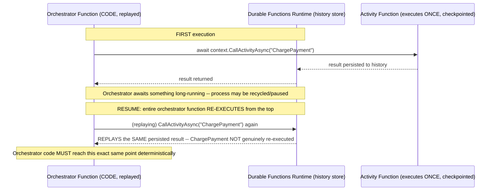
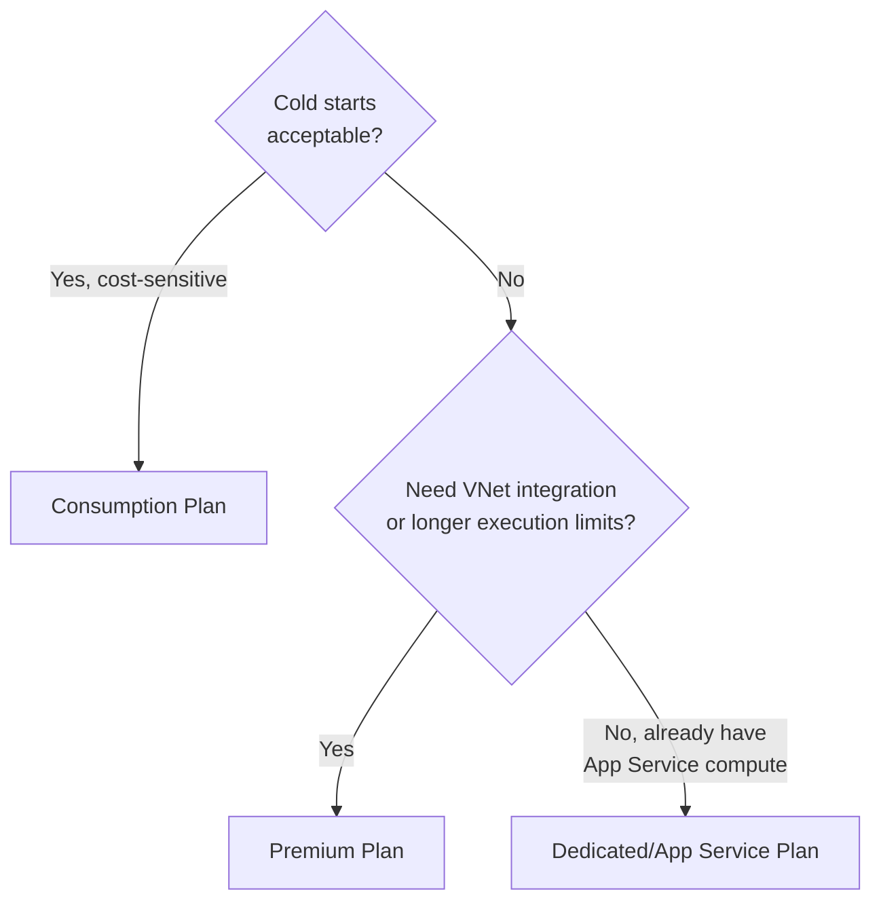

# Module 69 — Azure: Serverless — Azure Functions, Durable Functions, API Management & Logic Apps

> Domain: Azure | Level: Beginner → Expert | Prerequisite: [[../21-AWS/05-Serverless-Lambda-APIGateway-StepFunctions]] (this module mirrors that module's structure — Azure Functions/API Management/Logic Apps against Lambda/API Gateway/Step Functions — flagging Durable Functions' code-as-orchestration-with-mandatory-determinism model as the single most consequential divergence), [[04-Databases-AzureSQL-CosmosDB]] §2.3 (Cosmos DB consistency reasoning applies directly to any Function/orchestration reading from it)

---

## 1. Fundamentals

### Why does a Principal Engineer need Azure serverless depth given Module 61 already established the cold-start/concurrency/idempotency framework generically?
The framework transfers directly — what's genuinely new and highest-stakes here is **Durable Functions**, Azure's orchestration mechanism, which takes a fundamentally different implementation approach than Step Functions: rather than a declarative JSON state machine (Amazon States Language) interpreted by a managed service, Durable Functions lets an engineer write orchestration logic as **ordinary, imperative code** (C#/JavaScript/Python) that the runtime **replays from the beginning on every checkpoint resume**, which imposes a strict, non-obvious **determinism requirement** on orchestrator code that has no Step Functions equivalent at all — this is the single most technically dangerous divergence in this entire Azure domain so far, precisely because it looks like ordinary code and invites ordinary-code assumptions that are actively wrong in this specific context.

### Why does this matter?
Because a Principal Engineer with Step Functions experience, encountering Durable Functions' code-based orchestrator model, will naturally read it as "just write normal application code for the workflow" — and normal application code routinely calls `DateTime.Now`, generates random IDs, or makes direct I/O calls, every one of which breaks Durable Functions' replay-determinism contract in ways that produce subtle, hard-to-diagnose bugs rather than an obvious, immediate failure.

### When does this matter?
Any Azure-based event-driven or workflow-orchestration architecture — and specifically, any team writing Durable Functions orchestrator code without first internalizing the determinism constraint, which this module treats as the central risk this material must address before any other Azure-serverless content.

### How does it work (30,000-ft view)?
```
Azure Functions: Lambda equivalent -- runs code in response to events, with THREE distinct
     hosting plans (Consumption/Premium/Dedicated) that fundamentally change cold-start and
     scaling behavior -- NOT a single execution model with an add-on concurrency setting
Durable Functions: Azure's orchestration framework -- CODE-based (not declarative JSON),
     built on an "event sourcing + replay" model requiring orchestrator code to be
     DETERMINISTIC -- structurally very different from Step Functions
API Management (APIM): Azure's API Gateway equivalent -- broader API-lifecycle/governance
     product (developer portal, XML policy pipeline, versioning-first design)
Logic Apps: Azure's Step-Functions-plus-EventBridge-plus-Zapier equivalent -- low-code/no-code,
     visual-designer-first, with a very large SaaS-connector ecosystem
```

---

## 2. Deep Dive

### 2.1 Azure Functions Hosting Plans — a Foundational Choice AWS Lambda Doesn't Require
Lambda has essentially one execution model (with reserved/provisioned concurrency as tunable add-ons, Module 61 §2.2) — Azure Functions instead requires choosing among three fundamentally different **hosting plans**: **Consumption** (true pay-per-execution serverless, automatic scaling, genuine cold starts — the closest Lambda equivalent); **Premium** (pre-warmed instances eliminating cold starts, VNet integration, longer execution-time limits, at continuous baseline cost — directly analogous to Lambda Provisioned Concurrency, Module 61 §2.2, but selected as an entire hosting-plan choice rather than a per-function concurrency setting); **Dedicated (App Service Plan)** (runs on already-provisioned App Service compute, always-on, no cold start at all, but forfeiting Consumption's pay-per-execution economics entirely, closer in spirit to running on a traditional always-on fleet than to serverless). This is a more consequential upfront decision than Lambda's model: choosing the wrong hosting plan for a workload's actual latency/cost profile requires migrating the entire Function App's hosting configuration, not adjusting a single tunable setting the way Lambda's concurrency model allows.

### 2.2 Durable Functions' Replay Model — the Central, Non-Obvious Determinism Requirement
Durable Functions orchestrator functions do not execute once, start-to-finish, the way ordinary code does — instead, the runtime **persists every awaited action's result as a history event**, and whenever the orchestrator needs to resume after an `await` (which can span minutes, hours, or days — e.g., waiting on an external event or a long-running activity function), the **entire orchestrator function is re-executed from the beginning**, with the Durable Functions runtime **replaying** each already-completed step's previously-recorded result instead of genuinely re-executing it — this is how Durable Functions achieves reliable, checkpointed, crash-resilient long-running workflows without requiring the orchestrator's process to stay continuously running. The direct, critical consequence: **orchestrator function code must be deterministic** — given the same replayed history, it must always take the exact same code path and produce the exact same non-awaited values — meaning direct calls to `DateTime.Now`/`DateTime.UtcNow`, `Guid.NewGuid()`, direct HTTP/database calls, or any other non-deterministic or side-effecting operation **must not** appear directly in orchestrator code; instead, any such operation must be wrapped in a dedicated **Activity Function** (whose result, once computed, is itself persisted and simply replayed on subsequent orchestrator re-executions) or accessed via the Durable Functions context's own deterministic-safe APIs (`context.CurrentUtcDateTime`, `context.NewGuid()`).

### 2.3 Why This Has No Step Functions Equivalent — the Declarative-vs-Imperative Divergence
Step Functions' Amazon States Language is a **declarative** JSON document — there is no "orchestrator code being replayed," because there's no orchestrator *code* at all in the traditional sense; the state machine's definition is data, interpreted by AWS's managed execution engine, with retries/parallelism/branching all expressed as declarative configuration (Module 61 §2.5) — this structurally sidesteps the entire determinism-on-replay problem category, since there's no imperative code whose non-determinism could diverge across re-executions. Durable Functions' code-based approach is a genuine, deliberate trade-off: it offers materially more expressive power and a lower learning curve for developers already fluent in the target programming language (loops, conditionals, and complex branching are just normal code, rather than needing translation into ASL's JSON constructs) — but that expressive power is precisely what introduces the determinism trap, since ordinary code naturally reaches for exactly the non-deterministic operations (current time, random values, direct I/O) that break the replay model.

### 2.4 API Management — a Broader API-Lifecycle Product, Not Just a Routing Layer
Azure API Management (APIM) provides request routing, authentication, and throttling (directly matching Module 61 §2.4's API Gateway capabilities), but APIM's product scope is deliberately broader: a built-in, customizable **Developer Portal** (self-service API discovery, documentation, and subscription-key management for external/internal API consumers — no direct AWS API Gateway equivalent, though AWS offers this via separate, additional tooling), a **policy pipeline** expressed as an XML-based sequence of inbound/outbound/backend/error-handling policies (transformation, validation, rate-limiting, caching — conceptually similar to API Gateway's request/response mapping templates, but structured as an explicit, ordered pipeline rather than API Gateway's more implicit integration-mapping model), and first-class **API versioning and revision** management as a core product feature rather than a convention layered on top. A Principal Engineer evaluating APIM should recognize it's frequently chosen specifically *for* this broader API-governance/developer-experience scope, not merely as "the Azure way to front a Function App," and that adopting APIM without a genuine need for its broader governance/portal capabilities (when simple routing/auth would suffice) can be an over-provisioned choice analogous to Module 63 §2.1's ECS-vs-EKS complexity-matching discipline.

### 2.5 Logic Apps — Visual, Connector-Rich Orchestration for a Genuinely Different Audience
Logic Apps provides a visual, low-code/no-code workflow designer with an extremely large library of pre-built connectors (hundreds of SaaS/enterprise systems — Salesforce, SAP, Office 365, Twitter, and more), positioned for scenarios where **business/integration logic**, not necessarily deep custom application code, drives the workflow — this occupies a genuinely different niche than Step Functions (which assumes a developer writing/reviewing JSON state-machine definitions or using Durable Functions' code-first alternative): Logic Apps is frequently the correct choice specifically when non-developer or lightly-technical staff need to build/maintain integration workflows, or when a large fraction of the workflow's value is in its breadth of pre-built third-party-system connectors rather than custom logic — choosing Step-Functions-equivalent-but-code-heavy Durable Functions for a workflow that's actually mostly "connect these five SaaS systems together with minimal custom logic" forfeits Logic Apps' connector ecosystem for no compensating benefit, while choosing Logic Apps for a workflow requiring deep, complex custom business logic better expressed in code fights against its visual-designer-first model.

### 2.6 Durable Functions' Idempotency and At-Least-Once Semantics — Building on Module 61 §2.6, With an Added Layer
Durable Functions' **Activity Functions** (the actual work-performing units an orchestrator calls out to) can, like any Azure Functions trigger, be subject to at-least-once execution under specific failure/retry conditions — meaning Module 61 §2.6's idempotency discipline applies to Activity Functions directly — but Durable Functions adds a **second**, distinct layer: the orchestrator's own replay mechanism (§2.2) means an orchestrator's *non-awaited, deterministic* code runs multiple times (once per replay) even though its side-effecting Activity Function calls are correctly checkpointed and not re-executed — a Principal Engineer must distinguish "this replays harmlessly because it's pure, deterministic orchestration logic" from "this must be idempotent because it's an Activity Function that could genuinely re-execute under failure," two different reliability properties that Durable Functions' architecture requires reasoning about simultaneously and separately.

---

## 3. Visual Architecture

### Durable Functions Replay Model — Orchestrator Code Re-Executes, Activity Results Are Replayed (§2.2)


### Hosting Plan Decision Tree (§2.1)


## 4. Production Example
**Scenario**: A team with substantial AWS Step Functions experience, migrating an order-fulfillment saga workflow (structurally similar to Module 61 §Advanced Q6's checkout-saga example) to Durable Functions, wrote the orchestrator function using patterns that felt natural coming from years of general-purpose backend development: the orchestrator directly called `DateTime.UtcNow` to timestamp each step of the workflow for audit-logging purposes, and directly generated a `Guid.NewGuid()` to create a unique correlation ID passed to a downstream Activity Function. **Investigation**: intermittently — specifically for longer-running orchestrations that happened to span a Function App restart, scale-in event, or host recycling (all of which trigger Durable Functions' replay mechanism, §2.2) — the audit log showed **duplicate entries with different timestamps** for what should have been a single logical step, and downstream systems occasionally received **two different correlation IDs** for what the orchestrator's own logic treated as a single logical operation, causing a reconciliation system (tracking order state by correlation ID) to see what looked like two separate, orphaned partial operations instead of one coherent workflow. **Root cause**: every time the orchestrator replayed (§2.2), the direct, unwrapped calls to `DateTime.UtcNow` and `Guid.NewGuid()` **genuinely re-executed** (since they weren't checkpointed Activity Function calls or deterministic-safe context APIs), producing a **different** timestamp and a **different** GUID on each replay — even though the orchestrator's *overall control flow* remained deterministic (the same activities were called in the same order), these two specific non-deterministic values silently diverged across replays, corrupting exactly the audit-trail and correlation-ID data that depended on them being stable. **Fix**: replaced every direct `DateTime.UtcNow` call within orchestrator code with `context.CurrentUtcDateTime` (Durable Functions' deterministic-safe, replay-consistent equivalent) and every direct `Guid.NewGuid()` call with `context.NewGuid()` — both APIs specifically designed to return the *same* value across replays of the same orchestration instance, by persisting the first-computed value into history exactly like an Activity Function's result — and added a static-analysis lint rule (using a Roslyn analyzer) flagging any direct use of `DateTime.Now`/`DateTime.UtcNow`/`Guid.NewGuid()`/`Random` within any function decorated as a Durable Functions orchestrator, converting this specific, easy-to-miss category of bug into a compile-time-caught error rather than an intermittent, replay-triggered production data-corruption incident. **Lesson**: this is the sharpest instance yet of this Azure domain's central finding — Durable Functions orchestrator code *looks* exactly like ordinary application code (the team's Step Functions experience gave them no reason to expect a "some ordinary-looking function calls silently corrupt state" trap, since ASL's declarative model has no code to write non-deterministically in the first place), making this divergence maximally dangerous precisely because nothing about the code's surface appearance signals the hazard.

## 5. Best Practices
- Never call non-deterministic or side-effecting operations (`DateTime.Now`, `Guid.NewGuid()`, direct I/O, `Random`) directly within Durable Functions orchestrator code — use the context's deterministic-safe APIs or wrap the operation in an Activity Function (§2.2, §4).
- Choose an Azure Functions hosting plan deliberately based on the workload's actual cold-start tolerance, VNet-integration needs, and cost profile — treat this as a foundational architecture decision, not an easily-revisited setting (§2.1).
- Add static-analysis tooling (a Roslyn analyzer or equivalent) to catch non-deterministic orchestrator code at build time, converting an intermittent, hard-to-diagnose runtime risk into a compile-time error (§4's fix).
- Choose Logic Apps over Durable Functions specifically when a workflow's value is concentrated in its breadth of pre-built SaaS/enterprise connectors or needs to be authored/maintained by non-developer staff (§2.5).
- Evaluate whether API Management's broader governance/developer-portal capabilities are genuinely needed before adopting it over a simpler routing/auth-only alternative (§2.4).

## 6. Anti-patterns
- Writing Durable Functions orchestrator code as if it were ordinary, single-execution application code, without accounting for the replay-determinism requirement (§4).
- Treating Azure Functions hosting-plan selection as an afterthought or default choice, rather than an explicit decision matched to the workload's actual latency/cost/networking requirements.
- Adopting API Management purely as "the way to front a Function App" without evaluating whether its broader API-governance scope is actually needed, versus a simpler routing-only alternative.
- Choosing Durable Functions for a workflow that's primarily SaaS-system integration with minimal custom logic, forfeiting Logic Apps' connector ecosystem for no compensating benefit.
- Assuming an Activity Function's own idempotency requirement (Module 61 §2.6-equivalent) is the only reliability property Durable Functions requires, missing the separate, additional orchestrator-determinism requirement (§2.6).

---

## 10. Interview Questions

### Basic (10)
1. **Q: What are Azure Functions' three hosting plans?** **A:** Consumption (true pay-per-execution, cold starts), Premium (pre-warmed, no cold start, VNet integration), and Dedicated/App Service Plan (always-on, no cold start, pay for idle).
2. **Q: What is Durable Functions?** **A:** Azure's code-based orchestration framework for building reliable, long-running workflows, built on an event-sourcing-and-replay model.
3. **Q: How does Durable Functions achieve checkpointed, crash-resilient workflows without a continuously-running process?** **A:** By persisting every awaited action's result as a history event and replaying the orchestrator function from the beginning (using the persisted history) whenever it needs to resume.
4. **Q: What is the core requirement Durable Functions imposes on orchestrator code that Step Functions does not?** **A:** Determinism — orchestrator code must produce the same code path and same non-awaited values given the same replayed history.
5. **Q: What deterministic-safe API should replace a direct `DateTime.UtcNow` call in orchestrator code?** **A:** `context.CurrentUtcDateTime`.
6. **Q: Why does Step Functions have no equivalent determinism requirement?** **A:** Its Amazon States Language definition is declarative JSON interpreted by a managed engine, not imperative code being replayed.
7. **Q: What does API Management provide beyond what AWS API Gateway typically provides?** **A:** A built-in Developer Portal, an XML-based policy pipeline, and first-class API versioning/revision management as core product features.
8. **Q: What is Logic Apps positioned for that differentiates it from Step Functions/Durable Functions?** **A:** Visual, low-code/no-code workflow authoring with a very large library of pre-built SaaS/enterprise connectors.
9. **Q: What is an Activity Function in Durable Functions?** **A:** The actual work-performing unit an orchestrator calls out to, whose result is checkpointed and simply replayed (not re-executed) on subsequent orchestrator replays.
10. **Q: What Durable Functions pattern addresses unboundedly growing replay time for very long-running orchestrations?** **A:** The "eternal orchestration" pattern, periodically calling `ContinueAsNew` to reset history length.

### Intermediate (10)
1. **Q: Why did the §4 incident's bug manifest only intermittently, specifically for longer-running orchestrations spanning a restart or scale event?** **A:** The replay mechanism only triggers when an orchestrator needs to resume after being paused/recycled — short-lived orchestrations that complete without ever needing to replay wouldn't expose the non-determinism, since the non-deterministic calls would only ever execute once.
2. **Q: Why is Durable Functions' code-based orchestration described as offering "materially more expressive power" than Step Functions' ASL, and what is the corresponding cost of that power?** **A:** Loops, conditionals, and complex branching are just normal code rather than needing translation into ASL's JSON constructs, but that same expressiveness is precisely what invites non-deterministic operations that break the replay model, a risk ASL's declarative model structurally cannot have.
3. **Q: Why must an Activity Function's idempotency requirement be reasoned about separately from an orchestrator's determinism requirement, rather than treating them as the same concern?** **A:** They address different reliability properties at different layers — Activity Function idempotency concerns genuine at-least-once re-execution of side-effecting work (Module 61 §2.6's discipline); orchestrator determinism concerns non-awaited code producing consistent values across replays where the *checkpointed* activity calls are correctly not re-executed at all.
4. **Q: Why is choosing an Azure Functions hosting plan described as "a more consequential upfront decision" than Lambda's concurrency configuration?** **A:** Because it's a foundational hosting-model choice affecting cold-start behavior, networking capability, and cost structure simultaneously, requiring a full migration to change, whereas Lambda's provisioned/reserved concurrency is a per-function tunable setting adjustable without changing the underlying execution model.
5. **Q: Why might adopting API Management for a simple Function App be an over-provisioned architectural choice, using the same reasoning Module 63 applied to ECS-vs-EKS?** **A:** APIM's broader API-governance/developer-portal capabilities introduce genuine additional operational complexity and cost that's only justified when that broader governance scope is actually needed — adopting it merely as "the way to front a Function App" without that need mirrors choosing EKS's added complexity without an articulated requirement ECS can't satisfy.
6. **Q: Why would choosing Durable Functions over Logic Apps for a mostly-SaaS-integration workflow be a poor fit?** **A:** It forfeits Logic Apps' large pre-built connector ecosystem in favor of hand-writing custom orchestration code for integrations that Logic Apps' connectors would otherwise provide out of the box, for no compensating benefit if the workflow doesn't actually need complex custom logic.
7. **Q: Why does Durable Functions' default Azure Storage backend represent a genuine, distinct capacity-planning concern from Lambda/Step Functions' fully-managed scaling?** **A:** The default backend's orchestration throughput is bounded by that storage backend's own partition/throughput characteristics, a real, specific ceiling requiring explicit verification and potentially a different backend (Durable Task Scheduler/Netherite) for high-scale workloads, unlike Step Functions' more transparently-managed scaling.
8. **Q: Why is Durable Functions' orchestration history described as "a genuine, persistent data store" requiring the same security review as any other data store?** **A:** Because it durably persists potentially sensitive workflow data (arguments, results, timestamps) across the orchestration's entire lifetime in its configured storage backend, not merely transient in-memory state, making it subject to the same encryption/access-control discipline as any other persistent store.
9. **Q: Why should a Function App still independently validate security-relevant assumptions even when fronted by API Management's policy pipeline?** **A:** A request path that bypasses APIM entirely (a direct Function App URL, an internal service-to-service call) would leave the Function App with zero protection if it relies solely on the upstream policy layer — the same defense-in-depth reasoning Module 61 §8 established generally.
10. **Q: Why does the .NET "in-process" vs. "isolated worker process" execution model distinction matter for Azure Functions cold-start performance specifically?** **A:** These two hosting models have measurably different cold-start characteristics, an Azure/.NET-specific performance nuance beyond the general package-size/runtime factors Module 61 §7 already established, worth explicit benchmarking for latency-sensitive Consumption-plan functions.

### Advanced (10)
1. **Q: Diagnose the §4 incident from first principles, and design the specific automated tooling (beyond documentation) that would catch this exact class of bug before it ever reaches production, generalizing the governance-gate pattern this course has established repeatedly.**
   **A:** Root cause: ordinary-looking, non-deterministic code executed directly within replay-sensitive orchestrator functions, with no natural code-level signal distinguishing "safe orchestrator code" from "code that will silently corrupt state on replay." Structural fix: a custom Roslyn analyzer (§4's actual fix) that statically flags any direct call to `DateTime.Now`/`DateTime.UtcNow`/`Guid.NewGuid()`/`Random`/direct HTTP or database client calls within any method decorated with Durable Functions' orchestrator trigger attribute, failing the build — converting a runtime, intermittent, replay-triggered risk into a compile-time-caught, always-enforced error, directly extending this course's now-established pattern (Module 58 §Advanced Q1's IAM policy linting, Module 65 §Advanced Q1's Azure Policy zone-spanning check) into the domain of orchestrator-code static analysis specifically.
2. **Q: A team argues that since Durable Functions orchestrator code "looks just like normal application code," senior engineers with strong general programming backgrounds don't need dedicated Durable-Functions-specific training before writing orchestrators, unlike, say, learning ASL's JSON syntax for Step Functions. Evaluate this claim using the §4 incident as evidence.**
   **A:** Push back, directly using §4 — the claim inverts the actual risk: ASL's *unfamiliar* syntax (JSON state-machine definitions) naturally prompts careful, deliberate learning before use, precisely because it looks nothing like code an engineer already knows how to write; Durable Functions' orchestrator code looking exactly like ordinary code is what makes it *more* dangerous without dedicated training, not less, since it invites confident, ordinary-code assumptions (the exact "false familiarity" pattern this entire Azure domain has repeatedly identified, now appearing *within* a single Azure service rather than across the AWS-Azure boundary) — dedicated training on the determinism constraint specifically is arguably *more* necessary here than for Step Functions, not less.
3. **Q: Design the specific pre-production test that would reliably catch a non-deterministic orchestrator bug like §4's, given that the bug only manifests when a replay actually occurs.**
   **A:** A test harness that deliberately forces a replay of the orchestrator under test — either by using the Durable Functions testing framework's ability to directly unit-test orchestrator logic against a simulated, replayed history, or by an integration test that artificially triggers a Function App restart/scale event mid-orchestration and asserts that all recorded audit/correlation values remain stable and identical before and after the forced replay — steady-state testing (running an orchestration once, start-to-finish, without ever triggering a resume) never exercises the replay path at all, the same "steady-state doesn't exercise the failure-triggering condition" pattern recurring for the fifth time across this Azure domain (Modules 65, 66 implicitly, 67, 68, now 69), now applied to Durable Functions replay specifically.
4. **Q: Explain why "avoid ever calling non-deterministic APIs directly in orchestrator code" is a necessary but insufficient rule on its own, and identify a subtler category of non-determinism the rule alone might miss.**
   **A:** Beyond the obvious cases (`DateTime.Now`, `Guid.NewGuid()`), orchestrator code can be non-deterministic through subtler means: iterating over a `Dictionary` or `HashSet` whose enumeration order isn't guaranteed stable across runs/replays, branching on environment variables or configuration that could differ between the original execution and a later replay (e.g., a feature flag that changed value in the intervening time), or calling `Task.WhenAny` in a way whose completion order depends on genuinely non-deterministic external timing — a comprehensive static-analysis rule set (Advanced Q1) should be paired with code-review guidance specifically calling out these subtler categories, since a purely mechanical "flag these specific API calls" linter would miss them.
5. **Q: A workload's Durable Functions orchestration needs to call an external, non-idempotent third-party API (one that cannot be made idempotent by the calling team, e.g., a legacy partner system with no request-deduplication capability) as an Activity Function. Given that Activity Functions can be subject to at-least-once execution, design an approach that avoids duplicate calls to this specific non-idempotent dependency.**
   **A:** Wrap the non-idempotent external call in an Activity Function that first checks (and atomically records, e.g., via a Cosmos DB conditional write, Module 68's discipline) a durable, external "already called" marker keyed by the orchestration instance ID and step name *before* making the actual external call — if the Activity Function itself is retried due to a transient failure after the external call already succeeded but before the Activity Function's own completion was recorded, the marker check on retry can detect this and skip re-invoking the truly non-idempotent operation, converting an inherently non-idempotent dependency into an idempotent-from-the-orchestrator's-perspective operation via this external deduplication layer — directly extending Module 61 §Advanced Q1's domain-derived-idempotency-key discipline to a scenario where the dependency itself offers no native idempotency support at all.
6. **Q: Critique the following claim: "Since we've added a Roslyn analyzer flagging direct non-deterministic API calls in orchestrator code (§4's fix), we've fully eliminated the risk of replay-related orchestrator bugs."**
   **A:** Incomplete — per Advanced Q4, a mechanical linter catching known, specific non-deterministic API calls doesn't catch subtler non-determinism sources (unstable collection enumeration order, time-sensitive branching on external configuration) — the claim overstates what a static-analysis tool alone can guarantee; a comprehensive safeguard requires the analyzer as a strong first line of defense *plus* the replay-forcing test practice (Advanced Q3) *plus* ongoing code-review vigilance for the subtler categories no automated tool fully covers, the same "no single safeguard is sufficient on its own" defense-in-depth reasoning this course applies throughout.
7. **Q: Design a decision framework for choosing between Durable Functions and Logic Apps for a new workflow-automation requirement, synthesizing §2.5's audience-fit discussion into concrete criteria.**
   **A:** Favor Logic Apps when: the workflow is primarily integrating existing SaaS/enterprise systems with minimal custom business logic, needs to be authored or maintained by non-developer or lightly-technical staff, or benefits significantly from Logic Apps' large pre-built connector library; favor Durable Functions when: the workflow requires complex, custom business logic better expressed as code (intricate branching, complex data transformation, tight integration with existing application codebases), needs fine-grained unit-testability (Durable Functions' code-based orchestrators are more directly unit-testable than a Logic App's visual designer output), or requires patterns Logic Apps doesn't support as cleanly (Advanced Q5's external-idempotency-marker pattern, requiring genuine custom code) — the decision hinges on where the workflow's actual complexity and maintainership genuinely live, not a default preference for either tool.
8. **Q: A Principal Engineer is evaluating whether to migrate an existing, working Step Functions-based saga workflow (Module 61's checkout example) to Durable Functions as part of a broader Azure migration. What specific, Durable-Functions-unique risk must the migration plan explicitly address that a same-platform (Step-Functions-to-Step-Functions) migration would not need to consider?**
   **A:** The migration must include an explicit code-review pass specifically hunting for non-deterministic operations in the translated orchestrator logic (§2.2's determinism requirement) — a risk category that simply didn't exist in the original Step Functions implementation (since ASL has no non-deterministic-code concept to translate incorrectly) and therefore isn't something the original implementation's correctness gives any assurance about; this is a genuinely new verification requirement introduced specifically by the target platform's different architecture, not a risk inherited from the source implementation.
9. **Q: Design the specific hosting-plan migration strategy for a Consumption-plan Function App that has grown to require VNet integration for a new compliance requirement, given that hosting-plan changes (§2.1) are more consequential than a simple setting adjustment.**
   **A:** Provision a new Function App on the Premium plan (supporting VNet integration) alongside the existing Consumption-plan app, deploy and validate the identical function code against the new Premium-hosted app in a staging environment first (verifying VNet connectivity, cold-start elimination, and functional parity), then cut traffic over (via a traffic-manager/routing-layer change, or a DNS/endpoint switch depending on the trigger type) from the Consumption app to the Premium app once validated, and only then decommission the original Consumption-plan app — directly reusing this course's now-familiar zero-downtime, dual-running migration pattern (Module 60 §Advanced Q3, Module 62 §Advanced Q3) applied to an Azure Functions hosting-plan change specifically.
10. **Q: As a Principal Engineer establishing Azure serverless standards for an organization migrating from AWS, design the specific set of standing architectural reviews and automated checks (synthesizing this entire module) you would require for every new Azure Functions/Durable Functions/API Management/Logic Apps workload.**
    **A:** (1) Mandatory Roslyn-analyzer-enforced determinism linting for every Durable Functions orchestrator, blocking any direct non-deterministic API usage at build time (Advanced Q1) — the single highest-priority check this module establishes. (2) Mandatory replay-forcing test coverage for every Durable Functions orchestration before production deployment (Advanced Q3) — necessary because the failure mode is otherwise invisible under steady-state testing. (3) Mandatory explicit hosting-plan justification (Consumption/Premium/Dedicated) documented against the workload's actual cold-start/networking/cost requirements before initial deployment (§2.1) — necessary given how consequential a later change is. (4) Mandatory Logic-Apps-vs-Durable-Functions fit assessment (Advanced Q7) before defaulting to either tool, based on where the workflow's actual complexity and maintainership live. (5) Mandatory external-dependency-idempotency review (Advanced Q5) for any Activity Function calling a genuinely non-idempotent third-party system. Each standard targets a distinct, concrete failure mode this module identified, with item (1) specifically representing the most novel and highest-severity risk this Azure domain has surfaced to date, given how convincingly ordinary Durable Functions orchestrator code appears while harboring a replay-correctness trap with no precedent in this course's AWS material.

---

## 11. Coding Exercises

### Easy — Correctly using deterministic-safe context APIs in an orchestrator (§2.2, §4's fix)
```csharp
[FunctionName("OrderFulfillmentOrchestrator")]
public static async Task RunOrchestrator(
    [OrchestrationTrigger] IDurableOrchestrationContext context)
{
    // CORRECT: deterministic-safe, replay-consistent APIs -- NOT DateTime.UtcNow / Guid.NewGuid() (§4's fix)
    var timestamp = context.CurrentUtcDateTime;
    var correlationId = context.NewGuid();

    await context.CallActivityAsync("ChargePayment", (context.InstanceId, correlationId));
    await context.CallActivityAsync("ReserveShipping", (context.InstanceId, timestamp));
}
```

### Medium — Activity Function with domain-derived idempotency (§2.6, building on Module 61 §2.6)
```csharp
[FunctionName("ChargePayment")]
public static async Task<PaymentResult> ChargePayment(
    [ActivityTrigger] (string InstanceId, Guid CorrelationId) input,
    [CosmosDB(...)] IAsyncCollector<IdempotencyRecord> idempotencyStore)
{
    // Activity Functions ARE subject to at-least-once execution -- idempotency
    // required HERE, a SEPARATE concern from the orchestrator's determinism requirement (§2.6).
    var existingCharge = await CheckExistingChargeAsync(input.CorrelationId);
    if (existingCharge is not null) return existingCharge;   // duplicate activity invocation -- short-circuit

    return await ProcessPaymentChargeAsync(input.CorrelationId);
}
```

### Hard — Roslyn analyzer flagging non-deterministic orchestrator code (§4's actual fix, §Advanced Q1)
```csharp
[DiagnosticAnalyzer(LanguageNames.CSharp)]
public class DurableOrchestratorDeterminismAnalyzer : DiagnosticAnalyzer
{
    private static readonly HashSet<string> BannedApis = new()
    {
        "System.DateTime.Now", "System.DateTime.UtcNow", "System.Guid.NewGuid", "System.Random"
    };

    public override void Initialize(AnalysisContext context)
    {
        context.RegisterSyntaxNodeAction(AnalyzeInvocation, SyntaxKind.InvocationExpression);
    }

    private void AnalyzeInvocation(SyntaxNodeAnalysisContext ctx)
    {
        // Only flag within methods decorated with [OrchestrationTrigger] parameter --
        // Activity Functions are EXEMPT (they're checkpointed, not replayed -- §2.2 vs §2.6 distinction)
        if (!IsWithinOrchestratorFunction(ctx)) return;

        var symbol = ctx.SemanticModel.GetSymbolInfo(ctx.Node).Symbol;
        if (symbol is not null && BannedApis.Contains(symbol.ToDisplayString()))
        {
            ctx.ReportDiagnostic(Diagnostic.Create(DeterminismRule, ctx.Node.GetLocation(),
                symbol.Name, "use context.CurrentUtcDateTime / context.NewGuid() instead"));
        }
    }
}
```

### Expert — Zero-downtime hosting-plan migration from Consumption to Premium (§Advanced Q9)
```hcl
resource "azurerm_service_plan" "checkout_premium" {
  name     = "checkout-func-premium-plan"
  sku_name = "EP1"   # Premium plan -- VNet integration, no cold start (§2.1)
}

resource "azurerm_linux_function_app" "checkout_v2_premium" {
  name                = "checkout-func-premium"   # NEW app, running ALONGSIDE the existing Consumption app
  service_plan_id     = azurerm_service_plan.checkout_premium.id
  virtual_network_subnet_id = azurerm_subnet.private.id   # VNet integration -- the NEW compliance requirement
  # ... identical function code deployed here for validation before cutover (§Advanced Q9) ...
}

# Traffic Manager / Front Door routing weight shifted from 0% -> 100% toward the new
# Premium app only AFTER validating parity -- the OLD Consumption app decommissioned last.
resource "azurerm_frontdoor" "checkout_router" {
  # ... progressive traffic-weight shift, directly mirroring Module 63 §Advanced Q6's canary pattern ...
}
```

---

## 12–17. System Design / LLD / Debugging / Decision / Case Study / Principal

*(§4's incident, the four §11 exercises, and the Advanced-tier Q&A — especially Advanced Q1's Roslyn-analyzer safeguard, Advanced Q3's replay-forcing test design, and Advanced Q10's synthesized governance checklist — collectively constitute this module's system-design, debugging, and Principal-Engineer-level content.)*

## 18. Revision
**Key takeaways**: Azure Functions' three hosting plans (Consumption/Premium/Dedicated) represent a more foundational, harder-to-reverse upfront decision than Lambda's single-model-plus-concurrency-tuning approach. Durable Functions' code-based, replay-driven orchestration model is the single most technically dangerous divergence in this entire Azure domain: it requires strict orchestrator-code determinism with no Step Functions equivalent, and — critically — the danger is amplified specifically because orchestrator code *looks* like ordinary application code, giving experienced engineers no natural signal to trigger the caution a genuinely unfamiliar syntax (like ASL's JSON) would (§4). This determinism requirement must be enforced structurally (static analysis, replay-forcing tests), not through documentation or individual vigilance alone, extending this course's now-thoroughly-established governance-gate pattern into orchestrator-code correctness specifically. API Management's broader API-lifecycle/governance scope and Logic Apps' connector-rich, low-code positioning both occupy genuinely different niches than their nearest AWS counterparts, requiring explicit fit assessment rather than default adoption. Activity Function idempotency (an at-least-once concern) and orchestrator determinism (a replay-correctness concern) are two distinct, both-necessary reliability properties Durable Functions requires reasoning about simultaneously.

---

**Next**: Continuing to Module 70 — Azure: Messaging & Event-Driven Architecture (Service Bus, Event Grid, Event Hubs), continuing the `22-Azure` domain and mirroring Module 62's AWS messaging structure, explicitly tying back to Modules 52–56.
