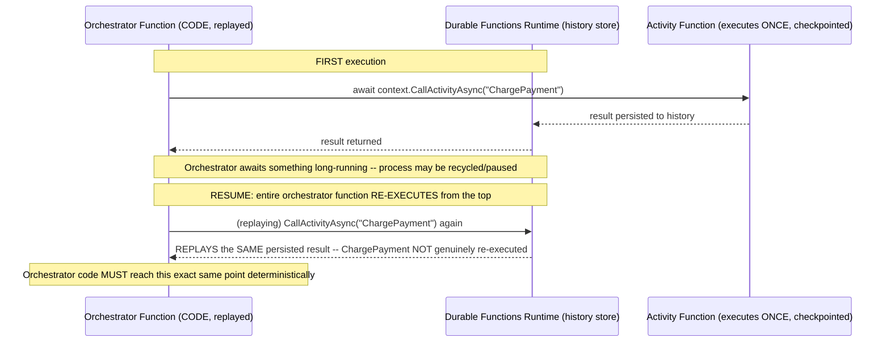
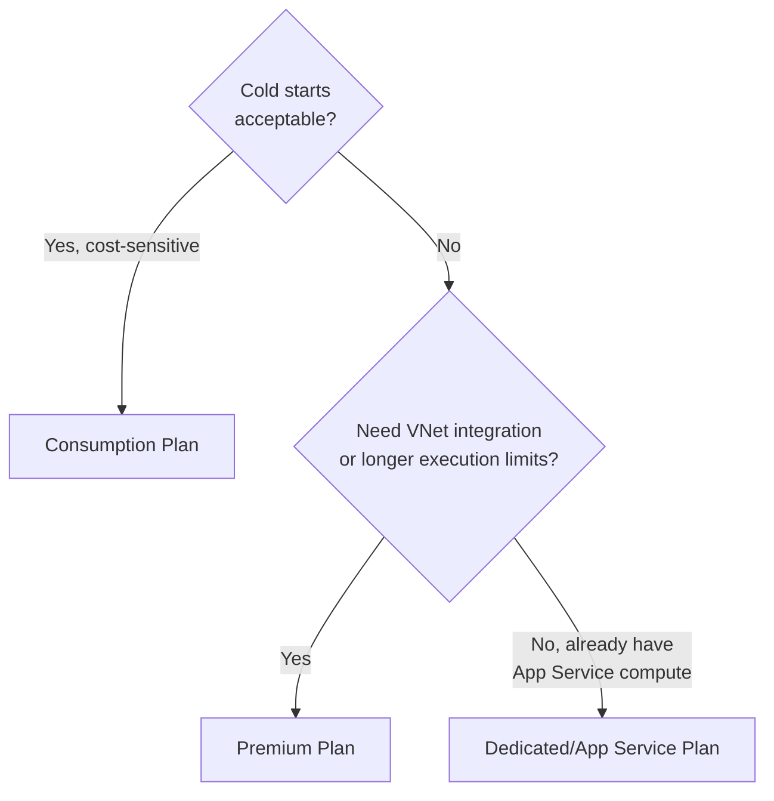
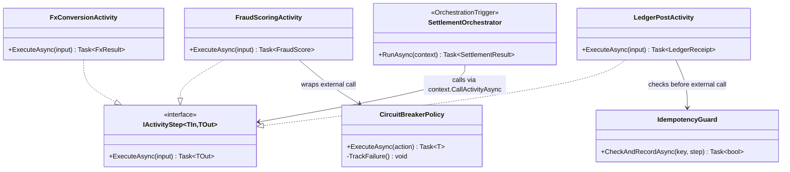
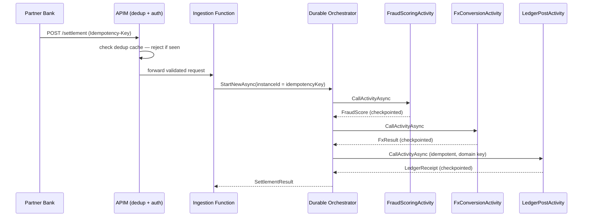

# Module 69 — Azure: Serverless — Azure Functions, Durable Functions, API Management & Logic Apps

> Domain: Azure | Level: Beginner → Expert | Prerequisite: [[../21-AWS/05-Serverless-Lambda-APIGateway-StepFunctions]] (this module mirrors that module's structure — Azure Functions/API Management/Logic Apps against Lambda/API Gateway/Step Functions — flagging Durable Functions' code-as-orchestration-with-mandatory-determinism model as the single most consequential divergence), [[04-Databases-AzureSQL-CosmosDB]] (Cosmos DB consistency reasoning applies directly to any Function/orchestration reading from it)

---

## 1. Fundamentals

### Why does a Principal Engineer need Azure serverless depth given already established the cold-start/concurrency/idempotency framework generically?
The framework transfers directly — what's genuinely new and highest-stakes here is **Durable Functions**, Azure's orchestration mechanism, which takes a fundamentally different implementation approach than Step Functions: rather than a declarative JSON state machine (Amazon States Language) interpreted by a managed service, Durable Functions lets an engineer write orchestration logic as **ordinary, imperative code** (C#/JavaScript/Python) that the runtime **replays from the beginning on every checkpoint resume**, which imposes a strict, non-obvious **determinism requirement** on orchestrator code that has no Step Functions equivalent at all — this is the single most technically dangerous divergence in this entire Azure domain so far, precisely because it looks like ordinary code and invites ordinary-code assumptions that are actively wrong in this specific context.

### Why does this matter?
Because a Principal Engineer with Step Functions experience, encountering Durable Functions' code-based orchestrator model, will naturally read it as "just write normal application code for the workflow" — and normal application code routinely calls `DateTime.Now`, generates random IDs, or makes direct I/O calls, every one of which breaks Durable Functions' replay-determinism contract in ways that produce subtle, hard-to-diagnose bugs rather than an obvious, immediate failure.

### When does this matter?
Any Azure-based event-driven or workflow-orchestration architecture — and specifically, any team writing Durable Functions orchestrator code without first internalizing the determinism constraint, which this module treats as the central risk this material must address before any other Azure-serverless content.

### How does it work (30,000-ft view)?
```
Azure Functions: Lambda equivalent -- runs code in response to events, with THREE distinct
 hosting plans (Consumption/Premium/Dedicated) that fundamentally change cold-start and
 scaling behavior -- NOT a single execution model with an add-on concurrency setting
Durable Functions: Azure's orchestration framework -- CODE-based (not declarative JSON),
 built on an "event sourcing + replay" model requiring orchestrator code to be
 DETERMINISTIC -- structurally very different from Step Functions
API Management (APIM): Azure's API Gateway equivalent -- broader API-lifecycle/governance
 product (developer portal, XML policy pipeline, versioning-first design)
Logic Apps: Azure's Step-Functions-plus-EventBridge-plus-Zapier equivalent -- low-code/no-code,
 visual-designer-first, with a very large SaaS-connector ecosystem
```

---

## 2. Deep Dive

### 2.1 Azure Functions Hosting Plans — a Foundational Choice AWS Lambda Doesn't Require
Lambda has essentially one execution model (with reserved/provisioned concurrency as tunable add-ons) — Azure Functions instead requires choosing among three fundamentally different **hosting plans**: **Consumption** (true pay-per-execution serverless, automatic scaling, genuine cold starts — the closest Lambda equivalent); **Premium** (pre-warmed instances eliminating cold starts, VNet integration, longer execution-time limits, at continuous baseline cost — directly analogous to Lambda Provisioned Concurrency,, but selected as an entire hosting-plan choice rather than a per-function concurrency setting); **Dedicated (App Service Plan)** (runs on already-provisioned App Service compute, always-on, no cold start at all, but forfeiting Consumption's pay-per-execution economics entirely, closer in spirit to running on a traditional always-on fleet than to serverless). This is a more consequential upfront decision than Lambda's model: choosing the wrong hosting plan for a workload's actual latency/cost profile requires migrating the entire Function App's hosting configuration, not adjusting a single tunable setting the way Lambda's concurrency model allows.

### 2.2 Durable Functions' Replay Model — the Central, Non-Obvious Determinism Requirement
Durable Functions orchestrator functions do not execute once, start-to-finish, the way ordinary code does — instead, the runtime **persists every awaited action's result as a history event**, and whenever the orchestrator needs to resume after an `await` (which can span minutes, hours, or days — e.g., waiting on an external event or a long-running activity function), the **entire orchestrator function is re-executed from the beginning**, with the Durable Functions runtime **replaying** each already-completed step's previously-recorded result instead of genuinely re-executing it — this is how Durable Functions achieves reliable, checkpointed, crash-resilient long-running workflows without requiring the orchestrator's process to stay continuously running. The direct, critical consequence: **orchestrator function code must be deterministic** — given the same replayed history, it must always take the exact same code path and produce the exact same non-awaited values — meaning direct calls to `DateTime.Now`/`DateTime.UtcNow`, `Guid.NewGuid`, direct HTTP/database calls, or any other non-deterministic or side-effecting operation **must not** appear directly in orchestrator code; instead, any such operation must be wrapped in a dedicated **Activity Function** (whose result, once computed, is itself persisted and simply replayed on subsequent orchestrator re-executions) or accessed via the Durable Functions context's own deterministic-safe APIs (`context.CurrentUtcDateTime`, `context.NewGuid`).

### 2.3 Why This Has No Step Functions Equivalent — the Declarative-vs-Imperative Divergence
Step Functions' Amazon States Language is a **declarative** JSON document — there is no "orchestrator code being replayed," because there's no orchestrator *code* at all in the traditional sense; the state machine's definition is data, interpreted by AWS's managed execution engine, with retries/parallelism/branching all expressed as declarative configuration — this structurally sidesteps the entire determinism-on-replay problem category, since there's no imperative code whose non-determinism could diverge across re-executions. Durable Functions' code-based approach is a genuine, deliberate trade-off: it offers materially more expressive power and a lower learning curve for developers already fluent in the target programming language (loops, conditionals, and complex branching are just normal code, rather than needing translation into ASL's JSON constructs) — but that expressive power is precisely what introduces the determinism trap, since ordinary code naturally reaches for exactly the non-deterministic operations (current time, random values, direct I/O) that break the replay model.

### 2.4 API Management — a Broader API-Lifecycle Product, Not Just a Routing Layer
Azure API Management (APIM) provides request routing, authentication, and throttling (directly matching the API Gateway capabilities), but APIM's product scope is deliberately broader: a built-in, customizable **Developer Portal** (self-service API discovery, documentation, and subscription-key management for external/internal API consumers — no direct AWS API Gateway equivalent, though AWS offers this via separate, additional tooling), a **policy pipeline** expressed as an XML-based sequence of inbound/outbound/backend/error-handling policies (transformation, validation, rate-limiting, caching — conceptually similar to API Gateway's request/response mapping templates, but structured as an explicit, ordered pipeline rather than API Gateway's more implicit integration-mapping model), and first-class **API versioning and revision** management as a core product feature rather than a convention layered on top. A Principal Engineer evaluating APIM should recognize it's frequently chosen specifically *for* this broader API-governance/developer-experience scope, not merely as "the Azure way to front a Function App," and that adopting APIM without a genuine need for its broader governance/portal capabilities (when simple routing/auth would suffice) can be an over-provisioned choice analogous to the ECS-vs-EKS complexity-matching discipline.

### 2.5 Logic Apps — Visual, Connector-Rich Orchestration for a Genuinely Different Audience
Logic Apps provides a visual, low-code/no-code workflow designer with an extremely large library of pre-built connectors (hundreds of SaaS/enterprise systems — Salesforce, SAP, Office 365, Twitter, and more), positioned for scenarios where **business/integration logic**, not necessarily deep custom application code, drives the workflow — this occupies a genuinely different niche than Step Functions (which assumes a developer writing/reviewing JSON state-machine definitions or using Durable Functions' code-first alternative): Logic Apps is frequently the correct choice specifically when non-developer or lightly-technical staff need to build/maintain integration workflows, or when a large fraction of the workflow's value is in its breadth of pre-built third-party-system connectors rather than custom logic — choosing Step-Functions-equivalent-but-code-heavy Durable Functions for a workflow that's actually mostly "connect these five SaaS systems together with minimal custom logic" forfeits Logic Apps' connector ecosystem for no compensating benefit, while choosing Logic Apps for a workflow requiring deep, complex custom business logic better expressed in code fights against its visual-designer-first model.

### 2.6 Durable Functions' Idempotency and At-Least-Once Semantics — Building on, With an Added Layer
Durable Functions' **Activity Functions** (the actual work-performing units an orchestrator calls out to) can, like any Azure Functions trigger, be subject to at-least-once execution under specific failure/retry conditions — meaning the idempotency discipline applies to Activity Functions directly — but Durable Functions adds a **second**, distinct layer: the orchestrator's own replay mechanism means an orchestrator's *non-awaited, deterministic* code runs multiple times (once per replay) even though its side-effecting Activity Function calls are correctly checkpointed and not re-executed — a Principal Engineer must distinguish "this replays harmlessly because it's pure, deterministic orchestration logic" from "this must be idempotent because it's an Activity Function that could genuinely re-execute under failure," two different reliability properties that Durable Functions' architecture requires reasoning about simultaneously and separately.

---

## 3. Visual Architecture

### Durable Functions Replay Model — Orchestrator Code Re-Executes, Activity Results Are Replayed

```mermaid
sequenceDiagram
 participant Orch as Orchestrator Function (CODE, replayed)
 participant DF as Durable Functions Runtime (history store)
 participant Act as Activity Function (executes ONCE, checkpointed)

 Note over Orch,DF: FIRST execution
 Orch->>Act: await context.CallActivityAsync("ChargePayment")
 Act-->>DF: result persisted to history
 DF-->>Orch: result returned

 Note over Orch,DF: Orchestrator awaits something long-running -- process may be recycled/paused
 Note over Orch,DF: RESUME: entire orchestrator function RE-EXECUTES from the top
 Orch->>DF: (replaying) CallActivityAsync("ChargePayment") again
 DF-->>Orch: REPLAYS the SAME persisted result -- ChargePayment NOT genuinely re-executed
 Note over Orch: Orchestrator code MUST reach this exact same point deterministically
```

### Hosting Plan Decision Tree

```mermaid
graph TD
 Start{Cold starts<br/>acceptable?}
 Start -->|Yes, cost-sensitive| Consumption[Consumption Plan]
 Start -->|No| VNetNeed{Need VNet integration<br/>or longer execution limits?}
 VNetNeed -->|Yes| Premium[Premium Plan]
 VNetNeed -->|No, already have<br/>App Service compute| Dedicated[Dedicated/App Service Plan]
```

## 4. Production Example
**Scenario**: A team with substantial AWS Step Functions experience, migrating an order-fulfillment saga workflow (structurally similar to §Advanced Q6's checkout-saga example) to Durable Functions, wrote the orchestrator function using patterns that felt natural coming from years of general-purpose backend development: the orchestrator directly called `DateTime.UtcNow` to timestamp each step of the workflow for audit-logging purposes, and directly generated a `Guid.NewGuid` to create a unique correlation ID passed to a downstream Activity Function. **Investigation**: intermittently — specifically for longer-running orchestrations that happened to span a Function App restart, scale-in event, or host recycling (all of which trigger Durable Functions' replay mechanism) — the audit log showed **duplicate entries with different timestamps** for what should have been a single logical step, and downstream systems occasionally received **two different correlation IDs** for what the orchestrator's own logic treated as a single logical operation, causing a reconciliation system (tracking order state by correlation ID) to see what looked like two separate, orphaned partial operations instead of one coherent workflow. **Root cause**: every time the orchestrator replayed, the direct, unwrapped calls to `DateTime.UtcNow` and `Guid.NewGuid` **genuinely re-executed** (since they weren't checkpointed Activity Function calls or deterministic-safe context APIs), producing a **different** timestamp and a **different** GUID on each replay — even though the orchestrator's *overall control flow* remained deterministic (the same activities were called in the same order), these two specific non-deterministic values silently diverged across replays, corrupting exactly the audit-trail and correlation-ID data that depended on them being stable. **Fix**: replaced every direct `DateTime.UtcNow` call within orchestrator code with `context.CurrentUtcDateTime` (Durable Functions' deterministic-safe, replay-consistent equivalent) and every direct `Guid.NewGuid` call with `context.NewGuid` — both APIs specifically designed to return the *same* value across replays of the same orchestration instance, by persisting the first-computed value into history exactly like an Activity Function's result — and added a static-analysis lint rule (using a Roslyn analyzer) flagging any direct use of `DateTime.Now`/`DateTime.UtcNow`/`Guid.NewGuid`/`Random` within any function decorated as a Durable Functions orchestrator, converting this specific, easy-to-miss category of bug into a compile-time-caught error rather than an intermittent, replay-triggered production data-corruption incident. **Lesson**: this is the sharpest instance yet of this Azure domain's central finding — Durable Functions orchestrator code *looks* exactly like ordinary application code (the team's Step Functions experience gave them no reason to expect a "some ordinary-looking function calls silently corrupt state" trap, since ASL's declarative model has no code to write non-deterministically in the first place), making this divergence maximally dangerous precisely because nothing about the code's surface appearance signals the hazard.

## 5. Best Practices
- Never call non-deterministic or side-effecting operations (`DateTime.Now`, `Guid.NewGuid`, direct I/O, `Random`) directly within Durable Functions orchestrator code — use the context's deterministic-safe APIs or wrap the operation in an Activity Function.
- Choose an Azure Functions hosting plan deliberately based on the workload's actual cold-start tolerance, VNet-integration needs, and cost profile — treat this as a foundational architecture decision, not an easily-revisited setting.
- Add static-analysis tooling (a Roslyn analyzer or equivalent) to catch non-deterministic orchestrator code at build time, converting an intermittent, hard-to-diagnose runtime risk into a compile-time error (the fix).
- Choose Logic Apps over Durable Functions specifically when a workflow's value is concentrated in its breadth of pre-built SaaS/enterprise connectors or needs to be authored/maintained by non-developer staff.
- Evaluate whether API Management's broader governance/developer-portal capabilities are genuinely needed before adopting it over a simpler routing/auth-only alternative.

## 6. Anti-patterns
- Writing Durable Functions orchestrator code as if it were ordinary, single-execution application code, without accounting for the replay-determinism requirement.
- Treating Azure Functions hosting-plan selection as an afterthought or default choice, rather than an explicit decision matched to the workload's actual latency/cost/networking requirements.
- Adopting API Management purely as "the way to front a Function App" without evaluating whether its broader API-governance scope is actually needed, versus a simpler routing-only alternative.
- Choosing Durable Functions for a workflow that's primarily SaaS-system integration with minimal custom logic, forfeiting Logic Apps' connector ecosystem for no compensating benefit.
- Assuming an Activity Function's own idempotency requirement (equivalent) is the only reliability property Durable Functions requires, missing the separate, additional orchestrator-determinism requirement.

---

## 7. Performance Engineering

**CPU/Memory:** Consumption-plan cold start for a .NET isolated-worker Function typically runs 1-3s for a minimal app, growing to 5-10s+ under a realistic production dependency graph (a large NuGet tree, JIT warm-up, DI container assembly across an ORM/payment-SDK/messaging-client stack) — this is the single most-complained-about latency source in Azure serverless, and the reason Premium plan's `preWarmedInstanceCount` exists: it holds a configurable floor of already-initialized instances, eliminating cold start entirely at the cost of a continuous per-instance charge whether or not that instance is actively serving traffic.

**Latency:** APIM's policy pipeline adds measurable per-request latency proportional to policy complexity — a simple `rate-limit` + `validate-jwt` pair typically adds low-single-digit milliseconds, but a pipeline chaining synchronous `<send-request>` calls (e.g., an inbound policy calling out to an external token-introspection endpoint before forwarding the request) can add tens to hundreds of milliseconds per hop, effectively turning APIM into a serial dependency chain rather than a thin pass-through gateway — each `<send-request>` must be evaluated with the same synchronous-external-call-cost discipline as any other network hop in the request path, including its own timeout and circuit-breaker posture (§14).

**Throughput:** Consumption plan's dynamic scale-out has a documented ramp characteristic (historically roughly one new instance per 1-2 minutes under sustained load on the classic scale controller; materially faster, near-per-invocation, on the newer Flex Consumption SKU) — a sudden 10x traffic spike, such as a market-open burst of trading-signal webhooks, can outrun Consumption's scale-out rate and produce a queueing backlog before enough instances exist to absorb it. Premium's pre-warmed baseline plus faster scale-out is the standard mitigation for latency-sensitive, bursty FinTech ingress.

**Scalability:** Durable Functions orchestration throughput on the default Azure Storage backend is bounded by that storage account's own partition-level throughput ceilings (roughly 2,000 messages/sec per control-queue partition, ~20,000 entities/sec per storage account under typical guidance) — a high-fan-out orchestration (e.g., an orchestrator fanning out to several thousand parallel Activity Functions for an end-of-day batch settlement reconciliation run) can hit this ceiling well before compute capacity is exhausted, motivating a move to the Durable Task Scheduler or the Netherite storage provider for genuinely high-throughput orchestration workloads.

**Benchmarking:** Benchmark cold start against the *actual* deployed package size and dependency graph, never a "hello world" function — a minimal function's cold start is a poor predictor of a production function pulling in a heavy ORM, gRPC client, and payment-SDK dependency set. Benchmark APIM policy latency with the full, production policy chain wired in, not an empty pass-through policy, for the same reason.

**Caching:** APIM's built-in `<cache-lookup>`/`<cache-store>` policies can materially reduce backend load and latency for read-heavy, cacheable endpoints (e.g., an FX reference-rate lookup), but must never be applied to an endpoint returning account-specific or entitlement-sensitive data without an explicit, per-caller cache key — a shared cache key across distinct callers is a direct data-leakage risk in a multi-tenant FinTech API surface.

---

## 8. Security

**Threats:** A Function App's managed identity, if over-scoped (granted `Key Vault Contributor` instead of the narrower `Key Vault Secrets User`, or `Storage Blob Data Contributor` across an entire storage account instead of a single container), becomes a high-value target precisely because Functions frequently sit directly in a payment- or settlement-processing path — a compromised or merely misconfigured Function identity can cascade into a blast radius spanning every Key Vault secret and storage container the over-broad role grants access to.

**Mitigations:** Scope every Function App's system- or user-assigned managed identity to the narrowest RBAC role and resource scope it genuinely needs. Use Key Vault references (`@Microsoft.KeyVault(SecretUri=...)`) in App Settings rather than embedding secrets directly, and monitor Key Vault reference *resolution failures* explicitly via Application Insights — a silently-broken reference degrades to a missing configuration value at runtime, not an obvious startup error, which is exactly the kind of "looks configured, silently wrong" failure this course repeatedly flags.

**OWASP mapping:** Broken access control if APIM's `validate-jwt` policy is present but not configured to check the token's `aud`/`iss` claims specifically (accepting any validly-signed token from the identity provider regardless of intended audience); injection if a Logic App's HTTP action or a Function's SQL binding interpolates untrusted input directly into a query/URL instead of using parameterized bindings; security misconfiguration if plaintext connection strings intended only for `local.settings.json` local development are deployed into production App Settings instead of Key Vault references.

**AuthN/AuthZ:** APIM should own the outer authentication boundary — a `validate-jwt` policy checking issuer, audience, and required claims/scopes before any request reaches the backend — but the Function App itself must still independently validate its own authorization assumptions (the defense-in-depth point already established in this module's Intermediate Q9), since a direct Function App URL, an internal service-to-service call, or a misconfigured APIM product/subscription could otherwise bypass the outer gate entirely.

**Secrets:** Never embed subscription keys, connection strings, or client secrets directly in APIM policy XML — policy definitions are visible to anyone with Reader access to the APIM instance. Use APIM Named Values backed by Key Vault instead, and rotate subscription keys on the same defined cadence as any other credential.

**Encryption:** Enforce TLS 1.2+ at the APIM gateway (disabling legacy protocol/cipher support) and enable the Function App's "HTTPS Only" setting. For Durable Functions' orchestration history specifically, verify the underlying storage backend (Azure Storage, Netherite, or Durable Task Scheduler) has encryption-at-rest enabled — this history durably persists workflow arguments and results across the orchestration's entire lifetime, meaning a payment-orchestration workflow's history store genuinely holds structured payment data, not merely transient in-memory state, and requires the same at-rest-encryption review as any primary data store.

---

## 9. Scalability

**Horizontal scaling:** Consumption plan scales horizontally by adding Function host instances automatically based on trigger backlog (queue length, HTTP concurrency), bounded only by an optional `functionAppScaleLimit`; Premium plan scales the same way but from a pre-warmed floor (`minimumElasticInstanceCount`), trading idle-capacity cost for consistently low tail latency during scale-out events.

**Vertical scaling:** Premium and Dedicated plans allow choosing larger instance SKUs (more vCPU/memory per instance) for CPU- or memory-bound function workloads — e.g., an in-memory risk-calculation Activity Function — where horizontal scale-out alone doesn't address a single invocation's own resource ceiling.

**Caching:** APIM response caching (§7) reduces backend scaling pressure for cacheable, non-sensitive endpoints; Durable Functions' checkpointed history functions as an implicit cache of already-computed Activity Function results across replays, avoiding redundant recomputation on resume.

**Replication/Partitioning:** Logic Apps Standard (single-tenant, running on the same Functions runtime, with VNet integration and per-workflow scaling units) is a genuinely different architectural fork from Logic Apps Consumption (fully multi-tenant, per-action-billed, no VNet integration) — the Standard-vs-Consumption choice trades isolation and predictable scaling against zero-infrastructure-management simplicity, and should be made deliberately per workload rather than defaulted.

**Load balancing:** APIM's own scaling (scale units, or the newer Workspaces Gateway model) must be sized independently of backend Function App scaling — a saturated APIM gateway can throttle or queue traffic before it ever reaches an otherwise-healthy, fully scaled-out backend, an easy-to-miss capacity ceiling distinct from Function App capacity.

**High Availability:** APIM's Premium tier supports multi-region deployment with a single control plane and per-region gateways — a hard requirement for any FinTech API with regional-failover obligations, since the Developer/Basic/Standard tiers are single-region only. Durable Functions orchestrations tied to a single-region storage backend do not natively fail over across regions without an explicit geo-replication/failover design.

**Disaster Recovery:** A Durable Functions orchestration's recoverability after a regional outage depends entirely on its storage backend's replication/failover posture (e.g., geo-redundant storage, with the explicit understanding that failover is not instantaneous and may lose the most recent, not-yet-replicated history events) — this must be assessed explicitly for any orchestration whose in-flight state, such as a multi-day settlement workflow, cannot tolerate being silently lost or duplicated on failover.

**CAP theorem:** Not directly applicable to Functions/APIM/Logic Apps as compute/routing layers on their own; the relevant CAP-style reasoning belongs to whichever data store the workload reads and writes (Cosmos DB, per Module 68) — this module's compute layer inherits, but does not itself impose, that store's consistency trade-offs.

---

## 10. Interview Questions

### Basic (10)
1. **Q: What are Azure Functions' three hosting plans?** **A:** Consumption (true pay-per-execution, cold starts), Premium (pre-warmed, no cold start, VNet integration), and Dedicated/App Service Plan (always-on, no cold start, pay for idle).
2. **Q: What is Durable Functions?** **A:** Azure's code-based orchestration framework for building reliable, long-running workflows, built on an event-sourcing-and-replay model.
3. **Q: How does Durable Functions achieve checkpointed, crash-resilient workflows without a continuously-running process?** **A:** By persisting every awaited action's result as a history event and replaying the orchestrator function from the beginning (using the persisted history) whenever it needs to resume.
4. **Q: What is the core requirement Durable Functions imposes on orchestrator code that Step Functions does not?** **A:** Determinism — orchestrator code must produce the same code path and same non-awaited values given the same replayed history.
5. **Q: What deterministic-safe API should replace a direct `DateTime.UtcNow` call in orchestrator code?** **A:** `context.CurrentUtcDateTime`.
6. **Q: Why does Step Functions have no equivalent determinism requirement?** **A:** Its Amazon States Language definition is declarative JSON interpreted by a managed engine, not imperative code being replayed.
7. **Q: What does API Management provide beyond what AWS API Gateway typically provides?** **A:** A built-in Developer Portal, an XML-based policy pipeline, and first-class API versioning/revision management as core product features.
8. **Q: What is Logic Apps positioned for that differentiates it from Step Functions/Durable Functions?** **A:** Visual, low-code/no-code workflow authoring with a very large library of pre-built SaaS/enterprise connectors.
9. **Q: What is an Activity Function in Durable Functions?** **A:** The actual work-performing unit an orchestrator calls out to, whose result is checkpointed and simply replayed (not re-executed) on subsequent orchestrator replays.
10. **Q: What Durable Functions pattern addresses unboundedly growing replay time for very long-running orchestrations?** **A:** The "eternal orchestration" pattern, periodically calling `ContinueAsNew` to reset history length.

### Intermediate (10)
1. **Q: Why did the incident's bug manifest only intermittently, specifically for longer-running orchestrations spanning a restart or scale event?** **A:** The replay mechanism only triggers when an orchestrator needs to resume after being paused/recycled — short-lived orchestrations that complete without ever needing to replay wouldn't expose the non-determinism, since the non-deterministic calls would only ever execute once.
2. **Q: Why is Durable Functions' code-based orchestration described as offering "materially more expressive power" than Step Functions' ASL, and what is the corresponding cost of that power?** **A:** Loops, conditionals, and complex branching are just normal code rather than needing translation into ASL's JSON constructs, but that same expressiveness is precisely what invites non-deterministic operations that break the replay model, a risk ASL's declarative model structurally cannot have.
3. **Q: Why must an Activity Function's idempotency requirement be reasoned about separately from an orchestrator's determinism requirement, rather than treating them as the same concern?** **A:** They address different reliability properties at different layers — Activity Function idempotency concerns genuine at-least-once re-execution of side-effecting work (the discipline); orchestrator determinism concerns non-awaited code producing consistent values across replays where the *checkpointed* activity calls are correctly not re-executed at all.
4. **Q: Why is choosing an Azure Functions hosting plan described as "a more consequential upfront decision" than Lambda's concurrency configuration?** **A:** Because it's a foundational hosting-model choice affecting cold-start behavior, networking capability, and cost structure simultaneously, requiring a full migration to change, whereas Lambda's provisioned/reserved concurrency is a per-function tunable setting adjustable without changing the underlying execution model.
5. **Q: Why might adopting API Management for a simple Function App be an over-provisioned architectural choice, using the same reasoning applied to ECS-vs-EKS?** **A:** APIM's broader API-governance/developer-portal capabilities introduce genuine additional operational complexity and cost that's only justified when that broader governance scope is actually needed — adopting it merely as "the way to front a Function App" without that need mirrors choosing EKS's added complexity without an articulated requirement ECS can't satisfy.
6. **Q: Why would choosing Durable Functions over Logic Apps for a mostly-SaaS-integration workflow be a poor fit?** **A:** It forfeits Logic Apps' large pre-built connector ecosystem in favor of hand-writing custom orchestration code for integrations that Logic Apps' connectors would otherwise provide out of the box, for no compensating benefit if the workflow doesn't actually need complex custom logic.
7. **Q: Why does Durable Functions' default Azure Storage backend represent a genuine, distinct capacity-planning concern from Lambda/Step Functions' fully-managed scaling?** **A:** The default backend's orchestration throughput is bounded by that storage backend's own partition/throughput characteristics, a real, specific ceiling requiring explicit verification and potentially a different backend (Durable Task Scheduler/Netherite) for high-scale workloads, unlike Step Functions' more transparently-managed scaling.
8. **Q: Why is Durable Functions' orchestration history described as "a genuine, persistent data store" requiring the same security review as any other data store?** **A:** Because it durably persists potentially sensitive workflow data (arguments, results, timestamps) across the orchestration's entire lifetime in its configured storage backend, not merely transient in-memory state, making it subject to the same encryption/access-control discipline as any other persistent store.
9. **Q: Why should a Function App still independently validate security-relevant assumptions even when fronted by API Management's policy pipeline?** **A:** A request path that bypasses APIM entirely (a direct Function App URL, an internal service-to-service call) would leave the Function App with zero protection if it relies solely on the upstream policy layer — the same defense-in-depth reasoning established generally.
10. **Q: Why does the.NET "in-process" vs. "isolated worker process" execution model distinction matter for Azure Functions cold-start performance specifically?** **A:** These two hosting models have measurably different cold-start characteristics, an Azure/.NET-specific performance nuance beyond the general package-size/runtime factors already established, worth explicit benchmarking for latency-sensitive Consumption-plan functions.

### Advanced (10)
1. **Q: Diagnose the incident from first principles, and design the specific automated tooling (beyond documentation) that would catch this exact class of bug before it ever reaches production, generalizing the governance-gate pattern this course has established repeatedly.**
 **A:** Root cause: ordinary-looking, non-deterministic code executed directly within replay-sensitive orchestrator functions, with no natural code-level signal distinguishing "safe orchestrator code" from "code that will silently corrupt state on replay." Structural fix: a custom Roslyn analyzer (the actual fix) that statically flags any direct call to `DateTime.Now`/`DateTime.UtcNow`/`Guid.NewGuid`/`Random`/direct HTTP or database client calls within any method decorated with Durable Functions' orchestrator trigger attribute, failing the build — converting a runtime, intermittent, replay-triggered risk into a compile-time-caught, always-enforced error, directly extending this course's now-established pattern (§Advanced Q1's IAM policy linting, §Advanced Q1's Azure Policy zone-spanning check) into the domain of orchestrator-code static analysis specifically.
2. **Q: A team argues that since Durable Functions orchestrator code "looks just like normal application code," senior engineers with strong general programming backgrounds don't need dedicated Durable-Functions-specific training before writing orchestrators, unlike, say, learning ASL's JSON syntax for Step Functions. Evaluate this claim using the incident as evidence.**
 **A:** Push back, directly using — the claim inverts the actual risk: ASL's *unfamiliar* syntax (JSON state-machine definitions) naturally prompts careful, deliberate learning before use, precisely because it looks nothing like code an engineer already knows how to write; Durable Functions' orchestrator code looking exactly like ordinary code is what makes it *more* dangerous without dedicated training, not less, since it invites confident, ordinary-code assumptions (the exact "false familiarity" pattern this entire Azure domain has repeatedly identified, now appearing *within* a single Azure service rather than across the AWS-Azure boundary) — dedicated training on the determinism constraint specifically is arguably *more* necessary here than for Step Functions, not less.
3. **Q: Design the specific pre-production test that would reliably catch a non-deterministic orchestrator bug like's, given that the bug only manifests when a replay actually occurs.**
 **A:** A test harness that deliberately forces a replay of the orchestrator under test — either by using the Durable Functions testing framework's ability to directly unit-test orchestrator logic against a simulated, replayed history, or by an integration test that artificially triggers a Function App restart/scale event mid-orchestration and asserts that all recorded audit/correlation values remain stable and identical before and after the forced replay — steady-state testing (running an orchestration once, start-to-finish, without ever triggering a resume) never exercises the replay path at all, the same "steady-state doesn't exercise the failure-triggering condition" pattern recurring for the fifth time across this Azure domain (Modules 65, 66 implicitly, 67, 68, now 69), now applied to Durable Functions replay specifically.
4. **Q: Explain why "avoid ever calling non-deterministic APIs directly in orchestrator code" is a necessary but insufficient rule on its own, and identify a subtler category of non-determinism the rule alone might miss.**
 **A:** Beyond the obvious cases (`DateTime.Now`, `Guid.NewGuid`), orchestrator code can be non-deterministic through subtler means: iterating over a `Dictionary` or `HashSet` whose enumeration order isn't guaranteed stable across runs/replays, branching on environment variables or configuration that could differ between the original execution and a later replay (e.g., a feature flag that changed value in the intervening time), or calling `Task.WhenAny` in a way whose completion order depends on genuinely non-deterministic external timing — a comprehensive static-analysis rule set (Advanced Q1) should be paired with code-review guidance specifically calling out these subtler categories, since a purely mechanical "flag these specific API calls" linter would miss them.
5. **Q: A workload's Durable Functions orchestration needs to call an external, non-idempotent third-party API (one that cannot be made idempotent by the calling team, e.g., a legacy partner system with no request-deduplication capability) as an Activity Function. Given that Activity Functions can be subject to at-least-once execution, design an approach that avoids duplicate calls to this specific non-idempotent dependency.**
 **A:** Wrap the non-idempotent external call in an Activity Function that first checks (and atomically records, e.g., via a Cosmos DB conditional write, the discipline) a durable, external "already called" marker keyed by the orchestration instance ID and step name *before* making the actual external call — if the Activity Function itself is retried due to a transient failure after the external call already succeeded but before the Activity Function's own completion was recorded, the marker check on retry can detect this and skip re-invoking the truly non-idempotent operation, converting an inherently non-idempotent dependency into an idempotent-from-the-orchestrator's-perspective operation via this external deduplication layer — directly extending §Advanced Q1's domain-derived-idempotency-key discipline to a scenario where the dependency itself offers no native idempotency support at all.
6. **Q: Critique the following claim: "Since we've added a Roslyn analyzer flagging direct non-deterministic API calls in orchestrator code (the fix), we've fully eliminated the risk of replay-related orchestrator bugs."**
 **A:** Incomplete — per Advanced Q4, a mechanical linter catching known, specific non-deterministic API calls doesn't catch subtler non-determinism sources (unstable collection enumeration order, time-sensitive branching on external configuration) — the claim overstates what a static-analysis tool alone can guarantee; a comprehensive safeguard requires the analyzer as a strong first line of defense *plus* the replay-forcing test practice (Advanced Q3) *plus* ongoing code-review vigilance for the subtler categories no automated tool fully covers, the same "no single safeguard is sufficient on its own" defense-in-depth reasoning this course applies throughout.
7. **Q: Design a decision framework for choosing between Durable Functions and Logic Apps for a new workflow-automation requirement, synthesizing the audience-fit discussion into concrete criteria.**
 **A:** Favor Logic Apps when: the workflow is primarily integrating existing SaaS/enterprise systems with minimal custom business logic, needs to be authored or maintained by non-developer or lightly-technical staff, or benefits significantly from Logic Apps' large pre-built connector library; favor Durable Functions when: the workflow requires complex, custom business logic better expressed as code (intricate branching, complex data transformation, tight integration with existing application codebases), needs fine-grained unit-testability (Durable Functions' code-based orchestrators are more directly unit-testable than a Logic App's visual designer output), or requires patterns Logic Apps doesn't support as cleanly (Advanced Q5's external-idempotency-marker pattern, requiring genuine custom code) — the decision hinges on where the workflow's actual complexity and maintainership genuinely live, not a default preference for either tool.
8. **Q: A Principal Engineer is evaluating whether to migrate an existing, working Step Functions-based saga workflow (the checkout example) to Durable Functions as part of a broader Azure migration. What specific, Durable-Functions-unique risk must the migration plan explicitly address that a same-platform (Step-Functions-to-Step-Functions) migration would not need to consider?**
 **A:** The migration must include an explicit code-review pass specifically hunting for non-deterministic operations in the translated orchestrator logic (the determinism requirement) — a risk category that simply didn't exist in the original Step Functions implementation (since ASL has no non-deterministic-code concept to translate incorrectly) and therefore isn't something the original implementation's correctness gives any assurance about; this is a genuinely new verification requirement introduced specifically by the target platform's different architecture, not a risk inherited from the source implementation.
9. **Q: Design the specific hosting-plan migration strategy for a Consumption-plan Function App that has grown to require VNet integration for a new compliance requirement, given that hosting-plan changes are more consequential than a simple setting adjustment.**
 **A:** Provision a new Function App on the Premium plan (supporting VNet integration) alongside the existing Consumption-plan app, deploy and validate the identical function code against the new Premium-hosted app in a staging environment first (verifying VNet connectivity, cold-start elimination, and functional parity), then cut traffic over (via a traffic-manager/routing-layer change, or a DNS/endpoint switch depending on the trigger type) from the Consumption app to the Premium app once validated, and only then decommission the original Consumption-plan app — directly reusing this course's now-familiar zero-downtime, dual-running migration pattern applied to an Azure Functions hosting-plan change specifically.
10. **Q: As a Principal Engineer establishing Azure serverless standards for an organization migrating from AWS, design the specific set of standing architectural reviews and automated checks (synthesizing this entire module) you would require for every new Azure Functions/Durable Functions/API Management/Logic Apps workload.**
 **A:** (1) Mandatory Roslyn-analyzer-enforced determinism linting for every Durable Functions orchestrator, blocking any direct non-deterministic API usage at build time (Advanced Q1) — the single highest-priority check this module establishes. (2) Mandatory replay-forcing test coverage for every Durable Functions orchestration before production deployment (Advanced Q3) — necessary because the failure mode is otherwise invisible under steady-state testing. (3) Mandatory explicit hosting-plan justification (Consumption/Premium/Dedicated) documented against the workload's actual cold-start/networking/cost requirements before initial deployment — necessary given how consequential a later change is. (4) Mandatory Logic-Apps-vs-Durable-Functions fit assessment (Advanced Q7) before defaulting to either tool, based on where the workflow's actual complexity and maintainership live. (5) Mandatory external-dependency-idempotency review (Advanced Q5) for any Activity Function calling a genuinely non-idempotent third-party system. Each standard targets a distinct, concrete failure mode this module identified, with item (1) specifically representing the most novel and highest-severity risk this Azure domain has surfaced to date, given how convincingly ordinary Durable Functions orchestrator code appears while harboring a replay-correctness trap with no precedent in this course's AWS material.

### Expert (10)
1. **Q: Design end-to-end idempotency for a Durable Functions-orchestrated cross-border payment settlement pipeline where a request enters via APIM, starts a new orchestration instance, and the orchestration later receives an asynchronous webhook callback from an external payment processor. Identify every distinct duplicate-risk point and the mechanism closing each one.**
 **A:** Three genuinely distinct duplicate-risk points exist, each requiring its own mechanism: (1) **Ingress duplication** — a client retrying a POST to APIM after a lost response could start two orchestration instances for the same logical payment; close this by requiring an `Idempotency-Key` header at APIM, validated via a policy that checks a fast lookup store (e.g., a Redis/Table Storage dedup cache keyed on the header) before forwarding, and by using that same key as the Durable Functions **instance ID** (`StartNewAsync(orchestratorName, instanceId: idempotencyKey, ...)`) — starting an orchestration with an already-existing instance ID is itself rejected by the runtime, providing a second, structural layer of protection. (2) **Activity Function re-execution** — any Activity Function calling the actual payment-processor API is subject to at-least-once execution and must itself be idempotent via a domain-derived key (the payment reference, not a freshly-generated GUID that would differ across retries). (3) **Webhook callback duplication** — the external processor's own retry policy on its webhook delivery means the orchestration's `WaitForExternalEvent` handler must tolerate and safely ignore a duplicate event carrying the same processor-side transaction ID, treating the second delivery as a no-op rather than re-applying the settlement outcome twice.
 **Why correct:** Enumerates all three distinct at-least-once boundaries in the pipeline (ingress, activity, external callback) rather than treating "idempotency" as one undifferentiated concern, and assigns each its own concrete Azure-native mechanism.
 **Common mistakes:** Adding an idempotency key only at ingress and assuming it protects the entire downstream pipeline, missing that Activity Function execution and external webhook delivery are separate at-least-once boundaries with no automatic inheritance of an upstream dedup guarantee.
 **Follow-ups:** "What happens if the dedup cache used for the APIM policy check itself becomes unavailable?" (Fail closed — reject the request rather than forwarding it unchecked, the same fail-closed discipline established for authorization gates elsewhere in this domain.)

2. **Q: Critique: "Since APIM enforces subscription keys and JWT validation at the gateway, our Function App backend doesn't need its own rate limiting or tenant-isolation logic."**
 **A:** Push back. APIM's gateway-level controls are necessary but not sufficient for two reasons specific to a FinTech multi-tenant surface: first, any request path that bypasses APIM — a direct Function App URL, an internal service-to-service call from another microservice, a misconfigured APIM product mapping — leaves the backend with zero protection if it relies solely on the upstream policy layer, the defense-in-depth point this module already establishes generally. Second, and more subtly, APIM's rate limiting is typically configured per subscription key or per product, which may not map 1:1 onto per-tenant fairness inside a single subscription serving multiple downstream accounts (e.g., an aggregator partner whose one APIM subscription fronts hundreds of end-client accounts) — a single noisy tenant behind a shared subscription key can still starve co-tenants at the backend even though the subscription-level rate limit is technically being respected.
 **Why correct:** Identifies two independent gaps — bypass risk and coarse-grained subscription-vs-tenant mismatch — that gateway-only enforcement cannot close.
 **Common mistakes:** Treating "the gateway enforces it" as equivalent to "the system enforces it," ignoring both bypass paths and granularity mismatches between the gateway's enforcement unit and the business's actual isolation unit.
 **Follow-ups:** "How would you implement per-tenant fairness beneath a shared subscription key?" (A backend-side token-bucket keyed on a tenant identifier extracted from the validated JWT claims, independent of APIM's own subscription-key-scoped rate limit.)

3. **Q: Design a multi-region disaster-recovery posture for a Durable Functions-based payment-settlement orchestration platform, given that Durable Functions orchestrations do not natively fail over across regions.**
 **A:** Active-passive is the pragmatic default: run the Function App and its Durable Functions storage backend in a primary region, with geo-redundant storage (GRS) replication to a secondary region; on a declared regional outage, fail over DNS/Front Door routing to a standby Function App deployed in the secondary region, pointed at the geo-failed-over storage account. Critically, this DR posture must be paired with an explicit **RPO statement** for in-flight orchestrations: GRS replication is asynchronous, so any orchestration history events written in the seconds-to-minutes before the outage may not have replicated and are genuinely lost on failover — for a payment-settlement workflow, this means some in-flight settlements could resume from a stale checkpoint, re-executing already-partially-completed steps, which is exactly why every Activity Function in the pipeline must already be idempotent (Expert Q1) regardless of DR posture, since DR failover is itself a source of at-least-once-style re-execution. Active-active across regions is possible but requires either partitioning orchestration instances by region (no cross-region orchestration continuation) or a genuinely more complex, typically-avoided cross-region storage-replication scheme.
 **Why correct:** States the concrete DR mechanism, names the specific data-loss window GRS's async replication introduces, and connects it back to why idempotency is a DR-time requirement, not merely a steady-state one.
 **Common mistakes:** Assuming geo-redundant storage alone provides a zero-RPO failover, missing that GRS is asynchronous and that Durable Functions' own compute layer (the Function App) still requires an explicit standby deployment and routing cutover.
 **Follow-ups:** "How would you detect and reconcile orchestrations that resumed from a stale, pre-outage checkpoint after failover?" (An explicit post-failover reconciliation pass comparing each resumed orchestration's recorded outcome against the external payment processor's own settlement record — the same reconciliation-against-external-truth discipline this course applies throughout.)

4. **Q: At what approximate request volume does Premium plan's continuous baseline cost become cheaper than Consumption plan's pay-per-execution cost, and what is the deeper architectural point this crossover illustrates?**
 **A:** The precise crossover depends on execution duration and memory allocation, but directionally: Consumption bills per-execution (GB-seconds plus per-million-executions), while Premium bills a continuous per-vCPU/memory-unit charge regardless of utilization — at low, bursty volume, Consumption is materially cheaper because idle time costs nothing; at sustained high volume approaching or exceeding a Premium instance's continuous capacity, the per-execution Consumption cost can exceed what an always-on Premium instance would have cost to serve the same load, and Premium additionally eliminates the cold-start latency tax Consumption would otherwise impose on every scale-out event. The deeper point: **the hosting-plan decision is not fixed at initial deployment** — a workload's actual traffic profile should be re-evaluated periodically against this crossover, and a workload that launched on Consumption because early volume was low and bursty may need a deliberate migration to Premium (§Advanced Q9's zero-downtime pattern) once sustained volume changes the economics, rather than treating the original hosting-plan choice as permanent.
 **Why correct:** States the cost-model shape correctly (per-execution vs. continuous) and elevates the answer beyond a raw number into the recurring "revisit foundational choices as the workload evolves" principle.
 **Common mistakes:** Treating hosting-plan choice as a one-time decision made correctly forever, rather than a cost/latency trade-off that shifts as traffic volume and shape change over a workload's lifetime.
 **Follow-ups:** "What operational signal should trigger re-evaluating this crossover?" (Sustained cold-start-driven latency SLA breaches during scale-out, or a monthly Consumption bill trending toward or past the estimated Premium-equivalent cost.)

5. **Q: Design a safe deployment strategy for changing a Durable Functions orchestrator's code while orchestration instances from the previous version are still in-flight, given the replay-determinism requirement established in §2.2.**
 **A:** A code change to an orchestrator function changes what a *replay* of an in-flight, pre-change instance will produce — if a previous-version instance replays against the new code, its history (recorded against the old code path) may no longer match the new code's control flow, producing a non-deterministic-replay exception or, worse, silently corrupted state if the mismatch happens not to throw. The safe pattern is **versioning the orchestrator explicitly**: either (a) route new instances to a newly-named orchestrator function while allowing existing in-flight instances to complete against the still-deployed old orchestrator function (both versions co-existing in the same Function App until every old-version instance drains), or (b) use Durable Functions' built-in version-tagging capability where supported, checking `context.Version`-equivalent state within the orchestrator to branch behavior for old-history compatibility. The operationally simplest and most broadly portable approach remains (a) — deploy the new orchestrator under a new function name, update the entry point that starts new instances to reference it, and monitor the old-named orchestrator's in-flight instance count until it reaches zero before removing it from the deployment.
 **Why correct:** Correctly identifies *why* a mid-flight orchestrator code change is dangerous (replay-history/code-path mismatch, not merely "deploying new code"), and gives the concrete, provider-verifiable mitigation pattern.
 **Common mistakes:** Treating a Durable Functions orchestrator deployment like a stateless Function App deployment (deploy new code, done), missing that in-flight orchestration instances carry a dependency on the *exact* code path that produced their existing history.
 **Follow-ups:** "How would you detect that this exact failure occurred in production?" (Monitor for `NonDeterministicOrchestrationDetectedException` (or the equivalent runtime error surfaced in Application Insights) as a first-class alert, not a suppressed/ignored exception type.)

6. **Q: An APIM inbound policy synchronously calls an external fraud-scoring service via `<send-request>` before forwarding every payment-authorization request to the backend. During a fraud-service outage, this policy caused APIM itself to queue and eventually reject unrelated, non-fraud-scored traffic. Diagnose the architectural mistake and redesign the policy.**
 **A:** The mistake: a synchronous external dependency embedded directly in the gateway's request path means the *gateway's own* capacity becomes coupled to that dependency's availability and latency — every request through that policy pipeline, not just fraud-scoring-relevant ones if the policy is scoped too broadly, now waits on (or times out against) the failing external call, and enough concurrently-blocked requests can exhaust APIM's own connection/thread capacity, degrading unrelated traffic. Redesign: (1) apply the `<send-request>` policy only to the specific API operations that genuinely require fraud scoring, not globally; (2) set an aggressive, explicit timeout on the `<send-request>` call, well below APIM's own overall request timeout; (3) wrap the call in policy-level circuit-breaker logic (tracking recent failure rate via a cache-backed counter, short-circuiting to an immediate fallback response — e.g., routing to a queued, asynchronous fraud-review path — once the failure rate crosses a threshold) rather than letting every request individually retry against a known-down dependency; (4) treat the fraud-scoring call as a genuine backend dependency requiring the same synchronous-call-cost and timeout discipline as any other service-to-service call, not a "free" gateway-layer add-on.
 **Why correct:** Correctly identifies the coupling mechanism (gateway capacity tied to an embedded external dependency) and proposes concrete, APIM-native mitigations (scoping, timeout, circuit breaker) rather than a generic "add resilience" answer.
 **Common mistakes:** Treating APIM policies as free, infrastructure-level configuration with no capacity or failure-mode implications, rather than as code sitting directly in the hot request path with its own dependency-coupling risk.
 **Follow-ups:** "What's the fallback behavior if the circuit breaker trips during a genuine payment-authorization request?" (Route to an asynchronous, queued fraud-review path with a provisional "pending" response rather than either blocking indefinitely or bypassing fraud review entirely — the specific fallback choice is itself a business-risk decision requiring sign-off, not a purely technical one.)

7. **Q: A regulatory reporting workflow must produce an auditable, replayable record of every decision point in its multi-step process, retained for seven years per a FinTech regulatory retention requirement. Compare Durable Functions and Logic Apps Standard for this specific requirement.**
 **A:** Both retain execution history natively, but with materially different audit-fitness: Durable Functions' orchestration history is a low-level, code-oriented event log (activity calls, timer fires, external events) requiring custom tooling to render into a business-readable audit trail, and its retention is governed by the storage backend's own lifecycle policy, which must be explicitly configured for a seven-year retention window (well beyond typical operational-log retention defaults) — a real risk if the same storage account also hosts short-retention operational data under a conflicting lifecycle policy. Logic Apps' run history is natively business-readable (each step's input/output visualized in the designer) and Logic Apps Standard's run history retention is independently configurable per workflow — for a workflow whose primary value is the *auditability* of each step to a compliance reviewer who is not a developer, Logic Apps Standard's natively-readable run history is a genuinely better fit than Durable Functions' code-oriented history, even though Durable Functions could technically be made equally auditable with more custom tooling investment. Recommendation: Logic Apps Standard, specifically because the audience for this workflow's audit trail includes non-developer compliance reviewers, directly applying this module's established Logic-Apps-vs-Durable-Functions decision framework (§Advanced Q7) with "audit-trail readability for a non-developer audience" as the deciding criterion.
 **Why correct:** Applies the module's own decision framework to a concrete, audience-driven criterion (who reads the audit trail) rather than treating the choice as purely a technical-capability comparison.
 **Common mistakes:** Choosing Durable Functions by default because the team is more comfortable writing code, without weighing the audit-trail-readability requirement that specifically favors Logic Apps' visual run history for this use case.
 **Follow-ups:** "What retention-configuration risk applies specifically to Durable Functions' history in this scenario?" (The storage backend's lifecycle-management policy must be explicitly set to a 7-year retention for the container/table holding orchestration history, distinct from and potentially conflicting with a shorter default retention policy applied elsewhere in the same storage account.)

8. **Q: Design the specific governance mechanism that would have caught the §4 incident (unwrapped `DateTime.UtcNow`/`Guid.NewGuid` in orchestrator code) before it reached production, given that the actual fix (a Roslyn analyzer) was applied only reactively.**
 **A:** A three-layer governance mechanism, applied *before* any incident rather than reactively: (1) the Roslyn analyzer (§Advanced Q1's fix) wired into the build pipeline as a blocking check, not merely an IDE warning — a warning-only analyzer is trivially ignored under delivery pressure. (2) A mandatory replay-forcing integration test (§Advanced Q3) required in the CI pipeline for any PR touching a file containing an `[OrchestrationTrigger]`-decorated method, specifically because the analyzer alone catches known API-call patterns but not subtler non-determinism sources (§Advanced Q4's unstable enumeration order, time-sensitive branching). (3) A architecture-review checkpoint specifically for any team's *first* Durable Functions orchestrator, requiring an explicit walkthrough of the determinism constraint with a reviewer who has already internalized it — since, per §Advanced Q2, the danger is specifically that orchestrator code looks like ordinary code and provides no natural signal prompting caution, meaning the governance gate has to be structural (mandatory review, mandatory analyzer, mandatory test) rather than relying on any individual engineer's awareness.
 **Why correct:** Assembles a defense-in-depth governance stack (build-time analyzer, CI-time replay test, review-time human checkpoint) rather than any single mechanism, directly reflecting this course's recurring "no single safeguard is sufficient on its own" principle.
 **Common mistakes:** Proposing only the analyzer as sufficient, missing per §Advanced Q4/Q6 that a purely mechanical linter cannot catch every non-determinism category, and that human review remains necessary specifically for a team's first exposure to this unfamiliar-looking-familiar hazard.
 **Follow-ups:** "How would you verify the analyzer is actually blocking, not merely advisory, across the org's CI systems?" (A periodic, deliberately-non-compliant test PR — a canary check — verifying the build genuinely fails, the same "verify the verifier" discipline applied elsewhere in this course.)

9. **Q: A Function App's Consumption-plan cold start caused a measurable SLA breach for a time-sensitive trade-confirmation webhook (partner bank requires acknowledgment within 2 seconds; cold-start latency occasionally exceeded 6 seconds). The team's first proposed fix was "switch to Premium plan." What must be verified before accepting this as the correct fix, and what alternative should be considered?**
 **A:** Before accepting Premium as the fix, verify the *actual* traffic pattern driving the cold starts — if the function receives genuinely continuous traffic, Consumption's own instance-reuse behavior means cold starts should already be rare in steady state, and the observed cold starts may instead correlate with scale-out events during traffic bursts (new instances spinning up to absorb load) rather than pure idle-timeout-driven cold starts; Premium's pre-warmed floor addresses idle-timeout cold starts directly but the *scale-out* cold-start pattern requires Premium's pre-warmed *floor* to be sized to the actual burst magnitude, not merely "any Premium instance count." Alternative worth evaluating in parallel: the newer Flex Consumption SKU, which offers "always ready instances" (a bounded pre-warmed floor) while retaining Consumption's per-execution billing model — potentially closing the SLA gap without Premium's full continuous-baseline cost commitment, if Flex Consumption's specific capacity/region availability fits the workload. The correct fix requires first attributing the cold starts to their actual trigger (idle timeout vs. scale-out burst) rather than reflexively reaching for the most expensive hosting-plan tier.
 **Why correct:** Requires root-causing the specific cold-start trigger before selecting among Premium, Flex Consumption, or a pre-warm-adjacent Consumption pattern, rather than treating "switch to Premium" as an automatically-correct default fix.
 **Common mistakes:** Jumping directly to Premium plan without verifying whether the cold starts are idle-timeout-driven or burst-scale-out-driven, potentially over-provisioning (and over-paying for) a fix that doesn't actually target the observed failure mode's root cause.
 **Follow-ups:** "How would Application Insights distinguish these two cold-start causes?" (Correlate cold-start-flagged executions' timestamps against concurrent instance-count metrics — a cold start co-occurring with a rising instance count indicates scale-out; a cold start with a flat, already-adequate instance count indicates idle-timeout recycling.)

10. **Q: As a Principal Engineer establishing standards for a new payment-processing platform built on Azure Functions/Durable Functions/APIM/Logic Apps, synthesize this entire module (§1-9, all four Q&A tiers) into the specific, non-negotiable architectural gates you would require before any such workload reaches production.**
 **A:** (1) Mandatory Roslyn-analyzer-enforced determinism linting, blocking at build time, for every Durable Functions orchestrator (§Advanced Q1) — the single highest-priority, most novel risk this module identifies, since it has no precedent anywhere in this course's AWS material. (2) Mandatory replay-forcing test coverage in CI before production deployment (§Advanced Q3, §Expert Q8), specifically because the failure mode is invisible under steady-state testing. (3) Explicit, documented idempotency-boundary mapping (§Expert Q1) for every payment-touching pipeline — ingress, Activity Function, and any external webhook callback — treated as three genuinely distinct at-least-once boundaries, not one undifferentiated concern. (4) A documented, justified hosting-plan choice (Consumption/Premium/Flex Consumption/Dedicated) re-evaluated against actual traffic-volume economics on a defined cadence (§Expert Q4), not fixed permanently at initial deployment. (5) An explicit orchestrator-versioning strategy (§Expert Q5) required before any Durable Functions orchestrator can be modified once it has live, in-flight instances. (6) A documented multi-region DR posture with an explicit RPO statement for in-flight orchestration state (§Expert Q3), including a defined post-failover reconciliation procedure. (7) A Logic-Apps-vs-Durable-Functions fit assessment (§Advanced Q7, §Expert Q7) made explicit per workflow, weighing the audit-trail-audience criterion specifically for any regulatory-reporting-adjacent workflow. Each gate targets a distinct, concrete failure mode this module identified across its incident, its Advanced tier, and this Expert tier — collectively, this is the standing governance baseline a Principal Engineer should require before any Azure-serverless workload is trusted with real payment or settlement volume.
 **Why correct:** Synthesizes every prior section's findings into a concrete, prioritized, enforceable gate list rather than restating individual findings in isolation — the correct shape for a capstone-level Principal Engineer answer.
 **Common mistakes:** Listing generic serverless best practices (use managed identity, monitor cold starts) without tying each gate back to a specific, named failure mode this module actually surfaced, which is what distinguishes a Principal-level synthesis from a checklist recitation.
 **Follow-ups:** "Which single gate would you prioritize first if given only enough organizational capital to enforce one immediately?" (The Roslyn-analyzer determinism gate — it is both the cheapest to implement (a build-time static check) and addresses the module's single most severe, silent, and novel failure category.)

---

## 11. Coding Exercises

### Easy — Correctly using deterministic-safe context APIs in an orchestrator
```csharp
[FunctionName("OrderFulfillmentOrchestrator")]
public static async Task RunOrchestrator(
    [OrchestrationTrigger] IDurableOrchestrationContext context)
{
    // CORRECT: deterministic-safe, replay-consistent APIs -- NOT DateTime.UtcNow / Guid.NewGuid (the fix)
    var timestamp = context.CurrentUtcDateTime;
    var correlationId = context.NewGuid;

    await context.CallActivityAsync("ChargePayment", (context.InstanceId, correlationId));
    await context.CallActivityAsync("ReserveShipping", (context.InstanceId, timestamp));
}
```

### Medium — Activity Function with domain-derived idempotency (building on)
```csharp
[FunctionName("ChargePayment")]
public static async Task<PaymentResult> ChargePayment(
    [ActivityTrigger] (string InstanceId, Guid CorrelationId) input,
        [CosmosDB(...)] IAsyncCollector<IdempotencyRecord> idempotencyStore)
{
    // Activity Functions ARE subject to at-least-once execution -- idempotency
    // required HERE, a SEPARATE concern from the orchestrator's determinism requirement.
    var existingCharge = await CheckExistingChargeAsync(input.CorrelationId);
    if (existingCharge is not null) return existingCharge; // duplicate activity invocation -- short-circuit

    return await ProcessPaymentChargeAsync(input.CorrelationId);
}
```

### Hard — Roslyn analyzer flagging non-deterministic orchestrator code (the actual fix, §Advanced Q1)
```csharp
[DiagnosticAnalyzer(LanguageNames.CSharp)]
public class DurableOrchestratorDeterminismAnalyzer: DiagnosticAnalyzer
{
    private static readonly HashSet<string> BannedApis = new
    {
        "System.DateTime.Now", "System.DateTime.UtcNow", "System.Guid.NewGuid", "System.Random"
    };

    public override void Initialize(AnalysisContext context)
    {
        context.RegisterSyntaxNodeAction(AnalyzeInvocation, SyntaxKind.InvocationExpression);
    }

    private void AnalyzeInvocation(SyntaxNodeAnalysisContext ctx)
    {
        // Only flag within methods decorated with [OrchestrationTrigger] parameter --
        // Activity Functions are EXEMPT (they're checkpointed, not replayed -- vs distinction)
        if (!IsWithinOrchestratorFunction(ctx)) return;

        var symbol = ctx.SemanticModel.GetSymbolInfo(ctx.Node).Symbol;
        if (symbol is not null && BannedApis.Contains(symbol.ToDisplayString))
        {
            ctx.ReportDiagnostic(Diagnostic.Create(DeterminismRule, ctx.Node.GetLocation,
                    symbol.Name, "use context.CurrentUtcDateTime / context.NewGuid instead"));
        }
    }
}
```

### Expert — Zero-downtime hosting-plan migration from Consumption to Premium (§Advanced Q9)
```hcl
resource "azurerm_service_plan" "checkout_premium" {
  name = "checkout-func-premium-plan"
  sku_name = "EP1" # Premium plan -- VNet integration, no cold start
}

resource "azurerm_linux_function_app" "checkout_v2_premium" {
  name = "checkout-func-premium" # NEW app, running ALONGSIDE the existing Consumption app
  service_plan_id = azurerm_service_plan.checkout_premium.id
  virtual_network_subnet_id = azurerm_subnet.private.id # VNet integration -- the NEW compliance requirement
  #... identical function code deployed here for validation before cutover (§Advanced Q9)...
  }

# Traffic Manager / Front Door routing weight shifted from 0% -> 100% toward the new
# Premium app only AFTER validating parity -- the OLD Consumption app decommissioned last.
  resource "azurerm_frontdoor" "checkout_router" {
  #... progressive traffic-weight shift, directly mirroring §Advanced Q6's canary pattern...
  }
```

---

## 12. System Design

**Scenario:** A cross-border payment-authorization and settlement orchestration platform for a mid-tier payments processor, fronting partner-bank webhooks and card-network authorization requests, orchestrating multi-step settlement (fraud check → FX conversion → ledger post → partner-bank confirmation) with a seven-year regulatory audit-trail requirement.

**Functional requirements:**
- Accept inbound authorization/settlement requests from partner banks and internal services via a governed, authenticated API surface.
- Orchestrate a multi-step settlement workflow (fraud scoring, FX conversion, ledger posting, partner confirmation) with reliable, crash-resilient checkpointing.
- Integrate with SaaS/partner systems (a subset of partner banks only expose file-drop/legacy connectors, not modern REST APIs) without custom connector code for each.
- Produce a retained, auditable record of every settlement decision for regulatory review.

**Non-functional requirements:**
- Sub-2-second acknowledgment SLA on inbound webhook ingestion (the settlement workflow itself may run longer, asynchronously).
- At-least-once delivery tolerated end-to-end, with idempotency enforced at every re-execution boundary (§Expert Q1).
- Multi-region DR with an explicit, documented RPO for in-flight settlement state (§Expert Q3).
- Seven-year audit-trail retention, readable by non-developer compliance reviewers (§Expert Q7).

**Architecture:** APIM (Premium tier, multi-region) as the governed ingress — `validate-jwt` plus per-tenant rate limiting plus mandatory `Idempotency-Key` header validation against a Redis-backed dedup cache — routing to a thin, Consumption-plan Function App that validates the request shape and starts a Durable Functions orchestration instance keyed on the idempotency key. The orchestrator (Premium plan, to guarantee low-latency Activity Function dispatch under the settlement SLA) calls Activity Functions for fraud scoring and FX conversion, and for the subset of legacy, file-drop-only partner banks, hands off to a Logic Apps Standard workflow (leveraging its pre-built SFTP/file connectors) rather than hand-writing bespoke file-integration code.

**Components:** APIM Premium (multi-region gateway); Consumption-plan ingestion Function; Premium-plan Durable Functions orchestrator; Activity Functions (fraud scoring, FX conversion, ledger post); Logic Apps Standard (legacy partner-bank file integration); Cosmos DB (idempotency-key dedup store and settlement-state projection, per Module 68's consistency reasoning); Key Vault (all credentials, referenced not embedded).

**Database selection:** Cosmos DB for the fast-path idempotency dedup lookup (low-latency, globally-distributed reads matching APIM's multi-region posture) and for a queryable, business-readable projection of settlement state (distinct from Durable Functions' own low-level orchestration history, per §Expert Q7's audit-readability finding); the orchestration history itself lives in its own storage backend (Netherite or Durable Task Scheduler, given the throughput ceiling discussed in §7) with an explicit 7-year lifecycle-management policy.

**Caching:** APIM response caching applied only to genuinely cacheable, non-account-specific endpoints (FX reference-rate lookups); never applied to settlement-status or account-specific endpoints (§7's caching-key-leakage risk).

**Messaging:** Durable Functions' own Activity Function dispatch (queue-backed on the chosen storage provider) for internal orchestration steps; external partner-bank webhook callbacks land on a dedicated APIM endpoint that validates the callback's authenticity before raising a Durable Functions external event.

**Scaling:** Ingestion Function on Consumption (bursty, cost-efficient); orchestrator on Premium (latency-critical, pre-warmed); APIM Premium scaled independently and monitored for gateway-level saturation distinct from backend Function App capacity (§9's load-balancing point).

**Failure handling:** Every Activity Function idempotent via a domain-derived key (§Expert Q1); orchestrator versioning strategy (§Expert Q5) mandatory before any orchestrator code change once live instances exist; circuit-breaker logic (§Expert Q6) around any synchronous external call embedded in an APIM policy or Activity Function.

**Monitoring:** Application Insights end-to-end trace correlation from APIM through the orchestrator to each Activity Function; explicit alerting on `NonDeterministicOrchestrationDetectedException` (§Expert Q5); Dead Letter/failed-Activity-Function alerting; cold-start-attribution dashboards distinguishing idle-timeout from scale-out cold starts (§Expert Q9).

**Trade-offs:** Premium plan's continuous baseline cost accepted for the orchestrator tier specifically because the settlement SLA is latency-critical, while the ingestion tier remains on cheaper Consumption since its own latency budget tolerates occasional cold start before handing off; Logic Apps Standard accepted for legacy-partner integration specifically to avoid hand-rolling SFTP/file-connector code that Logic Apps already provides natively, at the cost of a second orchestration technology existing alongside Durable Functions in the same platform.

---

## 13. Low-Level Design

**Requirements:** Idempotent request handling across ingress/activity/callback boundaries; deterministic, replay-safe orchestrator logic; pluggable Activity Function steps; auditable settlement-decision history.

**Class diagram:**

```mermaid
classDiagram
    class SettlementOrchestrator {
        <<OrchestrationTrigger>>
        +RunAsync(context) Task~SettlementResult~
    }
    class IActivityStep~TIn,TOut~ {
        <<interface>>
        +ExecuteAsync(input) Task~TOut~
    }
    class FraudScoringActivity {
        +ExecuteAsync(input) Task~FraudScore~
    }
    class FxConversionActivity {
        +ExecuteAsync(input) Task~FxResult~
    }
    class LedgerPostActivity {
        +ExecuteAsync(input) Task~LedgerReceipt~
    }
    class IdempotencyGuard {
        +CheckAndRecordAsync(key, step) Task~bool~
    }
    class CircuitBreakerPolicy {
        +ExecuteAsync(action) Task~T~
        -TrackFailure() void
    }

    FraudScoringActivity ..|> IActivityStep~TIn,TOut~
    FxConversionActivity ..|> IActivityStep~TIn,TOut~
    LedgerPostActivity ..|> IActivityStep~TIn,TOut~
    SettlementOrchestrator --> IActivityStep~TIn,TOut~ : calls via context.CallActivityAsync
    LedgerPostActivity --> IdempotencyGuard : checks before external call
    FraudScoringActivity --> CircuitBreakerPolicy : wraps external call
```

**Sequence diagram:**

```mermaid
sequenceDiagram
    participant Client as Partner Bank
    participant APIM as APIM (dedup + auth)
    participant Ingest as Ingestion Function
    participant Orch as Durable Orchestrator
    participant Fraud as FraudScoringActivity
    participant Fx as FxConversionActivity
    participant Ledger as LedgerPostActivity

    Client->>APIM: POST /settlement (Idempotency-Key)
    APIM->>APIM: check dedup cache — reject if seen
    APIM->>Ingest: forward validated request
    Ingest->>Orch: StartNewAsync(instanceId = idempotencyKey)
    Orch->>Fraud: CallActivityAsync
    Fraud-->>Orch: FraudScore (checkpointed)
    Orch->>Fx: CallActivityAsync
    Fx-->>Orch: FxResult (checkpointed)
    Orch->>Ledger: CallActivityAsync (idempotent, domain key)
    Ledger-->>Orch: LedgerReceipt (checkpointed)
    Orch-->>Ingest: SettlementResult
```

**Design patterns used:** **Strategy** (each `IActivityStep` implementation is a swappable step); **Saga** (the orchestrator coordinates a multi-step, compensable business transaction — a failed FX conversion should trigger a compensating fraud-hold release, mirroring the checkout-saga pattern this Azure domain has referenced throughout); **Circuit Breaker** (wrapping every synchronous external call per §Expert Q6); **Template Method** (the orchestrator's overall step sequence is fixed; individual Activity Function implementations vary).

**SOLID mapping:** Single Responsibility (each Activity Function does exactly one external interaction); Open/Closed (a new settlement step implements `IActivityStep` without modifying the orchestrator's dispatch logic); Liskov (every `IActivityStep` implementation must genuinely honor at-least-once-safe idempotency — a violating implementation silently breaks the orchestrator's reliability contract, mirroring the CRDT exemplar's `ICrdt<T>` Liskov point); Interface Segregation (fraud scoring, FX conversion, and ledger posting are distinct interfaces, not one monolithic "do everything" activity); Dependency Inversion (the orchestrator depends on `IActivityStep` abstractions dispatched via `context.CallActivityAsync`'s string-keyed binding, not on concrete Activity Function classes directly).

**Extensibility:** A new settlement step (e.g., a sanctions-screening check) is added as a new `IActivityStep` implementation and a new `CallActivityAsync` call in the orchestrator — but per §Expert Q5, adding this call to an *already-deployed* orchestrator requires the explicit versioning strategy, not merely a code change.

**Concurrency/thread safety:** Activity Functions may execute concurrently across different orchestration instances and must be safe under that concurrency (no shared mutable state without proper locking/atomic operations); the orchestrator itself is single-threaded per instance by the Durable Functions runtime's own execution model, so no explicit locking is needed *within* one orchestration instance, only across the Activity Functions' own external side effects.

---

## 14. Production Debugging

**Incident:** A card-network authorization Function App, fronted by APIM and running on Consumption plan, began intermittently breaching its 2-second partner-bank SLA during the first fifteen minutes after every market open, despite steady-state performance well within budget for the rest of the trading day.

**Investigation:** Application Insights showed the SLA-breaching requests correlated tightly with a spike in the Function App's instance count, not with elevated per-request processing time — the function's own execution logic was consistently fast once running; the delay was concentrated in requests hitting a *newly-spun-up* instance. Correlating against Azure Monitor's scale-controller diagnostics confirmed: the market-open burst (a 10x step-change in authorization request volume within under a minute) outran Consumption plan's scale-out ramp rate, meaning a meaningful fraction of the burst's early requests queued behind cold-starting instances rather than being served by already-warm ones.

**Tools:** Application Insights dependency/duration correlation against concurrent-instance-count metrics (distinguishing idle-timeout cold start from scale-out cold start, per §Expert Q9); Azure Monitor scale-controller diagnostic logs; a synthetic load test replaying the actual market-open traffic shape against a staging Function App to reproduce the ramp-outrun condition deliberately.

**Fix:** Migrated the authorization Function App from Consumption to Premium plan with `preWarmedInstanceCount` set to cover the historical market-open burst's peak concurrent-instance requirement (derived from the synthetic load test), eliminating scale-out cold start for the specific burst window the SLA covers. Additionally configured a scheduled pre-scale trigger (via a timer-triggered warm-up ping a few minutes before each known market-open time) as a belt-and-suspenders measure specifically for this predictable, calendar-driven burst pattern — a pattern-specific mitigation layered on top of, not instead of, the structural Premium-plan fix.

**Prevention:** (1) Cold-start attribution dashboards (idle-timeout vs. scale-out, §Expert Q9) added as a standing monitoring requirement for any Consumption-plan Function App with a defined latency SLA, so this class of ramp-outrun condition is visible before it causes an SLA breach, not discovered after. (2) A documented rule: any Function App with a known, calendar-predictable traffic burst pattern (market open, month-end batch windows, options-expiry days) must have its hosting-plan and pre-warm configuration explicitly validated against that specific burst's magnitude via synthetic load testing, not assumed adequate from steady-state performance alone — steady-state testing, once again, does not exercise the specific failure-triggering condition (a recurring theme throughout this Azure domain).

---

## 15. Architecture Decision

**Context:** Choosing the orchestration technology for the settlement platform's multi-step, long-running workflow.

**Option A — Durable Functions:**
*Advantages:* Full expressive power of general-purpose code for complex branching/compensation logic; fine-grained unit-testability of orchestrator logic; native fit for the platform's existing .NET codebase and CI/CD tooling.
*Disadvantages:* The replay-determinism hazard (§2.2, the incident) is a genuine, ongoing engineering-discipline cost; orchestration history is not natively business-readable, a real gap for the audit-trail requirement (§Expert Q7) without additional tooling investment.
*Cost:* Premium-plan continuous baseline cost for latency-critical orchestration; engineering cost of maintaining the determinism-linting/replay-testing governance stack (§Expert Q8).
*Risk:* Low once the governance stack is in place; historically severe (the incident) without it.

**Option B — Logic Apps Standard:**
*Advantages:* Natively business-readable run history, directly serving the audit-trail requirement's non-developer-audience criterion; very large pre-built connector library, valuable specifically for legacy partner-bank file/SFTP integration; no replay-determinism hazard, since the workflow definition is declarative, not imperative code being replayed.
*Disadvantages:* Complex branching/compensation logic is materially harder to express and unit-test in a visual-designer-first model than in code; less natural fit for engineers primarily fluent in C#/.NET.
*Cost:* Standard tier's per-workflow scaling-unit pricing, roughly comparable in shape to Premium Functions' continuous-baseline model.
*Risk:* Low for connector-heavy, moderate-complexity workflows; rising for genuinely complex custom business logic forced into the visual model.

**Recommendation: A hybrid — Durable Functions for the core fraud/FX/ledger orchestration (where complex, testable branching logic dominates and the determinism-governance cost is justified by that complexity), with Logic Apps Standard specifically for legacy partner-bank file/SFTP integration (where connector breadth and audit-readability dominate and custom logic is minimal) — directly the decision framework this module already established (§Advanced Q7), applied concretely to this platform's two genuinely different workload shapes rather than forcing one technology to serve both.** The underlying principle: the orchestration-technology choice should track where a given workflow segment's actual complexity and audit-audience needs live, not a single organization-wide default.

---

## 17. Principal Engineer Perspective

**Business impact:** A settlement-orchestration platform sits directly in the revenue and regulatory-compliance path — the determinism hazard (§4's incident) and the Event-Grid-adjacent silent-loss patterns this Azure domain repeatedly surfaces are not abstract engineering concerns here; they translate directly into corrupted audit trails, duplicate or missed settlements, and potential regulatory-reporting failures with real financial and licensing consequences for a payments processor.

**Engineering trade-offs:** The central trade this module's system design embodies — Durable Functions' expressive power against its replay-determinism governance cost, weighed against Logic Apps' audit-readability and connector breadth against its limited expressiveness for complex logic — is a sharper, Azure-specific instance of the general expressiveness-vs-safety trade this course applies throughout; the hybrid recommendation (§15) exists precisely because neither option dominates the other across every dimension this platform's two workload shapes actually need.

**Technical leadership:** A Principal Engineer's highest-leverage contribution to this platform is not writing the orchestrator code but ensuring the determinism-governance stack (§Expert Q8) is structural — build-blocking, not advisory — precisely because §Advanced Q2 established that Durable Functions' ordinary-looking code gives no natural signal prompting individual caution; leadership here means institutionalizing the safeguard so it doesn't depend on any one engineer's vigilance.

**Cross-team communication:** The hybrid architecture (§15) requires the fraud/FX/ledger team (owning Durable Functions expertise) and the partner-integration team (owning Logic Apps/connector expertise) to share a common idempotency and audit-trail contract at their boundary — the settlement orchestrator handing off to a Logic App for legacy-partner file delivery — even though each team works in a genuinely different technology; this boundary contract, not either team's internal implementation choices, is what a Principal Engineer should review most carefully.

**Architecture governance:** Every gate enumerated in §Expert Q10 — determinism linting, replay testing, idempotency-boundary mapping, hosting-plan justification, orchestrator-versioning strategy, DR/RPO documentation, and per-workflow Durable-Functions-vs-Logic-Apps fit assessment — should be a tracked, auditable checklist item per workload in this platform's architecture-review record, not a one-time review performed only at initial launch.

**Cost optimization:** The Premium-plan baseline cost for the orchestrator tier (§15) is a deliberate, justified spend against the settlement SLA — but the ingestion tier's deliberate retention on cheaper Consumption plan (§12) demonstrates that hosting-plan cost optimization is a per-tier decision within a single platform, not an all-or-nothing choice; a Principal Engineer should expect and require this kind of tier-by-tier cost/latency justification rather than a uniform default across an entire platform.

**Risk analysis:** This module's dominant risk pattern — individually correct-looking code or configuration (an orchestrator that compiles and runs, an Event-Grid-adjacent subscription that "looks" wired up) failing specifically at a non-obvious, structural boundary (replay determinism, bounded retry windows) — recurs across this entire Azure domain; a risk register for this platform should record each workload's specific exposure to each of this module's named failure modes explicitly, not merely "uses Durable Functions" as an unqualified, presumed-safe line item.

**Long-term maintainability:** What decays over this platform's lifetime is the correspondence between each workload's original, correctly-justified hosting-plan/orchestration-technology choice and its current, evolved traffic/complexity profile (§Expert Q4's cost crossover, §Expert Q7's audit-audience criterion) — periodic, structural re-audit of these choices against current reality, not a one-time launch decision, is what keeps this platform's architecture from silently drifting out of alignment with its actual operating conditions.

---

## 18. Revision
**Key takeaways**: Azure Functions' three hosting plans (Consumption/Premium/Dedicated) represent a more foundational, harder-to-reverse upfront decision than Lambda's single-model-plus-concurrency-tuning approach. Durable Functions' code-based, replay-driven orchestration model is the single most technically dangerous divergence in this entire Azure domain: it requires strict orchestrator-code determinism with no Step Functions equivalent, and — critically — the danger is amplified specifically because orchestrator code *looks* like ordinary application code, giving experienced engineers no natural signal to trigger the caution a genuinely unfamiliar syntax (like ASL's JSON) would. This determinism requirement must be enforced structurally (static analysis, replay-forcing tests), not through documentation or individual vigilance alone, extending this course's now-thoroughly-established governance-gate pattern into orchestrator-code correctness specifically. API Management's broader API-lifecycle/governance scope and Logic Apps' connector-rich, low-code positioning both occupy genuinely different niches than their nearest AWS counterparts, requiring explicit fit assessment rather than default adoption. Activity Function idempotency (an at-least-once concern) and orchestrator determinism (a replay-correctness concern) are two distinct, both-necessary reliability properties Durable Functions requires reasoning about simultaneously.

---

**Next**: Continuing to Module 70 — Azure: Messaging & Event-Driven Architecture (Service Bus, Event Grid, Event Hubs), continuing the `22-Azure` domain and mirroring Module 62's AWS messaging structure, explicitly tying back to Modules 52–56.
