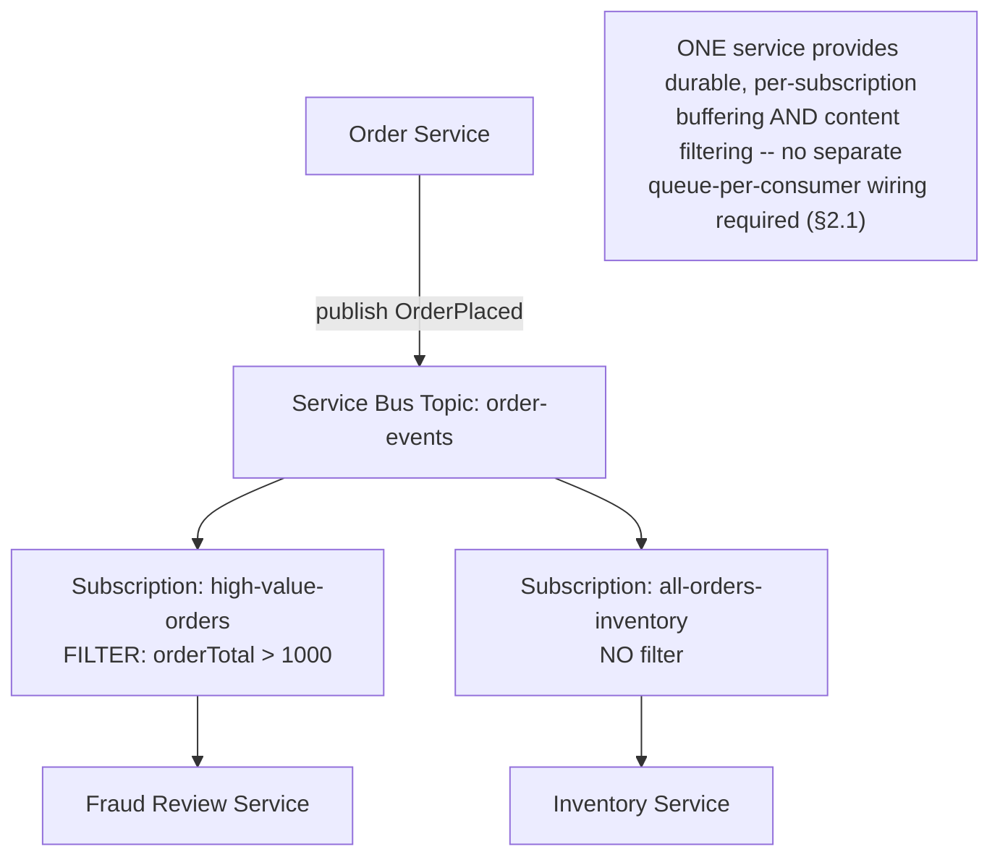
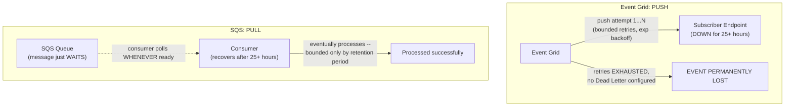

# Module 70 — Azure: Messaging & Event-Driven Architecture — Service Bus, Event Grid & Event Hubs

> Domain: Azure | Level: Beginner → Expert | Prerequisite: [[../21-AWS/06-Messaging-SQS-SNS-EventBridge-Kinesis]] (this module mirrors that module's structure — Service Bus/Event Grid/Event Hubs against SQS+SNS/EventBridge/Kinesis — flagging Event Grid's push-based delivery model as the single most consequential divergence), [[../18-Event-Driven-Architecture/02-Schema-Evolution-Ordering-DeliverySemantics-DLQ]], [[../19-Kafka/01-Architecture-Partitioning-Replication-ConsumerGroups]] (this module also re-applies the AWS-native-vs-Kafka decision framework from Module 62 §2.5 as an Azure-native-vs-Kafka framework)

---

## 1. Fundamentals

### Why does a Principal Engineer need Azure messaging depth given Module 62 already established the ordering/fan-out/replay/delivery-semantics decision framework generically?
The framework transfers directly — what's genuinely new here is that Azure's three core messaging services map onto AWS's four (SQS, SNS, EventBridge, Kinesis) with a **different service-boundary split**: Azure **Service Bus** natively combines SQS's point-to-point queueing *and* SNS's pub/sub fan-out into one service (via Topics with built-in, filtered Subscriptions), while Azure **Event Grid**'s delivery model is fundamentally **push-based** (webhook delivery to a subscriber endpoint) rather than SQS's **pull-based** (consumer-controlled polling) model — this last distinction is the single most operationally consequential divergence in this module, since it inverts who controls the pacing of message consumption and, critically, changes what happens to a message when the downstream consumer is unavailable or slow.

### Why does this matter?
Because a team with AWS experience, seeing Event Grid described as "Azure's EventBridge equivalent," will naturally assume its failure/retry/durability characteristics resemble a pull-based queue's forgiving "the message just waits until a consumer is ready" model — when Event Grid's actual behavior (bounded retry attempts over a bounded time window, followed by permanent message loss unless a Dead Letter destination is explicitly configured) is meaningfully less forgiving by default, a divergence that becomes catastrophic specifically during exactly the kind of downstream-outage scenario a messaging layer exists to protect against.

### When does this matter?
Any Azure-based event-driven architecture — and specifically any team porting an AWS SNS-to-SQS or EventBridge-based design to Azure without re-verifying each service's actual delivery guarantees rather than assuming behavioral parity from a shared "event-driven messaging" label.

### How does it work (30,000-ft view)?
```
Service Bus: QUEUES (point-to-point, like SQS) AND TOPICS with built-in, FILTERED Subscriptions
     (pub/sub fan-out, like SNS-to-SQS -- but NATIVELY, in ONE service, not two)
Event Grid: PUSH-based (webhook delivery) event routing -- Azure's EventBridge equivalent,
     but delivery is PUSH not PULL -- bounded retries, THEN LOSS unless Dead Letter is
     explicitly configured (a materially different default than SQS's forgiving retention)
Event Hubs: PARTITIONED, ORDERED, REPLAYABLE log -- Azure's Kinesis equivalent, for
     high-throughput telemetry/event-streaming ingestion with multiple independent
     consumer groups reading at their own pace
```

---

## 2. Deep Dive

### 2.1 Service Bus — Queues AND Topics/Subscriptions, Natively Combined Into One Service
Service Bus Queues provide point-to-point messaging directly analogous to SQS (Module 62 §2.1) — but Service Bus **Topics** natively support multiple **Subscriptions**, each with its own optional **SQL-like filter expression** (matching on message properties), meaning the entire SNS-to-SQS fan-out pattern Module 62 §2.2 established as AWS's *recommended, two-service* architecture is instead a **single, built-in Service Bus capability**: a Topic with three filtered Subscriptions natively provides what AWS requires wiring an SNS topic to three separate SQS queues to achieve. This is a genuine simplification, not a trap — but it inverts the "add a second service for durable per-consumer buffering" instinct Module 62 §2.2 trained: a team porting an AWS SNS+SQS architecture to Azure by literally provisioning an Event Grid topic (mistakenly reached for as "the pub/sub one") plus separate Service Bus queues per consumer is *over-engineering* relative to simply using Service Bus Topics/Subscriptions natively, which already provides durable, independent, per-subscription buffering without a second service at all.

### 2.2 Event Grid — Push-Based Delivery, and the Consequential Default-Retry-Then-Loss Behavior
Event Grid delivers events by **pushing** them (an HTTPS webhook call, or a push to Service Bus/Event Hubs/a Function App's Event Grid trigger, among other supported handlers) to each subscriber — critically, when a push delivery attempt fails (the subscriber endpoint is unreachable, returns an error, or times out), Event Grid **retries** according to a configurable retry policy (exponential backoff, with a configurable maximum number of delivery attempts and a maximum event time-to-live, defaulting to 24 hours) — and once retries are exhausted **without** a Dead Letter destination configured, **the event is permanently dropped**, with no further recovery possible. This is a fundamentally different failure mode than SQS's pull model, where a struggling consumer simply doesn't poll (or fails to delete) a message, and the message remains safely in the queue (bounded by the queue's configured retention period, not by a fixed retry-attempt count) until a healthy consumer eventually retrieves and processes it — Event Grid's push model requires the **subscriber**, not the message broker, to be the durable, always-available side of the interaction, or an explicit Dead Letter destination must be configured to catch what would otherwise be silently, permanently lost.

### 2.3 Event Hubs — the AWS-Kinesis-Equivalent Partitioned Log
Event Hubs provides a partitioned, ordered, retained event log with independent **consumer groups** reading at their own pace and checkpoint position — directly Module 62 §2.4's Kinesis discussion, mapped closely: Event Hubs partitions correspond to Kinesis shards, and Event Hubs' consumer-group-based checkpointing corresponds to Kinesis's per-consumer shard-iterator model. Event Hubs additionally offers a **Capture** feature (automatically, continuously archiving stream data to Blob Storage/Data Lake in near-real-time) with no precise single-step Kinesis equivalent (Kinesis Data Firehose provides comparable continuous-archival capability, but as a genuinely separate service requiring its own configuration, rather than a built-in Event Hubs capability) — a Principal Engineer evaluating long-term event retention/archival needs alongside real-time streaming should note Event Hubs Capture as a potentially simpler, more integrated Azure-native option than the equivalent two-service AWS Kinesis-plus-Firehose composition.

### 2.4 Azure-Native Messaging vs. Kafka — Re-Applying Module 62's Decision Framework
Directly extending Module 62 §2.5's AWS-native-vs-Kafka decision framework to Azure: choose **Service Bus** when the workload needs reliable, transactional, point-to-point or filtered-fan-out business messaging without requiring genuine multi-consumer replay (Service Bus's message retention is delivery-oriented, not a replayable log the way Event Hubs/Kafka are); choose **Event Grid** when the need is lightweight, high-scale, push-based event notification/routing, particularly for reacting to Azure resource-lifecycle events or building choreography-style architectures (directly analogous to Module 62 §2.3's EventBridge discussion), with explicit awareness of §2.2's bounded-retry-then-loss default; choose **Event Hubs** when genuine ordered, replayable, multi-consumer-group stream processing is required; choose **Kafka** (self-managed, or via Azure's own managed offering, HDInsight Kafka, or Confluent Cloud on Azure) specifically when the workload genuinely needs Kafka's specific ecosystem (Kafka Streams/ksqlDB, existing organizational Kafka investment) that Event Hubs doesn't replicate — notably, Event Hubs additionally offers a **Kafka-protocol-compatible endpoint**, allowing existing Kafka client applications to connect to Event Hubs with minimal code changes, a genuinely useful Azure-specific migration/interoperability capability with no direct AWS equivalent (Kinesis has no native Kafka-protocol-compatibility mode).

### 2.5 Sessions — Service Bus's FIFO/Ordering Mechanism, Structurally Similar to SQS FIFO Message Groups
Service Bus Sessions provide strict, ordered, exclusive-consumer-lock delivery of all messages sharing a session ID (directly analogous to Module 62 §2.1's SQS FIFO message-group model), with the added capability of a session-level **state** (arbitrary data a consumer can persist and retrieve alongside the session, useful for tracking cross-message workflow state without a separate external store) — this specific session-state capability has no direct SQS FIFO equivalent, and represents a genuine, if narrow, Azure-specific convenience for stateful, ordered-message-group processing patterns.

### 2.6 Delivery Semantics and Dead-Lettering — Universal Idempotency Discipline, With Event Grid's Sharper Edge
Service Bus and Event Hubs both provide at-least-once delivery by default (Service Bus additionally offers a "duplicate detection" feature providing a bounded, time-windowed exactly-once-ish guarantee for a specific detection window, conceptually similar to SQS FIFO's 5-minute deduplication window, Module 62 §2.1) — meaning Module 48/56/61/62's idempotent-consumer discipline applies universally here too. Event Grid, per §2.2, also retries at-least-once — but its consequential difference is what happens *after* retries are exhausted: Service Bus and Event Hubs both have dead-lettering as a well-understood, always-available safety net for their respective failure categories (a message that can't be processed after max delivery attempts goes to a dead-letter sub-queue automatically, by default), while Event Grid's Dead Letter destination is an **explicit, opt-in configuration** that, if omitted, results in **silent, permanent event loss** rather than a message landing somewhere recoverable — this asymmetry (opt-in-dead-lettering-with-silent-loss-as-the-fallback, versus dead-lettering-as-an-always-present-default-behavior) is a genuinely consequential configuration detail every Event Grid subscription must explicitly address.

---

## 3. Visual Architecture

### Service Bus Topic + Filtered Subscriptions — One Service Replacing AWS's SNS+SQS Pair (§2.1)


### Event Grid Push-Then-Loss vs. SQS Pull-Then-Wait (§2.2)


## 4. Production Example
**Scenario**: A team migrating an order-notification pipeline from AWS (SNS publishing to an SQS queue, consumed by a Lambda function) to Azure provisioned an **Event Grid** topic pushing directly to an Azure Function's HTTP-triggered webhook endpoint, reasoning — by direct analogy to their AWS setup — that "Event Grid is the pub/sub layer, and messages will just be safely delivered whenever our function is ready, the way SQS held messages for Lambda." They did not configure a Dead Letter destination on the Event Grid subscription, since their SQS-based mental model included no equivalent concept of a message ever being permanently lost due to consumer unavailability. **Investigation**: during a routine deployment, the Function App experienced an unexpectedly long cold-start-and-warm-up issue combined with a misconfigured dependency, causing it to return HTTP 500 errors for approximately 26 hours before an on-call engineer diagnosed and fixed the underlying deployment issue. When the team checked event delivery afterward, they discovered that order-notification events published during a specific ~2-hour window early in the outage were **permanently missing** — not delayed, not queued, genuinely gone — while events from later in the outage window (closer to when the Function App was fixed) had eventually succeeded via Event Grid's retry mechanism. **Root cause**: Event Grid's default retry policy exhausts its retry attempts within a bounded time window (governed by the configured maximum event time-to-live and retry-count settings) — events published early in the 26-hour outage exhausted their retry window **before** the Function App was fixed and therefore, with no Dead Letter destination configured, were silently dropped the moment their retry budget expired; events published later in the outage happened to still be within their own individual retry windows when the fix landed, and so were successfully, if belatedly, delivered — this partial, seemingly-arbitrary pattern of loss (some events lost, others eventually delivered, depending purely on *when* each was published relative to the outage's total duration) was specifically confusing to diagnose precisely because it didn't match either "everything was lost" or "everything eventually succeeded," a symptom directly explained by, but not obvious from, Event Grid's bounded-retry-window mechanics. **Fix**: configured an explicit Dead Letter destination (a Service Bus queue) on the Event Grid subscription, ensuring any future retry exhaustion routes the event to a durable, recoverable location rather than dropping it, and — recognizing that even Dead Letter destinations require someone to actually monitor and reprocess them — added a CloudWatch-equivalent (Azure Monitor) alarm on the Dead Letter queue's message count, alerting the team proactively rather than requiring another manual post-incident audit to discover lost events. **Lesson**: "our messaging layer holds messages until we're ready" is an SQS-specific behavior, not a universal property of "pub/sub messaging" as a category — Event Grid's push model requires this durability property to be explicitly engineered (via Dead Letter configuration) rather than assumed to be inherent, and the resulting failure mode (partial, time-window-dependent data loss) is specifically the kind of subtle, non-obvious symptom that makes this class of cross-cloud assumption error dangerous.

## 5. Best Practices
- Always configure an explicit Dead Letter destination on every Event Grid subscription — never assume push-based delivery provides SQS-equivalent indefinite retention on delivery failure (§4).
- Use Service Bus Topics with filtered Subscriptions natively for fan-out requirements, rather than reflexively reaching for a second service the way AWS's SNS-to-SQS pattern requires (§2.1).
- Monitor Dead Letter queue depth (across Service Bus, Event Hubs, and especially Event Grid) with proactive alerting, not just as a passive safety net requiring manual discovery (§4's fix).
- Choose Event Hubs specifically for genuine ordered, replayable, multi-consumer-group stream processing needs — not as a default choice when Service Bus's simpler, non-replayable model would suffice.
- Consider Event Hubs' Kafka-protocol-compatible endpoint for any migration scenario involving existing Kafka client applications, as a genuinely simpler interoperability path than a full application rewrite.

## 6. Anti-patterns
- Assuming Event Grid's push-based delivery provides the same "waits indefinitely for a consumer to become ready" durability as SQS's pull model, without configuring an explicit Dead Letter destination (§4).
- Over-engineering an Azure fan-out architecture by provisioning separate services to replicate AWS's SNS-to-SQS pattern, when Service Bus Topics/Subscriptions natively provide equivalent capability in one service (§2.1).
- Treating a configured Dead Letter destination as sufficient on its own, without proactive monitoring/alerting on its depth, effectively just relocating the "silently lost" problem to "silently accumulating, unnoticed" instead.
- Choosing Event Hubs when Service Bus would functionally suffice for a workload with no genuine replay/multi-consumer-group requirement, incurring unnecessary architectural complexity.
- Reflexively provisioning a self-managed or third-party Kafka deployment on Azure without first evaluating Event Hubs' Kafka-protocol-compatible endpoint as a potentially simpler path.

---

## 10. Interview Questions

### Basic (10)
1. **Q: What two AWS services does Azure Service Bus combine into one?** **A:** SQS (point-to-point queueing) and SNS (pub/sub fan-out, via Topics and Subscriptions).
2. **Q: What is the fundamental delivery-model difference between Event Grid and SQS?** **A:** Event Grid pushes events to subscriber endpoints; SQS is pull-based, with consumers polling at their own pace.
3. **Q: What happens to an Event Grid event if all retry attempts are exhausted and no Dead Letter destination is configured?** **A:** It is permanently, silently dropped.
4. **Q: What is a Service Bus Topic Subscription filter?** **A:** A SQL-like expression that scopes a specific Subscription to only the messages matching that filter, enabling native, single-service content-based fan-out.
5. **Q: What is the Azure equivalent of a Kinesis shard?** **A:** An Event Hubs partition.
6. **Q: What Azure-specific capability does Event Hubs offer that has no precise single-step Kinesis equivalent?** **A:** Capture — automatic, continuous archival of stream data to Blob Storage/Data Lake, built into the service.
7. **Q: What does Event Hubs' Kafka-protocol-compatible endpoint enable?** **A:** Existing Kafka client applications can connect to Event Hubs with minimal code changes.
8. **Q: What is a Service Bus Session?** **A:** A mechanism for strict, ordered, exclusive-consumer-lock delivery of messages sharing a session ID, analogous to SQS FIFO message groups, with additional session-state storage capability.
9. **Q: Do Service Bus and Event Hubs provide always-available dead-lettering by default?** **A:** Yes — unlike Event Grid, whose Dead Letter destination is explicit, opt-in configuration.
10. **Q: What security consideration does Event Grid's push model introduce that a pull-based consumer never faces?** **A:** The subscriber endpoint must validate that incoming push requests genuinely originate from Event Grid, to prevent forged event payloads from an untrusted source.

### Intermediate (10)
1. **Q: Why did the §4 incident's event loss pattern appear "partial and seemingly arbitrary" rather than a clean all-or-nothing failure?** **A:** Event Grid's retry window is bounded per-event from its own publish time — events published early in the outage exhausted their individual retry windows before the fix landed and were dropped, while events published later were still within their own retry windows when the fix arrived and were eventually delivered, producing a time-dependent, non-uniform loss pattern.
2. **Q: Why is provisioning separate services to replicate AWS's SNS-to-SQS pattern in Azure considered over-engineering rather than a safe, conservative choice?** **A:** Service Bus Topics with filtered Subscriptions natively provide equivalent durable, per-consumer, content-filtered fan-out in one service — adding a second service to replicate what's already built in introduces unnecessary architectural complexity without a compensating benefit.
3. **Q: Why is a configured Dead Letter destination alone insufficient without proactive monitoring, per §4's fix?** **A:** Without monitoring, undelivered events would still accumulate unnoticed in the Dead Letter destination rather than being lost outright — an improvement over silent loss, but still effectively invisible until someone manually checks, unless proactive alerting on Dead Letter depth is configured.
4. **Q: Why does a Service Bus consumer's message-lock renewal timing matter specifically for long-processing messages?** **A:** If the lock isn't renewed before its duration expires, the message becomes available for redelivery to another consumer even though the original consumer is still legitimately processing it, causing premature, unintended redelivery — the lock duration must be tuned against the consumer's actual realistic processing-time distribution.
5. **Q: Why does Event Grid's retry mechanism potentially generate more load on the broker itself during a downstream outage than SQS's pull model would?** **A:** Event Grid actively retries against a struggling or unreachable endpoint per its configured backoff policy, accumulating retry load as the backlog of undelivered events grows; SQS's pull model simply has the consumer stop polling, generating no equivalent broker-side retry-storm load.
6. **Q: Why should a Managed Identity be scoped to a specific Service Bus queue/topic rather than granted namespace-wide access by default?** **A:** The same least-privilege, blast-radius-limiting discipline established in Module 58/66 — namespace-wide access recreates the risk of a single compromised identity's blast radius extending far beyond what that specific workload actually needs.
7. **Q: Why is Event Hubs Capture described as "potentially simpler" than the equivalent Kinesis-plus-Firehose composition?** **A:** Capture is a built-in Event Hubs feature requiring only configuration, whereas the equivalent AWS capability requires provisioning and wiring together two genuinely separate services (Kinesis Data Streams and Kinesis Data Firehose).
8. **Q: Why does Service Bus's duplicate-detection feature only provide a "bounded, time-windowed exactly-once-ish guarantee" rather than true exactly-once delivery?** **A:** Like SQS FIFO's 5-minute deduplication window (Module 62 §2.1), duplicate detection only catches duplicates arriving within a configured detection window — a duplicate arriving after that window has elapsed would not be caught, meaning idempotent-consumer design remains necessary regardless.
9. **Q: Why should a team evaluate Event Hubs' Kafka-protocol-compatible endpoint before defaulting to self-managed Kafka on Azure?** **A:** It offers a potentially much simpler migration/interoperability path for existing Kafka client applications, avoiding the operational overhead of a self-managed Kafka cluster if Event Hubs' capabilities otherwise meet the workload's actual requirements.
10. **Q: Why is Event Grid's webhook-validation handshake specifically necessary, given that the endpoint URL itself might seem like sufficient protection?** **A:** A URL alone provides no authentication — anyone who discovers or guesses the endpoint could send forged requests unless the endpoint explicitly validates that requests genuinely originate from Event Grid, a distinctly push-model attack surface a pull-based consumer (which never exposes an inbound endpoint at all) doesn't have.

### Advanced (10)
1. **Q: Diagnose the §4 incident from first principles, and design the specific Azure Policy or automated governance check that would prevent this exact class of misconfiguration from recurring across an organization, extending this domain's now-established governance pattern.**
   **A:** Root cause: an SQS-derived assumption of indefinite, consumer-pace-driven retention was applied to Event Grid's fundamentally different, bounded-retry-then-loss push model. Structural fix: an Azure Policy definition denying creation of any Event Grid Event Subscription in a production Resource Group that lacks a configured Dead Letter destination — directly extending the automated-governance-gate pattern this Azure domain has established in every prior module (Modules 65-69) into the messaging-durability dimension specifically, ensuring the safeguard doesn't depend on any individual engineer correctly recalling Event Grid's specific behavior under pressure.
2. **Q: A team argues that since they've now configured Dead Letter destinations on every Event Grid subscription, they've fully eliminated the risk category §4 describes and no further review is needed. Evaluate this claim.**
   **A:** Push back — per §6/Advanced Q3 of Module 70's own §4 fix, a Dead Letter destination without proactive monitoring simply relocates the "silently lost" failure mode to "silently, invisibly accumulating," which is an improvement (recoverable in principle) but not a complete fix until paired with active alerting and a defined reprocessing procedure — "we configured Dead Letter destinations" addresses data *loss* but not data *staleness-while-unprocessed*, a related but distinct residual risk requiring its own explicit operational practice (§4's monitoring fix) to fully close.
3. **Q: Design the specific pre-production test that would reproduce the §4 incident's exact failure condition (bounded-retry-window expiration during an extended downstream outage) before a live incident exposes it.**
   **A:** A test that deliberately keeps a subscriber endpoint failing (returning errors) for a duration exceeding Event Grid's configured maximum retry window, then verifies both (a) that events published early in this window are indeed routed to the Dead Letter destination once their retry budget is exhausted (not silently dropped, validating the fix is actually correctly wired), and (b) that the Dead Letter monitoring alarm actually fires — steady-state or short-outage testing (where the subscriber recovers well within the retry window) never exercises the specific retry-exhaustion boundary condition that caused the original incident, the same recurring "steady-state doesn't exercise the failure-triggering condition" pattern from every prior Azure-domain module.
4. **Q: Explain why the "Event Grid vs. SQS" push/pull distinction generalizes into a broader architectural principle about which side of a messaging integration bears responsibility for availability, and identify the corresponding design implication for choosing a messaging service.**
   **A:** In a pull model, the broker bears the durability responsibility (retaining messages until a consumer is ready) while the consumer bears no availability obligation to the broker; in a push model, the relationship inverts — the *subscriber* must be highly available and responsive, or explicit compensating durability (Dead Letter) must be engineered, since the broker's own retry patience is inherently time-bounded. Design implication: choosing a push-based service (Event Grid) for a downstream system with anything less than very high availability/responsiveness requires deliberately compensating via Dead Letter configuration and monitoring; a downstream system with known availability gaps (early-stage services, systems undergoing frequent maintenance) is a better fit for a pull-based service (Service Bus queues) where the broker naturally absorbs consumer downtime without requiring this additional engineering.
5. **Q: A workload needs both Event Grid's low-latency, push-based reactivity for real-time notifications AND SQS/Service-Bus-like guaranteed, patient retention for a slower, batch-oriented downstream consumer. Design an architecture satisfying both requirements from a single event source.**
   **A:** Configure the Event Grid topic with **two** subscriptions: one pushing directly to the latency-sensitive real-time consumer (accepting §2.2's bounded-retry characteristics, since this consumer is expected to be highly available and responsive), and a second subscription targeting a **Service Bus queue** as the delivery destination (Event Grid natively supports Service Bus as a subscriber type) — the slower, batch-oriented consumer then pulls from that Service Bus queue at its own pace, inheriting Service Bus's patient, broker-retained durability rather than being directly exposed to Event Grid's push-and-bounded-retry model — this pattern directly combines both services' strengths for their respective consumer's actual availability profile, rather than forcing one uniform delivery model onto two consumers with genuinely different characteristics.
6. **Q: Critique the following claim: "Since Service Bus Topics/Subscriptions natively replace AWS's SNS-to-SQS pattern in one service, Service Bus should always be preferred over Event Grid for any Azure pub/sub requirement."**
   **A:** Overgeneralized — Service Bus and Event Grid serve genuinely different niches beyond just "pub/sub vs. not": Event Grid is optimized for very high-scale, low-latency, lightweight event notification (including native, deep integration with Azure resource lifecycle events themselves — a VM being created, a Blob being uploaded — which Service Bus has no equivalent native integration for) and choreography-style architectures, while Service Bus is optimized for reliable, potentially-transactional business messaging with richer per-message features (sessions, scheduled delivery, message deferral); defaulting to Service Bus universally would forfeit Event Grid's genuine strengths for workloads that actually need them, the same "match the specific tool to the specific requirement, don't default to a single option out of general caution" discipline this course applies throughout (Module 62 §2.5's original AWS decision framework).
7. **Q: Design the specific reprocessing procedure an operations team should follow when Dead Letter queue depth monitoring (§4's fix) fires an alert, ensuring reprocessing itself doesn't reintroduce a duplicate-processing risk.**
   **A:** Reprocessing dead-lettered messages/events must route back through the same idempotent-consumer logic (Module 62 §2.6's universal idempotency discipline) the original delivery path would have used — since some dead-lettered items might have partially succeeded before ultimately failing (e.g., an Activity Function-style multi-step process where an earlier step genuinely completed), a naive "just redeliver everything in the Dead Letter queue" reprocessing script risks duplicate side effects unless the downstream processing logic is confirmed idempotent, directly connecting this Event-Grid-specific finding back to Module 61/69's idempotent-consumer requirements as a genuinely necessary precondition for safe dead-letter reprocessing specifically.
8. **Q: A Principal Engineer is evaluating whether to migrate a high-throughput, multi-consumer-group telemetry-ingestion pipeline from Kinesis to Event Hubs as part of a broader Azure migration. What Event-Hubs-specific capacity dimension must be explicitly re-verified, given this domain's recurring pattern of Azure services having explicit, non-automatic capacity ceilings?**
   **A:** Event Hubs' Throughput Units (or the Standard/Premium tier's specific scaling model, including auto-inflate settings) must be explicitly sized against the pipeline's actual peak ingestion rate — directly the same "the Azure-native service's specific capacity ceiling requires proactive verification, don't assume automatic parity with the AWS service's scaling characteristics" discipline this domain has established repeatedly (Module 67 §9's storage-account throughput, Module 68 §9's Cosmos DB RU capacity, Module 69 §9's Durable Functions backend throughput) — a migration assuming Event Hubs "just scales like Kinesis" without this explicit verification risks an under-provisioned target platform.
9. **Q: Design the specific architectural test for verifying that a Service Bus Topic Subscription's filter expression correctly implements the intended content-based routing logic, avoiding a silent misrouting bug analogous to this domain's other silent-failure patterns.**
   **A:** A pre-production integration test that publishes a representative set of messages spanning every boundary condition the filter expression is meant to distinguish (messages just inside and just outside a numeric threshold, messages with a matching versus non-matching property value, messages missing the filtered property entirely) and asserts each message is delivered to exactly the subscriptions the intended routing logic requires — since a filter-expression typo or logic error (e.g., using `>=` where `>` was intended) would silently misroute messages with no error raised anywhere in the pipeline, the same category of "looks configured correctly, silently wrong" risk this domain has repeatedly identified, now applied to Service Bus filter-expression correctness specifically.
10. **As a Principal Engineer establishing Azure messaging standards for an organization migrating from AWS, design the specific set of standing architectural reviews and automated checks (synthesizing this entire module) you would require for every new Service Bus/Event Grid/Event Hubs integration.**
    **A:** (1) Mandatory Dead Letter destination configuration for every Event Grid subscription, enforced via Azure Policy (Advanced Q1) — the single highest-priority check, given the silent-permanent-loss default this module identified. (2) Mandatory Dead Letter depth monitoring/alerting paired with every Dead Letter destination (Advanced Q2), plus a documented, idempotency-verified reprocessing procedure (Advanced Q7). (3) Mandatory architecture-review justification for provisioning a second service to replicate fan-out, when Service Bus Topics/Subscriptions natively provide it in one service (§2.1) — necessary to prevent unnecessary complexity accumulation. (4) Mandatory Throughput Unit/capacity-ceiling verification against actual peak demand for any Event Hubs-based pipeline, especially migrations from Kinesis (Advanced Q8). (5) Mandatory filter-expression boundary-condition test coverage for every Service Bus Topic Subscription with a non-trivial filter (Advanced Q9). Each standard directly extends this Azure domain's now-thoroughly-established governance pattern (Modules 65-69) into the messaging layer, with item (1) representing this module's single most severe, highest-priority finding — a default failure mode (silent, permanent, bounded-retry-driven event loss) with genuinely no precedent risk of the same severity anywhere in this course's AWS messaging material, since SQS's pull-based model structurally cannot silently drop a message purely due to consumer unavailability the way Event Grid's push model can.

---

## 11. Coding Exercises

### Easy — Service Bus Topic with filtered Subscriptions replacing AWS's two-service fan-out (§2.1)
```hcl
resource "azurerm_servicebus_topic" "order_events" {
  name = "order-events"
}

resource "azurerm_servicebus_subscription" "high_value_orders" {
  name     = "high-value-orders-sub"
  topic_id = azurerm_servicebus_topic.order_events.id
}

resource "azurerm_servicebus_subscription_rule" "high_value_filter" {
  name            = "high-value-filter"
  subscription_id = azurerm_servicebus_subscription.high_value_orders.id
  filter_type     = "SqlFilter"
  sql_filter      = "orderTotal > 1000"   # native content-based routing -- ONE service, not two (§2.1)
}
```

### Medium — Event Grid subscription with MANDATORY Dead Letter destination (§2.2, §4's fix)
```hcl
resource "azurerm_eventgrid_event_subscription" "order_notification" {
  name  = "order-notification-sub"
  scope = azurerm_eventgrid_topic.orders.id

  webhook_endpoint {
    url = "https://checkout-func.azurewebsites.net/api/notify"
  }

  # MANDATORY -- §4's exact fix. Omitting this means retries exhaust after the
  # configured TTL and events are PERMANENTLY, SILENTLY dropped.
  storage_blob_dead_letter_destination {
    storage_account_id          = azurerm_storage_account.deadletters.id
    storage_blob_container_name = "eventgrid-deadletters"
  }

  retry_policy {
    max_delivery_attempts = 30
    event_time_to_live_in_minutes = 1440   # 24h -- events published near an extended
                                              # outage's START will still exhaust this and
                                              # DEAD-LETTER (not vanish) with this fix in place
  }
}
```

### Hard — Dead Letter monitoring alarm, closing the "silently accumulating" gap (§4's fix, §Advanced Q2)
```hcl
resource "azurerm_monitor_metric_alert" "deadletter_depth" {
  name                = "eventgrid-deadletter-accumulation"
  resource_group_name = azurerm_resource_group.checkout_prod.name
  scopes              = [azurerm_storage_account.deadletters.id]

  criteria {
    metric_namespace = "Microsoft.Storage/storageAccounts/blobServices"
    metric_name       = "BlobCount"
    aggregation       = "Total"
    operator          = "GreaterThan"
    threshold         = 0   # ANY dead-lettered event triggers proactive alerting --
                              # NOT a passive safety net requiring manual discovery (§4's lesson)
  }

  action { action_group_id = azurerm_monitor_action_group.oncall_pagerduty.id }
}
```

### Expert — Dual-subscription pattern combining Event Grid's reactivity with Service Bus's patient durability (§Advanced Q5)
```hcl
# Subscription 1: direct push to a highly-available, latency-sensitive real-time consumer
resource "azurerm_eventgrid_event_subscription" "realtime_notify" {
  name  = "realtime-notify-sub"
  scope = azurerm_eventgrid_topic.orders.id
  webhook_endpoint { url = "https://realtime-notify-func.azurewebsites.net/api/notify" }
  storage_blob_dead_letter_destination {
    storage_account_id = azurerm_storage_account.deadletters.id
    storage_blob_container_name = "realtime-deadletters"
  }
}

# Subscription 2: routes to Service Bus -- the SLOWER, batch-oriented consumer pulls at
# its OWN pace, inheriting patient, broker-retained durability instead of Event Grid's
# bounded-retry-then-loss model directly (§Advanced Q5's combined-strengths pattern).
resource "azurerm_eventgrid_event_subscription" "batch_via_servicebus" {
  name  = "batch-via-servicebus-sub"
  scope = azurerm_eventgrid_topic.orders.id
  service_bus_queue_endpoint_id = azurerm_servicebus_queue.batch_processing.id
}
```

---

## 12–17. System Design / LLD / Debugging / Decision / Case Study / Principal

*(§4's incident, the four §11 exercises, and the Advanced-tier Q&A — especially Advanced Q1's automated Dead Letter enforcement policy, Advanced Q5's dual-subscription combined-strengths pattern, and Advanced Q10's synthesized governance checklist — collectively constitute this module's system-design, debugging, and Principal-Engineer-level content.)*

## 18. Revision
**Key takeaways**: Service Bus natively combines SQS's point-to-point queueing and SNS's pub/sub fan-out into one service via Topics with filtered Subscriptions, making a two-service AWS-style fan-out architecture unnecessary complexity in Azure. Event Grid's push-based delivery model — the single most consequential divergence in this module — inverts the durability responsibility from broker (SQS's patient, pull-based retention) to subscriber (Event Grid's bounded-retry-then-silent-loss-by-default model), and this domain's incident (§4) demonstrated exactly how dangerous the resulting failure mode is: partial, time-window-dependent, genuinely permanent data loss with no equivalent risk category anywhere in this course's SQS-based AWS material. Every Event Grid subscription requires an explicit, monitored Dead Letter destination as a non-optional safeguard, not an assumed default behavior. Event Hubs maps closely to Kinesis, with a genuinely useful Kafka-protocol-compatible endpoint as an Azure-specific migration convenience. This module's governance findings (mandatory Dead Letter configuration and monitoring) represent the single highest-severity structural risk identified across this entire Azure domain to date, given the silent, permanent, and default nature of the failure mode it addresses.

---

**Next**: Continuing to Module 71 — Azure: Containers & Microservices (AKS, Container Apps, Dapr), continuing the `22-Azure` domain and mirroring Module 63's AWS containers structure, explicitly tying back to Modules 49–51.
