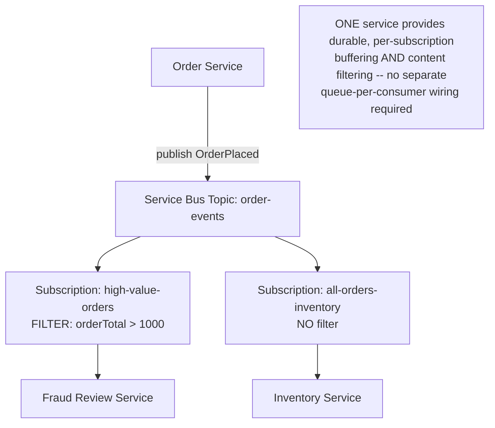
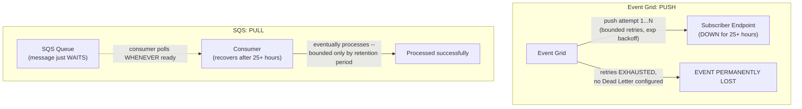
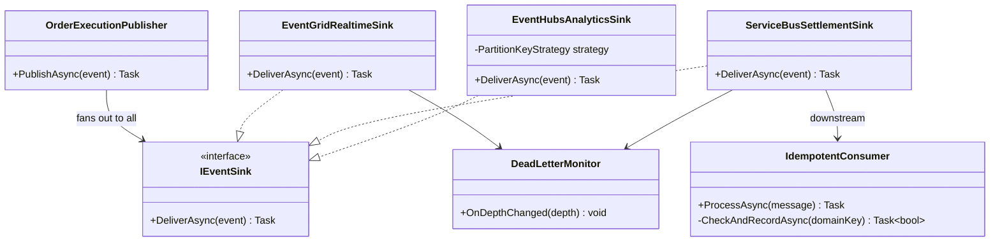
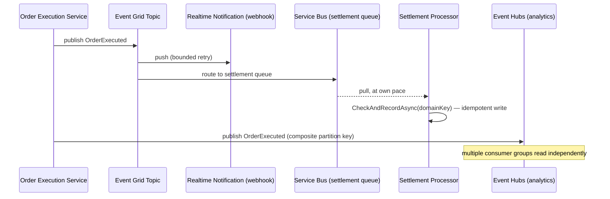

# Module 70 — Azure: Messaging & Event-Driven Architecture — Service Bus, Event Grid & Event Hubs

> Domain: Azure | Level: Beginner → Expert | Prerequisite: [[../21-AWS/06-Messaging-SQS-SNS-EventBridge-Kinesis]] (this module mirrors that module's structure — Service Bus/Event Grid/Event Hubs against SQS+SNS/EventBridge/Kinesis — flagging Event Grid's push-based delivery model as the single most consequential divergence), [[../18-Event-Driven-Architecture/02-Schema-Evolution-Ordering-DeliverySemantics-DLQ]], [[../19-Kafka/01-Architecture-Partitioning-Replication-ConsumerGroups]] (this module also re-applies the AWS-native-vs-Kafka decision framework as an Azure-native-vs-Kafka framework)

---

## 1. Fundamentals

### Why does a Principal Engineer need Azure messaging depth given already established the ordering/fan-out/replay/delivery-semantics decision framework generically?
The framework transfers directly — what's genuinely new here is that Azure's three core messaging services map onto AWS's four (SQS, SNS, EventBridge, Kinesis) with a **different service-boundary split**: Azure **Service Bus** natively combines SQS's point-to-point queueing *and* SNS's pub/sub fan-out into one service (via Topics with built-in, filtered Subscriptions), while Azure **Event Grid**'s delivery model is fundamentally **push-based** (webhook delivery to a subscriber endpoint) rather than SQS's **pull-based** (consumer-controlled polling) model — this last distinction is the single most operationally consequential divergence in this module, since it inverts who controls the pacing of message consumption and, critically, changes what happens to a message when the downstream consumer is unavailable or slow.

### Why does this matter?
Because a team with AWS experience, seeing Event Grid described as "Azure's EventBridge equivalent," will naturally assume its failure/retry/durability characteristics resemble a pull-based queue's forgiving "the message just waits until a consumer is ready" model — when Event Grid's actual behavior (bounded retry attempts over a bounded time window, followed by permanent message loss unless a Dead Letter destination is explicitly configured) is meaningfully less forgiving by default, a divergence that becomes catastrophic specifically during exactly the kind of downstream-outage scenario a messaging layer exists to protect against.

### When does this matter?
Any Azure-based event-driven architecture — and specifically any team porting an AWS SNS-to-SQS or EventBridge-based design to Azure without re-verifying each service's actual delivery guarantees rather than assuming behavioral parity from a shared "event-driven messaging" label.

### How does it work (30,000-ft view)?
```
Service Bus: QUEUES (point-to-point, like SQS) AND TOPICS with built-in, FILTERED Subscriptions
 (pub/sub fan-out, like SNS-to-SQS -- but NATIVELY, in ONE service, not two)
Event Grid: PUSH-based (webhook delivery) event routing -- Azure's EventBridge equivalent,
 but delivery is PUSH not PULL -- bounded retries, THEN LOSS unless Dead Letter is
 explicitly configured (a materially different default than SQS's forgiving retention)
Event Hubs: PARTITIONED, ORDERED, REPLAYABLE log -- Azure's Kinesis equivalent, for
 high-throughput telemetry/event-streaming ingestion with multiple independent
 consumer groups reading at their own pace
```

---

## 2. Deep Dive

### 2.1 Service Bus — Queues AND Topics/Subscriptions, Natively Combined Into One Service
Service Bus Queues provide point-to-point messaging directly analogous to SQS — but Service Bus **Topics** natively support multiple **Subscriptions**, each with its own optional **SQL-like filter expression** (matching on message properties), meaning the entire SNS-to-SQS fan-out pattern established as AWS's *recommended, two-service* architecture is instead a **single, built-in Service Bus capability**: a Topic with three filtered Subscriptions natively provides what AWS requires wiring an SNS topic to three separate SQS queues to achieve. This is a genuine simplification, not a trap — but it inverts the "add a second service for durable per-consumer buffering" instinct trained: a team porting an AWS SNS+SQS architecture to Azure by literally provisioning an Event Grid topic (mistakenly reached for as "the pub/sub one") plus separate Service Bus queues per consumer is *over-engineering* relative to simply using Service Bus Topics/Subscriptions natively, which already provides durable, independent, per-subscription buffering without a second service at all.

### 2.2 Event Grid — Push-Based Delivery, and the Consequential Default-Retry-Then-Loss Behavior
Event Grid delivers events by **pushing** them (an HTTPS webhook call, or a push to Service Bus/Event Hubs/a Function App's Event Grid trigger, among other supported handlers) to each subscriber — critically, when a push delivery attempt fails (the subscriber endpoint is unreachable, returns an error, or times out), Event Grid **retries** according to a configurable retry policy (exponential backoff, with a configurable maximum number of delivery attempts and a maximum event time-to-live, defaulting to 24 hours) — and once retries are exhausted **without** a Dead Letter destination configured, **the event is permanently dropped**, with no further recovery possible. This is a fundamentally different failure mode than SQS's pull model, where a struggling consumer simply doesn't poll (or fails to delete) a message, and the message remains safely in the queue (bounded by the queue's configured retention period, not by a fixed retry-attempt count) until a healthy consumer eventually retrieves and processes it — Event Grid's push model requires the **subscriber**, not the message broker, to be the durable, always-available side of the interaction, or an explicit Dead Letter destination must be configured to catch what would otherwise be silently, permanently lost.

### 2.3 Event Hubs — the AWS-Kinesis-Equivalent Partitioned Log
Event Hubs provides a partitioned, ordered, retained event log with independent **consumer groups** reading at their own pace and checkpoint position — directly the Kinesis discussion, mapped closely: Event Hubs partitions correspond to Kinesis shards, and Event Hubs' consumer-group-based checkpointing corresponds to Kinesis's per-consumer shard-iterator model. Event Hubs additionally offers a **Capture** feature (automatically, continuously archiving stream data to Blob Storage/Data Lake in near-real-time) with no precise single-step Kinesis equivalent (Kinesis Data Firehose provides comparable continuous-archival capability, but as a genuinely separate service requiring its own configuration, rather than a built-in Event Hubs capability) — a Principal Engineer evaluating long-term event retention/archival needs alongside real-time streaming should note Event Hubs Capture as a potentially simpler, more integrated Azure-native option than the equivalent two-service AWS Kinesis-plus-Firehose composition.

### 2.4 Azure-Native Messaging vs. Kafka — Re-Applying the Decision Framework
Directly extending the AWS-native-vs-Kafka decision framework to Azure: choose **Service Bus** when the workload needs reliable, transactional, point-to-point or filtered-fan-out business messaging without requiring genuine multi-consumer replay (Service Bus's message retention is delivery-oriented, not a replayable log the way Event Hubs/Kafka are); choose **Event Grid** when the need is lightweight, high-scale, push-based event notification/routing, particularly for reacting to Azure resource-lifecycle events or building choreography-style architectures (directly analogous to the EventBridge discussion), with explicit awareness of the bounded-retry-then-loss default; choose **Event Hubs** when genuine ordered, replayable, multi-consumer-group stream processing is required; choose **Kafka** (self-managed, or via Azure's own managed offering, HDInsight Kafka, or Confluent Cloud on Azure) specifically when the workload genuinely needs Kafka's specific ecosystem (Kafka Streams/ksqlDB, existing organizational Kafka investment) that Event Hubs doesn't replicate — notably, Event Hubs additionally offers a **Kafka-protocol-compatible endpoint**, allowing existing Kafka client applications to connect to Event Hubs with minimal code changes, a genuinely useful Azure-specific migration/interoperability capability with no direct AWS equivalent (Kinesis has no native Kafka-protocol-compatibility mode).

### 2.5 Sessions — Service Bus's FIFO/Ordering Mechanism, Structurally Similar to SQS FIFO Message Groups
Service Bus Sessions provide strict, ordered, exclusive-consumer-lock delivery of all messages sharing a session ID (directly analogous to the SQS FIFO message-group model), with the added capability of a session-level **state** (arbitrary data a consumer can persist and retrieve alongside the session, useful for tracking cross-message workflow state without a separate external store) — this specific session-state capability has no direct SQS FIFO equivalent, and represents a genuine, if narrow, Azure-specific convenience for stateful, ordered-message-group processing patterns.

### 2.6 Delivery Semantics and Dead-Lettering — Universal Idempotency Discipline, With Event Grid's Sharper Edge
Service Bus and Event Hubs both provide at-least-once delivery by default (Service Bus additionally offers a "duplicate detection" feature providing a bounded, time-windowed exactly-once-ish guarantee for a specific detection window, conceptually similar to SQS FIFO's 5-minute deduplication window) — meaning/56/61/62's idempotent-consumer discipline applies universally here too. Event Grid, also retries at-least-once — but its consequential difference is what happens *after* retries are exhausted: Service Bus and Event Hubs both have dead-lettering as a well-understood, always-available safety net for their respective failure categories (a message that can't be processed after max delivery attempts goes to a dead-letter sub-queue automatically, by default), while Event Grid's Dead Letter destination is an **explicit, opt-in configuration** that, if omitted, results in **silent, permanent event loss** rather than a message landing somewhere recoverable — this asymmetry (opt-in-dead-lettering-with-silent-loss-as-the-fallback, versus dead-lettering-as-an-always-present-default-behavior) is a genuinely consequential configuration detail every Event Grid subscription must explicitly address.

---

## 3. Visual Architecture

### Service Bus Topic + Filtered Subscriptions — One Service Replacing AWS's SNS+SQS Pair

```mermaid
graph TB
 Producer[Order Service] -->|publish OrderPlaced| Topic[Service Bus Topic: order-events]
 Topic --> Sub1["Subscription: high-value-orders<br/>FILTER: orderTotal > 1000"]
 Topic --> Sub2["Subscription: all-orders-inventory<br/>NO filter"]
 Sub1 --> FraudReview[Fraud Review Service]
 Sub2 --> Inventory[Inventory Service]
 Note["ONE service provides durable, per-subscription<br/>buffering AND content filtering -- no separate<br/>queue-per-consumer wiring required"]
```

### Event Grid Push-Then-Loss vs. SQS Pull-Then-Wait

```mermaid
graph TB
 subgraph "Event Grid: PUSH"
 EG[Event Grid] -->|"push attempt 1...N<br/>(bounded retries, exp backoff)"| Sub["Subscriber Endpoint<br/>(DOWN for 25+ hours)"]
 EG -->|"retries EXHAUSTED,<br/>no Dead Letter configured"| Lost["EVENT PERMANENTLY LOST"]
 end
 subgraph "SQS: PULL"
 Queue["SQS Queue<br/>(message just WAITS)"] -.->|"consumer polls WHENEVER ready"| Consumer["Consumer<br/>(recovers after 25+ hours)"]
 Consumer -->|"eventually processes --<br/>bounded only by retention period"| Done[Processed successfully]
 end
```

## 4. Production Example
**Scenario**: A team migrating an order-notification pipeline from AWS (SNS publishing to an SQS queue, consumed by a Lambda function) to Azure provisioned an **Event Grid** topic pushing directly to an Azure Function's HTTP-triggered webhook endpoint, reasoning — by direct analogy to their AWS setup — that "Event Grid is the pub/sub layer, and messages will just be safely delivered whenever our function is ready, the way SQS held messages for Lambda." They did not configure a Dead Letter destination on the Event Grid subscription, since their SQS-based mental model included no equivalent concept of a message ever being permanently lost due to consumer unavailability. **Investigation**: during a routine deployment, the Function App experienced an unexpectedly long cold-start-and-warm-up issue combined with a misconfigured dependency, causing it to return HTTP 500 errors for approximately 26 hours before an on-call engineer diagnosed and fixed the underlying deployment issue. When the team checked event delivery afterward, they discovered that order-notification events published during a specific ~2-hour window early in the outage were **permanently missing** — not delayed, not queued, genuinely gone — while events from later in the outage window (closer to when the Function App was fixed) had eventually succeeded via Event Grid's retry mechanism. **Root cause**: Event Grid's default retry policy exhausts its retry attempts within a bounded time window (governed by the configured maximum event time-to-live and retry-count settings) — events published early in the 26-hour outage exhausted their retry window **before** the Function App was fixed and therefore, with no Dead Letter destination configured, were silently dropped the moment their retry budget expired; events published later in the outage happened to still be within their own individual retry windows when the fix landed, and so were successfully, if belatedly, delivered — this partial, seemingly-arbitrary pattern of loss (some events lost, others eventually delivered, depending purely on *when* each was published relative to the outage's total duration) was specifically confusing to diagnose precisely because it didn't match either "everything was lost" or "everything eventually succeeded," a symptom directly explained by, but not obvious from, Event Grid's bounded-retry-window mechanics. **Fix**: configured an explicit Dead Letter destination (a Service Bus queue) on the Event Grid subscription, ensuring any future retry exhaustion routes the event to a durable, recoverable location rather than dropping it, and — recognizing that even Dead Letter destinations require someone to actually monitor and reprocess them — added a CloudWatch-equivalent (Azure Monitor) alarm on the Dead Letter queue's message count, alerting the team proactively rather than requiring another manual post-incident audit to discover lost events. **Lesson**: "our messaging layer holds messages until we're ready" is an SQS-specific behavior, not a universal property of "pub/sub messaging" as a category — Event Grid's push model requires this durability property to be explicitly engineered (via Dead Letter configuration) rather than assumed to be inherent, and the resulting failure mode (partial, time-window-dependent data loss) is specifically the kind of subtle, non-obvious symptom that makes this class of cross-cloud assumption error dangerous.

## 5. Best Practices
- Always configure an explicit Dead Letter destination on every Event Grid subscription — never assume push-based delivery provides SQS-equivalent indefinite retention on delivery failure.
- Use Service Bus Topics with filtered Subscriptions natively for fan-out requirements, rather than reflexively reaching for a second service the way AWS's SNS-to-SQS pattern requires.
- Monitor Dead Letter queue depth (across Service Bus, Event Hubs, and especially Event Grid) with proactive alerting, not just as a passive safety net requiring manual discovery (the fix).
- Choose Event Hubs specifically for genuine ordered, replayable, multi-consumer-group stream processing needs — not as a default choice when Service Bus's simpler, non-replayable model would suffice.
- Consider Event Hubs' Kafka-protocol-compatible endpoint for any migration scenario involving existing Kafka client applications, as a genuinely simpler interoperability path than a full application rewrite.

## 6. Anti-patterns
- Assuming Event Grid's push-based delivery provides the same "waits indefinitely for a consumer to become ready" durability as SQS's pull model, without configuring an explicit Dead Letter destination.
- Over-engineering an Azure fan-out architecture by provisioning separate services to replicate AWS's SNS-to-SQS pattern, when Service Bus Topics/Subscriptions natively provide equivalent capability in one service.
- Treating a configured Dead Letter destination as sufficient on its own, without proactive monitoring/alerting on its depth, effectively just relocating the "silently lost" problem to "silently accumulating, unnoticed" instead.
- Choosing Event Hubs when Service Bus would functionally suffice for a workload with no genuine replay/multi-consumer-group requirement, incurring unnecessary architectural complexity.
- Reflexively provisioning a self-managed or third-party Kafka deployment on Azure without first evaluating Event Hubs' Kafka-protocol-compatible endpoint as a potentially simpler path.

---

## 7. Performance Engineering

**CPU/Memory:** Service Bus consumer throughput is heavily governed by **prefetch count** and message-lock-duration tuning — a prefetch count that's too low (the default is 0 for many SDK client configurations) forces a network round-trip per message, while a prefetch count set too high can cause locked-but-unprocessed messages to accumulate past their lock duration, triggering unintended redelivery under load; both directions are common, self-inflicted throughput ceilings, not inherent Service Bus limits.

**Latency:** Service Bus **session-enabled** queues/subscriptions add a measurable per-message latency cost relative to non-sessioned entities, since a session-aware receiver must acquire an exclusive session lock before it can begin dequeuing — for a workload that doesn't genuinely need strict per-key ordering, enabling sessions purely out of caution (rather than an actual ordering requirement) is a real, avoidable latency tax.

**Throughput:** Event Hubs' per-**partition** throughput ceiling (roughly 1 MB/s or 1,000 events/sec ingress, 2 MB/s egress, per partition, under the Standard tier's Throughput Unit model) is the fundamental Event Hubs capacity-planning constraint — a hot partition (e.g., all events for a single, extremely high-volume trading instrument hashed to one partition key) can throttle well before the namespace's aggregate Throughput Units are exhausted, meaning **partition key selection**, not just Throughput Unit count, governs real achievable throughput.

**Scalability:** Auto-inflate on Event Hubs' Standard tier automatically raises Throughput Units up to a configured ceiling under sustained load, but reacts on a lag (not instantaneous) — a sudden burst (a market-open volume spike) can still throttle briefly before auto-inflate catches up, meaning latency-sensitive ingestion pipelines should pre-provision a baseline TU count covering the *known* burst magnitude rather than relying on auto-inflate alone for the burst's leading edge.

**Benchmarking:** Benchmark Service Bus lock-duration/prefetch settings against the *actual* message-processing-time distribution (including its tail, not just its median) — a lock duration tuned to the median processing time will cause exactly the premature-redelivery failure mode this module's Intermediate Q4 already identifies for any message landing in the distribution's tail.

**Caching:** Not a primary lever for any of the three services directly; the closest analog is Event Hubs Capture's near-real-time archival, which offloads downstream analytical/replay reads from the live stream rather than functioning as a request-response cache.

---

## 8. Security

**Threats:** A Service Bus or Event Hubs connection string with **Manage** rights (rather than the narrower **Send** or **Listen**-only rights), if leaked or over-distributed, allows an attacker to alter the namespace's own topology (delete queues, change access policies) in addition to reading/writing messages — a materially larger blast radius than a scoped Send/Listen credential. Event Grid's push model introduces a distinct threat: an attacker who discovers or guesses a webhook endpoint URL can send forged event payloads unless the endpoint validates the request's genuine origin.

**Mitigations:** Prefer **Azure RBAC with managed identities** over Shared Access Signature (SAS) connection strings wherever the SDK/service supports it — RBAC roles (`Azure Service Bus Data Sender`/`Data Receiver`, `Azure Event Hubs Data Sender`/`Data Receiver`) are scoped, auditable via Azure AD sign-in logs, and avoid the long-lived-secret-distribution risk inherent to SAS connection strings; where SAS is still required (e.g., a legacy on-prem publisher), scope each SAS policy to the narrowest right (Send-only for a publisher, Listen-only for a consumer) and rotate keys on a defined cadence.

**OWASP mapping:** Broken authentication if an Event Grid webhook endpoint accepts any inbound POST without validating the `aeg-event-type: SubscriptionValidation` handshake and the request's cryptographic origin; security misconfiguration if a Service Bus namespace's default `RootManageSharedAccessKey` policy (full Manage rights) is used directly by application code instead of provisioning a narrowly-scoped policy.

**AuthN/AuthZ:** Event Grid's subscription-validation handshake (responding to the initial `SubscriptionValidationEvent` with the correct validation code) is the baseline authenticity check, but for genuinely sensitive event payloads, layer Azure AD-based webhook authentication (Event Grid can deliver with an Azure AD token in the request, verified by the subscriber) on top of the handshake alone, since the handshake only proves the endpoint was legitimately subscribed once — not that every subsequent individual delivery is genuinely from Event Grid rather than a replayed or forged request against the same now-known URL.

**Secrets:** Never hard-code Service Bus/Event Hubs connection strings in application config committed to source control; use Key Vault references exactly as established in Module 69, and prefer managed identity to eliminate the secret-distribution problem entirely where feasible.

**Encryption:** All three services encrypt data at rest by default (Microsoft-managed keys), with customer-managed key (CMK) support available for organizations with a regulatory requirement to control key lifecycle directly — a common requirement for FinTech workloads subject to data-residency or key-custody regulations; TLS is enforced in transit by default and should never be downgraded via a legacy AMQP/HTTP configuration for backward compatibility.

---

## 9. Scalability

**Horizontal scaling:** Event Hubs scales ingestion horizontally by adding partitions (a namespace-level, largely one-way decision — partition count can be increased but not decreased on Standard tier, and repartitioning changes key-to-partition mapping, breaking any consumer logic that assumed a stable mapping); Service Bus scales by adding namespaces/entities rather than a partition-count lever, since its queueing model doesn't expose partitions to the application the way Event Hubs does (Service Bus Premium's internal partitioning, where enabled, is a distinct, largely transparent mechanism).

**Vertical scaling:** Service Bus Premium tier provides dedicated, predictable-latency messaging units (as opposed to Standard tier's shared, multi-tenant throughput), directly analogous to choosing a larger compute SKU — appropriate when Standard tier's shared-tenancy latency variance is unacceptable for a latency-SLA-bound workload.

**Caching:** Not a primary scaling lever for these services; see §7.

**Replication/Partitioning:** Event Hubs' partition count is the single most consequential scaling decision at provisioning time — too few partitions caps maximum parallel-consumer throughput regardless of Throughput Unit count (a consumer group can have at most one active reader per partition), while too many partitions adds management overhead and can fragment ordering guarantees (ordering is only guaranteed *within* a partition) across a wider key space than necessary.

**Load balancing:** Event Hubs consumer groups load-balance partitions across active readers automatically (via the Event Processor Host/`EventProcessorClient` checkpointing model); Service Bus queues load-balance naturally via competing-consumer pull, with no partition-affinity constraint unless sessions are in use.

**High Availability:** All three services support availability zones within a region (Premium/Standard tiers, region-dependent) and geo-disaster-recovery pairing (Service Bus/Event Hubs Geo-DR aliases a secondary namespace, with metadata — not messages — replicated, meaning failover requires the application to reconnect via the alias and accept that in-flight, undelivered messages in the primary at the moment of failover are not automatically carried over).

**Disaster Recovery:** Geo-DR's metadata-only replication (queues/topics/subscriptions structure, not message bodies) is a frequently-missed nuance — a team assuming Geo-DR provides full message-content failover, the same category of AWS-derived or SQS-derived false-parity assumption this module's central incident already illustrates for Event Grid, will discover during an actual regional failover that in-flight messages in the failed-over-from namespace are not present in the failed-over-to namespace.

**CAP theorem:** Not directly applicable to these transport-layer services in isolation; the relevant reasoning belongs to whichever durable store a consumer ultimately persists processed events into.

---

## 10. Interview Questions

### Basic (10)
1. **Q: What two AWS services does Azure Service Bus combine into one?** **A:** SQS (point-to-point queueing) and SNS (pub/sub fan-out, via Topics and Subscriptions).
2. **Q: What is the fundamental delivery-model difference between Event Grid and SQS?** **A:** Event Grid pushes events to subscriber endpoints; SQS is pull-based, with consumers polling at their own pace.
3. **Q: What happens to an Event Grid event if all retry attempts are exhausted and no Dead Letter destination is configured?** **A:** It is permanently, silently dropped.
4. **Q: What is a Service Bus Topic Subscription filter?** **A:** A SQL-like expression that scopes a specific Subscription to only the messages matching that filter, enabling native, single-service content-based fan-out.
5. **Q: What is the Azure equivalent of a Kinesis shard?** **A:** An Event Hubs partition — the same unit-of-parallelism role (ordered log segment, one reader per consumer-group per partition), with the key operational difference that Event Hubs throughput is governed by namespace Throughput/Processing Units rather than per-partition provisioned capacity.
6. **Q: What Azure-specific capability does Event Hubs offer that has no precise single-step Kinesis equivalent?** **A:** Capture — automatic, continuous archival of stream data to Blob Storage/Data Lake, built into the service.
7. **Q: What does Event Hubs' Kafka-protocol-compatible endpoint enable?** **A:** Existing Kafka client applications can connect to Event Hubs with minimal code changes.
8. **Q: What is a Service Bus Session?** **A:** A mechanism for strict, ordered, exclusive-consumer-lock delivery of messages sharing a session ID, analogous to SQS FIFO message groups, with additional session-state storage capability.
9. **Q: Do Service Bus and Event Hubs provide always-available dead-lettering by default?** **A:** Yes — unlike Event Grid, whose Dead Letter destination is explicit, opt-in configuration.
10. **Q: What security consideration does Event Grid's push model introduce that a pull-based consumer never faces?** **A:** The subscriber endpoint must validate that incoming push requests genuinely originate from Event Grid, to prevent forged event payloads from an untrusted source.

### Intermediate (10)
1. **Q: Why did the incident's event loss pattern appear "partial and seemingly arbitrary" rather than a clean all-or-nothing failure?** **A:** Event Grid's retry window is bounded per-event from its own publish time — events published early in the outage exhausted their individual retry windows before the fix landed and were dropped, while events published later were still within their own retry windows when the fix arrived and were eventually delivered, producing a time-dependent, non-uniform loss pattern.
2. **Q: Why is provisioning separate services to replicate AWS's SNS-to-SQS pattern in Azure considered over-engineering rather than a safe, conservative choice?** **A:** Service Bus Topics with filtered Subscriptions natively provide equivalent durable, per-consumer, content-filtered fan-out in one service — adding a second service to replicate what's already built in introduces unnecessary architectural complexity without a compensating benefit.
3. **Q: Why is a configured Dead Letter destination alone insufficient without proactive monitoring, per the fix?** **A:** Without monitoring, undelivered events would still accumulate unnoticed in the Dead Letter destination rather than being lost outright — an improvement over silent loss, but still effectively invisible until someone manually checks, unless proactive alerting on Dead Letter depth is configured.
4. **Q: Why does a Service Bus consumer's message-lock renewal timing matter specifically for long-processing messages?** **A:** If the lock isn't renewed before its duration expires, the message becomes available for redelivery to another consumer even though the original consumer is still legitimately processing it, causing premature, unintended redelivery — the lock duration must be tuned against the consumer's actual realistic processing-time distribution.
5. **Q: Why does Event Grid's retry mechanism potentially generate more load on the broker itself during a downstream outage than SQS's pull model would?** **A:** Event Grid actively retries against a struggling or unreachable endpoint per its configured backoff policy, accumulating retry load as the backlog of undelivered events grows; SQS's pull model simply has the consumer stop polling, generating no equivalent broker-side retry-storm load.
6. **Q: Why should a Managed Identity be scoped to a specific Service Bus queue/topic rather than granted namespace-wide access by default?** **A:** The same least-privilege, blast-radius-limiting discipline established /66 — namespace-wide access recreates the risk of a single compromised identity's blast radius extending far beyond what that specific workload actually needs.
7. **Q: Why is Event Hubs Capture described as "potentially simpler" than the equivalent Kinesis-plus-Firehose composition?** **A:** Capture is a built-in Event Hubs feature requiring only configuration, whereas the equivalent AWS capability requires provisioning and wiring together two genuinely separate services (Kinesis Data Streams and Kinesis Data Firehose).
8. **Q: Why does Service Bus's duplicate-detection feature only provide a "bounded, time-windowed exactly-once-ish guarantee" rather than true exactly-once delivery?** **A:** Like SQS FIFO's 5-minute deduplication window, duplicate detection only catches duplicates arriving within a configured detection window — a duplicate arriving after that window has elapsed would not be caught, meaning idempotent-consumer design remains necessary regardless.
9. **Q: Why should a team evaluate Event Hubs' Kafka-protocol-compatible endpoint before defaulting to self-managed Kafka on Azure?** **A:** It offers a potentially much simpler migration/interoperability path for existing Kafka client applications, avoiding the operational overhead of a self-managed Kafka cluster if Event Hubs' capabilities otherwise meet the workload's actual requirements.
10. **Q: Why is Event Grid's webhook-validation handshake specifically necessary, given that the endpoint URL itself might seem like sufficient protection?** **A:** A URL alone provides no authentication — anyone who discovers or guesses the endpoint could send forged requests unless the endpoint explicitly validates that requests genuinely originate from Event Grid, a distinctly push-model attack surface a pull-based consumer (which never exposes an inbound endpoint at all) doesn't have.

### Advanced (10)
1. **Q: Diagnose the incident from first principles, and design the specific Azure Policy or automated governance check that would prevent this exact class of misconfiguration from recurring across an organization, extending this domain's now-established governance pattern.**
 **A:** Root cause: an SQS-derived assumption of indefinite, consumer-pace-driven retention was applied to Event Grid's fundamentally different, bounded-retry-then-loss push model. Structural fix: an Azure Policy definition denying creation of any Event Grid Event Subscription in a production Resource Group that lacks a configured Dead Letter destination — directly extending the automated-governance-gate pattern this Azure domain has established in every prior module (Modules 65-69) into the messaging-durability dimension specifically, ensuring the safeguard doesn't depend on any individual engineer correctly recalling Event Grid's specific behavior under pressure.
2. **Q: A team argues that since they've now configured Dead Letter destinations on every Event Grid subscription, they've fully eliminated the risk category describes and no further review is needed. Evaluate this claim.**
 **A:** Push back — /Advanced Q3 of the own fix, a Dead Letter destination without proactive monitoring simply relocates the "silently lost" failure mode to "silently, invisibly accumulating," which is an improvement (recoverable in principle) but not a complete fix until paired with active alerting and a defined reprocessing procedure — "we configured Dead Letter destinations" addresses data *loss* but not data *staleness-while-unprocessed*, a related but distinct residual risk requiring its own explicit operational practice (the monitoring fix) to fully close.
3. **Q: Design the specific pre-production test that would reproduce the incident's exact failure condition (bounded-retry-window expiration during an extended downstream outage) before a live incident exposes it.**
 **A:** A test that deliberately keeps a subscriber endpoint failing (returning errors) for a duration exceeding Event Grid's configured maximum retry window, then verifies both (a) that events published early in this window are indeed routed to the Dead Letter destination once their retry budget is exhausted (not silently dropped, validating the fix is actually correctly wired), and (b) that the Dead Letter monitoring alarm actually fires — steady-state or short-outage testing (where the subscriber recovers well within the retry window) never exercises the specific retry-exhaustion boundary condition that caused the original incident, the same recurring "steady-state doesn't exercise the failure-triggering condition" pattern from every prior Azure-domain module.
4. **Q: Explain why the "Event Grid vs. SQS" push/pull distinction generalizes into a broader architectural principle about which side of a messaging integration bears responsibility for availability, and identify the corresponding design implication for choosing a messaging service.**
 **A:** In a pull model, the broker bears the durability responsibility (retaining messages until a consumer is ready) while the consumer bears no availability obligation to the broker; in a push model, the relationship inverts — the *subscriber* must be highly available and responsive, or explicit compensating durability (Dead Letter) must be engineered, since the broker's own retry patience is inherently time-bounded. Design implication: choosing a push-based service (Event Grid) for a downstream system with anything less than very high availability/responsiveness requires deliberately compensating via Dead Letter configuration and monitoring; a downstream system with known availability gaps (early-stage services, systems undergoing frequent maintenance) is a better fit for a pull-based service (Service Bus queues) where the broker naturally absorbs consumer downtime without requiring this additional engineering.
5. **Q: A workload needs both Event Grid's low-latency, push-based reactivity for real-time notifications AND SQS/Service-Bus-like guaranteed, patient retention for a slower, batch-oriented downstream consumer. Design an architecture satisfying both requirements from a single event source.**
 **A:** Configure the Event Grid topic with **two** subscriptions: one pushing directly to the latency-sensitive real-time consumer (accepting the bounded-retry characteristics, since this consumer is expected to be highly available and responsive), and a second subscription targeting a **Service Bus queue** as the delivery destination (Event Grid natively supports Service Bus as a subscriber type) — the slower, batch-oriented consumer then pulls from that Service Bus queue at its own pace, inheriting Service Bus's patient, broker-retained durability rather than being directly exposed to Event Grid's push-and-bounded-retry model — this pattern directly combines both services' strengths for their respective consumer's actual availability profile, rather than forcing one uniform delivery model onto two consumers with genuinely different characteristics.
6. **Q: Critique the following claim: "Since Service Bus Topics/Subscriptions natively replace AWS's SNS-to-SQS pattern in one service, Service Bus should always be preferred over Event Grid for any Azure pub/sub requirement."**
 **A:** Overgeneralized — Service Bus and Event Grid serve genuinely different niches beyond just "pub/sub vs. not": Event Grid is optimized for very high-scale, low-latency, lightweight event notification (including native, deep integration with Azure resource lifecycle events themselves — a VM being created, a Blob being uploaded — which Service Bus has no equivalent native integration for) and choreography-style architectures, while Service Bus is optimized for reliable, potentially-transactional business messaging with richer per-message features (sessions, scheduled delivery, message deferral); defaulting to Service Bus universally would forfeit Event Grid's genuine strengths for workloads that actually need them, the same "match the specific tool to the specific requirement, don't default to a single option out of general caution" discipline this course applies throughout (the original AWS decision framework).
7. **Q: Design the specific reprocessing procedure an operations team should follow when Dead Letter queue depth monitoring (the fix) fires an alert, ensuring reprocessing itself doesn't reintroduce a duplicate-processing risk.**
 **A:** Reprocessing dead-lettered messages/events must route back through the same idempotent-consumer logic (the universal idempotency discipline) the original delivery path would have used — since some dead-lettered items might have partially succeeded before ultimately failing (e.g., an Activity Function-style multi-step process where an earlier step genuinely completed), a naive "just redeliver everything in the Dead Letter queue" reprocessing script risks duplicate side effects unless the downstream processing logic is confirmed idempotent, directly connecting this Event-Grid-specific finding back to/69's idempotent-consumer requirements as a genuinely necessary precondition for safe dead-letter reprocessing specifically.
8. **Q: A Principal Engineer is evaluating whether to migrate a high-throughput, multi-consumer-group telemetry-ingestion pipeline from Kinesis to Event Hubs as part of a broader Azure migration. What Event-Hubs-specific capacity dimension must be explicitly re-verified, given this domain's recurring pattern of Azure services having explicit, non-automatic capacity ceilings?**
 **A:** Event Hubs' Throughput Units (or the Standard/Premium tier's specific scaling model, including auto-inflate settings) must be explicitly sized against the pipeline's actual peak ingestion rate — directly the same "the Azure-native service's specific capacity ceiling requires proactive verification, don't assume automatic parity with the AWS service's scaling characteristics" discipline this domain has established repeatedly — a migration assuming Event Hubs "just scales like Kinesis" without this explicit verification risks an under-provisioned target platform.
9. **Q: Design the specific architectural test for verifying that a Service Bus Topic Subscription's filter expression correctly implements the intended content-based routing logic, avoiding a silent misrouting bug analogous to this domain's other silent-failure patterns.**
 **A:** A pre-production integration test that publishes a representative set of messages spanning every boundary condition the filter expression is meant to distinguish (messages just inside and just outside a numeric threshold, messages with a matching versus non-matching property value, messages missing the filtered property entirely) and asserts each message is delivered to exactly the subscriptions the intended routing logic requires — since a filter-expression typo or logic error (e.g., using `>=` where `>` was intended) would silently misroute messages with no error raised anywhere in the pipeline, the same category of "looks configured correctly, silently wrong" risk this domain has repeatedly identified, now applied to Service Bus filter-expression correctness specifically.
10. **Q: As a Principal Engineer establishing Azure messaging standards for an organization migrating from AWS, design the specific set of standing architectural reviews and automated checks (synthesizing this entire module) you would require for every new Service Bus/Event Grid/Event Hubs integration.**
 **A:** (1) Mandatory Dead Letter destination configuration for every Event Grid subscription, enforced via Azure Policy (Advanced Q1) — the single highest-priority check, given the silent-permanent-loss default this module identified. (2) Mandatory Dead Letter depth monitoring/alerting paired with every Dead Letter destination (Advanced Q2), plus a documented, idempotency-verified reprocessing procedure (Advanced Q7). (3) Mandatory architecture-review justification for provisioning a second service to replicate fan-out, when Service Bus Topics/Subscriptions natively provide it in one service — necessary to prevent unnecessary complexity accumulation. (4) Mandatory Throughput Unit/capacity-ceiling verification against actual peak demand for any Event Hubs-based pipeline, especially migrations from Kinesis (Advanced Q8). (5) Mandatory filter-expression boundary-condition test coverage for every Service Bus Topic Subscription with a non-trivial filter (Advanced Q9). Each standard directly extends this Azure domain's now-thoroughly-established governance pattern (Modules 65-69) into the messaging layer, with item (1) representing this module's single most severe, highest-priority finding — a default failure mode (silent, permanent, bounded-retry-driven event loss) with genuinely no precedent risk of the same severity anywhere in this course's AWS messaging material, since SQS's pull-based model structurally cannot silently drop a message purely due to consumer unavailability the way Event Grid's push model can.

### Expert (10)
1. **Q: Design a comprehensive Geo-DR failover strategy for a Service Bus-based trade-settlement messaging pipeline, explicitly accounting for the metadata-only replication nuance identified in §9.**
 **A:** Because Geo-DR aliasing replicates namespace *metadata* (queue/topic/subscription structure) but not message bodies, a genuine content-preserving DR strategy requires a second, independent mechanism layered on top: either (a) dual-send from every publisher to both the primary and a genuinely separate secondary namespace (accepting the cost of double message volume and the need for consumers to dedupe across both, via the domain-derived idempotency-key discipline), or (b) an Azure Function/Logic App continuously draining the primary namespace and forwarding a durable copy to a geo-redundant store (e.g., Cosmos DB or a secondary Service Bus namespace) as a near-real-time backup, accepting a small, explicit replication-lag RPO. Pure Geo-DR aliasing alone is only appropriate for a workload where losing in-flight, undelivered messages at the moment of a regional failover is an acceptable business risk — which a trade-settlement pipeline is not; the failover runbook must also explicitly instruct reconnecting clients to point at the alias's *new* fully-qualified namespace, and must include a post-failover reconciliation pass against external settlement records to detect any messages genuinely lost in the metadata-only replication gap.
 **Why correct:** Correctly identifies that Geo-DR aliasing alone is insufficient for message-content preservation, and proposes two concrete, evaluable alternatives with their respective costs, rather than treating "Geo-DR is configured" as sufficient DR coverage.
 **Common mistakes:** Assuming Geo-DR namespace aliasing provides the same message-content continuity as, say, a fully synchronously-replicated database, without recognizing it replicates structure, not the message backlog itself.
 **Follow-ups:** "How would you detect a message genuinely lost in the failover gap?" (Reconciliation against the external settlement counterparty's own record of what was actually confirmed received — the same reconciliation-against-external-truth discipline this course applies throughout.)

2. **Q: Critique: "Since Service Bus provides duplicate detection with a configurable time window, we don't need idempotent consumer logic downstream."**
 **A:** Push back — duplicate detection only catches duplicates whose *send* operations land within the configured detection window (typically minutes to a maximum of days); it provides no protection against duplicates arising from consumer-side redelivery (a message whose lock expired due to slow processing, or a consumer crash after processing but before completing/removing the message), which is a functionally different duplication source than a publisher accidentally re-sending the same message body. Duplicate detection deduplicates at the *broker*, based on a `MessageId` the publisher controls; consumer-side idempotency protects against the *at-least-once delivery* guarantee itself, an entirely separate mechanism operating at a different layer — the two are complementary, not substitutable, and relying on duplicate detection alone leaves the (arguably more common in production) consumer-redelivery duplication path entirely unprotected.
 **Why correct:** Distinguishes the two genuinely different duplication sources (publisher resend vs. consumer redelivery) that each mechanism protects against, showing they aren't interchangeable.
 **Common mistakes:** Treating "duplicate detection" and "idempotent consumer" as two names for the same protection, missing that they guard against different failure origins within the same overall at-least-once system.
 **Follow-ups:** "What's the risk of relying solely on Service Bus's `MessageId`-based dedup without a domain-derived idempotency key at the consumer?" (`MessageId` is publisher-controlled and may not itself be a reliable domain key — e.g., a publisher retry logic that generates a fresh GUID per retry defeats broker-side dedup entirely, reinforcing the domain-derived-key discipline established throughout this course.)

3. **Q: A high-throughput trade-execution telemetry pipeline on Event Hubs experiences severe throughput degradation for a single, extremely liquid instrument while aggregate namespace Throughput Units remain well under their configured ceiling. Diagnose and redesign.**
 **A:** Diagnosis: a **hot partition** — if the partition key is the instrument symbol (or hashes to a small number of partitions for high-volume symbols), all events for that one extremely liquid instrument are funneled into a single partition, whose 1 MB/s-class per-partition throughput ceiling is hit long before the namespace's aggregate Throughput Units are exhausted; per-partition throughput cannot be increased independently of adding more partitions, and adding more partitions doesn't help a single already-hot key unless the key itself is redesigned. Redesign: either (a) use a composite partition key (instrument symbol plus a time-bucket or a hash-salted suffix) to spread the hot instrument's events across multiple partitions, accepting a corresponding loss of strict per-instrument ordering across the whole day (only preserved *within* each sub-partition's bucket) — an explicit ordering-vs-throughput trade-off requiring business sign-off since strict per-instrument ordering may itself be a hard requirement; or (b) if strict ordering for that instrument is genuinely required, provision a dedicated, isolated Event Hub (or dedicated partition allocation) specifically for the small set of extremely-high-volume instruments, decoupling their capacity planning from the aggregate namespace.
 **Why correct:** Correctly attributes the symptom to per-partition throughput ceiling (not aggregate capacity), and offers two structurally different fixes with their explicit, named trade-offs (ordering loss vs. dedicated isolation).
 **Common mistakes:** Responding to the symptom by simply raising the namespace's Throughput Unit count or enabling auto-inflate, which does nothing for a single hot partition's own fixed per-partition ceiling.
 **Follow-ups:** "How would you detect a hot-partition condition proactively, before it degrades production throughput?" (Per-partition ingress/egress metrics in Azure Monitor, alerting when any single partition's utilization diverges significantly from the namespace's average across partitions — a skew-detection alert, not just an aggregate-capacity alert.)

4. **Q: Design an exactly-once-equivalent processing guarantee for an Event Hubs consumer group writing aggregated trade volume into a downstream data store, given that Event Hubs itself only guarantees at-least-once delivery and checkpoints can be re-read after a consumer crash.**
 **A:** Exactly-once-equivalent processing requires combining at-least-once delivery with an idempotent, atomic write at the consumer: checkpoint the consumer's read position **only after** the corresponding write to the downstream store has been durably committed (never checkpoint-then-write, which risks losing events on a crash between the two steps; always write-then-checkpoint) — and make the downstream write itself idempotent by keying it on the event's own offset/sequence-number-derived identity (e.g., an upsert keyed on `(partitionId, sequenceNumber)` rather than a blind append), so that re-processing the same event range after a crash-and-resume (which will re-deliver events between the last successful write and the last successful checkpoint) produces the same final state rather than double-counted aggregates. This is the identity `exactly-once = at-least-once + idempotent-write`, applied specifically to Event Hubs' checkpoint-after-write ordering requirement.
 **Why correct:** Correctly sequences write-before-checkpoint (not the reverse) and grounds "idempotent write" in a concrete, offset-derived key rather than a vague appeal to "make it idempotent."
 **Common mistakes:** Checkpointing immediately after reading a batch, before the downstream write is confirmed durable — a crash in that window silently loses exactly the events between the checkpoint and the actual write, the opposite failure direction from the intended safety property.
 **Follow-ups:** "What if the downstream store doesn't support an atomic upsert keyed this way?" (A separate, transactionally-linked dedup ledger table recording processed `(partitionId, sequenceNumber)` tuples, checked before applying each write — the external-idempotency-marker pattern established in Module 69 for genuinely non-idempotent dependencies.)

5. **Q: A team wants to migrate a Kafka-based, multi-consumer-group analytics pipeline to Event Hubs' Kafka-protocol-compatible endpoint with minimal application code changes. What Event-Hubs-specific behavioral differences must be explicitly validated before declaring the migration complete, beyond simple protocol compatibility?**
 **A:** Protocol compatibility covers the wire format, not every operational semantic: (1) Event Hubs' per-partition throughput ceiling (§7, §Expert Q3) is a hard, provider-enforced limit with no Kafka-broker-tuning equivalent — a Kafka cluster sized generously for a given partition's throughput may silently exceed Event Hubs' per-partition ceiling post-migration. (2) Event Hubs' maximum retention period (governed by the namespace tier, historically up to 7 days on Standard, longer on Premium/Dedicated with Capture as the long-term archival complement) may be shorter than an existing Kafka cluster's configured retention, breaking any consumer that relies on deep historical replay. (3) Consumer-group semantics largely map over, but Event Hubs' checkpoint store (typically Blob Storage-backed via the Kafka-compatible client) has its own throughput characteristics distinct from a native Kafka consumer-group coordinator, worth load-testing under the actual consumer-group count and rebalance frequency. Declaring the migration complete requires explicitly re-verifying all three against the specific pipeline's actual operating parameters, not just confirming the client library connects successfully.
 **Why correct:** Names three concrete, Event-Hubs-specific ceilings (per-partition throughput, retention window, checkpoint-store characteristics) that a "just point the Kafka client at the compatible endpoint" migration could silently violate.
 **Common mistakes:** Treating protocol compatibility as equivalent to full operational parity, the same "same label, different guarantees" trap this entire Azure domain repeatedly identifies, now applied to the Kafka-compatibility endpoint specifically.
 **Follow-ups:** "Which of these three would most likely cause a *silent* failure rather than an obvious connection error?" (The retention-window mismatch — a consumer attempting to replay beyond the configured retention simply receives a truncated, earlier-than-expected starting offset with no error, silently missing older data it assumed was still available.)

6. **Q: Design the specific automated governance check that would have caught this module's central incident (an Event Grid subscription with no Dead Letter destination, causing silent permanent event loss) before it reached production, distinguishing detection at deployment time from detection at runtime.**
 **A:** Two complementary layers: **deployment-time** — an Azure Policy definition (§Advanced Q1's fix) using a `deny` effect on any `Microsoft.EventGrid/eventSubscriptions` resource lacking a configured `deadLetterDestination` property, enforced via policy assignment at the subscription or management-group scope so it applies uniformly regardless of which team or IaC pipeline provisions the subscription — this closes the gap structurally, at the point of creation, rather than relying on code review to catch a missing property in a Terraform/Bicep template. **Runtime** — since policy enforcement could theoretically be bypassed for a resource created before the policy existed, or through a control-plane path the policy doesn't cover, a periodic Azure Resource Graph query auditing every existing Event Grid subscription for a null/absent Dead Letter destination, feeding a dashboard a security/platform team reviews on a defined cadence — a compensating, detective control complementing the preventive one. Neither layer alone is sufficient: the deployment-time gate can have coverage gaps (pre-existing resources, alternate provisioning paths), and a purely periodic audit alone permits a window of exposure between an unsafe subscription's creation and its next audit cycle.
 **Why correct:** Provides both a preventive (deny-policy) and detective (periodic audit) control, explicitly reasoning about each layer's own coverage gap rather than presenting either as independently sufficient — the defense-in-depth pattern this course applies throughout.
 **Common mistakes:** Proposing only the deploy-time policy, missing that policy assignment scope/coverage gaps and pre-existing resources require a detective control as a second line of defense.
 **Follow-ups:** "How would you extend this governance pattern to also catch a Dead Letter destination that's configured but not actually monitored (§Advanced Q2's residual gap)?" (Extend the Resource Graph audit to cross-reference each Dead Letter destination's storage account/queue against Azure Monitor's configured alert rules, flagging any Dead Letter destination with zero associated alerting as still incomplete.)

7. **Q: A Service Bus Topic subscription's SQL filter expression was deployed with a subtle logic error (`orderTotal >= 1000` instead of the intended `orderTotal > 1000`), silently routing a boundary-value order to both the high-value and standard subscriptions. Design the test and the runtime safeguard that would have caught this, given that the filter itself produces no error.**
 **A:** **Test** (pre-production): a boundary-condition integration test publishing messages at, just above, and just below every numeric filter threshold, asserting exact subscription delivery for each (§Advanced Q9's already-established discipline) — this specific bug is precisely the boundary case such a test is designed to catch, and would have failed immediately for a message with `orderTotal == 1000`. **Runtime safeguard** (defense-in-depth, since pre-production tests can themselves have gaps): a periodic reconciliation job comparing the *set* of orders routed to each subscription against an independently-computed expected routing (derived directly from the same order data, using the *intended* business rule expressed in application code rather than the deployed filter expression) — any divergence between the filter's actual routing and the independently-computed expected routing signals a filter-expression bug without requiring the specific boundary value to have been anticipated by name in a test case. This mirrors the reconciliation-against-independently-derived-truth pattern this course applies to detect silent logic errors elsewhere.
 **Why correct:** Supplies both the specific test the boundary-condition discipline already implies, and a genuinely independent runtime check that doesn't depend on having enumerated every possible filter-logic bug in advance.
 **Common mistakes:** Relying solely on the pre-production boundary test, which — while necessary — cannot catch every possible future filter-expression regression introduced by a later, seemingly-unrelated change to the filter or the underlying message schema.
 **Follow-ups:** "Why is this filter-expression risk described elsewhere in this module as belonging to the same 'silent, looks-configured-correctly' category as the Event Grid Dead Letter gap?" (Both produce no error anywhere in the pipeline — a misfiltered message is delivered somewhere, just not where intended, and a dropped Event Grid event without Dead Letter simply vanishes — neither failure mode announces itself.)

8. **Q: As a Principal Engineer, you're asked whether a new, latency-sensitive market-data distribution pipeline should use Event Hubs or a self-managed Kafka cluster, given the organization has significant existing Kafka operational expertise. Walk through the decision, including the specific point at which "existing expertise" should NOT be the deciding factor.**
 **A:** Existing Kafka operational expertise is a genuine, real factor — it reduces onboarding cost and operational risk for a self-managed cluster relative to a team with no Kafka experience — but it should not be the deciding factor once two other considerations are properly weighed: first, whether the workload needs Kafka-ecosystem-specific capabilities (Kafka Streams, ksqlDB, ecosystem tooling) that Event Hubs' Kafka-protocol-compatible endpoint doesn't replicate — if not, the "familiar tooling" argument for self-managed Kafka weakens considerably, since Event Hubs' compatible endpoint lets the same client libraries and much of the same operational muscle-memory apply with materially less infrastructure-operations burden (no broker patching, no ZooKeeper/KRaft cluster management, built-in geo-DR/availability-zone support). Second, whether the workload's specific throughput/partition/retention requirements (§Expert Q5) fit within Event Hubs' provider-enforced ceilings — if the workload needs, say, months of deep retention at very high per-partition throughput beyond what Event Hubs' tiers economically support, self-managed Kafka's tunability becomes the deciding factor despite the added operational burden. The correct decision order: verify workload-specific technical fit first (ecosystem features, throughput/retention ceilings), and treat "we already know how to run Kafka" as a tie-breaker only after that fit assessment, not as the primary driver — choosing self-managed Kafka purely for team familiarity when Event Hubs' compatible endpoint would functionally suffice forfeits a genuine reduction in operational burden for no compensating technical benefit.
 **Why correct:** Correctly orders the decision criteria (technical fit first, operational familiarity as a tie-breaker) and names the specific two technical dimensions (ecosystem features, capacity ceilings) that should actually drive the choice.
 **Common mistakes:** Letting "the team already knows Kafka" become the deciding factor by default, without first verifying whether Event Hubs' compatible endpoint would have functionally sufficed with materially lower operational burden.
 **Follow-ups:** "What operational burden specifically does Event Hubs eliminate relative to self-managed Kafka?" (Broker provisioning/patching, cluster-coordination-layer (ZooKeeper/KRaft) management, and built-in geo-DR/availability-zone configuration that would otherwise require bespoke operational tooling to replicate.)

9. **Q: Design a comprehensive incident-response runbook for "Event Grid Dead Letter queue depth alert has fired" that avoids reintroducing a duplicate-processing risk during reprocessing, synthesizing this module's dead-letter and idempotency findings.**
 **A:** (1) **Triage**: classify the Dead Letter volume's root cause first — a transient downstream outage (the incident's own scenario) versus a genuine, ongoing subscriber-side bug rejecting valid events — since blind reprocessing against a still-broken subscriber simply repopulates the Dead Letter queue. (2) **Verify idempotency of the reprocessing path**: confirm the downstream consumer's processing logic is idempotent (per Module 69's universal discipline) before bulk-redelivering, since some dead-lettered events may represent a partially-completed multi-step process where an earlier step genuinely succeeded before a later step's failure caused dead-lettering. (3) **Controlled, rate-limited redelivery**: replay dead-lettered events through the same idempotent-consumer path at a controlled rate (not a single bulk burst that could re-trigger the original downstream capacity issue), monitoring for renewed failures. (4) **Reconciliation**: after redelivery, reconcile the redelivered event set against the downstream system's actual resulting state to confirm no events were silently dropped a second time or double-applied. (5) **Root-cause closure**: only after (1)-(4) succeed, address the underlying cause (subscriber capacity, code bug) and update the retry-policy/Dead-Letter-monitoring configuration if the incident revealed a gap in either.
 **Why correct:** Sequences triage before reprocessing, explicitly gates reprocessing on idempotency verification (Advanced Q7's requirement), and closes with reconciliation rather than assuming redelivery alone constitutes resolution.
 **Common mistakes:** Redelivering the entire Dead Letter backlog in one uncontrolled burst immediately upon alert, without first verifying the downstream consumer is both fixed and genuinely idempotent — risking either repopulating the Dead Letter queue or introducing duplicate side effects.
 **Follow-ups:** "How would you distinguish a transient-outage-driven Dead Letter spike from a code-bug-driven one during triage?" (Correlate the Dead Letter timestamps against the subscriber endpoint's own availability/error-rate metrics for the same window — a spike tightly bounded to a known outage window suggests transient; a spike with no corresponding availability dip suggests a logic bug rejecting otherwise-valid events.)

10. **Q: As a Principal Engineer establishing Azure messaging standards for a payments platform migrating from AWS, synthesize this entire module (§1-9, all four Q&A tiers) into the specific, non-negotiable architectural gates required before any Service Bus/Event Grid/Event Hubs integration reaches production handling real payment or settlement traffic.**
 **A:** (1) Mandatory Dead Letter destination on every Event Grid subscription, enforced via deny-effect Azure Policy at deployment time, backed by a periodic Resource Graph audit as a detective second layer (§Expert Q6) — this module's single highest-severity, most novel finding. (2) Mandatory Dead Letter depth monitoring/alerting on every configured Dead Letter destination (across all three services), paired with a documented, idempotency-verified reprocessing runbook (§Expert Q9). (3) Explicit dedup-mechanism-layering review for every consumer: broker-side duplicate detection (where used) and consumer-side domain-derived idempotency treated as complementary, not substitutable (§Expert Q2). (4) Mandatory per-partition throughput/hot-key analysis for any Event Hubs pipeline before production launch, especially for any single, extremely-high-volume key (§Expert Q3). (5) An explicit, tested Geo-DR strategy for any payment-critical pipeline that accounts for Geo-DR's metadata-only replication gap, including a documented RPO and a post-failover reconciliation procedure (§Expert Q1). (6) Boundary-condition test coverage plus an independent-reconciliation runtime safeguard for every Service Bus filter expression with business-rule significance (§Expert Q7). (7) A documented, criteria-driven Event-Hubs-vs-self-managed-Kafka decision for any new streaming pipeline, with technical fit assessed before team familiarity (§Expert Q8). Each gate targets a distinct, concrete failure mode this module identified across its central incident and both Q&A tiers, with item (1) representing the module's most severe and highest-priority finding, given the silent, permanent, default nature of the failure mode it closes.
 **Why correct:** Synthesizes every prior section's findings into a concrete, prioritized, enforceable gate list rather than restating individual findings in isolation, matching the capstone-synthesis bar this course requires at the Expert tier.
 **Common mistakes:** Listing generic messaging best practices (use idempotent consumers, monitor queue depth) without tying each gate back to a specific, named failure mode this module actually surfaced, which is what distinguishes a Principal-level synthesis from a generic checklist.
 **Follow-ups:** "Which single gate would you prioritize first if given only enough organizational capital to enforce one immediately?" (The Event Grid Dead Letter deny-policy — it is both cheap to implement (a single Azure Policy definition) and closes the module's single most severe, silent, default-on failure mode.)

---

## 11. Coding Exercises

### Easy — Service Bus Topic with filtered Subscriptions replacing AWS's two-service fan-out
```hcl
resource "azurerm_servicebus_topic" "order_events" {
  name = "order-events"
}

resource "azurerm_servicebus_subscription" "high_value_orders" {
  name = "high-value-orders-sub"
  topic_id = azurerm_servicebus_topic.order_events.id
}

resource "azurerm_servicebus_subscription_rule" "high_value_filter" {
  name = "high-value-filter"
  subscription_id = azurerm_servicebus_subscription.high_value_orders.id
  filter_type = "SqlFilter"
  sql_filter = "orderTotal > 1000" # native content-based routing -- ONE service, not two
}
```

### Medium — Event Grid subscription with MANDATORY Dead Letter destination
```hcl
resource "azurerm_eventgrid_event_subscription" "order_notification" {
  name = "order-notification-sub"
  scope = azurerm_eventgrid_topic.orders.id

  webhook_endpoint {
    url = "https://checkout-func.azurewebsites.net/api/notify"
  }

  # MANDATORY -- the exact fix. Omitting this means retries exhaust after the
  # configured TTL and events are PERMANENTLY, SILENTLY dropped.
    storage_blob_dead_letter_destination {
    storage_account_id = azurerm_storage_account.deadletters.id
    storage_blob_container_name = "eventgrid-deadletters"
  }

  retry_policy {
    max_delivery_attempts = 30
    event_time_to_live_in_minutes = 1440 # 24h -- events published near an extended
    # outage's START will still exhaust this and
    # DEAD-LETTER (not vanish) with this fix in place
  }
}
```

### Hard — Dead Letter monitoring alarm, closing the "silently accumulating" gap (the fix, §Advanced Q2)
```hcl
resource "azurerm_monitor_metric_alert" "deadletter_depth" {
  name = "eventgrid-deadletter-accumulation"
  resource_group_name = azurerm_resource_group.checkout_prod.name
  scopes = [azurerm_storage_account.deadletters.id]

  criteria {
    metric_namespace = "Microsoft.Storage/storageAccounts/blobServices"
    metric_name = "BlobCount"
    aggregation = "Total"
    operator = "GreaterThan"
    threshold = 0 # ANY dead-lettered event triggers proactive alerting --
      # NOT a passive safety net requiring manual discovery (the lesson)
  }

  action { action_group_id = azurerm_monitor_action_group.oncall_pagerduty.id }
}
```

### Expert — Dual-subscription pattern combining Event Grid's reactivity with Service Bus's patient durability (§Advanced Q5)
```hcl
# Subscription 1: direct push to a highly-available, latency-sensitive real-time consumer
resource "azurerm_eventgrid_event_subscription" "realtime_notify" {
  name = "realtime-notify-sub"
  scope = azurerm_eventgrid_topic.orders.id
  webhook_endpoint { url = "https://realtime-notify-func.azurewebsites.net/api/notify" }
  storage_blob_dead_letter_destination {
    storage_account_id = azurerm_storage_account.deadletters.id
    storage_blob_container_name = "realtime-deadletters"
  }
}

# Subscription 2: routes to Service Bus -- the SLOWER, batch-oriented consumer pulls at
# its OWN pace, inheriting patient, broker-retained durability instead of Event Grid's
# bounded-retry-then-loss model directly (§Advanced Q5's combined-strengths pattern).
  resource "azurerm_eventgrid_event_subscription" "batch_via_servicebus" {
  name = "batch-via-servicebus-sub"
  scope = azurerm_eventgrid_topic.orders.id
  service_bus_queue_endpoint_id = azurerm_servicebus_queue.batch_processing.id
}
```

---

## 12. System Design

**Scenario:** A real-time trade-execution and post-trade notification platform for a broker-dealer: order-execution events must fan out to (a) a low-latency real-time client-notification service, (b) a slower, batch-oriented settlement-processing system, and (c) a high-throughput market-data telemetry pipeline for internal analytics — all from a single order-execution event source, each downstream consumer with genuinely different availability and throughput characteristics.

**Functional requirements:**
- Publish a single order-execution event once and fan it out reliably to three consumers with materially different pacing/availability profiles.
- Guarantee no permanent event loss for the settlement-processing path, which must never silently drop an execution event.
- Support ordered, replayable, high-throughput ingestion for the analytics telemetry path, with multiple independent consumer groups (real-time dashboards, end-of-day batch aggregation) reading at their own pace.

**Non-functional requirements:**
- Real-time notification path: sub-200ms delivery latency budget.
- Settlement path: zero tolerance for silent loss; explicit, monitored Dead Letter recovery required.
- Analytics path: sustained throughput headroom for market-open bursts, with hot-key (single-instrument) resilience (§Expert Q3).
- Documented Geo-DR posture with an explicit RPO for the settlement path specifically (§Expert Q1).

**Architecture:** An Event Grid custom topic receives each order-execution event once, with **two** Event Subscriptions per §Advanced Q5's dual-subscription pattern: one pushing directly to the real-time notification service's webhook (accepting Event Grid's bounded-retry characteristics, appropriate since this consumer is engineered for high availability), and a second routing to a **Service Bus queue** feeding the settlement-processing system (inheriting Service Bus's patient, broker-retained durability for a consumer that processes on its own, slower batch cadence) — both subscriptions carry mandatory, monitored Dead Letter destinations (§Advanced Q1/§Expert Q6). Independently, order-execution events are also published directly to an **Event Hubs** namespace (bypassing Event Grid entirely for this path, since Event Hubs' replayable-log model, not Event Grid's push-and-forget model, is what the analytics use case actually needs) with a composite partition key (instrument symbol plus a time-bucket suffix, per §Expert Q3) feeding multiple independent consumer groups.

**Components:** Event Grid custom topic + two Event Subscriptions (real-time webhook, Service Bus-routed); Service Bus queue (settlement, with duplicate detection enabled); Event Hubs namespace (analytics, Standard tier with auto-inflate plus a pre-provisioned baseline TU floor sized to the known market-open burst, per §7); Dead Letter destinations (Storage-backed) for both Event Grid subscriptions; Azure Monitor alert rules on every Dead Letter destination's depth.

**Database selection:** A durable settlement-state store (Cosmos DB or Azure SQL, per Module 68's consistency reasoning) consuming from the Service Bus settlement queue with a domain-derived idempotency key on every write, since Service Bus's at-least-once delivery still requires consumer-side idempotency (§Expert Q2) regardless of duplicate detection being enabled.

**Caching:** Not applicable to the fan-out layer itself; the real-time notification service may cache client-entitlement lookups independently, out of scope for this messaging design.

**Messaging:** Event Grid push (real-time), Event Grid-to-Service-Bus routing (settlement), direct Event Hubs publish (analytics) — three genuinely different delivery models chosen deliberately per consumer's actual availability/throughput profile, not a single uniform messaging pattern forced across all three.

**Scaling:** Event Hubs partition count and Throughput Units sized against the analytics path's peak market-open ingestion rate with explicit hot-key mitigation for the most liquid instruments (§Expert Q3); Service Bus Premium tier considered for the settlement queue if Standard tier's shared-tenancy latency variance proves unacceptable against the settlement path's own SLA.

**Failure handling:** Every Event Grid subscription has a mandatory, monitored Dead Letter destination (§Expert Q6's two-layer governance); every Service Bus consumer is idempotent via a domain-derived key; Event Hubs consumers checkpoint only after a durably-committed downstream write (§Expert Q4's write-then-checkpoint ordering).

**Monitoring:** Dead Letter depth alerts on both Event Grid subscriptions; Service Bus dead-letter sub-queue depth for the settlement queue; per-partition Event Hubs ingress/egress skew metrics (§Expert Q3's hot-partition detection); end-to-end Application Insights trace correlation from order execution through all three fan-out paths.

**Trade-offs:** Accepting three distinct messaging technologies for one event source (rather than routing everything through a single service) is a deliberate trade — more moving parts and operational surface area, in exchange for each consumer receiving delivery semantics genuinely matched to its own availability/throughput profile, directly the principle §Advanced Q6 already established against defaulting to a single "always prefer Service Bus" or "always prefer Event Grid" rule.

---

## 13. Low-Level Design

**Requirements:** Reliable, idempotent fan-out from a single event source to three consumers with different availability profiles; ordered, replayable, hot-key-resilient analytics ingestion; monitored, recoverable dead-lettering across every path.

**Class diagram:**

```mermaid
classDiagram
    class OrderExecutionPublisher {
        +PublishAsync(event) Task
    }
    class IEventSink {
        <<interface>>
        +DeliverAsync(event) Task
    }
    class EventGridRealtimeSink {
        +DeliverAsync(event) Task
    }
    class ServiceBusSettlementSink {
        +DeliverAsync(event) Task
    }
    class EventHubsAnalyticsSink {
        -PartitionKeyStrategy strategy
        +DeliverAsync(event) Task
    }
    class IdempotentConsumer {
        +ProcessAsync(message) Task
        -CheckAndRecordAsync(domainKey) Task~bool~
    }
    class DeadLetterMonitor {
        +OnDepthChanged(depth) void
    }

    OrderExecutionPublisher --> IEventSink : fans out to all
    EventGridRealtimeSink ..|> IEventSink
    ServiceBusSettlementSink ..|> IEventSink
    EventHubsAnalyticsSink ..|> IEventSink
    ServiceBusSettlementSink --> IdempotentConsumer : downstream
    EventGridRealtimeSink --> DeadLetterMonitor
    ServiceBusSettlementSink --> DeadLetterMonitor
```

**Sequence diagram:**

```mermaid
sequenceDiagram
    participant Exec as Order Execution Service
    participant EG as Event Grid Topic
    participant RT as Realtime Notification (webhook)
    participant SB as Service Bus (settlement queue)
    participant Settle as Settlement Processor
    participant EH as Event Hubs (analytics)

    Exec->>EG: publish OrderExecuted
    EG->>RT: push (bounded retry)
    EG->>SB: route to settlement queue
    SB-->>Settle: pull, at own pace
    Settle->>Settle: CheckAndRecordAsync(domainKey) — idempotent write
    Exec->>EH: publish OrderExecuted (composite partition key)
    Note over EH: multiple consumer groups read independently
```

**Design patterns used:** **Fan-out/Publish-Subscribe** (the dual/triple-sink pattern); **Strategy** (`PartitionKeyStrategy` swappable for hot-key mitigation, §Expert Q3); **Observer** (`DeadLetterMonitor` reacting to depth changes); **Circuit Breaker/Idempotent Receiver** (`IdempotentConsumer` guarding the settlement path's at-least-once boundary).

**SOLID mapping:** Single Responsibility (each `IEventSink` implementation owns exactly one delivery model); Open/Closed (a fourth consumer with its own delivery profile implements `IEventSink` without modifying the publisher); Liskov (every `IEventSink` must genuinely honor its declared delivery semantics — an `EventGridRealtimeSink` silently blocking to await guaranteed delivery would violate the interface's implied "best-effort, bounded-retry" contract); Interface Segregation (delivery, idempotent processing, and dead-letter monitoring are distinct interfaces); Dependency Inversion (the publisher depends on `IEventSink` abstractions, not on concrete Event Grid/Service Bus/Event Hubs SDK types directly).

**Extensibility:** A fourth consumer with yet another availability profile (e.g., a slow, nightly regulatory-reporting extract) is added as a new `IEventSink` implementation without touching the existing three — directly reusing §Expert Q1's "match delivery mechanism to consumer's actual profile" principle for any future addition.

**Concurrency/thread safety:** `IdempotentConsumer.CheckAndRecordAsync` must be implemented as an atomic, conditional operation (e.g., a conditional write against the settlement store keyed on the domain key) to remain correct under concurrent redelivery of the same message from multiple competing Service Bus receivers — a non-atomic check-then-write is itself a race condition that could admit a duplicate under concurrent processing.

---

## 14. Production Debugging

**Incident:** A settlement-processing consumer reading from the Service Bus settlement queue (§12's architecture) began experiencing a steadily rising rate of duplicate-processed settlement records — the same order-execution event applied twice to the settlement store — despite the consumer's `IdempotentConsumer.CheckAndRecordAsync` logic being in place and passing all existing unit tests.

**Investigation:** Application Insights trace correlation showed each duplicate pair originated from the *same* Service Bus message, redelivered after its lock expired — not from Event Grid's own retry mechanism, and not from a publisher-side duplicate send (Service Bus's duplicate-detection window showed no relevant hits, correctly, since this wasn't a duplicate *send*). Correlating message-lock-renewal telemetry against the consumer's actual processing-time distribution revealed the settlement processor's p99 processing time (driven by an occasional slow downstream ledger-write dependency) exceeded the queue's configured lock duration, causing the message to become available for redelivery to a second competing consumer instance *while the first instance was still legitimately mid-processing* — and because `CheckAndRecordAsync`'s conditional write was implemented as a read-then-write (check for existing record, then insert) rather than a single atomic conditional operation, both concurrently-processing instances passed the "no existing record" check before either had committed its own write, and both proceeded to apply the settlement.

**Tools:** Application Insights distributed trace correlation grouping both duplicate-processing instances under the same originating Service Bus `MessageId`; Service Bus lock-renewal and redelivery-count metrics; a targeted load test deliberately injecting an artificial delay into the ledger-write dependency to reproduce the lock-expiration-during-processing condition on demand.

**Fix:** Two changes, addressing both the trigger and the underlying race: (1) tuned the queue's lock duration upward to comfortably exceed the processor's actual p99 (not median) processing time, and enabled automatic lock renewal (`AutoLockRenewal`) in the SDK client for any processing exceeding the base lock duration, directly closing this module's Intermediate Q4 finding about lock-duration tuning against the tail, not the median, of the processing-time distribution. (2) Replaced the idempotency check's read-then-write pattern with a single atomic conditional write (an `INSERT ... WHERE NOT EXISTS`-equivalent, or a unique-constraint-backed insert relying on the store's own conflict detection) so that even a genuine concurrent-redelivery race can no longer admit two successful settlement applications for the same domain key.

**Prevention:** (1) A standing code-review requirement that every idempotency-check implementation be reviewed specifically for the read-then-write race, not merely for the *presence* of a check — the existing unit tests passed precisely because they exercised the check under non-concurrent conditions, never under genuine concurrent redelivery. (2) A mandatory concurrent-redelivery integration test (deliberately processing the same message concept from two competing consumer instances simultaneously) added to the settlement path's test suite specifically, extending §Advanced Q9's boundary-condition testing discipline to concurrency boundaries, not only value boundaries. (3) Lock-duration/processing-time-distribution tuning added as a standing pre-production checklist item for any new Service Bus consumer with meaningfully variable processing latency.

---

## 15. Architecture Decision

**Context:** Choosing the fan-out mechanism for the order-execution event, given three consumers with genuinely different availability/throughput profiles.

**Option A — Route everything through Service Bus Topics/Subscriptions:**
*Advantages:* One consistent delivery model across all three consumers; native, filtered fan-out in a single service (§2.1); patient, broker-retained durability suits the settlement path well.
*Disadvantages:* Poor fit for the real-time notification path's latency requirement (pull-based polling adds latency Event Grid's push model avoids) and a poor fit for the analytics path's replay/multi-consumer-group requirements, which Service Bus's non-replayable delivery model doesn't provide.
*Cost:* Single-service operational simplicity; namespace/entity scaling cost as volume grows.
*Risk:* Low for settlement; functionally inadequate, not merely suboptimal, for the other two consumers' actual requirements.

**Option B — Route everything through Event Grid:**
*Advantages:* Low-latency push delivery well-suited to the real-time notification path; native multi-subscriber fan-out.
*Disadvantages:* Bounded-retry-then-loss default (§2.2, the central incident) is a poor fit for the settlement path's zero-loss requirement even with Dead Letter mitigation layered on; no replayable-log capability at all for the analytics path's multi-consumer-group requirement.
*Cost:* Comparable to Option A at the gateway layer; added Dead Letter storage/monitoring cost for loss mitigation.
*Risk:* High for settlement without rigorous Dead Letter governance (§Expert Q6); structurally inadequate for analytics regardless of governance.

**Recommendation: The dual/triple-sink design actually adopted in §12 — Event Grid for the real-time path, Event Grid-routed-to-Service-Bus for the settlement path (§Advanced Q5's combined-strengths pattern), and direct Event Hubs publish for the analytics path — explicitly rejecting a single-technology-for-everything default in favor of matching each consumer's actual delivery-semantics requirement.** Neither Option A nor Option B alone satisfies all three consumers' genuinely different requirements; the added operational complexity of three technologies is the deliberate, justified cost of that fit, directly the principle §Advanced Q6 already established.

---

## 17. Principal Engineer Perspective

**Business impact:** A silently-dropped order-execution event on the settlement path, or a duplicate-applied one (§14's incident), both translate directly into settlement discrepancies requiring manual reconciliation and, in the worst case, regulatory-reportable breaks — this module's central finding (Event Grid's default bounded-retry-then-loss behavior) and its production-debugging incident (a lock-duration-driven duplicate) are not abstract engineering concerns for a broker-dealer platform; they are direct, quantifiable settlement-accuracy risks.

**Engineering trade-offs:** The three-technology fan-out design (§15) trades operational simplicity (one messaging technology, one operational runbook) for delivery-semantics fit (each consumer receiving the guarantee its own availability/throughput profile actually needs) — a sharper, Azure-messaging-specific instance of the general "match the tool to the requirement, don't default to organizational-familiarity convenience" principle this course applies throughout, including explicitly in §Expert Q8's Kafka-vs-Event-Hubs reasoning.

**Technical leadership:** A Principal Engineer's highest-leverage contribution here is institutionalizing the Dead Letter governance stack (§Expert Q6's two-layer preventive-plus-detective control) as a structural, org-wide policy rather than a per-team, per-subscription decision — precisely because this module's central incident demonstrated that the failure mode is silent and severe enough that no amount of individual-engineer diligence should be relied upon as the only safeguard.

**Cross-team communication:** The settlement-consumer team and the platform/messaging-infrastructure team must share an explicit, documented contract on lock-duration tuning against the *settlement processor's own* processing-time distribution (§14) — a distribution the messaging-infrastructure team cannot know without the settlement team's input, and a tuning decision the settlement team cannot make correctly without understanding Service Bus's lock-renewal mechanics; this cross-team boundary is exactly where the incident's root cause actually lived.

**Architecture governance:** Every gate enumerated in §Expert Q10 — Dead Letter deployment-time-plus-detective governance, dedup-mechanism-layering review, per-partition hot-key analysis, Geo-DR RPO documentation, filter-expression boundary testing, and criteria-driven technology selection — should be a tracked, auditable per-integration checklist item, reviewed not only at initial launch but on a periodic re-audit cadence as traffic patterns and consumer requirements evolve.

**Cost optimization:** The three-technology design's added operational surface area (§15) is a deliberate cost accepted specifically because a single-technology alternative would either functionally fail one consumer's requirement (Option A/B above) or require expensive, error-prone compensating engineering to force-fit it — a Principal Engineer should expect and require this kind of explicit "added complexity, justified by which specific requirement it serves" accounting, rather than either reflexive technology consolidation or reflexive technology proliferation.

**Risk analysis:** This module's dominant risk pattern — a default, silent failure mode (Event Grid's bounded-retry-then-loss) and a subtle, tail-latency-driven race condition (the lock-duration incident) both surviving past code review and initial testing because neither announces itself under steady-state or non-concurrent conditions — recurs across this entire Azure domain's incidents; a risk register for this platform should record each integration's specific exposure to each of this module's named failure modes, not merely "uses Service Bus/Event Grid" as an unqualified, presumed-safe line item.

**Long-term maintainability:** What decays over this platform's lifetime is the correspondence between each consumer's original, correctly-assessed processing-time distribution and lock-duration tuning (§14) and its current, evolved reality as downstream dependencies change — a ledger-write dependency that was fast at initial deployment can silently grow slower as data volume grows, quietly re-opening the exact lock-expiration race this module's incident describes; periodic, structural re-audit of lock-duration-versus-actual-processing-time, not a one-time tuning pass at launch, is what keeps this platform from silently drifting back into the same failure class.

---

## 18. Revision
**Key takeaways**: Service Bus natively combines SQS's point-to-point queueing and SNS's pub/sub fan-out into one service via Topics with filtered Subscriptions, making a two-service AWS-style fan-out architecture unnecessary complexity in Azure. Event Grid's push-based delivery model — the single most consequential divergence in this module — inverts the durability responsibility from broker (SQS's patient, pull-based retention) to subscriber (Event Grid's bounded-retry-then-silent-loss-by-default model), and this domain's incident demonstrated exactly how dangerous the resulting failure mode is: partial, time-window-dependent, genuinely permanent data loss with no equivalent risk category anywhere in this course's SQS-based AWS material. Every Event Grid subscription requires an explicit, monitored Dead Letter destination as a non-optional safeguard, not an assumed default behavior. Event Hubs maps closely to Kinesis, with a genuinely useful Kafka-protocol-compatible endpoint as an Azure-specific migration convenience. This module's governance findings (mandatory Dead Letter configuration and monitoring) represent the single highest-severity structural risk identified across this entire Azure domain to date, given the silent, permanent, and default nature of the failure mode it addresses.

---

**Next**: Continuing to Module 71 — Azure: Containers & Microservices (AKS, Container Apps, Dapr), continuing the `22-Azure` domain and mirroring Module 63's AWS containers structure, explicitly tying back to Modules 49–51.
