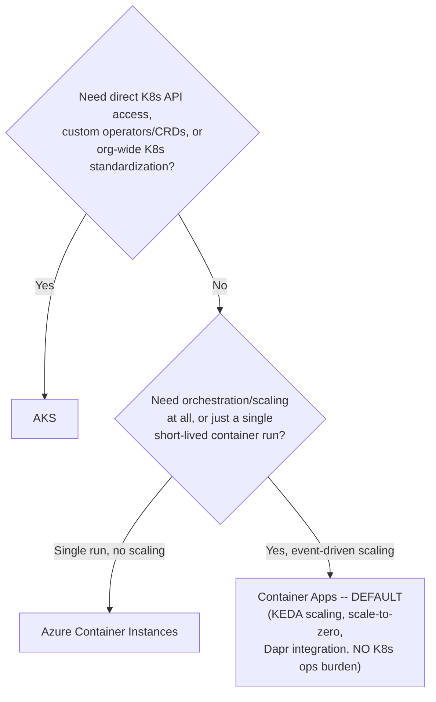
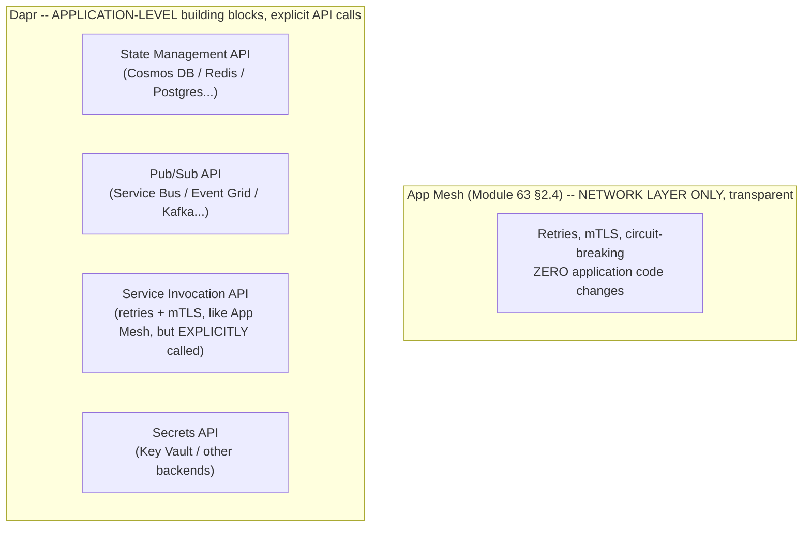

# Module 71 — Azure: Containers & Microservices — AKS, Container Apps, KEDA & Dapr

> Domain: Azure | Level: Beginner → Expert | Prerequisite: [[../21-AWS/07-Containers-Microservices-ECS-EKS-Fargate]] (this module mirrors that module's structure — AKS/Container Apps against EKS/ECS/Fargate, Dapr against App Mesh — flagging Azure's genuine THIRD tier, Container Apps, and Dapr's materially broader application-level scope as the key divergences), [[../17-Microservices/02-Resilience-Observability-Sidecar-Patterns]] (Dapr is a concrete, broader-scoped sidecar-pattern implementation)

---

## 1. Fundamentals

### Why does a Principal Engineer need Azure container-orchestration depth given Module 63 already established the ECS-vs-EKS-vs-Fargate decision framework generically?
The complexity-matching principle (default to the simpler option absent an articulated requirement) transfers directly — what's genuinely new is that Azure's landscape has a **third, structurally distinct tier** with no AWS equivalent: **Azure Container Apps (ACA)**, a serverless-container platform built *on* Kubernetes (using KEDA for event-driven autoscaling) but **fully abstracting the Kubernetes API away** from the developer entirely — this sits genuinely between AKS (full Kubernetes, you manage/interact with the K8s API directly) and a bare single-container primitive, occupying a niche AWS's binary ECS-vs-EKS choice (Module 63 §2.1) doesn't have a direct parallel for, since ECS itself isn't built on Kubernetes at all. A Principal Engineer applying AWS's two-option mental model to Azure risks skipping this genuinely useful middle tier entirely, defaulting to AKS's full Kubernetes complexity for workloads that Container Apps would have served with materially less operational overhead.

### Why does this matter?
Because "Azure has AKS, which is like EKS, and that's the container option" is an incomplete mental model that misses Container Apps' specific value proposition (Kubernetes's event-driven scaling power via KEDA, and Dapr's application-level building blocks, without any Kubernetes operational burden at all) — a Principal Engineer who doesn't know this tier exists will systematically over-choose AKS for workloads that never needed direct Kubernetes API access, custom operators, or CRDs.

### When does this matter?
Any Azure-based containerized/microservices architecture — and specifically, any team with AWS ECS/EKS experience porting their two-tier mental model onto Azure's genuinely three-tier landscape without first learning that the middle tier exists.

### How does it work (30,000-ft view)?
```
AKS: Azure's EKS equivalent -- full, managed Kubernetes, you interact with the K8s API directly
Container Apps (ACA): serverless containers built ON Kubernetes/KEDA, but the K8s API is
     FULLY ABSTRACTED AWAY -- no kubectl, no K8s manifests, TRUE SCALE-TO-ZERO -- NO
     precise single AWS equivalent (ECS isn't K8s-based; Fargate has no native scale-to-zero)
Azure Container Instances (ACI): the simplest tier -- run a single container group directly,
     no orchestration at all, closest to a bare compute primitive
Dapr (Distributed Application Runtime): sidecar-based, but with MATERIALLY BROADER scope than
     App Mesh -- application-level building-block APIs (state management, pub/sub abstraction,
     service invocation, secrets, bindings), not just network-traffic/mTLS/resilience
```

---

## 2. Deep Dive

### 2.1 Container Apps — a Genuine Third Tier With No AWS Equivalent
Container Apps runs containers with automatic, KEDA-driven scaling (including **true scale-to-zero** — a workload can genuinely have zero running instances when idle, and automatically scale up in response to HTTP traffic, queue depth, or dozens of other KEDA-supported event sources) — critically, this is built **on top of** a Kubernetes control plane that Azure fully manages and never exposes to the developer: there's no `kubectl`, no Kubernetes manifests to author, no cluster to size or patch. This has no precise AWS equivalent: ECS is not Kubernetes-based at all (ruling out any "ECS but K8s-abstracted" framing), and Fargate-backed ECS/EKS has no native scale-to-zero-with-event-driven-wake capability the way KEDA provides natively — a Principal Engineer evaluating Container Apps should recognize it specifically as "Kubernetes's event-driven scaling power, Lambda's operational simplicity and scale-to-zero economics, combined," a genuinely novel middle point in the compute spectrum this course's AWS material doesn't have a direct service to map onto.

### 2.2 The Three-Tier Decision Framework — Extending Module 63 §2.1's Complexity-Matching Discipline
Directly extending Module 63 §2.1's ECS-vs-EKS default-to-simpler principle, now across three tiers: default to **Container Apps** for any workload not requiring direct Kubernetes API access, custom operators/CRDs, or fine-grained cluster-level control — it provides the operational simplicity Module 63 established as the correct default posture, plus KEDA's genuinely more powerful event-driven scaling model than ECS/Fargate's ASG-style scaling offers. Choose **AKS** specifically when a workload has an articulated requirement Container Apps' abstraction genuinely can't satisfy (a specific Kubernetes operator/CRD dependency, a need for direct node-level customization, an organization-wide Kubernetes standardization decision per Module 63 §Advanced Q4's individual-vs-organizational reasoning). Choose **ACI** specifically for the simplest possible case — a single, short-lived, unorchestrated container run (batch jobs, CI/CD build agents) with no scaling or service-discovery requirements at all. A team defaulting to AKS "because that's the Kubernetes option and Kubernetes is the container standard" without evaluating Container Apps first is committing exactly the over-engineering anti-pattern Module 63 §2.1 already flagged for defaulting to EKS over ECS, now with an even more clearly-applicable simpler alternative available.

### 2.3 Dapr — Materially Broader Scope Than App Mesh, a "Portable Microservices Toolkit," Not Just a Network Mesh
Dapr is deployed as a sidecar (directly the same architectural pattern Module 63 §2.4 established for App Mesh's Envoy sidecar) — but Dapr's actual scope extends well beyond App Mesh's network-traffic-focused capabilities (retries, mTLS, circuit-breaking) into **application-level building-block APIs**: **State Management** (a uniform API for reading/writing to any of dozens of pluggable state stores — Cosmos DB, Redis, PostgreSQL — without the application code needing store-specific SDKs); **Pub/Sub** (a uniform publish/subscribe API abstracting over Service Bus, Event Grid, Kafka, or other pluggable message brokers, Module 70's services now accessible via one consistent API regardless of which specific broker backs it); **Service Invocation** (service-to-service calls with built-in retry/mTLS, functionally overlapping with App Mesh's resilience capabilities, but invoked via a language-agnostic HTTP/gRPC API rather than transparent traffic interception); **Bindings** (triggering from, or pushing to, external systems); and **Secrets** (a uniform secrets-retrieval API over Key Vault or other backends). This means Dapr and App Mesh, despite the shared sidecar pattern, are not directly interchangeable: App Mesh is purely a network-layer concern requiring zero application code changes (traffic interception is transparent), while Dapr requires the application to **explicitly call Dapr's APIs** for state/pub-sub/service-invocation — a genuine, deliberate application-level integration, not a transparent infrastructure layer, in exchange for portability across underlying backing services.

### 2.4 KEDA — the Event-Driven Autoscaling Engine Underlying Container Apps, and Its AKS Applicability
KEDA (Kubernetes Event-Driven Autoscaling) is itself a CNCF project usable on **any** Kubernetes cluster, including AKS directly (not exclusively via Container Apps) — meaning a team that has already committed to AKS for a genuine Kubernetes-requiring reason can still gain Container Apps' event-driven, scale-to-zero-capable scaling model by installing KEDA directly on their AKS cluster, rather than assuming "true scale-to-zero" is an ACA-exclusive capability unavailable once AKS is chosen — this is a nuance worth knowing specifically because it means the AKS-vs-Container-Apps decision (§2.2) isn't strictly "give up KEDA's scaling model if you need AKS's Kubernetes API access," but rather "Container Apps gives you KEDA's model *with* full operational abstraction, while AKS-plus-KEDA gives you the same scaling model *with* full Kubernetes control and its accompanying operational burden."

### 2.5 Scale-to-Zero's Cold-Start Implication — Directly Recurring This Course's Warm-Up Discipline, Now at the Container-Orchestration Layer
A Container Apps workload that has scaled to zero must, by definition, cold-start an entirely new container instance in response to the triggering event before it can begin processing — this is structurally the identical risk category Module 57 §4 (EC2/ASG warm-up), Module 61 §2.1 (Lambda cold starts), and Module 63 §7 (Fargate task startup) have each already established, but specifically easy to overlook for Container Apps precisely because "it's a container, not a serverless function" can misleadingly suggest container-based workloads don't have this concern the way Lambda explicitly does — a Principal Engineer evaluating Container Apps for a latency-sensitive workload must explicitly verify cold-start-from-zero latency against the workload's actual SLA, and, if unacceptable, configure a minimum replica count above zero (forfeiting true scale-to-zero economics specifically for that latency guarantee, directly the same cost-vs-latency trade-off Module 61 §2.2's Lambda provisioned-concurrency discussion already established).

### 2.6 Dapr's Portability Value — and Its Genuine Cost
Dapr's building-block APIs provide genuine backing-service portability (swapping Cosmos DB for Redis as a state store, or Service Bus for Kafka as a pub/sub backend, via configuration rather than application-code changes) — a capability with real value for multi-cloud-portable applications or for deferring a specific backing-service decision — but this portability isn't free: Dapr's abstracted APIs are necessarily a **lowest-common-denominator** surface across every supported backing implementation, meaning backing-service-specific advanced capabilities (Module 68's Cosmos DB tunable consistency levels, for instance) may not be fully exposed through Dapr's generic state-management API, requiring a Principal Engineer to explicitly verify whether Dapr's abstraction level is sufficient for the workload's actual requirements, or whether direct, backing-service-specific SDK usage (forfeiting portability for full capability access) is genuinely necessary for a specific integration point.

---

## 3. Visual Architecture

### The Three-Tier Azure Container Decision Framework (§2.2)


### Dapr's Broader Scope vs. App Mesh's Network-Only Scope (§2.3)


## 4. Production Example
**Scenario**: A platform team, with deep prior AWS ECS/EKS experience, began an Azure migration for a set of internal microservices — none of which used any custom Kubernetes operators, CRDs, or required direct cluster-level access — and, applying their AWS mental model ("there's the simple option and the full-Kubernetes option, and since we're building genuine microservices at some scale, we should use the 'real' Kubernetes option to be safe and future-proof"), provisioned an AKS cluster and began the substantial work of writing Kubernetes manifests, setting up cluster autoscaling, and establishing their own CI/CD pipeline for cluster upgrades and node-pool management. **Investigation**: several months into the migration, a newly-hired engineer with prior Azure-specific experience reviewed the architecture during an onboarding session and asked why the team hadn't evaluated Container Apps, since none of the actual workloads had any Kubernetes-API-level requirement — the team's honest answer was that they simply hadn't known Container Apps existed as a distinct option, since their AWS background's ECS-vs-EKS framing had no three-tier equivalent to prompt that evaluation. **Root cause**: this is a structurally distinct failure mode from this domain's earlier incidents (which were about *misapplying* an AWS concept to a superficially similar Azure one) — here, the team's AWS-derived mental model was simply **incomplete** for Azure's actual landscape, missing an entire tier that had no AWS parallel to have ever prompted its discovery; a two-option mental model doesn't just risk choosing the wrong one of two options, it can entirely fail to consider a third option it has no framework for expecting to exist. **Fix**: the team conducted a retrospective evaluation and migrated a subset of the genuinely simpler, no-K8s-API-dependency services to Container Apps, immediately eliminating their custom cluster-upgrade/node-pool-management pipeline for those services and gaining KEDA's event-driven, scale-to-zero economics for several genuinely bursty, low-traffic internal tools that had been needlessly running minimum-replica-count AKS deployments around the clock — while deliberately retaining AKS specifically for the smaller subset of services that did have genuine Kubernetes-ecosystem dependencies (a specific Helm-chart-packaged third-party tool requiring CRDs). **Lesson**: this incident's generalized lesson is distinct from, and complements, this domain's recurring "false familiarity" pattern (Modules 65-70) — it's specifically about **incomplete cross-cloud mental models missing an entire option category** with no AWS-side prompt to have ever raised the question, meaning a genuinely thorough Azure onboarding/migration process must include an explicit "what Azure-native options exist here with no AWS equivalent at all" research step, not just a "here's how each AWS concept maps to Azure" comparative review.

## 5. Best Practices
- Default to Container Apps for any Azure containerized workload without a specific, articulated Kubernetes-API-level requirement — evaluate it explicitly before defaulting to AKS out of AWS-derived habit (§4).
- Explicitly verify Container Apps' scale-to-zero cold-start latency against the workload's actual SLA before adopting true scale-to-zero, configuring a minimum replica count if the latency isn't acceptable (§2.5).
- Recognize KEDA as usable directly on AKS, decoupling "I need Kubernetes API access" from "I must give up event-driven scale-to-zero economics" (§2.4).
- Use Dapr specifically when application-level building-block portability (state, pub/sub, secrets abstraction across backing services) provides genuine value — verify its abstraction level is sufficient for the workload's actual requirements before assuming full backing-service capability parity (§2.6).
- Conduct an explicit "what Azure-native capabilities exist with no AWS equivalent" research pass during any AWS-to-Azure migration planning, not solely a concept-by-concept comparative mapping exercise (§4's lesson).

## 6. Anti-patterns
- Defaulting to AKS for any Azure containerized workload "because it's the real Kubernetes option, like EKS," without first evaluating whether Container Apps' simpler, K8s-abstracted model would suffice (§4).
- Assuming Container Apps, being container-based rather than function-based, has no cold-start concern the way Lambda/Azure Functions explicitly do, missing that scale-to-zero introduces the identical structural risk (§2.5).
- Treating Dapr as a drop-in App Mesh equivalent, expecting transparent, zero-application-code-change behavior, when Dapr's building-block APIs require explicit application-level integration.
- Adopting Dapr's state-management abstraction for a workload that genuinely needs a specific backing store's advanced, non-generic capabilities (e.g., Cosmos DB's tunable consistency levels) without verifying Dapr's API surface actually exposes what's needed.
- Conducting an AWS-to-Azure migration using only a concept-by-concept comparative mapping, without a distinct research step for Azure-native capabilities that have no AWS equivalent to have prompted their discovery.

---

## 10. Interview Questions

### Basic (10)
1. **Q: What is Azure Container Apps, and why does it have no precise single AWS equivalent?** **A:** A serverless-container platform built on Kubernetes/KEDA but with the Kubernetes API fully abstracted away — ECS isn't Kubernetes-based at all, and Fargate lacks native scale-to-zero, so neither AWS service matches this combination.
2. **Q: What are the three tiers in Azure's container landscape?** **A:** AKS (full, managed Kubernetes), Container Apps (K8s-based but abstracted, serverless-container model), and Azure Container Instances (a single, unorchestrated container run).
3. **Q: What does KEDA provide?** **A:** Kubernetes Event-Driven Autoscaling — including true scale-to-zero and scaling based on dozens of event sources (HTTP rate, queue depth, etc.).
4. **Q: Is KEDA exclusive to Container Apps?** **A:** No — it's a CNCF project usable directly on any Kubernetes cluster, including AKS.
5. **Q: What is Dapr?** **A:** A sidecar-based Distributed Application Runtime providing application-level building-block APIs — state management, pub/sub, service invocation, secrets, bindings.
6. **Q: How does Dapr's scope differ from App Mesh's?** **A:** App Mesh is purely network-layer (transparent traffic interception, no app code changes); Dapr provides application-level APIs the application must explicitly call.
7. **Q: What should be the default choice for a new Azure containerized workload without a specific Kubernetes-API requirement?** **A:** Container Apps, per this module's extension of Module 63's complexity-matching discipline.
8. **Q: Does a scaled-to-zero Container Apps workload have a cold-start concern?** **A:** Yes — a new instance must be provisioned in response to the triggering event, the same structural risk as Lambda cold starts or Fargate task startup.
9. **Q: What trade-off does Dapr's backing-service portability introduce?** **A:** Its APIs are a lowest-common-denominator surface — advanced, backing-service-specific capabilities may not be fully exposed.
10. **Q: What is Azure Container Instances (ACI) best suited for?** **A:** The simplest case — a single, short-lived, unorchestrated container run with no scaling or service-discovery requirements.

### Intermediate (10)
1. **Q: Why is the §4 incident described as "structurally distinct" from this domain's earlier false-familiarity incidents (Modules 65-70)?** **A:** Earlier incidents involved *misapplying* an AWS concept to a superficially similar Azure one; §4's incident involved an AWS-derived mental model entirely *missing* an option category (Container Apps) that had no AWS parallel to have ever prompted its consideration in the first place.
2. **Q: Why does "it's a container, not a serverless function" mislead a team into missing Container Apps' cold-start risk?** **A:** Cold starts are commonly associated specifically with function-based serverless platforms (Lambda, Azure Functions); a container-based workload's underlying compute label doesn't itself signal that scale-to-zero introduces the identical structural provisioning-latency risk.
3. **Q: Why does choosing AKS not automatically forfeit KEDA's event-driven, scale-to-zero scaling model?** **A:** KEDA is a portable CNCF project installable directly on any Kubernetes cluster, including AKS — the AKS-vs-Container-Apps choice is really about full Kubernetes API access and its operational burden, not about which platform can offer KEDA's scaling capabilities at all.
4. **Q: Why is Dapr not a "drop-in App Mesh equivalent" despite sharing the sidecar deployment pattern?** **A:** App Mesh's traffic interception is transparent, requiring zero application code changes; Dapr's building-block APIs require the application to explicitly call them, a materially different integration model despite the shared sidecar architecture.
5. **Q: Why should a team verify Dapr's state-management API actually exposes a backing store's needed advanced capabilities before adopting it, rather than assuming full parity?** **A:** Dapr's abstraction is necessarily a lowest-common-denominator surface designed to work uniformly across many different backing stores — a store-specific advanced feature (like Cosmos DB's tunable consistency levels, Module 68) may not be exposed through that generic API.
6. **Q: Why does the §4 team's eventual fix retain AKS for a subset of services rather than migrating everything to Container Apps?** **A:** A subset of services had a genuine, articulated Kubernetes-ecosystem dependency (a Helm-chart-packaged tool requiring CRDs) that Container Apps' abstracted model couldn't satisfy — the fix applies the three-tier decision framework correctly per-workload, not as a uniform "always prefer the simpler tier" rule without exception.
7. **Q: Why is a "concept-by-concept AWS-to-Azure comparative mapping" alone insufficient for a thorough migration, per §4's lesson?** **A:** Such a mapping only surfaces divergences for concepts that have an AWS counterpart to map from in the first place — it structurally cannot surface an Azure-native capability category (like Container Apps) that has no AWS equivalent prompting the comparison to even be attempted.
8. **Q: Why should Dapr's sidecar overhead be explicitly benchmarked against direct backing-service SDK usage for latency-critical operations?** **A:** Every Dapr building-block API call introduces an additional network hop to the sidecar, a real latency cost that may not be justified by the portability benefit for a specific operation with strict latency requirements — the same "convenience isn't automatically free" discipline this course applies to every sidecar/abstraction-layer capability.
9. **Q: Why does an overly conservative KEDA scaler configuration reintroduce a variant of Module 57 §4's warm-up-window risk?** **A:** A scaler that reacts too slowly to a genuine demand spike leaves a scaled-to-zero (or scaled-low) workload unable to absorb that spike promptly, the same structural "newly-provisioned compute isn't ready in time" risk category, now triggered by scaler responsiveness tuning rather than ASG configuration specifically.
10. **Q: Why should a Container App's or AKS pod's assigned identity be scoped per-workload rather than shared broadly, per this domain's recurring IAM discipline?** **A:** The same blast-radius-limiting reasoning established in Module 58/66 — a shared, broad identity recreates the risk of one compromised workload inheriting every other co-located workload's combined permission needs.

### Advanced (10)
1. **Q: Diagnose the §4 incident from first principles, and design the specific onboarding/migration-planning practice that would prevent this exact category of "missing an entire option tier" mistake from recurring for other Azure-native services this course's AWS material has no equivalent for.**
   **A:** Root cause: an AWS-derived two-tier mental model (simple orchestrator vs. full Kubernetes) had no structural prompt to consider a third, Azure-native-only option, since comparative mapping alone only surfaces divergences for concepts with an AWS counterpart. Structural fix: require any AWS-to-Azure migration-planning process to include a **dedicated, explicit research phase** — independent of and prior to the concept-by-concept comparative mapping — cataloguing Azure-native services/capabilities in the target domain with **no** AWS equivalent at all (Container Apps here; also, e.g., Elastic Pools in Module 68, PIM in Module 66), specifically because these are exactly the capabilities a comparative-only approach structurally cannot surface, converting an "unknown unknown" into a deliberately-searched-for category rather than something discovered only via a chance onboarding conversation.
2. **Q: A team argues that since Container Apps abstracts away the Kubernetes API entirely, choosing it forecloses any future option to gain more granular cluster-level control if the workload's requirements grow, making AKS the safer, more future-proof default even for currently-simple workloads. Evaluate this claim.**
   **A:** Push back — this inverts Module 63 §Advanced Q4's individual-workload-vs-organizational reasoning and this course's broader "match complexity to actual, current, articulated requirement" discipline (Module 49): defaulting to the more complex option preemptively, on the possibility of a future requirement that may never materialize, imposes certain, ongoing operational cost today for a speculative future benefit — if a workload's requirements genuinely do grow to need direct Kubernetes API access later, that's a real, if nontrivial, migration (analogous to Module 60 §Advanced Q3's dual-running migration pattern, applied to a Container-Apps-to-AKS transition), but this deferred, conditional cost is preferable to certain, continuous over-provisioned complexity for every workload that never actually needs it, which describes the substantial majority of workloads in practice.
3. **Q: Design the specific pre-production test that would verify a Container Apps workload's scale-to-zero cold-start latency meets its SLA, generalizing this domain's recurring "steady-state testing doesn't exercise the failure-triggering condition" pattern to Azure's serverless-container tier specifically.**
   **A:** A test that deliberately allows the Container App to scale to zero (idle for a period exceeding its configured scale-to-zero threshold), then sends a triggering request/event and measures actual end-to-end latency from trigger to first successful response — directly Module 61 §Advanced Q3's Lambda cold-start test pattern and Module 63 §Advanced Q3's Fargate equivalent, now applied to Container Apps specifically; steady-state testing against an already-warm instance would never surface a genuine scale-to-zero cold-start SLA violation.
4. **Q: A workload needs Dapr's pub/sub portability (to remain broker-agnostic across Service Bus and Kafka for a multi-cloud-portable design) but also needs to leverage Service Bus Sessions (Module 70 §2.5) for strict per-customer message ordering, a capability that may not be exposed through Dapr's generic pub/sub API. Design an approach.**
   **A:** Verify explicitly whether Dapr's pub/sub building-block API exposes session/ordering-key concepts generically (Dapr does support a metadata-passthrough mechanism for broker-specific features in some pub/sub components) — if the specific ordering guarantee genuinely isn't exposable through Dapr's abstraction for the target broker, the correct resolution is a deliberate, explicit exception: use direct Service Bus SDK integration specifically for the ordering-sensitive code path (forfeiting portability for that one specific integration point, per §2.6's stated trade-off), while retaining Dapr's abstraction for the remainder of the pub/sub integration surface that doesn't have this requirement — a targeted, documented exception rather than either abandoning Dapr entirely or forcing an unsupported requirement through an abstraction that can't cleanly support it.
5. **Q: Critique the following claim: "Since Dapr provides a uniform state-management API, we can defer our actual backing-store decision (Cosmos DB vs. Redis vs. PostgreSQL) indefinitely without any architectural risk, since Dapr makes the choice fully reversible at any time via configuration alone."**
   **A:** Overstated — while Dapr's API surface is uniform, the underlying backing stores have genuinely different consistency models, latency characteristics, and cost structures (Module 68's Cosmos DB consistency spectrum has no precise equivalent in Redis or PostgreSQL) — an application built against Dapr's generic API while implicitly relying on a specific backing store's actual behavior (even unintentionally, e.g., assuming a particular latency profile or consistency guarantee it happened to observe during development against one specific store) is not automatically safe to swap later without re-verification; deferring the decision reduces *coupling to a specific SDK*, but does not eliminate the need to eventually make and validate a deliberate, informed backing-store choice matched to actual requirements — configuration-level swappability is not the same as consequence-free interchangeability.
6. **Q: Design a decision framework for choosing between Dapr's Service Invocation building block and App Mesh-equivalent transparent sidecar interception for inter-service resilience (retries, mTLS) within a single Azure architecture, given that Azure doesn't offer a direct App-Mesh-equivalent product.**
   **A:** Since Azure has no separate, App-Mesh-equivalent transparent-mesh product distinct from Dapr, the actual decision is whether to adopt Dapr's Service Invocation building block (explicit API calls, application-level integration, §2.3) at all for a given service, versus implementing resilience patterns directly in application code (Module 50's original, pre-mesh discussion) or relying on a different mechanism (Container Apps' own built-in ingress/traffic-splitting capabilities for simpler cases) — favor Dapr's Service Invocation specifically when the broader Dapr building-block adoption (state, pub/sub) is already occurring for the same services, making the additional Service Invocation integration a low-incremental-cost extension of an already-adopted pattern, rather than adopting Dapr solely for this one capability when a simpler, non-Dapr resilience implementation might otherwise suffice.
7. **Q: A Principal Engineer discovers that an AKS cluster running KEDA-scaled workloads occasionally experiences a burst of scaling-related errors specifically when multiple KEDA-scaled deployments spike simultaneously, exhausting the cluster's node-pool capacity faster than cluster autoscaling can provision new nodes. Diagnose and propose a fix.**
   **A:** This is the AKS-cluster-level analog of Module 57 §Advanced Q1's ASG-scaling-event load-testing lesson, now compounded by KEDA's pod-level scaling outracing the cluster's own node-level autoscaling — the fix requires capacity-planning and pre-warming node-pool headroom (or using a cluster autoscaler configuration with more aggressive, proactive node provisioning) specifically sized against the *aggregate*, correlated-spike scenario across all KEDA-scaled workloads sharing the cluster (directly Module 68 §Advanced Q7's Elastic-Pool aggregate-peak-coincidence lesson, now recurring at the AKS node-pool-capacity layer), rather than assuming each workload's individual KEDA scaler configuration alone guarantees sufficient underlying cluster capacity will always be available when needed.
8. **Q: Explain why the §4 incident's core lesson — "an incomplete mental model can miss an entire option tier, not just misconfigure a known one" — implies a broader methodological gap in how this Azure domain's prior modules (65-70) have been structured, and what additional practice should supplement them going forward.**
   **A:** Modules 65-70 have primarily taught by comparative mapping against a known AWS counterpart (VNet-vs-VPC, RBAC-vs-IAM, Cosmos-DB-vs-DynamoDB, etc.) — a structurally sound approach for surfacing *divergences within a mapped concept*, but one that, as §4 demonstrates, cannot by construction surface an Azure-native capability with no AWS counterpart to map from; going forward, this domain's remaining module (72) and any real-world Azure architecture review should supplement comparative learning with a dedicated "Azure-native-only capabilities in this domain" research pass, treating the comparative-mapping method as necessary but not sufficient for genuinely complete Azure fluency.
9. **Q: Design the specific set of Azure-native governance checks (extending this domain's now-established pattern from Modules 65-70) that would structurally encourage the three-tier decision framework's correct application across an organization, rather than relying on individual engineers independently knowing Container Apps exists.**
   **A:** (1) A mandatory architecture-review checklist item requiring explicit justification for any new AKS cluster provisioning request, specifically requiring the requester to document the concrete Kubernetes-API-level requirement Container Apps cannot satisfy (directly operationalizing §2.2's decision framework as a required, structured question rather than assuming awareness). (2) An internal reference architecture/decision-tree document (like this module's §3 diagram) made mandatory reading in any Azure onboarding process, specifically because §4 demonstrated that without such a structured prompt, an entire viable tier can go unconsidered indefinitely.
10. **Q: As a Principal Engineer establishing Azure container-platform standards for an organization migrating from AWS, design the specific set of standing architectural reviews and automated checks (synthesizing this entire module) you would require for every new Azure containerized workload.**
    **A:** (1) Mandatory documented justification for AKS over Container Apps, requiring an articulated Kubernetes-API-level requirement (Advanced Q9) — necessary given §4's demonstrated risk of defaulting to AKS purely from incomplete cross-cloud mental models. (2) Mandatory scale-to-zero cold-start SLA verification testing for any Container Apps workload before production launch (Advanced Q3) — necessary because container-based framing misleadingly suggests no cold-start concern exists. (3) Mandatory Dapr-abstraction-sufficiency review before adopting Dapr's generic APIs for any integration requiring a backing-service-specific advanced capability (Advanced Q4, Advanced Q5) — necessary to avoid silently forfeiting needed functionality behind a lowest-common-denominator abstraction. (4) Mandatory aggregate, correlated-spike node-pool capacity planning for any AKS cluster hosting multiple KEDA-scaled workloads (Advanced Q7) — necessary because per-workload scaler configuration alone doesn't guarantee sufficient shared cluster capacity. (5) Mandatory dedicated "Azure-native-only capability" research phase as a distinct, required step in any AWS-to-Azure migration plan, independent of concept-by-concept comparative mapping (Advanced Q1, Advanced Q8) — the single most structurally important finding this module contributes, since it addresses a blind spot in this domain's own comparative-teaching methodology, not just a specific service's configuration risk.

---

## 11. Coding Exercises

### Easy — Container App with explicit KEDA HTTP scale rule (§2.1, §2.2)
```hcl
resource "azurerm_container_app" "internal_tool" {
  name                         = "internal-reporting-tool"
  container_app_environment_id = azurerm_container_app_environment.main.id
  revision_mode                = "Single"

  template {
    min_replicas = 0   # TRUE scale-to-zero (§2.1) -- no AWS Fargate/ECS equivalent
    max_replicas = 10

    container {
      name   = "reporting-tool"
      image  = "acr.azurecr.io/reporting-tool:latest"
      cpu    = 0.5
      memory = "1Gi"
    }

    custom_scale_rule {
      name             = "http-scale"
      custom_rule_type = "http"
      metadata = { concurrentRequests = "20" }   # KEDA scaler -- event-driven, not just CPU/memory
    }
  }
  # NOT AKS -- this internal, bursty, low-traffic tool never needed the K8s API (§4's exact lesson)
}
```

### Medium — Explicit AKS+KEDA choice, retaining Kubernetes API access AND scale-to-zero economics (§2.4)
```yaml
apiVersion: keda.sh/v1alpha1
kind: ScaledObject
metadata:
  name: order-processor-scaler
spec:
  scaleTargetRef:
    name: order-processor-deployment   # a genuine AKS deployment, needed for a specific
                                          # CRD-based tool this service depends on (§4's fix's retained exception)
  minReplicaCount: 0   # KEDA on AKS DIRECTLY -- NOT exclusive to Container Apps (§2.4)
  maxReplicaCount: 50
  triggers:
    - type: azure-servicebus
      metadata:
        queueName: order-processing-queue
        messageCount: "5"
```

### Hard — Dapr state management API, uniform across backing stores (§2.3, §2.6)
```csharp
[HttpPost("orders/{orderId}/status")]
public async Task<IActionResult> UpdateOrderStatus(string orderId, [FromBody] OrderStatus status)
{
    // Uniform Dapr API call -- backing store (Cosmos DB today, could be Redis/Postgres
    // via config change alone) is NOT hardcoded into this application code (§2.3).
    await _daprClient.SaveStateAsync("order-state-store", orderId, status);

    // Dapr pub/sub -- broker-agnostic (Service Bus today, per Module 70) --
    // NO Service-Bus-specific SDK code here at all.
    await _daprClient.PublishEventAsync("order-pubsub", "order-status-changed",
        new { orderId, status });

    return Ok();
}
```
```yaml
# order-state-store.yaml -- the ACTUAL backing store is a DEPLOYMENT-TIME configuration
# choice, not an application-code dependency (§2.6's portability benefit made concrete).
apiVersion: dapr.io/v1alpha1
kind: Component
metadata: { name: order-state-store }
spec:
  type: state.azure.cosmosdb
  metadata:
    - { name: url, value: "https://checkout-cosmos.documents.azure.com:443/" }
    - { name: database, value: "orders" }
    - { name: collection, value: "order-state" }
```

### Expert — Escape hatch: direct Service Bus SDK for a requirement Dapr's abstraction can't cleanly support (§Advanced Q4)
```csharp
public class OrderNotificationPublisher
{
    private readonly DaprClient _dapr;
    private readonly ServiceBusClient _directServiceBusClient;   // deliberate, DOCUMENTED exception

    public async Task PublishAsync(OrderEvent evt, bool requiresStrictSessionOrdering)
    {
        if (requiresStrictSessionOrdering)
        {
            // Session-based ordering (Module 70 §2.5) NOT cleanly exposed through Dapr's
            // generic pub/sub abstraction for this scenario -- explicit, targeted escape
            // hatch (§Advanced Q4), forfeiting portability ONLY for this specific code path.
            var sender = _directServiceBusClient.CreateSender("order-events");
            var message = new ServiceBusMessage(JsonSerializer.Serialize(evt))
            {
                SessionId = evt.CustomerId.ToString()
            };
            await sender.SendMessageAsync(message);
        }
        else
        {
            // Everything else stays on Dapr's portable, broker-agnostic API (§2.3).
            await _dapr.PublishEventAsync("order-pubsub", "order-event", evt);
        }
    }
}
```

---

## 12–17. System Design / LLD / Debugging / Decision / Case Study / Principal

*(§4's incident, the four §11 exercises, and the Advanced-tier Q&A — especially Advanced Q1's dedicated Azure-native-capability research-phase safeguard, Advanced Q4's targeted Dapr-abstraction escape hatch, and Advanced Q10's synthesized governance checklist — collectively constitute this module's system-design, debugging, and Principal-Engineer-level content.)*

## 18. Revision
**Key takeaways**: Azure's container landscape has a genuine third tier — Container Apps — with no precise AWS equivalent, combining Kubernetes-based KEDA scaling (including true scale-to-zero) with full abstraction of the Kubernetes API; this should be the default choice absent an articulated Kubernetes-API-level requirement, extending Module 63's complexity-matching discipline across three tiers instead of two. This module's central incident (§4) is structurally distinct from every prior Azure-domain incident: rather than misapplying a known AWS concept, the team's AWS-derived two-tier mental model entirely **missed an option category** with no AWS parallel to have prompted its discovery — implying that comparative, concept-by-concept AWS-to-Azure mapping (this domain's primary teaching method through Modules 65-70) is necessary but not sufficient, and must be supplemented by a dedicated research pass for Azure-native-only capabilities. Dapr's sidecar pattern shares App Mesh's deployment architecture but has a materially broader, explicitly-integrated application-level API scope (state, pub/sub, secrets, service invocation) rather than App Mesh's transparent, network-only interception — offering genuine backing-service portability at the cost of a lowest-common-denominator API surface requiring explicit verification against any workload's advanced, backing-service-specific requirements. KEDA is portable to AKS directly, decoupling "need Kubernetes API access" from "must forfeit event-driven scale-to-zero economics."

---

**Next**: Continuing to Module 72 — Azure: Observability, Cost & the Well-Architected Framework (Azure Monitor, App Insights, cost management, multi-region DR), completing the `22-Azure` domain (Modules 65–72).
