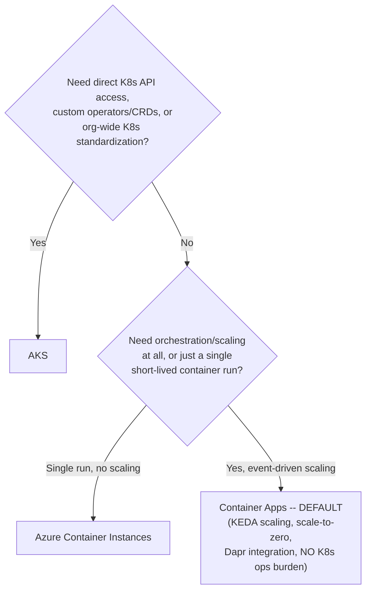
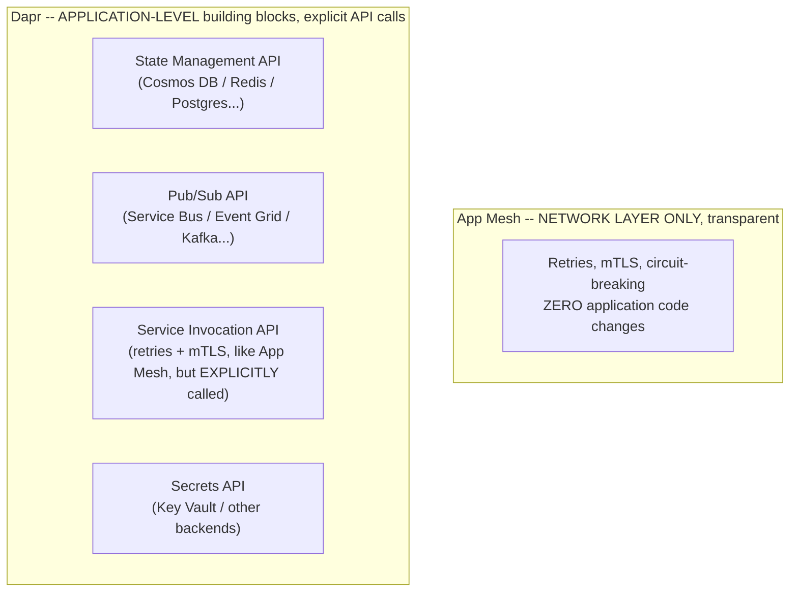
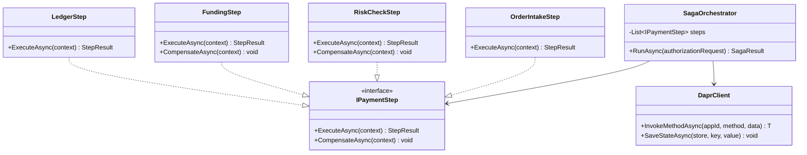
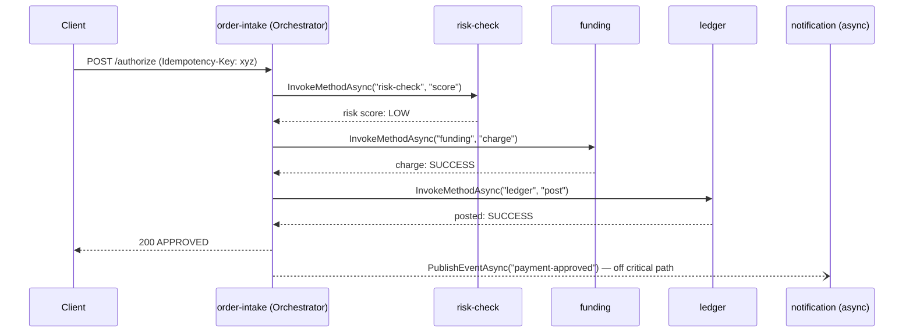

# Module 71 — Azure: Containers & Microservices — AKS, Container Apps, KEDA & Dapr

> Domain: Azure | Level: Beginner → Expert | Prerequisite: [[../21-AWS/07-Containers-Microservices-ECS-EKS-Fargate]] (this module mirrors that module's structure — AKS/Container Apps against EKS/ECS/Fargate, Dapr against App Mesh — flagging Azure's genuine THIRD tier, Container Apps, and Dapr's materially broader application-level scope as the key divergences), [[../17-Microservices/02-Resilience-Observability-Sidecar-Patterns]] (Dapr is a concrete, broader-scoped sidecar-pattern implementation)

---

## 1. Fundamentals

### Why does a Principal Engineer need Azure container-orchestration depth given already established the ECS-vs-EKS-vs-Fargate decision framework generically?
The complexity-matching principle (default to the simpler option absent an articulated requirement) transfers directly — what's genuinely new is that Azure's landscape has a **third, structurally distinct tier** with no AWS equivalent: **Azure Container Apps (ACA)**, a serverless-container platform built *on* Kubernetes (using KEDA for event-driven autoscaling) but **fully abstracting the Kubernetes API away** from the developer entirely — this sits genuinely between AKS (full Kubernetes, you manage/interact with the K8s API directly) and a bare single-container primitive, occupying a niche AWS's binary ECS-vs-EKS choice doesn't have a direct parallel for, since ECS itself isn't built on Kubernetes at all. A Principal Engineer applying AWS's two-option mental model to Azure risks skipping this genuinely useful middle tier entirely, defaulting to AKS's full Kubernetes complexity for workloads that Container Apps would have served with materially less operational overhead.

### Why does this matter?
Because "Azure has AKS, which is like EKS, and that's the container option" is an incomplete mental model that misses Container Apps' specific value proposition (Kubernetes's event-driven scaling power via KEDA, and Dapr's application-level building blocks, without any Kubernetes operational burden at all) — a Principal Engineer who doesn't know this tier exists will systematically over-choose AKS for workloads that never needed direct Kubernetes API access, custom operators, or CRDs.

### When does this matter?
Any Azure-based containerized/microservices architecture — and specifically, any team with AWS ECS/EKS experience porting their two-tier mental model onto Azure's genuinely three-tier landscape without first learning that the middle tier exists.

### How does it work (30,000-ft view)?
```
AKS: Azure's EKS equivalent -- full, managed Kubernetes, you interact with the K8s API directly
Container Apps (ACA): serverless containers built ON Kubernetes/KEDA, but the K8s API is
 FULLY ABSTRACTED AWAY -- no kubectl, no K8s manifests, TRUE SCALE-TO-ZERO -- NO
 precise single AWS equivalent (ECS isn't K8s-based; Fargate has no native scale-to-zero)
Azure Container Instances (ACI): the simplest tier -- run a single container group directly,
 no orchestration at all, closest to a bare compute primitive
Dapr (Distributed Application Runtime): sidecar-based, but with MATERIALLY BROADER scope than
 App Mesh -- application-level building-block APIs (state management, pub/sub abstraction,
 service invocation, secrets, bindings), not just network-traffic/mTLS/resilience
```

---

## 2. Deep Dive

### 2.1 Container Apps — a Genuine Third Tier With No AWS Equivalent
Container Apps runs containers with automatic, KEDA-driven scaling (including **true scale-to-zero** — a workload can genuinely have zero running instances when idle, and automatically scale up in response to HTTP traffic, queue depth, or dozens of other KEDA-supported event sources) — critically, this is built **on top of** a Kubernetes control plane that Azure fully manages and never exposes to the developer: there's no `kubectl`, no Kubernetes manifests to author, no cluster to size or patch. This has no precise AWS equivalent: ECS is not Kubernetes-based at all (ruling out any "ECS but K8s-abstracted" framing), and Fargate-backed ECS/EKS has no native scale-to-zero-with-event-driven-wake capability the way KEDA provides natively — a Principal Engineer evaluating Container Apps should recognize it specifically as "Kubernetes's event-driven scaling power, Lambda's operational simplicity and scale-to-zero economics, combined," a genuinely novel middle point in the compute spectrum this course's AWS material doesn't have a direct service to map onto.

### 2.2 The Three-Tier Decision Framework — Extending the Complexity-Matching Discipline
Directly extending the ECS-vs-EKS default-to-simpler principle, now across three tiers: default to **Container Apps** for any workload not requiring direct Kubernetes API access, custom operators/CRDs, or fine-grained cluster-level control — it provides the operational simplicity established as the correct default posture, plus KEDA's genuinely more powerful event-driven scaling model than ECS/Fargate's ASG-style scaling offers. Choose **AKS** specifically when a workload has an articulated requirement Container Apps' abstraction genuinely can't satisfy (a specific Kubernetes operator/CRD dependency, a need for direct node-level customization, an organization-wide Kubernetes standardization decision §Advanced Q4's individual-vs-organizational reasoning). Choose **ACI** specifically for the simplest possible case — a single, short-lived, unorchestrated container run (batch jobs, CI/CD build agents) with no scaling or service-discovery requirements at all. A team defaulting to AKS "because that's the Kubernetes option and Kubernetes is the container standard" without evaluating Container Apps first is committing exactly the over-engineering anti-pattern already flagged for defaulting to EKS over ECS, now with an even more clearly-applicable simpler alternative available.

### 2.3 Dapr — Materially Broader Scope Than App Mesh, a "Portable Microservices Toolkit," Not Just a Network Mesh
Dapr is deployed as a sidecar (directly the same architectural pattern established for App Mesh's Envoy sidecar) — but Dapr's actual scope extends well beyond App Mesh's network-traffic-focused capabilities (retries, mTLS, circuit-breaking) into **application-level building-block APIs**: **State Management** (a uniform API for reading/writing to any of dozens of pluggable state stores — Cosmos DB, Redis, PostgreSQL — without the application code needing store-specific SDKs); **Pub/Sub** (a uniform publish/subscribe API abstracting over Service Bus, Event Grid, Kafka, or other pluggable message brokers, the services now accessible via one consistent API regardless of which specific broker backs it); **Service Invocation** (service-to-service calls with built-in retry/mTLS, functionally overlapping with App Mesh's resilience capabilities, but invoked via a language-agnostic HTTP/gRPC API rather than transparent traffic interception); **Bindings** (triggering from, or pushing to, external systems); and **Secrets** (a uniform secrets-retrieval API over Key Vault or other backends). This means Dapr and App Mesh, despite the shared sidecar pattern, are not directly interchangeable: App Mesh is purely a network-layer concern requiring zero application code changes (traffic interception is transparent), while Dapr requires the application to **explicitly call Dapr's APIs** for state/pub-sub/service-invocation — a genuine, deliberate application-level integration, not a transparent infrastructure layer, in exchange for portability across underlying backing services.

### 2.4 KEDA — the Event-Driven Autoscaling Engine Underlying Container Apps, and Its AKS Applicability
KEDA (Kubernetes Event-Driven Autoscaling) is itself a CNCF project usable on **any** Kubernetes cluster, including AKS directly (not exclusively via Container Apps) — meaning a team that has already committed to AKS for a genuine Kubernetes-requiring reason can still gain Container Apps' event-driven, scale-to-zero-capable scaling model by installing KEDA directly on their AKS cluster, rather than assuming "true scale-to-zero" is an ACA-exclusive capability unavailable once AKS is chosen — this is a nuance worth knowing specifically because it means the AKS-vs-Container-Apps decision isn't strictly "give up KEDA's scaling model if you need AKS's Kubernetes API access," but rather "Container Apps gives you KEDA's model *with* full operational abstraction, while AKS-plus-KEDA gives you the same scaling model *with* full Kubernetes control and its accompanying operational burden."

### 2.5 Scale-to-Zero's Cold-Start Implication — Directly Recurring This Course's Warm-Up Discipline, Now at the Container-Orchestration Layer
A Container Apps workload that has scaled to zero must, by definition, cold-start an entirely new container instance in response to the triggering event before it can begin processing — this is structurally the identical risk category (EC2/ASG warm-up), (Lambda cold starts), and (Fargate task startup) have each already established, but specifically easy to overlook for Container Apps precisely because "it's a container, not a serverless function" can misleadingly suggest container-based workloads don't have this concern the way Lambda explicitly does — a Principal Engineer evaluating Container Apps for a latency-sensitive workload must explicitly verify cold-start-from-zero latency against the workload's actual SLA, and, if unacceptable, configure a minimum replica count above zero (forfeiting true scale-to-zero economics specifically for that latency guarantee, directly the same cost-vs-latency trade-off the Lambda provisioned-concurrency discussion already established).

### 2.6 Dapr's Portability Value — and Its Genuine Cost
Dapr's building-block APIs provide genuine backing-service portability (swapping Cosmos DB for Redis as a state store, or Service Bus for Kafka as a pub/sub backend, via configuration rather than application-code changes) — a capability with real value for multi-cloud-portable applications or for deferring a specific backing-service decision — but this portability isn't free: Dapr's abstracted APIs are necessarily a **lowest-common-denominator** surface across every supported backing implementation, meaning backing-service-specific advanced capabilities (the Cosmos DB tunable consistency levels, for instance) may not be fully exposed through Dapr's generic state-management API, requiring a Principal Engineer to explicitly verify whether Dapr's abstraction level is sufficient for the workload's actual requirements, or whether direct, backing-service-specific SDK usage (forfeiting portability for full capability access) is genuinely necessary for a specific integration point.

---

## 3. Visual Architecture

### The Three-Tier Azure Container Decision Framework

```mermaid
graph TD
 Start{Need direct K8s API access,<br/>custom operators/CRDs, or<br/>org-wide K8s standardization?}
 Start -->|Yes| AKS[AKS]
 Start -->|No| ScaleNeed{Need orchestration/scaling<br/>at all, or just a single<br/>short-lived container run?}
 ScaleNeed -->|Single run, no scaling| ACI[Azure Container Instances]
 ScaleNeed -->|Yes, event-driven scaling| ContainerApps["Container Apps -- DEFAULT<br/>(KEDA scaling, scale-to-zero,<br/>Dapr integration, NO K8s ops burden)"]
```

### Dapr's Broader Scope vs. App Mesh's Network-Only Scope

```mermaid
graph TB
 subgraph "App Mesh -- NETWORK LAYER ONLY, transparent"
 AppMeshScope["Retries, mTLS, circuit-breaking<br/>ZERO application code changes"]
 end
 subgraph "Dapr -- APPLICATION-LEVEL building blocks, explicit API calls"
 DaprState["State Management API<br/>(Cosmos DB / Redis / Postgres...)"]
 DaprPubSub["Pub/Sub API<br/>(Service Bus / Event Grid / Kafka...)"]
 DaprInvoke["Service Invocation API<br/>(retries + mTLS, like App Mesh, but EXPLICITLY called)"]
 DaprSecrets["Secrets API<br/>(Key Vault / other backends)"]
 end
```

## 4. Production Example
**Scenario**: A platform team, with deep prior AWS ECS/EKS experience, began an Azure migration for a set of internal microservices — none of which used any custom Kubernetes operators, CRDs, or required direct cluster-level access — and, applying their AWS mental model ("there's the simple option and the full-Kubernetes option, and since we're building genuine microservices at some scale, we should use the 'real' Kubernetes option to be safe and future-proof"), provisioned an AKS cluster and began the substantial work of writing Kubernetes manifests, setting up cluster autoscaling, and establishing their own CI/CD pipeline for cluster upgrades and node-pool management. **Investigation**: several months into the migration, a newly-hired engineer with prior Azure-specific experience reviewed the architecture during an onboarding session and asked why the team hadn't evaluated Container Apps, since none of the actual workloads had any Kubernetes-API-level requirement — the team's honest answer was that they simply hadn't known Container Apps existed as a distinct option, since their AWS background's ECS-vs-EKS framing had no three-tier equivalent to prompt that evaluation. **Root cause**: this is a structurally distinct failure mode from this domain's earlier incidents (which were about *misapplying* an AWS concept to a superficially similar Azure one) — here, the team's AWS-derived mental model was simply **incomplete** for Azure's actual landscape, missing an entire tier that had no AWS parallel to have ever prompted its discovery; a two-option mental model doesn't just risk choosing the wrong one of two options, it can entirely fail to consider a third option it has no framework for expecting to exist. **Fix**: the team conducted a retrospective evaluation and migrated a subset of the genuinely simpler, no-K8s-API-dependency services to Container Apps, immediately eliminating their custom cluster-upgrade/node-pool-management pipeline for those services and gaining KEDA's event-driven, scale-to-zero economics for several genuinely bursty, low-traffic internal tools that had been needlessly running minimum-replica-count AKS deployments around the clock — while deliberately retaining AKS specifically for the smaller subset of services that did have genuine Kubernetes-ecosystem dependencies (a specific Helm-chart-packaged third-party tool requiring CRDs). **Lesson**: this incident's generalized lesson is distinct from, and complements, this domain's recurring "false familiarity" pattern (Modules 65-70) — it's specifically about **incomplete cross-cloud mental models missing an entire option category** with no AWS-side prompt to have ever raised the question, meaning a genuinely thorough Azure onboarding/migration process must include an explicit "what Azure-native options exist here with no AWS equivalent at all" research step, not just a "here's how each AWS concept maps to Azure" comparative review.
## 10. Interview Questions

### Basic (10)
1. **Q: What is Azure Container Apps, and why does it have no precise single AWS equivalent?** **A:** A serverless-container platform built on Kubernetes/KEDA but with the Kubernetes API fully abstracted away — ECS isn't Kubernetes-based at all, and Fargate lacks native scale-to-zero, so neither AWS service matches this combination.
2. **Q: What are the three tiers in Azure's container landscape?** **A:** AKS (full, managed Kubernetes), Container Apps (K8s-based but abstracted, serverless-container model), and Azure Container Instances (a single, unorchestrated container run).
3. **Q: What does KEDA provide?** **A:** Kubernetes Event-Driven Autoscaling — including true scale-to-zero and scaling based on dozens of event sources (HTTP rate, queue depth, etc.).
4. **Q: Is KEDA exclusive to Container Apps?** **A:** No — it's a CNCF project usable directly on any Kubernetes cluster, including AKS.
5. **Q: What is Dapr?** **A:** A sidecar-based Distributed Application Runtime providing application-level building-block APIs — state management, pub/sub, service invocation, secrets, bindings.
6. **Q: How does Dapr's scope differ from App Mesh's?** **A:** App Mesh is purely network-layer (transparent traffic interception, no app code changes); Dapr provides application-level APIs the application must explicitly call.
7. **Q: What should be the default choice for a new Azure containerized workload without a specific Kubernetes-API requirement?** **A:** Container Apps, per this module's extension of the complexity-matching discipline.
8. **Q: Does a scaled-to-zero Container Apps workload have a cold-start concern?** **A:** Yes — a new instance must be provisioned in response to the triggering event, the same structural risk as Lambda cold starts or Fargate task startup.
9. **Q: What trade-off does Dapr's backing-service portability introduce?** **A:** Its APIs are a lowest-common-denominator surface — advanced, backing-service-specific capabilities may not be fully exposed.
10. **Q: What is Azure Container Instances (ACI) best suited for?** **A:** The simplest case — a single, short-lived, unorchestrated container run with no scaling or service-discovery requirements.

### Intermediate (10)
1. **Q: Why is the incident described as "structurally distinct" from this domain's earlier false-familiarity incidents (Modules 65-70)?** **A:** Earlier incidents involved *misapplying* an AWS concept to a superficially similar Azure one; the incident involved an AWS-derived mental model entirely *missing* an option category (Container Apps) that had no AWS parallel to have ever prompted its consideration in the first place.
2. **Q: Why does "it's a container, not a serverless function" mislead a team into missing Container Apps' cold-start risk?** **A:** Cold starts are commonly associated specifically with function-based serverless platforms (Lambda, Azure Functions); a container-based workload's underlying compute label doesn't itself signal that scale-to-zero introduces the identical structural provisioning-latency risk.
3. **Q: Why does choosing AKS not automatically forfeit KEDA's event-driven, scale-to-zero scaling model?** **A:** KEDA is a portable CNCF project installable directly on any Kubernetes cluster, including AKS — the AKS-vs-Container-Apps choice is really about full Kubernetes API access and its operational burden, not about which platform can offer KEDA's scaling capabilities at all.
4. **Q: Why is Dapr not a "drop-in App Mesh equivalent" despite sharing the sidecar deployment pattern?** **A:** App Mesh's traffic interception is transparent, requiring zero application code changes; Dapr's building-block APIs require the application to explicitly call them, a materially different integration model despite the shared sidecar architecture.
5. **Q: Why should a team verify Dapr's state-management API actually exposes a backing store's needed advanced capabilities before adopting it, rather than assuming full parity?** **A:** Dapr's abstraction is necessarily a lowest-common-denominator surface designed to work uniformly across many different backing stores — a store-specific advanced feature (like Cosmos DB's tunable consistency levels) may not be exposed through that generic API.
6. **Q: Why does the team's eventual fix retain AKS for a subset of services rather than migrating everything to Container Apps?** **A:** A subset of services had a genuine, articulated Kubernetes-ecosystem dependency (a Helm-chart-packaged tool requiring CRDs) that Container Apps' abstracted model couldn't satisfy — the fix applies the three-tier decision framework correctly per-workload, not as a uniform "always prefer the simpler tier" rule without exception.
7. **Q: Why is a "concept-by-concept AWS-to-Azure comparative mapping" alone insufficient for a thorough migration, per the lesson?** **A:** Such a mapping only surfaces divergences for concepts that have an AWS counterpart to map from in the first place — it structurally cannot surface an Azure-native capability category (like Container Apps) that has no AWS equivalent prompting the comparison to even be attempted.
8. **Q: Why should Dapr's sidecar overhead be explicitly benchmarked against direct backing-service SDK usage for latency-critical operations?** **A:** Every Dapr building-block API call introduces an additional network hop to the sidecar, a real latency cost that may not be justified by the portability benefit for a specific operation with strict latency requirements — the same "convenience isn't automatically free" discipline this course applies to every sidecar/abstraction-layer capability.
9. **Q: Why does an overly conservative KEDA scaler configuration reintroduce a variant of the warm-up-window risk?** **A:** A scaler that reacts too slowly to a genuine demand spike leaves a scaled-to-zero (or scaled-low) workload unable to absorb that spike promptly, the same structural "newly-provisioned compute isn't ready in time" risk category, now triggered by scaler responsiveness tuning rather than ASG configuration specifically.
10. **Q: Why should a Container App's or AKS pod's assigned identity be scoped per-workload rather than shared broadly, per this domain's recurring IAM discipline?** **A:** The same blast-radius-limiting reasoning established /66 — a shared, broad identity recreates the risk of one compromised workload inheriting every other co-located workload's combined permission needs.

### Advanced (10)
1. **Q: Diagnose the incident from first principles, and design the specific onboarding/migration-planning practice that would prevent this exact category of "missing an entire option tier" mistake from recurring for other Azure-native services this course's AWS material has no equivalent for.**
 **A:** Root cause: an AWS-derived two-tier mental model (simple orchestrator vs. full Kubernetes) had no structural prompt to consider a third, Azure-native-only option, since comparative mapping alone only surfaces divergences for concepts with an AWS counterpart. Structural fix: require any AWS-to-Azure migration-planning process to include a **dedicated, explicit research phase** — independent of and prior to the concept-by-concept comparative mapping — cataloguing Azure-native services/capabilities in the target domain with **no** AWS equivalent at all (Container Apps here; also, e.g., Elastic Pools, PIM), specifically because these are exactly the capabilities a comparative-only approach structurally cannot surface, converting an "unknown unknown" into a deliberately-searched-for category rather than something discovered only via a chance onboarding conversation.
2. **Q: A team argues that since Container Apps abstracts away the Kubernetes API entirely, choosing it forecloses any future option to gain more granular cluster-level control if the workload's requirements grow, making AKS the safer, more future-proof default even for currently-simple workloads. Evaluate this claim.**
 **A:** Push back — this inverts §Advanced Q4's individual-workload-vs-organizational reasoning and this course's broader "match complexity to actual, current, articulated requirement" discipline: defaulting to the more complex option preemptively, on the possibility of a future requirement that may never materialize, imposes certain, ongoing operational cost today for a speculative future benefit — if a workload's requirements genuinely do grow to need direct Kubernetes API access later, that's a real, if nontrivial, migration (analogous to §Advanced Q3's dual-running migration pattern, applied to a Container-Apps-to-AKS transition), but this deferred, conditional cost is preferable to certain, continuous over-provisioned complexity for every workload that never actually needs it, which describes the substantial majority of workloads in practice.
3. **Q: Design the specific pre-production test that would verify a Container Apps workload's scale-to-zero cold-start latency meets its SLA, generalizing this domain's recurring "steady-state testing doesn't exercise the failure-triggering condition" pattern to Azure's serverless-container tier specifically.**
 **A:** A test that deliberately allows the Container App to scale to zero (idle for a period exceeding its configured scale-to-zero threshold), then sends a triggering request/event and measures actual end-to-end latency from trigger to first successful response — directly §Advanced Q3's Lambda cold-start test pattern and §Advanced Q3's Fargate equivalent, now applied to Container Apps specifically; steady-state testing against an already-warm instance would never surface a genuine scale-to-zero cold-start SLA violation.
4. **Q: A workload needs Dapr's pub/sub portability (to remain broker-agnostic across Service Bus and Kafka for a multi-cloud-portable design) but also needs to leverage Service Bus Sessions for strict per-customer message ordering, a capability that may not be exposed through Dapr's generic pub/sub API. Design an approach.**
 **A:** Verify explicitly whether Dapr's pub/sub building-block API exposes session/ordering-key concepts generically (Dapr does support a metadata-passthrough mechanism for broker-specific features in some pub/sub components) — if the specific ordering guarantee genuinely isn't exposable through Dapr's abstraction for the target broker, the correct resolution is a deliberate, explicit exception: use direct Service Bus SDK integration specifically for the ordering-sensitive code path (forfeiting portability for that one specific integration point, per the stated trade-off), while retaining Dapr's abstraction for the remainder of the pub/sub integration surface that doesn't have this requirement — a targeted, documented exception rather than either abandoning Dapr entirely or forcing an unsupported requirement through an abstraction that can't cleanly support it.
5. **Q: Critique the following claim: "Since Dapr provides a uniform state-management API, we can defer our actual backing-store decision (Cosmos DB vs. Redis vs. PostgreSQL) indefinitely without any architectural risk, since Dapr makes the choice fully reversible at any time via configuration alone."**
 **A:** Overstated — while Dapr's API surface is uniform, the underlying backing stores have genuinely different consistency models, latency characteristics, and cost structures (the Cosmos DB consistency spectrum has no precise equivalent in Redis or PostgreSQL) — an application built against Dapr's generic API while implicitly relying on a specific backing store's actual behavior (even unintentionally, e.g., assuming a particular latency profile or consistency guarantee it happened to observe during development against one specific store) is not automatically safe to swap later without re-verification; deferring the decision reduces *coupling to a specific SDK*, but does not eliminate the need to eventually make and validate a deliberate, informed backing-store choice matched to actual requirements — configuration-level swappability is not the same as consequence-free interchangeability.
6. **Q: Design a decision framework for choosing between Dapr's Service Invocation building block and App Mesh-equivalent transparent sidecar interception for inter-service resilience (retries, mTLS) within a single Azure architecture, given that Azure doesn't offer a direct App-Mesh-equivalent product.**
 **A:** Since Azure has no separate, App-Mesh-equivalent transparent-mesh product distinct from Dapr, the actual decision is whether to adopt Dapr's Service Invocation building block (explicit API calls, application-level integration) at all for a given service, versus implementing resilience patterns directly in application code (the original, pre-mesh discussion) or relying on a different mechanism (Container Apps' own built-in ingress/traffic-splitting capabilities for simpler cases) — favor Dapr's Service Invocation specifically when the broader Dapr building-block adoption (state, pub/sub) is already occurring for the same services, making the additional Service Invocation integration a low-incremental-cost extension of an already-adopted pattern, rather than adopting Dapr solely for this one capability when a simpler, non-Dapr resilience implementation might otherwise suffice.
7. **Q: A Principal Engineer discovers that an AKS cluster running KEDA-scaled workloads occasionally experiences a burst of scaling-related errors specifically when multiple KEDA-scaled deployments spike simultaneously, exhausting the cluster's node-pool capacity faster than cluster autoscaling can provision new nodes. Diagnose and propose a fix.**
 **A:** This is the AKS-cluster-level analog §Advanced Q1's ASG-scaling-event load-testing lesson, now compounded by KEDA's pod-level scaling outracing the cluster's own node-level autoscaling — the fix requires capacity-planning and pre-warming node-pool headroom (or using a cluster autoscaler configuration with more aggressive, proactive node provisioning) specifically sized against the *aggregate*, correlated-spike scenario across all KEDA-scaled workloads sharing the cluster (directly §Advanced Q7's Elastic-Pool aggregate-peak-coincidence lesson, now recurring at the AKS node-pool-capacity layer), rather than assuming each workload's individual KEDA scaler configuration alone guarantees sufficient underlying cluster capacity will always be available when needed.
8. **Q: Explain why the incident's core lesson — "an incomplete mental model can miss an entire option tier, not just misconfigure a known one" — implies a broader methodological gap in how this Azure domain's prior modules (65-70) have been structured, and what additional practice should supplement them going forward.**
 **A:** Modules 65-70 have primarily taught by comparative mapping against a known AWS counterpart (VNet-vs-VPC, RBAC-vs-IAM, Cosmos-DB-vs-DynamoDB, etc.) — a structurally sound approach for surfacing *divergences within a mapped concept*, but one that, as demonstrates, cannot by construction surface an Azure-native capability with no AWS counterpart to map from; going forward, this domain's remaining module (72) and any real-world Azure architecture review should supplement comparative learning with a dedicated "Azure-native-only capabilities in this domain" research pass, treating the comparative-mapping method as necessary but not sufficient for genuinely complete Azure fluency.
9. **Q: Design the specific set of Azure-native governance checks (extending this domain's now-established pattern from Modules 65-70) that would structurally encourage the three-tier decision framework's correct application across an organization, rather than relying on individual engineers independently knowing Container Apps exists.**
 **A:** (1) A mandatory architecture-review checklist item requiring explicit justification for any new AKS cluster provisioning request, specifically requiring the requester to document the concrete Kubernetes-API-level requirement Container Apps cannot satisfy (directly operationalizing the decision framework as a required, structured question rather than assuming awareness). (2) An internal reference architecture/decision-tree document (like this module's diagram) made mandatory reading in any Azure onboarding process, specifically because demonstrated that without such a structured prompt, an entire viable tier can go unconsidered indefinitely.
10. **Q: As a Principal Engineer establishing Azure container-platform standards for an organization migrating from AWS, design the specific set of standing architectural reviews and automated checks (synthesizing this entire module) you would require for every new Azure containerized workload.**
 **A:** (1) Mandatory documented justification for AKS over Container Apps, requiring an articulated Kubernetes-API-level requirement (Advanced Q9) — necessary given the demonstrated risk of defaulting to AKS purely from incomplete cross-cloud mental models. (2) Mandatory scale-to-zero cold-start SLA verification testing for any Container Apps workload before production launch (Advanced Q3) — necessary because container-based framing misleadingly suggests no cold-start concern exists. (3) Mandatory Dapr-abstraction-sufficiency review before adopting Dapr's generic APIs for any integration requiring a backing-service-specific advanced capability (Advanced Q4, Advanced Q5) — necessary to avoid silently forfeiting needed functionality behind a lowest-common-denominator abstraction. (4) Mandatory aggregate, correlated-spike node-pool capacity planning for any AKS cluster hosting multiple KEDA-scaled workloads (Advanced Q7) — necessary because per-workload scaler configuration alone doesn't guarantee sufficient shared cluster capacity. (5) Mandatory dedicated "Azure-native-only capability" research phase as a distinct, required step in any AWS-to-Azure migration plan, independent of concept-by-concept comparative mapping (Advanced Q1, Advanced Q8) — the single most structurally important finding this module contributes, since it addresses a blind spot in this domain's own comparative-teaching methodology, not just a specific service's configuration risk.

### Expert (10)
1. **Q: A payments platform runs a Dapr-mediated saga across five microservices (order → risk-check → funding → settlement → notification) on AKS. During a load test, p99 latency for the full saga is 3x higher than the sum of each individual service's own measured p99. Diagnose.**
 **A:** Each service's own p99 was measured in isolation, but the saga chains five sequential Dapr-mediated hops — per 7, each hop adds 1-3ms of sidecar overhead, but more significantly, a chain of independently-measured p99s does not compose additively: if each hop has a 1% chance of hitting its own p99 tail latency, the probability at least one of five sequential hops hits its tail is roughly 1-(0.99)^5 ≈ 4.9%, meaning the *chain's* p99 is driven by a materially more frequent event than any single hop's own p99 — the fix is to load-test and alert on the full saga's end-to-end latency distribution directly, not infer it by summing component p99s, and to identify whether any specific hop's tail is disproportionately contributing (via Application Insights-style distributed tracing across the Dapr-mediated chain).
 **Why correct:** Correctly applies tail-latency composition math rather than naive summation, and ties the diagnosis to Dapr's specific hop-count structure.
 **Common mistakes:** Assuming end-to-end latency is simply the sum of component latencies, missing that tail probabilities compound multiplicatively across a chain.
 **Follow-ups:** "How would you reduce the saga's tail sensitivity without redesigning the five-service topology?" (Parallelize independent hops where the saga's actual dependency graph allows it — not every step needs to be strictly sequential — reducing the effective chain depth contributing to tail compounding.)

2. **Q: A team wants to run a stateful, ordered-processing workload (a trade-matching engine requiring strict in-memory sequencing) on Container Apps for its scale-to-zero economics. Evaluate.**
 **A:** Push back — Container Apps' scale-to-zero and KEDA-driven horizontal scaling model assumes a workload's instances are stateless and interchangeable; a trade-matching engine requiring strict in-memory ordering needs a *single, continuously-running, stateful* instance (or a carefully partitioned set of them with explicit ownership), which directly conflicts with scale-to-zero's premise that any instance can be safely terminated and a fresh one started to serve the next request — Container Apps can still host such a workload (with `minReplicas: 1` and no scale-to-zero), but doing so forfeits the exact economic benefit that motivated the Container Apps choice in the first place, meaning the workload's actual requirement (strict ordering, statefulness) should drive toward AKS with an explicit StatefulSet and pod-identity-based partitioning, or a dedicated single-writer-region pattern, not Container Apps chosen primarily for a cost benefit it cannot actually realize for this workload shape.
 **Why correct:** Identifies the structural conflict between scale-to-zero's statelessness assumption and the workload's genuine ordering requirement.
 **Common mistakes:** Assuming any workload can be "made to fit" Container Apps by simply setting `minReplicas: 1`, without recognizing this forfeits the platform's core value proposition for that workload.
 **Follow-ups:** "What would a correctly-scoped Container Apps use case within the same trading platform look like?" (The stateless notification or risk-check services in the same saga, Expert Q1 — genuinely interchangeable, horizontally-scalable instances with no ordering requirement.)

3. **Q: Design a rollback strategy for a Dapr component configuration change (e.g., swapping the state-store backing service from Cosmos DB to Redis) that minimizes blast radius, given that Dapr component changes are typically applied cluster/environment-wide.**
 **A:** Use Dapr's **scoped components** feature (`scopes` field in the component YAML) to restrict the new component configuration to a specific, canary subset of applications first, rather than applying the change environment-wide simultaneously — deploy the new Redis-backed state-store component scoped only to a non-critical, low-traffic service, verify correctness and latency characteristics under real production traffic for that scoped subset, then progressively widen the scope, directly the same canary-rollout discipline this course applies everywhere, now specifically enabled by a Dapr-native mechanism rather than requiring a separate deployment-pipeline feature.
 **Why correct:** Names the specific Dapr mechanism (`scopes`) that enables safe, incremental rollout of what would otherwise be a blast-radius-wide configuration change.
 **Common mistakes:** Assuming Dapr component changes are inherently all-or-nothing across the environment, missing the scoping mechanism that exists specifically to avoid this.
 **Follow-ups:** "What would you monitor during the canary window specifically?" (State-store operation latency and error rate for the scoped app, compared against its own pre-change baseline — not just absolute thresholds, since Redis and Cosmos DB have genuinely different latency profiles.)

4. **Q: An AKS cluster's node OS image falls behind Microsoft's supported patch baseline because the team disabled auto-upgrade to avoid unplanned pod disruption during business hours. Assess the risk this creates and design a fix.**
 **A:** Disabling auto-upgrade entirely to avoid disruption trades a managed, predictable risk (scheduled node upgrades with configurable surge/max-unavailable settings) for an unmanaged, compounding one (an increasingly unpatched node OS, eventually falling outside Microsoft's support window entirely, and accumulating an increasingly large, higher-blast-radius upgrade when finally performed) — the correct fix is not disabling auto-upgrade but scheduling it via AKS's **maintenance windows** feature, confining node upgrades to an explicitly chosen low-traffic window, combined with a `PodDisruptionBudget` ensuring the upgrade's rolling surge respects the workload's actual availability requirement during that window — achieving both goals (patched nodes, controlled disruption timing) rather than trading one off against the other entirely.
 **Why correct:** Identifies the false dichotomy and proposes the specific AKS features (maintenance windows, PodDisruptionBudget) that resolve it.
 **Common mistakes:** Treating "disable auto-upgrade" and "accept disruption" as the only two options, missing AKS's scheduling and disruption-control features designed specifically for this trade-off.
 **Follow-ups:** "What's the risk of relying solely on a PodDisruptionBudget without a maintenance window?" (An upgrade could still trigger at an unpredictable time, respecting the availability budget but not necessarily the business's actual low-traffic preference — both mechanisms address different halves of the same concern.)

5. **Q: A Container App using KEDA HTTP-based scaling exhibits a scaling "flap" — rapidly scaling from 2 to 15 replicas and back to 2 within a 90-second window, under a traffic pattern that is not actually bursty at the request level. Diagnose.**
 **A:** Likely cause: the `concurrentRequests` scale-rule threshold is set too low relative to the workload's actual per-instance capacity, combined with KEDA's default cooldown period being too short for the workload's actual request-duration profile — if requests take, say, 2-3 seconds each and the scaler evaluates concurrency every few seconds with an aggressive scale-up and a short cooldown, a normal, non-bursty request pattern can still trigger oscillating scale-up/scale-down cycles as the scaler chases a noisy, short-window concurrency measurement rather than a stable trend — the fix is tuning `cooldownPeriod` (extending it to smooth over transient dips) and/or the concurrency threshold itself against a measured, not assumed, per-instance capacity, and considering KEDA's stabilization-window equivalent to dampen rapid reversals.
 **Why correct:** Correctly diagnoses a scaler-tuning issue rather than an actual traffic-pattern issue, and proposes the specific parameters to adjust.
 **Common mistakes:** Assuming scaling flap always indicates genuinely bursty traffic, without first checking whether the scaler's own tuning (cooldown, threshold) is amplifying a non-bursty pattern into oscillation.
 **Follow-ups:** "What operational cost does this flap create beyond the obvious resource churn?" (Repeated cold-start latency for the newly-scaled-up replicas, per 2.5 and 7 — the flap isn't just wasteful, it's actively degrading the tail latency the scaling was meant to protect.)

6. **Q: Design an approach for achieving zero-downtime Dapr sidecar version upgrades across a large AKS cluster, given that `daprd` is injected per-pod and a version mismatch between sidecar and control-plane components could cause compatibility issues.**
 **A:** Use Dapr's documented rolling-upgrade path: upgrade the Dapr **control-plane components** (`dapr-operator`, `dapr-sidecar-injector`, `dapr-placement`, `dapr-sentry`) first, verifying Dapr's stated backward-compatibility guarantee between adjacent minor versions covers the specific upgrade path in question, then trigger a rolling restart of application pods (via a deployment rollout, not a manual bulk pod deletion) so each pod picks up the new sidecar image individually, under the deployment's own `PodDisruptionBudget`/surge settings — critically, verify in a non-production environment first that the specific sidecar-version jump is within Dapr's supported compatibility window, since a version skew outside that window risks exactly the kind of silent building-block API incompatibility this domain has repeatedly warned about for unverified assumptions.
 **Why correct:** Names the correct upgrade ordering (control plane before sidecars) and the specific verification step (compatibility window) that prevents a version-skew failure.
 **Common mistakes:** Upgrading application pods and Dapr control-plane components in the same rollout without staging, or bulk-restarting pods outside the deployment's own rolling-update mechanism, forfeiting disruption control.
 **Follow-ups:** "How would you detect a sidecar-version-skew issue if it occurred despite this process?" (Dapr's sidecar exposes its own version via its health/metadata endpoint; a monitoring check comparing sidecar version across all pods against the expected target version would surface stragglers or failed rollouts immediately.)

7. **Q: A FinTech firm's compliance team requires that all inter-service calls within a Dapr mesh be independently auditable — every service invocation logged with caller identity, callee identity, and timestamp, retained for seven years per regulatory requirement. Design this without modifying every service's application code.**
 **A:** Leverage Dapr's **middleware pipeline** — specifically a custom or configured HTTP middleware component inserted into the Dapr sidecar's request pipeline (via Dapr's `pipeline.yaml` configuration) that intercepts every service-invocation call transparently, at the sidecar layer, logging caller/callee identity (available from the mTLS-established SPIFFE identity Dapr's Sentry component issues per 2.3/8) and timestamp to a durable, long-retention sink (Azure Monitor / Log Analytics with an explicit seven-year retention policy, or an immutable Storage Account with legal-hold configuration) — this achieves the audit requirement at the infrastructure layer, transparently to every service using Dapr's Service Invocation building block, avoiding the need to instrument audit logging into each of potentially dozens of services' application code individually, and ensuring no service can accidentally omit the required audit trail.
 **Why correct:** Uses Dapr's actual middleware extension point and its mTLS-derived identity to satisfy the requirement transparently and consistently, rather than relying on per-service discipline.
 **Common mistakes:** Proposing per-service application-code logging, which is both more implementation effort and creates the risk that a future new service simply forgets to include it — missing that Dapr's sidecar architecture is specifically well-suited to enforcing cross-cutting concerns transparently.
 **Follow-ups:** "What's the retention-cost implication of seven years of full audit logging, and how would you manage it?" (Directly this module's sibling file's Log Analytics ingestion-vs-retention cost trade-off — tiering: hot/queryable retention for a shorter operationally-useful window, cold/archive-tier storage for the remaining regulatory-mandated years at materially lower cost.)

8. **Q: Critique the following claim from a platform team: "Since our AKS cluster passes its liveness and readiness probes for every pod, our deployment is healthy and safe to leave unattended overnight during a major traffic event."**
 **A:** Overstated — liveness/readiness probes verify only that each individual pod can respond to its own configured probe endpoint; they say nothing about whether the *cluster* has sufficient node capacity for the current or an impending KEDA-triggered scale-out (7/9's node-pool-exhaustion risk), whether the Dapr control plane itself is healthy (a `dapr-placement` outage can silently break service-invocation routing while individual pods remain probe-healthy), or whether a saga-style multi-hop request chain's *end-to-end* success rate is acceptable even if every individual hop's pod-level health checks pass (Expert Q1's composition-latency finding, applied to error rate instead of latency) — pod-level probe health is a necessary but structurally insufficient signal for "the system is healthy," the same "component correctness ≠ system correctness" theme recurring at the container-orchestration layer.
 **Why correct:** Correctly scopes what liveness/readiness probes actually verify and names three concrete failure modes they would miss entirely.
 **Common mistakes:** Treating "all probes green" as equivalent to "system healthy," without considering cluster-capacity, control-plane, or cross-service composition failure modes outside any single pod's probe scope.
 **Follow-ups:** "What additional signal would close this gap?" (End-to-end synthetic transaction monitoring exercising the full saga chain, plus explicit Dapr control-plane component health checks — the pod-level probes plus these two additional layers together approximate genuine system health.)

9. **Q: A Container App's managed identity is granted `Key Vault Secrets User` at the Key Vault's root scope, and the team argues this is simpler to manage than per-secret access policies. Evaluate from a Principal Engineer's risk-analysis perspective.**
 **A:** This is the same object-scoping violation this domain has repeatedly flagged for shared/broad identities, now at the Key Vault-secret-access layer specifically — a root-scoped grant means the Container App's identity (and anything that later compromises it) can read *every* secret in the Key Vault, not just the ones that specific application genuinely needs, meaning a single compromised, low-privilege-seeming service becomes a blast-radius-unlimited secrets-exfiltration vector; the operational-simplicity argument is real but should be weighed against this materially larger blast radius — the correct default is scoping access to the specific secrets (or, if Key Vault's access-control granularity requires it, a dedicated Key Vault per bounded-context/service-tier) the application actually needs, accepting the marginal management overhead as the direct cost of the blast-radius reduction, exactly the same trade already resolved in this domain's favor of explicit scoping for every prior identity/access-grant decision.
 **Why correct:** Correctly identifies the pattern as a recurrence of this domain's established blast-radius discipline and states the trade honestly rather than dismissing the simplicity argument outright.
 **Common mistakes:** Accepting "simpler to manage" as sufficient justification without weighing it against the concretely larger blast radius a compromised identity would have.
 **Follow-ups:** "How would you structurally enforce this going forward across a growing number of Container Apps?" (An Azure Policy definition denying Key Vault role assignments scoped above the individual-secret or dedicated-vault level for any Container App managed identity — directly this domain's recurring "known lessons require automated enforcement, not just documentation" finding.)

10. **Q: As a Principal Engineer setting the container-platform standard for a FinTech organization's new trading-adjacent microservices estate, synthesize this module's findings (including 7-9) into the specific set of standing platform guardrails you would mandate before any team can deploy to production.**
 **A:** (1) Mandatory three-tier justification (AKS vs. Container Apps vs. ACI) per workload, per Advanced Q10, extended with an explicit statefulness/ordering-requirement check (Expert Q2) disqualifying Container Apps for genuinely stateful, strictly-ordered workloads. (2) Mandatory node-pool zone-redundancy and aggregate KEDA-scaling-capacity planning (9, Advanced Q7) verified against correlated multi-workload spike scenarios, not per-workload in isolation. (3) Mandatory Dapr mTLS and per-application invocation-scoping policy configuration (8) with a default-deny posture rather than Dapr's permissive default. (4) Mandatory end-to-end, full-chain latency and error-rate monitoring for any multi-hop Dapr-mediated saga (Expert Q1, Expert Q8), not solely per-hop or per-pod health signals. (5) Mandatory least-privilege, per-secret or per-vault Key Vault scoping for every Container App/AKS pod managed identity (Expert Q9), enforced via Azure Policy rather than relying on individual team discipline. (6) Mandatory AKS maintenance-window scheduling with `PodDisruptionBudget`-governed rolling upgrades (Expert Q4), rejecting "disable auto-upgrade" as an acceptable long-term posture. Each guardrail traces directly to a specific, demonstrated failure mode this module identified — the standard is not aspirational best practice but a direct, evidenced response to this module's own findings.
 **Why correct:** Synthesizes the module's full depth — including the newly added performance/security/scalability sections — into concrete, enforceable platform policy rather than restating individual findings in isolation.
 **Common mistakes:** Proposing generic "best practices" disconnected from this module's specific, evidenced failure modes, or omitting the enforcement mechanism (policy-as-code) that this domain has repeatedly shown is necessary for a known lesson to actually propagate reliably.
 **Follow-ups:** "Which of these guardrails would you implement as a hard, blocking gate versus a soft, warn-and-track finding, and why?" (Hard-block: mTLS/scoping defaults and Key Vault scoping, since their failure mode is silent and severe; soft-warn initially for node-pool capacity planning, since it requires workload-specific judgment better surfaced for review than mechanically blocked, converting to a hard gate only once the review process has matured enough to set reliable thresholds.)

---

## 11. Coding Exercises

### Easy — Container App with explicit KEDA HTTP scale rule
```hcl
resource "azurerm_container_app" "internal_tool" {
  name = "internal-reporting-tool"
  container_app_environment_id = azurerm_container_app_environment.main.id
  revision_mode = "Single"

  template {
    min_replicas = 0 # TRUE scale-to-zero -- no AWS Fargate/ECS equivalent
    max_replicas = 10

    container {
      name = "reporting-tool"
      image = "acr.azurecr.io/reporting-tool:latest"
      cpu = 0.5
      memory = "1Gi"
    }

    custom_scale_rule {
      name = "http-scale"
      custom_rule_type = "http"
      metadata = { concurrentRequests = "20" } # KEDA scaler -- event-driven, not just CPU/memory
    }
  }
  # NOT AKS -- this internal, bursty, low-traffic tool never needed the K8s API (the exact lesson)
}
```

### Medium — Explicit AKS+KEDA choice, retaining Kubernetes API access AND scale-to-zero economics
```yaml
apiVersion: keda.sh/v1alpha1
kind: ScaledObject
metadata:
 name: order-processor-scaler
spec:
 scaleTargetRef:
 name: order-processor-deployment # a genuine AKS deployment, needed for a specific
 # CRD-based tool this service depends on (the fix's retained exception)
 minReplicaCount: 0 # KEDA on AKS DIRECTLY -- NOT exclusive to Container Apps
 maxReplicaCount: 50
 triggers:
 - type: azure-servicebus
 metadata:
 queueName: order-processing-queue
 messageCount: "5"
```

### Hard — Dapr state management API, uniform across backing stores
```csharp
[HttpPost("orders/{orderId}/status")]
public async Task<IActionResult> UpdateOrderStatus(string orderId, [FromBody] OrderStatus status)
{
    // Uniform Dapr API call -- backing store (Cosmos DB today, could be Redis/Postgres
    // via config change alone) is NOT hardcoded into this application code.
    await _daprClient.SaveStateAsync("order-state-store", orderId, status);

    // Dapr pub/sub -- broker-agnostic (Service Bus today) --
    // NO Service-Bus-specific SDK code here at all.
    await _daprClient.PublishEventAsync("order-pubsub", "order-status-changed",
        new { orderId, status });

    return Ok;
}
```
```yaml
# order-state-store.yaml -- the ACTUAL backing store is a DEPLOYMENT-TIME configuration
# choice, not an application-code dependency (the portability benefit made concrete).
apiVersion: dapr.io/v1alpha1
kind: Component
metadata: { name: order-state-store }
spec:
 type: state.azure.cosmosdb
 metadata:
 - { name: url, value: "https://checkout-cosmos.documents.azure.com:443/" }
 - { name: database, value: "orders" }
 - { name: collection, value: "order-state" }
```

### Expert — Escape hatch: direct Service Bus SDK for a requirement Dapr's abstraction can't cleanly support (§Advanced Q4)
```csharp
public class OrderNotificationPublisher
{
    private readonly DaprClient _dapr;
    private readonly ServiceBusClient _directServiceBusClient; // deliberate, DOCUMENTED exception

    public async Task PublishAsync(OrderEvent evt, bool requiresStrictSessionOrdering)
    {
        if (requiresStrictSessionOrdering)
        {
            // Session-based ordering NOT cleanly exposed through Dapr's
            // generic pub/sub abstraction for this scenario -- explicit, targeted escape
            // hatch (§Advanced Q4), forfeiting portability ONLY for this specific code path.
            var sender = _directServiceBusClient.CreateSender("order-events");
            var message = new ServiceBusMessage(JsonSerializer.Serialize(evt))
            {
                SessionId = evt.CustomerId.ToString
            };
            await sender.SendMessageAsync(message);
        }
        else
        {
            // Everything else stays on Dapr's portable, broker-agnostic API.
            await _dapr.PublishEventAsync("order-pubsub", "order-event", evt);
        }
    }
}
```

---

## 12. System Design

**Scenario:** Design the microservices platform underlying a FinTech firm's real-time payment-authorization system: an `order-intake` service accepts payment requests, a `risk-check` service scores fraud risk, a `funding` service moves money via an external payment processor, a `ledger` service posts the double-entry accounting record, and a `notification` service informs the customer — five services, each independently deployable, needing to communicate reliably under a strict sub-second p99 authorization SLA.

**Functional requirements**
- Accept payment-authorization requests and orchestrate the five-service flow to a terminal `APPROVED`/`DECLINED`/`FAILED` state.
- Guarantee each step's state transition is durable and auditable (regulatory requirement — every hop's caller/callee/timestamp recorded, per Expert Q7).
- Support independent per-service scaling under bursty, correlated transaction-volume spikes (e.g., a retail partner's flash sale).

**Non-functional requirements**
- p99 end-to-end authorization latency under 800ms (Expert Q1's tail-composition math directly applies against this budget).
- Zero silent message loss between services (building on this domain's Event Grid dead-lettering discipline).
- Full audit trail retained seven years (Expert Q7).
- Services deployable and independently rollback-able without full-platform downtime.

**Back-of-the-envelope estimation:** 200 TPS peak (a mid-size FinTech's realistic authorization volume) × 5 sequential Dapr-mediated hops = 1,000 hop-invocations/sec cluster-wide. At ~2ms average sidecar overhead per hop (7), that's roughly 10ms of pure sidecar latency consumed of the 800ms budget — not the bottleneck; the risk driver is tail-latency composition across five hops (Expert Q1), not raw throughput.

**Architecture:** Each service deployed as its own AKS Deployment (chosen over Container Apps specifically because the `risk-check` service depends on a third-party fraud-scoring CRD-based operator, an articulated Kubernetes-API requirement per the three-tier framework), with Dapr sidecars providing service invocation (mTLS-secured, per 8), pub/sub (Service Bus-backed, for the asynchronous `notification` step, decoupling it from the synchronous authorization critical path), and state management (Cosmos DB-backed, for saga-state tracking). KEDA scales each service independently based on its own Service Bus queue depth or HTTP concurrency, with aggregate node-pool capacity planned against the correlated-spike scenario (9, Advanced Q7).

**Components:** API Management (external-facing ingress, rate-limiting, and API-key validation); `order-intake`, `risk-check`, `funding`, `ledger` (synchronous, in the critical authorization path); `notification` (asynchronous, off the critical path via pub/sub); Dapr sidecars co-located with every service pod; Cosmos DB (saga state); Service Bus (pub/sub backbone); Log Analytics/Application Insights (this domain's sibling module's observability layer, correlating the full five-hop trace).

**Database selection:** Cosmos DB for saga state specifically, chosen for its native multi-region write capability matching the platform's active-active DR posture (this domain's Databases module) — not a generic default, an explicit match to the "must remain available during a regional failover mid-authorization" requirement.

**Caching:** Dapr's optional state-store read cache (7) applied specifically to `risk-check`'s reference data (merchant risk profiles), which changes infrequently and tolerates the bounded staleness window, explicitly *not* applied to any field participating in the authorization decision's own critical, must-be-current state.

**Messaging:** Synchronous Dapr Service Invocation for the four steps genuinely on the authorization critical path (order-intake → risk-check → funding → ledger); asynchronous Dapr pub/sub for `notification`, since a customer notification delay of a few seconds has no authorization-correctness impact, directly avoiding adding a fifth synchronous hop to the latency budget unnecessarily.

**Scaling:** Per-service KEDA scalers tuned against each service's actual per-instance capacity (Expert Q5's flap-avoidance tuning), with aggregate cluster node-pool capacity sized against the correlated-peak scenario, not each service's independent scaler configuration alone.

**Failure handling:** A failed step triggers the saga's compensating-transaction path (this domain's Serverless/EDA modules' saga pattern), with idempotency keys on every step (this course's standing exactly-once discipline) preventing a retried `funding` call from double-charging. Dapr's built-in retry policies (`resiliency.yaml`) handle transient failures per-hop; a terminal failure after retries exhausted routes to a dead-letter path for manual investigation, never silently dropped.

**Monitoring:** End-to-end saga trace latency and success rate (Expert Q8's "component health ≠ system health" finding directly motivates this), per-hop sidecar overhead trending (7), KEDA scaling-event correlation against node-pool capacity (9), and the mandatory audit-trail completeness check (Expert Q7).

**Trade-offs:** AKS chosen over Container Apps specifically for `risk-check`'s CRD dependency, accepting AKS's operational burden for that one service while the remaining four services could, in principle, run on Container Apps instead — a mixed-tier deployment is a legitimate, deliberate outcome of applying the three-tier framework per-service rather than uniformly across the whole platform.

---

## 13. Low-Level Design

**Requirements:** Each saga step is idempotent, independently retryable, auditable, and composable into a coordinated multi-service authorization flow with a clear terminal state.

**Class diagram:**

```mermaid
classDiagram
 class IPaymentStep {
 <<interface>>
 +ExecuteAsync(context) StepResult
 +CompensateAsync(context) void
 }
 class OrderIntakeStep {
 +ExecuteAsync(context) StepResult
 }
 class RiskCheckStep {
 +ExecuteAsync(context) StepResult
 +CompensateAsync(context) void
 }
 class FundingStep {
 +ExecuteAsync(context) StepResult
 +CompensateAsync(context) void
 }
 class LedgerStep {
 +ExecuteAsync(context) StepResult
 }
 class SagaOrchestrator {
 -List~IPaymentStep~ steps
 +RunAsync(authorizationRequest) SagaResult
 }
 class DaprClient {
 +InvokeMethodAsync(appId, method, data) T
 +SaveStateAsync(store, key, value) void
 }

 SagaOrchestrator --> IPaymentStep
 OrderIntakeStep ..|> IPaymentStep
 RiskCheckStep ..|> IPaymentStep
 FundingStep ..|> IPaymentStep
 LedgerStep ..|> IPaymentStep
 SagaOrchestrator --> DaprClient
```

**Sequence diagram:**

```mermaid
sequenceDiagram
 participant Client
 participant Orchestrator as order-intake (Orchestrator)
 participant Risk as risk-check
 participant Funding as funding
 participant Ledger as ledger
 participant Notify as notification (async)

 Client->>Orchestrator: POST /authorize (Idempotency-Key: xyz)
 Orchestrator->>Risk: InvokeMethodAsync("risk-check", "score")
 Risk-->>Orchestrator: risk score: LOW
 Orchestrator->>Funding: InvokeMethodAsync("funding", "charge")
 Funding-->>Orchestrator: charge: SUCCESS
 Orchestrator->>Ledger: InvokeMethodAsync("ledger", "post")
 Ledger-->>Orchestrator: posted: SUCCESS
 Orchestrator-->>Client: 200 APPROVED
 Orchestrator--)Notify: PublishEventAsync("payment-approved") — off critical path
```

**Design patterns used:** Saga/Orchestration (the `SagaOrchestrator` coordinating steps with compensating actions); Strategy (each `IPaymentStep` implementation independently substitutable); Sidecar (Dapr itself, the architectural pattern underlying every inter-service call); Circuit Breaker (Dapr's built-in resiliency policies wrapping each `InvokeMethodAsync` call).

**SOLID mapping:** Single Responsibility (each step class owns exactly one saga stage); Open/Closed (a new step type implements `IPaymentStep` without modifying the orchestrator); Liskov (every `IPaymentStep` must genuinely support both execute and compensate semantics where applicable — a step claiming compensability that silently no-ops would violate this); Interface Segregation (`IPaymentStep` exposes only execute/compensate, not unrelated concerns); Dependency Inversion (`SagaOrchestrator` depends on `IPaymentStep` and `DaprClient` abstractions, never a concrete service's HTTP client directly).

**Extensibility:** A new step (e.g., a `SanctionsScreeningStep`) implements `IPaymentStep` and is inserted into the orchestrator's step list without modifying existing steps — directly the Open/Closed application.

**Concurrency/thread safety:** Each saga instance's state is keyed by a unique saga ID and persisted via Dapr's state-management API after every step transition, so a mid-saga process restart (a pod eviction, a node upgrade per Expert Q4) can resume from the last durably-recorded step rather than restarting the entire flow or losing track of partial completion — the state store's own consistency guarantees (Cosmos DB session consistency, this domain's Databases module) govern correctness under concurrent saga-instance processing.

---

## 14. Production Debugging

**Incident:** Three months after the payment-authorization platform (12) went live, the `funding` service began intermittently double-charging a small fraction (roughly 0.3%) of transactions during periods of elevated Dapr sidecar-to-sidecar latency, discovered via the ledger-reconciliation process (this course's standing final-detection-layer pattern) flagging a mismatch between authorized and actually-settled transaction counts.

**Root cause:** The `order-intake` service's retry logic, wrapping its Dapr `InvokeMethodAsync` call to `funding`, treated any exception — including a client-side timeout where the request had, in fact, been received and processed successfully by `funding` but the *response* was lost in transit during a sidecar-latency spike — as a signal to retry the entire charge request. The retried call carried the same `Idempotency-Key` header, but `funding`'s idempotency-key implementation stored keys with a **five-minute expiry**, sized against the team's assumption of "any retry will happen within seconds" — under the sidecar-latency spike, a subset of retries arrived just outside that five-minute window, after the original key had already expired and been evicted, causing `funding` to process the retried request as a genuinely new charge.

**Investigation:** Application Insights' end-to-end trace (this domain's sibling module) for affected transactions showed, for each double-charge, two `funding.charge` invocations with an identical `Idempotency-Key` but separated by 5-7 minutes — just past the five-minute expiry — correlating precisely with a Dapr sidecar CPU-throttling event visible in the same timeframe (nodes under memory pressure from an unrelated batch job, causing `daprd` to be CPU-starved and its own internal request queue to back up, per 7's sidecar-overhead discussion, now manifesting as an availability risk rather than a raw-latency one).

**Tools:** Application Insights distributed tracing (correlating the two invocations by `Idempotency-Key`); AKS node-level CPU/memory metrics (identifying the co-located batch job's resource contention); Dapr sidecar's own metrics endpoint (confirming `daprd` request-queue depth spiked during the affected window).

**Fix:** Immediate: extended the idempotency-key expiry window from five minutes to 24 hours, sized against the realistic worst-case retry-delay tail rather than an optimistic assumption of near-instant retries (directly this course's standing "size the window against the tail, not the median" idempotency discipline). Medium-term: moved the unrelated batch job to a dedicated, isolated node pool, eliminating the resource-contention source entirely rather than only compensating for its downstream symptom.

**Prevention:** (1) The idempotency-key TTL is now a documented, explicitly-justified value (not a default), reviewed against each service's actual measured retry-delay distribution, not assumed. (2) A standing AKS node-pool isolation policy separating latency-sensitive, synchronous-critical-path services from batch/background workloads, preventing this exact resource-contention class from recurring for any other service sharing a node pool. (3) A synthetic-transaction canary specifically exercising the retry-after-timeout scenario in a pre-production environment under artificially injected sidecar latency, added to the deployment gate — steady-state testing alone, as this course has repeatedly found, would never have exercised the specific window-boundary condition that caused the incident.

---

## 15. Architecture Decision

**Context:** Choosing the inter-service communication mechanism for the payment-authorization platform's synchronous critical path.

**Option A — Dapr Service Invocation (chosen in 12):**
*Advantages:* Built-in mTLS, retry/resiliency policies, and transparent load-balancing across service instances without application code implementing any of it directly; consistent with the platform's broader Dapr adoption for state/pub-sub, avoiding a second, bespoke inter-service-call mechanism.
*Disadvantages:* Adds sidecar-hop latency (7, Expert Q1's tail-composition risk) and a dependency on the Dapr control plane's own health (Expert Q8).
*Cost:* Low incremental cost given Dapr is already adopted platform-wide for other building blocks.
*Risk:* Moderate — the double-charge incident (14) demonstrates a real, non-obvious failure mode requiring explicit idempotency-window tuning against sidecar-latency tail behavior.

**Option B — Direct HTTP/gRPC calls between services (no Dapr):**
*Advantages:* No sidecar hop, marginally lower baseline latency; no dependency on Dapr control-plane health.
*Disadvantages:* Every service must independently implement retry policy, mTLS, and service discovery — the exact duplicated-effort and drift risk this course's sidecar-pattern discussion established as the reason meshes/sidecars exist in the first place; loses the audit-trail transparency Expert Q7's Dapr middleware approach provides for free.
*Cost:* Higher long-term engineering cost (each service reimplementing resilience/security logic) despite lower per-call latency.
*Risk:* Higher — inconsistent per-service resilience implementations are a known source of exactly the kind of silent, uneven reliability this domain has repeatedly flagged.

**Option C — A dedicated message broker (Service Bus) for every inter-service call, including synchronous-seeming ones, via request-reply queues:**
*Advantages:* Fully decouples services, natural backpressure handling under load.
*Disadvantages:* Request-reply-over-queue adds materially more latency than a direct or Dapr-mediated synchronous call, poorly suited to the 800ms end-to-end SLA (12's estimation) for four services genuinely on the synchronous critical path.
*Cost:* Higher latency-driven infrastructure cost to hit the same SLA (would require significant over-provisioning to compensate).
*Risk:* SLA risk is the dominant concern — the synchronous authorization path's latency budget doesn't tolerate asynchronous-messaging overhead for every hop.

**Recommendation: Option A, Dapr Service Invocation, for the four synchronous critical-path steps, combined with Option C's underlying broker (Service Bus, via Dapr's pub/sub) specifically for the `notification` step, which is genuinely asynchronous and off the latency-critical path.** This is not a uniform, one-size-fits-all choice but a per-step application of "match the mechanism to the step's actual latency and coupling requirement" (12's architecture) — the idempotency-window tuning surfaced by the incident (14) is the necessary, ongoing operational discipline that keeps Option A's chosen trade-off safe in production, not a reason to abandon it for Option B or C.

---

## 17. Principal Engineer Perspective

**Business impact:** The double-charge incident (14), while caught before material customer or regulatory harm via the ledger-reconciliation safety net, represents exactly the class of silent financial-correctness failure a FinTech platform cannot tolerate at scale — the business case for the idempotency-window and node-pool-isolation fixes is directly, quantifiably a customer-trust and regulatory-exposure avoidance case, not merely an engineering hygiene improvement.

**Engineering trade-offs:** The central trade this module's platform choice embodies — Dapr's operational convenience and consistency (8/12) against the sidecar-hop latency and control-plane dependency it introduces (7, Expert Q8) — is a sharper, FinTech-stakes instance of this course's standing convenience-vs-directness trade, resolved here in favor of Dapr specifically because the *consistency* benefit (uniform mTLS, retry, audit-trail behavior across every service) outweighs the marginal latency cost for a platform where inconsistent per-service resilience implementation is the larger, harder-to-detect risk.

**Technical leadership:** A Principal Engineer's role in this platform's design was not selecting Dapr (a reasonable, defensible technology choice many capable engineers could make) but insisting on the specific operational disciplines that keep that choice safe in production — the idempotency-window sizing against measured tail latency, the node-pool isolation, the end-to-end (not per-hop) SLA monitoring — the technology choice is the easy 20%; the surrounding operational discipline is the harder, more valuable 80% a Principal Engineer is specifically accountable for.

**Cross-team communication:** The `risk-check` service's CRD dependency (12) — the specific, articulated reason it runs on AKS rather than Container Apps — must be documented and visible to any future platform-standardization effort, so a well-intentioned future initiative to "migrate everything to Container Apps for operational simplicity" doesn't silently break `risk-check` by attempting to migrate a service with a genuine, undocumented Kubernetes-API dependency.

**Architecture governance:** Every service's chosen tier (AKS vs. Container Apps), its Dapr building-block usage, and its idempotency-key TTL should be recorded in a central architecture registry — the double-charge incident specifically stemmed from an undocumented, un-reviewed default (a five-minute TTL nobody had explicitly justified against real retry-latency tail behavior) rather than a deliberate, reviewed engineering decision.

**Cost optimization:** The mixed AKS/Container-Apps deployment (12) is itself a cost-optimization outcome of applying the three-tier framework per-service rather than defaulting the whole platform to AKS's higher operational overhead — a Principal Engineer should expect, and design for, genuinely mixed-tier platforms as the normal, correct outcome of rigorous per-workload evaluation, not push for uniform-tier simplicity at the cost of unnecessary operational overhead for services that never needed it.

**Risk analysis:** The double-charge incident's root cause — an idempotency window sized against an optimistic assumption rather than a measured tail — is a specific instance of this course's broader, recurring finding that reliability mechanisms fail not at their core logic but at an unaudited, unverified sizing assumption; a risk register for this platform should explicitly track every timeout/TTL/retry-window value's justification and last-validated-against-real-data date, not merely note "idempotency is implemented."

**Long-term maintainability:** As the platform's transaction volume and service count grow, the correlated-spike node-pool capacity risk (9, Advanced Q7) and the tail-latency composition risk (Expert Q1) both worsen non-linearly with additional services/hops — a Principal Engineer should treat "how many synchronous hops are on the critical path" as a metric to actively monitor and minimize over the platform's lifetime, not a fixed architectural decision made once at initial design and never revisited as the saga's step count inevitably grows with new compliance or business requirements.

---

## 18. Revision
**Key takeaways**: Azure's container landscape has a genuine third tier — Container Apps — with no precise AWS equivalent, combining Kubernetes-based KEDA scaling (including true scale-to-zero) with full abstraction of the Kubernetes API; this should be the default choice absent an articulated Kubernetes-API-level requirement, extending the complexity-matching discipline across three tiers instead of two. This module's central incident is structurally distinct from every prior Azure-domain incident: rather than misapplying a known AWS concept, the team's AWS-derived two-tier mental model entirely **missed an option category** with no AWS parallel to have prompted its discovery — implying that comparative, concept-by-concept AWS-to-Azure mapping (this domain's primary teaching method through Modules 65-70) is necessary but not sufficient, and must be supplemented by a dedicated research pass for Azure-native-only capabilities. Dapr's sidecar pattern shares App Mesh's deployment architecture but has a materially broader, explicitly-integrated application-level API scope (state, pub/sub, secrets, service invocation) rather than App Mesh's transparent, network-only interception — offering genuine backing-service portability at the cost of a lowest-common-denominator API surface requiring explicit verification against any workload's advanced, backing-service-specific requirements. KEDA is portable to AKS directly, decoupling "need Kubernetes API access" from "must forfeit event-driven scale-to-zero economics."

---

**Next**: Continuing to Module 72 — Azure: Observability, Cost & the Well-Architected Framework (Azure Monitor, App Insights, cost management, multi-region DR), completing the `22-Azure` domain (Modules 65–72).
