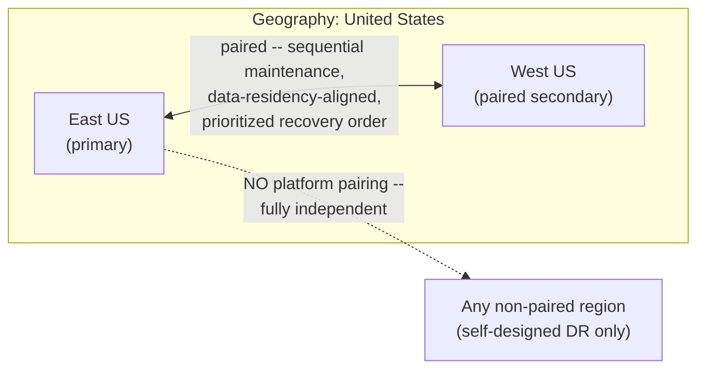

# Module 72 — Azure: Observability, Cost & the Well-Architected Framework — Azure Monitor, Application Insights & Multi-Region DR

> Domain: Azure | Level: Beginner → Expert | Prerequisite: [[../21-AWS/08-Observability-Cost-WellArchitectedFramework]] (this module mirrors that module's structure — Azure Monitor/Application Insights against CloudWatch/X-Ray, Azure Well-Architected Framework against AWS's, flagging the pillar-count divergence and Paired Regions as the key new findings), all prior Azure modules (65–71) — this module is the synthesizing capstone, applying the Azure Well-Architected Framework's pillars retrospectively across this entire domain

---

## 1. Fundamentals

### Why does a Principal Engineer need an explicit Azure observability/cost/Well-Architected capstone rather than treating these as implementation details of each individual service?
Every prior Azure module in this domain (65–71) surfaced the same recurring pattern independently — a specific setting or default that's invisible until a specific triggering condition exposes it (Module 65's Availability Set vs. Availability Zone distinction, Module 66's RBAC scope-inheritance surprise, Module 67's chosen-not-automatic redundancy tier, Module 68's Cosmos DB consistency-level trade-off, Module 69's Durable Functions determinism requirement, Module 70's Event Grid silent-loss default, Module 71's missing Container Apps tier) — observability is the general, cross-cutting mechanism that converts each of these from "invisible until an incident" into "visible and alertable before an incident," and cost optimization and the Well-Architected Framework provide the structured, repeatable review process a Principal Engineer uses to systematically apply this domain's entire body of lessons to any new or existing Azure workload, rather than relying on having personally experienced each specific failure mode first.

### Why does this matter?
Because a Principal Engineer is regularly expected to conduct exactly this kind of structured review — a Well-Architected review, an incident postmortem, a cost-optimization pass — across Azure systems they didn't originally build, and the ability to systematically apply this domain's patterns via the Framework's pillars, rather than relying on ad hoc, incident-driven learning, is what distinguishes reviewable, teachable Principal-level judgment from individually-accumulated tribal knowledge.

### When does this matter?
Continuously, for any live Azure workload (observability is an ongoing operational discipline, not a one-time setup) and periodically/structurally (a Well-Architected review at major milestones — pre-launch, post-incident, before a significant scaling event — and an ongoing cost-optimization cadence as actual usage patterns evolve).

### How does it work (30,000-ft view)?
```
Azure Monitor: the umbrella observability platform -- metrics, logs, alerts, dashboards --
     across every Azure service covered in this domain
Application Insights: Azure Monitor's APM component -- auto-correlates metrics, LOGS, and
     distributed TRACES under one Log Analytics workspace, queried via KQL
Azure Well-Architected Framework: Microsoft's structured review methodology across 5 pillars --
     Reliability, Security, Cost Optimization, Operational Excellence, Performance Efficiency
     (NO standalone Sustainability pillar, unlike AWS's 6 -- key divergence, see §2.2)
Cost Optimization: Reservations/Savings Plans/Spot VMs/Azure Hybrid Benefit, and the specific
     cost implications of nearly every decision covered in Modules 65-71
Paired Regions: Azure-native platform concept with NO AWS equivalent (see §2.3)
```

---

## 2. Deep Dive

### 2.1 Azure Monitor + Application Insights — a Tighter Integration Than CloudWatch's Metrics/Logs vs. X-Ray's Separate Tracing Service
Module 64 §2.1–§2.2 established CloudWatch (metrics/logs/alarms) and X-Ray (distributed tracing) as two related but architecturally separate AWS services, each requiring its own SDK instrumentation, correlated manually via trace IDs threaded through both. Azure Monitor is the umbrella platform, and **Application Insights** — Azure Monitor's Application Performance Management (APM) component — auto-instruments an application to emit metrics, logs, *and* distributed traces into a single **Log Analytics workspace**, queryable through one unified language, **KQL (Kusto Query Language)**, across all three signal types simultaneously (a single KQL query can join a trace's latency data against the log entries and custom metrics emitted during that same request, without separately querying two distinct services and manually correlating by trace ID the way a CloudWatch-plus-X-Ray investigation requires). This is a genuine, positive integration divergence: Azure's default observability posture arrives closer to Module 64 §2.2's X-Ray-compensates-for-choreography's-debuggability-weakness goal out of the box, with less manual signal-correlation engineering than the AWS equivalent requires — though a Principal Engineer should still verify Application Insights' auto-instrumentation actually covers every service in a given architecture (some Azure services, and any non-Azure/self-hosted component, may still require the same explicit, manual instrumentation effort CloudWatch/X-Ray require).

### 2.2 The Azure Well-Architected Framework's Five Pillars — a Genuine Structural Divergence From AWS's Six
Microsoft's Well-Architected Framework has **five** pillars — **Reliability**, **Security**, **Cost Optimization**, **Operational Excellence**, **Performance Efficiency** — with **no standalone Sustainability pillar**, unlike AWS's six (Module 64 §2.3). This is not an oversight; Microsoft's framework design embeds sustainability considerations *within* the other five pillars' guidance (e.g., right-sizing under Cost Optimization and Performance Efficiency) rather than elevating it to a distinct, independently-reviewed pillar. A Principal Engineer conducting a cross-cloud Well-Architected review (an organization running both AWS and Azure workloads) must recognize this structural difference explicitly: a "5 out of 5 pillars reviewed" Azure assessment is not directly comparable in scope to a "6 out of 6 pillars reviewed" AWS assessment without accounting for where AWS's Sustainability-pillar findings would actually land within Azure's five-pillar structure — treating the pillar *counts* as directly equivalent risks either under-scoping an Azure review (assuming sustainability is untracked entirely, when it's actually embedded) or creating an artificial, non-standard sixth pillar that diverges from Microsoft's own documented framework and confuses any review team familiar with Microsoft's official guidance.

### 2.3 Paired Regions — an Azure-Native Platform Concept With No AWS Equivalent
Every Azure region is platform-assigned a **paired region** within the same broader geography (e.g., East US ↔ West US, North Europe ↔ West Europe) — a genuinely Azure-native construct AWS Regions have no equivalent for (AWS Regions are fully independent, with no platform-level pairing relationship at all). Being paired confers concrete platform-level benefits: **sequential planned-maintenance rollout** (Azure deliberately never rolls out a platform update to both regions in a pair simultaneously, so a paired region provides a genuine, platform-guaranteed maintenance-isolation boundary); **data-residency alignment** (paired regions are chosen to remain within the same broader geography for data-residency/compliance purposes, so geo-redundant storage — Module 67's GRS/RA-GZRS — replicating to the paired region by default stays within the same compliance boundary without additional configuration); and **prioritized recovery ordering** during a genuinely broad, multi-region Azure platform outage (Microsoft prioritizes restoring service to one region of a pair before the other, giving a paired-region-based DR architecture a platform-level recovery-priority signal AWS's independent-Region model doesn't provide). This gives Azure DR architects a platform-provided default starting point for secondary-region selection that AWS's Module 64 §2.5 DR-strategy discussion doesn't have an equivalent for — though a Principal Engineer should still explicitly validate that the *default* paired region actually satisfies the workload's specific RTO/RPO and compliance requirements (Module 64 §2.5's explicit-computation discipline still applies) rather than assuming the platform default is automatically the architecturally correct choice, directly recurring this domain's Module 67 "explicit, chosen tier vs. assumed default" theme one final time, now at the Region-pairing scope.

### 2.4 Cost Optimization — Azure's Purchasing Options, Plus Azure Hybrid Benefit's License-Portability Lever
Azure's compute purchasing spectrum directly mirrors Module 64 §2.4's AWS framework: **Pay-As-You-Go** (On-Demand equivalent, no commitment), **Reservations** (Reserved Instance equivalent, 1- or 3-year committed-use discount for steady-state baseline load), **Azure Savings Plans for Compute** (Savings Plan equivalent — flexible, commitment-based discount across compute types), **Spot VMs** (Spot equivalent — deeply discounted, interruptible capacity for fault-tolerant workloads) — the same match-purchasing-option-to-actual-usage-pattern discipline (Module 64 §2.4) applies without modification. **Azure Hybrid Benefit** is the genuinely distinctive lever with no precise AWS equivalent at comparable integration depth: it lets an organization apply *existing* on-premises Windows Server and SQL Server licenses (covered by Software Assurance or qualifying subscriptions) directly toward Azure compute costs — a license-portability mechanism specifically valuable for organizations migrating an existing, already-licensed Windows/SQL Server estate to Azure, converting a sunk on-premises licensing investment into a direct Azure cost reduction rather than requiring a fresh Azure-native license purchase on top of infrastructure costs (AWS License Manager exists but doesn't have the same deep, commonly-exercised migration-cost-reduction usage pattern this specific Windows/SQL Server heritage gives Azure Hybrid Benefit).

### 2.5 Azure Advisor — the Continuous, Automated Counterpart to a Periodic Manual Well-Architected Review
Azure Advisor continuously analyzes a subscription's actual resource configuration and usage telemetry, surfacing recommendations mapped directly to the Well-Architected Framework's five pillars (§2.2) — an underutilized VM (Cost Optimization), a resource missing zone-redundancy (Reliability), an over-permissioned role assignment (Security) — functioning as the automated-detection layer that complements, rather than replaces, the periodic manual Well-Architected review Module 64 §4's incident established as necessary structural practice: Advisor catches many known-pattern findings *continuously*, between formal review cycles, the same way Module 64 §Advanced Q1's automated pipeline-governance-gate design intended for AWS, but arriving here as a first-party, always-on Azure platform capability rather than something a team must assemble themselves from individual service-specific checks.

### 2.6 Azure Site Recovery (ASR) — Turnkey DR Orchestration, Scoped Primarily to IaaS
Azure Site Recovery provides turnkey, managed replication, failover, and failback specifically for VM-based (IaaS) workloads — Azure-to-Azure or on-premises-to-Azure — meaningfully reducing the bespoke DR architecture Module 64 §2.5's four-strategy spectrum (Backup & Restore, Pilot Light, Warm Standby, Multi-Site Active/Active) otherwise requires a team to self-assemble per AWS service. This is a genuine Azure convenience for VM-heavy estates, but its turnkey nature is scoped to IaaS specifically — a PaaS/serverless-heavy Azure estate (Azure Functions, Container Apps, Cosmos DB, Azure SQL) still requires the same explicit, self-designed, per-service DR-strategy reasoning Module 64 §2.5 established, since ASR doesn't orchestrate failover for those service types — a Principal Engineer evaluating a genuinely mixed IaaS/PaaS Azure estate's DR posture should recognize ASR addresses only the IaaS portion, and must still apply Module 64 §2.5's explicit RTO/RPO-driven strategy selection independently for every PaaS/serverless component.

---

## 3. Visual Architecture

### Application Insights: Unified Metrics/Logs/Traces via One KQL Query (§2.1)

```mermaid
gantt
    dateFormat X
    axisFormat %Lms
    section API Management
    Request routing         :0, 15
    section Function: checkout
    Cold start (if any)     :15, 160
    Handler logic            :160, 230
    section Function: charge-payment
    Invocation                :230, 400
    section Azure SQL
    Query: debit balance       :250, 290
    section Cosmos DB
    Write: audit log           :400, 430
```

*(All five spans, plus their associated log entries and custom metrics, are queryable together via one KQL query against one Log Analytics workspace — no separate metrics-service-vs-tracing-service correlation step, unlike CloudWatch+X-Ray.)*

### Paired Regions: Platform-Level Maintenance Isolation & Recovery Priority (§2.3)


## 4. Production Example
**Scenario**: An organization running a substantial Azure estate — accumulated organically across the same two-year period as Module 64 §4's AWS-side incident, by teams working largely independently — commissioned a formal Azure Well-Architected Framework review ahead of a SOC 2 compliance audit. **Investigation**: the review surfaced findings that individually echoed nearly every lesson this Azure domain established: several production App Services and VMs (Reliability pillar) were deployed without zone-redundancy explicitly configured, silently defaulting to single-zone placement (Module 65's exact Availability Zone vs. Availability Set confusion); a legacy internal tool's Managed Identity (Security pillar) was shared broadly across three unrelated Function Apps rather than scoped per-application (Module 66's exact object-scoping discipline, violated); a large Blob Storage container (Cost pillar) had been provisioned on GRS (geo-redundant) by default years earlier for a genuinely non-critical, easily-regenerable dataset that never needed cross-region redundancy at all (Module 67's exact "redundancy tier is an explicit, chosen cost decision" lesson, inverted — over-provisioned rather than under-provisioned this time); and, when the review reached the Reliability pillar's DR-strategy checklist, no workload had an explicitly documented RTO/RPO or corresponding DR strategy, and the team had never evaluated whether their production region's *paired region* (§2.3) was actually being used as their DR target, or whether they even knew what it was. **Root cause**: identical to Module 64 §4's AWS-side root cause — the absence of a structured, periodic, cross-cutting review meant each team's locally-reasonable decisions (or deferred non-decisions) accumulated into a portfolio of latent, uncorrelated risk that no single team had collective visibility into, and the compliance audit's structured, comprehensive pass surfaced simultaneously what years of team-by-team, ad hoc practice had missed independently. **Fix**: prioritized remediation by blast-radius/likelihood (the shared Managed Identity and missing zone-redundancy addressed first, mirroring Module 64 §4's severity-ordering), right-sized the over-provisioned GRS storage container down to LRS once its actual non-critical redundancy requirement was explicitly confirmed (Module 67's discipline applied retroactively), explicitly documented per-workload RTO/RPO and adopted the production region's paired region as the DR target specifically *after* validating it met each workload's actual compliance and latency requirements — not merely because it was the platform default (§2.3's explicit caveat, applied) — and established a recurring quarterly Well-Architected review cadence going forward, with Azure Advisor (§2.5) configured as the continuous, between-review detection layer. **Lesson**: this incident is this domain's own capstone-level synthesis, structurally identical to Module 64 §4's AWS finding — every individual finding was, in isolation, a lesson this Azure domain already covered (Modules 65–71); the additional lesson is structural: without a periodic, comprehensive, cross-cutting review mechanism, individually-known lessons don't automatically propagate consistently across a growing, multi-team estate, on Azure exactly as much as on AWS — the review *process* itself, now paired with Azure Advisor's continuous automated layer, is the distinct, necessary Principal-Engineer-level practice this entire domain's capstone module (both its AWS and Azure halves) has established.

## 5. Best Practices
- Use Application Insights' unified Log Analytics workspace and KQL to correlate metrics, logs, and traces from one query surface, rather than manually re-implementing CloudWatch+X-Ray's separate-service correlation pattern on Azure (§2.1).
- When conducting a cross-cloud Well-Architected review, explicitly reconcile Azure's 5-pillar structure against AWS's 6-pillar structure — don't treat "5 of 5" and "6 of 6" as directly comparable review completeness without accounting for where Sustainability findings land within Azure's five (§2.2).
- Treat a workload's paired region as a validated *starting point* for DR-target selection, not an automatic, unverified default — confirm it actually satisfies the workload's explicit RTO/RPO and compliance requirements (§2.3).
- Apply Azure Hybrid Benefit specifically when migrating an already-licensed on-premises Windows Server/SQL Server estate, converting sunk licensing investment into direct Azure cost reduction (§2.4).
- Configure Azure Advisor as the continuous, automated detection layer complementing (not replacing) a recurring, periodic, manually-conducted Well-Architected review (§2.5, §4).
- For a mixed IaaS/PaaS Azure estate, recognize Azure Site Recovery's turnkey DR orchestration covers only the IaaS portion — apply Module 64 §2.5's explicit DR-strategy-selection reasoning independently for every PaaS/serverless component (§2.6).

## 6. Anti-patterns
- Allowing each team to independently make Azure infrastructure decisions with no periodic, cross-cutting review mechanism, letting individually-known lessons (Modules 65–71) fail to propagate consistently across a growing estate (§4).
- Assuming a redundancy tier (GRS, zone-redundancy) chosen years earlier is still the correct, explicitly-justified choice without periodically re-validating it against the workload's actual, current requirement (§4's over-provisioned-storage finding).
- Treating Azure's paired region as an automatic, sufficient DR target purely because it's the platform default, without validating it against the workload's actual RTO/RPO and compliance requirements (§2.3).
- Assuming Azure Site Recovery's turnkey DR orchestration covers an entire mixed IaaS/PaaS estate, when its coverage is scoped specifically to VM-based workloads (§2.6).
- Directly equating Azure's 5-pillar and AWS's 6-pillar Well-Architected review scope without reconciling where Sustainability-pillar considerations actually land in Azure's framework (§2.2).

---

## 10. Interview Questions

### Basic (10)
1. **Q: What is the umbrella observability platform in Azure, and what is its APM component called?** **A:** Azure Monitor is the umbrella platform; Application Insights is its Application Performance Management (APM) component.
2. **Q: What query language unifies metrics, logs, and traces in Azure Monitor?** **A:** KQL (Kusto Query Language), queried against a Log Analytics workspace.
3. **Q: How many pillars does the Azure Well-Architected Framework have, and how does this differ from AWS?** **A:** Five (Reliability, Security, Cost Optimization, Operational Excellence, Performance Efficiency) — no standalone Sustainability pillar, unlike AWS's six.
4. **Q: What is an Azure paired region?** **A:** A platform-assigned secondary region within the same geography, providing sequential maintenance rollout, data-residency alignment, and prioritized recovery order — a construct with no AWS equivalent.
5. **Q: What is Azure Hybrid Benefit?** **A:** A cost lever letting organizations apply existing on-premises Windows Server/SQL Server licenses (with Software Assurance) toward Azure compute costs.
6. **Q: What is Azure Advisor?** **A:** A continuous, automated recommendation service mapped to the Well-Architected Framework's five pillars, complementing periodic manual reviews.
7. **Q: What does Azure Site Recovery (ASR) provide, and what is its main scope limitation?** **A:** Turnkey replication/failover/failback DR orchestration, scoped primarily to VM-based (IaaS) workloads — PaaS/serverless components still need self-designed DR strategies.
8. **Q: What are Azure's compute purchasing options, mirroring AWS's?** **A:** Pay-As-You-Go (On-Demand), Reservations (Reserved Instances), Azure Savings Plans for Compute (Savings Plans), and Spot VMs (Spot).
9. **Q: Why can't "5 of 5 pillars reviewed" (Azure) and "6 of 6 pillars reviewed" (AWS) be treated as directly equivalent review completeness?** **A:** Azure's framework embeds sustainability considerations within its other five pillars rather than tracking it as a distinct pillar, so the scope isn't a simple 5-vs-6 count comparison.
10. **Q: What did the §4 incident's Well-Architected review reveal about the organization's prior operational practice?** **A:** That team-by-team, ad hoc decision-making without a periodic cross-cutting review let multiple already-known anti-patterns (shared Managed Identity, missing zone-redundancy, over-provisioned GRS storage, no documented DR strategy) accumulate unnoticed.

### Intermediate (10)
1. **Q: Why is Application Insights' unified metrics/logs/traces correlation described as a genuine integration advantage over CloudWatch plus X-Ray?** **A:** A single KQL query against one Log Analytics workspace can join trace, log, and metric data for the same request without a separate, manual trace-ID-based correlation step across two distinct services, which CloudWatch/X-Ray's split-service model requires.
2. **Q: Why should a Principal Engineer not assume Azure's default paired region is automatically the correct DR target?** **A:** The paired region is a platform-provided default, not a workload-specific, explicitly-validated choice — it may not satisfy a specific workload's actual RTO/RPO or compliance requirements, which still must be explicitly computed and checked, directly Module 64 §2.5's discipline recurring here.
3. **Q: Why is Azure Hybrid Benefit described as having no precise AWS equivalent at comparable depth?** **A:** It's specifically tied to Azure's Windows Server/SQL Server heritage, letting an already-licensed on-premises estate directly reduce Azure compute costs — AWS License Manager exists but lacks the same deeply integrated, commonly-exercised migration-cost-reduction usage pattern.
4. **Q: Why does Azure Advisor complement rather than replace a periodic manual Well-Architected review?** **A:** Advisor continuously catches many known-pattern findings automatically, but a manual review provides comprehensive, structured coverage (including findings Advisor's automated checks don't yet cover) and forces explicit, documented pillar-by-pillar accountability the way a purely automated tool doesn't.
5. **Q: Why doesn't Azure Site Recovery eliminate the need for Module 64 §2.5's DR-strategy-selection reasoning across a mixed IaaS/PaaS estate?** **A:** ASR's turnkey orchestration is scoped to VM-based (IaaS) workloads specifically; PaaS/serverless components (Functions, Cosmos DB, Azure SQL) aren't covered by ASR and still require the same explicit, self-designed, RTO/RPO-driven strategy selection.
6. **Q: Why does §4's over-provisioned GRS storage finding represent an inversion of Module 67's usual "under-provisioned redundancy" concern?** **A:** Module 67 typically warned against assuming automatic redundancy without an explicit choice; here the team had explicitly chosen GRS years earlier but never revisited whether the (non-critical, regenerable) data still warranted that cost — showing the "explicitly chosen, periodically re-validated" discipline applies in both directions, not just toward under-provisioning.
7. **Q: Why should Application Insights sampling rate be deliberately tuned rather than left at either extreme?** **A:** Too-low sampling risks missing the trace needed to diagnose a rare, intermittent issue; 100% sampling at high volume introduces meaningful cost and ingestion overhead — the same cost/completeness trade-off Module 64 §7 established for X-Ray, now recurring at the Application Insights layer.
8. **Q: Why is the paired-region concept described as giving Azure DR architects a "platform-provided starting point" rather than a complete DR solution?** **A:** It provides real platform-level benefits (maintenance isolation, data-residency alignment, recovery priority) as a default candidate secondary region, but the actual DR-strategy selection (which of Module 64 §2.5's four strategies to implement using that region) and RTO/RPO validation still require the same explicit, workload-specific engineering effort.
9. **Q: Why is the §4 incident's root cause described as identical to Module 64 §4's AWS-side incident despite being a different cloud?** **A:** Both stemmed from the same structural gap — no periodic, cross-cutting review mechanism — allowing individually-known, already-documented lessons to accumulate unnoticed across a growing, multi-team estate; the specific findings differ by platform, but the organizational root cause is the same.
10. **Q: Why must Log Analytics workspace access be governed with the same discipline Module 66 established for Key Vault?** **A:** Application Insights telemetry can contain sensitive request payload data or PII, making the workspace itself a data store requiring least-privilege access control and retention-policy governance, not an exempt category of infrastructure tooling.

### Advanced (10)
1. **Q: Diagnose the §4 incident from first principles, and design the specific organizational structure that prevents this class of accumulated-latent-risk finding from recurring after the initial remediation, synthesizing this Azure domain's full 65–71 lesson set.**
   **A:** Root cause: no periodic, cross-cutting review mechanism existed — each team's individually-reasonable (or simply deferred) decisions accumulated into an uncorrelated risk portfolio with no single point of collective visibility, identical in structure to Module 64 §4's AWS finding. Structural fix: (1) a recurring quarterly Well-Architected review with named, accountable pillar ownership (directly Module 64 §Advanced Q1's fix, applied here); (2) Azure Advisor (§2.5) configured and actively monitored as the continuous, automated backstop between formal reviews, catching the majority of known-pattern findings (shared Managed Identities, missing zone-redundancy) without waiting for the next quarterly cycle; (3) every module-specific anti-pattern this domain identified (Module 65's AZ-vs-AvSet check, Module 66's object-scoping linting, Module 67's redundancy-tier justification review, Module 71's AKS-over-Container-Apps justification requirement) integrated into a single, centrally-tracked governance checklist, directly mirroring Module 64 §Advanced Q10's AWS-side synthesis.
2. **Q: A team argues that since Azure Well-Architected has one fewer pillar than AWS's framework, an Azure Well-Architected review is inherently "less thorough" and should be supplemented with a bespoke, manually-added Sustainability pillar to match AWS's rigor. Evaluate this claim.**
   **A:** Push back on the premise, not necessarily the practice — Azure's framework doesn't omit sustainability considerations, it embeds them within the other five pillars' guidance (right-sizing under Cost Optimization/Performance Efficiency, for instance) rather than isolating them as a separately-tracked pillar; a team that wants sustainability tracked as an explicit, separately-reported line item for organizational reasons (e.g., matching a cross-cloud reporting standard) can reasonably choose to track it that way, but should recognize this as a *reporting-structure preference*, not a correction of a genuine gap in Microsoft's framework — conflating "structured differently" with "less rigorous" risks the team either duplicating guidance that's already present elsewhere in the five pillars, or missing where it already lives when auditing for completeness.
3. **Q: Design the specific validation process for confirming a workload's Azure paired region is an adequate DR target, rather than assuming platform pairing alone is sufficient — generalizing this domain's recurring "explicit computation, not an assumed default" discipline to the Region-pairing concept specifically.**
   **A:** Explicitly compute the workload's RTO/RPO requirement via the same stakeholder-inclusive process Module 64 §Advanced Q3 established, then verify the *specific* paired region satisfies it: confirm actual network latency between primary and paired region meets any cross-region synchronous-dependency requirement, confirm the paired region has capacity/quota available for a full failover-scale deployment (not just steady-state baseline), and confirm the paired region's compliance/data-residency posture genuinely matches the workload's regulatory requirements (data-residency alignment is Azure's stated design intent for pairing, but should be verified for the specific regulatory regime in question, not assumed automatically satisfied) — a paired region that fails any of these checks may still require selecting a different, non-default secondary region for that specific workload, exactly as Module 64 §2.5 requires an explicit DR-strategy choice rather than a default assumption.
4. **Q: A workload uses Application Insights with auto-instrumentation across its Azure-native components, but also depends on a third-party, non-Azure-hosted payment gateway. The team assumes Application Insights gives them full end-to-end trace visibility since "auto-instrumentation handles everything." Evaluate this assumption and design a fix.**
   **A:** The assumption is incorrect — Application Insights' auto-instrumentation covers Azure-native and commonly-instrumented frameworks, but a genuinely external, non-Azure-hosted dependency (the third-party payment gateway) won't automatically appear in the trace unless the application explicitly propagates the trace context (the `traceparent` header, per W3C Trace Context) into and captures the response from that external call — directly recurring Module 64 §2.2's "distributed tracing requires deliberate propagation across every hop, not automatic coverage regardless of hop type" lesson at the Application Insights layer specifically; the fix is explicit custom telemetry instrumentation (a manually-created `DependencyTelemetry` entry) wrapping the external payment-gateway call, ensuring the trace remains genuinely end-to-end rather than silently terminating at the boundary of Azure-native auto-instrumentation.
5. **Q: Critique the following claim: "Since we adopted Azure Hybrid Benefit for our entire VM estate and it reduced our compute bill by 40%, our cost-optimization review for this estate is complete."**
   **A:** Incomplete — Azure Hybrid Benefit addresses only the *licensing* component of compute cost for eligible Windows Server/SQL Server workloads; it says nothing about whether the underlying VM sizing itself is right-sized for actual utilization (Module 64 §2.4's right-sizing discipline), whether Reservations/Savings Plans are additionally layered on top of the Hybrid-Benefit-discounted rate for further savings on genuinely steady-state baseline load, or whether Spot VMs would be more appropriate for any fault-tolerant subset of that estate — Hybrid Benefit is one lever among several, and a complete cost-optimization review must still apply the full purchasing-option-matching and right-sizing discipline this domain established, not stop once one applicable lever has been exercised.
6. **Q: Design the specific set of automated Azure Advisor-plus-custom governance checks (synthesizing this domain's Modules 65–71 findings) that would structurally catch the majority of §4's incident's findings continuously, before a formal review cycle surfaces them.**
   **A:** (1) Azure Advisor's built-in Reliability recommendations, configured with alerting, to catch missing zone-redundancy (Module 65) continuously. (2) A custom Azure Policy definition denying or flagging Managed Identity assignments shared across more than one application resource (Module 66's object-scoping discipline, enforced structurally rather than relying on manual review to catch it). (3) A scheduled runbook or Azure Policy audit comparing each Storage Account's configured redundancy tier against a tagged "data criticality" classification, flagging mismatches in both directions — under-provisioned *and* over-provisioned, per §4's inversion finding (Module 67). (4) A mandatory tagging/documentation requirement (enforced via Azure Policy) that every production resource group have an associated, explicitly-documented RTO/RPO value before deployment is permitted, preventing the "no documented DR strategy at all" gap §4 found from recurring for *new* workloads even before the next quarterly review.
7. **Q: Explain why the recurring appearance of Module 66's object-scoping violation (shared Managed Identity) in §4's incident, despite the concept being well-established in this domain since Module 66, should be treated as evidence about organizational practice rather than a knowledge gap — directly paralleling Module 64 §Advanced Q7's identical reasoning for AWS's shared-IAM-role recurrence.**
   **A:** The anti-pattern recurring despite being well-documented within this domain indicates the underlying cause isn't unfamiliarity with the concept (the discipline and its rationale are established as early as Module 66) but a **process** gap — the absence of a structural enforcement mechanism (an Azure Policy check, a mandatory review gate) that would catch this specific, known anti-pattern regardless of which team introduces it next; this is the same generalized lesson Module 64 §Advanced Q7 established for AWS's identical recurrence — known technical lessons require structural, automated enforcement to reliably propagate across a growing organization, independent of which cloud platform hosts the workload.
8. **Q: A Principal Engineer is asked whether Azure Site Recovery alone is sufficient DR coverage for an estate that is "mostly VMs, with a few Azure Functions handling notification logic." Evaluate this framing and identify the gap.**
   **A:** "Mostly VMs" understates the risk — ASR provides turnkey coverage for the VM majority, but the "few Azure Functions" component, however small a fraction of the estate, still requires its own explicit, self-designed DR strategy (Module 64 §2.5's spectrum, applied per-service) since ASR doesn't orchestrate Function App failover; if those notification Functions are load-bearing for a business-critical workflow (e.g., customer-facing order confirmations), their small footprint doesn't correspond to small business impact, and a DR plan that only accounts for "most of the infrastructure by resource count" while leaving a business-critical minority component's DR strategy undocumented repeats exactly the kind of coverage gap this domain's incidents have repeatedly warned against — DR completeness should be assessed by business-criticality coverage, not infrastructure-resource-count coverage.
9. **Q: As a Principal Engineer establishing a comprehensive operational-excellence program for an organization's entire Azure estate, design the specific standing structure that ties together the individual governance gates each prior module (65–71) established, directly paralleling Module 64 §Advanced Q10's AWS-side synthesis.**
   **A:** (1) A recurring quarterly Well-Architected Framework review with named, accountable pillar ownership (§4, Advanced Q1) as the comprehensive backstop. (2) Azure Advisor, tuned and actively monitored, plus custom Azure Policy definitions encoding every module-specific automated check this domain established (Module 65's AZ verification, Module 66's identity-scoping policy, Module 67's redundancy-tier-vs-criticality audit, Module 68's consistency-level justification review, Module 69's orchestrator-determinism linting, Module 70's Event Grid dead-lettering verification, Module 71's Container-Apps-before-AKS justification gate) integrated into a single, centrally-tracked deployment-pipeline policy suite. (3) Explicit, stakeholder-inclusive RTO/RPO computation (Advanced Q3) as a mandatory input to any new workload's architecture, with paired-region suitability explicitly validated rather than assumed. (4) Scheduled DR drills validating both ASR-covered IaaS failover and independently-designed PaaS/serverless DR strategies actually meet documented targets in practice. (5) Cost-optimization review (Reservations, Savings Plans, Spot, Hybrid Benefit, and periodic redundancy-tier-vs-criticality re-validation) integrated into the same recurring cadence, given its substantial overlap with the other pillars' findings.
10. **Q: Synthesizing this entire Azure domain (Modules 65–72) against its AWS counterpart (Modules 57–64), characterize the overall pattern of divergence this domain has surfaced, and what it implies about how a Principal Engineer should approach any *third* cloud platform they might encounter in the future.**
    **A:** This domain's divergences fall into two structurally distinct categories, both recurring across Modules 65–72: (1) **misapplied-familiarity divergences** — a concept that looks similar to its AWS counterpart but has a materially different default or behavior underneath (Module 65's AZ-vs-AvSet, Module 66's RBAC scope inheritance, Module 67's chosen-not-automatic redundancy, Module 68's tunable consistency spectrum, Module 69's orchestrator-determinism requirement, Module 70's push-based silent-loss default, this module's 5-vs-6-pillar structure) — the risk here is applying an AWS mental model *incorrectly* to a superficially similar Azure concept; and (2) **missing-category divergences** — an Azure-native capability or platform concept with no AWS equivalent at all (Module 71's Container Apps third tier, this module's Paired Regions) — the risk here is an AWS mental model missing an *entire option or consideration* it has no framework for expecting to exist, since comparative concept-by-concept mapping structurally cannot surface something with no counterpart to map from. For any future third platform, a Principal Engineer should apply both disciplines deliberately and separately: a comparative mapping pass against platforms already known (surfacing category-1 divergences), *and* a dedicated, independent research pass specifically searching for platform-native capabilities with no counterpart in any already-known platform (surfacing category-2 divergences) — treating comparative learning as necessary but insufficient on its own, exactly as Module 71 §Advanced Q8 first established for this Azure domain specifically, now generalized as a standing methodology for approaching any new, unfamiliar platform.

---

## 11. Coding Exercises

### Easy — Azure Monitor alert tied to a specific business-tolerance threshold (§2.1, mirrors Module 64 §11 Easy)
```hcl
resource "azurerm_monitor_metric_alert" "checkout_sql_dtu_critical" {
  name                = "checkout-sql-dtu-critical"
  resource_group_name = azurerm_resource_group.main.name
  scopes              = [azurerm_mssql_database.checkout.id]

  criteria {
    metric_namespace = "Microsoft.Sql/servers/databases"
    metric_name       = "dtu_consumption_percent"
    aggregation       = "Average"
    operator          = "GreaterThan"
    # 85% threshold -- derived from checkout's OWN documented capacity headroom
    # requirement (§2.1), NOT a generic default reused across every database.
    threshold         = 85
  }
  window_size        = "PT5M"
  frequency          = "PT1M"
  action { action_group_id = azurerm_monitor_action_group.pagerduty_critical.id }
}
```

### Medium — Application Insights custom dependency tracking for a non-Azure external call (§Advanced Q4)
```csharp
public async Task<PaymentResult> ChargePaymentAsync(PaymentRequest request)
{
    // Explicit DependencyTelemetry -- required because the third-party payment
    // gateway is NOT auto-instrumented by Application Insights (§Advanced Q4).
    var operation = _telemetryClient.StartOperation<DependencyTelemetry>("PaymentGateway.Charge");
    operation.Telemetry.Type = "Http";
    operation.Telemetry.Target = "external-payment-gateway.example.com";

    try
    {
        var result = await _httpClient.PostAsJsonAsync("https://external-payment-gateway.example.com/charge", request);
        operation.Telemetry.Success = result.IsSuccessStatusCode;
        return await result.Content.ReadFromJsonAsync<PaymentResult>();
    }
    catch (Exception ex)
    {
        operation.Telemetry.Success = false;
        _telemetryClient.TrackException(ex);
        throw;
    }
    finally { _telemetryClient.StopOperation(operation); }
}
```

### Hard — Automated Well-Architected-style governance check bundling this domain's prior modules' gates (§Advanced Q9)
```csharp
public class AzureGovernanceCheck
{
    public GovernanceResult Validate(DeploymentManifest manifest)
    {
        var findings = new List<string>();

        // Module 65: Availability Zone verification (not Availability Set)
        if (manifest.Vms.Any(v => v.Environment == "production" && v.RedundancyMode != "AvailabilityZone"))
            findings.Add("Production VM not using Availability Zones (Module 65 §2.2)");

        // Module 66: shared Managed Identity detection
        var identityUsage = manifest.ManagedIdentities.GroupBy(i => i.IdentityId);
        foreach (var g in identityUsage.Where(g => g.Count() > 1))
            findings.Add($"Managed Identity {g.Key} shared across {g.Count()} resources (Module 66 §2.4 / this module §4)");

        // Module 67: redundancy tier vs. data-criticality mismatch (both directions, per §4's inversion finding)
        foreach (var sa in manifest.StorageAccounts)
        {
            if (sa.Criticality == "low" && sa.Redundancy is "GRS" or "RA-GZRS")
                findings.Add($"Storage account {sa.Name}: over-provisioned redundancy for low-criticality data (this module §4)");
            if (sa.Criticality == "high" && sa.Redundancy == "LRS")
                findings.Add($"Storage account {sa.Name}: under-provisioned redundancy for high-criticality data (Module 67 §2.4)");
        }

        // This module: missing documented RTO/RPO
        if (manifest.Workloads.Any(w => w.DocumentedRto == null || w.DocumentedRpo == null))
            findings.Add("Workload missing documented RTO/RPO (this module §2.3 / §4)");

        return new GovernanceResult { Passed = findings.Count == 0, Findings = findings };
    }
}
```

### Expert — Paired-region-validated Traffic Manager failover, explicitly checked rather than defaulted (§2.3, §Advanced Q3)
```hcl
# Explicit validation step (conceptual -- run in CI before this config is applied):
# confirm East US's paired region (West US) actually satisfies checkout's documented
# RTO/RPO and compliance requirements BEFORE wiring it as the failover target (§Advanced Q3).
# Do NOT skip this step purely because West US is the platform-assigned pair.

resource "azurerm_traffic_manager_profile" "checkout_api" {
  name                   = "checkout-api-tm"
  traffic_routing_method = "Priority"

  monitor_config {
    protocol     = "HTTPS"
    port         = 443
    path         = "/ready"  # genuine readiness check, NOT liveness-only --
                              # Module 57/65's recurring readiness-vs-liveness lesson,
                              # now at the Traffic-Manager failover-detection layer
    interval_in_seconds          = 10
    timeout_in_seconds           = 5
    tolerated_number_of_failures = 3
  }
}

resource "azurerm_traffic_manager_azure_endpoint" "primary" {
  name               = "east-us-primary"
  profile_id         = azurerm_traffic_manager_profile.checkout_api.id
  target_resource_id = azurerm_linux_web_app.checkout_east_us.id
  priority           = 1
}

resource "azurerm_traffic_manager_azure_endpoint" "paired_secondary" {
  name               = "west-us-paired-secondary"
  profile_id         = azurerm_traffic_manager_profile.checkout_api.id
  target_resource_id = azurerm_linux_web_app.checkout_west_us.id  # East US's PAIRED region (§2.3) --
                                                                     # explicitly validated, not assumed adequate
  priority           = 2
}
```
**Discussion**: the health check specifically targets `/ready` (this domain's recurring readiness-not-liveness lesson, one final time at the Traffic Manager failover-detection layer) — a primary region that's technically reachable but genuinely degraded should trigger failover just as reliably as a fully unreachable one. The comment block above the Traffic Manager profile is the operative discipline this module's §2.3/§Advanced Q3 establish: the paired region (West US) is used here *because* it was explicitly validated against checkout's actual RTO/RPO and compliance requirements, not merely because it's East US's platform-assigned pair — the Terraform alone can't enforce that validation happened, which is precisely why it must be a mandatory, documented step in the deployment process itself (§Advanced Q6's governance-checklist design), not something assumed satisfied by the code's structure.

---

## 12–17. System Design / LLD / Debugging / Decision / Case Study / Principal

*(§4's incident, the four §11 exercises, and the Advanced-tier Q&A — especially Advanced Q1's organizational governance structure, Advanced Q3's paired-region validation methodology, and Advanced Q10's cross-domain synthesis of the entire AWS-vs-Azure divergence pattern — collectively constitute this module's system-design, debugging, and Principal-Engineer-level content, and serve as the capstone synthesis of the entire `22-Azure` domain, Modules 65–72.)*

## 18. Revision
**Key takeaways**: This capstone module's central lesson mirrors Module 64's AWS capstone precisely: observability, cost optimization, and the Well-Architected Framework are not new technical knowledge but a *systematic, recurring process* for applying every lesson Modules 65–71 already established — Azure Monitor/Application Insights make Azure's own "invisible until a triggering condition" failure modes visible before they become incidents, with a genuinely tighter metrics/logs/traces integration (one Log Analytics workspace, one KQL surface) than AWS's CloudWatch/X-Ray split. This module surfaced two new, distinct divergence types completing this domain's pattern: a **structural framework divergence** (Azure's 5 Well-Architected pillars vs. AWS's 6, with sustainability embedded rather than standalone) and a genuine **missing-category divergence** (Paired Regions, an Azure-native platform concept with no AWS equivalent, providing a validated-but-not-automatic DR-target starting point). The §4 incident's structure is identical to Module 64 §4's AWS-side finding — every individual finding was, in isolation, a lesson this domain already covered; the durable, additional lesson is structural: known technical lessons require periodic review *plus* automated, structural enforcement (Azure Advisor, Azure Policy) to reliably propagate across a growing organization, independent of which cloud platform is in use.

---

**Azure domain complete (Modules 65–72):** Compute & Networking, IAM & Security, Storage, Databases, Serverless, Messaging/EDA-on-Azure, Containers/Microservices-on-Azure, and this capstone Observability/Cost/Well-Architected module — 8 modules at Principal-Engineer depth, each explicitly comparative against its AWS counterpart (Modules 57–64), surfacing both misapplied-familiarity divergences (Modules 65–70, 72's pillar-count finding) and missing-category divergences (Module 71's Container Apps, this module's Paired Regions) — completing the full AWS-and-Azure cloud arc (Modules 57–72) at the extra-depth/high-priority tier agreed at the start of the AWS domain and carried through to Azure per explicit user request.

**Next**: Type "Next" to proceed to the next domain in the roadmap, or specify a different focus.
