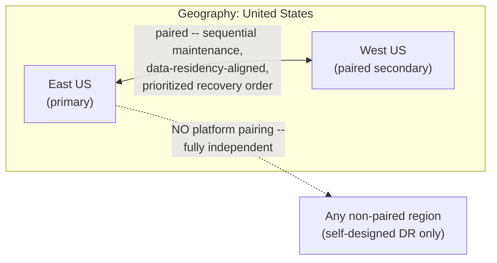
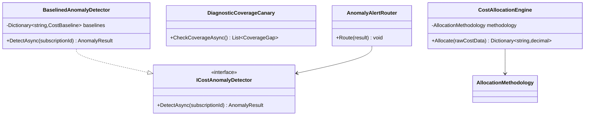
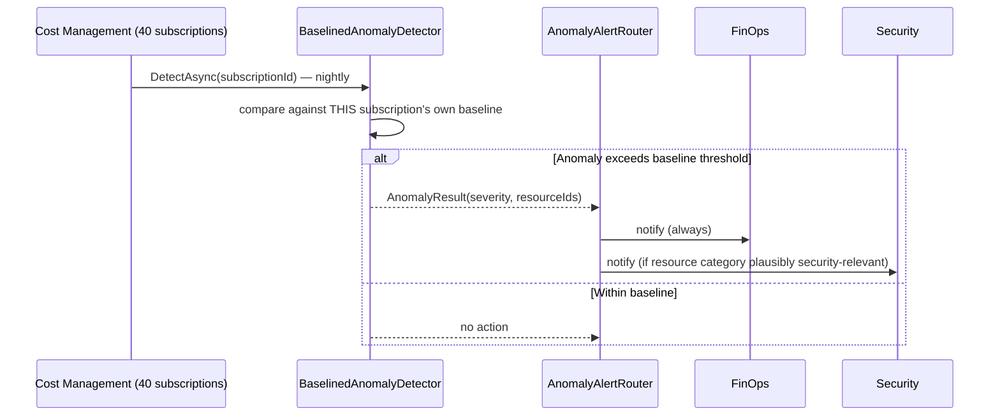

# Module 72 — Azure: Observability, Cost & the Well-Architected Framework — Azure Monitor, Application Insights & Multi-Region DR

> Domain: Azure | Level: Beginner → Expert | Prerequisite: [[../21-AWS/08-Observability-Cost-WellArchitectedFramework]] (this module mirrors that module's structure — Azure Monitor/Application Insights against CloudWatch/X-Ray, Azure Well-Architected Framework against AWS's, flagging the pillar-count divergence and Paired Regions as the key new findings), all prior Azure modules (65–71) — this module is the synthesizing capstone, applying the Azure Well-Architected Framework's pillars retrospectively across this entire domain

---

## 1. Fundamentals

### Why does a Principal Engineer need an explicit Azure observability/cost/Well-Architected capstone rather than treating these as implementation details of each individual service?
Every prior Azure module in this domain (65–71) surfaced the same recurring pattern independently — a specific setting or default that's invisible until a specific triggering condition exposes it (the Availability Set vs. Availability Zone distinction, the RBAC scope-inheritance surprise, the chosen-not-automatic redundancy tier, the Cosmos DB consistency-level trade-off, the Durable Functions determinism requirement, the Event Grid silent-loss default, the missing Container Apps tier) — observability is the general, cross-cutting mechanism that converts each of these from "invisible until an incident" into "visible and alertable before an incident," and cost optimization and the Well-Architected Framework provide the structured, repeatable review process a Principal Engineer uses to systematically apply this domain's entire body of lessons to any new or existing Azure workload, rather than relying on having personally experienced each specific failure mode first.

### Why does this matter?
Because a Principal Engineer is regularly expected to conduct exactly this kind of structured review — a Well-Architected review, an incident postmortem, a cost-optimization pass — across Azure systems they didn't originally build, and the ability to systematically apply this domain's patterns via the Framework's pillars, rather than relying on ad hoc, incident-driven learning, is what distinguishes reviewable, teachable Principal-level judgment from individually-accumulated tribal knowledge.

### When does this matter?
Continuously, for any live Azure workload (observability is an ongoing operational discipline, not a one-time setup) and periodically/structurally (a Well-Architected review at major milestones — pre-launch, post-incident, before a significant scaling event — and an ongoing cost-optimization cadence as actual usage patterns evolve).

### How does it work (30,000-ft view)?
```
Azure Monitor: the umbrella observability platform -- metrics, logs, alerts, dashboards --
 across every Azure service covered in this domain
Application Insights: Azure Monitor's APM component -- auto-correlates metrics, LOGS, and
 distributed TRACES under one Log Analytics workspace, queried via KQL
Azure Well-Architected Framework: Microsoft's structured review methodology across 5 pillars --
 Reliability, Security, Cost Optimization, Operational Excellence, Performance Efficiency
 (NO standalone Sustainability pillar, unlike AWS's 6 -- key divergence)
Cost Optimization: Reservations/Savings Plans/Spot VMs/Azure Hybrid Benefit, and the specific
 cost implications of nearly every decision covered in Modules 65-71
Paired Regions: Azure-native platform concept with NO AWS equivalent
```

---

## 2. Deep Dive

### 2.1 Azure Monitor + Application Insights — a Tighter Integration Than CloudWatch's Metrics/Logs vs. X-Ray's Separate Tracing Service
– established CloudWatch (metrics/logs/alarms) and X-Ray (distributed tracing) as two related but architecturally separate AWS services, each requiring its own SDK instrumentation, correlated manually via trace IDs threaded through both. Azure Monitor is the umbrella platform, and **Application Insights** — Azure Monitor's Application Performance Management (APM) component — auto-instruments an application to emit metrics, logs, *and* distributed traces into a single **Log Analytics workspace**, queryable through one unified language, **KQL (Kusto Query Language)**, across all three signal types simultaneously (a single KQL query can join a trace's latency data against the log entries and custom metrics emitted during that same request, without separately querying two distinct services and manually correlating by trace ID the way a CloudWatch-plus-X-Ray investigation requires). This is a genuine, positive integration divergence: Azure's default observability posture arrives closer to the X-Ray-compensates-for-choreography's-debuggability-weakness goal out of the box, with less manual signal-correlation engineering than the AWS equivalent requires — though a Principal Engineer should still verify Application Insights' auto-instrumentation actually covers every service in a given architecture (some Azure services, and any non-Azure/self-hosted component, may still require the same explicit, manual instrumentation effort CloudWatch/X-Ray require).

### 2.2 The Azure Well-Architected Framework's Five Pillars — a Genuine Structural Divergence From AWS's Six
Microsoft's Well-Architected Framework has **five** pillars — **Reliability**, **Security**, **Cost Optimization**, **Operational Excellence**, **Performance Efficiency** — with **no standalone Sustainability pillar**, unlike AWS's six. This is not an oversight; Microsoft's framework design embeds sustainability considerations *within* the other five pillars' guidance (e.g., right-sizing under Cost Optimization and Performance Efficiency) rather than elevating it to a distinct, independently-reviewed pillar. A Principal Engineer conducting a cross-cloud Well-Architected review (an organization running both AWS and Azure workloads) must recognize this structural difference explicitly: a "5 out of 5 pillars reviewed" Azure assessment is not directly comparable in scope to a "6 out of 6 pillars reviewed" AWS assessment without accounting for where AWS's Sustainability-pillar findings would actually land within Azure's five-pillar structure — treating the pillar *counts* as directly equivalent risks either under-scoping an Azure review (assuming sustainability is untracked entirely, when it's actually embedded) or creating an artificial, non-standard sixth pillar that diverges from Microsoft's own documented framework and confuses any review team familiar with Microsoft's official guidance.

### 2.3 Paired Regions — an Azure-Native Platform Concept With No AWS Equivalent
Every Azure region is platform-assigned a **paired region** within the same broader geography (e.g., East US ↔ West US, North Europe ↔ West Europe) — a genuinely Azure-native construct AWS Regions have no equivalent for (AWS Regions are fully independent, with no platform-level pairing relationship at all). Being paired confers concrete platform-level benefits: **sequential planned-maintenance rollout** (Azure deliberately never rolls out a platform update to both regions in a pair simultaneously, so a paired region provides a genuine, platform-guaranteed maintenance-isolation boundary); **data-residency alignment** (paired regions are chosen to remain within the same broader geography for data-residency/compliance purposes, so geo-redundant storage — the GRS/RA-GZRS — replicating to the paired region by default stays within the same compliance boundary without additional configuration); and **prioritized recovery ordering** during a genuinely broad, multi-region Azure platform outage (Microsoft prioritizes restoring service to one region of a pair before the other, giving a paired-region-based DR architecture a platform-level recovery-priority signal AWS's independent-Region model doesn't provide). This gives Azure DR architects a platform-provided default starting point for secondary-region selection that AWS's DR-strategy discussion doesn't have an equivalent for — though a Principal Engineer should still explicitly validate that the *default* paired region actually satisfies the workload's specific RTO/RPO and compliance requirements (the explicit-computation discipline still applies) rather than assuming the platform default is automatically the architecturally correct choice, directly recurring this domain's "explicit, chosen tier vs. assumed default" theme one final time, now at the Region-pairing scope.

### 2.4 Cost Optimization — Azure's Purchasing Options, Plus Azure Hybrid Benefit's License-Portability Lever
Azure's compute purchasing spectrum directly mirrors the AWS framework: **Pay-As-You-Go** (On-Demand equivalent, no commitment), **Reservations** (Reserved Instance equivalent, 1- or 3-year committed-use discount for steady-state baseline load), **Azure Savings Plans for Compute** (Savings Plan equivalent — flexible, commitment-based discount across compute types), **Spot VMs** (Spot equivalent — deeply discounted, interruptible capacity for fault-tolerant workloads) — the same match-purchasing-option-to-actual-usage-pattern discipline applies without modification. **Azure Hybrid Benefit** is the genuinely distinctive lever with no precise AWS equivalent at comparable integration depth: it lets an organization apply *existing* on-premises Windows Server and SQL Server licenses (covered by Software Assurance or qualifying subscriptions) directly toward Azure compute costs — a license-portability mechanism specifically valuable for organizations migrating an existing, already-licensed Windows/SQL Server estate to Azure, converting a sunk on-premises licensing investment into a direct Azure cost reduction rather than requiring a fresh Azure-native license purchase on top of infrastructure costs (AWS License Manager exists but doesn't have the same deep, commonly-exercised migration-cost-reduction usage pattern this specific Windows/SQL Server heritage gives Azure Hybrid Benefit).

### 2.5 Azure Advisor — the Continuous, Automated Counterpart to a Periodic Manual Well-Architected Review
Azure Advisor continuously analyzes a subscription's actual resource configuration and usage telemetry, surfacing recommendations mapped directly to the Well-Architected Framework's five pillars — an underutilized VM (Cost Optimization), a resource missing zone-redundancy (Reliability), an over-permissioned role assignment (Security) — functioning as the automated-detection layer that complements, rather than replaces, the periodic manual Well-Architected review the incident established as necessary structural practice: Advisor catches many known-pattern findings *continuously*, between formal review cycles, the same way §Advanced Q1's automated pipeline-governance-gate design intended for AWS, but arriving here as a first-party, always-on Azure platform capability rather than something a team must assemble themselves from individual service-specific checks.

### 2.6 Azure Site Recovery (ASR) — Turnkey DR Orchestration, Scoped Primarily to IaaS
Azure Site Recovery provides turnkey, managed replication, failover, and failback specifically for VM-based (IaaS) workloads — Azure-to-Azure or on-premises-to-Azure — meaningfully reducing the bespoke DR architecture the four-strategy spectrum (Backup & Restore, Pilot Light, Warm Standby, Multi-Site Active/Active) otherwise requires a team to self-assemble per AWS service. This is a genuine Azure convenience for VM-heavy estates, but its turnkey nature is scoped to IaaS specifically — a PaaS/serverless-heavy Azure estate (Azure Functions, Container Apps, Cosmos DB, Azure SQL) still requires the same explicit, self-designed, per-service DR-strategy reasoning established, since ASR doesn't orchestrate failover for those service types — a Principal Engineer evaluating a genuinely mixed IaaS/PaaS Azure estate's DR posture should recognize ASR addresses only the IaaS portion, and must still apply the explicit RTO/RPO-driven strategy selection independently for every PaaS/serverless component.

---

## 3. Visual Architecture

### Application Insights: Unified Metrics/Logs/Traces via One KQL Query

```mermaid
gantt
 dateFormat X
 axisFormat %Lms
 section API Management
 Request routing:0, 15
 section Function: checkout
 Cold start (if any):15, 160
 Handler logic:160, 230
 section Function: charge-payment
 Invocation:230, 400
 section Azure SQL
 Query: debit balance:250, 290
 section Cosmos DB
 Write: audit log:400, 430
```
*(All five spans, plus their associated log entries and custom metrics, are queryable together via one KQL query against one Log Analytics workspace — no separate metrics-service-vs-tracing-service correlation step, unlike CloudWatch+X-Ray.)*

### Paired Regions: Platform-Level Maintenance Isolation & Recovery Priority

```mermaid
graph LR
 subgraph "Geography: United States"
 EastUS["East US<br/>(primary)"] <-->|"paired -- sequential maintenance,<br/>data-residency-aligned,<br/>prioritized recovery order"| WestUS["West US<br/>(paired secondary)"]
 end
 EastUS -.->|"NO platform pairing --<br/>fully independent"| OtherRegion["Any non-paired region<br/>(self-designed DR only)"]
```

## 4. Production Example
**Scenario**: An organization running a substantial Azure estate — accumulated organically across the same two-year period as the AWS-side incident, by teams working largely independently — commissioned a formal Azure Well-Architected Framework review ahead of a SOC 2 compliance audit. **Investigation**: the review surfaced findings that individually echoed nearly every lesson this Azure domain established: several production App Services and VMs (Reliability pillar) were deployed without zone-redundancy explicitly configured, silently defaulting to single-zone placement (the exact Availability Zone vs. Availability Set confusion); a legacy internal tool's Managed Identity (Security pillar) was shared broadly across three unrelated Function Apps rather than scoped per-application (the exact object-scoping discipline, violated); a large Blob Storage container (Cost pillar) had been provisioned on GRS (geo-redundant) by default years earlier for a genuinely non-critical, easily-regenerable dataset that never needed cross-region redundancy at all (the exact "redundancy tier is an explicit, chosen cost decision" lesson, inverted — over-provisioned rather than under-provisioned this time); and, when the review reached the Reliability pillar's DR-strategy checklist, no workload had an explicitly documented RTO/RPO or corresponding DR strategy, and the team had never evaluated whether their production region's *paired region* was actually being used as their DR target, or whether they even knew what it was. **Root cause**: identical to the AWS-side root cause — the absence of a structured, periodic, cross-cutting review meant each team's locally-reasonable decisions (or deferred non-decisions) accumulated into a portfolio of latent, uncorrelated risk that no single team had collective visibility into, and the compliance audit's structured, comprehensive pass surfaced simultaneously what years of team-by-team, ad hoc practice had missed independently. **Fix**: prioritized remediation by blast-radius/likelihood (the shared Managed Identity and missing zone-redundancy addressed first, mirroring the severity-ordering), right-sized the over-provisioned GRS storage container down to LRS once its actual non-critical redundancy requirement was explicitly confirmed (the discipline applied retroactively), explicitly documented per-workload RTO/RPO and adopted the production region's paired region as the DR target specifically *after* validating it met each workload's actual compliance and latency requirements — not merely because it was the platform default (the explicit caveat, applied) — and established a recurring quarterly Well-Architected review cadence going forward, with Azure Advisor configured as the continuous, between-review detection layer. **Lesson**: this incident is this domain's own capstone-level synthesis, structurally identical to the AWS finding — every individual finding was, in isolation, a lesson this Azure domain already covered (Modules 65–71); the additional lesson is structural: without a periodic, comprehensive, cross-cutting review mechanism, individually-known lessons don't automatically propagate consistently across a growing, multi-team estate, on Azure exactly as much as on AWS — the review *process* itself, now paired with Azure Advisor's continuous automated layer, is the distinct, necessary Principal-Engineer-level practice this entire domain's capstone module (both its AWS and Azure halves) has established.
## 10. Interview Questions

### Basic (10)
1. **Q: What is the umbrella observability platform in Azure, and what is its APM component called?** **A:** Azure Monitor is the umbrella platform; Application Insights is its Application Performance Management (APM) component.
2. **Q: What query language unifies metrics, logs, and traces in Azure Monitor?** **A:** KQL (Kusto Query Language), queried against a Log Analytics workspace.
3. **Q: How many pillars does the Azure Well-Architected Framework have, and how does this differ from AWS?** **A:** Five (Reliability, Security, Cost Optimization, Operational Excellence, Performance Efficiency) — no standalone Sustainability pillar, unlike AWS's six.
4. **Q: What is an Azure paired region?** **A:** A platform-assigned secondary region within the same geography, providing sequential maintenance rollout, data-residency alignment, and prioritized recovery order — a construct with no AWS equivalent.
5. **Q: What is Azure Hybrid Benefit?** **A:** A cost lever letting organizations apply existing on-premises Windows Server/SQL Server licenses (with Software Assurance) toward Azure compute costs.
6. **Q: What is Azure Advisor?** **A:** A continuous, automated recommendation service mapped to the Well-Architected Framework's five pillars, complementing periodic manual reviews.
7. **Q: What does Azure Site Recovery (ASR) provide, and what is its main scope limitation?** **A:** Turnkey replication/failover/failback DR orchestration, scoped primarily to VM-based (IaaS) workloads — PaaS/serverless components still need self-designed DR strategies.
8. **Q: What are Azure's compute purchasing options, mirroring AWS's?** **A:** Pay-As-You-Go (On-Demand), Reservations (Reserved Instances), Azure Savings Plans for Compute (Savings Plans), and Spot VMs (Spot).
9. **Q: Why can't "5 of 5 pillars reviewed" (Azure) and "6 of 6 pillars reviewed" (AWS) be treated as directly equivalent review completeness?** **A:** Azure's framework embeds sustainability considerations within its other five pillars rather than tracking it as a distinct pillar, so the scope isn't a simple 5-vs-6 count comparison.
10. **Q: What did the incident's Well-Architected review reveal about the organization's prior operational practice?** **A:** That team-by-team, ad hoc decision-making without a periodic cross-cutting review let multiple already-known anti-patterns (shared Managed Identity, missing zone-redundancy, over-provisioned GRS storage, no documented DR strategy) accumulate unnoticed.

### Intermediate (10)
1. **Q: Why is Application Insights' unified metrics/logs/traces correlation described as a genuine integration advantage over CloudWatch plus X-Ray?** **A:** A single KQL query against one Log Analytics workspace can join trace, log, and metric data for the same request without a separate, manual trace-ID-based correlation step across two distinct services, which CloudWatch/X-Ray's split-service model requires.
2. **Q: Why should a Principal Engineer not assume Azure's default paired region is automatically the correct DR target?** **A:** The paired region is a platform-provided default, not a workload-specific, explicitly-validated choice — it may not satisfy a specific workload's actual RTO/RPO or compliance requirements, which still must be explicitly computed and checked, directly the discipline recurring here.
3. **Q: Why is Azure Hybrid Benefit described as having no precise AWS equivalent at comparable depth?** **A:** It's specifically tied to Azure's Windows Server/SQL Server heritage, letting an already-licensed on-premises estate directly reduce Azure compute costs — AWS License Manager exists but lacks the same deeply integrated, commonly-exercised migration-cost-reduction usage pattern.
4. **Q: Why does Azure Advisor complement rather than replace a periodic manual Well-Architected review?** **A:** Advisor continuously catches many known-pattern findings automatically, but a manual review provides comprehensive, structured coverage (including findings Advisor's automated checks don't yet cover) and forces explicit, documented pillar-by-pillar accountability the way a purely automated tool doesn't.
5. **Q: Why doesn't Azure Site Recovery eliminate the need for the DR-strategy-selection reasoning across a mixed IaaS/PaaS estate?** **A:** ASR's turnkey orchestration is scoped to VM-based (IaaS) workloads specifically; PaaS/serverless components (Functions, Cosmos DB, Azure SQL) aren't covered by ASR and still require the same explicit, self-designed, RTO/RPO-driven strategy selection.
6. **Q: Why does the over-provisioned GRS storage finding represent an inversion of the usual "under-provisioned redundancy" concern?** **A:** typically warned against assuming automatic redundancy without an explicit choice; here the team had explicitly chosen GRS years earlier but never revisited whether the (non-critical, regenerable) data still warranted that cost — showing the "explicitly chosen, periodically re-validated" discipline applies in both directions, not just toward under-provisioning.
7. **Q: Why should Application Insights sampling rate be deliberately tuned rather than left at either extreme?** **A:** Too-low sampling risks missing the trace needed to diagnose a rare, intermittent issue; 100% sampling at high volume introduces meaningful cost and ingestion overhead — the same cost/completeness trade-off established for X-Ray, now recurring at the Application Insights layer.
8. **Q: Why is the paired-region concept described as giving Azure DR architects a "platform-provided starting point" rather than a complete DR solution?** **A:** It provides real platform-level benefits (maintenance isolation, data-residency alignment, recovery priority) as a default candidate secondary region, but the actual DR-strategy selection (which of the four strategies to implement using that region) and RTO/RPO validation still require the same explicit, workload-specific engineering effort.
9. **Q: Why is the incident's root cause described as identical to the AWS-side incident despite being a different cloud?** **A:** Both stemmed from the same structural gap — no periodic, cross-cutting review mechanism — allowing individually-known, already-documented lessons to accumulate unnoticed across a growing, multi-team estate; the specific findings differ by platform, but the organizational root cause is the same.
10. **Q: Why must Log Analytics workspace access be governed with the same discipline established for Key Vault?** **A:** Application Insights telemetry can contain sensitive request payload data or PII, making the workspace itself a data store requiring least-privilege access control and retention-policy governance, not an exempt category of infrastructure tooling.

### Advanced (10)
1. **Q: Diagnose the incident from first principles, and design the specific organizational structure that prevents this class of accumulated-latent-risk finding from recurring after the initial remediation, synthesizing this Azure domain's full 65–71 lesson set.**
 **A:** Root cause: no periodic, cross-cutting review mechanism existed — each team's individually-reasonable (or simply deferred) decisions accumulated into an uncorrelated risk portfolio with no single point of collective visibility, identical in structure to the AWS finding. Structural fix: (1) a recurring quarterly Well-Architected review with named, accountable pillar ownership (directly §Advanced Q1's fix, applied here); (2) Azure Advisor configured and actively monitored as the continuous, automated backstop between formal reviews, catching the majority of known-pattern findings (shared Managed Identities, missing zone-redundancy) without waiting for the next quarterly cycle; (3) every module-specific anti-pattern this domain identified (the AZ-vs-AvSet check, the object-scoping linting, the redundancy-tier justification review, the AKS-over-Container-Apps justification requirement) integrated into a single, centrally-tracked governance checklist, directly mirroring §Advanced Q10's AWS-side synthesis.
2. **Q: A team argues that since Azure Well-Architected has one fewer pillar than AWS's framework, an Azure Well-Architected review is inherently "less thorough" and should be supplemented with a bespoke, manually-added Sustainability pillar to match AWS's rigor. Evaluate this claim.**
 **A:** Push back on the premise, not necessarily the practice — Azure's framework doesn't omit sustainability considerations, it embeds them within the other five pillars' guidance (right-sizing under Cost Optimization/Performance Efficiency, for instance) rather than isolating them as a separately-tracked pillar; a team that wants sustainability tracked as an explicit, separately-reported line item for organizational reasons (e.g., matching a cross-cloud reporting standard) can reasonably choose to track it that way, but should recognize this as a *reporting-structure preference*, not a correction of a genuine gap in Microsoft's framework — conflating "structured differently" with "less rigorous" risks the team either duplicating guidance that's already present elsewhere in the five pillars, or missing where it already lives when auditing for completeness.
3. **Q: Design the specific validation process for confirming a workload's Azure paired region is an adequate DR target, rather than assuming platform pairing alone is sufficient — generalizing this domain's recurring "explicit computation, not an assumed default" discipline to the Region-pairing concept specifically.**
 **A:** Explicitly compute the workload's RTO/RPO requirement via the same stakeholder-inclusive process §Advanced Q3 established, then verify the *specific* paired region satisfies it: confirm actual network latency between primary and paired region meets any cross-region synchronous-dependency requirement, confirm the paired region has capacity/quota available for a full failover-scale deployment (not just steady-state baseline), and confirm the paired region's compliance/data-residency posture genuinely matches the workload's regulatory requirements (data-residency alignment is Azure's stated design intent for pairing, but should be verified for the specific regulatory regime in question, not assumed automatically satisfied) — a paired region that fails any of these checks may still require selecting a different, non-default secondary region for that specific workload, exactly as requires an explicit DR-strategy choice rather than a default assumption.
4. **Q: A workload uses Application Insights with auto-instrumentation across its Azure-native components, but also depends on a third-party, non-Azure-hosted payment gateway. The team assumes Application Insights gives them full end-to-end trace visibility since "auto-instrumentation handles everything." Evaluate this assumption and design a fix.**
 **A:** The assumption is incorrect — Application Insights' auto-instrumentation covers Azure-native and commonly-instrumented frameworks, but a genuinely external, non-Azure-hosted dependency (the third-party payment gateway) won't automatically appear in the trace unless the application explicitly propagates the trace context (the `traceparent` header, per W3C Trace Context) into and captures the response from that external call — directly recurring the "distributed tracing requires deliberate propagation across every hop, not automatic coverage regardless of hop type" lesson at the Application Insights layer specifically; the fix is explicit custom telemetry instrumentation (a manually-created `DependencyTelemetry` entry) wrapping the external payment-gateway call, ensuring the trace remains genuinely end-to-end rather than silently terminating at the boundary of Azure-native auto-instrumentation.
5. **Q: Critique the following claim: "Since we adopted Azure Hybrid Benefit for our entire VM estate and it reduced our compute bill by 40%, our cost-optimization review for this estate is complete."**
 **A:** Incomplete — Azure Hybrid Benefit addresses only the *licensing* component of compute cost for eligible Windows Server/SQL Server workloads; it says nothing about whether the underlying VM sizing itself is right-sized for actual utilization (the right-sizing discipline), whether Reservations/Savings Plans are additionally layered on top of the Hybrid-Benefit-discounted rate for further savings on genuinely steady-state baseline load, or whether Spot VMs would be more appropriate for any fault-tolerant subset of that estate — Hybrid Benefit is one lever among several, and a complete cost-optimization review must still apply the full purchasing-option-matching and right-sizing discipline this domain established, not stop once one applicable lever has been exercised.
6. **Q: Design the specific set of automated Azure Advisor-plus-custom governance checks (synthesizing this domain's Modules 65–71 findings) that would structurally catch the majority of the incident's findings continuously, before a formal review cycle surfaces them.**
 **A:** (1) Azure Advisor's built-in Reliability recommendations, configured with alerting, to catch missing zone-redundancy continuously. (2) A custom Azure Policy definition denying or flagging Managed Identity assignments shared across more than one application resource (the object-scoping discipline, enforced structurally rather than relying on manual review to catch it). (3) A scheduled runbook or Azure Policy audit comparing each Storage Account's configured redundancy tier against a tagged "data criticality" classification, flagging mismatches in both directions — under-provisioned *and* over-provisioned, per the inversion finding. (4) A mandatory tagging/documentation requirement (enforced via Azure Policy) that every production resource group have an associated, explicitly-documented RTO/RPO value before deployment is permitted, preventing the "no documented DR strategy at all" gap found from recurring for *new* workloads even before the next quarterly review.
7. **Q: Explain why the recurring appearance of the object-scoping violation (shared Managed Identity) in the incident, despite the concept being well-established in this domain since, should be treated as evidence about organizational practice rather than a knowledge gap — directly paralleling §Advanced Q7's identical reasoning for AWS's shared-IAM-role recurrence.**
 **A:** The anti-pattern recurring despite being well-documented within this domain indicates the underlying cause isn't unfamiliarity with the concept (the discipline and its rationale are established as early as) but a **process** gap — the absence of a structural enforcement mechanism (an Azure Policy check, a mandatory review gate) that would catch this specific, known anti-pattern regardless of which team introduces it next; this is the same generalized lesson §Advanced Q7 established for AWS's identical recurrence — known technical lessons require structural, automated enforcement to reliably propagate across a growing organization, independent of which cloud platform hosts the workload.
8. **Q: A Principal Engineer is asked whether Azure Site Recovery alone is sufficient DR coverage for an estate that is "mostly VMs, with a few Azure Functions handling notification logic." Evaluate this framing and identify the gap.**
 **A:** "Mostly VMs" understates the risk — ASR provides turnkey coverage for the VM majority, but the "few Azure Functions" component, however small a fraction of the estate, still requires its own explicit, self-designed DR strategy (the spectrum, applied per-service) since ASR doesn't orchestrate Function App failover; if those notification Functions are load-bearing for a business-critical workflow (e.g., customer-facing order confirmations), their small footprint doesn't correspond to small business impact, and a DR plan that only accounts for "most of the infrastructure by resource count" while leaving a business-critical minority component's DR strategy undocumented repeats exactly the kind of coverage gap this domain's incidents have repeatedly warned against — DR completeness should be assessed by business-criticality coverage, not infrastructure-resource-count coverage.
9. **Q: As a Principal Engineer establishing a comprehensive operational-excellence program for an organization's entire Azure estate, design the specific standing structure that ties together the individual governance gates each prior module (65–71) established, directly paralleling §Advanced Q10's AWS-side synthesis.**
 **A:** (1) A recurring quarterly Well-Architected Framework review with named, accountable pillar ownership (Advanced Q1) as the comprehensive backstop. (2) Azure Advisor, tuned and actively monitored, plus custom Azure Policy definitions encoding every module-specific automated check this domain established (the AZ verification, the identity-scoping policy, the redundancy-tier-vs-criticality audit, the consistency-level justification review, the orchestrator-determinism linting, the Event Grid dead-lettering verification, the Container-Apps-before-AKS justification gate) integrated into a single, centrally-tracked deployment-pipeline policy suite. (3) Explicit, stakeholder-inclusive RTO/RPO computation (Advanced Q3) as a mandatory input to any new workload's architecture, with paired-region suitability explicitly validated rather than assumed. (4) Scheduled DR drills validating both ASR-covered IaaS failover and independently-designed PaaS/serverless DR strategies actually meet documented targets in practice. (5) Cost-optimization review (Reservations, Savings Plans, Spot, Hybrid Benefit, and periodic redundancy-tier-vs-criticality re-validation) integrated into the same recurring cadence, given its substantial overlap with the other pillars' findings.
10. **Q: Synthesizing this entire Azure domain (Modules 65–72) against its AWS counterpart (Modules 57–64), characterize the overall pattern of divergence this domain has surfaced, and what it implies about how a Principal Engineer should approach any *third* cloud platform they might encounter in the future.**
 **A:** This domain's divergences fall into two structurally distinct categories, both recurring across Modules 65–72: (1) **misapplied-familiarity divergences** — a concept that looks similar to its AWS counterpart but has a materially different default or behavior underneath (the AZ-vs-AvSet, the RBAC scope inheritance, the chosen-not-automatic redundancy, the tunable consistency spectrum, the orchestrator-determinism requirement, the push-based silent-loss default, this module's 5-vs-6-pillar structure) — the risk here is applying an AWS mental model *incorrectly* to a superficially similar Azure concept; and (2) **missing-category divergences** — an Azure-native capability or platform concept with no AWS equivalent at all (the Container Apps third tier, this module's Paired Regions) — the risk here is an AWS mental model missing an *entire option or consideration* it has no framework for expecting to exist, since comparative concept-by-concept mapping structurally cannot surface something with no counterpart to map from. For any future third platform, a Principal Engineer should apply both disciplines deliberately and separately: a comparative mapping pass against platforms already known (surfacing category-1 divergences), *and* a dedicated, independent research pass specifically searching for platform-native capabilities with no counterpart in any already-known platform (surfacing category-2 divergences) — treating comparative learning as necessary but insufficient on its own, exactly as §Advanced Q8 first established for this Azure domain specifically, now generalized as a standing methodology for approaching any new, unfamiliar platform.

### Expert (10)
1. **Q: A trading platform's Log Analytics bill triples month-over-month with no corresponding change in transaction volume or deployed resource count. Diagnose using this module's ingestion-vs-retention framework.**
 **A:** Since resource count and transaction volume are unchanged, the driver is almost certainly a change in *ingestion configuration* rather than genuine usage growth — per 7, the dominant, commonly-overlooked cause is a diagnostic-setting or logging-level change (a debug deployment left at `Verbose` logging, a new resource type onboarded with an unscoped "capture everything" diagnostic setting, or an Application Insights sampling-rate change) rather than retention duration, which is priced independently and wouldn't 3x a bill without an explicit retention-tier change. Investigation should start with Log Analytics' own `Usage` table (`Usage | summarize sum(Quantity) by DataType, bin(TimeGenerated, 1d)`), which directly surfaces which specific log category's ingestion volume grew, before assuming the cause is retention or genuine business growth.
 **Why correct:** Correctly applies the ingestion-vs-retention framework to systematically narrow the diagnosis, and names the specific diagnostic query.
 **Common mistakes:** Assuming a cost spike must correlate with a business-volume increase, missing that ingestion-configuration drift is a far more common and independent cost driver.
 **Follow-ups:** "What governance change would prevent this from silently recurring?" (Azure Policy enforcing diagnostic-setting scope on deployment, plus a budget-alert threshold on ingestion volume specifically, not only total spend, catching the drift closer to its introduction rather than a full billing cycle later.)

2. **Q: Critique the following claim from a platform team: "Our Well-Architected review scored 95% across all five pillars, so our Azure estate is provably low-risk."**
 **A:** A high aggregate score across the five pillars measures adherence to Microsoft's *general-purpose*, cross-industry guidance — it says nothing about whether the specific, articulated business/compliance/regulatory requirements of this particular FinTech workload are met, since the Framework is deliberately generic across every Azure customer's use case; a 95% score could coexist with a specific, severe gap the generic Framework simply doesn't ask about (e.g., a payment-card-data-residency requirement, or a specific settlement-latency SLA), because the Framework's pillar checklist is a floor of general good practice, not a ceiling of workload-specific due diligence — a Principal Engineer should treat a high Well-Architected score as necessary evidence of baseline hygiene, never as sufficient evidence of workload-specific risk coverage, and should supplement it with an explicit, workload-specific risk assessment against the actual regulatory/business requirements in play.
 **Why correct:** Correctly distinguishes generic-framework adherence from workload-specific risk coverage, avoiding the trap of treating a percentage score as a complete risk statement.
 **Common mistakes:** Treating a high aggregate Well-Architected score as a complete, sufficient risk clearance, without checking whether the workload's specific, non-generic requirements were even in the Framework's scope to begin with.
 **Follow-ups:** "How would you structure a workload-specific supplement to the generic review?" (A domain-specific checklist — e.g., this course's Elite FinTech Interview Panel lens's own recurring themes: settlement reconciliation completeness, RTO/RPO explicit validation, PCI-DSS-scoped network segmentation — reviewed *in addition to*, not instead of, the generic five-pillar pass.)

3. **Q: Design a cross-subscription cost-anomaly-as-security-signal pipeline for an organization with 40 subscriptions, where a compromised credential in any one subscription could otherwise go undetected amid normal cross-subscription cost variance.**
 **A:** Aggregate Cost Management data across all 40 subscriptions into a single, centralized view (via Cost Management's built-in cross-subscription scope at the Management Group level, avoiding the need to separately monitor 40 individual subscription-level cost views) with anomaly detection tuned **per-subscription against that subscription's own historical baseline**, not a single global threshold — a global threshold would either be too loose to catch anomalies in a small subscription (whose entire normal spend might be smaller than a large subscription's normal day-to-day variance) or too sensitive for a large, naturally-variable subscription, directly the same per-entity-baseline principle this course applies to lag/latency alerting elsewhere; route any per-subscription anomaly exceeding its own baseline to both FinOps and Security (8), with the alert payload including the specific resource(s) driving the anomaly, enabling immediate correlation against that subscription's recent deployment/access-change history.
 **Why correct:** Names the specific aggregation mechanism (Management Group-scoped Cost Management) and correctly applies per-entity baselining rather than a single global threshold.
 **Common mistakes:** Aggregating cost data centrally but applying one global anomaly threshold across all subscriptions, missing that "normal variance" differs enormously by subscription size and workload type.
 **Follow-ups:** "What's the risk of anomaly-detection alert fatigue at this scale, and how would you mitigate it?" (Tuning each subscription's sensitivity against its own false-positive rate over an initial calibration period, and routing only anomalies above a severity threshold to the joint FinOps-Security channel, reserving lower-severity anomalies for FinOps-only, asynchronous review — the same severity-tiered-escalation discipline this course applies broadly.)

4. **Q: A Well-Architected review recommends enabling Microsoft Defender for Cloud across the full estate, but the security team objects that this duplicates existing SIEM tooling and adds cost without clear incremental value. Evaluate and design a resolution.**
 **A:** The objection has partial merit but conflates two distinct functions: Defender for Cloud provides **Azure-native posture management** (continuous configuration-drift detection mapped to the Well-Architected Security pillar, e.g., "this Storage Account allows public blob access") that most general-purpose SIEM tooling doesn't natively replicate at the same Azure-configuration-specific depth, while a SIEM provides **cross-source security-event correlation and incident response workflow** that Defender for Cloud isn't designed to replace — the correct resolution isn't "either/or" but explicitly defining Defender for Cloud's alerts as a feed *into* the existing SIEM (Defender for Cloud supports this integration natively), avoiding duplicate tooling cost while gaining the Azure-configuration-specific posture signal the SIEM alone wouldn't surface as precisely — a resolution that requires the security team's objection be engaged with specifically (what does Defender add that the SIEM doesn't already cover), not dismissed or accepted wholesale.
 **Why correct:** Correctly distinguishes the two tools' actual scope rather than treating them as interchangeable, and proposes integration over replacement.
 **Common mistakes:** Either mandating Defender for Cloud without addressing the legitimate duplication concern, or dropping the recommendation entirely based on the objection without examining what specific capability gap it would actually close.
 **Follow-ups:** "How would you measure whether the integration delivered the claimed incremental value after six months?" (Track the count and severity of Defender-for-Cloud-sourced findings that would NOT have been surfaced by the existing SIEM alone, providing concrete evidence for or against the tool's incremental value, rather than relying on an untested assumption either direction.)

5. **Q: Design the specific KQL-based synthetic monitoring approach for validating that diagnostic-setting coverage itself hasn't silently regressed across a 200-resource estate, directly closing the "misconfigured diagnostic setting is indistinguishable from nothing going wrong" gap named in 9.**
 **A:** A scheduled KQL query (run via an Azure Monitor scheduled query rule) comparing Azure Resource Graph's inventory of all resources supporting diagnostic settings against Log Analytics' actual received-data inventory for the same time window (`Heartbeat`/`AzureDiagnostics` presence per resource ID) — any resource present in the Resource Graph inventory but absent from recent Log Analytics ingestion for longer than an expected reporting interval indicates a diagnostic-setting gap (either never configured, or silently removed/broken), triggering an alert; this converts "diagnostic coverage is complete" from an assumed, point-in-time-verified-at-deployment claim into a continuously, automatically re-verified one — the same "verify the verifier, continuously" discipline this course applies to every monitoring mechanism.
 **Why correct:** Proposes a concrete, continuously-running mechanism specifically designed to catch coverage regression, not just initial coverage.
 **Common mistakes:** Verifying diagnostic-setting coverage only at initial deployment/onboarding, with no ongoing check for silent regression (a setting removed during a later, unrelated change).
 **Follow-ups:** "What would cause a false positive in this check, and how would you handle it?" (A genuinely idle resource with no activity to log during the window — the check should account for expected idle periods, e.g., a batch-only resource, rather than alerting on the absence of data that's genuinely expected to be absent.)

6. **Q: A firm operates in both the EU and US, with strict data-residency requirements prohibiting EU customer telemetry from being stored outside the EU. Design the Log Analytics workspace topology satisfying this, building on 9's centralized-vs-decentralized framework.**
 **A:** A strictly centralized, single-global-workspace model is disqualified outright by the data-residency requirement — the correct topology is **regional workspaces** (at minimum, one EU-region workspace and one US-region workspace, per 9's regional-vs-global discussion), with diagnostic-setting routing explicitly configured per-resource based on the resource's own region/data-classification, and any cross-cutting query need satisfied via cross-workspace KQL queries that explicitly respect the boundary (a query aggregating *counts or non-identifying metrics* across both workspaces is generally safe; a query joining actual EU customer telemetry into a US-located result set would violate the residency requirement even if technically expressible in KQL) — meaning the *query-authoring* discipline itself, not just the storage topology, must enforce the boundary, since cross-workspace query capability existing doesn't mean every possible query respects data-residency intent.
 **Why correct:** Correctly disqualifies the centralized option against the stated requirement and identifies that query-level discipline, not just storage topology, is needed to fully satisfy residency intent.
 **Common mistakes:** Assuming regional workspace separation alone is sufficient, without also governing what cross-workspace queries are permitted to actually extract and combine.
 **Follow-ups:** "How would you technically enforce the query-level restriction, not just document it as policy?" (Row-level or table-level RBAC restricting which principals can execute cross-workspace queries touching the EU workspace, combined with a review gate on any new cross-workspace query definition added to a shared dashboard or alert rule.)

7. **Q: Critique the following Well-Architected remediation prioritization: a team addresses every Cost Optimization pillar finding first, since cost findings have the clearest, most easily quantified dollar impact, before moving to Reliability and Security findings.**
 **A:** This inverts the correct prioritization principle established generally in this domain — findings should be prioritized by **blast-radius and likelihood of a severe outcome**, not by ease of quantification; a Cost Optimization finding's impact, however precisely dollar-quantified, is typically bounded and recoverable (an over-provisioned resource costs money until right-sized), while an unaddressed Reliability finding (missing zone-redundancy) or Security finding (a shared, over-scoped Managed Identity) carries a tail risk of a severe, potentially unbounded incident — prioritizing by quantifiability-of-impact rather than severity-of-potential-outcome systematically defers the actually higher-risk findings in favor of the easiest-to-justify-in-a-budget-meeting ones, a bias worth naming explicitly since it's an easy, intuitive-seeming trap.
 **Why correct:** Identifies the specific reasoning error (prioritizing by ease of quantification rather than severity of potential outcome) and explains why it's an intuitive but incorrect heuristic.
 **Common mistakes:** Accepting "clearest dollar impact first" as a reasonable prioritization heuristic without examining whether it correlates with, or actually inverts, genuine risk severity.
 **Follow-ups:** "How would you build a prioritization scoring model that avoids this bias?" (A severity × likelihood risk score per finding, independent of remediation-cost quantifiability, with cost findings scored on their own severity/likelihood merits rather than an implicit boost from being easiest to express in dollar terms.)

8. **Q: An organization's Application Insights adaptive sampling rate drops to 5% during a genuine production incident (a traffic spike coinciding with a partial outage), and the on-call engineer cannot find the specific failing request's trace. Diagnose the structural cause and design a fix.**
 **A:** This is 7's named tension made concrete: adaptive sampling reduces its rate specifically under high request volume to control ingestion cost/rate — precisely the condition an incident investigation most needs full trace fidelity — meaning the *default* adaptive-sampling behavior is structurally adversarial to incident investigation at the exact moment it matters most. The fix is not disabling sampling outright (reintroducing the cost/throughput problem generally) but configuring **sampling overrides for error-status traces specifically** (Application Insights supports biasing sampling to always retain traces associated with exceptions/5xx responses, independent of the overall sampling rate applied to successful requests) — ensuring the traces most relevant to an incident investigation are retained at a much higher effective rate than the bulk, healthy-traffic sampling rate, resolving the tension for the specific case that matters most without abandoning cost control for the overwhelming majority of traffic that doesn't need full fidelity.
 **Why correct:** Correctly identifies the structural cause (sampling drops exactly when needed most) and proposes the specific Application Insights feature (error-biased sampling) that resolves it without a wholesale cost trade-off.
 **Common mistakes:** Proposing to disable sampling entirely as the fix, reintroducing the cost/throughput risk for the 99%+ of traffic that doesn't need full-fidelity tracing.
 **Follow-ups:** "How would you verify this fix actually works before the next incident, rather than assuming it does?" (A pre-production or controlled-production test deliberately inducing a traffic spike with a known subset of requests configured to fail, verifying those specific failing-request traces are retained at the expected elevated rate — the same "test the failure-triggering condition directly, not steady state" discipline this course applies throughout.)

9. **Q: As a Principal Engineer, you discover that three different teams each independently built their own Power BI cost dashboard against raw Cost Management export data, each with subtly different tag-based cost-allocation logic producing three different "true cost of Service X" figures presented to the same executive review. Diagnose the organizational failure and design a fix.**
 **A:** This is a data-governance failure, not a tooling failure — three independently-built dashboards each encode their own implicit assumption about cost-allocation methodology (how shared-infrastructure cost is apportioned across services, which tags are treated as authoritative for ownership attribution) with no single, agreed-upon, centrally-governed definition of "cost of Service X," so each dashboard is individually defensible on its own assumptions while collectively producing contradictory numbers that undermine the executive review's credibility — the fix is establishing a single, centrally-owned, documented **cost-allocation methodology** (which tags are authoritative, how shared/platform costs are apportioned — evenly, by usage-proportion, or another explicit rule) exposed via one governed data source (a shared Cost Management export or Power BI dataset with the allocation logic centrally maintained), with individual teams building their own views *against* that single governed source rather than each re-deriving allocation logic independently — directly this course's recurring "known lessons/definitions require centralized, structural enforcement, not assumed convergent independent implementation" finding, now at the FinOps-reporting layer.
 **Why correct:** Correctly diagnoses the root cause as a missing shared methodology rather than a tooling or data-access problem, and proposes centralizing the methodology itself, not just the dashboard.
 **Common mistakes:** Treating this as solved by consolidating onto "one dashboard tool," without addressing that the underlying disagreement is about allocation *methodology*, which a single tool alone doesn't resolve if each team still encodes its own logic within it.
 **Follow-ups:** "Who should own this centralized cost-allocation methodology, organizationally?" (A joint FinOps-and-Architecture-governance function, since the methodology requires both financial-accounting judgment and technical understanding of how shared infrastructure is actually consumed across services — neither function alone typically has both halves of the needed context.)

10. **Q: Synthesizing this entire module (including 7-9's new performance/security/scalability findings), design the specific quarterly operating cadence a Principal Engineer should establish for an Azure estate's ongoing observability, cost, and Well-Architected governance at a FinTech firm.**
 **A:** (1) Monthly automated ingestion-volume-vs-baseline review (7's Expert Q1 diagnostic pattern) catching configuration-drift cost spikes within weeks, not a full billing cycle. (2) Monthly cross-subscription cost-anomaly review jointly with security (8, Expert Q3), using per-subscription baselines. (3) Quarterly full Well-Architected review with named pillar ownership, explicitly supplemented with a workload-specific regulatory/compliance checklist (Expert Q2) beyond the generic five-pillar pass. (4) Quarterly diagnostic-setting-coverage regression check (Expert Q5) run continuously but formally reviewed quarterly for trend. (5) Quarterly DR-readiness validation, including explicit paired-region/RTO-RPO re-verification (this domain's earlier findings) and a live or tabletop failover drill. (6) A standing, centrally-owned cost-allocation methodology (Expert Q9) reviewed and re-validated annually or upon any major re-architecture, preventing allocation-logic drift across teams. (7) Azure Advisor and Defender for Cloud findings triaged continuously between formal reviews, with severity-based (not quantifiability-based, per Expert Q7) escalation routing. Each cadence item traces to a specific finding this module (and its predecessor modules) demonstrated as a real, not hypothetical, risk.
 **Why correct:** Synthesizes the module's full depth, including the newly added sections, into a concrete, evidenced operating cadence rather than a generic "review regularly" recommendation.
 **Common mistakes:** Proposing an operating cadence disconnected from this module's specific, demonstrated failure modes, or a cadence with uniform frequency across all items regardless of each finding's actual risk-accrual rate.
 **Follow-ups:** "Which of these seven items would you automate away entirely (requiring no human review) versus which genuinely require human judgment each cycle?" (Ingestion-volume-drift detection and diagnostic-coverage-regression checking are well-suited to full automation with exception-only human review; Well-Architected review, cost-allocation-methodology validation, and DR-drill outcomes genuinely require human judgment each cycle, since they involve evaluating whether the *methodology itself* — not just adherence to it — remains correct as the estate and its regulatory context evolve.)

---

## 11. Coding Exercises

### Easy — Azure Monitor alert tied to a specific business-tolerance threshold (mirrors)
```hcl
resource "azurerm_monitor_metric_alert" "checkout_sql_dtu_critical" {
  name = "checkout-sql-dtu-critical"
  resource_group_name = azurerm_resource_group.main.name
  scopes = [azurerm_mssql_database.checkout.id]

  criteria {
    metric_namespace = "Microsoft.Sql/servers/databases"
    metric_name = "dtu_consumption_percent"
    aggregation = "Average"
    operator = "GreaterThan"
    # 85% threshold -- derived from checkout's OWN documented capacity headroom
    # requirement, NOT a generic default reused across every database.
      threshold = 85
  }
  window_size = "PT5M"
  frequency = "PT1M"
  action { action_group_id = azurerm_monitor_action_group.pagerduty_critical.id }
}
```

### Medium — Application Insights custom dependency tracking for a non-Azure external call (§Advanced Q4)
```csharp
public async Task<PaymentResult> ChargePaymentAsync(PaymentRequest request)
{
    // Explicit DependencyTelemetry -- required because the third-party payment
    // gateway is NOT auto-instrumented by Application Insights (§Advanced Q4).
    var operation = _telemetryClient.StartOperation<DependencyTelemetry>("PaymentGateway.Charge");
    operation.Telemetry.Type = "Http";
    operation.Telemetry.Target = "external-payment-gateway.example.com";

    try
    {
        var result = await _httpClient.PostAsJsonAsync("https://external-payment-gateway.example.com/charge", request)
        operation.Telemetry.Success = result.IsSuccessStatusCode;
        return await result.Content.ReadFromJsonAsync<PaymentResult>;
    }
    catch (Exception ex)
    {
        operation.Telemetry.Success = false;
        _telemetryClient.TrackException(ex);
        throw;
    }
    finally { _telemetryClient.StopOperation(operation); }
}
```

### Hard — Automated Well-Architected-style governance check bundling this domain's prior modules' gates (§Advanced Q9)
```csharp
public class AzureGovernanceCheck
{
    public GovernanceResult Validate(DeploymentManifest manifest)
    {
        var findings = new List<string>;

        //: Availability Zone verification (not Availability Set)
        if (manifest.Vms.Any(v => v.Environment == "production" && v.RedundancyMode!= "AvailabilityZone"))
            findings.Add("Production VM not using Availability Zones");

        //: shared Managed Identity detection
        var identityUsage = manifest.ManagedIdentities.GroupBy(i => i.IdentityId);
        foreach (var g in identityUsage.Where(g => g.Count > 1))
            findings.Add($"Managed Identity {g.Key} shared across {g.Count} resources (/ this module)");

        //: redundancy tier vs. data-criticality mismatch (both directions, per the inversion finding)
        foreach (var sa in manifest.StorageAccounts)
        {
            if (sa.Criticality == "low" && sa.Redundancy is "GRS" or "RA-GZRS")
                findings.Add($"Storage account {sa.Name}: over-provisioned redundancy for low-criticality data (this module)");
            if (sa.Criticality == "high" && sa.Redundancy == "LRS")
                findings.Add($"Storage account {sa.Name}: under-provisioned redundancy for high-criticality data");
        }

        // This module: missing documented RTO/RPO
        if (manifest.Workloads.Any(w => w.DocumentedRto == null || w.DocumentedRpo == null))
            findings.Add("Workload missing documented RTO/RPO (this module /)");

        return new GovernanceResult { Passed = findings.Count == 0, Findings = findings };
    }
}
```

### Expert — Paired-region-validated Traffic Manager failover, explicitly checked rather than defaulted (§Advanced Q3)
```hcl
# Explicit validation step (conceptual -- run in CI before this config is applied):
  # confirm East US's paired region (West US) actually satisfies checkout's documented
# RTO/RPO and compliance requirements BEFORE wiring it as the failover target (§Advanced Q3).
  # Do NOT skip this step purely because West US is the platform-assigned pair.

  resource "azurerm_traffic_manager_profile" "checkout_api" {
  name = "checkout-api-tm"
  traffic_routing_method = "Priority"

  monitor_config {
    protocol = "HTTPS"
    port = 443
    path = "/ready" # genuine readiness check, NOT liveness-only --
      #/65's recurring readiness-vs-liveness lesson,
      # now at the Traffic-Manager failover-detection layer
    interval_in_seconds = 10
    timeout_in_seconds = 5
    tolerated_number_of_failures = 3
  }
}

resource "azurerm_traffic_manager_azure_endpoint" "primary" {
  name = "east-us-primary"
  profile_id = azurerm_traffic_manager_profile.checkout_api.id
  target_resource_id = azurerm_linux_web_app.checkout_east_us.id
  priority = 1
}

resource "azurerm_traffic_manager_azure_endpoint" "paired_secondary" {
  name = "west-us-paired-secondary"
  profile_id = azurerm_traffic_manager_profile.checkout_api.id
  target_resource_id = azurerm_linux_web_app.checkout_west_us.id # East US's PAIRED region --
    # explicitly validated, not assumed adequate
  priority = 2
}
```
**Discussion**: the health check specifically targets `/ready` (this domain's recurring readiness-not-liveness lesson, one final time at the Traffic Manager failover-detection layer) — a primary region that's technically reachable but genuinely degraded should trigger failover just as reliably as a fully unreachable one. The comment block above the Traffic Manager profile is the operative discipline this module's/§Advanced Q3 establish: the paired region (West US) is used here *because* it was explicitly validated against checkout's actual RTO/RPO and compliance requirements, not merely because it's East US's platform-assigned pair — the Terraform alone can't enforce that validation happened, which is precisely why it must be a mandatory, documented step in the deployment process itself (§Advanced Q6's governance-checklist design), not something assumed satisfied by the code's structure.

---

## 12. System Design

**Scenario:** Design a centralized observability, cost-governance, and Well-Architected-compliance platform for a FinTech firm's 40-subscription Azure estate spanning trading, payments, and regulatory-reporting workloads, satisfying EU/US data-residency separation (Expert Q6) and providing both continuous automated posture-checking and a structured quarterly review process (Expert Q10).

**Functional requirements**
- Aggregate cost and anomaly data across all 40 subscriptions into one governed view, with cost-anomaly detection dual-routed to FinOps and Security (Expert Q3).
- Enforce mandatory diagnostic-setting coverage across every resource, with continuous regression detection (Expert Q5).
- Maintain EU/US telemetry data-residency separation at both storage and query-authoring levels (Expert Q6).
- Provide one centrally-governed cost-allocation methodology, eliminating divergent per-team dashboard logic (Expert Q9).

**Non-functional requirements**
- Ingestion-volume drift detected within days, not a full billing cycle (Expert Q1).
- Error-biased Application Insights sampling ensures incident-relevant traces survive adaptive sampling under load (Expert Q8).
- Well-Architected review supplemented with a FinTech-specific regulatory checklist, not the generic five-pillar pass alone (Expert Q2).

**Back-of-the-envelope estimation:** 40 subscriptions × an average 150 GB/day ingestion (a realistic mid-size estate figure once diagnostic settings are properly scoped, per 7) = 6 TB/day aggregate ingestion. At Log Analytics' pay-as-you-go per-GB rate, an unscoped, verbose configuration 5-10x-ing that baseline (7's named failure mode) is the difference between a manageable five-figure and an unplanned six-figure monthly bill — the arithmetic itself is what makes the case for ingestion-scoping-first (7) over retention-optimization-first, since retention's incremental per-GB cost is materially smaller than ingestion's base cost at this volume.

**Architecture:** Regional Log Analytics workspaces (EU, US — Expert Q6) as the ingestion tier, with per-resource diagnostic-setting routing enforced via Azure Policy; a Management-Group-scoped Cost Management aggregation layer (Expert Q3) feeding both a FinOps dashboard and a security-anomaly alert pipeline; Azure Advisor plus Microsoft Defender for Cloud (Expert Q4) as the continuous, automated posture-scoring layer feeding the quarterly Well-Architected review; a single, centrally-maintained cost-allocation dataset (Expert Q9) as the sole source for every team-facing cost dashboard, replacing the three-divergent-dashboards failure mode directly.

**Components:** Regional Log Analytics workspaces; Application Insights per service with error-biased sampling overrides; Azure Policy definitions enforcing diagnostic-setting coverage and cost-allocation tagging; Management-Group-scoped Cost Management with per-subscription anomaly baselines; Azure Advisor + Defender for Cloud; a scheduled KQL-based diagnostic-coverage-regression canary (Expert Q5); a centrally-governed cost-allocation Power BI dataset.

**Database selection:** Log Analytics itself is the primary telemetry store (no alternative genuinely fits this workload — it's Azure's purpose-built observability data store); the cost-allocation dataset is a modeled, governed dataset (not raw export data) specifically to prevent the divergent-methodology failure (Expert Q9).

**Caching:** Materialized summary tables (7) for the most frequently-queried aggregate views (daily ingestion-by-category, monthly cost-by-service), avoiding repeated expensive raw-table scans for dashboards refreshed on a fixed schedule.

**Messaging:** Cost Management anomaly alerts and Advisor/Defender findings routed via Azure Monitor action groups to both a FinOps channel and a security-severity-tiered channel (Expert Q3, Expert Q7's severity-not-quantifiability prioritization).

**Scaling:** Per-subscription anomaly baselines (Expert Q3) rather than one global threshold, avoiding both false positives on naturally-variable large subscriptions and false negatives on small ones.

**Failure handling:** The diagnostic-coverage-regression canary (Expert Q5) treats "resource present in inventory but absent from recent ingestion" as a failure condition requiring investigation, converting a previously invisible gap into an actively-alerted one.

**Monitoring:** Ingestion volume by category and subscription (trended, not point-in-time); cost-anomaly rate and time-to-triage; diagnostic-coverage completeness percentage; Well-Architected pillar scores trended quarter-over-quarter, not just the current snapshot.

**Trade-offs:** Regional (not global) workspace topology accepted specifically because the data-residency requirement disqualifies the simpler, cheaper-to-query global-workspace alternative (Expert Q6) — a deliberate, documented forfeiture of query simplicity for a non-negotiable compliance requirement.

---

## 13. Low-Level Design

**Requirements:** Cost-anomaly detection must be per-subscription-baselined; diagnostic-coverage checking must run continuously and alert on regression; cost-allocation logic must be centrally defined and consumed, not independently re-derived per team.

**Class diagram:**

```mermaid
classDiagram
 class ICostAnomalyDetector {
 <<interface>>
 +DetectAsync(subscriptionId) AnomalyResult
 }
 class BaselinedAnomalyDetector {
 -Dictionary~string,CostBaseline~ baselines
 +DetectAsync(subscriptionId) AnomalyResult
 }
 class DiagnosticCoverageCanary {
 +CheckCoverageAsync() List~CoverageGap~
 }
 class CostAllocationEngine {
 -AllocationMethodology methodology
 +Allocate(rawCostData) Dictionary~string,decimal~
 }
 class AnomalyAlertRouter {
 +Route(result) void
 }

 BaselinedAnomalyDetector..|> ICostAnomalyDetector
 AnomalyAlertRouter --> ICostAnomalyDetector
 CostAllocationEngine --> AllocationMethodology
```

**Sequence diagram:**

```mermaid
sequenceDiagram
 participant CM as Cost Management (40 subscriptions)
 participant Detector as BaselinedAnomalyDetector
 participant Router as AnomalyAlertRouter
 participant FinOps
 participant Security

 CM->>Detector: DetectAsync(subscriptionId) — nightly
 Detector->>Detector: compare against THIS subscription's own baseline
 alt Anomaly exceeds baseline threshold
 Detector-->>Router: AnomalyResult(severity, resourceIds)
 Router->>FinOps: notify (always)
 Router->>Security: notify (if resource category plausibly security-relevant)
 else Within baseline
 Detector-->>Router: no action
 end
```

**Design patterns used:** Strategy (`ICostAnomalyDetector` allowing a per-subscription-baselined implementation to be swapped for a future, more sophisticated model without touching the router); Observer (`AnomalyAlertRouter` reacting to detector output, fanning out to multiple downstream consumers); Facade (`CostAllocationEngine` presenting one simple `Allocate` call over what is internally a multi-rule, potentially complex apportionment methodology).

**SOLID mapping:** Single Responsibility (detection, routing, and allocation are separate classes); Open/Closed (a new anomaly-detection strategy implements `ICostAnomalyDetector` without modifying the router); Liskov (any `ICostAnomalyDetector` implementation must genuinely honor per-subscription baselining semantics — a naive global-threshold implementation masquerading behind the interface would silently reintroduce Expert Q3's flagged failure mode); Interface Segregation (detection and routing are distinct interfaces, not a single monolithic "governance" interface); Dependency Inversion (`AnomalyAlertRouter` depends on the `ICostAnomalyDetector` abstraction, never a concrete detection algorithm).

**Extensibility:** A new anomaly-detection algorithm (e.g., a machine-learning-based model) implements `ICostAnomalyDetector` and is swapped in without modifying `AnomalyAlertRouter` or any downstream consumer.

**Concurrency/thread safety:** Per-subscription anomaly detection runs independently and in parallel (no shared mutable state across subscriptions), with the `CostAllocationEngine`'s methodology treated as an immutable, versioned configuration object read concurrently by every consuming dashboard, ensuring no team ever computes against a partially-updated methodology mid-read.

---

## 14. Production Debugging

**Incident:** Six weeks after the platform (12) launched, the diagnostic-coverage canary (Expert Q5) began firing false-positive "coverage gap" alerts for a specific subset of Azure SQL databases supporting the regulatory-reporting workload, roughly 15 alerts per night, quickly triaged by the on-call engineer as noise and silenced via a blanket suppression rule for that resource category.

**Root cause:** The regulatory-reporting databases were genuinely idle overnight (batch-only workloads running exclusively during a 6-hour daytime window), and the canary's coverage check compared "resource present in inventory" against "any ingestion in the last 24 hours" — a check that didn't account for the databases' genuinely expected idle periods, exactly the false-positive scenario named as a risk when the canary was designed (Expert Q5's own follow-up question). The blanket suppression rule, applied to silence the noise, suppressed the *entire resource category* rather than only the specific idle-window false positive — meaning a genuine diagnostic-setting removal on one of those same databases, three weeks later (an unrelated infrastructure change accidentally deleted the diagnostic setting during a resource-group cleanup), went completely undetected, since the suppression rule matched it identically to the already-dismissed false positives.

**Investigation:** The genuine gap was discovered only when a compliance audit specifically requested six months of continuous audit logs for the affected databases and found a three-week hole — the audit process, not the monitoring system meant to catch exactly this, was the actual detection layer, precisely the failure-of-the-verifier pattern this course repeatedly documents. Reviewing the canary's alert history showed the suppression rule had been silently blocking every alert for that resource category, genuine and false-positive alike, since its introduction.

**Tools:** Log Analytics `Usage` table query confirming the exact three-week ingestion gap for the specific database; the canary's own alert-suppression configuration history; the resource-group cleanup change record correlating with the gap's start date.

**Fix:** Immediate: restored the diagnostic setting on the affected database, and conducted a full audit of every other resource under the same blanket suppression rule to confirm no other genuine gap existed undetected. The suppression mechanism was redesigned from a blanket resource-category rule to a **per-resource, explicitly time-windowed exception** (declaring "this specific database is expected to be idle between 18:00-06:00 local time," checked against the actual gap window rather than a flat 24-hour lookback) — a genuine coverage gap occurring *outside* the declared idle window still alerts normally, closing the exact blind spot the blanket suppression created.

**Prevention:** (1) The time-windowed exception mechanism, closing the specific gap. (2) A standing rule that any alert-suppression change must be scoped as narrowly as the false-positive pattern it addresses, never broader "for convenience," with suppression-rule scope explicitly reviewed at creation time, not just alert volume. (3) A periodic (monthly) audit specifically listing every active suppression rule and its original justification, checked against whether the justification still holds — since a suppression rule, once created, has no natural expiry and can silently outlive the specific condition that justified it, the same "assumed-still-valid default" theme recurring one further time, now at the alert-suppression-configuration layer itself.

---

## 15. Architecture Decision

**Context:** Choosing the Log Analytics workspace topology for the 40-subscription, EU/US-residency-constrained estate (12).

**Option A — Single global workspace:**
*Advantages:* Simplest possible cross-cutting query experience — every team's data is in one place, no cross-workspace query complexity.
*Disadvantages:* Directly disqualified by the EU/US data-residency requirement (Expert Q6) — non-negotiable for this specific estate.
*Cost:* Lowest query-tooling complexity cost, but this advantage is moot given the disqualification.
*Risk:* Regulatory/compliance violation risk — not a viable option regardless of its operational appeal.

**Option B — Fully decentralized, one workspace per subscription (40 workspaces):**
*Advantages:* Maximum isolation and per-team RBAC simplicity; no cross-subscription blast radius for a workspace-level misconfiguration.
*Disadvantages:* Any cross-cutting question (aggregate p99 latency across every customer-facing service) requires a 40-way cross-workspace query or a separate aggregation pipeline — materially higher query-authoring complexity for the organization's genuinely common cross-cutting reporting needs (this module's own Well-Architected review, cost-allocation reporting).
*Cost:* Higher aggregate query-engineering cost, spread across every team needing cross-cutting visibility independently.
*Risk:* Fragmented, inconsistent cross-cutting reporting, directly risking a recurrence of Expert Q9's divergent-dashboard-methodology failure at the raw-data layer, not just the allocation-logic layer.

**Option C — Regional workspaces (EU, US) with governed cross-workspace queries for legitimate cross-cutting needs (chosen in 12):**
*Advantages:* Satisfies the data-residency requirement exactly at the granularity it's actually needed (regional, not per-subscription); still enables genuinely necessary cross-cutting reporting via explicitly governed, reviewed cross-workspace queries (Expert Q6's query-level discipline) rather than 40 independent aggregation efforts.
*Disadvantages:* Requires the explicit query-level governance discipline (reviewing what cross-workspace queries are permitted to extract) that Option B doesn't need at all and Option A doesn't need in a residency-constrained sense.
*Cost:* Moderate — fewer workspaces than Option B to manage, with a bounded, reviewable set of cross-workspace queries rather than an unbounded number.
*Risk:* Lower than both alternatives — residency-compliant by construction, and cross-cutting reporting is centrally governed rather than fragmented.

**Recommendation: Option C.** It is the only option that satisfies the non-negotiable data-residency constraint while still enabling the organization's genuine cross-cutting observability and cost-governance needs through a bounded, explicitly-reviewed set of cross-workspace queries — Option A is disqualified outright, and Option B's full decentralization trades away exactly the cross-cutting coherence this platform (12) exists to provide, recreating at the raw-telemetry layer the same fragmentation-of-truth risk Expert Q9 already demonstrated at the cost-allocation layer.

---

## 17. Principal Engineer Perspective

**Business impact:** The three-week diagnostic-coverage gap (14), though ultimately caught by a compliance audit before triggering a regulatory finding, represents a near-miss with genuine regulatory exposure for a FinTech firm subject to continuous-audit-log retention requirements — the business case for the time-windowed-exception fix and the suppression-rule audit discipline is direct, quantifiable regulatory-risk avoidance, not merely operational tidiness.

**Engineering trade-offs:** This module's central trade — Option C's moderate query-governance overhead against Option A's simplicity (disqualified) and Option B's fragmentation (15) — is a sharper, compliance-constrained instance of this course's standing centralization-vs-isolation trade, resolved here specifically because the residency requirement forces regional granularity while the organization's genuine need for coherent cross-cutting reporting rules out full decentralization.

**Technical leadership:** A Principal Engineer's most durable contribution to this platform wasn't choosing Log Analytics/Application Insights (a largely foregone conclusion given the Azure-native estate) but designing the specific governance mechanisms — per-subscription anomaly baselining, time-windowed suppression exceptions, centrally-governed cost-allocation methodology — that keep the platform's signal trustworthy under real, messy operational conditions (idle workloads, organizational growth, diverging team practices) rather than merely functional in a clean initial deployment.

**Cross-team communication:** The three-divergent-dashboard incident (Expert Q9) is fundamentally a cross-team-communication failure disguised as a technical one — three teams each solved their own local problem correctly, with no shared forum surfacing that their independently-reasonable choices produced contradictory organization-wide numbers; the fix (a single, centrally-owned methodology) is as much about establishing a cross-team point of accountability as it is about data engineering.

**Architecture governance:** Every alert-suppression rule, cost-allocation assumption, and diagnostic-setting configuration should be treated as a governed, reviewable artifact with an explicit owner and justification — 14's incident specifically stemmed from a suppression rule that was created reasonably but never revisited, the same "explicitly chosen but never re-validated" pattern this entire Azure domain has repeatedly surfaced across Modules 65–72, now confirmed to apply to the governance tooling itself, not only to the infrastructure it observes.

**Cost optimization:** The ingestion-vs-retention framework (7) reorders the typical, intuitive cost-optimization priority — most organizations instinctively focus on retention-duration cost, when ingestion-volume configuration is usually the larger, faster-moving, and more commonly drifted lever; a Principal Engineer leading a cost-optimization initiative should verify which lever is actually dominant for the specific estate via direct measurement (Expert Q1's diagnostic query), not assume the intuitive answer.

**Risk analysis:** This module's incidents share a structural signature with this domain's other capstone finding: a mechanism built specifically to catch a known risk (the coverage canary, built to catch diagnostic-setting gaps) itself accumulated an unaudited operational assumption (a blanket, unreviewed suppression rule) that silently defeated its own purpose — risk registers for observability/governance tooling itself should track not just "the tool exists" but its own currently-active exceptions/suppressions and their last-reviewed date.

**Long-term maintainability:** As the estate grows past 40 subscriptions, the per-subscription-baselined anomaly detection (Expert Q3) and the regional-workspace-plus-governed-cross-query model (15) both scale linearly in review overhead with subscription count — a Principal Engineer should proactively plan for this (e.g., tiering subscriptions by criticality for review-frequency purposes) rather than assuming the governance model that worked cleanly at 40 subscriptions remains equally tractable, unmodified, at 200.

---

## 18. Revision
**Key takeaways**: This capstone module's central lesson mirrors the AWS capstone precisely: observability, cost optimization, and the Well-Architected Framework are not new technical knowledge but a *systematic, recurring process* for applying every lesson Modules 65–71 already established — Azure Monitor/Application Insights make Azure's own "invisible until a triggering condition" failure modes visible before they become incidents, with a genuinely tighter metrics/logs/traces integration (one Log Analytics workspace, one KQL surface) than AWS's CloudWatch/X-Ray split. This module surfaced two new, distinct divergence types completing this domain's pattern: a **structural framework divergence** (Azure's 5 Well-Architected pillars vs. AWS's 6, with sustainability embedded rather than standalone) and a genuine **missing-category divergence** (Paired Regions, an Azure-native platform concept with no AWS equivalent, providing a validated-but-not-automatic DR-target starting point). The incident's structure is identical to the AWS-side finding — every individual finding was, in isolation, a lesson this domain already covered; the durable, additional lesson is structural: known technical lessons require periodic review *plus* automated, structural enforcement (Azure Advisor, Azure Policy) to reliably propagate across a growing organization, independent of which cloud platform is in use.

---

**Azure domain complete (Modules 65–72):** Compute & Networking, IAM & Security, Storage, Databases, Serverless, Messaging/EDA-on-Azure, Containers/Microservices-on-Azure, and this capstone Observability/Cost/Well-Architected module — 8 modules at Principal-Engineer depth, each explicitly comparative against its AWS counterpart (Modules 57–64), surfacing both misapplied-familiarity divergences (Modules 65–70, 72's pillar-count finding) and missing-category divergences (the Container Apps, this module's Paired Regions) — completing the full AWS-and-Azure cloud arc (Modules 57–72) at the extra-depth/high-priority tier agreed at the start of the AWS domain and carried through to Azure per explicit user request.

**Next**: Type "Next" to proceed to the next domain in the roadmap, or specify a different focus.
