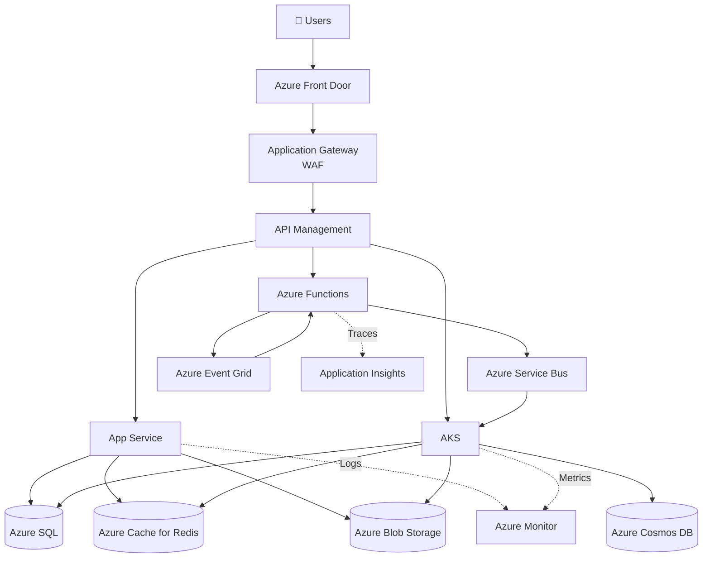

# Microsoft Azure Services

## 🌐 Networking

| Service | Purpose |
|----------|---------|
| Virtual Network (VNet) | Private network |
| Subnet | Network segmentation |
| NSG | Firewall rules |
| Azure Firewall | Managed firewall |
| Application Gateway | Layer 7 Load Balancer + WAF |
| Azure Load Balancer | Layer 4 Load Balancer |
| Azure Front Door | Global Load Balancer + CDN |
| Traffic Manager | DNS Load Balancing |
| VPN Gateway | Site-to-Site VPN |
| ExpressRoute | Dedicated private connection |
| Bastion | Secure VM access |
| Private Link | Private connectivity |
| Private Endpoint | Secure PaaS access |
| Azure DNS | DNS Hosting |
| NAT Gateway | Outbound Internet |

---

## 💻 Compute

| Service | Purpose |
|----------|---------|
| Virtual Machines | IaaS |
| Virtual Machine Scale Sets | Auto Scaling |
| Azure App Service | Web Apps |
| Azure Functions | Serverless |
| Azure Container Apps | Microservices |
| Azure Kubernetes Service (AKS) | Kubernetes |
| Azure Container Instances | Containers |
| Azure Batch | Batch Jobs |
| Azure Spring Apps | Spring Boot |

---

## 📦 Containers

| Service | Purpose |
|----------|---------|
| AKS | Kubernetes |
| Azure Container Registry | Docker Images |
| Container Apps | Serverless Containers |
| Container Instances | Lightweight Containers |

---

## 🗄 Storage

| Service | Purpose |
|----------|---------|
| Blob Storage | Images/Videos |
| Azure Files | Shared File System |
| Queue Storage | Simple Queue |
| Table Storage | NoSQL |
| Managed Disks | VM Storage |
| Data Lake Storage Gen2 | Analytics |

---

## 🗃 Databases

| Service | Purpose |
|----------|---------|
| Azure SQL Database | Relational DB |
| SQL Managed Instance | Managed SQL Server |
| Azure Database for PostgreSQL | PostgreSQL |
| Azure Database for MySQL | MySQL |
| Azure Cosmos DB | Global NoSQL |
| Azure Cache for Redis | Cache |

---

## 📩 Messaging

| Service | Purpose |
|----------|---------|
| Azure Service Bus | Enterprise Messaging |
| Azure Event Grid | Event Routing |
| Azure Event Hubs | Event Streaming |
| Azure Queue Storage | Simple Queue |
| Notification Hubs | Push Notifications |

---

## 🔄 Integration

| Service | Purpose |
|----------|---------|
| Logic Apps | Workflow Automation |
| Azure Data Factory | ETL |
| API Management | API Gateway |
| Functions | Event Processing |

---

## 🔐 Security

| Service | Purpose |
|----------|---------|
| Microsoft Entra ID (Azure AD) | Identity |
| Key Vault | Secrets |
| Managed Identity | Passwordless Authentication |
| Microsoft Defender for Cloud | Security Monitoring |
| Microsoft Sentinel | SIEM |
| Azure Policy | Governance |
| RBAC | Access Control |
| DDoS Protection | Network Protection |
| WAF | Web Firewall |

---

## 📊 Monitoring

| Service | Purpose |
|----------|---------|
| Azure Monitor | Monitoring |
| Application Insights | Application Performance Monitoring |
| Log Analytics | Centralized Logs |
| Azure Advisor | Recommendations |
| Service Health | Azure Service Status |

---

## ⚙ DevOps

| Service | Purpose |
|----------|---------|
| Azure DevOps | CI/CD |
| GitHub Actions | CI/CD |
| Azure Pipelines | Deployment |
| Azure Repos | Git |
| Azure Artifacts | Package Management |
| Azure Test Plans | Testing |

---

## 🤖 AI & Machine Learning

| Service | Purpose |
|----------|---------|
| Azure AI Foundry | Build AI Apps |
| Azure OpenAI | GPT Models |
| Azure AI Search | RAG Search |
| Azure AI Document Intelligence | OCR |
| Azure AI Vision | Computer Vision |
| Azure AI Speech | Speech Recognition |
| Azure AI Language | NLP |
| Azure Machine Learning | ML Platform |

---

## 📈 Analytics

| Service | Purpose |
|----------|---------|
| Azure Synapse Analytics | Data Warehouse |
| Microsoft Fabric | Unified Analytics |
| Azure Databricks | Big Data |
| HDInsight | Hadoop/Spark |
| Stream Analytics | Real-Time Analytics |
| Data Explorer | Log Analytics |

---

## 🌍 CDN & Edge

| Service | Purpose |
|----------|---------|
| Azure Front Door | CDN + Global LB |
| Azure CDN | Content Delivery |
| Azure Edge Zones | Edge Computing |

---

## 🏛 Architecture

| Service | Purpose |
|----------|---------|
| Availability Zones | High Availability |
| Availability Sets | VM Redundancy |
| Resource Groups | Resource Management |
| ARM Templates | IaC |
| Bicep | IaC |
| Terraform | IaC |

