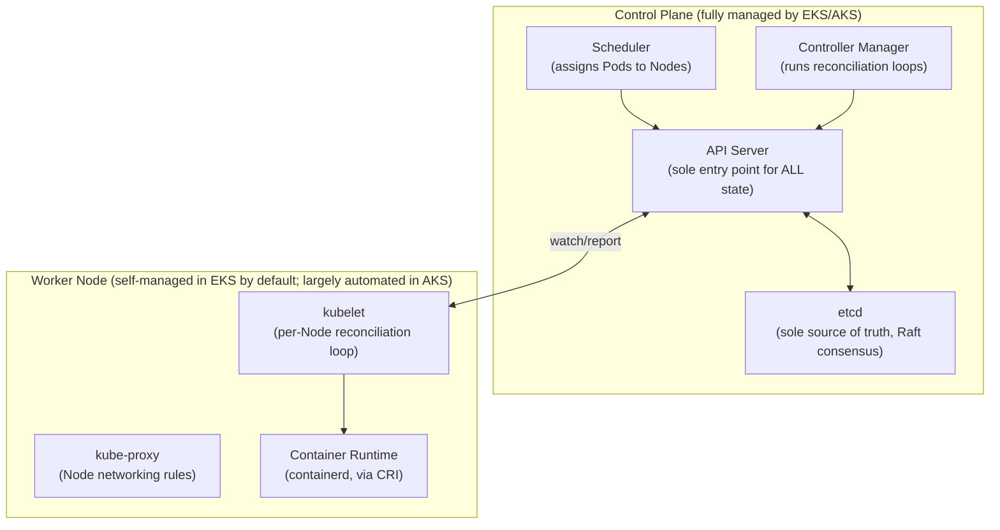
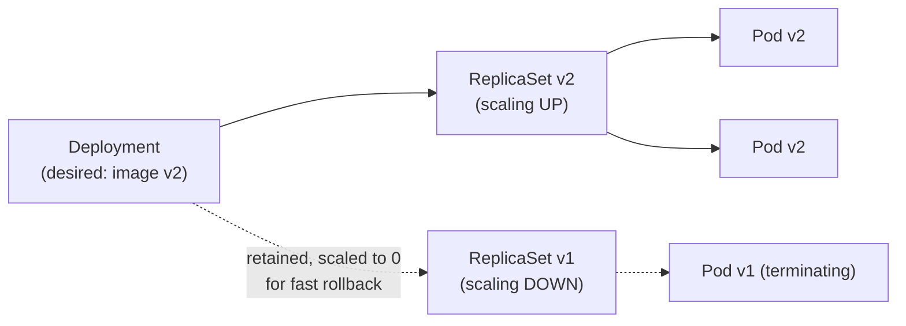

# Module 73 — Kubernetes: Architecture — Control Plane, Nodes, Pods, ReplicaSets & Deployments

> Domain: Kubernetes | Level: Beginner → Expert | Prerequisite: [[../21-AWS/07-Containers-Microservices-ECS-EKS-Fargate]] (EKS as a managed K8s control plane — this module goes one abstraction level deeper, into the CNCF-standard K8s objects/internals EKS manages on your behalf), [[../22-Azure/07-Containers-Microservices-AKS-ContainerApps-Dapr]] (AKS is the identical relationship on Azure); Kubernetes mirrors AWS/Azure's 8-module extra-depth scope, Modules 73–80 (Architecture, Networking, Storage, Config/Security, Scheduling/Autoscaling, Helm/Operators/CRDs, Service Mesh, Observability/Multi-cluster/GitOps capstone)

---

## 1. Fundamentals

### Why does a Principal Engineer need Kubernetes-internals depth when Modules 63 and 71 already covered EKS and AKS?
Modules 63 and 71 treated Kubernetes from the **managed-service integration** perspective — how EKS/AKS plug into their respective cloud's IAM, load balancers, and node-group tooling — but both modules deliberately stayed above the actual **Kubernetes API and control-plane internals**, since that layer is identical, CNCF-standard, open-source Kubernetes regardless of which cloud (or on-premises platform) manages it. A Principal Engineer who only knows "EKS/AKS is a managed Kubernetes service" without knowing what Kubernetes *itself* actually does underneath — the API objects, the control-plane components, the reconciliation-loop pattern that generalizes across nearly every K8s primitive — cannot design, debug, or reason about cluster behavior at the depth an architecture review or incident response regularly demands, and cannot transfer that knowledge to a non-EKS/AKS context (GKE, on-premises, a different managed provider) at all.

### Why does this matter?
Because "Kubernetes" as a technology is portable across every cloud (the entire point of the CNCF's standardization effort) — a Principal Engineer's actual, durable, transferable expertise should be in the Kubernetes API and control-plane model itself, with EKS/AKS/GKE differences (Modules 63/71's territory) understood as a comparatively thin, provider-specific integration layer on top of that shared foundation, not the reverse.

### When does this matter?
Continuously, for anyone operating or debugging a Kubernetes cluster of any kind (control-plane behavior determines nearly every observed symptom, from a Pod stuck in `Pending` to a rolling deployment's specific update sequencing) and specifically during incident response, capacity planning, and any architecture review that needs to reason about *why* the cluster is behaving a particular way, not just *that* it is.

### How does it work (30,000-ft view)?
```
Control Plane: API Server (the single entry point for ALL cluster state changes) + etcd
     (the cluster's ONLY source of truth, a distributed key-value store) + Scheduler
     (assigns Pods to Nodes) + Controller Manager (runs the reconciliation loops)
Worker Nodes: kubelet (per-node agent, talks to API Server, runs containers via the
     container runtime) + kube-proxy (Node-level networking rules) + container
     runtime (containerd, via CRI)
Core Objects: Pod (atomic deployable unit) -> ReplicaSet (maintains N replicas of a Pod
     template) -> Deployment (manages ReplicaSets, enables rolling updates/rollback)
The Reconciliation Loop: the SINGLE generalizing pattern underlying nearly every K8s
     controller -- observe actual state, compare against desired state, take action
     to converge -- repeat continuously, forever
```

---

## 2. Deep Dive

### 2.1 The API Server and etcd — the Only Two Components That Actually Matter for "What Is True"
The **API Server** is the sole entry point for every read and write of cluster state — `kubectl`, every controller, every kubelet, and any custom tooling all interact with the cluster exclusively through the API Server's REST API, never by talking to `etcd` or to each other directly. **etcd** is the cluster's only persistent source of truth — a distributed, strongly-consistent (Raft-based) key-value store holding the complete desired-state and observed-state representation of every object in the cluster. This centralization is the architectural property that makes Kubernetes's declarative model possible at all: because every component reads and writes through one consistent API surface backed by one consistent data store, a controller can safely assume the state it observes via the API Server is the authoritative state, without needing to reconcile conflicting views from multiple sources — directly the same "single source of truth, avoid split-brain" principle Module 47's consensus/consistency-models discussion established generally, now expressed as etcd's Raft consensus specifically underpinning the entire Kubernetes control plane.

### 2.2 The Reconciliation Loop — the Single Pattern Generalizing Nearly Everything in Kubernetes
Every Kubernetes controller (ReplicaSet controller, Deployment controller, and — as Module 78 will establish — every custom Operator) implements the identical structural pattern: **observe** the current actual state (via the API Server), **compare** it against the object's declared desired state (also stored via the API Server), and **act** to converge actual toward desired — then repeat, continuously and indefinitely, not just once at creation time. This is why Kubernetes is described as fundamentally **declarative** rather than **imperative**: an operator declares *what* should exist (3 replicas of this Pod template), and the reconciliation loop is the mechanism that continuously, automatically enforces that desired state against reality — including self-healing after unexpected changes (a Pod deleted manually, or killed by a Node failure, is automatically replaced, since the ReplicaSet controller's next reconciliation pass observes actual replica count &lt; desired replica count and acts to correct it) without any human or external system needing to detect and manually respond to the drift. A Principal Engineer's mental model for *any* unfamiliar Kubernetes behavior should start here: nearly every "unexpected" cluster behavior is some controller's reconciliation loop correctly enforcing a desired state that was configured differently than assumed, not a bug in the reconciliation mechanism itself.

### 2.3 Pods — the Atomic Deployable Unit, Not the Container
A **Pod** — not a container — is Kubernetes's atomic deployable and schedulable unit. A Pod wraps one or more containers that share a single network namespace (one IP address for the whole Pod, with containers within it addressing each other via `localhost`) and can share storage volumes — the "one or more containers" design specifically accommodates the **sidecar pattern** (Module 63 §2.4's App Mesh Envoy sidecar, Module 71 §2.3's Dapr sidecar — both are, mechanically, additional containers co-located within the same Pod as the main application container, sharing that Pod's network namespace, which is precisely *why* transparent traffic interception works for App Mesh and why Dapr's sidecar can be addressed via `localhost`). Pods are treated as fundamentally **ephemeral and disposable** — a Pod that fails is not restarted in place by default at the Pod level; instead, a higher-level controller (§2.4) creates an entirely new Pod to replace it, meaning any application state that must survive a Pod's replacement cannot be stored on the Pod's local, ephemeral filesystem (Module 75's Persistent Volumes exist specifically to address this).

### 2.4 ReplicaSets and Deployments — Layered Declarative Control, and Why You Almost Never Create a ReplicaSet Directly
A **ReplicaSet** is a controller (§2.2's reconciliation-loop pattern, applied) that ensures a specified number of identical Pod replicas are running at all times, using a Pod template to create replacements whenever the observed count falls below the desired count (a Node failure, a manually deleted Pod, a failed health check triggering a restart). A **Deployment** is a higher-level controller that manages ReplicaSets on your behalf, specifically to enable **rolling updates and rollback**: updating a Deployment's Pod template (a new container image version) causes the Deployment controller to create a *new* ReplicaSet with the updated template, incrementally scale it up while scaling the *old* ReplicaSet down (the rolling-update sequencing, tunable via `maxSurge`/`maxUnavailable`), and retain the old ReplicaSet (scaled to zero) specifically to enable a fast rollback to the previous Pod template if the new version proves faulty. This is why a Principal Engineer almost never creates a bare ReplicaSet directly in practice: a Deployment provides the identical replica-maintenance guarantee *plus* the update/rollback machinery, at no additional operational cost — using a bare ReplicaSet forfeits that update/rollback capability for no corresponding benefit, an unforced simplicity-vs-capability trade-off with no genuine upside.

### 2.5 Node Components — kubelet, kube-proxy, and the Container Runtime
Every worker Node runs three key components: the **kubelet** (the per-Node agent that watches the API Server for Pods scheduled to its Node, and is directly responsible for actually starting, stopping, and health-checking the containers within those Pods via the container runtime — the kubelet is, structurally, itself another reconciliation loop, per §2.2, now scoped to "the Pods assigned to this specific Node"); **kube-proxy** (maintains the Node-level networking rules — historically iptables-based, increasingly IPVS or eBPF-based on modern clusters — that implement Kubernetes Services' virtual-IP-to-Pod-IP routing, Module 74's subject); and the **container runtime** (containerd is the current de facto standard, communicating with the kubelet via the **Container Runtime Interface**, or CRI — Docker Engine itself is no longer used directly as the Kubernetes container runtime as of relatively recent Kubernetes versions, a detail worth knowing specifically because "Kubernetes runs on Docker" is an increasingly outdated, and now generally incorrect, mental model).

### 2.6 What EKS/AKS Actually Manage For You — Reconciling Modules 63/71 Against This Module's Internals
Module 63 (EKS) and Module 71 (AKS) established the managed-vs-self-managed boundary at a high level; this module's internals make that boundary concrete: EKS and AKS both fully manage the **control plane** (API Server, etcd, Scheduler, Controller Manager) — you never provision, patch, back up, or scale these components yourself, and typically don't even have direct network access to them. Worker **Nodes** (running kubelet, kube-proxy, the container runtime) are, by default, **your responsibility** to provision and patch in EKS (via managed or self-managed node groups) and largely automated but still visible/configurable in AKS (via node pools) — meaning "fully managed Kubernetes" is accurate specifically for the control plane, and only partially accurate (and provider-dependent in degree) for the worker-Node layer; Fargate-backed EKS Pods and AKS's node-pool auto-provisioning both push further toward abstracting Node management away entirely, but a Principal Engineer should verify, per specific cluster, exactly how much of the Node layer is genuinely hands-off versus still requiring explicit capacity/patching ownership, rather than assuming "managed Kubernetes" uniformly means zero Node-layer responsibility across every configuration.

---

## 3. Visual Architecture

### Control Plane and Node Components (§2.1, §2.5)


### Deployment → ReplicaSet → Pod, and Rolling Update Sequencing (§2.4)


## 4. Production Example
**Scenario**: A team migrating a service from EKS (Module 63) to a self-managed, on-premises Kubernetes cluster for a specific data-residency requirement encountered a Pod that remained stuck in `Pending` status indefinitely after deployment, with no error visible in the application's own logs (since the Pod's containers had never actually started). **Investigation**: the team's initial debugging instinct — checking the application's container logs via `kubectl logs` — returned nothing useful, since `kubectl logs` retrieves logs from a Pod's *running* containers, and this Pod had never reached the point of the kubelet starting any container at all; a team member with deeper control-plane familiarity instead ran `kubectl describe pod`, which surfaced the Scheduler's own event log directly: `0/12 nodes are available: 12 Insufficient memory` — the Scheduler (§2.1, §2.5) had been unable to find any Node with sufficient allocatable memory to satisfy the Pod's declared resource *request* (a concept this module's sibling, Module 77, covers in full — but even without that module's depth, the Scheduler's own event output directly named the actual constraint). **Root cause**: the on-premises cluster's Nodes were smaller (less total memory) than the EKS Node group instances the service had originally been sized against, and the Pod's resource request (copied verbatim from the EKS manifest) now exceeded every on-premises Node's allocatable capacity — the Pod was not crashing or misconfigured at the application layer at all; it had simply never been scheduled, a category of failure the team's EKS-trained debugging instincts (check application logs first) didn't initially anticipate, since EKS's larger default Node sizing had never previously exposed this specific failure mode. **Fix**: right-sized the Pod's resource request against the on-premises Nodes' actual allocatable capacity, and the Pod scheduled and started immediately once the constraint was resolved. **Lesson**: `Pending` status specifically indicates a **scheduling** failure (the Pod was never assigned to a Node at all) as distinct from a **runtime** failure (a Pod assigned to a Node whose container then crashed or errored) — these require different debugging entry points (`kubectl describe pod`'s Scheduler-event output for the former, `kubectl logs`/`kubectl describe pod`'s container-status section for the latter), and a Principal Engineer's Kubernetes debugging methodology must start by first identifying *which* of these two failure categories is actually occurring, rather than defaulting to application-log inspection regardless of the Pod's actual status.

## 5. Best Practices
- Always create Deployments, never bare ReplicaSets, to retain rolling-update and rollback capability at no additional operational cost (§2.4).
- Treat Pods as fundamentally ephemeral — never rely on a Pod's local filesystem for state that must survive Pod replacement (§2.3).
- When debugging an unfamiliar Kubernetes behavior, default to the reconciliation-loop mental model first — ask "what desired state is some controller correctly enforcing" before assuming a bug (§2.2).
- Distinguish `Pending` (scheduling failure — start with `kubectl describe pod`'s Scheduler events) from a runtime/crash failure (start with `kubectl logs` and the container-status section) as the first debugging branch point (§4).
- Explicitly verify, per specific managed-Kubernetes configuration, how much of the Node layer is genuinely hands-off versus still requiring capacity/patching ownership — don't assume uniform "fully managed" behavior across every EKS/AKS configuration (§2.6).

## 6. Anti-patterns
- Creating bare ReplicaSets directly instead of Deployments, forfeiting rolling-update/rollback capability for no corresponding benefit (§2.4).
- Storing application state on a Pod's local, ephemeral filesystem, assuming a Pod that fails will simply "restart" with that state intact (§2.3).
- Defaulting to application-log inspection as the first debugging step for every Pod issue, regardless of whether the Pod is actually `Pending` (a scheduling failure, not a runtime one) (§4).
- Assuming "Kubernetes runs on Docker" — the container runtime is CRI-based (containerd, in current practice), and Docker Engine itself is not the underlying runtime on modern clusters (§2.5).
- Copying resource requests/limits verbatim across clusters with materially different Node sizing (e.g., an EKS-to-on-premises migration) without re-validating them against the new cluster's actual allocatable capacity (§4).

---

## 10. Interview Questions

### Basic (10)
1. **Q: What is the atomic deployable unit in Kubernetes?** **A:** The Pod, not the container — a Pod wraps one or more containers sharing a network namespace and (optionally) storage volumes.
2. **Q: What is the sole entry point for all Kubernetes cluster state changes?** **A:** The API Server — every component, including kubelet and every controller, interacts with cluster state exclusively through it.
3. **Q: What is etcd?** **A:** The cluster's sole persistent source of truth — a distributed, Raft-based key-value store holding the complete cluster state.
4. **Q: What is the difference between a ReplicaSet and a Deployment?** **A:** A ReplicaSet maintains a specified number of Pod replicas; a Deployment manages ReplicaSets on top of that, adding rolling-update and rollback capability.
5. **Q: What does the reconciliation loop pattern do, at a high level?** **A:** Continuously observes actual state, compares it against declared desired state, and takes action to converge actual toward desired — repeating indefinitely, not just once.
6. **Q: What does the kubelet do?** **A:** The per-Node agent that watches the API Server for Pods scheduled to its Node and starts/stops/health-checks their containers via the container runtime.
7. **Q: What does kube-proxy do?** **A:** Maintains Node-level networking rules implementing Kubernetes Services' virtual-IP-to-Pod-IP routing.
8. **Q: What does `Pending` Pod status indicate?** **A:** A scheduling failure — the Pod has not yet been assigned to any Node, as distinct from a runtime/crash failure on an already-scheduled Pod.
9. **Q: What container runtime interface does the kubelet use to communicate with the container runtime?** **A:** CRI (Container Runtime Interface) — containerd is the current de facto standard runtime.
10. **Q: What do EKS and AKS both fully manage on your behalf, regardless of Node-layer configuration?** **A:** The control plane — API Server, etcd, Scheduler, and Controller Manager.

### Intermediate (10)
1. **Q: Why is a Pod, not a container, described as Kubernetes's atomic unit?** **A:** Because Kubernetes schedules, networks, and manages the lifecycle of Pods as the smallest unit — a Pod can contain multiple containers sharing one network namespace, and Kubernetes has no mechanism for independently scheduling a single container outside a Pod context.
2. **Q: Why does the sidecar pattern (App Mesh's Envoy, Module 63 §2.4; Dapr, Module 71 §2.3) mechanically depend on Pods' shared-network-namespace design?** **A:** A sidecar container works by sharing the same network namespace (and thus the same `localhost`) as the main application container within one Pod — this is precisely what allows transparent traffic interception (App Mesh) or `localhost`-addressable API calls (Dapr) to function.
3. **Q: Why do teams almost never create bare ReplicaSets directly?** **A:** A Deployment provides the identical replica-maintenance guarantee a ReplicaSet does, plus rolling-update and rollback machinery, at no additional operational cost — using a bare ReplicaSet forfeits that capability for no corresponding benefit.
4. **Q: Why is the reconciliation-loop pattern described as "the single pattern generalizing nearly everything in Kubernetes"?** **A:** Every core controller (ReplicaSet, Deployment) and every custom Operator (Module 78) implements the identical observe-compare-act-repeat structure — understanding this one pattern explains the mechanism behind nearly every controller's behavior, rather than needing to learn each controller's internals independently.
5. **Q: Why couldn't the §4 incident be diagnosed via `kubectl logs`?** **A:** `kubectl logs` retrieves logs from a Pod's already-running containers; a Pod stuck in `Pending` has never been scheduled to a Node, so the kubelet has never started any container for it, meaning there are no container logs to retrieve at all.
6. **Q: Why is "Kubernetes runs on Docker" described as an outdated and generally incorrect mental model?** **A:** Modern Kubernetes clusters use a CRI-compliant container runtime (containerd is the current standard) — Docker Engine itself is not the underlying runtime the kubelet directly invokes on current clusters.
7. **Q: Why does centralizing all cluster access through the API Server simplify Kubernetes's security model, per §8?** **A:** Because every component (kubelet, every controller) interacts with cluster state exclusively through the API Server, securing authentication/authorization at that single component is sufficient to govern access to the entire cluster's state, rather than requiring independently-secured access control at multiple separate components.
8. **Q: Why is "fully managed Kubernetes" (EKS/AKS) accurate for the control plane but only partially and provider-dependently accurate for the Node layer?** **A:** Both fully manage API Server/etcd/Scheduler/Controller Manager, but worker Node provisioning and patching is, by default, the customer's responsibility in EKS (via node groups) and only partially automated in AKS (via node pools) — Fargate/further automation can reduce this, but it's not uniformly zero-responsibility across every configuration.
9. **Q: Why did the §4 team's EKS-trained debugging instinct (check application logs first) fail to anticipate the actual failure mode on the on-premises cluster?** **A:** EKS's larger default Node sizing had never previously caused a resource-request-exceeds-allocatable-capacity scheduling failure for that service, so the team had no prior experience with `Pending`-due-to-insufficient-memory as a failure category to check for first.
10. **Q: Why is etcd's Raft-based consensus described as the concrete implementation of Module 47's general "single source of truth" consistency principle?** **A:** etcd's strong consistency guarantee (via Raft) ensures every component reading cluster state through the API Server observes the same, non-conflicting view of that state — directly the property Module 47 established as necessary to avoid split-brain-style inconsistency in a distributed system.

### Advanced (10)
1. **Q: Diagnose the §4 incident from first principles, and design the specific pre-migration validation step that would have caught the resource-request mismatch before it caused a production deployment failure.**
   **A:** Root cause: the Pod's resource *request* (copied verbatim from the EKS manifest, sized against EKS's larger default Node instances) exceeded every Node's allocatable capacity on the smaller on-premises cluster, causing the Scheduler to have no eligible placement target — the failure manifested as `Pending`, not a runtime error, because the Pod was never scheduled at all. Structural fix: any infrastructure migration that changes underlying Node sizing (cloud-to-on-premises, or between differently-sized managed clusters) should include an explicit pre-migration validation step comparing every workload's declared resource requests/limits against the *target* cluster's actual per-Node allocatable capacity (`kubectl describe node`'s allocatable section) — treating resource requests as environment-specific configuration requiring re-validation on migration, not portable, copy-paste-safe values.
2. **Q: A team argues that since the reconciliation loop automatically self-heals a manually deleted Pod (the ReplicaSet controller creates a replacement), manual `kubectl delete pod` is therefore a safe, harmless way to "restart" a misbehaving Pod in production at any time. Evaluate this claim.**
   **A:** Partially true but incomplete — the reconciliation loop does reliably replace the deleted Pod, but the claim ignores what happens *during* the gap: any in-flight requests to that specific Pod are dropped (unless the client has its own retry logic), and if the Pod being deleted is the *last* healthy replica of a service with insufficient replica count or an aggressive Pod Disruption Budget violation, the manual deletion can cause a brief, real availability gap before the replacement Pod becomes ready — "the reconciliation loop will fix it" is true about eventual consistency but doesn't address the transient window, meaning manual Pod deletion as a restart mechanism should still account for genuine replica-count/readiness-gate safety, not be treated as a costless operation purely because self-healing is guaranteed.
3. **Q: Design the specific architecture-level Well-Architected-style question a Principal Engineer should ask when evaluating whether a workload's data-residency requirement (like §4's on-premises migration) genuinely necessitates leaving a managed Kubernetes offering (EKS/AKS), versus a lesser change that would satisfy the same requirement.**
   **A:** Explicitly separate "does this requirement demand a different Node/data location" from "does this requirement demand a different control-plane management model" — many data-residency requirements are satisfiable by choosing a specific EKS/AKS Region/deployment satisfying the residency constraint (§2.6's control-plane-vs-Node-layer distinction made concrete: the *data* residency concern is about where workloads and their data physically run, which EKS/AKS Node placement can usually satisfy directly, not necessarily about who manages the control plane) — a full migration off managed Kubernetes entirely (forfeiting EKS/AKS's control-plane management, as §4's team did) should be reserved for genuine additional constraints (a hard requirement that no cloud-provider-operated control plane touch the data at all, or a specific on-premises-only compliance mandate) that a Region/deployment-location choice alone cannot satisfy.
4. **Q: Explain why a Deployment's rolling-update `maxSurge`/`maxUnavailable` configuration represents the same cost-vs-availability trade-off category this course has established repeatedly (Module 64 §2.5's DR-strategy spectrum, Module 61's Lambda provisioned-concurrency trade-off), now expressed at the rolling-update-sequencing layer.**
   **A:** `maxSurge` (how many extra Pods above desired replica count can be created during the update) trades additional resource consumption for faster rollout and zero capacity dip during the transition; `maxUnavailable` (how many existing Pods can be taken down before their replacements are ready) trades a temporary capacity/availability reduction for a faster, lower-resource-overhead rollout — a Principal Engineer should tune both explicitly against the specific workload's actual availability requirements and resource headroom, rather than accepting Kubernetes's defaults (25% for each) uniformly across every Deployment regardless of that workload's actual criticality, directly this course's recurring "explicitly compute your actual requirement, don't assume a default is adequate" theme.
5. **Q: A Principal Engineer observes that a custom controller (relevant to Module 78) is issuing an unusually high volume of API Server requests, and cluster-wide API latency has degraded for all workloads, not just the ones the controller manages. Diagnose the likely cause and the fix, applying §2.1/§7's control-plane-capacity reasoning.**
   **A:** Because the API Server is the single, shared entry point for the entire cluster's state (§2.1), a single poorly-behaved controller issuing excessive requests (e.g., polling instead of using the API's `watch` mechanism, or reconciling far more frequently than its actual desired-state-change rate warrants) consumes API Server capacity that is *shared* across every other workload's cluster interactions — meaning one controller's inefficiency can degrade the entire cluster's control-plane responsiveness, not just its own domain, directly the same "shared, capacity-planned resource" lesson from §7 recurring here; the fix is auditing and correcting the specific controller's request pattern (switching to `watch`-based informers rather than polling, adding appropriate reconciliation-rate limiting) rather than treating it as an isolated, contained problem specific only to that controller's own managed resources.
6. **Q: Critique the following claim: "Since our Deployment retains the old ReplicaSet scaled to zero after a rolling update, rollback is instantaneous and risk-free, so we don't need a separate pre-production validation stage for new image versions."**
   **A:** Overstated in two ways — first, "instantaneous" understates rollback's actual mechanics: scaling the old ReplicaSet back up still requires the kubelet to (re-)start those Pods' containers, which is not literally instantaneous, particularly if those Pods had been fully terminated (not merely scaled to zero but garbage-collected after a retention window) or if container images have been evicted from Node-local caches; second, and more importantly, rollback addresses *recovering* from a bad deployment, not *preventing* one — a genuinely broken new image version can still cause real customer-facing impact during the window between rollout and rollback detection, meaning rollback capability is a valuable safety net but doesn't substitute for pre-production validation (testing, canary/progressive-rollout strategies) that would catch the issue before it ever reaches a meaningful fraction of production traffic.
7. **Q: Why does this module characterize the reconciliation loop as making Kubernetes fundamentally different from an imperative "run this script to deploy" deployment model, and what practical implication does that have for infrastructure-as-code tooling built on top of Kubernetes?**
   **A:** An imperative deploy script executes once and has no ongoing relationship to the state it created — if that state later drifts (a Pod manually deleted, a Node fails), nothing automatically corrects it. Kubernetes's declarative, continuously-reconciled model means the *desired state itself*, once submitted to the API Server, is durably, continuously enforced without any external re-execution — the practical implication for IaC tooling (Helm, Module 78) is that such tooling's job is to correctly *express and update the declared desired state*, not to imperatively orchestrate the actual convergence process step-by-step, since Kubernetes's own control plane already owns that convergence responsibility.
8. **Q: A team is debugging a Pod that is `Running` but not receiving any traffic from its Service. Given this module's `Pending`-vs-runtime-failure distinction, where should the team look first, and why is this a genuinely different debugging category from either?**
   **A:** This is a third, distinct failure category from both this module's coverage: `Pending` (never scheduled) and a container crash (a runtime failure visible via `kubectl logs`/container status) both concern the Pod's own lifecycle; "Running but not receiving traffic" concerns the **Service/networking layer** (Module 74's subject) — specifically whether the Pod's labels actually match the Service's selector, and whether the Pod is passing its readiness probe (a Pod that's `Running` but not yet `Ready` is deliberately excluded from a Service's routable endpoints) — the team should check `kubectl get endpoints` for the Service (confirming whether the Pod's IP is actually registered as a routable endpoint at all) before assuming a networking-layer bug, since a missing-endpoint result usually traces back to a label-selector mismatch or a failing readiness probe, not a genuine networking fault.
9. **Q: Design the specific set of `kubectl` commands and their purpose that constitute a systematic, layer-by-layer debugging methodology for "my Pod isn't working," synthesizing this module's Pending-vs-runtime distinction and Advanced Q8's Service-layer distinction.**
   **A:** (1) `kubectl get pods` — confirm actual Pod status (`Pending`/`Running`/`CrashLoopBackOff`/etc.) as the first branch point. (2) If `Pending`: `kubectl describe pod` — read the Scheduler's own event log for the specific unschedulability reason (insufficient resources, per §4; a taint/toleration mismatch, relevant to Module 77; an affinity rule that can't be satisfied). (3) If `Running` but the *application* is misbehaving: `kubectl logs` (and `kubectl logs --previous` if the container has restarted) for application-level errors, plus `kubectl describe pod`'s container-status/restart-count section for crash-loop diagnosis. (4) If the Pod itself looks healthy but isn't receiving expected traffic: `kubectl get endpoints` for the relevant Service (Advanced Q8) to confirm the Pod is actually a registered, ready endpoint, then verify the Service's `selector` against the Pod's actual `labels` for a mismatch. This layered sequence — scheduling, then runtime/application, then networking/readiness — mirrors the general "narrow the failure to the specific layer before assuming a cause" debugging discipline this entire course has applied domain by domain.
10. **As a Principal Engineer establishing a Kubernetes onboarding standard for engineers whose prior experience is exclusively with EKS or AKS at the Module 63/71 level (managed-service integration, not K8s internals), design the specific curriculum gap this module's content is meant to close, and why it matters beyond pure trivia.**
    **A:** Engineers with only Module 63/71-level exposure can operate an existing EKS/AKS cluster's application layer (deploy manifests, read `kubectl logs`) but typically lack the control-plane/reconciliation-loop mental model needed to diagnose genuinely novel failures (§4's `Pending`-due-to-scheduling incident is a direct example — an EKS-only debugging instinct defaulted to application-log inspection and would not have found the actual cause without control-plane-level `kubectl describe pod` fluency) or to reason about portability to a non-EKS/AKS context at all. The curriculum gap this module closes is specifically: the API Server/etcd/reconciliation-loop model (§2.1–§2.2) as the *transferable*, cloud-agnostic foundation; the Pod-not-container atomic-unit distinction (§2.3) that explains sidecar-pattern mechanics referenced but not fully explained in Modules 63/71; and the Deployment/ReplicaSet layering (§2.4) that clarifies *why* Kubernetes's update/rollback model works the way it does, rather than treating it as an opaque `kubectl apply` behavior. This matters beyond trivia because it's precisely the depth that separates "can operate a pre-built EKS/AKS cluster via documented runbooks" from "can diagnose a genuinely novel failure, design a new cluster's architecture, or transfer this expertise to any Kubernetes context regardless of which cloud (or no cloud) is managing it" — the actual Principal-Engineer-level bar this domain is building toward across Modules 73–80.

---

## 11. Coding Exercises

### Easy — A Deployment manifest with explicitly-tuned rolling-update parameters (§2.4, §Advanced Q4)
```yaml
apiVersion: apps/v1
kind: Deployment
metadata:
  name: checkout-api
spec:
  replicas: 6
  strategy:
    type: RollingUpdate
    rollingUpdate:
      # Explicitly computed against checkout's actual availability requirement (§Advanced Q4),
      # NOT the 25%/25% Kubernetes default applied uniformly regardless of criticality.
      maxSurge: 2
      maxUnavailable: 0   # zero capacity dip permitted during rollout for this critical service
  selector:
    matchLabels: { app: checkout-api }
  template:
    metadata:
      labels: { app: checkout-api }
    spec:
      containers:
        - name: checkout-api
          image: registry.example.com/checkout-api:v2.4.1
          resources:
            requests: { memory: "256Mi", cpu: "250m" }
            limits: { memory: "512Mi", cpu: "500m" }
```

### Medium — Diagnosing a `Pending` Pod via the Scheduler's own event log (§4)
```bash
# Step 1 -- confirm status (§Advanced Q9's layer-by-layer methodology, step 1)
kubectl get pods checkout-api-7d9f8b6c-x2k4p
# NAME                            READY   STATUS    RESTARTS   AGE
# checkout-api-7d9f8b6c-x2k4p     0/1     Pending   0          4m

# Step 2 -- Pending => read the Scheduler's event log directly, NOT kubectl logs (§4's lesson)
kubectl describe pod checkout-api-7d9f8b6c-x2k4p
# Events:
#   Type     Reason            Message
#   ----     ------            -------
#   Warning  FailedScheduling  0/12 nodes are available: 12 Insufficient memory.

# Step 3 -- confirm the actual constraint against real Node capacity before assuming a fix
kubectl describe nodes | grep -A 5 "Allocatable"
```

### Hard — A minimal custom controller expressing the reconciliation-loop pattern directly (§2.2)
```csharp
public class SimpleReconciler
{
    private readonly IKubernetesClient _client;

    // The generalized pattern EVERY Kubernetes controller implements (§2.2) --
    // observe, compare, act, repeat -- shown explicitly rather than hidden inside
    // a framework, to make the underlying mechanism concrete.
    public async Task ReconcileLoopAsync(CancellationToken ct)
    {
        while (!ct.IsCancellationRequested)
        {
            var desired = await _client.GetDesiredStateAsync("checkout-config");
            var actual = await _client.GetActualStateAsync("checkout-config");

            if (!StatesMatch(desired, actual))
            {
                await ConvergeAsync(desired, actual);   // take action toward desired state
            }

            await Task.Delay(TimeSpan.FromSeconds(10), ct);   // repeat, indefinitely (§2.2)
        }
    }

    private bool StatesMatch(DesiredState d, ActualState a) => d.Replicas == a.ReadyReplicas;

    private Task ConvergeAsync(DesiredState d, ActualState a) =>
        d.Replicas > a.ReadyReplicas
            ? _client.ScaleUpAsync("checkout-config", d.Replicas - a.ReadyReplicas)
            : _client.ScaleDownAsync("checkout-config", a.ReadyReplicas - d.Replicas);
}
```

### Expert — Pod Disruption Budget guarding against Advanced Q2's manual-deletion availability gap (§Advanced Q2)
```yaml
apiVersion: policy/v1
kind: PodDisruptionBudget
metadata:
  name: checkout-api-pdb
spec:
  # Guards specifically against the transient availability gap Advanced Q2 identified --
  # even though the ReplicaSet controller WILL eventually replace any deleted Pod,
  # this PDB prevents voluntary disruptions (manual deletion, Node drain) from taking
  # down more than what checkout's actual availability tolerance permits AT ONCE.
  minAvailable: 5   # out of 6 total replicas -- at most 1 voluntarily disrupted at a time
  selector:
    matchLabels: { app: checkout-api }
```
**Discussion**: a Pod Disruption Budget doesn't prevent *involuntary* disruption (a Node hardware failure) — only *voluntary* disruptions the cluster itself initiates or permits (manual `kubectl delete`, a Node drain during maintenance) are blocked from violating `minAvailable` — directly operationalizing Advanced Q2's finding that "the reconciliation loop guarantees eventual replacement" is a true but incomplete statement about safety, by adding an explicit, enforced floor on how much capacity can be voluntarily removed at once, independent of how quickly the replacement Pod becomes ready.

---

## 12–17. System Design / LLD / Debugging / Decision / Case Study / Principal

*(§4's incident, the four §11 exercises, and the Advanced-tier Q&A — especially Advanced Q1's pre-migration validation design, Advanced Q5's shared-API-Server-capacity diagnosis, and Advanced Q9's synthesized layer-by-layer debugging methodology — collectively constitute this module's system-design, debugging, and Principal-Engineer-level content.)*

## 18. Revision
**Key takeaways**: Kubernetes's entire architecture rests on two structurally simple ideas applied with extreme consistency: a single, centralized source of truth (the API Server backed by etcd, §2.1) that every component reads/writes through exclusively, and a continuously-running reconciliation loop (§2.2) — observe, compare, converge, repeat — that generalizes across nearly every controller in the system, from the built-in ReplicaSet/Deployment controllers to any custom Operator (Module 78). The Pod, not the container, is Kubernetes's atomic unit (§2.3), and its shared-network-namespace design is precisely what makes the sidecar pattern (App Mesh, Dapr) mechanically possible. Deployments layer rolling-update/rollback capability on top of ReplicaSets' replica-maintenance guarantee at no added cost, making bare ReplicaSets a needless forfeiture in almost every case (§2.4). The §4 incident's central lesson — `Pending` status signals a scheduling failure requiring `kubectl describe pod`'s Scheduler-event output, categorically different from a runtime/crash failure requiring `kubectl logs` — establishes the layer-by-layer debugging discipline (scheduling → runtime/application → networking/readiness, Advanced Q9) this domain will keep building on through Modules 74–80. EKS/AKS (Modules 63/71) fully manage the control plane this module describes, but Node-layer responsibility varies by provider and configuration (§2.6) — "managed Kubernetes" is not a uniform, all-or-nothing guarantee.

---

**Next**: Module 74 — Kubernetes: Networking — Services, Ingress, CNI, DNS & Network Policies, continuing the `23-Kubernetes` domain (Modules 73–80).
