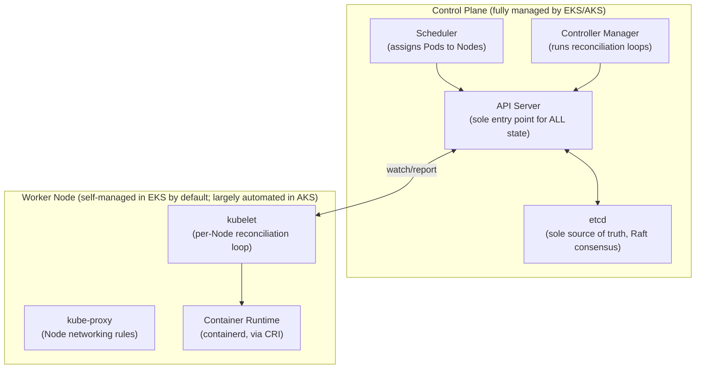
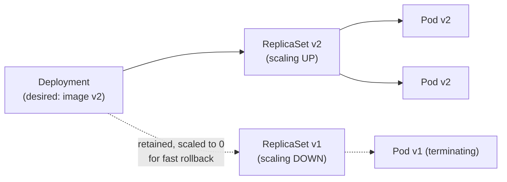
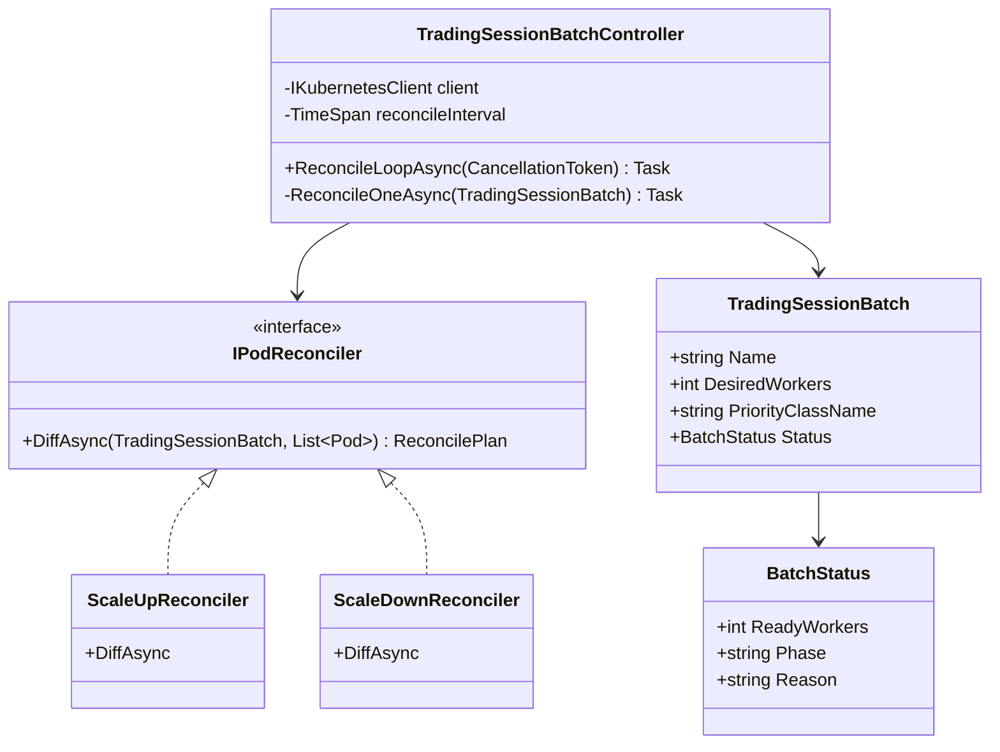
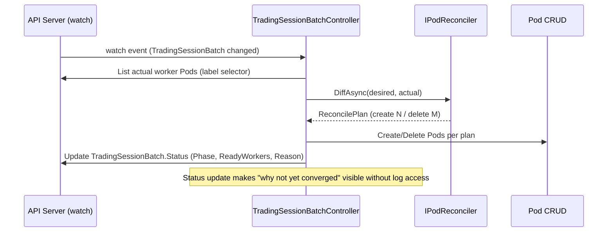

# Module 73 — Kubernetes: Architecture — Control Plane, Nodes, Pods, ReplicaSets & Deployments

> Domain: Kubernetes | Level: Beginner → Expert | Prerequisite: [[../21-AWS/07-Containers-Microservices-ECS-EKS-Fargate]] (EKS as a managed K8s control plane — this module goes one abstraction level deeper, into the CNCF-standard K8s objects/internals EKS manages on your behalf), [[../22-Azure/07-Containers-Microservices-AKS-ContainerApps-Dapr]] (AKS is the identical relationship on Azure); Kubernetes mirrors AWS/Azure's 8-module extra-depth scope, Modules 73–80 (Architecture, Networking, Storage, Config/Security, Scheduling/Autoscaling, Helm/Operators/CRDs, Service Mesh, Observability/Multi-cluster/GitOps capstone)

---

## 1. Fundamentals

### Why does a Principal Engineer need Kubernetes-internals depth when Modules 63 and 71 already covered EKS and AKS?
Modules 63 and 71 treated Kubernetes from the **managed-service integration** perspective — how EKS/AKS plug into their respective cloud's IAM, load balancers, and node-group tooling — but both modules deliberately stayed above the actual **Kubernetes API and control-plane internals**, since that layer is identical, CNCF-standard, open-source Kubernetes regardless of which cloud (or on-premises platform) manages it. A Principal Engineer who only knows "EKS/AKS is a managed Kubernetes service" without knowing what Kubernetes *itself* actually does underneath — the API objects, the control-plane components, the reconciliation-loop pattern that generalizes across nearly every K8s primitive — cannot design, debug, or reason about cluster behavior at the depth an architecture review or incident response regularly demands, and cannot transfer that knowledge to a non-EKS/AKS context (GKE, on-premises, a different managed provider) at all.

### Why does this matter?
Because "Kubernetes" as a technology is portable across every cloud (the entire point of the CNCF's standardization effort) — a Principal Engineer's actual, durable, transferable expertise should be in the Kubernetes API and control-plane model itself, with EKS/AKS/GKE differences (Modules 63/71's territory) understood as a comparatively thin, provider-specific integration layer on top of that shared foundation, not the reverse.

### When does this matter?
Continuously, for anyone operating or debugging a Kubernetes cluster of any kind (control-plane behavior determines nearly every observed symptom, from a Pod stuck in `Pending` to a rolling deployment's specific update sequencing) and specifically during incident response, capacity planning, and any architecture review that needs to reason about *why* the cluster is behaving a particular way, not just *that* it is.

### How does it work (30,000-ft view)?
```
Control Plane: API Server (the single entry point for ALL cluster state changes) + etcd
 (the cluster's ONLY source of truth, a distributed key-value store) + Scheduler
 (assigns Pods to Nodes) + Controller Manager (runs the reconciliation loops)
Worker Nodes: kubelet (per-node agent, talks to API Server, runs containers via the
 container runtime) + kube-proxy (Node-level networking rules) + container
 runtime (containerd, via CRI)
Core Objects: Pod (atomic deployable unit) -> ReplicaSet (maintains N replicas of a Pod
 template) -> Deployment (manages ReplicaSets, enables rolling updates/rollback)
The Reconciliation Loop: the SINGLE generalizing pattern underlying nearly every K8s
 controller -- observe actual state, compare against desired state, take action
 to converge -- repeat continuously, forever
```

---

## 2. Deep Dive

### 2.1 The API Server and etcd — the Only Two Components That Actually Matter for "What Is True"
The **API Server** is the sole entry point for every read and write of cluster state — `kubectl`, every controller, every kubelet, and any custom tooling all interact with the cluster exclusively through the API Server's REST API, never by talking to `etcd` or to each other directly. **etcd** is the cluster's only persistent source of truth — a distributed, strongly-consistent (Raft-based) key-value store holding the complete desired-state and observed-state representation of every object in the cluster. This centralization is the architectural property that makes Kubernetes's declarative model possible at all: because every component reads and writes through one consistent API surface backed by one consistent data store, a controller can safely assume the state it observes via the API Server is the authoritative state, without needing to reconcile conflicting views from multiple sources — directly the same "single source of truth, avoid split-brain" principle the consensus/consistency-models discussion established generally, now expressed as etcd's Raft consensus specifically underpinning the entire Kubernetes control plane.

### 2.2 The Reconciliation Loop — the Single Pattern Generalizing Nearly Everything in Kubernetes
Every Kubernetes controller (ReplicaSet controller, Deployment controller, and — as will establish — every custom Operator) implements the identical structural pattern: **observe** the current actual state (via the API Server), **compare** it against the object's declared desired state (also stored via the API Server), and **act** to converge actual toward desired — then repeat, continuously and indefinitely, not just once at creation time. This is why Kubernetes is described as fundamentally **declarative** rather than **imperative**: an operator declares *what* should exist (3 replicas of this Pod template), and the reconciliation loop is the mechanism that continuously, automatically enforces that desired state against reality — including self-healing after unexpected changes (a Pod deleted manually, or killed by a Node failure, is automatically replaced, since the ReplicaSet controller's next reconciliation pass observes actual replica count &lt; desired replica count and acts to correct it) without any human or external system needing to detect and manually respond to the drift. A Principal Engineer's mental model for *any* unfamiliar Kubernetes behavior should start here: nearly every "unexpected" cluster behavior is some controller's reconciliation loop correctly enforcing a desired state that was configured differently than assumed, not a bug in the reconciliation mechanism itself.

### 2.3 Pods — the Atomic Deployable Unit, Not the Container
A **Pod** — not a container — is Kubernetes's atomic deployable and schedulable unit. A Pod wraps one or more containers that share a single network namespace (one IP address for the whole Pod, with containers within it addressing each other via `localhost`) and can share storage volumes — the "one or more containers" design specifically accommodates the **sidecar pattern** (the App Mesh Envoy sidecar, the Dapr sidecar — both are, mechanically, additional containers co-located within the same Pod as the main application container, sharing that Pod's network namespace, which is precisely *why* transparent traffic interception works for App Mesh and why Dapr's sidecar can be addressed via `localhost`). Pods are treated as fundamentally **ephemeral and disposable** — a Pod that fails is not restarted in place by default at the Pod level; instead, a higher-level controller creates an entirely new Pod to replace it, meaning any application state that must survive a Pod's replacement cannot be stored on the Pod's local, ephemeral filesystem (the Persistent Volumes exist specifically to address this).

### 2.4 ReplicaSets and Deployments — Layered Declarative Control, and Why You Almost Never Create a ReplicaSet Directly
A **ReplicaSet** is a controller (the reconciliation-loop pattern, applied) that ensures a specified number of identical Pod replicas are running at all times, using a Pod template to create replacements whenever the observed count falls below the desired count (a Node failure, a manually deleted Pod, a failed health check triggering a restart). A **Deployment** is a higher-level controller that manages ReplicaSets on your behalf, specifically to enable **rolling updates and rollback**: updating a Deployment's Pod template (a new container image version) causes the Deployment controller to create a *new* ReplicaSet with the updated template, incrementally scale it up while scaling the *old* ReplicaSet down (the rolling-update sequencing, tunable via `maxSurge`/`maxUnavailable`), and retain the old ReplicaSet (scaled to zero) specifically to enable a fast rollback to the previous Pod template if the new version proves faulty. This is why a Principal Engineer almost never creates a bare ReplicaSet directly in practice: a Deployment provides the identical replica-maintenance guarantee *plus* the update/rollback machinery, at no additional operational cost — using a bare ReplicaSet forfeits that update/rollback capability for no corresponding benefit, an unforced simplicity-vs-capability trade-off with no genuine upside.

### 2.5 Node Components — kubelet, kube-proxy, and the Container Runtime
Every worker Node runs three key components: the **kubelet** (the per-Node agent that watches the API Server for Pods scheduled to its Node, and is directly responsible for actually starting, stopping, and health-checking the containers within those Pods via the container runtime — the kubelet is, structurally, itself another reconciliation loop, now scoped to "the Pods assigned to this specific Node"); **kube-proxy** (maintains the Node-level networking rules — historically iptables-based, increasingly IPVS or eBPF-based on modern clusters — that implement Kubernetes Services' virtual-IP-to-Pod-IP routing, the subject); and the **container runtime** (containerd is the current de facto standard, communicating with the kubelet via the **Container Runtime Interface**, or CRI — Docker Engine itself is no longer used directly as the Kubernetes container runtime as of relatively recent Kubernetes versions, a detail worth knowing specifically because "Kubernetes runs on Docker" is an increasingly outdated, and now generally incorrect, mental model).

### 2.6 What EKS/AKS Actually Manage For You — Reconciling Modules 63/71 Against This Module's Internals
 (EKS) and (AKS) established the managed-vs-self-managed boundary at a high level; this module's internals make that boundary concrete: EKS and AKS both fully manage the **control plane** (API Server, etcd, Scheduler, Controller Manager) — you never provision, patch, back up, or scale these components yourself, and typically don't even have direct network access to them. Worker **Nodes** (running kubelet, kube-proxy, the container runtime) are, by default, **your responsibility** to provision and patch in EKS (via managed or self-managed node groups) and largely automated but still visible/configurable in AKS (via node pools) — meaning "fully managed Kubernetes" is accurate specifically for the control plane, and only partially accurate (and provider-dependent in degree) for the worker-Node layer; Fargate-backed EKS Pods and AKS's node-pool auto-provisioning both push further toward abstracting Node management away entirely, but a Principal Engineer should verify, per specific cluster, exactly how much of the Node layer is genuinely hands-off versus still requiring explicit capacity/patching ownership, rather than assuming "managed Kubernetes" uniformly means zero Node-layer responsibility across every configuration.

---

## 3. Visual Architecture

### Control Plane and Node Components

```mermaid
graph TB
 subgraph "Control Plane (fully managed by EKS/AKS)"
 API["API Server<br/>(sole entry point for ALL state)"]
 ETCD["etcd<br/>(sole source of truth, Raft consensus)"]
 SCHED["Scheduler<br/>(assigns Pods to Nodes)"]
 CM["Controller Manager<br/>(runs reconciliation loops)"]
 API <--> ETCD
 SCHED --> API
 CM --> API
 end
 subgraph "Worker Node (self-managed in EKS by default; largely automated in AKS)"
 KUBELET["kubelet<br/>(per-Node reconciliation loop)"]
 PROXY["kube-proxy<br/>(Node networking rules)"]
 RUNTIME["Container Runtime<br/>(containerd, via CRI)"]
 KUBELET --> RUNTIME
 end
 API <-->|"watch/report"| KUBELET
```

### Deployment → ReplicaSet → Pod, and Rolling Update Sequencing

```mermaid
graph LR
 D["Deployment<br/>(desired: image v2)"] --> RSnew["ReplicaSet v2<br/>(scaling UP)"]
 D -.->|"retained, scaled to 0<br/>for fast rollback"| RSold["ReplicaSet v1<br/>(scaling DOWN)"]
 RSnew --> P1["Pod v2"]
 RSnew --> P2["Pod v2"]
 RSold -.-> P3["Pod v1 (terminating)"]
```

## 4. Production Example
**Scenario**: A team migrating a service from EKS to a self-managed, on-premises Kubernetes cluster for a specific data-residency requirement encountered a Pod that remained stuck in `Pending` status indefinitely after deployment, with no error visible in the application's own logs (since the Pod's containers had never actually started). **Investigation**: the team's initial debugging instinct — checking the application's container logs via `kubectl logs` — returned nothing useful, since `kubectl logs` retrieves logs from a Pod's *running* containers, and this Pod had never reached the point of the kubelet starting any container at all; a team member with deeper control-plane familiarity instead ran `kubectl describe pod`, which surfaced the Scheduler's own event log directly: `0/12 nodes are available: 12 Insufficient memory` — the Scheduler had been unable to find any Node with sufficient allocatable memory to satisfy the Pod's declared resource *request* (a concept this module's sibling,, covers in full — but even without that module's depth, the Scheduler's own event output directly named the actual constraint). **Root cause**: the on-premises cluster's Nodes were smaller (less total memory) than the EKS Node group instances the service had originally been sized against, and the Pod's resource request (copied verbatim from the EKS manifest) now exceeded every on-premises Node's allocatable capacity — the Pod was not crashing or misconfigured at the application layer at all; it had simply never been scheduled, a category of failure the team's EKS-trained debugging instincts (check application logs first) didn't initially anticipate, since EKS's larger default Node sizing had never previously exposed this specific failure mode. **Fix**: right-sized the Pod's resource request against the on-premises Nodes' actual allocatable capacity, and the Pod scheduled and started immediately once the constraint was resolved. **Lesson**: `Pending` status specifically indicates a **scheduling** failure (the Pod was never assigned to a Node at all) as distinct from a **runtime** failure (a Pod assigned to a Node whose container then crashed or errored) — these require different debugging entry points (`kubectl describe pod`'s Scheduler-event output for the former, `kubectl logs`/`kubectl describe pod`'s container-status section for the latter), and a Principal Engineer's Kubernetes debugging methodology must start by first identifying *which* of these two failure categories is actually occurring, rather than defaulting to application-log inspection regardless of the Pod's actual status.

## 5. Best Practices
- Always create Deployments, never bare ReplicaSets, to retain rolling-update and rollback capability at no additional operational cost.
- Treat Pods as fundamentally ephemeral — never rely on a Pod's local filesystem for state that must survive Pod replacement.
- When debugging an unfamiliar Kubernetes behavior, default to the reconciliation-loop mental model first — ask "what desired state is some controller correctly enforcing" before assuming a bug.
- Distinguish `Pending` (scheduling failure — start with `kubectl describe pod`'s Scheduler events) from a runtime/crash failure (start with `kubectl logs` and the container-status section) as the first debugging branch point.
- Explicitly verify, per specific managed-Kubernetes configuration, how much of the Node layer is genuinely hands-off versus still requiring capacity/patching ownership — don't assume uniform "fully managed" behavior across every EKS/AKS configuration.

## 6. Anti-patterns
- Creating bare ReplicaSets directly instead of Deployments, forfeiting rolling-update/rollback capability for no corresponding benefit.
- Storing application state on a Pod's local, ephemeral filesystem, assuming a Pod that fails will simply "restart" with that state intact.
- Defaulting to application-log inspection as the first debugging step for every Pod issue, regardless of whether the Pod is actually `Pending` (a scheduling failure, not a runtime one).
- Assuming "Kubernetes runs on Docker" — the container runtime is CRI-based (containerd, in current practice), and Docker Engine itself is not the underlying runtime on modern clusters.
- Copying resource requests/limits verbatim across clusters with materially different Node sizing (e.g., an EKS-to-on-premises migration) without re-validating them against the new cluster's actual allocatable capacity.

---

## 7. Performance Engineering

### 7.1 The API Server's Request Cost Model — Why "It's Just a REST Call" Undersells What's Actually Happening
Every `kubectl` command, every controller's `watch`, and every kubelet heartbeat is an API Server request, and each request category has a materially different cost. A `GET`/`LIST` against etcd (a full-namespace `kubectl get pods` with no field selector) is the most expensive class — the API Server must read the requested keys (or a full prefix range) out of etcd, deserialize, apply RBAC filtering per object, and serialize the response — whereas a `watch` (the mechanism every well-behaved controller should use, per §2.2's reconciliation-loop pattern) opens one long-lived connection and receives only the *delta* events from that point forward, at a fraction of the steady-state cost of repeated polling. This is precisely the mechanism behind §Advanced Q5's diagnosis: a controller issuing `LIST` calls on a timer instead of a `watch` multiplies its own API Server load by however many polling cycles occur, and because the API Server is the cluster's single shared entry point, that cost is not contained to the offending controller's own domain — it measurably raises P99 latency for every other client's requests too, the same "shared, capacity-planned resource" pattern that recurs at every layer of this architecture.

### 7.2 API Priority and Fairness (APF) — the Control Plane's Own Circuit Breaker
Modern Kubernetes API Servers implement **API Priority and Fairness**, which buckets incoming requests into `FlowSchema`s (e.g., `workload-high`, `leader-election`, `system`) and enforces per-bucket concurrency limits — this exists specifically to stop one noisy client (a misbehaving controller, a CI pipeline hammering `kubectl get` in a tight loop) from starving requests critical to cluster health (kubelet heartbeats, leader-election renewals) of API Server capacity. When APF throttles a request, the client receives an HTTP `429 Too Many Requests` with a `Retry-After` header — a well-behaved client-go-based controller honors this automatically via its built-in rate limiter and exponential backoff; a naively hand-rolled HTTP client that ignores `429`/`Retry-After` and retries immediately in a tight loop makes the underlying contention *worse*, not better, precisely the failure mode this incident's fix (§14) had to interrupt.

### 7.3 Pod Scheduling Latency — Where the Time Actually Goes
End-to-end "time to `Running`" for a new Pod decomposes into distinct, separately-measurable stages: (1) API Server accepts the `Create` request and persists it to etcd (`Pending`, unscheduled); (2) the **Scheduler** runs its filtering (which Nodes satisfy resource requests, taints/tolerations, affinity rules) and scoring (which of the filtered Nodes is the *best* fit) passes and binds the Pod to a Node — this step is normally single-digit milliseconds per Pod at moderate cluster sizes, but scales with the number of *candidate* Nodes and the complexity of any custom scheduling predicates/priorities, becoming a genuine bottleneck during a large batch scale-out (hundreds of Pods scheduled near-simultaneously) if the Scheduler's own throughput isn't accounted for in a capacity plan; (3) the kubelet on the bound Node pulls the container image (frequently the single largest, most variable contributor to total latency — an uncached, multi-hundred-MB image pull can dwarf every other stage combined) and starts the container via the CRI. A Principal Engineer diagnosing "deployments feel slow" must separate these three stages (`kubectl get events --sort-by=.lastTimestamp` surfaces the Scheduler's own `Scheduled` event timestamp against the Pod's `Ready` transition) rather than treating "slow" as one undifferentiated symptom — the fix for Scheduler-bound latency (tune scheduler throughput, reduce candidate-Node fan-out) is entirely different from the fix for image-pull-bound latency (image pre-caching, a smaller base image, a local registry mirror).

### 7.4 etcd — the Latency Floor Under Every Control-Plane Operation
Because every API Server write ultimately commits through etcd's Raft consensus (a majority of etcd members must persist the write to disk before it's acknowledged), etcd's own disk write latency is a hard floor under *every* Kubernetes write operation, cluster-wide — a control plane running on slow, high-latency-jitter storage (a shared, contended EBS volume rather than a purpose-provisioned, low-latency volume) manifests as generalized, hard-to-pin-down slowness across seemingly unrelated operations (Deployments taking longer to roll out, Pods taking longer to reach `Bound`), because they all ultimately serialize through the identical etcd write path. This is why etcd disk latency (`etcd_disk_wal_fsync_duration_seconds`) is one of the handful of genuinely load-bearing control-plane metrics a Principal Engineer should know to check first when *any* cluster-wide slowness is reported, before assuming the cause is workload-specific.

---

## 8. Security

### 8.1 Pod Security Standards and Admission — Restricting What a Pod Spec Is Even Allowed to Declare
Kubernetes's built-in **Pod Security Admission (PSA)** controller enforces one of three predefined policy levels — **Privileged** (unrestricted), **Baseline** (blocks known privilege-escalation vectors: host namespaces, privileged containers, most host-path mounts) and **Restricted** (the most locked-down: mandates a non-root `runAsUser`, drops all Linux capabilities by default, requires `seccompProfile: RuntimeDefault`) — applied per-namespace via a label (`pod-security.kubernetes.io/enforce: restricted`). This is a materially different control from RBAC (the subject): RBAC governs *who* may call the API to create a Pod; Pod Security Admission governs *what that Pod spec is permitted to actually declare*, regardless of who's creating it — a fully-RBAC-authorized deployment pipeline can still be blocked from creating a Pod that requests host-network access or runs as UID 0, if the target namespace's PSA level forbids it.

### 8.2 The `enforce` / `audit` / `warn` Modes — This Domain's Recurring "Object Presence ≠ Enforced Reality" Pattern, at the Admission Layer
Each PSA level can be applied in one of three independent **modes**, settable simultaneously and separately: `enforce` (a violating Pod is genuinely rejected at admission time), `audit` (a violating Pod is *allowed to be created*, with only an audit-log entry recorded), and `warn` (allowed, with only a client-facing warning printed to `kubectl`). A namespace labeled `pod-security.kubernetes.io/audit: restricted` — with no corresponding `enforce` label — will show up as "protected by the Restricted policy" in a cursory review of namespace labels, while every genuinely non-compliant Pod spec is still admitted and running, completely unblocked, in that namespace, with only a log line as evidence anything was ever flagged. This is the identical class of gap this domain's Networking module names explicitly for NetworkPolicy enforcement: a security control's declared presence provides zero evidence of its actual, runtime-blocking effect unless the specific enforcement mode is independently verified — `kubectl get ns <ns> -o jsonpath='{.metadata.labels}'` must be checked for the `enforce` key specifically, not merely for the presence of *any* `pod-security.kubernetes.io/*` label, before a namespace can be credibly described as "locked down."

### 8.3 Service Account Tokens — the Default Blast Radius of Every Pod
Every Pod, by default, is automatically mounted a **ServiceAccount token** granting it whatever RBAC permissions its (also default, if unspecified) ServiceAccount carries — meaning a compromised container, absent any deliberate hardening, can use that token to call the API Server with its Pod's own ServiceAccount's authority. `automountServiceAccountToken: false` (set at the Pod or ServiceAccount level) should be the default for any workload that doesn't genuinely need to call the Kubernetes API at all — a payment-processing or settlement service with no legitimate reason to call `kubectl`-equivalent operations against the cluster should not be carrying a live, usable credential to do so simply because no one explicitly disabled the default.

### 8.4 Secrets Are Base64, Not Encrypted, by Default
A Kubernetes `Secret` object is base64-*encoded*, not encrypted, in etcd by default — anyone with read access to etcd's raw storage (a backup file, an unencrypted volume snapshot) can trivially decode every Secret in the cluster. **Encryption at rest** (`EncryptionConfiguration`, backed by a KMS-managed key in EKS/AKS) must be explicitly enabled for Secrets to actually be encrypted in etcd's persisted storage — a cluster with Secrets "stored" but no `EncryptionConfiguration` applied provides materially weaker protection than the word "Secret" implies to an engineer unfamiliar with this specific default, a naming-implies-security gap worth flagging explicitly in any FinTech-context cluster handling API keys, database credentials, or payment-processor tokens.

---

## 9. Scalability

### 9.1 Control-Plane Scaling Limits — the Numbers That Actually Bound a Cluster's Size
Kubernetes's official, tested scaling guidance bounds a single cluster at roughly 5,000 Nodes, 150,000 total Pods, and 300,000 total containers — but in practice, most organizations hit *softer*, workload-specific limits well before those ceilings: etcd's total database size (a hard 8GB default limit, raisable but not infinitely), API Server request throughput under a given controller/webhook mix, and Scheduler throughput under a given rate of Pod churn. A Principal Engineer sizing a cluster for a specific FinTech workload (a settlement-batch platform whose Pod count spikes sharply at end-of-day processing, then drops to near-zero) needs to capacity-plan against the *peak churn rate*, not the *steady-state Pod count* — a cluster comfortably under every steady-state limit can still saturate Scheduler or API Server throughput during a sharp, batch-driven scale-out if that burst behavior was never explicitly load-tested.

### 9.2 Horizontal Cluster Scaling — Cluster Autoscaler and the Node-Group-per-Workload-Profile Pattern
**Cluster Autoscaler** (or Karpenter, its more flexible, just-in-time successor on AWS) adds/removes Nodes based on unschedulable-Pod pressure and Node utilization — but Node provisioning itself takes real, non-trivial time (typically 1–3 minutes for a new EC2/Azure VM instance to join the cluster and become schedulable), meaning Cluster Autoscaler is fundamentally reactive with a lag, not instantaneous — a workload with a genuinely sharp, latency-sensitive scale-out requirement (a trading system's market-open burst) needs either pre-provisioned headroom (over-provisioning via low-priority placeholder Pods that get preempted, a standard pattern) or a deliberately-scheduled capacity increase ahead of a known burst window, rather than relying on reactive autoscaling alone to absorb the burst within its own latency budget.

### 9.3 Deployment Rolling-Update Strategy as a Scaling-Under-Change Concern
§2.4/§Advanced Q4 established `maxSurge`/`maxUnavailable` as an availability-vs-resource-consumption trade-off for a *single* Deployment's own update; at fleet scale, the same knobs interact with cluster-wide capacity — a platform-wide policy of `maxSurge: 100%` applied uniformly across dozens of large Deployments rolling out simultaneously (a coordinated platform-wide image-base-layer patch, for instance) can transiently double the cluster's total resource demand, potentially triggering a Cluster-Autoscaler scale-out that itself takes minutes to satisfy — a Principal Engineer coordinating a fleet-wide rollout should explicitly stagger it (or cap `maxSurge` more conservatively for large, simultaneous rollouts) rather than assuming per-Deployment settings compose safely at scale without any cluster-wide capacity review.

### 9.4 Vertical Limits — Node Size and the "Bin-Packing Ceiling"
There's a genuine trade-off between many small Nodes and fewer large Nodes: larger Nodes bin-pack more efficiently (less wasted, unschedulable "fragment" capacity per Node) and reduce per-Node fixed overhead (each Node runs its own kubelet, kube-proxy, and DaemonSet Pods, a fixed tax multiplied by Node count) — but a larger Node also means a single Node failure removes a proportionally larger share of cluster capacity at once, and increases the "noisy neighbor" blast radius of a single misbehaving Pod's resource consumption on everything co-located on that Node. Sizing Nodes is therefore a direct instance of the same availability-vs-efficiency trade-off recurring throughout this module, now expressed at the Node-density layer rather than the Pod-replica layer.

---

## 10. Interview Questions

### Basic (10)
1. **Q: What is the atomic deployable unit in Kubernetes?** **A:** The Pod, not the container — a Pod wraps one or more containers sharing a network namespace and (optionally) storage volumes.
2. **Q: What is the sole entry point for all Kubernetes cluster state changes?** **A:** The API Server — every component, including kubelet and every controller, interacts with cluster state exclusively through it.
3. **Q: What is etcd?** **A:** The cluster's sole persistent source of truth — a distributed, Raft-based key-value store holding the complete cluster state.
4. **Q: What is the difference between a ReplicaSet and a Deployment?** **A:** A ReplicaSet maintains a specified number of Pod replicas; a Deployment manages ReplicaSets on top of that, adding rolling-update and rollback capability.
5. **Q: What does the reconciliation loop pattern do, at a high level?** **A:** Continuously observes actual state, compares it against declared desired state, and takes action to converge actual toward desired — repeating indefinitely, not just once.
6. **Q: What does the kubelet do?** **A:** The per-Node agent that watches the API Server for Pods scheduled to its Node and starts/stops/health-checks their containers via the container runtime.
7. **Q: What does kube-proxy do?** **A:** Maintains Node-level networking rules implementing Kubernetes Services' virtual-IP-to-Pod-IP routing.
8. **Q: What does `Pending` Pod status indicate?** **A:** A scheduling failure — the Pod has not yet been assigned to any Node, as distinct from a runtime/crash failure on an already-scheduled Pod.
9. **Q: What container runtime interface does the kubelet use to communicate with the container runtime?** **A:** CRI (Container Runtime Interface) — containerd is the current de facto standard runtime.
10. **Q: What do EKS and AKS both fully manage on your behalf, regardless of Node-layer configuration?** **A:** The control plane — API Server, etcd, Scheduler, and Controller Manager.

### Intermediate (10)
1. **Q: Why is a Pod, not a container, described as Kubernetes's atomic unit?** **A:** Because Kubernetes schedules, networks, and manages the lifecycle of Pods as the smallest unit — a Pod can contain multiple containers sharing one network namespace, and Kubernetes has no mechanism for independently scheduling a single container outside a Pod context.
2. **Q: Why does the sidecar pattern (App Mesh's Envoy,; Dapr) mechanically depend on Pods' shared-network-namespace design?** **A:** A sidecar container works by sharing the same network namespace (and thus the same `localhost`) as the main application container within one Pod — this is precisely what allows transparent traffic interception (App Mesh) or `localhost`-addressable API calls (Dapr) to function.
3. **Q: Why do teams almost never create bare ReplicaSets directly?** **A:** A Deployment provides the identical replica-maintenance guarantee a ReplicaSet does, plus rolling-update and rollback machinery, at no additional operational cost — using a bare ReplicaSet forfeits that capability for no corresponding benefit.
4. **Q: Why is the reconciliation-loop pattern described as "the single pattern generalizing nearly everything in Kubernetes"?** **A:** Every core controller (ReplicaSet, Deployment) and every custom Operator implements the identical observe-compare-act-repeat structure — understanding this one pattern explains the mechanism behind nearly every controller's behavior, rather than needing to learn each controller's internals independently.
5. **Q: Why couldn't the incident be diagnosed via `kubectl logs`?** **A:** `kubectl logs` retrieves logs from a Pod's already-running containers; a Pod stuck in `Pending` has never been scheduled to a Node, so the kubelet has never started any container for it, meaning there are no container logs to retrieve at all.
6. **Q: Why is "Kubernetes runs on Docker" described as an outdated and generally incorrect mental model?** **A:** Modern Kubernetes clusters use a CRI-compliant container runtime (containerd is the current standard) — Docker Engine itself is not the underlying runtime the kubelet directly invokes on current clusters.
7. **Q: Why does centralizing all cluster access through the API Server simplify Kubernetes's security model?** **A:** Because every component (kubelet, every controller) interacts with cluster state exclusively through the API Server, securing authentication/authorization at that single component is sufficient to govern access to the entire cluster's state, rather than requiring independently-secured access control at multiple separate components.
8. **Q: Why is "fully managed Kubernetes" (EKS/AKS) accurate for the control plane but only partially and provider-dependently accurate for the Node layer?** **A:** Both fully manage API Server/etcd/Scheduler/Controller Manager, but worker Node provisioning and patching is, by default, the customer's responsibility in EKS (via node groups) and only partially automated in AKS (via node pools) — Fargate/further automation can reduce this, but it's not uniformly zero-responsibility across every configuration.
9. **Q: Why did the team's EKS-trained debugging instinct (check application logs first) fail to anticipate the actual failure mode on the on-premises cluster?** **A:** EKS's larger default Node sizing had never previously caused a resource-request-exceeds-allocatable-capacity scheduling failure for that service, so the team had no prior experience with `Pending`-due-to-insufficient-memory as a failure category to check for first.
10. **Q: Why is etcd's Raft-based consensus described as the concrete implementation of the general "single source of truth" consistency principle?** **A:** etcd's strong consistency guarantee (via Raft) ensures every component reading cluster state through the API Server observes the same, non-conflicting view of that state — directly the property established as necessary to avoid split-brain-style inconsistency in a distributed system.

### Advanced (10)
1. **Q: Diagnose the incident from first principles, and design the specific pre-migration validation step that would have caught the resource-request mismatch before it caused a production deployment failure.**
 **A:** Root cause: the Pod's resource *request* (copied verbatim from the EKS manifest, sized against EKS's larger default Node instances) exceeded every Node's allocatable capacity on the smaller on-premises cluster, causing the Scheduler to have no eligible placement target — the failure manifested as `Pending`, not a runtime error, because the Pod was never scheduled at all. Structural fix: any infrastructure migration that changes underlying Node sizing (cloud-to-on-premises, or between differently-sized managed clusters) should include an explicit pre-migration validation step comparing every workload's declared resource requests/limits against the *target* cluster's actual per-Node allocatable capacity (`kubectl describe node`'s allocatable section) — treating resource requests as environment-specific configuration requiring re-validation on migration, not portable, copy-paste-safe values.
2. **Q: A team argues that since the reconciliation loop automatically self-heals a manually deleted Pod (the ReplicaSet controller creates a replacement), manual `kubectl delete pod` is therefore a safe, harmless way to "restart" a misbehaving Pod in production at any time. Evaluate this claim.**
 **A:** Partially true but incomplete — the reconciliation loop does reliably replace the deleted Pod, but the claim ignores what happens *during* the gap: any in-flight requests to that specific Pod are dropped (unless the client has its own retry logic), and if the Pod being deleted is the *last* healthy replica of a service with insufficient replica count or an aggressive Pod Disruption Budget violation, the manual deletion can cause a brief, real availability gap before the replacement Pod becomes ready — "the reconciliation loop will fix it" is true about eventual consistency but doesn't address the transient window, meaning manual Pod deletion as a restart mechanism should still account for genuine replica-count/readiness-gate safety, not be treated as a costless operation purely because self-healing is guaranteed.
3. **Q: Design the specific architecture-level Well-Architected-style question a Principal Engineer should ask when evaluating whether a workload's data-residency requirement (like the on-premises migration) genuinely necessitates leaving a managed Kubernetes offering (EKS/AKS), versus a lesser change that would satisfy the same requirement.**
 **A:** Explicitly separate "does this requirement demand a different Node/data location" from "does this requirement demand a different control-plane management model" — many data-residency requirements are satisfiable by choosing a specific EKS/AKS Region/deployment satisfying the residency constraint (the control-plane-vs-Node-layer distinction made concrete: the *data* residency concern is about where workloads and their data physically run, which EKS/AKS Node placement can usually satisfy directly, not necessarily about who manages the control plane) — a full migration off managed Kubernetes entirely (forfeiting EKS/AKS's control-plane management, as the team did) should be reserved for genuine additional constraints (a hard requirement that no cloud-provider-operated control plane touch the data at all, or a specific on-premises-only compliance mandate) that a Region/deployment-location choice alone cannot satisfy.
4. **Q: Explain why a Deployment's rolling-update `maxSurge`/`maxUnavailable` configuration represents the same cost-vs-availability trade-off category this course has established repeatedly (the DR-strategy spectrum, the Lambda provisioned-concurrency trade-off), now expressed at the rolling-update-sequencing layer.**
 **A:** `maxSurge` (how many extra Pods above desired replica count can be created during the update) trades additional resource consumption for faster rollout and zero capacity dip during the transition; `maxUnavailable` (how many existing Pods can be taken down before their replacements are ready) trades a temporary capacity/availability reduction for a faster, lower-resource-overhead rollout — a Principal Engineer should tune both explicitly against the specific workload's actual availability requirements and resource headroom, rather than accepting Kubernetes's defaults (25% for each) uniformly across every Deployment regardless of that workload's actual criticality, directly this course's recurring "explicitly compute your actual requirement, don't assume a default is adequate" theme.
5. **Q: A Principal Engineer observes that a custom controller (relevant to) is issuing an unusually high volume of API Server requests, and cluster-wide API latency has degraded for all workloads, not just the ones the controller manages. Diagnose the likely cause and the fix, applying/the control-plane-capacity reasoning.**
 **A:** Because the API Server is the single, shared entry point for the entire cluster's state, a single poorly-behaved controller issuing excessive requests (e.g., polling instead of using the API's `watch` mechanism, or reconciling far more frequently than its actual desired-state-change rate warrants) consumes API Server capacity that is *shared* across every other workload's cluster interactions — meaning one controller's inefficiency can degrade the entire cluster's control-plane responsiveness, not just its own domain, directly the same "shared, capacity-planned resource" lesson recurring here; the fix is auditing and correcting the specific controller's request pattern (switching to `watch`-based informers rather than polling, adding appropriate reconciliation-rate limiting) rather than treating it as an isolated, contained problem specific only to that controller's own managed resources.
6. **Q: Critique the following claim: "Since our Deployment retains the old ReplicaSet scaled to zero after a rolling update, rollback is instantaneous and risk-free, so we don't need a separate pre-production validation stage for new image versions."**
 **A:** Overstated in two ways — first, "instantaneous" understates rollback's actual mechanics: scaling the old ReplicaSet back up still requires the kubelet to (re-)start those Pods' containers, which is not literally instantaneous, particularly if those Pods had been fully terminated (not merely scaled to zero but garbage-collected after a retention window) or if container images have been evicted from Node-local caches; second, and more importantly, rollback addresses *recovering* from a bad deployment, not *preventing* one — a genuinely broken new image version can still cause real customer-facing impact during the window between rollout and rollback detection, meaning rollback capability is a valuable safety net but doesn't substitute for pre-production validation (testing, canary/progressive-rollout strategies) that would catch the issue before it ever reaches a meaningful fraction of production traffic.
7. **Q: Why does this module characterize the reconciliation loop as making Kubernetes fundamentally different from an imperative "run this script to deploy" deployment model, and what practical implication does that have for infrastructure-as-code tooling built on top of Kubernetes?**
 **A:** An imperative deploy script executes once and has no ongoing relationship to the state it created — if that state later drifts (a Pod manually deleted, a Node fails), nothing automatically corrects it. Kubernetes's declarative, continuously-reconciled model means the *desired state itself*, once submitted to the API Server, is durably, continuously enforced without any external re-execution — the practical implication for IaC tooling (Helm) is that such tooling's job is to correctly *express and update the declared desired state*, not to imperatively orchestrate the actual convergence process step-by-step, since Kubernetes's own control plane already owns that convergence responsibility.
8. **Q: A team is debugging a Pod that is `Running` but not receiving any traffic from its Service. Given this module's `Pending`-vs-runtime-failure distinction, where should the team look first, and why is this a genuinely different debugging category from either?**
 **A:** This is a third, distinct failure category from both this module's coverage: `Pending` (never scheduled) and a container crash (a runtime failure visible via `kubectl logs`/container status) both concern the Pod's own lifecycle; "Running but not receiving traffic" concerns the **Service/networking layer** (the subject) — specifically whether the Pod's labels actually match the Service's selector, and whether the Pod is passing its readiness probe (a Pod that's `Running` but not yet `Ready` is deliberately excluded from a Service's routable endpoints) — the team should check `kubectl get endpoints` for the Service (confirming whether the Pod's IP is actually registered as a routable endpoint at all) before assuming a networking-layer bug, since a missing-endpoint result usually traces back to a label-selector mismatch or a failing readiness probe, not a genuine networking fault.
9. **Q: Design the specific set of `kubectl` commands and their purpose that constitute a systematic, layer-by-layer debugging methodology for "my Pod isn't working," synthesizing this module's Pending-vs-runtime distinction and Advanced Q8's Service-layer distinction.**
 **A:** (1) `kubectl get pods` — confirm actual Pod status (`Pending`/`Running`/`CrashLoopBackOff`/etc.) as the first branch point. (2) If `Pending`: `kubectl describe pod` — read the Scheduler's own event log for the specific unschedulability reason (insufficient resources; a taint/toleration mismatch, relevant to; an affinity rule that can't be satisfied). (3) If `Running` but the *application* is misbehaving: `kubectl logs` (and `kubectl logs --previous` if the container has restarted) for application-level errors, plus `kubectl describe pod`'s container-status/restart-count section for crash-loop diagnosis. (4) If the Pod itself looks healthy but isn't receiving expected traffic: `kubectl get endpoints` for the relevant Service (Advanced Q8) to confirm the Pod is actually a registered, ready endpoint, then verify the Service's `selector` against the Pod's actual `labels` for a mismatch. This layered sequence — scheduling, then runtime/application, then networking/readiness — mirrors the general "narrow the failure to the specific layer before assuming a cause" debugging discipline this entire course has applied domain by domain.
10. **Q: As a Principal Engineer establishing a Kubernetes onboarding standard for engineers whose prior experience is exclusively with EKS or AKS at the/71 level (managed-service integration, not K8s internals), design the specific curriculum gap this module's content is meant to close, and why it matters beyond pure trivia.**
 **A:** Engineers with only/71-level exposure can operate an existing EKS/AKS cluster's application layer (deploy manifests, read `kubectl logs`) but typically lack the control-plane/reconciliation-loop mental model needed to diagnose genuinely novel failures (the `Pending`-due-to-scheduling incident is a direct example — an EKS-only debugging instinct defaulted to application-log inspection and would not have found the actual cause without control-plane-level `kubectl describe pod` fluency) or to reason about portability to a non-EKS/AKS context at all. The curriculum gap this module closes is specifically: the API Server/etcd/reconciliation-loop model as the *transferable*, cloud-agnostic foundation; the Pod-not-container atomic-unit distinction that explains sidecar-pattern mechanics referenced but not fully explained in Modules 63/71; and the Deployment/ReplicaSet layering that clarifies *why* Kubernetes's update/rollback model works the way it does, rather than treating it as an opaque `kubectl apply` behavior. This matters beyond trivia because it's precisely the depth that separates "can operate a pre-built EKS/AKS cluster via documented runbooks" from "can diagnose a genuinely novel failure, design a new cluster's architecture, or transfer this expertise to any Kubernetes context regardless of which cloud (or no cloud) is managing it" — the actual Principal-Engineer-level bar this domain is building toward across Modules 73–80.

### Expert (10)
1. **Q: A payment-settlement platform's cluster experiences a sharp, correlated batch of `Pending` Pods every day at 23:55 UTC (end-of-day batch kickoff), each eventually scheduling successfully within 90 seconds, with no resource-request/capacity mismatch (§Production Example) present. Diagnose the likely cause and design the fix, applying §7.3's stage-decomposition and §9.2's Cluster-Autoscaler-lag reasoning.**
 **A:** The batch's simultaneous Pod creation exceeds currently-schedulable capacity, triggering Cluster Autoscaler — which needs 1–3 minutes to provision and join new Nodes (§9.2), directly matching the observed ~90-second `Pending` window. This is not a misconfiguration; it's reactive autoscaling's inherent provisioning lag meeting a predictable, recurring burst. Fix: either pre-provision headroom specifically ahead of the known 23:55 UTC window (a scheduled capacity increase, or low-priority "placeholder" Pods deliberately consuming — and then yielding via preemption — reserved headroom), or accept the 90-second delay as within the batch's actual latency budget if end-of-day processing has no sub-2-minute SLA — the key diagnostic step is confirming, via `kubectl describe pod`'s Scheduler events, that the cause is capacity-provisioning lag specifically, not a resource-request mismatch, before choosing a remedy.
 **Why correct:** Applies the stage-decomposition and autoscaler-lag mechanics from §7.3/§9.2 to a genuinely new, recurring, batch-shaped symptom rather than the incident's one-off resource-mismatch cause.
 **Common mistakes:** Assuming any `Pending` Pod indicates the same root cause as the earlier incident (resource-request oversizing) without re-checking the Scheduler's own event log for this specific, different symptom.
 **Follow-ups:** "How would you validate pre-provisioned headroom is actually working before the next 23:55 UTC window?" (A dry-run: verify headroom Pods are running and preemptible ahead of time, and confirm actual batch Pods schedule immediately, not just eventually, during the next occurrence.)

2. **Q: A controller in the cluster begins receiving `429 Too Many Requests` from the API Server during a load spike. Using §7.2's API Priority and Fairness model, explain what's actually happening and evaluate whether the controller's own retry behavior could make the underlying problem worse.**
 **A:** APF has throttled the controller's `FlowSchema` bucket because its request rate exceeded that bucket's configured concurrency share — this is the control plane's own admission-layer circuit breaker protecting higher-priority traffic (kubelet heartbeats, leader election) from being starved. A client-go-based controller honors the `Retry-After` header and backs off automatically; a naively hand-rolled client that retries immediately in a tight loop on receiving `429` adds *more* load to an already-throttled bucket, worsening contention rather than relieving it — precisely the anti-pattern this section and §Advanced Q5 both warn against.
 **Why correct:** Correctly identifies APF as the mechanism (not merely "the API Server is overloaded") and connects retry-behavior correctness to whether the symptom self-resolves or compounds.
 **Common mistakes:** Treating `429` as a transient error to blindly retry rather than a specific fairness-enforcement signal requiring backoff.
 **Follow-ups:** "How would you distinguish 'my controller's FlowSchema is throttled' from 'the entire API Server is degraded' in monitoring?" (Per-FlowSchema APF rejection metrics vs. overall API Server latency/error-rate metrics — the former is scoped, the latter is cluster-wide.)

3. **Q: A namespace is labeled `pod-security.kubernetes.io/audit: restricted` and `pod-security.kubernetes.io/warn: restricted`, but has no `enforce` label. A security review flags this namespace as "protected by the Restricted policy." Evaluate this claim using §8.2.**
 **A:** Incorrect — `audit` and `warn` modes allow non-compliant Pods to be created regardless (producing only a log entry or a `kubectl`-visible warning); only the `enforce` mode actually blocks admission of a violating Pod spec. This namespace provides zero genuine runtime protection against privileged containers, host-namespace access, or root-UID processes despite having Restricted-policy labels present — the identical "object presence ≠ enforced reality" gap this domain names for NetworkPolicy, now recurring at the Pod Security Admission layer.
 **Why correct:** Correctly distinguishes the three independent PSA modes and identifies the specific missing label that actually matters for enforcement.
 **Common mistakes:** Assuming any `pod-security.kubernetes.io/*` label implies blocking enforcement, without checking which specific mode key is set.
 **Follow-ups:** "What's the safe migration path from an unprotected namespace to `enforce: restricted`?" (Apply `audit`/`warn` first to observe what would be blocked without breaking anything, review the audit log for expected violations, then flip to `enforce` once genuinely clean — mirroring the PERMISSIVE-to-STRICT mTLS migration pattern in this domain's Service Mesh module.)

4. **Q: Design the specific etcd-focused diagnostic sequence a Principal Engineer should follow when multiple, seemingly unrelated symptoms (slow Deployment rollouts, slow Pod scheduling, slow `kubectl apply` responses) are reported simultaneously across a cluster, applying §7.4.**
 **A:** Because every API Server write ultimately commits through etcd's Raft consensus, generalized, cluster-wide slowness across unrelated operation types is a strong prior for an etcd-layer cause rather than several independent, coincidental issues. Check `etcd_disk_wal_fsync_duration_seconds` (the specific, decisive metric for write-path disk latency) and etcd's own leader-election stability (frequent leader changes indicate the cluster is struggling to maintain quorum, often itself a symptom of disk or network latency) before investigating any of the individually-reported symptoms in isolation — a slow etcd disk explains all three reported symptoms simultaneously with one root cause, while chasing each symptom independently wastes investigation time on effects rather than the shared cause.
 **Why correct:** Correctly reasons from "many unrelated symptoms, one shared dependency" to the specific, load-bearing metric that would confirm or rule out that shared cause first.
 **Common mistakes:** Investigating each reported symptom (slow rollouts, slow scheduling) as an independent incident without first checking whether they share a common, lower-layer cause.
 **Follow-ups:** "What's the standard remediation once etcd disk latency is confirmed as the cause?" (Move etcd to dedicated, low-latency-jitter storage — never share the volume with other I/O-heavy workloads — and verify etcd's own recommended disk-latency benchmarks are met, not merely that the volume has adequate throughput.)

5. **Q: A team argues that since `automountServiceAccountToken: false` (§8.3) is set for their payment-processing Pods, those Pods are now fully protected against any Kubernetes-API-level compromise if the container is breached. Evaluate this claim.**
 **A:** Overstated — disabling automatic ServiceAccount token mounting removes one specific attack vector (a compromised container using its Pod's own live Kubernetes API credential), but does nothing to prevent a compromised container from reaching other, non-Kubernetes-API resources it has network access to (other Pods, external databases, the payment processor's own API) — token non-mounting is one layer of a defense-in-depth posture (alongside NetworkPolicy segmentation and least-privilege RBAC for whatever ServiceAccount *is* used elsewhere), not a complete containment guarantee on its own.
 **Why correct:** Correctly scopes what the specific control actually prevents (Kubernetes-API-level lateral movement) versus what it doesn't (network-level lateral movement to any other reachable resource).
 **Common mistakes:** Treating any single hardening control as sufficient containment rather than one deliberately-layered piece of a broader security posture.
 **Follow-ups:** "What additional control would meaningfully reduce the network-level lateral-movement risk this doesn't address?" (A default-deny NetworkPolicy scoped to the payment namespace, per this domain's Networking module.)

6. **Q: A Principal Engineer is asked whether encrypting Secrets at rest (`EncryptionConfiguration`, §8.4) eliminates the need for a dedicated secrets-management system (e.g., a cloud KMS-backed vault) for a FinTech workload's database credentials and payment-processor API keys. Evaluate this claim.**
 **A:** No — `EncryptionConfiguration` protects Secrets specifically against a compromised or exfiltrated etcd backup/snapshot; it does not provide fine-grained access auditing (who read which secret, when), automatic credential rotation, or per-secret access policies independent of Kubernetes RBAC — a dedicated secrets manager (AWS Secrets Manager, Azure Key Vault, HashiCorp Vault) provides those additional, genuinely different capabilities. `EncryptionConfiguration` is a necessary baseline (Secrets should never be stored effectively-plaintext in etcd), not a substitute for the rotation/auditing capability a compliance-sensitive credential inventory typically requires.
 **Why correct:** Correctly distinguishes what encryption-at-rest actually protects against (a specific exfiltration scenario) from the broader capability set (rotation, fine-grained audit) a dedicated secrets manager provides.
 **Common mistakes:** Treating "Secrets are encrypted at rest" as equivalent to "credential management is solved."
 **Follow-ups:** "How would you integrate an external secrets manager with Kubernetes without still storing the raw credential as a plaintext-equivalent Kubernetes Secret?" (The External Secrets Operator or CSI Secrets Store driver pattern — synchronizing from the external vault into the cluster, or mounting directly, rather than manually copy-pasting credentials into a Kubernetes Secret object.)

7. **Q: Design a capacity plan for a cluster hosting a settlement-batch platform whose Pod count is near-zero most of the day but spikes to several thousand transient Pods during a 20-minute end-of-day window, applying §9.1's steady-state-vs-peak-churn distinction.**
 **A:** Sizing against steady-state Pod count alone would badly under-provision Scheduler/API-Server throughput headroom for the batch window — the capacity plan must instead be load-tested against the actual peak *churn rate* (Pods created and scheduled per second during the 20-minute burst), verifying Scheduler throughput, API Server APF bucket allocation for the batch-submission controller specifically, and etcd write-throughput headroom all remain within acceptable latency at that peak rate — not merely that the cluster's Node count could theoretically hold that many Pods once running. A dedicated, isolated load test replicating the actual burst shape (not a synthetic, evenly-spread-out equivalent Pod count) is required to validate this, since evenly-spread load and sharply-bursted load stress entirely different control-plane subsystems.
 **Why correct:** Correctly identifies that steady-state sizing is the wrong metric for a batch-shaped workload, and specifies the concrete, burst-shaped load test needed to validate the real constraint.
 **Common mistakes:** Sizing a cluster purely against average or steady-state Pod count, missing a churn-driven control-plane bottleneck that only manifests during the actual burst.
 **Follow-ups:** "What's the first control-plane metric you'd watch during a live burst-window load test?" (Scheduler's own pod-scheduling-throughput and API Server request-latency/APF-rejection metrics, watched together, since either could be the limiting factor.)

8. **Q: Critique the following claim: "Since Cluster Autoscaler will add Nodes whenever there's unschedulable-Pod pressure, we never need to explicitly reason about Node capacity for any workload, including latency-sensitive ones."**
 **A:** Overstated — Cluster Autoscaler is reactive with a real provisioning lag (typically 1–3 minutes, §9.2), which is entirely acceptable for latency-tolerant batch workloads but genuinely unacceptable for a workload with a sub-minute scale-out latency requirement (a trading system absorbing a market-open burst) — for such workloads, either pre-provisioned headroom or scheduled, ahead-of-time capacity increases are required, since reactive autoscaling alone cannot satisfy a latency budget shorter than its own provisioning lag, regardless of how correctly it's configured.
 **Why correct:** Correctly identifies the specific, quantified gap (autoscaler lag vs. workload latency requirement) rather than treating autoscaling as universally sufficient.
 **Common mistakes:** Assuming autoscaling is a substitute for explicit capacity planning for every workload profile, regardless of its actual latency sensitivity.
 **Follow-ups:** "What's the cost trade-off of pre-provisioned headroom versus accepting reactive-autoscaler lag?" (Headroom costs real, continuously-paid-for idle capacity; reactive autoscaling costs latency during the provisioning window — the correct choice depends on whether the workload's actual SLA can tolerate that specific window.)

9. **Q: A platform team plans to roll out a security-patched base image across 40 large Deployments simultaneously, each configured with `maxSurge: 100%` individually reasoned as safe per-Deployment. Using §9.3, evaluate whether this composes safely at cluster scale.**
 **A:** Not necessarily — each Deployment's `maxSurge: 100%` is a locally sound decision (temporarily doubling that Deployment's own replica count for a zero-downtime rollout), but 40 large Deployments rolling out simultaneously each doubling their resource footprint at once can transiently spike cluster-wide resource demand far beyond steady state, potentially triggering a Cluster Autoscaler scale-out that itself takes minutes (§9.2) — if that capacity isn't available fast enough, some rollouts could stall in a partially-surged, `Pending`-blocked state. The fix is either staggering the 40 Deployments' rollouts over time, or explicitly capacity-planning and pre-provisioning headroom for the coordinated peak, rather than assuming per-Deployment settings compose safely without a cluster-wide capacity review.
 **Why correct:** Correctly identifies that local per-Deployment safety doesn't guarantee cluster-wide safety when many such rollouts coincide, and connects the compounding effect to autoscaler lag.
 **Common mistakes:** Reviewing each Deployment's rollout strategy in isolation without considering the cluster-wide effect of many simultaneous rollouts.
 **Follow-ups:** "How would you detect this risk before it causes an incident, rather than during one?" (A pre-rollout capacity simulation or dry-run estimating aggregate peak resource demand across all 40 Deployments' surge windows, compared against current cluster headroom.)

10. **Q: As a Principal Engineer designing Node-sizing standards for a new platform (§9.4's bin-packing-vs-blast-radius trade-off), specify the concrete decision framework — not just "it depends" — for choosing between many small Nodes and fewer large Nodes for a FinTech workload mix spanning latency-sensitive trading services and batch-oriented settlement jobs.**
 **A:** Segment by workload profile rather than picking one Node size cluster-wide: latency-sensitive, small-blast-radius-requiring services (trading) warrant smaller, more numerous Nodes (or dedicated Node pools) to bound the impact of any single Node failure or noisy-neighbor contention on a criticality-sensitive workload; batch-oriented, resource-hungry, restart-tolerant workloads (settlement jobs) can safely use larger, more efficiently bin-packed Nodes, since a single Node failure affecting a larger share of that batch's transient Pods is operationally tolerable (the batch framework retries) in a way it wouldn't be for a live trading path. This is the direct Node-layer instance of this course's recurring "segment infrastructure decisions by actual workload criticality, not a single cluster-wide default" discipline.
 **Why correct:** Provides a concrete, criticality-based segmentation rule rather than an unresolved trade-off statement, and grounds it in the specific consequence (blast radius vs. efficiency) each workload profile actually cares about.
 **Common mistakes:** Applying one uniform Node size cluster-wide "for simplicity," ignoring that different workloads have genuinely different sensitivity to the trade-off's two failure modes.
 **Follow-ups:** "How would you enforce this segmentation mechanically in the cluster?" (Dedicated Node pools/groups per workload profile, combined with taints/tolerations and node affinity/anti-affinity rules ensuring each workload class is actually scheduled onto its intended Node-size tier, not merely documented as an intention.)

---

## 11. Coding Exercises

### Easy — A Deployment manifest with explicitly-tuned rolling-update parameters (§Advanced Q4)
```yaml
apiVersion: apps/v1
kind: Deployment
metadata:
 name: checkout-api
spec:
 replicas: 6
 strategy:
 type: RollingUpdate
 rollingUpdate:
 # Explicitly computed against checkout's actual availability requirement (§Advanced Q4),
 # NOT the 25%/25% Kubernetes default applied uniformly regardless of criticality.
 maxSurge: 2
 maxUnavailable: 0 # zero capacity dip permitted during rollout for this critical service
 selector:
 matchLabels: { app: checkout-api }
 template:
 metadata:
 labels: { app: checkout-api }
 spec:
 containers:
 - name: checkout-api
 image: registry.example.com/checkout-api:v2.4.1
 resources:
 requests: { memory: "256Mi", cpu: "250m" }
 limits: { memory: "512Mi", cpu: "500m" }
```

### Medium — Diagnosing a `Pending` Pod via the Scheduler's own event log
```bash
# Step 1 -- confirm status (§Advanced Q9's layer-by-layer methodology, step 1)
kubectl get pods checkout-api-7d9f8b6c-x2k4p
# NAME READY STATUS RESTARTS AGE
# checkout-api-7d9f8b6c-x2k4p 0/1 Pending 0 4m

# Step 2 -- Pending => read the Scheduler's event log directly, NOT kubectl logs (the lesson)
kubectl describe pod checkout-api-7d9f8b6c-x2k4p
# Events:
# Type Reason Message
# ---- ------ -------
# Warning FailedScheduling 0/12 nodes are available: 12 Insufficient memory.

# Step 3 -- confirm the actual constraint against real Node capacity before assuming a fix
kubectl describe nodes | grep -A 5 "Allocatable"
```

### Hard — A minimal custom controller expressing the reconciliation-loop pattern directly
```csharp
public class SimpleReconciler
{
    private readonly IKubernetesClient _client;

    // The generalized pattern EVERY Kubernetes controller implements --
    // observe, compare, act, repeat -- shown explicitly rather than hidden inside
    // a framework, to make the underlying mechanism concrete.
    public async Task ReconcileLoopAsync(CancellationToken ct)
    {
        while (!ct.IsCancellationRequested)
        {
            var desired = await _client.GetDesiredStateAsync("checkout-config");
            var actual = await _client.GetActualStateAsync("checkout-config");

            if (!StatesMatch(desired, actual))
            {
                await ConvergeAsync(desired, actual); // take action toward desired state
            }

            await Task.Delay(TimeSpan.FromSeconds(10), ct); // repeat, indefinitely
        }
    }

    private bool StatesMatch(DesiredState d, ActualState a) => d.Replicas == a.ReadyReplicas;

    private Task ConvergeAsync(DesiredState d, ActualState a) =>
        d.Replicas > a.ReadyReplicas
    ? _client.ScaleUpAsync("checkout-config", d.Replicas - a.ReadyReplicas)
    : _client.ScaleDownAsync("checkout-config", a.ReadyReplicas - d.Replicas);
}
```

### Expert — Pod Disruption Budget guarding against Advanced Q2's manual-deletion availability gap (§Advanced Q2)
```yaml
apiVersion: policy/v1
kind: PodDisruptionBudget
metadata:
 name: checkout-api-pdb
spec:
 # Guards specifically against the transient availability gap Advanced Q2 identified --
 # even though the ReplicaSet controller WILL eventually replace any deleted Pod,
 # this PDB prevents voluntary disruptions (manual deletion, Node drain) from taking
 # down more than what checkout's actual availability tolerance permits AT ONCE.
 minAvailable: 5 # out of 6 total replicas -- at most 1 voluntarily disrupted at a time
 selector:
 matchLabels: { app: checkout-api }
```
**Discussion**: a Pod Disruption Budget doesn't prevent *involuntary* disruption (a Node hardware failure) — only *voluntary* disruptions the cluster itself initiates or permits (manual `kubectl delete`, a Node drain during maintenance) are blocked from violating `minAvailable` — directly operationalizing Advanced Q2's finding that "the reconciliation loop guarantees eventual replacement" is a true but incomplete statement about safety, by adding an explicit, enforced floor on how much capacity can be voluntarily removed at once, independent of how quickly the replacement Pod becomes ready.

---

## 12. System Design

**Prompt:** Design the control-plane and workload-scheduling architecture for a multi-tenant Kubernetes platform hosting a bank's trading, settlement, and regulatory-reporting workloads on shared infrastructure, where each workload class has materially different latency, resource, and isolation requirements.

**Requirements:**
- *Functional:* trading services must schedule and start within a bounded, predictable latency; settlement batch jobs must be able to burst to thousands of transient Pods during a nightly window without starving other tenants; regulatory-reporting workloads require guaranteed resource isolation from trading (a noisy settlement batch must never degrade trading-path latency).
- *Non-functional:* control plane must remain responsive (sub-second API Server P99 latency for `watch`-based clients) even during the settlement burst; no single tenant's workload should be able to exhaust cluster-wide scheduling or API Server capacity; the platform must support an audit trail of what was scheduled where, and why, for regulatory review.

**Architecture:** A single managed control plane (EKS/AKS, per §2.6) sized against the *peak combined* churn rate of all tenants' bursts (§9.1), not each tenant's steady state — the settlement batch's nightly burst and trading's steady low-churn footprint are additive at the control-plane layer even though they're isolated at the workload layer. Three dedicated Node pools, segmented by workload criticality (§Expert Q10): a small-Node, low-density pool for trading (bounding blast radius and noisy-neighbor risk), a large-Node, efficiently-bin-packed pool for settlement batch (restart-tolerant, throughput-optimized), and a modest, isolated pool for regulatory reporting with dedicated taints/tolerations preventing any other tenant's Pods from ever landing there.

**Components:** Namespace-per-tenant with ResourceQuotas bounding each tenant's aggregate CPU/memory/Pod-count consumption (preventing any single tenant, including the bursty settlement batch, from starving others of Scheduler or API Server capacity — directly APF's per-`FlowSchema` fairness model, §7.2, applied at the workload-quota layer instead of the request layer); PriorityClasses ensuring trading-path Pods preempt lower-priority settlement Pods under genuine resource contention, never the reverse; a dedicated, low-priority-preemptible "headroom" ResourceQuota reserving capacity ahead of the nightly settlement burst (§9.2's pre-provisioning pattern) rather than relying purely on reactive Cluster Autoscaler.

**Database selection:** Not directly control-plane-relevant, but each workload class's own datastore (trading's low-latency store, settlement's batch-oriented store, reporting's audit-focused store) should be provisioned and scaled independently of the Kubernetes control-plane sizing decision — conflating "the cluster can hold more Pods" with "the downstream datastore can absorb more concurrent connections" is a common, avoidable capacity-planning error.

**Caching:** API Server's `watch`-based caching (§7.1) is the load-bearing mechanism keeping steady-state control-plane load low regardless of tenant count — every tenant's controllers and tooling must be verified to use `watch`/informers, not polling `LIST` calls, since one tenant's polling controller degrades every other tenant's API Server latency (§Advanced Q5).

**Messaging:** Not directly applicable at the control-plane layer; any inter-tenant messaging (settlement notifying trading of a completed reconciliation) is an application-layer concern outside this module's scope, deliberately not conflated with Kubernetes scheduling.

**Scaling:** Cluster Autoscaler/Karpenter scoped per Node pool independently, so the settlement pool's aggressive nightly scale-out never competes with or delays trading-pool capacity decisions; a scheduled, ahead-of-burst capacity pre-provisioning job for the settlement pool specifically (§9.2), since reactive autoscaling's 1–3 minute lag is unacceptable if the nightly batch has any downstream time-sensitive deadline (e.g., a regulatory submission cutoff).

**Failure handling:** A trading-pool Node failure triggers immediate PriorityClass-driven rescheduling onto remaining trading-pool capacity (pre-provisioned headroom absorbs this without waiting on Cluster Autoscaler); a settlement-pool Node failure is tolerated by the batch framework's own retry logic, consistent with that workload's restart-tolerant profile; a control-plane degradation (etcd latency, §7.4) is the one failure mode capable of affecting all three tenants simultaneously, making etcd health the platform's single highest-priority control-plane monitoring signal.

**Monitoring:** Per-tenant ResourceQuota utilization and PriorityClass-preemption-event dashboards (surfacing any tenant approaching its quota ceiling before it causes scheduling failures); control-plane-wide etcd disk latency, API Server P99 latency, and per-`FlowSchema` APF rejection rates as the platform-wide, tenant-agnostic health signals; an audit-log export (Kubernetes audit logging, distinct from application logs) satisfying the regulatory "what was scheduled where, and why" requirement.

**Trade-offs:** A single shared control plane across all three tenants is materially cheaper and operationally simpler than per-tenant clusters, but concentrates control-plane-layer risk (an etcd degradation affects every tenant simultaneously) — the recommendation accepts this concentrated risk specifically because it's mitigated by rigorous, tenant-agnostic control-plane monitoring and headroom planning, rather than eliminated by the much higher cost and operational overhead of fully separate per-tenant clusters, which would only be justified by a genuine regulatory mandate for physical/control-plane-level tenant separation, not merely a preference for isolation.

## 13. Low-Level Design

**Prompt:** Design the internal structure of a custom Kubernetes controller (extending §11 Hard exercise's `SimpleReconciler`) that manages a `TradingSessionBatch` custom resource — declaring a desired number of transient worker Pods for an intraday batch job, with priority-based preemption of lower-tier work under resource pressure.

**Requirements:** Reconcile actual worker-Pod count to the declared desired count; respect a `PriorityClass` so this batch's Pods can be preempted by higher-priority trading-path Pods but not by other batch jobs of equal or lower priority; be safely re-entrant (a crashed and restarted controller must resume correctly, not double-create or leak Pods); expose enough state for an operator to answer "why does actual state not yet match desired state" without reading controller logs.

**Class diagram:**

```mermaid
classDiagram
    class TradingSessionBatchController {
        -IKubernetesClient client
        -TimeSpan reconcileInterval
        +ReconcileLoopAsync(CancellationToken) Task
        -ReconcileOneAsync(TradingSessionBatch) Task
    }
    class TradingSessionBatch {
        +string Name
        +int DesiredWorkers
        +string PriorityClassName
        +BatchStatus Status
    }
    class BatchStatus {
        +int ReadyWorkers
        +string Phase
        +string Reason
    }
    class IPodReconciler {
        <<interface>>
        +DiffAsync(TradingSessionBatch, List~Pod~) ReconcilePlan
    }
    class ScaleUpReconciler { +DiffAsync }
    class ScaleDownReconciler { +DiffAsync }

    TradingSessionBatchController --> IPodReconciler
    IPodReconciler <|.. ScaleUpReconciler
    IPodReconciler <|.. ScaleDownReconciler
    TradingSessionBatchController --> TradingSessionBatch
    TradingSessionBatch --> BatchStatus
```

**Sequence diagram:**

```mermaid
sequenceDiagram
    participant API as API Server (watch)
    participant Ctrl as TradingSessionBatchController
    participant Diff as IPodReconciler
    participant K8s as Pod CRUD

    API->>Ctrl: watch event (TradingSessionBatch changed)
    Ctrl->>API: List actual worker Pods (label selector)
    Ctrl->>Diff: DiffAsync(desired, actual)
    Diff-->>Ctrl: ReconcilePlan (create N / delete M)
    Ctrl->>K8s: Create/Delete Pods per plan
    Ctrl->>API: Update TradingSessionBatch.Status (Phase, ReadyWorkers, Reason)
    Note over Ctrl: Status update makes "why not yet converged" visible without log access
```

**Design patterns used:** **Strategy** (`IPodReconciler` — scale-up vs. scale-down logic are interchangeable strategies selected by the current desired-vs-actual delta, mirroring the reconciliation-loop pattern generalized in §2.2); **Observer** (the controller reacts to `watch` events rather than polling, directly §7.1's cost-model guidance); **State** (`BatchStatus.Phase` — `Pending → Scaling → Ready → Degraded` — models the batch's own lifecycle explicitly rather than inferring it ad hoc from Pod counts on every read).

**SOLID mapping:** Single Responsibility (the controller only reconciles `TradingSessionBatch`; it doesn't itself implement scheduling or preemption — it declares priority intent via `PriorityClassName` and trusts the Scheduler, exactly as a real controller should defer to the platform's own primitives); Open/Closed (a new reconciliation strategy — e.g., a canary-style partial-worker-rollout — implements `IPodReconciler` without modifying the controller's core loop); Liskov Substitution (`ScaleUpReconciler`/`ScaleDownReconciler` are fully interchangeable behind `IPodReconciler`); Interface Segregation (`IPodReconciler`'s single `DiffAsync` method avoids forcing unrelated concerns onto every strategy); Dependency Inversion (the controller depends on the `IPodReconciler` abstraction and `IKubernetesClient`, not concrete Pod-manipulation code).

**Extensibility:** A new batch-shaping policy (e.g., gradual ramp-up instead of an immediate full scale-out) is added by implementing a new `IPodReconciler` and switching the controller's active strategy — no change to the reconciliation loop's own structure, directly satisfying the Open/Closed requirement.

**Concurrency / thread safety:** Each `TradingSessionBatch`'s reconciliation is independent and should be processed via its own work-queue item (the standard controller-runtime pattern: a `watch` event enqueues a *key*, not the full object, and a worker pool dequeues and reconciles one key at a time) — this avoids two concurrent reconciliations racing on the same `TradingSessionBatch`'s Pod set (which could otherwise double-create workers under a rapid double-update), while still allowing *different* `TradingSessionBatch` objects to reconcile fully in parallel, since they share no mutable state with each other.

## 14. Production Debugging

**Incident:** At 23:55 UTC, a bank's end-of-day settlement-batch platform begins its nightly reconciliation run, submitting several thousand transient worker Pods over roughly two minutes. Fifteen minutes into the run, an on-call engineer is paged: unrelated, steady-state trading-path services across the *entire* cluster start reporting elevated API-call latency to the Kubernetes API (health-check sidecars timing out, an unrelated CI pipeline's `kubectl` commands hanging), even though the trading Pods themselves are healthy and not resource-starved on their own dedicated Node pool.

**Root cause:** The settlement platform's own batch-submission controller — recently rewritten to poll `kubectl get pods --all-namespaces` on a 2-second timer to track its own worker-Pod completion status, instead of using a `watch`-based informer (§7.1's explicitly-named anti-pattern) — was issuing a full-cluster `LIST` call every 2 seconds throughout the multi-thousand-Pod batch window. Each such `LIST` call, at that Pod count, was expensive to serialize and RBAC-filter, and the controller's tight polling loop was submitted under the platform's default (unprioritized) `FlowSchema`, alongside every other client — including the health-check sidecars and CI tooling that started failing. The batch controller's own load was large enough, sustained for long enough, to measurably degrade shared API Server capacity for every other tenant, exactly the shared-resource contention this domain names explicitly.

**Investigation:** (1) Confirmed trading Pods were healthy and not resource-starved on their own isolated Node pool, ruling out a workload-level cause and pointing toward the control plane itself. (2) Checked API Server request-latency and APF per-`FlowSchema` rejection metrics, finding a sharp, sustained spike in `LIST` request volume and latency correlated precisely with the batch window's start time. (3) Used `kubectl get --raw /debug/api_priority_and_fairness/dump_priority_levels` (and API Server audit logs) to identify the specific client (the settlement batch controller's service account) responsible for the disproportionate `LIST` volume.

**Tools:** Prometheus/Grafana for API Server request-latency and APF-rejection-rate dashboards; the API Server's own audit log, filtered by user/service-account identity, to attribute the excess request volume to a specific client; `kubectl get --raw` against the APF introspection endpoints to confirm which `FlowSchema` bucket was saturated.

**Fix:** Rewrote the batch-submission controller to use a `watch`-based informer against its own worker Pods (label-selector-scoped, not a full-cluster, all-namespaces `LIST`) instead of polling — eliminating both the unnecessary polling interval and the unnecessarily broad `--all-namespaces` scope in one change. Additionally, assigned the settlement platform's service account a dedicated, lower-priority `FlowSchema`/`PriorityLevelConfiguration`, so that even a future regression in this controller's request behavior would be contained to its own APF bucket rather than able to degrade shared, higher-priority traffic.

**Prevention:** Added an automated check (run in CI against any new controller before it's deployed to the cluster) verifying the controller's client-go configuration uses informers/`watch`, not `List`-on-a-timer polling, against any namespace-unscoped resource — directly the same "structural, automated governance gate, not a one-time code review" discipline this course applies to every recurring risk category, now scoped specifically to API Server request-cost hygiene.

## 15. Architecture Decision

**Decision:** For a trading-and-settlement platform's Deployment update strategy, should the team standardize on native Kubernetes `RollingUpdate`, `Recreate`, or adopt a progressive-delivery tool (Argo Rollouts/Flagger) layering canary/blue-green semantics on top of Deployments?

| Option | Advantages | Disadvantages | Cost | Complexity | Maintainability | Scalability | Operational overhead |
|---|---|---|---|---|---|---|---|
| **Native `RollingUpdate`** | Built into every Deployment, zero additional tooling; well-understood, `maxSurge`/`maxUnavailable` tunable per §2.4/§9.3 | All-or-nothing per wave — no automated, metric-driven rollback if the new version is subtly broken; no traffic-weighted canary | None (built-in) | Low | Low — standard, well-documented behavior | Composes with §9.3's staggering discipline at fleet scale | Low |
| **`Recreate` strategy** | Simple, guarantees no two Pod-template versions run simultaneously (useful for a workload that cannot tolerate mixed-version concurrent execution, e.g., a stateful settlement calculation engine with an incompatible on-disk format change) | Full downtime during the switch — unacceptable for any latency-sensitive, continuously-available service | None (built-in) | Low | Low | N/A — not a scaling concern, a downtime-tolerance concern | Low |
| **Progressive delivery (Argo Rollouts/Flagger)** | Automated, metric-driven canary analysis (error rate/latency thresholds trigger automatic rollback, not merely manual observation); fine-grained traffic-weighted rollout | Additional CRDs/controller to operate and understand; requires metrics pipeline integration to be genuinely useful, not just "a slower RollingUpdate" | Additional operational tooling cost | Medium-High | Requires platform-team expertise to configure analysis templates correctly | Scales well but adds control-plane surface (another controller reconciling at fleet scale) | Medium — another system to monitor and keep healthy |

**Recommendation:** Native `RollingUpdate` (with `maxSurge`/`maxUnavailable` explicitly tuned per service criticality, §Advanced Q4) as the default for the majority of the platform's stateless services, with **Argo Rollouts adopted selectively** for the specific trading-path services where an automated, metric-gated canary genuinely reduces business risk (a bad trading-engine deploy reaching 100% of traffic before a human notices is a materially worse outcome than for a lower-stakes internal tool) — `Recreate` reserved narrowly for the rare workload with a genuine version-incompatibility constraint, never used as a default. This is the same complexity-matching discipline recurring throughout this course: adopt the more operationally expensive tool only where an articulated, workload-specific risk justifies it, not uniformly "to be safe" across every Deployment regardless of actual criticality.

## 17. Principal Engineer Perspective

**Business impact:** Control-plane and scheduling architecture decisions are invisible to end users right up until they aren't — a `Pending`-Pod incident during a market-open burst, or a control-plane slowdown during end-of-day settlement, translates directly into missed SLAs with real regulatory or counterparty consequences; a Principal Engineer frames capacity and reliability investment in the control plane in terms of the specific business processes (trading-session start latency, settlement-deadline adherence) it protects, not as abstract infrastructure hygiene.

**Engineering trade-offs:** Nearly every finding in this module reduces to an explicit, nameable trade-off: `maxSurge`/`maxUnavailable` (availability vs. resource cost), Node size (bin-packing efficiency vs. blast radius), reactive vs. pre-provisioned capacity (cost vs. latency-budget adherence), shared vs. per-tenant control plane (operational simplicity vs. concentrated risk) — a Principal Engineer's job is making each trade-off explicit and deliberately chosen per workload criticality, not defaulting uniformly across every service.

**Technical leadership:** The API-Server-overload incident (§14) was ultimately caused by a well-intentioned engineer solving a real problem (tracking batch completion) with an anti-pattern (polling instead of `watch`) that had no immediate, individually-visible symptom for its own author — a Principal Engineer's leadership response is not blame, but building the structural check (the CI gate) that makes the correct pattern the path of least resistance for the *next* engineer solving a similar problem, rather than relying on tribal knowledge or code review vigilance alone.

**Cross-team communication:** A shared control plane serving multiple tenants (§12) requires an explicit, documented capacity-and-fairness contract between the platform team and each workload team — what ResourceQuota and PriorityClass each tenant gets, and why — communicated proactively, since an undocumented, implicit sharing arrangement is precisely where one tenant's batch burst silently degrading another tenant's latency (§14) goes undetected until it's a live incident.

**Architecture governance:** Pod Security Admission's `enforce`/`audit`/`warn` distinction (§8.2) is a governance trap a Principal Engineer must specifically audit for — a namespace inventory showing "every namespace has a Pod Security label" is not evidence of actual protection unless the specific mode is checked; this module's version of this domain's recurring "object presence ≠ enforced reality" pattern belongs on any platform-wide security review checklist, not assumed away by label presence alone.

**Cost optimization:** Pre-provisioned headroom (§9.2, §12) is a deliberate, continuously-paid cost traded against latency-budget adherence — a Principal Engineer should periodically re-validate that headroom sizing still matches actual burst behavior (not "set once and forget"), since over-provisioned headroom is silent, unmeasured waste, while under-provisioned headroom only reveals itself during the next actual burst, when it's too late to cheaply correct.

**Risk analysis:** The correct response to the API-Server-overload incident isn't "ban all controllers from listing Pods" — it's the same proportionate, structural discipline this course applies throughout: identify the specific anti-pattern (polling instead of watching), quantify its actual blast radius (cluster-wide API latency, not just the offending controller's own domain), and build an automated, standing check preventing recurrence, rather than either ignoring the risk class or over-restricting legitimate future controller development.

**Long-term maintainability:** A cluster's control-plane architecture accumulates risk silently when capacity decisions (Node sizing, headroom, ResourceQuotas) are set once at initial build-out and never revisited against actual, evolved workload behavior — the settlement batch's Pod-count growth, or a new tenant's onboarding, can silently erode margins that were adequate at initial sizing; periodic, deliberate re-validation against §9.1's peak-churn-rate discipline (not just steady-state monitoring) is what keeps a cluster's control-plane architecture correct as the platform it hosts continues to grow.

## 18. Revision
**Key takeaways**: Kubernetes's entire architecture rests on two structurally simple ideas applied with extreme consistency: a single, centralized source of truth (the API Server backed by etcd) that every component reads/writes through exclusively, and a continuously-running reconciliation loop — observe, compare, converge, repeat — that generalizes across nearly every controller in the system, from the built-in ReplicaSet/Deployment controllers to any custom Operator. The Pod, not the container, is Kubernetes's atomic unit, and its shared-network-namespace design is precisely what makes the sidecar pattern (App Mesh, Dapr) mechanically possible. Deployments layer rolling-update/rollback capability on top of ReplicaSets' replica-maintenance guarantee at no added cost, making bare ReplicaSets a needless forfeiture in almost every case. The incident's central lesson — `Pending` status signals a scheduling failure requiring `kubectl describe pod`'s Scheduler-event output, categorically different from a runtime/crash failure requiring `kubectl logs` — establishes the layer-by-layer debugging discipline (scheduling → runtime/application → networking/readiness, Advanced Q9) this domain will keep building on through Modules 74–80. EKS/AKS (Modules 63/71) fully manage the control plane this module describes, but Node-layer responsibility varies by provider and configuration — "managed Kubernetes" is not a uniform, all-or-nothing guarantee.

---

**Next**: Module 74 — Kubernetes: Networking — Services, Ingress, CNI, DNS & Network Policies, continuing the `23-Kubernetes` domain (Modules 73–80).
