# Kubernetes — Complete Interview Prep (All Topics, One File)

> Domain: Kubernetes | Level: Beginner → Expert | Prerequisite: [[../21-AWS/01-AWS-Interview-Prep]] (EKS), [[../22-Azure/01-Azure-Interview-Prep]] (AKS), [[../24-Docker/01-Docker-Interview-Prep]] (images, runtime)
> **Quick-prep edition** (consolidated 2026-10-03). This one file replaces Modules 73–80. Originals: `git show ebb2d5c:23-Kubernetes/<file>.md`
> Each topic has: **Key concepts → YAML/kubectl/.NET example → Most common interview questions with answers.**
> **Recurring theme:** *object presence ≠ enforced reality* — a NetworkPolicy without a supporting CNI, a CRD without a controller, a Secret without etcd encryption, a PSA label in `warn` mode all *exist* and enforce nothing. Always verify behaviour.

| # | Topic | # | Topic |
|---|---|---|---|
| 1 | Architecture: control plane, nodes, reconciliation | 8 | Scheduling: requests/limits, QoS, affinity, taints |
| 2 | Pods, probes & lifecycle | 9 | Autoscaling: HPA, VPA, KEDA, Cluster Autoscaler/Karpenter |
| 3 | Workloads: Deployments, StatefulSets, DaemonSets, Jobs | 10 | Helm, CRDs & Operators |
| 4 | Services, DNS & EndpointSlices | 11 | Service mesh (Istio, Linkerd, ambient) |
| 5 | Ingress, Gateway API & CNI; NetworkPolicy | 12 | Observability, GitOps & multi-cluster |
| 6 | Storage: PV/PVC, StorageClasses, StatefulSets | 13 | Deployments strategies & .NET on Kubernetes |
| 7 | Config & security: ConfigMaps, Secrets, RBAC, PSA, admission | 14 | Troubleshooting playbook |
| | | 15 | Top 35 rapid-fire + Principal · 16 Mistakes checklist |

---

## 1. Architecture: Control Plane, Nodes, Reconciliation

**Key concepts**
- **Control plane:** **kube-apiserver** (the only component that talks to etcd; validates, authenticates, runs admission), **etcd** (consistent key-value store — the source of truth; Raft), **scheduler** (assigns pods to nodes), **controller-manager** (built-in controllers: Deployment, ReplicaSet, Node, Job…), cloud-controller-manager (load balancers, nodes, routes in the cloud).
- **Node:** **kubelet** (ensures pod specs run; probes; reports status), **container runtime** (containerd/CRI-O via CRI), **kube-proxy** (Service routing via iptables/IPVS — or replaced by eBPF in Cilium).
- **Declarative model + reconciliation loop:** you declare desired state; controllers continuously compare actual vs desired and act. Everything (Deployments, HPA, operators, GitOps) is this loop.
- **Managed K8s (EKS/AKS/GKE):** the provider runs the control plane (HA, etcd backups, upgrades of masters); you own nodes (or use Fargate/virtual nodes), add-ons, upgrades cadence, networking, security, workloads.

```bash
kubectl get nodes -o wide
kubectl get pods -A -o wide
kubectl api-resources            # everything is an API object
kubectl explain deployment.spec.strategy
```

**Common interview questions**

**Q1. What happens when you run `kubectl apply -f deployment.yaml`?**
kubectl sends the object to the API server → authentication, authorization (RBAC), admission controllers (mutating, then validating — e.g., sidecar injection, policy checks) → stored in etcd. The Deployment controller creates/updates a ReplicaSet; the ReplicaSet controller creates Pods; the scheduler assigns each Pod to a node; that node's kubelet pulls images via the runtime, starts containers, runs probes and reports status; EndpointSlices are updated when Pods become Ready.

**Q2. Why is etcd critical?**
It's the single source of truth for cluster state. Losing it means losing the cluster's desired state; slow etcd makes the whole API slow. Back it up (managed services do), keep it on fast disks, encrypt Secrets at rest in it, and never let anything other than the API server access it.

**Q3. Explain the reconciliation loop.**
Controllers watch resources, compare desired spec with observed status, and take actions to converge (create pods, update endpoints), repeating forever. It makes Kubernetes self-healing and is the basis of operators and GitOps.

---

## 2. Pods, Probes & Lifecycle

**Key concepts**
- **Pod** = the smallest deployable unit: one or more containers sharing a network namespace (same IP, localhost) and volumes. Patterns: **sidecar** (log shipper, proxy — native sidecars via `restartPolicy: Always` init containers since 1.29), **init containers** (run to completion before app containers), ambassador, adapter.
- **Probes:**
  - **Liveness:** is the process stuck? Failure → **restart**. Never check dependencies (DB) here.
  - **Readiness:** can it receive traffic? Failure → removed from Service endpoints (no restart).
  - **Startup:** for slow starters; disables the other probes until it succeeds.
- **Lifecycle & graceful shutdown:** on termination the pod is marked Terminating and removed from endpoints (asynchronously!) while **SIGTERM** is sent → add a **preStop** sleep (5–10 s) so load balancers stop sending traffic before the app stops; `terminationGracePeriodSeconds` > app drain time; the app handles SIGTERM (ASP.NET Core does via `IHostApplicationLifetime`).
- Restart policies; pod phases (Pending, Running, Succeeded, Failed, Unknown); container states (Waiting: CrashLoopBackOff, ImagePullBackOff).

```yaml
apiVersion: v1
kind: Pod
metadata: { name: payments-api }
spec:
  terminationGracePeriodSeconds: 45
  containers:
  - name: api
    image: myacr.azurecr.io/payments-api:1.42.0
    ports: [{ containerPort: 8080 }]
    resources: { requests: { cpu: "250m", memory: "256Mi" }, limits: { memory: "512Mi" } }
    startupProbe:   { httpGet: { path: /health/live,  port: 8080 }, failureThreshold: 30, periodSeconds: 2 }
    livenessProbe:  { httpGet: { path: /health/live,  port: 8080 }, periodSeconds: 10, failureThreshold: 3 }
    readinessProbe: { httpGet: { path: /health/ready, port: 8080 }, periodSeconds: 5,  failureThreshold: 2 }
    lifecycle: { preStop: { sleep: { seconds: 10 } } }      # let endpoint removal propagate (native sleep action: enabled by default since 1.30; older clusters: exec ["sleep","10"])
```

**Common interview questions**

**Q1. Liveness vs readiness vs startup probes?**
Liveness restarts a stuck container; readiness controls whether it receives traffic; startup protects slow-starting apps from being killed before they're ready. Misusing liveness to check dependencies causes restart storms during a DB outage.

**Q2. Why do we get errors during rolling deployments even with readiness probes?**
Endpoint removal and SIGTERM happen in parallel; ingress controllers and kube-proxy may still route to a terminating pod for a few seconds, and the app stops immediately. Fix: preStop sleep, graceful shutdown in the app (drain in-flight requests), a grace period longer than the drain, and readiness that turns false on shutdown.

**Q3. What is CrashLoopBackOff and how do you debug it?**
The container keeps exiting and kubelet restarts it with exponential backoff. Check `kubectl logs --previous`, `kubectl describe pod` (exit code, OOMKilled = 137, events), config/secret errors, failing liveness probes, missing dependencies at startup.

---

## 3. Workloads: Deployments, StatefulSets, DaemonSets, Jobs

| Object | Use |
|---|---|
| **Deployment** (→ ReplicaSet → Pods) | stateless apps; rolling updates and rollbacks |
| **StatefulSet** | stable network identity (`pod-0`), ordered rollout, per-replica PVCs — databases, Kafka, ZooKeeper |
| **DaemonSet** | one pod per node — log/metrics agents, CNI, CSI |
| **Job / CronJob** | run to completion / on a schedule (batch, reports, migrations) |
| **ReplicaSet** | rarely created directly (managed by Deployments) |

- **Rolling update:** `maxSurge`, `maxUnavailable`; `kubectl rollout status/undo/history`; `revisionHistoryLimit`; `minReadySeconds`; `progressDeadlineSeconds`.
- **PodDisruptionBudget (PDB):** limits voluntary disruptions (node drains, upgrades): `minAvailable`/`maxUnavailable`.

```yaml
apiVersion: apps/v1
kind: Deployment
metadata: { name: payments-api, labels: { app: payments-api } }
spec:
  replicas: 3
  revisionHistoryLimit: 5
  strategy: { type: RollingUpdate, rollingUpdate: { maxSurge: 25%, maxUnavailable: 0 } }
  selector: { matchLabels: { app: payments-api } }
  template:
    metadata: { labels: { app: payments-api } }
    spec:
      serviceAccountName: payments-api
      topologySpreadConstraints:
      - { maxSkew: 1, topologyKey: topology.kubernetes.io/zone, whenUnsatisfiable: DoNotSchedule,
          labelSelector: { matchLabels: { app: payments-api } } }
      containers:
      - name: api
        image: myacr.azurecr.io/payments-api@sha256:3f1c...       # pin by digest
        resources: { requests: { cpu: "250m", memory: "256Mi" }, limits: { memory: "512Mi" } }
---
apiVersion: policy/v1
kind: PodDisruptionBudget
metadata: { name: payments-api }
spec: { minAvailable: 2, selector: { matchLabels: { app: payments-api } } }
```

**Common interview questions**

**Q1. Deployment vs StatefulSet?**
Deployments manage interchangeable pods with random names and shared (or no) storage. StatefulSets give each replica a stable identity (`db-0`, `db-1`), stable DNS via a headless Service, its own PVC that follows it across rescheduling, and ordered rollout/termination — needed for clustered stateful systems.

**Q2. Should you run databases on Kubernetes?**
Possible with operators (CloudNativePG, Strimzi for Kafka) and StatefulSets, but you take on backups, failover, upgrades and storage performance. For most teams, managed databases (RDS, Azure SQL, Cloud SQL) are safer; run stateful workloads on K8s when you have the operator maturity and a reason (portability, cost at scale).

**Q3. What does a PDB protect against?**
Voluntary disruptions — node drains during upgrades or autoscaler scale-down — from taking too many replicas down at once. It doesn't protect against involuntary failures (node crash).

---

## 4. Services, DNS & EndpointSlices

**Key concepts**
- Pod IPs are ephemeral → a **Service** gives a stable virtual IP and DNS name selecting pods by labels.
- **Types:** **ClusterIP** (internal), **NodePort** (port on every node), **LoadBalancer** (cloud LB), **ExternalName** (DNS CNAME), **headless** (`clusterIP: None` → DNS returns pod IPs; StatefulSets).
- **EndpointSlices:** the continuously reconciled list of **Ready** pod IPs behind a Service — if a pod isn't Ready, it isn't there.
- **kube-proxy** programs iptables/IPVS (or eBPF with Cilium) for ClusterIP load balancing (connection-level, random).
- **CoreDNS:** `<service>.<namespace>.svc.cluster.local`; `ndots:5` causes extra lookups for external names (use FQDNs with a trailing dot or tune ndots for chatty apps).
- **gRPC/HTTP2 caveat:** kube-proxy balances *connections*, so long-lived HTTP/2 connections pin to one pod → client-side balancing (headless Service + gRPC client LB) or a mesh.

```yaml
apiVersion: v1
kind: Service
metadata: { name: payments-api }
spec:
  selector: { app: payments-api }
  ports: [{ name: http, port: 80, targetPort: 8080 }]
  type: ClusterIP
```

**Common interview questions**

**Q1. A Service returns connection refused but the pods are Running. Why?**
Pods aren't Ready (readiness failing) so the EndpointSlice is empty, the Service selector doesn't match pod labels, `targetPort` is wrong, or the app listens on localhost instead of 0.0.0.0. Check `kubectl get endpointslices -l kubernetes.io/service-name=...` and `kubectl describe svc`.

**Q2. Why is gRPC traffic unbalanced across pods?**
kube-proxy balances per connection; gRPC multiplexes all requests over one long-lived HTTP/2 connection, so each client sticks to one pod. Use client-side load balancing (headless Service + `dns:///` resolver), a service mesh (L7 per-request balancing), or periodic connection recycling.

---

## 5. Ingress, Gateway API & CNI; NetworkPolicy

**Key concepts**
- **Ingress** = an L7 routing spec (host/path → Service, TLS); it does nothing without an **Ingress controller** (NGINX — note ingress-nginx is being retired in favour of Gateway API, Traefik, AWS Load Balancer Controller → ALB, AGIC/Application Gateway for Containers, Istio gateway).
- **Gateway API** (successor to Ingress): `GatewayClass`, `Gateway`, `HTTPRoute`/`GRPCRoute` — role-oriented (infra team owns Gateways, app teams own Routes), richer routing (weights, headers), portable.
- **CNI:** implements the flat pod network (every pod can reach every pod without NAT). AWS VPC CNI (pods get VPC IPs — watch IP exhaustion), Azure CNI (Overlay), **Calico**, **Cilium** (eBPF, NetworkPolicy, observability with Hubble), Flannel (no NetworkPolicy support!).
- **NetworkPolicy:** **default allow-all** until a policy selects a pod; then only allowed traffic passes (ingress and/or egress). **Requires a CNI that enforces it** — otherwise the objects exist and enforce nothing. Start with **default-deny** per namespace + explicit allows (including DNS egress).

```yaml
# Default deny all ingress/egress in the namespace
apiVersion: networking.k8s.io/v1
kind: NetworkPolicy
metadata: { name: default-deny, namespace: payments }
spec: { podSelector: {}, policyTypes: [Ingress, Egress] }
---
# Allow orders → payments-api on 8080, and payments-api → DNS
apiVersion: networking.k8s.io/v1
kind: NetworkPolicy
metadata: { name: payments-api-allow, namespace: payments }
spec:
  podSelector: { matchLabels: { app: payments-api } }
  policyTypes: [Ingress, Egress]
  ingress:
  - from: [{ namespaceSelector: { matchLabels: { kubernetes.io/metadata.name: orders } } }]
    ports: [{ port: 8080 }]
  egress:
  - to: [{ namespaceSelector: { matchLabels: { kubernetes.io/metadata.name: kube-system } }, podSelector: { matchLabels: { k8s-app: kube-dns } } }]
    ports: [{ port: 53, protocol: UDP }, { port: 53, protocol: TCP }]
---
# Gateway API route with a 90/10 canary
apiVersion: gateway.networking.k8s.io/v1
kind: HTTPRoute
metadata: { name: payments, namespace: payments }
spec:
  parentRefs: [{ name: public-gateway, namespace: infra }]
  hostnames: ["api.example.com"]
  rules:
  - matches: [{ path: { type: PathPrefix, value: /payments } }]
    backendRefs: [{ name: payments-api, port: 80, weight: 90 }, { name: payments-api-canary, port: 80, weight: 10 }]
```

**Common interview questions**

**Q1. We applied NetworkPolicies but traffic still flows. Why?**
The CNI doesn't enforce NetworkPolicy (e.g., Flannel, or the policy engine add-on isn't enabled), or the policy doesn't select the pods (label mismatch), or only ingress was restricted. Verify enforcement with a real connectivity test — applying the YAML proves nothing.

**Q2. Ingress vs Gateway API?**
Ingress is a minimal, annotation-heavy, controller-specific spec. Gateway API is the standardized successor with role separation, typed routes (HTTP/gRPC/TCP), traffic splitting and cross-namespace delegation — preferred for new platforms.

---

## 6. Storage: PV/PVC, StorageClasses, StatefulSets

**Key concepts**
- **Volumes:** `emptyDir` (pod lifetime — survives container restarts, not pod deletion), `configMap`/`secret`/`projected`, `hostPath` (avoid), **PVC**.
- **PersistentVolume (PV)** = a piece of storage; **PersistentVolumeClaim (PVC)** = a request; **StorageClass** = dynamic provisioning (EBS gp3, Azure Disk, EFS/Azure Files) via **CSI drivers**; `volumeBindingMode: WaitForFirstConsumer` provisions in the pod's AZ (avoids AZ mismatch).
- **Access modes:** **RWO** (one node — block disks), **ROX**, **RWX** (many nodes — file storage like EFS/Azure Files/NFS), RWOP (one pod).
- **Reclaim policy:** `Delete` (default for dynamic — **deleting the PVC deletes the data**) vs `Retain` (keep for important data).
- Volume snapshots, expansion (`allowVolumeExpansion`), backups (Velero).

```yaml
apiVersion: storage.k8s.io/v1
kind: StorageClass
metadata: { name: gp3-retain }
provisioner: ebs.csi.aws.com
parameters: { type: gp3, encrypted: "true" }
reclaimPolicy: Retain
volumeBindingMode: WaitForFirstConsumer
allowVolumeExpansion: true
---
apiVersion: apps/v1
kind: StatefulSet
metadata: { name: ledger-db }
spec:
  serviceName: ledger-db
  replicas: 3
  selector: { matchLabels: { app: ledger-db } }
  template: { metadata: { labels: { app: ledger-db } }, spec: { containers: [{ name: pg, image: postgres:17, volumeMounts: [{ name: data, mountPath: /var/lib/postgresql/data }] }] } }
  volumeClaimTemplates:
  - metadata: { name: data }
    spec: { accessModes: [ReadWriteOnce], storageClassName: gp3-retain, resources: { requests: { storage: 100Gi } } }
```

**Common interview questions**

**Q1. A second pod can't mount the same volume. Why?**
The PVC is RWO (block storage attaches to one node); the second pod scheduled on another node can't attach it. Use RWX file storage (EFS/Azure Files) if sharing is truly needed, or redesign (each replica its own volume via StatefulSet, or object storage).

**Q2. What's dangerous about the default reclaim policy?**
Dynamically provisioned PVs default to `Delete`: deleting the PVC (or namespace, or Helm uninstall) destroys the underlying disk and data. Use `Retain` (and backups) for important data.

**Q3. Pod stuck Pending with a volume error in a multi-AZ cluster?**
The PV exists in AZ-a but the pod can only schedule in AZ-b (EBS/Azure Disks are zonal). Use `WaitForFirstConsumer`, zone-aware scheduling, or ZRS disks.

---

## 7. Config & Security: ConfigMaps, Secrets, RBAC, Pod Security, Admission

**Key concepts**
- **ConfigMaps:** non-secret config as env vars or mounted files (mounted files update; env vars need a restart).
- **Secrets:** **base64-encoded, not encrypted**; enable **etcd encryption at rest** (KMS provider on EKS/AKS), restrict RBAC to read secrets, or better: **External Secrets Operator** / **Secrets Store CSI driver** pulling from Vault/Key Vault/Secrets Manager.
- **RBAC:** `Role`/`ClusterRole` (verbs on resources) + `RoleBinding`/`ClusterRoleBinding` (to users, groups, ServiceAccounts). Least privilege; avoid cluster-admin; audit `kubectl auth can-i`.
- **ServiceAccounts:** pod identity to the API server; **workload identity** federates them to cloud IAM (IRSA/EKS Pod Identity, Entra Workload ID); `automountServiceAccountToken: false` when not needed.
- **Pod Security Admission (PSA):** namespace labels `privileged`/`baseline`/`restricted` in modes `enforce`/`audit`/`warn` — `warn` alone enforces nothing.
- **securityContext:** `runAsNonRoot`, `readOnlyRootFilesystem`, drop all capabilities, `allowPrivilegeEscalation: false`, seccomp `RuntimeDefault`.
- **Admission controllers:** mutating/validating webhooks; policy engines **Kyverno** / **OPA Gatekeeper** (require resource limits, disallow `:latest`, require signed images, enforce labels); **ValidatingAdmissionPolicy** (CEL, built in).
- **Supply chain:** image scanning, signing (Cosign) + verification at admission, minimal base images.

```yaml
apiVersion: v1
kind: Namespace
metadata:
  name: payments
  labels:
    pod-security.kubernetes.io/enforce: restricted
    pod-security.kubernetes.io/audit: restricted
---
apiVersion: rbac.authorization.k8s.io/v1
kind: Role
metadata: { name: config-reader, namespace: payments }
rules: [{ apiGroups: [""], resources: ["configmaps"], verbs: ["get", "list", "watch"] }]
---
# Container hardening
securityContext:
  runAsNonRoot: true
  runAsUser: 10001
  allowPrivilegeEscalation: false
  readOnlyRootFilesystem: true
  capabilities: { drop: ["ALL"] }
  seccompProfile: { type: RuntimeDefault }
```

```yaml
# External Secrets Operator: sync a secret from AWS Secrets Manager / Azure Key Vault
apiVersion: external-secrets.io/v1beta1
kind: ExternalSecret
metadata: { name: payments-db, namespace: payments }
spec:
  refreshInterval: 1h
  secretStoreRef: { name: aws-secrets, kind: ClusterSecretStore }
  target: { name: payments-db }
  data: [{ secretKey: connectionString, remoteRef: { key: prod/payments/db, property: connectionString } }]
```

**Common interview questions**

**Q1. Are Kubernetes Secrets secure?**
Not by default: they're base64 in etcd, readable by anyone with RBAC `get secrets` in the namespace (and by anyone who can create pods there, since pods can mount them). Enable KMS envelope encryption for etcd, restrict RBAC, use external secret stores with workload identity, and avoid putting secrets in env vars that leak into logs/crash dumps.

**Q2. How do pods get cloud permissions without secrets?**
Workload identity: the pod's ServiceAccount token (OIDC) is trusted by the cloud IAM (IRSA/Pod Identity on EKS, Entra Workload ID on AKS) and exchanged for short-lived cloud credentials, scoped per workload.

**Q3. How do you enforce security standards across 40 teams' namespaces?**
PSA `restricted` in enforce mode, Kyverno/Gatekeeper policies (no privileged, no `:latest`, resource limits required, signed images only, approved registries), default-deny NetworkPolicies, namespace-scoped RBAC, and policy reports in CI before deployment — with an exceptions process.

---

## 8. Scheduling: Requests/Limits, QoS, Affinity, Taints

**Key concepts**
- **Requests** = what the scheduler reserves (placement); **limits** = the cgroup cap. **CPU over limit → throttled**; **memory over limit → OOMKilled (exit 137)**.
- **QoS classes:** **Guaranteed** (requests = limits for all), **Burstable**, **BestEffort** (evicted first under node pressure).
- Common guidance: always set memory requests = limits for predictable memory; set CPU requests; CPU limits are debated (throttling hurts latency — many teams omit them or set them high).
- **Scheduler:** **filter** (feasible nodes: resources, taints, affinity, volumes) → **score** (spread, resource balance) → bind.
- **Node affinity** (run on GPU/ARM nodes), **pod affinity/anti-affinity** (co-locate or spread replicas), **topologySpreadConstraints** (even spread across zones/nodes — preferred for HA).
- **Taints/tolerations:** repel pods from nodes unless tolerated (dedicated or Spot node pools). Tolerations allow; affinity attracts.
- **PriorityClasses** and preemption for critical workloads.
- **.NET in containers:** the runtime respects cgroup CPU/memory limits; Server GC heap count based on CPU limit; set `DOTNET_GCHeapHardLimitPercent` or use DATAS; avoid CPU limits below 1 core for Server GC apps or use Workstation GC.

```yaml
# Run only on Spot nodes (tolerate the taint) and spread across zones
tolerations: [{ key: capacity-type, operator: Equal, value: spot, effect: NoSchedule }]
affinity:
  nodeAffinity:
    requiredDuringSchedulingIgnoredDuringExecution:
      nodeSelectorTerms: [{ matchExpressions: [{ key: kubernetes.io/arch, operator: In, values: [arm64] }] }]
```

**Common interview questions**

**Q1. Requests vs limits — what happens when exceeded?**
Requests guide scheduling and guarantee capacity. Exceeding the CPU limit throttles the container (latency spikes); exceeding the memory limit kills it (OOMKilled). Set requests from observed usage, memory limit = request for stability, and be careful with CPU limits for latency-sensitive services.

**Q2. Pods are Pending with "Insufficient cpu". Fix?**
Requests exceed allocatable capacity: right-size requests (often over-requested), let the cluster autoscaler/Karpenter add nodes (check max size and node group constraints), or check taints/affinity reducing feasible nodes.

**Q3. How do you make a deployment survive a zone failure?**
At least 3 replicas spread with `topologySpreadConstraints` across zones (or required anti-affinity), a PDB, zone-redundant or zonal-aware storage, and node pools in every zone with headroom to absorb one zone's pods.

---

## 9. Autoscaling: HPA, VPA, KEDA, Cluster Autoscaler/Karpenter

**Key concepts**
- **HPA:** scales replicas on metrics (CPU/memory utilization vs requests, custom/external metrics via adapters); `behavior` for stabilization windows (avoid flapping).
- **VPA:** recommends/sets requests and limits (right-sizing); don't combine VPA (auto) with HPA on the same CPU/memory metric.
- **KEDA:** event-driven scaling (queue length, Kafka lag, Prometheus, cron), scale to zero.
- **Cluster Autoscaler:** adds nodes when pods are unschedulable, removes underused nodes (node groups/ASGs/VMSS). **Karpenter** (AWS, now also for AKS via Node Autoprovisioning): provisions right-sized nodes directly and fast, consolidates for cost.
- **The full chain has three delays:** metric collection + HPA sync → pod scheduling → (if no room) node provisioning + image pull + app warm-up. Autoscaling doesn't save you from sudden spikes → keep headroom, pre-scale for known events, overprovision with low-priority placeholder pods.

```yaml
apiVersion: autoscaling/v2
kind: HorizontalPodAutoscaler
metadata: { name: payments-api }
spec:
  scaleTargetRef: { apiVersion: apps/v1, kind: Deployment, name: payments-api }
  minReplicas: 3
  maxReplicas: 30
  metrics:
  - type: Resource
    resource: { name: cpu, target: { type: Utilization, averageUtilization: 60 } }
  behavior:
    scaleUp:   { stabilizationWindowSeconds: 0,   policies: [{ type: Percent, value: 100, periodSeconds: 30 }] }
    scaleDown: { stabilizationWindowSeconds: 300, policies: [{ type: Percent, value: 20,  periodSeconds: 60 }] }
```

**Common interview questions**

**Q1. Autoscaling didn't save us during a traffic spike. Why?**
The chain was too slow: HPA metric lag, no spare nodes so pods waited for new nodes (minutes), image pulls and .NET warm-up, and readiness delays — meanwhile existing pods overloaded and failed probes. Fix: headroom (higher min replicas, overprovisioning pods), pre-scaling for known peaks, faster node provisioning (Karpenter, warm pools), smaller images and ReadyToRun, scaling on leading indicators (queue length, RPS), and load shedding.

**Q2. HPA on CPU for a queue worker — good idea?**
Usually not; CPU may stay low while the backlog grows (I/O-bound). Scale on queue depth/lag with KEDA instead.

---

## 10. Helm, CRDs & Operators

**Key concepts**
- **Helm:** package manager — charts (templates + `values.yaml`), releases, upgrades/rollbacks, dependencies. It's **one-shot**: it renders and applies at install/upgrade time; it doesn't continuously reconcile → manual `kubectl edit` drift persists until the next upgrade overwrites it.
- **CRD:** registers a new API type — **inert without a controller**.
- **Operator = CRD + controller** encoding operational knowledge (provisioning, backups, failover, upgrades): e.g., cert-manager, Prometheus Operator, Strimzi (Kafka), CloudNativePG, External Secrets.
- Helm and operators are complementary (Helm installs the operator; the operator manages instances).
- **CRD versioning:** multiple versions, conversion webhooks, storage version — schema evolution discipline like event schemas.
- Alternatives: Kustomize (overlays without templates), Jsonnet/CUE, Crossplane (cloud resources as CRDs).

```yaml
# values-prod.yaml overrides (committed to git; applied via Helm/GitOps)
replicaCount: 6
image: { repository: myacr.azurecr.io/payments-api, tag: "1.42.0" }
resources: { requests: { cpu: 500m, memory: 512Mi }, limits: { memory: 512Mi } }
ingress: { enabled: true, host: api.example.com }
```

```bash
helm upgrade --install payments ./charts/payments -n payments -f values-prod.yaml --atomic --wait --timeout 10m
helm rollback payments 41 -n payments
```

**Common interview questions**

**Q1. Helm vs operators?**
Helm templates and installs resources once per release; operators run continuously, reconciling custom resources and handling day-2 operations (backups, failover, upgrades). Use Helm for app packaging; operators for complex stateful systems and platform capabilities.

**Q2. Someone fixed production with `kubectl edit`; the next deploy reverted it. Lesson?**
Imperative changes drift from the declared source. Fix it in values/manifests in git and deploy through the pipeline; use GitOps (Argo CD/Flux) to detect and revert drift continuously; restrict direct write access in production.

---

## 11. Service Mesh (Istio, Linkerd, Ambient)

**Key concepts**
- A **service mesh** adds transparent **mTLS**, L7 traffic management (retries, timeouts, circuit breaking, traffic splitting, fault injection), and golden-signal telemetry via proxies — injected as **sidecars** (mutating webhook) or **ambient mode** (Istio: per-node ztunnel for L4 + optional waypoint proxies for L7, no sidecars).
- **Istio:** feature-rich (VirtualService, DestinationRule, Gateway, AuthorizationPolicy, PeerAuthentication), Envoy-based, heavier. **Linkerd:** simpler, lightweight Rust proxy, fewer features. **Cilium service mesh:** eBPF-based. **Dapr** is an application runtime, not a network mesh.
- **mTLS PERMISSIVE mode** accepts plaintext too — fine during migration, but a silent security gap if left on → move to STRICT and verify.
- **Mesh retries + app retries = retry amplification** → own retries in one layer.
- Costs: latency per hop (sidecars), CPU/memory overhead, operational complexity, upgrade risk.

```yaml
# Istio: 3 retries on 5xx with per-try timeout, outlier detection (circuit breaking), 10% canary
apiVersion: networking.istio.io/v1
kind: VirtualService
metadata: { name: payments, namespace: payments }
spec:
  hosts: [payments-api]
  http:
  - route:
    - { destination: { host: payments-api, subset: stable }, weight: 90 }
    - { destination: { host: payments-api, subset: canary }, weight: 10 }
    timeout: 3s
    retries: { attempts: 3, perTryTimeout: 1s, retryOn: "5xx,reset,connect-failure" }
---
apiVersion: networking.istio.io/v1
kind: DestinationRule
metadata: { name: payments, namespace: payments }
spec:
  host: payments-api
  trafficPolicy: { outlierDetection: { consecutive5xxErrors: 5, interval: 10s, baseEjectionTime: 30s } }
  subsets: [{ name: stable, labels: { version: v1 } }, { name: canary, labels: { version: v2 } }]
```

**Common interview questions**

**Q1. When is a service mesh worth it?**
When you need uniform mTLS/zero trust, L7 traffic policy and telemetry across many services and languages, and you have a platform team to operate it. Not for a handful of .NET services where libraries (Polly/resilience handlers, OTel) and network policies suffice.

**Q2. Istio vs Linkerd?**
Istio for rich traffic management, multi-cluster and extensive policy, accepting more complexity (ambient mode reduces overhead). Linkerd for simplicity, low overhead and secure-by-default mTLS with fewer features.

**Q3. After enabling the mesh, error rates changed in odd ways. Why?**
Duplicate retry layers (mesh + app) amplifying load or changing semantics (retrying non-idempotent POSTs), mesh timeouts shorter than app timeouts, PERMISSIVE→STRICT mTLS breaking non-mesh clients, or protocol detection issues. Align policies and own retries in one place.

---

## 12. Observability, GitOps & Multi-Cluster

**Key concepts**
- **Metrics:** Prometheus (pull/scrape, ServiceMonitor via the Prometheus Operator, PromQL), Grafana; kube-state-metrics, node-exporter, cAdvisor; managed options (Amazon Managed Prometheus, Azure Monitor managed Prometheus).
- **Logs:** stdout → node agent (Fluent Bit/Vector) → Loki/Elasticsearch/CloudWatch/Log Analytics.
- **Traces:** OpenTelemetry SDK in apps → OTel Collector (DaemonSet/sidecar/gateway) → Tempo/Jaeger/X-Ray/App Insights.
- **GitOps (Argo CD / Flux):** git = desired state; an in-cluster agent pulls and continuously reconciles; drift detection/self-heal; PR-based changes = audit trail; promotion by PRs between environment folders/branches. GitOps fixes drift — **not wrong declarations** (bad config in git deploys reliably).
- **Multi-cluster:** reasons — blast radius, regions, compliance isolation, upgrades (blue/green clusters), scale limits. Tools: Argo CD ApplicationSets, Cluster API, fleet managers (Azure Fleet, Rancher), multi-cluster service discovery/mesh.

```yaml
# Argo CD Application (auto-sync with self-heal)
apiVersion: argoproj.io/v1alpha1
kind: Application
metadata: { name: payments-prod, namespace: argocd }
spec:
  project: payments
  source: { repoURL: https://github.com/acme/platform-config, path: apps/payments/overlays/prod, targetRevision: main }
  destination: { server: https://kubernetes.default.svc, namespace: payments }
  syncPolicy: { automated: { prune: true, selfHeal: true }, syncOptions: [CreateNamespace=false] }
```

**Common interview questions**

**Q1. What is GitOps and what does it not solve?**
Git holds the declarative desired state; an agent continuously applies it and corrects drift; every change is a reviewed commit. It doesn't validate that the declared state is *correct* — so add policy checks, tests and progressive delivery (Argo Rollouts) before changes reach production.

**Q2. One big cluster or many?**
Many when blast radius, compliance isolation, regional presence or upgrade safety matter (e.g., per environment and region, separate clusters for PCI workloads); one shared cluster per environment for efficiency when teams are trusted and workloads similar. Multi-cluster adds fleet management overhead.

---

## 13. Deployment Strategies & .NET on Kubernetes

**Key concepts**
- **Rolling update** (default), **blue/green** (two versions, switch the Service/route), **canary** (gradual traffic % with automated analysis — Argo Rollouts/Flagger + metrics), feature flags for business-level rollout.
- **.NET specifics:** small images (chiseled/distroless .NET images, multi-stage builds), non-root user, `ASPNETCORE_URLS`/`ASPNETCORE_HTTP_PORTS=8080`, health checks mapped to probes, graceful shutdown (`HostOptions.ShutdownTimeout`), GC settings for container limits, ReadyToRun or NativeAOT for faster startup, OpenTelemetry, configuration via ConfigMaps + secrets via CSI/ESO, `IHttpClientFactory` with resilience.

```yaml
# Argo Rollouts canary with automated analysis
apiVersion: argoproj.io/v1alpha1
kind: Rollout
metadata: { name: payments-api }
spec:
  replicas: 6
  strategy:
    canary:
      steps:
      - setWeight: 10
      - pause: { duration: 5m }
      - analysis: { templates: [{ templateName: error-rate-below-1pct }] }
      - setWeight: 50
      - pause: { duration: 10m }
  selector: { matchLabels: { app: payments-api } }
  template: { metadata: { labels: { app: payments-api } }, spec: { containers: [{ name: api, image: myacr.azurecr.io/payments-api:1.43.0 }] } }
```

**Common interview question**

**Q. How do you deploy a .NET service to Kubernetes with zero downtime and safe rollback?**
Immutable image pinned by digest; readiness/liveness/startup probes; preStop + graceful shutdown; PDB; rolling update with `maxUnavailable: 0` or a canary via Argo Rollouts with metric analysis; backward-compatible DB migrations (expand–contract) run as a Job before the rollout; automated rollback on SLO breach; GitOps for the change record.

---

## 14. Troubleshooting Playbook

| Symptom | First commands | Usual causes |
|---|---|---|
| **Pending** | `kubectl describe pod` (Events) | insufficient resources, taints/affinity, PVC zone mismatch, no IPs (CNI), quota |
| **ImagePullBackOff** | describe pod | wrong tag, registry auth (imagePullSecrets/IRSA/ACR attach), rate limits |
| **CrashLoopBackOff** | `kubectl logs <pod> --previous` | app exception at startup, missing config/secret, failing liveness, OOM |
| **OOMKilled (137)** | describe pod, metrics | memory limit too low, leak, GC not container-aware |
| **Running but 0/1 Ready** | describe pod, readiness endpoint | readiness failing (dependency down, wrong path/port) |
| **Service not reachable** | `get endpointslices`, `describe svc` | selector mismatch, no Ready pods, wrong targetPort, NetworkPolicy |
| **DNS failures** | `kubectl run -it dnsutils -- nslookup svc` | CoreDNS overloaded, ndots lookups, NetworkPolicy blocking 53 |
| **Throttling/latency** | `kubectl top pod`, CPU throttling metrics | CPU limits too low, noisy neighbours |
| **Node NotReady** | `describe node`, kubelet logs | disk/memory pressure, kubelet/runtime failure, network |

```bash
kubectl get events -n payments --sort-by=.lastTimestamp | tail -20
kubectl describe pod payments-api-7d9f8b6c-x2k4p -n payments
kubectl logs payments-api-7d9f8b6c-x2k4p -n payments --previous
kubectl get endpointslices -n payments -l kubernetes.io/service-name=payments-api
kubectl auth can-i get secrets --as=system:serviceaccount:payments:payments-api -n payments
kubectl debug -it payments-api-7d9f8b6c-x2k4p --image=busybox --target=api    # ephemeral debug container
```

---

## 15. Top 35 Rapid-Fire Questions + Principal Questions

1. **Source of truth?** etcd (via API server).
2. **Who talks to etcd?** Only the API server.
3. **Core pattern?** Reconciliation loop.
4. **Smallest unit?** Pod.
5. **Liveness failure?** Restart.
6. **Readiness failure?** Removed from endpoints.
7. **Startup probe?** Protects slow starters.
8. **Graceful shutdown?** preStop sleep + SIGTERM handling + grace period.
9. **Stateless workload?** Deployment.
10. **Stable identity + storage?** StatefulSet.
11. **Per-node agent?** DaemonSet.
12. **Voluntary disruption limit?** PDB.
13. **Stable name for pods?** Service.
14. **Headless Service?** DNS returns pod IPs.
15. **gRPC imbalance?** Connection-level balancing → client LB/mesh.
16. **Ingress without controller?** Does nothing.
17. **Ingress successor?** Gateway API.
18. **NetworkPolicy default?** Allow-all until selected.
19. **NetworkPolicy prerequisite?** An enforcing CNI.
20. **Secret encoding?** base64, not encryption.
21. **Pod cloud identity?** IRSA/Pod Identity/Entra Workload ID.
22. **PSA modes?** enforce/audit/warn.
23. **Policy engines?** Kyverno, Gatekeeper, ValidatingAdmissionPolicy.
24. **CPU over limit?** Throttled.
25. **Memory over limit?** OOMKilled (137).
26. **QoS classes?** Guaranteed, Burstable, BestEffort.
27. **Spread across zones?** topologySpreadConstraints.
28. **Dedicated nodes?** Taints + tolerations.
29. **Queue-based scaling?** KEDA.
30. **Node autoscaling?** Cluster Autoscaler / Karpenter.
31. **Helm nature?** One-shot templating, not reconciliation.
32. **CRD without controller?** Inert.
33. **Default PV reclaim (dynamic)?** Delete.
34. **mTLS PERMISSIVE risk?** Plaintext still accepted.
35. **GitOps tools?** Argo CD, Flux.

**Principal-level questions**

**P1. Should we adopt Kubernetes?**
Only if the benefits (standard deployment model, portability, ecosystem, bin-packing efficiency, self-service platform) outweigh the costs (platform team, upgrades every few months, security hardening, networking complexity). For a few services, ECS/Container Apps/App Service is often better. If adopting: managed control plane, a platform team, paved-road templates, GitOps, policy-as-code, and clear ownership.

**P2. Design a multi-tenant Kubernetes platform for 40 teams.**
Namespace-per-team (or per app/env) with RBAC from SSO groups, ResourceQuotas and LimitRanges, default-deny NetworkPolicies, PSA restricted, Kyverno/Gatekeeper guardrails, workload identity, shared ingress/Gateway with per-team routes, GitOps with per-team repos/projects, observability per namespace, cost allocation (Kubecost/OpenCost), separate clusters for hard isolation needs (PCI, untrusted workloads), and a documented upgrade cadence.

**P3. The NetworkPolicy that enforced nothing — what's the general lesson?**
In Kubernetes (and cloud generally), creating an object proves the API accepted it, not that anything enforces it: NetworkPolicy needs a supporting CNI, CRDs need controllers, PSA in `warn` mode blocks nothing, Secrets aren't encrypted without KMS config. Verify behaviour with tests (connectivity checks, policy reports, attempted violations) as part of CI and periodic audits.

---

## 16. Mistakes Checklist (say why each is wrong)
- [ ] Liveness probes checking dependencies · no startup probe for slow .NET apps · no preStop/graceful shutdown
- [ ] No resource requests · memory limits far above requests · tiny CPU limits on latency-sensitive services
- [ ] `:latest` tags · images not pinned by digest · running as root · writable root filesystem
- [ ] Secrets assumed encrypted · broad RBAC (cluster-admin) · automounted SA tokens everywhere
- [ ] NetworkPolicies without verification · Flannel with NetworkPolicy expectations
- [ ] Single-replica deployments · no PDBs · replicas not spread across zones
- [ ] RWO volumes expected to be shared · `Delete` reclaim on important data
- [ ] Relying on autoscaling for sudden spikes without headroom · HPA on CPU for queue workers
- [ ] `kubectl edit` in production · Helm assumed to reconcile drift
- [ ] Mesh retries stacked on app retries · mTLS left PERMISSIVE

---

## Architecture Diagrams (preserved from the original modules)

> All 32 Mermaid/ASCII diagrams from the original `23-Kubernetes/` files, kept verbatim and grouped by source module. Originals: `git show ebb2d5c:23-Kubernetes/<file>.md`.

### Module 73 — Kubernetes: Architecture — Control Plane, Nodes, Pods, ReplicaSets & Deployments
*Source: `01-Architecture-ControlPlane-Pods-Deployments.md`*

**Control Plane and Node Components**

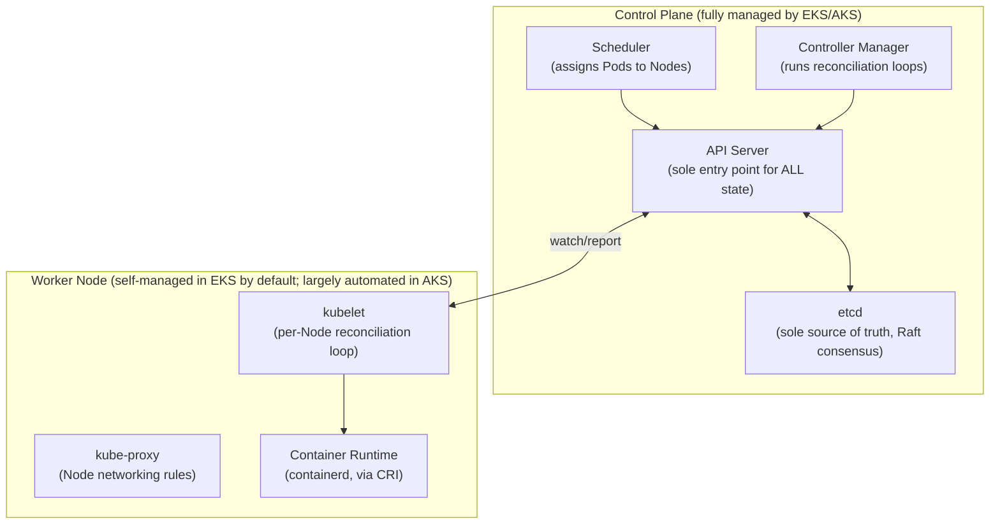

**Deployment → ReplicaSet → Pod, and Rolling Update Sequencing**

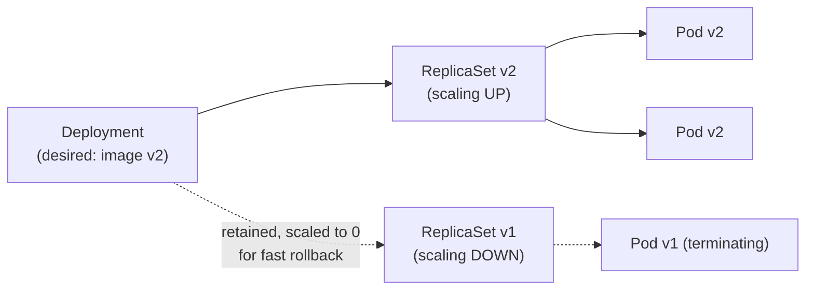

**13. Low-Level Design**

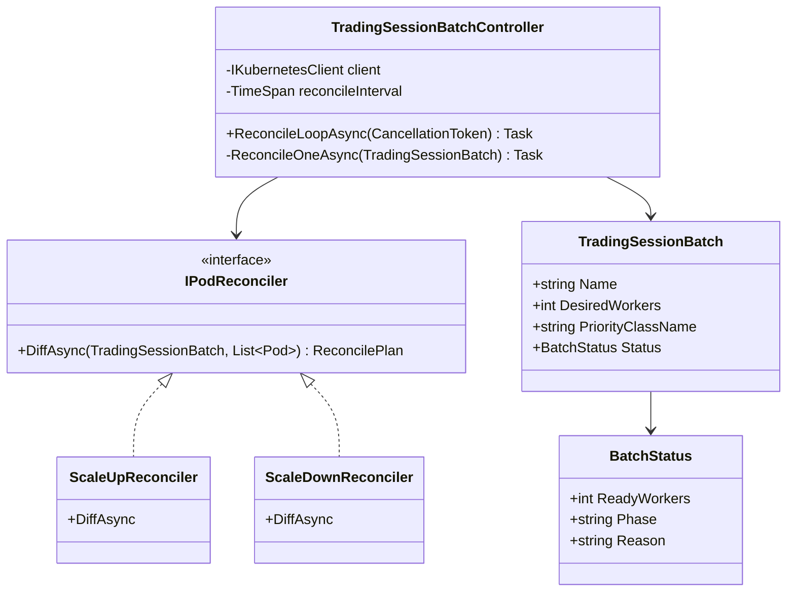

**13. Low-Level Design**

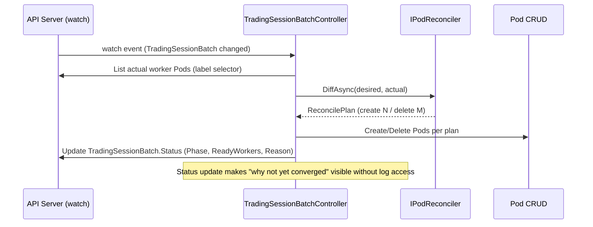

### Module 74 — Kubernetes: Networking — Services, Ingress, CNI, DNS & Network Policies
*Source: `02-Networking-Services-Ingress-CNI-DNS-NetworkPolicies.md`*

**The Full Request Path: External Client → Ingress → Service → Pod**

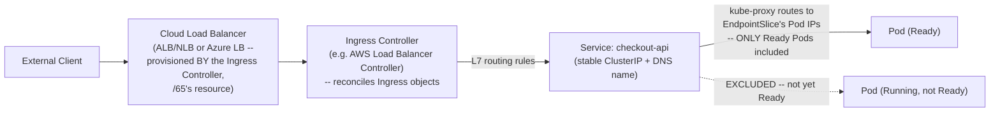

**CNI: Direct VPC-IP Assignment vs. Overlay Model**

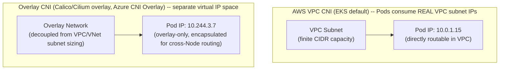

**13. Low-Level Design**

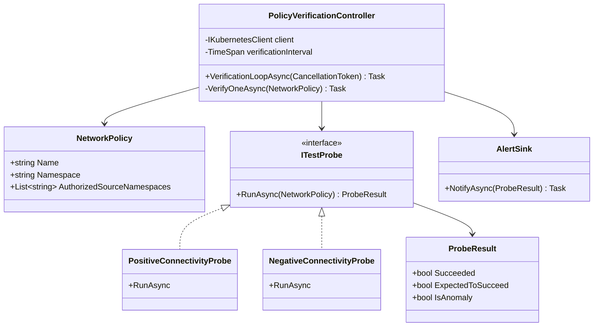

**13. Low-Level Design**

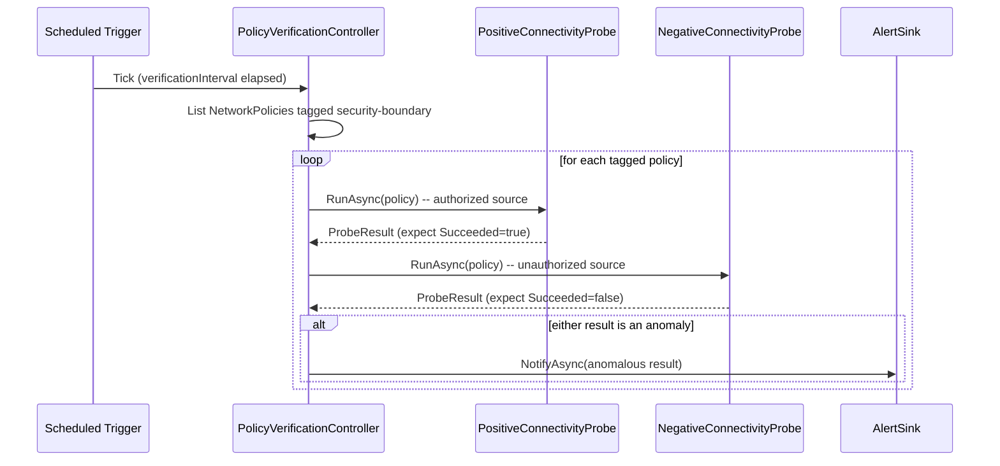

### Module 75 — Kubernetes: Storage — Volumes, PersistentVolumes/Claims, StorageClasses & StatefulSets
*Source: `03-Storage-Volumes-PersistentVolumes-StorageClasses-StatefulSets.md`*

**PV/PVC Binding and Dynamic Provisioning via a StorageClass's CSI Driver**

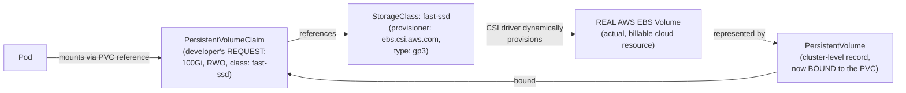

**StatefulSet: Stable, Per-Replica Identity + Storage vs. Deployment's Interchangeable Replicas**

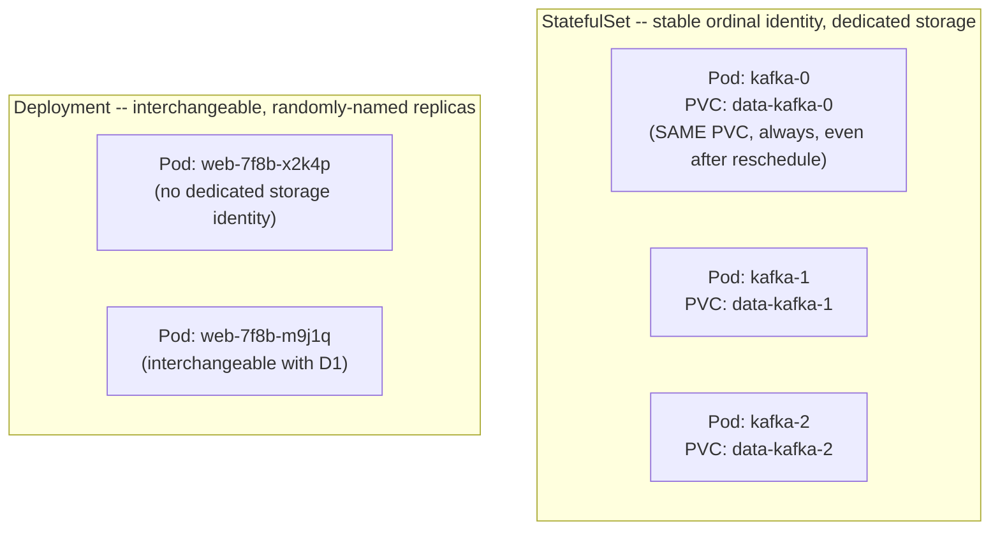

**13. Low-Level Design**

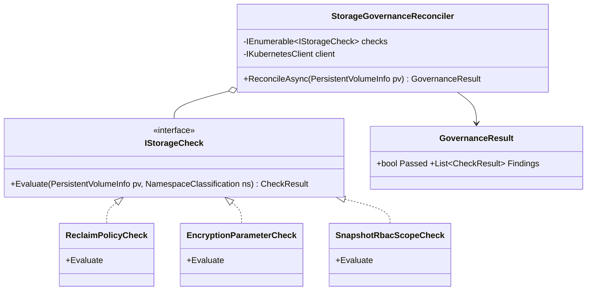

**13. Low-Level Design**

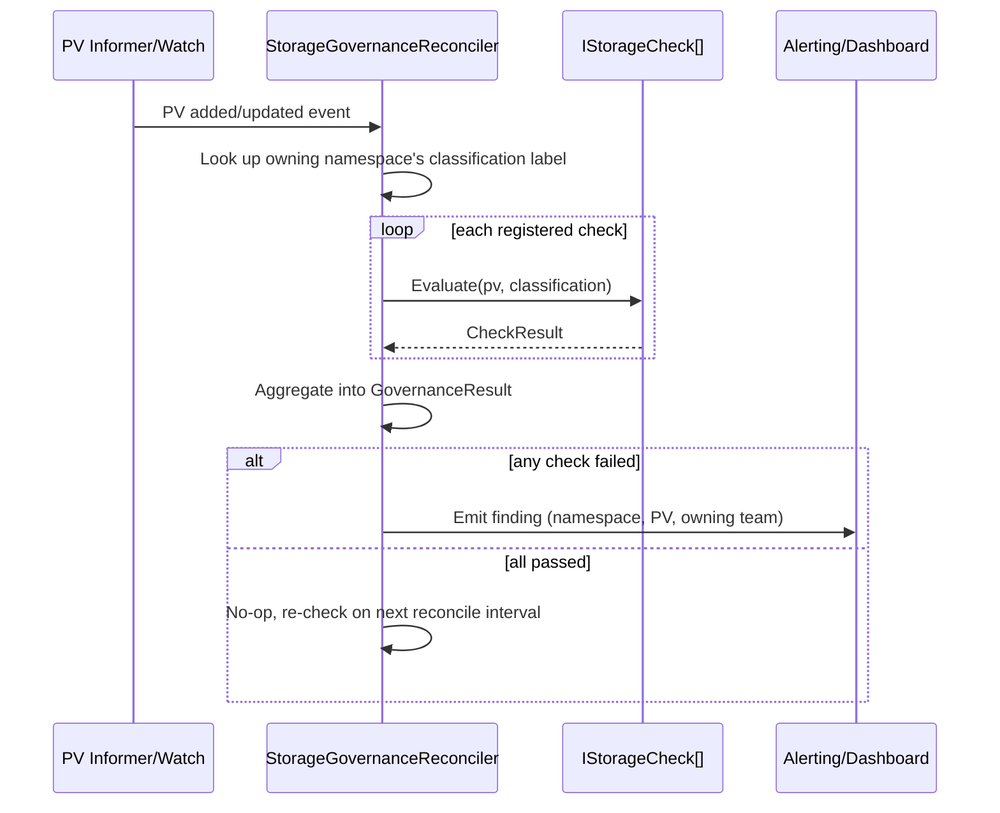

### Module 76 — Kubernetes: Configuration & Security — ConfigMaps, Secrets, RBAC, Pod Security & Admission Controllers
*Source: `04-Configuration-Security-ConfigMaps-Secrets-RBAC-PodSecurity.md`*

**Two Independent Authorization Systems Governing One Workload**

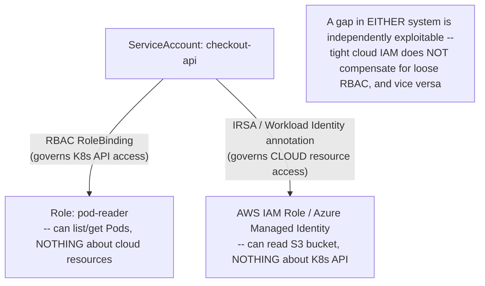

**Admission Controller Request Flow, and PSA's Three Enforcement Modes**

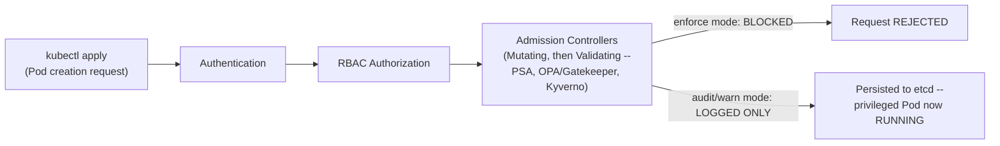

**13. Low-Level Design**

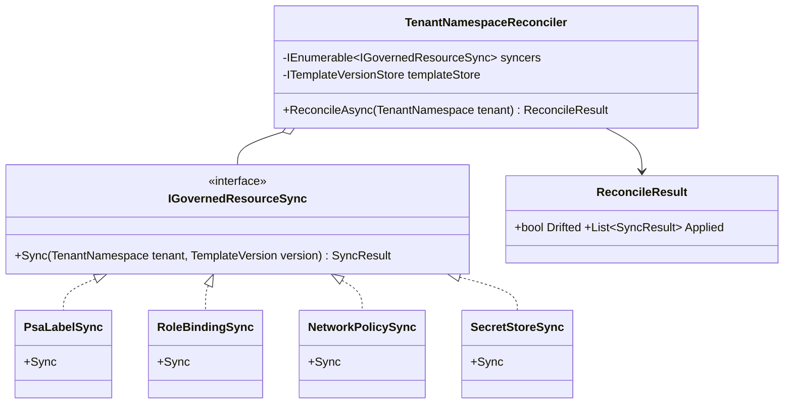

**13. Low-Level Design**

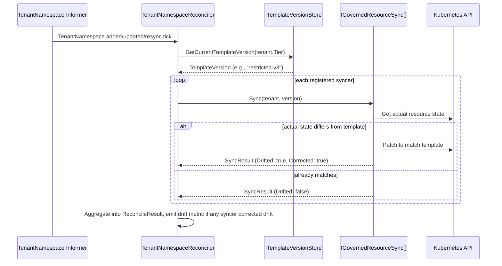

### Module 77 — Kubernetes: Scheduling & Autoscaling — Scheduler Internals, Affinity/Taints/Tolerations & HPA/VPA/Cluster Autoscaler
*Source: `05-Scheduling-Autoscaling-Affinity-Taints-HPA-VPA-ClusterAutoscaler.md`*

**Scheduler's Two-Phase Filtering → Scoring Decision**

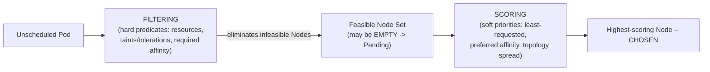

**The Full Autoscaling Chain's Sequential (Not Parallel) Delays**

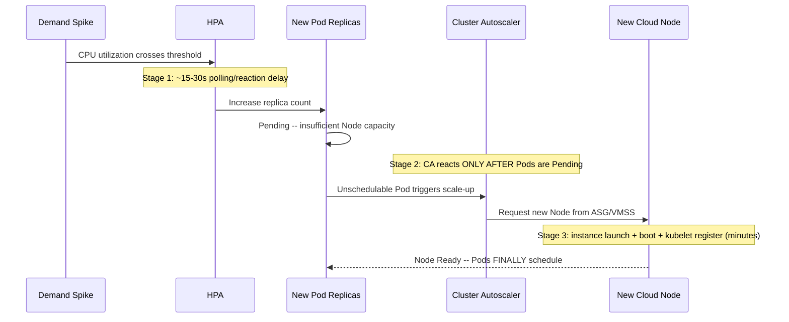

**HPA Controller Reconciliation Loop**

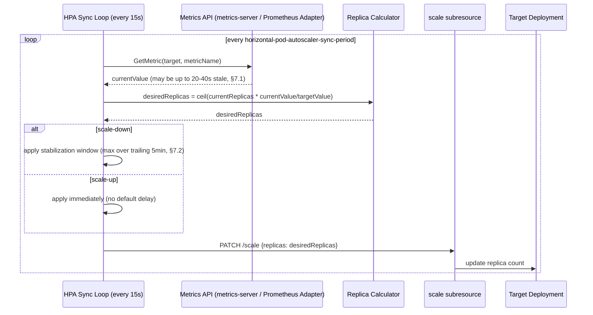

**Cluster Autoscaler Scale-Up Decision Loop**

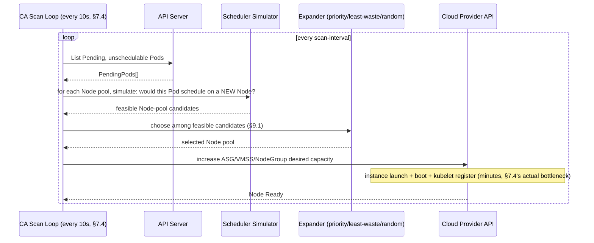

### Module 78 — Kubernetes: Helm, Operators & CRDs — Package Management, the Operator Pattern & Custom Resources
*Source: `06-Helm-Operators-CRDs.md`*

**Helm's One-Shot Install/Upgrade vs. an Operator's Continuous Reconciliation**

```mermaid
sequenceDiagram
 participant Eng as Engineer
 participant Helm
 participant Resource as Helm-managed Deployment
 participant Operator
 participant CR as Operator-managed Custom Resource

 Eng->>Helm: helm install my-app
 Helm->>Resource: renders + applies manifests
 Note over Helm: Helm is now DONE -- not running, not watching
 Eng->>Resource: kubectl edit (manual emergency fix)
 Note over Resource: Edit PERSISTS indefinitely -- no reconciliation
 Eng->>Helm: helm upgrade (LATER, unrelated change)
 Helm->>Resource: re-renders ENTIRE chart, OVERWRITES manual edit silently

 Eng->>Operator: kubectl apply (creates CR)
 Operator->>CR: continuously reconciles
 Eng->>CR: kubectl edit (manual emergency fix)
 Operator->>CR: NEXT reconciliation pass REVERTS the edit automatically
```

**Layered Pattern: Helm Installs the Operator; the Operator Manages Its Own CRs**

```mermaid
graph TB
 HelmInstall["helm install strimzi-kafka-operator<br/>(ONE-SHOT installation)"] --> OpDeploy["Strimzi Operator Deployment<br/>(now RUNNING, continuously watching)"]
 OpDeploy -->|"reconciles"| CR1["Kind: Kafka (CR)<br/>-- created SEPARATELY, NOT via helm install"]
 OpDeploy -->|"reconciles"| CR2["Kind: KafkaTopic (CR)"]
 CR1 -.->|"manual kubectl edit here<br/>gets REVERTED by Operator"| Note["Different behavior than a plain<br/>Helm-installed Deployment"]
```

**PaymentService Operator Reconciliation Loop**

```mermaid
sequenceDiagram
 participant Informer as Watch-Based Informer
 participant Queue as Rate-Limited Workqueue
 participant Recon as Reconciler
 participant Webhook as Compliance Validating Webhook
 participant K8s as API Server (child resources)

 Informer->>Queue: CR spec changed -- enqueue(namespace/name)
 Queue->>Recon: Reconcile(namespace/name)
 Recon->>K8s: Get current PaymentService CR
 K8s-->>Recon: CR (already passed Webhook at admission time)
 Recon->>Recon: idempotent no-op check (desired vs. observed, §7.2)
 alt no change needed
 Recon-->>Queue: return, no writes issued
 else change needed
 Recon->>K8s: apply/update generated Deployment, Service, NetworkPolicy, SA
 Recon->>K8s: update .status.conditions + .status.generatedResources
 K8s-->>Recon: success or transient error
 alt transient error
 Recon-->>Queue: requeue with exponential backoff (§7.2)
 end
 end
```

### Module 79 — Kubernetes: Service Mesh & Advanced Networking — Istio, Linkerd & mTLS
*Source: `07-ServiceMesh-Istio-Linkerd-AdvancedNetworking.md`*

**Sidecar Injection via Mutating Webhook**

```mermaid
sequenceDiagram
 participant Dev as kubectl apply (Deployment)
 participant API as API Server
 participant Webhook as Istio Mutating Webhook
 participant Etcd as etcd

 Dev->>API: Create Pod (namespace: istio-injection=enabled)
 API->>Webhook: Intercept (the admission phase)
 Webhook->>API: Mutated Pod spec + Envoy sidecar + iptables initContainer
 API->>Etcd: Persist MUTATED spec
 Note over Etcd: Developer's original YAML never mentioned Envoy at all
```

**mTLS PERMISSIVE vs. STRICT**

```mermaid
graph LR
 subgraph "PERMISSIVE (migration-safe, but silently permissive)"
 A1["mTLS request"] --> S1["Sidecar: ACCEPTED"]
 A2["Plaintext request"] --> S1
 end
 subgraph "STRICT (genuinely enforced)"
 B1["mTLS request"] --> S2["Sidecar: ACCEPTED"]
 B2["Plaintext request"] --> S2b["Sidecar: REJECTED"]
 end
```

**Weighted Canary Routing via VirtualService**

```mermaid
graph LR
 Client --> VS["VirtualService: checkout-api"]
 VS -->|"weight: 90"| V1["DestinationRule subset: v1 (stable)"]
 VS -->|"weight: 10"| V2["DestinationRule subset: v2 (canary)"]
```

**13. Low-Level Design**

```mermaid
classDiagram
 class RequestPipeline {
 -List~IFilter~ filters
 +ProcessAsync(Request) Response
 }
 class IFilter {
 <<interface>>
 +ProcessAsync(Request, Func~Task~Response~~ next) Response
 }
 class MtlsFilter { +ProcessAsync }
 class AuthorizationFilter { +ProcessAsync }
 class RetryFilter { -CircuitBreaker breaker +ProcessAsync }
 class MetricsFilter { +ProcessAsync }
 class CircuitBreaker { -State state +ExecuteAsync }

 RequestPipeline o-- IFilter
 IFilter <|.. MtlsFilter
 IFilter <|.. AuthorizationFilter
 IFilter <|.. RetryFilter
 IFilter <|.. MetricsFilter
 RetryFilter --> CircuitBreaker
```

**13. Low-Level Design**

```mermaid
sequenceDiagram
 participant Client
 participant Pipeline as RequestPipeline
 participant Mtls as MtlsFilter
 participant AuthZ as AuthorizationFilter
 participant Retry as RetryFilter
 participant Metrics as MetricsFilter
 participant Upstream

 Client->>Pipeline: Inbound request
 Pipeline->>Mtls: Process (terminate mTLS, extract identity)
 Mtls->>AuthZ: next
 AuthZ->>AuthZ: Check AuthorizationPolicy rules
 AuthZ->>Retry: next
 Retry->>Upstream: Attempt call (with backoff on failure)
 Retry->>Metrics: next (after upstream response)
 Metrics->>Metrics: Emit golden-signal telemetry
 Metrics-->>Client: Response
```

### Module 80 — Kubernetes: Observability, Multi-cluster & GitOps (Capstone)
*Source: `08-Observability-Multicluster-GitOps.md`*

**GitOps Reconciliation, Closing the Drift Gap**

```mermaid
sequenceDiagram
 participant Git as Git Repository (source of truth)
 participant ArgoCD
 participant Cluster as Live Cluster State
 participant Eng as Engineer (manual kubectl edit)

 ArgoCD->>Git: Continuously watch for changes
 ArgoCD->>Cluster: Reconcile live state to match git
 Eng->>Cluster: kubectl edit (manual drift)
 ArgoCD->>Cluster: NEXT reconciliation pass detects drift
 ArgoCD->>Cluster: REVERTS to git-declared state automatically
 Note over Cluster: Closes the exact gap -- ANY resource,<br/>not just Operator-managed CRs, now self-heals from drift
```

**What GitOps Does NOT Solve — a Wrong Declaration, Perfectly Enforced**

```mermaid
graph LR
 Git["Git: PeerAuthentication<br/>mode: PERMISSIVE<br/>(committed by mistake, or never revisited)"] --> ArgoCD
 ArgoCD -->|"Sync Status: Healthy<br/>-- ZERO drift"| Cluster["Live cluster:<br/>PERMISSIVE, exactly as declared"]
 Cluster -.->|"Plaintext traffic STILL silently<br/>accepted -- GitOps enforced the<br/>WRONG state perfectly"| Risk["Same risk as --<br/>but now with HIGHER false confidence"]
```

**13. Low-Level Design**

```mermaid
classDiagram
 class PostSyncVerificationController {
 -IArgoCdEventWatcher[] watchers
 -Dictionary~string,IVerifier~ verifiersByKind
 -IHeartbeatEmitter heartbeat
 +RunAsync
 }
 class IArgoCdEventWatcher { <<interface>> +WatchSyncCompletionsAsync }
 class IVerifier {
 <<interface>>
 +VerifyAsync(namespace) VerificationResult
 }
 class MtlsStrictVerifier { +VerifyAsync }
 class NetworkPolicyVerifier { +VerifyAsync }
 class PsaEnforcementVerifier { +VerifyAsync }
 class AlertDispatcher {
 +RaiseDriftAlert
 +RaiseVerificationFailureAlert
 }
 class IHeartbeatEmitter { <<interface>> +Beat }

 PostSyncVerificationController o-- IArgoCdEventWatcher
 PostSyncVerificationController o-- IVerifier
 PostSyncVerificationController --> AlertDispatcher
 PostSyncVerificationController --> IHeartbeatEmitter
 IVerifier <|.. MtlsStrictVerifier
 IVerifier <|.. NetworkPolicyVerifier
 IVerifier <|.. PsaEnforcementVerifier
```

**13. Low-Level Design**

```mermaid
sequenceDiagram
 participant ArgoCD
 participant Controller as PostSyncVerificationController
 participant Verifier as IVerifier (per Kind)
 participant Alerts as AlertDispatcher
 participant Heartbeat

 loop Every reconciliation cycle
 Heartbeat->>Heartbeat: Beat -- Advanced Q8's recursive-risk backstop
 end
 ArgoCD->>Controller: Sync completion event (changed resources)
 Controller->>Controller: Dispatch by resource Kind
 Controller->>Verifier: VerifyAsync(namespace)
 Verifier-->>Controller: VerificationResult
 alt Passed
 Controller->>Controller: Annotate commit (Advanced Q5's closing-the-loop)
 else Failed
 Controller->>Alerts: RaiseVerificationFailureAlert -- SEPARATE from drift alerts (Advanced Q9)
 end
```
