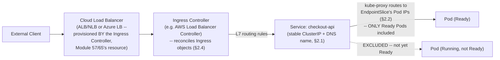
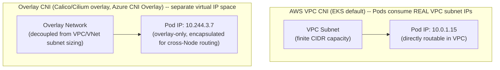

# Module 74 — Kubernetes: Networking — Services, Ingress, CNI, DNS & Network Policies

> Domain: Kubernetes | Level: Beginner → Expert | Prerequisite: [[01-Architecture-ControlPlane-Pods-Deployments]] (Pods are ephemeral with changing IPs — this module is the direct answer to "how do clients reliably reach a Pod whose IP keeps changing"), [[../21-AWS/01-Compute-Networking-VPC-LoadBalancing-AutoScaling]] and [[../22-Azure/01-Compute-Networking-VNet-LoadBalancer-VMSS]] (Kubernetes's LoadBalancer Service type and Ingress Controllers provision the exact ALB/NLB/Application Gateway resources those modules covered, now driven declaratively from inside the cluster)

---

## 1. Fundamentals

### Why does a Principal Engineer need a dedicated Kubernetes networking model beyond "Pods have IP addresses"?
Module 73 §2.3 established that Pods are fundamentally ephemeral — a failed or rescheduled Pod is replaced by an entirely new Pod with a **new** IP address, never the same one restored. Directly addressing Pods by IP is therefore structurally unworkable for anything other than the most trivial, single-Pod scenario: any client (another service inside the cluster, or an external caller) needs a way to reach "the current set of healthy replicas of this application" without needing to track individual, constantly-changing Pod IPs itself. Kubernetes's entire networking model exists specifically to solve this one problem at multiple layers — Services provide a stable internal identity, Ingress provides stable external HTTP(S) entry, CNI provides the underlying flat network Services and Ingress both depend on, and DNS provides human-readable names for all of it — a Principal Engineer needs to understand this layered stack as a coherent answer to one problem (stable addressing over ephemeral compute), not as a disconnected list of separately-memorized objects.

### Why does this matter?
Because nearly every non-trivial Kubernetes networking issue (a service unreachable, unexpected latency, a security-policy gap) traces back to a misunderstanding of exactly which layer of this stack is responsible for which specific behavior — diagnosing "my service isn't reachable" correctly requires knowing whether the failure is at the Service/Endpoints layer, the CNI/Pod-network layer, the Ingress/L7-routing layer, or the DNS layer, since each has an entirely different debugging approach and root-cause space.

### When does this matter?
For any multi-Pod, multi-service Kubernetes application (which is to say, nearly every real production Kubernetes workload) — Service-based addressing, Ingress-based external routing, and NetworkPolicy-based segmentation are foundational, not optional, advanced-only concerns.

### How does it work (30,000-ft view)?
```
CNI (Container Network Interface): the pluggable layer that assigns every Pod a real IP
     and implements Kubernetes's REQUIRED flat network model -- every Pod can reach every
     other Pod's IP directly, cluster-wide, with no NAT in between
Service: a STABLE virtual IP + DNS name, decoupling clients from ephemeral Pod IPs --
     kube-proxy (Module 73 §2.5) implements the actual Service-IP-to-Pod-IP routing
Endpoints/EndpointSlices: the ACTUAL, continuously-reconciled list of ready Pod IPs
     currently backing a given Service (label-selector-matched, per Module 73 §2.2's
     reconciliation-loop pattern)
Ingress: L7 HTTP(S) routing INTO the cluster from outside -- requires an Ingress
     Controller to actually do anything; the Ingress object alone is just a declared spec
CoreDNS: cluster-internal DNS, resolving Service names (my-svc.my-namespace.svc.cluster.local)
NetworkPolicy: Pod-to-Pod traffic RESTRICTION -- default-allow-all unless explicitly
     restricted, and only enforced if the cluster's CNI plugin actually supports it
```

---

## 2. Deep Dive

### 2.1 Services — the Stable-Identity Layer Solving Module 73's Ephemeral-Pod-IP Problem
A **Service** is a stable virtual IP (a `ClusterIP`, by default) and DNS name that decouples any client from the specific, constantly-changing set of Pod IPs currently backing it. The four Service types serve genuinely different exposure needs: **ClusterIP** (the default — a stable, cluster-internal-only virtual IP, for Pod-to-Pod communication within the cluster); **NodePort** (additionally exposes the Service on a static port on every Node's own IP — a blunt, rarely-used-directly-in-production mechanism, mostly a building block other exposure methods are layered on top of); **LoadBalancer** (provisions an actual cloud load balancer — an AWS NLB/ALB, Module 57's exact resource, or an Azure Load Balancer, Module 65's exact resource — with the cloud-provider-specific provisioning driven automatically by a **cloud-controller-manager** component watching for `LoadBalancer`-type Services, directly Module 73 §2.1's reconciliation-loop pattern now operating across the Kubernetes-to-cloud-API boundary); and **ExternalName** (a pure DNS-level CNAME redirect to an external, non-Kubernetes-managed hostname, for referencing external dependencies via in-cluster Service-style DNS names). A Principal Engineer should recognize `LoadBalancer`-type Services as the mechanism directly responsible for the cloud load-balancer resources Modules 57/65 covered — from inside the cluster, a team never manually provisions an ALB/NLB/Azure LB for a Kubernetes-hosted service; they declare a `LoadBalancer` Service and the cloud-controller-manager provisions and manages that cloud resource on their behalf.

### 2.2 Endpoints/EndpointSlices — the Actual, Continuously-Reconciled List a Service Routes To
A Service's `selector` (a label match, e.g., `app: checkout-api`) doesn't route traffic itself — it determines which Pods' IPs populate that Service's **EndpointSlice** (the modern, scalable successor to the original `Endpoints` object), and it is the EndpointSlice's actual, continuously-reconciled list of ready Pod IPs that kube-proxy uses to program the Node-level routing rules (Module 73 §2.5) that make traffic actually reach a Pod. Critically, a Pod is only added to a Service's EndpointSlice once it passes its **readiness probe** — a Pod that is `Running` (Module 73's status) but not yet `Ready` is deliberately excluded, meaning "the Pod is Running" and "the Pod is receiving traffic" are genuinely different, independently-verifiable states (directly Module 73 §Advanced Q8's answer, now given its full mechanical explanation) — a Principal Engineer debugging "traffic isn't reaching my Pod despite it being Running" should check `kubectl get endpoints`/`kubectl get endpointslice` first, specifically to determine whether the gap is a label-selector mismatch or a failing readiness probe, before assuming a deeper networking-layer fault.

### 2.3 CNI — the Pluggable Layer Implementing Kubernetes's Required Flat-Network Model
Kubernetes requires a specific, non-negotiable networking property: **every Pod must be able to reach every other Pod's IP directly, cluster-wide, without NAT** — a materially different (and simpler, from the application's perspective) model than Docker's default bridge networking, which NATs container traffic behind the host's IP. The **Container Network Interface (CNI)** is the pluggable specification and plugin ecosystem responsible for actually implementing this flat-network requirement — assigning each Pod its IP and programming the actual routing/overlay mechanism that makes cross-Node Pod-to-Pod traffic work. Different CNI plugins make genuinely different architectural trade-offs with real capacity-planning consequences: the **AWS VPC CNI** (EKS's default) assigns each Pod a *real, routable VPC IP address* directly from the VPC's own IP address space — meaning Pod IP exhaustion is a genuine VPC-subnet-sizing concern (directly recurring Module 57's VPC CIDR-planning discipline, now at Pod-density scale rather than EC2-instance scale) — versus an overlay-based CNI (Calico, Cilium in overlay mode, or Azure CNI Overlay) that assigns Pods IPs from a separate, virtual overlay address space not drawn from the VPC/VNet's own subnet, decoupling Pod-IP capacity planning from VPC/VNet subnet sizing entirely, at the cost of the additional encapsulation overhead the overlay itself introduces. A Principal Engineer selecting or evaluating a CNI plugin must explicitly reason about this trade-off (direct VPC IP consumption and its associated subnet-capacity planning, versus overlay encapsulation overhead) rather than treating "which CNI" as an interchangeable, inconsequential implementation detail.

### 2.4 Ingress and Ingress Controllers — the Object Is a Spec; the Controller Does the Work
An **Ingress** object declares L7 HTTP(S) routing rules (host- and path-based routing to different backend Services, TLS termination) — but, critically, **creating an Ingress object alone does nothing** without an **Ingress Controller** actually running in the cluster and watching for Ingress objects to act on (directly Module 73 §2.2's reconciliation-loop pattern once again — the Ingress Controller is itself a controller, observing Ingress objects as its desired-state input). Common Ingress Controllers include `nginx-ingress` (a self-managed, portable, cloud-agnostic option), the **AWS Load Balancer Controller** (provisions and configures an actual ALB per Module 57, driven by Ingress objects), and the **Application Gateway Ingress Controller (AGIC)** (drives Azure's Application Gateway, Module 65's resource, from Ingress objects). This is a common, easily-missed beginner trap worth flagging explicitly: a team that applies an Ingress manifest in a cluster with no Ingress Controller installed will observe the object exists (`kubectl get ingress` shows it) but nothing actually happens — no load balancer is provisioned, no routing occurs — because the object is purely a declared specification awaiting a controller to reconcile it into real infrastructure, precisely analogous to Module 73 §2.4's Deployment-without-effect-until-reconciled pattern, now at the ingress-routing layer.

### 2.5 CoreDNS — Cluster-Internal DNS, and the Service-Naming Convention
**CoreDNS** runs as the cluster's internal DNS provider (itself deployed as a Deployment, per Module 73 §2.4 — a genuinely "Kubernetes uses Kubernetes to run its own supporting infrastructure" instance), resolving Service names according to a fixed convention: `<service-name>.<namespace>.svc.cluster.local` (commonly abbreviated to just `<service-name>` for same-namespace lookups, or `<service-name>.<namespace>` for cross-namespace lookups, relying on the Pod's configured DNS search-domain suffixes to complete the full name). This DNS layer is what allows application code to address a dependency by a stable, human-readable name (`payment-service`) rather than a Service's virtual IP directly — though the underlying resolution ultimately still returns that stable ClusterIP virtual IP (§2.1), not a specific Pod IP, meaning DNS resolution and Service-level stable-addressing are complementary, not competing, mechanisms operating at different layers of the same problem.

### 2.6 NetworkPolicy — Default-Allow-All, and the CNI-Support Prerequisite That's Easy to Miss Entirely
By default, Kubernetes permits **all** Pod-to-Pod traffic, cluster-wide, with no restriction whatsoever — a materially different default posture than cloud VPC security groups (Module 57/65), which commonly default-deny inbound traffic absent an explicit allow rule. A **NetworkPolicy** object restricts this — declaring explicit ingress/egress rules scoped by label selectors and namespaces, directly Module 58/66's least-privilege discipline (IAM policies, RBAC) now applied at the Pod-to-Pod network layer. The critical, easily-missed prerequisite: **NetworkPolicy objects are only enforced if the cluster's CNI plugin actually implements NetworkPolicy support** — not every CNI plugin does (a basic `kubenet` setup, or certain AWS VPC CNI configurations without an additional NetworkPolicy-enforcing add-on, will silently accept a NetworkPolicy object without ever actually enforcing it) — meaning a team can write and apply what looks like a complete, correct network-segmentation policy that is, in practice, **entirely inert**, with traffic flowing exactly as if the policy didn't exist, and no error or warning surfaced anywhere in the object's own status to indicate this — a uniquely dangerous "looks correct on paper, silently unenforced in practice" risk category this course has repeatedly flagged in other contexts (Module 70's Event Grid silent-loss default is a structurally similar "no error, just silent absence of the expected behavior" risk), now recurring at the Kubernetes network-security layer specifically.

---

## 3. Visual Architecture

### The Full Request Path: External Client → Ingress → Service → Pod (§2.1, §2.2, §2.4)


### CNI: Direct VPC-IP Assignment vs. Overlay Model (§2.3)


## 4. Production Example
**Scenario**: A platform team supporting a PCI-DSS-scoped payment-processing workload implemented Kubernetes NetworkPolicy objects to enforce network segmentation between the PCI-scoped namespace and the rest of the cluster — a specific compliance requirement mandating that only explicitly-authorized services could reach the payment-processing Pods, with all other in-cluster traffic denied by default. The policies were written, reviewed, and merged following a thorough internal design review, and the team considered the segmentation requirement satisfied. **Investigation**: during the subsequent external PCI compliance audit, the auditor's own penetration test — attempting Pod-to-Pod connections from an unauthorized namespace directly to a PCI-scoped Pod's IP — succeeded, despite the NetworkPolicy objects being present, correctly configured, and showing no error state via `kubectl get networkpolicy`. The team's own internal review had validated the *policy's logical correctness* (the YAML correctly expressed the intended segmentation rules) but had never validated that the policies were actually being **enforced** at the network layer. **Root cause**: the cluster's CNI plugin — the default AWS VPC CNI, without the additional NetworkPolicy-enforcing component (Calico's policy engine, or an equivalent) installed alongside it — did not implement NetworkPolicy enforcement at all; the NetworkPolicy objects were accepted by the API Server and stored, syntactically valid and logically correct, but silently had zero actual effect on real network traffic, exactly the "looks correct on paper, silently inert in practice" risk §2.6 describes. **Fix**: installed Calico's network-policy-enforcement component alongside the existing AWS VPC CNI (a supported, common configuration — using AWS VPC CNI for IP address management while delegating NetworkPolicy enforcement specifically to Calico), then re-validated the exact same NetworkPolicy objects were now genuinely blocking the previously-successful unauthorized connection attempt, and added an automated, recurring **policy-enforcement verification test** (a scheduled Pod-to-Pod connectivity test explicitly attempting a connection the policy should deny, alerting if it unexpectedly succeeds) rather than relying solely on the policy objects' own declared state as evidence of actual enforcement. **Lesson**: a Kubernetes object's presence and syntactic correctness (`kubectl get networkpolicy` showing no error) provides **zero** evidence that the object is actually having its intended effect at runtime — this is a materially different, and more dangerous, verification gap than most other Kubernetes objects present, since a misconfigured Deployment or Service typically produces some observable symptom (a `Pending` Pod, a `kubectl get endpoints` mismatch), while an unenforced NetworkPolicy produces **no observable symptom at all** short of an actual unauthorized-access attempt (or a deliberate penetration test) succeeding — a Principal Engineer implementing any security-boundary NetworkPolicy must explicitly verify CNI-level enforcement support and validate it with an actual test connection, never trusting policy-object presence alone as evidence of active protection.

## 5. Best Practices
- Explicitly verify the cluster's CNI plugin actually enforces NetworkPolicy before relying on any NetworkPolicy object for a genuine security boundary — policy-object presence alone is not evidence of enforcement (§2.6, §4).
- Add automated, recurring connectivity tests that explicitly attempt a connection a NetworkPolicy should deny, alerting if it unexpectedly succeeds — don't rely solely on the policy object's declared state (§4).
- When debugging "Pod is Running but not receiving traffic," check `kubectl get endpointslice` first to distinguish a label-selector mismatch from a failing readiness probe, before assuming a deeper networking fault (§2.2).
- Explicitly account for CNI-specific IP-address-capacity planning (VPC-subnet-consuming CNIs like AWS VPC CNI vs. overlay-based CNIs) as a genuine capacity-planning input, not an interchangeable implementation detail (§2.3).
- Confirm an Ingress Controller is actually installed and running before assuming an applied Ingress manifest will provision real routing infrastructure (§2.4).

## 6. Anti-patterns
- Treating a NetworkPolicy's successful application (`kubectl apply` succeeding, `kubectl get networkpolicy` showing no error) as sufficient evidence that traffic segmentation is actually being enforced (§4).
- Applying an Ingress manifest in a cluster with no Ingress Controller installed and assuming routing infrastructure has been provisioned, since the object itself produces no error even with zero effect (§2.4).
- Directly addressing Pod IPs from application code instead of Service DNS names, reintroducing Module 73 §2.3's ephemeral-IP problem the entire Service abstraction exists to solve.
- Choosing a CNI plugin purely on default/familiarity grounds without evaluating its IP-address-capacity model against the cluster's actual scale requirements (§2.3).
- Assuming "Running" Pod status means the Pod is receiving traffic, without checking whether it has actually passed its readiness probe and been added to the relevant EndpointSlice (§2.2).

---

## 10. Interview Questions

### Basic (10)
1. **Q: Why can't clients simply address Pods directly by IP?** **A:** Pods are ephemeral — a replaced Pod gets a new IP, never the same one restored, making direct Pod-IP addressing unworkable for anything beyond a single, static Pod.
2. **Q: What are the four Kubernetes Service types?** **A:** ClusterIP (default, internal-only), NodePort, LoadBalancer (provisions a cloud load balancer), and ExternalName (a DNS CNAME to an external hostname).
3. **Q: What determines which Pods a Service actually routes traffic to?** **A:** The Service's EndpointSlice — the continuously-reconciled list of ready Pod IPs matching the Service's label selector.
4. **Q: Does a Pod need to be "Running" or "Ready" to receive traffic from a Service?** **A:** "Ready" — a Pod must pass its readiness probe before being added to the Service's EndpointSlice, even if it's already "Running."
5. **Q: What is CNI, and what network property must every CNI implementation provide?** **A:** Container Network Interface — the pluggable layer assigning Pod IPs; it must provide a flat network where every Pod can reach every other Pod's IP directly, cluster-wide, without NAT.
6. **Q: Does creating an Ingress object alone provision a load balancer?** **A:** No — an Ingress Controller must be running in the cluster to actually reconcile Ingress objects into real routing infrastructure.
7. **Q: What is CoreDNS?** **A:** The cluster's internal DNS provider, resolving Service names in the form `<service>.<namespace>.svc.cluster.local`.
8. **Q: What is the default Pod-to-Pod traffic posture in Kubernetes absent any NetworkPolicy?** **A:** Allow-all — all Pods can reach all other Pods by default, with no restriction.
9. **Q: What prerequisite must be true for a NetworkPolicy to actually have any effect?** **A:** The cluster's CNI plugin must implement NetworkPolicy enforcement — not every CNI plugin does, and an unsupported CNI silently accepts the object without enforcing it.
10. **Q: What did §4's PCI audit reveal about the team's NetworkPolicy implementation?** **A:** The policies were syntactically correct and applied without error, but the cluster's CNI (AWS VPC CNI without a policy-enforcement add-on) never actually enforced them, so unauthorized traffic still succeeded.

### Intermediate (10)
1. **Q: Why is a Service's stable virtual IP described as the direct solution to Module 73's ephemeral-Pod-IP problem?** **A:** A Service provides one fixed address (and DNS name) that persists regardless of how many times its backing Pods are replaced — clients depend on that stable identity instead of tracking individual, constantly-changing Pod IPs themselves.
2. **Q: Why is "the Pod is Running" insufficient evidence that a Service will route traffic to it?** **A:** Only Pods that have passed their readiness probe are added to a Service's EndpointSlice — a Running-but-not-Ready Pod is deliberately excluded from receiving traffic, a distinct, independently-checkable state.
3. **Q: Why does AWS VPC CNI's direct-VPC-IP-assignment model create a capacity-planning concern that an overlay CNI doesn't?** **A:** Because each Pod consumes a real IP from the VPC's own finite subnet CIDR space, Pod density and Node count directly draw down the same finite address pool EC2 instances also draw from — an overlay CNI uses a separate virtual address space decoupled from VPC subnet sizing entirely.
4. **Q: Why is an Ingress object's existence not sufficient evidence that external routing is actually working?** **A:** The Ingress object is purely a declared specification — without an Ingress Controller running and watching for it, nothing reconciles that spec into an actual load balancer or routing configuration, producing no error despite zero effect.
5. **Q: Why is NetworkPolicy's "silently inert if unsupported by the CNI" behavior described as uniquely dangerous compared to most other Kubernetes misconfigurations?** **A:** Most misconfigured objects (a bad Deployment, a mismatched Service selector) produce some observable symptom (a Pending Pod, an empty EndpointSlice); an unenforced NetworkPolicy produces no observable symptom at all short of an actual unauthorized-access attempt succeeding, meaning the gap can go undetected indefinitely without a deliberate test.
6. **Q: Why does §4's team's internal review fail to catch the NetworkPolicy enforcement gap, despite being thorough?** **A:** The review validated the policy's logical correctness (the YAML correctly expressed the intended rules) but never validated actual runtime enforcement — a category of verification the object's own state provides no signal for, requiring an explicit connectivity test to surface.
7. **Q: Why should a Principal Engineer treat "no NetworkPolicies applied yet" as an active risk rather than a neutral, merely-incomplete state?** **A:** Because the default posture is allow-all, a cluster with zero NetworkPolicies provides zero Pod-to-Pod segmentation — any single compromised Pod can freely reach every other Pod, a materially larger blast radius than an already-partially-secured environment.
8. **Q: Why does the AWS Load Balancer Controller's relationship to Ingress objects mirror Module 73 §2.2's reconciliation-loop pattern?** **A:** The controller continuously watches Ingress objects (the desired state) and reconciles the actual ALB configuration to match — the identical observe-compare-converge structure every Kubernetes controller implements, now operating across the Kubernetes-to-AWS-API boundary specifically.
9. **Q: Why can CoreDNS become a genuine bottleneck at scale, and what are the standard mitigations?** **A:** High query volume from many Pods performing frequent, uncached DNS lookups can overwhelm CoreDNS's own capacity — mitigated via CoreDNS autoscaling (cluster-proportional-autoscaler) and appropriate client-side DNS result caching.
10. **Q: Why is kube-proxy's implementation mode (iptables vs. IPVS vs. eBPF) a genuine scaling concern rather than an interchangeable detail?** **A:** iptables-based rule evaluation scales roughly linearly with the number of Services/Endpoints, becoming a real bottleneck in very large clusters, while IPVS/eBPF-based modes use hash-table lookups with materially better scaling characteristics at high Service counts.

### Advanced (10)
1. **Q: Diagnose the §4 incident from first principles, and design the specific standing verification practice that would catch this class of "policy applied but not enforced" gap for any future security-boundary NetworkPolicy, before an external audit surfaces it.**
   **A:** Root cause: the NetworkPolicy object's successful application provided no signal about actual CNI-level enforcement, and the team's review process validated policy logic without validating runtime effect — a verification-method gap, not a policy-authoring gap. Structural fix: (1) explicitly confirm, and document, the cluster's CNI plugin's NetworkPolicy enforcement capability as a mandatory precondition before relying on any NetworkPolicy for a genuine security boundary; (2) implement an automated, recurring (not one-time) connectivity test — a scheduled job that deliberately attempts a connection each security-boundary NetworkPolicy should deny, alerting immediately if it unexpectedly succeeds — treating this the same way this course has treated DR-strategy validation (Module 64 §Advanced Q6's DR-drill discipline): an untested security control carries the same unverified risk as an untested DR strategy, and requires the same deliberate, ongoing validation practice rather than one-time authoring-and-review.
2. **Q: A team argues that since their cluster uses the AWS VPC CNI, and AWS VPC Security Groups already provide network-level segmentation at the EC2/ENI layer, Kubernetes-level NetworkPolicy is redundant and can be skipped entirely. Evaluate this claim.**
   **A:** Push back — VPC Security Groups typically operate at Node (EC2 instance/ENI) granularity, not Pod granularity; unless a cluster is using AWS VPC CNI's Security Groups for Pods feature specifically (assigning distinct Security Groups per Pod, a less commonly enabled, more operationally complex configuration), multiple Pods with different security requirements are very likely co-located on the same Node sharing the same Security-Group-level network boundary, meaning Security Groups alone cannot express "Pod A on this Node can talk to Pod C, but Pod B on the same Node cannot" — NetworkPolicy operates at the correct granularity (Pod-label-selector-based) for this requirement, and is not redundant with Node/ENI-level Security Groups unless the more specialized Security-Groups-for-Pods feature is deliberately adopted and its own granularity explicitly verified sufficient.
3. **Q: Design the specific test suite (extending §4's fix) that would provide genuine, ongoing confidence that a PCI-scoped namespace's NetworkPolicy segmentation remains correctly enforced as the cluster evolves (new CNI version, new NetworkPolicy objects added by other teams, cluster upgrades).**
   **A:** (1) A positive-and-negative connectivity test pair for every declared segmentation boundary: confirm an *authorized* Pod-to-Pod connection still succeeds (catching an overly-restrictive regression) AND confirm an *unauthorized* connection still fails (catching an under-enforcement regression, §4's exact incident) — testing both directions, since a test suite validating only "unauthorized traffic is blocked" wouldn't catch a policy that's become so restrictive it also breaks legitimate traffic. (2) Run this test suite on every cluster upgrade and CNI version change specifically, not just on a fixed schedule, since a CNI upgrade is a plausible trigger for an enforcement-behavior regression the scheduled-only test might not catch promptly. (3) Alert on NetworkPolicy object changes in the PCI-scoped namespace specifically, requiring the connectivity test suite to re-run and pass before considering the change complete, directly the same "automated pipeline governance gate" pattern this course established in Module 64 §Advanced Q1/Q10.
4. **Q: A workload's application code performs a fresh DNS lookup for a dependency's Service name on every single request, rather than caching the resolved IP, based on the reasoning that "the Service's IP might change." Evaluate this reasoning against §2.1's actual Service-IP stability guarantee.**
   **A:** The reasoning is based on an incorrect premise — a Service's `ClusterIP` is stable for the Service's entire lifetime (it does not change as backing Pods are replaced; that's precisely the problem §2.1's Service abstraction solves), so per-request DNS re-resolution provides no genuine correctness benefit for ClusterIP-based Services specifically, while adding real, unnecessary load to CoreDNS (§9's genuine bottleneck risk) at scale; appropriate, bounded-TTL client-side DNS caching (rather than either "never cache" or "cache forever") is the correct middle ground, and the "IP might change" concern is more legitimately applicable to Endpoints-level Pod IP changes (which DNS resolution to the ClusterIP already abstracts away entirely) than to the Service's own ClusterIP.
5. **Q: Critique the following claim: "Since our Ingress Controller successfully provisions and updates our ALB whenever we change our Ingress object, our external routing configuration is fully validated and correct."**
   **A:** Incomplete — successful ALB provisioning/update confirms the Ingress Controller correctly reconciled the Ingress object's *syntax* into real infrastructure, but says nothing about whether the *routing rules themselves* are semantically correct for the intended traffic pattern (a host/path rule that inadvertently routes production traffic to a staging backend Service, for instance, would provision and update the ALB successfully while still being a genuine, undetected routing bug) — "the reconciliation succeeded" and "the resulting behavior is correct" are different claims, directly recurring this course's broader "syntactic/mechanical success doesn't guarantee semantic correctness" theme (echoing §4's NetworkPolicy finding at the routing-configuration layer instead of the enforcement layer) — validating actual end-to-end request routing behavior (not just successful object reconciliation) remains necessary.
6. **Q: A Principal Engineer is evaluating a CNI migration (from AWS VPC CNI to an overlay-based CNI like Cilium) for a cluster that's begun hitting VPC subnet IP exhaustion under Pod-dense scaling. Design the specific validation this migration requires beyond confirming the new CNI resolves the IP-exhaustion problem.**
   **A:** Beyond confirming overlay-based IP assignment resolves subnet exhaustion (§2.3's core trade-off), explicitly validate: (1) NetworkPolicy enforcement behavior is preserved or improved, not silently degraded, across the CNI change (§4's exact risk category, now triggered by a CNI migration rather than an initial misconfiguration — directly Advanced Q3's "test on every CNI version/type change" discipline); (2) the overlay's encapsulation overhead (§7) is benchmarked against the cluster's actual latency/throughput-sensitive workloads before migrating production traffic, not assumed negligible; (3) any existing tooling or observability that assumed direct VPC-IP-based Pod addressing (VPC Flow Logs analysis, security tooling keyed to real VPC IPs) is re-validated against the new overlay-IP model, since Pod IPs under the new CNI will no longer correspond to real, VPC-Flow-Log-visible addresses the same way.
7. **Q: Explain why the §4 incident's core lesson — "object presence and syntactic validity provide zero evidence of runtime enforcement" — generalizes beyond NetworkPolicy to other Kubernetes security-adjacent objects, and identify one other object category where this same verification gap could plausibly recur.**
   **A:** The same gap structurally applies to any Kubernetes object whose entire purpose is *restricting or gating* behavior rather than *creating* it, where the underlying enforcement depends on a separate component correctly implementing that restriction: **Pod Security Admission** (Module 76) labels/policies restrict what a Pod spec is permitted to declare, but depend on the admission controller being correctly configured and enabled — a cluster where Pod Security enforcement mode is misconfigured (e.g., set to `audit` or `warn` rather than `enforce`) would similarly show the policy objects present and syntactically valid while providing zero actual blocking enforcement, the identical "looks correct on paper, silently permissive in practice" risk category NetworkPolicy demonstrated here.
8. **Q: A team's Ingress Controller is nginx-ingress, chosen for cloud-portability reasons over the cloud-native AWS Load Balancer Controller / AGIC options. Identify the specific operational trade-off this choice introduces relative to Module 57/65's cloud-native load-balancer integration, beyond the general portability benefit.**
   **A:** nginx-ingress runs as Pods *within* the cluster (fronted by a `LoadBalancer`-type Service that provisions a comparatively "dumb," L4 cloud load balancer purely to reach the nginx Pods) rather than driving a cloud-native L7 load balancer (ALB/Application Gateway) directly — meaning L7-specific cloud-native features (AWS WAF integration directly on the ALB, Application Gateway's integrated WAF, per Module 65 §2's Azure-native security tooling) aren't natively available the same way they are when the AWS Load Balancer Controller or AGIC drives the actual cloud L7 resource directly; the portability benefit (identical Ingress behavior across any Kubernetes cluster, any cloud) is real, but trades away tighter integration with cloud-native L7 security/observability tooling specific to whichever cloud is actually hosting the cluster — a genuine, explicit trade-off a Principal Engineer should weigh rather than defaulting to either option without considering it.
9. **Q: Design the layer-by-layer debugging methodology for "external users cannot reach my application" specifically (as distinct from Module 73 §Advanced Q9's internal Pod-health-focused methodology), synthesizing this module's Ingress/Service/CNI/DNS layers.**
   **A:** (1) Confirm DNS resolution for the external hostname actually resolves to the expected load-balancer IP/hostname (ruling out a DNS-layer issue before anything Kubernetes-specific). (2) Confirm the Ingress Controller is actually running (`kubectl get pods -n <ingress-controller-namespace>`) and has successfully reconciled the specific Ingress object (`kubectl describe ingress`, checking for reconciliation errors or an unset `ADDRESS` field, per §2.4's "object exists but nothing happened" risk). (3) Confirm the target Service's EndpointSlice actually has ready Pod IPs registered (§2.2's Running-vs-Ready distinction, and Module 73 §Advanced Q9's layer-3 check, now composed with this module's external-path layers). (4) If all of the above check out but connectivity still fails, check NetworkPolicy objects for an unintended deny rule blocking traffic from the Ingress Controller's own Pods to the target Service's Pods (§2.6's enforcement risk, now as a *false-positive-block* rather than a *false-negative-miss* scenario) — this ordered sequence (DNS → Ingress Controller/object reconciliation → Service/EndpointSlice readiness → NetworkPolicy) isolates the failure to one specific, independently-debuggable layer at each step, rather than guessing across the full external-request path at once.
10. **As a Principal Engineer establishing Kubernetes networking standards for a new platform team, design the specific set of standing architectural decisions and automated checks (synthesizing this entire module) required before any production workload is permitted onto the cluster.**
    **A:** (1) An explicit, documented CNI choice with its IP-capacity-planning model (direct VPC-IP vs. overlay, §2.3) sized against projected Pod-density growth, reviewed the same way Module 57's VPC CIDR planning is reviewed. (2) Mandatory verification that the chosen CNI supports NetworkPolicy enforcement, with that verification itself automated and re-run on every CNI version change (Advanced Q1, Advanced Q3) — no security-boundary NetworkPolicy relied upon in production without this confirmed. (3) A standing, automated positive-and-negative connectivity test suite for every declared namespace-segmentation boundary (Advanced Q3), integrated into the deployment pipeline the same way this course's other governance gates have been (Module 64/72's synthesis). (4) A documented Ingress Controller choice with its specific cloud-integration trade-offs (Advanced Q8) explicitly evaluated against the organization's actual L7 security/observability requirements, not defaulted without consideration. (5) The layer-by-layer external-connectivity debugging runbook (Advanced Q9) published and required reading for on-call engineers, specifically because an ungoverned, ad hoc debugging approach across this many distinct layers (DNS, Ingress, Service, CNI, NetworkPolicy) risks exactly the kind of prolonged, unfocused incident-response time this course has repeatedly identified as avoidable with a structured, layer-isolating methodology.

---

## 11. Coding Exercises

### Easy — A ClusterIP Service and its label-selector relationship to a Deployment's Pods (§2.1, §2.2)
```yaml
apiVersion: v1
kind: Service
metadata:
  name: checkout-api
spec:
  type: ClusterIP   # stable, cluster-internal-only virtual IP (§2.1)
  selector:
    app: checkout-api   # MUST match the Deployment's Pod template labels exactly (§2.2) --
                          # a mismatch here is the #1 cause of "Running but unreachable" Pods
  ports:
    - port: 80
      targetPort: 8080
```

### Medium — Diagnosing "Running but not receiving traffic" via EndpointSlice inspection (§2.2, §Advanced Q9)
```bash
# Step 1 -- confirm the Pod itself is genuinely Ready, not just Running
kubectl get pods -l app=checkout-api
# NAME                     READY   STATUS    RESTARTS   AGE
# checkout-api-7f8b-x2k4p  0/1     Running   0          3m    <- 0/1 READY, the actual signal

# Step 2 -- confirm whether the Service's EndpointSlice actually includes this Pod's IP
kubectl get endpointslice -l kubernetes.io/service-name=checkout-api
# if the Pod's IP is absent here despite Running status, the readiness probe is failing --
# check the probe configuration and the Pod's actual readiness-check response next
kubectl describe pod checkout-api-7f8b-x2k4p | grep -A 5 "Readiness"
```

### Hard — A NetworkPolicy enforcing namespace segmentation, plus its required verification test (§2.6, §4, §Advanced Q1)
```yaml
apiVersion: networking.k8s.io/v1
kind: NetworkPolicy
metadata:
  name: pci-namespace-deny-by-default
  namespace: pci-payments
spec:
  podSelector: {}   # applies to ALL Pods in this namespace
  policyTypes: [Ingress]
  ingress:
    - from:
        - namespaceSelector:
            matchLabels: { name: pci-authorized-callers }   # ONLY this namespace may connect
```
```bash
# MANDATORY verification (§4's lesson) -- policy application succeeding proves NOTHING
# about actual enforcement. Confirm both directions explicitly:

# (a) Positive test -- authorized namespace CAN still reach the PCI Pod
kubectl run test-authorized -n pci-authorized-callers --rm -it --image=curlimages/curl -- \
  curl -sf --max-time 3 http://payment-svc.pci-payments.svc.cluster.local && echo "PASS: authorized traffic allowed"

# (b) Negative test -- unauthorized namespace is ACTUALLY blocked, not just "should be" per the YAML
kubectl run test-unauthorized -n default --rm -it --image=curlimages/curl -- \
  curl -sf --max-time 3 http://payment-svc.pci-payments.svc.cluster.local && \
  echo "FAIL: unauthorized traffic succeeded -- CNI is NOT enforcing this policy" || \
  echo "PASS: unauthorized traffic correctly blocked"
```

### Expert — An Ingress with host/path routing across two Services, TLS termination, and explicit Ingress-Controller-readiness verification (§2.4)
```yaml
apiVersion: networking.k8s.io/v1
kind: Ingress
metadata:
  name: platform-ingress
  annotations:
    kubernetes.io/ingress.class: "alb"   # explicitly targets the AWS Load Balancer Controller (§2.4)
spec:
  tls:
    - hosts: ["api.platform.com"]
      secretName: platform-tls-cert
  rules:
    - host: api.platform.com
      http:
        paths:
          - path: /checkout
            pathType: Prefix
            backend: { service: { name: checkout-api, port: { number: 80 } } }
          - path: /payments
            pathType: Prefix
            backend: { service: { name: payment-svc, port: { number: 80 } } }
```
```bash
# The object applying successfully (§2.4's trap) proves nothing about reconciliation --
# explicitly confirm the Ingress Controller has actually provisioned real infrastructure:
kubectl describe ingress platform-ingress | grep -A 3 "Address\|Events"
# an empty ADDRESS field after several minutes indicates the Ingress Controller either
# isn't running, or has a reconciliation error -- check its own Pod logs next, not the
# application's logs, per this module's layer-isolating debugging discipline.
```

---

## 12–17. System Design / LLD / Debugging / Decision / Case Study / Principal

*(§4's incident, the four §11 exercises, and the Advanced-tier Q&A — especially Advanced Q1's automated policy-enforcement verification design, Advanced Q3's ongoing positive/negative test-suite design, and Advanced Q9's layer-by-layer external-connectivity debugging methodology — collectively constitute this module's system-design, debugging, and Principal-Engineer-level content.)*

## 18. Revision
**Key takeaways**: Kubernetes's entire networking stack is a layered, coherent answer to one problem Module 73 established — Pods are ephemeral, so nothing should ever depend on a specific Pod's IP directly. Services (§2.1) provide stable internal identity via a virtual IP and DNS name; EndpointSlices (§2.2) are the actual, continuously-reconciled routing target list, populated only by Pods that are genuinely Ready, not merely Running; CNI (§2.3) implements the mandatory flat, NAT-free Pod network Services depend on, with a real IP-capacity-planning trade-off between direct-VPC-IP and overlay-based plugins; Ingress (§2.4) declares L7 routing but does nothing without a running Ingress Controller to reconcile it; CoreDNS (§2.5) resolves the human-readable Service names applications actually use. This module's central, highest-severity lesson is §2.6/§4's NetworkPolicy enforcement gap: unlike most Kubernetes misconfigurations, an unenforced NetworkPolicy produces **zero observable symptom** short of an actual unauthorized access attempt succeeding, because object-application success and syntactic validity provide no evidence whatsoever of runtime enforcement — any security-boundary NetworkPolicy requires explicit, ongoing, both-directions connectivity verification (positive and negative), never trust in the object's own declared state alone, directly generalizing this course's broader "an untested control carries the same risk as an untested DR strategy" theme to the Kubernetes network-security layer specifically.

---

**Next**: Module 75 — Kubernetes: Storage — Volumes, PersistentVolumes/Claims, StorageClasses & StatefulSets, continuing the `23-Kubernetes` domain (Modules 73–80).
