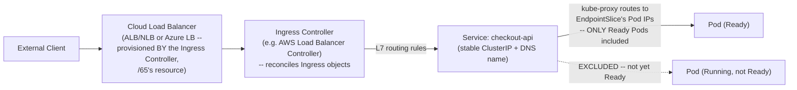
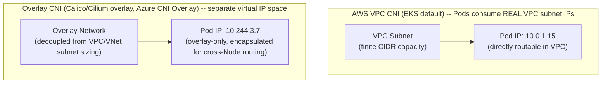
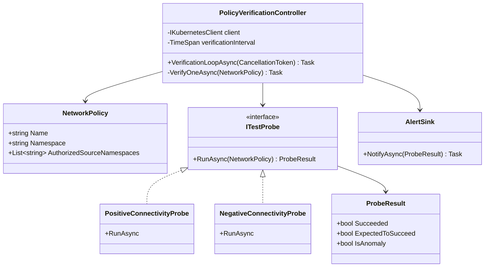
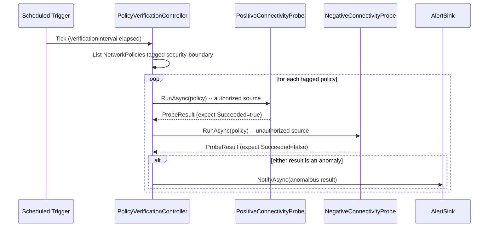

# Module 74 — Kubernetes: Networking — Services, Ingress, CNI, DNS & Network Policies

> Domain: Kubernetes | Level: Beginner → Expert | Prerequisite: [[01-Architecture-ControlPlane-Pods-Deployments]] (Pods are ephemeral with changing IPs — this module is the direct answer to "how do clients reliably reach a Pod whose IP keeps changing"), [[../21-AWS/01-Compute-Networking-VPC-LoadBalancing-AutoScaling]] and [[../22-Azure/01-Compute-Networking-VNet-LoadBalancer-VMSS]] (Kubernetes's LoadBalancer Service type and Ingress Controllers provision the exact ALB/NLB/Application Gateway resources those modules covered, now driven declaratively from inside the cluster)

---

## 1. Fundamentals

### Why does a Principal Engineer need a dedicated Kubernetes networking model beyond "Pods have IP addresses"?
Earlier analysis established that Pods are fundamentally ephemeral — a failed or rescheduled Pod is replaced by an entirely new Pod with a **new** IP address, never the same one restored. Directly addressing Pods by IP is therefore structurally unworkable for anything other than the most trivial, single-Pod scenario: any client (another service inside the cluster, or an external caller) needs a way to reach "the current set of healthy replicas of this application" without needing to track individual, constantly-changing Pod IPs itself. Kubernetes's entire networking model exists specifically to solve this one problem at multiple layers — Services provide a stable internal identity, Ingress provides stable external HTTP(S) entry, CNI provides the underlying flat network Services and Ingress both depend on, and DNS provides human-readable names for all of it — a Principal Engineer needs to understand this layered stack as a coherent answer to one problem (stable addressing over ephemeral compute), not as a disconnected list of separately-memorized objects.

### Why does this matter?
Because nearly every non-trivial Kubernetes networking issue (a service unreachable, unexpected latency, a security-policy gap) traces back to a misunderstanding of exactly which layer of this stack is responsible for which specific behavior — diagnosing "my service isn't reachable" correctly requires knowing whether the failure is at the Service/Endpoints layer, the CNI/Pod-network layer, the Ingress/L7-routing layer, or the DNS layer, since each has an entirely different debugging approach and root-cause space.

### When does this matter?
For any multi-Pod, multi-service Kubernetes application (which is to say, nearly every real production Kubernetes workload) — Service-based addressing, Ingress-based external routing, and NetworkPolicy-based segmentation are foundational, not optional, advanced-only concerns.

### How does it work (30,000-ft view)?
```
CNI (Container Network Interface): the pluggable layer that assigns every Pod a real IP
 and implements Kubernetes's REQUIRED flat network model -- every Pod can reach every
 other Pod's IP directly, cluster-wide, with no NAT in between
Service: a STABLE virtual IP + DNS name, decoupling clients from ephemeral Pod IPs --
 kube-proxy implements the actual Service-IP-to-Pod-IP routing
Endpoints/EndpointSlices: the ACTUAL, continuously-reconciled list of ready Pod IPs
 currently backing a given Service (label-selector-matched's
 reconciliation-loop pattern)
Ingress: L7 HTTP(S) routing INTO the cluster from outside -- requires an Ingress
 Controller to actually do anything; the Ingress object alone is just a declared spec
CoreDNS: cluster-internal DNS, resolving Service names (my-svc.my-namespace.svc.cluster.local)
NetworkPolicy: Pod-to-Pod traffic RESTRICTION -- default-allow-all unless explicitly
 restricted, and only enforced if the cluster's CNI plugin actually supports it
```

---

## 2. Deep Dive

### 2.1 Services — the Stable-Identity Layer Solving the Ephemeral-Pod-IP Problem
A **Service** is a stable virtual IP (a `ClusterIP`, by default) and DNS name that decouples any client from the specific, constantly-changing set of Pod IPs currently backing it. The four Service types serve genuinely different exposure needs: **ClusterIP** (the default — a stable, cluster-internal-only virtual IP, for Pod-to-Pod communication within the cluster); **NodePort** (additionally exposes the Service on a static port on every Node's own IP — a blunt, rarely-used-directly-in-production mechanism, mostly a building block other exposure methods are layered on top of); **LoadBalancer** (provisions an actual cloud load balancer — an AWS NLB/ALB, the exact resource, or an Azure Load Balancer, the exact resource — with the cloud-provider-specific provisioning driven automatically by a **cloud-controller-manager** component watching for `LoadBalancer`-type Services, directly the reconciliation-loop pattern now operating across the Kubernetes-to-cloud-API boundary); and **ExternalName** (a pure DNS-level CNAME redirect to an external, non-Kubernetes-managed hostname, for referencing external dependencies via in-cluster Service-style DNS names). A Principal Engineer should recognize `LoadBalancer`-type Services as the mechanism directly responsible for the cloud load-balancer resources Modules 57/65 covered — from inside the cluster, a team never manually provisions an ALB/NLB/Azure LB for a Kubernetes-hosted service; they declare a `LoadBalancer` Service and the cloud-controller-manager provisions and manages that cloud resource on their behalf.

### 2.2 Endpoints/EndpointSlices — the Actual, Continuously-Reconciled List a Service Routes To
A Service's `selector` (a label match, e.g., `app: checkout-api`) doesn't route traffic itself — it determines which Pods' IPs populate that Service's **EndpointSlice** (the modern, scalable successor to the original `Endpoints` object), and it is the EndpointSlice's actual, continuously-reconciled list of ready Pod IPs that kube-proxy uses to program the Node-level routing rules that make traffic actually reach a Pod. Critically, a Pod is only added to a Service's EndpointSlice once it passes its **readiness probe** — a Pod that is `Running` (the status) but not yet `Ready` is deliberately excluded, meaning "the Pod is Running" and "the Pod is receiving traffic" are genuinely different, independently-verifiable states (directly §Advanced Q8's answer, now given its full mechanical explanation) — a Principal Engineer debugging "traffic isn't reaching my Pod despite it being Running" should check `kubectl get endpoints`/`kubectl get endpointslice` first, specifically to determine whether the gap is a label-selector mismatch or a failing readiness probe, before assuming a deeper networking-layer fault.

### 2.3 CNI — the Pluggable Layer Implementing Kubernetes's Required Flat-Network Model
Kubernetes requires a specific, non-negotiable networking property: **every Pod must be able to reach every other Pod's IP directly, cluster-wide, without NAT** — a materially different (and simpler, from the application's perspective) model than Docker's default bridge networking, which NATs container traffic behind the host's IP. The **Container Network Interface (CNI)** is the pluggable specification and plugin ecosystem responsible for actually implementing this flat-network requirement — assigning each Pod its IP and programming the actual routing/overlay mechanism that makes cross-Node Pod-to-Pod traffic work. Different CNI plugins make genuinely different architectural trade-offs with real capacity-planning consequences: the **AWS VPC CNI** (EKS's default) assigns each Pod a *real, routable VPC IP address* directly from the VPC's own IP address space — meaning Pod IP exhaustion is a genuine VPC-subnet-sizing concern (directly recurring the VPC CIDR-planning discipline, now at Pod-density scale rather than EC2-instance scale) — versus an overlay-based CNI (Calico, Cilium in overlay mode, or Azure CNI Overlay) that assigns Pods IPs from a separate, virtual overlay address space not drawn from the VPC/VNet's own subnet, decoupling Pod-IP capacity planning from VPC/VNet subnet sizing entirely, at the cost of the additional encapsulation overhead the overlay itself introduces. A Principal Engineer selecting or evaluating a CNI plugin must explicitly reason about this trade-off (direct VPC IP consumption and its associated subnet-capacity planning, versus overlay encapsulation overhead) rather than treating "which CNI" as an interchangeable, inconsequential implementation detail.

### 2.4 Ingress and Ingress Controllers — the Object Is a Spec; the Controller Does the Work
An **Ingress** object declares L7 HTTP(S) routing rules (host- and path-based routing to different backend Services, TLS termination) — but, critically, **creating an Ingress object alone does nothing** without an **Ingress Controller** actually running in the cluster and watching for Ingress objects to act on (directly the reconciliation-loop pattern once again — the Ingress Controller is itself a controller, observing Ingress objects as its desired-state input). Common Ingress Controllers include `nginx-ingress` (a self-managed, portable, cloud-agnostic option), the **AWS Load Balancer Controller** (provisions and configures an actual ALB, driven by Ingress objects), and the **Application Gateway Ingress Controller (AGIC)** (drives Azure's Application Gateway, the resource, from Ingress objects). This is a common, easily-missed beginner trap worth flagging explicitly: a team that applies an Ingress manifest in a cluster with no Ingress Controller installed will observe the object exists (`kubectl get ingress` shows it) but nothing actually happens — no load balancer is provisioned, no routing occurs — because the object is purely a declared specification awaiting a controller to reconcile it into real infrastructure, precisely analogous to the Deployment-without-effect-until-reconciled pattern, now at the ingress-routing layer.

### 2.5 CoreDNS — Cluster-Internal DNS, and the Service-Naming Convention
**CoreDNS** runs as the cluster's internal DNS provider (itself deployed as a Deployment — a genuinely "Kubernetes uses Kubernetes to run its own supporting infrastructure" instance), resolving Service names according to a fixed convention: `<service-name>.<namespace>.svc.cluster.local` (commonly abbreviated to just `<service-name>` for same-namespace lookups, or `<service-name>.<namespace>` for cross-namespace lookups, relying on the Pod's configured DNS search-domain suffixes to complete the full name). This DNS layer is what allows application code to address a dependency by a stable, human-readable name (`payment-service`) rather than a Service's virtual IP directly — though the underlying resolution ultimately still returns that stable ClusterIP virtual IP, not a specific Pod IP, meaning DNS resolution and Service-level stable-addressing are complementary, not competing, mechanisms operating at different layers of the same problem.

### 2.6 NetworkPolicy — Default-Allow-All, and the CNI-Support Prerequisite That's Easy to Miss Entirely
By default, Kubernetes permits **all** Pod-to-Pod traffic, cluster-wide, with no restriction whatsoever — a materially different default posture than cloud VPC security groups (/65), which commonly default-deny inbound traffic absent an explicit allow rule. A **NetworkPolicy** object restricts this — declaring explicit ingress/egress rules scoped by label selectors and namespaces, directly/66's least-privilege discipline (IAM policies, RBAC) now applied at the Pod-to-Pod network layer. The critical, easily-missed prerequisite: **NetworkPolicy objects are only enforced if the cluster's CNI plugin actually implements NetworkPolicy support** — not every CNI plugin does (a basic `kubenet` setup, or certain AWS VPC CNI configurations without an additional NetworkPolicy-enforcing add-on, will silently accept a NetworkPolicy object without ever actually enforcing it) — meaning a team can write and apply what looks like a complete, correct network-segmentation policy that is, in practice, **entirely inert**, with traffic flowing exactly as if the policy didn't exist, and no error or warning surfaced anywhere in the object's own status to indicate this — a uniquely dangerous "looks correct on paper, silently unenforced in practice" risk category this course has repeatedly flagged in other contexts (the Event Grid silent-loss default is a structurally similar "no error, just silent absence of the expected behavior" risk), now recurring at the Kubernetes network-security layer specifically.

---

## 3. Visual Architecture

### The Full Request Path: External Client → Ingress → Service → Pod

```mermaid
graph LR
 Client["External Client"] --> LB["Cloud Load Balancer<br/>(ALB/NLB or Azure LB --<br/>provisioned BY the Ingress Controller,<br/>/65's resource)"]
 LB --> IC["Ingress Controller<br/>(e.g. AWS Load Balancer Controller)<br/>-- reconciles Ingress objects"]
 IC -->|"L7 routing rules"| SVC["Service: checkout-api<br/>(stable ClusterIP + DNS name)"]
 SVC -->|"kube-proxy routes to<br/>EndpointSlice's Pod IPs<br/>-- ONLY Ready Pods included"| P1["Pod (Ready)"]
 SVC -.->|"EXCLUDED -- not yet Ready"| P2["Pod (Running, not Ready)"]
```

### CNI: Direct VPC-IP Assignment vs. Overlay Model

```mermaid
graph TB
 subgraph "AWS VPC CNI (EKS default) -- Pods consume REAL VPC subnet IPs"
 VPC["VPC Subnet<br/>(finite CIDR capacity)"] --> PodA["Pod IP: 10.0.1.15<br/>(directly routable in VPC)"]
 end
 subgraph "Overlay CNI (Calico/Cilium overlay, Azure CNI Overlay) -- separate virtual IP space"
 Overlay["Overlay Network<br/>(decoupled from VPC/VNet subnet sizing)"] --> PodB["Pod IP: 10.244.3.7<br/>(overlay-only, encapsulated for cross-Node routing)"]
 end
```

## 4. Production Example
**Scenario**: A platform team supporting a PCI-DSS-scoped payment-processing workload implemented Kubernetes NetworkPolicy objects to enforce network segmentation between the PCI-scoped namespace and the rest of the cluster — a specific compliance requirement mandating that only explicitly-authorized services could reach the payment-processing Pods, with all other in-cluster traffic denied by default. The policies were written, reviewed, and merged following a thorough internal design review, and the team considered the segmentation requirement satisfied. **Investigation**: during the subsequent external PCI compliance audit, the auditor's own penetration test — attempting Pod-to-Pod connections from an unauthorized namespace directly to a PCI-scoped Pod's IP — succeeded, despite the NetworkPolicy objects being present, correctly configured, and showing no error state via `kubectl get networkpolicy`. The team's own internal review had validated the *policy's logical correctness* (the YAML correctly expressed the intended segmentation rules) but had never validated that the policies were actually being **enforced** at the network layer. **Root cause**: the cluster's CNI plugin — the default AWS VPC CNI, without the additional NetworkPolicy-enforcing component (Calico's policy engine, or an equivalent) installed alongside it — did not implement NetworkPolicy enforcement at all; the NetworkPolicy objects were accepted by the API Server and stored, syntactically valid and logically correct, but silently had zero actual effect on real network traffic, exactly the "looks correct on paper, silently inert in practice" risk describes. **Fix**: installed Calico's network-policy-enforcement component alongside the existing AWS VPC CNI (a supported, common configuration — using AWS VPC CNI for IP address management while delegating NetworkPolicy enforcement specifically to Calico), then re-validated the exact same NetworkPolicy objects were now genuinely blocking the previously-successful unauthorized connection attempt, and added an automated, recurring **policy-enforcement verification test** (a scheduled Pod-to-Pod connectivity test explicitly attempting a connection the policy should deny, alerting if it unexpectedly succeeds) rather than relying solely on the policy objects' own declared state as evidence of actual enforcement. **Lesson**: a Kubernetes object's presence and syntactic correctness (`kubectl get networkpolicy` showing no error) provides **zero** evidence that the object is actually having its intended effect at runtime — this is a materially different, and more dangerous, verification gap than most other Kubernetes objects present, since a misconfigured Deployment or Service typically produces some observable symptom (a `Pending` Pod, a `kubectl get endpoints` mismatch), while an unenforced NetworkPolicy produces **no observable symptom at all** short of an actual unauthorized-access attempt (or a deliberate penetration test) succeeding — a Principal Engineer implementing any security-boundary NetworkPolicy must explicitly verify CNI-level enforcement support and validate it with an actual test connection, never trusting policy-object presence alone as evidence of active protection.
## 10. Interview Questions

### Basic (10)
1. **Q: Why can't clients simply address Pods directly by IP?** **A:** Pods are ephemeral — a replaced Pod gets a new IP, never the same one restored, making direct Pod-IP addressing unworkable for anything beyond a single, static Pod.
2. **Q: What are the four Kubernetes Service types?** **A:** ClusterIP (default, internal-only), NodePort, LoadBalancer (provisions a cloud load balancer), and ExternalName (a DNS CNAME to an external hostname).
3. **Q: What determines which Pods a Service actually routes traffic to?** **A:** The Service's EndpointSlice — the continuously-reconciled list of ready Pod IPs matching the Service's label selector.
4. **Q: Does a Pod need to be "Running" or "Ready" to receive traffic from a Service?** **A:** "Ready" — a Pod must pass its readiness probe before being added to the Service's EndpointSlice, even if it's already "Running."
5. **Q: What is CNI, and what network property must every CNI implementation provide?** **A:** Container Network Interface — the pluggable layer assigning Pod IPs; it must provide a flat network where every Pod can reach every other Pod's IP directly, cluster-wide, without NAT.
6. **Q: Does creating an Ingress object alone provision a load balancer?** **A:** No — an Ingress Controller must be running in the cluster to actually reconcile Ingress objects into real routing infrastructure.
7. **Q: What is CoreDNS?** **A:** The cluster's internal DNS provider, resolving Service names in the form `<service>.<namespace>.svc.cluster.local`.
8. **Q: What is the default Pod-to-Pod traffic posture in Kubernetes absent any NetworkPolicy?** **A:** Allow-all — all Pods can reach all other Pods by default, with no restriction.
9. **Q: What prerequisite must be true for a NetworkPolicy to actually have any effect?** **A:** The cluster's CNI plugin must implement NetworkPolicy enforcement — not every CNI plugin does, and an unsupported CNI silently accepts the object without enforcing it.
10. **Q: What did the PCI audit reveal about the team's NetworkPolicy implementation?** **A:** The policies were syntactically correct and applied without error, but the cluster's CNI (AWS VPC CNI without a policy-enforcement add-on) never actually enforced them, so unauthorized traffic still succeeded.

### Intermediate (10)
1. **Q: Why is a Service's stable virtual IP described as the direct solution to the ephemeral-Pod-IP problem?** **A:** A Service provides one fixed address (and DNS name) that persists regardless of how many times its backing Pods are replaced — clients depend on that stable identity instead of tracking individual, constantly-changing Pod IPs themselves.
2. **Q: Why is "the Pod is Running" insufficient evidence that a Service will route traffic to it?** **A:** Only Pods that have passed their readiness probe are added to a Service's EndpointSlice — a Running-but-not-Ready Pod is deliberately excluded from receiving traffic, a distinct, independently-checkable state.
3. **Q: Why does AWS VPC CNI's direct-VPC-IP-assignment model create a capacity-planning concern that an overlay CNI doesn't?** **A:** Because each Pod consumes a real IP from the VPC's own finite subnet CIDR space, Pod density and Node count directly draw down the same finite address pool EC2 instances also draw from — an overlay CNI uses a separate virtual address space decoupled from VPC subnet sizing entirely.
4. **Q: Why is an Ingress object's existence not sufficient evidence that external routing is actually working?** **A:** The Ingress object is purely a declared specification — without an Ingress Controller running and watching for it, nothing reconciles that spec into an actual load balancer or routing configuration, producing no error despite zero effect.
5. **Q: Why is NetworkPolicy's "silently inert if unsupported by the CNI" behavior described as uniquely dangerous compared to most other Kubernetes misconfigurations?** **A:** Most misconfigured objects (a bad Deployment, a mismatched Service selector) produce some observable symptom (a Pending Pod, an empty EndpointSlice); an unenforced NetworkPolicy produces no observable symptom at all short of an actual unauthorized-access attempt succeeding, meaning the gap can go undetected indefinitely without a deliberate test.
6. **Q: Why does the team's internal review fail to catch the NetworkPolicy enforcement gap, despite being thorough?** **A:** The review validated the policy's logical correctness (the YAML correctly expressed the intended rules) but never validated actual runtime enforcement — a category of verification the object's own state provides no signal for, requiring an explicit connectivity test to surface.
7. **Q: Why should a Principal Engineer treat "no NetworkPolicies applied yet" as an active risk rather than a neutral, merely-incomplete state?** **A:** Because the default posture is allow-all, a cluster with zero NetworkPolicies provides zero Pod-to-Pod segmentation — any single compromised Pod can freely reach every other Pod, a materially larger blast radius than an already-partially-secured environment.
8. **Q: Why does the AWS Load Balancer Controller's relationship to Ingress objects mirror the reconciliation-loop pattern?** **A:** The controller continuously watches Ingress objects (the desired state) and reconciles the actual ALB configuration to match — the identical observe-compare-converge structure every Kubernetes controller implements, now operating across the Kubernetes-to-AWS-API boundary specifically.
9. **Q: Why can CoreDNS become a genuine bottleneck at scale, and what are the standard mitigations?** **A:** High query volume from many Pods performing frequent, uncached DNS lookups can overwhelm CoreDNS's own capacity — mitigated via CoreDNS autoscaling (cluster-proportional-autoscaler) and appropriate client-side DNS result caching.
10. **Q: Why is kube-proxy's implementation mode (iptables vs. IPVS vs. eBPF) a genuine scaling concern rather than an interchangeable detail?** **A:** iptables-based rule evaluation scales roughly linearly with the number of Services/Endpoints, becoming a real bottleneck in very large clusters, while IPVS/eBPF-based modes use hash-table lookups with materially better scaling characteristics at high Service counts.

### Advanced (10)
1. **Q: Diagnose the incident from first principles, and design the specific standing verification practice that would catch this class of "policy applied but not enforced" gap for any future security-boundary NetworkPolicy, before an external audit surfaces it.**
 **A:** Root cause: the NetworkPolicy object's successful application provided no signal about actual CNI-level enforcement, and the team's review process validated policy logic without validating runtime effect — a verification-method gap, not a policy-authoring gap. Structural fix: (1) explicitly confirm, and document, the cluster's CNI plugin's NetworkPolicy enforcement capability as a mandatory precondition before relying on any NetworkPolicy for a genuine security boundary; (2) implement an automated, recurring (not one-time) connectivity test — a scheduled job that deliberately attempts a connection each security-boundary NetworkPolicy should deny, alerting immediately if it unexpectedly succeeds — treating this the same way this course has treated DR-strategy validation (§Advanced Q6's DR-drill discipline): an untested security control carries the same unverified risk as an untested DR strategy, and requires the same deliberate, ongoing validation practice rather than one-time authoring-and-review.
2. **Q: A team argues that since their cluster uses the AWS VPC CNI, and AWS VPC Security Groups already provide network-level segmentation at the EC2/ENI layer, Kubernetes-level NetworkPolicy is redundant and can be skipped entirely. Evaluate this claim.**
 **A:** Push back — VPC Security Groups typically operate at Node (EC2 instance/ENI) granularity, not Pod granularity; unless a cluster is using AWS VPC CNI's Security Groups for Pods feature specifically (assigning distinct Security Groups per Pod, a less commonly enabled, more operationally complex configuration), multiple Pods with different security requirements are very likely co-located on the same Node sharing the same Security-Group-level network boundary, meaning Security Groups alone cannot express "Pod A on this Node can talk to Pod C, but Pod B on the same Node cannot" — NetworkPolicy operates at the correct granularity (Pod-label-selector-based) for this requirement, and is not redundant with Node/ENI-level Security Groups unless the more specialized Security-Groups-for-Pods feature is deliberately adopted and its own granularity explicitly verified sufficient.
3. **Q: Design the specific test suite (extending the fix) that would provide genuine, ongoing confidence that a PCI-scoped namespace's NetworkPolicy segmentation remains correctly enforced as the cluster evolves (new CNI version, new NetworkPolicy objects added by other teams, cluster upgrades).**
 **A:** (1) A positive-and-negative connectivity test pair for every declared segmentation boundary: confirm an *authorized* Pod-to-Pod connection still succeeds (catching an overly-restrictive regression) AND confirm an *unauthorized* connection still fails (catching an under-enforcement regression, the exact incident) — testing both directions, since a test suite validating only "unauthorized traffic is blocked" wouldn't catch a policy that's become so restrictive it also breaks legitimate traffic. (2) Run this test suite on every cluster upgrade and CNI version change specifically, not just on a fixed schedule, since a CNI upgrade is a plausible trigger for an enforcement-behavior regression the scheduled-only test might not catch promptly. (3) Alert on NetworkPolicy object changes in the PCI-scoped namespace specifically, requiring the connectivity test suite to re-run and pass before considering the change complete, directly the same "automated pipeline governance gate" pattern this course established §Advanced Q1/Q10.
4. **Q: A workload's application code performs a fresh DNS lookup for a dependency's Service name on every single request, rather than caching the resolved IP, based on the reasoning that "the Service's IP might change." Evaluate this reasoning against the actual Service-IP stability guarantee.**
 **A:** The reasoning is based on an incorrect premise — a Service's `ClusterIP` is stable for the Service's entire lifetime (it does not change as backing Pods are replaced; that's precisely the problem the Service abstraction solves), so per-request DNS re-resolution provides no genuine correctness benefit for ClusterIP-based Services specifically, while adding real, unnecessary load to CoreDNS (the genuine bottleneck risk) at scale; appropriate, bounded-TTL client-side DNS caching (rather than either "never cache" or "cache forever") is the correct middle ground, and the "IP might change" concern is more legitimately applicable to Endpoints-level Pod IP changes (which DNS resolution to the ClusterIP already abstracts away entirely) than to the Service's own ClusterIP.
5. **Q: Critique the following claim: "Since our Ingress Controller successfully provisions and updates our ALB whenever we change our Ingress object, our external routing configuration is fully validated and correct."**
 **A:** Incomplete — successful ALB provisioning/update confirms the Ingress Controller correctly reconciled the Ingress object's *syntax* into real infrastructure, but says nothing about whether the *routing rules themselves* are semantically correct for the intended traffic pattern (a host/path rule that inadvertently routes production traffic to a staging backend Service, for instance, would provision and update the ALB successfully while still being a genuine, undetected routing bug) — "the reconciliation succeeded" and "the resulting behavior is correct" are different claims, directly recurring this course's broader "syntactic/mechanical success doesn't guarantee semantic correctness" theme (echoing the NetworkPolicy finding at the routing-configuration layer instead of the enforcement layer) — validating actual end-to-end request routing behavior (not just successful object reconciliation) remains necessary.
6. **Q: A Principal Engineer is evaluating a CNI migration (from AWS VPC CNI to an overlay-based CNI like Cilium) for a cluster that's begun hitting VPC subnet IP exhaustion under Pod-dense scaling. Design the specific validation this migration requires beyond confirming the new CNI resolves the IP-exhaustion problem.**
 **A:** Beyond confirming overlay-based IP assignment resolves subnet exhaustion (the core trade-off), explicitly validate: (1) NetworkPolicy enforcement behavior is preserved or improved, not silently degraded, across the CNI change (the exact risk category, now triggered by a CNI migration rather than an initial misconfiguration — directly Advanced Q3's "test on every CNI version/type change" discipline); (2) the overlay's encapsulation overhead is benchmarked against the cluster's actual latency/throughput-sensitive workloads before migrating production traffic, not assumed negligible; (3) any existing tooling or observability that assumed direct VPC-IP-based Pod addressing (VPC Flow Logs analysis, security tooling keyed to real VPC IPs) is re-validated against the new overlay-IP model, since Pod IPs under the new CNI will no longer correspond to real, VPC-Flow-Log-visible addresses the same way.
7. **Q: Explain why the incident's core lesson — "object presence and syntactic validity provide zero evidence of runtime enforcement" — generalizes beyond NetworkPolicy to other Kubernetes security-adjacent objects, and identify one other object category where this same verification gap could plausibly recur.**
 **A:** The same gap structurally applies to any Kubernetes object whose entire purpose is *restricting or gating* behavior rather than *creating* it, where the underlying enforcement depends on a separate component correctly implementing that restriction: **Pod Security Admission** labels/policies restrict what a Pod spec is permitted to declare, but depend on the admission controller being correctly configured and enabled — a cluster where Pod Security enforcement mode is misconfigured (e.g., set to `audit` or `warn` rather than `enforce`) would similarly show the policy objects present and syntactically valid while providing zero actual blocking enforcement, the identical "looks correct on paper, silently permissive in practice" risk category NetworkPolicy demonstrated here.
8. **Q: A team's Ingress Controller is nginx-ingress, chosen for cloud-portability reasons over the cloud-native AWS Load Balancer Controller / AGIC options. Identify the specific operational trade-off this choice introduces relative to/65's cloud-native load-balancer integration, beyond the general portability benefit.**
 **A:** nginx-ingress runs as Pods *within* the cluster (fronted by a `LoadBalancer`-type Service that provisions a comparatively "dumb," L4 cloud load balancer purely to reach the nginx Pods) rather than driving a cloud-native L7 load balancer (ALB/Application Gateway) directly — meaning L7-specific cloud-native features (AWS WAF integration directly on the ALB, Application Gateway's integrated WAF, per the Azure-native security tooling) aren't natively available the same way they are when the AWS Load Balancer Controller or AGIC drives the actual cloud L7 resource directly; the portability benefit (identical Ingress behavior across any Kubernetes cluster, any cloud) is real, but trades away tighter integration with cloud-native L7 security/observability tooling specific to whichever cloud is actually hosting the cluster — a genuine, explicit trade-off a Principal Engineer should weigh rather than defaulting to either option without considering it.
9. **Q: Design the layer-by-layer debugging methodology for "external users cannot reach my application" specifically (as distinct §Advanced Q9's internal Pod-health-focused methodology), synthesizing this module's Ingress/Service/CNI/DNS layers.**
 **A:** (1) Confirm DNS resolution for the external hostname actually resolves to the expected load-balancer IP/hostname (ruling out a DNS-layer issue before anything Kubernetes-specific). (2) Confirm the Ingress Controller is actually running (`kubectl get pods -n <ingress-controller-namespace>`) and has successfully reconciled the specific Ingress object (`kubectl describe ingress`, checking for reconciliation errors or an unset `ADDRESS` field, per the "object exists but nothing happened" risk). (3) Confirm the target Service's EndpointSlice actually has ready Pod IPs registered (the Running-vs-Ready distinction, and §Advanced Q9's layer-3 check, now composed with this module's external-path layers). (4) If all of the above check out but connectivity still fails, check NetworkPolicy objects for an unintended deny rule blocking traffic from the Ingress Controller's own Pods to the target Service's Pods (the enforcement risk, now as a *false-positive-block* rather than a *false-negative-miss* scenario) — this ordered sequence (DNS → Ingress Controller/object reconciliation → Service/EndpointSlice readiness → NetworkPolicy) isolates the failure to one specific, independently-debuggable layer at each step, rather than guessing across the full external-request path at once.
10. **Q: As a Principal Engineer establishing Kubernetes networking standards for a new platform team, design the specific set of standing architectural decisions and automated checks (synthesizing this entire module) required before any production workload is permitted onto the cluster.**
 **A:** (1) An explicit, documented CNI choice with its IP-capacity-planning model (direct VPC-IP vs. overlay) sized against projected Pod-density growth, reviewed the same way the VPC CIDR planning is reviewed. (2) Mandatory verification that the chosen CNI supports NetworkPolicy enforcement, with that verification itself automated and re-run on every CNI version change (Advanced Q1, Advanced Q3) — no security-boundary NetworkPolicy relied upon in production without this confirmed. (3) A standing, automated positive-and-negative connectivity test suite for every declared namespace-segmentation boundary (Advanced Q3), integrated into the deployment pipeline the same way this course's other governance gates have been (/72's synthesis). (4) A documented Ingress Controller choice with its specific cloud-integration trade-offs (Advanced Q8) explicitly evaluated against the organization's actual L7 security/observability requirements, not defaulted without consideration. (5) The layer-by-layer external-connectivity debugging runbook (Advanced Q9) published and required reading for on-call engineers, specifically because an ungoverned, ad hoc debugging approach across this many distinct layers (DNS, Ingress, Service, CNI, NetworkPolicy) risks exactly the kind of prolonged, unfocused incident-response time this course has repeatedly identified as avoidable with a structured, layer-isolating methodology.

### Expert (10)
1. **Q: A payment-gateway service intermittently experiences ~5-second latency spikes specifically when calling an external payment processor's HTTPS API — internal, Service-to-Service calls are unaffected. Diagnose the likely cause using §7.3, and design the fix.**
 **A:** This is the well-documented dual-stack DNS-resolution-plus-conntrack-race pattern: the outbound call's hostname resolution issues parallel A and AAAA queries from the same source port; in the absence of IPv6 connectivity/CoreDNS AAAA support, the AAAA query is doomed to fail, and a Linux `conntrack` UDP race between the two near-simultaneous queries occasionally causes one to be silently dropped rather than answered, forcing the resolver to fall back to its full retry timeout — commonly landing very close to 5 seconds. Internal Service-to-Service calls are unaffected because those typically resolve via CoreDNS's own optimized internal search-path resolution with fewer redundant queries, while the *external* processor's hostname requires a full, uncached, external DNS chain with the dual-query behavior fully exposed. Fix: configure the application's resolver (or the Pod's `dnsConfig`) to disable unnecessary AAAA lookups where IPv6 truly isn't used, and apply the well-known `single-request`/`single-request-reopen` glibc resolver option (or an equivalent musl/Alpine-specific mitigation) to serialize rather than parallelize the A/AAAA queries, avoiding the conntrack race entirely.
 **Why correct:** Correctly identifies the specific, well-known root-cause mechanism (dual-stack parallel query + conntrack race) rather than a generic "DNS is slow" diagnosis, and ties the fix to the specific resolver-level mitigation.
 **Common mistakes:** Assuming CoreDNS itself is slow or under-provisioned without first checking whether the specific 5-second-interval pattern matches this well-documented resolver-level race rather than genuine CoreDNS load.
 **Follow-ups:** "How would you confirm this diagnosis without changing any configuration first?" (Packet capture on the affected Pod during a reproduction, specifically checking for a dropped/unanswered AAAA query alongside a successfully-answered A query for the same lookup.)

2. **Q: A team's overlay CNI (Calico VXLAN) has been running without issue, but a newly-deployed, high-packet-rate market-data-distribution service begins reporting elevated tail latency and occasional dropped, oversized packets. Diagnose using §7.1.**
 **A:** Two independent, compounding causes to check: (1) the overlay's per-packet VXLAN encapsulation CPU cost disproportionately affects a high-packet-rate, small-payload workload, since fixed per-packet overhead dominates total cost at that traffic shape (§7.1) — measurable via elevated CPU on the CNI's own per-Node agent process during load; (2) an MTU misconfiguration — if the underlying network's MTU wasn't reduced to account for the VXLAN encapsulation header's added bytes, packets sized near the *unadjusted* MTU are fragmented or dropped once encapsulated, a common, easily-missed overlay-specific failure mode. Fix: verify and correct the Node/CNI MTU setting to properly account for encapsulation overhead, and consider migrating this specific high-throughput workload to a native/direct-routing CNI mode (or a dedicated Node pool using one), rather than assuming the overlay's overhead is negligible for every workload profile uniformly.
 **Why correct:** Identifies both the CPU-overhead and MTU-fragmentation failure modes as distinct, both plausible, and both directly tied to the overlay-encapsulation mechanism named in §7.1.
 **Common mistakes:** Attributing the symptom purely to "the CNI is slow" without checking the specific MTU-fragmentation mechanism, which produces a categorically different, more acute symptom (drops, not just elevated latency) than pure CPU overhead alone.
 **Follow-ups:** "Why would this workload not have shown the issue at lower traffic volume during earlier testing?" (Per-packet fixed overhead and MTU-boundary edge cases both scale with packet rate and payload-size distribution — a lower-volume test may never have generated packets near the fragmentation boundary or enough aggregate CPU load to surface throttling.)

3. **Q: A cluster migrates its Service-routing implementation from iptables-mode kube-proxy to IPVS mode, expecting reduced CPU usage at their ~800-Service scale. Post-migration, CPU usage on Nodes drops as expected, but a subset of long-lived TCP connections begin experiencing unexpected resets. Using §7.2, diagnose the likely cause.**
 **A:** IPVS mode's connection-tracking and load-balancing-algorithm behavior differs from iptables mode in ways that can affect long-lived connections during the *transition* specifically — existing connections established under the old iptables NAT rules aren't automatically, transparently migrated to IPVS's own connection-tracking state when kube-proxy's mode is switched live; a rolling kube-proxy mode change should be treated as a connection-disruptive event for any in-flight long-lived connection, requiring the same "existing connections may be reset" caution applied to any load-balancer or proxy-layer reconfiguration — the fix isn't a bug to patch in IPVS itself, but a planned, off-peak migration window with client-side reconnection/retry logic already in place, rather than expecting a live, in-place mode switch to be fully transparent to already-established long-lived connections.
 **Why correct:** Correctly identifies that the reset is an expected consequence of changing the underlying connection-tracking mechanism mid-flight, not a defect in IPVS's steady-state behavior, and reframes the fix as migration-planning rather than a technical bug fix.
 **Common mistakes:** Concluding IPVS mode is unreliable or defective based on a transition-specific symptom rather than distinguishing transition-time disruption from steady-state behavior.
 **Follow-ups:** "How would you validate IPVS mode's steady-state behavior is genuinely correct before committing to the migration cluster-wide?" (A canary migration on a subset of Nodes first, monitoring connection-reset rates and Service-routing correctness in isolation before a full cluster-wide rollout.)

4. **Q: A PCI compliance auditor asks the platform team to demonstrate that cardholder data is encrypted in transit "end-to-end, including internally," for a payment service exposed via Ingress. The team points to the Ingress object's `tls` block as evidence. Evaluate this evidence using §8.2, and design what additional evidence would actually satisfy the requirement.**
 **A:** The Ingress `tls` block alone only proves encryption from the external client to the Ingress Controller — it says nothing about the Ingress-Controller-to-backend-Service segment, which is plaintext HTTP by default unless separately configured. To genuinely satisfy an "end-to-end, including internally" requirement, the team must additionally demonstrate either: re-encryption configuration from the Ingress Controller to the backend (a `backend-protocol: HTTPS` annotation or equivalent, with the backend Service itself terminating TLS), or mesh-provided automatic mTLS (§07 of this domain) covering that internal segment with its own PeerAuthentication STRICT-mode verification (not merely PERMISSIVE-mode presence, per this domain's Service Mesh module) — the Ingress `tls` block by itself is necessary but not sufficient evidence, and presenting it alone to an auditor without addressing the internal segment is the exact kind of incomplete-evidence gap a rigorous audit is specifically designed to catch.
 **Why correct:** Correctly identifies the precise boundary where the Ingress `tls` block's guarantee stops and connects the remaining gap to concrete, verifiable additional evidence rather than a vague "add more encryption."
 **Common mistakes:** Treating "the Ingress has a TLS certificate" as sufficient proof of end-to-end encryption without tracing the request path past the termination point.
 **Follow-ups:** "What's the fastest way to verify the internal segment's actual encryption status without reading every controller's configuration by hand?" (A packet capture or `tcpdump` on the backend Pod's own network namespace during a live request, directly observing whether the Ingress-Controller-to-Pod traffic is plaintext or TLS.)

5. **Q: A cert-manager-issued Certificate for a customer-facing payment API expires unexpectedly, causing a full outage for all clients calling that hostname. Post-incident review finds cert-manager's renewal had been silently failing for six weeks due to an expired ACME account key. Design the specific monitoring gap this incident reveals and its fix, per §8.3.**
 **A:** The gap: the team monitored certificate *presence* (the Certificate object existed, `kubectl get certificate` showed no error) and application-level uptime, but never monitored *days-until-expiry* as an independently-alerted signal — cert-manager's renewal failures were logged but not proactively surfaced anywhere the team was watching, so the first actual signal anyone received was the certificate's hard expiry itself, at which point it was already a live outage. Fix: alert on the `certmanager_certificate_expiration_timestamp_seconds` Prometheus metric (or equivalent) crossing a well-ahead-of-expiry threshold (e.g., 14 days), independent of and in addition to any renewal-success/failure event logging — treating certificate expiry monitoring the same way this domain treats every other "don't trust the control's own reported success" gap: verify the actual, externally-observable outcome (time remaining until expiry), not merely that a renewal process exists and appeared to run.
 **Why correct:** Correctly identifies the specific missing signal (days-until-expiry, independently alerted) as distinct from both renewal-event logging and certificate-object presence, and generalizes the fix to this domain's recurring verification discipline.
 **Common mistakes:** Proposing "just fix the ACME account key" as the complete fix, without addressing the structural monitoring gap that let the failure go undetected for six weeks in the first place.
 **Follow-ups:** "Why is a 14-day alerting threshold more defensible than, say, a 1-day threshold?" (A 14-day window provides realistic lead time to diagnose and fix a renewal failure — including one requiring a manual DNS or ACME-provider-side fix — well before the certificate actually expires, versus a 1-day threshold leaving effectively no safe remediation window.)

6. **Q: Two Ingress objects in the same cluster both declare a rule matching `path: /` on the same host, routed to two different backend Services, created by two different teams unaware of each other's Ingress object. Using §8.4, evaluate the risk and design a governance fix.**
 **A:** This is a genuine access-control risk, not merely a routing ambiguity — depending on the specific Ingress Controller's own tie-breaking behavior (often based on creation timestamp, rule specificity, or an undefined/implementation-specific order), traffic intended for one backend could silently route to the other, including a scenario where a broadly-scoped internal/debug Service becomes unintentionally reachable via a path a different team intended for their own public-facing backend. The governance fix is treating Ingress rule review with the same rigor as NetworkPolicy/AuthorizationPolicy review (§8.4's explicit framing) — a required, automated pre-merge check (an admission webhook or CI policy check, e.g., via OPA/Gatekeeper) that rejects any newly-applied Ingress object whose host/path combination overlaps an existing one without an explicit, reviewed exception, rather than relying on teams to manually notice each other's Ingress objects.
 **Why correct:** Correctly frames the ambiguity as a genuine security risk (not just a bug) and proposes a structural, automated governance mechanism rather than a manual coordination fix that wouldn't scale across independent teams.
 **Common mistakes:** Treating this purely as a routing-correctness bug to be fixed reactively once discovered, rather than a systemic governance gap requiring a preventive, automated check.
 **Follow-ups:** "What Kubernetes mechanism would you use to implement the automated pre-merge check?" (A validating admission webhook, or a policy-as-code tool like OPA/Gatekeeper, evaluated at `kubectl apply` time before the conflicting Ingress is ever persisted.)

7. **Q: A platform team is deciding whether to route all external traffic to 200+ backend Services through a single, shared nginx-ingress fleet, or split traffic across three separately-scaled Ingress Controller classes (public web, partner API, internal admin). Using §9.2, design the recommendation.**
 **A:** A single, shared Ingress Controller fleet concentrates all external-traffic capacity behind one load balancer/connection-limit ceiling (§9.2) and one shared blast radius — a traffic spike or misconfiguration on the partner-API traffic class could degrade the unrelated public-web traffic class sharing the same front door, with no isolation between genuinely different traffic profiles (partner APIs typically have very different rate-limiting, authentication, and burst-tolerance requirements than public web traffic). Splitting into separately-scoped Ingress Controller classes, each with its own load balancer and independent autoscaling, isolates each traffic class's capacity and blast radius from the others — the recommendation is the split architecture specifically because the three traffic classes have genuinely different operational profiles (not merely different logical purposes), which is the concrete bar this course applies before recommending additional infrastructure complexity.
 **Why correct:** Grounds the recommendation in the specific, articulated difference between the traffic classes' operational profiles, rather than splitting Ingress Controllers reflexively "for isolation" without a concrete justification.
 **Common mistakes:** Recommending a single shared Ingress Controller purely for operational simplicity, without weighing the blast-radius concentration risk across genuinely different traffic classes.
 **Follow-ups:** "What would change the recommendation back toward a single shared fleet?" (If all three traffic classes genuinely shared very similar rate-limiting, auth, and burst profiles, the isolation benefit would be materially smaller, and the added operational overhead of three separately-managed fleets would no longer be clearly justified.)

8. **Q: A cluster serving a Service with 3,000 backing Pod replicas experiences elevated kube-proxy CPU and propagation delay on every single Pod restart, even though the cluster already migrated to EndpointSlices. Diagnose using §9.3 whether EndpointSlices alone fully solves this, and identify what else might be contributing.**
 **A:** EndpointSlices solve the *specific* problem of a single, monolithic `Endpoints` object requiring a full rewrite on every Pod change — but at 3,000 replicas, even sharded across 100-endpoint slices, a single Pod restart still requires kube-proxy on every Node to receive, process, and re-program routing rules for the *specific* affected slice, and the aggregate rate of such changes (a rolling deployment restarting many Pods in sequence) can still produce a meaningful, sustained propagation and CPU cost at this scale — EndpointSlices reduce the *per-change* cost dramatically versus the legacy object, but don't eliminate the fundamentally proportional relationship between total change *rate* and total propagation cost. At this Pod count, kube-proxy's own implementation mode (§7.2 — IPVS or eBPF rather than iptables) becomes the more consequential lever, since it addresses the *lookup* cost side of the problem that EndpointSlices' sharding doesn't directly touch.
 **Why correct:** Correctly distinguishes what EndpointSlices actually fixed (per-change object size) from what remains unaddressed (aggregate change-rate propagation cost and kube-proxy's own lookup-cost implementation), avoiding the common overcorrection of assuming EndpointSlices alone are a complete scaling solution.
 **Common mistakes:** Assuming EndpointSlices fully resolve any Service-scaling symptom at any replica count, without checking whether the remaining bottleneck has since shifted to kube-proxy's own implementation mode.
 **Follow-ups:** "Would this same symptom appear identically on an eBPF-based dataplane like Cilium?" (Meaningfully reduced, not eliminated — eBPF avoids both the iptables chain-traversal and userspace-kernel context-switch costs kube-proxy's control loop introduces, but the underlying need to propagate a change to every Node's dataplane on every Pod restart remains a proportional cost at this Pod-churn rate.)

9. **Q: Design the specific test that would distinguish "our service mesh's mTLS coverage genuinely extends across the Ingress-to-backend segment" from "we assume it does because the mesh is generally enabled," directly extending §8.2's finding with §07's mesh-verification discipline.**
 **A:** A packet capture (or an explicit, scheduled synthetic test asserting the connection's negotiated protocol) taken specifically on the segment between the Ingress Controller's egress and the backend Pod's ingress — confirming the observed traffic is genuinely TLS (or mTLS, if mesh-mediated) rather than inferring it from configuration intent — is the only evidence that actually closes this gap; a mesh's PeerAuthentication being set to STRICT for the backend namespace is necessary but insufficient on its own unless the Ingress Controller's own traffic to that backend is confirmed to be mesh-injected and thus actually subject to STRICT enforcement (an Ingress Controller running outside the mesh's own sidecar injection would connect to the backend as an *unmeshed* client, and depending on the backend's PeerAuthentication scope, that connection might still be permitted as plaintext even under a nominally STRICT policy, if the policy's selector doesn't happen to cover cross-boundary traffic the way the team assumed).
 **Why correct:** Correctly identifies that mesh enablement alone doesn't guarantee the specific Ingress-to-backend segment is covered, and specifies concrete, observable verification (packet capture / synthetic protocol assertion) over inferred configuration intent.
 **Common mistakes:** Assuming "the mesh is on for this namespace" automatically implies every inbound connection to that namespace, including from an unmeshed Ingress Controller, is covered by STRICT mTLS enforcement.
 **Follow-ups:** "How would you make the Ingress Controller itself mesh-aware to close this specific gap?" (Deploy the Ingress Controller's own Pods within a mesh-injected namespace, or use the mesh's own Gateway resource type instead of a standard Kubernetes Ingress, so the Ingress Controller's own egress to the backend is itself a mesh-mediated, mTLS-covered hop.)

10. **Q: As a Principal Engineer establishing a networking-layer incident-response runbook synthesizing this entire module's failure modes (DNS/conntrack, CNI overhead, kube-proxy mode, NetworkPolicy enforcement, Ingress TLS boundary, cert-manager renewal, Ingress rule conflicts), design the ordered diagnostic triage sequence an on-call engineer should follow for a generic "external users report intermittent failures reaching our API" page.**
 **A:** (1) Check certificate validity/days-until-expiry first (§Expert Q5) — the single fastest, highest-severity, binary check (a certificate either is or isn't about to expire), ruling out the most catastrophic single-cause failure mode before investigating anything more nuanced. (2) Check whether the symptom is genuinely intermittent/latency-shaped (pointing toward §Expert Q1's DNS/conntrack pattern or §7.4's Ingress Controller capacity ceiling) versus a hard, total failure (pointing toward §Advanced Q9's layer-by-layer connectivity methodology — Ingress Controller health, EndpointSlice readiness, NetworkPolicy). (3) If intermittent and correlated with a specific external dependency's hostname, apply §Expert Q1's DNS-resolution diagnostic directly. (4) If correlated with overall traffic volume/rate rather than any specific hostname, check Ingress Controller-level request-rate and CPU metrics against its own configured capacity (§7.4/§9.2) before assuming a deeper, more exotic cause. (5) Only after ruling out the above, investigate Ingress rule conflicts (§Expert Q6) or an unintended NetworkPolicy block, since these are comparatively rare, configuration-drift-driven causes rather than the load-bearing, higher-probability causes checked first. This ordered sequence prioritizes the fastest-to-check, most catastrophic, and most probable causes before the rarer, more investigation-intensive ones — directly the same probability-and-severity-ordered triage discipline this course applies to every domain's synthesized incident-response runbook.
 **Why correct:** Synthesizes every distinct failure mode this module and its predecessor established into one coherent, priority-ordered runbook, explicitly justifying the ordering by speed-to-check, severity, and base-rate probability rather than an arbitrary listing.
 **Common mistakes:** Presenting the failure modes as an unordered checklist without justifying why any particular one should be checked first, missing the actual operational value of a genuine triage sequence under time pressure.
 **Follow-ups:** "Which single step in this sequence would you automate first as a synthetic, continuously-running check rather than a manual on-call step?" (Certificate days-until-expiry alerting, since it's both the highest-severity single cause and the one most amenable to fully automated, proactive detection well ahead of any actual user-facing symptom.)

---

## 11. Coding Exercises

### Easy — A ClusterIP Service and its label-selector relationship to a Deployment's Pods
```yaml
apiVersion: v1
kind: Service
metadata:
 name: checkout-api
spec:
 type: ClusterIP # stable, cluster-internal-only virtual IP
 selector:
 app: checkout-api # MUST match the Deployment's Pod template labels exactly --
 # a mismatch here is the #1 cause of "Running but unreachable" Pods
 ports:
 - port: 80
 targetPort: 8080
```

### Medium — Diagnosing "Running but not receiving traffic" via EndpointSlice inspection (§Advanced Q9)
```bash
# Step 1 -- confirm the Pod itself is genuinely Ready, not just Running
kubectl get pods -l app=checkout-api
# NAME READY STATUS RESTARTS AGE
# checkout-api-7f8b-x2k4p 0/1 Running 0 3m <- 0/1 READY, the actual signal

# Step 2 -- confirm whether the Service's EndpointSlice actually includes this Pod's IP
kubectl get endpointslice -l kubernetes.io/service-name=checkout-api
# if the Pod's IP is absent here despite Running status, the readiness probe is failing --
# check the probe configuration and the Pod's actual readiness-check response next
kubectl describe pod checkout-api-7f8b-x2k4p | grep -A 5 "Readiness"
```

### Hard — A NetworkPolicy enforcing namespace segmentation, plus its required verification test
```yaml
apiVersion: networking.k8s.io/v1
kind: NetworkPolicy
metadata:
 name: pci-namespace-deny-by-default
 namespace: pci-payments
spec:
 podSelector: {} # applies to ALL Pods in this namespace
 policyTypes: [Ingress]
 ingress:
 - from:
 - namespaceSelector:
 matchLabels: { name: pci-authorized-callers } # ONLY this namespace may connect
```
```bash
# MANDATORY verification (the lesson) -- policy application succeeding proves NOTHING
# about actual enforcement. Confirm both directions explicitly:

# (a) Positive test -- authorized namespace CAN still reach the PCI Pod
kubectl run test-authorized -n pci-authorized-callers --rm -it --image=curlimages/curl -- \
 curl -sf --max-time 3 http://payment-svc.pci-payments.svc.cluster.local && echo "PASS: authorized traffic allowed"

# (b) Negative test -- unauthorized namespace is ACTUALLY blocked, not just "should be" per the YAML
kubectl run test-unauthorized -n default --rm -it --image=curlimages/curl -- \
 curl -sf --max-time 3 http://payment-svc.pci-payments.svc.cluster.local && \
 echo "FAIL: unauthorized traffic succeeded -- CNI is NOT enforcing this policy" || \
 echo "PASS: unauthorized traffic correctly blocked"
```

### Expert — An Ingress with host/path routing across two Services, TLS termination, and explicit Ingress-Controller-readiness verification
```yaml
apiVersion: networking.k8s.io/v1
kind: Ingress
metadata:
 name: platform-ingress
 annotations:
 kubernetes.io/ingress.class: "alb" # explicitly targets the AWS Load Balancer Controller
spec:
 tls:
 - hosts: ["api.platform.com"]
 secretName: platform-tls-cert
 rules:
 - host: api.platform.com
 http:
 paths:
 - path: /checkout
 pathType: Prefix
 backend: { service: { name: checkout-api, port: { number: 80 } } }
 - path: /payments
 pathType: Prefix
 backend: { service: { name: payment-svc, port: { number: 80 } } }
```
```bash
# The object applying successfully (the trap) proves nothing about reconciliation --
# explicitly confirm the Ingress Controller has actually provisioned real infrastructure:
kubectl describe ingress platform-ingress | grep -A 3 "Address\|Events"
# an empty ADDRESS field after several minutes indicates the Ingress Controller either
# isn't running, or has a reconciliation error -- check its own Pod logs next, not the
# application's logs, per this module's layer-isolating debugging discipline.
```

---

## 12. System Design

**Prompt:** Design the networking architecture for a payments platform exposing a public-facing payment-initiation API, a partner-facing settlement-reporting API, and an internal admin console — all hosted on the same Kubernetes cluster, with a PCI-DSS requirement for encrypted, access-controlled traffic at every hop.

**Requirements:**
- *Functional:* external clients reach the payment-initiation API over HTTPS; partner systems reach the settlement-reporting API over HTTPS with mutual-certificate client authentication; the admin console is reachable only from the corporate VPN, never the public internet; every internal service-to-service call within the payments namespace is encrypted and explicitly authorized.
- *Non-functional:* p99 added networking-layer latency under 15ms per external request; DNS resolution failures must not cascade into payment-processing failures; the platform must produce audit-ready evidence (not just configuration) that every stated encryption/access-control requirement is genuinely enforced, per this module's central lesson.

**Architecture — two flows, treated separately, mirroring this domain's own external-vs-internal traffic split:**
*External ingress flow:* three separate Ingress Controller classes (§9.2) — one for public payment-initiation traffic (aggressive rate-limiting, WAF-integrated via the AWS Load Balancer Controller/ALB, §Intermediate Q8), one for partner settlement traffic (mutual-TLS client-certificate verification configured at the Ingress/Gateway layer, since partner authentication is a stronger requirement than the public API's), and the admin console exposed only via an internal-facing load balancer reachable solely through the corporate VPN's private routing — never via a public-facing Ingress class at all, so a public-facing misconfiguration structurally cannot expose it.
*Internal service-mesh flow:* the payments namespace runs with mesh sidecar injection enabled (§07 of this domain) and PeerAuthentication in verified STRICT mode (not merely present, §8.2's Ingress-to-backend gap explicitly closed by making the Ingress Controller itself mesh-injected for the payment-initiation and settlement-reporting paths specifically), with AuthorizationPolicy rules scoping exactly which ServiceAccount may call which specific internal route.

**Components:** Per-traffic-class Ingress Controller (public, partner, internal-admin); cert-manager (§8.3) issuing and auto-renewing both the external-facing certificates and the mesh's internal workload certificates, with days-until-expiry alerting as a mandatory, independent signal; a default-deny-all NetworkPolicy baseline in the payments namespace with narrowly-scoped allow rules per genuine dependency and explicit egress restriction to the payment processor's known endpoints only (§8.1); CoreDNS sized via cluster-proportional-autoscaler (§9.4) given the payment-initiation path's DNS-lookup-on-hot-path sensitivity (§7.3).

**Database selection:** Not directly networking-relevant, but the settlement-reporting API's partner-facing read path should be served from a read-optimized replica isolated at the NetworkPolicy layer from the payment-initiation write path's own datastore access, so a partner-traffic spike cannot contend with payment-initiation's own database connection pool.

**Caching:** DNS resolution results for the payment processor's external hostname should be bounded-TTL cached client-side (§Advanced Q4) to reduce hot-path CoreDNS dependency, while remaining short enough to pick up a genuine DNS-level failover if the processor rotates endpoints.

**Messaging:** Any asynchronous settlement-reconciliation event flow (outside this module's direct scope) should be treated as a separate security boundary from the synchronous API paths described here — mesh mTLS and NetworkPolicy coverage do not automatically extend to a message broker's own wire protocol, worth flagging explicitly in the design review.

**Scaling:** Each Ingress Controller class autoscaled independently against its own request-rate/CPU metrics (§7.4/§9.2); CoreDNS autoscaled proportionally to cluster size (§9.4); kube-proxy running in IPVS or eBPF mode given the payments namespace's expected Service count and connection churn (§7.2).

**Failure handling:** A DNS resolution failure for the external payment processor's hostname must not synchronously block the payment-initiation request path indefinitely — a bounded resolution timeout with a fast-fail-and-queue-for-retry path (rather than a request hanging for the full ~5-second worst-case resolver timeout, §Expert Q1) is a required design element specifically because that failure mode is well-documented and predictable, not a rare edge case to handle reactively.

**Monitoring:** Per-Ingress-class request-rate/latency/error dashboards; certificate days-until-expiry alerting for every live certificate (external and mesh-internal, §8.3); a standing, automated positive-and-negative NetworkPolicy connectivity test suite (§Advanced Q3) re-run on every CNI or NetworkPolicy change; DNS query-latency and CoreDNS saturation metrics watched specifically on the payment-initiation path.

**Trade-offs:** Running three separate Ingress Controller classes (versus one shared fleet) and mesh-injecting the Ingress Controllers themselves (versus leaving them outside the mesh) both add real operational surface — justified here specifically by the PCI-DSS requirement's explicit demand for verifiable, end-to-end encrypted and access-controlled traffic, which a single shared, non-mesh-aware Ingress fleet cannot produce credible audit evidence for (§Expert Q4/Q9) — a lower-stakes, non-regulated platform would reasonably choose the simpler, single-fleet, non-mesh-injected alternative instead.

## 13. Low-Level Design

**Prompt:** Design the internal structure of a custom NetworkPolicy-verification controller that continuously, automatically confirms declared segmentation boundaries are genuinely enforced — directly operationalizing §Advanced Q1/Q3's "never trust the object's declared state alone" fix as running software rather than a manual runbook step.

**Requirements:** For every NetworkPolicy tagged as a security-boundary policy (via a well-known annotation), periodically run both a positive test (an authorized source can still connect) and a negative test (an unauthorized source is genuinely blocked); alert immediately if either test's actual result diverges from its expected result; be safely extensible to new policies without modifying the controller's core loop; avoid the tested workloads' own test traffic being mistaken for real production traffic in downstream metrics/logs.

**Class diagram:**

```mermaid
classDiagram
    class PolicyVerificationController {
        -IKubernetesClient client
        -TimeSpan verificationInterval
        +VerificationLoopAsync(CancellationToken) Task
        -VerifyOneAsync(NetworkPolicy) Task
    }
    class NetworkPolicy {
        +string Name
        +string Namespace
        +List~string~ AuthorizedSourceNamespaces
    }
    class ITestProbe {
        <<interface>>
        +RunAsync(NetworkPolicy) ProbeResult
    }
    class PositiveConnectivityProbe { +RunAsync }
    class NegativeConnectivityProbe { +RunAsync }
    class ProbeResult {
        +bool Succeeded
        +bool ExpectedToSucceed
        +bool IsAnomaly
    }
    class AlertSink {
        +NotifyAsync(ProbeResult) Task
    }

    PolicyVerificationController --> ITestProbe
    ITestProbe <|.. PositiveConnectivityProbe
    ITestProbe <|.. NegativeConnectivityProbe
    PolicyVerificationController --> NetworkPolicy
    PolicyVerificationController --> AlertSink
    ITestProbe --> ProbeResult
```

**Sequence diagram:**

```mermaid
sequenceDiagram
    participant Timer as Scheduled Trigger
    participant Ctrl as PolicyVerificationController
    participant Pos as PositiveConnectivityProbe
    participant Neg as NegativeConnectivityProbe
    participant Sink as AlertSink

    Timer->>Ctrl: Tick (verificationInterval elapsed)
    Ctrl->>Ctrl: List NetworkPolicies tagged security-boundary
    loop for each tagged policy
        Ctrl->>Pos: RunAsync(policy) -- authorized source
        Pos-->>Ctrl: ProbeResult (expect Succeeded=true)
        Ctrl->>Neg: RunAsync(policy) -- unauthorized source
        Neg-->>Ctrl: ProbeResult (expect Succeeded=false)
        alt either result is an anomaly
            Ctrl->>Sink: NotifyAsync(anomalous result)
        end
    end
```

**Design patterns used:** **Strategy** (`ITestProbe` — positive and negative probes are interchangeable strategies invoked identically by the controller, mirroring §13's `IPodReconciler` pattern in this domain's Architecture module); **Template Method** (each probe follows the same "attempt connection, compare actual vs. expected, produce a `ProbeResult`" shape, with only the expected outcome and traffic direction differing); **Observer** (`AlertSink` decouples the verification logic from the specific notification channel — Slack, PagerDuty, an internal dashboard — without coupling the controller to any one of them).

**SOLID mapping:** Single Responsibility (the controller only orchestrates verification scheduling and alerting; it doesn't itself implement NetworkPolicy objects or connection logic); Open/Closed (a new probe type — e.g., a DNS-resolution-specific probe — implements `ITestProbe` without modifying the controller); Liskov Substitution (`PositiveConnectivityProbe`/`NegativeConnectivityProbe` are fully interchangeable behind `ITestProbe`); Interface Segregation (`ITestProbe`'s single-method contract avoids forcing unrelated concerns onto every probe type); Dependency Inversion (the controller depends on `ITestProbe` and `AlertSink` abstractions, not concrete probe/notification implementations).

**Extensibility:** A new verification dimension (e.g., a certificate-expiry probe per §8.3, or a DNS-resolution-latency probe per §7.3) is added by implementing a new `ITestProbe` and registering it against the relevant object type — no change to the controller's core scheduling loop, directly satisfying the requirement to extend without modifying core logic.

**Concurrency / thread safety:** Probes for independent policies run concurrently (no shared mutable state between them), but probes *for the same policy* run sequentially (positive, then negative) to avoid a race where the negative probe's deliberately-unauthorized connection attempt is misattributed to the positive probe's concurrently-running, legitimately-authorized traffic in shared observability tooling; test-probe traffic is tagged with a distinguishing label/header at generation time specifically so downstream metrics/logging pipelines can filter it out of real production traffic dashboards, directly addressing the "test traffic mistaken for real traffic" requirement.

## 14. Production Debugging

**Incident:** A payment-gateway service begins intermittently failing outbound calls to an external card-network processor with connection timeouts, at a rate of roughly 2–3% of calls, clustering in bursts rather than being uniformly distributed. Internal, in-cluster Service-to-Service calls from the same Pods show no elevated failure rate. The failures are severe enough to trigger the platform's payment-retry logic, but the retries themselves frequently succeed on the second attempt, masking the underlying issue from customer-facing metrics while still degrading P99 latency and burning retry budget.

**Root cause:** The exact dual-stack DNS resolution race described in §7.3/§Expert Q1 — the payment-gateway container's glibc resolver issues parallel A and AAAA queries for the processor's hostname on every uncached lookup; the cluster's CoreDNS has no IPv6 zone configured (the cluster is IPv4-only), so every AAAA query is doomed to return `NXDOMAIN`, and a `conntrack` UDP-connection-tracking-table race between the two near-simultaneous queries from the same Pod's source port intermittently causes one query's response to be dropped rather than delivered back to the resolver, forcing a full retry-timeout wait that — combined with the payment SDK's own aggressive connection timeout — surfaces as a connection timeout rather than a clean, fast DNS failure.

**Investigation:** (1) Confirmed the failure was specific to the *external* processor call path, not internal Service calls, immediately narrowing the hypothesis away from a general CNI/kube-proxy issue and toward something specific to external-hostname resolution (§7.3's internal-vs-external DNS-path distinction). (2) Captured packets on an affected Pod during a live reproduction, observing a successfully-answered A query paired with a silently-unanswered AAAA query for the identical lookup, timed almost exactly to the observed timeout duration. (3) Confirmed via `kubectl exec` into the Pod and inspecting `/etc/resolv.conf` and the container's glibc version that the default parallel-query resolver behavior was in effect, with no `single-request` option set.

**Tools:** `tcpdump`/packet capture inside the affected Pod's network namespace as the decisive diagnostic step; CoreDNS query-log inspection cross-referenced against the capture's timing; `kubectl exec` for direct in-Pod resolver-configuration inspection; the payment platform's own retry-rate dashboard, which had been (incorrectly) treated as evidence the issue was "handled" by retries rather than a genuine, investigable root cause.

**Fix:** Set the `single-request-reopen` resolver option via the Pod's `dnsConfig.options` field (avoiding a base-image-wide change, scoping the fix precisely to the affected workload), serializing the A/AAAA queries and eliminating the conntrack race; additionally added a `ndots`-aware, bounded-TTL client-side DNS cache for the specific external processor hostname (§Advanced Q4) to reduce how often this resolution path was exercised on the hot path at all.

**Prevention:** Added an automated, standing synthetic check specifically probing external-dependency hostname resolution latency (not just internal Service DNS) from within representative Pods, alerting on any resolution exceeding a low-single-digit-millisecond threshold — since this specific failure mode produces *no* error in CoreDNS's own health metrics (CoreDNS itself was never unhealthy; the failure lived entirely in the client-side resolver/conntrack interaction), a CoreDNS-health-only monitoring posture would never have caught this class of issue, directly this domain's recurring "verify the actual, observed outcome, not merely the health of the component you assume is responsible" discipline.

## 15. Architecture Decision

**Decision:** For this platform's CNI choice at genuine production scale (thousands of Pods, IP-density growth expected), should the team run AWS VPC CNI (direct routing), Calico in overlay mode, or Cilium in eBPF/native-routing mode?

| Option | Advantages | Disadvantages | Cost | Complexity | Maintainability | Performance | Scalability | Operational overhead |
|---|---|---|---|---|---|---|---|---|
| **AWS VPC CNI (direct)** | Pods get real, VPC-routable IPs — simplest to reason about with existing VPC-level tooling (Flow Logs, Security Groups); no encapsulation overhead (§7.1) | Pod-IP consumption draws directly from finite VPC subnet CIDR space (§2.3) — genuine capacity-planning risk at high Pod density; native NetworkPolicy enforcement requires an add-on | Included with EKS | Low-Medium | Well-supported, AWS-native tooling | Best raw throughput/latency — no encapsulation cost | Bounded by VPC subnet IP exhaustion unless prefix-delegation/secondary-CIDR mitigations are applied | Low, if IP-capacity planning is done proactively |
| **Calico (overlay/VXLAN)** | Decouples Pod-IP space entirely from VPC subnet sizing; mature, widely-adopted NetworkPolicy enforcement | Per-packet encapsulation CPU cost and MTU-fragmentation risk (§7.1/§Expert Q2) | Open-source, self-operated | Medium | Requires MTU and encapsulation-mode expertise on the platform team | Meaningfully lower than direct routing under high packet-rate, small-payload workloads | Excellent Pod-IP scalability, independent of VPC CIDR | Medium |
| **Cilium (eBPF, native routing where topology allows)** | eBPF-based Service routing avoids both iptables chain-traversal and encapsulation cost (§7.2/§9.3); strong, identity-aware NetworkPolicy plus L7-aware policy options | Newer to the team, requiring genuine kernel/eBPF-adjacent operational expertise; native-routing mode requires a compatible underlying network topology | Open-source, self-operated | Medium-High | Requires the deepest platform-team expertise of the three options | Best of both worlds — no encapsulation cost, hash-table-based Service lookup | Excellent at both Pod-IP scale and Service-count scale | Medium-High initially, lower once the team is proficient |

**Recommendation:** **AWS VPC CNI with prefix-delegation enabled** (raising effective Pod-IP capacity per Node without abandoning direct VPC routing) as the default, given this platform already runs on EKS and the team's existing AWS-native tooling (Flow Logs, Security Groups, VPC-level observability) directly benefits from real, VPC-routable Pod IPs — **with an explicit, monitored IP-capacity dashboard** (§2.3's named risk) as a mandatory companion, not an afterthought. Migration to Cilium is the recommended path specifically if/when the platform's Pod density outgrows what prefix-delegation can sustain, or if the team's NetworkPolicy requirements grow to need Cilium's finer-grained, L7-aware policy model — deferred rather than adopted preemptively, directly the same complexity-matching discipline (don't adopt the more operationally demanding option before an articulated requirement justifies it) this course applies throughout.

## 17. Principal Engineer Perspective

**Business impact:** This module's central lesson — that a NetworkPolicy's or certificate's or mesh's declared presence proves nothing about its actual, runtime-enforced behavior — is not an abstract compliance nuance; it's the exact gap that turns a passed internal review into a failed external PCI audit (§4's incident) or a customer-facing payment outage (§14's incident) months later. A Principal Engineer frames every networking-security investment in terms of the specific, quantifiable business exposure it closes (an audit finding, a customer-facing timeout rate, a specific regulatory control), not as generic infrastructure hygiene.

**Engineering trade-offs:** Every recommendation in this module is an explicit, named trade-off: CNI choice (VPC-tooling integration vs. IP-capacity ceiling vs. encapsulation cost), Ingress Controller topology (blast-radius isolation vs. operational overhead of multiple fleets), mesh adoption for Ingress Controllers specifically (verifiable end-to-end encryption vs. added operational surface) — a Principal Engineer's job is surfacing each trade-off explicitly to stakeholders rather than presenting a single "best practice" as though no cost were being traded away.

**Technical leadership:** The DNS/conntrack incident (§14) was invisible to standard health monitoring precisely because every individual component (CoreDNS, the CNI, the payment SDK's retry logic) was behaving exactly as designed — the failure lived in the *interaction* between them. A Principal Engineer's leadership contribution is building the specific, non-obvious cross-component diagnostic instinct (packet capture, not just per-component health dashboards) into the team's standard incident-response toolkit, not merely fixing this one instance and moving on.

**Cross-team communication:** A default-deny NetworkPolicy baseline (§8.1) is only sustainable if every team adding a new internal dependency knows to request a corresponding allow rule — an undocumented, tribal-knowledge-dependent process here reproduces exactly the "looks secure, silently permissive or silently broken" risk this module names repeatedly; a Principal Engineer should insist on a lightweight, discoverable, self-service process for requesting NetworkPolicy allow rules, reviewed but not gatekept by a single bottlenecked team.

**Architecture governance:** The specific verification discipline this module establishes — positive-and-negative connectivity tests, days-until-expiry alerting, packet-capture-based confirmation over configuration-based inference — should be codified as a standing platform-wide checklist applied to *every* new security-boundary-relevant object (NetworkPolicy, PeerAuthentication, Certificate, AuthorizationPolicy), not re-derived ad hoc each time a new gap is discovered the hard way.

**Cost optimization:** Splitting Ingress Controller fleets (§12/§9.2) and mesh-injecting Ingress Controllers add real, ongoing infrastructure and operational cost — a Principal Engineer should periodically re-validate that this cost remains justified by the specific regulatory/business requirement that motivated it (§12's PCI-DSS driver), rather than letting elevated architectural complexity persist by default once its original justification has changed or lapsed.

**Risk analysis:** Both this module's own incident (§4) and §14's incident share a structure: individually reasonable, well-intentioned decisions (a correctly-authored NetworkPolicy; standard default DNS resolver behavior) combined to produce an outcome nobody explicitly chose. A Principal Engineer's risk-analysis discipline is specifically looking for these *combinatorial*, cross-component failure modes — not just auditing each component in isolation — since isolated, per-component review is exactly what both incidents' initial (inadequate) review processes did.

**Long-term maintainability:** A networking architecture accumulates invisible risk precisely where verification is assumed rather than continuously exercised — a NetworkPolicy applied once and never re-tested, a certificate renewal process trusted without independent expiry alerting, a DNS resolver default never revisited as external dependencies are added — the standing, automated verification controller (§13) exists specifically to convert this class of silent, time-decaying risk into a continuously, mechanically re-validated property of the platform, which is what keeps this module's findings from needing to be rediscovered the hard way on a recurring basis.

## 18. Revision
**Key takeaways**: Kubernetes's entire networking stack is a layered, coherent answer to one problem established — Pods are ephemeral, so nothing should ever depend on a specific Pod's IP directly. Services provide stable internal identity via a virtual IP and DNS name; EndpointSlices are the actual, continuously-reconciled routing target list, populated only by Pods that are genuinely Ready, not merely Running; CNI implements the mandatory flat, NAT-free Pod network Services depend on, with a real IP-capacity-planning trade-off between direct-VPC-IP and overlay-based plugins; Ingress declares L7 routing but does nothing without a running Ingress Controller to reconcile it; CoreDNS resolves the human-readable Service names applications actually use. This module's central, highest-severity lesson is/the NetworkPolicy enforcement gap: unlike most Kubernetes misconfigurations, an unenforced NetworkPolicy produces **zero observable symptom** short of an actual unauthorized access attempt succeeding, because object-application success and syntactic validity provide no evidence whatsoever of runtime enforcement — any security-boundary NetworkPolicy requires explicit, ongoing, both-directions connectivity verification (positive and negative), never trust in the object's own declared state alone, directly generalizing this course's broader "an untested control carries the same risk as an untested DR strategy" theme to the Kubernetes network-security layer specifically.

---

**Next**: Module 75 — Kubernetes: Storage — Volumes, PersistentVolumes/Claims, StorageClasses & StatefulSets, continuing the `23-Kubernetes` domain (Modules 73–80).
