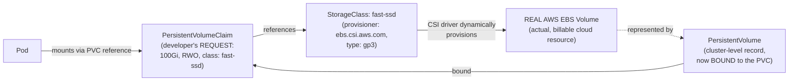
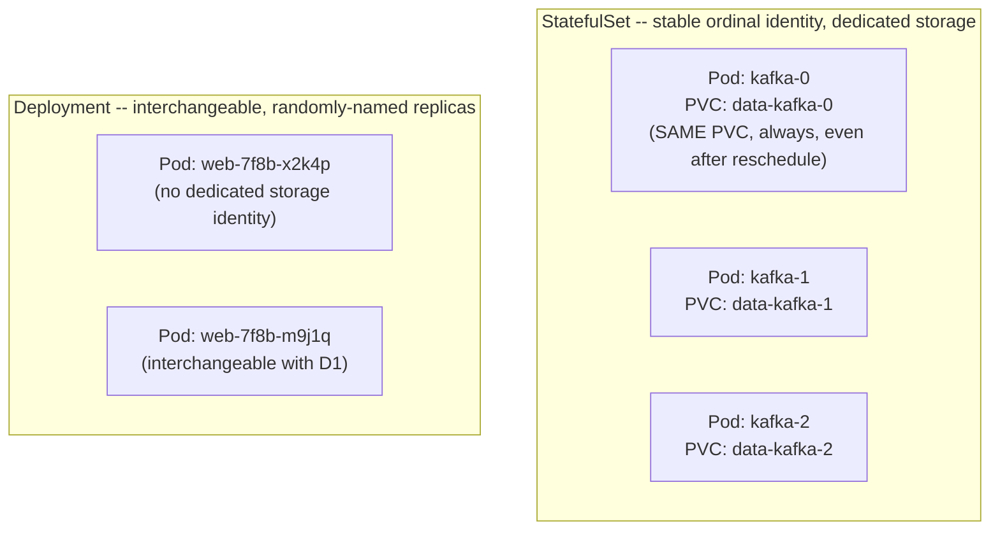

# Module 75 — Kubernetes: Storage — Volumes, PersistentVolumes/Claims, StorageClasses & StatefulSets

> Domain: Kubernetes | Level: Beginner → Expert | Prerequisite: [[01-Architecture-ControlPlane-Pods-Deployments]] (Pod ephemerality is the problem this module's storage abstractions solve, the same way Module 74's Services solved it for networking), [[../21-AWS/03-Storage-S3-EBS-EFS]] and [[../22-Azure/03-Storage-Blob-ManagedDisks-Files-Redundancy]] (Kubernetes's dynamic provisioning, via StorageClasses and CSI drivers, is what actually creates the EBS volumes / Azure Managed Disks those modules covered, now driven declaratively from inside the cluster)

---

## 1. Fundamentals

### Why does a Principal Engineer need a dedicated Kubernetes storage model beyond "mount a volume"?
Module 73 §2.3 established Pods as fundamentally ephemeral, and Module 74 built the networking abstractions (Services, stable virtual IPs) that let clients survive that ephemerality without depending on any specific Pod's identity. Storage requires the identical decoupling, for the identical reason: any data written to a Pod's own container filesystem is lost the instant that Pod is replaced, since a replacement Pod is an entirely new filesystem, not a resumed one. Kubernetes's storage model — Volumes, PersistentVolumes, PersistentVolumeClaims, StorageClasses, and StatefulSets — exists specifically to let data outlive the Pod that wrote it, decoupling storage provisioning and lifecycle from any individual Pod's lifecycle, the exact same structural pattern Module 74 established for network identity, now applied to durable data.

### Why does this matter?
Because nearly every genuinely stateful production workload (a database, a message broker, any service holding data that must survive a restart) depends on getting this decoupling correct — a Principal Engineer who treats Kubernetes storage as "just mount a disk" without understanding the PV/PVC binding model, StorageClass-driven dynamic provisioning, and reclaim-policy behavior risks both operational failures (a Pod that can't schedule because of an access-mode mismatch) and, more severely, silent, irrecoverable data loss (§4's incident).

### When does this matter?
For any Kubernetes workload holding data that must survive a Pod restart, rescheduling, or Node failure — which, in practice, is any database, message broker, or stateful application running on Kubernetes, and increasingly common as organizations run more of their data layer (Kafka via the Strimzi Operator, relevant again in Module 78) directly on Kubernetes rather than exclusively on managed cloud database services.

### How does it work (30,000-ft view)?
```
Volume: a Pod-spec-level concept -- includes both EPHEMERAL types (emptyDir: Pod-lifetime-scoped
     scratch space, gone when the Pod is deleted) and references to PERSISTENT storage
PersistentVolume (PV): the cluster-level representation of an actual piece of durable storage
     (an EBS volume, an Azure Managed Disk, an NFS share) -- the "supply" side
PersistentVolumeClaim (PVC): a developer's REQUEST for storage matching certain criteria
     (size, access mode) -- the "demand" side, bound to a matching PV
StorageClass: defines a PROVISIONER (a CSI driver, e.g. ebs.csi.aws.com) and parameters --
     enables DYNAMIC provisioning, automatically creating a new PV (and the real backing
     cloud volume) whenever a PVC references it, instead of requiring pre-provisioned PVs
StatefulSet: for workloads needing STABLE, unique network identity AND stable, per-replica
     storage that persists across rescheduling -- matched back to the SAME ordinal, unlike
     a Deployment's interchangeable, identically-templated replicas
```

---

## 2. Deep Dive

### 2.1 Volumes — Not All "Volumes" Are Persistent; emptyDir Is Pod-Lifetime-Scoped, Not Pod-Restart-Scoped
The Pod spec's `volumes` field is a broader concept than durable storage alone. **`emptyDir`** is the most commonly misunderstood ephemeral type: it creates a scratch directory that **survives individual container restarts within the same Pod** (useful specifically for sharing data between a main container and a sidecar co-located in the same Pod, per Module 73 §2.3's sidecar-pattern discussion) but is **entirely deleted when the Pod itself is deleted or rescheduled** — a subtly different lifetime than either "survives forever" or "dies on every restart." A team relying on `emptyDir` for data that must survive a Pod being rescheduled to a different Node (a Node failure, a routine eviction) will discover that data is gone, since `emptyDir`'s lifetime is explicitly bound to the Pod's own lifetime, not to any longer-lived, Node-independent storage — genuinely durable, Pod-lifetime-independent storage requires the PersistentVolume abstraction (§2.2) instead.

### 2.2 PersistentVolume and PersistentVolumeClaim — Decoupling Storage Supply From Storage Demand
This is the identical supply-vs-demand decoupling pattern Module 74 §2.1–§2.2 established for Services/EndpointSlices, now applied to storage: a **PersistentVolume (PV)** is the cluster-level, infrastructure-facing representation of an actual piece of durable storage (a real EBS volume, Azure Managed Disk, or NFS export) — the "supply" side, typically not something a developer creates directly in a dynamically-provisioned cluster (§2.3). A **PersistentVolumeClaim (PVC)** is a developer's declarative *request* for storage matching specific criteria (a size, an access mode, optionally a specific StorageClass) — the "demand" side, referenced directly in a Pod or StatefulSet spec. The Kubernetes control plane (via the reconciliation-loop pattern, Module 73 §2.2) binds a PVC to a matching, available PV — once bound, that PV is exclusively reserved for that PVC until the PVC is deleted, and the Pod referencing the PVC mounts whatever real storage the bound PV represents. This decoupling is what allows a Pod's storage configuration to remain a simple, portable PVC reference regardless of whether the actual backing storage is EBS, Azure Managed Disk, or an on-premises SAN — the Pod spec itself never needs to know which.

### 2.3 StorageClasses and Dynamic Provisioning — the Mechanism That Actually Creates the EBS Volumes/Managed Disks Modules 59/67 Covered
A **StorageClass** defines a **provisioner** (a CSI — Container Storage Interface — driver, e.g., `ebs.csi.aws.com` for AWS EBS, `disk.csi.azure.com` for Azure Managed Disks — the storage-layer analog to Module 74 §2.3's CNI networking-layer plugin model) and provisioner-specific parameters (volume type — `gp3` per Module 59, or a Premium/Standard tier per Module 67 — IOPS, throughput). **Dynamic provisioning** is the resulting capability: when a PVC references a StorageClass rather than expecting a pre-existing PV, the CSI driver automatically creates a *new*, real backing cloud storage volume (an actual EBS volume, an actual Azure Managed Disk) and a corresponding PV representing it — meaning a Kubernetes-native `kubectl apply` of a PVC manifest is, mechanically, exactly what causes a real, billable EBS volume or Azure Managed Disk to be provisioned in the underlying cloud account, directly connecting this module's abstractions to Module 59/67's concrete storage services: a Principal Engineer should recognize that every dynamically-provisioned PVC in a cluster corresponds to a real, cost-incurring cloud storage resource, not merely a Kubernetes-internal bookkeeping object.

### 2.4 Access Modes — the RWO/RWX Distinction, and Why the Wrong Default Silently Blocks Scheduling
Every PV/PVC declares one or more **access modes**: **ReadWriteOnce (RWO)** — mountable read-write by a single Node at a time (the mode nearly all block-storage backends — EBS, Azure Managed Disks — support, since block storage is fundamentally attached to one compute instance at a time); **ReadOnlyMany (ROX)** — mountable read-only by many Nodes simultaneously; **ReadWriteMany (RWX)** — mountable read-write by many Nodes simultaneously, which requires a storage backend specifically designed for concurrent multi-Node access (EFS per Module 59, Azure Files per Module 67 — NOT EBS or Azure Managed Disks, which are fundamentally single-attachment block storage). A common, easily-missed failure mode: a team provisions a workload requiring genuinely concurrent multi-Pod, multi-Node write access (a shared-file-processing workload, several Pods across different Nodes all needing to write into the same directory) using a default, block-storage-backed StorageClass that only supports RWO — the PVC binds successfully and the first Pod schedules and mounts it without issue, but a second Pod scheduled to a *different* Node attempting to mount the *same* PVC fails to schedule at all (the volume is already exclusively attached to the first Pod's Node), a failure that only surfaces once the workload actually scales beyond a single Node, precisely the kind of "worked fine until the specific triggering condition" risk this course has repeatedly flagged (Module 60's replication-lag-under-load pattern is structurally identical) — the fix requires an RWX-capable backend (EFS-backed or Azure-Files-backed StorageClass), explicitly selected based on the workload's genuine concurrent-multi-Node-write requirement, not defaulted to whatever StorageClass happens to be the cluster's default.

### 2.5 StatefulSets — Stable Identity and Stable, Per-Replica Storage, Where Deployments Give Neither
A **StatefulSet** exists specifically for workloads that need two properties a Deployment (Module 73 §2.4) deliberately does not provide: **stable, unique, predictable network identity per replica** (Pod names are `<statefulset-name>-0`, `<statefulset-name>-1`, ... — not the random suffix a Deployment's ReplicaSet-managed Pods receive — and each ordinal gets its own stable DNS name via a **headless Service**), and **stable, per-replica storage that persists across rescheduling and is matched back to the *same* ordinal**, not reassigned arbitrarily (via `volumeClaimTemplates` — each StatefulSet replica gets its own dedicated PVC, created once and *reused*, not recreated, if that specific replica is rescheduled). This matters specifically for genuinely stateful, clustered systems where replica identity is meaningful (a database replica that must always rejoin the cluster as "replica 2" with replica 2's specific data, not an arbitrary, interchangeable replacement) — Kafka brokers run via the Strimzi Operator (Module 54's Kafka content, now realized as a Kubernetes-native deployment) are a canonical example: each broker Pod needs both a stable identity (for the Kafka cluster's own internal broker-ID-to-partition-assignment bookkeeping) and its own persistent, non-interchangeable storage volume. A Deployment's interchangeable-replica model (Module 73 §2.4 — any replica can be replaced by any new, identical replica) is fundamentally the wrong tool for this requirement, since it provides neither stable identity nor stable, non-shared, replica-specific storage. StatefulSets also enforce **ordered, sequential** Pod creation/scaling/termination by default (Pod-0 must be Running and Ready before Pod-1 is created) — directly contrasting Module 73 §2.4's Deployment rolling-update parallelism, a deliberate trade-off (slower scaling) in exchange for the ordering guarantee many stateful, clustered systems' own bootstrap/join sequencing depends on.

### 2.6 Reclaim Policy — the Silent-Data-Destruction Default Every Principal Engineer Must Explicitly Override for Critical Data
A PersistentVolume's **reclaim policy** determines what happens to the real, underlying cloud storage volume (and all the data on it) once its bound PVC is deleted: **Delete** (the default reclaim policy for most dynamically-provisioned StorageClasses) actually, irreversibly deletes the real backing cloud volume — the EBS volume, the Azure Managed Disk — and all its data, the moment the PVC is deleted; **Retain** preserves the underlying volume (and its data) even after the PVC is deleted, leaving it in a "released" state requiring explicit manual intervention to either reclaim or clean up. This is a genuinely dangerous default for any workload holding critical, non-trivially-regenerable data: deleting a PVC is, on its face, an operation that *looks* like it's merely removing a Kubernetes bookkeeping object (directly analogous to how Module 74 §2.6 flagged NetworkPolicy's misleading "looks like just a config object" surface) — but with a `Delete` reclaim policy, it is mechanically equivalent to running the cloud provider's own volume-deletion API call directly, with the same irreversibility, and critically, **no additional confirmation prompt or safeguard beyond whatever protects the PVC deletion itself** (namespace deletion, a Helm chart uninstall, or an accidental `kubectl delete pvc` all trigger it identically) — a Principal Engineer must explicitly set `Retain` (or configure an equivalent backup/snapshot strategy, directly Module 59 §Advanced Q1's RPO-computation discipline) for any PV backing genuinely critical data, rather than accepting the `Delete` default that most StorageClasses ship with.

---

## 3. Visual Architecture

### PV/PVC Binding and Dynamic Provisioning via a StorageClass's CSI Driver (§2.2, §2.3)


### StatefulSet: Stable, Per-Replica Identity + Storage vs. Deployment's Interchangeable Replicas (§2.5)


## 4. Production Example
**Scenario**: A platform team performed a routine cleanup of unused namespaces as part of a cluster-hygiene initiative, using a script that identified namespaces with no recent Deployment activity and ran `kubectl delete namespace` against each candidate. One targeted namespace, believed decommissioned based on its Deployment/Service objects showing no recent activity, still contained a StatefulSet-backed PostgreSQL database that was, in fact, actively used by a low-traffic but genuinely production internal reporting tool — its Deployment-level activity metrics were low specifically because the tool was used only a few times per week, not because it was actually decommissioned. **Investigation**: `kubectl delete namespace` cascaded to delete every object within it, including the StatefulSet's PVCs — and because those PVCs' backing StorageClass used the default `Delete` reclaim policy, deleting the PVCs triggered the CSI driver to actually delete the underlying EBS volumes and all the data on them, within seconds, with no additional confirmation step beyond the original namespace-deletion command. **Root cause**: two independent gaps compounded — first, the cleanup script's "no recent Deployment activity" heuristic was an inadequate proxy for "safe to delete," since it didn't account for genuinely low-frequency-but-still-production usage patterns; second, and more severely, the reclaim policy gap this module's §2.6 describes meant that even a genuinely mistaken namespace deletion — a class of human/tooling error that, on its own, should have been recoverable — instead caused **immediate, irreversible data loss**, because nothing in the reclaim-policy configuration had ever required or enforced `Retain` for this database's storage. **Fix**: restored the database from its most recent automated backup (a genuine backup/snapshot strategy had separately been in place, limiting the actual data loss to the gap since the last backup rather than complete, total loss), then — as the actually durable fix — audited every StorageClass and PV in the cluster, reclassified any PV backing genuinely critical, hard-to-regenerate data to `Retain`, and replaced the namespace-cleanup script's Deployment-activity heuristic with an explicit, positive confirmation requirement (a namespace must be explicitly tagged `decommissioned` by its owning team, not merely inferred inactive by a proxy metric) before any automated deletion is permitted. **Lesson**: this incident is a direct instance of this course's recurring "an operation that looks like it's removing a lightweight bookkeeping object is mechanically equivalent to a real, irreversible infrastructure-destroying operation" risk category (directly paralleling Module 74 §2.6/§4's NetworkPolicy finding, now at the storage-destruction rather than security-enforcement layer) — a Principal Engineer must treat PVC/namespace deletion in any cluster holding genuinely critical data with the same explicit, deliberate caution as a direct cloud-console volume-deletion action, since with the default reclaim policy, that is *exactly* what it mechanically is, and must never rely on an activity-based heuristic alone to determine what's safe to delete.

## 5. Best Practices
- Explicitly set `Retain` as the reclaim policy (or configure an equivalent PV-level protection) for any PersistentVolume backing genuinely critical, non-trivially-regenerable data — never accept the `Delete` default without deliberate consideration (§2.6, §4).
- Maintain a genuine, tested backup/snapshot strategy for any StatefulSet-backed critical data, independent of reclaim-policy protection, as defense-in-depth against both accidental deletion and the underlying storage volume's own failure (§4).
- Select RWX-capable StorageClasses (EFS-backed, Azure-Files-backed) explicitly and only when a workload genuinely requires concurrent multi-Node write access — don't discover the RWO/RWX mismatch only once a workload scales beyond a single Node (§2.4).
- Use StatefulSets, not Deployments, for any workload requiring stable per-replica identity and non-interchangeable, dedicated storage — recognize a Deployment's interchangeable-replica model as fundamentally unsuited to this requirement (§2.5).
- Treat namespace/PVC deletion tooling with the same deliberate, positive-confirmation-required caution as a direct cloud-console storage-deletion action in any cluster holding production data, rather than relying on inactivity-based heuristics alone (§4).

## 6. Anti-patterns
- Relying on `emptyDir` for data that must survive Pod rescheduling, not realizing its lifetime is bound to the Pod's own lifetime, not to durable, Node-independent storage (§2.1).
- Accepting a StorageClass's default `Delete` reclaim policy for critical production data without deliberately evaluating whether `Retain` (or an equivalent backup strategy) is required (§2.6, §4).
- Defaulting to a block-storage-backed (RWO-only) StorageClass for a workload that will eventually need genuine concurrent multi-Node write access, discovering the mismatch only once the workload scales beyond one Node (§2.4).
- Using a Deployment for a genuinely stateful, clustered workload that needs stable per-replica identity and dedicated storage, when a StatefulSet is the correct primitive (§2.5).
- Using an activity-based heuristic (e.g., "no recent Deployment updates") as the sole signal for whether a namespace or resource is safe to delete, without an explicit, positive confirmation step (§4).

---

## 10. Interview Questions

### Basic (10)
1. **Q: Why doesn't a Pod's own local filesystem provide durable storage?** **A:** Pods are ephemeral (Module 73) — a replaced Pod is an entirely new filesystem, not a resumed one, so any data written to a Pod's local filesystem is lost when that Pod is replaced.
2. **Q: What is `emptyDir`, and what is its actual lifetime scope?** **A:** An ephemeral scratch volume that survives individual container restarts within a Pod, but is deleted entirely when the Pod itself is deleted or rescheduled.
3. **Q: What is the difference between a PersistentVolume (PV) and a PersistentVolumeClaim (PVC)?** **A:** A PV is the cluster-level representation of actual durable storage (the "supply"); a PVC is a developer's request for storage matching certain criteria (the "demand"), bound to a matching PV.
4. **Q: What does a StorageClass enable?** **A:** Dynamic provisioning — automatically creating a new PV (and real backing cloud storage volume) via a CSI driver whenever a PVC references it, instead of requiring pre-provisioned PVs.
5. **Q: What is CSI?** **A:** Container Storage Interface — the pluggable driver interface (e.g., `ebs.csi.aws.com`) a StorageClass's provisioner uses to actually create backing cloud storage volumes.
6. **Q: What is the difference between ReadWriteOnce (RWO) and ReadWriteMany (RWX) access modes?** **A:** RWO is mountable read-write by only one Node at a time (what block storage like EBS/Azure Managed Disks supports); RWX is mountable read-write by many Nodes simultaneously, requiring a backend like EFS or Azure Files.
7. **Q: What does a StatefulSet provide that a Deployment does not?** **A:** Stable, unique, predictable per-replica network identity and stable, dedicated per-replica storage that persists across rescheduling, matched back to the same ordinal.
8. **Q: What are the two reclaim policy options for a PersistentVolume, and what does each do when the bound PVC is deleted?** **A:** `Delete` (the common default) actually deletes the underlying cloud storage volume and its data; `Retain` preserves the volume and data even after the PVC is deleted.
9. **Q: Do StatefulSet Pods scale up in parallel like a Deployment's replicas?** **A:** No — by default, StatefulSet Pods are created sequentially, in ordinal order, each becoming Ready before the next is created.
10. **Q: What did §4's namespace-cleanup incident reveal about PVC deletion with a `Delete` reclaim policy?** **A:** That deleting a PVC (which looks like removing a lightweight Kubernetes object) is mechanically equivalent to directly deleting the real, underlying cloud storage volume and all its data, irreversibly and without additional confirmation.

### Intermediate (10)
1. **Q: Why is `emptyDir` an inadequate solution for data that must survive a Node failure, even though it survives individual container restarts?** **A:** `emptyDir`'s lifetime is bound to the Pod's own lifetime, not to any Node-independent durable storage — a Node failure causes the Pod (and its `emptyDir` volume) to be deleted entirely, not merely restarted, so the data is lost along with it.
2. **Q: Why is the PV/PVC relationship described as structurally identical to Module 74's Service/EndpointSlice decoupling?** **A:** Both patterns separate a stable, developer-facing "demand" abstraction (a PVC; a Service) from the actual, changeable "supply" implementation underneath (a specific PV/cloud volume; a specific set of Pod IPs), letting the developer-facing interface remain stable and portable regardless of what's actually backing it.
3. **Q: Why does a dynamically-provisioned PVC "correspond to a real, cost-incurring cloud storage resource," per §2.3?** **A:** Because the StorageClass's CSI driver, upon seeing a new PVC referencing it, actually calls the cloud provider's API to create a real EBS volume or Azure Managed Disk — the Kubernetes object isn't purely internal bookkeeping, it directly drives real infrastructure provisioning.
4. **Q: Why does the RWO-vs-RWX mismatch (§2.4) often go undetected until a workload scales beyond a single Node?** **A:** A single-Pod (or single-Node) workload never actually exercises the "multiple Nodes attempting to mount the same volume simultaneously" scenario RWO can't support — the PVC binds and mounts successfully for that first Pod, and the limitation only surfaces once a second Pod on a different Node attempts to mount the same PVC.
5. **Q: Why is a Deployment described as "fundamentally the wrong tool" for a genuinely stateful, clustered workload like a Kafka broker cluster?** **A:** A Deployment's replicas are interchangeable and identically templated, with no stable per-replica identity or dedicated, non-shared storage — a Kafka broker cluster's internal bookkeeping depends on stable broker identity and each broker retaining its own specific data, a requirement only StatefulSets' ordinal-based identity and `volumeClaimTemplates` satisfy.
6. **Q: Why does §4 describe the incident's root cause as "two independent gaps compounding" rather than a single failure?** **A:** The cleanup script's inadequate activity heuristic caused the *mistaken deletion* to occur at all, but the `Delete` reclaim policy is what turned that mistake into *irreversible data loss* — either gap alone would have been less severe (a better heuristic prevents the mistake; a `Retain` policy would have made even the mistaken deletion recoverable).
7. **Q: Why should a "released" PV (unbound, but still containing data, per a `Retain` reclaim policy) still be included in periodic data-security review, per §8?** **A:** It isn't automatically deleted or access-restricted merely because no PVC is currently bound to it — the underlying storage and its data persist and remain a genuine data-security surface requiring the same access-review and classification discipline as any other data-holding resource.
8. **Q: Why does StatefulSet's default sequential (not parallel) Pod creation represent a deliberate trade-off rather than a limitation?** **A:** Many stateful, clustered systems have their own bootstrap/join sequencing requirements (a new replica joining an existing cluster in a specific order) that parallel, unordered Pod creation would violate — the slower scaling is traded deliberately for the ordering guarantee those systems' own clustering logic depends on.
9. **Q: Why can't Kubernetes-level Pod scaling alone resolve a storage-throughput bottleneck for a StatefulSet-backed database, per §9?** **A:** Each replica's underlying cloud storage volume has its own fixed IOPS/throughput ceiling independent of how many Pods are running — adding more StatefulSet replicas doesn't increase any individual replica's own volume's throughput capacity, which requires an explicit volume-type upgrade or resize instead.
10. **Q: Why is encrypting PersistentVolumes at rest described as requiring explicit StorageClass configuration rather than being automatically enabled?** **A:** Per this course's recurring "explicit, chosen configuration, not an assumed default" discipline (Module 67's redundancy-tier lesson, now recurring here) — a StorageClass's encryption setting must be deliberately configured; it is not automatically or universally enabled purely because dynamic provisioning is in use.

### Advanced (10)
1. **Q: Diagnose the §4 incident from first principles, and design the specific standing safeguard structure that prevents this exact class of "mistaken deletion becomes irreversible data loss" incident from recurring, synthesizing this module's reclaim-policy and backup disciplines.**
   **A:** Root cause: two independent, compounding gaps — an inadequate activity-based deletion heuristic (causing the mistaken deletion to be attempted at all) and a `Delete` reclaim policy (turning that mistake into irreversible loss, with no intermediate recoverability window). Structural fix: (1) mandatory `Retain` reclaim policy (or equivalent) for any PV backing data classified as production-critical, enforced via an automated policy check (directly Module 64/72's synthesized governance-gate pattern) rather than relying on individual engineers remembering to set it per StorageClass; (2) a genuine, tested, independent backup/snapshot strategy for any such data, since reclaim-policy protection alone still leaves a "released, unbound, and un-monitored" PV as a fragile, manual-cleanup-dependent state rather than a true backup; (3) replacing activity-based deletion heuristics with explicit, positive-confirmation-based decommissioning workflows (an owning team must explicitly tag a resource `decommissioned`) for any cluster-hygiene automation, since an absence-of-evidence signal (low activity) is not equivalent to evidence-of-absence (genuinely decommissioned).
2. **Q: A team argues that since their StatefulSet-backed database already has a `Retain` reclaim policy configured, a separate backup/snapshot strategy is redundant additional operational overhead. Evaluate this claim.**
   **A:** Push back — `Retain` protects specifically against the "PVC deleted, but the underlying volume should survive" scenario, but doesn't protect against the underlying cloud storage volume's own failure or corruption (a genuine, if rare, cloud-provider-level storage fault), doesn't protect against application-level data corruption being faithfully "protected" and persisted by the retained volume (a `Retain`-protected volume that already contains corrupted data doesn't help recover a clean prior state), and still leaves a "released" volume in a fragile, manually-dependent state requiring someone to notice and properly reclaim/restore it, rather than an actively-tested, independently-verified recovery path — `Retain` and backups are complementary defense-in-depth layers (directly this course's recurring multi-layered-protection theme), not substitutes for each other.
3. **Q: Design the specific set of automated checks (extending §4's fix and synthesizing Module 74's governance-gate pattern) that would catch a critical PV's reclaim policy being misconfigured as `Delete` before it's ever exploited by an accidental deletion.**
   **A:** (1) A scheduled, automated audit scanning every PV in the cluster, cross-referencing each against a data-criticality classification (a namespace- or PVC-level label/annotation an owning team is required to set), flagging any critical-classified PV whose reclaim policy is `Delete` rather than `Retain` — directly Module 64 §Advanced Q10's synthesized governance-checklist pattern, now applied to storage. (2) A deployment-time (not just periodic) admission-control check (relevant again in Module 76's admission-controller coverage) rejecting any new StorageClass or PVC creation in a namespace tagged "production-critical" that doesn't explicitly specify `Retain`. (3) Integration of this check into the same recurring Well-Architected-style review cadence Modules 64/72 established, ensuring it's re-verified periodically, not just at initial creation, since a StorageClass's default could change or a new critical workload could be added to an existing namespace without re-triggering the original review.
4. **Q: A workload needs both the strict read-after-write consistency and low latency of block storage (EBS/Azure Managed Disk, RWO-only) AND genuine concurrent access from multiple Pods across multiple Nodes. Design an architecture that satisfies both requirements, given §2.4's RWO/RWX trade-off.**
   **A:** This is not resolvable by choosing "a better StorageClass" alone, since the RWO-vs-RWX trade-off is a genuine, backend-level physical constraint, not a configuration limitation — the correct architectural resolution is to avoid requiring direct concurrent multi-Node access to the *same* block volume at all: either (a) restructure the workload as a StatefulSet (§2.5) where each replica owns its *own* dedicated RWO volume (satisfying the low-latency/strict-consistency requirement per-replica) with application-level coordination (replication, a distributed consensus protocol per Module 47) handling cross-replica consistency instead of relying on shared-volume-level file locking, or (b) if genuine shared-file access is unavoidable, accept RWX's different latency profile (§7) for that specific access pattern while keeping any latency-critical, single-writer data path on a separate RWO volume — the two requirements, taken together, cannot both be satisfied by a single volume/access-mode choice, and must be decomposed into separate storage concerns matched to each requirement independently.
5. **Q: Critique the following claim: "Since our StatefulSet's `volumeClaimTemplates` guarantee each replica keeps its own dedicated PVC across rescheduling, our stateful workload is fully resilient to any single Node failure with zero data-loss risk."**
   **A:** Overstated — `volumeClaimTemplates` guarantees the *same PVC* (and thus the same underlying volume) is reattached to a replacement Pod for that ordinal, but this says nothing about whether the underlying cloud storage volume itself is available in a way that permits reattachment: an EBS volume, for instance, is bound to a specific Availability Zone (directly Module 57/59's AZ-scoping discipline) — if the original Node's AZ experiences an outage, the volume may be unavailable for reattachment to a replacement Pod scheduled in a different AZ at all, meaning the "same volume persists" guarantee doesn't by itself guarantee cross-AZ resilience; genuine resilience additionally requires either the stateful application's own cross-replica replication (so losing one replica's volume doesn't mean losing that data entirely, since other replicas hold copies) or a storage backend/replication strategy explicitly designed for cross-AZ durability, not merely PVC-to-Pod-ordinal binding stability alone.
6. **Q: Explain why the §4 incident's "looks like removing a lightweight object, is mechanically a real infrastructure-destroying operation" pattern is structurally identical to Module 74 §2.6/§4's NetworkPolicy finding, and what this recurrence implies about a general Kubernetes-operations principle.**
   **A:** Both findings share the identical structure: a Kubernetes object's deletion (or misconfiguration) produces no distinguishing warning signal at the object-management layer itself, while having a real, severe effect at a layer the operator may not be actively thinking about in the moment (network enforcement for NetworkPolicy; real cloud-storage destruction for PVC/reclaim-policy) — the general principle this recurrence establishes is that Kubernetes's abstraction layer, while genuinely valuable for portability and declarative management, can create a false sense that operations on Kubernetes objects are inherently "lower-risk" or more reversible than the equivalent direct cloud-provider-API operation, when for several specific object types (PVCs with `Delete` reclaim policy; potentially certain NetworkPolicy misconfigurations) they are exactly as consequential and irreversible — a Principal Engineer should maintain an explicit mental inventory of which Kubernetes object types carry this "abstraction masks real, irreversible consequence" property and apply correspondingly elevated caution and confirmation requirements specifically to those types.
7. **Q: A Principal Engineer is designing the storage architecture for a new StatefulSet-backed Kafka cluster (via the Strimzi Operator, relevant again in Module 78) and must decide the reclaim policy and access mode. Walk through the specific reasoning for each choice.**
   **A:** Access mode: RWO is correct and sufficient — each Kafka broker owns its own dedicated, non-shared volume (per §2.5's StatefulSet model), with no requirement for concurrent multi-Node access to any single broker's data, so RWX's different latency profile and backend requirements (§2.4, §7) would be an unnecessary complication with no corresponding benefit for this specific access pattern. Reclaim policy: `Retain`, not the `Delete` default — Kafka's own topic data is exactly the kind of genuinely critical, non-trivially-regenerable data §2.6/§4 establishes as requiring `Retain`, and losing a broker's volume to an accidental StatefulSet/namespace deletion, combined with `Delete`'s irreversibility, would risk real, permanent message-log data loss for any topics not fully replicated to still-surviving brokers — the combination of RWO (correct fit for the actual access pattern) and `Retain` (correct fit for the data's criticality) reflects two independent decisions, each explicitly reasoned from the workload's actual requirements rather than accepting either dimension's common default.
8. **Q: A team observes that after a Node failure and StatefulSet Pod rescheduling, the replacement Pod for `kafka-1` took several minutes longer to become Ready than a comparable Deployment-based Pod replacement would have. Diagnose the likely cause, connecting this module's content to Module 73's cold-start/warm-up discussion.**
   **A:** Likely cause: EBS/Azure-Managed-Disk volume reattachment to the new Node (before the kubelet can even start the container, the CSI driver must detach the volume from the failed Node — if still attachable at all — and attach it to the new Node, an operation with its own real latency, distinct from and in addition to container image pull and application startup time) is an additional sequential step a Deployment's stateless Pods never require, since a Deployment's replacement Pod has no specific volume it must wait to reattach — this is a StatefulSet-specific instance of the general "newly-provisioned/rescheduled compute isn't instantly ready" pattern this course has established repeatedly (Module 57 §4's ASG warm-up, Module 61's Lambda cold starts, Module 71 §2.5's Container Apps scale-from-zero), now with volume-reattachment latency as the specific, additional contributing factor unique to stateful, volume-backed workloads.
9. **Q: Design the layer-by-layer debugging methodology for "my StatefulSet Pod is stuck in `Pending`" specifically, distinguishing storage-layer causes from the scheduling-layer causes Module 73 §4 already established.**
   **A:** (1) Apply Module 73 §4's original methodology first — `kubectl describe pod` to check for a generic Scheduler `FailedScheduling` event (insufficient CPU/memory, a taint/toleration mismatch, all still applicable to a StatefulSet Pod exactly as to any other Pod). (2) If the Pod's PVC itself is not yet `Bound` (`kubectl get pvc`), the failure is at the storage-provisioning layer specifically, not general scheduling — check the PVC's own events (`kubectl describe pvc`) for a StorageClass provisioning failure (a cloud-account-level volume quota exhausted, per §9; an access-mode the available/provisionable storage can't satisfy, per §2.4's RWO/RWX mismatch) as the distinct, storage-specific root cause the generic Scheduler event won't itself surface, since the Pod may not even reach the Scheduler's placement-decision step until its PVC is successfully bound.
10. **As a Principal Engineer establishing Kubernetes storage standards for a platform team about to onboard several genuinely stateful workloads (databases, Kafka), design the specific set of standing architectural decisions and automated governance checks (synthesizing this entire module) required before any StatefulSet-backed critical workload is permitted into production.**
    **A:** (1) Mandatory, automatically-enforced `Retain` reclaim policy (or equivalent) for any PV backing data classified as production-critical, verified via the automated audit and admission-control checks (Advanced Q3) rather than relying on individual manifest authorship discipline. (2) A genuine, independently-tested backup/snapshot strategy for every such workload, explicitly recognized as complementary to (not redundant with) reclaim-policy protection (Advanced Q2). (3) Explicit, documented access-mode (RWO vs. RWX) justification per workload, matched to its actual concurrent-access requirement rather than defaulted (§2.4, Advanced Q7's Kafka reasoning as the template). (4) Explicit reclaim-policy-and-backup review as a standing checklist item in the deployment-approval process for any new StatefulSet touching production data, directly extending Modules 64/72's synthesized Well-Architected-review governance pattern into this domain's storage layer specifically. (5) A published, on-call-accessible runbook for the storage-specific `Pending`-Pod debugging methodology (Advanced Q9), recognizing that StatefulSet storage failures require a genuinely different first diagnostic step (PVC binding status) than the general Pod-scheduling methodology Module 73 established alone would suggest.

---

## 11. Coding Exercises

### Easy — A StorageClass with an explicitly-chosen (not default) reclaim policy for critical data (§2.3, §2.6)
```yaml
apiVersion: storage.k8s.io/v1
kind: StorageClass
metadata:
  name: critical-data-retained
provisioner: ebs.csi.aws.com
parameters:
  type: gp3
  encrypted: "true"   # explicit, not assumed (§8)
reclaimPolicy: Retain   # EXPLICITLY overriding the common Delete default (§2.6, §4) --
                          # this line alone is what would have prevented §4's incident
volumeBindingMode: WaitForFirstConsumer
```

### Medium — Diagnosing an RWX-vs-RWO scheduling failure via PVC/Pod events (§2.4, §Advanced Q9)
```bash
# Step 1 -- confirm the PVC itself bound successfully (it likely did, per §2.4 --
# the FIRST Pod mounting it works fine)
kubectl get pvc shared-processing-data
# NAME                    STATUS   VOLUME    CAPACITY   ACCESS MODES
# shared-processing-data  Bound    pvc-a1b2  50Gi        RWO        <- the mismatch is HERE

# Step 2 -- second Pod, different Node, fails to schedule -- confirm it's a
# volume-attachment conflict, not a generic resource-capacity issue (distinct
# from Module 73 §4's Insufficient-memory FailedScheduling reason)
kubectl describe pod worker-processor-2
# Events:
#   Warning  FailedAttachVolume  Multi-Attach error for volume "pvc-a1b2" --
#            Volume is already exclusively attached to one node and can't be
#            attached to another

# Fix: migrate the PVC to an RWX-capable StorageClass (EFS-backed), not RWO
```

### Hard — A StatefulSet with `volumeClaimTemplates` for stable, per-replica dedicated storage (§2.5)
```yaml
apiVersion: apps/v1
kind: StatefulSet
metadata:
  name: kafka
spec:
  serviceName: kafka-headless   # headless Service -- gives each ordinal a stable DNS name (§2.5)
  replicas: 3
  podManagementPolicy: OrderedReady   # default -- sequential creation (§2.5)
  selector:
    matchLabels: { app: kafka }
  template:
    metadata:
      labels: { app: kafka }
    spec:
      containers:
        - name: kafka
          image: registry.example.com/kafka:3.7
          volumeMounts:
            - name: data
              mountPath: /var/lib/kafka/data
  volumeClaimTemplates:   # each replica gets its OWN PVC -- kafka-0 always gets "data-kafka-0",
                            # persisting across rescheduling, never reassigned to a different ordinal (§2.5)
    - metadata: { name: data }
      spec:
        accessModes: [ReadWriteOnce]   # correct choice -- each broker owns its own volume (§Advanced Q7)
        storageClassName: critical-data-retained   # Retain reclaim policy -- Kafka log data is critical (§Advanced Q7)
        resources:
          requests: { storage: 500Gi }
```

### Expert — Automated governance check flagging critical PVs with a `Delete` reclaim policy (§Advanced Q1, §Advanced Q3)
```csharp
public class StorageGovernanceCheck
{
    public GovernanceResult Validate(IEnumerable<PersistentVolumeInfo> pvs)
    {
        var findings = new List<string>();

        foreach (var pv in pvs)
        {
            // §2.6/§4's exact incident -- a critical-classified PV with the Delete
            // default is one accidental PVC deletion away from irreversible data loss.
            if (pv.DataCriticality == "critical" && pv.ReclaimPolicy == "Delete")
                findings.Add($"PV '{pv.Name}' backs critical data but uses Delete reclaim policy " +
                             $"(this module §2.6/§4) -- change to Retain or provide an explicit exception.");

            // Advanced Q4 -- flag RWX where RWO would suffice, or vice versa, based on
            // declared workload access pattern (surfaced via namespace/PVC annotation).
            if (pv.DeclaredAccessPattern == "single-writer-per-replica" && pv.AccessMode == "ReadWriteMany")
                findings.Add($"PV '{pv.Name}' uses RWX for a single-writer-per-replica workload " +
                             $"(§Advanced Q7) -- confirm RWX is genuinely required, or simplify to RWO.");
        }

        return new GovernanceResult { Passed = findings.Count == 0, Findings = findings };
    }
}
```

---

## 12–17. System Design / LLD / Debugging / Decision / Case Study / Principal

*(§4's incident, the four §11 exercises, and the Advanced-tier Q&A — especially Advanced Q1's standing safeguard structure, Advanced Q4's decomposed-storage-requirements architecture, and Advanced Q10's synthesized governance checklist — collectively constitute this module's system-design, debugging, and Principal-Engineer-level content.)*

## 18. Revision
**Key takeaways**: Kubernetes's storage model solves the identical problem Module 74 solved for networking — Pod ephemerality (Module 73) — now for durable data, via the same supply/demand decoupling pattern: PersistentVolumes represent real, backing cloud storage; PersistentVolumeClaims are a developer's portable request for it; StorageClasses enable dynamic provisioning via CSI drivers that directly create the real EBS volumes/Azure Managed Disks Modules 59/67 covered. Access modes (RWO vs. RWX, §2.4) reflect a genuine backend-level physical constraint, not a configuration nicety, and mismatches often surface only once a workload scales beyond a single Node. StatefulSets (§2.5) provide the stable, per-replica identity and dedicated, non-interchangeable storage a Deployment's model deliberately cannot, essential for genuinely clustered, stateful systems like Kafka. This module's highest-severity, and structurally recurring, lesson is §2.6/§4's reclaim-policy finding: a PVC deletion under the common `Delete` default is mechanically equivalent to a real, irreversible cloud-storage-deletion operation, with no additional warning or confirmation beyond whatever protects the PVC deletion itself — directly paralleling Module 74's NetworkPolicy-enforcement finding as another instance of Kubernetes's abstraction layer masking a real, severe, and irreversible consequence behind what looks like routine object management. Critical data requires explicit `Retain` reclaim policy configuration plus an independent, tested backup strategy — neither substitutes for the other.

---

**Next**: Module 76 — Kubernetes: Configuration & Security — ConfigMaps, Secrets, RBAC, Pod Security & Admission Controllers, continuing the `23-Kubernetes` domain (Modules 73–80).
