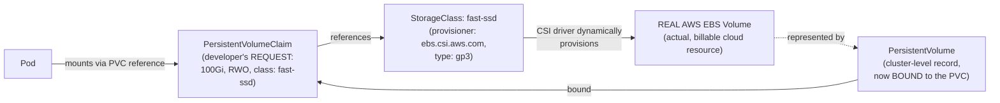
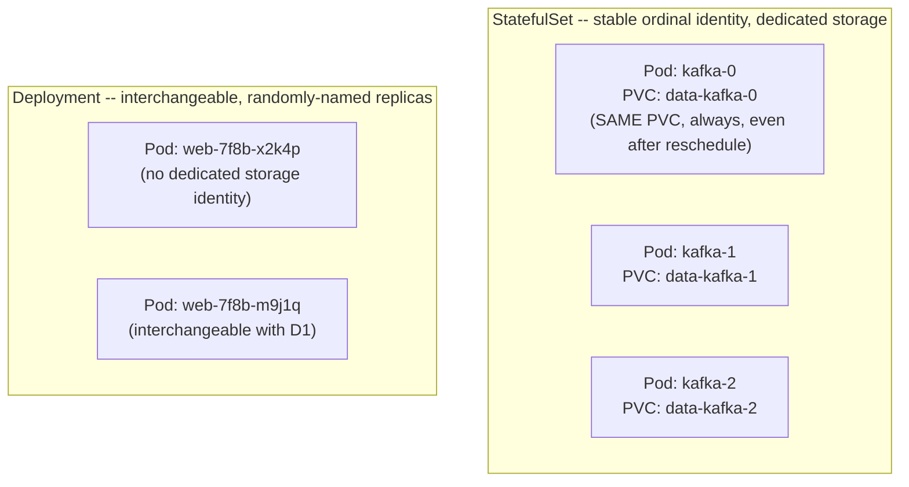
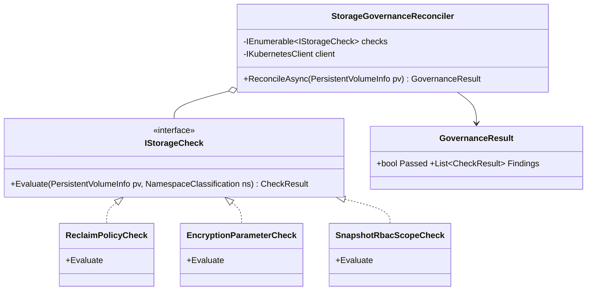
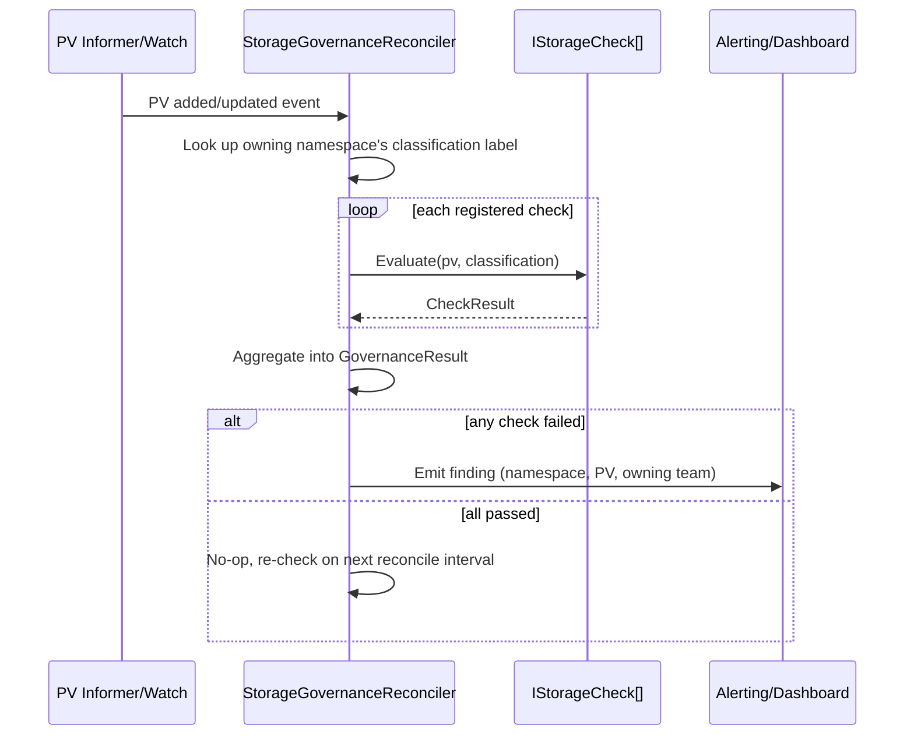

# Module 75 — Kubernetes: Storage — Volumes, PersistentVolumes/Claims, StorageClasses & StatefulSets

> Domain: Kubernetes | Level: Beginner → Expert | Prerequisite: [[01-Architecture-ControlPlane-Pods-Deployments]] (Pod ephemerality is the problem this module's storage abstractions solve, the same way the Services solved it for networking), [[../21-AWS/03-Storage-S3-EBS-EFS]] and [[../22-Azure/03-Storage-Blob-ManagedDisks-Files-Redundancy]] (Kubernetes's dynamic provisioning, via StorageClasses and CSI drivers, is what actually creates the EBS volumes / Azure Managed Disks those modules covered, now driven declaratively from inside the cluster)

---

## 1. Fundamentals

### Why does a Principal Engineer need a dedicated Kubernetes storage model beyond "mount a volume"?
Earlier analysis established Pods as fundamentally ephemeral, and built the networking abstractions (Services, stable virtual IPs) that let clients survive that ephemerality without depending on any specific Pod's identity. Storage requires the identical decoupling, for the identical reason: any data written to a Pod's own container filesystem is lost the instant that Pod is replaced, since a replacement Pod is an entirely new filesystem, not a resumed one. Kubernetes's storage model — Volumes, PersistentVolumes, PersistentVolumeClaims, StorageClasses, and StatefulSets — exists specifically to let data outlive the Pod that wrote it, decoupling storage provisioning and lifecycle from any individual Pod's lifecycle, the exact same structural pattern established for network identity, now applied to durable data.

### Why does this matter?
Because nearly every genuinely stateful production workload (a database, a message broker, any service holding data that must survive a restart) depends on getting this decoupling correct — a Principal Engineer who treats Kubernetes storage as "just mount a disk" without understanding the PV/PVC binding model, StorageClass-driven dynamic provisioning, and reclaim-policy behavior risks both operational failures (a Pod that can't schedule because of an access-mode mismatch) and, more severely, silent, irrecoverable data loss (the incident).

### When does this matter?
For any Kubernetes workload holding data that must survive a Pod restart, rescheduling, or Node failure — which, in practice, is any database, message broker, or stateful application running on Kubernetes, and increasingly common as organizations run more of their data layer (Kafka via the Strimzi Operator, relevant again) directly on Kubernetes rather than exclusively on managed cloud database services.

### How does it work (30,000-ft view)?
```
Volume: a Pod-spec-level concept -- includes both EPHEMERAL types (emptyDir: Pod-lifetime-scoped
 scratch space, gone when the Pod is deleted) and references to PERSISTENT storage
PersistentVolume (PV): the cluster-level representation of an actual piece of durable storage
 (an EBS volume, an Azure Managed Disk, an NFS share) -- the "supply" side
PersistentVolumeClaim (PVC): a developer's REQUEST for storage matching certain criteria
 (size, access mode) -- the "demand" side, bound to a matching PV
StorageClass: defines a PROVISIONER (a CSI driver, e.g. ebs.csi.aws.com) and parameters --
 enables DYNAMIC provisioning, automatically creating a new PV (and the real backing
 cloud volume) whenever a PVC references it, instead of requiring pre-provisioned PVs
StatefulSet: for workloads needing STABLE, unique network identity AND stable, per-replica
 storage that persists across rescheduling -- matched back to the SAME ordinal, unlike
 a Deployment's interchangeable, identically-templated replicas
```

---

## 2. Deep Dive

### 2.1 Volumes — Not All "Volumes" Are Persistent; emptyDir Is Pod-Lifetime-Scoped, Not Pod-Restart-Scoped
The Pod spec's `volumes` field is a broader concept than durable storage alone. **`emptyDir`** is the most commonly misunderstood ephemeral type: it creates a scratch directory that **survives individual container restarts within the same Pod** (useful specifically for sharing data between a main container and a sidecar co-located in the same Pod, per the sidecar-pattern discussion) but is **entirely deleted when the Pod itself is deleted or rescheduled** — a subtly different lifetime than either "survives forever" or "dies on every restart." A team relying on `emptyDir` for data that must survive a Pod being rescheduled to a different Node (a Node failure, a routine eviction) will discover that data is gone, since `emptyDir`'s lifetime is explicitly bound to the Pod's own lifetime, not to any longer-lived, Node-independent storage — genuinely durable, Pod-lifetime-independent storage requires the PersistentVolume abstraction instead.

### 2.2 PersistentVolume and PersistentVolumeClaim — Decoupling Storage Supply From Storage Demand
This is the identical supply-vs-demand decoupling pattern– established for Services/EndpointSlices, now applied to storage: a **PersistentVolume (PV)** is the cluster-level, infrastructure-facing representation of an actual piece of durable storage (a real EBS volume, Azure Managed Disk, or NFS export) — the "supply" side, typically not something a developer creates directly in a dynamically-provisioned cluster. A **PersistentVolumeClaim (PVC)** is a developer's declarative *request* for storage matching specific criteria (a size, an access mode, optionally a specific StorageClass) — the "demand" side, referenced directly in a Pod or StatefulSet spec. The Kubernetes control plane (via the reconciliation-loop pattern) binds a PVC to a matching, available PV — once bound, that PV is exclusively reserved for that PVC until the PVC is deleted, and the Pod referencing the PVC mounts whatever real storage the bound PV represents. This decoupling is what allows a Pod's storage configuration to remain a simple, portable PVC reference regardless of whether the actual backing storage is EBS, Azure Managed Disk, or an on-premises SAN — the Pod spec itself never needs to know which.

### 2.3 StorageClasses and Dynamic Provisioning — the Mechanism That Actually Creates the EBS Volumes/Managed Disks Modules 59/67 Covered
A **StorageClass** defines a **provisioner** (a CSI — Container Storage Interface — driver, e.g., `ebs.csi.aws.com` for AWS EBS, `disk.csi.azure.com` for Azure Managed Disks — the storage-layer analog to the CNI networking-layer plugin model) and provisioner-specific parameters (volume type — `gp3`, or a Premium/Standard tier — IOPS, throughput). **Dynamic provisioning** is the resulting capability: when a PVC references a StorageClass rather than expecting a pre-existing PV, the CSI driver automatically creates a *new*, real backing cloud storage volume (an actual EBS volume, an actual Azure Managed Disk) and a corresponding PV representing it — meaning a Kubernetes-native `kubectl apply` of a PVC manifest is, mechanically, exactly what causes a real, billable EBS volume or Azure Managed Disk to be provisioned in the underlying cloud account, directly connecting this module's abstractions to/67's concrete storage services: a Principal Engineer should recognize that every dynamically-provisioned PVC in a cluster corresponds to a real, cost-incurring cloud storage resource, not merely a Kubernetes-internal bookkeeping object.

### 2.4 Access Modes — the RWO/RWX Distinction, and Why the Wrong Default Silently Blocks Scheduling
Every PV/PVC declares one or more **access modes**: **ReadWriteOnce (RWO)** — mountable read-write by a single Node at a time (the mode nearly all block-storage backends — EBS, Azure Managed Disks — support, since block storage is fundamentally attached to one compute instance at a time); **ReadOnlyMany (ROX)** — mountable read-only by many Nodes simultaneously; **ReadWriteMany (RWX)** — mountable read-write by many Nodes simultaneously, which requires a storage backend specifically designed for concurrent multi-Node access (EFS, Azure Files — NOT EBS or Azure Managed Disks, which are fundamentally single-attachment block storage). A common, easily-missed failure mode: a team provisions a workload requiring genuinely concurrent multi-Pod, multi-Node write access (a shared-file-processing workload, several Pods across different Nodes all needing to write into the same directory) using a default, block-storage-backed StorageClass that only supports RWO — the PVC binds successfully and the first Pod schedules and mounts it without issue, but a second Pod scheduled to a *different* Node attempting to mount the *same* PVC fails to schedule at all (the volume is already exclusively attached to the first Pod's Node), a failure that only surfaces once the workload actually scales beyond a single Node, precisely the kind of "worked fine until the specific triggering condition" risk this course has repeatedly flagged (the replication-lag-under-load pattern is structurally identical) — the fix requires an RWX-capable backend (EFS-backed or Azure-Files-backed StorageClass), explicitly selected based on the workload's genuine concurrent-multi-Node-write requirement, not defaulted to whatever StorageClass happens to be the cluster's default.

### 2.5 StatefulSets — Stable Identity and Stable, Per-Replica Storage, Where Deployments Give Neither
A **StatefulSet** exists specifically for workloads that need two properties a Deployment deliberately does not provide: **stable, unique, predictable network identity per replica** (Pod names are `<statefulset-name>-0`, `<statefulset-name>-1`,... — not the random suffix a Deployment's ReplicaSet-managed Pods receive — and each ordinal gets its own stable DNS name via a **headless Service**), and **stable, per-replica storage that persists across rescheduling and is matched back to the *same* ordinal**, not reassigned arbitrarily (via `volumeClaimTemplates` — each StatefulSet replica gets its own dedicated PVC, created once and *reused*, not recreated, if that specific replica is rescheduled). This matters specifically for genuinely stateful, clustered systems where replica identity is meaningful (a database replica that must always rejoin the cluster as "replica 2" with replica 2's specific data, not an arbitrary, interchangeable replacement) — Kafka brokers run via the Strimzi Operator (the Kafka content, now realized as a Kubernetes-native deployment) are a canonical example: each broker Pod needs both a stable identity (for the Kafka cluster's own internal broker-ID-to-partition-assignment bookkeeping) and its own persistent, non-interchangeable storage volume. A Deployment's interchangeable-replica model (any replica can be replaced by any new, identical replica) is fundamentally the wrong tool for this requirement, since it provides neither stable identity nor stable, non-shared, replica-specific storage. StatefulSets also enforce **ordered, sequential** Pod creation/scaling/termination by default (Pod-0 must be Running and Ready before Pod-1 is created) — directly contrasting the Deployment rolling-update parallelism, a deliberate trade-off (slower scaling) in exchange for the ordering guarantee many stateful, clustered systems' own bootstrap/join sequencing depends on.

### 2.6 Reclaim Policy — the Silent-Data-Destruction Default Every Principal Engineer Must Explicitly Override for Critical Data
A PersistentVolume's **reclaim policy** determines what happens to the real, underlying cloud storage volume (and all the data on it) once its bound PVC is deleted: **Delete** (the default reclaim policy for most dynamically-provisioned StorageClasses) actually, irreversibly deletes the real backing cloud volume — the EBS volume, the Azure Managed Disk — and all its data, the moment the PVC is deleted; **Retain** preserves the underlying volume (and its data) even after the PVC is deleted, leaving it in a "released" state requiring explicit manual intervention to either reclaim or clean up. This is a genuinely dangerous default for any workload holding critical, non-trivially-regenerable data: deleting a PVC is, on its face, an operation that *looks* like it's merely removing a Kubernetes bookkeeping object (directly analogous to how flagged NetworkPolicy's misleading "looks like just a config object" surface) — but with a `Delete` reclaim policy, it is mechanically equivalent to running the cloud provider's own volume-deletion API call directly, with the same irreversibility, and critically, **no additional confirmation prompt or safeguard beyond whatever protects the PVC deletion itself** (namespace deletion, a Helm chart uninstall, or an accidental `kubectl delete pvc` all trigger it identically) — a Principal Engineer must explicitly set `Retain` (or configure an equivalent backup/snapshot strategy, directly §Advanced Q1's RPO-computation discipline) for any PV backing genuinely critical data, rather than accepting the `Delete` default that most StorageClasses ship with.

---

## 3. Visual Architecture

### PV/PVC Binding and Dynamic Provisioning via a StorageClass's CSI Driver

```mermaid
graph LR
 PVC["PersistentVolumeClaim<br/>(developer's REQUEST:<br/>100Gi, RWO, class: fast-ssd)"] -->|"references"| SC["StorageClass: fast-ssd<br/>(provisioner: ebs.csi.aws.com,<br/>type: gp3)"]
 SC -->|"CSI driver dynamically<br/>provisions"| RealVol["REAL AWS EBS Volume<br/>(actual, billable cloud resource)"]
 RealVol -.->|"represented by"| PV["PersistentVolume<br/>(cluster-level record,<br/>now BOUND to the PVC)"]
 PV -->|"bound"| PVC
 Pod["Pod"] -->|"mounts via PVC reference"| PVC
```

### StatefulSet: Stable, Per-Replica Identity + Storage vs. Deployment's Interchangeable Replicas

```mermaid
graph TB
 subgraph "StatefulSet -- stable ordinal identity, dedicated storage"
 S0["Pod: kafka-0<br/>PVC: data-kafka-0<br/>(SAME PVC, always, even after reschedule)"]
 S1["Pod: kafka-1<br/>PVC: data-kafka-1"]
 S2["Pod: kafka-2<br/>PVC: data-kafka-2"]
 end
 subgraph "Deployment -- interchangeable, randomly-named replicas"
 D1["Pod: web-7f8b-x2k4p<br/>(no dedicated storage identity)"]
 D2["Pod: web-7f8b-m9j1q<br/>(interchangeable with D1)"]
 end
```

## 4. Production Example
**Scenario**: A platform team performed a routine cleanup of unused namespaces as part of a cluster-hygiene initiative, using a script that identified namespaces with no recent Deployment activity and ran `kubectl delete namespace` against each candidate. One targeted namespace, believed decommissioned based on its Deployment/Service objects showing no recent activity, still contained a StatefulSet-backed PostgreSQL database that was, in fact, actively used by a low-traffic but genuinely production internal reporting tool — its Deployment-level activity metrics were low specifically because the tool was used only a few times per week, not because it was actually decommissioned. **Investigation**: `kubectl delete namespace` cascaded to delete every object within it, including the StatefulSet's PVCs — and because those PVCs' backing StorageClass used the default `Delete` reclaim policy, deleting the PVCs triggered the CSI driver to actually delete the underlying EBS volumes and all the data on them, within seconds, with no additional confirmation step beyond the original namespace-deletion command. **Root cause**: two independent gaps compounded — first, the cleanup script's "no recent Deployment activity" heuristic was an inadequate proxy for "safe to delete," since it didn't account for genuinely low-frequency-but-still-production usage patterns; second, and more severely, the reclaim policy gap this module's describes meant that even a genuinely mistaken namespace deletion — a class of human/tooling error that, on its own, should have been recoverable — instead caused **immediate, irreversible data loss**, because nothing in the reclaim-policy configuration had ever required or enforced `Retain` for this database's storage. **Fix**: restored the database from its most recent automated backup (a genuine backup/snapshot strategy had separately been in place, limiting the actual data loss to the gap since the last backup rather than complete, total loss), then — as the actually durable fix — audited every StorageClass and PV in the cluster, reclassified any PV backing genuinely critical, hard-to-regenerate data to `Retain`, and replaced the namespace-cleanup script's Deployment-activity heuristic with an explicit, positive confirmation requirement (a namespace must be explicitly tagged `decommissioned` by its owning team, not merely inferred inactive by a proxy metric) before any automated deletion is permitted. **Lesson**: this incident is a direct instance of this course's recurring "an operation that looks like it's removing a lightweight bookkeeping object is mechanically equivalent to a real, irreversible infrastructure-destroying operation" risk category (directly paralleling/the NetworkPolicy finding, now at the storage-destruction rather than security-enforcement layer) — a Principal Engineer must treat PVC/namespace deletion in any cluster holding genuinely critical data with the same explicit, deliberate caution as a direct cloud-console volume-deletion action, since with the default reclaim policy, that is *exactly* what it mechanically is, and must never rely on an activity-based heuristic alone to determine what's safe to delete.

## 5. Best Practices
- Explicitly set `Retain` as the reclaim policy (or configure an equivalent PV-level protection) for any PersistentVolume backing genuinely critical, non-trivially-regenerable data — never accept the `Delete` default without deliberate consideration.
- Maintain a genuine, tested backup/snapshot strategy for any StatefulSet-backed critical data, independent of reclaim-policy protection, as defense-in-depth against both accidental deletion and the underlying storage volume's own failure.
- Select RWX-capable StorageClasses (EFS-backed, Azure-Files-backed) explicitly and only when a workload genuinely requires concurrent multi-Node write access — don't discover the RWO/RWX mismatch only once a workload scales beyond a single Node.
- Use StatefulSets, not Deployments, for any workload requiring stable per-replica identity and non-interchangeable, dedicated storage — recognize a Deployment's interchangeable-replica model as fundamentally unsuited to this requirement.
- Treat namespace/PVC deletion tooling with the same deliberate, positive-confirmation-required caution as a direct cloud-console storage-deletion action in any cluster holding production data, rather than relying on inactivity-based heuristics alone.

## 6. Anti-patterns
- Relying on `emptyDir` for data that must survive Pod rescheduling, not realizing its lifetime is bound to the Pod's own lifetime, not to durable, Node-independent storage.
- Accepting a StorageClass's default `Delete` reclaim policy for critical production data without deliberately evaluating whether `Retain` (or an equivalent backup strategy) is required.
- Defaulting to a block-storage-backed (RWO-only) StorageClass for a workload that will eventually need genuine concurrent multi-Node write access, discovering the mismatch only once the workload scales beyond one Node.
- Using a Deployment for a genuinely stateful, clustered workload that needs stable per-replica identity and dedicated storage, when a StatefulSet is the correct primitive.
- Using an activity-based heuristic (e.g., "no recent Deployment updates") as the sole signal for whether a namespace or resource is safe to delete, without an explicit, positive confirmation step.

---

## 7. Performance Engineering

### 7.1 PVC Provisioning Latency — the Startup-Time Cost Dynamic Provisioning Silently Adds
A dynamically-provisioned PVC is not instantaneously available the moment `kubectl apply` returns — the CSI **controller plugin** must call the cloud provider's API to actually create the backing volume (typically 2-8 seconds for an EBS `gp3` volume, longer for higher-durability or cross-AZ-replicated tiers), then the CSI **node plugin** must attach that volume to the target Node (another API round-trip plus the OS-level device-attach step, commonly 5-15 seconds) before the kubelet can even begin mounting it into the Pod's filesystem — a realistic total of 10-30 seconds of pure storage-provisioning latency sits *before* image pull or application startup even begins. With `volumeBindingMode: WaitForFirstConsumer` (the correct, topology-aware default — see §9.1), this provisioning doesn't even start until the Scheduler has picked a Node, meaning the full Pod-Pending-to-Running duration for a StatefulSet replica's *first* creation is materially longer than a comparable stateless Deployment Pod, a cost that's invisible in a demo (a single-replica dev cluster) and only becomes operationally significant once multiplied across dozens of replicas or factored into an incident's actual recovery-time budget (directly relevant to §14's incident).

### 7.2 StatefulSet Ordered Rollout — Why "N Replicas" Is Not a Parallel Operation by Default
The default `podManagementPolicy: OrderedReady` means both scale-up and rolling updates proceed **strictly sequentially, one ordinal at a time**, each waiting for the previous replica to become `Ready` before the next is even created — a 3-to-12-replica scale-out of a StatefulSet is not "12 Pods start in parallel like a Deployment," it is 9 sequential single-Pod creation cycles, each paying the full §7.1 provisioning latency plus the container's own readiness-probe warm-up time. For a workload with a genuinely slow startup (a Kafka broker performing log-segment recovery, a database replica catching up via WAL replay), this compounds linearly: 9 replicas × (15s provisioning + 45s readiness) ≈ 9 minutes of wall-clock scaling time, a number that must be explicitly budgeted into any auto-scaling or incident-recovery SLA rather than assumed to match a Deployment's much faster, parallel replica startup. `podManagementPolicy: Parallel` removes this ordering constraint entirely (all replicas created/scaled simultaneously) — a genuine option, but only for workloads whose clustering protocol doesn't depend on ordinal-sequential bootstrap (many modern distributed databases tolerate this; some older, ZooKeeper-style ensemble-join protocols do not), so the choice must be verified against the specific stateful application's own bootstrap semantics, not defaulted either way.

### 7.3 Per-Replica Volume Throughput — Why Horizontal Scaling Doesn't Pool I/O Capacity
Each StatefulSet replica's `volumeClaimTemplates`-provisioned PVC is a **separate, dedicated volume** with its own independent IOPS/throughput ceiling (a `gp3` volume's baseline is 3,000 IOPS / 125 MiB/s regardless of how many other replicas exist) — adding more StatefulSet replicas does not pool or aggregate any single replica's own storage throughput, since there is no shared storage layer beneath a block-storage-backed StatefulSet the way there might be behind a managed, clustered database service. A team diagnosing "why didn't scaling our StatefulSet from 3 to 6 replicas fix our I/O-bound bottleneck" must recognize that scaling helps only if the workload's *access pattern* is itself shardable across replicas (each replica serving a distinct subset of data/traffic) — for a workload where every replica must independently perform the same I/O-heavy operation against its own full copy of the data (a common misunderstanding), more replicas adds redundancy and read fan-out capacity, not proportionally more aggregate write throughput.

### 7.4 Readiness-Probe Startup Delay Compounds Multiplicatively Under Ordered Rollout
Because `OrderedReady` gates each subsequent replica's creation on the *previous* replica's readiness probe succeeding, a StatefulSet's `readinessProbe.initialDelaySeconds` and its probe-failure-to-success convergence time are not merely a per-Pod cost — they are a **linear multiplier on total rollout duration** (§7.2). A team tuning a StatefulSet's readiness probe too conservatively (a long `initialDelaySeconds`, a high `failureThreshold` "to be safe") pays that conservatism N times over during any full scale-out or rolling update, a cost that doesn't exist for a Deployment's parallel-by-default rollout — the correct tuning discipline is to make the readiness probe as tight and accurate as the workload's genuine startup behavior allows (e.g., an actual application-level "am I caught up and serving" health check, not a fixed sleep-based delay), since an inaccurate probe here has a materially larger blast radius on a StatefulSet than on a Deployment.

## 8. Security

### 8.1 Encryption at Rest Is a Per-StorageClass Parameter, Not a Cluster-Wide Default
Most cloud CSI drivers (`ebs.csi.aws.com`, `disk.csi.azure.com`) provision **unencrypted** volumes unless the StorageClass's `parameters` block explicitly sets `encrypted: "true"` (AWS EBS) or an equivalent Azure Disk Encryption Set reference — there is no cluster-wide switch that retroactively encrypts every dynamically-provisioned volume, and a `kubectl get storageclass` listing shows every StorageClass looking identically legitimate regardless of whether this parameter is actually set, since it's buried in `parameters`, not surfaced as a top-level, easily-scanned field. This is a direct storage-layer instance of this domain's recurring "an object's mere presence provides no evidence of the property you actually care about" pattern — a Principal Engineer auditing encryption compliance must explicitly inspect (`kubectl describe storageclass <name>`) every StorageClass's `parameters`, not merely confirm that dynamic provisioning via *some* StorageClass is in use.

### 8.2 VolumeSnapshots — a Second, Independently-Governed Copy of the Same Sensitive Data
The **VolumeSnapshot**/**VolumeSnapshotContent** CRDs (via the CSI Snapshotter sidecar) let a team create point-in-time backups of a PVC's data — genuinely valuable for the backup discipline §4/§5 established, but each snapshot is a **new, real cloud resource** (an EBS snapshot, an Azure Disk snapshot) with its **own, independent access-control and encryption configuration**, not automatically inheriting the same protection scope as the live PV it was taken from. A snapshot of a critical, tightly-RBAC-scoped ledger database's PV can be restored into a brand-new PVC by *any* identity holding `create` on `persistentvolumeclaims` and `datasource` reference permission in a namespace with access to that VolumeSnapshotContent — meaning a snapshot silently creates a second path to the same sensitive data that bypasses whatever fine-grained RBAC scoping was applied to the original PVC's namespace, unless snapshot creation and snapshot-based restore are *independently* reviewed and scoped, not assumed covered by the original PVC's own access controls.

### 8.3 The CSI Driver Itself Is a High-Privilege, Trusted Third Party
The CSI controller plugin typically runs with a cloud IAM role/Managed Identity broad enough to create, delete, attach, detach, and snapshot *any* volume the provisioner is configured to manage — often cluster-wide, not scoped per-namespace or per-tenant, since the CSI specification itself has no native concept of Kubernetes-namespace-scoped cloud permissions. A compromised or misconfigured CSI controller Pod is therefore not merely "a storage bug" — it is a path to real, cluster-wide cloud-storage compromise (arbitrary volume deletion, snapshot exfiltration, or attaching another tenant's volume) at a privilege level most application workloads never approach; a Principal Engineer's threat model for a multi-tenant cluster must explicitly account for the CSI driver's own elevated cloud-IAM footprint as a distinct, high-value target, not treat it as inert cluster plumbing exempt from the same RBAC/IAM scrutiny (Module 76 §2.3/2.4) applied to application workloads.

### 8.4 Static Provisioning and Pre-Existing PVs — a Path Around StorageClass-Level Encryption Governance
A team can bypass a namespace's mandated, encryption-enforcing StorageClass entirely by statically provisioning a Pod against a pre-existing, manually-created PV (referencing it directly, or via a PVC with `storageClassName: ""`) — since static provisioning never invokes the CSI driver's dynamic-provisioning parameters at all, any encryption-at-rest enforcement implemented purely as a StorageClass-level admission check (§Expert Q8) is silently ineffective against this path; genuine enforcement requires validating the *actual* underlying volume's encryption status (via a periodic cloud-API-level audit, not merely a Kubernetes-object-level check), not solely gating PVC creation against approved StorageClasses.

## 9. Scalability

### 9.1 Zonal Affinity — a PersistentVolume Is Pinned to the Availability Zone It Was Created In
A dynamically-provisioned EBS volume or Azure Managed Disk is **physically bound to a single Availability Zone** for its entire lifetime — it cannot be attached to a Node in a different AZ, full stop, regardless of Kubernetes-level scheduling flexibility. `volumeBindingMode: WaitForFirstConsumer` (versus the older `Immediate` mode, which provisions the volume before a Node is chosen and risks provisioning it in an AZ with no schedulable capacity) defers provisioning until the Scheduler has picked a Node, letting the CSI driver create the volume in that Node's own AZ — but this means a StatefulSet replica's PV, once created, permanently constrains every *future* rescheduling of that replica to Nodes in that same AZ, a topology constraint invisible in the StatefulSet manifest itself and only surfaced via `kubectl get pv -o wide` or a `FailedAttachVolume`/`node(s) had volume node affinity conflict` scheduling event.

### 9.2 Multi-Zone StatefulSets — Explicit Topology Spread, Not an Automatic Property
Achieving genuine multi-AZ resilience for a StatefulSet (surviving a single AZ's failure without full data unavailability) requires **explicitly** combining a `topologySpreadConstraints` policy (spreading replica *Pods* across zones) with a topology-aware StorageClass (`allowedTopologies`, constraining *where* each replica's volume can be provisioned) — neither alone is sufficient: Pod-spreading without volume-topology-awareness can place a Pod's scheduling preference in Zone B while its PV was already pinned to Zone A by an earlier `WaitForFirstConsumer` decision (a scheduling deadlock), and volume-topology-awareness alone doesn't prevent the Scheduler from otherwise co-locating multiple replicas in the same zone if nothing explicitly discourages it. The stateful application's own clustering logic (does it tolerate/require an odd quorum size, does it have zone-aware replica-placement preferences of its own — directly the Kafka rack-awareness pattern) must additionally be reconciled with the Kubernetes-level topology spread, since Kubernetes topology spread and an application's own internal replication/quorum topology are two independent layers that must be designed together, not assumed to align automatically.

### 9.3 StatefulSet Scaling Ceiling — the Ordered-Rollout Cost Becomes a Genuine Scaling Limit
Directly following from §7.2: `OrderedReady`'s sequential-by-default behavior means a StatefulSet's *practical* scaling ceiling is bounded not just by cluster capacity but by how much sequential-rollout wall-clock time an operations team or an SLA can tolerate — a StatefulSet intended to scale reactively to hundreds of replicas under a genuine traffic spike (the way an HPA-driven Deployment might) will scale far too slowly under `OrderedReady` to be a viable reactive-autoscaling target at all; workloads requiring this kind of scaling reactivity either need `podManagementPolicy: Parallel` (if their bootstrap semantics tolerate it, §7.2) or are architecturally the wrong fit for StatefulSet-based reactive autoscaling in the first place, and are better served by a stateless-fronting layer (a stateless proxy/cache tier that itself scales via Deployment/HPA) in front of a smaller, stable set of genuinely stateful backing replicas.

### 9.4 RWX Backends at Scale — Concurrent-Writer Throughput Ceilings, Not Just Access-Mode Compatibility
Choosing an RWX-capable backend (EFS, Azure Files, §2.4) resolves the access-*mode* mismatch but does not itself guarantee throughput at scale — EFS in particular uses a **burst-credit** throughput model (baseline throughput proportional to stored data size, with a finite burst-credit balance for sustained higher throughput) that can silently degrade a many-Pod, high-concurrency workload's aggregate throughput once burst credits are exhausted, a failure mode that looks identical to "the application got slower" without correlating against the storage backend's own burst-credit-balance metric specifically. At genuine scale, a Principal Engineer evaluating an RWX backend must size it against sustained (not peak/burst) aggregate throughput across every concurrently-writing Pod, or explicitly provision a throughput mode that guarantees the required baseline (EFS Provisioned Throughput; Azure Files Premium tier) rather than relying on burst capacity as if it were unlimited.

---

## 10. Interview Questions

### Basic (10)
1. **Q: Why doesn't a Pod's own local filesystem provide durable storage?** **A:** Pods are ephemeral — a replaced Pod is an entirely new filesystem, not a resumed one, so any data written to a Pod's local filesystem is lost when that Pod is replaced.
2. **Q: What is `emptyDir`, and what is its actual lifetime scope?** **A:** An ephemeral scratch volume that survives individual container restarts within a Pod, but is deleted entirely when the Pod itself is deleted or rescheduled.
3. **Q: What is the difference between a PersistentVolume (PV) and a PersistentVolumeClaim (PVC)?** **A:** A PV is the cluster-level representation of actual durable storage (the "supply"); a PVC is a developer's request for storage matching certain criteria (the "demand"), bound to a matching PV.
4. **Q: What does a StorageClass enable?** **A:** Dynamic provisioning — automatically creating a new PV (and real backing cloud storage volume) via a CSI driver whenever a PVC references it, instead of requiring pre-provisioned PVs.
5. **Q: What is CSI?** **A:** Container Storage Interface — the pluggable driver interface (e.g., `ebs.csi.aws.com`) a StorageClass's provisioner uses to actually create backing cloud storage volumes.
6. **Q: What is the difference between ReadWriteOnce (RWO) and ReadWriteMany (RWX) access modes?** **A:** RWO is mountable read-write by only one Node at a time (what block storage like EBS/Azure Managed Disks supports); RWX is mountable read-write by many Nodes simultaneously, requiring a backend like EFS or Azure Files.
7. **Q: What does a StatefulSet provide that a Deployment does not?** **A:** Stable, unique, predictable per-replica network identity and stable, dedicated per-replica storage that persists across rescheduling, matched back to the same ordinal.
8. **Q: What are the two reclaim policy options for a PersistentVolume, and what does each do when the bound PVC is deleted?** **A:** `Delete` (the common default) actually deletes the underlying cloud storage volume and its data; `Retain` preserves the volume and data even after the PVC is deleted.
9. **Q: Do StatefulSet Pods scale up in parallel like a Deployment's replicas?** **A:** No — by default, StatefulSet Pods are created sequentially, in ordinal order, each becoming Ready before the next is created.
10. **Q: What did the namespace-cleanup incident reveal about PVC deletion with a `Delete` reclaim policy?** **A:** That deleting a PVC (which looks like removing a lightweight Kubernetes object) is mechanically equivalent to directly deleting the real, underlying cloud storage volume and all its data, irreversibly and without additional confirmation.

### Intermediate (10)
1. **Q: Why is `emptyDir` an inadequate solution for data that must survive a Node failure, even though it survives individual container restarts?** **A:** `emptyDir`'s lifetime is bound to the Pod's own lifetime, not to any Node-independent durable storage — a Node failure causes the Pod (and its `emptyDir` volume) to be deleted entirely, not merely restarted, so the data is lost along with it.
2. **Q: Why is the PV/PVC relationship described as structurally identical to the Service/EndpointSlice decoupling?** **A:** Both patterns separate a stable, developer-facing "demand" abstraction (a PVC; a Service) from the actual, changeable "supply" implementation underneath (a specific PV/cloud volume; a specific set of Pod IPs), letting the developer-facing interface remain stable and portable regardless of what's actually backing it.
3. **Q: Why does a dynamically-provisioned PVC "correspond to a real, cost-incurring cloud storage resource,"?** **A:** Because the StorageClass's CSI driver, upon seeing a new PVC referencing it, actually calls the cloud provider's API to create a real EBS volume or Azure Managed Disk — the Kubernetes object isn't purely internal bookkeeping, it directly drives real infrastructure provisioning.
4. **Q: Why does the RWO-vs-RWX mismatch often go undetected until a workload scales beyond a single Node?** **A:** A single-Pod (or single-Node) workload never actually exercises the "multiple Nodes attempting to mount the same volume simultaneously" scenario RWO can't support — the PVC binds and mounts successfully for that first Pod, and the limitation only surfaces once a second Pod on a different Node attempts to mount the same PVC.
5. **Q: Why is a Deployment described as "fundamentally the wrong tool" for a genuinely stateful, clustered workload like a Kafka broker cluster?** **A:** A Deployment's replicas are interchangeable and identically templated, with no stable per-replica identity or dedicated, non-shared storage — a Kafka broker cluster's internal bookkeeping depends on stable broker identity and each broker retaining its own specific data, a requirement only StatefulSets' ordinal-based identity and `volumeClaimTemplates` satisfy.
6. **Q: Why does describe the incident's root cause as "two independent gaps compounding" rather than a single failure?** **A:** The cleanup script's inadequate activity heuristic caused the *mistaken deletion* to occur at all, but the `Delete` reclaim policy is what turned that mistake into *irreversible data loss* — either gap alone would have been less severe (a better heuristic prevents the mistake; a `Retain` policy would have made even the mistaken deletion recoverable).
7. **Q: Why should a "released" PV (unbound, but still containing data, per a `Retain` reclaim policy) still be included in periodic data-security review?** **A:** It isn't automatically deleted or access-restricted merely because no PVC is currently bound to it — the underlying storage and its data persist and remain a genuine data-security surface requiring the same access-review and classification discipline as any other data-holding resource.
8. **Q: Why does StatefulSet's default sequential (not parallel) Pod creation represent a deliberate trade-off rather than a limitation?** **A:** Many stateful, clustered systems have their own bootstrap/join sequencing requirements (a new replica joining an existing cluster in a specific order) that parallel, unordered Pod creation would violate — the slower scaling is traded deliberately for the ordering guarantee those systems' own clustering logic depends on.
9. **Q: Why can't Kubernetes-level Pod scaling alone resolve a storage-throughput bottleneck for a StatefulSet-backed database?** **A:** Each replica's underlying cloud storage volume has its own fixed IOPS/throughput ceiling independent of how many Pods are running — adding more StatefulSet replicas doesn't increase any individual replica's own volume's throughput capacity, which requires an explicit volume-type upgrade or resize instead.
10. **Q: Why is encrypting PersistentVolumes at rest described as requiring explicit StorageClass configuration rather than being automatically enabled?** **A:** Per this course's recurring "explicit, chosen configuration, not an assumed default" discipline (the redundancy-tier lesson, now recurring here) — a StorageClass's encryption setting must be deliberately configured; it is not automatically or universally enabled purely because dynamic provisioning is in use.

### Advanced (10)
1. **Q: Diagnose the incident from first principles, and design the specific standing safeguard structure that prevents this exact class of "mistaken deletion becomes irreversible data loss" incident from recurring, synthesizing this module's reclaim-policy and backup disciplines.**
 **A:** Root cause: two independent, compounding gaps — an inadequate activity-based deletion heuristic (causing the mistaken deletion to be attempted at all) and a `Delete` reclaim policy (turning that mistake into irreversible loss, with no intermediate recoverability window). Structural fix: (1) mandatory `Retain` reclaim policy (or equivalent) for any PV backing data classified as production-critical, enforced via an automated policy check (directly/72's synthesized governance-gate pattern) rather than relying on individual engineers remembering to set it per StorageClass; (2) a genuine, tested, independent backup/snapshot strategy for any such data, since reclaim-policy protection alone still leaves a "released, unbound, and un-monitored" PV as a fragile, manual-cleanup-dependent state rather than a true backup; (3) replacing activity-based deletion heuristics with explicit, positive-confirmation-based decommissioning workflows (an owning team must explicitly tag a resource `decommissioned`) for any cluster-hygiene automation, since an absence-of-evidence signal (low activity) is not equivalent to evidence-of-absence (genuinely decommissioned).
2. **Q: A team argues that since their StatefulSet-backed database already has a `Retain` reclaim policy configured, a separate backup/snapshot strategy is redundant additional operational overhead. Evaluate this claim.**
 **A:** Push back — `Retain` protects specifically against the "PVC deleted, but the underlying volume should survive" scenario, but doesn't protect against the underlying cloud storage volume's own failure or corruption (a genuine, if rare, cloud-provider-level storage fault), doesn't protect against application-level data corruption being faithfully "protected" and persisted by the retained volume (a `Retain`-protected volume that already contains corrupted data doesn't help recover a clean prior state), and still leaves a "released" volume in a fragile, manually-dependent state requiring someone to notice and properly reclaim/restore it, rather than an actively-tested, independently-verified recovery path — `Retain` and backups are complementary defense-in-depth layers (directly this course's recurring multi-layered-protection theme), not substitutes for each other.
3. **Q: Design the specific set of automated checks (extending the fix and synthesizing the governance-gate pattern) that would catch a critical PV's reclaim policy being misconfigured as `Delete` before it's ever exploited by an accidental deletion.**
 **A:** (1) A scheduled, automated audit scanning every PV in the cluster, cross-referencing each against a data-criticality classification (a namespace- or PVC-level label/annotation an owning team is required to set), flagging any critical-classified PV whose reclaim policy is `Delete` rather than `Retain` — directly §Advanced Q10's synthesized governance-checklist pattern, now applied to storage. (2) A deployment-time (not just periodic) admission-control check (relevant again in the admission-controller coverage) rejecting any new StorageClass or PVC creation in a namespace tagged "production-critical" that doesn't explicitly specify `Retain`. (3) Integration of this check into the same recurring Well-Architected-style review cadence Modules 64/72 established, ensuring it's re-verified periodically, not just at initial creation, since a StorageClass's default could change or a new critical workload could be added to an existing namespace without re-triggering the original review.
4. **Q: A workload needs both the strict read-after-write consistency and low latency of block storage (EBS/Azure Managed Disk, RWO-only) AND genuine concurrent access from multiple Pods across multiple Nodes. Design an architecture that satisfies both requirements, given the RWO/RWX trade-off.**
 **A:** This is not resolvable by choosing "a better StorageClass" alone, since the RWO-vs-RWX trade-off is a genuine, backend-level physical constraint, not a configuration limitation — the correct architectural resolution is to avoid requiring direct concurrent multi-Node access to the *same* block volume at all: either (a) restructure the workload as a StatefulSet where each replica owns its *own* dedicated RWO volume (satisfying the low-latency/strict-consistency requirement per-replica) with application-level coordination (replication, a distributed consensus protocol) handling cross-replica consistency instead of relying on shared-volume-level file locking, or (b) if genuine shared-file access is unavoidable, accept RWX's different latency profile for that specific access pattern while keeping any latency-critical, single-writer data path on a separate RWO volume — the two requirements, taken together, cannot both be satisfied by a single volume/access-mode choice, and must be decomposed into separate storage concerns matched to each requirement independently.
5. **Q: Critique the following claim: "Since our StatefulSet's `volumeClaimTemplates` guarantee each replica keeps its own dedicated PVC across rescheduling, our stateful workload is fully resilient to any single Node failure with zero data-loss risk."**
 **A:** Overstated — `volumeClaimTemplates` guarantees the *same PVC* (and thus the same underlying volume) is reattached to a replacement Pod for that ordinal, but this says nothing about whether the underlying cloud storage volume itself is available in a way that permits reattachment: an EBS volume, for instance, is bound to a specific Availability Zone (directly/59's AZ-scoping discipline) — if the original Node's AZ experiences an outage, the volume may be unavailable for reattachment to a replacement Pod scheduled in a different AZ at all, meaning the "same volume persists" guarantee doesn't by itself guarantee cross-AZ resilience; genuine resilience additionally requires either the stateful application's own cross-replica replication (so losing one replica's volume doesn't mean losing that data entirely, since other replicas hold copies) or a storage backend/replication strategy explicitly designed for cross-AZ durability, not merely PVC-to-Pod-ordinal binding stability alone.
6. **Q: Explain why the incident's "looks like removing a lightweight object, is mechanically a real infrastructure-destroying operation" pattern is structurally identical to/the NetworkPolicy finding, and what this recurrence implies about a general Kubernetes-operations principle.**
 **A:** Both findings share the identical structure: a Kubernetes object's deletion (or misconfiguration) produces no distinguishing warning signal at the object-management layer itself, while having a real, severe effect at a layer the operator may not be actively thinking about in the moment (network enforcement for NetworkPolicy; real cloud-storage destruction for PVC/reclaim-policy) — the general principle this recurrence establishes is that Kubernetes's abstraction layer, while genuinely valuable for portability and declarative management, can create a false sense that operations on Kubernetes objects are inherently "lower-risk" or more reversible than the equivalent direct cloud-provider-API operation, when for several specific object types (PVCs with `Delete` reclaim policy; potentially certain NetworkPolicy misconfigurations) they are exactly as consequential and irreversible — a Principal Engineer should maintain an explicit mental inventory of which Kubernetes object types carry this "abstraction masks real, irreversible consequence" property and apply correspondingly elevated caution and confirmation requirements specifically to those types.
7. **Q: A Principal Engineer is designing the storage architecture for a new StatefulSet-backed Kafka cluster (via the Strimzi Operator, relevant again) and must decide the reclaim policy and access mode. Walk through the specific reasoning for each choice.**
 **A:** Access mode: RWO is correct and sufficient — each Kafka broker owns its own dedicated, non-shared volume (per the StatefulSet model), with no requirement for concurrent multi-Node access to any single broker's data, so RWX's different latency profile and backend requirements would be an unnecessary complication with no corresponding benefit for this specific access pattern. Reclaim policy: `Retain`, not the `Delete` default — Kafka's own topic data is exactly the kind of genuinely critical, non-trivially-regenerable data/ establishes as requiring `Retain`, and losing a broker's volume to an accidental StatefulSet/namespace deletion, combined with `Delete`'s irreversibility, would risk real, permanent message-log data loss for any topics not fully replicated to still-surviving brokers — the combination of RWO (correct fit for the actual access pattern) and `Retain` (correct fit for the data's criticality) reflects two independent decisions, each explicitly reasoned from the workload's actual requirements rather than accepting either dimension's common default.
8. **Q: A team observes that after a Node failure and StatefulSet Pod rescheduling, the replacement Pod for `kafka-1` took several minutes longer to become Ready than a comparable Deployment-based Pod replacement would have. Diagnose the likely cause, connecting this module's content to the cold-start/warm-up discussion.**
 **A:** Likely cause: EBS/Azure-Managed-Disk volume reattachment to the new Node (before the kubelet can even start the container, the CSI driver must detach the volume from the failed Node — if still attachable at all — and attach it to the new Node, an operation with its own real latency, distinct from and in addition to container image pull and application startup time) is an additional sequential step a Deployment's stateless Pods never require, since a Deployment's replacement Pod has no specific volume it must wait to reattach — this is a StatefulSet-specific instance of the general "newly-provisioned/rescheduled compute isn't instantly ready" pattern this course has established repeatedly, now with volume-reattachment latency as the specific, additional contributing factor unique to stateful, volume-backed workloads.
9. **Q: Design the layer-by-layer debugging methodology for "my StatefulSet Pod is stuck in `Pending`" specifically, distinguishing storage-layer causes from the scheduling-layer causes already established.**
 **A:** (1) Apply the original methodology first — `kubectl describe pod` to check for a generic Scheduler `FailedScheduling` event (insufficient CPU/memory, a taint/toleration mismatch, all still applicable to a StatefulSet Pod exactly as to any other Pod). (2) If the Pod's PVC itself is not yet `Bound` (`kubectl get pvc`), the failure is at the storage-provisioning layer specifically, not general scheduling — check the PVC's own events (`kubectl describe pvc`) for a StorageClass provisioning failure (a cloud-account-level volume quota exhausted; an access-mode the available/provisionable storage can't satisfy, per the RWO/RWX mismatch) as the distinct, storage-specific root cause the generic Scheduler event won't itself surface, since the Pod may not even reach the Scheduler's placement-decision step until its PVC is successfully bound.
10. **Q: As a Principal Engineer establishing Kubernetes storage standards for a platform team about to onboard several genuinely stateful workloads (databases, Kafka), design the specific set of standing architectural decisions and automated governance checks (synthesizing this entire module) required before any StatefulSet-backed critical workload is permitted into production.**
 **A:** (1) Mandatory, automatically-enforced `Retain` reclaim policy (or equivalent) for any PV backing data classified as production-critical, verified via the automated audit and admission-control checks (Advanced Q3) rather than relying on individual manifest authorship discipline. (2) A genuine, independently-tested backup/snapshot strategy for every such workload, explicitly recognized as complementary to (not redundant with) reclaim-policy protection (Advanced Q2). (3) Explicit, documented access-mode (RWO vs. RWX) justification per workload, matched to its actual concurrent-access requirement rather than defaulted (Advanced Q7's Kafka reasoning as the template). (4) Explicit reclaim-policy-and-backup review as a standing checklist item in the deployment-approval process for any new StatefulSet touching production data, directly extending Modules 64/72's synthesized Well-Architected-review governance pattern into this domain's storage layer specifically. (5) A published, on-call-accessible runbook for the storage-specific `Pending`-Pod debugging methodology (Advanced Q9), recognizing that StatefulSet storage failures require a genuinely different first diagnostic step (PVC binding status) than the general Pod-scheduling methodology established alone would suggest.

### Expert (10)
1. **Q: A payments settlement platform runs a StatefulSet-backed ledger database that must survive a full Availability Zone outage with an RPO at or near zero. Design the storage-layer architecture achieving this, given a single PV's inherent AZ-pinning (§9.1).**
 **A:** A single dynamically-provisioned PV cannot itself deliver cross-AZ durability — it's physically bound to one AZ (§9.1) — so zero-RPO cross-AZ resilience must be achieved at the *application* layer, not the volume layer: run the ledger database's own synchronous (or near-synchronous) cross-replica replication protocol (e.g., Postgres streaming replication with `synchronous_commit`, or an equivalent consensus-backed store) across StatefulSet replicas explicitly spread across AZs via `topologySpreadConstraints` plus a per-zone-aware StorageClass (§9.2) — each replica gets its own zonal volume, and durability comes from having committed the transaction to multiple independently-zoned volumes via the application's own replication protocol before acknowledging the write, not from any single volume's own resilience properties. A managed, multi-AZ database service with this replication built in is the pragmatic alternative when the operational cost of self-managing this protocol on Kubernetes isn't justified.

2. **Q: Diagnose why a fintech platform's nightly VolumeSnapshot-based backup job, though succeeding every night without error, failed a PCI-DSS audit's data-minimization and access-control finding.**
 **A:** The audit finding is almost certainly §8.2's gap: the snapshot succeeding proves the *backup* worked, but says nothing about who can subsequently create a new PVC from that snapshot (`dataSource` restore) — if VolumeSnapshotContent access and PVC-from-snapshot creation aren't independently RBAC-scoped to the same tight boundary as the original cardholder-data-bearing PV, the snapshot is a second, less-guarded copy of the same regulated data; the fix is explicit RBAC scoping on snapshot restore permissions and, ideally, snapshot-level encryption keyed independently and audited on its own schedule, not inherited implicitly from the source volume's protections.

3. **Q: A team observes that scaling a Kafka StatefulSet from 3 to 12 brokers during a traffic surge took 9 minutes before all brokers were serving traffic. Diagnose using §7.2/§7.4, and propose a fix that balances rollout speed against bootstrap safety.**
 **A:** The 9-minute figure is the expected, compounding cost of `OrderedReady`'s sequential replica creation (§7.2) multiplied by each broker's own readiness-probe warm-up/log-recovery time (§7.4) — 9 new replicas × ~60s combined provisioning-plus-readiness ≈ 9 minutes is arithmetic, not an anomaly. Since Kafka brokers (unlike some older ensemble-join protocols) don't strictly require ordinal-sequential bootstrap once the cluster is already established, `podManagementPolicy: Parallel` is a legitimate fix *for scale-out specifically* — verified against the specific Kafka/Strimzi Operator version's own documented tolerance for concurrent broker joins — combined with pre-provisioning standby volumes ahead of a predicted surge to remove §7.1's provisioning latency from the critical path entirely.

4. **Q: Explain why a StorageClass's `encrypted: "true"` parameter doesn't, by itself, fully satisfy a regulator's "encryption at rest" control once VolumeSnapshots enter the picture (§8.1/§8.2).**
 **A:** `encrypted: "true"` governs the *live* volume's encryption at creation time — a VolumeSnapshot taken from that volume is a separate cloud resource whose own encryption configuration (and, for cross-region-copied snapshots, potentially a different KMS key or even a different cloud account entirely) isn't automatically guaranteed identical; a regulator-facing encryption attestation must explicitly verify the snapshot's own encryption status and key-management scope, not merely cite the source StorageClass's parameter as sufficient evidence covering every downstream copy of that data.

5. **Q: A team over-provisions PVC storage class defaults, using the highest-IOPS `gp3` configuration cluster-wide "to be safe" for every StatefulSet, including a low-traffic internal reporting database's replicas. Critique this from a cost and correctness perspective, tying into §7.3.**
 **A:** Provisioned IOPS/throughput on `gp3` is a direct, metered cost line item, not a free safety margin — since §7.3 establishes that each replica's volume has its own independent, non-pooled throughput ceiling, over-provisioning IOPS for a workload that will never approach that ceiling is pure waste, not defensive engineering; the correct discipline is sizing each StorageClass's IOPS/throughput parameters to the *specific* workload's actual, measured access pattern (the same right-sizing discipline established for compute resource requests/limits), reserving the highest-tier configuration for the specific replicas whose measured I/O profile actually requires it.

6. **Q: Design a cross-region disaster-recovery strategy for StatefulSet storage, given that PVs cannot span even Availability Zones (§9.1), let alone Regions.**
 **A:** Cross-region DR for stateful, volume-backed workloads requires an explicit, asynchronous data-movement mechanism *external* to the PV abstraction entirely — either application-level cross-region replication (if the stateful system supports it) or scheduled, cross-region-copied VolumeSnapshots restored into an independently-provisioned StatefulSet in the DR region — with RPO bounded by the snapshot-copy interval (commonly minutes to hours), materially worse than the near-zero RPO achievable via synchronous application-level replication within a region (Expert Q1); a Principal Engineer must state this RPO/RTO trade-off explicitly to stakeholders rather than letting "we have DR" stand in for an unstated, potentially unacceptable actual recovery point.

7. **Q: A Principal Engineer is asked to justify why the storage layer, not compute, is often the actual bottleneck when scaling a StatefulSet-backed database horizontally. Explain by synthesizing this module's performance and scalability findings.**
 **A:** Three compounding factors, all storage-specific: each replica's volume has an independent, non-pooled throughput ceiling (§7.3), so adding replicas doesn't aggregate I/O capacity the way adding stateless compute replicas aggregates CPU; `OrderedReady`'s sequential rollout (§7.2/§9.3) bounds how *quickly* new replicas can even come online, unlike a Deployment's parallel scale-out; and each replica's volume is zone-pinned (§9.1), constraining *where* a replacement or additional replica can even be scheduled. Compute scaling is comparatively cheap and fast because compute is stateless and poolable; storage scaling for a StatefulSet is inherently sequential, zone-constrained, and per-replica-isolated — a fundamentally different scaling shape a Principal Engineer must budget for separately, not assume mirrors compute's scaling economics.

8. **Q: Design the specific automated governance check catching a StorageClass with its `encrypted` parameter unset (silently defaulting to unencrypted) before it can be used by a namespace tagged "regulated" — extending Advanced Q3's governance-gate pattern from reclaim policy to encryption.**
 **A:** An admission-control policy (OPA/Gatekeeper or Kyverno) rejecting any PVC creation in a "regulated"-labeled namespace whose referenced StorageClass parameters don't explicitly include `encrypted: "true"` (or the Azure equivalent), plus a periodic, scheduled audit querying every StorageClass's actual parameters cluster-wide and cross-referencing against namespace-level data-classification labels — critically, per §8.4, this admission check alone doesn't catch statically-provisioned PVs bypassing the StorageClass entirely, so the audit must additionally include a direct cloud-API-level check of each in-use volume's actual encryption status, not merely the Kubernetes-object-level StorageClass parameter.

9. **Q: A StatefulSet's Pods are being rescheduled across Availability Zones by the Cluster Autoscaler's bin-packing/consolidation behavior, and the team observes the Pod stuck `Pending` after each such reschedule. Diagnose using §9.1's topology pinning.**
 **A:** The replica's PV is permanently zone-pinned to wherever it was first provisioned; if Cluster Autoscaler consolidation moves the replacement Pod's scheduling candidate Nodes into a *different* zone than that PV, the Pod cannot mount its own PVC at all — the fix is excluding zone-pinned StatefulSet workloads from cross-zone consolidation eligibility (via zone-aware node affinity/taints keeping each replica's eligible Nodes constrained to its already-provisioned PV's zone), treating stateful, volume-bound workloads as a distinct consolidation-exempt category rather than assuming Cluster Autoscaler's default bin-packing logic is topology-aware for PV-bound Pods.

10. **Q: As a Principal Engineer, design the complete storage governance program (synthesizing §7-§9 and the Advanced tier) required before onboarding a new PCI-scope stateful workload onto shared, multi-tenant Kubernetes infrastructure.**
 **A:** (1) Mandatory `Retain` reclaim policy plus an independently-tested backup strategy (Advanced Q1/Q2). (2) Verified, per-volume-and-per-snapshot encryption at rest, checked at the cloud-API level, not merely the StorageClass-parameter level, to catch both unset parameters (Expert Q8) and static-provisioning bypass (§8.4). (3) Explicit RBAC scoping on VolumeSnapshot creation and PVC-from-snapshot restore, independent of the source PV's own access review (Expert Q2). (4) Zone-aware topology design for both intra-region HA (§9.2, Expert Q1) and a documented, honestly-stated cross-region DR RPO/RTO (Expert Q6) — never an assumed "zero RPO" without the application-level replication that alone can deliver it. (5) Per-workload, measured IOPS/throughput sizing (Expert Q5) instead of blanket maximum-tier provisioning. (6) Ordered-rollout timing (§7.2/§7.4) explicitly budgeted into the workload's own incident-recovery and scaling SLAs, not assumed to match a stateless Deployment's rollout speed. (7) The CSI driver's own elevated cloud-IAM footprint (§8.3) included in the tenant's threat model as a shared, high-privilege dependency, not exempted from review as inert plumbing.

---

## 11. Coding Exercises

### Easy — A StorageClass with an explicitly-chosen (not default) reclaim policy for critical data
```yaml
apiVersion: storage.k8s.io/v1
kind: StorageClass
metadata:
 name: critical-data-retained
provisioner: ebs.csi.aws.com
parameters:
 type: gp3
 encrypted: "true" # explicit, not assumed
reclaimPolicy: Retain # EXPLICITLY overriding the common Delete default --
 # this line alone is what would have prevented the incident
volumeBindingMode: WaitForFirstConsumer
```

### Medium — Diagnosing an RWX-vs-RWO scheduling failure via PVC/Pod events (§Advanced Q9)
```bash
# Step 1 -- confirm the PVC itself bound successfully (it likely did --
# the FIRST Pod mounting it works fine)
kubectl get pvc shared-processing-data
# NAME STATUS VOLUME CAPACITY ACCESS MODES
# shared-processing-data Bound pvc-a1b2 50Gi RWO <- the mismatch is HERE

# Step 2 -- second Pod, different Node, fails to schedule -- confirm it's a
# volume-attachment conflict, not a generic resource-capacity issue (distinct
# from the Insufficient-memory FailedScheduling reason)
kubectl describe pod worker-processor-2
# Events:
# Warning FailedAttachVolume Multi-Attach error for volume "pvc-a1b2" --
# Volume is already exclusively attached to one node and can't be
# attached to another

# Fix: migrate the PVC to an RWX-capable StorageClass (EFS-backed), not RWO
```

### Hard — A StatefulSet with `volumeClaimTemplates` for stable, per-replica dedicated storage
```yaml
apiVersion: apps/v1
kind: StatefulSet
metadata:
 name: kafka
spec:
 serviceName: kafka-headless # headless Service -- gives each ordinal a stable DNS name
 replicas: 3
 podManagementPolicy: OrderedReady # default -- sequential creation
 selector:
 matchLabels: { app: kafka }
 template:
 metadata:
 labels: { app: kafka }
 spec:
 containers:
 - name: kafka
 image: registry.example.com/kafka:3.7
 volumeMounts:
 - name: data
 mountPath: /var/lib/kafka/data
 volumeClaimTemplates: # each replica gets its OWN PVC -- kafka-0 always gets "data-kafka-0",
 # persisting across rescheduling, never reassigned to a different ordinal
 - metadata: { name: data }
 spec:
 accessModes: [ReadWriteOnce] # correct choice -- each broker owns its own volume (§Advanced Q7)
 storageClassName: critical-data-retained # Retain reclaim policy -- Kafka log data is critical (§Advanced Q7)
 resources:
 requests: { storage: 500Gi }
```

### Expert — Automated governance check flagging critical PVs with a `Delete` reclaim policy (§Advanced Q1, §Advanced Q3)
```csharp
public class StorageGovernanceCheck
{
    public GovernanceResult Validate(IEnumerable<PersistentVolumeInfo> pvs)
    {
        var findings = new List<string>;

        foreach (var pv in pvs)
        {
            ///the exact incident -- a critical-classified PV with the Delete
            // default is one accidental PVC deletion away from irreversible data loss.
            if (pv.DataCriticality == "critical" && pv.ReclaimPolicy == "Delete")
                findings.Add($"PV '{pv.Name}' backs critical data but uses Delete reclaim policy " +
                $"(this module/) -- change to Retain or provide an explicit exception.");

            // Advanced Q4 -- flag RWX where RWO would suffice, or vice versa, based on
            // declared workload access pattern (surfaced via namespace/PVC annotation).
            if (pv.DeclaredAccessPattern == "single-writer-per-replica" && pv.AccessMode == "ReadWriteMany")
                findings.Add($"PV '{pv.Name}' uses RWX for a single-writer-per-replica workload " +
                $"(§Advanced Q7) -- confirm RWX is genuinely required, or simplify to RWO.");
        }

        return new GovernanceResult { Passed = findings.Count == 0, Findings = findings };
    }
}
```

---

## 12. System Design

**Prompt:** Design the storage architecture for a regulated, multi-region trade-settlement ledger platform: a StatefulSet-backed, replicated ledger database that must (a) survive a single-AZ outage with near-zero RPO, (b) support a documented cross-region DR posture, (c) satisfy PCI/SOX-adjacent encryption-at-rest and audit requirements, and (d) support nightly, access-controlled backups.

**Requirements:**
- *Functional:* every committed ledger transaction must be durable across at least two AZs before acknowledgment; a full AZ loss must not interrupt write availability beyond a brief, bounded failover window; nightly backups must be restorable into an isolated, access-controlled recovery environment for audit/investigation without exposing production credentials.
- *Non-functional:* RPO ≤ a few seconds within-region (synchronous replication), RPO in minutes-to-low-single-digit-hours cross-region (async, snapshot-based); every volume and every snapshot encrypted at rest with an explicitly verified (not assumed) key; storage-layer contribution to write-path P99 latency bounded and monitored separately from application-level latency.

**Architecture:** A StatefulSet-backed database cluster (e.g., a Postgres-compatible engine with streaming replication, or an equivalent consensus-backed store) with `replicas: 3`, `topologySpreadConstraints` spreading the three replicas across three distinct AZs, and a topology-aware StorageClass (`allowedTopologies` + `WaitForFirstConsumer`, §9.1/§9.2) ensuring each replica's dynamically-provisioned volume lands in its own Pod's AZ. Writes are acknowledged only after synchronous replication to at least one cross-AZ replica (application-level durability, §Expert Q1 — the PV layer alone cannot provide this). A separate, scheduled VolumeSnapshot job (§8.2) captures nightly backups, with VolumeSnapshotContent access and PVC-from-snapshot restore permissions scoped via a dedicated, narrowly-RBAC-bound "ledger-recovery" namespace distinct from production (§Expert Q2), and snapshots additionally copied cross-region on a scheduled interval for DR (§Expert Q6).

**Components:** StatefulSet (`ledger-db`, `podManagementPolicy: OrderedReady` — ordering matters here for the replication topology's own bootstrap sequencing); per-zone StorageClass (`ledger-critical-retained`, `reclaimPolicy: Retain`, `encrypted: "true"`, explicitly verified per §Expert Q8's governance check); headless Service for stable per-replica DNS; a CronJob-driven VolumeSnapshot pipeline; an admission-control policy (Kyverno/OPA) enforcing the encryption-parameter and reclaim-policy requirements on any PVC in the `ledger` namespace.

**Database selection:** A relational engine with mature synchronous-replication support is preferred over a purpose-built NoSQL store here specifically because ledger correctness (atomic, ordered, auditable transactions) is the dominant requirement — directly the same "boring, ACID, well-understood technology over benchmark-driven NoSQL" reasoning this course applies to financial systems of record generally.

**Caching:** No read-through cache sits in front of the ledger's authoritative write path — caching a financial ledger's current-balance reads risks serving stale state after a failover; any caching is scoped strictly to read replicas explicitly tagged as eventually-consistent reporting views, never the transactional write path.

**Messaging:** Downstream systems (reconciliation, regulatory reporting) consume ledger changes via a change-data-capture/outbox stream, not direct database access — keeping the storage layer's own access surface minimal and auditable, consistent with §8.3's CSI-driver-privilege concern extending to "who can even reach this database's storage at all."

**Scaling:** Read scaling via additional, async replicas (outside the synchronous-durability quorum) added as ordinary StatefulSet replicas; write scaling is bounded by the synchronous-replication quorum's own consensus overhead, not remediated by simply adding more StatefulSet replicas (§Expert Q7) — a genuine write-throughput ceiling that must be capacity-planned explicitly, not assumed to scale horizontally like a stateless service.

**Failure handling:** Single-AZ loss — the remaining two synchronously-replicated AZs continue serving writes with no data loss, at the cost of a brief leader-election/failover window; single-Region loss — DR failover to the cross-region snapshot copy, with an explicitly documented, non-zero RPO (Expert Q6) communicated to stakeholders rather than assumed equivalent to the in-region guarantee.

**Monitoring:** Storage-specific dashboards distinct from application latency (§7.1's provisioning-latency and §9.4-style throughput-ceiling metrics), synchronous-replication lag between AZ replicas, snapshot-job success *and* snapshot-restore-permission-scope drift (a periodic RBAC audit, not just job-success monitoring), and cross-region snapshot-copy lag as the leading indicator of actual, current cross-region RPO.

**Trade-offs:** Synchronous cross-AZ replication trades write latency (each commit waits on a cross-AZ round-trip) for near-zero in-region RPO — the correct trade for a ledger's stated non-functional requirement, but one that would be wrong for a latency-critical, eventually-consistent workload; this design explicitly accepts that write latency cost because financial correctness dominates the requirement set here.

## 13. Low-Level Design

**Prompt:** Design a lightweight, internal storage-governance controller (an Operator-style reconciliation loop) that continuously verifies — not merely assumes — that every PV in "regulated" namespaces is `Retain`-reclaimed and encrypted, synthesizing §Advanced Q3 and §Expert Q8's governance checks into an actual running component.

**Requirements:** Continuously reconcile (not one-shot audit) every PV against its owning namespace's data-classification label; flag (and optionally auto-remediate reclaim policy, which the Kubernetes API does support patching post-creation) any drift; be extensible to additional checks (encryption, snapshot RBAC scope) without restructuring the core reconciliation loop; be safe to run concurrently with the cluster's normal PV/PVC lifecycle without racing against legitimate, in-flight provisioning.

**Class diagram:**

```mermaid
classDiagram
 class StorageGovernanceReconciler {
 -IEnumerable~IStorageCheck~ checks
 -IKubernetesClient client
 +ReconcileAsync(PersistentVolumeInfo pv) GovernanceResult
 }
 class IStorageCheck {
 <<interface>>
 +Evaluate(PersistentVolumeInfo pv, NamespaceClassification ns) CheckResult
 }
 class ReclaimPolicyCheck { +Evaluate }
 class EncryptionParameterCheck { +Evaluate }
 class SnapshotRbacScopeCheck { +Evaluate }
 class GovernanceResult { +bool Passed +List~CheckResult~ Findings }

 StorageGovernanceReconciler o-- IStorageCheck
 IStorageCheck <|.. ReclaimPolicyCheck
 IStorageCheck <|.. EncryptionParameterCheck
 IStorageCheck <|.. SnapshotRbacScopeCheck
 StorageGovernanceReconciler --> GovernanceResult
```

**Sequence diagram:**

```mermaid
sequenceDiagram
 participant Watch as PV Informer/Watch
 participant Recon as StorageGovernanceReconciler
 participant Checks as IStorageCheck[]
 participant Alert as Alerting/Dashboard

 Watch->>Recon: PV added/updated event
 Recon->>Recon: Look up owning namespace's classification label
 loop each registered check
 Recon->>Checks: Evaluate(pv, classification)
 Checks-->>Recon: CheckResult
 end
 Recon->>Recon: Aggregate into GovernanceResult
 alt any check failed
 Recon->>Alert: Emit finding (namespace, PV, owning team)
 else all passed
 Recon->>Recon: No-op, re-check on next reconcile interval
 end
```

**Design patterns used:** **Strategy** (each `IStorageCheck` is an interchangeable, independently-testable rule, mirroring the Envoy filter-chain Strategy usage this domain established for the mesh's load-balancing policy); **Observer** (the reconciler reacts to the Kubernetes watch/informer event stream rather than polling, matching the general Operator/reconciliation-loop pattern any CRD controller uses); **Composite-style aggregation** (`GovernanceResult` aggregates many independent check outcomes into a single reportable result).

**SOLID mapping:** Single Responsibility (each `IStorageCheck` implementation validates exactly one governance property); Open/Closed (a new check — e.g., a future "snapshot cross-region-copy freshness" check — is added by implementing `IStorageCheck` without modifying `StorageGovernanceReconciler`); Liskov Substitution (any `IStorageCheck` is interchangeable within the reconciler's check list); Interface Segregation (`IStorageCheck`'s single-method contract avoids forcing unrelated concerns onto every check); Dependency Inversion (the reconciler depends on the `IStorageCheck` abstraction and an `IKubernetesClient` abstraction, not concrete check types or a concrete client SDK).

**Extensibility:** Adding §Expert Q8's static-provisioning-bypass check (a cloud-API-level encryption verification, not just a StorageClass-parameter check) is a new `IStorageCheck` implementation registered into the existing list — no change to the reconciliation loop's own control flow.

**Concurrency / thread safety:** The reconciler operates on an event-driven watch stream, processing each PV event independently — concurrent reconciliation of *different* PVs is safe by construction (no shared mutable state between them); reconciliation of the *same* PV triggered by rapid, successive watch events should be debounced/coalesced (a short requeue delay, the standard Operator-pattern discipline) to avoid redundant, overlapping evaluation of the same object under high-churn conditions.

## 14. Production Debugging

**Incident:** During a Node-failure drill in a trade-settlement pipeline's staging environment (deliberately run to validate failover behavior before relying on it in production), a StatefulSet-backed Kafka broker Pod (`kafka-1`) remained stuck in `ContainerCreating` for over 40 minutes after its Node was forcibly terminated — far exceeding the team's expected failover window and raising serious doubt about the platform's actual resilience posture ahead of a production cutover.

**Root cause:** The original Node's EBS volume attachment was never cleanly released — the Node was terminated abruptly (simulating a hard failure, not a graceful drain), so the CSI driver's `VolumeAttachment` object for that PV remained in a "still attached" state from the API server's perspective, and AWS's own volume-attach state machine independently still considered the volume attached to the now-terminated instance; the replacement `kafka-1` Pod, scheduled to a new Node, could not attach the same PVC's volume because the CSI driver's attach call kept failing against a volume the cloud provider still believed was in use elsewhere, and Kubernetes's default force-detach timeout for a genuinely non-responsive Node is deliberately conservative (many minutes) specifically to avoid the more dangerous alternative of two Nodes mounting the same block volume simultaneously.

**Investigation:** (1) `kubectl describe pod kafka-1` showed a persistent `FailedAttachVolume` event, not a scheduling failure — narrowing the failure to the storage layer specifically, per §Advanced Q9's diagnostic ordering. (2) `kubectl get volumeattachment` confirmed the stale `VolumeAttachment` object still referenced the terminated Node. (3) Cross-referencing the CSI controller Pod's own logs showed repeated, failing `ControllerUnpublishVolume` calls against the cloud API, each returning a "volume still in use" response, confirming the cloud-provider-side attachment state was the actual blocker, not a Kubernetes-side scheduling or RBAC issue.

**Tools:** `kubectl describe pod` / `kubectl get volumeattachment` for the Kubernetes-side state; CSI controller Pod logs for the cloud-API-level attach/detach call trace; the cloud provider's own volume-status console/API as the ground truth for "is this volume actually still attached anywhere."

**Fix:** Manually force-detached the volume via the cloud provider's own API (bypassing Kubernetes's conservative default wait, appropriate here since the drill had already confirmed the original Node was genuinely, permanently gone, not merely slow to respond) — once force-detached, the pending `VolumeAttachment` resolved and `kafka-1` completed mounting within seconds.

**Prevention:** Configured a shorter, explicitly-reasoned Node-not-ready force-detach timeout for this specific StatefulSet's storage class (balancing the genuine risk of premature double-attachment against the operational cost of an over-long failover window — the same explicit, deliberate trade-off tuning this course applies throughout, not a default left unexamined), added a dedicated PodDisruptionBudget and documented Node-drain runbook step ensuring *planned* maintenance always drains gracefully first (avoiding the abrupt-termination failure mode entirely for anything other than a genuine, unplanned hardware failure), and added the `FailedAttachVolume`-plus-elapsed-time combination as a standing, paged alert rather than something an on-call engineer would otherwise only discover by manually inspecting Pod events during an active incident.

## 15. Architecture Decision

**Decision:** For the trade-settlement ledger's storage layer, should the platform use (A) StatefulSet-backed PVs on block storage (self-managed replication), (B) a fully-managed, multi-AZ relational database service, or (C) a self-hosted, Kubernetes-native distributed storage layer (e.g., Rook/Ceph) underneath the StatefulSet?

| Option | Advantages | Disadvantages | Cost | Complexity | Maintainability | Scalability | Operational overhead |
|---|---|---|---|---|---|---|---|
| **(A) StatefulSet + block-storage PVs, app-level replication** | Full control over replication/consistency semantics; portable across clouds; no vendor-managed-service lock-in | Team owns failover, backup, encryption verification, and topology correctness entirely (every finding in §7-§9 becomes the team's own operational responsibility) | Medium (compute + storage, no managed-service premium) | High — the team is the DBA | Requires deep, ongoing in-house database-operations expertise | Bounded by §Expert Q7's storage-layer scaling limits, self-managed | High |
| **(B) Fully-managed multi-AZ database service** | Cloud provider owns failover, patching, and (with the right configuration) encryption/backup correctness; far less operational burden | Less control over exact replication topology/consistency tuning; potential vendor lock-in; still requires the team to correctly configure encryption/backup/access controls at the service's own layer | Higher direct cost (managed-service premium) | Low-Medium | Low ongoing DBA burden; team focuses on schema/query correctness, not infrastructure | Provider-managed, typically well-proven at scale | Low |
| **(C) Self-hosted distributed storage (Rook/Ceph) under the StatefulSet** | Kubernetes-native, portable, can provide RWX and built-in replication below the volume layer itself | Genuinely high operational complexity — the team now also operates a distributed storage system, on top of operating the database on top of it | Medium (compute + storage, no managed-service premium, but real engineering-time cost) | Very High | Requires distributed-storage-systems expertise most teams don't have in-house | Can scale well once mastered, but the mastery cost is itself the risk | Very High |

**Recommendation:** **(B), a fully-managed multi-AZ database service**, for the ledger's core, PCI/SOX-adjacent transactional workload — the correctness and compliance stakes here justify paying the managed-service premium to offload failover, patching, and much of the encryption/backup-correctness burden to a provider with dedicated, specialized operational maturity, directly the same "boring, well-supported technology over self-managed sophistication" reasoning the *Pragmatic Engineer*-style payment-system framing applies to financial systems of record. Option (A) remains the right choice specifically for workloads that genuinely need Kubernetes-native, StatefulSet-based operational uniformity with the rest of the platform (e.g., the Kafka event backbone feeding this ledger, where the ecosystem's own tooling — Strimzi — is itself Kubernetes-native) — the decision is workload-specific, not a single platform-wide default; Option (C) is explicitly rejected here as complexity without a correspondingly strong, articulated requirement it alone satisfies, the same complexity-matching discipline this domain applies throughout.

## 17. Principal Engineer Perspective

**Business impact:** Every storage-layer decision in this module ultimately protects or risks the same business outcome: the durability and recoverability of data whose loss or corruption has direct, sometimes regulator-facing financial consequences — a Principal Engineer frames reclaim-policy, encryption, and topology decisions not as "storage hygiene" but as direct controls against specific, articulable business risks (irrecoverable ledger loss, a failed compliance audit, an extended settlement-pipeline outage), the same framing this course applies to every domain's security and resilience findings.

**Engineering trade-offs:** This module's findings repeatedly reduce to explicit, stated trade-offs a Principal Engineer must surface rather than default past: synchronous replication's write-latency cost versus near-zero RPO (§12); `OrderedReady`'s slower, safer rollout versus `Parallel`'s speed at the cost of ordering guarantees (§7.2); a managed database service's cost premium versus a self-managed StatefulSet's operational burden (§15).

**Technical leadership:** Leading a storage-governance program at scale means designing the *reconciliation loop* (§13) and the *automated audit* (§Expert Q8/Q10), not personally verifying every PV's encryption status by hand — the differentiator this course has established throughout is building structural, self-verifying systems rather than relying on individual engineers' vigilance.

**Cross-team communication:** A stated DR posture's actual RPO/RTO (§Expert Q6) must be communicated to business stakeholders in plain, unambiguous terms — "we have backups" is not equivalent to "we have a documented, tested 4-hour cross-region RPO," and a Principal Engineer is responsible for closing that communication gap before an actual disaster, not during the post-incident review.

**Architecture governance:** The encryption-parameter and reclaim-policy governance gates (§8.1/§Expert Q8) are this module's concrete instance of the standing "structural enforcement, not documentation" discipline — a Principal Engineer designing this program anticipates the static-provisioning bypass (§8.4) and the snapshot-scope gap (§8.2) *before* an audit finds them, by pattern-matching against this domain's now-repeated "declared configuration ≠ verified reality" lesson.

**Cost optimization:** Right-sizing IOPS/throughput per workload (§Expert Q5) rather than blanket maximum-tier provisioning is a direct, quantifiable cost lever — a Principal Engineer treats storage-tier selection with the same rigor applied to compute right-sizing, not as an afterthought defaulted to "the safe, expensive option."

**Risk analysis:** The correct response to this module's incident (§14) isn't "avoid StatefulSets for critical data" — it's identifying the specific, structural gap (an overly conservative default force-detach timeout, untested against a genuine hard-failure drill), quantifying its actual blast radius (a 40-minute unplanned failover window, discovered safely in staging specifically *because* the drill was run before production cutover), and fixing it structurally, the same proportionate, non-reactionary risk-response discipline this course applies throughout.

**Long-term maintainability:** A storage architecture whose encryption, reclaim-policy, and topology correctness depend on individual engineers remembering to configure each StatefulSet correctly accumulates silent, compounding risk exactly as this domain's other capstone findings describe — the durable fix is the same one this course has applied in every domain: automated, continuously-verified governance, not tribal knowledge or a one-time review.

---

## 18. Revision
**Key takeaways**: Kubernetes's storage model solves the identical problem solved for networking — Pod ephemerality — now for durable data, via the same supply/demand decoupling pattern: PersistentVolumes represent real, backing cloud storage; PersistentVolumeClaims are a developer's portable request for it; StorageClasses enable dynamic provisioning via CSI drivers that directly create the real EBS volumes/Azure Managed Disks Modules 59/67 covered. Access modes (RWO vs. RWX) reflect a genuine backend-level physical constraint, not a configuration nicety, and mismatches often surface only once a workload scales beyond a single Node. StatefulSets provide the stable, per-replica identity and dedicated, non-interchangeable storage a Deployment's model deliberately cannot, essential for genuinely clustered, stateful systems like Kafka. This module's highest-severity, and structurally recurring, lesson is/the reclaim-policy finding: a PVC deletion under the common `Delete` default is mechanically equivalent to a real, irreversible cloud-storage-deletion operation, with no additional warning or confirmation beyond whatever protects the PVC deletion itself — directly paralleling the NetworkPolicy-enforcement finding as another instance of Kubernetes's abstraction layer masking a real, severe, and irreversible consequence behind what looks like routine object management. Critical data requires explicit `Retain` reclaim policy configuration plus an independent, tested backup strategy — neither substitutes for the other.

---

**Next**: Module 76 — Kubernetes: Configuration & Security — ConfigMaps, Secrets, RBAC, Pod Security & Admission Controllers, continuing the `23-Kubernetes` domain (Modules 73–80).
