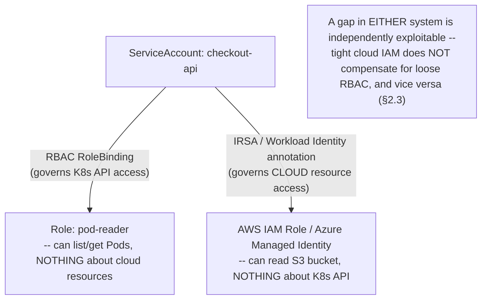
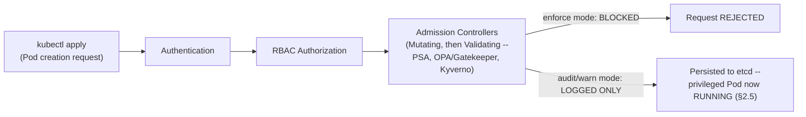

# Module 76 — Kubernetes: Configuration & Security — ConfigMaps, Secrets, RBAC, Pod Security & Admission Controllers

> Domain: Kubernetes | Level: Beginner → Expert | Prerequisite: [[02-Networking-Services-Ingress-CNI-DNS-NetworkPolicies]] (§Advanced Q7 explicitly predicted this module's central finding — Pod Security Admission's enforcement-mode gap as a structural recurrence of NetworkPolicy's enforcement gap; this module confirms and details it), [[../21-AWS/02-IAM-Security-KMS-SecretsManager]] and [[../22-Azure/02-IAM-Security-EntraID-RBAC-KeyVault]] (Kubernetes RBAC is a genuinely SEPARATE authorization layer from cloud IAM — both must be independently reasoned about for any EKS/AKS workload)

---

## 1. Fundamentals

### Why does a Principal Engineer need Kubernetes-specific configuration/security depth when Modules 58 and 66 already established cloud IAM and secrets-management discipline?
Kubernetes RBAC governs access to the **Kubernetes API** — who/what can create a Pod, read a Secret, or modify a Deployment — while cloud IAM (Module 58's IAM roles, Module 66's Entra ID/RBAC) governs access to **cloud resources** (an S3 bucket, a Cosmos DB account) — these are two genuinely **separate, independently-configured authorization systems**, and a workload running on EKS/AKS is governed by both simultaneously, not one or the other. A Principal Engineer who only reasons about cloud IAM scoping (Module 58/66's territory) without equally rigorous Kubernetes RBAC scoping has secured only half of the actual permission surface a compromised or misconfigured workload could exploit — and the reverse is equally true. Additionally, Kubernetes's own configuration primitives (ConfigMaps, Secrets) have specific, easily-misunderstood security properties — most critically, that a Kubernetes `Secret` object's "encoding" is not, by itself, encryption — that don't have a direct, obvious analog in the cloud-IAM material already covered.

### Why does this matter?
Because a Principal Engineer is expected to secure the **full** permission surface of a Kubernetes-hosted workload — both what it can do to the Kubernetes API (RBAC) and what it can do to cloud resources (IAM) — and to correctly distinguish genuine secret protection (encryption at rest, tightly-scoped access) from the *appearance* of protection a default Kubernetes `Secret` object provides on its own.

### When does this matter?
For any Kubernetes cluster running more than a single, fully-trusted workload — RBAC's blast-radius-limiting value (like any least-privilege system, per Module 58/66) scales with the number of distinct workloads/teams/ServiceAccounts sharing a cluster, and Secret-handling discipline matters for any cluster storing genuinely sensitive data (API keys, database credentials, certificates) as native Kubernetes Secrets.

### How does it work (30,000-ft view)?
```
ConfigMap: non-sensitive configuration data, decoupled from container images
Secret: base64-ENCODED (NOT encrypted by default) sensitive data -- requires
     explicit etcd encryption-at-rest configuration for genuine protection
RBAC: Roles/ClusterRoles (WHAT actions are permitted) + RoleBindings/ClusterRoleBindings
     (WHO/WHAT is granted them) -- governs the KUBERNETES API specifically, a SEPARATE
     system from cloud IAM (Module 58/66)
ServiceAccount: the identity a Pod actually authenticates to the K8s API as -- can be
     federated to a cloud IAM role (IRSA on EKS, Workload Identity on AKS)
Pod Security Admission (PSA): per-namespace Pod-spec restriction (privileged/baseline/
     restricted levels) -- has THREE independent enforcement modes (enforce/audit/warn),
     and only "enforce" actually blocks anything
Admission Controllers: the general, pluggable request-interception layer PSA is ONE
     specific instance of -- runs AFTER authentication/RBAC, BEFORE persistence to etcd
```

---

## 2. Deep Dive

### 2.1 ConfigMaps — Decoupling Non-Sensitive Configuration From Container Images
A **ConfigMap** holds non-sensitive configuration data (feature flags, connection strings for non-sensitive endpoints, application config files) as key-value pairs, consumable by Pods either as environment variables or as mounted volume files — directly implementing the twelve-factor-app principle of externalizing configuration from the container image itself, so the identical image can be promoted across environments (dev/staging/production) with only the referenced ConfigMap differing. A subtle but operationally important distinction: a ConfigMap consumed as **environment variables** does **not** automatically update a running Pod when the ConfigMap changes — the Pod must be explicitly restarted (commonly automated via a third-party controller like Reloader, which watches ConfigMaps/Secrets and triggers a rolling restart of dependent Deployments) — whereas a ConfigMap consumed as a **mounted volume** is eventually, automatically synced into the running Pod's filesystem by the kubelet on its own periodic sync interval (typically up to a minute or so of propagation delay, not instantaneous) — a Principal Engineer relying on "just update the ConfigMap" as a config-change deployment mechanism must know which consumption method a given workload uses, since the actual propagation behavior differs materially between them.

### 2.2 Secrets — Base64 Encoding Is Not Encryption; etcd Encryption-at-Rest Is a Separate, Often-Missing Configuration Step
A Kubernetes `Secret` object stores its data **base64-encoded**, not encrypted — base64 is a reversible encoding scheme, not a cryptographic protection, meaning anyone with read access to the Secret object (via `kubectl get secret -o yaml`, or via direct etcd access) can trivially decode it back to plaintext with a single command. Genuine at-rest protection for Secrets requires a **separate, explicit** cluster configuration step — **etcd encryption at rest** (an `EncryptionConfiguration` resource specifying an encryption provider, commonly integrated with a cloud KMS — directly Module 58's AWS KMS or Module 66's Azure Key Vault, now protecting the Kubernetes control plane's own persisted data specifically) — that is **not enabled by default** on many clusters, particularly self-managed or default-configured ones; without it, a Secret object is, in practice, no more protected than a base64-encoded ConfigMap, despite superficially appearing to be a distinct, security-purpose-built object type. The more robust, increasingly standard production pattern avoids storing genuinely sensitive values as native Kubernetes Secrets at all: the **External Secrets Operator**, the **AWS Secrets Manager and Config Provider CSI driver**, or the **Azure Key Vault Provider for Secrets Store CSI Driver** instead dynamically fetch secret values directly from Module 58's Secrets Manager or Module 66's Key Vault at Pod-mount time, keeping the actual secret value's system of record in the cloud-native secrets service (with its own genuine encryption, rotation, and access-audit capabilities) rather than duplicating it into etcd at all.

### 2.3 RBAC — Roles and RoleBindings Govern the Kubernetes API, a Genuinely Separate System From Cloud IAM
Kubernetes RBAC has two paired concepts: a **Role** (namespace-scoped) or **ClusterRole** (cluster-scoped) declares a set of permitted **verbs** (get, list, create, delete, etc.) against specific **resources** (pods, secrets, deployments) — purely a *permission definition*, granting nothing on its own; a **RoleBinding** or **ClusterRoleBinding** actually *grants* a Role/ClusterRole's permissions to a specific subject (a User, Group, or ServiceAccount) — this Role/RoleBinding separation mirrors Module 58/66's policy-vs.-assignment distinction (an IAM policy document vs. its attachment to a role/user) at the Kubernetes-API-authorization layer specifically. The critical point this module establishes: **RBAC and cloud IAM are two entirely independent authorization systems governing two entirely different resource universes** — a ServiceAccount's RBAC permissions determine what it can do *to the Kubernetes API* (list Secrets, create Pods, delete Deployments), while a workload's cloud IAM role (via IRSA/Workload Identity, §2.4) determines what it can do *to cloud resources* (read an S3 object, write to a Cosmos DB container) — a workload with an extremely tightly-scoped cloud IAM role but an overly-broad, cluster-admin-equivalent RBAC grant is still able to, for instance, read every Secret in the cluster (including other workloads' cloud credentials, a lateral-movement risk) — and the reverse gap (tight RBAC, loose cloud IAM) is equally real and independently exploitable; a Principal Engineer's security review must explicitly evaluate **both** dimensions, since scrutinizing only the one already covered by Modules 58/66 leaves the other entirely unreviewed.

### 2.4 ServiceAccounts — the Identity a Pod Actually Presents to the Kubernetes API, and Its Federation to Cloud IAM
Every Pod authenticates to the Kubernetes API as a **ServiceAccount** — if none is explicitly specified, the Pod runs as its namespace's `default` ServiceAccount, which (particularly on older or unhardened clusters) may carry broader-than-intended, automatically-mounted API credentials by default, a genuine, easily-overlooked over-permissioning risk directly analogous to Module 58's "avoid the default, overly-broad role" discipline, now at the Kubernetes-identity layer. Separately, a ServiceAccount can be **federated** to a cloud IAM identity — EKS's **IRSA (IAM Roles for Service Accounts)**, Module 63 §2.5's exact mechanism, or AKS's **Workload Identity federation**, Module 71's analogous mechanism — via a ServiceAccount annotation mapping it to a specific cloud IAM role/Managed Identity, meaning a single ServiceAccount object is simultaneously the anchor for **both** authorization systems this module distinguishes: its RBAC bindings (§2.3) govern Kubernetes-API access, and its IRSA/Workload-Identity federation governs cloud-resource access — a Principal Engineer reviewing a ServiceAccount's total permission surface must trace **both** relationships explicitly, since reviewing only its RBAC bindings or only its federated cloud role independently misses half the actual access it has been granted.

### 2.5 Pod Security Admission — the Predicted Recurrence of Module 74's Enforcement-Mode Gap, Now Confirmed
Module 74 §Advanced Q7 explicitly predicted this finding by structural analogy before this module covered it in detail: **Pod Security Admission (PSA)** restricts what a Pod spec is permitted to declare, at three increasingly strict levels — **privileged** (no restrictions), **baseline** (blocks known privilege-escalation vectors — host namespace access, privileged containers), **restricted** (the most locked-down, enforcing current Pod-hardening best practices — no privilege escalation, mandatory non-root, restricted volume types) — applied per-namespace via labels. The confirmed recurrence: PSA has **three independent enforcement modes** — `enforce` (actually blocks non-compliant Pod creation), `audit` (allows the Pod, but logs a violation to the audit log), `warn` (allows the Pod, but returns a warning to the client, e.g., visible in `kubectl` output) — and a namespace configured with only `audit` or `warn` mode (a common, reasonable-sounding *intermediate* step during a gradual security-hardening rollout — "let's see what would be blocked before we actually block anything") provides **zero actual blocking protection**, identical in structure to Module 74 §2.6's NetworkPolicy enforcement gap: the namespace label is present, syntactically valid, and visibly configured, while a genuinely privileged, host-mounting container can still be created in that namespace without any actual obstruction — the audit/warn output exists, but only for anyone actively watching for it, not as an enforced control.

### 2.6 Admission Controllers — the General Mechanism Pod Security Admission Is One Specific Instance Of
**Admission controllers** are the general, pluggable request-interception layer in the Kubernetes API request lifecycle, running **after** authentication and RBAC authorization succeed, but **before** the object is actually persisted to etcd — meaning an admission controller can still reject, or **mutate**, a request that has already passed identity and permission checks. Pod Security Admission (§2.5) is one specific, built-in **validating** admission controller; **mutating** admission webhooks (which can modify a request, e.g., automatically injecting a sidecar container — directly how Istio's sidecar injection, relevant in Module 79, actually works mechanically) and **validating** admission webhooks (which can only allow/deny, e.g., **OPA/Gatekeeper** or **Kyverno**, the common policy-as-code engines enforcing organization-specific governance rules beyond Kubernetes's built-in PSA levels — "every Deployment must declare resource requests/limits," "no image may be pulled from an unapproved registry") extend this same mechanism arbitrarily — a Principal Engineer designing organization-wide Kubernetes governance (directly this course's recurring automated-governance-gate theme, Module 64/72's synthesized pattern) should recognize custom admission webhooks, not documentation or manual review alone, as the structurally correct mechanism for **enforcing** (not merely documenting) cluster-wide policy, provided — per §2.5's confirmed lesson — that any such webhook's actual failure/enforcement mode is explicitly verified, not merely assumed correct from its presence.

---

## 3. Visual Architecture

### Two Independent Authorization Systems Governing One Workload (§2.3, §2.4)


### Admission Controller Request Flow, and PSA's Three Enforcement Modes (§2.5, §2.6)


## 4. Production Example
**Scenario**: A platform team began a security-hardening initiative to adopt Pod Security Admission's `restricted` level across all production namespaces, following the widely-recommended, cautious rollout pattern: configure `pod-security.kubernetes.io/enforce-version` alongside setting the enforcement mode to `audit` and `warn` first, deliberately deferring `enforce` mode until the resulting audit logs confirmed no existing workload would actually be broken by the new restriction. This was documented, reviewed, and tracked as a two-phase rollout — phase one (audit/warn, to gather data with zero production risk) followed by phase two (switching to enforce, once the audit data confirmed safety). **Investigation**: phase one completed cleanly — the audit logs showed no existing workloads would be blocked by the `restricted` policy — but phase two, the actual switch to `enforce` mode, was never executed: the engineer who owned the initiative moved to a different team shortly after phase one's completion, the tracking ticket for phase two was left open but unprioritized amid other work, and the platform team's own dashboards showed the PSA labels present on every production namespace, which — reviewed only superficially — appeared to indicate the security control was fully active. Nine months later, a routine security review (unrelated to the original initiative) discovered a workload running a genuinely privileged, host-filesystem-mounting container in a "restricted" namespace, and tracing back the finding revealed the enforcement mode had remained `audit`/`warn` the entire time. **Root cause**: this is a direct, real-world instance of Module 74 §Advanced Q7's predicted recurrence — the namespace labels' mere presence (visible on a dashboard, in `kubectl get namespace --show-labels`) was mistaken for evidence of active enforcement, exactly the "object presence provides zero evidence of runtime effect" pattern this course has now identified across NetworkPolicy (Module 74), reclaim policy (Module 75), and Pod Security Admission (this module) — compounded by an organizational gap (an unfinished, abandoned two-phase rollout with no forcing function to complete phase two) structurally similar to Module 64 §4's "known lesson doesn't propagate without structural enforcement" finding. **Fix**: completed the deferred phase-two switch to `enforce` mode across all production namespaces, and — as the durable, structural fix — added an automated, recurring check (directly extending this course's now-repeated "automated verification, not object-presence trust" pattern) that specifically flags any namespace whose PSA labels indicate `audit`/`warn`-only mode for longer than a defined grace period, forcing explicit, tracked completion of any gradual-rollout pattern rather than allowing an indefinitely-stalled intermediate state to silently persist. **Lesson**: gradual, audit-then-enforce rollout patterns are a genuinely sound *methodology* — deliberately verifying a new restriction won't break existing workloads before actually enforcing it is good practice, not the mistake here — but any such staged rollout is only safe if phase transitions are **tracked and time-boxed with an explicit, monitored deadline**, not left as an indefinitely-deferrable "phase two" with no forcing function; the specific, structural failure mode this incident demonstrates is an *abandoned migration*, a category this course has now encountered in several different guises (an incomplete Well-Architected remediation, an unmigrated shared IAM role) and which reliably recurs whenever a security improvement is staged in a way that looks complete before it actually is.

## 5. Best Practices
- Explicitly configure etcd encryption at rest before relying on Kubernetes Secrets for any genuinely sensitive value — base64 encoding alone provides no protection against anyone with object or etcd read access (§2.2).
- Prefer the External Secrets Operator or a cloud-provider Secrets Store CSI driver over native Kubernetes Secrets for production credentials, keeping the actual secret's system of record in Module 58/66's cloud-native secrets service (§2.2).
- Explicitly review both RBAC and cloud IAM permissions for every workload's ServiceAccount — treat them as two independent authorization systems requiring two independent least-privilege reviews, not one review covering both (§2.3, §2.4).
- Set an explicit, time-boxed deadline for the `enforce`-mode transition of any staged/gradual PSA (or NetworkPolicy) rollout, with automated monitoring flagging any namespace stuck in `audit`/`warn`-only mode past that deadline (§4).
- Use validating/mutating admission webhooks (OPA/Gatekeeper, Kyverno) to structurally enforce organization-specific governance rules beyond Kubernetes's built-in PSA levels, verifying their actual failure mode rather than assuming correct behavior from their mere deployment (§2.6).

## 6. Anti-patterns
- Treating a Kubernetes Secret object as equivalent to genuine encryption-at-rest protection without separately verifying etcd encryption is actually configured (§2.2).
- Reviewing only cloud IAM scoping (or only RBAC scoping) for a workload's total permission surface, missing that the other, independent authorization system is left unreviewed (§2.3).
- Leaving a namespace's Pod Security Admission (or any staged security control) in `audit`/`warn`-only mode indefinitely, with no tracked deadline for completing the transition to `enforce` (§4).
- Running workloads under a namespace's `default` ServiceAccount without explicit review of what permissions it actually carries (§2.4).
- Mistaking a security-policy label's or object's mere presence (visible on a dashboard, in `kubectl get`) for evidence that it is actually being enforced (§4, §2.5).

---

## 10. Interview Questions

### Basic (10)
1. **Q: What does a ConfigMap store, and what should never be stored in one?** **A:** Non-sensitive configuration data — sensitive values (credentials, API keys) belong in a Secret (or, more robustly, an external secrets manager), never a ConfigMap.
2. **Q: Is a Kubernetes Secret's data encrypted?** **A:** Not by default — it's base64-encoded, a reversible encoding, not encryption; genuine at-rest protection requires separately configuring etcd encryption at rest.
3. **Q: What is the difference between a Role and a RoleBinding?** **A:** A Role defines a set of permitted actions (verbs/resources); a RoleBinding actually grants that Role's permissions to a specific subject (User, Group, or ServiceAccount).
4. **Q: Is Kubernetes RBAC the same system as cloud IAM (AWS IAM/Azure RBAC)?** **A:** No — RBAC governs access to the Kubernetes API; cloud IAM governs access to cloud resources. They are two independent authorization systems.
5. **Q: What identity does a Pod use to authenticate to the Kubernetes API?** **A:** A ServiceAccount — its own `default` ServiceAccount if none is explicitly specified.
6. **Q: What mechanism federates a Kubernetes ServiceAccount to a cloud IAM role?** **A:** IRSA (IAM Roles for Service Accounts) on EKS, or Workload Identity federation on AKS.
7. **Q: What are the three Pod Security Admission levels?** **A:** Privileged (no restrictions), baseline (blocks known privilege-escalation vectors), and restricted (the strictest, enforcing current Pod-hardening best practices).
8. **Q: What are the three Pod Security Admission enforcement modes, and which one actually blocks a non-compliant Pod?** **A:** `enforce` (blocks), `audit` (logs but allows), `warn` (returns a warning but allows) — only `enforce` actually blocks.
9. **Q: What is an admission controller, and when does it run in the request lifecycle?** **A:** A pluggable request-interception mechanism that runs after authentication and RBAC authorization, but before the object is persisted to etcd — able to reject or mutate the request.
10. **Q: What did §4's incident reveal about the team's staged Pod Security Admission rollout?** **A:** Phase one (audit/warn mode) completed, but phase two (switching to enforce) was never executed due to an ownership change — the namespace labels' presence was mistaken for active enforcement for nine months.

### Intermediate (10)
1. **Q: Why is "the namespace has PSA labels configured" insufficient evidence that Pod-level restrictions are actually enforced?** **A:** PSA labels specify both a security level (privileged/baseline/restricted) and an independent enforcement mode (enforce/audit/warn) — labels alone don't indicate which mode is active, and only `enforce` mode actually blocks non-compliant Pods.
2. **Q: Why can a workload with a tightly-scoped cloud IAM role still pose a serious security risk if its RBAC permissions are overly broad?** **A:** Because RBAC governs an entirely separate resource universe (the Kubernetes API) — an overly broad RBAC grant lets that workload read other workloads' Secrets, modify Deployments, or otherwise act across the cluster, regardless of how narrowly its cloud IAM role restricts cloud-resource access.
3. **Q: Why does a ConfigMap consumed as environment variables require an explicit restart mechanism to pick up changes, while a volume-mounted ConfigMap eventually updates automatically?** **A:** Environment variables are set once, at container start, and never re-read afterward; a volume-mounted ConfigMap's files are periodically re-synced onto the Pod's filesystem by the kubelet, so a running process reading the file (not caching it in memory at startup) picks up the change on the next read after the sync interval.
4. **Q: Why is the External Secrets Operator / cloud-native Secrets Store CSI driver pattern described as more robust than storing production credentials as native Kubernetes Secrets?** **A:** It keeps the secret's actual system of record in the cloud-native secrets service (Module 58/66), which has genuine encryption, rotation, and access-audit capabilities, rather than duplicating the value into etcd where its protection depends entirely on whether etcd encryption at rest happens to be separately configured.
5. **Q: Why does this module describe §4's incident as "a direct, real-world instance" of Module 74 §Advanced Q7's prediction?** **A:** Module 74 §Advanced Q7 predicted, by structural analogy to NetworkPolicy's enforcement gap, that a Pod Security Admission namespace with a misconfigured enforcement mode (audit/warn instead of enforce) would show policy objects present and valid while providing zero actual blocking enforcement — §4's incident is exactly this scenario occurring in practice.
6. **Q: Why is the two-phase audit-then-enforce PSA rollout pattern itself described as sound methodology, despite §4's incident?** **A:** Verifying a new restriction won't break existing workloads before actually enforcing it is good, cautious practice — the incident's actual failure was an *abandoned* migration (phase two never executed, with no tracked deadline), not a flaw in the staged-rollout methodology itself.
7. **Q: Why should a Pod's `default` ServiceAccount be treated with the same scrutiny as an over-permissioned IAM role?** **A:** Particularly on unhardened clusters, the `default` ServiceAccount may carry broader-than-intended, automatically-mounted API credentials — running workloads under it without review risks granting more Kubernetes-API access than that specific workload actually needs, the identical over-permissioning risk pattern this course established for cloud IAM defaults.
8. **Q: Why do mutating admission webhooks matter beyond policy enforcement, per §2.6's Istio example?** **A:** Mutating webhooks can modify a request before persistence — Istio's automatic sidecar injection (relevant in Module 79) works mechanically via a mutating webhook that adds the Envoy sidecar container to a Pod spec, not merely validating an existing spec.
9. **Q: Why does a `ClusterRoleBinding` granting `cluster-admin` deserve the same severity treatment as a wildcard IAM policy, per §8?** **A:** Both grant maximal, essentially unrestricted permission within their respective authorization system — `cluster-admin` lets a compromised ServiceAccount read, modify, or delete any object in the cluster, including every other workload's Secrets, the Kubernetes-API-layer equivalent of an unrestricted cloud IAM policy's blast radius.
10. **Q: Why should custom admission webhook failure policy (`Fail` vs. `Ignore`) be treated as a genuine availability trade-off, per §7?** **A:** A webhook configured with `failurePolicy: Fail` that becomes unavailable will block all matching object creation cluster-wide until it recovers — trading stricter policy guarantee (nothing gets through unchecked) for a genuine availability risk if the webhook itself has any downtime.

### Advanced (10)
1. **Q: Diagnose the §4 incident from first principles, and design the specific organizational/tooling structure that prevents any future staged security rollout (PSA, NetworkPolicy, or otherwise) from silently stalling in an incomplete, "looks done but isn't" state.**
   **A:** Root cause: an inherently sound staged-rollout methodology (audit-then-enforce) had no structural forcing function requiring phase two's completion, and the namespace labels' visible presence created a false impression of completeness that went unchallenged for nine months, compounded by the ownership handoff when the responsible engineer moved teams. Structural fix: (1) any staged security rollout must be tracked with an explicit, monitored completion deadline, not an open-ended ticket — directly extending this course's now-repeated "automated verification, not object-presence trust" pattern (Modules 74, 75) into a *process*-level requirement, not just a technical one; (2) an automated, recurring cluster-wide scan flagging any namespace/policy whose enforcement mode indicates an incomplete staged rollout (audit/warn without enforce) past a defined grace period, surfaced to a team-level owner, not an individual engineer, specifically so an ownership change doesn't cause the finding to be silently lost; (3) require explicit sign-off/verification (a positive confirmation, not merely ticket closure) that phase two's `enforce` transition actually occurred and was validated, mirroring Module 64 §Advanced Q1's "structural enforcement, not just documentation" lesson now applied to internal security-rollout completion tracking specifically.
2. **Q: A team argues that since their EKS cluster already scopes every workload's cloud IAM role tightly via IRSA, Kubernetes RBAC is a secondary concern that can be left at broad, permissive defaults to reduce operational overhead. Evaluate this claim using §2.3's dual-system framing.**
   **A:** Push back directly — RBAC and cloud IAM are independent systems governing independent resource universes (§2.3); a tightly-scoped IRSA role provides zero protection against a workload with broad RBAC permissions reading every Secret in the cluster (including other workloads' cloud credentials, enabling lateral movement to escalate privileges the compromised workload's own IRSA role wouldn't otherwise grant it), listing/deleting arbitrary Deployments, or otherwise acting across the cluster's Kubernetes-API surface — "we've secured cloud IAM" addresses only half of the actual permission surface, and leaving RBAC at permissive defaults specifically creates the lateral-movement risk this module's Secret-reading example demonstrates concretely.
3. **Q: Design the specific automated check that would have caught §4's incident well before the nine-month security review, extending this course's now-repeated "automated enforcement-mode verification" pattern from Modules 74/75 to Pod Security Admission specifically.**
   **A:** A scheduled job querying every namespace's PSA labels cluster-wide, cross-referencing the `enforce` mode's presence against a declared "should be fully enforced by [date]" tracking annotation set at rollout-initiation time — flagging (and paging an owning team, not merely logging) any namespace still lacking `enforce` mode past its declared target date; additionally, a periodic (not merely rollout-time) synthetic test — deliberately attempting to create a genuinely non-compliant test Pod (a privileged, host-mounting container) in a "restricted" namespace and asserting the creation is actually rejected — directly the same positive/negative connectivity-test discipline Module 74 §Advanced Q3 established for NetworkPolicy, now applied to Pod Security Admission's actual blocking behavior specifically, since (per §4's incident) the presence of the correct labels alone was demonstrated to be an unreliable signal.
4. **Q: A workload's Pod spec passes Pod Security Admission's `restricted` level validation (no privileged containers, no host-namespace access) but the container image itself was pulled from an unapproved, unscanned public registry. Explain why PSA alone doesn't address this risk, and design the correct extension.**
   **A:** PSA's built-in levels validate Pod-spec-level properties (privilege escalation vectors, capabilities, volume types) — they have no built-in concept of image provenance, registry allow-listing, or vulnerability-scan status at all, meaning "passes PSA restricted" and "the image itself is trustworthy" are entirely independent claims; the correct extension is a **custom validating admission webhook** (OPA/Gatekeeper or Kyverno, §2.6) with an explicit policy rejecting any Pod spec referencing an image from outside an approved registry allow-list, or requiring a passing vulnerability-scan attestation — directly demonstrating why PSA's built-in levels are necessary but not sufficient for comprehensive Pod-level governance, and why the general admission-controller mechanism (not PSA specifically) is the correct place to add organization-specific rules PSA's fixed levels don't cover.
5. **Q: Critique the following claim: "Since we've enabled etcd encryption at rest, our Kubernetes Secrets are now fully protected, and we no longer need to consider migrating to an external secrets manager."**
   **A:** Overstated — etcd encryption at rest protects against one specific threat (someone gaining direct access to etcd's underlying storage/backups and reading Secret data offline), but does **not** address: anyone with legitimate `get secret` RBAC permission still reads the (etcd-encrypted-but-API-decrypted-on-read) plaintext value directly via `kubectl`; Kubernetes Secrets have no native rotation mechanism (a value set once persists until manually changed, unlike Secrets Manager/Key Vault's automated-rotation capabilities, Module 58/66); and etcd-encrypted Secrets provide no centralized access-audit trail comparable to a dedicated secrets manager's access logging — etcd encryption at rest closes one specific gap (§2.2's core finding) but doesn't provide the fuller capability set (rotation, fine-grained audit, centralized management across both Kubernetes and non-Kubernetes consumers) an external secrets manager provides; the two aren't equivalent, and etcd encryption should be treated as a necessary baseline, not a complete substitute.
6. **Q: A ServiceAccount is granted a RoleBinding scoped to a specific namespace, and the team believes this fully contains its blast radius to that namespace alone. Identify the specific gap in this reasoning, connecting to §2.4's dual-relationship framing.**
   **A:** A namespace-scoped RoleBinding does correctly contain the ServiceAccount's **RBAC** blast radius to that namespace — but §2.4 established that the *same* ServiceAccount may also carry a **separate**, cloud-IAM-federated identity (via IRSA/Workload Identity) whose permission scope is entirely independent of, and not contained by, any Kubernetes-namespace boundary at all — a namespace-scoped RBAC review alone says nothing about what that ServiceAccount's federated cloud IAM role permits it to do to cloud resources, which could span an entire AWS account or Azure subscription regardless of how tightly the Kubernetes-side RBAC is scoped; genuine blast-radius containment requires explicitly verifying both relationships independently, exactly as §2.4 and Advanced Q2 establish.
7. **Q: Explain why this module's central recurring pattern — object/label presence being mistaken for active enforcement — has now appeared in three structurally distinct contexts across this domain (NetworkPolicy, reclaim policy, Pod Security Admission), and what this recurrence implies about how Kubernetes governance controls should generally be verified going forward.**
   **A:** Each instance shares the identical underlying structure: a Kubernetes control-plane object (a NetworkPolicy, a StorageClass's reclaim-policy field, a namespace's PSA label) is accepted, persisted, and displayed by the API without the API itself providing any signal about whether the *downstream, actual enforcement mechanism* (a CNI plugin, a CSI driver's deletion behavior, an admission controller's blocking mode) is genuinely active and correctly configured — Kubernetes's declarative object model faithfully represents *intent*, but intent and *enforced reality* are decoupled by design, since the actual enforcement is delegated to a separate, pluggable component the API server itself doesn't introspect. The general implication: any Kubernetes governance or security control relying on a pluggable downstream enforcer (rather than a control fully self-contained within the API server's own logic) requires an explicit, independent, ongoing verification test of actual runtime behavior — never trust in the declared object's presence or syntactic validity alone — a discipline this domain has now established as a standing methodology, not a one-off lesson specific to any single object type.
8. **Q: Design a Kubernetes-native governance program (synthesizing this module) for an organization that must demonstrate, for a compliance audit, that RBAC least-privilege is genuinely enforced across a large, multi-team cluster — not merely that Roles/RoleBindings exist.**
   **A:** (1) An automated, recurring RBAC-audit tool (e.g., `rbac-lookup`, or a custom equivalent) enumerating every effective permission grant per ServiceAccount cluster-wide, cross-referenced against each workload's actual, observed API usage (via audit logs) to identify granted-but-never-used permissions — a direct RBAC-layer analog to cloud IAM's access-analyzer/unused-permission-detection tooling. (2) A mandatory admission-webhook-enforced policy (§2.6) rejecting any new `ClusterRoleBinding` granting `cluster-admin` without an explicit, documented exception (§8's severity framing operationalized as a structural gate, not a review-time observation alone). (3) A periodic, positive-and-negative test suite (Advanced Q3's pattern) verifying specific expected-deny scenarios (a workload's ServiceAccount should NOT be able to read a different namespace's Secrets) actually fail as expected, not merely that the RBAC objects exist with the intended structure. (4) Documented evidence of both dimensions (§2.3) — RBAC audit results AND cloud-IAM audit results (already required by Module 58/66's own governance program) — presented together for any given workload, since a compliance auditor evaluating only one dimension would, per this module's core finding, miss half the actual access-control picture.
9. **Q: A workload needs to read Secrets from multiple namespaces for a legitimate cross-namespace configuration-aggregation use case. Design the RBAC configuration that satisfies this requirement while minimizing the blast-radius risk §8 describes for over-broad ClusterRole grants.**
   **A:** Avoid a single `ClusterRole` + `ClusterRoleBinding` granting cluster-wide Secret-read access (which would grant access to *every* namespace's Secrets, including ones with no legitimate relationship to this workload's actual requirement) — instead, define a namespace-scoped `Role` permitting `get`/`list` on Secrets, and create individual `RoleBinding`s in **only** the specific namespaces the workload genuinely needs to read from, binding the same ServiceAccount identity in each — this achieves the required cross-namespace access while keeping the actual granted scope explicitly enumerable and auditable (a reviewer can see precisely which namespaces are included, rather than an unbounded "all of them"), directly the same least-privilege, explicitly-scoped-rather-than-broadly-granted discipline Module 58/66 established for cloud IAM, now applied via Kubernetes's namespace-scoped RBAC primitives specifically.
10. **Q: As a Principal Engineer establishing Kubernetes configuration/security standards for a platform team about to onboard multiple tenant teams onto a shared cluster, design the specific set of standing architectural decisions and automated governance checks (synthesizing this entire module) required before multi-tenant production onboarding.**
    **A:** (1) Mandatory etcd encryption at rest, verified (not merely configured-and-assumed) via a periodic check confirming the encryption provider is actually active (§2.2). (2) A migration plan moving genuinely sensitive production credentials off native Kubernetes Secrets and onto an External-Secrets-Operator/CSI-driver-backed pattern for any newly onboarded tenant (§2.2). (3) A mandatory, per-tenant RBAC least-privilege review distinct from and in addition to each tenant's cloud IAM review (Advanced Q8's audit-tool design), with both dimensions' results documented together (§2.3, Advanced Q6). (4) Cluster-wide Pod Security Admission set to `restricted` `enforce` mode as the default baseline for all tenant namespaces, with any staged/gradual exception rollout for a specific legacy tenant workload tracked with the explicit, monitored deadline structure Advanced Q1 establishes — never an open-ended audit/warn-only state. (5) Custom admission-webhook-enforced policies (image-registry allow-listing, mandatory resource requests/limits, per §2.6/Advanced Q4) covering the governance requirements PSA's fixed levels don't address, with each webhook's own failure-mode behavior (§7) explicitly reviewed for availability impact. (6) Recurring, automated positive-and-negative verification tests for every layered control this domain has established (NetworkPolicy enforcement, reclaim policy, PSA enforcement mode, RBAC deny-scenarios) — the single, unifying structural lesson this entire `23-Kubernetes` domain has repeatedly surfaced: a Kubernetes governance control's declared presence is never sufficient evidence of its actual, enforced effect.

---

## 11. Coding Exercises

### Easy — A least-privilege Role/RoleBinding, explicitly namespace-scoped rather than cluster-wide (§2.3, §Advanced Q9)
```yaml
apiVersion: rbac.authorization.k8s.io/v1
kind: Role
metadata:
  name: secret-reader
  namespace: checkout
rules:
  - apiGroups: [""]
    resources: ["secrets"]
    verbs: ["get", "list"]   # read-only -- NOT create/update/delete (§2.3's least-privilege discipline)
---
apiVersion: rbac.authorization.k8s.io/v1
kind: RoleBinding
metadata:
  name: checkout-api-secret-reader
  namespace: checkout   # scoped to THIS namespace only -- not a ClusterRoleBinding (§Advanced Q9)
subjects:
  - kind: ServiceAccount
    name: checkout-api
    namespace: checkout
roleRef:
  kind: Role
  name: secret-reader
  apiGroup: rbac.authorization.k8s.io
```

### Medium — Verifying etcd encryption at rest is actually active, not just configured (§2.2, §Advanced Q5)
```bash
# Configuration existing is NOT sufficient evidence, per this module's recurring theme --
# explicitly verify a Secret's data is genuinely unreadable directly from etcd.

# Step 1 -- confirm the EncryptionConfiguration resource is referenced by the API server
kubectl get pods -n kube-system kube-apiserver-<node> -o yaml | grep encryption-provider-config

# Step 2 -- the definitive test: read the raw etcd value directly and confirm it is
# NOT plaintext-recoverable (requires etcd access -- typically only possible/tested
# during initial cluster hardening validation, not routinely, but establishes the
# actual verification standard):
ETCDCTL_API=3 etcdctl get /registry/secrets/checkout/db-credentials | hexdump -C | head
# Expected: encrypted, opaque bytes (e.g., prefixed with "k8s:enc:aescbc:") --
# NOT a recognizable base64 string trivially decodable back to plaintext.
```

### Hard — A Kyverno ClusterPolicy enforcing image-registry allow-listing (§Advanced Q4, extending PSA's coverage gap)
```yaml
apiVersion: kyverno.io/v1
kind: ClusterPolicy
metadata:
  name: restrict-image-registries
spec:
  validationFailureAction: Enforce   # NOT "Audit" -- explicitly verified, per this module's
                                        # recurring enforcement-mode lesson (§2.5, §4)
  rules:
    - name: approved-registries-only
      match:
        resources:
          kinds: [Pod]
      validate:
        message: "Images must be pulled from the approved internal registry only."
        pattern:
          spec:
            containers:
              - image: "registry.internal.example.com/*"   # rejects any other registry --
                                                               # a gap PSA's built-in levels
                                                               # don't cover at all (§Advanced Q4)
```

### Expert — Automated staged-rollout completion tracker, preventing §4's "abandoned migration" (§Advanced Q1, §Advanced Q3)
```csharp
public class StagedRolloutComplianceChecker
{
    // Directly the structural fix for §4's incident -- a rollout with only audit/warn
    // configured past its OWN declared target date is flagged, not silently trusted.
    public IEnumerable<string> CheckStalledRollouts(IEnumerable<NamespacePolicyStatus> namespaces)
    {
        foreach (var ns in namespaces)
        {
            if (ns.EnforcementMode is "audit" or "warn"
                && ns.DeclaredEnforceByDate.HasValue
                && ns.DeclaredEnforceByDate.Value < DateTime.UtcNow)
            {
                yield return $"Namespace '{ns.Name}': PSA rollout STALLED -- " +
                             $"still in '{ns.EnforcementMode}' mode, " +
                             $"{(DateTime.UtcNow - ns.DeclaredEnforceByDate.Value).Days} days past its " +
                             $"declared enforce-by date ({ns.DeclaredEnforceByDate.Value:yyyy-MM-dd}). " +
                             $"Owning team: {ns.OwningTeam} (this module §4/§Advanced Q1).";
            }
        }
    }

    // Advanced Q3's synthetic negative test -- the definitive verification, independent
    // of what the labels merely claim.
    public async Task<bool> VerifyActualEnforcementAsync(string @namespace, IKubernetesClient client)
    {
        var privilegedTestPod = BuildDeliberatelyNonCompliantPod(@namespace);
        try
        {
            await client.CreatePodAsync(privilegedTestPod);
            await client.DeletePodAsync(privilegedTestPod.Name, @namespace);   // cleanup if it succeeded
            return false;   // creation SUCCEEDED -- enforcement is NOT actually active, despite labels
        }
        catch (KubernetesAdmissionDeniedException)
        {
            return true;   // creation was correctly REJECTED -- enforcement genuinely confirmed active
        }
    }
}
```

---

## 12–17. System Design / LLD / Debugging / Decision / Case Study / Principal

*(§4's incident, the four §11 exercises, and the Advanced-tier Q&A — especially Advanced Q1's stalled-rollout governance structure, Advanced Q3's automated enforcement-mode verification design, and Advanced Q10's synthesized multi-tenant onboarding checklist — collectively constitute this module's system-design, debugging, and Principal-Engineer-level content.)*

## 18. Revision
**Key takeaways**: Kubernetes configuration and security rest on distinguishing several pairs of concepts that look similar but are structurally independent: ConfigMaps (non-sensitive) vs. Secrets (sensitive, but only base64-encoded by default — genuine protection requires separately-configured etcd encryption at rest, §2.2); Kubernetes RBAC (governs the Kubernetes API) vs. cloud IAM (governs cloud resources) — two entirely independent authorization systems a ServiceAccount straddles simultaneously via RBAC bindings and IRSA/Workload-Identity federation (§2.3, §2.4), both requiring independent least-privilege review. This module's central finding directly confirms a prediction seeded in Module 74 §Advanced Q7: Pod Security Admission's enforcement mode (enforce/audit/warn, §2.5) is a structural recurrence of NetworkPolicy's CNI-dependent enforcement gap and Module 75's reclaim-policy gap — a namespace's PSA labels being present and syntactically valid provides zero evidence of actual blocking enforcement, and §4's incident demonstrates the specific, realistic failure mode: an inherently sound, staged audit-then-enforce rollout silently stalling indefinitely once its phase-two completion loses individual ownership, with no structural forcing function to complete it. This is now the third instance across Modules 74–76 of this domain's unifying lesson: a Kubernetes control-plane object's declared presence is decoupled, by design, from the actual behavior of the pluggable downstream component (a CNI plugin, a CSI driver, an admission controller) responsible for genuinely enforcing it — every such control requires explicit, ongoing, automated verification of real runtime behavior, never trust in object presence alone.

---

**Next**: Module 77 — Kubernetes: Scheduling & Autoscaling — Scheduler Internals, Affinity/Taints/Tolerations & HPA/VPA/Cluster Autoscaler, continuing the `23-Kubernetes` domain (Modules 73–80).
