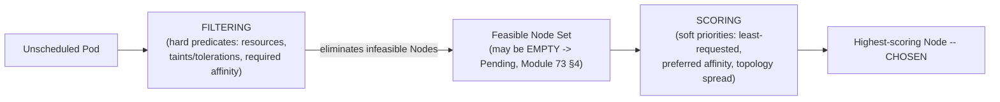
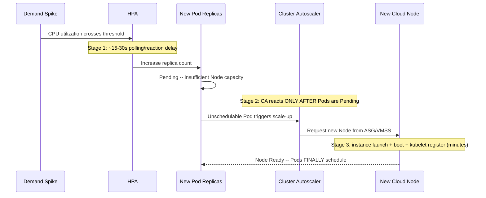

# Module 77 — Kubernetes: Scheduling & Autoscaling — Scheduler Internals, Affinity/Taints/Tolerations & HPA/VPA/Cluster Autoscaler

> Domain: Kubernetes | Level: Beginner → Expert | Prerequisite: [[01-Architecture-ControlPlane-Pods-Deployments]] (§4's `Pending`-Pod incident first introduced the Scheduler at a high level; this module covers its actual filtering/scoring internals and the placement controls that influence it), [[../21-AWS/01-Compute-Networking-VPC-LoadBalancing-AutoScaling]] and [[../22-Azure/01-Compute-Networking-VNet-LoadBalancer-VMSS]] (Cluster Autoscaler is the Kubernetes-aware controller directly driving the exact ASG/VMSS primitives those modules covered)

---

## 1. Fundamentals

### Why does a Principal Engineer need dedicated scheduling/autoscaling depth beyond Module 73 §4's `Pending`-Pod debugging introduction?
Module 73 §4 established that `Pending` status signals a scheduling failure and pointed at the Scheduler's event log as the debugging entry point — but treated the Scheduler itself as a black box. This module opens that box: the Scheduler's actual two-phase filtering-then-scoring decision process, and the placement-control primitives (affinity, taints/tolerations) a Principal Engineer uses to deliberately *influence* that decision, not merely debug it after the fact. Separately, "Kubernetes autoscaling" is commonly treated as one unified capability, when it is actually **three independently-configured, sequentially-dependent layers** — the Horizontal Pod Autoscaler (Pod replica count), the Vertical Pod Autoscaler (per-Pod resource sizing), and the Cluster Autoscaler (Node count) — a Principal Engineer who doesn't understand that these three layers react in sequence, not in parallel, will systematically under-provision for how long a genuine demand spike actually takes the full stack to absorb.

### Why does this matter?
Because Scheduler placement decisions determine actual fault-tolerance (whether replicas are genuinely spread across failure domains or merely happen to be, per the Scheduler's soft-preference defaults) and workload isolation (whether a GPU/Spot Node pool actually stays dedicated to its intended workload), and because the three-layer autoscaling chain's compounding reaction latency is a frequent, costly source of "autoscaling should have handled this" incidents during genuine demand spikes.

### When does this matter?
For any workload requiring genuine high-availability placement guarantees (not merely the Scheduler's default best-effort spreading), any cluster using dedicated/specialized Node pools (GPU, Spot/preemptible capacity), and any workload whose demand is variable enough to require autoscaling at all — which is to say, most non-trivial production Kubernetes workloads.

### How does it work (30,000-ft view)?
```
Scheduler: two-phase decision -- FILTERING (eliminate infeasible Nodes: resources, taints,
     affinity rules) then SCORING (rank remaining feasible Nodes, pick the highest score)
Node Affinity / Pod Affinity / Anti-Affinity: PULL mechanisms -- attract Pods toward
     (or away from) specific Nodes or other Pods, based on labels
Taints and Tolerations: PUSH/REPEL mechanism -- a Node REPELS Pods unless they explicitly
     tolerate its taint (dedicating Nodes to specific workloads)
HPA (Horizontal Pod Autoscaler): scales POD REPLICA COUNT based on observed metrics
VPA (Vertical Pod Autoscaler): adjusts a Pod's RESOURCE REQUESTS/LIMITS (right-sizing)
Cluster Autoscaler (CA): scales NODE COUNT -- directly drives the underlying cloud ASG/VMSS
     (Module 57/65's exact resources) based on Pending/unschedulable Pods or underutilized Nodes
THE CHAIN: a demand spike must first trigger HPA (adds Pod replicas) -> those new replicas
     may go PENDING (insufficient Node capacity) -> THIS triggers Cluster Autoscaler (adds
     Nodes) -> new Nodes must boot/register/become Ready BEFORE the originally-Pending Pods
     can finally schedule -- three SEQUENTIAL delays, not one fast, unified reaction
```

---

## 2. Deep Dive

### 2.1 The Scheduler's Two-Phase Decision — Filtering, Then Scoring
The Scheduler (Module 73 §2.1, §2.5) makes its Pod-to-Node placement decision in two distinct phases for every unscheduled Pod: **Filtering** (evaluating every Node against a set of hard predicates — does the Node have sufficient allocatable CPU/memory per the Pod's resource requests, per Module 73 §4's exact incident; does the Node's taints permit this Pod, per §2.3; does the Pod's node-affinity `requiredDuringSchedulingIgnoredDuringExecution` rule match this Node's labels — any Node failing *any* filter is eliminated entirely, not merely deprioritized) followed by **Scoring** (ranking the *remaining*, feasible Nodes against a set of priority functions — least-requested-resources, balanced-resource-allocation, node-affinity *preference* weighting, pod-topology-spread scoring — and selecting the highest-scoring Node). A Principal Engineer debugging an *unexpected* (not simply `Pending`, but placed somewhere surprising) scheduling outcome should reason in these same two phases: first confirm which Nodes even passed filtering at all, then reason about why the specific chosen Node scored highest among the feasible set — a materially different, more precise debugging question than "why did the Scheduler put it there."

### 2.2 Node Affinity, Pod Affinity, and Anti-Affinity — the "Pull" Mechanisms, and Why Anti-Affinity Is Required (Not Merely Helpful) for Genuine HA
**Node affinity** attracts Pods toward Nodes matching specific labels (e.g., a specific instance type, or an Availability Zone label) — available in both a **required** form (`requiredDuringSchedulingIgnoredDuringExecution`, a hard filter identical in strictness to a taint/toleration mismatch) and a **preferred** form (`preferredDuringSchedulingIgnoredDuringExecution`, a soft scoring input the Scheduler weighs but can override if no matching Node is feasible). **Pod affinity** attracts a Pod toward Nodes already running other Pods matching a label selector (co-locating a cache-adjacent service with its cache for latency reasons, for instance); **Pod anti-affinity** does the reverse — repelling a Pod *away* from Nodes already running other Pods matching a selector, the mechanism specifically required for genuine high-availability replica spreading. This is a critical, easily-missed distinction: the Scheduler's default `PodTopologySpread`-style scoring provides only a **soft, best-effort preference** toward spreading a Deployment's replicas across Nodes/zones — under Node-capacity pressure, the Scheduler can and will still co-locate multiple replicas of the same Deployment on a single Node (or single AZ) if that's the only way to satisfy filtering, since the default spreading behavior is a scoring *preference*, not a hard *requirement* — a Principal Engineer requiring genuine, guaranteed fault-tolerant spreading (all three replicas must never land on the same Node, or the same AZ) must explicitly configure a **required** Pod anti-affinity rule (or a `topologySpreadConstraints` object with `whenUnsatisfiable: DoNotSchedule`), not rely on the Scheduler's default soft preference alone — directly recurring this course's "explicit, chosen configuration, not an assumed default" theme (Module 67's redundancy-tier lesson) at the Pod-placement layer specifically.

### 2.3 Taints and Tolerations — the "Push/Repel" Mechanism, Dedicating Nodes to Specific Workloads
Where affinity *attracts* Pods, a **taint** applied to a Node *repels* Pods away from it, unless the Pod carries a matching **toleration** explicitly permitting it to schedule there anyway — the standard mechanism for dedicating a specialized Node pool (GPU-equipped Nodes, cost-optimized Spot/preemptible Nodes) exclusively to the specific workloads that should use it, preventing arbitrary, unrelated Pods from consuming that specialized (and often more expensive, or less reliable in the Spot case) capacity by accident. Taints have three distinct **effects**, a nuance often collapsed into "taints block scheduling" generically: **NoSchedule** (new Pods without a matching toleration are not scheduled here, but already-running Pods are undisturbed); **PreferNoSchedule** (a soft version — the Scheduler tries to avoid it, but will still place a Pod here if no better option exists); and **NoExecute** (the strictest — not only blocks new scheduling, but additionally **evicts already-running Pods** lacking the toleration) — `NoExecute` is specifically the mechanism underlying Kubernetes's automatic Pod eviction from a Node that has become `NotReady` after a configurable grace period (directly connecting to Module 73's Node-failure/Pod-rescheduling discussion — the actual mechanism by which a failed Node's Pods get evicted and replaced elsewhere is a system-applied `NoExecute` taint with a toleration-seconds grace period, not a separate, distinct failure-detection code path).

### 2.4 Horizontal Pod Autoscaler (HPA) — Scaling Replica Count Based on Observed Metrics
The **HPA** is a controller (Module 73 §2.2's reconciliation-loop pattern, specifically) that periodically (by default, roughly every 15 seconds) compares a target Deployment/StatefulSet's observed metric (CPU/memory utilization via the in-cluster `metrics-server`, or custom/external application-level metrics — request rate, queue depth — via the Prometheus Adapter or a similar metrics-API implementation) against a configured target, and adjusts the target's `replicas` field to converge observed utilization toward that target — directly the same "declare desired state, let a reconciliation loop continuously converge toward it" pattern as everything else in this domain, now applied to replica count specifically as a function of live metrics rather than a fixed, manually-set number.

### 2.5 Vertical Pod Autoscaler (VPA) — Right-Sizing Resource Requests/Limits, and Why It Should Not Combine With HPA on the Same Metric
The **VPA** takes a different scaling dimension entirely: rather than adjusting *how many* replicas exist, it adjusts *how much CPU/memory each Pod requests* — observing actual historical usage and recommending (or, in `Auto`/`Recreate` update mode, actively applying) right-sized resource requests/limits, directly addressing the "resource requests copied from an unvalidated guess, never revisited" anti-pattern Module 73 §4's incident demonstrated at the cross-cluster-migration scale, now as an ongoing, continuous right-sizing discipline. A specific, well-documented interaction to flag explicitly: **HPA and VPA should generally not be configured to manage the same resource metric (CPU or memory) for the same workload simultaneously** — VPA changing a Pod's resource *requests* changes the denominator HPA's utilization-percentage calculation is based on, and the two controllers' independent, uncoordinated adjustments can produce oscillating, unstable behavior (VPA shrinks requests, which raises the observed CPU-utilization percentage against the new, smaller request, which triggers HPA to add more replicas, compounding rather than resolving the original sizing question) — the standard resolution is using VPA in recommendation-only mode alongside HPA (informing manual or offline request-sizing decisions without VPA actively mutating live Pods), or using VPA to actively manage requests only for metrics HPA isn't scaling on. Additionally, VPA's `Recreate` update mode (the only mode available on most clusters prior to Kubernetes's newer in-place Pod resize feature) applies a new resource sizing by **evicting and recreating** the Pod — meaning VPA-driven right-sizing is not a zero-disruption operation, directly recurring this course's cold-start/disruption-window theme (Module 71 §2.5, Module 75 §Advanced Q8) at the resource-right-sizing layer specifically.

### 2.6 Cluster Autoscaler — the Kubernetes-Aware Controller Directly Driving Module 57/65's ASG/VMSS
The **Cluster Autoscaler (CA)** scales the *Node* count itself, by directly interacting with the underlying cloud's Auto Scaling Group (Module 57's exact EC2 ASG resource) or Virtual Machine Scale Set (Module 65's exact Azure VMSS resource) — CA is not a separate infrastructure-scaling mechanism competing with ASG/VMSS; it *is* the Kubernetes-native controller that adjusts those same cloud-native scaling-group resources' desired capacity, specifically in response to two Kubernetes-level signals: **scale up**, triggered by Pods sitting `Pending` and unschedulable due to insufficient Node capacity (not any other `Pending` cause — an affinity or taint mismatch that no possible new Node would resolve does not trigger a scale-up attempt); **scale down**, triggered by a Node being significantly underutilized for a sustained period, with its Pods' workloads confirmed re-schedulable elsewhere before that Node is drained and terminated.

### 2.7 The Full Autoscaling Chain — Three Sequential Delays, Not One Fast, Unified Reaction
Synthesizing §2.4–§2.6: a genuine demand spike does **not** trigger one unified, fast "autoscale" response — it triggers a **sequential chain** of three independently-latent stages: (1) HPA's own metrics-polling interval and reaction latency (typically tens of seconds) before it increases the target Deployment's replica count; (2) if the cluster's existing Nodes lack capacity for those new replicas, they become `Pending` — this `Pending` state is itself the *trigger* Cluster Autoscaler watches for, meaning CA's reaction cannot begin until stage (1) has already produced unschedulable Pods, not in parallel with HPA's own reaction; (3) Cluster Autoscaler's own reaction — directly Module 57 §4's ASG warm-up-window discussion, now recurring exactly as predicted — a new cloud instance must be launched, boot, join the cluster, and have its kubelet register as `Ready` (often taking multiple minutes, not seconds) before the originally-`Pending` Pods from stage (1) can finally, actually schedule and begin serving traffic. A Principal Engineer must reason about this **compounded, multi-minute** total latency — not any single stage's latency in isolation — when assessing whether Kubernetes's autoscaling stack can genuinely absorb a specific demand-spike profile within an acceptable customer-facing impact window.

---

## 3. Visual Architecture

### Scheduler's Two-Phase Filtering → Scoring Decision (§2.1)


### The Full Autoscaling Chain's Sequential (Not Parallel) Delays (§2.7)


## 4. Production Example
**Scenario**: An e-commerce platform's checkout service had HPA configured to scale from a baseline of 6 replicas up to 40 based on CPU utilization, and the team had load-tested this configuration extensively — confirming HPA correctly and promptly increased replica count under simulated load. Ahead of a major promotional event, the team was confident the service would scale smoothly to handle the anticipated traffic surge. **Investigation**: during the actual event, traffic ramped up faster than the team's original load test had simulated (a sharper, more sudden spike rather than a gradual ramp), and while HPA did react promptly — increasing the Deployment's replica count within its normal ~20-second reaction window, exactly as the load test had validated — the cluster's existing Node capacity was insufficient to actually schedule the newly-requested replicas, and a large fraction of them sat `Pending` for several minutes while Cluster Autoscaler provisioned additional Nodes, during which checkout requests were being served by only the original, now severely overloaded 6 replicas, producing a real, customer-visible latency and error-rate spike lasting nearly the entirety of the multi-minute Node-provisioning window. **Root cause**: the team's original load test had been run against a cluster that already had ample idle Node capacity pre-provisioned (a deliberate test-environment setup decision to isolate and validate HPA's own reaction behavior specifically) — meaning the test had validated stage 1 of §2.7's chain (HPA's reaction) in complete isolation from stages 2 and 3 (Pending-Pod-triggered Cluster Autoscaler node provisioning), and had never actually exercised the full, compounded chain under genuine Node-capacity-constrained conditions — a direct instance of this course's recurring "steady-state testing doesn't exercise the actual failure-triggering condition" pattern (Module 60 §Advanced Q3's replication-lag load test, Module 71 §Advanced Q3's Container Apps cold-start test), now at the full-autoscaling-chain scale specifically. **Fix**: adopted a standing minimum Node-capacity buffer (a small amount of deliberately pre-provisioned, currently-idle headroom, directly trading some ongoing cost for reduced cold-start-chain exposure — the same cost-vs-latency trade-off Module 61 §2.2's Lambda provisioned-concurrency discussion established generically), and separately re-ran load testing with the test cluster deliberately capacity-constrained from the start (removing the pre-provisioned-headroom test-environment shortcut), specifically to measure and validate the full, compounded HPA-then-Pending-then-CA-then-Node-Ready latency chain end-to-end, not HPA's reaction time in isolation. **Lesson**: validating one stage of a multi-stage, sequentially-dependent system in isolation (HPA's reaction speed) can produce a dangerously incomplete confidence picture about the *system's* actual end-to-end response time, since the isolated stage's own performance says nothing about the compounded latency once every dependent stage's own delay is stacked in sequence — a Principal Engineer must explicitly identify and test the *full* chain any time a system's advertised or assumed responsiveness (here, "Kubernetes autoscales automatically") is actually composed of multiple, independently-latent, sequentially-triggered components.

## 5. Best Practices
- Explicitly configure required (not merely preferred) Pod anti-affinity or `topologySpreadConstraints` with `DoNotSchedule` for any workload requiring genuine, guaranteed replica spreading across Nodes/AZs — never rely on the Scheduler's default soft-preference spreading for a real HA requirement (§2.2).
- Use taints/tolerations to explicitly dedicate specialized Node pools (GPU, Spot) to their intended workloads, and understand `NoExecute`'s additional eviction behavior distinctly from `NoSchedule`/`PreferNoSchedule` (§2.3).
- Avoid configuring HPA and VPA to actively manage the same resource metric for the same workload simultaneously — use VPA in recommendation-only mode alongside an active HPA, or scope each to different metrics (§2.5).
- Maintain a deliberate, small Node-capacity buffer for latency-sensitive workloads with variable demand, explicitly trading modest ongoing cost against exposure to the full HPA-then-CA-then-Node-provisioning latency chain (§4).
- Load-test the full autoscaling chain (HPA reaction + Pending-Pod-triggered Cluster Autoscaler node provisioning + new-Node-Ready time) end-to-end under genuinely capacity-constrained conditions, not HPA's reaction speed in isolation against pre-provisioned headroom (§4, §2.7).

## 6. Anti-patterns
- Relying on the Scheduler's default soft-preference replica spreading for a genuine high-availability requirement, without an explicit, required anti-affinity or topology-spread constraint (§2.2).
- Configuring both HPA and VPA to actively manage the identical CPU/memory metric for the same workload, risking oscillating, unstable scaling behavior (§2.5).
- Load-testing only HPA's reaction speed against a pre-provisioned, capacity-unconstrained test cluster, mistaking that isolated result for validation of the full, genuinely capacity-constrained autoscaling chain's actual end-to-end latency (§4).
- Assuming "Kubernetes autoscales automatically" describes one fast, unified mechanism, rather than three independently-configured, sequentially-dependent layers with a compounding total latency (§2.7).
- Treating a `NoSchedule` taint as equivalent to `NoExecute`, and being surprised when already-running Pods are not evicted from a newly-tainted Node (§2.3).

---

## 10. Interview Questions

### Basic (10)
1. **Q: What are the Scheduler's two decision phases?** **A:** Filtering (eliminates infeasible Nodes via hard predicates) and Scoring (ranks the remaining feasible Nodes, selecting the highest score).
2. **Q: What is the difference between Node affinity and Pod anti-affinity?** **A:** Node affinity attracts a Pod toward Nodes matching specific labels; Pod anti-affinity repels a Pod away from Nodes already running other Pods matching a selector.
3. **Q: What do taints and tolerations do?** **A:** A taint repels Pods from a Node unless the Pod has a matching toleration — used to dedicate specialized Nodes to specific workloads.
4. **Q: What are the three taint effects?** **A:** NoSchedule (blocks new scheduling only), PreferNoSchedule (soft avoidance), and NoExecute (blocks new scheduling AND evicts already-running non-tolerating Pods).
5. **Q: What does the Horizontal Pod Autoscaler (HPA) scale?** **A:** Pod replica count, based on observed metrics (CPU/memory, or custom/external metrics) against a configured target.
6. **Q: What does the Vertical Pod Autoscaler (VPA) scale?** **A:** A Pod's resource requests/limits (right-sizing), not replica count.
7. **Q: What does the Cluster Autoscaler (CA) scale, and what triggers it?** **A:** Node count — triggered by Pods sitting Pending and unschedulable due to insufficient Node capacity (scale up), or by sustained Node underutilization (scale down).
8. **Q: Is Cluster Autoscaler a separate mechanism from AWS ASG/Azure VMSS?** **A:** No — it's the Kubernetes-native controller that directly adjusts those same underlying cloud scaling-group resources' desired capacity.
9. **Q: Do HPA and Cluster Autoscaler react in parallel to a demand spike?** **A:** No — Cluster Autoscaler's reaction is triggered only after HPA's replica increase produces Pending, unschedulable Pods, making the two sequential, not parallel.
10. **Q: What did §4's promotional-event incident reveal about the team's original load test?** **A:** It validated HPA's reaction speed in isolation against a pre-provisioned, capacity-unconstrained cluster, never exercising the full HPA-then-Pending-then-Cluster-Autoscaler-then-Node-Ready chain under genuinely capacity-constrained conditions.

### Intermediate (10)
1. **Q: Why is the Scheduler's default replica-spreading behavior described as a "soft preference" rather than a guarantee?** **A:** Topology-spread scoring is a priority function evaluated during the scoring phase, not a filtering-phase hard predicate — under Node-capacity pressure, the Scheduler can still co-locate replicas if that's the only way to satisfy the hard filtering requirements, since spreading is weighed, not enforced.
2. **Q: Why must a genuine HA requirement use required (not preferred) anti-affinity or `topologySpreadConstraints` with `DoNotSchedule`?** **A:** Because only a required/hard constraint is enforced during the filtering phase (eliminating non-compliant Nodes entirely) — a preferred/soft constraint only influences scoring among Nodes that already passed filtering, and can be overridden if no compliant Node is feasible.
3. **Q: Why does `NoExecute`'s eviction behavior matter specifically for Node-failure handling, per §2.3?** **A:** It's the actual underlying mechanism Kubernetes uses to evict Pods from a Node that has become NotReady after a grace period — not a separate, distinct failure-detection code path, but a system-applied NoExecute taint with a toleration-seconds grace period.
4. **Q: Why can combining HPA and VPA on the same CPU/memory metric produce unstable, oscillating behavior?** **A:** VPA changing a Pod's resource requests changes the denominator HPA's utilization-percentage calculation depends on — the two controllers' independent, uncoordinated adjustments to related but different scaling dimensions (replica count vs. per-Pod sizing) can compound rather than resolve the original sizing question.
5. **Q: Why is VPA's `Recreate` update mode described as "not a zero-disruption operation"?** **A:** Applying a new resource sizing requires evicting and recreating the Pod on most clusters (absent the newer in-place Pod resize feature) — VPA-driven right-sizing carries the same restart/cold-start disruption cost this course has flagged for other reschedule-triggering events.
6. **Q: Why doesn't Cluster Autoscaler attempt to scale up in response to every kind of `Pending` Pod?** **A:** It reacts specifically to Pods `Pending` due to insufficient Node capacity — a Pod `Pending` because of an affinity or taint mismatch that no possible new Node would resolve isn't a scenario adding Node capacity would fix, so CA doesn't attempt scale-up for that cause.
7. **Q: Why does §4 describe the team's load-testing setup as "isolating stage 1 of the chain" specifically?** **A:** The test cluster was deliberately pre-provisioned with ample idle Node capacity, meaning newly-requested replicas from HPA's reaction never actually went Pending during the test — stages 2 and 3 (Pending-triggered CA reaction, Node provisioning latency) simply never executed at all during that test.
8. **Q: Why is a small, deliberately pre-provisioned Node-capacity buffer described as trading cost for reduced latency-chain exposure, per §4's fix?** **A:** Maintaining idle headroom means newly-requested HPA replicas can often schedule immediately without ever triggering stages 2-3 of the chain at all, at the ongoing cost of paying for that idle capacity — directly the same cost-vs-latency trade-off Module 61 §2.2 established for Lambda provisioned concurrency.
9. **Q: Why doesn't raising HPA's `maxReplicas` ceiling alone improve a workload's actual response time to a demand spike, per §9?** **A:** The effective ceiling on how quickly the workload can genuinely absorb increased load is bounded by how much new Node capacity Cluster Autoscaler can actually provision within the available reaction window, not by HPA's configured replica maximum, which is meaningless if the cluster can't schedule that many replicas in time.
10. **Q: Why should Pod-placement taints be considered a defense-in-depth security layer, not merely a workload-organization convenience, per §8?** **A:** Dedicating Nodes carrying elevated trust or access (a sensitive IAM role) exclusively to vetted workloads via taints prevents an arbitrary, unrelated Pod from being inadvertently scheduled onto — and potentially exploiting — that Node's elevated credentials, complementing RBAC/IAM controls rather than replacing them.

### Advanced (10)
1. **Q: Diagnose the §4 incident from first principles, and design the specific load-testing methodology that would have caught the full-chain latency gap before the actual promotional event.**
   **A:** Root cause: the load test validated HPA's reaction speed in complete isolation from Cluster Autoscaler's own reaction, because the test cluster's pre-provisioned idle capacity meant the newly-requested replicas never actually went Pending, so stages 2-3 of §2.7's chain never executed during testing at all — a classic "steady-state testing doesn't exercise the actual failure-triggering condition" gap (directly Module 60 §Advanced Q3, Module 71 §Advanced Q3). Structural fix: any load test intended to validate autoscaling behavior must explicitly start from a genuinely capacity-constrained cluster state (deliberately limiting available Node headroom to force the test traffic to actually exercise Cluster Autoscaler's own node-provisioning path), and must measure and assert against the **full**, end-to-end latency from demand-spike onset to the point where newly-scheduled replicas are actually serving traffic — not HPA's replica-count-change timestamp alone, which (per §4) can look like a fast, successful response while masking a much longer full-chain latency still in progress behind it.
2. **Q: A team argues that since Cluster Autoscaler successfully added new Nodes during §4's incident (eventually resolving the Pending Pods), the autoscaling stack "worked as designed," and no further architectural change is needed. Evaluate this claim.**
   **A:** Push back — "eventually resolved correctly" and "resolved within an acceptable customer-facing impact window" are different claims; Cluster Autoscaler did perform its designed function (provisioning new Nodes in response to Pending Pods), but the multi-minute window before those Nodes became Ready represented genuine, customer-visible degraded service the whole time — the autoscaling *mechanism* worked correctly, but the *system's* actual, observed responsiveness to the demand spike did not meet the business's implicit availability expectations; "the component performed its function" doesn't validate "the end-to-end business outcome was acceptable," and the correct response (§4's fix) is architectural (a capacity buffer, or accepting the latency with an explicit, documented SLA understanding), not a conclusion that nothing further is needed.
3. **Q: Design a specific, alternative mitigation to §4's "maintain idle Node-capacity buffer" fix that avoids paying for continuously-idle capacity, for a team with a strongly cost-sensitive posture but a predictable, scheduled demand-spike event (like a known promotional-event date).**
   **A:** Rather than a continuously-maintained buffer, explicitly **pre-scale** Node capacity ahead of the *known* event window specifically (a scheduled, time-boxed increase to the cluster's minimum Node count, reverted afterward) — this avoids §4's fix's ongoing cost for the (potentially large) fraction of time no spike is occurring, at the cost of requiring the spike's timing to be genuinely predictable/scheduled in advance (unlike a fully organic, unpredictable traffic surge, where this approach doesn't apply and §4's always-on buffer, or accepting the latency, become the only two realistic options) — directly the same "match the mitigation's cost profile to the actual, known shape of the risk" reasoning this course has applied to Reserved Instance/Savings Plan sizing (Module 64 §7) now applied to autoscaling-buffer strategy specifically.
4. **Q: A workload's VPA is configured in `Auto` update mode alongside an active HPA, both nominally scoped to memory (not CPU) as the shared metric. The team observes the workload's replica count oscillating unpredictably during periods of steady, unchanging actual load. Diagnose the likely cause.**
   **A:** Directly §2.5's flagged interaction — VPA is periodically adjusting the Pod's memory *request* value based on observed usage, which changes the denominator HPA's memory-utilization-percentage calculation uses, causing HPA's computed utilization percentage to shift even though genuine, actual memory consumption hasn't changed at all — HPA reacts to this artifact of VPA's own adjustment by changing replica count, which itself changes per-replica load distribution and thus each replica's own observed memory usage, feeding back into VPA's next recommendation — the fix is decoupling the two controllers' scope: switch VPA to recommendation-only mode (no longer actively mutating live requests) while HPA continues actively scaling on memory, or move HPA to scale on a genuinely independent metric (request rate) not affected by VPA's own request-value adjustments.
5. **Q: Critique the following claim: "Since our checkout Deployment has 12 replicas and 3 Availability Zones, and Kubernetes spreads Pods across zones by default, we're already resilient to a single-AZ failure without any additional configuration."**
   **A:** Overstated — per §2.2, the Scheduler's default zone-spreading behavior is a soft scoring preference, not a guaranteed, enforced constraint; under specific conditions (uneven Node capacity across zones, a rolling update's transient placement decisions, or simply the scoring algorithm's own tie-breaking behavior) it's entirely possible for the Scheduler to have placed a disproportionate number of the 12 replicas in a single zone without violating any hard constraint, since none was configured — genuine, verified resilience to a single-AZ failure requires an explicit, required `topologySpreadConstraints` (or hard anti-affinity) rule, plus periodic verification (`kubectl get pods -o wide` cross-referenced against Node zone labels) confirming actual, current placement matches the assumed even distribution, not an assumption based purely on replica count and zone count alone.
6. **Q: Design the specific taint/toleration and node-affinity configuration for a cluster running both a general-purpose workload fleet and a small number of Spot-Instance-backed Nodes intended exclusively for a fault-tolerant, cost-optimized batch-processing workload — ensuring neither workload accidentally lands on the other's intended Nodes.**
   **A:** Apply a `NoSchedule` taint (e.g., `capacity-type=spot:NoSchedule`) to every Spot Node, with only the batch-processing workload's Pod spec carrying the matching toleration — this prevents the general-purpose fleet from ever being inadvertently scheduled onto (and consequently at risk of Spot-interruption-driven eviction for) Spot capacity it wasn't designed to tolerate. Separately, apply a **required** node-affinity rule to the batch-processing workload itself (not merely a toleration) targeting the Spot Node pool's own label — a toleration alone only permits scheduling onto tainted Nodes, it does not *require* it, meaning without the affinity rule as well, the batch workload could still be scheduled onto general-purpose (non-Spot, likely more expensive) Nodes, defeating the cost-optimization intent — the combination (taint+toleration for exclusion of the wrong workload, plus required affinity for the right workload's actual intended placement) is necessary; either mechanism alone is insufficient.
7. **Q: Explain why this module's autoscaling-chain finding (§2.7) and Module 71 §2.5's Container Apps scale-to-zero cold-start finding are both instances of the same general pattern this course has repeatedly identified, and what that general pattern is.**
   **A:** Both are instances of "newly-provisioned compute is not instantly available the moment it's requested" — Module 71 §2.5 established this for a single-stage case (a Container Apps instance scaling from zero); this module's §2.7 generalizes it to a **multi-stage, compounding** case, where the naive assumption isn't just "provisioning takes zero time" but "the whole reactive system responds as one fast, unified mechanism" — when in fact multiple independently-latent stages (HPA's polling interval, CA's own reaction, cloud instance boot time) chain sequentially, each stage's delay adding to, not overlapping with, the others' — the general pattern is that any advertised or assumed "automatic," "elastic," or "self-healing" system behavior should be decomposed into its actual constituent reactive stages before assuming its end-to-end latency is negligible or even roughly equal to any single stage's own latency in isolation.
8. **Q: A Principal Engineer is asked to reduce Cluster Autoscaler's node-provisioning latency (stage 3 of §2.7's chain) specifically, independent of the buffer/pre-scaling mitigations already discussed. What levers are actually available at this specific stage?**
   **A:** (1) Faster-booting instance types/AMIs (a minimized, purpose-built Node image with fewer bootstrap steps reduces the boot-to-kubelet-Ready duration directly, the same principle as Module 63 §7's Fargate-task-startup image-size discussion, applied at the Node-provisioning layer). (2) Warm-pool-style pre-initialized-but-not-yet-cluster-joined instances (where the cloud platform supports it), reducing the launch-to-Ready path without paying for fully cluster-joined, HPA-visible idle capacity the way §4's buffer approach does. (3) Cluster Autoscaler's own scan-interval and reaction-latency tuning (a shorter evaluation interval reduces the time between Pods becoming Pending and CA actually issuing the scale-up request, though with a real trade-off against increased API Server/cloud-API call load, per Module 73 §7's shared-capacity-cost discipline). None of these levers eliminate stage 3's latency entirely — they reduce it, meaning the fundamental "multi-stage, sequentially-dependent chain" nature of the overall system (§2.7) persists regardless, and should still inform capacity/SLA planning even after these optimizations are applied.
9. **Q: Design a monitoring/alerting strategy specifically instrumenting the full §2.7 chain's individual stage latencies (not just end-to-end success/failure), so a Principal Engineer can diagnose *which* stage is the actual bottleneck during a future incident, rather than only observing that scaling "was slow" overall.**
   **A:** Instrument and alert on each stage's own latency distinctly: (1) HPA reaction latency — time from a metric crossing threshold to the replica-count change being applied (available via HPA's own status conditions/events). (2) Pending-Pod duration specifically attributable to insufficient-capacity scheduling failures (distinguishing this from Pending duration caused by other filtering failures, per Module 73 §4's original distinction, now further refined) — a rising trend here specifically implicates Cluster Autoscaler's reaction, not HPA. (3) Cluster Autoscaler's own scale-up-decision-to-Node-Ready latency (available via CA's own metrics/events, and cloud-provider instance-launch timing). Alerting on each stage's latency independently (not merely on aggregate "time to full capacity") lets an on-call engineer immediately localize a future incident's actual bottleneck — a regression specifically in stage 3 (Node boot time) implies a different investigation and fix (AMI/instance-type review) than a regression in stage 1 (HPA's own metrics-server latency or polling configuration).
10. **As a Principal Engineer establishing Kubernetes scheduling/autoscaling standards for a platform team supporting several latency-sensitive, customer-facing workloads with variable demand, design the specific set of standing architectural decisions and automated checks (synthesizing this entire module) required before any such workload is permitted into production.**
    **A:** (1) Mandatory, required (not merely preferred) topology-spread or anti-affinity configuration for any workload with a stated HA requirement, verified via an automated periodic check confirming actual, current Pod placement matches the intended distribution (Advanced Q5) — never trusted from configuration intent alone. (2) Explicit taint/toleration-plus-required-affinity pairing (Advanced Q6) for any workload requiring dedicated Node-pool isolation, with both halves of the pairing verified present, not just one. (3) Mandatory full-chain (not HPA-isolated) load testing for any workload's autoscaling configuration before production launch, explicitly starting from a genuinely capacity-constrained test-cluster state (Advanced Q1) — directly correcting §4's incident's root testing gap. (4) An explicit HPA/VPA scope-conflict check (§2.5, Advanced Q4) as a standing configuration-review gate, rejecting any workload configuration where both controllers actively manage the identical metric. (5) Stage-by-stage autoscaling-chain latency monitoring (Advanced Q9) in place before launch, not added reactively after a first incident, so any future degradation can be immediately localized to its actual bottleneck stage rather than requiring ad hoc, incident-time diagnosis of a system most engineers still mentally model as a single, fast, unified "autoscaling" mechanism.

---

## 11. Coding Exercises

### Easy — Required Pod anti-affinity, guaranteeing genuine cross-Node spread (§2.2, §Advanced Q5)
```yaml
apiVersion: apps/v1
kind: Deployment
metadata:
  name: checkout-api
spec:
  replicas: 6
  template:
    spec:
      affinity:
        podAntiAffinity:
          requiredDuringSchedulingIgnoredDuringExecution:   # REQUIRED, not preferred (§2.2) --
                                                               # a hard filter, not a soft scoring input
            - labelSelector:
                matchLabels: { app: checkout-api }
              topologyKey: "kubernetes.io/hostname"   # no two replicas on the SAME Node, guaranteed
```

### Medium — Taint + toleration + required affinity, correctly pairing exclusion AND intended placement (§2.3, §Advanced Q6)
```yaml
# Applied to every Spot Node (cluster/Node-pool configuration, not a Pod manifest):
# kubectl taint nodes <spot-node> capacity-type=spot:NoSchedule

apiVersion: batch/v1
kind: Job
metadata:
  name: batch-report-generator
spec:
  template:
    spec:
      tolerations:
        - key: capacity-type
          value: spot
          effect: NoSchedule   # permits scheduling onto Spot Nodes (removes the repel)
      affinity:
        nodeAffinity:
          requiredDuringSchedulingIgnoredDuringExecution:   # REQUIRES Spot placement --
                                                               # toleration alone only PERMITS it (§Advanced Q6)
            nodeSelectorTerms:
              - matchExpressions:
                  - key: capacity-type
                    operator: In
                    values: ["spot"]
      containers:
        - name: report-generator
          image: registry.example.com/report-generator:latest
```

### Hard — HPA scaling on a custom, external metric (queue depth), explicitly avoiding the VPA-conflict scenario (§2.4, §2.5)
```yaml
apiVersion: autoscaling/v2
kind: HorizontalPodAutoscaler
metadata:
  name: order-processor-hpa
spec:
  scaleTargetRef: { apiVersion: apps/v1, kind: Deployment, name: order-processor }
  minReplicas: 3
  maxReplicas: 50
  metrics:
    - type: External
      external:
        metric:
          name: sqs_queue_depth   # custom/external metric, NOT CPU/memory --
                                    # deliberately avoids ANY overlap with this workload's
                                    # separately-configured, recommendation-only VPA (§2.5)
        target:
          type: AverageValue
          averageValue: "30"   # target: ~30 queued messages per replica
```
```yaml
apiVersion: autoscaling.k8s.io/v1
kind: VerticalPodAutoscaler
metadata:
  name: order-processor-vpa
spec:
  targetRef: { apiVersion: apps/v1, kind: Deployment, name: order-processor }
  updatePolicy:
    updateMode: "Off"   # recommendation-only -- does NOT actively mutate live Pods,
                          # explicitly avoiding the HPA-conflict scenario (§2.5, §Advanced Q4)
```

### Expert — Full-chain latency instrumentation, isolating each of §2.7's three stages (§Advanced Q9)
```csharp
public class AutoscalingChainLatencyTracker
{
    // Instruments each of §2.7's three sequential stages independently, so a future
    // incident's bottleneck can be immediately localized rather than requiring ad hoc
    // investigation of an "autoscaling was slow" report with no stage-level breakdown.
    public async Task<ChainLatencyReport> MeasureFullChainAsync(
        DateTime demandSpikeDetectedAt, string deploymentName, string namespaceName)
    {
        var hpaReactedAt = await WaitForReplicaCountChangeAsync(deploymentName, namespaceName);
        var stage1Latency = hpaReactedAt - demandSpikeDetectedAt;   // Stage 1: HPA reaction

        var firstPodPendingAt = await WaitForPendingPodDueToCapacityAsync(deploymentName, namespaceName);
        var caTriggeredAt = firstPodPendingAt;   // CA reacts to THIS event specifically (§2.6)

        var newNodeReadyAt = await WaitForNewNodeReadyAsync();
        var stage3Latency = newNodeReadyAt - caTriggeredAt;   // Stage 3: CA + Node boot

        var allPodsSchedulableAt = await WaitForAllReplicasRunningAsync(deploymentName, namespaceName);

        return new ChainLatencyReport
        {
            Stage1_HpaReaction = stage1Latency,
            Stage2_PendingToTrigger = TimeSpan.Zero,   // immediate by definition (§2.7) --
                                                          // Pending IS the trigger, no separate delay
            Stage3_NodeProvisioning = stage3Latency,
            TotalEndToEnd = allPodsSchedulableAt - demandSpikeDetectedAt
        };
    }
}
```

---

## 12–17. System Design / LLD / Debugging / Decision / Case Study / Principal

*(§4's incident, the four §11 exercises, and the Advanced-tier Q&A — especially Advanced Q1's corrected load-testing methodology, Advanced Q6's paired taint/toleration/affinity design, and Advanced Q10's synthesized production-readiness checklist — collectively constitute this module's system-design, debugging, and Principal-Engineer-level content.)*

## 18. Revision
**Key takeaways**: The Scheduler's two-phase filtering-then-scoring decision (§2.1) directly extends Module 73 §4's `Pending`-Pod debugging into the actual mechanism producing that outcome. Affinity/anti-affinity (§2.2, "pull") and taints/tolerations (§2.3, "push/repel") are complementary placement-control mechanisms — genuine HA spreading requires *required*, not merely preferred, anti-affinity, since the Scheduler's default spreading is only a soft scoring preference. Kubernetes "autoscaling" is three independently-configured, sequentially-dependent layers, not one unified mechanism: HPA (§2.4, replica count), VPA (§2.5, per-Pod sizing — which should not actively co-manage the same metric as HPA), and Cluster Autoscaler (§2.6, Node count, directly driving Module 57/65's ASG/VMSS). This module's central, highest-severity finding is §2.7/§4's full-chain latency: a demand spike's actual end-to-end response time is the *sum* of HPA's reaction latency, the Pending-Pod-triggered wait for Cluster Autoscaler, and new-Node boot/registration time — not any single stage's latency alone — and a load test validating HPA's reaction speed against a pre-provisioned, capacity-unconstrained cluster (as §4's incident demonstrated) provides dangerously incomplete confidence about the system's genuine, full-chain responsiveness under an actual, capacity-constrained demand spike.

---

**Next**: Module 78 — Kubernetes: Helm, Operators & CRDs — Package Management, the Operator Pattern & Custom Resources, continuing the `23-Kubernetes` domain (Modules 73–80).
