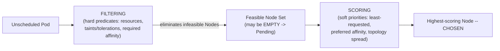
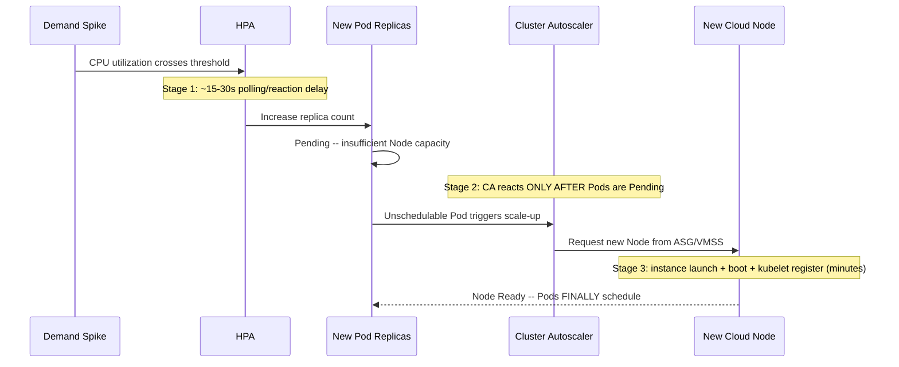
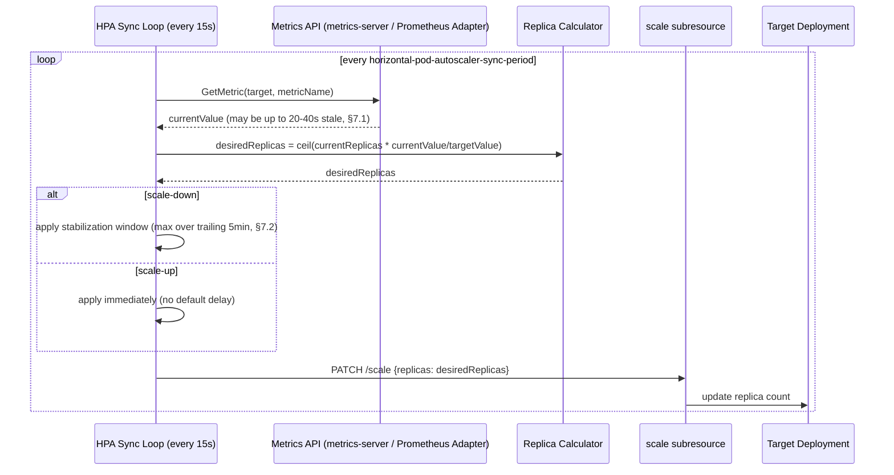
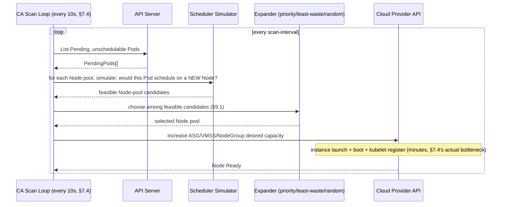

# Module 77 — Kubernetes: Scheduling & Autoscaling — Scheduler Internals, Affinity/Taints/Tolerations & HPA/VPA/Cluster Autoscaler

> Domain: Kubernetes | Level: Beginner → Expert | Prerequisite: [[01-Architecture-ControlPlane-Pods-Deployments]] (the `Pending`-Pod incident first introduced the Scheduler at a high level; this module covers its actual filtering/scoring internals and the placement controls that influence it), [[../21-AWS/01-Compute-Networking-VPC-LoadBalancing-AutoScaling]] and [[../22-Azure/01-Compute-Networking-VNet-LoadBalancer-VMSS]] (Cluster Autoscaler is the Kubernetes-aware controller directly driving the exact ASG/VMSS primitives those modules covered)

---

## 1. Fundamentals

### Why does a Principal Engineer need dedicated scheduling/autoscaling depth beyond the `Pending`-Pod debugging introduction?
Earlier analysis established that `Pending` status signals a scheduling failure and pointed at the Scheduler's event log as the debugging entry point — but treated the Scheduler itself as a black box. This module opens that box: the Scheduler's actual two-phase filtering-then-scoring decision process, and the placement-control primitives (affinity, taints/tolerations) a Principal Engineer uses to deliberately *influence* that decision, not merely debug it after the fact. Separately, "Kubernetes autoscaling" is commonly treated as one unified capability, when it is actually **three independently-configured, sequentially-dependent layers** — the Horizontal Pod Autoscaler (Pod replica count), the Vertical Pod Autoscaler (per-Pod resource sizing), and the Cluster Autoscaler (Node count) — a Principal Engineer who doesn't understand that these three layers react in sequence, not in parallel, will systematically under-provision for how long a genuine demand spike actually takes the full stack to absorb.

### Why does this matter?
Because Scheduler placement decisions determine actual fault-tolerance (whether replicas are genuinely spread across failure domains or merely happen to be, per the Scheduler's soft-preference defaults) and workload isolation (whether a GPU/Spot Node pool actually stays dedicated to its intended workload), and because the three-layer autoscaling chain's compounding reaction latency is a frequent, costly source of "autoscaling should have handled this" incidents during genuine demand spikes.

### When does this matter?
For any workload requiring genuine high-availability placement guarantees (not merely the Scheduler's default best-effort spreading), any cluster using dedicated/specialized Node pools (GPU, Spot/preemptible capacity), and any workload whose demand is variable enough to require autoscaling at all — which is to say, most non-trivial production Kubernetes workloads.

### How does it work (30,000-ft view)?
```
Scheduler: two-phase decision -- FILTERING (eliminate infeasible Nodes: resources, taints,
 affinity rules) then SCORING (rank remaining feasible Nodes, pick the highest score)
Node Affinity / Pod Affinity / Anti-Affinity: PULL mechanisms -- attract Pods toward
 (or away from) specific Nodes or other Pods, based on labels
Taints and Tolerations: PUSH/REPEL mechanism -- a Node REPELS Pods unless they explicitly
 tolerate its taint (dedicating Nodes to specific workloads)
HPA (Horizontal Pod Autoscaler): scales POD REPLICA COUNT based on observed metrics
VPA (Vertical Pod Autoscaler): adjusts a Pod's RESOURCE REQUESTS/LIMITS (right-sizing)
Cluster Autoscaler (CA): scales NODE COUNT -- directly drives the underlying cloud ASG/VMSS
 (/65's exact resources) based on Pending/unschedulable Pods or underutilized Nodes
THE CHAIN: a demand spike must first trigger HPA (adds Pod replicas) -> those new replicas
 may go PENDING (insufficient Node capacity) -> THIS triggers Cluster Autoscaler (adds
 Nodes) -> new Nodes must boot/register/become Ready BEFORE the originally-Pending Pods
 can finally schedule -- three SEQUENTIAL delays, not one fast, unified reaction
```

---

## 2. Deep Dive

### 2.1 The Scheduler's Two-Phase Decision — Filtering, Then Scoring
The Scheduler makes its Pod-to-Node placement decision in two distinct phases for every unscheduled Pod: **Filtering** (evaluating every Node against a set of hard predicates — does the Node have sufficient allocatable CPU/memory per the Pod's resource requests, per the exact incident; does the Node's taints permit this Pod; does the Pod's node-affinity `requiredDuringSchedulingIgnoredDuringExecution` rule match this Node's labels — any Node failing *any* filter is eliminated entirely, not merely deprioritized) followed by **Scoring** (ranking the *remaining*, feasible Nodes against a set of priority functions — least-requested-resources, balanced-resource-allocation, node-affinity *preference* weighting, pod-topology-spread scoring — and selecting the highest-scoring Node). A Principal Engineer debugging an *unexpected* (not simply `Pending`, but placed somewhere surprising) scheduling outcome should reason in these same two phases: first confirm which Nodes even passed filtering at all, then reason about why the specific chosen Node scored highest among the feasible set — a materially different, more precise debugging question than "why did the Scheduler put it there."

### 2.2 Node Affinity, Pod Affinity, and Anti-Affinity — the "Pull" Mechanisms, and Why Anti-Affinity Is Required (Not Merely Helpful) for Genuine HA
**Node affinity** attracts Pods toward Nodes matching specific labels (e.g., a specific instance type, or an Availability Zone label) — available in both a **required** form (`requiredDuringSchedulingIgnoredDuringExecution`, a hard filter identical in strictness to a taint/toleration mismatch) and a **preferred** form (`preferredDuringSchedulingIgnoredDuringExecution`, a soft scoring input the Scheduler weighs but can override if no matching Node is feasible). **Pod affinity** attracts a Pod toward Nodes already running other Pods matching a label selector (co-locating a cache-adjacent service with its cache for latency reasons, for instance); **Pod anti-affinity** does the reverse — repelling a Pod *away* from Nodes already running other Pods matching a selector, the mechanism specifically required for genuine high-availability replica spreading. This is a critical, easily-missed distinction: the Scheduler's default `PodTopologySpread`-style scoring provides only a **soft, best-effort preference** toward spreading a Deployment's replicas across Nodes/zones — under Node-capacity pressure, the Scheduler can and will still co-locate multiple replicas of the same Deployment on a single Node (or single AZ) if that's the only way to satisfy filtering, since the default spreading behavior is a scoring *preference*, not a hard *requirement* — a Principal Engineer requiring genuine, guaranteed fault-tolerant spreading (all three replicas must never land on the same Node, or the same AZ) must explicitly configure a **required** Pod anti-affinity rule (or a `topologySpreadConstraints` object with `whenUnsatisfiable: DoNotSchedule`), not rely on the Scheduler's default soft preference alone — directly recurring this course's "explicit, chosen configuration, not an assumed default" theme (the redundancy-tier lesson) at the Pod-placement layer specifically.

### 2.3 Taints and Tolerations — the "Push/Repel" Mechanism, Dedicating Nodes to Specific Workloads
Where affinity *attracts* Pods, a **taint** applied to a Node *repels* Pods away from it, unless the Pod carries a matching **toleration** explicitly permitting it to schedule there anyway — the standard mechanism for dedicating a specialized Node pool (GPU-equipped Nodes, cost-optimized Spot/preemptible Nodes) exclusively to the specific workloads that should use it, preventing arbitrary, unrelated Pods from consuming that specialized (and often more expensive, or less reliable in the Spot case) capacity by accident. Taints have three distinct **effects**, a nuance often collapsed into "taints block scheduling" generically: **NoSchedule** (new Pods without a matching toleration are not scheduled here, but already-running Pods are undisturbed); **PreferNoSchedule** (a soft version — the Scheduler tries to avoid it, but will still place a Pod here if no better option exists); and **NoExecute** (the strictest — not only blocks new scheduling, but additionally **evicts already-running Pods** lacking the toleration) — `NoExecute` is specifically the mechanism underlying Kubernetes's automatic Pod eviction from a Node that has become `NotReady` after a configurable grace period (directly connecting to the Node-failure/Pod-rescheduling discussion — the actual mechanism by which a failed Node's Pods get evicted and replaced elsewhere is a system-applied `NoExecute` taint with a toleration-seconds grace period, not a separate, distinct failure-detection code path).

### 2.4 Horizontal Pod Autoscaler (HPA) — Scaling Replica Count Based on Observed Metrics
The **HPA** is a controller (the reconciliation-loop pattern, specifically) that periodically (by default, roughly every 15 seconds) compares a target Deployment/StatefulSet's observed metric (CPU/memory utilization via the in-cluster `metrics-server`, or custom/external application-level metrics — request rate, queue depth — via the Prometheus Adapter or a similar metrics-API implementation) against a configured target, and adjusts the target's `replicas` field to converge observed utilization toward that target — directly the same "declare desired state, let a reconciliation loop continuously converge toward it" pattern as everything else in this domain, now applied to replica count specifically as a function of live metrics rather than a fixed, manually-set number.

### 2.5 Vertical Pod Autoscaler (VPA) — Right-Sizing Resource Requests/Limits, and Why It Should Not Combine With HPA on the Same Metric
The **VPA** takes a different scaling dimension entirely: rather than adjusting *how many* replicas exist, it adjusts *how much CPU/memory each Pod requests* — observing actual historical usage and recommending (or, in `Auto`/`Recreate` update mode, actively applying) right-sized resource requests/limits, directly addressing the "resource requests copied from an unvalidated guess, never revisited" anti-pattern the incident demonstrated at the cross-cluster-migration scale, now as an ongoing, continuous right-sizing discipline. A specific, well-documented interaction to flag explicitly: **HPA and VPA should generally not be configured to manage the same resource metric (CPU or memory) for the same workload simultaneously** — VPA changing a Pod's resource *requests* changes the denominator HPA's utilization-percentage calculation is based on, and the two controllers' independent, uncoordinated adjustments can produce oscillating, unstable behavior (VPA shrinks requests, which raises the observed CPU-utilization percentage against the new, smaller request, which triggers HPA to add more replicas, compounding rather than resolving the original sizing question) — the standard resolution is using VPA in recommendation-only mode alongside HPA (informing manual or offline request-sizing decisions without VPA actively mutating live Pods), or using VPA to actively manage requests only for metrics HPA isn't scaling on. Additionally, VPA's `Recreate` update mode (the only mode available on most clusters prior to Kubernetes's newer in-place Pod resize feature) applies a new resource sizing by **evicting and recreating** the Pod — meaning VPA-driven right-sizing is not a zero-disruption operation, directly recurring this course's cold-start/disruption-window theme at the resource-right-sizing layer specifically.

### 2.6 Cluster Autoscaler — the Kubernetes-Aware Controller Directly Driving/65's ASG/VMSS
The **Cluster Autoscaler (CA)** scales the *Node* count itself, by directly interacting with the underlying cloud's Auto Scaling Group (the exact EC2 ASG resource) or Virtual Machine Scale Set (the exact Azure VMSS resource) — CA is not a separate infrastructure-scaling mechanism competing with ASG/VMSS; it *is* the Kubernetes-native controller that adjusts those same cloud-native scaling-group resources' desired capacity, specifically in response to two Kubernetes-level signals: **scale up**, triggered by Pods sitting `Pending` and unschedulable due to insufficient Node capacity (not any other `Pending` cause — an affinity or taint mismatch that no possible new Node would resolve does not trigger a scale-up attempt); **scale down**, triggered by a Node being significantly underutilized for a sustained period, with its Pods' workloads confirmed re-schedulable elsewhere before that Node is drained and terminated.

### 2.7 The Full Autoscaling Chain — Three Sequential Delays, Not One Fast, Unified Reaction
Synthesizing–: a genuine demand spike does **not** trigger one unified, fast "autoscale" response — it triggers a **sequential chain** of three independently-latent stages: (1) HPA's own metrics-polling interval and reaction latency (typically tens of seconds) before it increases the target Deployment's replica count; (2) if the cluster's existing Nodes lack capacity for those new replicas, they become `Pending` — this `Pending` state is itself the *trigger* Cluster Autoscaler watches for, meaning CA's reaction cannot begin until stage (1) has already produced unschedulable Pods, not in parallel with HPA's own reaction; (3) Cluster Autoscaler's own reaction — directly the ASG warm-up-window discussion, now recurring exactly as predicted — a new cloud instance must be launched, boot, join the cluster, and have its kubelet register as `Ready` (often taking multiple minutes, not seconds) before the originally-`Pending` Pods from stage (1) can finally, actually schedule and begin serving traffic. A Principal Engineer must reason about this **compounded, multi-minute** total latency — not any single stage's latency in isolation — when assessing whether Kubernetes's autoscaling stack can genuinely absorb a specific demand-spike profile within an acceptable customer-facing impact window.

---

## 3. Visual Architecture

### Scheduler's Two-Phase Filtering → Scoring Decision

```mermaid
graph LR
 Pod["Unscheduled Pod"] --> Filter["FILTERING<br/>(hard predicates: resources,<br/>taints/tolerations, required affinity)"]
 Filter -->|"eliminates infeasible Nodes"| Feasible["Feasible Node Set<br/>(may be EMPTY -> Pending)"]
 Feasible --> Score["SCORING<br/>(soft priorities: least-requested,<br/>preferred affinity, topology spread)"]
 Score --> Chosen["Highest-scoring Node -- CHOSEN"]
```

### The Full Autoscaling Chain's Sequential (Not Parallel) Delays

```mermaid
sequenceDiagram
 participant Traffic as Demand Spike
 participant HPA
 participant Pod as New Pod Replicas
 participant CA as Cluster Autoscaler
 participant Node as New Cloud Node

 Traffic->>HPA: CPU utilization crosses threshold
 Note over HPA: Stage 1: ~15-30s polling/reaction delay
 HPA->>Pod: Increase replica count
 Pod->>Pod: Pending -- insufficient Node capacity
 Note over CA: Stage 2: CA reacts ONLY AFTER Pods are Pending
 Pod->>CA: Unschedulable Pod triggers scale-up
 CA->>Node: Request new Node from ASG/VMSS
 Note over Node: Stage 3: instance launch + boot + kubelet register (minutes)
 Node-->>Pod: Node Ready -- Pods FINALLY schedule
```

## 4. Production Example
**Scenario**: An e-commerce platform's checkout service had HPA configured to scale from a baseline of 6 replicas up to 40 based on CPU utilization, and the team had load-tested this configuration extensively — confirming HPA correctly and promptly increased replica count under simulated load. Ahead of a major promotional event, the team was confident the service would scale smoothly to handle the anticipated traffic surge. **Investigation**: during the actual event, traffic ramped up faster than the team's original load test had simulated (a sharper, more sudden spike rather than a gradual ramp), and while HPA did react promptly — increasing the Deployment's replica count within its normal ~20-second reaction window, exactly as the load test had validated — the cluster's existing Node capacity was insufficient to actually schedule the newly-requested replicas, and a large fraction of them sat `Pending` for several minutes while Cluster Autoscaler provisioned additional Nodes, during which checkout requests were being served by only the original, now severely overloaded 6 replicas, producing a real, customer-visible latency and error-rate spike lasting nearly the entirety of the multi-minute Node-provisioning window. **Root cause**: the team's original load test had been run against a cluster that already had ample idle Node capacity pre-provisioned (a deliberate test-environment setup decision to isolate and validate HPA's own reaction behavior specifically) — meaning the test had validated stage 1 of the chain (HPA's reaction) in complete isolation from stages 2 and 3 (Pending-Pod-triggered Cluster Autoscaler node provisioning), and had never actually exercised the full, compounded chain under genuine Node-capacity-constrained conditions — a direct instance of this course's recurring "steady-state testing doesn't exercise the actual failure-triggering condition" pattern (§Advanced Q3's replication-lag load test, §Advanced Q3's Container Apps cold-start test), now at the full-autoscaling-chain scale specifically. **Fix**: adopted a standing minimum Node-capacity buffer (a small amount of deliberately pre-provisioned, currently-idle headroom, directly trading some ongoing cost for reduced cold-start-chain exposure — the same cost-vs-latency trade-off the Lambda provisioned-concurrency discussion established generically), and separately re-ran load testing with the test cluster deliberately capacity-constrained from the start (removing the pre-provisioned-headroom test-environment shortcut), specifically to measure and validate the full, compounded HPA-then-Pending-then-CA-then-Node-Ready latency chain end-to-end, not HPA's reaction time in isolation. **Lesson**: validating one stage of a multi-stage, sequentially-dependent system in isolation (HPA's reaction speed) can produce a dangerously incomplete confidence picture about the *system's* actual end-to-end response time, since the isolated stage's own performance says nothing about the compounded latency once every dependent stage's own delay is stacked in sequence — a Principal Engineer must explicitly identify and test the *full* chain any time a system's advertised or assumed responsiveness (here, "Kubernetes autoscales automatically") is actually composed of multiple, independently-latent, sequentially-triggered components.
## 10. Interview Questions

### Basic (10)
1. **Q: What are the Scheduler's two decision phases?** **A:** Filtering (eliminates infeasible Nodes via hard predicates) and Scoring (ranks the remaining feasible Nodes, selecting the highest score).
2. **Q: What is the difference between Node affinity and Pod anti-affinity?** **A:** Node affinity attracts a Pod toward Nodes matching specific labels; Pod anti-affinity repels a Pod away from Nodes already running other Pods matching a selector.
3. **Q: What do taints and tolerations do?** **A:** A taint repels Pods from a Node unless the Pod has a matching toleration — used to dedicate specialized Nodes to specific workloads.
4. **Q: What are the three taint effects?** **A:** NoSchedule (blocks new scheduling only), PreferNoSchedule (soft avoidance), and NoExecute (blocks new scheduling AND evicts already-running non-tolerating Pods).
5. **Q: What does the Horizontal Pod Autoscaler (HPA) scale?** **A:** Pod replica count, based on observed metrics (CPU/memory, or custom/external metrics) against a configured target.
6. **Q: What does the Vertical Pod Autoscaler (VPA) scale?** **A:** A Pod's resource requests/limits (right-sizing), not replica count.
7. **Q: What does the Cluster Autoscaler (CA) scale, and what triggers it?** **A:** Node count — triggered by Pods sitting Pending and unschedulable due to insufficient Node capacity (scale up), or by sustained Node underutilization (scale down).
8. **Q: Is Cluster Autoscaler a separate mechanism from AWS ASG/Azure VMSS?** **A:** No — it's the Kubernetes-native controller that directly adjusts those same underlying cloud scaling-group resources' desired capacity.
9. **Q: Do HPA and Cluster Autoscaler react in parallel to a demand spike?** **A:** No — Cluster Autoscaler's reaction is triggered only after HPA's replica increase produces Pending, unschedulable Pods, making the two sequential, not parallel.
10. **Q: What did the promotional-event incident reveal about the team's original load test?** **A:** It validated HPA's reaction speed in isolation against a pre-provisioned, capacity-unconstrained cluster, never exercising the full HPA-then-Pending-then-Cluster-Autoscaler-then-Node-Ready chain under genuinely capacity-constrained conditions.

### Intermediate (10)
1. **Q: Why is the Scheduler's default replica-spreading behavior described as a "soft preference" rather than a guarantee?** **A:** Topology-spread scoring is a priority function evaluated during the scoring phase, not a filtering-phase hard predicate — under Node-capacity pressure, the Scheduler can still co-locate replicas if that's the only way to satisfy the hard filtering requirements, since spreading is weighed, not enforced.
2. **Q: Why must a genuine HA requirement use required (not preferred) anti-affinity or `topologySpreadConstraints` with `DoNotSchedule`?** **A:** Because only a required/hard constraint is enforced during the filtering phase (eliminating non-compliant Nodes entirely) — a preferred/soft constraint only influences scoring among Nodes that already passed filtering, and can be overridden if no compliant Node is feasible.
3. **Q: Why does `NoExecute`'s eviction behavior matter specifically for Node-failure handling?** **A:** It's the actual underlying mechanism Kubernetes uses to evict Pods from a Node that has become NotReady after a grace period — not a separate, distinct failure-detection code path, but a system-applied NoExecute taint with a toleration-seconds grace period.
4. **Q: Why can combining HPA and VPA on the same CPU/memory metric produce unstable, oscillating behavior?** **A:** VPA changing a Pod's resource requests changes the denominator HPA's utilization-percentage calculation depends on — the two controllers' independent, uncoordinated adjustments to related but different scaling dimensions (replica count vs. per-Pod sizing) can compound rather than resolve the original sizing question.
5. **Q: Why is VPA's `Recreate` update mode described as "not a zero-disruption operation"?** **A:** Applying a new resource sizing requires evicting and recreating the Pod on most clusters (absent the newer in-place Pod resize feature) — VPA-driven right-sizing carries the same restart/cold-start disruption cost this course has flagged for other reschedule-triggering events.
6. **Q: Why doesn't Cluster Autoscaler attempt to scale up in response to every kind of `Pending` Pod?** **A:** It reacts specifically to Pods `Pending` due to insufficient Node capacity — a Pod `Pending` because of an affinity or taint mismatch that no possible new Node would resolve isn't a scenario adding Node capacity would fix, so CA doesn't attempt scale-up for that cause.
7. **Q: Why does describe the team's load-testing setup as "isolating stage 1 of the chain" specifically?** **A:** The test cluster was deliberately pre-provisioned with ample idle Node capacity, meaning newly-requested replicas from HPA's reaction never actually went Pending during the test — stages 2 and 3 (Pending-triggered CA reaction, Node provisioning latency) simply never executed at all during that test.
8. **Q: Why is a small, deliberately pre-provisioned Node-capacity buffer described as trading cost for reduced latency-chain exposure, per the fix?** **A:** Maintaining idle headroom means newly-requested HPA replicas can often schedule immediately without ever triggering stages 2-3 of the chain at all, at the ongoing cost of paying for that idle capacity — directly the same cost-vs-latency trade-off established for Lambda provisioned concurrency.
9. **Q: Why doesn't raising HPA's `maxReplicas` ceiling alone improve a workload's actual response time to a demand spike?** **A:** The effective ceiling on how quickly the workload can genuinely absorb increased load is bounded by how much new Node capacity Cluster Autoscaler can actually provision within the available reaction window, not by HPA's configured replica maximum, which is meaningless if the cluster can't schedule that many replicas in time.
10. **Q: Why should Pod-placement taints be considered a defense-in-depth security layer, not merely a workload-organization convenience?** **A:** Dedicating Nodes carrying elevated trust or access (a sensitive IAM role) exclusively to vetted workloads via taints prevents an arbitrary, unrelated Pod from being inadvertently scheduled onto — and potentially exploiting — that Node's elevated credentials, complementing RBAC/IAM controls rather than replacing them.

### Advanced (10)
1. **Q: Diagnose the incident from first principles, and design the specific load-testing methodology that would have caught the full-chain latency gap before the actual promotional event.**
 **A:** Root cause: the load test validated HPA's reaction speed in complete isolation from Cluster Autoscaler's own reaction, because the test cluster's pre-provisioned idle capacity meant the newly-requested replicas never actually went Pending, so stages 2-3 of the chain never executed during testing at all — a classic "steady-state testing doesn't exercise the actual failure-triggering condition" gap (directly §Advanced Q3, §Advanced Q3). Structural fix: any load test intended to validate autoscaling behavior must explicitly start from a genuinely capacity-constrained cluster state (deliberately limiting available Node headroom to force the test traffic to actually exercise Cluster Autoscaler's own node-provisioning path), and must measure and assert against the **full**, end-to-end latency from demand-spike onset to the point where newly-scheduled replicas are actually serving traffic — not HPA's replica-count-change timestamp alone, which can look like a fast, successful response while masking a much longer full-chain latency still in progress behind it.
2. **Q: A team argues that since Cluster Autoscaler successfully added new Nodes during the incident (eventually resolving the Pending Pods), the autoscaling stack "worked as designed," and no further architectural change is needed. Evaluate this claim.**
 **A:** Push back — "eventually resolved correctly" and "resolved within an acceptable customer-facing impact window" are different claims; Cluster Autoscaler did perform its designed function (provisioning new Nodes in response to Pending Pods), but the multi-minute window before those Nodes became Ready represented genuine, customer-visible degraded service the whole time — the autoscaling *mechanism* worked correctly, but the *system's* actual, observed responsiveness to the demand spike did not meet the business's implicit availability expectations; "the component performed its function" doesn't validate "the end-to-end business outcome was acceptable," and the correct response (the fix) is architectural (a capacity buffer, or accepting the latency with an explicit, documented SLA understanding), not a conclusion that nothing further is needed.
3. **Q: Design a specific, alternative mitigation to the "maintain idle Node-capacity buffer" fix that avoids paying for continuously-idle capacity, for a team with a strongly cost-sensitive posture but a predictable, scheduled demand-spike event (like a known promotional-event date).**
 **A:** Rather than a continuously-maintained buffer, explicitly **pre-scale** Node capacity ahead of the *known* event window specifically (a scheduled, time-boxed increase to the cluster's minimum Node count, reverted afterward) — this avoids the fix's ongoing cost for the (potentially large) fraction of time no spike is occurring, at the cost of requiring the spike's timing to be genuinely predictable/scheduled in advance (unlike a fully organic, unpredictable traffic surge, where this approach doesn't apply and the always-on buffer, or accepting the latency, become the only two realistic options) — directly the same "match the mitigation's cost profile to the actual, known shape of the risk" reasoning this course has applied to Reserved Instance/Savings Plan sizing now applied to autoscaling-buffer strategy specifically.
4. **Q: A workload's VPA is configured in `Auto` update mode alongside an active HPA, both nominally scoped to memory (not CPU) as the shared metric. The team observes the workload's replica count oscillating unpredictably during periods of steady, unchanging actual load. Diagnose the likely cause.**
 **A:** Directly the flagged interaction — VPA is periodically adjusting the Pod's memory *request* value based on observed usage, which changes the denominator HPA's memory-utilization-percentage calculation uses, causing HPA's computed utilization percentage to shift even though genuine, actual memory consumption hasn't changed at all — HPA reacts to this artifact of VPA's own adjustment by changing replica count, which itself changes per-replica load distribution and thus each replica's own observed memory usage, feeding back into VPA's next recommendation — the fix is decoupling the two controllers' scope: switch VPA to recommendation-only mode (no longer actively mutating live requests) while HPA continues actively scaling on memory, or move HPA to scale on a genuinely independent metric (request rate) not affected by VPA's own request-value adjustments.
5. **Q: Critique the following claim: "Since our checkout Deployment has 12 replicas and 3 Availability Zones, and Kubernetes spreads Pods across zones by default, we're already resilient to a single-AZ failure without any additional configuration."**
 **A:** Overstated —, the Scheduler's default zone-spreading behavior is a soft scoring preference, not a guaranteed, enforced constraint; under specific conditions (uneven Node capacity across zones, a rolling update's transient placement decisions, or simply the scoring algorithm's own tie-breaking behavior) it's entirely possible for the Scheduler to have placed a disproportionate number of the 12 replicas in a single zone without violating any hard constraint, since none was configured — genuine, verified resilience to a single-AZ failure requires an explicit, required `topologySpreadConstraints` (or hard anti-affinity) rule, plus periodic verification (`kubectl get pods -o wide` cross-referenced against Node zone labels) confirming actual, current placement matches the assumed even distribution, not an assumption based purely on replica count and zone count alone.
6. **Q: Design the specific taint/toleration and node-affinity configuration for a cluster running both a general-purpose workload fleet and a small number of Spot-Instance-backed Nodes intended exclusively for a fault-tolerant, cost-optimized batch-processing workload — ensuring neither workload accidentally lands on the other's intended Nodes.**
 **A:** Apply a `NoSchedule` taint (e.g., `capacity-type=spot:NoSchedule`) to every Spot Node, with only the batch-processing workload's Pod spec carrying the matching toleration — this prevents the general-purpose fleet from ever being inadvertently scheduled onto (and consequently at risk of Spot-interruption-driven eviction for) Spot capacity it wasn't designed to tolerate. Separately, apply a **required** node-affinity rule to the batch-processing workload itself (not merely a toleration) targeting the Spot Node pool's own label — a toleration alone only permits scheduling onto tainted Nodes, it does not *require* it, meaning without the affinity rule as well, the batch workload could still be scheduled onto general-purpose (non-Spot, likely more expensive) Nodes, defeating the cost-optimization intent — the combination (taint+toleration for exclusion of the wrong workload, plus required affinity for the right workload's actual intended placement) is necessary; either mechanism alone is insufficient.
7. **Q: Explain why this module's autoscaling-chain finding and the Container Apps scale-to-zero cold-start finding are both instances of the same general pattern this course has repeatedly identified, and what that general pattern is.**
 **A:** Both are instances of "newly-provisioned compute is not instantly available the moment it's requested" — earlier analysis established this for a single-stage case (a Container Apps instance scaling from zero); this module's generalizes it to a **multi-stage, compounding** case, where the naive assumption isn't just "provisioning takes zero time" but "the whole reactive system responds as one fast, unified mechanism" — when in fact multiple independently-latent stages (HPA's polling interval, CA's own reaction, cloud instance boot time) chain sequentially, each stage's delay adding to, not overlapping with, the others' — the general pattern is that any advertised or assumed "automatic," "elastic," or "self-healing" system behavior should be decomposed into its actual constituent reactive stages before assuming its end-to-end latency is negligible or even roughly equal to any single stage's own latency in isolation.
8. **Q: A Principal Engineer is asked to reduce Cluster Autoscaler's node-provisioning latency (stage 3 of the chain) specifically, independent of the buffer/pre-scaling mitigations already discussed. What levers are actually available at this specific stage?**
 **A:** (1) Faster-booting instance types/AMIs (a minimized, purpose-built Node image with fewer bootstrap steps reduces the boot-to-kubelet-Ready duration directly, the same principle as the Fargate-task-startup image-size discussion, applied at the Node-provisioning layer). (2) Warm-pool-style pre-initialized-but-not-yet-cluster-joined instances (where the cloud platform supports it), reducing the launch-to-Ready path without paying for fully cluster-joined, HPA-visible idle capacity the way the buffer approach does. (3) Cluster Autoscaler's own scan-interval and reaction-latency tuning (a shorter evaluation interval reduces the time between Pods becoming Pending and CA actually issuing the scale-up request, though with a real trade-off against increased API Server/cloud-API call load, per the shared-capacity-cost discipline). None of these levers eliminate stage 3's latency entirely — they reduce it, meaning the fundamental "multi-stage, sequentially-dependent chain" nature of the overall system persists regardless, and should still inform capacity/SLA planning even after these optimizations are applied.
9. **Q: Design a monitoring/alerting strategy specifically instrumenting the full chain's individual stage latencies (not just end-to-end success/failure), so a Principal Engineer can diagnose *which* stage is the actual bottleneck during a future incident, rather than only observing that scaling "was slow" overall.**
 **A:** Instrument and alert on each stage's own latency distinctly: (1) HPA reaction latency — time from a metric crossing threshold to the replica-count change being applied (available via HPA's own status conditions/events). (2) Pending-Pod duration specifically attributable to insufficient-capacity scheduling failures (distinguishing this from Pending duration caused by other filtering failures, per the original distinction, now further refined) — a rising trend here specifically implicates Cluster Autoscaler's reaction, not HPA. (3) Cluster Autoscaler's own scale-up-decision-to-Node-Ready latency (available via CA's own metrics/events, and cloud-provider instance-launch timing). Alerting on each stage's latency independently (not merely on aggregate "time to full capacity") lets an on-call engineer immediately localize a future incident's actual bottleneck — a regression specifically in stage 3 (Node boot time) implies a different investigation and fix (AMI/instance-type review) than a regression in stage 1 (HPA's own metrics-server latency or polling configuration).
10. **Q: As a Principal Engineer establishing Kubernetes scheduling/autoscaling standards for a platform team supporting several latency-sensitive, customer-facing workloads with variable demand, design the specific set of standing architectural decisions and automated checks (synthesizing this entire module) required before any such workload is permitted into production.**
 **A:** (1) Mandatory, required (not merely preferred) topology-spread or anti-affinity configuration for any workload with a stated HA requirement, verified via an automated periodic check confirming actual, current Pod placement matches the intended distribution (Advanced Q5) — never trusted from configuration intent alone. (2) Explicit taint/toleration-plus-required-affinity pairing (Advanced Q6) for any workload requiring dedicated Node-pool isolation, with both halves of the pairing verified present, not just one. (3) Mandatory full-chain (not HPA-isolated) load testing for any workload's autoscaling configuration before production launch, explicitly starting from a genuinely capacity-constrained test-cluster state (Advanced Q1) — directly correcting the incident's root testing gap. (4) An explicit HPA/VPA scope-conflict check (Advanced Q4) as a standing configuration-review gate, rejecting any workload configuration where both controllers actively manage the identical metric. (5) Stage-by-stage autoscaling-chain latency monitoring (Advanced Q9) in place before launch, not added reactively after a first incident, so any future degradation can be immediately localized to its actual bottleneck stage rather than requiring ad hoc, incident-time diagnosis of a system most engineers still mentally model as a single, fast, unified "autoscaling" mechanism.

### Expert (10)
1. **Q: A payments platform tags its "PCI-scope" Node pool with a `NoSchedule` taint and treats this as satisfying its PCI-DSS network-segmentation control for cardholder-data-handling workloads. An auditor rejects this control. Explain precisely why, from first principles, and design the control set that would actually pass.**
 **A:** Per §8.1, a taint is a scheduling-time filter, not a runtime network or execution isolation boundary — it says nothing about whether Pods on *other* Nodes can reach the PCI-scope workload over the pod network, nothing about whether an overly broad toleration elsewhere in the cluster's Pod specs defeats the placement boundary, and nothing about container-escape containment. A control set that would actually satisfy segmentation requires, at minimum: a default-deny NetworkPolicy scoping all ingress/egress to the PCI-scope namespace explicitly; PSA `restricted` on that namespace preventing privilege escalation from within; a RuntimeClass providing kernel-level isolation if the threat model includes container escape; and an automated, continuously-running audit check (not a point-in-time manual review) confirming no Pod spec elsewhere in the cluster carries a toleration matching the PCI-scope taint unless explicitly allow-listed — the taint remains a legitimate first layer (preventing *accidental* co-location) but is one control among several, never a segmentation control on its own.

2. **Q: Design a scaling architecture for a workload whose demand signal is Kafka consumer-group lag, and explain specifically why routing that signal through the standard HPA/Prometheus-Adapter path is a worse fit than KEDA, beyond "KEDA supports Kafka natively."**
 **A:** Beyond native scaler support (§9.3), the structural difference is scale-to-zero: standard HPA's external-metrics interface still requires at least one Pod running to be a valid scaling target in most configurations, and a Kafka-consumer workload with genuinely bursty, sometimes-empty demand (an overnight batch-driven topic, for instance) benefits from KEDA's ability to scale the Deployment fully to zero replicas when lag is zero and scale from zero back up the moment lag reappears — a real cost saving (§7.4-adjacent: paying zero compute for genuinely idle periods) that routing the same lag metric through Prometheus Adapter into standard HPA cannot achieve, since HPA has no zero-replica-aware activation mechanism of its own; KEDA's `ScaledObject` explicitly separates the "activate from zero" concern (its own lightweight polling, decoupled from HPA's reconciliation loop) from the "scale N-to-M once active" concern (which KEDA delegates to a standard HPA object it manages internally) — the correct mental model is that KEDA extends HPA for the zero-boundary case, not that it replaces it.

3. **Q: A Cluster Autoscaler configured with `--expander=random` across three Node pools (on-demand general-purpose, Spot general-purpose, and a memory-optimized on-demand pool) is observed making expensive, inconsistent scale-up choices — sometimes provisioning an expensive memory-optimized Node for a Pod that would have fit fine on cheaper Spot capacity. Diagnose and fix.**
 **A:** `random`'s documented behavior is exactly this — it makes no cost or fit-quality distinction among any Node pool that could feasibly satisfy the Pending Pod's requirements, selecting uniformly at random among all feasible pools (§9.1). The fix is an explicit `--expander=priority` configuration with a documented priority ordering (Spot pools ranked above on-demand general-purpose, both ranked above the memory-optimized pool, which should only be selected when a Pod's actual resource shape specifically requires it, itself best enforced via a required node-affinity/toleration pairing per §Advanced Q6 restricting memory-heavy workloads to that pool specifically rather than leaving them schedulable anywhere) — or, at larger, more dynamic scale, migrating to a cost-aware `--expander=least-waste` or a Karpenter-based approach (§9.4) that selects instance shape directly matched to Pending-Pod requirements rather than choosing among a small, fixed set of pre-defined pool shapes at all.

4. **Q: A VPA in `Auto` mode is managing a stateful, JVM-based risk-calculation service. The team observes that every VPA-triggered resize causes a multi-second latency spike immediately after each Pod recreation, even though the new resource sizing is objectively correct. Explain the mechanism and design a fix that preserves VPA's right-sizing benefit.**
 **A:** VPA's `Recreate` update mode evicts and recreates the Pod to apply a new resource sizing (§2.5) — for a JVM workload specifically, this means paying full JVM startup cost (class loading, JIT warm-up to steady-state throughput) on every VPA-triggered resize, not merely a generic container restart cost, making the disruption meaningfully worse than for a lighter-weight runtime. The fix set: (1) where available, adopt Kubernetes's in-place Pod resize feature (avoiding recreation entirely for the resource-limit change itself); (2) absent that, constrain VPA to recommendation-only mode (`updateMode: "Off"`) and apply resizing during planned maintenance windows or paired with a rolling-update the team already controls, rather than allowing VPA to trigger disruptive recreation on its own schedule; (3) ensure a `PodDisruptionBudget` and sufficient replica count so any VPA-triggered (or Auto-mode-triggered) recreation of one replica doesn't reduce available capacity below the service's latency SLO during the JVM warm-up window, treating the resize event with the same disruption-budget discipline as a voluntary Node drain.

5. **Q: Critique: "We set `minReplicas: 20` on our HPA year-round specifically to guarantee we never experience the full HPA-then-CA-then-Node-Ready chain latency, since we're always already at or above the capacity that would ever be needed." What's the actual trade-off being made, and when does it stop being justified?**
 **A:** This is the always-on capacity-buffer strategy (§Advanced Q3) taken to its extreme — permanently over-provisioned replica *and* Node capacity, which does genuinely eliminate exposure to the chain's latency for demand within that ceiling, at the real, ongoing cost of paying for the full 20-replica (and however many Nodes back it) footprint at all times, including the likely-large fraction of time actual demand is well below that ceiling. It stops being justified the moment the gap between typical and peak demand is large and the peak is either predictable (favoring scheduled pre-scaling, §Advanced Q3) or tolerant of some bounded latency window (favoring a smaller buffer plus the full autoscaling chain for the remainder) — a Principal Engineer should require the team to show the actual utilization distribution behind `minReplicas: 20` before accepting it as justified rather than an unexamined, permanently-paid insurance premium against a risk that may be materially smaller or more predictable than assumed.

6. **Q: Explain why a `topologySpreadConstraints` object with `whenUnsatisfiable: ScheduleAnyway` provides materially weaker guarantees than `DoNotSchedule`, and design a scenario where `ScheduleAnyway` is nonetheless the correct choice.**
 **A:** `ScheduleAnyway` makes the constraint a scoring-phase soft preference (identical in strength to the Scheduler's own default spreading behavior, §2.2) — the Scheduler still tries to spread, but will schedule even a maximally-skewed placement rather than leave a Pod `Pending` if no better option is feasible; `DoNotSchedule` is a filtering-phase hard requirement, eliminating any Node that would violate the constraint, meaning it can produce `Pending` Pods (and, if uncorrected, an unschedulable Pod indefinitely) rather than accept a suboptimal placement. `ScheduleAnyway` is the correct choice specifically when availability of *some* placement matters more than the spread guarantee itself — a workload whose HA posture already tolerates some skew (backed by a separately-enforced PodDisruptionBudget rather than placement alone) but whose team wants to strongly bias toward spreading without ever risking a `Pending` Pod during a genuine capacity crunch, trading spread-guarantee strength for guaranteed schedulability under pressure.

7. **Q: A cluster runs Cluster Autoscaler with `--balance-similar-node-groups` enabled across two Node pools in different Availability Zones, intended to keep both zones' Node counts roughly even for HA. During an incident, one zone loses capacity (a zone-level cloud outage) and CA is observed refusing to scale up the healthy zone's pool proportionally to compensate. Diagnose.**
 **A:** `--balance-similar-node-groups` deliberately balances scale-up requests proportionally across pools it considers "similar" specifically to preserve even distribution under normal operation — but during a genuine zone outage, the unhealthy zone's pool may still appear (briefly, until Node health-check timeouts propagate) as a valid, balanceable target, causing CA to under-provision the healthy zone relative to what the now-concentrated demand actually requires, since CA's balancing logic doesn't have direct visibility into "this pool's zone is currently degraded" as a distinct signal from "this pool simply hasn't been asked to scale up yet." The fix requires either a faster health-check-driven mechanism explicitly cordoning/tainting the unhealthy zone's Nodes (removing them from CA's "similar and balanceable" consideration set promptly) or an explicit priority-expander override for exactly this failure mode, rather than relying on `--balance-similar-node-groups`'s steady-state-oriented balancing logic to also handle a zone-failure scenario it wasn't designed to reason about.

8. **Q: Design the specific reconciliation-loop-efficiency argument for why an HPA scaling on a very high-cardinality custom metric (e.g., a per-customer-ID request-rate metric, thousands of distinct series) is an anti-pattern, independent of whether the underlying business logic seems to call for it.**
 **A:** HPA's `target` for an External or Object metric expects a single aggregate value (or a bounded, small per-Pod value) to compare against threshold — a metric query returning thousands of distinct per-customer series either requires an aggregation step (sum/average across all customers) collapsing the cardinality before it reaches HPA, in which case the fine-grained, per-customer signal was never actually usable by HPA in the first place, or, if genuinely queried at that cardinality, imposes materially higher load on the metrics backend (§9.2) on every 15-second poll for no corresponding benefit, since HPA's own scaling decision is a single scalar comparison regardless — the correct design separates "what signal genuinely drives scaling" (usually a small number of aggregate, cluster- or Deployment-level metrics) from "what signal is useful for business observability" (which may legitimately be high-cardinality, but belongs in a dashboard/alerting pipeline, not wired directly into HPA's own polling path).

9. **Q: A Principal Engineer is asked whether Karpenter should replace Cluster Autoscaler for a large (500+ node), multi-team, mixed-workload cluster. Design the decision framework, not just a yes/no answer.**
 **A:** Evaluate along: (1) **provisioning latency and waste** — Karpenter's direct, Pod-shape-matched bare-instance provisioning (§9.4) typically wins meaningfully at this scale, where CA's constrained choice among a small number of pre-defined Node-pool shapes increasingly leaves cost on the table as workload diversity grows; (2) **operational maturity and team familiarity** — CA is the longer-established, better-understood default across most teams' existing runbooks and monitoring; a migration carries real, non-trivial operational risk and retraining cost that must be weighed against the provisioning-efficiency gain, not assumed free; (3) **cloud-provider support maturity** — Karpenter's support is deepest on AWS and comparatively newer elsewhere; a multi-cloud or non-AWS-primary cluster changes the calculus materially; (4) **existing Node-pool-scoped policies** (taint-based isolation, priority-expander cost policies already tuned for CA's model) that would need deliberate re-expression in Karpenter's provisioner/NodePool constructs, not a drop-in swap. The recommendation is workload- and organization-specific, not universal — but at 500+ Nodes with meaningful workload-shape diversity and AWS as the primary cloud, the provisioning-efficiency case for at least piloting Karpenter on a subset of Node pools is strong enough to warrant the evaluation, not dismiss it outright on migration-risk grounds alone.

10. **Q: Synthesize this module's Performance, Security, and Scalability sections into a single, standing pre-production checklist a platform team should require before any new latency-sensitive, customer-facing workload is granted autoscaling configuration authority on a shared, multi-tenant cluster.**
 **A:** (1) Full-chain latency budget documented and load-tested (§Advanced Q1) accounting for §7.1's stacked polling-latency floor, not merely HPA's own reaction speed. (2) HPA stabilization-window and VPA-conflict settings explicitly reviewed (§7.2, §Advanced Q4), not left at defaults without justification. (3) Any taint-based isolation claim for this workload's Node pool explicitly backed by the full control set in §8.2 (NetworkPolicy, PSA, least-privilege IAM), never accepted on the taint's presence alone. (4) Expander/priority strategy for the workload's Node pool explicitly reviewed against cost intent (§9.1, §Expert Q3), not left at `random`. (5) If the workload's natural scaling signal is event-source depth rather than CPU/memory/Prometheus-exposed metrics, KEDA explicitly evaluated before defaulting to a Prometheus-Adapter-routed HPA (§9.3). (6) Stage-by-stage chain-latency monitoring (§Advanced Q9) live and alerting before launch. A workload failing any of these six gates is not yet ready for autoscaling authority on shared infrastructure, regardless of how urgently the business wants it live.

---

## 11. Coding Exercises

### Easy — Required Pod anti-affinity, guaranteeing genuine cross-Node spread (§Advanced Q5)
```yaml
apiVersion: apps/v1
kind: Deployment
metadata:
 name: checkout-api
spec:
 replicas: 6
 template:
 spec:
 affinity:
 podAntiAffinity:
 requiredDuringSchedulingIgnoredDuringExecution: # REQUIRED, not preferred --
 # a hard filter, not a soft scoring input
 - labelSelector:
 matchLabels: { app: checkout-api }
 topologyKey: "kubernetes.io/hostname" # no two replicas on the SAME Node, guaranteed
```

### Medium — Taint + toleration + required affinity, correctly pairing exclusion AND intended placement (§Advanced Q6)
```yaml
# Applied to every Spot Node (cluster/Node-pool configuration, not a Pod manifest):
# kubectl taint nodes <spot-node> capacity-type=spot:NoSchedule

apiVersion: batch/v1
kind: Job
metadata:
 name: batch-report-generator
spec:
 template:
 spec:
 tolerations:
 - key: capacity-type
 value: spot
 effect: NoSchedule # permits scheduling onto Spot Nodes (removes the repel)
 affinity:
 nodeAffinity:
 requiredDuringSchedulingIgnoredDuringExecution: # REQUIRES Spot placement --
 # toleration alone only PERMITS it (§Advanced Q6)
 nodeSelectorTerms:
 - matchExpressions:
 - key: capacity-type
 operator: In
 values: ["spot"]
 containers:
 - name: report-generator
 image: registry.example.com/report-generator:latest
```

### Hard — HPA scaling on a custom, external metric (queue depth), explicitly avoiding the VPA-conflict scenario
```yaml
apiVersion: autoscaling/v2
kind: HorizontalPodAutoscaler
metadata:
 name: order-processor-hpa
spec:
 scaleTargetRef: { apiVersion: apps/v1, kind: Deployment, name: order-processor }
 minReplicas: 3
 maxReplicas: 50
 metrics:
 - type: External
 external:
 metric:
 name: sqs_queue_depth # custom/external metric, NOT CPU/memory --
 # deliberately avoids ANY overlap with this workload's
 # separately-configured, recommendation-only VPA
 target:
 type: AverageValue
 averageValue: "30" # target: ~30 queued messages per replica
```
```yaml
apiVersion: autoscaling.k8s.io/v1
kind: VerticalPodAutoscaler
metadata:
 name: order-processor-vpa
spec:
 targetRef: { apiVersion: apps/v1, kind: Deployment, name: order-processor }
 updatePolicy:
 updateMode: "Off" # recommendation-only -- does NOT actively mutate live Pods,
 # explicitly avoiding the HPA-conflict scenario (§Advanced Q4)
```

### Expert — Full-chain latency instrumentation, isolating each of the three stages (§Advanced Q9)
```csharp
public class AutoscalingChainLatencyTracker
{
    // Instruments each of the three sequential stages independently, so a future
    // incident's bottleneck can be immediately localized rather than requiring ad hoc
    // investigation of an "autoscaling was slow" report with no stage-level breakdown.
    public async Task<ChainLatencyReport> MeasureFullChainAsync(
        DateTime demandSpikeDetectedAt, string deploymentName, string namespaceName)
    {
        var hpaReactedAt = await WaitForReplicaCountChangeAsync(deploymentName, namespaceName);
        var stage1Latency = hpaReactedAt - demandSpikeDetectedAt; // Stage 1: HPA reaction

        var firstPodPendingAt = await WaitForPendingPodDueToCapacityAsync(deploymentName, namespaceName);
        var caTriggeredAt = firstPodPendingAt; // CA reacts to THIS event specifically

        var newNodeReadyAt = await WaitForNewNodeReadyAsync;
        var stage3Latency = newNodeReadyAt - caTriggeredAt; // Stage 3: CA + Node boot

        var allPodsSchedulableAt = await WaitForAllReplicasRunningAsync(deploymentName, namespaceName);

        return new ChainLatencyReport
        {
            Stage1_HpaReaction = stage1Latency,
                Stage2_PendingToTrigger = TimeSpan.Zero, // immediate by definition --
                // Pending IS the trigger, no separate delay
            Stage3_NodeProvisioning = stage3Latency,
                TotalEndToEnd = allPodsSchedulableAt - demandSpikeDetectedAt
        };
    }
}
```

---

## 12. System Design

### Scenario: Autoscaling Architecture for a Trading Platform's Order-Matching Gateway
**Requirements.**
*Functional*: accept and route order-entry requests to matching-engine backends; scale capacity to absorb both the predictable 9:30am market-open volume spike (routinely 8-12x average overnight volume within a ~2-minute ramp) and unpredictable intraday volatility spikes (a sudden news event, a circuit-breaker-adjacent price move) that can produce a comparable spike with **zero advance warning**.
*Non-functional*: p99 request latency under 50ms end-to-end even during a scale-up event (no latency-SLO violation attributable to cold-start or Pending-Pod delay); zero dropped order-entry requests during a capacity transition; every scaling decision auditable (regulatory expectation — a capacity-driven request rejection or delay must be reconstructable after the fact, not merely inferred from metrics gaps).

**Back-of-the-envelope**: baseline traffic ~2,000 req/s across 20 replicas (~100 req/s/replica); market-open spike to ~20,000 req/s within 2 minutes requires ~200 replicas — at HPA's default reaction profile (§7.1's ~20-40s observation lag plus scale-up application), a purely reactive HPA-driven scale from 20→200 replicas, further gated by Cluster Autoscaler's multi-minute Node-provisioning path (§2.7) if the underlying Node capacity isn't already present, cannot plausibly complete within the 2-minute ramp window without violating the p99 SLO for a material fraction of that window — the arithmetic tells us this: **the predictable spike must be handled by pre-scaling, not reactive autoscaling; only the unpredictable spike is reactive autoscaling's actual job.**

**Architecture.**
- A `CronJob`-adjacent **scheduled pre-scale controller** (a small controller, or simply a scheduled `kubectl patch`/GitOps-committed change via the CI pipeline) that raises the gateway Deployment's HPA `minReplicas` from 20 to 180 at 9:25am (5-minute buffer ahead of the known 9:30 open) and a matching Cluster Autoscaler Node-pool `minSize` bump ensuring the underlying Node capacity is *already present*, not merely requested, before 9:30 — directly the scheduled-pre-scale mitigation from §Advanced Q3, applied to a genuinely predictable, calendar-driven spike.
- **HPA scaling on request rate** (an External metric via Prometheus Adapter, not CPU — request latency degrades before CPU saturates for this workload shape) handles the remaining, unpredictable intraday volatility spike on top of the pre-scaled floor — since the pre-scale already established Node headroom for the *known* spike, an unpredictable *additional* spike on top of it has a meaningfully shorter reactive path (Pods can often schedule onto already-present Node capacity, skipping CA's multi-minute stage-3 delay entirely) rather than requiring the full three-stage chain from a cold, un-buffered baseline.
- `PriorityClass` on the gateway workload ensures it preempts lower-priority batch/reporting workloads sharing the cluster during a genuine capacity crunch, rather than competing for scheduling on equal footing.
- Required `topologySpreadConstraints` (`DoNotSchedule`) across at least 3 Nodes/AZs (§Advanced Q5), since a placement-concentration failure during the highest-traffic window of the day is precisely when it would be most costly.
- A `PodDisruptionBudget` (`minAvailable: 90%`) preventing a concurrent voluntary disruption (a Node drain, a VPA-triggered recreation) from compounding capacity loss during the pre-scale window.

**Failure handling**: if the 9:25am pre-scale itself fails to complete in time (a CI pipeline delay, a Node-pool quota limit), an explicit pre-open health check (verifying actual, current replica count and Node-Ready count against the 180-replica target) pages on-call **before** market open, not after — the same "verify the enforced reality, don't trust the declared intent" discipline this domain has applied throughout, now applied to a scheduled capacity commitment specifically.

**Monitoring**: stage-by-stage chain latency (§Advanced Q9) plus a dedicated dashboard panel specifically for "pre-scale completion time vs. market-open deadline," alerting on any pre-scale that completes with less than the intended 5-minute buffer remaining.

**Trade-offs**: the pre-scale approach pays for genuinely idle capacity between 9:25 and whenever traffic organically justifies 180 replicas (typically a modest, bounded daily cost, in exchange for eliminating latency-SLO risk during the single highest-stakes window of the trading day) — a Principal Engineer should treat this as the correct trade for a regulated, latency-critical order-entry path, while a lower-stakes, cost-sensitive internal reporting service facing a similarly-shaped but lower-consequence spike might reasonably accept the full reactive-chain latency instead.

---

## 13. Low-Level Design

### HPA Controller Reconciliation Loop

```mermaid
sequenceDiagram
 participant Sync as HPA Sync Loop (every 15s)
 participant MetricsAPI as Metrics API (metrics-server / Prometheus Adapter)
 participant Calc as Replica Calculator
 participant Scale as scale subresource
 participant Deploy as Target Deployment

 loop every horizontal-pod-autoscaler-sync-period
 Sync->>MetricsAPI: GetMetric(target, metricName)
 MetricsAPI-->>Sync: currentValue (may be up to 20-40s stale, §7.1)
 Sync->>Calc: desiredReplicas = ceil(currentReplicas * currentValue/targetValue)
 Calc-->>Sync: desiredReplicas
 alt scale-down
 Sync->>Sync: apply stabilization window (max over trailing 5min, §7.2)
 else scale-up
 Sync->>Sync: apply immediately (no default delay)
 end
 Sync->>Scale: PATCH /scale {replicas: desiredReplicas}
 Scale->>Deploy: update replica count
 end
```

### Cluster Autoscaler Scale-Up Decision Loop

```mermaid
sequenceDiagram
 participant Scan as CA Scan Loop (every 10s, §7.4)
 participant API as API Server
 participant Sim as Scheduler Simulator
 participant Exp as Expander (priority/least-waste/random)
 participant Cloud as Cloud Provider API

 loop every scan-interval
 Scan->>API: List Pending, unschedulable Pods
 API-->>Scan: PendingPods[]
 Scan->>Sim: for each Node pool, simulate: would this Pod schedule on a NEW Node?
 Sim-->>Scan: feasible Node-pool candidates
 Scan->>Exp: choose among feasible candidates (§9.1)
 Exp-->>Scan: selected Node pool
 Scan->>Cloud: increase ASG/VMSS/NodeGroup desired capacity
 Note over Cloud: instance launch + boot + kubelet register (minutes, §7.4's actual bottleneck)
 Cloud-->>Scan: Node Ready
 end
```

**Design patterns used**: **Observer** (HPA/CA both observe cluster state via a watch/list-based informer rather than imperative polling of individual objects — the reconciliation-loop pattern itself); **Strategy** (CA's pluggable `--expander` implementations — `random`/`least-waste`/`most-pods`/`priority`/`price` — are interchangeable strategies behind a common `Expander.BestOption()` interface, allowing the selection policy to be swapped without touching the surrounding scan-and-simulate loop); **State** (VPA's recommendation lifecycle — `Initial` → `Recreate`/`Auto` — governs whether a recommendation is merely advisory or actively applied); **Command** (each HPA sync cycle's computed `desiredReplicas` PATCH is a discrete, idempotent command against the `scale` subresource, safely re-issuable on every loop iteration regardless of whether the prior PATCH succeeded).

**SOLID mapping**: the Expander's Strategy-pattern design is a direct **Open/Closed** application — a new expander strategy (e.g., a custom cost-aware expander for a specific cloud discount structure) can be added without modifying CA's core scan-and-simulate loop. HPA's separation of the **metric-fetching** concern (delegated entirely to the pluggable metrics-API backend — resource metrics, custom metrics, external metrics, each a distinct implementation behind a common interface) from the **replica-calculation** concern is a **Single Responsibility** and **Dependency Inversion** application — HPA's core calculator depends on a metrics-source abstraction, not any concrete metrics backend, which is exactly what allows Prometheus Adapter or KEDA's own metrics adapter to be swapped in without touching HPA's own reconciliation code.

**Concurrency/thread safety**: both HPA and CA run as singleton controllers per cluster (CA additionally uses **leader election** — a Lease object — when run with multiple replicas for its own HA, ensuring only one active instance issues cloud-provider scale-up/down calls at a time, since two concurrently-active CA instances racing to scale the same Node pool would produce inconsistent, potentially conflicting desired-capacity writes); HPA's own reconciliation for a *given* target is similarly single-threaded per target (processed via a work queue keyed by target-object identity), while different targets' reconciliations proceed concurrently across the queue's worker pool — meaning a slow metrics-API response for one HPA target does not block another target's reconciliation cycle, a design directly analogous to the per-resource work-queue pattern this domain has established for built-in controllers generally.

**Extensibility**: KEDA extends this exact model rather than replacing it — a `ScaledObject` is KEDA's own CRD (§Module 78's CRD-plus-controller pattern, directly recurring here) whose controller both polls the external event source directly (for the zero-to-one activation decision) and manages a standard HPA object underneath it for the one-to-N scaling range, meaning KEDA is additive to, not a fork of, the HPA reconciliation loop described above.

---

## 14. Production Debugging

**Incident**: A settlement-reconciliation service (matching internal ledger entries against a nightly custodian settlement file, non-trading-hours batch work but latency-sensitive within its own processing window) began missing its SLA window intermittently, three to four nights a week, with no code deployment correlated to the onset.

**Investigation**: `kubectl get hpa settlement-reconciler -w` showed the replica count oscillating between 4 and 14 every few minutes throughout the processing window, rather than settling at a stable count proportional to the batch's actual, roughly-steady processing load. `kubectl describe hpa settlement-reconciler` showed `ScalingActive: True` with frequent `SuccessfulRescale` events in both directions in quick succession. Cross-referencing `kubectl top pods` against the HPA's configured target (70% CPU) showed CPU utilization itself genuinely oscillating in a saw-tooth pattern — but investigation of the workload's own behavior (not the HPA) revealed why: the service's batch-processing loop was CPU-intensive only during discrete parse/match phases, alternating with I/O-bound phases waiting on the custodian file's SFTP transfer and the ledger database's own query latency — a naturally bursty CPU profile, not a genuinely sustained load level HPA's proportional-control model assumes. Checking the HPA's `behavior` block confirmed no `stabilizationWindowSeconds` had been configured for either scale-up or scale-down, meaning HPA was reacting to every single burst-and-idle cycle of the workload's own naturally bursty CPU profile, each rescale event evicting and recreating Pods mid-batch (no `PodDisruptionBudget` was configured either), losing in-progress work on each eviction and forcing a partial batch-reprocessing retry — directly the source of the intermittent SLA misses.

**Tools used**: `kubectl describe hpa` for event history; `kubectl top pods --containers` cross-referenced over a time window against Prometheus's `container_cpu_usage_seconds_total` graphed at fine granularity to reveal the underlying saw-tooth pattern; `kubectl get events --field-selector involvedObject.kind=Pod` correlated against the batch job's own application logs to confirm mid-batch Pod evictions were causing work loss, not merely replica-count churn in isolation.

**Root cause**: two compounding gaps — (1) no stabilization window configured, allowing HPA to react to every transient CPU burst within the workload's naturally bursty profile rather than a genuinely sustained load-level change (directly §7.2's thrashing mechanism); (2) no `PodDisruptionBudget` protecting in-progress batch work from being lost to a scale-down-triggered eviction mid-processing.

**Fix**: configured an explicit `behavior` block with a 3-minute downscale stabilization window (long enough to span the workload's observed burst-idle cycle length) and a modest scale-up stabilization (30s) to avoid over-reacting to the very first CPU spike of each cycle; added a `PodDisruptionBudget` (`minAvailable: 2`) and, separately, migrated the batch-processing logic to checkpoint progress incrementally (rather than only at full-batch completion) so any future eviction — whether HPA-triggered, Node-drain-triggered, or VPA-triggered — would resume from the last checkpoint rather than losing the full in-progress batch.

**Prevention**: added a standing pre-production review gate requiring any HPA configuration for a workload with a genuinely bursty (not steadily-varying) resource profile to explicitly justify its stabilization-window settings against the workload's own observed burst-cycle length, rather than accepting HPA's bare defaults unreviewed — and made `PodDisruptionBudget` presence a mandatory check for any Deployment carrying in-progress, checkpoint-sensitive batch state, regardless of whether HPA is involved at all.

---

## 15. Architecture Decision

**Context**: choosing a scaling architecture for a fleet of Kafka-consumer-based settlement-event processors, where the natural scaling signal is consumer-group lag, and demand is highly bursty (near-zero most of the day, large batch-driven bursts at defined settlement-cycle times).

**Option A — Standard HPA via Prometheus Adapter on consumer-group lag.**
Advantages: uses infrastructure the team already operates (Prometheus, standard HPA), no new controller to learn/operate. Disadvantages: cannot scale to zero (§9.3) — the fleet must run at least `minReplicas: 1` continuously even during the long near-zero-demand periods, a real, ongoing cost for idle capacity; routing lag through Prometheus Adapter adds a query-latency and cardinality dependency (§9.2) as an intermediate hop between the true signal and HPA's decision.
Cost: moderate ongoing cost (permanent minimum footprint). Complexity: low (reuses existing tooling). Maintainability: high (team already operates this stack). Scalability: adequate for the current fleet size, degrades in query-cost terms if the number of distinct consumer-group-lag series being tracked grows substantially.

**Option B — KEDA `ScaledObject` on the same Kafka consumer-group lag metric.**
Advantages: native scale-to-zero during the genuinely idle majority of the day (real, measurable cost savings for this specific bursty-demand shape); KEDA's Kafka scaler queries the broker directly, removing the Prometheus Adapter hop and its associated latency/cardinality cost entirely for this specific signal. Disadvantages: introduces a new controller (KEDA) the team must learn to operate, monitor, and reason about failure modes for; scale-from-zero activation adds a small additional latency term (KEDA's own polling interval before the first replica is even requested) on top of the standard chain, which must be validated against the settlement cycle's actual latency tolerance.
Cost: lowest ongoing cost (true zero-replica idle cost). Complexity: moderate (new component, new failure modes to operate against). Maintainability: moderate, degrading toward low if KEDA expertise is concentrated in one or two engineers without broader team cross-training. Scalability: strong — purpose-built for exactly this class of event-source-driven, bursty workload.

**Option C — A fixed, always-on, generously-sized replica count with no autoscaling at all.**
Advantages: maximal operational simplicity, zero autoscaling-chain latency exposure of any kind. Disadvantages: pays for peak-sized capacity continuously, the most expensive option by a wide margin given the workload's actual near-zero-most-of-the-day demand shape; provides no adaptive response if the settlement cycle's peak volume grows over time without a manual capacity review.
Cost: highest. Complexity: lowest. Maintainability: highest. Scalability: poor (manual-only).

**Recommendation**: **Option B (KEDA)**, specifically because this workload's demand shape — near-zero for most of the day, sharp, bursty peaks at known cycle boundaries — is exactly the shape KEDA's scale-to-zero-plus-event-native-scaling model was purpose-built for, and the cost savings from genuine zero-replica idle time are substantial and recurring (a durable, structural win, not a one-time optimization) relative to Option A's permanent minimum footprint. The added operational complexity (a new controller to operate) is a real, honest cost, and the recommendation is contingent on the team investing in genuine KEDA operational fluency (dashboards, alerting on `ScaledObject` health, documented failure-mode runbooks) before relying on it for a settlement-critical path — adopting it without that investment would trade a well-understood cost problem for a poorly-understood operational-risk problem, which is not a net win.

---

## 17. Principal Engineer Perspective

**Business impact.** The market-open pre-scaling design in §12 is not a technical nicety — a latency-SLO violation during the first two minutes of trading on an order-entry path has direct, quantifiable business consequences (missed fills, client-visible latency complaints, and in a regulated trading context, potential best-execution and market-conduct scrutiny) that dwarf the modest, bounded cost of five minutes of deliberately over-provisioned capacity. A Principal Engineer's job here is translating "our HPA reacts in ~20-40 seconds" into "that reaction time, compounded through the full chain, is incompatible with a 2-minute, 10x demand ramp, and here is what it costs us to close that gap" — a business-legible framing, not a purely technical one.

**Engineering trade-offs.** Every mitigation in this module trades a concrete, bounded, always-visible cost (idle capacity, operational complexity of a new controller, engineering time spent tuning stabilization windows) against a probabilistic, sometimes-invisible-until-it-happens risk (a latency-SLO violation, a thrashing-induced incident, a taint-based isolation claim quietly failing an audit). A Principal Engineer's distinctive value is making that trade-off *explicit and quantified* — the back-of-the-envelope arithmetic in §12, the specific cost comparison in §15 — rather than letting the decision default silently to whichever framing was mentioned first in a design review.

**Technical leadership and cross-team communication.** The market-open pre-scale design directly required coordination with the trading desk (confirming the actual observed ramp shape and the true SLA tolerance, not an assumed one) and with SRE/on-call (agreeing the pre-open health check's page is a legitimate, prioritized interrupt, not an alert to be silenced) — a Principal Engineer's design work here is incomplete without those conversations actually happening, since a technically elegant pre-scale mechanism that the on-call team doesn't understand or trust will be worked around, disabled, or ignored during the next incident.

**Architecture governance.** The §10 Expert Q10 checklist (full-chain latency budget, stabilization/conflict review, taint-isolation control-set verification, expander-strategy review, KEDA-vs-HPA evaluation, stage-level monitoring) is the kind of standing, automatable governance gate a platform team should own centrally, applied uniformly across every latency-sensitive workload onboarding to shared infrastructure — not a checklist re-derived ad hoc by each individual service team, which reliably produces inconsistent rigor and repeats the same class of incident (§14) across different teams independently.

**Cost optimization.** The expander-strategy discussion (§9.1, §Expert Q3) and the KEDA-vs-always-on comparison (§15) are both instances of the same discipline: cost optimization in an autoscaling context is not "scale down aggressively" (which reintroduces latency and thrashing risk) but "match the provisioning *strategy* to the workload's actual demand shape" — a bursty, event-driven workload's cost problem is solved by KEDA's zero-scaling, not by tuning HPA's target percentage more aggressively on a workload shape HPA's model doesn't naturally fit.

**Risk analysis and long-term maintainability.** A Principal Engineer evaluating any of this module's mitigations (pre-scaling, KEDA adoption, Karpenter migration) must weigh not just the immediate technical win but the multi-year maintainability cost of the added operational surface — a scheduled pre-scale controller, once introduced, is now a piece of infrastructure someone must own, monitor, and keep synchronized with the trading calendar (holidays, early-close days) indefinitely; a KEDA adoption commits the team to operating a second autoscaling control plane alongside standard HPA/CA indefinitely. Recommending any of these is a genuine, long-term organizational commitment, not merely a one-time configuration change — and should be evaluated, documented, and staffed accordingly.

---

## 18. Revision
**Key takeaways**: The Scheduler's two-phase filtering-then-scoring decision directly extends the `Pending`-Pod debugging into the actual mechanism producing that outcome. Affinity/anti-affinity ("pull") and taints/tolerations ("push/repel") are complementary placement-control mechanisms — genuine HA spreading requires *required*, not merely preferred, anti-affinity, since the Scheduler's default spreading is only a soft scoring preference. Kubernetes "autoscaling" is three independently-configured, sequentially-dependent layers, not one unified mechanism: HPA (replica count), VPA (per-Pod sizing — which should not actively co-manage the same metric as HPA), and Cluster Autoscaler (Node count, directly driving/65's ASG/VMSS). This module's central, highest-severity finding is/the full-chain latency: a demand spike's actual end-to-end response time is the *sum* of HPA's reaction latency, the Pending-Pod-triggered wait for Cluster Autoscaler, and new-Node boot/registration time — not any single stage's latency alone — and a load test validating HPA's reaction speed against a pre-provisioned, capacity-unconstrained cluster (as the incident demonstrated) provides dangerously incomplete confidence about the system's genuine, full-chain responsiveness under an actual, capacity-constrained demand spike.

---

**Next**: Module 78 — Kubernetes: Helm, Operators & CRDs — Package Management, the Operator Pattern & Custom Resources, continuing the `23-Kubernetes` domain (Modules 73–80).
