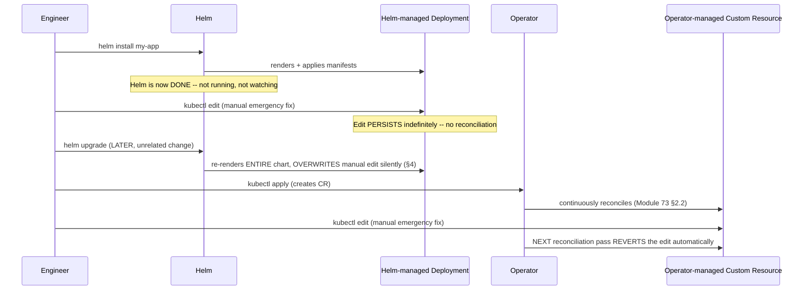
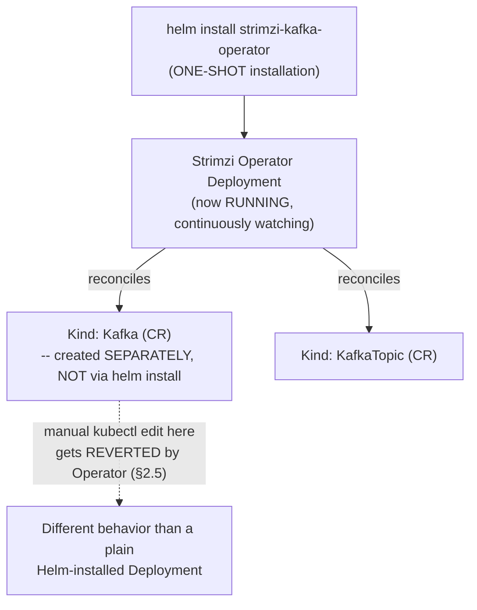

# Module 78 — Kubernetes: Helm, Operators & CRDs — Package Management, the Operator Pattern & Custom Resources

> Domain: Kubernetes | Level: Beginner → Expert | Prerequisite: [[01-Architecture-ControlPlane-Pods-Deployments]] (§2.2's reconciliation-loop pattern is the exact mechanism an Operator's custom controller implements), [[03-Storage-Volumes-PersistentVolumes-StorageClasses-StatefulSets]] (§2.5's Strimzi/Kafka StatefulSet reference is generalized here into the full Operator pattern it was a preview of), [[04-Configuration-Security-ConfigMaps-Secrets-RBAC-PodSecurity]] (§2.6's admission-controller mechanism and this domain's recurring "object presence ≠ automatic reality" theme continues here as CRDs' inertness without a controller)

---

## 1. Fundamentals

### Why does a Principal Engineer need Helm/Operator/CRD depth beyond hand-writing and `kubectl apply`-ing individual manifests?
Raw manifest management doesn't scale past a small number of simple, stateless workloads: a genuinely complex application (many interrelated Deployments, Services, ConfigMaps, RBAC objects, parameterized differently per environment) needs a **packaging and templating** mechanism — Helm's role — while a genuinely complex *stateful* system (a database, a message broker) needs **domain-specific operational automation** — safely sequencing a rolling upgrade that respects that specific system's own consistency/quorum requirements, orchestrating backup/restore, handling failover — that goes beyond what Kubernetes's built-in controllers (Module 73's Deployment/ReplicaSet, Module 75's StatefulSet) can express generically, since they know nothing about Kafka's in-sync-replica requirements or PostgreSQL's replication topology specifically. **Custom Resource Definitions (CRDs)** extend the Kubernetes API itself with new, domain-specific object types, and the **Operator pattern** pairs a CRD with a custom controller implementing that exact domain-specific operational knowledge as code, via the identical reconciliation-loop mechanism (Module 73 §2.2) every built-in controller already uses.

### Why does this matter?
Because Helm and Operators solve **genuinely different problems** that are frequently conflated — Helm handles templated, parameterized *installation*; an Operator handles ongoing, state-aware *lifecycle management* of a running system — and confusing the two (assuming Helm provides continuous reconciliation, or assuming an Operator is merely a fancier installer) leads directly to the kind of "I made a change, and it silently, unexpectedly reverted later" incident this module's §4 describes.

### When does this matter?
For any team packaging and distributing non-trivial Kubernetes applications (Helm's territory), and for any team running genuinely complex stateful systems on Kubernetes that need automated, safe, domain-aware lifecycle operations beyond generic rolling-update semantics (the Operator pattern's territory) — increasingly common as organizations run more of their data layer (Kafka via Strimzi, PostgreSQL via CloudNativePG, certificates via cert-manager) natively on Kubernetes.

### How does it work (30,000-ft view)?
```
Helm: a PACKAGE MANAGER -- Charts (templated manifest bundles + values.yaml defaults) are
     rendered and applied via `helm install`/`upgrade`, tracked as a versioned "release"
     with rollback history -- ONE-SHOT at install/upgrade time, NOT a continuously-running
     reconciliation loop
CRD (Custom Resource Definition): extends the Kubernetes API with a NEW resource type
     (e.g., Kind: KafkaCluster) -- registers the SCHEMA only; INERT without a controller
     watching it, directly recurring Module 74's "Ingress object alone does nothing" pattern
Operator: a CRD + a CUSTOM CONTROLLER implementing Module 73 §2.2's reconciliation loop
     SPECIFICALLY for that CRD's Kind -- encodes domain-specific operational expertise
     (safe upgrade sequencing, backup orchestration, failover) as CONTINUOUSLY-RUNNING code,
     not a one-shot installation or a human-followed runbook
Common pattern: Helm installs the OPERATOR itself (its Deployment, CRDs, RBAC) --
     the Operator then continuously manages actual instances via its own CRs, created
     separately from (and outliving) any single `helm install` invocation
```

---

## 2. Deep Dive

### 2.1 Helm — Templated Packaging, and Its Critical One-Shot (Not Continuous) Nature
A **Helm Chart** bundles a set of templated Kubernetes manifests, a `Chart.yaml` (metadata), and a `values.yaml` (default, overridable parameters) into a single, versioned, installable unit — `helm install`/`helm upgrade` renders those templates against the supplied values and applies the resulting manifests, tracked as a **release** with a revision history enabling `helm rollback` to a prior release state. The critical, frequently-misunderstood property: Helm's own involvement with a release is **one-shot, at install/upgrade time only** — once `helm install`/`upgrade` completes and returns, Helm itself is not running anywhere, watching anything, or continuously reconciling that release's resources against its chart definition (a genuinely different behavior than Module 73 §2.2's built-in controllers, or §2.3's Operators, which run continuously). This means Helm provides **zero automatic drift detection or correction**: if an engineer manually `kubectl edit`s a Helm-managed resource after installation, that change persists indefinitely and silently, with no mechanism reverting it — **until** the next `helm upgrade` of that release is run for any reason, at which point Helm **fully re-renders and re-applies the entire chart's templated manifests**, silently overwriting the manual edit back to whatever the chart's templates (and current values) specify, regardless of whether that specific `helm upgrade` invocation had any intended relationship to the manually-edited field at all.

### 2.2 CRDs — Schema Registration Only, Inert Without a Controller, the Domain's Third Instance of "Object Presence ≠ Automatic Reality"
A **Custom Resource Definition** registers a new object Kind with the Kubernetes API Server — after applying a CRD, `kubectl apply -f my-kafka-cluster.yaml` (referencing that new Kind) succeeds, the object is validated against the CRD's declared schema and persisted to etcd exactly like any built-in object — but, on its own, **absolutely nothing happens** as a result: a CRD is purely a schema/API registration, with no inherent behavior at all, directly recurring Module 74 §2.4's "an Ingress object alone does nothing without a running Ingress Controller" finding, and structurally the same category as Module 74's NetworkPolicy-enforcement gap and Module 76's Pod-Security-Admission-mode gap — a Custom Resource *object* existing and being schema-valid provides **zero** evidence that anything is actually managing, reconciling, or acting on it, until and unless a **controller** (§2.3) is separately deployed and actively watching that specific CRD's Kind.

### 2.3 The Operator Pattern — a CRD Plus a Custom Controller Encoding Domain-Specific Operational Expertise as Continuously-Running Code
An **Operator** is the combination of a CRD (§2.2, the domain-specific desired-state schema) and a **custom controller** — typically built with a framework like Kubebuilder or the Operator SDK — implementing Module 73 §2.2's exact observe-compare-converge reconciliation loop, but with domain-specific *convergence logic* that encodes real operational expertise: **Strimzi** (Kafka, directly generalizing Module 75 §2.5's StatefulSet-based Kafka preview into its full form) knows how to safely perform a rolling broker upgrade respecting Kafka's own in-sync-replica requirements, rather than a generic Deployment's rolling-update logic that has no awareness of Kafka-specific safety constraints at all; **cert-manager** continuously watches `Certificate` custom resources and automatically issues, and — critically — **renews** TLS certificates before expiry, converting what would otherwise be a manual or cron-job-based operational task into continuously-enforced desired state; a **PostgreSQL Operator** (CloudNativePG, Zalando's postgres-operator) automates primary/replica failover, backup scheduling, and safe version upgrades for a PostgreSQL cluster running on Kubernetes. The unifying insight: an Operator is how an organization encodes "the specific runbook a human on-call engineer would otherwise have to follow correctly, under pressure, every time" directly into automated, continuously-enforced, version-controlled code — the same operational-knowledge-encoding value proposition this course has associated with automated governance gates throughout (Module 64/72/76's synthesized pattern), now applied to domain-specific *lifecycle* operations rather than policy enforcement specifically.

### 2.4 Helm and Operators Are Complementary, Not Competing — and Commonly Layered
A common, correct pattern layers both: `helm install strimzi-kafka-operator` uses Helm (§2.1) to perform the one-shot installation of the **Operator itself** — its own Deployment, its CRDs, its RBAC permissions — and once that Operator is running, an engineer creates a `Kind: Kafka` custom resource (a genuinely separate object, typically **not** managed via a further `helm install` of "a Kafka instance," but directly via `kubectl apply` or a GitOps tool, Module 80's territory) which the now-running Strimzi Operator continuously reconciles (§2.3) — meaning Helm's one-shot installation role and the Operator's ongoing reconciliation role operate at genuinely different layers and time horizons, and are not substitutes for one another: using Helm to install the Operator does not somehow grant the *individual Kafka clusters that Operator subsequently manages* Helm's one-shot, non-reconciling behavior — those specific resources are governed by the Operator's continuous reconciliation loop instead, an entirely different behavioral contract that must be understood on its own terms.

### 2.5 Manual Drift — a Genuinely Different Practical Outcome Depending on Whether Helm or an Operator Manages a Given Resource
This module's central practical distinction, directly relevant to incident response: manually `kubectl edit`-ing a resource that a plain Helm chart installed (with no Operator involved) persists that edit **indefinitely**, until an unrelated future `helm upgrade` of that release silently reverts it (§2.1, §4's exact incident) — while manually `kubectl edit`-ing a Custom Resource that a genuine Operator actively reconciles gets **automatically, and typically quickly, reverted by the Operator's own next reconciliation pass** (Module 73 §2.2 — the Operator observes the CR's declared desired state, sees the live object now diverges from it due to the manual edit, and converges it back) — an on-call engineer's manual, emergency `kubectl edit` mitigation has an **entirely different persistence guarantee** depending on which of these two management models governs the resource being edited, and misjudging which one applies to a given incident's target resource is precisely §4's incident's root cause.

### 2.6 CRD Versioning and Schema Evolution — the Same Discipline Module 53's Event Schemas Required, Now for the Kubernetes API Itself
A CRD can declare multiple API versions simultaneously (e.g., `v1alpha1`, `v1beta1`, `v1`), with an optional **conversion webhook** translating objects between versions as needed — directly Module 53's event-schema-evolution discipline (backward/forward compatibility, additive-only changes preferred, an explicit deprecation and migration path for breaking changes), now applied to the Kubernetes API surface itself rather than a message-broker payload schema. A Principal Engineer designing a custom CRD for an internal developer platform (an increasingly common pattern — a platform team exposing a simplified, organization-specific abstraction, e.g., a `Kind: InternalService` CRD whose Operator translates it into the full Deployment+Service+Ingress+NetworkPolicy+monitoring bundle a raw developer-facing request shouldn't need to hand-author) must apply this same versioning discipline deliberately from the CRD's first version onward, since every existing Custom Resource instance created against an earlier schema version must remain valid (or be explicitly, safely migrated) as the CRD's schema inevitably evolves.

---

## 3. Visual Architecture

### Helm's One-Shot Install/Upgrade vs. an Operator's Continuous Reconciliation (§2.1, §2.3, §2.5)


### Layered Pattern: Helm Installs the Operator; the Operator Manages Its Own CRs (§2.4)


## 4. Production Example
**Scenario**: A platform team ran a Kafka cluster on Kubernetes using a straightforward, self-authored Helm chart (StatefulSets, Services, ConfigMaps — a pre-Strimzi, hand-rolled approach the team had built before adopting the Operator pattern more broadly) — during a genuine, customer-impacting incident, an on-call engineer diagnosed severe memory pressure on the Kafka broker Pods and, needing an immediate mitigation without waiting for a full change-review-and-deploy cycle, ran `kubectl edit statefulset kafka-brokers` directly, raising the memory limit — the fix worked immediately, the incident was resolved, and the on-call engineer documented the emergency change in the incident ticket as resolved. **Investigation**: nine days later, the identical memory-pressure symptoms recurred, seemingly without any team member having touched the Kafka deployment at all — the on-call engineer investigating this second incident was, initially, genuinely confused, since `git log` and the team's change-tracking showed no recent Kafka-related changes. Deeper investigation revealed that a different team member had, in the intervening days, run `helm upgrade kafka-cluster` to deploy an entirely unrelated change — bumping a monitoring-sidecar's image tag, declared in the same chart's `values.yaml` — and Helm's `upgrade` operation, per its actual behavior (§2.1), had **fully re-rendered and re-applied every templated manifest in the chart**, including the StatefulSet's resource limits, which the chart's `values.yaml` still declared at their original, pre-incident (too-low) value — silently overwriting the first engineer's manual emergency fix, with no warning, error, or diff surfaced anywhere in the `helm upgrade` output specifically calling attention to that unrelated-looking field being reverted. **Root cause**: a mental-model mismatch directly matching this module's §2.5 finding — the first on-call engineer's manual `kubectl edit` mitigation was implicitly assumed to be a durable, persistent fix (the incident ticket was closed as "resolved"), when in fact its persistence was entirely contingent on no future `helm upgrade` of that release occurring for any reason, a condition nobody had verified or even considered at the time, since the team's mental model of "we fixed it" didn't distinguish between a genuinely durable fix and a fragile, Helm-upgrade-vulnerable one. **Fix**: the emergency memory-limit increase was properly committed to the chart's `values.yaml` itself (making it the actual, durable, chart-defined desired state, immune to being overwritten by a future unrelated upgrade, since it would now be *part of* what any future `helm upgrade` re-renders and applies), and the team adopted a standing incident-response practice: any manual `kubectl edit` applied as an emergency mitigation on a Helm-managed resource must be **immediately followed by a corresponding chart/values change** (even if deployed later, outside the immediate incident window) specifically to prevent this exact class of silent regression, with the incident explicitly not considered fully resolved until that follow-up change lands. **Lesson**: this is the domain's now-repeated "object/action's apparent success provides incomplete evidence of its actual, durable effect" pattern (Modules 74–76) recurring a fourth time, in a genuinely different guise: here, the mitigation *did* work, immediately and correctly — the gap was entirely about **persistence over time** under a specific, easy-to-overlook triggering condition (an unrelated future Helm upgrade) rather than about the fix's initial correctness — a Principal Engineer must explicitly reason about *which* management model (Helm's one-shot, or an Operator's continuous reconciliation) governs any resource before judging whether a manual mitigation is durable or merely temporarily masking the underlying issue until the next, unrelated deployment silently reverts it.

## 5. Best Practices
- Treat any manual `kubectl edit` applied to a Helm-managed resource as a **temporary** mitigation only — immediately follow up with a corresponding chart/values change to make the fix durable against a future, even unrelated, `helm upgrade` (§4).
- Explicitly identify whether a given resource is Helm-managed (one-shot, drift-persistent) or Operator-managed (continuously reconciled, drift-reverted) before judging how durable a manual emergency change will be (§2.5).
- Layer Helm and Operators deliberately where appropriate — use Helm for the Operator's own one-shot installation, and let the Operator's own continuous reconciliation govern the actual domain-specific resources it manages, rather than conflating the two models (§2.4).
- Apply the same schema-versioning discipline (additive-only changes, conversion webhooks for breaking changes) to any custom CRD an internal platform team designs as this course established for event schemas (§2.6).
- Prefer an Operator (encoding domain-specific operational expertise as continuously-reconciled code) over a generic Helm-chart-plus-manual-runbook approach for any genuinely complex stateful system whose safe operation requires domain-specific sequencing logic (§2.3).

## 6. Anti-patterns
- Assuming a manual `kubectl edit` on any Kubernetes resource is automatically durable, without first confirming whether that resource is Helm-managed (drift-persistent until the next upgrade) or Operator-managed (drift-reverted on the next reconciliation pass) (§2.5, §4).
- Treating a CRD's successful application as evidence that something is now actively managing the resulting Custom Resource, without confirming a corresponding controller/Operator is actually deployed and running (§2.2).
- Closing an incident as "resolved" based on a manual mitigation's immediate effectiveness, without a corresponding durable, version-controlled change landing to prevent a future unrelated deployment from silently reverting it (§4).
- Hand-rolling complex, domain-specific stateful-system lifecycle logic (safe upgrade sequencing, failover orchestration) as ad hoc scripts or human-followed runbooks when a mature, purpose-built Operator (Strimzi, cert-manager, a PostgreSQL Operator) already encodes that exact expertise (§2.3).
- Designing a custom CRD's schema without an explicit versioning/evolution strategy from its first version, assuming it will never need to change in a backward-incompatible way (§2.6).

---

## 10. Interview Questions

### Basic (10)
1. **Q: What is a Helm Chart?** **A:** A bundle of templated Kubernetes manifests plus a `Chart.yaml` and `values.yaml`, packaged as a single, versioned, installable unit.
2. **Q: Does Helm continuously reconcile a release's resources after installation?** **A:** No — Helm's involvement is one-shot, at install/upgrade time only; it doesn't run continuously or detect/correct drift on its own.
3. **Q: What does a CRD (Custom Resource Definition) do on its own?** **A:** Registers a new object Kind's schema with the Kubernetes API — nothing more; it's inert without a separately-deployed controller watching it.
4. **Q: What is an Operator?** **A:** The combination of a CRD and a custom controller implementing a continuous reconciliation loop with domain-specific operational logic for that CRD's Kind.
5. **Q: Name two canonical Operator examples.** **A:** Strimzi (Kafka) and cert-manager (TLS certificate issuance/renewal) — also commonly cited: CloudNativePG/Zalando's postgres-operator for PostgreSQL.
6. **Q: What happens if you manually `kubectl edit` a resource managed by a plain Helm chart (no Operator involved)?** **A:** The edit persists indefinitely, until a future `helm upgrade` of that release re-renders and silently overwrites it.
7. **Q: What happens if you manually `kubectl edit` a Custom Resource actively managed by an Operator?** **A:** The Operator's controller detects the drift on its next reconciliation pass and automatically reverts it back to the declared desired state.
8. **Q: Can Helm and Operators be used together?** **A:** Yes, commonly — Helm performs the one-shot installation of the Operator itself, and the Operator then continuously manages its own, separately-created Custom Resources.
9. **Q: What does a CRD's conversion webhook do?** **A:** Translates Custom Resource objects between different declared API versions of the same CRD, supporting schema evolution.
10. **Q: What did §4's incident reveal about a manual emergency fix applied via `kubectl edit` on a Helm-managed StatefulSet?** **A:** It was silently reverted nine days later by an unrelated `helm upgrade` (a monitoring-sidecar image bump) that re-rendered and re-applied the chart's original, pre-fix resource limits.

### Intermediate (10)
1. **Q: Why is "Helm installs it, so it must be continuously managed" a mistaken inference?** **A:** Helm's role ends once `install`/`upgrade` completes — it isn't running anywhere afterward, so nothing about a Helm installation implies ongoing, continuous management of the resulting resources, unlike an Operator's controller.
2. **Q: Why is a CRD's successful `kubectl apply` described as providing "zero evidence" that anything is happening, per §2.2?** **A:** A CRD only registers schema — creating a Custom Resource against it is accepted and persisted regardless of whether any controller is actually watching that Kind, directly recurring the same "object presence ≠ enforced/actual behavior" pattern this domain established for Ingress (Module 74), NetworkPolicy (Module 74), and Pod Security Admission (Module 76).
3. **Q: Why does using Helm to install an Operator not change the Operator's own managed resources' behavior?** **A:** Helm's one-shot installation role applies specifically to installing the Operator's own Deployment/CRDs/RBAC — the Custom Resources that Operator subsequently manages are governed entirely by the Operator's own continuous reconciliation loop, an independent behavioral contract unaffected by how the Operator itself was originally installed.
4. **Q: Why was the on-call engineer in §4 "genuinely confused" during the second incident?** **A:** No team member had made any Kafka-related change in the intervening days — the actual cause (an unrelated `helm upgrade` re-rendering the entire chart, including the previously-fixed resource limits) wasn't visible in change-tracking specific to Kafka, since the triggering change was, from the team's perspective, unrelated.
5. **Q: Why does §4's fix require committing the emergency change to `values.yaml` specifically, rather than just re-applying `kubectl edit` again?** **A:** Because only a change to the chart's own declared desired state (values.yaml/templates) is immune to being overwritten by a future `helm upgrade` — a repeated manual edit would remain just as vulnerable to the identical silent-reversion risk the first edit already demonstrated.
6. **Q: Why should a third-party Operator's requested RBAC scope be reviewed with the same severity as a `cluster-admin` grant, per §8?** **A:** An Operator's controller typically needs broad permissions across the resource types and namespaces it manages to function correctly — a compromised or malicious Operator inherits that same broad access, making its RBAC scope a genuinely high-value, high-blast-radius target requiring explicit review before installation.
7. **Q: Why is a CRD's own OpenAPI schema validation described as insufficient for catching "domain-specific semantic misconfiguration," per §8?** **A:** Schema validation only confirms an object's *structure* (correct field types, required fields present) — it has no awareness of domain-specific business rules a controller's reconciliation logic, or a separate admission webhook, would need to enforce instead (e.g., "this Kafka replication factor must not exceed the number of available brokers").
8. **Q: Why does an Operator's reconciliation-loop efficiency matter beyond just "is it working," per §7?** **A:** An inefficient controller (excessive polling rather than watch-based informers) delays how quickly it converges actual state toward desired state after any change, and at scale contributes measurable, avoidable load to the shared API Server, directly recurring Module 73 §Advanced Q5's general controller-efficiency concern now specifically for custom Operators.
9. **Q: Why should a platform team monitor a specific Operator's own reconciliation throughput as a distinct capacity signal, per §9?** **A:** General cluster-level autoscaling headroom (Module 77) says nothing about whether a specific, potentially single-replica Operator instance can keep up with reconciling a very large number of its own managed Custom Resources — that Operator's own queue depth/reconciliation latency is an independent bottleneck requiring its own explicit monitoring.
10. **Q: Why is designing a custom CRD's versioning strategy from its very first version described as necessary, rather than something to add later once a breaking change is actually needed?** **A:** Every existing Custom Resource instance already created against the current schema must remain valid (or be safely, deliberately migrated) as the schema evolves — retrofitting a versioning/conversion strategy after already having many live instances on an unversioned schema is materially harder than designing for evolution from the start, directly Module 53's event-schema-evolution lesson recurring here.

### Advanced (10)
1. **Q: Diagnose the §4 incident from first principles, and design the specific standing practice that prevents this exact class of "correct fix, silently reverted by an unrelated future deployment" incident from recurring across any Helm-managed resource in the cluster, not just Kafka specifically.**
   **A:** Root cause: a mental-model gap treating a manual `kubectl edit` as durable, when its actual persistence was entirely contingent on no future `helm upgrade` of that release occurring — a condition with no visibility or tracking at the time the "fix" was applied. Structural fix: (1) mandate, as standing incident-response policy, that any manual `kubectl edit` applied as an emergency mitigation on a Helm-managed resource is explicitly logged as a **tracked, open follow-up** (not merely a resolved-incident note) requiring a corresponding chart/values change before the incident can be considered fully closed — directly extending this course's now-repeated "structural enforcement, not just documentation, closes the loop" pattern (Module 64/72/76) to this specific class of drift risk; (2) consider adopting GitOps tooling (Module 80) for Helm-managed releases specifically *because* it would have caught this drift automatically (a GitOps controller continuously reconciling against the git-committed values would have reverted the *manual* edit immediately upon detecting drift from the tracked source, forcing the emergency fix to be properly committed to git from the start rather than applied out-of-band) — trading the emergency-fix's initial convenience for the same continuous-reconciliation safety property an Operator already provides for its own CRs.
2. **Q: A team argues that since their custom internal-platform CRD (an `InternalService` abstraction, per §2.6) is only ever created and modified via their own internal CLI tool, CRD schema versioning is unnecessary overhead, since "we control every consumer." Evaluate this claim.**
   **A:** Push back — "we control every consumer today" doesn't guarantee it remains true indefinitely: a future integration (a separate team's automation, a GitOps pipeline directly authoring the CRD's YAML instead of going through the CLI, a future acquisition/reorg introducing a new consuming team) can bypass the CLI's own validation/normalization logic entirely, directly exposing whatever the CRD's actual schema permits — if that schema was never versioned or its evolution never disciplined, any future breaking change now has no safe migration path for such new, unanticipated consumers; treating "we control every consumer" as a permanent, static fact rather than a current, potentially-temporary condition is the same brittle assumption this course has repeatedly flagged (directly echoing Module 53's schema-evolution discipline, which doesn't assume a fixed, closed set of consumers either).
3. **Q: Design the specific automated check that would have caught §4's incident's root risk proactively — flagging that a `helm upgrade` is about to silently revert a manually-applied change — before the `helm upgrade` command actually executes.**
   **A:** `helm diff` (a common Helm plugin) run as a mandatory pre-upgrade step in the deployment pipeline, computing and surfacing the **full** diff between the currently-live cluster state and what the proposed `helm upgrade` would render and apply — not merely the diff relative to the *previous* `helm upgrade`'s known values — specifically because this surfaces any field (like §4's manually-edited resource limit) that currently differs from the chart's own declared template/values, regardless of *why* it differs, forcing an explicit, visible review moment ("this upgrade will also revert this specific field — is that intended?") before the silent overwrite occurs, directly the same "make an otherwise-invisible consequence visible and require explicit confirmation" pattern this course established for NetworkPolicy/PSA enforcement-mode verification (Modules 74/76), now applied to Helm's specific silent-overwrite risk.
4. **Q: A team is deciding whether to build a custom Operator for a moderately complex, but not genuinely stateful-clustered, internal service (a stateless API with a somewhat involved multi-step canary-rollout requirement) versus using a Deployment plus an external CI/CD pipeline script implementing the same canary logic. Evaluate the trade-off.**
   **A:** A custom Operator's value proposition (§2.3) is specifically strongest for domain logic that benefits from being **continuously, automatically reconciled** as Kubernetes-native desired state (self-healing if the canary process is interrupted, declarative rather than imperative rollout definition) — a moderately complex canary-rollout requirement may be adequately served by an existing, general-purpose progressive-delivery tool (Argo Rollouts, Flagger — themselves Operators, notably, meaning the "build a custom Operator" question is often better framed as "adopt an existing, purpose-built Operator" rather than either extreme of "build our own" or "external pipeline script") — building a fully custom Operator from scratch is justified specifically when the domain logic is genuinely unique to the organization's own operational requirements (not already well-served by an existing tool), given the real, ongoing engineering investment (Kubebuilder/Operator SDK expertise, testing a continuously-running controller's reconciliation correctness) a custom Operator requires relative to either an existing purpose-built Operator or a simpler external-pipeline approach.
5. **Q: Critique the following claim: "Since our Strimzi-managed Kafka cluster automatically reverts any manual `kubectl edit`, our on-call engineers should never make direct manual changes during an incident — they should always wait for a proper, reviewed change through our deployment pipeline instead."**
   **A:** Overstated in the opposite direction from §4's actual lesson — an Operator's automatic reversion of manual edits is a genuine safety property (§2.5) protecting against silent, untracked drift, but it does **not** mean manual intervention is never appropriate during a genuine, severe incident; rather, it means a manual intervention on an Operator-managed resource requires understanding *how* to make it stick against the Operator's own reconciliation (updating the Custom Resource's own spec, which the Operator will then treat as the new desired state and converge toward, rather than editing a resource the Operator directly generates and manages beneath the CR, which it would simply revert) — the correct guidance isn't "never intervene manually," it's "know which layer to intervene at" (the CR's own spec, not a generated child resource), directly the same "identify which management model governs this resource" discipline §2.5's finding establishes, now applied to *how* to correctly perform an emergency Operator-aware fix rather than avoiding manual intervention altogether.
6. **Q: Explain why this module's finding (§4, a "durable-looking fix silently reverted by an unrelated future deployment") is a genuinely different failure category from Modules 74-76's "object presence ≠ enforced reality" pattern, despite superficial similarity, and what distinguishes them.**
   **A:** Modules 74-76's pattern concerns a **declared control** (a NetworkPolicy, a reclaim policy, a PSA label) whose stated intent was never actually enforced at all, from the moment of its creation — the gap exists from time zero. §4's incident is structurally different: the manual fix **was** genuinely, correctly effective from the moment it was applied — the gap is temporal and conditional, only manifesting later, triggered by a specific, unrelated future event (a subsequent `helm upgrade`) that the original fix's author had no reason to anticipate at the time. Both categories share the surface-level "eventually production behavior didn't match what was assumed" symptom, but the root causes differ (missing enforcement mechanism vs. a control model's inherent lack of persistence across a specific class of future event) — recognizing this distinction matters because the fixes differ too: Modules 74-76's fixes are "verify enforcement is actually active"; §4's fix is "understand and account for the specific management model's persistence characteristics before assuming a change is durable."
7. **Q: A Kubernetes platform team is designing a new internal CRD-based abstraction and must decide whether mutations to the CRD's spec should be validated purely via OpenAPI schema constraints (§2.2) or additionally via a custom validating admission webhook (Module 76 §2.6). Design the decision framework.**
   **A:** OpenAPI schema constraints (types, required fields, enum value restrictions, numeric ranges) are sufficient for **purely structural** validation — but any **cross-field** or **external-state-dependent** validation (e.g., "the declared `replicaCount` must not exceed the caller's current namespace resource quota," "the referenced `storageClassName` must actually exist in this cluster," directly the kind of semantic check §8 flagged schema validation as insufficient for) requires a custom validating admission webhook instead, since OpenAPI schema validation has no mechanism for querying other cluster state or applying conditional logic across multiple fields — the decision framework is: default to schema-only validation for anything expressible as a static, self-contained structural constraint, and add a webhook specifically for any rule requiring either cross-field logic or a live query against other cluster state.
8. **Q: Design the specific migration path for evolving a live CRD from `v1alpha1` to a `v1` schema that renames a field and changes its type (a genuinely breaking change), given that dozens of existing Custom Resource instances already exist against `v1alpha1` in production.**
   **A:** (1) Introduce `v1` as an additional served version alongside the still-served `v1alpha1` (both versions co-existing, per §2.6), with a **conversion webhook** implementing the actual field-rename-and-type-transformation logic bidirectionally between the two versions — new consumers can begin authoring against `v1` immediately, while existing `v1alpha1` instances continue functioning unmodified, transparently converted on read/write via the webhook. (2) Mark `v1alpha1` as deprecated (via the CRD's own deprecation-warning mechanism, surfaced to any `kubectl apply` against it) with an explicit, communicated migration deadline. (3) Only once telemetry confirms no remaining `v1alpha1` API usage (directly Module 53's "confirm no consumers remain on the deprecated schema before removing it" discipline) should `v1alpha1` actually be removed as a served version — this staged approach avoids any "big bang" cutover risk, directly mirroring the same additive-then-deprecate-then-remove pattern this course established for event-schema evolution, now applied to the Kubernetes API surface itself.
9. **Q: A Principal Engineer observes that a custom Operator's reconciliation loop is repeatedly reverting a specific field on its managed Custom Resources back to a value that differs from what a downstream, dependent GitOps pipeline (Module 80) is trying to set via a separate mechanism. Diagnose the likely architectural conflict and design the fix.**
   **A:** This is a **desired-state-ownership conflict** — two independent systems (the Operator's own internal defaulting/reconciliation logic, and an external GitOps pipeline) are both attempting to be the authoritative source of truth for the identical field, with the Operator's own reconciliation loop (running continuously, per §2.3) winning the race against the GitOps pipeline's less-frequent sync cycles, structurally the same category of conflict Module 77 §2.5 identified between HPA and VPA both managing the same metric — the fix requires establishing a single, explicit owner for that specific field: either configure the Operator to treat that field as purely user-supplied (never overriding it once set, if the Operator supports such a mode) or configure the GitOps pipeline to exclude that specific field from its own managed scope, deferring entirely to the Operator's own internal logic for it — exactly as Module 77 §2.5's HPA/VPA resolution required explicitly scoping each controller to a non-overlapping metric/field rather than allowing both to compete over identical state.
10. **Q: As a Principal Engineer establishing Kubernetes packaging/extensibility standards for a platform team building an internal developer platform (IDP) on custom CRDs and Operators, design the specific set of standing architectural decisions and automated governance checks (synthesizing this entire module) required before the IDP is opened up to other teams as consumers.**
    **A:** (1) A versioning and deprecation policy for every custom CRD from its first release (§2.6, Advanced Q8's staged-migration pattern), never treating "we control all current consumers" as a permanent exemption (Advanced Q2). (2) An explicit, documented, and reviewed RBAC scope for every custom Operator's controller, treated with `cluster-admin`-equivalent severity during review (§8). (3) A clear, published decision framework (Advanced Q7) for when a given validation rule belongs in CRD schema versus a custom admission webhook, avoiding both under-validated CRDs and unnecessarily complex webhook logic for purely structural checks. (4) Explicit desired-state-ownership documentation for every field a Custom Resource exposes, specifically identifying whether the Operator's own reconciliation logic, an external GitOps pipeline, or direct user edits are the intended authoritative source for each — preventing Advanced Q9's ownership-conflict class of bug before it occurs. (5) A standing incident-response policy (Advanced Q1) requiring any manual emergency change to a Helm-managed (not Operator-managed) resource be tracked as an open follow-up until a corresponding durable chart/values change lands, plus mandatory `helm diff`-based pre-upgrade review (Advanced Q3) surfacing any unexpected reversion before a `helm upgrade` silently executes it.

---

## 11. Coding Exercises

### Easy — A Helm Chart's `values.yaml` making the emergency fix from §4 durable, not a fragile `kubectl edit` (§4, §5)
```yaml
# values.yaml -- committing the fix HERE (not merely via kubectl edit) makes it
# immune to being silently reverted by any FUTURE helm upgrade, since it is now
# what any future upgrade will faithfully re-render and apply (§4's actual fix).
kafka:
  broker:
    resources:
      requests: { memory: "8Gi", cpu: "2" }
      limits: { memory: "12Gi", cpu: "4" }   # raised from the original 6Gi/8Gi that
                                                # caused the incident -- now the durable,
                                                # chart-defined desired state
```

### Medium — A minimal Custom Resource Definition, inert on its own without a controller (§2.2)
```yaml
apiVersion: apiextensions.k8s.io/v1
kind: CustomResourceDefinition
metadata:
  name: internalservices.platform.example.com
spec:
  group: platform.example.com
  versions:
    - name: v1
      served: true
      storage: true
      schema:
        openAPIV3Schema:
          type: object
          properties:
            spec:
              type: object
              properties:
                replicaCount: { type: integer, minimum: 1 }
                image: { type: string }
  scope: Namespaced
  names: { plural: internalservices, singular: internalservice, kind: InternalService }
# Applying THIS alone (kubectl apply -f this-crd.yaml) registers the schema only --
# a subsequently-created "Kind: InternalService" object will be accepted and persisted,
# but NOTHING will act on it until a controller is separately deployed watching it (§2.2).
```

### Hard — A minimal Operator reconciliation loop for the above CRD, using Module 73 §2.2's exact pattern (§2.3)
```csharp
public class InternalServiceReconciler
{
    private readonly IKubernetesClient _client;

    // Module 73 §2.2's reconciliation loop, now with DOMAIN-SPECIFIC convergence logic --
    // translating a simplified InternalService CR into the full underlying resource bundle
    // a developer shouldn't need to hand-author (Deployment + Service + Ingress).
    public async Task ReconcileAsync(InternalServiceCr cr, CancellationToken ct)
    {
        var desiredDeployment = BuildDeploymentFrom(cr.Spec);
        var actualDeployment = await _client.TryGetDeploymentAsync(cr.Metadata.Name, cr.Metadata.Namespace);

        if (actualDeployment is null)
            await _client.CreateDeploymentAsync(desiredDeployment);
        else if (!DeploymentsMatch(desiredDeployment, actualDeployment))
            // Directly §2.5's guarantee -- if someone manually kubectl-edits the generated
            // Deployment, THIS reconciliation pass (running continuously) reverts it back
            // to what the CR's own spec declares, unlike a plain Helm-installed resource.
            await _client.UpdateDeploymentAsync(desiredDeployment);

        await _client.UpdateStatusAsync(cr, new InternalServiceStatus { Ready = actualDeployment?.IsReady ?? false });
    }
}
```

### Expert — A conversion webhook supporting a breaking CRD schema change without disrupting existing instances (§2.6, §Advanced Q8)
```csharp
[ApiController]
[Route("convert")]
public class InternalServiceConversionWebhook : ControllerBase
{
    // v1alpha1 used "replicas: int"; v1 renames it to "replicaCount: int" and adds
    // a required "minReadySeconds" field with a sensible default -- a genuinely
    // breaking change, handled via conversion rather than a disruptive big-bang
    // cutover across dozens of already-live v1alpha1 instances (§Advanced Q8).
    [HttpPost]
    public IActionResult Convert([FromBody] ConversionRequest request)
    {
        var convertedObjects = request.Objects.Select(obj =>
        {
            if (request.DesiredApiVersion == "platform.example.com/v1"
                && obj.ApiVersion == "platform.example.com/v1alpha1")
            {
                obj.Spec["replicaCount"] = obj.Spec["replicas"];   // rename
                obj.Spec.Remove("replicas");
                obj.Spec["minReadySeconds"] = obj.Spec.GetValueOrDefault("minReadySeconds", 0);  // new field default
                obj.ApiVersion = "platform.example.com/v1";
            }
            return obj;
        });

        return Ok(new ConversionResponse { ConvertedObjects = convertedObjects, Result = "Success" });
    }
}
```

---

## 12–17. System Design / LLD / Debugging / Decision / Case Study / Principal

*(§4's incident, the four §11 exercises, and the Advanced-tier Q&A — especially Advanced Q1's standing incident-response practice, Advanced Q3's `helm diff` pre-upgrade governance check, and Advanced Q10's synthesized internal-developer-platform governance checklist — collectively constitute this module's system-design, debugging, and Principal-Engineer-level content.)*

## 18. Revision
**Key takeaways**: Helm (§2.1) and the Operator pattern (§2.3) solve genuinely different problems commonly conflated — Helm is a one-shot, templated *package installer* with zero ongoing reconciliation; an Operator is a CRD plus a continuously-running custom controller (directly implementing Module 73 §2.2's reconciliation loop) encoding domain-specific operational expertise as durably-enforced, self-healing code. A CRD alone (§2.2) is purely schema registration — inert without a separately-deployed controller, the domain's third instance of "object presence provides zero evidence of actual behavior" (after Module 74's NetworkPolicy/Ingress and Module 76's Pod Security Admission). This module's central, practically consequential finding is §2.5/§4: a manual `kubectl edit` has an entirely different persistence guarantee depending on whether the target resource is Helm-managed (the edit persists until silently overwritten by any future, even unrelated, `helm upgrade`) or Operator-managed (the edit is automatically reverted by the Operator's own next reconciliation pass) — a genuinely distinct failure category from Modules 74-76's "never-enforced-at-all" pattern, since here the fix *was* correct and effective, only to be silently, unexpectedly undone later by an unrelated deployment nobody thought to connect to it. A Principal Engineer must explicitly identify which management model governs a given resource before judging whether any change (manual or otherwise) to it will actually persist.

---

**Next**: Module 79 — Kubernetes: Service Mesh & Advanced Networking — Istio/Linkerd, ties back to Module 63's App Mesh and Module 71's Dapr, continuing the `23-Kubernetes` domain (Modules 73–80).
