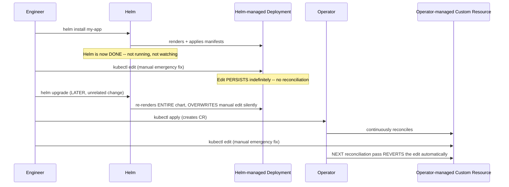
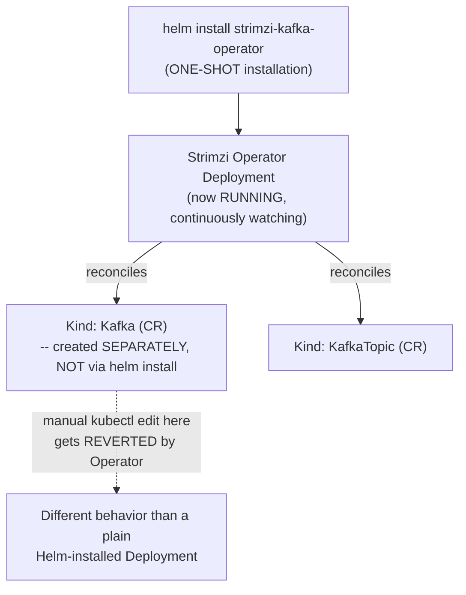
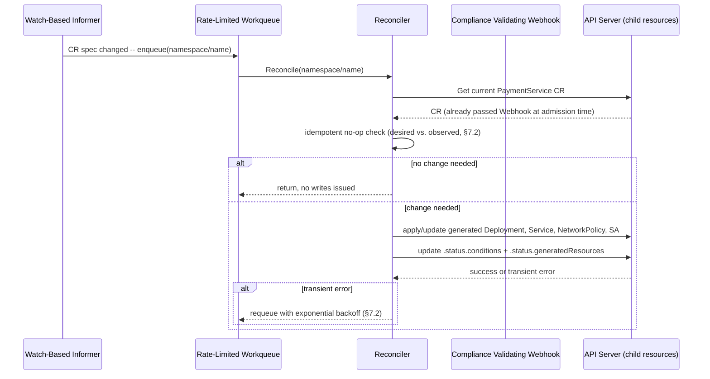

# Module 78 — Kubernetes: Helm, Operators & CRDs — Package Management, the Operator Pattern & Custom Resources

> Domain: Kubernetes | Level: Beginner → Expert | Prerequisite: [[01-Architecture-ControlPlane-Pods-Deployments]] (the reconciliation-loop pattern is the exact mechanism an Operator's custom controller implements), [[03-Storage-Volumes-PersistentVolumes-StorageClasses-StatefulSets]] (the Strimzi/Kafka StatefulSet reference is generalized here into the full Operator pattern it was a preview of), [[04-Configuration-Security-ConfigMaps-Secrets-RBAC-PodSecurity]] (the admission-controller mechanism and this domain's recurring "object presence ≠ automatic reality" theme continues here as CRDs' inertness without a controller)

---

## 1. Fundamentals

### Why does a Principal Engineer need Helm/Operator/CRD depth beyond hand-writing and `kubectl apply`-ing individual manifests?
Raw manifest management doesn't scale past a small number of simple, stateless workloads: a genuinely complex application (many interrelated Deployments, Services, ConfigMaps, RBAC objects, parameterized differently per environment) needs a **packaging and templating** mechanism — Helm's role — while a genuinely complex *stateful* system (a database, a message broker) needs **domain-specific operational automation** — safely sequencing a rolling upgrade that respects that specific system's own consistency/quorum requirements, orchestrating backup/restore, handling failover — that goes beyond what Kubernetes's built-in controllers can express generically, since they know nothing about Kafka's in-sync-replica requirements or PostgreSQL's replication topology specifically. **Custom Resource Definitions (CRDs)** extend the Kubernetes API itself with new, domain-specific object types, and the **Operator pattern** pairs a CRD with a custom controller implementing that exact domain-specific operational knowledge as code, via the identical reconciliation-loop mechanism every built-in controller already uses.

### Why does this matter?
Because Helm and Operators solve **genuinely different problems** that are frequently conflated — Helm handles templated, parameterized *installation*; an Operator handles ongoing, state-aware *lifecycle management* of a running system — and confusing the two (assuming Helm provides continuous reconciliation, or assuming an Operator is merely a fancier installer) leads directly to the kind of "I made a change, and it silently, unexpectedly reverted later" incident this module's describes.

### When does this matter?
For any team packaging and distributing non-trivial Kubernetes applications (Helm's territory), and for any team running genuinely complex stateful systems on Kubernetes that need automated, safe, domain-aware lifecycle operations beyond generic rolling-update semantics (the Operator pattern's territory) — increasingly common as organizations run more of their data layer (Kafka via Strimzi, PostgreSQL via CloudNativePG, certificates via cert-manager) natively on Kubernetes.

### How does it work (30,000-ft view)?
```
Helm: a PACKAGE MANAGER -- Charts (templated manifest bundles + values.yaml defaults) are
 rendered and applied via `helm install`/`upgrade`, tracked as a versioned "release"
 with rollback history -- ONE-SHOT at install/upgrade time, NOT a continuously-running
 reconciliation loop
CRD (Custom Resource Definition): extends the Kubernetes API with a NEW resource type
 (e.g., Kind: KafkaCluster) -- registers the SCHEMA only; INERT without a controller
 watching it, directly recurring the "Ingress object alone does nothing" pattern
Operator: a CRD + a CUSTOM CONTROLLER implementing the reconciliation loop
 SPECIFICALLY for that CRD's Kind -- encodes domain-specific operational expertise
 (safe upgrade sequencing, backup orchestration, failover) as CONTINUOUSLY-RUNNING code,
 not a one-shot installation or a human-followed runbook
Common pattern: Helm installs the OPERATOR itself (its Deployment, CRDs, RBAC) --
 the Operator then continuously manages actual instances via its own CRs, created
 separately from (and outliving) any single `helm install` invocation
```

---

## 2. Deep Dive

### 2.1 Helm — Templated Packaging, and Its Critical One-Shot (Not Continuous) Nature
A **Helm Chart** bundles a set of templated Kubernetes manifests, a `Chart.yaml` (metadata), and a `values.yaml` (default, overridable parameters) into a single, versioned, installable unit — `helm install`/`helm upgrade` renders those templates against the supplied values and applies the resulting manifests, tracked as a **release** with a revision history enabling `helm rollback` to a prior release state. The critical, frequently-misunderstood property: Helm's own involvement with a release is **one-shot, at install/upgrade time only** — once `helm install`/`upgrade` completes and returns, Helm itself is not running anywhere, watching anything, or continuously reconciling that release's resources against its chart definition (a genuinely different behavior than the built-in controllers, or the Operators, which run continuously). This means Helm provides **zero automatic drift detection or correction**: if an engineer manually `kubectl edit`s a Helm-managed resource after installation, that change persists indefinitely and silently, with no mechanism reverting it — **until** the next `helm upgrade` of that release is run for any reason, at which point Helm **fully re-renders and re-applies the entire chart's templated manifests**, silently overwriting the manual edit back to whatever the chart's templates (and current values) specify, regardless of whether that specific `helm upgrade` invocation had any intended relationship to the manually-edited field at all.

### 2.2 CRDs — Schema Registration Only, Inert Without a Controller, the Domain's Third Instance of "Object Presence ≠ Automatic Reality"
A **Custom Resource Definition** registers a new object Kind with the Kubernetes API Server — after applying a CRD, `kubectl apply -f my-kafka-cluster.yaml` (referencing that new Kind) succeeds, the object is validated against the CRD's declared schema and persisted to etcd exactly like any built-in object — but, on its own, **absolutely nothing happens** as a result: a CRD is purely a schema/API registration, with no inherent behavior at all, directly recurring the "an Ingress object alone does nothing without a running Ingress Controller" finding, and structurally the same category as the NetworkPolicy-enforcement gap and the Pod-Security-Admission-mode gap — a Custom Resource *object* existing and being schema-valid provides **zero** evidence that anything is actually managing, reconciling, or acting on it, until and unless a **controller** is separately deployed and actively watching that specific CRD's Kind.

### 2.3 The Operator Pattern — a CRD Plus a Custom Controller Encoding Domain-Specific Operational Expertise as Continuously-Running Code
An **Operator** is the combination of a CRD (the domain-specific desired-state schema) and a **custom controller** — typically built with a framework like Kubebuilder or the Operator SDK — implementing the exact observe-compare-converge reconciliation loop, but with domain-specific *convergence logic* that encodes real operational expertise: **Strimzi** (Kafka, directly generalizing the StatefulSet-based Kafka preview into its full form) knows how to safely perform a rolling broker upgrade respecting Kafka's own in-sync-replica requirements, rather than a generic Deployment's rolling-update logic that has no awareness of Kafka-specific safety constraints at all; **cert-manager** continuously watches `Certificate` custom resources and automatically issues, and — critically — **renews** TLS certificates before expiry, converting what would otherwise be a manual or cron-job-based operational task into continuously-enforced desired state; a **PostgreSQL Operator** (CloudNativePG, Zalando's postgres-operator) automates primary/replica failover, backup scheduling, and safe version upgrades for a PostgreSQL cluster running on Kubernetes. The unifying insight: an Operator is how an organization encodes "the specific runbook a human on-call engineer would otherwise have to follow correctly, under pressure, every time" directly into automated, continuously-enforced, version-controlled code — the same operational-knowledge-encoding value proposition this course has associated with automated governance gates throughout (/72/76's synthesized pattern), now applied to domain-specific *lifecycle* operations rather than policy enforcement specifically.

### 2.4 Helm and Operators Are Complementary, Not Competing — and Commonly Layered
A common, correct pattern layers both: `helm install strimzi-kafka-operator` uses Helm to perform the one-shot installation of the **Operator itself** — its own Deployment, its CRDs, its RBAC permissions — and once that Operator is running, an engineer creates a `Kind: Kafka` custom resource (a genuinely separate object, typically **not** managed via a further `helm install` of "a Kafka instance," but directly via `kubectl apply` or a GitOps tool, the territory) which the now-running Strimzi Operator continuously reconciles — meaning Helm's one-shot installation role and the Operator's ongoing reconciliation role operate at genuinely different layers and time horizons, and are not substitutes for one another: using Helm to install the Operator does not somehow grant the *individual Kafka clusters that Operator subsequently manages* Helm's one-shot, non-reconciling behavior — those specific resources are governed by the Operator's continuous reconciliation loop instead, an entirely different behavioral contract that must be understood on its own terms.

### 2.5 Manual Drift — a Genuinely Different Practical Outcome Depending on Whether Helm or an Operator Manages a Given Resource
This module's central practical distinction, directly relevant to incident response: manually `kubectl edit`-ing a resource that a plain Helm chart installed (with no Operator involved) persists that edit **indefinitely**, until an unrelated future `helm upgrade` of that release silently reverts it — while manually `kubectl edit`-ing a Custom Resource that a genuine Operator actively reconciles gets **automatically, and typically quickly, reverted by the Operator's own next reconciliation pass** (the Operator observes the CR's declared desired state, sees the live object now diverges from it due to the manual edit, and converges it back) — an on-call engineer's manual, emergency `kubectl edit` mitigation has an **entirely different persistence guarantee** depending on which of these two management models governs the resource being edited, and misjudging which one applies to a given incident's target resource is precisely the incident's root cause.

### 2.6 CRD Versioning and Schema Evolution — the Same Discipline the Event Schemas Required, Now for the Kubernetes API Itself
A CRD can declare multiple API versions simultaneously (e.g., `v1alpha1`, `v1beta1`, `v1`), with an optional **conversion webhook** translating objects between versions as needed — directly the event-schema-evolution discipline (backward/forward compatibility, additive-only changes preferred, an explicit deprecation and migration path for breaking changes), now applied to the Kubernetes API surface itself rather than a message-broker payload schema. A Principal Engineer designing a custom CRD for an internal developer platform (an increasingly common pattern — a platform team exposing a simplified, organization-specific abstraction, e.g., a `Kind: InternalService` CRD whose Operator translates it into the full Deployment+Service+Ingress+NetworkPolicy+monitoring bundle a raw developer-facing request shouldn't need to hand-author) must apply this same versioning discipline deliberately from the CRD's first version onward, since every existing Custom Resource instance created against an earlier schema version must remain valid (or be explicitly, safely migrated) as the CRD's schema inevitably evolves.

---

## 3. Visual Architecture

### Helm's One-Shot Install/Upgrade vs. an Operator's Continuous Reconciliation

```mermaid
sequenceDiagram
 participant Eng as Engineer
 participant Helm
 participant Resource as Helm-managed Deployment
 participant Operator
 participant CR as Operator-managed Custom Resource

 Eng->>Helm: helm install my-app
 Helm->>Resource: renders + applies manifests
 Note over Helm: Helm is now DONE -- not running, not watching
 Eng->>Resource: kubectl edit (manual emergency fix)
 Note over Resource: Edit PERSISTS indefinitely -- no reconciliation
 Eng->>Helm: helm upgrade (LATER, unrelated change)
 Helm->>Resource: re-renders ENTIRE chart, OVERWRITES manual edit silently

 Eng->>Operator: kubectl apply (creates CR)
 Operator->>CR: continuously reconciles
 Eng->>CR: kubectl edit (manual emergency fix)
 Operator->>CR: NEXT reconciliation pass REVERTS the edit automatically
```

### Layered Pattern: Helm Installs the Operator; the Operator Manages Its Own CRs

```mermaid
graph TB
 HelmInstall["helm install strimzi-kafka-operator<br/>(ONE-SHOT installation)"] --> OpDeploy["Strimzi Operator Deployment<br/>(now RUNNING, continuously watching)"]
 OpDeploy -->|"reconciles"| CR1["Kind: Kafka (CR)<br/>-- created SEPARATELY, NOT via helm install"]
 OpDeploy -->|"reconciles"| CR2["Kind: KafkaTopic (CR)"]
 CR1 -.->|"manual kubectl edit here<br/>gets REVERTED by Operator"| Note["Different behavior than a plain<br/>Helm-installed Deployment"]
```

## 4. Production Example
**Scenario**: A platform team ran a Kafka cluster on Kubernetes using a straightforward, self-authored Helm chart (StatefulSets, Services, ConfigMaps — a pre-Strimzi, hand-rolled approach the team had built before adopting the Operator pattern more broadly) — during a genuine, customer-impacting incident, an on-call engineer diagnosed severe memory pressure on the Kafka broker Pods and, needing an immediate mitigation without waiting for a full change-review-and-deploy cycle, ran `kubectl edit statefulset kafka-brokers` directly, raising the memory limit — the fix worked immediately, the incident was resolved, and the on-call engineer documented the emergency change in the incident ticket as resolved. **Investigation**: nine days later, the identical memory-pressure symptoms recurred, seemingly without any team member having touched the Kafka deployment at all — the on-call engineer investigating this second incident was, initially, genuinely confused, since `git log` and the team's change-tracking showed no recent Kafka-related changes. Deeper investigation revealed that a different team member had, in the intervening days, run `helm upgrade kafka-cluster` to deploy an entirely unrelated change — bumping a monitoring-sidecar's image tag, declared in the same chart's `values.yaml` — and Helm's `upgrade` operation, per its actual behavior, had **fully re-rendered and re-applied every templated manifest in the chart**, including the StatefulSet's resource limits, which the chart's `values.yaml` still declared at their original, pre-incident (too-low) value — silently overwriting the first engineer's manual emergency fix, with no warning, error, or diff surfaced anywhere in the `helm upgrade` output specifically calling attention to that unrelated-looking field being reverted. **Root cause**: a mental-model mismatch directly matching this module's finding — the first on-call engineer's manual `kubectl edit` mitigation was implicitly assumed to be a durable, persistent fix (the incident ticket was closed as "resolved"), when in fact its persistence was entirely contingent on no future `helm upgrade` of that release occurring for any reason, a condition nobody had verified or even considered at the time, since the team's mental model of "we fixed it" didn't distinguish between a genuinely durable fix and a fragile, Helm-upgrade-vulnerable one. **Fix**: the emergency memory-limit increase was properly committed to the chart's `values.yaml` itself (making it the actual, durable, chart-defined desired state, immune to being overwritten by a future unrelated upgrade, since it would now be *part of* what any future `helm upgrade` re-renders and applies), and the team adopted a standing incident-response practice: any manual `kubectl edit` applied as an emergency mitigation on a Helm-managed resource must be **immediately followed by a corresponding chart/values change** (even if deployed later, outside the immediate incident window) specifically to prevent this exact class of silent regression, with the incident explicitly not considered fully resolved until that follow-up change lands. **Lesson**: this is the domain's now-repeated "object/action's apparent success provides incomplete evidence of its actual, durable effect" pattern (Modules 74–76) recurring a fourth time, in a genuinely different guise: here, the mitigation *did* work, immediately and correctly — the gap was entirely about **persistence over time** under a specific, easy-to-overlook triggering condition (an unrelated future Helm upgrade) rather than about the fix's initial correctness — a Principal Engineer must explicitly reason about *which* management model (Helm's one-shot, or an Operator's continuous reconciliation) governs any resource before judging whether a manual mitigation is durable or merely temporarily masking the underlying issue until the next, unrelated deployment silently reverts it.

## 5. Best Practices
- Treat any manual `kubectl edit` applied to a Helm-managed resource as a **temporary** mitigation only — immediately follow up with a corresponding chart/values change to make the fix durable against a future, even unrelated, `helm upgrade`.
- Explicitly identify whether a given resource is Helm-managed (one-shot, drift-persistent) or Operator-managed (continuously reconciled, drift-reverted) before judging how durable a manual emergency change will be.
- Layer Helm and Operators deliberately where appropriate — use Helm for the Operator's own one-shot installation, and let the Operator's own continuous reconciliation govern the actual domain-specific resources it manages, rather than conflating the two models.
- Apply the same schema-versioning discipline (additive-only changes, conversion webhooks for breaking changes) to any custom CRD an internal platform team designs as this course established for event schemas.
- Prefer an Operator (encoding domain-specific operational expertise as continuously-reconciled code) over a generic Helm-chart-plus-manual-runbook approach for any genuinely complex stateful system whose safe operation requires domain-specific sequencing logic.

## 6. Anti-patterns
- Assuming a manual `kubectl edit` on any Kubernetes resource is automatically durable, without first confirming whether that resource is Helm-managed (drift-persistent until the next upgrade) or Operator-managed (drift-reverted on the next reconciliation pass).
- Treating a CRD's successful application as evidence that something is now actively managing the resulting Custom Resource, without confirming a corresponding controller/Operator is actually deployed and running.
- Closing an incident as "resolved" based on a manual mitigation's immediate effectiveness, without a corresponding durable, version-controlled change landing to prevent a future unrelated deployment from silently reverting it.
- Hand-rolling complex, domain-specific stateful-system lifecycle logic (safe upgrade sequencing, failover orchestration) as ad hoc scripts or human-followed runbooks when a mature, purpose-built Operator (Strimzi, cert-manager, a PostgreSQL Operator) already encodes that exact expertise.
- Designing a custom CRD's schema without an explicit versioning/evolution strategy from its first version, assuming it will never need to change in a backward-incompatible way.

---

## 7. Performance Engineering

### 7.1 Helm Template-Rendering Cost — Where It Matters, and Where It Doesn't
Helm's `install`/`upgrade`/`template` operations render every templated manifest client-side (or server-side for `helm template --validate` style flows) before any object is applied — for a typical chart (tens of resources), this rendering cost is negligible, effectively invisible against the network round-trips to the API Server that follow. It becomes a genuine, measurable concern specifically for **umbrella charts** (a top-level chart depending on many subcharts, common in a platform team's "install our whole internal stack" chart) where rendering can involve deeply nested `values.yaml` merges, template-function evaluation (`range`, `include`, `tpl` calling `tpl` recursively) across potentially hundreds of templated files — a chart with poorly-organized, deeply-recursive helper templates can measurably slow `helm template`/`helm install` at the tens-of-seconds scale, directly impacting CI/CD pipeline latency for any GitOps flow that renders-and-diffs on every commit. The practical fix is the same discipline as any templating-language performance concern: minimize unnecessary recursive `include`/`tpl` calls, avoid computing the same derived value repeatedly across many templates (compute once in a shared `_helpers.tpl` named template, reference the result), and keep `values.yaml`'s own structure shallow enough that Helm's merge logic isn't repeatedly re-walking deeply nested structures per template.

### 7.2 Operator Reconciliation-Loop CPU Cost — Watch-Based vs. Poll-Based, and Requeue Storms
A well-built Operator's controller uses a **watch-based informer** (an efficient, long-lived streaming connection to the API Server, notified only when a watched object actually changes) rather than periodic polling — the reconciliation loop only *runs* when there's genuinely something to reconcile, not on a fixed timer scanning every object repeatedly (directly the same efficiency distinction §Intermediate Q8 flagged generically, now with the specific mechanism named). The real, observed performance failure mode at scale is a **requeue storm**: if a controller's reconciliation logic itself triggers a status-subresource update on every pass (a common, easy-to-introduce bug — updating a CR's `.status.lastReconciledAt` timestamp unconditionally, even when nothing about the *spec* actually changed), that status write is itself a watched event, which re-triggers the informer, which re-runs reconciliation, which writes status again — an unintended, self-sustaining reconciliation loop consuming continuous CPU and issuing continuous API Server write traffic for a CR that isn't genuinely changing at all. The standard fix is an explicit **idempotent no-op check** at the top of the reconciliation function (compare desired vs. observed state first; skip any write, including status writes, if nothing has actually changed) plus rate-limiting/exponential-backoff on requeue via the controller-runtime framework's built-in workqueue rate limiter, preventing a transient reconciliation error from producing a tight, CPU-burning retry loop.

### 7.3 CRD Schema Validation Cost at the API Server
Every `kubectl apply` of a Custom Resource is validated against its CRD's OpenAPI v3 schema by the API Server itself, before persistence — for a simple, shallow schema this cost is negligible; for a CRD with deeply nested, highly structured schemas (common for Operators managing complex domain objects — a full Kafka topology's per-broker configuration, for instance) validation cost becomes measurable at high object-creation-rate scale (many CRs created/updated per second across a large multi-tenant cluster), directly adding to the shared API Server's own request-latency budget cluster-wide — a factor a platform team designing a CRD-heavy internal developer platform should account for in capacity planning for the control plane itself, not only for the workloads the CRDs describe.

---

## 8. Security

### 8.1 Helm Chart Supply-Chain Risk — a Chart Is Executable Trust, Not Inert Configuration
A Helm chart is not passive, declarative YAML in the way it's often mentally modeled — its templates can embed arbitrary Go-template logic (`tpl`, `lookup` function calls querying *live cluster state* at render time, conditional logic branching on values an attacker-influenced input could control) and, critically, a chart commonly ships **hooks** (`pre-install`, `post-install`, `pre-upgrade` Jobs) that run arbitrary container images with whatever RBAC permissions the installing identity holds — meaning installing a third-party Helm chart from an untrusted or insufficiently-vetted source is functionally equivalent to running arbitrary code with the installer's own privileges, not merely applying configuration. This is the direct Kubernetes-native analog of the broader software-supply-chain risk (a compromised npm/PyPI package), and should be treated with equivalent rigor: pin exact chart versions (never `helm install --version latest` in production or in an automated pipeline), verify chart provenance where the publisher supports it (`helm verify`, chart signing via Cosign/Notary for OCI-based chart repositories), and explicitly review any chart's hooks and `lookup`-function usage before granting it install permissions in a production namespace — a chart from a well-known, widely-used, well-maintained source (the Bitnami chart repository, a project's own official Helm repo) carries materially lower risk than an unfamiliar third-party chart, but "well-known" is not itself a substitute for the review, particularly for a chart granted broad RBAC at install time.

### 8.2 CRD/Operator RBAC Over-Privilege — the Domain's Recurring Blast-Radius Concern, Now at the Extensibility Layer
An Operator's controller commonly requests (and is granted, often without close review, since "the Operator needs this to function" is treated as self-justifying) broad RBAC — frequently cluster-scoped `get`/`list`/`watch`/`create`/`update`/`delete` across several core resource types (Deployments, Services, Secrets, ConfigMaps) plus its own CRD's full CRUD, sometimes across all namespaces rather than scoped to the ones it's actually intended to manage. This is precisely the same high-blast-radius concern this domain has flagged for Cluster Autoscaler's own IAM scope and for any component whose function requires broad access — an Operator specifically warrants the same review rigor a `cluster-admin` grant would, since a compromised or maliciously-modified Operator (a supply-chain-compromised container image, per §8.1's chart-trust concern feeding directly into this) inherits whatever broad RBAC scope was granted, and can act on **every** object type its ClusterRole permits, in every namespace it's bound to — not merely the specific CRs it was nominally installed to manage. A Principal Engineer reviewing a third-party Operator's install manifest should explicitly diff the requested ClusterRole against the *documented, actually-necessary* permission set (most mature Operators document this; where they don't, the review burden falls on the installing team) and reject or namespace-scope any request that exceeds it, rather than accepting the Operator's own bundled RBAC manifest uncritically as "whatever it asks for, it must need."

### 8.3 Secrets Exposure via CRD-Managed Resources
An Operator frequently manages Secrets on behalf of its CRs (a database Operator generating and rotating a database credential Secret; cert-manager generating a `Certificate`'s backing TLS Secret) — meaning the Operator's own RBAC necessarily includes Secret read/write access, and any workload sharing the Operator's namespace (or any Pod granted `get`/`list` on Secrets more broadly than strictly needed) can potentially read credentials the Operator generated for an entirely different, unrelated tenant's workload if namespace isolation and RBAC scoping around the Operator-managed Secrets aren't deliberately, explicitly tight — directly recurring the domain's Secrets/RBAC discipline (Module 78's own prerequisite reference) now specifically in the context of Operator-generated, not human-authored, Secrets, which are easy to overlook in a manual Secrets-access review precisely because no human explicitly created them.

---

## 9. Scalability

### 9.1 Helm Release Management at Scale — Umbrella Charts, Release Sprawl, and GitOps
A platform managing dozens to hundreds of independently-deployed applications via Helm faces two distinct scaling failure modes if release management isn't deliberately structured: **release sprawl** (hundreds of independently-tracked `helm` releases with no consistent versioning, values-management, or upgrade cadence discipline across teams, making cluster-wide auditing — "which chart versions are we actually running, cluster-wide, right now" — a manual, error-prone exercise) and **umbrella-chart coupling** (a single mega-chart bundling many applications' subcharts, which simplifies a single coordinated deployment but couples every subchart's release cadence to every other's, forcing an unrelated application's minor bump through the same review/rollout gate as a major, cross-cutting change). The standard, scalable resolution most mature platforms converge on is **GitOps-managed, per-application Helm releases** (Argo CD or Flux applying each application's own chart independently, tracked declaratively in git, with the GitOps controller itself providing the continuous-reconciliation/drift-detection property plain `helm upgrade` alone lacks — directly closing §Advanced Q1's/§Advanced Q3's gap structurally rather than via a discipline-dependent manual practice) rather than either a single sprawling umbrella chart or ungoverned, individually-run `helm install` invocations per team.

### 9.2 Operator Pattern at Scale — Managing Fleets of Custom Resources
An Operator designed to manage a handful of CRs behaves very differently once a platform's adoption grows to thousands of CRs of that Kind across a large multi-tenant cluster — the Operator's own reconciliation throughput (how many CRs it can keep converged per unit time, §7.2) becomes an independent capacity dimension requiring its own monitoring and, if necessary, horizontal scaling of the *controller* itself (most controller-runtime-based Operators support sharding reconciliation work across multiple controller replicas via leader-election-scoped work distribution, or namespace/label-based sharding where the Operator framework supports it) — a platform team should explicitly monitor an Operator's own reconciliation queue depth and per-CR convergence latency as a distinct SLO, separate from the health of any individual managed resource, since a healthy-looking individual CR provides no evidence the Operator's *aggregate* throughput is keeping pace with the platform's total CR volume.

### 9.3 CRD Proliferation and API Discovery Cost
Every additional CRD registered in a cluster adds to the API Server's discovery document (`kubectl api-resources`, and every client — `kubectl`, controller-runtime clients, any tooling performing API discovery — pays a proportional cost enumerating and caching it) — a cluster accumulating CRDs from many independently-installed Operators over time (a common pattern as a platform adopts more purpose-built Operators — Strimzi, cert-manager, a service mesh's own CRDs, several internal platform CRDs) should periodically audit for genuinely unused or abandoned CRDs (an uninstalled Operator whose CRDs were never cleaned up, leaving orphaned schema registrations with no controller watching them at all — a direct, concrete instance of §2.2's "inert without a controller" finding, now specifically as an accumulating operational-hygiene concern rather than a point-in-time observation) — cleanup is a genuine scalability and clarity concern for API discovery, not merely aesthetic tidiness.

---

## 10. Interview Questions

### Basic (10)
1. **Q: What is a Helm Chart?** **A:** A bundle of templated Kubernetes manifests plus a `Chart.yaml` and `values.yaml`, packaged as a single, versioned, installable unit.
2. **Q: Does Helm continuously reconcile a release's resources after installation?** **A:** No — Helm's involvement is one-shot, at install/upgrade time only; it doesn't run continuously or detect/correct drift on its own.
3. **Q: What does a CRD (Custom Resource Definition) do on its own?** **A:** Registers a new object Kind's schema with the Kubernetes API — nothing more; it's inert without a separately-deployed controller watching it.
4. **Q: What is an Operator?** **A:** The combination of a CRD and a custom controller implementing a continuous reconciliation loop with domain-specific operational logic for that CRD's Kind.
5. **Q: Name two canonical Operator examples.** **A:** Strimzi (Kafka) and cert-manager (TLS certificate issuance/renewal) — also commonly cited: CloudNativePG/Zalando's postgres-operator for PostgreSQL.
6. **Q: What happens if you manually `kubectl edit` a resource managed by a plain Helm chart (no Operator involved)?** **A:** The edit persists indefinitely, until a future `helm upgrade` of that release re-renders and silently overwrites it.
7. **Q: What happens if you manually `kubectl edit` a Custom Resource actively managed by an Operator?** **A:** The Operator's controller detects the drift on its next reconciliation pass and automatically reverts it back to the declared desired state.
8. **Q: Can Helm and Operators be used together?** **A:** Yes, commonly — Helm performs the one-shot installation of the Operator itself, and the Operator then continuously manages its own, separately-created Custom Resources.
9. **Q: What does a CRD's conversion webhook do?** **A:** Translates Custom Resource objects between different declared API versions of the same CRD, supporting schema evolution.
10. **Q: What did the incident reveal about a manual emergency fix applied via `kubectl edit` on a Helm-managed StatefulSet?** **A:** It was silently reverted nine days later by an unrelated `helm upgrade` (a monitoring-sidecar image bump) that re-rendered and re-applied the chart's original, pre-fix resource limits.

### Intermediate (10)
1. **Q: Why is "Helm installs it, so it must be continuously managed" a mistaken inference?** **A:** Helm's role ends once `install`/`upgrade` completes — it isn't running anywhere afterward, so nothing about a Helm installation implies ongoing, continuous management of the resulting resources, unlike an Operator's controller.
2. **Q: Why is a CRD's successful `kubectl apply` described as providing "zero evidence" that anything is happening?** **A:** A CRD only registers schema — creating a Custom Resource against it is accepted and persisted regardless of whether any controller is actually watching that Kind, directly recurring the same "object presence ≠ enforced/actual behavior" pattern this domain established for Ingress, NetworkPolicy, and Pod Security Admission.
3. **Q: Why does using Helm to install an Operator not change the Operator's own managed resources' behavior?** **A:** Helm's one-shot installation role applies specifically to installing the Operator's own Deployment/CRDs/RBAC — the Custom Resources that Operator subsequently manages are governed entirely by the Operator's own continuous reconciliation loop, an independent behavioral contract unaffected by how the Operator itself was originally installed.
4. **Q: Why was the on-call engineer "genuinely confused" during the second incident?** **A:** No team member had made any Kafka-related change in the intervening days — the actual cause (an unrelated `helm upgrade` re-rendering the entire chart, including the previously-fixed resource limits) wasn't visible in change-tracking specific to Kafka, since the triggering change was, from the team's perspective, unrelated.
5. **Q: Why does the fix require committing the emergency change to `values.yaml` specifically, rather than just re-applying `kubectl edit` again?** **A:** Because only a change to the chart's own declared desired state (values.yaml/templates) is immune to being overwritten by a future `helm upgrade` — a repeated manual edit would remain just as vulnerable to the identical silent-reversion risk the first edit already demonstrated.
6. **Q: Why should a third-party Operator's requested RBAC scope be reviewed with the same severity as a `cluster-admin` grant?** **A:** An Operator's controller typically needs broad permissions across the resource types and namespaces it manages to function correctly — a compromised or malicious Operator inherits that same broad access, making its RBAC scope a genuinely high-value, high-blast-radius target requiring explicit review before installation.
7. **Q: Why is a CRD's own OpenAPI schema validation described as insufficient for catching "domain-specific semantic misconfiguration,"?** **A:** Schema validation only confirms an object's *structure* (correct field types, required fields present) — it has no awareness of domain-specific business rules a controller's reconciliation logic, or a separate admission webhook, would need to enforce instead (e.g., "this Kafka replication factor must not exceed the number of available brokers").
8. **Q: Why does an Operator's reconciliation-loop efficiency matter beyond just "is it working,"?** **A:** An inefficient controller (excessive polling rather than watch-based informers) delays how quickly it converges actual state toward desired state after any change, and at scale contributes measurable, avoidable load to the shared API Server, directly recurring §Advanced Q5's general controller-efficiency concern now specifically for custom Operators.
9. **Q: Why should a platform team monitor a specific Operator's own reconciliation throughput as a distinct capacity signal?** **A:** General cluster-level autoscaling headroom says nothing about whether a specific, potentially single-replica Operator instance can keep up with reconciling a very large number of its own managed Custom Resources — that Operator's own queue depth/reconciliation latency is an independent bottleneck requiring its own explicit monitoring.
10. **Q: Why is designing a custom CRD's versioning strategy from its very first version described as necessary, rather than something to add later once a breaking change is actually needed?** **A:** Every existing Custom Resource instance already created against the current schema must remain valid (or be safely, deliberately migrated) as the schema evolves — retrofitting a versioning/conversion strategy after already having many live instances on an unversioned schema is materially harder than designing for evolution from the start, directly the event-schema-evolution lesson recurring here.

### Advanced (10)
1. **Q: Diagnose the incident from first principles, and design the specific standing practice that prevents this exact class of "correct fix, silently reverted by an unrelated future deployment" incident from recurring across any Helm-managed resource in the cluster, not just Kafka specifically.**
 **A:** Root cause: a mental-model gap treating a manual `kubectl edit` as durable, when its actual persistence was entirely contingent on no future `helm upgrade` of that release occurring — a condition with no visibility or tracking at the time the "fix" was applied. Structural fix: (1) mandate, as standing incident-response policy, that any manual `kubectl edit` applied as an emergency mitigation on a Helm-managed resource is explicitly logged as a **tracked, open follow-up** (not merely a resolved-incident note) requiring a corresponding chart/values change before the incident can be considered fully closed — directly extending this course's now-repeated "structural enforcement, not just documentation, closes the loop" pattern (/72/76) to this specific class of drift risk; (2) consider adopting GitOps tooling for Helm-managed releases specifically *because* it would have caught this drift automatically (a GitOps controller continuously reconciling against the git-committed values would have reverted the *manual* edit immediately upon detecting drift from the tracked source, forcing the emergency fix to be properly committed to git from the start rather than applied out-of-band) — trading the emergency-fix's initial convenience for the same continuous-reconciliation safety property an Operator already provides for its own CRs.
2. **Q: A team argues that since their custom internal-platform CRD (an `InternalService` abstraction) is only ever created and modified via their own internal CLI tool, CRD schema versioning is unnecessary overhead, since "we control every consumer." Evaluate this claim.**
 **A:** Push back — "we control every consumer today" doesn't guarantee it remains true indefinitely: a future integration (a separate team's automation, a GitOps pipeline directly authoring the CRD's YAML instead of going through the CLI, a future acquisition/reorg introducing a new consuming team) can bypass the CLI's own validation/normalization logic entirely, directly exposing whatever the CRD's actual schema permits — if that schema was never versioned or its evolution never disciplined, any future breaking change now has no safe migration path for such new, unanticipated consumers; treating "we control every consumer" as a permanent, static fact rather than a current, potentially-temporary condition is the same brittle assumption this course has repeatedly flagged (directly echoing the schema-evolution discipline, which doesn't assume a fixed, closed set of consumers either).
3. **Q: Design the specific automated check that would have caught the incident's root risk proactively — flagging that a `helm upgrade` is about to silently revert a manually-applied change — before the `helm upgrade` command actually executes.**
 **A:** `helm diff` (a common Helm plugin) run as a mandatory pre-upgrade step in the deployment pipeline, computing and surfacing the **full** diff between the currently-live cluster state and what the proposed `helm upgrade` would render and apply — not merely the diff relative to the *previous* `helm upgrade`'s known values — specifically because this surfaces any field (like the manually-edited resource limit) that currently differs from the chart's own declared template/values, regardless of *why* it differs, forcing an explicit, visible review moment ("this upgrade will also revert this specific field — is that intended?") before the silent overwrite occurs, directly the same "make an otherwise-invisible consequence visible and require explicit confirmation" pattern this course established for NetworkPolicy/PSA enforcement-mode verification (Modules 74/76), now applied to Helm's specific silent-overwrite risk.
4. **Q: A team is deciding whether to build a custom Operator for a moderately complex, but not genuinely stateful-clustered, internal service (a stateless API with a somewhat involved multi-step canary-rollout requirement) versus using a Deployment plus an external CI/CD pipeline script implementing the same canary logic. Evaluate the trade-off.**
 **A:** A custom Operator's value proposition is specifically strongest for domain logic that benefits from being **continuously, automatically reconciled** as Kubernetes-native desired state (self-healing if the canary process is interrupted, declarative rather than imperative rollout definition) — a moderately complex canary-rollout requirement may be adequately served by an existing, general-purpose progressive-delivery tool (Argo Rollouts, Flagger — themselves Operators, notably, meaning the "build a custom Operator" question is often better framed as "adopt an existing, purpose-built Operator" rather than either extreme of "build our own" or "external pipeline script") — building a fully custom Operator from scratch is justified specifically when the domain logic is genuinely unique to the organization's own operational requirements (not already well-served by an existing tool), given the real, ongoing engineering investment (Kubebuilder/Operator SDK expertise, testing a continuously-running controller's reconciliation correctness) a custom Operator requires relative to either an existing purpose-built Operator or a simpler external-pipeline approach.
5. **Q: Critique the following claim: "Since our Strimzi-managed Kafka cluster automatically reverts any manual `kubectl edit`, our on-call engineers should never make direct manual changes during an incident — they should always wait for a proper, reviewed change through our deployment pipeline instead."**
 **A:** Overstated in the opposite direction from the actual lesson — an Operator's automatic reversion of manual edits is a genuine safety property protecting against silent, untracked drift, but it does **not** mean manual intervention is never appropriate during a genuine, severe incident; rather, it means a manual intervention on an Operator-managed resource requires understanding *how* to make it stick against the Operator's own reconciliation (updating the Custom Resource's own spec, which the Operator will then treat as the new desired state and converge toward, rather than editing a resource the Operator directly generates and manages beneath the CR, which it would simply revert) — the correct guidance isn't "never intervene manually," it's "know which layer to intervene at" (the CR's own spec, not a generated child resource), directly the same "identify which management model governs this resource" discipline the finding establishes, now applied to *how* to correctly perform an emergency Operator-aware fix rather than avoiding manual intervention altogether.
6. **Q: Explain why this module's finding (a "durable-looking fix silently reverted by an unrelated future deployment") is a genuinely different failure category from Modules 74-76's "object presence ≠ enforced reality" pattern, despite superficial similarity, and what distinguishes them.**
 **A:** Modules 74-76's pattern concerns a **declared control** (a NetworkPolicy, a reclaim policy, a PSA label) whose stated intent was never actually enforced at all, from the moment of its creation — the gap exists from time zero. the incident is structurally different: the manual fix **was** genuinely, correctly effective from the moment it was applied — the gap is temporal and conditional, only manifesting later, triggered by a specific, unrelated future event (a subsequent `helm upgrade`) that the original fix's author had no reason to anticipate at the time. Both categories share the surface-level "eventually production behavior didn't match what was assumed" symptom, but the root causes differ (missing enforcement mechanism vs. a control model's inherent lack of persistence across a specific class of future event) — recognizing this distinction matters because the fixes differ too: Modules 74-76's fixes are "verify enforcement is actually active"; the fix is "understand and account for the specific management model's persistence characteristics before assuming a change is durable."
7. **Q: A Kubernetes platform team is designing a new internal CRD-based abstraction and must decide whether mutations to the CRD's spec should be validated purely via OpenAPI schema constraints or additionally via a custom validating admission webhook. Design the decision framework.**
 **A:** OpenAPI schema constraints (types, required fields, enum value restrictions, numeric ranges) are sufficient for **purely structural** validation — but any **cross-field** or **external-state-dependent** validation (e.g., "the declared `replicaCount` must not exceed the caller's current namespace resource quota," "the referenced `storageClassName` must actually exist in this cluster," directly the kind of semantic check flagged schema validation as insufficient for) requires a custom validating admission webhook instead, since OpenAPI schema validation has no mechanism for querying other cluster state or applying conditional logic across multiple fields — the decision framework is: default to schema-only validation for anything expressible as a static, self-contained structural constraint, and add a webhook specifically for any rule requiring either cross-field logic or a live query against other cluster state.
8. **Q: Design the specific migration path for evolving a live CRD from `v1alpha1` to a `v1` schema that renames a field and changes its type (a genuinely breaking change), given that dozens of existing Custom Resource instances already exist against `v1alpha1` in production.**
 **A:** (1) Introduce `v1` as an additional served version alongside the still-served `v1alpha1` (both versions co-existing), with a **conversion webhook** implementing the actual field-rename-and-type-transformation logic bidirectionally between the two versions — new consumers can begin authoring against `v1` immediately, while existing `v1alpha1` instances continue functioning unmodified, transparently converted on read/write via the webhook. (2) Mark `v1alpha1` as deprecated (via the CRD's own deprecation-warning mechanism, surfaced to any `kubectl apply` against it) with an explicit, communicated migration deadline. (3) Only once telemetry confirms no remaining `v1alpha1` API usage (directly the "confirm no consumers remain on the deprecated schema before removing it" discipline) should `v1alpha1` actually be removed as a served version — this staged approach avoids any "big bang" cutover risk, directly mirroring the same additive-then-deprecate-then-remove pattern this course established for event-schema evolution, now applied to the Kubernetes API surface itself.
9. **Q: A Principal Engineer observes that a custom Operator's reconciliation loop is repeatedly reverting a specific field on its managed Custom Resources back to a value that differs from what a downstream, dependent GitOps pipeline is trying to set via a separate mechanism. Diagnose the likely architectural conflict and design the fix.**
 **A:** This is a **desired-state-ownership conflict** — two independent systems (the Operator's own internal defaulting/reconciliation logic, and an external GitOps pipeline) are both attempting to be the authoritative source of truth for the identical field, with the Operator's own reconciliation loop (running continuously) winning the race against the GitOps pipeline's less-frequent sync cycles, structurally the same category of conflict identified between HPA and VPA both managing the same metric — the fix requires establishing a single, explicit owner for that specific field: either configure the Operator to treat that field as purely user-supplied (never overriding it once set, if the Operator supports such a mode) or configure the GitOps pipeline to exclude that specific field from its own managed scope, deferring entirely to the Operator's own internal logic for it — exactly as the HPA/VPA resolution required explicitly scoping each controller to a non-overlapping metric/field rather than allowing both to compete over identical state.
10. **Q: As a Principal Engineer establishing Kubernetes packaging/extensibility standards for a platform team building an internal developer platform (IDP) on custom CRDs and Operators, design the specific set of standing architectural decisions and automated governance checks (synthesizing this entire module) required before the IDP is opened up to other teams as consumers.**
 **A:** (1) A versioning and deprecation policy for every custom CRD from its first release (Advanced Q8's staged-migration pattern), never treating "we control all current consumers" as a permanent exemption (Advanced Q2). (2) An explicit, documented, and reviewed RBAC scope for every custom Operator's controller, treated with `cluster-admin`-equivalent severity during review. (3) A clear, published decision framework (Advanced Q7) for when a given validation rule belongs in CRD schema versus a custom admission webhook, avoiding both under-validated CRDs and unnecessarily complex webhook logic for purely structural checks. (4) Explicit desired-state-ownership documentation for every field a Custom Resource exposes, specifically identifying whether the Operator's own reconciliation logic, an external GitOps pipeline, or direct user edits are the intended authoritative source for each — preventing Advanced Q9's ownership-conflict class of bug before it occurs. (5) A standing incident-response policy (Advanced Q1) requiring any manual emergency change to a Helm-managed (not Operator-managed) resource be tracked as an open follow-up until a corresponding durable chart/values change lands, plus mandatory `helm diff`-based pre-upgrade review (Advanced Q3) surfacing any unexpected reversion before a `helm upgrade` silently executes it.

### Expert (10)
1. **Q: A platform team adopts GitOps (Argo CD) specifically to close the Helm drift-persistence gap (§Advanced Q1). Six months later, an incident occurs where a manual `kubectl edit` emergency fix on an Argo-CD-managed resource was reverted within 90 seconds by Argo CD's own sync loop, during an active outage, before the on-call engineer had even finished verifying the fix worked. Diagnose whether this is a GitOps failure or GitOps working as intended, and design the correct emergency-change procedure.**
 **A:** This is GitOps working exactly as designed — Argo CD's continuous reconciliation is precisely the property that closes the Helm drift-persistence gap (a manual edit on a GitOps-managed resource now behaves like an Operator-managed CR, §2.5's second case, not like a plain Helm-managed one) — but it means the *procedure* for an emergency manual change must change accordingly: an on-call engineer working on a GitOps-managed resource cannot rely on a bare `kubectl edit` persisting even momentarily long enough to validate it, and must either (1) use Argo CD's own temporary sync-pause/"ignore this resource" annotation mechanism to deliberately suspend reconciliation for that specific resource during the emergency, explicitly re-enabling it once a durable, git-committed fix lands, or (2) commit the emergency fix directly to git first (even via a fast-tracked, minimally-reviewed emergency commit) and let GitOps apply it normally, rather than fighting the reconciliation loop with an out-of-band edit. The lesson generalizes: adopting a continuously-reconciling management model to fix one failure mode (silent drift persistence) introduces a different failure mode (manual edits no longer work at all without an explicit override) that the team's incident-response runbook must be updated to reflect — a structural fix is never free of its own new operational surface.

2. **Q: A Principal Engineer is reviewing a proposed internal-platform CRD (`Kind: InternalService`) whose Operator will, on every reconciliation, fully regenerate and overwrite the Deployment/Service/Ingress bundle it manages from the CR's spec — including any field a downstream user might have manually customized directly on the generated Deployment (a custom annotation, a hand-added sidecar). Evaluate this design against the alternative of an Operator that merges rather than overwrites.**
 **A:** Full-overwrite reconciliation is the simpler, more predictable design (§2.5/§Advanced Q1's "GitOps closes the loop" logic applies here too — full overwrite guarantees the generated resources always, provably match the CR's declared spec, with zero drift possible) but it explicitly and by design destroys any out-of-band customization a consuming team might have added directly to the generated child resources — which may be entirely correct (the CRD's whole value proposition is *preventing* hand-authored drift on the generated bundle) or may be a genuine usability gap if consuming teams have legitimate reasons to customize specific fields the CRD's schema doesn't yet expose. The correct resolution isn't "add merge logic" (which reintroduces exactly the ambiguous, hard-to-reason-about ownership-conflict risk §Advanced Q9 already flagged for a *different* kind of dual-ownership) — it's extending the CRD's own schema to expose the specific customization points consuming teams actually need (an `extraAnnotations` or `sidecars` field the Operator explicitly, deliberately incorporates into its generated output), preserving full-overwrite's predictability while closing the legitimate usability gap through the CRD's own interface rather than through silent, Operator-bypassing manual edits the next reconciliation would erase anyway.

3. **Q: Design the specific test strategy for validating an Operator's reconciliation-loop correctness before it manages production Custom Resources, given that "the Operator appeared to work in a manual test" is insufficient evidence per this domain's recurring evidentiary standard.**
 **A:** (1) **Idempotency tests** — running reconciliation twice in a row against an already-converged CR and asserting zero unintended writes (directly testing for the §7.2 requeue-storm failure mode before it reaches production). (2) **Drift-correction tests** — manually mutating a generated child resource and asserting the next reconciliation pass reverts it, verifying the actual Operator-managed guarantee (§2.5) rather than assuming it from the framework alone. (3) **Failure-injection tests** — simulating a partial failure mid-reconciliation (the Deployment creation succeeds but the Service creation fails) and asserting the controller correctly requeues and completes the remaining work on the next pass, rather than leaving the CR in a permanently-inconsistent partial state with no self-healing path. (4) **Version-skew/upgrade tests** — applying an old-schema CR instance against a newly-deployed Operator version and asserting the conversion webhook (§Advanced Q8) correctly migrates it, not merely that a freshly-created new-schema CR works. (5) **RBAC-boundary tests** — asserting the controller's actual runtime behavior fails gracefully (not panics, not silently no-ops) if a specific granted permission it depends on is revoked, verifying the least-privilege RBAC review (§8.2) reflects genuinely-necessary, exercised permissions rather than unused, speculative ones. envelope-quality Operator testing treats the controller as a distributed-systems component requiring the same failure-mode discipline as any other reconciliation loop in this course, not as a simple script whose one observed successful run is sufficient evidence of correctness.

4. **Q: A third-party Helm chart's `pre-install` hook Job runs a container image from an untrusted registry and requires a ClusterRole binding to function, per the chart's own documentation. The requesting team argues installation should proceed because "the chart is popular and has 5,000 GitHub stars." Evaluate this justification and design the actual review process.**
 **A:** Popularity is a weak, indirect signal at best — it correlates with *some* community scrutiny having occurred, but provides no direct evidence about this specific chart version's current hook behavior, the specific image's current supply-chain integrity (a popular chart's hook image can still be compromised via a registry-level attack, a maintainer-account compromise, or a dependency-confusion attack upstream of the chart itself), or whether the *requested* ClusterRole scope is actually minimal and necessary rather than opportunistically broad (§8.2's review standard applies to a chart's hook-granted RBAC exactly as it does to an Operator's). The actual review process: (1) pin the exact chart version and hook image digest (not tag) being installed, not "latest popular version" as an ongoing floating target; (2) explicitly read and diff the hook Job's manifest and the ClusterRole it requests against what the hook's *documented function* actually requires, rejecting or requesting scope-reduction for anything unexplained; (3) where feasible, run the hook image through the same image-scanning/admission-control pipeline (§Module 76-adjacent) any other production container image is required to pass, rather than exempting hook-Job images from that gate because they run "just once, at install time" — a one-time execution with broad RBAC is not lower-risk than a continuously-running Pod with the same scope, and in some respects is higher-risk since it may run and complete before any runtime-anomaly-detection tooling has a chance to observe it.

5. **Q: Explain, from first principles, why a CRD's `additionalPrinterColumns` and a well-designed `.status` subresource are not merely cosmetic `kubectl get` conveniences but a genuine operational-correctness concern for any CRD intended for broad internal consumption.**
 **A:** Per §2.2/§Module 78's core theme, a Custom Resource's mere existence and `Ready`-looking presence provides zero evidence about its actual, current reconciled state — a well-designed `.status` subresource, populated accurately and promptly by the Operator's own reconciliation logic (with genuinely meaningful `conditions` — `Ready`, `Progressing`, `Degraded`, each with an accurate, current reason/message, not merely a boolean the controller sets once and never updates) is the *only* mechanism by which a consuming team (or an automated tooling layer, a dashboard, an alerting rule) can distinguish "this CR is genuinely converged and healthy" from "this CR was created and is schema-valid but the Operator hasn't finished reconciling it, or has failed to." `additionalPrinterColumns` surfacing key status fields directly in `kubectl get`'s default tabular output is what makes this status information actually *discoverable* in practice — a Custom Resource with an accurate `.status` block that's buried three levels deep in `kubectl get -o yaml` output, invisible from a routine `kubectl get`, is functionally almost as opaque to a time-pressured on-call engineer as no status at all; both the underlying status accuracy and its surfaced discoverability are required, together, to actually close the "object presence ≠ enforced reality" gap this CRD's own existence would otherwise leave open.

6. **Q: A platform team's internal `InternalService` Operator has been running in production for two years, managing several hundred CRs. A new engineer proposes rewriting its reconciliation logic from a poll-based loop (checking every CR every 30 seconds regardless of whether anything changed) to a watch-based informer, citing this module's efficiency guidance. Design the migration plan and the risk this migration itself introduces.**
 **A:** The efficiency case is real (§7.2, §Intermediate Q8) — a watch-based informer eliminates the wasted API Server load of unconditionally re-checking hundreds of unchanged CRs every 30 seconds — but the migration itself carries real risk specific to this transition: a poll-based loop, by construction, is inherently self-healing against a **missed event** (any change it failed to observe on one pass will simply be caught on the next scheduled poll, at worst 30 seconds later) — a naive watch-based rewrite that doesn't also implement a periodic **resync** (controller-runtime's own built-in resync-period mechanism, which most production-grade watch-based controllers retain specifically for this reason) can silently miss a change if the watch connection drops and reconnects with an event gap the informer's own resource-version bookkeeping doesn't correctly recover from — trading a well-understood, bounded staleness window (poll interval) for a subtler, harder-to-detect risk (a permanently-missed event with no self-correcting mechanism) if the resync safety net is dropped rather than retained. The correct migration plan explicitly keeps a resync period (a much longer one than the old poll interval, e.g., 10 minutes rather than 30 seconds, since it's now a safety net rather than the primary reconciliation trigger) alongside the new watch-based triggering, and is validated via the drift-correction test class (§Expert Q3) confirming the watch-based version still self-heals from a simulated missed-event scenario before it's trusted with the same production CR fleet the poll-based version safely managed for two years.

7. **Q: A Helm chart's `values.yaml` schema (via `values.schema.json`) is proposed as a substitute for a full CRD-based abstraction for a moderately complex internal platform capability. Evaluate when this substitution is appropriate and when it structurally cannot substitute for a genuine CRD.**
 **A:** A `values.schema.json`-validated Helm chart provides genuine, real structural validation at **install/upgrade time** (§7.1/§2.1) — a real, useful floor for a capability whose entire lifecycle genuinely is "installed once, occasionally upgraded, no ongoing reconciliation required" (a straightforward, mostly-static application deployment). It structurally cannot substitute for a CRD/Operator wherever the capability requires **continuous, ongoing reconciliation** against live cluster or external state (self-healing drift correction, a domain-specific convergence loop reacting to changing conditions over time, §2.3's Strimzi/cert-manager territory) — because Helm's validation and rendering, however schema-rigorous, remains inherently one-shot (§2.1's central finding), with no mechanism to re-evaluate or re-converge anything after `helm upgrade` completes and returns. The decision framework: if the capability's correctness only needs to be right *at deploy time*, a well-validated Helm chart is sufficient and simpler; if the capability's correctness must be continuously *maintained* against a changing world, only a genuine Operator's continuous reconciliation loop provides that guarantee, and no amount of `values.schema.json` rigor at the Helm layer closes that structural gap.

8. **Q: Design the specific blue/green or canary strategy for rolling out a breaking change to a widely-adopted internal Operator's reconciliation logic itself (not the CRD schema — the *controller's* own decision logic, e.g., changing how it computes a generated Deployment's resource requests from the CR spec), given that the Operator manages hundreds of production CRs across many teams simultaneously.**
 **A:** Unlike the CRD schema-versioning path (§Advanced Q8, which handles *data-shape* evolution via dual-served versions and a conversion webhook), a change to the controller's own *reconciliation logic* has no equivalent "serve both versions simultaneously" mechanism — only one version of the controller is ever actually reconciling any given CR at a time. The safe rollout pattern: (1) run the new controller logic in **shadow mode** first — computing what it *would* do for every live CR without actually applying any change, diffing its output against the currently-active controller's actual output, and surfacing any unexpected divergence for review before the new logic is ever allowed to write anything; (2) once shadow-mode output matches expectations broadly, roll the new controller out to a small, explicitly-scoped **canary subset** of CRs (via a label-based scoping mechanism the controller respects, or a genuinely separate canary Operator instance watching only a canary namespace) rather than a cluster-wide cutover; (3) only after the canary subset has run through at least one full reconciliation cycle under real production conditions with no regression observed should the new logic be promoted to manage the full CR fleet. This is structurally the same shadow-then-canary discipline this course has applied to other high-blast-radius control-plane changes, now specifically adapted to an Operator's reconciliation logic, where the absence of a schema-versioning-style dual-serve option makes the shadow/canary staging the primary available safety mechanism.

9. **Q: A security review flags that an Operator's ServiceAccount token, mounted into its own Pod, would allow anyone who compromises that Pod to perform any action the Operator's ClusterRole permits — including against CRs and resources belonging to tenants entirely unrelated to whichever specific CR triggered the compromise. Design a mitigation that preserves the Operator's ability to function across all its managed tenants.**
 **A:** This is the direct, concrete instantiation of §8.2's blast-radius concern. Where the Operator framework and cluster's trust model support it, the strongest mitigation is **per-tenant scoped credentials** — rather than one Operator instance with one broad ClusterRole spanning every tenant, run either (a) namespace-scoped Operator instances (one per tenant or tenant-group, each with a Role, not ClusterRole, scoped only to its own namespace) where the Operator framework supports namespace-scoped operation, trading a single shared control-plane component for N independently-blast-radius-limited ones, or (b) where a single controller instance genuinely must span all tenants (a legitimate architectural requirement for some Operators), layer **impersonation** — the controller's own broad ServiceAccount is used only to read CRs and determine intent, while the actual mutating calls against tenant-owned resources are issued via Kubernetes's `impersonate` verb using a tenant-scoped identity, bounding what a compromise of the controller's own token can directly achieve without also compromising the impersonation-target credentials separately. Neither option eliminates the Operator's inherent broad-visibility requirement (it must still be able to *observe* CRs across all tenants to know what to reconcile) but both meaningfully reduce the blast radius of what a compromised controller Pod can directly *mutate*, which is the actual risk the security review is correctly flagging.

10. **Q: Synthesize this module's Performance, Security, and Scalability sections into the specific set of standing governance gates a platform team should require before any new custom CRD/Operator is approved for adoption on a shared, multi-tenant production cluster.**
 **A:** (1) Reconciliation-loop efficiency reviewed against the requeue-storm failure mode (§7.2) via an explicit idempotency test (§Expert Q3) before merge, not discovered via a production CPU-usage incident. (2) The Operator's requested RBAC scope diffed against its documented, actually-necessary permission set (§8.2) and, for any multi-tenant-spanning Operator, an explicit blast-radius mitigation (namespace-scoping or impersonation, §Expert Q9) designed in from the start rather than retrofitted after a security review flags it. (3) A published CRD versioning/deprecation policy (§Advanced Q8) in place before the CRD's first production release. (4) A `.status` subresource and `additionalPrinterColumns` design reviewed for genuine operational discoverability (§Expert Q5), not merely schema completeness. (5) A reconciliation-logic-change rollout plan (shadow-then-canary, §Expert Q8) documented as the standing process for any future breaking controller-logic change, agreed before the Operator has enough adopted CRs that a bad rollout becomes a genuine incident. (6) For any chart installing the Operator itself, chart provenance/pinning/hook-review discipline (§8.1, §Expert Q4) applied regardless of the chart's popularity. A CRD/Operator proposal missing any of these six gates should not be approved for shared production infrastructure, regardless of how compelling its functional value proposition is on its own.

---

## 11. Coding Exercises

### Easy — A Helm Chart's `values.yaml` making the emergency fix durable, not a fragile `kubectl edit`
```yaml
# values.yaml -- committing the fix HERE (not merely via kubectl edit) makes it
# immune to being silently reverted by any FUTURE helm upgrade, since it is now
# what any future upgrade will faithfully re-render and apply (the actual fix).
kafka:
 broker:
 resources:
 requests: { memory: "8Gi", cpu: "2" }
 limits: { memory: "12Gi", cpu: "4" } # raised from the original 6Gi/8Gi that
 # caused the incident -- now the durable,
 # chart-defined desired state
```

### Medium — A minimal Custom Resource Definition, inert on its own without a controller
```yaml
apiVersion: apiextensions.k8s.io/v1
kind: CustomResourceDefinition
metadata:
 name: internalservices.platform.example.com
spec:
 group: platform.example.com
 versions:
 - name: v1
 served: true
 storage: true
 schema:
 openAPIV3Schema:
 type: object
 properties:
 spec:
 type: object
 properties:
 replicaCount: { type: integer, minimum: 1 }
 image: { type: string }
 scope: Namespaced
 names: { plural: internalservices, singular: internalservice, kind: InternalService }
# Applying THIS alone (kubectl apply -f this-crd.yaml) registers the schema only --
# a subsequently-created "Kind: InternalService" object will be accepted and persisted,
# but NOTHING will act on it until a controller is separately deployed watching it.
```

### Hard — A minimal Operator reconciliation loop for the above CRD, using the exact pattern
```csharp
public class InternalServiceReconciler
{
    private readonly IKubernetesClient _client;

    // the reconciliation loop, now with DOMAIN-SPECIFIC convergence logic --
    // translating a simplified InternalService CR into the full underlying resource bundle
    // a developer shouldn't need to hand-author (Deployment + Service + Ingress).
    public async Task ReconcileAsync(InternalServiceCr cr, CancellationToken ct)
    {
        var desiredDeployment = BuildDeploymentFrom(cr.Spec);
        var actualDeployment = await _client.TryGetDeploymentAsync(cr.Metadata.Name, cr.Metadata.Namespace);

        if (actualDeployment is null)
            await _client.CreateDeploymentAsync(desiredDeployment);
        else if (!DeploymentsMatch(desiredDeployment, actualDeployment))
            // Directly the guarantee -- if someone manually kubectl-edits the generated
        // Deployment, THIS reconciliation pass (running continuously) reverts it back
        // to what the CR's own spec declares, unlike a plain Helm-installed resource.
        await _client.UpdateDeploymentAsync(desiredDeployment);

        await _client.UpdateStatusAsync(cr, new InternalServiceStatus { Ready = actualDeployment?.IsReady?? false });
    }
}
```

### Expert — A conversion webhook supporting a breaking CRD schema change without disrupting existing instances (§Advanced Q8)
```csharp
[ApiController]
[Route("convert")]
public class InternalServiceConversionWebhook: ControllerBase
{
    // v1alpha1 used "replicas: int"; v1 renames it to "replicaCount: int" and adds
    // a required "minReadySeconds" field with a sensible default -- a genuinely
    // breaking change, handled via conversion rather than a disruptive big-bang
    // cutover across dozens of already-live v1alpha1 instances (§Advanced Q8).
    [HttpPost]
    public IActionResult Convert([FromBody] ConversionRequest request)
    {
        var convertedObjects = request.Objects.Select(obj =>
            {
                if (request.DesiredApiVersion == "platform.example.com/v1"
                    && obj.ApiVersion == "platform.example.com/v1alpha1")
                {
                    obj.Spec["replicaCount"] = obj.Spec["replicas"]; // rename
                    obj.Spec.Remove("replicas");
                    obj.Spec["minReadySeconds"] = obj.Spec.GetValueOrDefault("minReadySeconds", 0); // new field default
                    obj.ApiVersion = "platform.example.com/v1";
                }
                return obj;
        });

        return Ok(new ConversionResponse { ConvertedObjects = convertedObjects, Result = "Success" });
    }
}
```

---

## 12. System Design

### Scenario: An Internal Developer Platform CRD/Operator for a Bank's Payment-Processing Microservice Fleet
**Requirements.**
*Functional*: allow application teams to declare a `Kind: PaymentService` custom resource specifying their service's container image, replica count, downstream dependencies (a database, a Kafka topic, an outbound-payment-gateway credential reference), and compliance tier — with the platform's Operator translating that single, simplified declaration into the full underlying bundle (Deployment, Service, NetworkPolicy, ServiceAccount with scoped IAM role, PodDisruptionBudget, ServiceMonitor) a hand-authored deployment would otherwise require, without exposing every team to Kubernetes's full manifest surface directly.
*Non-functional*: every generated resource must be auditable back to the exact `PaymentService` spec that produced it (regulatory change-tracking expectation); the Operator's own compromise must not grant blast-radius access beyond the specific tenant namespace whose CR triggered a given reconciliation (§Expert Q9); CRD schema must support non-breaking evolution for at minimum 3 years of anticipated platform growth without forcing a disruptive, all-tenant migration.

**Core flows** (two, treated separately, mirroring the pay-in/pay-out separation convention this course applies elsewhere):
1. **Onboarding flow** — a new team creates a `PaymentService` CR via a self-service portal (backed by the CRD's schema-validated API, §7.3) → the platform Operator's reconciliation loop observes the new CR → generates and applies the full resource bundle → updates `.status` with `Progressing`, then `Ready` once the generated Deployment's Pods pass readiness.
2. **Ongoing lifecycle flow** — an existing team updates their `PaymentService` CR (a replica-count bump, an image-tag change) → the Operator's reconciliation loop observes the spec diff → applies only the corresponding, targeted update to the generated bundle → any *manual* drift on the generated child resources (an engineer directly `kubectl edit`-ing the generated Deployment) is reverted on the next reconciliation pass, per §2.5's Operator-managed guarantee.

**Component glossary**: **PaymentService CRD** — the schema-validated, versioned API surface teams author against (§2.6/§Advanced Q8's evolution discipline). **PaymentService Operator** — the controller-runtime-based custom controller implementing the reconciliation loop (§13's diagram below). **Compliance Webhook** — a separate validating admission webhook (§Advanced Q7's decision framework) enforcing cross-field, external-state-dependent rules a bare OpenAPI schema cannot (e.g., "a `compliance-tier: pci-scope` CR must reference a NetworkPolicy-isolated namespace"). **Impersonation Proxy** — per §Expert Q9, the mechanism by which the single, cluster-spanning Operator instance issues mutating calls against a tenant's own resources using a tenant-scoped identity, not its own broad ServiceAccount directly.

**Data model** (the CRD's own schema, expressed as its equivalent table-schema form):

| Field | Type | Description |
|---|---|---|
| `spec.image` | string | Container image reference, required |
| `spec.replicas` | integer | Desired replica count, default 2, minimum 2 for any `pci-scope` tier |
| `spec.complianceTier` | enum (`standard`, `pci-scope`, `restricted`) | Drives which generated NetworkPolicy/PSA profile is applied |
| `spec.dependencies.database` | object | Reference to a platform-managed database CR (own separate CRD, out of scope here) |
| `spec.dependencies.kafkaTopics` | array[string] | Topics the generated ServiceAccount's RBAC is scoped to consume/produce |
| `status.conditions` | array[Condition] | `Ready`/`Progressing`/`Degraded`, per §Expert Q5's discoverability requirement |
| `status.generatedResources` | array[ObjectReference] | Explicit audit trail — every child resource this reconciliation pass produced, closing the auditability requirement |

**Failure handling**: a reconciliation failure partway through the resource bundle (Deployment created, NetworkPolicy creation fails on a transient API Server error) leaves `.status.conditions` at `Progressing` with an explicit `reason`, and the controller-runtime workqueue's exponential-backoff requeue (§7.2) retries automatically — the CR is never left silently stuck in an ambiguous state, since `.status` always reflects the controller's own current, honest assessment.

**Monitoring**: per-tenant reconciliation latency and the Operator's aggregate queue depth (§9.2) as first-class SLOs, independent of any individual `PaymentService`'s own health; a standing alert on any CR remaining in `Progressing` beyond a defined threshold (distinguishing a genuinely stuck reconciliation from normal, brief in-flight convergence).

**Trade-offs**: this design's core trade is the same one named throughout this module — a full-overwrite, Operator-managed model (§Expert Q2) sacrifices ad hoc, per-team customization flexibility on generated child resources in exchange for a provable, continuously-enforced consistency and compliance guarantee, which is the correct trade for a regulated payment-processing fleet specifically, where "every PCI-scope service actually has the NetworkPolicy the compliance tier requires" must be a structurally-guaranteed property, not a hoped-for convention.

---

## 13. Low-Level Design

### PaymentService Operator Reconciliation Loop

```mermaid
sequenceDiagram
 participant Informer as Watch-Based Informer
 participant Queue as Rate-Limited Workqueue
 participant Recon as Reconciler
 participant Webhook as Compliance Validating Webhook
 participant K8s as API Server (child resources)

 Informer->>Queue: CR spec changed -- enqueue(namespace/name)
 Queue->>Recon: Reconcile(namespace/name)
 Recon->>K8s: Get current PaymentService CR
 K8s-->>Recon: CR (already passed Webhook at admission time)
 Recon->>Recon: idempotent no-op check (desired vs. observed, §7.2)
 alt no change needed
 Recon-->>Queue: return, no writes issued
 else change needed
 Recon->>K8s: apply/update generated Deployment, Service, NetworkPolicy, SA
 Recon->>K8s: update .status.conditions + .status.generatedResources
 K8s-->>Recon: success or transient error
 alt transient error
 Recon-->>Queue: requeue with exponential backoff (§7.2)
 end
 end
```

**Design patterns used**: **Template Method** (the reconciler's `Reconcile()` follows a fixed skeleton — fetch, diff, apply-if-needed, update status — with the domain-specific "what does the generated bundle look like" step as the customizable portion, directly analogous to how §13 of Module 77 identified Strategy for CA's expander, here applied to the bundle-generation step specifically). **Adapter** (the Impersonation Proxy adapts the Operator's own broad ServiceAccount identity into a tenant-scoped identity for specific mutating calls, without the reconciler's own core logic needing awareness of the underlying credential-scoping mechanism). **Chain of Responsibility** (the Compliance Webhook plus the CRD's own OpenAPI schema validation form a validation chain — structural checks first via schema, cross-field/external-state checks second via webhook, each rejecting invalid input before it ever reaches the reconciler, per §Advanced Q7's decision framework).

**SOLID mapping**: separating the Compliance Webhook (cross-field/external-state validation) from the CRD's own schema (structural validation) from the Reconciler (convergence logic) is a direct **Single Responsibility** application — each component has exactly one reason to change (a new compliance rule changes only the webhook; a new field changes only the schema; a new generated-resource type changes only the reconciler's bundle-generation step). The Impersonation Proxy sitting between the Reconciler and the API Server is a **Dependency Inversion** application — the Reconciler depends on an abstract "apply this resource as this tenant" capability, not directly on the Operator's own raw ServiceAccount client, which is exactly what allows the impersonation-scoping mechanism (§Expert Q9) to be introduced or changed without touching the Reconciler's own convergence logic.

**Extensibility**: a new `complianceTier` value, or a new generated-resource type (e.g., adding a generated `ServiceMonitor` for a newly-adopted observability requirement), extends the bundle-generation step's own internal logic without requiring any change to the CRD's core schema-validation, webhook-invocation, or requeue/backoff machinery — directly the Open/Closed property this pattern is designed to preserve as the platform's requirements grow over its anticipated multi-year lifespan (§12's non-functional requirement).

**Concurrency/thread safety**: the reconciler is invoked per-CR via the rate-limited workqueue (§13 of Module 77's identical pattern, recurring here) — multiple distinct `PaymentService` CRs reconcile concurrently across the controller's worker pool, while any given CR's own reconciliation is strictly serialized (the workqueue never processes the same key concurrently on two workers), preventing two racing reconciliation passes for the same CR from issuing conflicting writes to its generated bundle.

---

## 14. Production Debugging

**Incident**: a bank's internal `PaymentService`-style Operator (real-world analog: a Strimzi-managed Kafka cluster backing a payments-event pipeline) began showing degraded API Server responsiveness cluster-wide during business hours, with `kubectl` commands across unrelated namespaces experiencing multi-second latency, and the cluster's control-plane CPU/memory dashboards showing a sustained, unexplained climb correlated with, but not obviously caused by, the Operator's own Pod (whose own CPU/memory looked unremarkable).

**Investigation**: `kubectl get --raw /metrics` on the API Server, filtered to request-count-by-verb-and-resource, showed an enormous, sustained volume of `PATCH` requests against the Operator's own CRD's `/status` subresource specifically — far exceeding what the number of actually-changing CRs could plausibly justify. Correlating against the Operator's own controller logs (`kubectl logs -n platform-system payment-operator-xxx`) showed the reconciliation loop firing continuously for CRs whose `.spec` had not changed in days. Reading the reconciler's source directly revealed the root cause: a recent, seemingly-harmless change had added `status.lastReconciledAt = time.Now()` unconditionally at the top of every reconciliation pass, **before** the idempotent no-op check — meaning every reconciliation pass, including ones triggered by nothing more than the controller's own routine resync interval (§Expert Q6), wrote a status update, which the watch-based informer itself observed as a change, immediately re-enqueuing the same CR — a self-sustaining requeue storm exactly matching §7.2's documented failure mode, at a scale (hundreds of managed CRs, each independently in its own storm) sufficient to measurably degrade the shared API Server for every other workload on the cluster, not merely the Operator's own managed resources.

**Tools used**: API Server's own `/metrics` endpoint (Prometheus-scraped) filtered by resource/verb to identify the anomalous request-volume source; `kubectl logs` on the Operator's own Pod correlated against reconciliation-loop timestamps; direct source review of the reconciler's `Reconcile()` function once the metrics pointed at the CRD's `/status` subresource specifically as the request-volume source.

**Root cause**: an unconditional status write placed before the idempotent no-op check, converting every reconciliation pass — including no-op passes triggered by the controller's own harmless periodic resync — into a self-triggering, self-sustaining requeue loop, at a scale sufficient to degrade the shared API Server cluster-wide, precisely the failure mode §7.2 names and precisely the class of bug the idempotency test in §Expert Q3 is designed to catch before production.

**Fix**: moved the `status.lastReconciledAt` write to occur **only** when the reconciler's diff logic determined an actual change was being applied (or, alternatively, updated it on a much longer, explicitly-throttled interval decoupled from every reconciliation pass) — restoring the intended property that a no-op reconciliation pass issues zero writes; added the missing idempotency test (§Expert Q3) to the Operator's own CI test suite, specifically asserting zero API Server writes on a second, back-to-back reconciliation of an already-converged CR.

**Prevention**: made the idempotency test a mandatory, blocking CI gate for any change to the Operator's reconciliation logic going forward — not merely a documented best practice engineers were expected to remember — and added a standing Prometheus alert on API Server request volume attributable to any single CRD's status subresource exceeding an expected baseline, specifically so a future regression of this exact class would be caught by monitoring within minutes, rather than requiring the multi-hour, incident-triggered investigation this occurrence required.

---

## 15. Architecture Decision

**Context**: choosing how a platform team exposes a simplified `PaymentService`-style abstraction to application teams — the core decision underlying §12's system design.

**Option A — A well-schema-validated Helm chart per application, with a shared library chart for common patterns.**
Advantages: lower implementation cost (no custom controller to build/operate), teams already broadly understand Helm. Disadvantages: no continuous reconciliation (§2.1) — a manually-edited generated resource, or a compliance-relevant field drifted by any means other than a future `helm upgrade`, persists uncorrected indefinitely, which is a materially weaker guarantee for a payments-compliance context than this design's non-functional requirements call for; every "customization" a team wants requires a chart-values change and a fresh `helm upgrade`, with no live, ongoing self-healing property.
Cost: lowest build cost, but the *ongoing* audit/compliance-verification cost is higher, since drift must be separately, manually checked for rather than structurally prevented. Complexity: low. Scalability: fine for release volume, but §9.1's release-sprawl risk grows with team count absent additional GitOps discipline.

**Option B — A custom CRD + Operator (the design actually specified in §12).**
Advantages: continuous reconciliation provides the structural, always-on compliance guarantee (§12's core non-functional driver) without depending on every team remembering to run `helm upgrade` or a GitOps controller's separate sync cadence; a simplified, purpose-built API surface (the CRD's own schema) is a better-fitting abstraction for non-Kubernetes-expert application teams than a Helm chart's `values.yaml`, which still exposes much of Kubernetes's own manifest complexity indirectly. Disadvantages: real, ongoing engineering investment to build and operate the controller correctly (§Expert Q3's test-strategy burden, §9.2's fleet-scale monitoring burden); the platform team now owns a piece of always-running production infrastructure with its own failure modes (§14's incident being a direct example), not merely a chart repository.
Cost: highest build and ongoing-operational cost. Complexity: highest. Scalability: best-suited of the three to the platform's anticipated multi-year growth, since the reconciliation guarantee's value compounds as tenant count grows, rather than the per-tenant manual-verification burden Option A implies scaling linearly with tenant count.

**Option C — GitOps-managed Helm charts (Argo CD applying each team's chart, per §9.1).**
Advantages: closes Option A's drift-persistence gap structurally (Argo CD's own continuous sync provides an Operator-equivalent reconciliation guarantee, §Expert Q1) without requiring a custom controller to be built; git becomes the natural, auditable source of truth, directly satisfying the auditability requirement. Disadvantages: still exposes teams to a Helm chart's `values.yaml` surface rather than a purpose-built, simplified API; compliance-specific cross-field validation (the Compliance Webhook's job in Option B) has no equally clean home in a pure GitOps model — it would need to live in a pre-merge CI check against the chart's values, a weaker, point-in-time gate than a live admission webhook validating every apply, including any that bypass the normal git-merge path.
Cost: moderate (no custom controller, but real GitOps-platform operational investment). Complexity: moderate. Scalability: good, though the compliance-validation gap is a genuine structural weakness relative to Option B for this specific, regulation-sensitive use case.

**Recommendation**: **Option B**, specifically because the payments-compliance non-functional requirement (a structurally-guaranteed, continuously-enforced compliance posture, not merely a periodically-verified one) is best served by a live admission webhook plus a continuously-reconciling controller acting on a purpose-built, simplified API — the real, higher build/operational cost is the correct trade for a regulated fleet where "compliance drift went undetected between GitOps sync intervals" or "a team's chart values silently diverged from the compliance requirement" are failure modes with genuine regulatory consequence, not merely engineering-hygiene consequence. A lower-stakes internal platform capability without this compliance-criticality would more reasonably land on Option C, trading Option B's stronger, purpose-built guarantee for Option C's meaningfully lower build cost.

---

## 17. Principal Engineer Perspective

**Business impact.** A well-designed `PaymentService` CRD/Operator directly reduces the bank's actual compliance risk surface — not as an abstract engineering-quality improvement, but as a structural guarantee auditors and regulators can be shown evidence of (the `.status.generatedResources` audit trail, the compliance webhook's enforcement log) rather than a policy document asserting intent. A Principal Engineer proposing this investment must be able to translate "we built a continuously-reconciling controller" into "we can now demonstrate, with evidence, that every PCI-scope service has had its required NetworkPolicy enforced at every point in time since creation, not merely at its last manual review" — the business/regulatory framing, not merely the technical one.

**Engineering trade-offs.** §15's recommendation is a genuine, non-trivial cost commitment (a custom controller, ongoing operational ownership, the test-strategy burden of §Expert Q3) accepted specifically because the compliance stakes justify it — a Principal Engineer's distinctive contribution is not simply recommending "build the Operator" but being explicit, in the same breath, about exactly what ongoing cost that recommendation commits the organization to, so the decision is made with eyes open rather than discovered incrementally after the investment is already sunk.

**Technical leadership and cross-team communication.** The Compliance Webhook's specific validation rules (§12) cannot be designed by the platform team in isolation — they require direct, ongoing collaboration with the compliance/risk organization to correctly encode what "PCI-scope" actually, currently requires, and must be kept synchronized as regulatory requirements evolve; a Principal Engineer's role includes establishing the standing communication channel (not a one-time requirements-gathering meeting) that keeps the webhook's enforced rules current against a regulatory landscape that changes independently of the platform team's own release cadence.

**Architecture governance.** §Expert Q10's six-gate checklist is the concrete artifact of this: no custom CRD/Operator reaches production-tenant-facing status without RBAC review, versioning policy, status-discoverability review, rollout-plan documentation, and chart-provenance discipline all independently satisfied — a Principal Engineer's governance value is in making this checklist a structurally-enforced gate (a required PR template section, a CI check, an architecture-review sign-off) rather than a document nobody consults under delivery pressure.

**Cost optimization.** The Option A/B/C comparison in §15 is itself a cost-optimization exercise properly scoped — the recommendation is explicitly *not* "always build the most robust option," but "match the investment to the actual stakes," with Option C recommended for lower-stakes internal capabilities specifically to avoid over-building custom-controller infrastructure where a lighter-weight GitOps approach would serve equally well at lower ongoing cost.

**Risk analysis and long-term maintainability.** §14's incident is the concrete, realized form of a risk this module names throughout: any Operator the platform builds is now a permanent, load-bearing piece of production infrastructure requiring the same reliability engineering discipline (testing, monitoring, incident response, on-call ownership) as any other critical service — a Principal Engineer recommending the CRD/Operator path must ensure the organization is prepared to staff and operate it at that standard indefinitely, not merely to build it once and treat it as "done."

---

## 18. Revision
**Key takeaways**: Helm and the Operator pattern solve genuinely different problems commonly conflated — Helm is a one-shot, templated *package installer* with zero ongoing reconciliation; an Operator is a CRD plus a continuously-running custom controller (directly implementing the reconciliation loop) encoding domain-specific operational expertise as durably-enforced, self-healing code. A CRD alone is purely schema registration — inert without a separately-deployed controller, the domain's third instance of "object presence provides zero evidence of actual behavior" (after the NetworkPolicy/Ingress and the Pod Security Admission). This module's central, practically consequential finding is/: a manual `kubectl edit` has an entirely different persistence guarantee depending on whether the target resource is Helm-managed (the edit persists until silently overwritten by any future, even unrelated, `helm upgrade`) or Operator-managed (the edit is automatically reverted by the Operator's own next reconciliation pass) — a genuinely distinct failure category from Modules 74-76's "never-enforced-at-all" pattern, since here the fix *was* correct and effective, only to be silently, unexpectedly undone later by an unrelated deployment nobody thought to connect to it. A Principal Engineer must explicitly identify which management model governs a given resource before judging whether any change (manual or otherwise) to it will actually persist.

---

**Next**: Module 79 — Kubernetes: Service Mesh & Advanced Networking — Istio/Linkerd, ties back to Module 63's App Mesh and Module 71's Dapr, continuing the `23-Kubernetes` domain (Modules 73–80).
