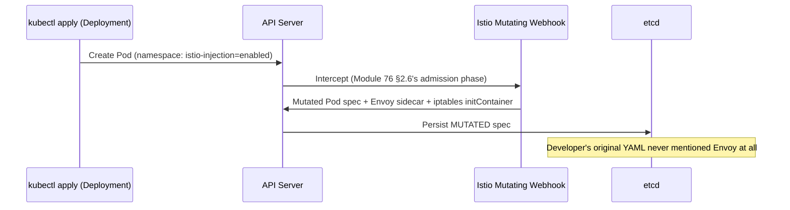
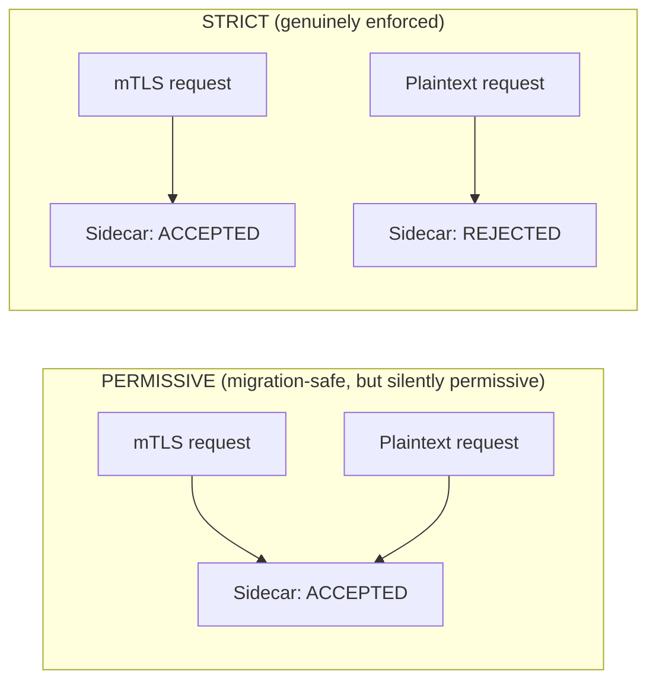
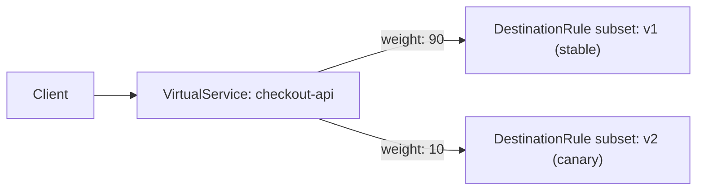
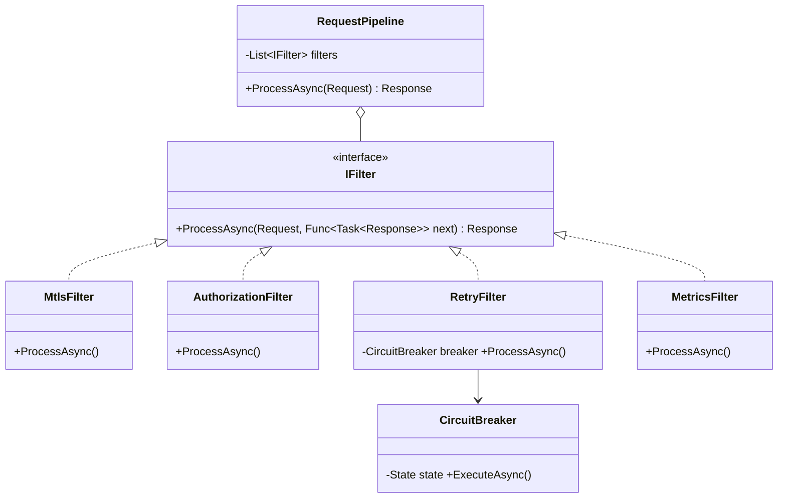
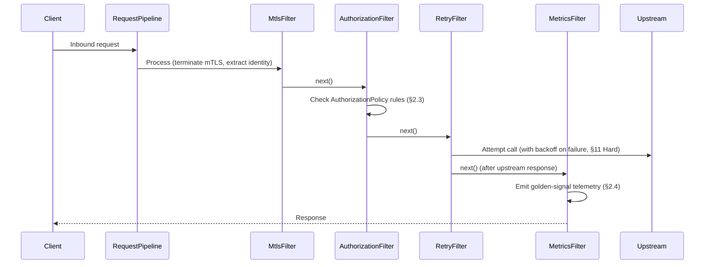

# Module 79 — Kubernetes: Service Mesh & Advanced Networking — Istio, Linkerd & mTLS

> Domain: Kubernetes | Level: Beginner → Expert | Prerequisite: [[01-Architecture-ControlPlane-Pods-Deployments]] (§2.3's sidecar pattern is the exact mechanism a service mesh's data plane uses), [[04-Configuration-Security-ConfigMaps-Secrets-RBAC-PodSecurity]] (§2.6 predicted this module's mechanism explicitly: "Istio's automatic sidecar injection... works mechanically via a mutating webhook"), [[../21-AWS/07-Containers-Microservices-ECS-EKS-Fargate]] and [[../22-Azure/07-Containers-Microservices-AKS-ContainerApps-Dapr]] (App Mesh and Dapr are this module's cloud-native/broader-scope siblings — this module covers the portable, open-source, Envoy-based mainstream)
>
> **Note on this module's template:** this is the first module written against the full, corrected 18-section spec (see `CLAUDE.md`) — 40 interview questions (10 per tier, 5 parts each) and fully-authored §§12–17, rather than the compressed format used in Modules 1–78.

---

## 1. Fundamentals

**What:** A service mesh is a dedicated infrastructure layer that manages service-to-service communication — traffic routing, mutual TLS, retries/timeouts/circuit-breaking, and telemetry — transparently, without requiring changes to application code. It's implemented as a **data plane** (a proxy, most commonly Envoy for Istio or a lightweight Rust micro-proxy for Linkerd, deployed as a sidecar container in every Pod per Module 73 §2.3's shared-network-namespace mechanism) and a **control plane** (Istio's `istiod`, Linkerd's control-plane components) that configures every data-plane proxy centrally.

**Why:** Modules 63 §2.4 and 71 §2.3 already introduced the sidecar pattern via App Mesh (AWS-native) and Dapr (broader application-level scope) — Istio and Linkerd are the mainstream, portable, cloud-agnostic implementations of the same underlying pattern, and are what most organizations actually mean when they say "service mesh" in an interview context. A Principal Engineer needs to know not just that sidecars exist, but the specific mechanics (sidecar injection, mTLS certificate rotation, declarative traffic-splitting) that make a mesh operationally trustworthy versus merely present.

**When:** When an organization has enough independently-deployed services that duplicating retry/mTLS/observability logic per-service (in every language/framework in use) becomes a genuine, recurring maintenance burden — directly the same complexity-matching threshold Module 63 §2.1 established for ECS-vs-EKS ("don't adopt the more complex tool without an articulated requirement"), now applied to "do we need a mesh at all."

**How (30,000-ft view):**
```
Control Plane (istiod / Linkerd control plane):
  - Watches Kubernetes API for Services, Deployments, and mesh-specific CRDs
    (VirtualService, DestinationRule, PeerAuthentication, AuthorizationPolicy)
  - Acts as a Certificate Authority, issuing short-lived mTLS certs per workload identity
  - Pushes configuration to every data-plane proxy via a discovery protocol (xDS for Envoy)

Data Plane (Envoy sidecar / Linkerd micro-proxy, injected per Pod):
  - Intercepts ALL inbound/outbound traffic for its Pod transparently (iptables redirect)
  - Terminates/originates mTLS, applies routing rules, retries, circuit breaking
  - Emits golden-signal telemetry (latency, traffic, errors, saturation) automatically
```

---

## 2. Deep Dive

### 2.1 Sidecar Injection — the Mutating Admission Webhook Module 76 §2.6 Predicted
Istio's sidecar container is added to a Pod spec via a **mutating admission webhook** (Module 76 §2.6's exact mechanism, named there specifically as the underlying implementation of Istio's sidecar injection before this module covered it in full) — a namespace labeled `istio-injection=enabled` causes every subsequent Pod creation in that namespace to be intercepted by the webhook *before* persistence to etcd (Module 76 §2.6's request lifecycle), which mutates the Pod spec to add the Envoy container, an `initContainer` configuring iptables redirect rules, and shared volumes for certificate material. This is why sidecar injection is often invisible to a developer writing a plain Deployment manifest — the mesh's actual data-plane presence is entirely a product of namespace-level configuration and webhook mutation, not anything declared in the Deployment YAML itself.

### 2.2 mTLS — Automatic Mesh-Wide Mutual TLS, and PERMISSIVE Mode's Silent-Gap Risk
`istiod` acts as a Certificate Authority, issuing short-lived X.509 certificates to each workload (identity derived from its ServiceAccount, Module 76 §2.4) and continuously rotating them — every sidecar-to-sidecar connection is automatically upgraded to mutual TLS with zero application code changes. **PeerAuthentication** policies control enforcement mode: **PERMISSIVE** (accepts both mTLS *and* plaintext — the sensible default during incremental mesh migration, so not-yet-injected workloads aren't broken) versus **STRICT** (mTLS only, plaintext connections rejected). This is this domain's now-familiar pattern recurring a fifth time (Modules 74/75/76/78): a PeerAuthentication policy's mere presence, in PERMISSIVE mode, looks like "we have mTLS enabled" on a dashboard while still silently accepting unencrypted plaintext traffic indefinitely if the migration to STRICT is never completed — structurally identical to Module 76 §2.5's Pod Security Admission `audit`/`enforce` gap.

### 2.3 Declarative Traffic Management — VirtualService/DestinationRule, Extending Module 17's Resilience Patterns Into the Infrastructure Layer
Istio's `VirtualService` (routing rules — host/path matching, weighted traffic splitting for canary releases) and `DestinationRule` (subset definitions, load-balancing policy, circuit-breaking/outlier-detection configuration) let a team declare canary rollouts (90%/10% weighted split to a new version), retries, timeouts, and circuit breakers **declaratively, at the mesh layer** — directly the same resilience patterns Module 17 §2 (Microservices resilience) required application-level library code (Polly in .NET, resilience4j elsewhere) to implement, now applied transparently outside any single service's codebase, in a language-agnostic, centrally-governable way.

### 2.4 Mesh-Level Observability — Automatic Golden Signals, Complementary to (Not Competing With) Application Insights
Because every request already flows through an Envoy sidecar, the mesh emits the four golden signals (latency, traffic, errors, saturation) automatically, per-service and per-route, with zero application instrumentation — a materially different layer than Module 72 §2.1's Application Insights auto-instrumentation (an application-level SDK correlating logs/traces/metrics within the app's own process): mesh-level telemetry sees every hop's network-level behavior even for services that have no APM SDK at all, while APM tooling sees inside a request's actual application logic — the two are complementary, not substitutable, and a mature observability stack layers both.

### 2.5 Istio vs. Linkerd vs. Dapr vs. App Mesh — a Decision Framework, Not a Single "Best" Answer
**Istio** (Envoy-based) has the largest feature surface (fine-grained traffic management, WASM extensibility) at the cost of real operational complexity and control-plane resource overhead. **Linkerd** deliberately trades feature breadth for simplicity and a materially lighter, purpose-built Rust micro-proxy with lower per-Pod resource tax — the right choice when a team's actual requirement is "mTLS and basic traffic splitting, reliably, with minimal operational burden," not the full Istio feature set. **Dapr** (Module 71 §2.3) has a *broader* scope than either — application-level building blocks (state, pub/sub) beyond pure networking — at the cost of requiring explicit application-level API calls rather than fully transparent interception. **App Mesh** (Module 63 §2.4) is AWS-native only, narrower in scope, and a poor choice for any multi-cloud or portability requirement. Directly extending Module 63 §2.1's complexity-matching discipline: default to the narrowest tool satisfying an *articulated* requirement (often Linkerd, or no mesh at all) rather than Istio's full feature set "to be safe."

### 2.6 Ambient Mesh — Removing the Per-Pod Sidecar Entirely
Istio's newer **Ambient** mode removes the traditional per-Pod sidecar in favor of a shared, per-Node proxy (**ztunnel**, handling L4/mTLS for every Pod on that Node) plus an optional per-namespace **waypoint proxy** (handling L7 features like traffic splitting, only where actually needed) — directly addressing Module 73 §7's "the control-plane/data-plane tooling itself is a capacity-planned resource" concern, since a per-Node shared proxy has materially lower aggregate resource overhead than one Envoy sidecar per Pod, at the cost of weaker per-Pod isolation (a compromised Node's ztunnel handles every co-located Pod's traffic, versus a sidecar model's per-Pod-isolated blast radius) — a genuine, explicit trade-off a Principal Engineer should evaluate against the specific isolation guarantees a workload actually requires, not adopt reflexively as "newer is better."

---

## 3. Visual Architecture

### Sidecar Injection via Mutating Webhook (§2.1)


### mTLS PERMISSIVE vs. STRICT (§2.2)


### Weighted Canary Routing via VirtualService (§2.3)


## 4. Production Example

**Problem:** A mid-sized fintech platform migrating to Istio needed mTLS across all internal service-to-service traffic to satisfy a PCI-DSS control requiring encryption of cardholder data in transit, even within the internal network.

**Architecture:** The platform team adopted Istio incrementally, following the widely-recommended PERMISSIVE-then-STRICT rollout (§2.2) — enabling sidecar injection namespace-by-namespace, validating no traffic broke under PERMISSIVE mode (which accepts both mTLS and plaintext), with an explicit plan to flip every namespace to STRICT once all its traffic sources were confirmed mesh-injected.

**Implementation:** The PERMISSIVE-mode rollout across 40+ namespaces took several months, tracked via a spreadsheet rather than an automated system. Several namespaces reached "looks complete" status and were deprioritized as the team moved to other work, with the STRICT-mode flip left as a follow-up task that, for a cluster of this size, never received dedicated tracking.

**Trade-offs:** PERMISSIVE mode was the correct initial choice (a hard STRICT cutover from day one would have broken any traffic source not yet mesh-injected, a far worse outage risk) — but the team's tracking mechanism (a spreadsheet, not an automated, continuously-verified check) meant "PERMISSIVE" silently became the de facto permanent state for a meaningful fraction of namespaces, not a genuinely temporary migration stage.

**Lessons learned:** A subsequent PCI audit discovered that 9 of the 40+ namespaces were still in PERMISSIVE mode more than a year after the mesh rollout began, meaning plaintext, unencrypted intra-cluster traffic remained silently possible in exactly the namespaces the mesh adoption was meant to protect — a direct, confirmed recurrence of this domain's now-repeated "object presence ≠ enforced reality" pattern (Modules 74/75/76/78), this time for PeerAuthentication specifically. The fix mirrored Module 76 §Advanced Q1's structural remedy exactly: an automated, recurring scan flagging any namespace still in PERMISSIVE mode past a declared migration deadline, plus a synthetic negative test (deliberately attempting a plaintext connection into a namespace that should be STRICT, asserting it's actually rejected) — never trusting the PeerAuthentication object's declared mode alone as evidence of genuine enforcement.

## 5. Best Practices
- Track every PERMISSIVE-to-STRICT mTLS migration with an explicit, monitored deadline and automated verification — never an open-ended spreadsheet task (§2.2, §4).
- Default to the narrowest mesh (or no mesh) satisfying an articulated requirement — Linkerd or no mesh for "just mTLS and basic routing," Istio only when its fuller feature set is genuinely needed (§2.5).
- Use VirtualService/DestinationRule for canary/resilience patterns instead of duplicating retry/circuit-breaker logic in every service's own codebase (§2.3).
- Layer mesh-level telemetry with application-level APM (Module 72) — they observe different layers and neither substitutes for the other (§2.4).
- Evaluate Ambient mode's reduced-isolation trade-off explicitly against a workload's actual security requirements before adopting it purely for resource savings (§2.6).

## 6. Anti-patterns
- Treating a PERMISSIVE PeerAuthentication policy as equivalent to "mTLS is enforced," without a tracked, verified path to STRICT (§2.2, §4).
- Adopting Istio's full feature set by default without evaluating whether Linkerd's simpler model already satisfies the actual requirement (§2.5).
- Assuming a Pod's own manifest reflects its full runtime behavior, without accounting for mutating-webhook-injected sidecars changing that behavior invisibly (§2.1).
- Re-implementing retry/circuit-breaker logic in every service's own language-specific library when the mesh already provides it declaratively (§2.3).
- Relying solely on mesh-level telemetry and assuming it substitutes for application-level tracing of business logic (§2.4).

---

## 10. Interview Questions

### Basic (10)

1. **Q: What are the two main components of a service mesh's architecture?**
   **A:** The data plane (proxies, typically Envoy, deployed as sidecars) and the control plane (`istiod` for Istio), which configures every data-plane proxy centrally.
   **Why correct:** This is the foundational architectural split every service mesh implementation shares, regardless of specific product.
   **Common mistakes:** Describing only the sidecar without mentioning the control plane that actually configures it.
   **Follow-ups:** "How does the control plane push configuration to the data plane?" (xDS protocol for Envoy.)

2. **Q: How does a Pod get its Envoy sidecar without the developer adding it to the Deployment manifest?**
   **A:** A mutating admission webhook (Module 76 §2.6) intercepts Pod creation in an injection-enabled namespace and mutates the Pod spec to add the sidecar before persistence.
   **Why correct:** This is the exact, specific mechanism — not "Istio adds it somehow."
   **Common mistakes:** Assuming the sidecar must be manually declared in every Deployment YAML.
   **Follow-ups:** "What Kubernetes mechanism is this webhook an instance of?" (Admission controllers, Module 76 §2.6.)

3. **Q: What is the difference between PERMISSIVE and STRICT mTLS mode?**
   **A:** PERMISSIVE accepts both mTLS and plaintext traffic; STRICT accepts only mTLS, rejecting plaintext.
   **Why correct:** Directly defines both enforcement levels and their practical difference.
   **Common mistakes:** Assuming PERMISSIVE means "no mTLS" rather than "mTLS available but not required."
   **Follow-ups:** "Why would a team deliberately choose PERMISSIVE initially?" (Safe incremental migration, §2.2.)

4. **Q: What does a VirtualService do in Istio?**
   **A:** Declares HTTP routing rules — host/path matching and weighted traffic splitting between service versions.
   **Why correct:** Names the object's specific, primary purpose.
   **Common mistakes:** Confusing VirtualService (routing rules) with DestinationRule (subset/policy definitions).
   **Follow-ups:** "What does a DestinationRule add on top of a VirtualService?" (Subsets, load-balancing policy, circuit breaking.)

5. **Q: Name two service mesh implementations besides Istio.**
   **A:** Linkerd and (in the AWS-specific context) App Mesh; Dapr is a related but broader-scoped alternative.
   **Why correct:** Demonstrates awareness of the ecosystem, not just one product.
   **Common mistakes:** Treating "Istio" and "service mesh" as synonymous.
   **Follow-ups:** "When would you choose Linkerd over Istio?" (§2.5's simplicity-vs-features trade-off.)

6. **Q: What telemetry does a service mesh provide automatically, without application code changes?**
   **A:** The four golden signals — latency, traffic, errors, and saturation — per-service and per-route.
   **Why correct:** Names the specific, standard signal set.
   **Common mistakes:** Assuming mesh telemetry includes application-level business-logic tracing (it doesn't, per §2.4).
   **Follow-ups:** "How does this differ from Application Insights auto-instrumentation?" (§2.4's layer distinction.)

7. **Q: What is Istio's Ambient mode?**
   **A:** A sidecar-less architecture using a shared per-Node proxy (ztunnel) plus optional per-namespace waypoint proxies for L7 features, instead of one Envoy sidecar per Pod.
   **Why correct:** Correctly identifies both components and the "no per-Pod sidecar" defining property.
   **Common mistakes:** Assuming Ambient mode removes proxying entirely rather than restructuring where the proxy runs.
   **Follow-ups:** "What trade-off does Ambient mode introduce?" (Weaker per-Pod isolation, §2.6.)

8. **Q: What identity does istiod use to issue an mTLS certificate to a workload?**
   **A:** The workload's Kubernetes ServiceAccount (Module 76 §2.4).
   **Why correct:** Connects mesh identity directly to the Kubernetes-native identity primitive already established.
   **Common mistakes:** Assuming certificates are issued per-Pod-IP rather than per logical workload identity.
   **Follow-ups:** "Why is ServiceAccount-based identity more stable than Pod-IP-based identity?" (Pods are ephemeral, Module 73 §2.3; ServiceAccounts persist.)

9. **Q: What is an AuthorizationPolicy, and how does it differ from a Kubernetes NetworkPolicy?**
   **A:** AuthorizationPolicy is an L7, identity-aware access-control rule (which ServiceAccount may call which specific route); NetworkPolicy is L3/L4, IP/port-level, CNI-enforced.
   **Why correct:** Correctly distinguishes both the layer (L7 vs. L3/L4) and the granularity.
   **Common mistakes:** Treating the two as redundant rather than complementary.
   **Follow-ups:** "Name all three distinct policy layers a mesh-plus-Kubernetes security review should cover." (NetworkPolicy, AuthorizationPolicy, RBAC — §8.)

10. **Q: Does adopting a service mesh require changing application code?**
    **A:** No — the mesh's core value is transparent interception via the sidecar; retries, mTLS, and telemetry are added without touching application code.
    **Why correct:** States the mesh's defining value proposition accurately.
    **Common mistakes:** Confusing this with Dapr (Module 71 §2.3), which does require explicit application-level API calls for its building blocks.
    **Follow-ups:** "Contrast this with how Dapr requires application integration." (Module 71 §2.3.)

### Intermediate (10)

1. **Q: Why is a Pod's declared manifest an incomplete description of its actual runtime behavior in a mesh-enabled cluster?**
   **A:** The mutating admission webhook (§2.1) injects the sidecar container, iptables redirect rules, and certificate volumes at admission time — none of which appear in the developer's original YAML.
   **Why correct:** Directly explains the specific mechanism causing the manifest/runtime gap.
   **Common mistakes:** Assuming `kubectl get pod -o yaml` after creation would also omit the injected content (it wouldn't — the *persisted* spec includes the mutation; only the *original, submitted* manifest is incomplete).
   **Follow-ups:** "How would you verify a specific Pod actually has a sidecar injected?" (Check the persisted spec's container list, or `istioctl proxy-status`.)

2. **Q: Why is PERMISSIVE mode's risk described as structurally identical to Module 76's Pod Security Admission enforcement-mode gap?**
   **A:** Both involve a policy object that is present, syntactically valid, and visible on a dashboard, while providing zero actual blocking enforcement in a specific mode (PERMISSIVE / audit-warn) — the object's existence is not evidence of enforcement.
   **Why correct:** Names the precise structural parallel (this domain's recurring pattern) rather than a surface-level similarity.
   **Common mistakes:** Treating this as a coincidence rather than a named, recurring category this course has tracked across Modules 74-78.
   **Follow-ups:** "What automated check would catch this gap, per Module 76's fix?" (A scan flagging namespaces past their declared STRICT-migration deadline, plus a synthetic negative test.)

3. **Q: Why does VirtualService-based canary routing represent "the same resilience patterns as Module 17, applied at a different layer"?**
   **A:** Weighted traffic splitting, retries, and circuit breaking are the identical concerns Module 17's application-level resilience libraries (Polly, resilience4j) addressed — the mesh applies them declaratively, transparently, and language-agnostically instead of requiring per-service library code.
   **Why correct:** Correctly identifies the concern is unchanged; only the implementation layer moved.
   **Common mistakes:** Assuming mesh-level traffic management is a fundamentally new capability rather than a relocation of an existing one.
   **Follow-ups:** "What's lost by moving this logic out of application code?" (Fine-grained, business-logic-aware retry decisions the mesh can't make.)

4. **Q: Why is mesh-level telemetry described as complementary to, not a substitute for, Application Insights-style APM (Module 72)?**
   **A:** Mesh telemetry observes network-level behavior at every hop, even for services with no APM SDK; APM tooling observes inside a request's actual application logic — neither can see what the other sees.
   **Why correct:** Correctly identifies the layer distinction (network vs. in-process) rather than treating them as redundant.
   **Common mistakes:** Assuming mesh adoption eliminates the need for application-level instrumentation.
   **Follow-ups:** "Give a specific failure mode only APM, not mesh telemetry, would catch." (A slow database query inside a service's own request-handling code — invisible to the mesh, which only sees the service's external latency.)

5. **Q: Why should a team default to Linkerd (or no mesh) rather than Istio absent an articulated requirement for Istio's fuller feature set?**
   **A:** Directly Module 63 §2.1's complexity-matching discipline — adopting the more complex, higher-overhead option without a specific requirement it alone satisfies is an unforced trade-off with no corresponding benefit.
   **Why correct:** Applies an already-established, named principle rather than a generic "simpler is better" platitude.
   **Common mistakes:** Choosing Istio reflexively because it's the most well-known name in the space.
   **Follow-ups:** "Name one concrete requirement that would justify Istio over Linkerd." (WASM-based custom filter extensibility, or very fine-grained traffic-shaping needs Linkerd doesn't support.)

6. **Q: Why does Ambient mode's ztunnel represent a genuine security trade-off, not a strictly-better replacement for sidecars?**
   **A:** A shared per-Node proxy means a compromised ztunnel affects every co-located Pod's traffic, versus a sidecar model's per-Pod-isolated blast radius — resource efficiency is gained at the cost of weaker isolation.
   **Why correct:** Correctly identifies the specific security dimension traded away, not just "it's different."
   **Common mistakes:** Treating Ambient mode as an unambiguous upgrade because it's newer.
   **Follow-ups:** "For which workload profile would you NOT recommend Ambient mode?" (Highly sensitive, strict-isolation-requiring workloads, e.g., multi-tenant clusters with adversarial tenants.)

7. **Q: Why is AuthorizationPolicy described as providing finer granularity than NetworkPolicy?**
   **A:** NetworkPolicy operates at L3/L4 (IP/port, namespace/label selectors); AuthorizationPolicy operates at L7 with cryptographically-verified workload identity, permitting rules like "only ServiceAccount X may call `POST /checkout`," a distinction NetworkPolicy cannot express at all.
   **Why correct:** Gives a concrete example demonstrating the granularity gap, not just an abstract "L7 is finer than L4" claim.
   **Common mistakes:** Assuming NetworkPolicy alone is sufficient for genuinely fine-grained, per-route access control.
   **Follow-ups:** "Does AuthorizationPolicy require mTLS to be trustworthy?" (Yes — its identity claims depend on mTLS-verified workload identity; without STRICT mTLS, identity could be spoofed via plaintext.)

8. **Q: Why does under-provisioned sidecar CPU limits specifically cause tail-latency (not average-latency) degradation?**
   **A:** CPU throttling under a resource limit primarily manifests during traffic bursts/spikes (when the sidecar's actual CPU demand exceeds its limit), which disproportionately affects the slowest percentile of requests rather than uniformly shifting the whole distribution.
   **Why correct:** Correctly connects the specific mechanism (throttling under burst load) to the specific observed symptom (tail, not average, latency).
   **Common mistakes:** Assuming any resource under-provisioning uniformly raises average latency.
   **Follow-ups:** "What metric would you check first to confirm this diagnosis?" (Envoy/sidecar container CPU throttling metrics, cross-referenced against P99 latency timing.)

9. **Q: Why is istiod's config-push capacity described as a genuine scaling bottleneck at high cluster scale, per §9?**
   **A:** Every sidecar must receive updated configuration via xDS whenever mesh config or the service topology changes — at very large Pod counts, this push volume and the control plane's own processing capacity become real, measurable constraints, directly Module 73 §7's shared-control-plane-capacity pattern recurring at the mesh layer.
   **Why correct:** Names the specific mechanism (xDS push volume) rather than a vague "the control plane might be slow."
   **Common mistakes:** Assuming mesh control-plane scaling is a solved, non-issue at any cluster size.
   **Follow-ups:** "How does Ambient mode change this specific bottleneck?" (Fewer proxies overall to push config to, at the cost of the ztunnel/waypoint architecture's own different scaling characteristics.)

10. **Q: Why would a Principal Engineer explicitly enumerate all three policy layers (NetworkPolicy, AuthorizationPolicy, RBAC) in a security review rather than checking just one?**
    **A:** Each governs a genuinely different resource/traffic universe (L3/L4 network traffic; L7 identity-aware service-to-service calls; the Kubernetes API itself) — a gap in any one is independently exploitable regardless of how well-configured the other two are, directly extending Module 76 §2.3's RBAC-vs-cloud-IAM dual-system framing to a third layer.
    **Why correct:** Correctly generalizes an already-established pattern (independent authorization systems requiring independent review) to a new context.
    **Common mistakes:** Assuming strong NetworkPolicy configuration compensates for a missing or absent AuthorizationPolicy.
    **Follow-ups:** "Give a concrete attack a strong NetworkPolicy alone would fail to prevent." (A compromised, mesh-injected Pod within an allowed namespace calling an unauthorized route on another service it has network-level access to but no legitimate business reason to call.)

### Advanced (10)

1. **Q: Diagnose §4's incident from first principles, and design the specific structural fix preventing PERMISSIVE-to-STRICT migrations from silently stalling indefinitely.**
   **A:** Root cause: PERMISSIVE mode was tracked via an untracked, unverified spreadsheet with no forcing function, letting "looks complete" namespaces silently remain in a permanently temporary state. Fix: an automated, recurring scan flagging any PeerAuthentication policy still in PERMISSIVE mode past a declared migration deadline (directly Module 76 §Advanced Q1's structural pattern), paired with a synthetic negative test explicitly attempting a plaintext connection into a nominally-STRICT namespace and asserting rejection.
   **Why correct:** Identifies both the tracking-mechanism root cause and the two-part fix (deadline enforcement + runtime verification) this course has established as the correct response to this recurring pattern class.
   **Common mistakes:** Proposing only "switch everyone to STRICT immediately," ignoring that abrupt cutover risk is exactly what PERMISSIVE mode was correctly designed to avoid.
   **Follow-ups:** "How would you sequence the STRICT cutover across the 9 stalled namespaces safely?" (One at a time, verifying zero plaintext-dependent traffic sources remain via access logs before each individual flip.)

2. **Q: A team argues that since Istio provides mTLS automatically, their application no longer needs any TLS termination logic of its own, even at the cluster's external ingress boundary. Evaluate this claim.**
   **A:** Mesh mTLS covers *internal*, sidecar-to-sidecar traffic only — external, internet-facing traffic terminates at the Ingress/Gateway boundary (Module 74 §2.4), which requires its own TLS certificate management (often independent of the mesh's internal CA) — conflating internal mesh mTLS with external-facing TLS is a scope error.
   **Why correct:** Correctly distinguishes internal mesh-scope encryption from external-facing TLS, a genuinely separate concern with separate certificate management.
   **Common mistakes:** Assuming "mTLS is on" mesh-wide implies the entire request path, including from the public internet, is covered by the same mechanism.
   **Follow-ups:** "How does an Istio Gateway relate to a standard Kubernetes Ingress object?" (A parallel, Istio-native alternative to Ingress for mesh-integrated external traffic entry.)

3. **Q: Design a load-testing methodology validating that a mesh-enabled service's sidecar resource limits are correctly sized, extending Module 77's full-chain-latency load-testing lesson to this module's §14 CPU-throttling scenario.**
   **A:** Load-test under genuinely bursty (not steady-state) traffic specifically, since sidecar CPU throttling manifests during burst conditions (§Intermediate Q8) — measure P99 latency and sidecar-specific CPU-throttling metrics together, not application-level latency alone, and explicitly test at the sidecar's *configured* resource limit, not an unconstrained/unlimited test environment (directly Module 77 §4's "steady-state, unconstrained testing masks the real bottleneck" pattern).
   **Why correct:** Correctly generalizes an already-established methodology (test the actual constrained condition, not an idealized one) to this module's specific failure mode.
   **Common mistakes:** Load-testing application logic alone without instrumenting sidecar-level resource metrics specifically.
   **Follow-ups:** "What's the specific metric distinguishing 'application is slow' from 'sidecar is throttled'?" (Envoy's own CPU-throttling/queuing metrics versus application-level processing-time metrics, compared side by side.)

4. **Q: A workload requires strict, guaranteed per-Pod network isolation for regulatory reasons. Should this team adopt Istio Ambient mode? Justify the recommendation using §2.6's trade-off.**
   **A:** No — Ambient's shared per-Node ztunnel model weakens per-Pod isolation relative to traditional sidecars (a compromised ztunnel affects every co-located Pod), which directly conflicts with a "guaranteed per-Pod isolation" regulatory requirement; the traditional sidecar model (or dedicated Node pools per regulatory boundary, directly Module 77 §2.3's taint/toleration dedication pattern) is the more defensible choice here despite its higher resource overhead.
   **Why correct:** Correctly applies §2.6's explicitly-stated trade-off to a concrete decision scenario with a stated constraint.
   **Common mistakes:** Recommending Ambient mode purely for its resource-efficiency benefit without weighing it against the stated isolation requirement.
   **Follow-ups:** "What alternative approach combines Ambient's efficiency with stronger isolation for a specific subset of sensitive workloads?" (Waypoint proxies scoped per-namespace, combined with dedicated Node pools for the most sensitive workloads specifically.)

5. **Q: Critique the following claim: "Since our AuthorizationPolicy correctly restricts which ServiceAccounts may call our payment service's API, we no longer need a NetworkPolicy for that namespace."**
   **A:** Overstated — AuthorizationPolicy's guarantees depend entirely on mTLS-verified identity (requiring STRICT mode, per Advanced Q7) and only govern *mesh-aware* traffic; a NetworkPolicy provides an independent, CNI-enforced L3/L4 boundary that isn't contingent on the mesh's own correct configuration or a workload being mesh-injected at all — removing NetworkPolicy protection entirely relies on the mesh layer having zero misconfiguration, a single point of failure this course's "independent, complementary layers" discipline (§8) specifically argues against.
   **Why correct:** Correctly identifies that AuthorizationPolicy's protection is contingent on mesh-specific preconditions, making it an insufficient sole layer of defense.
   **Common mistakes:** Treating AuthorizationPolicy and NetworkPolicy as redundant rather than defense-in-depth layers with different failure-independence properties.
   **Follow-ups:** "What specific mesh misconfiguration would make AuthorizationPolicy alone insufficient?" (A namespace accidentally excluded from sidecar injection, or left in PERMISSIVE mode, per §2.2's exact gap.)

6. **Q: Design the specific decision framework for choosing between mesh-level circuit breaking (DestinationRule outlier detection) and application-level circuit breaking (Module 17's Polly-based approach) for a given service.**
   **A:** Favor mesh-level circuit breaking for generic, transport-level failure signals (connection errors, 5xx rates) that apply uniformly regardless of business logic; favor application-level circuit breaking when the trip condition requires business-logic awareness the mesh cannot see (e.g., "trip specifically when this *particular* downstream call's response indicates a business-rule failure, not merely an HTTP error") — the two aren't mutually exclusive and are commonly layered, with the mesh providing a coarse, uniform safety net and application-level logic providing finer, business-aware control.
   **Why correct:** Correctly identifies the actual differentiator (what information is available at each layer) rather than treating the choice as arbitrary preference.
   **Common mistakes:** Assuming mesh-level circuit breaking makes application-level resilience libraries entirely redundant.
   **Follow-ups:** "Give an example only application-level circuit breaking could implement correctly." (Tripping based on a specific business-domain error code embedded in an otherwise-200-OK response body, invisible to the mesh's transport-level view.)

7. **Q: Explain why this module's PERMISSIVE-mode finding (§2.2, §4) is the fifth instance of this domain's "object presence ≠ enforced reality" pattern, and what this recurrence implies about evaluating any future, unfamiliar Kubernetes-ecosystem tool.**
   **A:** The pattern has now recurred across NetworkPolicy/CNI enforcement (Module 74), reclaim policy (Module 75), Pod Security Admission (Module 76), Helm's non-reconciling drift (Module 78), and now PeerAuthentication mode — each instance shares the structure of a declared, syntactically-valid Kubernetes object whose actual runtime enforcement depends on a separate, pluggable, independently-verifiable condition the API server itself doesn't introspect; the implication is that any new Kubernetes-ecosystem tool with a "policy" or "mode" concept should be evaluated with the explicit, standing question "does this object's presence guarantee enforcement, or does enforcement depend on a separate condition I must independently verify," before trusting it in a security-relevant context.
   **Why correct:** Correctly names all five specific recurrences by module and generalizes the standing verification discipline this course has built across the domain.
   **Common mistakes:** Treating this module's finding as a novel, first-time discovery rather than an expected, predictable instance of an already-established pattern.
   **Follow-ups:** "Predict, by this pattern, a likely gap in a Kubernetes tool this course hasn't yet covered." (Any tool with an audit/dry-run/monitor mode distinct from its actual enforcement mode — a reasonable, generalizable prediction.)

8. **Q: A team wants to adopt WASM-based custom Envoy filters for a highly specific, proprietary request-transformation requirement no built-in Istio feature supports. What operational cost does this decision introduce beyond the initial development effort, and how should a Principal Engineer weigh it?**
   **A:** Custom WASM filters introduce an ongoing maintenance surface tightly coupled to the specific Envoy/Istio version in use (WASM ABI compatibility can break across upgrades), a genuinely different risk profile than declarative VirtualService/DestinationRule configuration, which is far more stable across mesh version upgrades — a Principal Engineer should weigh this against whether the proprietary requirement could instead be satisfied at the application layer (a sidecar-adjacent but independently-versioned service, or application-level middleware) with a more predictable upgrade/maintenance cost, reserving custom WASM filters for requirements that genuinely cannot be satisfied any other way.
   **Why correct:** Identifies the specific, non-obvious ongoing cost (version coupling) beyond initial development, and frames the trade-off against a genuine alternative.
   **Common mistakes:** Evaluating only the one-time development cost of a WASM filter without considering its ongoing coupling to mesh version upgrades.
   **Follow-ups:** "What would you require before approving a WASM filter for production use?" (An explicit, documented compatibility-testing step as part of any future mesh version upgrade process — directly this course's recurring "structural, tracked governance, not ad hoc trust" pattern.)

9. **Q: Design the specific monitoring/alerting strategy for detecting a service mesh's own control-plane (istiod) degradation before it silently affects data-plane configuration freshness across the cluster.**
   **A:** Monitor istiod's own xDS config-push success rate and latency-to-propagate (time from a config change to every affected sidecar actually receiving it), plus per-sidecar "config out of date" / connection-to-control-plane-health metrics — alerting specifically on config-propagation lag (not merely istiod's own liveness), since a degraded-but-technically-running istiod could still be silently failing to push timely updates to some subset of sidecars, a category of partial failure a simple liveness check wouldn't catch.
   **Why correct:** Correctly distinguishes control-plane liveness from the actually load-bearing property (timely config propagation to every sidecar), and identifies the specific, non-obvious partial-failure mode worth monitoring.
   **Common mistakes:** Monitoring only istiod's basic up/down health, missing degraded-but-technically-alive partial-failure states.
   **Follow-ups:** "How would a stale sidecar configuration manifest to an end user?" (Traffic routed per outdated VirtualService rules — e.g., a canary rollout's traffic split not actually reflecting the intended, most recently applied percentages.)

10. **As a Principal Engineer establishing service mesh adoption standards for a platform team, design the specific set of standing architectural decisions and governance checks (synthesizing this entire module) required before mesh-wide mTLS is claimed as satisfying a compliance requirement (e.g., PCI-DSS encryption-in-transit).**
    **A:** (1) Mandatory, automated, recurring scanning for any PeerAuthentication policy still in PERMISSIVE mode past its declared migration deadline (§4, Advanced Q1), never relying on manual tracking. (2) A synthetic negative test (a scheduled job attempting a plaintext connection into every nominally-STRICT namespace, asserting rejection) as the actual, ongoing evidence of enforcement, not the policy object's declared mode alone (§2.2). (3) Explicit distinction, documented for the compliance auditor, between mesh-internal mTLS coverage and external-ingress TLS coverage (Advanced Q2) — a compliance claim must specify which traffic paths are actually covered. (4) A three-layer security review (NetworkPolicy, AuthorizationPolicy, RBAC, §8, Intermediate Q10) presented together, since a compliance requirement for "encryption and access control" genuinely spans all three, not mTLS alone. (5) A documented, version-upgrade-tested compatibility process for any custom WASM filters or non-default mesh configuration (Advanced Q8), ensuring compliance-relevant configuration doesn't silently break across a future mesh upgrade.
    **Why correct:** Synthesizes every specific mechanism this module established (PERMISSIVE tracking, synthetic verification, layer distinctions, upgrade-safety) into a coherent, audit-ready governance program, directly mirroring this course's established synthesis pattern (Module 64/72/76/78's capstone-style Q10 answers).
    **Common mistakes:** Presenting mTLS adoption alone as sufficient evidence of compliance, without the verification and scope-boundary documentation an actual auditor would require.
    **Follow-ups:** "How would you present this evidence to a non-technical compliance auditor?" (A plain-language summary of what's covered, what's verified how often, and what the verification's own audit trail looks like — translating the technical governance program into auditor-legible assurance.)

### Expert (10)

1. **Q: Design a multi-cluster mesh topology (two clusters in different Regions, both needing mTLS-secured cross-cluster service calls) and identify the specific additional complexity beyond single-cluster mesh operation.**
   **A:** Multi-cluster Istio requires a shared root CA (or a trust-domain federation) so certificates issued by each cluster's own `istiod` are mutually trusted, plus either a flat network (direct Pod-to-Pod cross-cluster IP routing, an even more demanding version of Module 74 §2.3's CNI flat-network requirement, now spanning Regions) or an East-West gateway pattern (cross-cluster traffic routed through a dedicated mesh-aware gateway rather than requiring direct flat routing) — the East-West gateway approach is generally preferred for its lower networking-infrastructure demand, at the cost of an additional network hop for cross-cluster calls.
   **Why correct:** Correctly identifies the two core additional requirements (trust federation, cross-cluster routing strategy) and the realistic trade-off between the two routing approaches.
   **Common mistakes:** Assuming a shared CA/trust domain is automatic across separately-provisioned clusters without deliberate federation configuration.
   **Follow-ups:** "How does this East-West gateway pattern relate to Module 72's Paired Regions concept?" (Complementary but distinct — Paired Regions is an Azure platform-level DR construct; East-West gateways are the mesh's own cross-cluster traffic-routing mechanism, usable regardless of the underlying cloud's region-pairing model.)

2. **Q: A team's Istio Ambient-mode ztunnel is observed to be a measurable, shared CPU bottleneck across all Pods on a specific, highly-loaded Node. Diagnose the architectural implication and design a fix, extending §2.6's isolation trade-off to a genuinely different (performance, not security) failure mode.**
   **A:** Because ztunnel is shared per-Node (§2.6), it inherits the same "noisy neighbor" risk this course has associated with any shared, multi-tenant resource — one Pod's traffic-heavy workload can degrade every co-located Pod's network performance via ztunnel contention, a genuinely different failure mode than traditional per-Pod sidecars (where each Pod's own sidecar resource limits isolate that Pod's own network-processing cost) — the fix requires either explicit per-Node capacity planning accounting for aggregate cross-Pod traffic load (not just per-Pod estimates), or selectively adopting per-Pod sidecars specifically for the highest-traffic workloads while keeping Ambient mode for lower-traffic ones, a hybrid approach trading Ambient's full resource-efficiency benefit for isolation where it specifically matters.
   **Why correct:** Correctly identifies the noisy-neighbor risk as the performance-layer analog of §2.6's already-established security-isolation trade-off, and proposes a realistic, targeted hybrid mitigation.
   **Common mistakes:** Assuming Ambient mode's resource savings are unconditionally positive without considering shared-resource contention risk under skewed, uneven load distribution.
   **Follow-ups:** "How would you detect this specific failure mode in production before a customer-facing incident?" (Per-Node ztunnel CPU/latency metrics correlated against per-Pod traffic volume, watching for cross-Pod latency correlation during a single Pod's traffic spike.)

3. **Q: Design the full request-path latency budget for a mesh-enabled, multi-hop microservices call chain (API Gateway → Service A → Service B → Database), explicitly accounting for every sidecar hop's overhead, and identify where this budget would be most sensitive to a mesh-adoption decision.**
   **A:** Each service-to-service hop (Gateway→A, A→B) adds two sidecar traversals (egress from the caller's sidecar, ingress at the callee's sidecar) — for a 3-hop chain, this is 4 additional proxy traversals beyond the "bare" network calls, each contributing real (if individually small) latency (§7); the budget is most sensitive at the *deepest, most fan-out-heavy* part of a call chain, where a small per-hop overhead compounds across many sequential or parallel calls — a Principal Engineer designing a genuinely latency-critical, deep call chain should explicitly budget mesh overhead per hop (not assume it's uniformly negligible) and consider whether the deepest, most latency-sensitive segment of the chain specifically warrants a mesh-bypass (direct, non-meshed communication) exception, weighed against the resilience/observability loss that exception introduces.
   **Why correct:** Correctly quantifies the compounding nature of per-hop overhead across a multi-service chain and identifies where the trade-off is most consequential.
   **Common mistakes:** Treating mesh overhead as a fixed, small, universally-negligible constant regardless of call-chain depth.
   **Follow-ups:** "What's the risk of granting a mesh-bypass exception for one specific hop?" (Loses that hop's mTLS/authorization/observability coverage — precisely the "three-layer security" gap Advanced Q5 warned against, now self-inflicted for a performance reason.)

4. **Q: A Principal Engineer must decide whether to build a fully custom Envoy WASM filter or advocate for an application-level change to satisfy a new compliance requirement (redacting a specific PII field from all outbound logs mesh-wide). Design the decision and its governance implications.**
   **A:** A WASM filter applied mesh-wide is architecturally attractive for consistency (one enforcement point covering every service, regardless of language/team, versus requiring every team to implement redaction independently) — but per Advanced Q8's version-coupling risk, and given this is a *compliance-critical* control, the correct governance response is treating the WASM filter itself as a first-class, version-tested artifact with the same rigor this course has applied to any other compliance-relevant automated control (Module 64/72/76's governance-gate pattern) — including mandatory testing against every future mesh version upgrade specifically for this filter's continued correct behavior, not merely "we deployed it once and it presumably still works."
   **Why correct:** Correctly weighs the consistency benefit against the version-coupling risk already established in Advanced Q8, and connects to this course's broader governance-rigor pattern for compliance-critical controls specifically.
   **Common mistakes:** Choosing the WASM approach purely for its architectural elegance without accounting for its specific, ongoing compliance-critical maintenance burden.
   **Follow-ups:** "What would you do differently if this were a nice-to-have optimization instead of a compliance requirement?" (Accept a lighter governance posture — the elevated rigor is specifically warranted by the compliance stakes, not an unconditional rule for all WASM filters.)

5. **Q: Critique the following organizational claim: "Our platform team owns the service mesh, so individual application teams no longer need to think about resilience patterns (retries, timeouts, circuit breaking) at all."**
   **A:** Overstated — the mesh provides generic, transport-level resilience defaults, but genuinely correct resilience behavior still requires business-logic-aware decisions only the owning application team can make (is this specific call idempotent and safe to retry; what timeout is actually appropriate for this specific operation's expected latency profile) — a platform team fully owning mesh configuration without application-team input risks applying uniform, generic defaults that are wrong for specific services' actual requirements (a non-idempotent write operation retried by a generic mesh-level policy that doesn't know it shouldn't be retried is a genuine correctness risk, not merely a suboptimal default) — the correct organizational model is the platform team providing sensible, overridable defaults, with application teams retaining explicit authority to override mesh-level resilience policy for their own services' specific semantics.
   **Why correct:** Correctly identifies the specific correctness risk (non-idempotent operations retried inappropriately) a fully-centralized, application-team-uninvolved resilience-policy model introduces.
   **Common mistakes:** Treating mesh-provided resilience as strictly superior to and a full replacement for any application-team resilience awareness.
   **Follow-ups:** "How would you structure the override mechanism to avoid every team creating ungoverned, inconsistent exceptions?" (A reviewed, documented override process — directly this course's recurring "explicit, tracked exception, not silent divergence" governance pattern.)

6. **Q: Design the specific test suite that would provide genuine confidence a canary rollout's weighted traffic split (§2.3) is behaving correctly in production, beyond confirming the VirtualService object was applied without error.**
   **A:** Directly this domain's recurring "object application success ≠ actual behavior" verification discipline (Modules 74/75/76/78/79) — a genuine confidence-building test suite must include: (1) a statistically-significant sample of actual production request routing, confirming the *observed* traffic split ratio matches the *declared* weights within expected sampling variance (not merely trusting the declared percentages); (2) explicit verification that the canary version's specific error-rate/latency metrics are being correctly attributed to it separately from the stable version's metrics (a mesh-telemetry-tagging correctness check, since a mislabeled canary could silently mask a real regression by blending its metrics into the stable version's aggregate); (3) an automated rollback trigger tied to the canary's own isolated error-rate crossing a threshold, tested via a deliberate, controlled canary-version fault injection to confirm the rollback mechanism itself actually fires correctly.
   **Why correct:** Applies this domain's now well-established "verify actual behavior, don't trust declared configuration" discipline specifically to canary-rollout correctness, identifying three genuinely distinct verification dimensions (routing ratio, metric attribution, rollback-trigger correctness).
   **Common mistakes:** Considering a canary rollout "validated" once the VirtualService applies without a Kubernetes API error, without observing actual traffic behavior.
   **Follow-ups:** "What's the risk if the canary's error metrics are silently blended with the stable version's?" (A real regression in the canary version could be statistically diluted below any alerting threshold by the much larger stable-version traffic volume, delaying detection.)

7. **Q: A Principal Engineer is asked whether adopting a service mesh eliminates the need for the "full autoscaling chain" latency analysis established in Module 77 §2.7. Evaluate this claim.**
   **A:** No — a service mesh and Kubernetes's autoscaling stack address entirely orthogonal concerns (network-layer traffic management/security versus compute-capacity elasticity) — if anything, mesh adoption adds a small, additional per-Pod resource tax (§7) that marginally increases the effective resource footprint Cluster Autoscaler must provision for, meaning Module 77 §2.7's full-chain latency analysis remains equally necessary post-mesh-adoption, now with a slightly larger per-replica resource requirement to account for in that same capacity-planning exercise.
   **Why correct:** Correctly identifies the two systems as orthogonal, and notes the specific, concrete way mesh adoption interacts with (without replacing) the prior module's established analysis.
   **Common mistakes:** Assuming any sufficiently sophisticated infrastructure layer subsumes or replaces unrelated prior architectural concerns.
   **Follow-ups:** "Does mesh-provided circuit breaking reduce the customer-facing impact of Module 77 §4's original incident?" (Partially — a circuit breaker could fail fast and shed load gracefully during the Pending-Pod window, improving *degradation quality* without reducing the underlying capacity-provisioning latency itself.)

8. **Q: Design an incident-response runbook entry specifically for "elevated error rate immediately following a mesh version upgrade," synthesizing this module's version-coupling concerns (Advanced Q8, Expert Q4) into an actionable diagnostic sequence.**
   **A:** (1) Immediately check whether any custom WASM filters or non-default mesh configuration (AuthorizationPolicy, PeerAuthentication) are implicated, since these are the specific artifacts flagged as version-coupling risks (Advanced Q8) — confirm they're still functioning as intended post-upgrade, not merely that the upgrade itself completed without error. (2) Check istiod's own config-propagation health (Advanced Q9) to rule out a partial, in-progress config-propagation lag being mistaken for a genuine post-upgrade regression. (3) If the elevated errors correlate specifically with mTLS handshake failures, check for an mTLS protocol/cipher-suite compatibility change between the old and new mesh version as a specific, known upgrade-risk category. (4) Have a tested rollback plan to the prior mesh version ready as the immediate mitigation if root cause isn't rapidly identified, treating mesh version rollback with the same urgency this course applies to any other production-impacting deployment rollback.
   **Why correct:** Synthesizes this module's specific version-coupling risk findings into a concrete, ordered diagnostic sequence an on-call engineer could actually follow.
   **Common mistakes:** Treating a post-upgrade regression as a generic "something broke" investigation without prioritizing the specific, already-identified risk categories (WASM filters, config propagation, mTLS compatibility) this module established.
   **Follow-ups:** "What pre-upgrade step would have reduced the likelihood of needing this runbook at all?" (A staged canary rollout of the mesh version upgrade itself, applying §2.3's canary pattern reflexively to the mesh's own upgrade process.)

9. **Q: Design a cost-attribution model for a shared Kubernetes platform team to fairly charge back service-mesh resource overhead (sidecar CPU/memory tax) to individual application teams, given that this overhead scales with each team's own traffic volume and Pod count, not the platform team's own choices.**
   **A:** Attribute sidecar resource cost per-namespace (summing each namespace's own sidecars' actual, metered CPU/memory consumption) rather than a flat per-team platform fee, since §7 establishes this overhead genuinely scales with each team's own Pod count and traffic volume — a flat fee would cross-subsidize high-traffic teams at low-traffic teams' expense; additionally, explicitly separate and attribute the *shared* control-plane (istiod) cost differently (a flat or Pod-count-proportional platform-wide allocation, since istiod's own resource consumption isn't cleanly attributable to any single team's specific behavior) — directly extending Module 64 §2.4's cost-optimization-as-architectural-correctness-review theme to mesh-specific resource attribution.
   **Why correct:** Correctly distinguishes per-team-attributable costs (sidecar overhead) from genuinely shared costs (control plane), proposing a fair attribution model for each.
   **Common mistakes:** Applying a single, uniform cost-allocation model to both genuinely per-team and genuinely shared cost components.
   **Follow-ups:** "How would Ambient mode change this cost-attribution model?" (Ztunnel's per-Node, shared-across-co-located-Pods cost is less cleanly per-team-attributable than per-Pod sidecar cost, requiring a different, more approximate attribution approach — e.g., proportional to each team's estimated share of that Node's total traffic.)

10. **As a Principal Engineer responsible for an organization's entire service mesh strategy across many teams and multiple clusters, design the complete governance and technical architecture (synthesizing this entire module, and referencing back to this course's broader recurring themes) required for the mesh to be considered a mature, trustworthy, audit-ready piece of platform infrastructure.**
    **A:** (1) A documented, complexity-matched mesh choice per use case (§2.5) — not a single, org-wide "always Istio" or "always Ambient" mandate applied without regard to each workload's actual isolation/feature requirements (Advanced Q4). (2) Automated, continuously-verified mTLS enforcement tracking (§4, Advanced Q1, Advanced Q10) — never manual, spreadsheet-based migration tracking. (3) A three-layer security review standard (NetworkPolicy/AuthorizationPolicy/RBAC, §8) applied uniformly across every namespace, with explicit documentation distinguishing mesh-internal from external-ingress TLS coverage for any compliance claim (Advanced Q2). (4) A version-upgrade governance process treating custom WASM filters and non-default mesh policy as compliance-critical, version-tested artifacts (Advanced Q8, Expert Q4, Expert Q8's runbook). (5) A fair, per-team cost-attribution model for mesh resource overhead (Expert Q9), avoiding cross-subsidization. (6) An explicit application-team-override mechanism for mesh-level resilience defaults (Expert Q5), preventing platform-team over-centralization from introducing business-logic-blind correctness risks. (7) Multi-cluster trust-domain federation and East-West gateway architecture (Expert Q1) documented and tested for any organization operating more than one mesh-enabled cluster. This synthesizes every finding in this module into the same kind of comprehensive, audit-ready governance program this course has now established as the capstone pattern for AWS (Module 64), Azure (Module 72), and Kubernetes configuration/security (Module 76) alike — the mesh is the newest domain to receive this treatment, not a special case exempt from it.
    **Why correct:** Comprehensively synthesizes every finding across this module's sections into the same rigorous, structural governance pattern this course has established as its standing capstone methodology, explicitly naming the parallel to prior domains' capstones.
    **Common mistakes:** Presenting a purely technical architecture without the governance/tracking/cost-attribution dimensions that make it genuinely audit-ready and organizationally sustainable, not just technically functional.
    **Follow-ups:** "Which single element of this program would you implement first, and why?" (The automated mTLS-mode tracking, since §4's incident demonstrates it's both the highest-severity gap and the one most likely to already be silently present in an existing, unaudited mesh deployment.)

---

## 11. Coding Exercises

### Easy — VirtualService weighted canary split (§2.3)
**Problem:** Route 90% of `checkout-api` traffic to the stable version and 10% to a canary version, declaratively.
**Solution:**
```yaml
apiVersion: networking.istio.io/v1beta1
kind: VirtualService
metadata: { name: checkout-api }
spec:
  hosts: ["checkout-api"]
  http:
    - route:
        - destination: { host: checkout-api, subset: v1 }
          weight: 90
        - destination: { host: checkout-api, subset: v2 }
          weight: 10
```
**Time complexity:** O(1) per-request routing decision — Envoy evaluates the weighted-route table via a single weighted-random selection, independent of traffic volume.
**Space complexity:** O(k) where k is the number of declared route destinations (here, 2) — negligible, fixed per VirtualService.
**Optimized solution:** For a genuinely large number of simultaneous canary experiments, use Istio's `mirror` field (traffic shadowing) instead of live weighted splitting when validating a canary's behavior without any risk to real users, deferring the weighted-split cutover until shadow-traffic validation confirms safety.

### Medium — AuthorizationPolicy enforcing L7 identity-aware access (§2.3, §8)
**Problem:** Only the `checkout-api` ServiceAccount may call `POST /charge` on the `payment-service`.
**Solution:**
```yaml
apiVersion: security.istio.io/v1
kind: AuthorizationPolicy
metadata: { name: payment-service-policy, namespace: payments }
spec:
  selector: { matchLabels: { app: payment-service } }
  action: ALLOW
  rules:
    - from:
        - source: { principals: ["cluster.local/ns/checkout/sa/checkout-api"] }
      to:
        - operation: { methods: ["POST"], paths: ["/charge"] }
```
**Time complexity:** O(r) per request, where r is the number of declared rules on the matching AuthorizationPolicy — evaluated once per inbound request at the sidecar.
**Space complexity:** O(r) for storing the rule set per policy, negligible at typical rule-set sizes.
**Optimized solution:** For a large number of services requiring similar rules, use a shared `principals` list referencing a common ServiceAccount naming convention rather than duplicating near-identical policies per service, reducing config sprawl and the associated review/audit burden.

### Hard — Client-side retry with exponential backoff and jitter, mirroring Envoy's internal retry policy (§2.3)
**Problem:** Implement a retry helper that mirrors what a mesh's DestinationRule retry policy does internally, for use in a context (e.g., a background worker with no sidecar) where mesh-level retries aren't available.
**Solution:**
```csharp
public class RetryWithBackoff
{
    private readonly Random _random = new();

    public async Task<T> ExecuteAsync<T>(Func<Task<T>> operation, int maxAttempts = 3, int baseDelayMs = 100)
    {
        for (int attempt = 1; attempt <= maxAttempts; attempt++)
        {
            try
            {
                return await operation();
            }
            catch (Exception) when (attempt < maxAttempts)
            {
                // Exponential backoff with full jitter -- avoids the "thundering herd"
                // of every retrying client synchronizing on the identical delay (§2.3's
                // resilience-pattern discussion, applied at the client-code layer).
                int exponentialDelay = baseDelayMs * (int)Math.Pow(2, attempt - 1);
                int jitteredDelay = _random.Next(0, exponentialDelay);
                await Task.Delay(jitteredDelay);
            }
        }
        return await operation();   // final attempt -- let any exception propagate
    }
}
```
**Time complexity:** O(n) where n is `maxAttempts` — each retry is a constant-time decision (compute delay, sleep, retry), bounded by the fixed attempt ceiling.
**Space complexity:** O(1) — no accumulating state beyond the current attempt counter and computed delay.
**Optimized solution:** Add a circuit-breaker wrapper (Expert exercise below) around this retry logic so repeated failures against a *consistently* failing downstream stop retrying entirely (fail fast) rather than continuing to retry against a dependency that's clearly down, avoiding wasted latency and unnecessary load amplification against an already-struggling service.

### Expert — A simplified circuit-breaker state machine, mirroring DestinationRule outlier detection (§2.3, §13)
**Problem:** Implement a Closed/Open/HalfOpen circuit breaker that trips after a configurable consecutive-failure threshold and probes recovery via a single trial request after a cooldown, mirroring the behavioral contract Istio's outlier detection provides declaratively.
**Solution:**
```csharp
public class CircuitBreaker
{
    private enum State { Closed, Open, HalfOpen }
    private State _state = State.Closed;
    private int _consecutiveFailures;
    private DateTime _openedAt;
    private readonly int _failureThreshold;
    private readonly TimeSpan _cooldown;
    private readonly object _lock = new();

    public CircuitBreaker(int failureThreshold = 5, TimeSpan? cooldown = null)
    {
        _failureThreshold = failureThreshold;
        _cooldown = cooldown ?? TimeSpan.FromSeconds(30);
    }

    public async Task<T> ExecuteAsync<T>(Func<Task<T>> operation)
    {
        lock (_lock)
        {
            if (_state == State.Open)
            {
                if (DateTime.UtcNow - _openedAt < _cooldown)
                    throw new CircuitOpenException();   // fail fast -- no call attempted at all
                _state = State.HalfOpen;   // cooldown elapsed -- allow ONE trial request
            }
        }

        try
        {
            var result = await operation();
            lock (_lock) { _consecutiveFailures = 0; _state = State.Closed; }   // success -- fully reset
            return result;
        }
        catch (Exception)
        {
            lock (_lock)
            {
                _consecutiveFailures++;
                if (_state == State.HalfOpen || _consecutiveFailures >= _failureThreshold)
                {
                    _state = State.Open;
                    _openedAt = DateTime.UtcNow;
                }
            }
            throw;
        }
    }
}
```
**Time complexity:** O(1) per call — state transitions and threshold checks are constant-time comparisons, independent of call volume or history depth.
**Space complexity:** O(1) — fixed state (current state enum, failure counter, timestamp), no accumulating history.
**Optimized solution:** For production use, replace the simple consecutive-failure counter with a sliding-window error-rate calculation (matching Istio's actual outlier-detection model, which uses a rate over a time window rather than a raw consecutive count) — this avoids a single, isolated old failure combined with one new failure incorrectly appearing as "consecutive" after a long gap, and better matches real-world traffic patterns where failures cluster in bursts rather than arriving in a clean, uninterrupted sequence.

---

## 12. System Design

**Prompt:** Design a service mesh architecture for a multi-region e-commerce platform requiring (a) mTLS-encrypted internal traffic everywhere, (b) safe canary deployments for its 60+ microservices, and (c) automatic cross-region failover if an entire region's cluster becomes unavailable.

**Requirements:**
- *Functional:* every internal service call must be mTLS-encrypted; any service must support weighted canary rollout without code changes; a request should be automatically routed to a healthy region if the local region's target service is unavailable.
- *Non-functional:* p99 added mesh latency under 10ms per hop (§7); control plane must remain available even if one region's cluster is degraded; mesh configuration changes must propagate within seconds, not minutes, given the platform's deployment velocity.

**Architecture:** Two (or more) independently-operated Kubernetes clusters, one per Region, each running its own `istiod` (avoiding a single, cross-region control-plane dependency that would itself become a cross-region single point of failure), federated via a shared root CA (Expert Q1) so each region's independently-issued workload certificates are mutually trusted mesh-wide. Cross-region service calls route through dedicated **East-West gateways** (Expert Q1) rather than requiring flat, direct cross-region Pod IP routing — avoiding the operational complexity of extending Module 74 §2.3's flat-network requirement across Regions.

**Components:** Per-region `istiod` (control plane); per-Pod Envoy sidecars (traditional mode, chosen over Ambient here specifically because the platform's PCI-relevant payment services warrant traditional sidecars' stronger per-Pod isolation, per §2.6/Advanced Q4's reasoning — a hybrid Ambient-for-low-sensitivity/sidecar-for-payment-services split is the actual recommendation); East-West gateways per region; a shared root CA (managed independently of any single region, e.g., via an offline or highly-restricted signing root, consistent with Module 58/66's KMS root-key protection discipline).

**Database selection:** Not directly mesh-relevant, but each region's data layer must independently support the platform's own cross-region data-residency/replication strategy (Module 60/68's territory) — the mesh's cross-region failover routing is only as useful as the data layer's own readiness to serve reads/writes from the failover region, a dependency this system design must explicitly call out rather than assume solved by the mesh alone.

**Caching:** Envoy's own xDS configuration is effectively cached at each sidecar (pushed and held locally, not re-fetched per-request) — this is what keeps the O(1) per-request routing decision (§11 Easy exercise) possible at all; no additional mesh-specific caching layer is required beyond this built-in xDS distribution model.

**Messaging:** For asynchronous, Kafka-based inter-service communication (Module 19/62), the mesh's mTLS/AuthorizationPolicy coverage does **not** automatically extend to Kafka's own wire protocol — Kafka-specific mTLS/ACL configuration (Module 19 §2, Module 62's territory) remains a separate, parallel security concern the mesh doesn't unify, worth explicitly flagging so a design review doesn't assume "mesh mTLS covers everything" incorrectly.

**Scaling:** Per-region `istiod` capacity planning follows §9's discipline independently per cluster; East-West gateway throughput must be capacity-planned against actual cross-region call volume, treated as its own distinct scaling dimension from intra-region mesh traffic.

**Failure handling:** A region-wide outage is detected via East-West gateway health checks combined with the mesh's own outlier detection (§2.3) at the gateway level, triggering automatic failover routing to the healthy region's East-West gateway — genuinely requiring the data layer's own cross-region readiness (per the Database selection note above) to make this failover meaningful rather than merely routing traffic to a region that can't actually serve it correctly.

**Monitoring:** Per-region and cross-region golden-signal dashboards (§2.4), with explicit alerting on East-West gateway health and cross-region config-propagation lag (§Advanced Q9's control-plane-degradation monitoring, applied per-region) as the specific signals that would precede a failed automatic failover.

**Trade-offs:** Per-region independent control planes trade a small amount of cross-region configuration-consistency risk (each region's `istiod` could theoretically drift in its applied config) against eliminating a single, cross-region control-plane dependency — the correct choice for this platform's stated non-functional requirement (control plane must remain available even if one region is degraded), directly the same "explicitly matched to the stated requirement, not a default" discipline this course has applied throughout.

## 13. Low-Level Design

**Prompt:** Design the internal request-handling pipeline of a simplified custom sidecar proxy (a minimal, illustrative Envoy-like component), covering its filter-chain architecture.

**Requirements:** Intercept inbound/outbound HTTP requests transparently; apply an ordered chain of processing steps (authentication/mTLS termination, authorization check, retry/circuit-breaking logic, metrics emission); be extensible so new filter types can be added without modifying the core pipeline; be safe under concurrent request handling.

**Class diagram:**


**Sequence diagram:**


**Design patterns used:** **Chain of Responsibility** (each `IFilter` processes and forwards to the next, mirroring Envoy's actual filter-chain architecture); **Strategy** (the load-balancing algorithm — round-robin, least-request — is a swappable strategy behind a common interface); **Observer** (MetricsFilter observes pipeline events without coupling the core pipeline to any specific telemetry backend).

**SOLID mapping:** Single Responsibility (each filter has exactly one concern); Open/Closed (new filters extend the pipeline without modifying `RequestPipeline` itself, directly satisfying §2.6's extensibility requirement below); Liskov Substitution (any `IFilter` implementation is interchangeable within the chain); Interface Segregation (`IFilter`'s single-method interface avoids forcing unrelated concerns onto every filter); Dependency Inversion (`RequestPipeline` depends on the `IFilter` abstraction, not concrete filter types).

**Extensibility:** A new filter type (e.g., a rate-limiting filter) is added purely by implementing `IFilter` and inserting it into the pipeline's ordered filter list — no existing filter or the `RequestPipeline` class itself requires modification, directly the Open/Closed principle applied concretely.

**Concurrency / thread safety:** Each inbound request executes through its own independent filter-chain invocation (no shared mutable state between concurrent requests within a single filter instance, aside from deliberately-shared, explicitly-synchronized state like the `CircuitBreaker`'s own state machine, per §11 Expert's `lock`-protected implementation) — filters themselves should be implemented as stateless (or explicitly, minimally, and correctly synchronized where genuinely shared state like a circuit breaker's trip status is required) to safely support the proxy's fundamentally concurrent, multi-request-in-flight operating model.

## 14. Production Debugging

**Incident:** Following a mesh-wide Istio adoption, a platform-wide P99 latency alert fires, showing a 3x increase in tail latency across nearly every mesh-enabled service, while average latency and error rates remain within normal bounds.

**Root cause (eventual finding):** Sidecar containers across the fleet were deployed with a default, conservative CPU limit (100m) inherited from a platform-wide Helm chart default (Module 78's territory — the limit was templated, not individually reasoned about per service's actual traffic volume) — under genuine production traffic bursts, high-throughput services' sidecars were being CPU-throttled by the kernel's CFS (Completely Fair Scheduler) quota enforcement, introducing queuing delay inside the sidecar itself that was invisible to application-level latency instrumentation (which only measures time *inside* the application process, not time spent queued in the sidecar before or after it).

**Investigation:** (1) Confirmed average latency was normal, narrowing the hypothesis space away from a uniform, every-request cause and toward something specifically affecting a subset (the tail) of requests — directly §Intermediate Q8's diagnostic reasoning. (2) Cross-referenced P99 latency timing against sidecar container CPU-throttling metrics (`container_cpu_cfs_throttled_seconds_total`, a standard Kubernetes cAdvisor metric) and found strong, consistent correlation with traffic-burst periods specifically. (3) Confirmed via `istioctl proxy-config` that the affected services' sidecars were indeed running at the platform-wide default CPU limit, regardless of each service's actual, materially different traffic volume.

**Tools:** Prometheus/Grafana for the initial P99-latency-vs-CPU-throttling correlation; `kubectl top pod --containers` for point-in-time sidecar resource usage confirmation; `istioctl proxy-config` for confirming actual, applied sidecar resource configuration per Pod; cAdvisor's `container_cpu_cfs_throttled_seconds_total` as the specific, decisive metric distinguishing "sidecar is throttled" from "application itself is slow."

**Fix:** Replaced the platform-wide, uniform default sidecar CPU limit with per-service, traffic-volume-informed sizing (directly Module 77 §2.5's VPA-style right-sizing discipline, applied to sidecar containers specifically rather than application containers), and added a standing Prometheus alert on sidecar-specific CPU-throttling metrics (not just application-level latency) so a future recurrence would be immediately, specifically diagnosable rather than requiring the same multi-step investigation from first principles again.

**Prevention:** Established a standing platform-team practice: any Helm chart or Operator that templates sidecar resource limits (mesh injection templates, or any Operator-managed sidecar-adjacent container) must expose those limits as an explicitly-reviewed, per-service-overridable value, never a silent, uniform, one-size-fits-all default applied without per-service traffic-volume consideration — directly generalizing this incident's specific root cause into a standing governance practice, the same "structural fix, not just a one-time patch" discipline this course has applied to every prior domain's capstone findings.

## 15. Architecture Decision

**Decision:** Should this platform adopt Istio, Linkerd, Dapr, or no service mesh at all for its 60+ microservice estate?

| Option | Advantages | Disadvantages | Cost | Complexity | Maintainability | Performance | Scalability | Operational overhead |
|---|---|---|---|---|---|---|---|---|
| **Istio** | Full feature set (canary, WASM extensibility, fine-grained AuthorizationPolicy); largest ecosystem/community | Steepest learning curve; highest resource overhead per Pod (traditional sidecar mode) | Highest (control-plane + per-Pod sidecar resource cost) | High | Requires dedicated platform-team expertise | Highest per-hop overhead (traditional mode); improved under Ambient mode | Control-plane capacity requires explicit planning at scale (§9) | High — most moving parts to operate correctly |
| **Linkerd** | Simpler, lower resource footprint (Rust micro-proxy); faster to adopt correctly | Narrower feature set (no WASM extensibility, coarser traffic-management options) | Lower | Low-Medium | Easier for a smaller platform team to operate confidently | Lower per-hop overhead than traditional Istio sidecars | Simpler control plane, generally lower operational ceiling to reach | Lower |
| **Dapr** | Broader scope (state, pub/sub, secrets — Module 71 §2.3), not just networking | Requires explicit application-code integration (not fully transparent); different mental model from a pure mesh | Comparable to Linkerd | Medium (different kind of complexity — API integration, not transparent interception) | Requires application teams' active participation, not purely platform-team-owned | Comparable per-call overhead to sidecar-based approaches | Similar to Linkerd's | Split between platform and application teams |
| **No mesh** | Zero additional resource tax; simplest to reason about | Resilience/mTLS/observability must be reimplemented per-service, per-language (Module 17's original burden) | Lowest infrastructure cost, highest engineering-time cost (duplicated logic) | Low infrastructure complexity, high organizational-consistency complexity | Hardest to keep consistent across 60+ services/teams over time | No mesh-hop overhead at all | N/A — no shared control-plane bottleneck | Distributed across every team, inconsistently |

**Recommendation:** For a 60+ microservice estate spanning multiple teams, **Linkerd** as the default (directly §2.5's complexity-matching discipline), with Istio adopted selectively only for the specific services genuinely requiring its fuller feature set (e.g., payment services needing fine-grained AuthorizationPolicy and WASM-based compliance filters, per §Expert Q4) — "no mesh" is explicitly rejected at this scale, since the organizational cost of 60+ teams independently reimplementing resilience/mTLS/observability (the "no mesh" row's real cost, even though it has zero direct infrastructure line-item) is judged higher than a lean mesh's operational overhead, directly the same reasoning Module 17 originally established for why cross-cutting concerns benefit from centralized, shared infrastructure rather than per-team reimplementation.

## 16. Enterprise Case Study

*(Illustrative, inspired by publicly-discussed patterns at large-scale technology companies — not a literal account of any specific company's internal architecture.)*

A large-scale ride-sharing platform, inspired by the well-documented origins of Envoy itself (originally built at Lyft to solve exactly this problem before being donated to the CNCF), illustrates the canonical service-mesh adoption story: starting from a monolith-to-microservices migration (Module 17's territory) that initially handled resilience and observability via per-service, inconsistently-implemented library code, the platform's engineering organization found that as the service count grew into the hundreds, the *inconsistency* itself — not any single service's own resilience logic being wrong — became the dominant operational risk: different teams' retry logic disagreed on what was safe to retry, different teams' timeout values were tuned inconsistently, and cross-service incident debugging required understanding each team's own, slightly different resilience implementation. **Architecture:** the resulting mesh adoption centralized these cross-cutting concerns at the infrastructure layer specifically to eliminate this inconsistency, not primarily to add new capability no team could have built themselves — the value was consistency and centralized governance at scale, not novel functionality. **Challenges:** the transition required incremental, namespace-by-namespace rollout (directly this module's §2.2 PERMISSIVE-mode pattern) to avoid a risky, all-at-once cutover across hundreds of already-running services, and required building organizational trust that the platform team's centrally-managed defaults wouldn't silently break each application team's specific, sometimes-legitimate resilience requirements (directly Expert Q5's override-mechanism discussion). **Scaling:** at very large scale, the mesh's own control-plane capacity (§9) and per-Pod resource tax (§7) became genuine, first-class capacity-planning line items in their own right, not a "free" addition to the infrastructure budget. **Lessons:** the broader industry lesson this kind of adoption story illustrates is that a service mesh's primary value at genuine scale is **organizational consistency and centralized governance** of cross-cutting concerns that inconsistent, per-team implementation had made into a recurring source of operational risk — a lesson directly generalizing this course's own recurring theme (Module 64/72/76/78's synthesized governance-gate pattern) that structural, centrally-enforced consistency, not merely the sum of individually-correct local decisions, is what separates a Principal-Engineer-level operational posture from an accumulation of good intentions.

## 17. Principal Engineer Perspective

**Business impact:** A service mesh adoption decision is rarely justified purely on technical elegance — a Principal Engineer frames it in terms of the specific business risk it reduces (inconsistent resilience/security posture across a growing service estate, per §16's case study) or the specific business requirement it enables (a PCI-DSS encryption-in-transit control, per §4's incident) — proposing mesh adoption "because it's a well-regarded, modern pattern" without connecting it to a specific, articulated business or compliance driver is exactly the kind of unforced-complexity decision §2.5's complexity-matching discipline warns against.

**Engineering trade-offs:** Every finding in this module reduces to an explicit trade-off a Principal Engineer must make visible and deliberate, not implicit and assumed: resource overhead vs. resilience/security consistency (§7); isolation strength vs. operational efficiency (Ambient mode, §2.6); feature breadth vs. operational complexity (Istio vs. Linkerd, §2.5); centralized platform-team control vs. application-team business-logic awareness (Expert Q5).

**Technical leadership:** Leading a mesh adoption across many teams requires the same structural discipline this course has established as the Principal-Engineer differentiator throughout: not personally implementing every namespace's rollout, but designing the *process* (the PERMISSIVE-to-STRICT tracked-migration structure, per Advanced Q1) that makes the rollout's eventual, verified completion inevitable rather than merely hoped-for.

**Cross-team communication:** A mesh sits at the boundary between platform-team ownership (the mesh's own configuration, upgrade cadence, control-plane operation) and application-team concerns (resilience semantics specific to each team's own business logic, per Expert Q5) — a Principal Engineer must design and communicate a clear, documented boundary of responsibility and override authority between these two groups, since an undocumented, ambiguous boundary is where §16's "inconsistent implementation" risk this technology exists to solve simply re-emerges at the platform-vs-application-team organizational seam instead.

**Architecture governance:** This module's single most load-bearing lesson — the fifth instance of "object presence ≠ enforced reality" (§2.2, §4) — is precisely the kind of governance gap a Principal Engineer is expected to anticipate *before* it becomes an audit finding, not merely respond to after the fact; recognizing a new tool's likely failure mode by pattern-matching against previously-seen structurally-identical gaps (Advanced Q7) is a genuinely transferable, reusable Principal-Engineer skill this entire course has been building toward.

**Cost optimization:** Sidecar resource tax (§7, §14's incident) and control-plane capacity (§9) are genuine, ongoing infrastructure costs a Principal Engineer must size and attribute fairly (Expert Q9) rather than treating mesh adoption as a purely "free" capability upgrade with no corresponding budget line item.

**Risk analysis:** The correct response to §4's incident isn't "service meshes are risky, avoid them" — it's the same risk-analysis discipline this course has applied throughout: identify the specific, structural gap (untracked PERMISSIVE-mode migration), quantify its actual exposure (9 of 40+ namespaces, over a year), and design a proportionate, structural fix (automated tracking plus synthetic verification) rather than either ignoring the risk or overreacting by abandoning a technology that, correctly operated, genuinely does deliver its intended security/resilience value.

**Long-term maintainability:** A mesh adopted without the governance structure §10 Advanced Q10 establishes (tracked migrations, layered security review, version-upgrade testing, cost attribution) accumulates exactly the kind of silent, compounding technical debt this course's recurring incidents have demonstrated across every domain — the mesh itself doesn't create this risk; the absence of structural governance around it does, the same lesson this course has now taught, in a new guise, in nearly every domain's capstone module.

---

## 18. Revision

**Key Takeaways:**
- A service mesh's data plane (sidecar) and control plane (`istiod`) are architecturally separate; sidecar injection is a mutating-webhook mechanism, exactly as Module 76 §2.6 predicted.
- PERMISSIVE mTLS mode is correct as a *temporary* migration stage but becomes this domain's fifth "object presence ≠ enforced reality" gap if its transition to STRICT is never tracked and verified.
- Mesh-level traffic management (VirtualService/DestinationRule) relocates Module 17's application-level resilience patterns to a transparent, language-agnostic infrastructure layer — it doesn't introduce a fundamentally new concern.
- NetworkPolicy (L3/L4), AuthorizationPolicy (L7, identity-aware), and Kubernetes RBAC (API-level) are three independent, complementary security layers — none substitutes for either of the others.
- Istio vs. Linkerd vs. Dapr vs. no mesh is a complexity-matching decision, not a "best tool" question — default to the narrowest option satisfying an articulated requirement.
- Ambient mode trades per-Pod isolation for reduced aggregate resource overhead — a genuine, workload-dependent trade-off, not a strictly-better upgrade.

**Interview Cheatsheet:**
- Sidecar injection → mutating admission webhook (Module 76 §2.6).
- mTLS enforcement → PeerAuthentication PERMISSIVE vs. STRICT; verify via synthetic test, never trust the declared mode alone.
- Traffic management → VirtualService (routing) + DestinationRule (subsets/policy).
- Three security layers → NetworkPolicy / AuthorizationPolicy / RBAC.
- Ambient mode → ztunnel (per-Node, L4) + waypoint (per-namespace, L7); weaker isolation, lower resource tax.
- Mesh vs. APM → network-layer vs. application-layer telemetry, complementary.

**Things Interviewers Love:**
- Correctly distinguishing mesh-internal mTLS from external-ingress TLS (Advanced Q2) — shows genuine architectural precision, not surface-level buzzword familiarity.
- Naming the specific, structural verification gap (PERMISSIVE mode) unprompted, and proposing the automated-tracking-plus-synthetic-test fix rather than a vague "just enable STRICT."
- Explicitly weighing Ambient mode's isolation trade-off rather than reflexively recommending the newest architecture.

**Things Interviewers Hate:**
- Treating "we have a service mesh" as synonymous with "our traffic is encrypted/secure," without qualifying enforcement mode.
- Recommending Istio by default without any articulated requirement analysis.
- Confusing Dapr's application-level-integration model with a transparent sidecar mesh's zero-code-change model.

**Common Traps:**
- Assuming a Pod's declared manifest fully describes its runtime behavior in a mesh-enabled namespace (§2.1).
- Assuming mesh telemetry substitutes for application-level APM instrumentation (§2.4).
- Assuming NetworkPolicy and AuthorizationPolicy are redundant rather than independently necessary (§8, Advanced Q5).

**Revision Notes:** Before an interview, be able to draw the sidecar-injection sequence diagram (§3) from memory, state the PERMISSIVE-vs-STRICT distinction with its specific risk unprompted, and name all three security-policy layers without hesitation — these three reflexes cover the large majority of this module's interview surface.

---

**Next**: Module 80 — Kubernetes: Observability, Multi-cluster & GitOps (capstone), synthesizing Modules 73–79, continuing the `23-Kubernetes` domain to completion.
