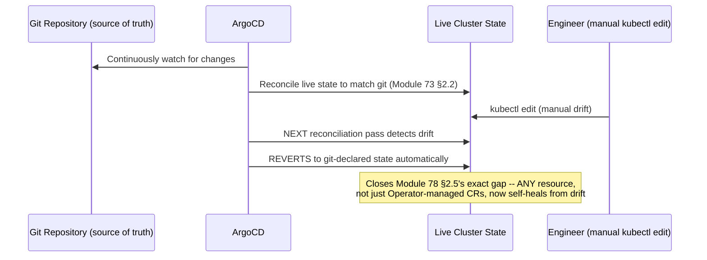
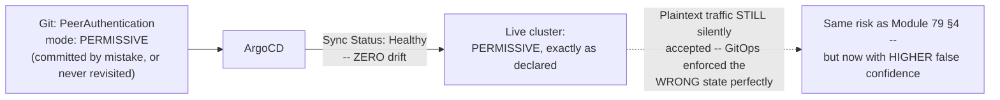
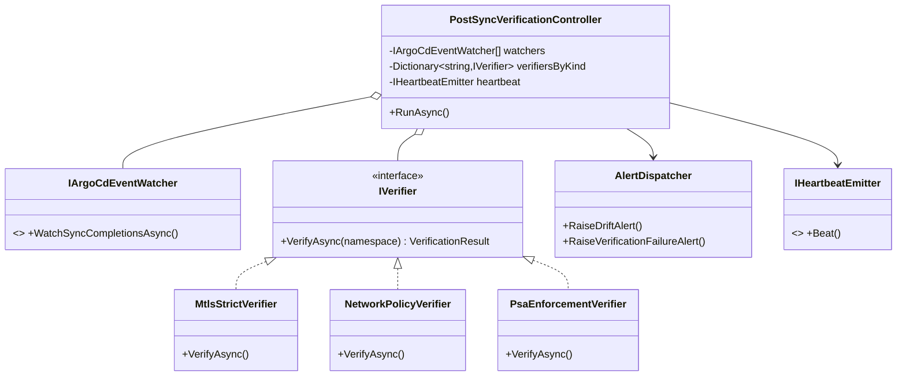
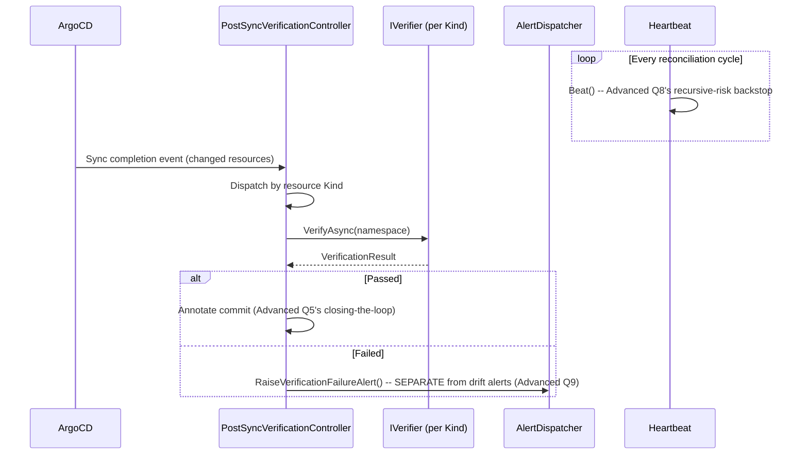

# Module 80 — Kubernetes: Observability, Multi-cluster & GitOps (Capstone)

> Domain: Kubernetes | Level: Beginner → Expert | Prerequisite: All prior Kubernetes modules (73–79) — this is the synthesizing capstone, directly paralleling [[../21-AWS/08-Observability-Cost-WellArchitectedFramework]] and [[../22-Azure/08-Observability-Cost-WellArchitectedFramework]]'s role in their own domains; [[06-Helm-Operators-CRDs]] §Advanced Q1 explicitly predicted GitOps as the structural fix this module delivers in full

---

## 1. Fundamentals

**What:** This capstone covers the Kubernetes-native observability stack (Prometheus, Grafana, OpenTelemetry — the portable, vendor-neutral analog to Module 64's CloudWatch/X-Ray and Module 72's Azure Monitor/Application Insights), multi-cluster architecture patterns, and **GitOps** (ArgoCD/Flux) — a continuously-reconciling deployment model that treats a git repository as the single source of truth for cluster state, closing the exact gap Module 78 identified in Helm's one-shot, non-reconciling behavior.

**Why:** Every prior Kubernetes module (73–79) independently surfaced the same recurring pattern — a declared object whose actual runtime effect required separate, explicit verification, since presence alone was never sufficient evidence of enforcement (Module 74's NetworkPolicy, Module 75's reclaim policy, Module 76's Pod Security Admission, Module 78's Helm drift, Module 79's mTLS PERMISSIVE mode). This capstone's central task is synthesizing what actually closes that gap — and, just as important, what *doesn't*: GitOps solves the specific problem of **drift** from a declared state, but (per §2.6's central finding) does **not** solve the separate problem of a declared state that was **wrong from the start**, meaning the synthetic-verification discipline established across Modules 74–79 remains necessary even after GitOps adoption, not superseded by it.

**When:** For any Kubernetes estate with more than one cluster (multi-cluster patterns), any workload requiring reliable, continuous observability across the metrics/logs/traces triad, and any deployment model where drift-from-declared-state has caused (or risks causing) an incident — which, per this domain's own findings, describes nearly every cluster this course has discussed.

**How (30,000-ft view):**
```
Prometheus: pull-based metrics scraping (a genuine architectural divergence from
     CloudWatch/Azure Monitor's push-based agent model) -- Grafana for visualization
OpenTelemetry: vendor-neutral instrumentation standard unifying metrics, logs, and
     traces -- the portable analog to Module 72's Application Insights auto-correlation
GitOps (ArgoCD / Flux): a controller continuously reconciling LIVE cluster state
     against a GIT REPOSITORY's declared state -- Module 73 §2.2's reconciliation loop
     applied to the ENTIRE cluster, closing Module 78's "Helm has no ongoing awareness"
     gap -- but ONLY for drift from what's declared; a WRONG declaration, faithfully
     and continuously enforced, is a NEW failure mode this capstone identifies (§2.6, §4)
Multi-cluster: fleet-management patterns (hub/spoke, Cluster API) for blast-radius
     isolation, regulatory boundaries, and multi-region DR (Module 72 §2.3's Paired
     Regions, Module 79 Expert Q1's multi-cluster mesh, now generalized)
```

---

## 2. Deep Dive

### 2.1 Prometheus and Grafana — the Pull-Based Metrics Stack, and the Prometheus Operator as Module 78's Pattern in Production Use
Prometheus scrapes metrics from targets on a pull basis (Prometheus itself initiates HTTP requests to each target's `/metrics` endpoint on a schedule) — a genuine architectural divergence from CloudWatch's and Azure Monitor's push-based agent models (Module 64 §2.1, Module 72 §2.1), with real operational implications: a Prometheus-scraped target must be network-reachable *from* Prometheus (rather than merely being able to reach an external endpoint itself), and Prometheus's own scrape-interval configuration directly determines metric freshness, rather than depending on each individual workload's own push cadence. The **Prometheus Operator** (a direct, canonical instance of Module 78 §2.3's Operator pattern) introduces the `ServiceMonitor` CRD — declaring which Services Prometheus should scrape, continuously reconciled into Prometheus's own actual scrape configuration — meaning "add monitoring for a new service" becomes a Kubernetes-native, declarative object rather than a manual Prometheus config-file edit, directly Module 78's abstraction now doing real, everyday operational work.

### 2.2 OpenTelemetry — the Vendor-Neutral Unification of Metrics, Logs, and Traces
**OpenTelemetry (OTel)** provides a single, vendor-neutral instrumentation API and collector architecture unifying metrics, logs, and traces — conceptually the same value proposition as Module 72 §2.1's Application Insights (auto-correlated telemetry across all three signal types from one integration point), but explicitly **portable**: an application instrumented with OTel can export to Prometheus, Grafana Tempo, Jaeger, or any cloud-native backend (CloudWatch, Application Insights) interchangeably, without re-instrumenting — directly addressing the cloud-lock-in trade-off this course flagged when comparing AWS/Azure-native tooling (Module 64/72) against portable, open-source alternatives throughout the AWS/Azure domains.

### 2.3 GitOps — the Structural Fix Module 78 §Advanced Q1 Explicitly Predicted, Now Delivered in Full
Module 78 §Advanced Q1 proposed, as the structural fix to Helm's one-shot drift risk (§4's incident there), adopting "GitOps tooling... because it would have caught this drift automatically." This module confirms and details that mechanism: a GitOps controller (**ArgoCD** or **Flux**) continuously watches a git repository (the declared, version-controlled source of truth for cluster state) and continuously reconciles the *live* cluster against it — directly Module 73 §2.2's reconciliation loop, now applied at the scale of an entire cluster's (or fleet's) desired state, rather than any single built-in object type. Critically, this closes Module 78 §2.5's exact gap: a manual `kubectl edit` on a GitOps-managed resource — whether originally installed via Helm or directly as raw manifests — is now detected as drift and **automatically reverted** by the GitOps controller's own next reconciliation pass, the identical self-healing guarantee Module 78 §2.5 established specifically for Operator-managed Custom Resources, now extended to **any** GitOps-managed resource regardless of how it was originally templated or installed.

### 2.4 Multi-cluster Architecture — Fleet Management, and Why More Than One Cluster Is Often the Correct Choice
Organizations commonly operate multiple clusters — per environment (dev/staging/production), per Region (directly Module 72 §2.3's Paired Regions and Module 79 Expert Q1's multi-cluster mesh, now generalized beyond mesh-specific concerns), or per regulatory/compliance boundary (a genuinely separate cluster for PCI-scoped workloads, providing a stronger, physically-distinct blast-radius boundary than namespace-level isolation alone, Module 76's RBAC/PSA discipline notwithstanding) — managed via a **hub-and-spoke** model (a central management cluster running GitOps/fleet-management tooling that deploys to and monitors many workload/"spoke" clusters) or **Cluster API** (a Kubernetes-native, declarative approach to *provisioning and lifecycle-managing Kubernetes clusters themselves* — Module 73 §2.2's reconciliation loop applied recursively, one level up, to cluster creation/scaling/upgrade itself, not merely to objects running inside an already-existing cluster).

### 2.5 The Full Observability Triad, Correlated — the Kubernetes-Native Capstone Synthesis of Metrics/Logs/Traces
Directly paralleling Module 64/72's capstone syntheses: metrics (Prometheus, §2.1), logs (commonly Loki or an EFK/Elasticsearch-Fluentd-Kibana stack), and traces (Grafana Tempo or Jaeger, fed via OpenTelemetry, §2.2) together form the same three-pillar observability model those AWS/Azure capstones established — with the Kubernetes-native stack's distinguishing property being genuine, deliberate **portability**: unlike CloudWatch/X-Ray or Azure Monitor/Application Insights, none of Prometheus/Grafana/Loki/Tempo/OpenTelemetry are tied to a specific cloud provider, directly supporting this domain's own multi-cluster, potentially multi-cloud architecture patterns (§2.4).

### 2.6 GitOps Solves Drift — It Does Not Solve a Wrong Declaration, and Can Amplify False Confidence in One
This is this capstone's — and, in a real sense, this entire domain's — central synthesizing insight: GitOps (§2.3) provides a genuine, structural fix for **drift** — a live cluster state diverging from its declared, git-committed source of truth, exactly Module 78's incident category. It provides **zero** protection against a declared state that was **incorrect from the moment it was committed** — a NetworkPolicy with a selector typo that simply never matches its intended workload, a PeerAuthentication policy correctly and permanently declared as `PERMISSIVE` (not merely temporarily, as Module 79 §4's incident assumed, but as a genuine, if mistaken, permanent design choice), or a PSA label declaring the wrong enforcement mode from day one — in every such case, GitOps's continuous reconciliation faithfully, perfectly, and permanently **enforces the wrong thing**, with the GitOps tool's own "Sync Status: Healthy" dashboard becoming a **new, even more convincing false-confidence signal** than the raw object's mere presence was in Modules 74–79 (a team seeing "fully synced, zero drift" has, if anything, *more* reason to trust the configuration than a team merely observing an object exists) — meaning the synthetic, runtime-behavior-verification discipline this domain established repeatedly (Module 74 §Advanced Q3's positive/negative connectivity tests, Module 76 §Advanced Q3's PSA-blocking verification, Module 79 §4's mTLS negative test) remains **mandatory even after GitOps adoption**, addressing a genuinely different, non-overlapping failure category GitOps was never designed to catch.

---

## 3. Visual Architecture

### GitOps Reconciliation, Closing Module 78's Drift Gap (§2.3)


### What GitOps Does NOT Solve — a Wrong Declaration, Perfectly Enforced (§2.6)


## 4. Production Example

**Problem:** Following Module 78's incident (an emergency `kubectl edit` silently reverted by an unrelated `helm upgrade`), a platform team adopted ArgoCD cluster-wide specifically to eliminate this entire class of drift risk, and considered the problem structurally solved once every workload was migrated to GitOps-managed deployment.

**Architecture:** ArgoCD was configured to continuously reconcile every namespace against a monorepo of Kubernetes manifests (including the mesh's own PeerAuthentication and AuthorizationPolicy objects from Module 79), with a strict policy that **no** direct `kubectl apply`/`edit` was permitted in production — all changes had to go through a pull request merged to the GitOps repository, with ArgoCD then automatically syncing the change to the live cluster.

**Implementation:** During the migration, the payments namespace's PeerAuthentication object was moved into the GitOps repository — but the engineer performing the migration, working from an outdated internal wiki page rather than the current, correct configuration, committed it with `mode: PERMISSIVE`, believing this matched the namespace's existing (and, they assumed, already-correct) production configuration. ArgoCD synced this committed configuration successfully, showing "Sync Status: Healthy, 0 drift" from that point forward.

**Trade-offs:** The team's confidence in this namespace's mTLS posture *increased* after the GitOps migration, not decreased — the ArgoCD dashboard's clean, "fully synced" status was treated as stronger evidence of correctness than the pre-GitOps state had ever provided, precisely because the team's mental model equated "no drift" with "correctly configured," conflating two genuinely different properties (§2.6).

**Lessons learned:** A security audit eighteen months later discovered the payments namespace had never actually been in STRICT mode at all during this entire period — the GitOps migration hadn't introduced the gap (it existed before, structurally identical to Module 79 §4's original finding), but it had **entrenched** it more deeply, since the pre-migration team had at least known the STRICT-transition was an open, tracked task, while post-migration, ArgoCD's clean sync status had caused that same open task to be dropped from tracking entirely, since "the policy is deployed and synced, so it's done" became the team's new, incorrect mental model. The fix required the same synthetic-verification discipline Module 79 §Advanced Q1 established — a scheduled, automated negative test explicitly attempting a plaintext connection into the payments namespace and asserting rejection — run **independently of, and with no regard to, ArgoCD's own sync-status dashboard**, specifically because that dashboard had been demonstrated to provide zero signal about whether the *declared* configuration was itself correct. **This is the capstone's defining lesson**: GitOps adoption is a genuine, necessary improvement (it did correctly eliminate the Module 78-style drift-from-a-correct-declaration risk), but it must be **paired with**, never treated as a **substitute for**, the runtime-behavior-verification discipline this domain established across Modules 74–79 — a lesson a Principal Engineer must proactively communicate when leading any GitOps adoption, since the natural, intuitive (and incorrect) inference from "we adopted GitOps" is "our configuration drift problems are now solved," when only one of this domain's two distinct failure categories was actually addressed.

## 5. Best Practices
- Adopt GitOps specifically to eliminate drift-from-a-correct-declaration risk (Module 78's exact incident category) — but explicitly communicate, when leading the adoption, that it does not validate the declared configuration's own correctness (§2.6, §4).
- Run synthetic, runtime-behavior verification tests (Module 74/76/79's negative-test pattern) on a schedule **independent of** GitOps sync status, specifically because sync status provides zero evidence about declaration correctness (§4).
- Use the Prometheus Operator's `ServiceMonitor` CRD (Module 78's pattern in production use) rather than manual Prometheus config-file edits, for the same declarative-consistency benefit this course has established throughout (§2.1).
- Choose multi-cluster boundaries deliberately around genuine isolation requirements (regulatory scope, blast-radius containment) rather than defaulting to either "always one giant cluster" or "always many small clusters" without an articulated driver (§2.4).
- Instrument with OpenTelemetry rather than a cloud-specific SDK when genuine multi-cloud/multi-cluster portability is a real, current requirement — not a speculative future one (§2.2, directly Module 71 §Advanced Q2's "match investment to a real, current requirement" discipline).

## 6. Anti-patterns
- Treating GitOps adoption as having fully resolved this domain's recurring "presence/sync ≠ enforced reality" pattern, rather than recognizing it addresses only the drift half of that pattern (§2.6, §4).
- Allowing a GitOps tool's clean sync-status dashboard to displace, rather than complement, independent synthetic verification of actual runtime behavior (§4).
- Migrating configuration into a GitOps repository from an outdated or unverified source (a stale wiki page, an assumed-correct prior state) without first confirming the *live*, current cluster state is what's actually being captured (§4's root cause).
- Manually editing a GitOps-managed resource directly in the cluster, expecting the change to persist, when the GitOps controller's own reconciliation loop will revert it on its next pass (§2.3).
- Defaulting to a single, monolithic cluster for an organization with genuine regulatory-isolation requirements, purely to avoid multi-cluster operational overhead, without weighing the isolation trade-off explicitly (§2.4).

---

## 10. Interview Questions

### Basic (10)

1. **Q: What is the key architectural difference between Prometheus and CloudWatch/Azure Monitor's metrics collection model?**
   **A:** Prometheus pulls metrics (scrapes targets on a schedule); CloudWatch/Azure Monitor use a push-based agent model.
   **Why correct:** Names the specific, defining architectural divergence rather than a vague "they're different."
   **Common mistakes:** Assuming all metrics systems work identically regardless of platform.
   **Follow-ups:** "What operational implication does pull-based scraping have?" (The target must be network-reachable from Prometheus, and freshness depends on Prometheus's own scrape interval, §2.1.)

2. **Q: What does the Prometheus Operator's ServiceMonitor CRD do?**
   **A:** Declares which Services Prometheus should scrape, continuously reconciled into Prometheus's actual scrape configuration.
   **Why correct:** Correctly identifies both the object's purpose and its Operator-pattern mechanism.
   **Common mistakes:** Assuming Prometheus configuration still requires manual config-file edits once the Operator is adopted.
   **Follow-ups:** "What Kubernetes pattern does this directly instantiate?" (Module 78's CRD + Operator pattern.)

3. **Q: What does OpenTelemetry provide?**
   **A:** A vendor-neutral instrumentation API and collector architecture unifying metrics, logs, and traces, exportable to any compatible backend.
   **Why correct:** Names both the unification and the portability property.
   **Common mistakes:** Confusing OpenTelemetry (an instrumentation standard) with a specific backend/storage product.
   **Follow-ups:** "Why does portability matter for a multi-cluster/multi-cloud organization?" (§2.2, avoids re-instrumentation per backend.)

4. **Q: What does a GitOps controller (ArgoCD/Flux) do?**
   **A:** Continuously reconciles live cluster state against a git repository's declared state, automatically correcting any detected drift.
   **Why correct:** Correctly identifies the continuous, automatic-correction property, not merely "deploys from git."
   **Common mistakes:** Describing GitOps as simply "a CI/CD pipeline that deploys to Kubernetes," missing the continuous, self-healing reconciliation property.
   **Follow-ups:** "What specific Module 78 gap does this close?" (Helm's one-shot, non-reconciling drift risk, §2.3.)

5. **Q: Does GitOps validate that a declared configuration is correct?**
   **A:** No — it only ensures the live cluster matches whatever is declared in git; an incorrect declaration is enforced just as faithfully as a correct one.
   **Why correct:** States this module's central distinction directly and accurately.
   **Common mistakes:** Assuming "synced" and "correct" are the same claim.
   **Follow-ups:** "What discipline is still required after GitOps adoption?" (Independent synthetic verification, §2.6, §4.)

6. **Q: What is Cluster API?**
   **A:** A Kubernetes-native, declarative approach to provisioning and lifecycle-managing Kubernetes clusters themselves.
   **Why correct:** Correctly identifies it operates one level up — managing clusters, not objects within a cluster.
   **Common mistakes:** Confusing Cluster API with a workload-level deployment tool.
   **Follow-ups:** "What pattern does this recursively apply?" (Module 73 §2.2's reconciliation loop, one level up.)

7. **Q: Name a common reason organizations run multiple Kubernetes clusters rather than one.**
   **A:** Regulatory/compliance boundary isolation (e.g., a dedicated PCI-scoped cluster), per-environment separation (dev/staging/production), or per-Region deployment.
   **Why correct:** Gives concrete, realistic drivers rather than an abstract "for scale."
   **Common mistakes:** Assuming multi-cluster is purely about capacity/scale rather than isolation/compliance.
   **Follow-ups:** "What Kubernetes-internal mechanism could partially substitute for full cluster isolation?" (Namespace-level RBAC/NetworkPolicy/PSA, Module 76 — with materially weaker isolation guarantees.)

8. **Q: What are the three pillars of observability this capstone establishes for Kubernetes?**
   **A:** Metrics (Prometheus), logs (Loki/EFK), and traces (Tempo/Jaeger via OpenTelemetry).
   **Why correct:** Names the standard triad and its typical Kubernetes-native tooling.
   **Common mistakes:** Omitting one of the three pillars, or conflating logs and traces.
   **Follow-ups:** "How does this compare to Module 72's Azure-native triad?" (Same conceptual triad; Kubernetes-native tooling is portable/vendor-neutral instead of cloud-specific.)

9. **Q: In §4's incident, did ArgoCD's "Sync Status: Healthy" indicator mean the mTLS configuration was correct?**
   **A:** No — it only meant the live cluster matched what was declared in git; the declared value itself (PERMISSIVE) was the actual, undetected problem.
   **Why correct:** Directly restates this module's central incident finding accurately.
   **Common mistakes:** Assuming a clean sync status is equivalent to a passed security check.
   **Follow-ups:** "What would have caught this instead?" (An independent, scheduled synthetic negative test, per Module 79 §Advanced Q1.)

10. **Q: What does a hub-and-spoke multi-cluster model consist of?**
    **A:** A central management ("hub") cluster running GitOps/fleet-management tooling that deploys to and monitors many workload ("spoke") clusters.
    **Why correct:** Correctly names both roles in the pattern.
    **Common mistakes:** Assuming all clusters in a fleet are managed independently with no central coordination point.
    **Follow-ups:** "What capacity-planning concern does the hub cluster introduce?" (It must be sized for the aggregate load of managing the entire fleet, §9.)

### Intermediate (10)

1. **Q: Why does Prometheus's pull-based model require targets to be network-reachable *from* Prometheus, and why does this matter operationally?**
   **A:** Because Prometheus itself initiates the scrape request — a target behind a network boundary Prometheus can't reach (a different cluster, a restrictive NetworkPolicy) won't be scraped at all, unlike a push-based model where the target only needs outbound connectivity to the collector.
   **Why correct:** Correctly connects the architectural model to its concrete operational/networking implication.
   **Common mistakes:** Assuming Prometheus's reachability requirement is symmetric with a push-based agent's requirement.
   **Follow-ups:** "How would you scrape a target behind a restrictive NetworkPolicy?" (An explicit NetworkPolicy allow-rule permitting the Prometheus namespace specifically, Module 74's discipline applied here.)

2. **Q: Why is OpenTelemetry's portability described as directly relevant to this domain's multi-cluster patterns?**
   **A:** A multi-cluster (potentially multi-cloud) architecture benefits from instrumentation that isn't tied to any single cluster's or cloud's specific backend — OTel lets the same instrumented application export telemetry consistently regardless of which cluster/cloud it happens to be running in.
   **Why correct:** Connects the portability property to a concrete architectural need this module already established (§2.4).
   **Common mistakes:** Treating OTel's value as purely about avoiding vendor lock-in in the abstract, without connecting it to the multi-cluster requirement specifically.
   **Follow-ups:** "What would be lost by instrumenting directly with a cloud-specific SDK instead?" (Re-instrumentation effort if a workload moves clusters/clouds, or inconsistent telemetry across a mixed fleet.)

3. **Q: Why does GitOps's self-healing (auto-revert-drift) property extend Module 78 §2.5's Operator-specific guarantee to *any* resource, not just Custom Resources?**
   **A:** Module 78 §2.5 established that only Operator-managed CRs self-heal from manual drift, while plain Helm-managed resources don't; a GitOps controller reconciles against git for *any* resource type it's configured to manage, regardless of whether that resource happens to be a built-in Kind, a Helm-templated object, or a Custom Resource — extending the self-healing property universally across the GitOps-managed scope.
   **Why correct:** Correctly identifies the scope expansion from "only CRs" to "anything GitOps manages."
   **Common mistakes:** Assuming GitOps and Operators are competing, redundant mechanisms rather than GitOps generalizing the same underlying reconciliation-loop property.
   **Follow-ups:** "Can GitOps and an Operator manage the same resource simultaneously without conflict?" (Only if their respective scopes/ownership are explicitly delineated — otherwise this recreates Module 77 §Advanced Q9's ownership-conflict risk.)

4. **Q: Why did the §4 team's confidence in their mTLS posture increase, not decrease, after GitOps migration, despite the underlying security gap being unchanged?**
   **A:** The team's mental model conflated "zero drift / fully synced" with "correctly configured" — a clean sync-status dashboard was interpreted as stronger evidence of correctness than the pre-migration state had provided, even though sync status says nothing about whether the declared configuration itself is right.
   **Why correct:** Correctly diagnoses the specific cognitive/process error (conflating two distinct properties) rather than attributing the incident to a technical failure of GitOps itself.
   **Common mistakes:** Concluding "GitOps caused this incident" rather than "GitOps didn't address this pre-existing, orthogonal risk category, and inadvertently increased false confidence around it."
   **Follow-ups:** "What organizational practice would prevent this specific false-confidence pattern from recurring for a different, future policy?" (Explicit, standing communication — per §17 — that sync status and runtime-correctness are separate claims, reinforced by requiring independent verification evidence alongside sync status in any compliance reporting.)

5. **Q: Why is a git-migration sourced "from an outdated wiki page" specifically flagged as the root cause in §4, rather than GitOps adoption itself?**
   **A:** The actual configuration error (declaring PERMISSIVE) originated from using a stale, unverified source of truth during migration — GitOps then faithfully and continuously enforced whatever was committed, meaning the tool performed exactly as designed; the error was introduced upstream, in the migration process itself, not in GitOps's reconciliation behavior.
   **Why correct:** Correctly separates the tool's correct behavior from the process error that fed it incorrect input.
   **Common mistakes:** Blaming the GitOps tool itself for "not catching" an error it was never designed to catch.
   **Follow-ups:** "What migration practice would have caught this?" (Diffing the live, current cluster state against the wiki-derived draft before committing, rather than trusting the wiki page as authoritative.)

6. **Q: Why does a multi-cluster architecture for regulatory isolation provide a stronger boundary than namespace-level RBAC/NetworkPolicy/PSA within a single cluster?**
   **A:** A separate cluster has its own control plane, its own etcd, and no shared API-server/network fabric with other workloads at all — a single compromised or misconfigured control-plane component in a shared cluster can theoretically affect every namespace, whereas cluster-level separation removes that shared blast radius entirely.
   **Why correct:** Correctly identifies the control-plane/shared-fabric distinction as the actual source of the stronger isolation guarantee.
   **Common mistakes:** Assuming sufficiently strict namespace-level policies provide equivalent isolation to genuine cluster separation.
   **Follow-ups:** "What's the operational cost of this stronger isolation?" (A fully separate control plane to operate, patch, and monitor per cluster — directly the multi-cluster fleet-management overhead §2.4/§9 discuss.)

7. **Q: Why does Cluster API's cluster-provisioning process share Module 77 §2.7's "not instantaneous" latency characteristic?**
   **A:** Provisioning a new cluster via Cluster API's own reconciliation loop still requires real infrastructure provisioning (control-plane nodes, worker nodes) with genuine, non-zero latency, directly the same "newly-provisioned compute isn't instantly available" pattern Module 77 §2.7 established for the HPA/Cluster-Autoscaler chain, now recurring one layer up at the cluster-provisioning level.
   **Why correct:** Correctly generalizes an already-established pattern to a new, structurally analogous context.
   **Common mistakes:** Assuming a declarative, Kubernetes-native provisioning API implies instantaneous provisioning.
   **Follow-ups:** "What capacity-planning implication does this have for a multi-cluster DR strategy?" (A "spin up a new cluster on demand during a disaster" DR strategy must account for this provisioning-latency floor, directly Module 72 §2.5's DR-strategy-spectrum reasoning.)

8. **Q: Why is GitOps's git-based audit trail described as improving change *provenance* but not change *correctness*, per §8?**
   **A:** Every change is attributable and reviewable via commit/PR history (a genuine governance improvement — who changed what, when, and via what review), but nothing about that provenance trail validates whether the change's actual *content* is semantically correct — a incorrect but well-reviewed, properly-attributed change is exactly as provenance-clean as a correct one.
   **Why correct:** Correctly distinguishes the two genuinely different properties (who/when/how a change was made vs. whether it's right) GitOps's audit trail conflates in casual discussion.
   **Common mistakes:** Treating "it went through a reviewed pull request" as sufficient evidence of correctness on its own.
   **Follow-ups:** "What would a reviewer need to specifically check to catch §4's error at review time?" (Explicitly diffing the proposed PeerAuthentication mode against the live, currently-enforced cluster state — not merely reviewing the YAML in isolation for syntactic correctness.)

9. **Q: Why does a very short GitOps reconciliation interval trade faster drift detection against genuine additional cost, per §7?**
   **A:** More frequent reconciliation passes mean more frequent API Server queries/comparisons, adding continuous load to both the GitOps controller and the API Server — directly the same reconciliation-loop-efficiency trade-off Module 78 §7 established for custom Operators, now recurring for GitOps controllers specifically.
   **Why correct:** Correctly connects to an already-established general principle rather than treating this as a novel concern.
   **Common mistakes:** Assuming reconciliation frequency has no meaningful cost and should always be set as short as technically possible.
   **Follow-ups:** "How would you determine an appropriate reconciliation interval for a given cluster?" (Balance the acceptable drift-detection-latency window against the cluster's own API Server capacity headroom, Module 73 §7.)

10. **Q: Why does this module frame GitOps and the synthetic-verification discipline (Modules 74/76/79) as complementary rather than GitOps superseding the need for the latter?**
    **A:** They address genuinely non-overlapping failure categories — GitOps solves drift from a declared state; synthetic verification confirms the declared state itself produces the intended runtime behavior — a complete governance posture requires both, since neither alone covers the other's failure category.
    **Why correct:** Directly restates this module's central synthesis point with the correct "complementary, not substitutable" framing.
    **Common mistakes:** Treating GitOps adoption as a checkbox that retires the need for the verification practices established in earlier modules.
    **Follow-ups:** "Design one automated check that validates both properties together." (A CI/CD pipeline step that, after a GitOps sync completes, automatically triggers the relevant synthetic verification test for any changed security-relevant policy — directly Module 79 §Advanced Q10's synthesized governance pattern, now scheduled specifically around GitOps sync events.)

### Advanced (10)

1. **Q: Diagnose §4's incident from first principles, and design the specific governance structure preventing a future GitOps migration from silently entrenching a pre-existing, unverified configuration.**
   **A:** Root cause: the migration sourced its committed configuration from an unverified, outdated reference (a stale wiki page) rather than the actual, current live cluster state, and GitOps's subsequent clean sync status caused the team to stop tracking the pre-existing open task (STRICT-mode migration) that had, until then, at least been known-incomplete. Structural fix: (1) any GitOps migration of existing, already-running configuration must diff the proposed git-committed state against the *actual, currently-live* cluster state before the initial commit, not a secondary or assumed-correct reference; (2) any pre-existing "known incomplete" tracked item (like Module 79 §4's originally-tracked STRICT-mode migration) must be explicitly, deliberately carried forward into the GitOps-managed repository's own tracking (e.g., as a still-open, still-flagged TODO/annotation) rather than allowed to silently disappear once the resource itself becomes GitOps-managed and shows "synced."
   **Why correct:** Identifies both the specific migration-process root cause and the specific tracking-continuity fix, directly generalizing this domain's now-repeated "structural tracking survives ownership/tooling transitions" lesson (Module 76 §Advanced Q1) to the GitOps-adoption context specifically.
   **Common mistakes:** Proposing only "review the PR more carefully," without addressing the structural, tracking-continuity gap that let a known-open item become silently untracked.
   **Follow-ups:** "How would you retroactively audit an already-completed GitOps migration for this same risk?" (Cross-reference every GitOps-managed security-relevant policy against its pre-migration tracked status, flagging any where a previously-open task appears to have been silently dropped rather than explicitly resolved.)

2. **Q: A team argues that since ArgoCD provides drift detection and correction, they no longer need Module 76's Pod Security Admission enforcement-mode monitoring (Module 76 §Advanced Q3's synthetic test), since any drift from the correct PSA labels would be automatically caught and reverted. Evaluate this claim.**
   **A:** Push back — drift detection catches a live cluster state diverging from what's declared in git; it does not catch a PSA label that was *declared* in git as `audit`/`warn` (not `enforce`) from the start, or one that was correctly declared as `enforce` but where the CNI/admission-controller stack has some independent, orthogonal failure preventing actual enforcement despite the label being exactly right — both scenarios show "zero drift, fully synced" while providing zero actual blocking protection, precisely §2.6's central distinction; ArgoCD's drift detection and Module 76's synthetic enforcement-verification test address genuinely different failure categories and neither substitutes for the other.
   **Why correct:** Correctly applies this module's central distinction (drift vs. declaration-correctness/actual-enforcement) to a concrete, previously-established scenario from an earlier module, demonstrating the pattern's generality.
   **Common mistakes:** Accepting the premise that comprehensive drift detection is equivalent to comprehensive enforcement verification.
   **Follow-ups:** "Design a single automated pipeline combining both checks for PSA specifically." (A scheduled job checking ArgoCD sync status AND independently running Module 76 §Advanced Q3's synthetic non-compliant-Pod-creation test, alerting if either check fails, treating them as two necessary, non-redundant signals.)

3. **Q: Design the specific hub-cluster capacity-planning methodology for an organization running a 50-cluster fleet via a single ArgoCD hub instance, extending Module 73 §7's shared-control-plane-capacity discipline to the fleet-management layer.**
   **A:** Capacity-plan the hub cluster's own resources (ArgoCD controller CPU/memory, API-server-facing connection count to every spoke cluster) against the *aggregate* reconciliation workload across all 50 spokes — specifically the total number of GitOps-managed resources summed across the entire fleet, and each spoke's own reconciliation-interval configuration (§7) — since a hub sized only for its own, single-cluster-equivalent baseline load would be under-provisioned the moment the fleet's aggregate managed-resource count exceeds what a single-cluster mental model assumed; additionally, monitor per-spoke sync latency specifically (not just hub-level aggregate health), since a hub that's technically healthy in aggregate could still be silently failing to keep pace with reconciliation for a specific, particularly resource-heavy spoke cluster — directly Module 79 §Advanced Q9's "partial, degraded-but-not-fully-down" control-plane failure mode, now recurring at the fleet-management layer.
   **Why correct:** Correctly extends an already-established capacity-planning discipline and partial-failure-detection pattern to the new, one-level-up fleet-management context.
   **Common mistakes:** Sizing the hub cluster for its own baseline resource needs without accounting for the aggregate, fleet-wide reconciliation workload it's actually responsible for.
   **Follow-ups:** "What's the blast-radius risk of a single hub cluster managing all 50 spokes?" (A hub-cluster outage/compromise could, depending on its actual permission scope, affect GitOps-managed deployment capability across the entire fleet simultaneously — a genuine, explicit trade-off against hub-and-spoke's operational-simplicity benefit, requiring its own risk-acceptance discussion.)

4. **Q: A Principal Engineer must decide whether a new, highly-regulated workload should be deployed into an existing, shared multi-tenant cluster (with strong namespace-level RBAC/NetworkPolicy/PSA per Module 76) or a newly-provisioned, dedicated cluster. Design the decision framework, incorporating §2.4's isolation-vs-overhead trade-off and Advanced Q3's capacity-planning implications of Cluster API provisioning latency.**
   **A:** The decision hinges on whether the regulatory requirement specifically mandates control-plane-level isolation (a genuine compliance requirement stating no shared control plane with other tenants at all) versus a requirement satisfiable by strong logical isolation (Module 76's namespace-scoped RBAC/NetworkPolicy/AuthorizationPolicy/PSA, verified per this domain's synthetic-testing discipline) — if the former, a dedicated cluster is required regardless of the additional fleet-management overhead it introduces (Advanced Q3), and Cluster API's non-instantaneous provisioning latency (Advanced Q7's earlier finding) must be planned into the workload's own launch timeline; if the latter, the shared, multi-tenant cluster with rigorously verified logical isolation is the lower-overhead, equally-compliant choice, avoiding unnecessary fleet-management cost for a requirement that never actually demanded full cluster separation.
   **Why correct:** Correctly frames the decision around the actual, specific nature of the regulatory requirement rather than defaulting to either extreme, and explicitly incorporates two previously-established findings (provisioning latency, isolation-strength trade-off) into the decision.
   **Common mistakes:** Defaulting to "regulated workload = always needs a dedicated cluster" without first confirming the requirement genuinely demands control-plane-level (not merely strong logical) isolation.
   **Follow-ups:** "How would you validate that the shared-cluster option's logical isolation actually meets the regulatory bar, before committing to it?" (The full synthetic-verification suite this domain established — Module 74/76/79's negative tests — presented as concrete evidence to whichever compliance function owns the actual regulatory determination.)

5. **Q: Critique the following claim: "Since our GitOps repository is the single source of truth, and every change goes through a reviewed pull request, our configuration management process is now fully governed and requires no further improvement."**
   **A:** Overstated in exactly the way §2.6/§4 establishes — "single source of truth, reviewed PRs" addresses change provenance and prevents *unreviewed* drift, but says nothing about whether reviewers are actually checking the *specific, security-relevant semantic correctness* (an mTLS mode, a PSA level, a NetworkPolicy selector) of each change, versus merely checking for syntactic validity and general code-quality concerns — a fully "governed" process in the provenance sense can still systematically approve semantically-wrong security configuration indefinitely, exactly as §4's incident demonstrates; genuine governance requires the review process itself to explicitly incorporate the synthetic-verification checks this domain established (ideally automated, run against every relevant PR, not left to a human reviewer's own security-domain expertise alone).
   **Why correct:** Correctly distinguishes process governance (who reviews, how changes flow) from outcome governance (whether the reviewed content is actually correct), directly extending §8's provenance-vs-correctness distinction to the review process specifically.
   **Common mistakes:** Treating "we have a reviewed PR process" as sufficient evidence of security-configuration correctness without examining what the review actually checks for.
   **Follow-ups:** "Design a specific CI check that would have caught §4's PERMISSIVE-mode commit at PR time, before it ever reached production." (An automated policy-as-code check, e.g., via OPA/Kyverno or a custom CI script, explicitly rejecting any PR that declares PeerAuthentication mode as PERMISSIVE for a namespace tagged as production-security-critical, directly Module 78 §Advanced Q10's admission-webhook-as-structural-enforcement pattern, now applied at CI/PR time rather than admission time.)

6. **Q: Design a specific incident post-mortem template for any future "GitOps shows healthy, but a security control was actually ineffective" finding, synthesizing this module's central distinction into a reusable investigative structure.**
   **A:** The template's first, mandatory question must explicitly separate two distinct sub-investigations, given this module's core finding: (1) **Was there drift?** (Did the live cluster ever diverge from what git declared? If yes, this is a GitOps-tooling-effectiveness question — did the controller actually detect and correct it in a timely way?) and (2) **Was the declaration itself correct?** (Independent of any drift question — was the git-committed configuration ever actually right, verified via the domain's synthetic-testing discipline, at any point since it was first committed?) — treating these as two genuinely separate questions with separate evidence requirements (sync-status history for question 1; synthetic-test results, or their absence, for question 2) prevents the investigation from prematurely concluding "GitOps failed" when the actual finding is "GitOps worked exactly as designed, faithfully enforcing an incorrect declaration" (§4's exact case), which points to a different, upstream fix (migration/review-process rigor) than a GitOps-tooling fix would.
   **Why correct:** Directly operationalizes this module's central conceptual distinction into a concrete, reusable investigative artifact, demonstrating genuine synthesis rather than restating the finding abstractly.
   **Common mistakes:** Designing a post-mortem template that treats "GitOps says healthy" as exculpatory evidence for the GitOps tooling without separately investigating declaration correctness.
   **Follow-ups:** "How would this template have changed the investigation timeline in §4's actual incident?" (It would have prompted checking declaration correctness explicitly and early, rather than the investigation initially, plausibly, trusting the "Healthy" sync status as evidence nothing was wrong.)

7. **Q: Explain why this capstone's central finding (§2.6) is not a criticism of GitOps as a practice, but a completion of the analytical framework this entire domain has been building — connect this explicitly to the specific progression across Modules 74, 75, 76, 78, and this module.**
   **A:** Modules 74/75/76/78 each independently discovered a specific instance of "an object's presence provides zero evidence of its actual runtime effect" (NetworkPolicy/CNI, reclaim policy, PSA mode, Helm drift) — each of those incidents' *specific* fix was some form of "verify the actual behavior, don't trust the declared configuration alone." This module's contribution is recognizing that GitOps, while it genuinely fixes *one* of the underlying causes behind that pattern (unintentional, manual drift, Module 78's specific case), does **not** fix the pattern's more general form (a wrong or unenforced declaration, faithfully maintained) — meaning the domain's true, general lesson was never "eliminate drift" specifically, but the broader "declared state and actual, verified behavior are two independent claims requiring two independent forms of evidence," a principle GitOps partially serves (by keeping declared and live state in sync) but does not fully discharge (by validating that the declared state itself is correct) — this capstone's role is stating that general principle explicitly, having built up five specific, concrete instances of it across the domain first.
   **Why correct:** Correctly articulates the capstone's actual intellectual contribution — not a critique of GitOps, but the generalization of a pattern this domain built inductively, module by module, into its final, most general form.
   **Common mistakes:** Reading this module's finding as "GitOps has a flaw" rather than "this domain's true general lesson was broader than any single module's specific instance of it, and GitOps completes rather than fully resolves that broader lesson."
   **Follow-ups:** "State the domain's fully-generalized lesson in one sentence." ("A Kubernetes control-plane object's declared state, and its actual, live, runtime-verified behavior, are two independent claims — no amount of tooling that keeps the first synchronized, consistent, or well-governed automatically establishes the second; both require independent, explicit verification.")

8. **Q: A platform team wants to build a fully automated system that runs this domain's entire synthetic-verification suite (NetworkPolicy negative tests, PSA blocking tests, mTLS negative tests) automatically after every GitOps sync event, specifically to close the gap §4's incident demonstrates. Design the architecture and identify its own residual risk.**
   **A:** Architecture: a controller (itself an Operator, per Module 78 §2.3) watching ArgoCD's own sync-completion events (or Flux's equivalent), triggering the relevant subset of synthetic tests (matched to which specific resource types changed in that sync) against the now-updated live cluster state, with results fed back as a status annotation on the corresponding git commit/PR (closing the loop back to §Advanced Q5's CI-check recommendation, now running post-sync rather than pre-merge, catching anything a pre-merge check might have missed). Residual risk: this system itself is now a new, additional piece of infrastructure whose own correctness requires the identical scrutiny this entire domain has applied to everything else — a synthetic-test controller that is itself misconfigured, silently failing, or has its own enforcement-mode gap (imagine it running in an "audit-only, log but don't alert" mode by accident) recreates the exact same "presence of a check ≠ the check actually running/alerting correctly" pattern one meta-level up, meaning even this proposed fix requires its own periodic, independent verification that it is genuinely running and genuinely alerting — a recursive instance of this domain's central lesson that a Principal Engineer should recognize explicitly rather than assume any single layer of automation is the final, unquestionable safety net.
   **Why correct:** Designs a coherent, realistic architecture while correctly identifying the genuinely recursive nature of this domain's central risk — that any verification mechanism is itself a system requiring the same verification discipline, an intellectually honest and sophisticated observation appropriate to Expert-tier reasoning.
   **Common mistakes:** Proposing the automated-verification system as a final, unquestionable solution without recognizing it introduces the identical risk category one level removed.
   **Follow-ups:** "How would you break this potential infinite regress in practice?" (Accept that at some layer, a periodic, human-reviewed, out-of-band audit — not further automation — must serve as the ultimate backstop, directly Module 64/72's Well-Architected-review capstone pattern, which this domain's own capstone now explicitly connects back to as the appropriate terminating layer.)

9. **Q: Design the specific metrics/alerting strategy distinguishing "GitOps drift" incidents from "declaration correctness" incidents in production monitoring, so an on-call engineer's very first triage signal correctly routes the investigation.**
   **A:** Emit two structurally distinct alert categories: (1) **Drift alerts** — fired directly by the GitOps controller's own drift-detection signal (live state diverged from git, before or regardless of correction) — routed to a runbook focused on "why did someone/something bypass the GitOps-managed change process" (Module 78's original incident category). (2) **Verification-failure alerts** — fired by the independent synthetic-test suite (Advanced Q8's proposed system, or the equivalent manual/scheduled process) specifically when a security-relevant runtime behavior check fails, **regardless of the GitOps sync status at the time** — routed to a runbook focused on "the declared configuration itself is wrong, investigate the commit history and review process that approved it" (this module's own §4 incident category) — critically, ensuring these two alert types are visually and procedurally distinct in the on-call tooling (not merged into one generic "Kubernetes config problem" alert), specifically so an engineer's first triage instinct correctly branches toward the actually-relevant investigation path immediately, rather than defaulting to checking sync status first (which, per §4, could show "Healthy" and mislead a verification-failure investigation toward the wrong initial hypothesis).
   **Why correct:** Correctly designs the alerting/triage system around this module's core distinction, explicitly addressing the specific failure mode (misleading initial hypothesis from a "Healthy" sync status) §4's incident demonstrated.
   **Common mistakes:** Merging both alert categories into one generic signal, forcing every on-call investigation to manually re-derive which of the two distinct failure categories is actually occurring.
   **Follow-ups:** "Which alert category should have fired first, chronologically, for §4's incident — and why didn't it?" (A verification-failure alert should have fired from day one of the migration, but no such independent synthetic test existed at the time — the incident's actual root gap was the *absence* of this alert category entirely, not a failure of an alert that existed but didn't fire.)

10. **Q: As a Principal Engineer completing a comprehensive Kubernetes platform governance review — synthesizing this entire domain, Modules 73–80 — design the complete, standing governance program a mature Kubernetes platform team should operate, explicitly naming which prior module's specific finding each element addresses.**
    **A:** (1) **Foundational architecture literacy** (Module 73): every platform engineer understands the reconciliation-loop pattern as the generalizing mechanism behind every subsequent finding in this domain. (2) **Layered network/security verification** (Modules 74, 76, 79): NetworkPolicy, PSA, RBAC, and mesh AuthorizationPolicy/PeerAuthentication each independently, synthetically verified on a recurring schedule — never trusted from object presence alone. (3) **Explicit, tracked, deadline-bound staged rollouts** (Module 76 §Advanced Q1) for any security-hardening migration, with automated flagging of anything stalled past its deadline. (4) **Reclaim-policy and backup governance** (Module 75) for any critical, stateful data, with `Retain` mandatory and independently tested. (5) **Full-chain autoscaling load testing** (Module 77) under genuinely capacity-constrained conditions, never validated against pre-provisioned, unconstrained headroom alone. (6) **GitOps adoption for drift elimination** (Module 78, this module §2.3) — paired explicitly, and never substituted, with (7) **independent synthetic verification of declared-configuration correctness** (this module §2.6, the domain's fully-generalized capstone lesson) — the single most important governance principle this entire domain has built toward, since it's the one finding every other module's specific incident was, in retrospect, a concrete instance of. (8) **Multi-cluster isolation boundaries** (this module §2.4) matched deliberately to genuine regulatory/blast-radius requirements, with Cluster API provisioning-latency accounted for in any DR planning. (9) **A recurring, comprehensive review cadence** (directly mirroring Module 64/72's Well-Architected capstone pattern) as the ultimate, human-reviewed backstop catching whatever the automated layers above haven't yet been built to catch, explicitly accepting — per Advanced Q8's recursive-verification observation — that no fully automated system can be assumed to be the final, unquestionable safety net.
    **Why correct:** Comprehensively synthesizes every major finding across all eight Kubernetes modules into one coherent, prioritized governance program, explicitly citing the specific module and finding each element addresses — demonstrating the genuine cross-module synthesis this course has required throughout, at the domain-capstone level.
    **Common mistakes:** Presenting a generic "Kubernetes best practices" checklist disconnected from this specific domain's actual, hard-won findings and their specific module provenance.
    **Follow-ups:** "If you could implement only ONE of these nine elements immediately, which would you choose, and why?" (Element 7 — independent synthetic verification of declared-configuration correctness — since it's the one finding this entire domain converged on as its true general lesson, and its absence is what allowed every other module's specific incident to go undetected for as long as it did.)

---

## 11. Coding Exercises

### Easy — A ServiceMonitor CRD, the Prometheus Operator's declarative scrape configuration (§2.1)
**Problem:** Configure Prometheus (via its Operator) to scrape the `checkout-api` Service's metrics endpoint every 15 seconds.
**Solution:**
```yaml
apiVersion: monitoring.coreos.com/v1
kind: ServiceMonitor
metadata: { name: checkout-api-monitor, namespace: checkout }
spec:
  selector: { matchLabels: { app: checkout-api } }
  endpoints:
    - port: metrics
      interval: 15s
      path: /metrics
```
**Time complexity:** O(1) per scrape cycle — Prometheus performs one HTTP GET per configured target per interval, independent of the number of other ServiceMonitors declared.
**Space complexity:** O(m) where m is the number of unique metric-label combinations (cardinality) exposed by the target — this, not the ServiceMonitor object itself, is Prometheus's actual storage-scaling concern (§7).
**Optimized solution:** For a very high-cardinality metrics endpoint, add `metricRelabelings` to drop unnecessary high-cardinality labels at scrape time, directly reducing Prometheus's own storage/query cost rather than accepting the full, unfiltered cardinality (§7's capacity-planning discipline applied concretely).

### Medium — An ArgoCD Application manifest with automated, self-healing sync (§2.3)
**Problem:** Configure ArgoCD to continuously reconcile the `checkout` namespace against a git repository, automatically reverting manual drift.
**Solution:**
```yaml
apiVersion: argoproj.io/v1alpha1
kind: Application
metadata: { name: checkout-api, namespace: argocd }
spec:
  source: { repoURL: "https://github.com/example/platform-config", path: "checkout", targetRevision: main }
  destination: { server: "https://kubernetes.default.svc", namespace: checkout }
  syncPolicy:
    automated:
      prune: true      # remove resources deleted from git
      selfHeal: true    # THIS is what closes Module 78's drift gap (§2.3) --
                          # a manual kubectl edit is reverted on the next reconciliation
```
**Time complexity:** O(r) per reconciliation pass, where r is the number of resources this Application manages — each is diffed against its git-declared state.
**Space complexity:** O(r) for tracking each managed resource's last-known-good state for diffing purposes.
**Optimized solution:** For a very large number of Applications across a fleet, use ArgoCD's `ApplicationSet` CRD to template many similar Applications from one declarative generator (e.g., one per cluster in a fleet) rather than hand-authoring each Application object individually — directly extending §2.4's multi-cluster fleet-management pattern.

### Hard — A synthetic verification job, independent of GitOps sync status, per this module's central lesson (§2.6, §Advanced Q9)
**Problem:** Implement a scheduled check that verifies a namespace's PeerAuthentication is genuinely enforcing STRICT mode, never trusting ArgoCD's sync status alone.
**Solution:**
```csharp
public class MtlsEnforcementVerifier
{
    // Directly this module's central lesson (§2.6) -- runs INDEPENDENTLY of, and with
    // NO regard to, GitOps sync status, since sync status provides zero evidence about
    // whether the declared configuration is itself correct or genuinely enforced.
    public async Task<VerificationResult> VerifyStrictModeAsync(string @namespace, IHttpClientFactory clientFactory)
    {
        var plaintextClient = clientFactory.CreateClient("no-mtls");
        try
        {
            var response = await plaintextClient.GetAsync($"http://target-service.{@namespace}.svc.cluster.local/health");
            // A SUCCESSFUL plaintext connection means STRICT mode is NOT actually enforced,
            // regardless of what the PeerAuthentication object declares or ArgoCD's sync status shows.
            return new VerificationResult
            {
                Passed = false,
                Message = $"Namespace '{@namespace}': plaintext connection SUCCEEDED -- " +
                          $"mTLS STRICT mode is NOT genuinely enforced, despite any declared configuration."
            };
        }
        catch (HttpRequestException)
        {
            return new VerificationResult { Passed = true, Message = $"Namespace '{@namespace}': plaintext correctly rejected." };
        }
    }
}
```
**Time complexity:** O(1) per namespace check — a single connection attempt and its result.
**Space complexity:** O(1) — no accumulating state beyond the current check's result.
**Optimized solution:** Batch this check across every namespace declared as security-critical in a single scheduled run, emitting a structured, per-namespace result set that feeds directly into the two-alert-category design (Advanced Q9) — separating "drift" alerts from "verification-failure" alerts — rather than running and reporting each namespace's check in isolation.

### Expert — A post-sync verification controller, closing the loop between GitOps and synthetic testing (§Advanced Q8)
**Problem:** Automatically trigger the relevant synthetic verification test whenever ArgoCD completes a sync affecting a security-relevant resource type, and record the result against the triggering commit.
**Solution:**
```csharp
public class PostSyncVerificationController
{
    private readonly IArgoCdEventWatcher _argoCdWatcher;
    private readonly IDictionary<string, Func<string, Task<VerificationResult>>> _verifiersByResourceKind;

    public async Task RunAsync(CancellationToken ct)
    {
        // Watches ArgoCD's own sync-completion events -- itself a reconciliation-loop-
        // adjacent pattern (Module 73 §2.2), now specifically triggered by another
        // controller's completion event rather than a fixed polling interval.
        await foreach (var syncEvent in _argoCdWatcher.WatchSyncCompletionsAsync(ct))
        {
            foreach (var changedResource in syncEvent.ChangedResources)
            {
                if (_verifiersByResourceKind.TryGetValue(changedResource.Kind, out var verifier))
                {
                    var result = await verifier(changedResource.Namespace);

                    // Closing the loop back to the triggering commit -- directly this
                    // module's Advanced Q5/Q9 recommendation, now implemented concretely.
                    await AnnotateGitCommitAsync(syncEvent.CommitSha, changedResource, result);

                    if (!result.Passed)
                        await RaiseVerificationFailureAlertAsync(changedResource, result);  // Advanced Q9's
                                                                                                // SEPARATE alert category
                }
            }
        }
    }
}
```
**Time complexity:** O(c) per sync event, where c is the number of changed resources with a registered verifier — each triggers one independent verification check.
**Space complexity:** O(1) additional state beyond each verifier's own footprint (already established as O(1) in the Hard exercise above) — the controller itself holds no accumulating state across events.
**Optimized solution:** Per §Advanced Q8's own explicitly-acknowledged residual risk, this controller must itself be subject to a periodic, independent, out-of-band audit confirming it is genuinely running and genuinely alerting — implemented as a simple, separate heartbeat check (a scheduled job asserting this controller processed at least one sync event within the last N hours, alerting on silence) — a deliberately low-tech, hard-to-silently-break final backstop for the automation layer that is itself this module's own final, most-generalized safety mechanism.

---

## 12. System Design

**Prompt:** Design a Kubernetes platform observability and deployment-governance system for a 200-microservice, 15-cluster organization (mixed dev/staging/production, per-Region production clusters, and one dedicated PCI-scoped cluster) that must satisfy both engineering-velocity needs (frequent, safe deployments) and compliance requirements (demonstrable, continuously-verified security posture).

**Requirements:**
- *Functional:* every cluster's configuration must be git-managed with automatic drift correction; every security-relevant policy (NetworkPolicy, PSA, mesh AuthorizationPolicy/mTLS) must have continuously-verified, not merely declared, enforcement; observability must span all three pillars (metrics/logs/traces) correlated across the full 15-cluster fleet.
- *Non-functional:* the PCI-scoped cluster must remain fully isolated at the control-plane level (§2.4); the hub cluster managing the fleet must not become a single point of catastrophic failure for deployment capability across all 15 clusters simultaneously; verification-failure detection latency must be materially faster than the historical eighteen-month gap in §4's incident.

**Architecture:** A hub-and-spoke GitOps topology (§2.4) with ArgoCD as the hub, managing 14 general-purpose spoke clusters directly, with the PCI-scoped cluster's GitOps management deliberately using a **separate**, dedicated ArgoCD instance (not the shared hub) — directly satisfying the control-plane-isolation non-functional requirement by avoiding even the *deployment-tooling* control plane being shared with the PCI boundary, an isolation decision one level more conservative than Module 79's own multi-cluster mesh design (Expert Q1), reflecting this workload's specifically elevated regulatory stakes.

**Components:** Prometheus + Grafana per cluster (federated into a fleet-wide view via Grafana's own cross-cluster data-source aggregation, or a centralized long-term-storage backend like Thanos/Mimir); OpenTelemetry Collectors per cluster feeding a centralized trace backend (Tempo); the post-sync verification controller (§11 Expert) wired to both ArgoCD instances, with its own independent heartbeat-monitoring backstop.

**Database selection:** Not directly applicable to the platform-governance layer itself; the underlying application data layer's own database choices (Module 4-8's territory) are out of this system design's scope, though the PCI cluster's own data-residency requirements (Module 67/72's discipline) must be independently satisfied by whatever data stores the PCI-scoped workloads use.

**Caching:** Prometheus's own local time-series storage functions as the effective "cache" for recent metrics; a long-term-storage backend (Thanos/Mimir) provides durable, queryable retention beyond Prometheus's own local retention window, directly Module 64/72's observability-retention discipline applied at the Kubernetes-native layer.

**Messaging:** The post-sync verification controller (§11 Expert) is itself effectively an event-driven consumer of ArgoCD's sync-completion events — if scaled further, this event stream could reasonably be routed through Kafka (Module 19) for durability and fan-out to multiple downstream consumers (verification, audit logging, notification) rather than a single, tightly-coupled watcher.

**Scaling:** Hub-cluster capacity planning per Advanced Q3's methodology (aggregate managed-resource count across 14 spokes, not single-cluster-equivalent sizing); the dedicated PCI-cluster GitOps instance is sized independently, for its own single cluster's load only, since it deliberately doesn't share the hub's aggregate fleet burden.

**Failure handling:** A hub-cluster outage degrades *new deployment capability* across the 14 general-purpose spokes (no new GitOps syncs can be applied) but does **not** affect those spokes' already-running workloads at all (Kubernetes's own control plane per spoke cluster continues operating independently, directly Module 73's architecture) — an important distinction to communicate: "the hub is down" means "we can't deploy changes right now," not "our production services are affected," a genuine, important severity-framing distinction for an incident response.

**Monitoring:** Fleet-wide dashboards distinguishing the two alert categories established in Advanced Q9 (drift alerts vs. verification-failure alerts) explicitly, per cluster and in aggregate, plus the heartbeat monitor (§11 Expert) confirming the verification-controller layer itself remains genuinely operating.

**Trade-offs:** The dedicated, separate PCI GitOps instance trades additional operational overhead (a second ArgoCD deployment to maintain, patch, and monitor) against the strongest possible control-plane isolation for the organization's highest-stakes regulatory boundary — directly the same isolation-vs-overhead trade-off §2.4/Advanced Q4 established, resolved here in favor of maximal isolation specifically because the stated non-functional requirement explicitly demanded it, not as a default, reflexive choice.

## 13. Low-Level Design

**Prompt:** Design the internal architecture of the post-sync verification controller introduced in §11's Expert exercise, in full detail.

**Requirements:** Watch ArgoCD sync-completion events across potentially multiple ArgoCD instances (the hub and the dedicated PCI instance, per §12); dispatch the correct verifier per changed-resource Kind; record results against the triggering git commit; raise distinctly-categorized alerts (per Advanced Q9); remain independently, verifiably alive via its own heartbeat mechanism (closing Advanced Q8's recursive-risk observation).

**Class diagram:**


**Sequence diagram:**


**Design patterns used:** **Strategy** (`IVerifier` implementations are interchangeable strategies dispatched by resource Kind, directly Module 79 §13's identical pattern applied at a different layer); **Observer** (the controller observes ArgoCD's event stream without ArgoCD needing any awareness of this controller's existence); **Chain of Responsibility** is deliberately *not* used here — unlike Module 79 §13's request pipeline, each verifier runs independently and is not part of a sequential chain, since verification results for different resource Kinds are genuinely independent and shouldn't short-circuit one another.

**SOLID mapping:** Single Responsibility (each `IVerifier` implementation checks exactly one enforcement property); Open/Closed (a new resource Kind's verifier is added via a new `IVerifier` implementation and a registry entry, without modifying `PostSyncVerificationController` itself); Dependency Inversion (the controller depends on the `IVerifier`/`IArgoCdEventWatcher`/`IHeartbeatEmitter` abstractions, not concrete ArgoCD or verification-specific implementations, allowing the identical controller design to work against Flux instead of ArgoCD with only the watcher implementation changing).

**Extensibility:** Supporting Flux instead of (or alongside) ArgoCD requires only a new `IArgoCdEventWatcher`-equivalent implementation (perhaps better named `IGitOpsEventWatcher` in a genuinely multi-tool design) — the verification and alerting logic remains entirely unchanged, directly the Dependency Inversion benefit stated above made concrete.

**Concurrency/thread safety:** Multiple sync events (potentially from both the hub and dedicated PCI ArgoCD instances simultaneously, per §12's architecture) may arrive concurrently — the controller processes each independently (no shared mutable state between concurrent verification runs, mirroring Module 79 §13's stateless-filter concurrency model), with the heartbeat emitter itself using a simple, thread-safe atomic timestamp update rather than any lock-based coordination, since heartbeat correctness only requires "was Beat() called recently," not any ordering guarantee across concurrent callers.

## 14. Production Debugging

**Incident:** Six months after adopting the post-sync verification controller (§11 Expert, §13), a security audit discovers that verification-failure alerts had stopped firing entirely for the preceding four months, despite at least one genuine, real PeerAuthentication misconfiguration having been introduced and never caught during that window — directly the recursive risk Advanced Q8 explicitly predicted.

**Root cause (eventual finding):** The controller's `IArgoCdEventWatcher` implementation had a silent, unhandled exception in its event-stream reconnection logic — after a routine ArgoCD upgrade changed a webhook payload's schema slightly, the watcher's deserialization logic began throwing on every event, but the surrounding `foreach` loop's exception handling silently caught and logged the exception at a log level nobody was actively monitoring, then continued the loop rather than crashing loudly — meaning the controller's process remained "alive" (passing any naive liveness check) while genuinely processing zero events for four months.

**Investigation:** (1) Confirmed, via git commit history, that the specific PeerAuthentication misconfiguration had indeed been merged and synced during the affected window. (2) Checked the controller's own logs and found the silently-caught deserialization exceptions, occurring on every single event during that period. (3) Confirmed the controller's basic liveness/readiness probes had reported healthy throughout, since the process itself never crashed — only its actual event-processing logic had silently stopped functioning.

**Tools:** Application logs (the actual smoking gun, once someone thought to look at this specific log level); Kubernetes liveness/readiness probe history (confirming the misleading "healthy" signal throughout); git commit history cross-referenced against the controller's own commit-annotation records (confirming the controller had stopped annotating commits at all during the affected window, itself a signal that, with better monitoring, would have been caught far sooner).

**Fix:** Fixed the deserialization compatibility issue, and — critically, per §Advanced Q8's own explicit prediction — implemented the heartbeat mechanism (§11 Expert, §13) that had been *designed* but not yet actually *deployed* at the time of this incident, specifically because the team had, ironically, treated the verification controller's own design as "done" once built, without applying this domain's own central lesson (declared/designed ≠ actually, continuously verified) to the verification system itself.

**Prevention:** Deployed the heartbeat monitor with alerting on any gap exceeding a defined threshold (e.g., no successful event processed in the last 2 hours), and — generalizing further — established a standing platform-team practice that **any** automated verification or governance system this domain's findings have motivated (drift detection, synthetic testing, admission-webhook policy enforcement) must itself have an independent, simple, hard-to-silently-break liveness signal, distinct from a naive process-liveness check, specifically because this incident demonstrated that "the process is running" and "the process is doing its actual job" are, once again, two independent claims — the exact same distinction this entire module has applied to GitOps sync status, now recursively applied to the verification tooling itself.

## 15. Architecture Decision

**Decision:** Should this organization adopt ArgoCD or Flux as its GitOps tooling?

| Option | Advantages | Disadvantages | Cost | Complexity | Maintainability | Performance | Scalability | Operational overhead |
|---|---|---|---|---|---|---|---|---|
| **ArgoCD** | Rich web UI (visualizing sync status, diffs); strong multi-cluster/ApplicationSet support (§11 Medium); large community/ecosystem | UI itself is an additional component to secure/operate; historically somewhat heavier resource footprint | Medium-High (UI + controller resources) | Medium | Easier for teams wanting visual sync-status inspection (with §2.6's caveat that this visual signal must not be over-trusted) | Comparable to Flux for core reconciliation | Strong, purpose-built multi-cluster fleet features (ApplicationSets) | Medium — UI adds a component to operate |
| **Flux** | Lighter-weight, more "Unix philosophy" composable toolset; tighter native integration with some CNCF tooling (Helm Controller, Kustomize Controller as separate, composable pieces) | No built-in UI (commonly paired with a separate visualization tool); potentially steeper initial learning curve for teams wanting an integrated view | Lower (no UI component) | Medium (different kind — composable pieces to understand, rather than one integrated tool) | Requires more deliberate tooling composition, but fewer moving parts per individual piece | Comparable to ArgoCD for core reconciliation | Strong, via its own multi-tenancy/multi-cluster primitives | Lower — fewer components, but each requires its own understanding |

**Recommendation:** ArgoCD, specifically for this organization's stated 15-cluster, 200-microservice scale and its explicit need for visual, auditable sync-status review across many teams (§12's requirements) — ArgoCD's UI directly supports the kind of cross-team visibility a compliance-relevant, multi-cluster fleet needs, provided the organization explicitly, structurally guards against §2.6's over-trust risk (never treating the UI's "Healthy" status as a substitute for the independent synthetic-verification layer, §11 Expert/§13) — for a smaller, more engineering-autonomous organization without this module's specific compliance/audit-visibility requirement, Flux's lighter, more composable model would be an equally valid, arguably lower-overhead choice; the decision genuinely depends on the organization's specific scale and audit-visibility requirements, not an absolute technical superiority of either tool.

## 16. Enterprise Case Study

*(Illustrative, inspired by publicly-discussed GitOps adoption patterns at large-scale technology and financial-services organizations — not a literal account of any specific company's internal architecture.)*

A large financial-services platform, migrating a substantial fleet of Kubernetes clusters to a GitOps-managed deployment model to satisfy an internal audit finding around change-management traceability, illustrates this capstone's central tension concretely. **Architecture:** the organization adopted a hub-and-spoke ArgoCD topology, with a dedicated, separately-isolated GitOps instance for its payment-processing cluster specifically (directly this module's §12 pattern), driven by the same regulatory rationale. **Challenges:** the migration initially focused heavily on the change-management/audit-trail benefit GitOps genuinely provides (every production change now traceable to a specific, reviewed commit) — a real, valuable, and correctly-prioritized initial win — but a subsequent internal security review (echoing this module's own §4 incident) found that several security-relevant policies, while perfectly synced and drift-free, had never actually been validated for correct runtime enforcement since their original creation, in some cases predating the GitOps migration entirely. **Scaling:** as the fleet grew, the organization's hub-cluster capacity planning had to explicitly account for aggregate, fleet-wide reconciliation load (directly this module's Advanced Q3), and a hub-cluster incident during a peak deployment period demonstrated the "deployment capability degraded, running workloads unaffected" severity distinction (§12's Failure handling) in practice, informing clearer incident-severity communication going forward. **Lessons:** the organization's mature, eventual response — building the independent synthetic-verification layer as a first-class, equally-resourced governance investment alongside (not secondary to) GitOps adoption itself — mirrors this capstone's central, generalized finding precisely: an organization's genuine governance maturity is measured not by whether it has adopted modern tooling (GitOps, in this case), but by whether it has correctly identified which specific class of risk that tooling actually addresses, and built independent, equally-rigorous mechanisms for every risk class the tooling does not.

## 17. Principal Engineer Perspective

**Business impact:** GitOps adoption is commonly justified (correctly) on change-velocity and audit-trail grounds — a Principal Engineer should ensure this justification is presented alongside, not instead of, the independent verification investment §2.6 establishes as still-necessary, since presenting GitOps alone as "solving our configuration governance problem" sets a business expectation this module demonstrates is only partially true.

**Engineering trade-offs:** This capstone's defining trade-off — drift-elimination (a solved problem, via GitOps) versus declaration-correctness verification (a separate, still-open problem requiring its own investment) — is the specific, concrete trade-off a Principal Engineer must make legible to both engineering and non-engineering stakeholders when scoping any Kubernetes governance investment.

**Technical leadership:** Leading this domain's full arc (Modules 73–80) models the specific form of technical leadership this course has emphasized throughout: not personally catching every instance of "object presence ≠ enforced reality" through vigilance alone, but recognizing the *pattern* early enough (as this course did, explicitly, starting from Module 74) to design structural, generalizable defenses rather than relearning the same lesson independently in each new tool or context.

**Cross-team communication:** The "Healthy sync status ≠ correct configuration" distinction (§2.6) is precisely the kind of nuance that is trivially lost in translation between a platform team and the business/compliance stakeholders it reports to — a Principal Engineer must proactively, explicitly communicate this distinction in any compliance-relevant reporting, rather than allowing a green dashboard to implicitly (and incorrectly) stand in for a genuine, verified security assurance.

**Architecture governance:** §10 Advanced Q10's nine-element governance program is this module's — and this domain's — concrete architecture-governance deliverable: a Principal Engineer operating at this level produces exactly this kind of structured, prioritized, explicitly-sourced governance program, not an ad hoc collection of individually-reasonable but uncoordinated practices.

**Cost optimization:** Hub-cluster fleet-management capacity (§9, Advanced Q3) and the additional operational cost of a dedicated, isolated GitOps instance for the highest-regulatory-stakes workloads (§12) are both genuine, explicit cost line items a Principal Engineer must budget and justify against the specific isolation/governance requirement driving them — never treated as a "GitOps is free once adopted" assumption.

**Risk analysis:** §14's incident — a verification controller silently failing for four months despite passing a naive liveness check — is the sharpest possible illustration of this course's broader risk-analysis discipline: any automated safety mechanism is itself a system requiring independent verification of its own continued correct operation, a recursive requirement a Principal Engineer must explicitly design for (via the heartbeat pattern) rather than assume terminates cleanly at any single layer of automation.

**Long-term maintainability:** This entire domain's arc — from Module 73's foundational reconciliation-loop pattern through this capstone's fully-generalized "declared state ≠ verified behavior" lesson — is itself a case study in long-term maintainability: a platform team that internalizes this domain's actual general lesson (not just its eight specific incidents) is equipped to correctly anticipate the same failure category in tools and contexts this course never explicitly covered, which is the genuine, durable, transferable value a Principal-Engineer-level education is meant to provide.

---

## 18. Revision

**Key Takeaways:**
- Kubernetes-native observability (Prometheus/Grafana/OpenTelemetry) mirrors Module 64/72's capstone triad, distinguished by genuine cloud/vendor portability.
- GitOps (ArgoCD/Flux) directly delivers the fix Module 78 §Advanced Q1 predicted — continuous, self-healing reconciliation against a git-declared source of truth, closing Helm's one-shot drift gap for any GitOps-managed resource, not just Operator-managed CRs.
- **This capstone's central, fully-generalized lesson:** GitOps solves *drift* (live state diverging from a declared state) but provides zero protection against a declared state that was *wrong from the start* — and a clean "Sync Status: Healthy" dashboard can produce *more* false confidence than an ungoverned cluster's raw object presence ever did, since it looks like stronger evidence of correctness than it actually is.
- Every specific incident across Modules 74/75/76/78/79 — and this module's own §4 — is, in retrospect, a concrete instance of one general principle: a Kubernetes object's declared state and its actual, verified runtime behavior are two independent claims, and no governance tooling that keeps the first synchronized or well-managed automatically establishes the second.
- Multi-cluster architecture (hub-and-spoke, Cluster API) provides genuine, control-plane-level isolation beyond what namespace-scoped RBAC/NetworkPolicy/PSA can offer — reserved for genuine regulatory/blast-radius requirements, not adopted reflexively.
- Even automated verification/governance systems (§14's incident) are themselves systems requiring independent liveness verification — this recursive discipline, not any single layer of tooling, is the actual terminating safety principle.

**Interview Cheatsheet:**
- GitOps closes → drift-from-correct-declaration risk (Module 78).
- GitOps does NOT close → wrong-declaration-faithfully-enforced risk (this module, §2.6).
- Three observability pillars → metrics (Prometheus) / logs (Loki-EFK) / traces (Tempo-Jaeger via OTel).
- Multi-cluster driver → regulatory/blast-radius isolation beyond namespace-level controls, not primarily "scale."
- The domain's fully-generalized lesson → "declared state ≠ verified runtime behavior," independent of which specific tool/object is involved.

**Things Interviewers Love:**
- Correctly stating that GitOps's clean sync status can produce *more* false confidence than raw object presence, not merely "the same" risk — a genuinely sophisticated, non-obvious observation.
- Recognizing the recursive nature of verification-system risk (§14, Advanced Q8) — that any automated safety net is itself a system requiring independent verification.
- Explicitly naming which prior module's specific incident each governance-program element addresses, demonstrating genuine cross-module synthesis rather than a generic checklist.

**Things Interviewers Hate:**
- Presenting "we adopted GitOps" as a complete answer to "how do you ensure your Kubernetes configuration is correct and secure."
- Treating a green CI/CD or sync-status dashboard as sufficient evidence of security-configuration correctness.
- Recommending a full, separate cluster for every workload with any regulatory sensitivity, without weighing the isolation-vs-overhead trade-off explicitly against the specific requirement.

**Common Traps:**
- Conflating "zero drift" with "correctly configured" (§2.6, §4) — the single most important trap this entire capstone is built around.
- Assuming a verification/governance system, once built, remains correctly operating indefinitely without its own independent liveness check (§14).
- Assuming multi-cluster is purely a scaling decision rather than primarily an isolation/compliance decision (§2.4).

**Revision Notes:** Before an interview, be able to state this capstone's central distinction in one sentence without hesitation (declared/synced state vs. verified runtime behavior are independent claims), name all five prior modules' specific instances of this pattern by number, and describe the recursive verification-of-verification risk (§14) as evidence of genuinely deep, not merely memorized, understanding of this domain.

---

**`23-Kubernetes` domain complete (Modules 73–80):** Architecture, Networking, Storage, Configuration & Security, Scheduling & Autoscaling, Helm/Operators/CRDs, Service Mesh, and this capstone Observability/Multi-cluster/GitOps module — 8 modules at Principal-Engineer depth, going one abstraction level beneath the AWS/Azure container-orchestration modules (57–64, 65–72) into the CNCF-standard internals both cloud providers' managed services are built on. This domain's own recurring, fully-generalized finding — "declared/synced state ≠ verified runtime behavior," surfaced independently five times (Modules 74, 75, 76, 78, 79) before this capstone named it explicitly — completes the full cloud-and-orchestration arc (Modules 57–80) begun with AWS.

**Next**: Type "Next" to proceed to the next domain in the roadmap (`24-Docker`), or specify a different focus.
